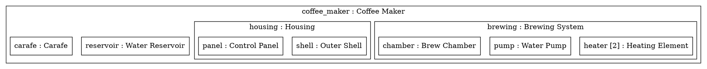

# Spec: End-to-End Pipeline (POC Item 3)

**Status:** Complete
**Owner:** Reid Westwood
**Created:** 2026-01-18 22:44:13 UTC
**Complexity:** LOW
**Branch:** visualization

---

## Business Goals

### Why This Matters

This item connects the extraction logic (Item 2, complete) to the rendering (Item 1, complete), completing the pipeline from "SysML model file → interactive diagram". It's the integration point that proves end-to-end feasibility before building the web interface.

### Success Criteria

- [x] CLI produces valid JSON loadable by Cytoscape POC from Item 1
- [x] DOT output renders correctly in Graphviz (validated syntax; manual PNG pending)
- [x] End-to-end: model → extraction → JSON → Cytoscape → diagram

### Priority

P0 (Critical) - Blocking dependency for Items 4-5 (web integration, cost annotations).

---

## Problem Statement

### Current State

- Item 1 (complete): Cytoscape demo validates rendering with embedded JSON
- Item 2 (complete): `extract_structural_view()` produces `StructuralViewResult` matching golden reference
- Gap: No way to convert extraction output to renderer formats or invoke from command line

### Desired Outcome

A CLI command that takes a model path and outputs JSON (for Cytoscape.js) or DOT (for Graphviz), enabling validation of the full pipeline without manual data transformation.

---

## Scope

### In Scope

1. **`to_cytoscape()` function** - Convert `StructuralViewResult` to Cytoscape.js elements format
2. **`to_dot()` function** - Convert `StructuralViewResult` to DOT format for Graphviz
3. **CLI entry point** via `__main__.py` supporting:
   - `uv run python -m proof_of_concept.extraction.visualization <model-path>`
   - `--format` flag: `cytoscape` (default) or `dot`
   - `--output` flag: write to file instead of stdout
   - `--root` flag: specify root element name

### Out of Scope

- Web server (Item 4)
- Interactive features beyond Day 1 POC
- Cost view extraction (Item 5)
- Dependency view extraction (Sprint 2)

### Edge Cases & Considerations

- Model path can be directory or single file
- Model not found should produce clear error message
- Empty model (no parts) should produce valid but empty output

---

## Requirements

### Functional Requirements

> Requirements from sprint plan (Day 3, lines 311-335) and epic (Item 3)

1. **FR-1**: `to_cytoscape()` MUST convert `StructuralViewResult` to Cytoscape.js elements format:
   ```json
   {
     "elements": [
       {"data": {"id": "...", "label": "...", "parent": "...", ...}},
       ...
     ]
   }
   ```

2. **FR-2**: `to_cytoscape()` MUST compute `label` field from name and multiplicity (e.g., `"heater [2]"`)

3. **FR-3**: `to_cytoscape()` MUST NOT include containment edges (Cytoscape uses `parent` property for hierarchy)

4. **FR-4**: `to_dot()` MUST produce valid DOT format with:
   - `digraph` wrapper
   - Subgraphs for compound nodes (clusters)
   - Node labels with type name
   - Containment edges (or rely on subgraph nesting)

5. **FR-5**: CLI MUST load model via syside from provided path

6. **FR-6**: CLI MUST output to stdout by default, or to file with `--output`

7. **FR-7**: CLI MUST support `--format=cytoscape` (default) and `--format=dot`

8. **FR-8**: CLI MUST support `--root` to specify root element name

9. **FR-9**: [INFERRED] CLI MUST provide clear error message if model path is invalid

---

## Acceptance Criteria

### Core Functionality

- [x] `to_cytoscape(view_result)` returns dict with `elements` key containing node data
- [x] `to_dot(view_result)` returns valid DOT string
- [x] CLI `uv run python -m proof_of_concept.extraction models/tests/coffee_maker` outputs JSON
- [x] CLI with `--format=dot` outputs DOT format
- [x] CLI with `--output file.json` writes to file

### Integration Validation

- [x] CLI JSON output can be copy-pasted into Cytoscape demo and renders correctly
- [x] CLI DOT output validated (syntax correct; manual Graphviz test pending install)

### Quality & Integration

- [x] Existing tests continue to pass (24/24)
- [x] New tests for `to_cytoscape()` and `to_dot()` functions (5 new tests)

---

## Technical Notes

### Cytoscape.js Format (from demo lines 192-216)

The demo's `convertToCytoscape()` function shows the expected format:

```javascript
// Input: ViewResult with nodes array
// Output: Array of element objects (not nested under "nodes"/"edges")
[
  {
    data: {
      id: node.id,
      label: getNodeLabel(node),  // name + multiplicity
      name: node.name,
      type_name: node.type_name,
      element_type: node.element_type,
      parent: node.parent,
      depth: node.depth,
      multiplicity: node.multiplicity
    }
  },
  // ... more nodes
]
```

Note: The demo embeds this as `elements` array directly. Containment edges are NOT included because Cytoscape.js uses the `parent` property for compound node hierarchy.

### DOT Format Example



### File Structure

```
proof_of_concept/extraction/
├── __init__.py
├── __main__.py          # NEW: CLI entry point
├── types.py             # (exists)
├── visualization.py     # ADD: to_cytoscape(), to_dot()
└── converters.py        # OPTIONAL: separate file for converters
```

---

## Related Artifacts

- **Research:** `.project/research/20260118-191541_visualization-poc-sprint-plan.md`
- **Epic:** `.project/backlog/epic_visualization-poc.md`
- **Item 1 Demo:** `proof_of_concept/cytoscape_demo.html`
- **Item 2 Extraction:** `proof_of_concept/extraction/visualization.py`
- **Golden Reference:** `proof_of_concept/golden_references/coffee_maker_structural.json`
- **Test Model:** `models/tests/coffee_maker/`

---

**Next Steps:** After approval, proceed to `/_my_design`
