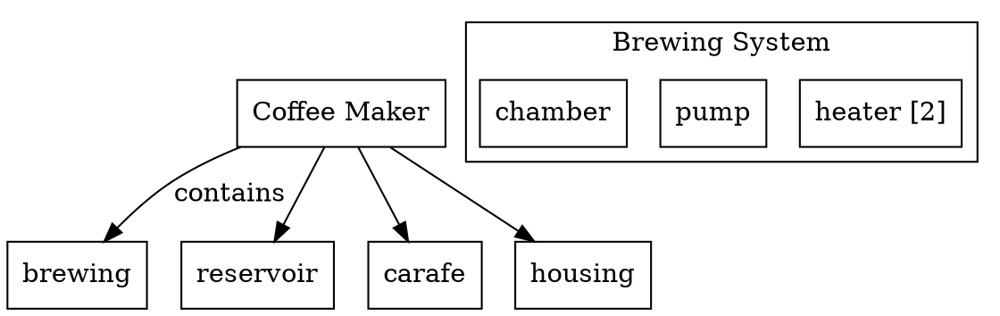

# External Tool Research

**Date**: 2026-01-17
**Purpose**: Understand data formats for graph visualization tools to design renderer-agnostic abstractions

---

## 1. SysON (Eclipse SysML v2 Tool)

### Overview

SysON is an open-source SysML v2 modeling tool built on Eclipse Sirius Web. It provides native SysML v2 visualization but uses a proprietary internal format.

### Data Format

**Internal Representation:**
- Uses JSON internally but NOT standard SysML v2 JSON format
- Elements have `@id`, `@type`, `name`, and `ownedElement` collections
- Built on SysML v2 metamodel (KerML core)

**Data Flow:**
```
SysML v2 Text → SysIDE Parser → AST → JSON Model → GraphQL → React/SVG
```

### API Access

**REST API (OMG SysML v2 Standard):**
- Base: `http://localhost:8080/api/rest/`
- Documentation: `http://localhost:8080/swagger-ui/index.html`

**Key Endpoints:**
```
GET  /projects
POST /projects
GET  /projects/{projectId}/commits/{commitId}/elements
GET  /projects/{projectId}/commits/{commitId}/elements/{elementId}
GET  /projects/{projectId}/commits/{commitId}/elements/{elementId}/relationships
GET  /projects/{projectId}/commits/{commitId}/roots
```

**Internal Communication:**
- Frontend-backend via GraphQL
- Diagram rendering via SVG
- Layout algorithms: ELK (Eclipse Layout Kernel)

### Integration Path

**Direct graph data is NOT supported.** Must use one of:
1. Generate SysML v2 text and import it
2. Use REST API to create proper SysML v2 elements

**Implication for Our Design:**
- SysON is best used as a full modeling environment
- For custom visualization, we're better off using generic graph libraries
- Could potentially export our data to SysML v2 text for SysON import

---

## 2. Generic Graph Visualization Libraries

### 2.1 Cytoscape.js

**Data Format:**
```json
{
  "elements": {
    "nodes": [
      {
        "data": {
          "id": "n1",
          "parent": "compound_parent",
          "label": "Node 1",
          "customField": "value"
        },
        "position": { "x": 100, "y": 100 },
        "classes": "class1 class2",
        "style": { "background-color": "#ff0000" }
      }
    ],
    "edges": [
      {
        "data": {
          "id": "e1",
          "source": "n1",
          "target": "n2",
          "label": "connects"
        }
      }
    ]
  }
}
```

**Required Fields:**
- Node: `data.id`
- Edge: `data.id`, `data.source`, `data.target`

**Key Features:**
- **Compound nodes**: `data.parent` for hierarchy
- **Positions**: Explicit or layout algorithms (cola, dagre, etc.)
- **Styling**: CSS-like style objects or classes
- **Selection**: `selected`, `selectable`, `locked`, `grabbable`

**Strengths for SysML:**
- Native compound/nested graphs (good for part hierarchy)
- Extensive layout algorithm support
- Good event system for interaction

### 2.2 React Flow

**Data Format:**
```json
{
  "nodes": [
    {
      "id": "1",
      "type": "default",
      "data": { "label": "Node 1" },
      "position": { "x": 100, "y": 100 },
      "style": { "backgroundColor": "#fff" }
    }
  ],
  "edges": [
    {
      "id": "e1-2",
      "type": "smoothstep",
      "source": "1",
      "target": "2",
      "label": "connection"
    }
  ],
  "viewport": { "x": 0, "y": 0, "zoom": 1 }
}
```

**Required Fields:**
- Node: `id`, `position`
- Edge: `id`, `source`, `target`

**Key Features:**
- **Custom node types**: Define React components for nodes
- **Edge types**: `default`, `straight`, `step`, `smoothstep`, `bezier`
- **Viewport state**: Persisted camera position
- **Handles**: Explicit connection points

**Strengths for SysML:**
- Rich custom node rendering (good for detailed part displays)
- Good React integration
- Built-in minimap, controls, background

**Weaknesses:**
- Limited hierarchy support (no native compound nodes)
- Explicit positions required

### 2.3 D3.js (Force-Directed)

**Data Format:**
```json
{
  "nodes": [
    {
      "id": "node1",
      "group": 1,
      "name": "Node 1",
      "fx": 100,
      "fy": 100
    }
  ],
  "links": [
    {
      "source": "node1",
      "target": "node2",
      "value": 1
    }
  ]
}
```

**Required Fields:**
- Node: `id`
- Link: `source`, `target`

**Key Features:**
- **Force simulation**: Automatic layout via physics
- **Fixed positions**: `fx`, `fy` to pin nodes
- **Groups**: Arbitrary grouping property
- **Computed during simulation**: `x`, `y`, `vx`, `vy`

**Strengths for SysML:**
- Very flexible rendering (full canvas/SVG control)
- Good for large graphs
- Excellent for dynamic/animated layouts

**Weaknesses:**
- Lower-level API (more work to set up)
- Limited hierarchy support
- Requires more custom code

### 2.4 vis.js

**Data Format:**
```json
{
  "nodes": [
    {
      "id": 1,
      "label": "Node 1",
      "title": "tooltip text",
      "x": 100,
      "y": 100,
      "fixed": false,
      "color": "#FF6B6B",
      "shape": "dot"
    }
  ],
  "edges": [
    {
      "id": "e1",
      "from": 1,
      "to": 2,
      "label": "edge label",
      "arrows": "to"
    }
  ]
}
```

**Required Fields:**
- Node: `id`
- Edge: `from`, `to` (note: different from other libraries)

**Key Features:**
- **Shapes**: `dot`, `ellipse`, `box`, `database`, `image`, etc.
- **Physics**: Built-in physics simulation
- **Fixed positions**: `x`, `y` with `fixed: true`
- **DOT import**: Can read Graphviz DOT format

**Strengths for SysML:**
- Good out-of-box appearance
- Multiple built-in shapes
- Easy to get started

**Weaknesses:**
- Limited hierarchy support
- Less customizable than Cytoscape or D3

---

## 3. Interchange Formats

### 3.1 GraphML (XML)

```xml
<?xml version="1.0" encoding="UTF-8"?>
<graphml xmlns="http://graphml.graphdrawing.org/xmlns">
  <key id="d0" for="node" attr.name="label" attr.type="string"/>
  <key id="d1" for="edge" attr.name="weight" attr.type="double"/>

  <graph id="G" edgedefault="directed">
    <node id="n1">
      <data key="d0">Node 1</data>
    </node>
    <node id="n2"/>
    <edge source="n1" target="n2">
      <data key="d1">1.5</data>
    </edge>
  </graph>
</graphml>
```

**Strengths:**
- Industry standard
- Strongly typed attributes
- Supports nested graphs (hierarchy)
- Wide tool support

**Weaknesses:**
- XML verbosity
- No native position support

### 3.2 DOT (Graphviz)



**Strengths:**
- Human-readable
- Powerful layout engines (dot, neato, fdp)
- Subgraph support for visual grouping
- Direct visualization via command line

**Weaknesses:**
- Limited attribute types
- Hierarchical grouping is visual only (not semantic)
- Less suitable for dynamic/interactive visualization

---

## 4. Common Patterns Across Tools

| Concept | Cytoscape | React Flow | D3 | vis.js | GraphML | DOT |
|---------|-----------|------------|----|----- --|---------|-----|
| **Node ID** | `data.id` | `id` | `id` | `id` | `id` attr | implicit |
| **Edge Source** | `data.source` | `source` | `source` | `from` | `source` | `->` |
| **Edge Target** | `data.target` | `target` | `target` | `to` | `target` | `->` |
| **Label** | `data.label` | `data.label` | custom | `label` | `<data>` | `label=` |
| **Position** | `position` | `position` | `x,y`/`fx,fy` | `x,y` | custom | `pos=` |
| **Hierarchy** | `data.parent` | limited | custom | limited | nested | subgraph |
| **Styling** | `style` | `style` | CSS/inline | props | custom | `[attrs]` |

---

## 5. Recommended Abstraction

Based on cross-tool analysis, here's the recommended abstraction layer:

### Minimum Viable Data

Every renderer needs:
1. **Node ID** (unique string)
2. **Edge source/target** (node IDs)
3. **Node type** (for rendering differentiation)

### Recommended Enrichments

For better visualization:
1. **Labels/names** for display
2. **Positions** (optional - can use auto-layout)
3. **Parent reference** for hierarchy
4. **Custom properties** for domain data (costs, multiplicity)
5. **Style hints** (importance, state, etc.)

### Things We CANNOT Abstract

Each renderer has unique:
1. **Layout algorithms** (must configure per-renderer)
2. **Interaction behaviors** (selection, drag, zoom)
3. **Custom node rendering** (React Flow components, Cytoscape styles)
4. **Animation/physics** (D3 force, vis.js physics)

---

## 6. Recommendation for Fusion TEA

### Primary Renderer: Cytoscape.js

**Rationale:**
1. Native compound node support for part hierarchy
2. Excellent layout algorithms (dagre for trees, cola for force-directed)
3. Good event system for interactive features
4. JSON-based - easy to generate from Python
5. Works in browser and can export SVG/PNG

### Secondary Option: React Flow

**For:**
- Rich custom node components (cost breakdowns, detailed views)
- Better React integration if building React app

### Export Options

- DOT for quick command-line visualization
- GraphML for tool interoperability
- PNG/SVG for documentation

### Integration with SysON

- Don't try to feed data directly to SysON
- Use our visualization for custom views (cost, simplified structure)
- Export to SysML v2 text if users need full SysON editing

---

## 7. Data Shape Mapping

### Our Format → Cytoscape.js

```javascript
function toCytoscape(graph) {
  return {
    elements: {
      nodes: graph.nodes.map(n => ({
        data: {
          id: n.id,
          label: n.name,
          parent: n.parentId,
          nodeType: n.nodeType,
          sysmlType: n.sysmlType,
          ...n.properties
        },
        classes: n.nodeType
      })),
      edges: graph.edges.map(e => ({
        data: {
          id: e.id,
          source: e.source,
          target: e.target,
          label: e.label,
          edgeType: e.edgeType
        },
        classes: e.edgeType
      }))
    }
  };
}
```

### Our Format → React Flow

```javascript
function toReactFlow(graph) {
  return {
    nodes: graph.nodes.map(n => ({
      id: n.id,
      type: n.nodeType,  // Custom node type
      data: {
        label: n.name,
        ...n.properties
      },
      position: n.position || { x: 0, y: 0 },  // Must provide position
      parentNode: n.parentId
    })),
    edges: graph.edges.map(e => ({
      id: e.id,
      source: e.source,
      target: e.target,
      label: e.label,
      type: 'smoothstep'
    }))
  };
}
```

### Our Format → DOT

```javascript
function toDot(graph) {
  const lines = ['digraph G {', '  node [shape=box];', ''];

  for (const node of graph.nodes) {
    const label = node.multiplicity
      ? `${node.name} [${node.multiplicity.lower}]`
      : node.name;
    lines.push(`  "${node.id}" [label="${label}"];`);
  }

  lines.push('');

  for (const edge of graph.edges) {
    const label = edge.label ? ` [label="${edge.label}"]` : '';
    lines.push(`  "${edge.source}" -> "${edge.target}"${label};`);
  }

  lines.push('}');
  return lines.join('\n');
}
```

---

## References

- [Cytoscape.js Documentation](https://js.cytoscape.org/)
- [React Flow Documentation](https://reactflow.dev/)
- [D3.js Force Simulation](https://d3js.org/d3-force)
- [vis.js Network](https://visjs.github.io/vis-network/)
- [GraphML Specification](http://graphml.graphdrawing.org/)
- [Graphviz DOT Language](https://graphviz.org/doc/info/lang.html)
- [SysON Documentation](https://doc.mbse-syson.org/)
- [Sirius Web](https://eclipse.dev/sirius/sirius-web.html)
