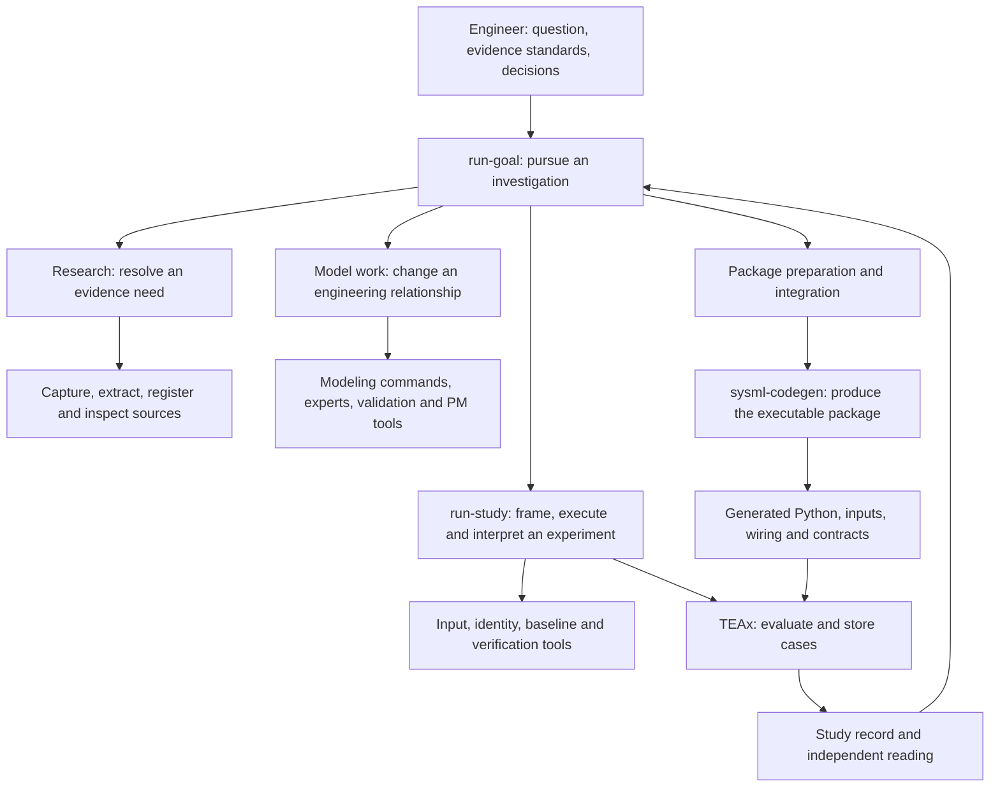
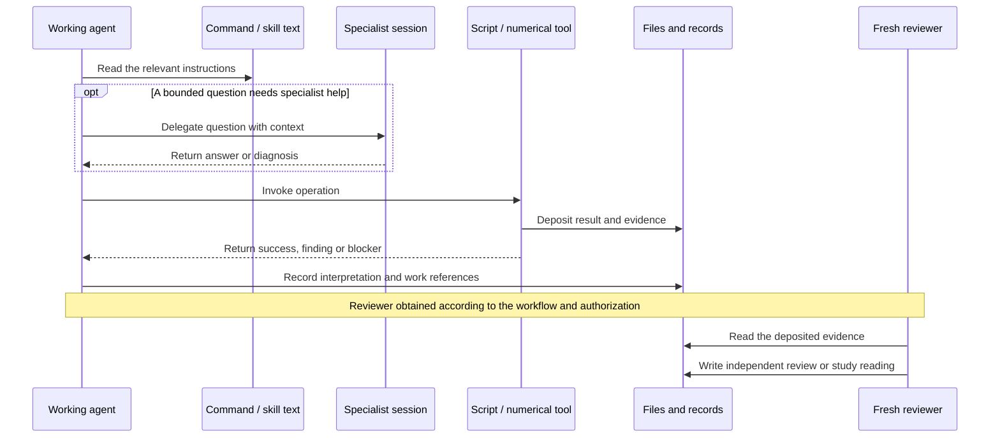
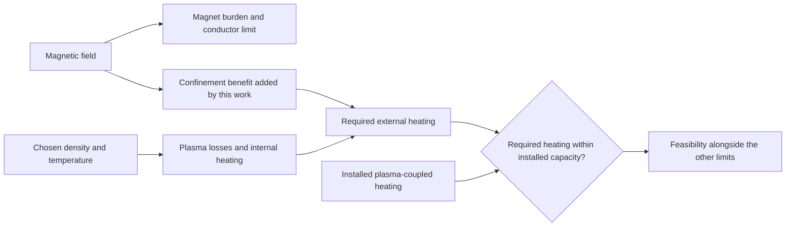
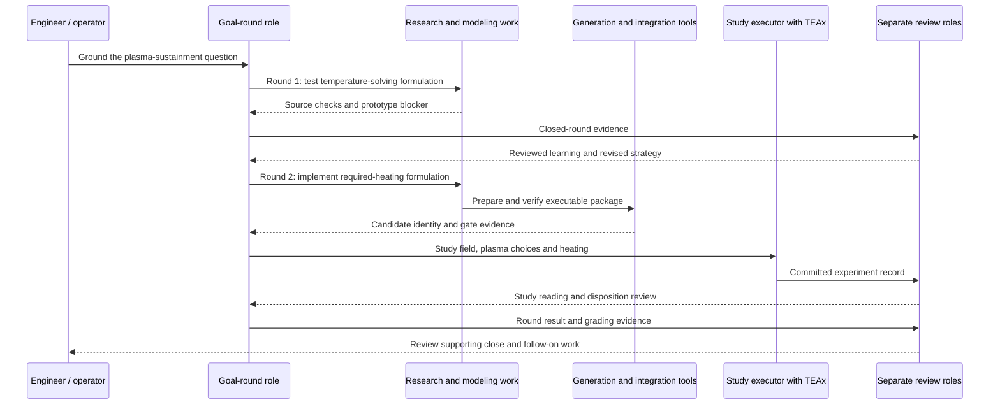

# The engineering harness

This is a map of the capabilities developed across `agentic-mbse`, `fusion-tea`, `sysml-codegen`, and `teax`: the problems they address, the parts that implement them, and the ways agents and programs combine those parts to investigate a physical system.

**Reading structure — [OWNER].** The four views and their subsections follow the structure supplied in this conversation: end goal, structural setup, behavior, and a worked `/run-goal` example. **Explanation — [AGENT].** The grouping and diagrams below are an interpretation of the inspected implementation and project records. They are not new requirements. Historical results retain their source and scope. Artifact excerpts are marked as examples, not prescribed formats.

| View | What it should make understandable |
|---|---|
| **1. Understanding the end goal** | Why this much infrastructure exists, and which parts of the engineering problem it addresses |
| **2. Structural setup** | What we have built, where it lives, and what each part owns |
| **3. Behavioral view** | How the parts compose into a harness, what invokes what, and how files carry work between sessions |
| **4. Worked example** | How an investigation used those capabilities to change a model and expose a consequential engineering tradeoff |

## 1. Understanding the end goal

### 1.1 Motivation and problem statement

“What would it take for us (humanity) to rapidly accelerate real innovation and progress in the world of physical technology?” The ambition is to improve which concepts we invest in and understand “exactly *what* needs to be demonstrated for some larger concept to be viable.” [OWNER-VERBATIM, [physical-innovation narrative][purpose], § 1.]

Fusion gives that ambition a demanding test. A promising plasma concept has to become an entire power plant: magnets or drivers, heating, fuel handling, shielding, power conversion, maintenance, and financing. An improvement in one subsystem can increase demands elsewhere. A cheap cost estimate is useful only if we can explain the machine it describes and the assumptions that make the estimate possible.

There are two complementary scales of investigation in this project. **Broad concept analysis** organizes the evidence for many approaches and estimates their economics using a shared costing library. **Detailed system modeling** connects a particular machine's engineering relationships so we can change its design and examine the consequences. Both contribute to choosing where a deeper investigation or physical demonstration is worth doing. [INHERITED: [topic catalog][catalog], §§ 2, 5.1–5.2; [concept-analysis pipeline][concept-pipeline].]

The desired feedback is concrete: which assumption makes a concept attractive, which component limits it, how much an improvement would help, and what evidence is still missing. The software supports obtaining that feedback. Hardware performance and progress in physical innovation remain outcomes to establish beyond the software itself.

### 1.2 Known challenges and limitations

The project transfers useful practices from AI-assisted software development: textual representations, version control, executable checks, bounded tasks, and review. Physical systems add problems that those practices alone do not answer. [OWNER motif, [physical-innovation narrative][purpose], § 3; specific decomposition below is AGENT.]

| Difficulty | How it appears in this work | Why it needs a distinct capability |
|---|---|---|
| **Evidence is scattered and easy to distort** | Papers disagree; PDF extraction corrupts tables; a density definition can change the meaning of an equation | Research needs source capture, extraction, indexing, and engineering interpretation |
| **Individually plausible numbers can describe an inconsistent plant** | Geometry, power, and component ratings may come from different machines or incompatible assumptions | Modeling needs explicit component relationships and a stated basis for calculations |
| **Translation can change the answer** | A reference can bind to the wrong component; a modeled constraint can disappear before execution | Code generation needs exact value identity and explicit constraint coverage |
| **A successful calculation can answer a poor experiment** | A sweep varies only one of two tied inputs, or an optimizer exploits a missing physical penalty | Studies need controlled inputs, declared ranges, and review of what the experiment can establish |
| **Long investigations outlive a session** | The next agent cannot tell what completed, why a strategy changed, or which model produced the result | Work tracking needs persistent records, bounded handoffs, and independent review |

These are observed classes of difficulty, not hypothetical reasons to add process. The [catalog][catalog], §§ 5.3–5.8, points to the extraction errors, code-generation redesign, study failures, and interrupted-work proofs that motivated the tools.

Three limits remain useful to keep in view throughout the map:

- **Numerical agreement has a scope.** Two implementations can agree while sharing the same physical assumptions. A passing check establishes the quantities and properties it actually checked.
- **The design space depends on model coverage.** A study can reveal that a design lever has no meaningful penalty. The next useful action may be a model change rather than a larger search.
- **Review and authority are part of operation.** The software can preserve evidence and enforce selected checks. Engineering interpretation and decisions still belong to the people and agent roles operating it.

### 1.3 Core problems and the capabilities built around them

The following is the first decomposition of the solution. It is a capability map: later views put repositories, tools, and calls onto the same structure.

| Capability | Engineering question | What we developed | What becomes possible |
|---|---|---|---|
| **Research and knowledge organization** | What evidence supports this equation, parameter, or design choice? | Acquisition agents, document extraction, source registration, research records, insight and citation links | A model author can inspect and reuse an evidence basis, and a reviewer can challenge it |
| **System modeling** | How do the parts of this machine fit together? | SysML libraries and designs, modeling commands, specialist agents, validation, work-item tracking | An agent can implement a bounded engineering change whose relationships remain reviewable |
| **Executable computation** | What follows from this model at a chosen design point? | SysML elaboration and code generation, Python implementations, typed runtime modules, constraint reports | The same model can be evaluated repeatedly, with visible limits and a recorded executable identity |
| **Studies** | Which choices change feasibility and cost, and why? | Study framing, input grouping, package checks, numerical evaluation, durable cases, verification, separate interpretation | Results become an inspectable experiment that can support either a design conclusion or further model work |
| **Investigation coordination** | What should we investigate next to answer the larger question? | `/run-study`, `/run-goal`, runbooks, task returns, review roles, finding dispositions | Higher-level agents can combine the capabilities and continue across sessions |

The last row depends on the others having usable boundaries. A high-level instruction such as “find what limits this design” becomes actionable because there are established ways to obtain evidence, change a model, prepare its executable package, and return a study. That dependency is the organizing reason for the harness.

## 2. Structural setup

### 2.1 Roles between the repositories

The repository boundaries separate **reusable modeling support**, **the domain investigation**, **translation**, and **execution**. The rationale in the last column is an [AGENT] explanation of the observed responsibilities; detailed implementation authority remains with the linked sources.

| Repository | Responsibility | Main things it contains | Why this boundary is useful |
|---|---|---|---|
| **`agentic-mbse`** | Give agents the tools and instructions to work with engineering models and evidence | Modeling commands and skills, specialist-agent definitions, extraction, semantic utilities, validation, PM operations | The same modeling support can serve projects beyond fusion |
| **`fusion-tea`** | Carry out the fusion investigation and join the capabilities | Domain sources, models, concept analyses, local research/study/goal procedures, integration tools, work records, results and explainers | Fusion assumptions and investigation choices have a home alongside their evidence |
| **`sysml-codegen`** | Preserve model meaning in an executable package | Elaboration, computation graphs, expression compilation, module/schema/YAML generation, snapshots and package contracts | Model authors can change the system without manually rewiring every executable dependency |
| **`teax`** | Execute typed calculation pipelines and retain study evidence | Pipeline engine, package loader, evaluators, study strategies and policies, case store and queries | Numerical execution and repeated evaluation can operate independently of a particular fusion model |

**Adjacent dependency: `1costingFE`.** This is the shared costing library used by the broad concept-analysis route. It also supplied the comparison target for the stellarator cost-account handshake. It belongs in the landscape even though the requested structural map centers on the four repositories above. The current source of engineering relationships in the SysML route is the model and its implementation. [INHERITED: [catalog][catalog], §§ 2 and 5.5.]

### 2.2 Key terms and component types

These terms are the legend for the rest of the map. They describe what an item is, independently of which repository contains it.

| Type | Meaning | Example |
|---|---|---|
| **AI instructions** | A prompt, command, skill, or runbook that guides a session's judgment and work | `/research`, `/implement-model`, `/run-study`, `/run-goal` |
| **Agent session** | The running AI process following instructions with a particular task and context | A model author, a specialist helper, a fresh study reader |
| **Mechanistic tool** | Code that performs a defined operation and returns a result | Source registration, `agentic-mbse pm`, generation, preflight checks |
| **AI-calling program** | Code that prepares prompts and invokes an AI process as part of its operation | Concept-analysis iteration, selected PDF enhancement |
| **Engineering artifact** | Stored source material, model declarations, executable inputs, or results | A paper, `.sysml` file, generated package, point table |
| **Coordination artifact** | A file recording intent, state, decisions, evidence references, or the meaning of a result | A work-item spec, goal trail, study reading, discovery-log disposition |

A command name is not a separate process by itself. A session can follow several commands, and a command can ask that session to delegate a bounded question. This distinction belongs in the diagram legend because it determines what an arrow means.

**Pipeline** names an ordered transformation or execution, such as document extraction or model-to-Python generation. **Harness** names the broader combination of instructions, callable tools, records, and checks that lets an agent use those pipelines toward an engineering objective. This explanatory definition is [AGENT]; the goal and study runbooks supply the concrete operating procedures.

### 2.3 `agentic-mbse`: reusable modeling and evidence capabilities

This repository equips a session to author models, obtain relevant language knowledge, validate work, and leave usable records. Its separation of instructions from executable PM operations addresses a practical problem: asking an agent to remember project state is less reliable than having it call an operation that updates a structured registry.

| Responsibility | AI instructions and helpers | Mechanistic tools and shared material | Output or record |
|---|---|---|---|
| **Find and interpret evidence** | `/research`, `/manage-sources`; PDF-analysis and source-traceability skills | Extraction pipeline, web capture, section indexes and source-index conventions | Extracted sources, research reports, source references |
| **Specify and design a model change** | `/spec-model`, `/design-model`, `/plan-model` | SysML conventions and pattern documentation | Modeling specification, design and implementation plan |
| **Implement and examine models** | `/implement-model`, `/review-model`, `/audit-models`, `/analyze-models` | Model validation and semantic utilities | SysML changes, validation results, review findings |
| **Answer specialist questions** | `sysml-expert`, `kerml-expert`, `syside-expert`, `sysmlv2-validator`, `python-debugger` | Language references and debugging support | A bounded answer or diagnosis returned to the calling session |
| **Keep work and knowledge connected** | `/backlog`, `/status`; requirements-tracking and record-learning skills | `pm add-item`, `close-item`, `save-research`, `approve-research`, `add-insight`, `trace-element`, `add-validation`, `impact-query` | Work registry, approved research, insights, traceability and validation entries |

**Homes:** [`claude/commands/`][mbse-commands], [`claude/agents/`][mbse-agents], [`claude/skills/`][mbse-skills], and [`src/agentic_mbse/`][mbse-src]. Project installation exposes much of this under `fusion-tea/.claude/` through symlinks. The local path is an access point to reusable instructions, not a second implementation.

**A substantial component inside this component: extraction.** The extractor combines a base PDF text pass, table detection, an arXiv HTML route where available, and selected AI page enhancement. These choices came from testing tools against real documents: fast text extraction, table recovery, and equation transcription had different strengths. The source document and page images remain important because better extraction still makes mistakes. See [extraction internals][extraction].

### 2.4 `fusion-tea`: domain work and the tools that join it

This repository contains both the engineering subject and the local operating environment. Its first-level responsibilities include a breadth-oriented concept pipeline and the deeper SysML/study route.

| Responsibility | AI entry points | Code and data homes | What the capability returns |
|---|---|---|---|
| **Compare concepts broadly** | `/manage-concept`; analysis, model-setup, assessment and source-acquisition prompts | `exploration/concept_analysis/`; `knowledge/concept_research/`; 1costingFE-backed models | A concept dossier, executable cost setup, assessment and review history |
| **Acquire missing evidence** | `/research-acquire` | `scripts/research_seam.py`, `source_registry.py`, `holdout_guard.py`; `knowledge/research/requests/` | Registered sources, queued candidates, or a bounded negative supported by receipts |
| **Maintain fusion knowledge and models** | Installed modeling commands | `knowledge/`, `models/library/`, `models/designs/`, `modeling_project/`, `work/` | Sourced model definitions, particular machine designs, reviewed model changes |
| **Prepare and verify executable packages** | Modeling implementation and completion instructions | `exploration/stellarator_e2e/generated/`; `scripts/integrate.py` | A checked candidate package and identity, or a named blocker |
| **Operate studies** | `/run-study` | `scripts/study/`; `exploration/*/studies/`; local study definitions and routes | Committed experiment records and separate interpretations |
| **Pursue larger questions** | `/run-goal` | `work/orchestration/GOAL_RUNBOOK.md`, goal templates and goal directories | Reviewed learning, a changed strategy, follow-on work, or a close recommendation |
| **Present and inspect the work** | `/narrate-goal`, browser-inspection support | `work/narratives/`, `docs/demo/`, concept/score explorers | Human-readable stories, reports and visual exploration |

The smaller scripts are worth naming because they make high-level instructions concrete:

| Tool family | Individual components | Job |
|---|---|---|
| **Source handling** | `zotero_ingest.py`, `zotero_lib.py`, `sync_research.sh` | Ingest library material and synchronize research binaries |
| **Research bookkeeping** | `research_seam.py`, `source_registry.py`, `holdout_guard.py` | Record bounded acquisition, register captured evidence, screen restricted sources |
| **Package integration** | `integrate.py` | Run the package-readiness checks and return `CANDIDATE` or `BLOCKER` |
| **Study preparation** | `indicators.py`, `manifest.py`, `identity.py`, `preflight.py` | Trace proposed inputs, describe the package, establish identity, and check readiness |
| **Study verification** | `verify.py` and the package-owned checking calculation | Compare sampled numerical outputs and re-derive constraint verdicts within stated coverage |
| **Study route** | `exploration/stellarator_e2e/studies/study_route.py` | Load the package through TEAx, construct complete proposals, run cases and export results |
| **Record checks** | `tests/study/test_records.py`, `tests/orchestration/test_goal_contract.py` | Check selected structural obligations and links between recorded findings and follow-up |

Homes: [`scripts/`][scripts], [study tools][study-tools], [goal runbook][goal-runbook], [concept pipeline][concept-pipeline]. The tests check specific recorded obligations; they do not decide whether an engineering interpretation is sound.

### 2.5 `sysml-codegen`: from a system model to runnable calculations

The generator has two jobs that deserve separate boxes in the structural view. First it resolves the actual system described by the model, including repeated component occurrences and their bindings. Then it renders that resolved structure into executable files. Resolving “which instance supplies this value?” before rendering avoids trying to reconstruct engineering meaning from generated names.

| Internal responsibility | Main home | Product |
|---|---|---|
| **Read and resolve the model** | `extraction/`, `elaboration/` | A graph with explicit component/value identities and dependencies |
| **Construct one generation input** | `orchestration/`, `resolution/models.py` | The computation graph consumed by generation |
| **Generate executable structure and supported equations** | `generation/`, expression compilation | Python modules, typed schemas, input files, pipeline YAML, registry and constraint reporting |
| **Support calculations needing maintained Python** | Generated package `handwritten/`; completion instructions | Implementations for numerical methods beyond supported generated expressions |
| **Capture and identify the result** | `snapshot/`, `contracts/` | A reusable model snapshot and contracts identifying the model and package bytes |

The distinction between a **library definition** and a **particular occurrence** matters here. If a machine contains several uses of one component definition, they can have different values and connections. The generator must preserve each occurrence through to runtime inputs and outputs. The historical name-resolution failures and replacement architecture are documented in [the architecture overview][codegen-architecture] and its linked decisions.

One directory name needs care: `handwritten/` also contains auto-implemented expressions. Its name does not establish that a person or agent wrote every file. The inspected winding-pack implementation declares `AUTO_IMPLEMENTED = True`; the plasma-sustainment numerical implementation declares `False`. Section 3.5 shows the distinction using actual files.

### 2.6 `teax`: one calculation, many cases, durable evidence

TEAx separates executing a connected calculation from operating a study over many inputs. This lets the numerical machinery be reused without embedding fusion-specific assumptions in the runtime.

| Layer | Responsibility | Main home |
|---|---|---|
| **Core pipeline** | Validate typed module connections, execute dependencies, route outputs | `simkit/config/`, `simkit/core/pipeline_executor.py` |
| **Package evaluation** | Load a sealed generated package, prepare its graph, evaluate one case and assemble evidence | `simkit/evaluation/` |
| **Study definition** | Propose candidate points, translate them to inputs, assess the result | `simkit/study/definition.py`, `strategy.py`, `bridge.py`, `policy.py` |
| **Study operation** | Repeat evaluation, retain attempts and cases, resume under compatible identities | `simkit/study/runner.py`, `store.py`, `compatibility.py` |
| **Inspection** | Read stored cases and expose CLI operations | `simkit/study/query.py`, `cli.py` (`teax-study`) |

A violated physical constraint is an answer about a candidate. Broken execution is a different outcome. Constraint coverage is also explicit: “every assessed constraint passed” cannot silently become “every required constraint was assessed and passed.” That distinction is essential when an agent uses results to steer a search. See [evaluation and studies][teax-studies].

**A current integration limit:** the September 5 investigation found that some plain numeric outputs reached the pipeline exit but were dropped while constructing study evidence. That narrows what “recorded outputs” means for the inspected package. It is a concrete defect at the evaluation/publication boundary, not a reason to redraw the entire pipeline. See [blank-study-column research][blank-columns].

## 3. Behavioral view of the system

### 3.1 How the capabilities compose into a harness

This is an **operating hierarchy**, not a process tree. A box means a responsibility the agent can use. The next subsection distinguishes reading instructions, executing code, and starting another session.



The composition enables work at different heights. An engineer can run extraction directly, ask for one model change, or request a study without opening a goal. `/run-goal` adds the question of what work should happen next when research, modeling, and studies must be combined.

There is also a **separate breadth route** in `fusion-tea`: `/manage-concept` operates concept analysis built around 1costingFE. Its iteration program invokes analysis, executable model setup, and assessment, with feedback and source acquisition feeding subsequent passes. This is another implemented composition of agents and tools. It is not a mandatory step under the SysML goal hierarchy. [Sources: [concept pipeline][concept-pipeline], [concept AI invocation helper][concept-ai].]

### 3.2 What invokes what

The system has several kinds of interaction. Putting distinct labels on the arrows makes “agents invoking agents” visible without inventing a fixed swarm of processes.

| Caller | Arrow means | Recipient | Result |
|---|---|---|---|
| Agent session | **Follows instructions** | `/run-goal`, `/run-study`, modeling command or skill | The same session adopts a procedure or role |
| Modeling/research session | **Delegates a bounded question** | A specialist or exploration session | A focused answer, interpretation, or diagnosis |
| Agent session | **Runs a program** | PM operation, extraction, generation, preflight, TEAx | A process return and deposited artifacts |
| Concept-analysis program | **Launches AI with a prepared prompt** | Analysis, model-setup, review or other AI step | Output captured and validated by the program |
| PDF extraction program | **Launches AI for selected page work** | Claude page enhancement | Recovered page content |
| Author/executor | **Hands over recorded evidence** | Fresh reviewer or study administrator | A separately produced reading or review |

The concrete specialist calls include `/research` requesting `Explore`, `general-purpose`, `sysml-expert`, or `kerml-expert` help, and `/implement-model` requesting validation/language help when validation fails. These are documented call options in the [research command][research-command] and [implementation command][implement-command]. The code-to-AI calls are implemented in the [concept helper][concept-ai] and [PDF enhancement helper][pdf-ai].



**Session boundary in the worked goal.** The default goal runbook calls for an operator handoff when a fresh review is needed. The selected historical goal records specific owner authorization to spawn non-author reviewers. Its example therefore supports a delegated review sequence. It does not establish that every `/run-goal` invocation automatically launches the same process tree. The available evidence is the deposited prompts, returns and trail, not a complete platform process log. [Sources: [goal runbook][goal-runbook], § What “fresh” means; [example trail][example-trail], Owner directive.]

### 3.3 The artifacts integrate the components

A session can reason across the whole investigation, but each capability returns something with a concrete home. These returns are the interfaces through which a higher-level agent operates the system.

| Boundary | Input | Return | What the next consumer can establish |
|---|---|---|---|
| **Research request → source basis** | Question, admissible sources, search/capture limits | Captured sources, registration receipts and bounded return | What was obtained and what is still missing |
| **Model task → reviewed change** | Change objective, evidence, invariants and work item | Model files, spec/design/plan, validation and review | What relationship changed and how it was checked |
| **Model/package work → study candidate** | Prepared package and expected model/tool lineage | Integration evidence and `CANDIDATE` identity or `BLOCKER` | Which executable is ready to study |
| **Study execution → study reading** | Candidate package, question, declared inputs and experiment | Committed record containing results and their basis | What ran, what it assumed, and what it found |
| **Study reading → next work** | Findings and proposed consequences | Reviewed dispositions linked to records or work items | Why another research/model task is justified |

Package **preparation** changes or completes the executable. **Integration** checks the prepared result, including rerunning producers and requiring them to leave package bytes unchanged. This boundary prevents “ready for study” from quietly including an unexplained model change. [Source: [integration guide][integration-guide].]

Two different graphs meet at that boundary:

- **The engineering dependency graph** connects machine choices to calculations and constraint verdicts. Codegen and TEAx execute it.
- **The work dependency graph** connects questions to research, model changes, experiments and decisions. Agents operate it through instructions and records.

A study result travels back from the engineering graph into the work graph. That feedback is what allows the harness to improve the model it is using.

### 3.4 The filesystem “database”

The shared filesystem holds much of the system's memory. Files play several roles: source evidence, structured state, executable artifacts, numerical records, and arguments. They are read together, but they are not all governed by the same writer or storage mechanism.

```text
fusion-tea/
├── knowledge/                         Evidence and its interpretation
│   ├── SOURCE_INDEX.md                Where registered sources live
│   ├── KNOWLEDGE.md                   Domain insights (DI identifiers)
│   ├── concept_research/              Concept dossiers and captured sources
│   └── research/                      Pending/approved research; acquisition requests
├── modeling_project/                  Investigation intent and modeling rules
│   ├── REQUIREMENTS.md
│   └── VALIDATION_MATRIX.md           Named verification criteria and records
├── models/
│   ├── library/                       Reusable component/calculation definitions
│   └── designs/                       Particular machine compositions and bindings
├── work/                              Modeling work and goal coordination
│   ├── BACKLOG.md                     Structured modeling work registry
│   ├── active/ and completed/         Work-item specs, designs, plans and reviews
│   └── orchestration/goals/<goal>/
│       ├── goal.md                    Question and conditions for answering it
│       ├── trail.md                   Strategies, task scopes/returns and decisions
│       ├── learnings.md               Reviewed learning
│       └── evidence/                  This example's deposited task/review material
├── exploration/
│   ├── concept_analysis/              Breadth pipeline and per-concept iterations
│   └── stellarator_e2e/
│       ├── generated/                 Executable package, inputs, wiring and contracts
│       └── studies/
│           ├── DISCOVERY_LOG.md       Findings joined to follow-up dispositions
│           └── <study-id>/            Definition, snapshot, results, record, reading
└── .project/                          Coding work, research and tool-design decisions
```

This is a selected layout, not a claim that every directory has the same schema. The storage rules differ by responsibility:

| Record family | State and identity | Who writes it |
|---|---|---|
| **Modeling PM** | YAML frontmatter plus directory contents; typed identifiers connect work, insights and verification | Deterministic `agentic-mbse pm` operations own registry mutations; modeling workflows own their work artifacts |
| **Concept analysis** | Artifact existence, frontmatter, feedback files and iteration directories | The concept pipeline's operations and review procedures |
| **Goals** | Prose question, chronological trail, reviewed learnings, references to underlying records | Operator, round agent and reviewer under the goal procedure |
| **Generated package** | Model contract, package seal, file hashes and declared runtime interface | Code generation and package preparation; verification checks the result |
| **TEAx study cases** | SQLite case/attempt records plus content-addressed evidence files | TEAx store and runner |
| **Study explanation** | Committed record, results, snapshot and separate synthesis | Executor deposits the record; administrator reads it and writes the synthesis |

The TEAx store is an actual SQLite database with a controlled writer and durable evidence handling. The broader project uses files and frontmatter as a coordination store. Describing the entire system as “no database” would erase that distinction. [Sources: [project structure][claude], [concept pipeline][concept-pipeline], [TEAx store][teax-store].]

**Links act like joins.** A model comment points to its source and basis. A work item points to the model change. A task return points to the work item or study. A discovery-log entry uses a study finding identifier to connect the result to its disposition. A package fingerprint tells a study which executable it used. These links make the evidence chain traversable without copying every record into the goal trail.

**Recovery is a read operation before it is another execution.** If a session stops after completing work but before recording its return, the next session reads the underlying work and study artifacts to establish what happened. It then completes the record or writes a stop. It does not infer that missing prose means the task must run again. [Source: [goal runbook][goal-runbook], § Resuming an interruption.]

### 3.5 What the data actually looks like

These are small windows into real artifacts. They show different representations of the same investigation. Current model/package examples illustrate structure; the historical study examples belong to their recorded September 1 package. They are not a claim that today's package is byte-identical to the historical one.

#### A. A goal stores a question, not an executable task list

[EXAMPLE: verbatim question from the historical [goal file][example-goal]. Its recorded provenance is AGENT under owner delegation.]

> Can the plasma operating point be solved from the machine — a confinement or transport relation linking field and heating power to density and temperature, with a beta, density, or power limit pushing back on the choice — instead of prescribed as typed-in density, temperature, and profile inputs?

The surrounding file adds the consumer, conditions for answering, invariants, limits, and reserved decisions. The trail records how an attempt develops. That separation leaves room for a strategy to fail without losing the question.

#### B. A SysML constraint expresses the engineering comparison

[EXAMPLE: excerpt from [the sustainment constraint][sustainment-constraint], with its documentation and comments omitted.]

```sysml
constraint def 'Sustainment Limit' {
    in attribute p_aux_required_in : Real;
    in attribute p_aux_installed_in : Real;
    p_aux_required_in <= p_aux_installed_in
}
```

This says that the heating required to maintain a plasma state cannot exceed the installed heating delivered to it. The full source carries the source/ref/basis citation. A machine instance supplies the actual calculated requirement and installed capacity.

#### C. Generated Python gives that comparison a runtime interface

[EXAMPLE: exact class excerpt from the current [generated constraint module][generated-constraint].]

```python
class StellarisSustainmentOkConstraintInput(BaseModel):
    """Exact input schema: one field per resolved formal."""
    p_aux_required_in: float
    p_aux_installed_in: float
```

The rest of that module validates the inputs, calls the generated predicate, and returns a structured evaluation containing the constraint identity, verdict, margin, and observed operands. A physical violation is retained as data.

For arithmetic, the inspected [winding-pack implementation][winding-impl] is auto-generated from model expressions. The [plasma-sustainment implementation][sustainment-impl] instead contains maintained integration and iteration code. Both are called through generated module interfaces.

#### D. Pipeline YAML connects the outputs of one calculation to another

[EXAMPLE: exact wiring excerpt from the current [generated pipeline][generated-yaml].]

```yaml
stellarator_09__stellaris__sustainment_ok__77add152ed8eafce:
  module_type: stellarator_09.StellarisSustainmentOkConstraintModule
  inputs:
    p_aux_required_in: float stellarator_09__stellaris__sustain__p_aux_required
    p_aux_installed_in: float stellarator_09__stellaris__heat__p_coupled
  outputs:
    evaluation: ConstraintEvaluation stellarator_09__stellaris__sustainment_ok__77add152ed8eafce__evaluation
```

The long names preserve which machine occurrence and output supply each value. The explanatory view can label the two arrows “required heating” and “available coupled heating”; the underlying artifact makes those arrows executable.

#### E. A study declaration keeps one physical choice connected to all its inputs

[EXAMPLE: selected fields from the historical [axis declaration][example-axes], with explanatory notes omitted.]

```json
{
  "axis": "p_input+tie",
  "keys": [
    {"key": "stellarator_09__stellaris__p_input", "provenance": "fan_out"},
    {"key": "stellarator_09__stellaris__p_ecrh", "provenance": "tie"}
  ]
}
```

In that model version, installed plasma heating and the heating cost account used separate inputs for the same physical choice. The declaration keeps them moving together. Otherwise the study could increase available heating without paying for the corresponding equipment.

#### F. The result has both a numeric record and a separate interpretation

[EXAMPLE: selected values from the historical [administrator recount][example-reading]; this is an explanatory table, not the CSV schema.]

| Recorded quantity | Value |
|---|---:|
| Evaluated rows at 50 MW in the field-density grid, including baseline | 154 |
| Feasible rows in that slice | 0 |
| Evaluated rows across the entire study | 334 |
| Feasible rows across the entire study | 9 |
| Best observed feasible electricity cost | About 293.468 $/MWh |

The CSV supplies individual point values and verdicts. The study record describes assumptions, ranges, exclusions and checking coverage. The separate reading argues that the low-heating design faces a conflict between confinement and conductor capability. Those are complementary artifacts: a table of numbers alone does not carry the engineering conclusion.

## 4. Worked example: can the machine sustain the chosen plasma?

### 4.1 The question that made the investigation necessary

An earlier stellarator study revealed an odd incentive. Stronger magnetic field made the magnets more demanding and affected the plasma-pressure check, but the model gave it no benefit for improved confinement. The preferred design therefore moved toward low field. The calculation exposed a missing relationship in the model.

The investigation named `operating-point-closure` asked whether the machine could actually sustain the assumed plasma density and temperature. This is the user's [EXAMPLE] of `/run-goal`: it exercises the research, modeling, computation, study, and review capabilities against one engineering question. It began on September 1 and closed on September 2, 2026. [Sources: [narrative][example-narrative], [goal][example-goal], [trail][example-trail].]

The relevant causal change is compact:



This is an explanatory dependency sketch of the model change. The exact equations and numerical choices are in the [archived design][example-design].

### 4.2 Round 1: use research and a prototype to test the proposed formulation

The first strategy attempted to compute plasma temperature from steady-state power balance. The modeling workflow created WI-037 and a reviewable specification. The next task examined already available source equations against page images and exercised them in a prototype. This run did not invoke a new literature-acquisition campaign.

The prototype reproduced the reference equation chain closely enough to support its use, and it caught a consequential definition: the confinement relation uses line-averaged density. Substituting volume-averaged density missed the reference confinement time by about 23%. It also found no stable, feasible burn solution inside the modeled limits for the proposed temperature-solving formulation. [Historical findings: [prototype notes][example-prototype], [round-1 review][round1-review].]

| Capability used | Concrete work | Artifact returned |
|---|---|---|
| **Modeling PM and specification** | Create and scope WI-037 | Work-item specification and task return |
| **Research interpretation** | Check admissible source equations and definitions against the original pages | Source basis and prototype notes |
| **Computation** | Exercise the proposed equation chain before production implementation | Prototype outputs supporting `STRATEGY_BLOCKER` |
| **Fresh review** | Reproduce and assess the blocker | Accepted learning and the next strategy |

The goal retained an actionable result: keep density and temperature as choices, then compute the heating required to sustain them. The first round ended before a production model change, package promotion, or study. That is what the bounded prototype bought: evidence about the architecture before committing to it.

### 4.3 Round 2: carry the revised relationship through the stack

The second round amended the specification, designed and implemented the new calculation, prepared the executable package, and used integration to establish the study candidate. The same engineering relationship crossed the representations shown in § 3.5.

| Layer | What changed or ran | Where to inspect it |
|---|---|---|
| **Modeling intent** | The work now computes required heating for a chosen plasma state | WI-037 [specification][example-spec] and [design][example-design] |
| **SysML model** | Add confinement, radiation, ash/fuel balance, and required-versus-installed heating | [Plasma sustainment][sustainment-model] and [viability constraint][sustainment-constraint] |
| **Numerical implementation** | Implement the coupled ash calculation and profile integrals behind a generated interface | [Implementation plan][example-plan]; current structural counterpart in [Python][sustainment-impl] |
| **Package preparation** | Regenerate wiring, schemas and executable material; retain the intended numerical implementation | Goal trail T-004 and its preparation references |
| **Integration** | Check the prepared package and return a candidate with ten passing gates | [Historical integration return][example-integration] |
| **Study execution** | Evaluate the declared points through TEAx and retain the outputs, verdicts and verification | [Study definition][example-study] and [record][example-record] |

Package identities keep this account anchored to the historical run. The current source files are useful for seeing the implementation's shape; historical numerical claims come from the committed study and its reviewed records.

### 4.4 The study turns the model change into an engineering finding

The study examined coil current and density at two installed plasma-heating levels, plus temperature and heating transects. Coil current is the field lever in this model. A pre-execution critique added the higher-heating grid so the experiment could examine a feasible region as well as the expected low-heating failure.

**At 50 MW delivered to the plasma, all 154 evaluated grid rows were infeasible.** Some higher-field points did meet the heating requirement, but every one of those exceeded the conductor's peak-field limit. Raising field solved one problem by running into another.

**At 110 MW, a feasible region appeared in the tested window.** The best observed feasible point cost about 293.468 $/MWh. Across the whole study, nine of 334 evaluated rows were feasible. Four feasible rows had 110 MW heating: three belonged to the grid proper and one was a heating-transect point labeled as a grid point in the export. These counts follow the [administrator's recount][example-reading]; the narrative's sentence assigning all nine to 110 MW is inaccurate.

The important result is the constraint conflict, not the headline cost. Giving field its confinement benefit made conductor capability relevant in a new way. Installed heating could open a feasible region, but the heating model was still too coarse to distinguish electrical input, hardware output, and the power actually delivered to the plasma.

A useful visual for this subsection is a pair of field-density maps at 50 and 110 MW, with colors identifying the constraints that reject each point. The map should include excluded points and identify its sampled window. The committed CSV and record are the figure sources; a smooth boundary between samples would be an interpolation and should be labeled accordingly.

### 4.5 The agent and artifact trace

The two rounds can now be located within the hierarchy rather than presented as a generic list of workflow stages.



This shows **recorded roles and evidence handoffs**. The research/modeling lane can include the round session following native commands; it does not assert a separately spawned agent for every cell. The review lane groups several separate responsibilities: the study administrator, disposition critic, grader, and round reviewer. The goal's explicit delegation authorized non-author review sessions for this example.

The coordination files remain small relative to the evidence they connect. `goal.md` states the question; `trail.md` connects each task to its result; `learnings.md` carries reviewed learning. The model work lives in WI-037, the prototype in its evidence directory, and the experiment in its study directory. A later agent can follow those references to reconstruct both what changed and why.

### 4.6 What this demonstrates, and what remains open

The operator accepted the result and closed the goal. The frozen physics rubric moved from 2 to 3 for the relevant subsystem. Two follow-on work items made the engineering consequences concrete: WI-038 for conductor capability and WI-039 for heating-system structure. [Historical outcome: [goal close in the trail][example-trail] and the reviewed study findings.]

The demonstration connects all four views. An engineering gap supplied the purpose. The repositories supplied reusable capabilities. Agents and scripts operated those capabilities through persistent artifacts. The resulting model exposed a conflict that changed what the investigation should examine next.

The record also exposes limits: ten proposed study points were excluded before evaluation; several internal numerical quantities were provided through the checking calculation rather than independently compared generated outputs; the study needed corrections to its prose and arm labels. The later [publication-boundary investigation][blank-columns] locates the output-loss mechanism more precisely. These are inspectable limits of the evidence, not reasons to treat the entire run as either validated physics or a failed experiment.

**Evidence scope for this synthesis — [AGENT].** This revision directly inspected the motivation, topic catalog, project structure, goal/study entry points and runbook sections, the concept pipeline and its AI invocation code, the code-generation architecture, TEAx evaluation/store descriptions and source, representative model/generated artifacts, and the selected goal's narrative and native records. It incorporates the earlier synthesis's source investigation where cited. No studies or physics calculations were rerun. Quarantined hold-out material was not opened. The independent ARIES-CS comparison remains a planned demonstration in the supplied narrative's timeframe; its results are not evidence here.

[purpose]: /home/reid/1cfe/fusion-tea/.project/concepts/physical-innovation-narrative.md
[catalog]: /home/reid/1cfe/fusion-tea/.project/research/20260904-135403_blog-series-topic-catalog.md
[claude]: /home/reid/1cfe/fusion-tea/CLAUDE.md
[concept-pipeline]: /home/reid/1cfe/fusion-tea/docs/concept-pipeline/pipeline.md
[concept-ai]: /home/reid/1cfe/fusion-tea/exploration/concept_analysis/scripts/lib/claude.py
[mbse-commands]: /home/reid/1cfe/agentic-mbse/claude/commands/
[mbse-agents]: /home/reid/1cfe/agentic-mbse/claude/agents/
[mbse-skills]: /home/reid/1cfe/agentic-mbse/claude/skills/
[mbse-src]: /home/reid/1cfe/agentic-mbse/src/agentic_mbse/
[extraction]: /home/reid/1cfe/agentic-mbse/docs/extraction-internals.md
[scripts]: /home/reid/1cfe/fusion-tea/scripts/
[study-tools]: /home/reid/1cfe/fusion-tea/scripts/study/
[goal-runbook]: /home/reid/1cfe/fusion-tea/work/orchestration/GOAL_RUNBOOK.md
[codegen-architecture]: /home/reid/1cfe/sysml-codegen/docs/architecture/overview.md
[teax-studies]: /home/reid/1cfe/teax/docs/evaluation-and-study.md
[teax-store]: /home/reid/1cfe/teax/packages/teax-simkit/simkit/study/store.py
[blank-columns]: /home/reid/1cfe/fusion-tea/.project/research/20260905-091948_blank-study-column-root-cause.md
[research-command]: /home/reid/1cfe/agentic-mbse/claude/commands/research.md
[implement-command]: /home/reid/1cfe/agentic-mbse/claude/commands/implement-model.md
[pdf-ai]: /home/reid/1cfe/agentic-mbse/src/agentic_mbse/extraction/claude_enhance.py
[integration-guide]: /home/reid/1cfe/fusion-tea/docs/integration_seam_operator_guide.md
[example-trail]: /home/reid/1cfe/fusion-tea/work/orchestration/goals/operating-point-closure/trail.md
[example-goal]: /home/reid/1cfe/fusion-tea/work/orchestration/goals/operating-point-closure/goal.md
[sustainment-constraint]: /home/reid/1cfe/fusion-tea/models/library/analyses/mfe_viability.sysml:201
[generated-constraint]: /home/reid/1cfe/fusion-tea/exploration/stellarator_e2e/generated/modules/stellarator_09/stellarissustainmentokconstraintmodule.py
[winding-impl]: /home/reid/1cfe/fusion-tea/exploration/stellarator_e2e/generated/handwritten/mfe_magnet_cost/winding_pack_cost_impl.py
[sustainment-impl]: /home/reid/1cfe/fusion-tea/exploration/stellarator_e2e/generated/handwritten/mfe_plasma_sustainment/plasma_sustainment_impl.py
[generated-yaml]: /home/reid/1cfe/fusion-tea/exploration/stellarator_e2e/generated/pipelines/pipeline.yaml:985
[example-axes]: /home/reid/1cfe/fusion-tea/exploration/stellarator_e2e/studies/20260901-sustainment-fence/axes.json
[example-reading]: /home/reid/1cfe/fusion-tea/exploration/stellarator_e2e/studies/20260901-sustainment-fence/synthesis.md
[example-narrative]: /home/reid/1cfe/fusion-tea/work/narratives/20260904-184254Z-operating-point-closure.md
[example-design]: /home/reid/1cfe/fusion-tea/work/completed/20260902_WI-037_operating-point-closure/design.md
[example-spec]: /home/reid/1cfe/fusion-tea/work/completed/20260902_WI-037_operating-point-closure/spec.md
[example-plan]: /home/reid/1cfe/fusion-tea/work/completed/20260902_WI-037_operating-point-closure/plan.md
[example-prototype]: /home/reid/1cfe/fusion-tea/work/orchestration/goals/operating-point-closure/evidence/T-002_prototype/NOTES.md
[round1-review]: /home/reid/1cfe/fusion-tea/work/orchestration/goals/operating-point-closure/evidence/round1_review.md
[sustainment-model]: /home/reid/1cfe/fusion-tea/models/library/analyses/mfe_plasma_sustainment.sysml
[example-integration]: /home/reid/1cfe/fusion-tea/work/orchestration/goals/operating-point-closure/evidence/T-004_integration_return.json
[example-study]: /home/reid/1cfe/fusion-tea/exploration/stellarator_e2e/studies/20260901-sustainment-fence/study.py
[example-record]: /home/reid/1cfe/fusion-tea/exploration/stellarator_e2e/studies/20260901-sustainment-fence/record.md
