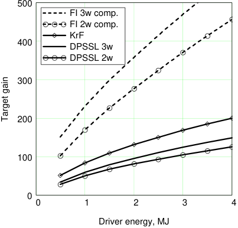
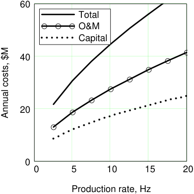
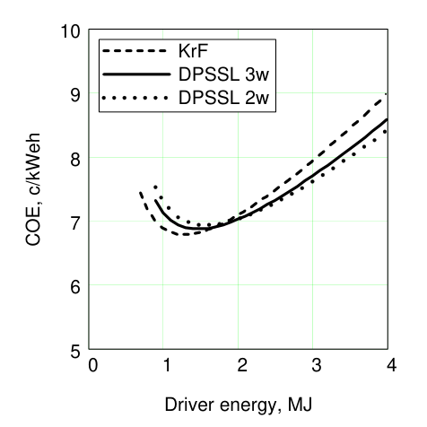
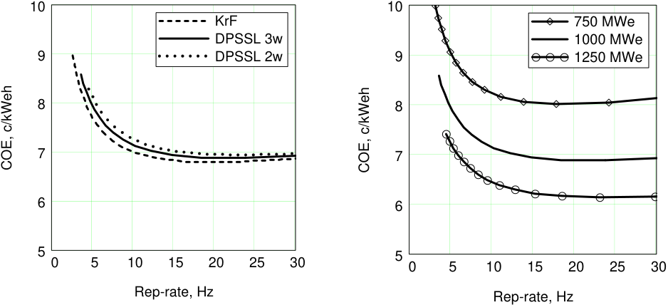
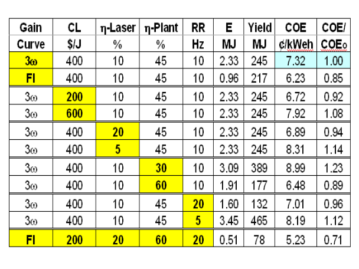
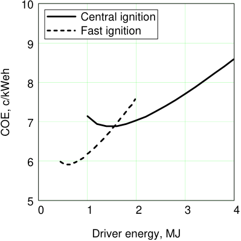
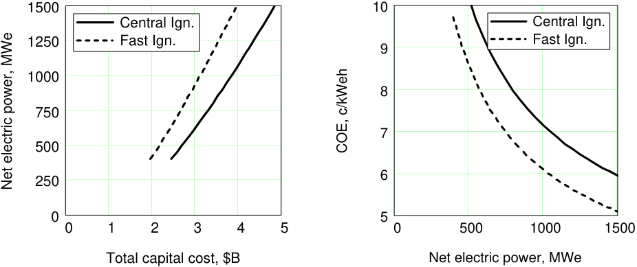

UCRL-CONF-221936 

Economic Systems Modeling for Laser IFE and the Potential advantages of Fast Ignition 

## W. R. Meier 

June 9, 2006 

European Conference on Laser Interaction with Matter Madrid, Spain June 12, 2006 through June 16, 2006 

## **Disclaimer** 

This document was prepared as an account of work sponsored by an agency of the United States Government. Neither the United States Government nor the University of California nor any of their employees, makes any warranty, express or implied, or assumes any legal liability or responsibility for the accuracy, completeness, or usefulness of any information, apparatus, product, or process disclosed, or represents that its use would not infringe privately owned rights. Reference herein to any specific commercial product, process, or service by trade name, trademark, manufacturer, or otherwise, does not necessarily constitute or imply its endorsement, recommendation, or favoring by the United States Government or the University of California. The views and opinions of authors expressed herein do not necessarily state or reflect those of the United States Government or the University of California, and shall not be used for advertising or product endorsement purposes. 

## **Economic Systems Modeling for Laser IFE and the Potential Advantages of Fast Igntion** 

## **Wayne R. Meier[1]** 

_**1Lawrence Livermore National Laboratory: Fusion Energy Program, Livermore, CA**_ 

## **ABSTRACT** 

An updated systems code for a laser-driven IFE power plant has been developed as part of the U.S. High Average Power Laser (HAPL) program.  The cost of electricity (COE) is calculated using standardized methods for fusion reactor studies.  In this paper, we describe the systems code and present results for capital cost and COE as a function of key design variables and parameters. We show how the COE varies as a function of driver energy and pulse repetition rate for different lasers. We examine the dependence of COE on other parameters such as laser cost ($/J), laser efficiency, plant efficiency, and net power output of the plant. Finally we compare results for a plant using direct-drive central ignition targets to results with fast ignition targets and note the potential advantages of fast ignition for various assumptions. 

## **1.  Introduction** 

The U.S. High Average Power Laser (HAPL) program is conducting research on laserdriven IFE (Sethian et al., 2003). As part of this effort, we have developed an integrated systems model of an IFE power plant based on the HAPL design work (Meier, 2005). The model includes scaling equations for physics, engineering and cost characteristics as a function of key design variables. Capital cost estimates have been updated with the most recent information from other fusion and fission power plant studies. The cost of electricity (COE) is calculated using standardized methods for fusion reactor studies and is used as the figure of merit in determining the optimal operating parameters. Results are being used in the HAPL program to determine how system constraints (e.g., maximum pulse repetition rate) might prevent operation at the optimum design point. Results also illuminate areas where improvements in performance or reductions in costs have the largest impact on the economic attractiveness of IFE power plants. 

In this paper, we describe the systems code and present results for capital cost and COE as a function of key design variables and parameters. Section 2 provides a top-level description of the model and highlights major elements. Key results for power plants based on direct-drive, central ignition targets are given in Section 3. Key factors that could reduce the COE are given in Section 4. Section 5 focuses on the potential advantages of using fast ignition targets, and Section 6 gives the conclusions. 

## **2.  Description of Systems Model** 

An essential part of the systems model is the scaling of target gain as a function of driver (laser) energy on target, or so called target gain curves. Our model includes target gain curves for direct-drive, central ignition (CI) targets for different laser wavelengths 

corresponding to KrF gas lasers (0.25 µ m) and frequency doubled (0.50 µ m or 2 ω ) and tripled (0.35 µ m or 3 ω ) diode pumped solid state lasers (DPSSL) (Perkins, 2005). We have also included gain curves for direct-drive, fast ignition (FI) targets with 2 ω and 3 ω compression lasers (Tabak et al., 2006). The gain curves are illustrated in Fig. 1. Although not shown here, we note that the direct-drive CI gain curves are significantly higher at low driver energy (< 2 MJ) than previous results. Target gain for CI targets increases with decreasing wavelength, but we find that this advantage is mostly offset by the lower efficiency of the KrF laser compared to the DPSSL. Fast ignition target gains are 3-4 times higher for a given driver energy. Note that the driver energy for the FI gain curves is the sum of the compression laser energy and ignition laser energy. 

**----- Start of picture text -----** 
500 FI 3w comp. FI 2w comp. KrF 400 DPSSL 3w DPSSL 2w 300 200 100 0 0 1 2 3 4 Driver energy, MJ Target gain **----- End of picture text -----** 

**Figure 1** . Target gain as a function of driver energy for FI (dashed lines) and CI (solid lines) with different wavelength lasers. 

The lasers are not adequately modeled in the current version of the systems code. The designs and architectures for these lasers are still evolving as R&D continues under the HAPL Program. In lieu of detailed scaling models, we are using a linear cost scaling with driver energy and fixed driver efficiency. The reference case total capital cost is $400/J. This is roughly consistent with the Orth study assuming diodes at 5 cents per peak Watt instead of 7¢/Wp used in that report (Orth et al., 1996), and it is also consistent with the KrF laser cost from the Sombero power plant design when escalated to 2005 dollars (Meier & von Rosenberg, 1992). The laser efficiencies are 7.5% for KrF, 9.6% for 3 ω DPSSLs, and 10.8% for 2 ω DPSSLs. 

The chamber and balance of plant cost scaling are based on the HAPL reference case design of a dry-wall chamber that uses a tungsten-armor-coated, ferritic steel first wall to deal with the short-range target emissions (x-rays and debris). The coolant and breeder is liquid lithium, and a Brayton power conversion cycle with an efficiency of 48% is used. The radius of the chamber increases with target yield with a scaling that depends on the amount, if any, of buffer gas used to reduce the peak heat load on the first wall (Meier, 2005). Chamber costs are based on the mass of structural, breeding and shielding materials and unit costs ($/kg) that are consistent with ARIES power plant studies (Waganer, 2005).  Other power plant costs (buildings, heat transfer systems, electrical plant equipment, turbine plant equipment, etc.) are based on liquid metal fission and fusion plant studies. These costs scale with thermal or electrical power raised to the 0.4-0.8 power depending on the subsystem (Delene et al., 1988). 

The target factory capital and operations and maintenance (O&M) costs are based on detailed studies by General Atomics (Rickman and Goodin, 2003).  The total capital cost for a factory producing 350 MJ targets at 6 Hz (corresponding to a ~1 GWe plant) is $136 M. Their estimates indicate that O&M cost are significant and in fact exceed annualized capital charges for the target factory. Figure 2 shows the annual O&M and capital charges (at 9.66% per annum) as a function of production rate, or pulse repetition rate (RR), for fixed target yield. The capital cost scaling consists of a fixed component, a component that scales with target yield, and a component that scales with fusion power (RR × target yield). The effective scaling with rep-rate for fixed yield is RR[0.52] . The O&M cost depends on the plant capital cost and fusion power, with the effective scaling with rep-rate for fixed yield of RR[0.57] .  At 6 Hz, the total cost per target is ~17¢. 

**----- Start of picture text -----** 
60 Total O&M Capital 40 20 0 0 5 10 15 20 Production rate, Hz Annual costs, $M **----- End of picture text -----** 

**Figure 2.** Annual target production costs as a function of production rate for fixed target yield of 350 MJ. Note that fusion power is proportional to production rate with this assumption. 

The cost of electricity is the sum of annual capital and O&M costs divided by annual net electric energy production plus a decommissioning allowance of 0.05 ¢/kWeh. Standard assumptions are used to account for indirect capital costs (total capital cost = 1.936 times direct capital cost) and the annual fixed charge rate (9.66% for constant dollar analysis). The net energy produced per year is equal to the net power output of the plant × the annual capacity factor × 8760 h/y. The net power is the total plant power (gross electric power) minus the power needed to operate the laser and other in-plant systems (auxiliary power needs equal ~4% of the gross power). Since costs scale with the gross power (thermal or electrical), the amount of power that must be recirculated to run the laser is an important factor determining the COE. The plant capacity factor is fixed at 85% in our analyses. 

## **3.  Results for Direct-Drive, Central Ignition Targets** 

The COE versus driver energy for three cases is shown in Fig. 3: KrF laser (7.5% laser efficiency), 3 ω DPSSL (9.6%), and 2 ω DPSSL (10.8%). In general, the COE decreases with increasing driver energy reaching a minimum in the 1.3-1.6 MJ range and then increases again as the benefit of increased target gain is overcome by higher laser cost. There is not a significant difference in minimum COE between the three drivers (6.8-6.9 ¢/kWeh), since the target gain benefits of shorter wavelength lasers are largely offset by lower efficiency. 

**----- Start of picture text -----** 
10 KrF DPSSL 3w 9 DPSSL 2w 8 7 6 5 0 1 2 3 4 Driver energy, MJ COE, c/kWeh **----- End of picture text -----** 

**Figure 3.** COE versus driver energy for KrF, 2 ω and 3 ω DPSSLs. 

Another key design operating parameter for the IFE power plant design is the pulse repetition rate. Figure 4a gives the COE as a function of rep-rate for the three drivers. The COEs minimize at a rep-rates of 20-25 Hz. This is significantly higher than past studies and is the result of the new gain curves, which are predicting high gains at low (< 2 MJ) laser energy. It is not clear that such high rep-rates can be achieved due to limitations on target injection and tracking, chamber clearing, and laser cooling (or gain media renewal for KrF). We can see the impact on COE if the rep-rate is constrained for any of these reasons. Taking the 3 ω DPSSL as an example, if the rep-rate is limited to 10 Hz, the COE is 4% higher; with a 5 Hz constraint, the impact becomes significant at 16% higher COE. 

**----- Start of picture text -----** 
10 10 KrF 750 MWe DPSSL 3w 1000 MWe 9 DPSSL 2w 9 1250 MWe 8 8 7 7 6 6 5 5 0 5 10 15 20 25 30 0 5 10 15 20 25 30 Rep-rate, Hz Rep-rate, Hz COE, c/kWeh COE, c/kWeh **----- End of picture text -----** 

**Figure 4.** a) COE versus rep-rate for KrF, 2 ω and 3 ω DPSSLs. b) COE versus rep-rate for the 3 ω DPSSL at three different net power levels. 

The results in Figs. 3 and 4a were all for a fixed 1000 MWe net output power from the plant (i.e., power available after accounting for recirculating power needs for the lasers and other plant equipment). Figure 4b shows the economy of scale effects for IFE power plants. The 3 ω DPSSL COE versus rep-rate is plotted for three plant sizes: 750, 1000 and 1500 MWe. At 750 MWe, the COE is 15% higher than at 1000 MWe, while at 1250 MWe it is 10% lower than the 1000 MWe result. 

## **4.  Factors to Reduce COE** 

The laser IFE COEs are not competitive with currently projected COEs for advanced light water fissions reactors (ALWRs) with once-through fuel cycles, which are ~4.9 ¢/kWeh in 2005 dollars (Delene et al., 2000). Therefore, we completed a parameter variation analysis to determine the factors that have the largest impact on the COE. Table 1 summarizes the results. The first row is the reference case COE for comparison. It is based on the 3 ω gain curve, $400/J, 10% efficient laser, 45% power conversion efficiency and operation at 10 Hz. The following rows show the impact of more or less optimistic assumptions. The 3 ω fast ignition gain curve gives a 15% decreases in the COE (assuming no added $/J for the ignitor laser). Changing the laser cost per joule by +/- 50% has an 8% impact on the COE. Increasing the laser efficiency to 20% only reduces the COE by 6%, but a 5% efficient laser has a 14% higher COE. The plant power conversion efficiency is a big factor; if it is only 30% (similar to an LWR), the COE increases by 23%, while a 60% efficient plant would give a 11% lower COE (assuming the cost of these power conversion systems did not vary). Operating at 20 Hz would save 4%, but if the system is limited to 5 Hz, the COE is 12% higher. As one final example we assume the best of all cases: fast ignition gain curve, low cost laser, 20% laser efficiency, 60% power conversion efficiency and operation at 20 Hz. In this case, the COE is 29% lower than the reference point and is within striking distance of fission plant COE. 

**Table 1.** Results of Parameter Variation Study. 

## **5.  Results and Potential Advantages for Fast Ignition** 

As previously noted, FI targets give gains significantly high that central ignition (CI); this allows FI to achieve an attractive power balance (low driver recirculating power) with very low driver energy (< 1 MJ). Figure 6 shows the COE for the 3 ω FI design versus driver 

energy compared to the CI results. The FI plant has a minimum COE of ~5.9 ¢/kWeh at a laser energy of 0.6 MJ and rep-rate of 21 Hz. If limited to 10 Hz, the driver energy is 0.9 MJ, and the COE is ~6.1 ¢/kWeh, which is 15% lower than the CI result at 10 Hz. 

**----- Start of picture text -----** 
10 Central ignition Fast ignition 9 8 7 6 5 0 1 2 3 4 Driver energy, MJ COE, c/kWeh **----- End of picture text -----** 

**Figure 6** . COE versus driver energy for fast and central ignition. 

Another way to look at the potential advantages of fast ignition is to ask how it compares to central ignition if the total capital investment is constrained or if the goal COE is fixed (Meier & Hogan, 2006). Figure 7a shows the net power that can be generated for a fixed capital investment; FI can deliver significantly more power for a fixed investment. For example, at fixed $3.9B (the 1000 MWe CI result), FI plant could generate 1440 MWe. Figure 7b plots COE versus net power for FI and CI cases and shows that FI plants achieve a given COE at lower net power. For example, the COE of 7.2 ¢/kWeh for 1000 MWe CI plant is reached at a net power of 715 MWe for FI. 

**----- Start of picture text -----** 
1500 10 Central Ign. Central Ign. 1250 Fast Ign. Fast Ign. 9 1000 8 750 7 500 6 250 0 5 0 1 2 3 4 5 0 500 1000 1500 Total capital cost, $B Net electric power, MWe COE, c/kWeh Net electric power, MWe **----- End of picture text -----** 

**Figure 7** . a) Net power generated versus total capital cost for FI and CI targets. b) COE versus total net power for FI and CI targets. 

## **6.  Conclusions** 

We have completed economic systems analysis of laser IFE power plants and evaluated the impact of cost and performance assumption on figures of merit such as the COE and total capital cost. We find that with the latest direct-drive, CI target gain curves, the COE optimizes at lower driver energy and much higher rep-rate than previously. Thus it is more important to understand rep-rate constraints and the impact of rep-rate on costs and performance. For the stated assumptions, there is little difference in the COE for the different gain curves and corresponding laser efficiencies.  Opportunities exist to make laser IFE more cost competitive with other energy options; higher target gain, less expensive, more efficient drivers, more efficient power conversion, and higher rep-rate all help. Fast ignition offers potential advantages including lower COE and lower total driver energy, competitive COE at lower net power (making smaller power plants attractive), and higher net power for fixed capital investment. 

## **7.  References** 

SETHIAN, J.D. et al. (2003). Fusion Energy with Lasers, Direct Drive Targets, and Dry Wall Chambers. _Nucl. Fusion_ **43,** 1693. 

MEIER, W.R. (2005). Systems Modeling for Laser IFE. Proc. IFSA-2005, accepted for publication in _J. Phyiscs IV_ . 

PERKINS, L.J. (2005). HAPL Reactor Targets: Baseline Specifications and Future Options. http://aries.ucsd.edu/HAPL/MEETINGS/0511-HAPL/Tuesday/05.0Perkins.ppt . 

TABAK, M. at al. (2006). Fast Ignition Overview and Background. _Fus. Sci. and Technol._ , **49** , 254. 

ORTH, C. et al. (1996). A Diode-Pumped Solid State Laser Driver for Inertial Fusion Energy. _Nuclear Fusion_ , **36** , 75. 

MEIER, W. R., VON ROSENBERG Jr., C.W. (1992). Economic Modeling and Parametric Studies for SOMBRERO - A Laser-Driven IFE Power Plant. _Fusion Technol.,_ **121,** 1552. 

WAGANER, L. (Oct. 2005). Boeing Corporation. Private communication. 

DELENE, G. et al. (1988). Nulcear Energy Cost Data Base, DOE report DOE/NE-0095. 

RICKMAN, W. & GOODIN, D. (2003). Cost Modeling for Fabrication of Direct Drive Inertial Fusion Energy Targets. _Fus. Sci. and Technol._ , **43** , 353. 

DELENE, G. et al. (2000). An Assessment of the Economics of Future Electric Power Generation Options and the Implications for Fusion—Revision 1.  ORNL-TM1999/243/R1. 

MEIER, W.R. & HOGAN, W.J. (2006). Power Plant and Chamber Consideration for Fast Ignition. _Fus. Sci. and Technol._ , **49** , 532. 

## **Acknowledgement** 

Work performed under the auspices of the U.S. Department of Energy by University of California Lawrence Livermore National Laboratory under Contract W-7405-Eng-48. 

