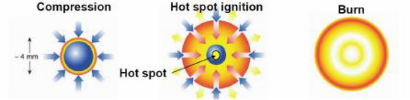
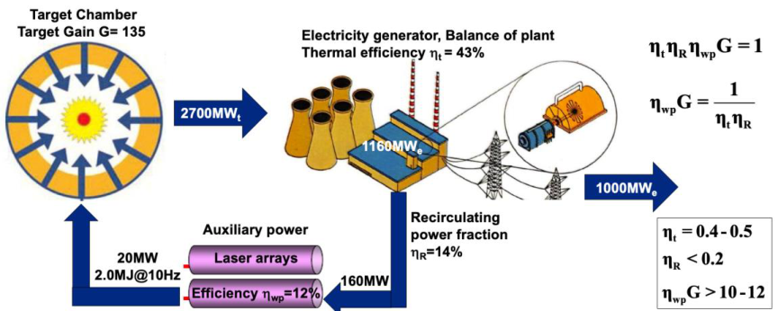
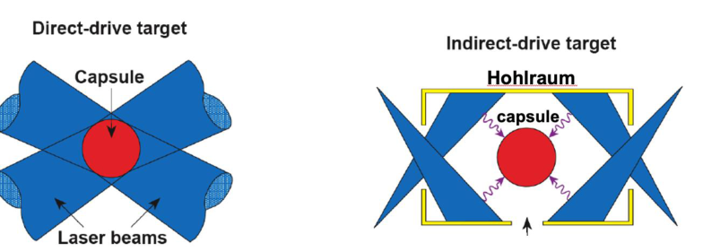
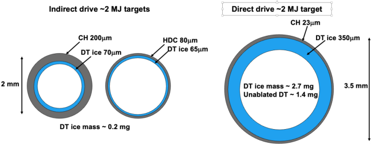
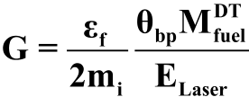

# **Status and prospects for Inertial Fusion Energy via lasers**

Riccardo Betti
Laboratory for Laser Energetics, University of Rochester, Rochester, New York 14623, USA

## **ABSTRACT**

Fusion energy is the ultimate clean and limitless energy source, but its development requires
overcoming many scientific and technological challenges. For the first time in the 60-year long history
of fusion research, ignition and target gain above unity (G>1) were demonstrated in the laboratory at
the National Ignition Facility at the Lawrence Livermore National Laboratory in 2022. Turning laser
fusion into an energy source requires that the results from single shot experiments be replicated at
much higher repetition rates of many shots per second to produce high average power at relatively low
cost. This requires the development of new laser technologies, mass production of suitable targets,
accurate injection and tracking systems and new materials for the reactor chamber components and
final optics. Ultra broadband and deep UV light are laser advances that can dramatically improve the
laser energy coupling to the target thereby reducing the laser energy and power requirements.

**Keywords:** Laser fusion, Inertial fusion energy, Inertial confinement fusion

## **1. INTRODUCTION**

The physics principles of laboratory-scale inertial confinement fusion (ICF) have been recently
demonstrated in implosion experiments at the National Ignition Facility (NIF), a ~2 megajoule, 192
beam UV laser at the Lawrence Livermore National Laboratory [1]. The demonstration of
thermonuclear ignition in deuterium-tritium fuel on NIF represents the climax of a 60-year-old quest
in fusion research. In that experiment [2], a 2.05 MJ laser energy delivered to the target yielded 3.15
MJ of fusion energy. Since then, additional experiments resulted in higher output. This energy is
harvested from the fusion reaction induced by a laser driven compression [3,4] shown in Figure 1.

Figure 1: Schematic depiction of the ICF compression and ignition process steps.

NIF uses 192 laser beams to heat the inner walls of a cylindrical enclosure called the hohlraum. The
x-rays emanating from the heated walls ablate the surface of a spherical capsule filled with deuteriumtritium fuel. This causes an inward force on the capsule surface resulting in the compression of the
fuel up to the point when its pressure and temperature reach the condition for thermonuclear ignition.

Once the fuel is ignited, the fusion reactions are self-sustaining, and the burn propagates through the
entire compressed core leading to a large release of energy greatly exceeding the laser energy incident
on the target.  Most of the released fusion energy is carried by the escaping neutrons and can be
harnessed to produce thermal energy. The latter can be converted into electricity through a
conventional steam cycle. This method of inducing fusion reactions is termed "inertial confinement
fusion (ICF)" because the compressed fuel is held together by its own inertia during the fusion burn.
ICF is one of two major branches of fusion energy research; the other is magnetic confinement
fusion (MCF) where magnetic fields are used to confine the DT plasma.

Developing the technology to harness fusion energy would lead to unlimited, environmentally
sustainable and carbon-free energy with minimal proliferation concerns. Because of its high-power
density, fusion energy can be easily integrated into the existing power generation infrastructure. ICF
offers some advantages with respect to MCF such as multiple development pathways through different
laser driver and target design concepts, it is highly modular, and its development will enable
technology transfer in a variety of other fields of scientific, industrial and national security importance.
Furthermore, the required industrial base shares commonalities with other industries. That will help
reduce the development costs through utilization of multiple sponsors for key technologies (e.g., laser
diodes, optical materials, etc.).

All the major developments in ICF over the last three decades, including the construction of the
National Ignition Facility and OMEGA laser were sponsored as part of the US nuclear stockpile
stewardship program (SSP) [5]. NIF was built to demonstrate thermonuclear ignition and gain in the
laboratory in support of the SSP. Applications of laser ICF to fusion energy have been assessed by
several panels, the latest of which by the US National Academy of Science (NAS) in 2013 [6]. The
NAS recommendation was to start a national inertial fusion energy program after ignition is
demonstrated. Following the demonstration of thermonuclear ignition in 2022 [2], a community
workshop on the research opportunities in inertial fusion energy was sponsored by the US Department
of Energy (DOE Basic Research Needs (BRN) workshop). The BRN report was released in 2023 [7],
and it was followed by the award of initial funding by the US DOE, a memorandum on IFE by the
German government [8] and private and public investments in support of IFE research and privatepublic partnerships.

## **2. BASIC IFE POWER-PLANT ENERGETICS REQUIREMENTS**

The critical components of an IFE plant operating with DT fuel include:

  - Laser drivers that can operate at a high repetition rate (up to 10 Hz) and with high wall plug
efficiency (on the order of 10-15%). The optical components must provide stable operation for
multiple years (on the order of 10 – 30 years) with no performance degradation (laser damage,
reduction in efficiency etc.)

  - Final optics capable of withstanding high fluence and radiation

  - Lithium blankets that would also incorporate technology for tritium breeding and recovery

  - Targets that are of sufficiently high quality and can be mass produced at a very low cost. It is
estimated that about 9  10 [5] targets would be required per day (3  10 [8] per year)

  - Target injection and tracking system that would enable inserting of the targets and aiming the
laser with high precision to achieve uniform illumination of each target.

  - Target chamber that can operate for the duration of the power plant without major alterations
of its design characteristics.

For a laser-fusion power-plant to be economically viable, the critical parameter is the product of the
laser wall-plug efficiency (  wp) and the target gain (G). This product (  wpG ) must exceed a value of
about 10. A schematic representation of the individual system components is shown in Figure 2.

Figure 2: Schematic representation of the main components of an IFE power plant with
highlighted power efficiency requirements.

**3.** **LASER FUSION SCHEMES PURSUED IN THE USA**

In the US, laser fusion is pursued through the direct [9] and indirect drive [10] approaches. A
schematic depiction of these approaches is shown in Figure 3.

Figure 3: Schematic representation of the main laser fusion approaches, direct and indirect
drive, investigated at US institutions.

The indirect drive is the approach employed at the National Ignition Facility. It uses a high-Z enclosure
(or “hohlraum”) that is heated to temperatures of about 270-300 eV by irradiation of the inner walls
by multiple laser beams. The resulting black body x-ray emission fills the hohlraum and heat up the
low-Z ablator of a spherical shell (or “capsule”) that is located in the center of the hohlraum, The
capsule contains a layer of cryogenic deuterium-tritium (DT) fuel and it is imploded by the radial

inward force induced by the ablation of the surface material. The direct drive approach is pursued on
the OMEGA laser [11] at the Laboratory for Laser Energetics and the NIKE laser [12] at the Naval
Research Laboratory. In direct drive, the laser beams directly illuminate the capsule causing ablation
of the surface and driving the implosion. The fundamental difference in the way the laser energy is
delivered onto the target affects the target design and the resulting gain. By avoiding the conversion
of laser light into x-rays, direct drive couples more energy to the capsule. Therefore, for the same
laser energy, direct drive capsules are bigger and store more fuel than indirect drive. In addition, about
5% of the ablator mass remains in indirect drive which is approximately the same as the DT ice mass.
Instead, in direct drive, all the ablator material is ablated off and the remaining mass is entirely made
of DT fuel. A theoretical representation of the difference in target specifications for these two laser
fusion schemes are depicted in Figure 4.

Figure 4: Sketch of fusion targets for indirect and direct drive assuming same input laser
energy of ≈2 MJ.

To date, the implosion quality (convergence and compressibility) has been higher for indirect drive
on NIF with respect to direct drive experiments performed on the OMEGA laser. This is because the
x-ray drive provides a uniform ablation pressure on the capsule surface leading to greater
hydrodynamic stability and higher implosion convergence. Higher convergence facilitates the onset
of the ignition process, enhances the fraction of burned fuel and increases the fusion energy output. It
is unlikely that the implosion quality of direct drive can rival that of indirect drive with current laser
technology. However, direct drive couples up to ~ 4x more energy to the capsule and can drive up to
~7x more fuel mass than indirect drive. The final target gain will depend on implosion convergence
and unablated DT mass. It is anticipated that with the advent of the next generation of ultra-broadband
lasers [13], direct drive can achieve implosion quality comparable to indirect drive and further enhance
the energy coupled to the capsule [14]. That will open the way for a very attractive path to high energy
gains and inertial fusion energy.

Other promising laser-fusion schemes are being explored in Europe [15], US, China and Japan
in addition to conventional direct and indirect drive. These include shock ignition [16] and fast ignition

[17,18]. In shock ignition, a strong converging shock wave is launched at the end of the compression
phase to ignite the central hot core. This is achieved via shaping of the laser pulse to exhibit a high
power spike of a few hundred picosecond duration at the end of the compression phase. In fast ignition,
a high intensity ultrashort picosecond laser pulse (delivering ≈10 [19-20] W/cm [2 ] on target) is used to
generate a fast electron or proton beam that locally heats the compressed fuel to ignition temperatures.

As mentioned above, target gains exceeding 100x are required for IFE to be an economically
viable approach. This is based on the requirements that  wpG> 10 and a wall-plug efficiency (  wp) of
10%. The gain (G) depends on the compressed fuel mass (Mfuel), the burn-up fraction (  bp) and the
laser energy (EL):

where  f=17.6 MeV is the energy released in a single fusion reaction and mi is the average ion mass.
It must be noted that the highest gain on NIF to date is 2.4x (i.e. 5.2MJ of fusion energy for 2.2 MJ of
laser energy [19]). Increasing the target gain to IFE levels of ~100x requires uniform, highly
convergent implosions with a large fuel mass.

Achieving ignition in direct and indirect drive is most sensitive to capsule implosion velocity and
implosion convergence ratio. Thin-shells, high velocity implosions (> 300km/s) are the easiest to
ignite. Instabilities seeded early during the implosion process grow with convergence and are
detrimental to the onset of the ignition process. The fusion energy output is proportional to the product
of the burn-up fraction and the fuel mass (~  bp Mfuel ). The burn-up fraction, depends on DT layer
thickness and convergence ratio which is correlated to the driver energy, the quality of the implosion
and the laser-energy-coupling to the capsule. In general, more fuel mass leads to lower velocities for
the same driver energy. A delicate balance between stability, convergence, velocity and fuel mass is
required for optimizing the gain. It is unclear at the moment if a gain of ~100x can be achieved with
a few megajoules of laser light.

## **4. LASER DRIVER REQUIREMENTS**

Present ICF/HEDP laser drivers are based on S&T developed in the 1980s and 1990s. The laser
gain medium is a form of Nd-doped phosphate glass operating at the fundamental frequency and later
(mid-1980 with the Nova laser at LLNL and later the OMEGA laser at LLE) using third harmonics
conversion. Current high energy UV lasers offer a moderate bandwidth (  /  0 <0.1%) but the next
generation laser could provide a much larger bandwidth (  /  0 >1%) [20]. The suppression of
parasitic effects during the interaction of the laser beams with the expanding blow-off plasma in direct
drive is of critical importance. These include laser plasma instabilities such as stimulated Raman
scattering, cross beam energy transfer and two-plasmon decay [21]. Some of these processes can also
affect indirect drive energy coupling. For the suppression of all these effects, theoretical
considerations suggest that the laser bandwidth (  /  0) requirements needs to reach ~2-3%.

There are currently two main laser architectures considered for IFE power plants. The first is the
evolution of the ICF class solid-state lasers with significant upgrading to include diode pumping to
enable operation with high repetition rate (  10 Hz) and wall-plug efficiency  10%. As in current ICF
class lasers, frequency conversion to the third harmonic may be sufficient although other approaches
are considered. Total diode cost is a dominant capital cost for such fusion power plant. A diode cost
of ~$0.01/W is required for a cost competitive fusion power plant assuming an Nd:glass based laser
driver. However, using a gain medium with grater storage lifetime (for example Nd:SrF2), the cost for
the diode laser arrays can be lower

The second laser driver approach considered is based on technology developed at the Naval
Research Laboratory using pulsed power-driven excimer gas lasers. The gain medium can be either

ArF (193nm and 10 THz bandwidth) or KrF (248nm and 3 THz bandwidth). The projected wall-plug
efficiency for KrF is about 7% and for ArF is about 10% with repetition rates on the order of 10 Hz.
Excimer lasers exhibit significant advantages in terms of target physics (shorter wavelength and high
bandwidth). However, the use of short wavelengths significantly enhances the difficulty in developing
optical material and optical components even at a comparatively higher cost. This may require
development of optical components with self-healing properties such as liquid metal, gas or plasma
optics. Finally, development of the final optics (such as the final turning mirror) that would be exposed
not only to the laser irradiation but also to neutron irradiation and fusion byproducts adds to the
technical and feasibility risks. Raman beam combining and Brillouin pulse compression is a key
technology that is under development and could lead to large driver energies requiring lower repetition
rates and greatly reducing the constrains on the final optics [22].

## **5. TARGET MANUFACTURING AND DELIVERY**

Owning to the requirement for high-volume low-cost production, targets for IFE will be
considerably different from current targets used on NIF and OMEGA. For example, single crystal DT
ice will be replaced by wetted (liquid DT) foam targets. However, there is little experimental data on
wetted foam targets. Their viability in terms of target physics and low cost of ~ 10 _¢_ ‘s/target must be
demonstrated. Different target mass-production methods are being explored [7]. These include
holographic 3-D printing, nanoimprint and origami folding and, emulsion polymerization.

The delivery of targets and their interception by the laser beams with sufficiently high accuracy is
also an area that would require significant development efforts. To date, only preliminary scoping
studies have been carried out. Approaches to target injection, survival, and tracking are currently under
initial stages of development. Such efforts include use of 400 m/s gas guns and ~ 50 m/s linear
induction accelerators.

## **6. ADDITIONAL CONSIDERATIONS**

There are many technological challenges that must be addressed on the path to commercial fusion
energy. In addition to the advances in laser technology, target manufacturing, injection and tracking
mentioned above, significant progress is required in developing materials that can withstand the
neutron and radiation fluxes, and materials that can provide tritium recovery and breeding.   Fusion
neutrons can damage the solid vessel wall of the reactor, causing swelling and fracturing. One key
technical challenge is the first wall survivability under radiation flux and neutron bombardment. For
both, magnetic and laser fusion, the average neutron wall loads (~MW/m [2] ) are similar, but IFE is
pulsed (~10 Hz) with higher peak power loading. Several chamber concepts have been developed
including thick liquid walls and dry walls with protective gas [6,7]. Clearing of the chamber at 10Hz
is also a major challenge for IFE,

Another technical challenge common to both magnetic and inertial fusion is the tritium production
and recovery. Tritium has a half-life of about 12 years and, currently, only exists in small quantities.
Therefore, tritium must be produced to fuel fusion power plants. By surrounding the fusing DT plasma
with a lithium blanket, it is possible to exploit the tritium breeding reactions n+Li to produce more
tritium than it is consumed in the fusion reaction. High-gain IFE targets will burn up to ~30% of the
fuel. Assuming a breeding ratio slightly above unity (breeding ratio = tritium produced/tritium

## **7. ACKNOWLEDGMENTS**

This material is based upon work supported by the Department of Energy Office of Fusion Energy
Sciences under awards DE-SC0024381, DE-SC0024456, the National Nuclear Security
Administration under Award Number DE-NA0003856, the STARFIRE hub for Inertial Fusion
Energy, the University of Rochester, and the New York State Energy Research and Development
Authority. This report was prepared as an account of work sponsored by an agency of the U.S.
Government. Neither the U.S. Government nor any agency thereof, nor any of their employees, makes
any warranty, express or implied, or assumes any legal liability or responsibility for the accuracy,
completeness, or usefulness of any information, apparatus, product, or process disclosed, or represents
that its use would not infringe privately owned rights. Reference herein to any specific commercial
product, process, or service by trade name, trademark, manufacturer, or otherwise does not necessarily
constitute or imply its endorsement, recommendation, or favoring by the U.S. Government or any
agency thereof. The views and opinions of authors expressed herein do not necessarily state or reflect
those of the U.S. Government or any agency thereof.

.

## **REFERENCES**

[1] E.M. Campbell and W.J. Hogan “The National Ignition Facility—applications for inertial fusion
energy and high energy-density science,” Plasma Phys. Control. Fusion 41 B391 (1999)

[2] H. Abu-Shawareb et al, “Achievement of Target Gain Larger than Unity in an Inertial Fusion
Experiment,” Phys. Rev. Lett. **132**, 065102 (2024)

[3] S. Atzeni and J. Meyer-ter-Vehn, “The Physics of Inertial Fusion: Beam Plasma Interaction,
Hydrodynamics, Hot Dense Matter,” 1st edn (Oxford Univ. Press, 2004)

[4] R. Betti and O. Hurricane, Inertial Confinement Fusion with Lasers, Nature Physics 12, 435-448
(2016)

[[5] https://en.wikipedia.org/wiki/Stockpile_stewardship](https://en.wikipedia.org/wiki/Stockpile_stewardship)

[[6] National Academies: https://nap.nationalacademies.org/catalog/18289/an-assessment-of-the-](https://nap.nationalacademies.org/catalog/18289/an-assessment-of-the-prospects-for-inertial-fusion-energy)
[prospects-for-inertial-fusion-energy](https://nap.nationalacademies.org/catalog/18289/an-assessment-of-the-prospects-for-inertial-fusion-energy)

[[7] Department of Energy, Office of Science: https://science.osti.gov/-/media/fes/pdf/workshop-](https://science.osti.gov/-/media/fes/pdf/workshop-reports/2023/IFE-Basic-Research-Needs-Final-Report.pdf)
[reports/2023/IFE-Basic-Research-Needs-Final-Report.pdf](https://science.osti.gov/-/media/fes/pdf/workshop-reports/2023/IFE-Basic-Research-Needs-Final-Report.pdf)

[8] German Ministry of Education and Research:
[https://www.bmbf.de/SharedDocs/Downloads/DE/2023/230522-memorandum-laser-inertial-fusion-](https://www.bmbf.de/SharedDocs/Downloads/DE/2023/230522-memorandum-laser-inertial-fusion-energy.pdf?__blob=publicationFile&v=3l)
[energy.pdf?__blob=publicationFile&v=3l](https://www.bmbf.de/SharedDocs/Downloads/DE/2023/230522-memorandum-laser-inertial-fusion-energy.pdf?__blob=publicationFile&v=3l)

[9] R.S. Craxton et al. Direct-drive inertial confinement fusion: a review. Phys. Plasmas 22, 110501
(2015).

[10] J.D. Lindl, Inertial Confinement Fusion: The Quest for Ignition and Energy Gain Using Indirect
Drive (Springer-Verlag, 1998).

[11] T.R. Boehly et al, Initial performance results of the OMEGA laser system Opt. Commun. 133
495 (1997)

[12] S. Obenschain, et al. "High-energy krypton fluoride lasers for inertial fusion." Applied optics
54.31 F103-F122. (2015)

[[13] https://www.lle.rochester.edu/the-fourth-generation-laser-for-ultra-broadband-experiments-flux/](https://www.lle.rochester.edu/the-fourth-generation-laser-for-ultra-broadband-experiments-flux/)

[14] J.W. Bates et al, “Inertial-confinement-fusion plasmas using broadband laser light,” Phys.
Plasmas 30, 052703 (2023)

[15] D. Batani et al, “Future for inertial-fusion energy in Europe: a roadmap,” High Power Laser
Science and Engineering, Vol. 11, e83, 31 pages (2023)

[16] R. Betti et al, “Shock Ignition of Thermonuclear Fuel with High Areal Density,” Phys. Rev.
Lett. 98, 155001 (2007)

[17] M. Tabak et al, “Review of progress in Fast Ignition,” Phys. Plasmas 12, 057305 (2005)

[18] M. Roth et al, “Fast Ignition by Intense Laser-Accelerated Proton Beam,” Phys. Rev. Lett. 86,
436 (2001)

[[19] https://lasers.llnl.gov/science/achieving-fusion-ignition](https://lasers.llnl.gov/science/achieving-fusion-ignition)

[20] C. Dorrer et al, “Broadband sum-frequency generation of spectrally incoherent pulses.” Opt.
Express 29, 16135 (2021).

[21] R.K. Follet et al, “Thresholds of absolute instabilities driven by a broadband laser,” Phys.
Plasmas 26, 062111 (2019)

[22] C. Galloway et al, “ASPEN laser and a new IFE power plant concept,”
https://lasers.llnl.gov/sites/lasers/files/2023-11/galloway-xcimer-IFE-workshop-2022_0.pdf

