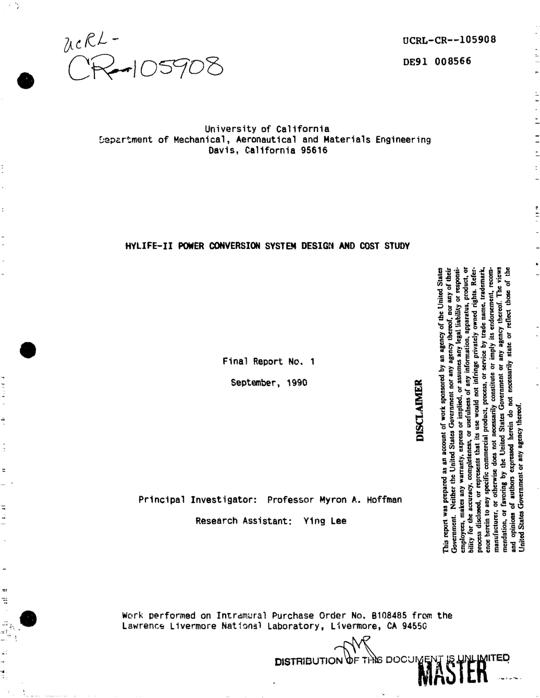

CR-IOS70S

## **OCRL-CR—105908** **DE91 008566**

University of California
Department of Mechanical, Aeronautical and Materials Engineering
Davis, California 95616

HVLIFE-II POWER CONVERSION SYSTEM DESIGN AND COST STUDY

###### till

~    - illlllill
**September, 1990**
i Pip
## **1H! IP.**
# " 111

Principal Investigator: Professor Myron A. Hoffman     - * | 1-s'I s i ^ J
Research Assistant: Y1ng Lee _\ %_ | « I .s | g-| J
ilflllllil

Work performed on Intramural Purchase Order No. B108485 from the
Lawrence Livermore National Laboratory, Livermore, CA 9465C

DISTRIBUTION^)FTffl6 DOCUMENT £-UNUNITED

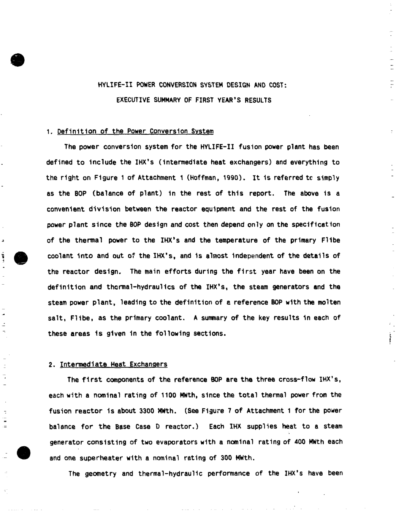

**`HYLIFE-II POWER CONVERSION SYSTEM DESIGN AND COST:`**

## **`EXECUTIVE SUMMARY OF FIRST YEAR'S RESULTS`** **`1. Definition of the Power Conversion System`**

**`The power conversion system for the HYLIFE-II fusion power plant has been`**

**`defined to Include the IHX's (Intermediate heat exchangers) and everything to`**

**`the right on Figure 1 of Attachment 1 (Hoffman, 1990). It 1s referred tc simply`**

**`as the BOP (balance of plant) 1n the rest of this report. The above 1s a`**

**`convenient division between the reactor equipment and the rest of the fusion`**

**`power plant since the BOP design and cost then depend only on the specification`**

**`of the thermal power to the IHX's and the temperature of the primary Fllbe`**

**`coolant Into and out of the IHX's, and 1s almost Independent of the details of`**

**`the reactor design. The main efforts during the first year have been on the`**

**`definition and thermal-hydraulics of the IHX's, the steam generators and the`**

**`steam power plant, leading to the definition of & reference BOP with the molten`**

**`salt, Fllbe, as the primary coolant. A summary of the key results 1n each of`**

**`these areas 1s given 1n the following sections.`**

## **2. Intermediate Heat Exchangers**

**`The first components of the reference BOP are the three cross-flow IHX's,`**

**`each with a nominal rating of 1100 MWth, since the total thermal power from the`**

**`fusion reactor 1s about 3300 HWth. (See Figure 7 of Attachment 1 for the power`**

**`balance for the Base Case D reactor.)`** **`Each IHX supplies heat to a steam`**

**`generator consisting of two evaporators with a nominal rating of 400 MWth each`**

**`and one superheater with a nominal rating of 300 MWth.`**

**`The geometry and thermal-hydraulic performance of the IHX's have been`**

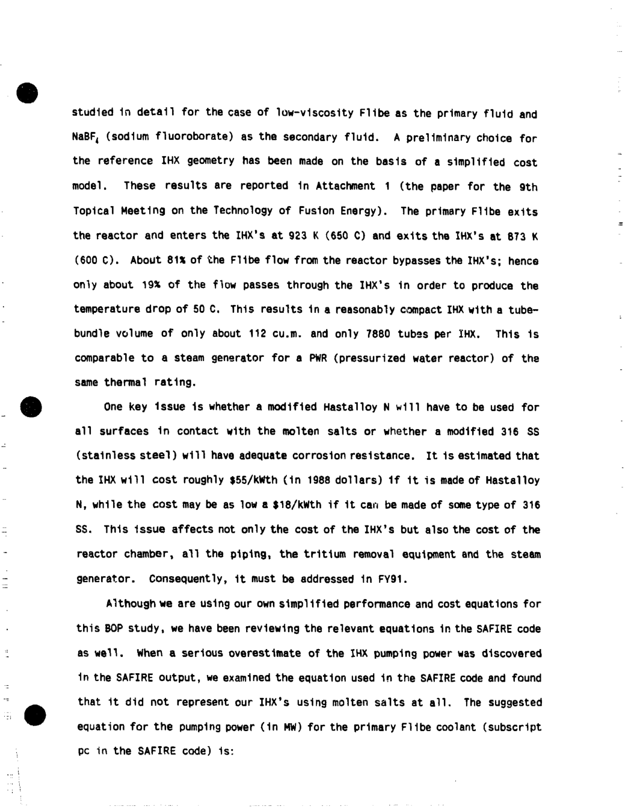

**`studied 1n detail for the case of 1ow-v1scos1ty F11be as the primary fluid and`**

**`NaBF, (sodium fluoroborate) as the secondary fluid. A preliminary choice for`**

**`the reference IHX geometry has been made on the basis of a simplified cost`**

**`model.`** **`These results are reported 1n Attachment 1 (the paper for the 9th`**

**`Topical Meeting on the Technology of Fusion Energy). The primary FUbe exits`**

**`the reactor and enters the IHX's at 923 K (650 C) and exits the IHX's at 873 K`**

**`(600 C). About 81X of the FUbe flow from the reactor bypasses the IHX's; hence`**

**`only about 19X of the flow passes through the IHX's 1n order to produce the`**

**`temperature drop of 50 C. This results 1n a reasonably compact IHX with a tube-`**

**`bundle volume of only about 112 cu.m. and only 7880 tubes per IHX. This 1s`**

**`comparable to a steam generator for a PWR (pressurized water reactor) of the`**

**`same thermal rating.`**

**`One key Issue 1s whether a modified Hastalloy N will have to be used for`**

**`all surfaces 1n contact with the molten salts or whether a modified 316 SS`**

**`(stainless steel) will have adequate corrosion resistance. It 1s estimated that`**

**`the IHX will cost roughly $55/kWth (1n 1988 dollars) 1f 1t Is made of Hastalloy`**

**`N, while the cost may be as low a $l8/kwth If 1t can be made of some type of 316`**

**`SS. This Issue affects not only the cost of the IHX's but also the cost of the`**

**`reactor chamber, all the piping, the tritium removal equipment and the steam`**

**`generator. Consequently, 1t must be addressed In FY91.`**

**`Although we are using our own simplified performance and cost equations for`**

**`this BOP study, we have been reviewing the relevant equations 1n the SAFIRE code`**

**`as well. When a serious overestimate of the IHX pumping power was discovered`**

**`1n the SAFIRE output, we examined the equation used 1n the SAFIRE code and found`**

**`that 1t did not represent our IHX's using molten salts at all. The suggested`**

**`equation for the pumping power (1n MW) for the primary Fllbe coolant (subscript`**

**`pc in the SAFIRE code) 1s:`**

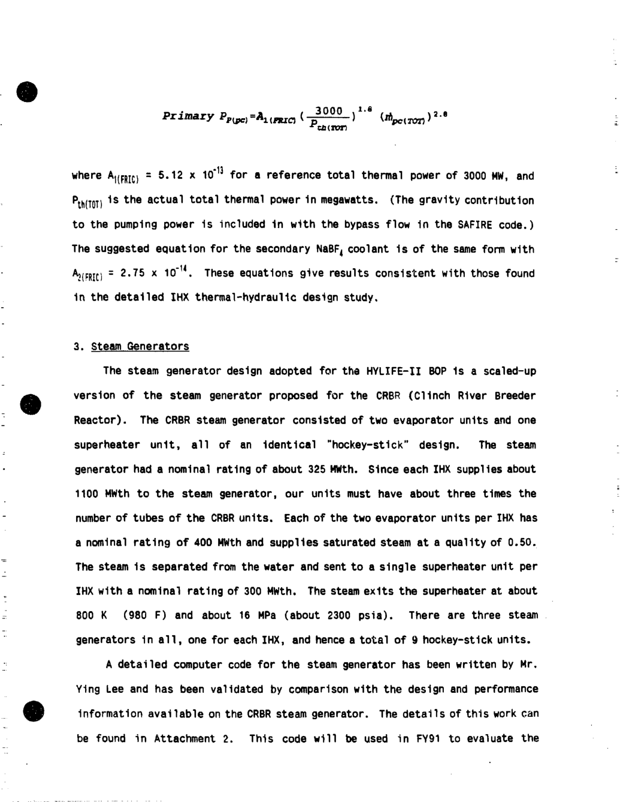

**`Primary`** _**PP{pe)=AurKxa**_ **`( 3`** **`0`** **`0`** **`0 l'"`** _**{itpe{lon)i-***_

**`13`**
**`where A,(`** **`Fp`** **`IC) = 5.12 x 10"`** **`for a reference total thermal power of 3000 MW, and`**

**`ptfi(T0T)1`** **`s t`** **`h`** **`e a`** **`c`** **`t`** **`u`** **`a`** **`1 t`** **`o`** **`t`** **`a`** **`l thermal power 1n megawatts. (The gravity contribution`**

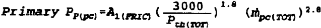

**`to the pumping power 1s included 1n with the bypass flow 1n the SAFIRE code.)`**

**`The suggested equation for the secondary NaBF ( coolant 1s of the same form with`**

## **`^(FRIC) = 2, 7 S x 1 0 "• These equations give results consistent with those found`**

**`1n the detailed IHX thermal-hydraulic design study.`**

## **`3. Steam Generators`**

**`The steam generator design adopted for the HYLIFE-II BOP 1s a scaled-up`**

**`version of the steam generator proposed for the CRBR (Clinch River Breeder`**

**`Reactor). The CRBR steam generator consisted of two evaporator units and one`**

**`superheater unit, all of an Identical "hockey-stick" design.`** **`The steam`**

**`generator had a nominal rating of about 325 MWth. Since each IHX supplies about`**

## **`1100 MWth to the steam generator, our units must have about three times the`**

**`number of tubes of the CRBR units. Each of the two evaporator units per IHX has`**

**`a nominal rating of 400 MWth and supplies saturated steam at a quality of 0.50.`**

**`The steam 1s separated from the water and sent to a single superheater unit per`**

**`IHX with a nominal rating of 300 MWth. The steam exits the superheater at about`**

## **`800 K (980 F) and about 16 MPa (about 2300 psia). There are three steam`**

**`generators in all, one for each IHX, and hence a total of 9 hockey-stick units.`**

**`A detailed computer code for the steam generator has been written by Mr.`**

**`Y1ng Lee and has been validated by comparison with the design and performance`**

**`information available on the CRBR steam generator. The details of this work can`**

**`be found in Attachment 2. This code will be used in FY91 to evaluate the`**

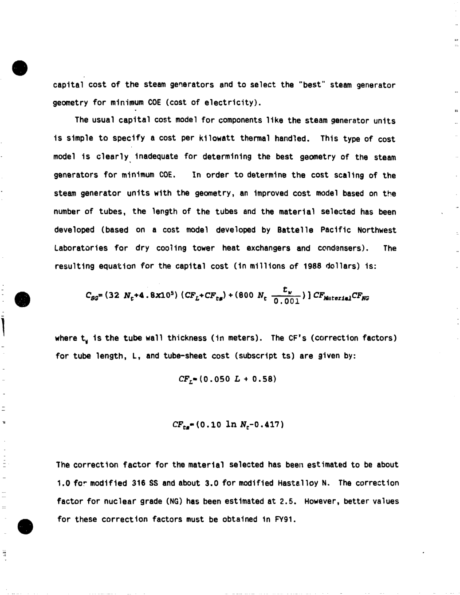

**`capital cost of the steam generators and to select the "best" steam generator`**

**`geometry for minimum COE (cost of electricity).`**

**`The usual capital cost model for components like the steam generator units`**

**`is simple to specify a cost per kilowatt thermal handled. This type of cost`**

**`model 1s clearly inadequate for determining the best geometry of the steam`**

**`generators for minimum COE.`** **`In order to determine the cost scaling of the`**

**`steam generator units with the geometry, an Improved cost model based on the`**

**`number of tubes, the length of the tubes and the material selected has been`**

**`developed (based on a cost model developed by Battelle Pacific Northwest`**

**`Laboratories for dry cooling tower heat exchangers and condensers). The`**

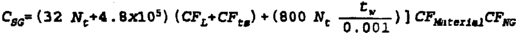

**`resulting equation for the capital cost (1n millions of 1988 dollars) 1s:`**

## **C w=(32 2^+4. BxlO5) {CFL+CFt,)+ (800 Nt T [h-)}CF] ltltelM [CF] K!**

**`where ty 1s the tube wall thickness (in meters). The CF's (correction factors)`**

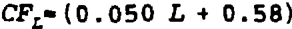
**`for tube length, L, and tube-sheet cost (subscript ts) are given by:`**

## **CFL- (0.050 L + 0.58)**

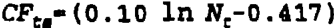
**`CF t,-(0.10 In N`** **`c`** **`-0.417)`**

**`The correction factor for the material selected has been estimated to be about`**

**`1.0 for modified 316 SS and about 3.0 for modified Hastalloy N. The correction`**

**`factor for nuclear grade (NG) has been estimated at 2.5. However, better values`**

**`for these correction factors must be obtained 1n FY91.`**

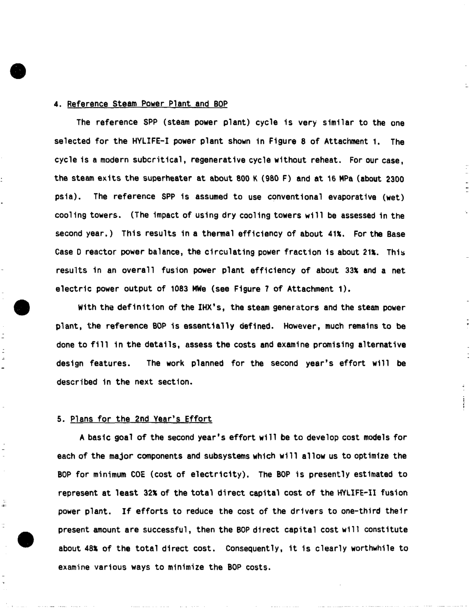
## **`4. Reference Steam Power Plant and BOP`**

**`The reference SPP (steam power plant) cycle 1s very similar to the one`**

**`selected for the HYLIFE-I power plant shown 1n Figure 8 of Attachment 1. The`**

**`cycle 1s a modern subcritlcal, regenerative cycle without reheat. For our case,`**

**`the steam exits the superheater at about 800 K (980 F) and at 16 HPa (about 2300`**

**`psia).`** **`The reference SPP 1s assumed to use conventional evaporative (wet)`**

**`cooling towers. (The Impact of using dry cooling towers will be assessed In the`**

**`second year.) This results 1n a thermal efficiency of about 41%. For the Base`**

**`Case D reactor power balance, the circulating power fraction 1s about 21*. This`**

**`results 1n an overall fusion power plant efficiency of about 33% and a net`**

**`electric power output of 1083 MWe (see Figure 7 of Attachment 1).`**

**`With the definition of the IHX's, the steam generators and the steam power`**

**`plant, the reference BOP 1s essentially defined. However, much remains to be`**

**`done to fill 1n the details, assess the costs and examine promising alternative`**

**`design features.`** **`The work planned for the second year's effort will be`**

**`described 1n the next section.`**

## **`5. Plans for the 2nd Year's Effort`**

**`A basic goal of the second year's effort will be to develop cost models for`**

**`each of the major components and subsystems which will allow us to optimize the`**

**`BOP for minimum COE (cost of electricity). The BOP 1s presently estimated to`**

**`represent at least 32% of the total direct capital cost of the HYLIFE-II fusion`**

**`power plant. If efforts to reduce the cost of the drivers to one-third their`**

**`present amount are successful, then the BOP direct capital cost will constitute`**

**`about 48% of the total direct cost. Consequently, 1t 1s clearly worthwhile to`**

**`examine various ways to minimize the BOP costs.`**

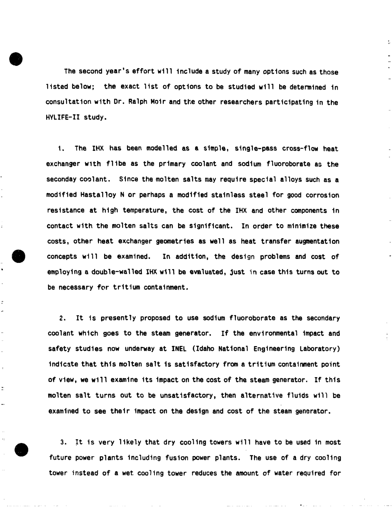

**`The second year's effort will Include a study of many options such as those`**

**`listed below; the exact 11st of options to be studied will be determined 1n`**

**`consultation with Dr. Ralph Mo1r and the other researchers participating in the`**

**`HYLIFE-II study.`**

**`1.`** **`The IHX has been modelled as a simple, single-pass cross-flow heat`**

**`exchanger with f U b e as the primary coolant and sodium fluoroborate as the`**

**`seconday coolant. Since the molten salts may require special alloys such as a`**

**`modified Hastalloy N or perhaps a modified stainless steel for good corrosion`**

**`resistance at high temperature, the cost of the IHX and other components 1n`**

**`contact with the molten salts can be significant. In order to minimize these`**

**`costs, other heat exchanger geometries as well as heat transfer augmentation`**

**`concepts will be examined.`** **`In addition, the design problems and cost of`**

**`employing a double-walled IHX will be evaluated, just in case this turns out to`**

**`be necessary for tritium containment.`**

**`2.`** **`It 1s presently proposed to use sodium fluoroborate as the secondary`**

**`coolant which goes to the steam generator. If the environmental Impact and`**

**`safety studies now underway at INEL (Idaho National Engineering Laboratory)`**

**`indicate that this molten salt 1s satisfactory from a tritium containment point`**

**`of view, we will examine its Impact on the cost of the steam generator. If this`**

**`molten salt turns out to be unsatisfactory, then alternative fluids will be`**

**`examined to see their impact on the design and cost of the steam generator.`**

## **`3. It is very likely that dry cooling towers will have to be used 1n most`**

**`future power plants including fusion power plants. The use of a dry cooling`**

**`tower instead of a wet cooling tower reduces the amount of water required for`**

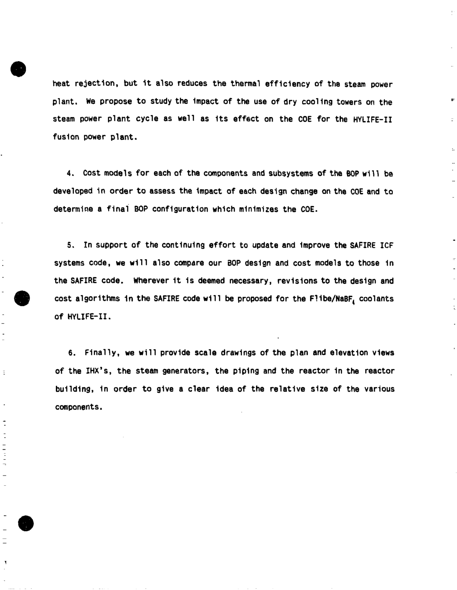

**`heat rejection, but 1t also reduces the thermal efficiency of the steam power`**

**`plant. We propose to study the Impact of the use of dry cooling towers on the`**

**`steam power plant cycle as well as Its effect on the COE for the HYLIFE-II`**

**`fusion power plant.`**

## **`4. Cost models for each of the components and subsystems of the BOP will be`**

**`developed 1n order to assess the Impact of each design change on the COE and to`**

**`determine a final BOP configuration which minimizes the COE.`**

## **`5. In support of the continuing effort to update and Improve the SAFIRE ICF`**

**`systems code, we will also compare our BOP design and cost models to those 1n`**

**`the SAFIRE code. Wherever 1t 1s deemed necessary, revisions to the design and`**

**`cost algorithms 1n the SAFIRE code will be proposed for the F!1be/NaBF< coolants`**

**`of HYLIFE-II.`**

## **`6. Finally, we will provide scale drawings of the plan and elevation views`**

**`of the IHX's, the steam generators, the piping and the reactor 1n the reactor`**

**`building, in order to give a clear Idea of the relative size of the various`**

**`components.`**

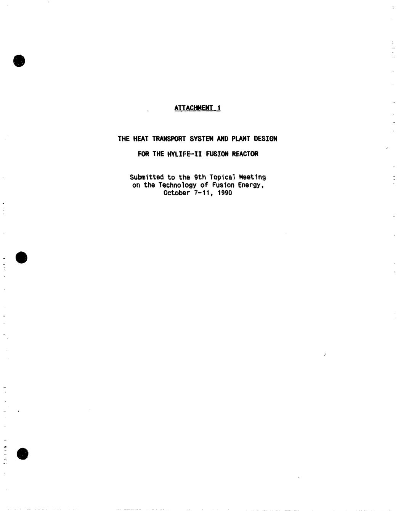
## **`ATTACHMENT 1`**

**`THE HEAT TRANSPORT SYSTEH AND PLANT DESIGN`**

## **`FOR THE HYLIFE-II FUSION REACTOR`**

**`Submitted to the 9th Topical Meeting`**
**`on the Technology of Fusion Energy,`**
**`October 7-11, 1990`**

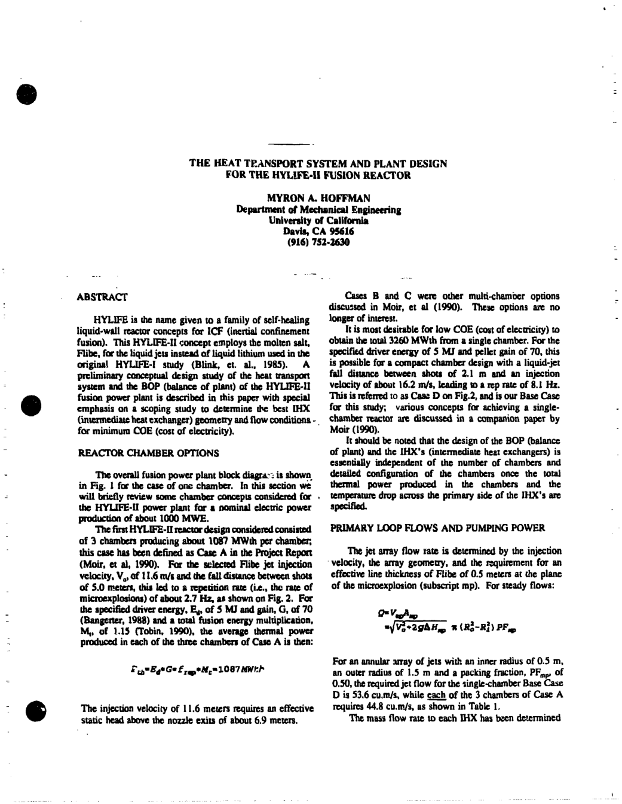

**THE HEAT TRANSPORT SYSTEM AND PLANT DESIGN**
## **FOR THE HYLIFE-II FUSION REACTOR** **MYRON A. HOFFMAN**

**Department of Mechanical Engineering**
**University of California**
**Davis, CA 95616**
**(916) 752-2630**

## **ABSTRACT**

**HYLIFE is die name given to a family of self-healing**
**liquid-wall reactor concepts for ICF (ineitial confinement**
**fusion). This HYUFE-II concept employs the molten salt,**
**Flibe, for the liquid jets instead of liquid lithium used in the**
## **original HYUFE-I study (Blink, et. al.. 1985). A**

**preliminary conceptual design study of the heat transport**
**system and the BOP (balance of plant) of the HYUFE-H**
**fusion power plant is described in this paper with special**
**emphasis on a scoping study to determine the best IHX**
**(intermediate heat exchanger) geometry and flow conditions •**
**for minimum COE (cost of electricity).**

## **REACTOR CHAMBER OPTIONS**

**The overall fusion power plant block diagram is shown**
**in Fig. 1 for the case of one chamber. In this section we**
**will briefly review some chamber concepts considered for**
**the HYLIFE-II power plant for a nominal electric power**
**production of about 1000 MWE.**
**The first HYLIFE-II reactor design considered consisted**
**of 3 chambers producing about 1087 MWth per chamber,**
**this case has been defined as Case A in the Project Report**
**(Moir, et al, 1990). For the selected Flibe jet injection**
**velocity, V0, of 11.6 m/s and the fall distance between shots**
**of 5.0 meters, this led to a repetition rate (i.e., the rate of**
**microexplosions) of about 2.7 Hz, a* shown on Fig. 2. For**
**the specified driver energy, E* of 5 MJ and gain, G, of 70**
**(Bangerter, 1988) and a total fusion energy multiplication,**
**M,, of 1.15 fTobin, 1990), the average thermal power**
**produced in each of the three chambers of Case A is then:**

**r' t t-ff d*G«f r v*lf~ c-l087MIN:/'**

**The injection velocity of 11.6 meters requites an effective**
**static head above the nozzle exits of about 6.9 meters.**

**Cases B and C were other multi-chamber options**
**discussed in Moir, et al (1990). These options are no**
**longer of interest.**
**It is most desirable for low COE (cost of electricity) to**
**obtain the total 3260 MWth from a single chamber. For the**
**specified driver energy of 5 MJ and pellet gain of 70, this**
**is possible for a compact chamber design with a liquid-jet**
**fall distance between shots of 2.1 m and an injection**
**velocity of about 16.2 m/s, leading to a rep rate of 8.1 Hz.**
**This is referred to as Case D on Fig.2, and is our Base Case**
**for this study; various concepts for achieving a single-**
**chamber reactor are discussed in a companion paper by**
**Moir (1990).**
**It should be noted that the design of the BOP (balance**
**of plant) and the IHX's (intermediate heat exchangers) is**
**essentially independent of the number of chambers and**
**detailed configuration of the chambers once the total**
**thermal power produced in the chambers and the**
**temperature drop across the primary side of the IHX's are**
**specified.**

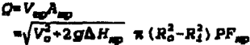
## **PRIMARY LOOP FLOWS AND PUMPING POWER**

**The jet array flow rate is determined by the injection**
**velocity, the array geometry, and the requirement for an**
**effective line thickness of Flibe of 0.5 meters at the plane**
**of the microexplosion (subscript mp). For steady flows:**

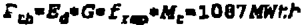

**For an annular array of jets with an inner radius of 0.5 m,**
**an outer radius of 1.5 m and a packing fraction, PF,^, of**
**0.50, the required jet flow for the tingle-chamber Base Case**
**D is 53.6 cu.m/s, while each of the 3 chambers of Case A**
**requires 44.8 cu.m/s, as shown in Table 1.**
**The mass flow rate to each IHX has been determined**

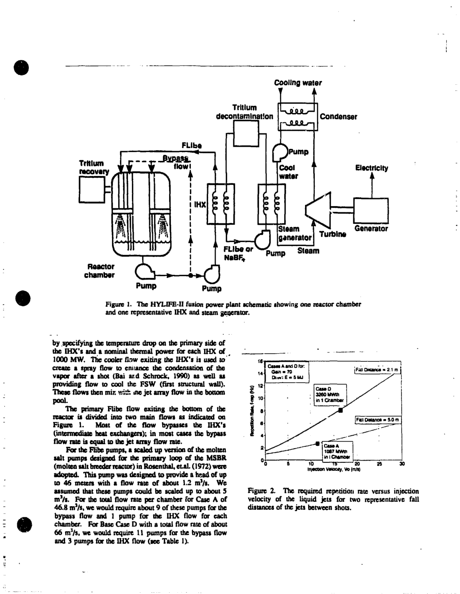

**Cooling water**
## **f A**

**Tritium**
**decontamination**

**'-vJLftJLr-1**
## **JUUL**

**Condenser**

**Electricity**
**a**

**Tritium**
**raeoveiy**
##### **D**

**FLIbe**

.--—Bw&m.
**w** **flow i**

## **I IHX**

**[jPump**

**Cool**
**water**

_**h**_

**Reactor**
**chamber**
#### **s Pump**

**Pump**

## **J_ Steam ' v * * ., Generator** **n generator T u r t > " »**

**Pump** **Steam**

## **I** **I** **I**

**FLIbe or**
**NaBF,**

## **I** **I** **I**

**Pump** _**6**_

**Figure 1. The HYLIFE-II fusion power plant schematic showing one reactor chamber**
**and one representative IHX and steam generator.**

**by .specifying the temperature drop on the primary side of**
**the IHX's and a nominal thermal power for each IHX of,**
## **1000 MW. The cooler flaw exiting the IHX's is used to**

**create a spray flow to eniiance the condensation of the**
**vapor after a shot (Bai arid Schrock, 1990) as well as**
**providing flow to cool the FSW (first structural wall).**
**These flows then mir, with me jet array flow in the bottom**
**pool**
**The primary Flibe flow exiting the bottom of the**
**reactor is divided into two main flows as indicated on**
**Figure 1.** **Most of the flow bypasses the IHX's**
**(intermediate heat exchangers); in most cases the bypass**
**flow rate is equal to the jet array flow rate.**
**For the Flibe pumps, a scaled up version of the molten**
**salt pumps designed for the primary loop of the MSBR**
**(molten salt breeder reactor) u Rosenthal, euL (1972) were**
**adopted. This pump was designed to provide a hsad of up**
**to 46 meters with a flow rate of about 1.2 m'/s. We**
**assumed that these pumps could be scaled up to about 5**
**mVs. For the total flow rate per chamber for Case A of**
**46.8 m3/s. we would require about 9 of these pumps for the**
**bypass flow and 1 pump for the IHX flow for each**
**chamber. For Base Case D with a total flow rate of about**
**66 mVs. we would require 11 pumps for the bypass flow**
**and 3 pumps for the IHX flow (see Table 1).**

**M)KMn VMdaty, Wo (m/H**

**Figure 2. The required repetition rate versus injection**
**velocity of the liquid jets for two representative fall**
**distances of the jets between shots.**

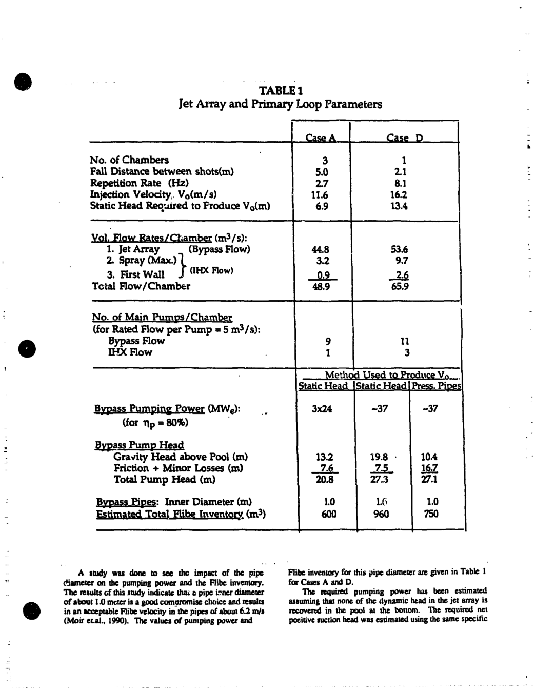
## **• TABLE 1**

**Jet Array and Primary Loop Parameters**

**Case A** **Case D**

**No. of Chambers** **3** **1**
**Fall Distance between shots(m)** **5.0** **2.1**
**Repetition Rate (Hz)** **17** **8.1**
**Injection Velocity,, V** **a(m/s)** **11.6** **16.2**
**Static Head Required to Produce V0(m)** **6.9** **13.4**

**Vol. Flow Rates/Chamber fm3/s):**
## **1. Jet Array (Bypass Flow) 44.8 53.6** **2. Spray (Max.)"! 3.2 9.7** **3. First Wall J <«« Flow) 0.9 2.6**

**Total Flow/Chamber** **48.9** **65.9**

**No. of Main Pumos/Chamber**
**(for Rated Flow per Pump = 5 m** **3/s):**
**Bypass Flow** **9** **11**
**IHXFlow** **1** **3**

Method Used to Produce V»
Static Head Static Head **Press. Pipes|**

Bypass Pumping Power (MWa):
(for tip = 80%)

Bypass Pump Head
Gravity **Head above** Pool (m)
Friction **+ Minor** Losses (m)
**Total Pump Head (m)**

Bypass Pipes: **Inner** Diameter (m)
Estimated Total Flibe Inventory _(mh_

**A study was done to see the impact of the pipe**
**diameter on the pumping power and the Flibe inventory.**
**The results of this study indicate that a pipe bner diameter**
**of about 1.0 meter is a good compromise choice and results**
**in an acceptable Flibe velocity in the pipes of about 6.2 m/i**
**(Moir et-al., 1990). The values of pumping power and**

10.4
16.7
27.1

1.0
750

**3x24**

13.2
_JLL._
**20.8**

1.0
600

**1.0**
**960**

**Flibe inventory for this pipe diameter are given in Table 1**
**for Cases A and D.**
**The required pumping power has been estimated**
**assuming that none of the dynamic head in the jet array is**
**recovered in the pool at the bottom. The required net**
**positive suction head was estimated using the same specific**

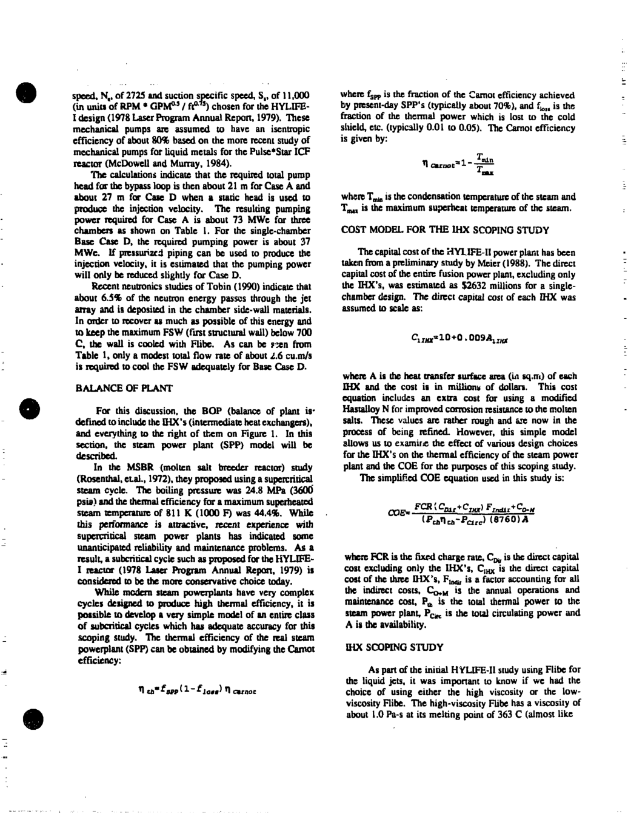

**speed, N** **t, of 2725 and suction specific speed, S„ of 11,000**
**(in unin of RPM • GPM" / ft**) chosen for the HYUFE-**
**I design (1978 Laser Program Annual Repon, 1979). These**
**mechanical pumps are assumed to have an isentropic**
**efficiency of about 80% based on the more recent study of**
**mechanical pumps for liquid metals for the Pulse*Star ICF**
**reactor (McDowell and Murray, 1984).**
**The calculations indicate dial the required total pump**
**head for the bypass loop is then about 21 m for Case A and**
**about 27 m for Case D when a static head is used to**
**produce the injection velocity.** **The resulting pumping**
**power required for Case A is about 73 MWe for three**
**chambers as shown on Table 1. For the single-chamber**
**Base Case D, the required pumping power is about 37**
**MWe. If pressurized piping can be used to produce die**
**injection velocity, it is estimated that the pumping power**
**will only be reduced slightly for Case D.**
**Recent neutronics studies of Tobin (1990) indicate that**
**about 6.5% of the neutron energy passes through the jet**
**array and is deposited in die chamber side-wall materials.**
**In order to recover as much as possible of this energy and**
**to keep the maximum FSW (first structural wall) below 700**
**C, the wall is cooled with Flibe. As can be** _**sxn**_ **from**
**Table 1, only a modest total flow rate of about** _**lA**_ **cu.m/s**
**is required to cool the FSW adequately for Base Case D.**

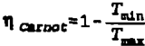
## **BALANCE OF PLANT**

**For this discussion, die BOP (balance of plant is-**
**defined to include the IHX's (intermediate heat exchangers),**
**and everything to die right of them on Figure 1. In this**
**section, the steam power plant (SPP) model will be**
**described.**
**In the MSBR (molten salt breeder reactor) study**
**(Rosenthal, etal., 1972), they proposed using a supercritical**
**steam cycle. The boiling pressure was 24.8 MPa (3600**
**psia) and the thermal efficiency for a maximum superheated**
**steam temperature of 811 K (1000 F) was 44.4%. While**
**this performance is attractive, recent experience with**
**supercritical steam power plants has indicated some**
**unanticipated reliability and maintenance problems. As a**
**result, a subcrirical cycle such as proposed for die HYLIFE-**
**I reactor (1978 Laser Program Annual Repon, 1979) is**
**considered to be die more conservative choice today.**
**While modem steam powerplants have very complex**
**cycles designed to produce high diermal efficiency, it is**
**possible to develop a very simple model of an entire class**
**of subcritical cycles which has adequate accuracy for this**
**scoping study. The diermal efficiency of die real steam**
**powerplant (SPP) can be obtained by modifying die Camot**
**efficiency:**

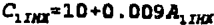

**1** _**ttTfm^'floiJ**_ **1 cwnoe**

**whereby present-day SPP's (typically about 70%), and f^,, is the f** **sp? is the fraction of the Camot efficiency achieved**
**fraction of die thermal power which is lost to the cold**
**shield, etc. (typically 0.01 to 0.05). The Carnot efficiency**
**is given by:**
## **tl a1 - °^n x T**

**"1 Orooc** **"y—**

**where T m U l is die condensation temperature of die steam and**
## **T M 1 is the maximum superheat temperature of die steam.**

**COST MODEL FOR THE IHX SCOPING STUDY**

**The capital cost of the HYUFE-II power plant has been**
**taken from a preliminary study by Meier (1988). The direct**
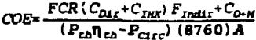
**capital cost of die entire fusion power plant, excluding only**
**die IHX's, was estimated as $2632 millions for a single-**
**chamber design. The direct capital cost of each IHX was**
**assumed to scale as:**

_**C1Ila'lO*Q.009Aim**_

**where A is die heat transfer surface area (in sq.m) of each**
**IHX and die cost is in million* of dollars. This cost**
**equation includes an extra cost for using a modified**
**Hastalloy N for improved corrosion resistance to the molten**
**salts. These values are rather rough and are now in the**
**process of being refined. However, this simple model**
**allows us to examiiie die effect of various design choices**
**for die IHX's on die thermal efficiency of die steam power**
**plant and the COE for die purposes of this scoping study.**
**The simplified COE equation used in this study is:**

## **rpp- f C R > c aif* c r«r) Findir*co-n** **(Pcflo-Pazc) (8760M**

**where FCR is the fixed charge rate, C^, is die direct capital**
**cost excluding only die IHX's, C I H X is die direct capital**
**cost of die tiiree IHX's, F** **^ is a factor accounting for all**
**the indirect costs, CQ,** **M is die annual operations and**
**maintenance cost, P t t is the total diermal power to die**
**steam power plant, P ^ is die total circulating power and**
**A is die availability.**

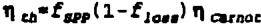
## **IHX SCOPING STUDY**

**As pan of the initial HYUFE-II study using Flibe for**
**die liquid jets, it was important to know if we had the**
**choice of using either die high viscosity or the low-**
**viscosity Flibe. The high-viscosity Flibe has a viscosity of**
**about 1.0 Pa-s at its melting point of 363 C (almost like**

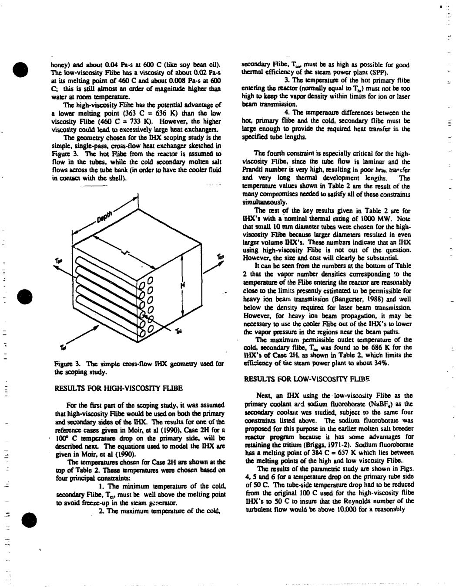

**honey) and about 0.04 Pa-s at 600 C (like soy bean oil).**
**The low-viscosity Flibe has a viscosity of about 0.02 Pa-s**
**at Us melting point of 460 C and about 0.008 Pa-s at 600**
**C; this is still almost an order of magnitude higher than**
**water at room temperature.**
**The high-viscosity Flibe has the potential advantage of**
**a lower melting point (363 C = 636 K) than the low**
**viscosity Flibe (460 C = 733 K). However, the higher**
**viscosity could lead to excessively large heat exchangers.**
**The geometry chosen for the IHX scoping study is the**
**simple, single-pass, cross-flow heat exchanger sketched in**
**Figure 3. The hot Flibe from the reactor is assumed to**
**flow in the tubes, while the cold secondary molten salt**
**flows across the tube bank (in order to have die cooler fluid**
**in contact with the shell).**

**Figure 3. The simple cross-flow IHX geometry used for**
**the scoping study.**

## **RESULTS FOR HIGH-VISCOSITY FLIBE**

**For the first part of the scoping study, it was assumed**
**that high-viscosity Flibe would be used on both the primary**
**and secondary sides of the IHX. The results for one of the**
**reference cases given in Moir, et al (1990), Case 2H for a**
**100° C temperature drop on the primary side, will be**
**described next. The equations used to model the IHX are**
**given in Moir, et al (1990).**
**The temperatures chosen for Case 2H are shown at the**
**top of Table 2. These temperatures were chosen based on**
**four principal constraints:**
## **1. The minimum temperature of the cold,**

**secondary Flibe, T B, must be well above the melting point**
**to avoid freeze-up in the steam generator.**
## **2. The maximum temperature of the cold,**

**secondary Flibe, T m, must be as high as possible for good**
**thermal efficiency of the steam power plant (SPP).**
## **3. The temperature of the hot primary flibe**

**entering the reactor (normally equal to TJ must not be too**
**high to keep the vapor density within limits for ion or laser**
**beam transmission.**
## **4. The temperature differences between the**

**hot, primary flibe and the cold, secondary flibe must be**
**large enough to provide the required heat transfer in the**
**specified tube lengths.**

**The fourth constraint is especially critical for the high-**
**viscosity Flibe, since the tube flow is laminar and the**
**Prandtl number is very high, resulting in poor hea; transfer**
**and very long thermal development lengths.** **The**
**temperature values shown in Table 2 are the result of the**
**many compromises needed to satisfy all of these constraints**
**simultaneously.**
**The rest of the key results given in Table 2 are for**
**IHX's with a nominal thermal rating of 1000 MW. Note**
**that small 10 mm diameter tubes were chosen for the high-**
**viscosity Flibe because larger diameters resulted in even**
**larger volume IHX's. These numbers indicate that an IHX**
**using high-viscosity Flibe is not out of the question.**
**However, the size and cost will clearly be substantial.**
**It can be seen from the numbers at the bottom of Table**
**2 that the vapor number densities corresponding to the**
**temperature of the Flibe entering the reactor are reasonably**
**close to the limits presently estimated to be permissible for**
**heavy ion beam transmission (Bangerter, 1988) and well**
**below the density required for laser beam transmission.**
**However, for heavy ion beam propagation, it may be**
**necessary to use the cooler Flibe out of the IHX's to lower**
**the vapor pressure in the regions near the beam paths.**

**The maximum permissible outlet temperature of the**
**cold, secondary flibe, TIHX's of Case 2H, as shown in Table 2, which limits the M was found to be 686 K for the**
**efficiency of the steam power plant to about 34%.**

## **RESULTS FOR LOW-VISCOSITY FLIBE**

**Next, an IHX using the low-viscosity Flibe as the**
**primary coolant ai'd sodium fluoroborate (NaBF4) as the**
**secondary coolant was studied, subject to the same four**
**constraints listed above. The sodium fluoroborate was**
**proposed for this purpose in the earlier molten salt breeder**
**reactor program because it has some advantages for**
**retaining the tritium (Briggs, 1971-2). Sodium fluoroborate**
**has a melting point of 384 C = 657 K which lies between**
**the melting points of the high and low viscosity Flibe.**
**The results of the parametric study are shown in Figs.**
**4, 5 and 6 for a temperature drop on the primary tube side**
**of SO C. The tube-side temperature drop had to be reduced**
**from the original 100 C used for the high-viscosity flibe**
**IHX's to SO C to insure that the Reynolds number of the**
**turbulent flow would be above 10,000 for a reasonably**

## TABLE 2
### Intermediate Heat Exchangers

| Key Parameters | | High-Viscosity Flibe (Case 2H) | Low-Viscosity Flibe/NaBF₄ (Case 20c2) |
|---|---|---|---|
| Primary Fluid Inlet T$_{hi}$ | (K) | 863 | 923 |
| Primary Fluid Outlet T$_{ho}$ | (K) | 763 | 873 |
| Secondary Fluid Inlet T$_{ci}$ | (K) | 676 | 793 |
| Secondary Fluid Outlet T$_{co}$ | (K) | 686 | 823 |
| Thermal Rating, P$_{th}$ | (MW$_{th}$) | 1000 | 1000 |
| Tube Length, L$_t$ | (m) | 10 | 10 |
| Tube Bundle Height, H | (m) | 5.33 | 3.0 |
| Tube Bundle Depth, D$_{TB}$ | (m) | 4.93 | 3.7 |
| Vol. of Tube Bundle | (m³) | 265 | 111.7 |
| Tube outer diam., D$_o$ | (m) | 0.01 | 0.02 |
| **Tube Side:** | | | |
| Hot, Primary Flow Rate | (kg/s) | 4250 | 8400 |
| Pressure Drop | (MPa) | 0.25 | 0.070 |
| Pumping Power | (MW$_e$) | 2.0 | 0.36 |
| **Shell Side:** | | | |
| Cold, Secondary Flow Rate | (kg/s) | 42,530 | 22,100 |
| Pressure Drop | (MPa) | 0.48 | 0.020 |
| Pumping Power | (MW$_e$) | 37.7 | 0.29 |
| Overall Heat Transfer Coeff, U$_0$ | (W/m²·K) | 335 | 2324 |
| Heat Transfer Area A$_{0(HT)}$ | (m²) | 23,500 | 4950 |
| Number of Tubes | | 75,000 | 7880 |
| A$_{0(HT)}$/Vol. of Tube Bundle | (m²/m³) | 88.6 | 44.3 |
| P$_{th}$/Vol. Tube Bundle | (MW/m³) | 3.77 | 9.0 |
| Steam Powerplant Efficiency | | 34.0% | 41.2% |
| n$_{vapor}$ (T$_{hi}$) | (cm⁻³) | $-7\times10^{13}$ | $-5\times10^{13}$ |
| Acceptable n$_{vapor}$ for Ion Beams | | $-5\times10^{13}$ [?] | $-5\times10^{13}$ [?] |
| Acceptable n$_{vapor}$ for Lasers | | $\sim10^{15}$ [?] | $\sim10^{15}$ [?] |

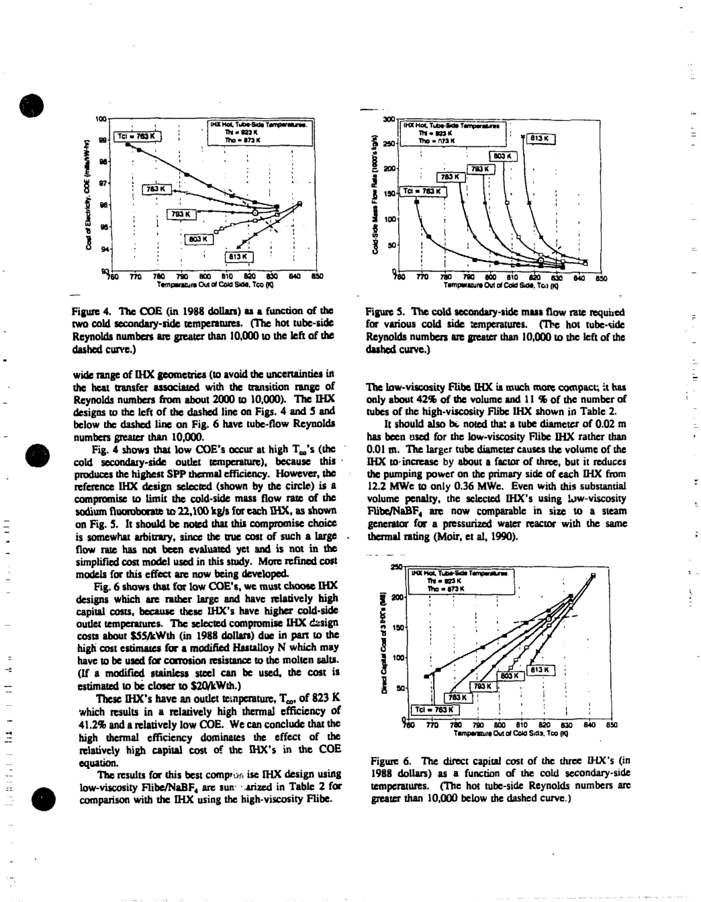

**99**

## **[ Td • 763 K | I ;**

**IHX Hot Tubr&di TmVinKm:**

**IHX Hot. TU»»d> l** **«** **|** **n** **i** **a**
## **I N . K W** **J Tho-n?JK f[_ai3Kj**

**£ aso J**
**u**

**| 603 ***
## **; 783K | 1** **| 7MK |.**

**s**

## ***760 770 780 790 BOO 810 890 630 MO 850**

**T«npanturaOulofColdSKM.Tca(iq**

**Figure 4. The COE (in 1988 dollars) as a function of the**
**two cold secondary-tide temperatures. (The hot tube-side**
**Reynolds numbers are greater than 10,000 to the left of the**
**dashed curve.)**

**wide range of IHX geometries (to avoid the uncertainties in**
**the heat transfer associated with the transition range of**
**Reynolds numbers from about 2000 to 10,000). The IHX**
**designs to the left of the dashed line on Figs. 4 and S and**
**below the dashed line on Fig. 6 have tube-flow Reynolds**
**numbers greater than 10,000.**
**Fig. 4 shows that low COE's occur at high T„'s (the**
**cold secondary-side outlet temperature), because this -**
**produces the highest SPP thermal efficiency. However, the**
**reference IHX design selected (shown by the circle) is a**
**compromise to limit the cold-side mass flow rate of the**
**sodium fluoroborate to 22,100 kg/s for each IHX, as shown**
**on Fig. S. It should be noted that this compromise choice**
**is somewhat arbitrary, since the true cost of such a large**
**flow rate has not been evaluated yet and is not in the**
**simplified cost model used in this study. More refined cost**
**models for this effect are now being developed.**
**Fig. 6 shows that for low COE's, we must choose IHX**
**designs which are rather large and have relatively high**
**capital costs, because these IHX's have higher cold-side**
**outlet temperatures. The selected compromise IHX design**
**costs about $5S/kWth (in 1988 dollars) due in part to the**
**high cost estimates for a modified Hastalloy N which may**
**have to be used for corrosion resistance to the molten salts.**
**(If a modified stainless steel can be used, the cost is**
**estimated to be closer to $20/kWth.)**
**These IHX's have an outlet temperature, T** **m** **, of 823 K**
**which results in a relatively high thermal efficiency of**
**41.2% and a relatively low COE. We can conclude that the**
**high thermal efficiency dominates the effect of the**
**relatively high capital cost of the IHX's in the COE**
**equation.**
**The results for this best compter, ise IHX design using**
**low-viscosity Flibe/NaBF4 are sun- • .arized in Table 2 for**
**comparison with the IHX using the high-viscosity Flibe.**

_m_
## **S [** **| ISO**

**u.**
**a** **100**

*****
## **I -1**

**i** **\**

**!** **i** **V\l**

**fiQ** **770** **i**

**Tampwalurt Out of CoU Sid*. Tcti (K)**

**Figure S. The cold secondary-side mass flow rate requited**
**for various cold side temperatures. (The hot tube-side**
**Reynolds numbers are greater than 10,000 to the left of the**
**dashed curve.)**

**The low-viscosity Flibe IHX is much more compact; it has**
**only about 42% of the volume and 11 % of die number of**
**tubes of the high-viscosity Flibe IHX shown in Table 2.**
**It should also be. noted that a tube diameter of 0.02 m**
**has been used for the low-viscosity Flibe IHX rather than**
**0.01 m. The larger tube diameter causes the volume of the**
**IHX tO'increase by about a factor of three, but it reduces**
**die pumping power on the primary side of each IHX from**
### **12.2 MWe to only 0.36 MWe. Even with this substantial**

**volume penalty, the selected IHX's using low-viscosity**
**Flibe/NaBF, are now comparable in size to a steam**
**generator for a pressurized water reactor with the same**
**thermal rating (Moir, et al, 1990).**

**IHX Hat. TiAcSafc T** **o** **p** **n** **u** **a**
## **T N . 9 M K**

**Tho-lTJK**

## **760 770 780 780 BOO 610 820 630 840 850**

**Tfcmpraura Out of Cold Sidi. Too (K)**

**Figure 6. The direct capital cost of the three IHX's (in**
**1988 dollars) as a function of the cold secondary-side**
**temperatures. (The hot tube-side Reynolds numbers arc**
**greater than 10,000 below the dashed curve.)**

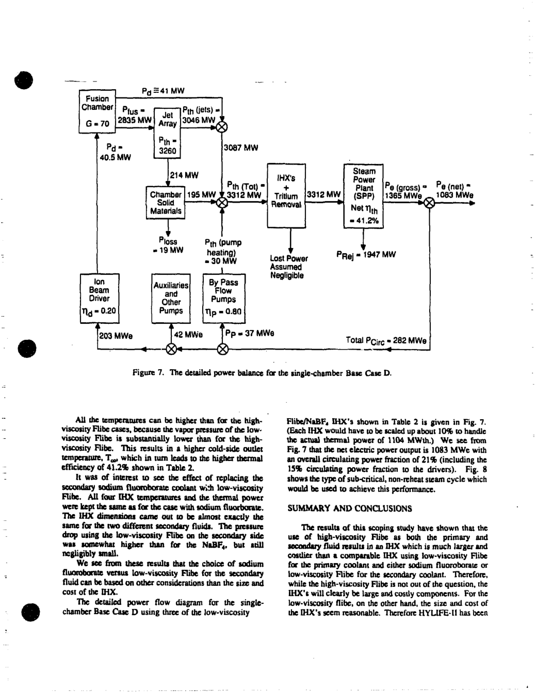

**Fusion**
**Chamber**

## **G-70**

**—** **j**

**Pfus-**
## **2835 MW**

## **P d = 4 1 MW**

**Pth (Jets) -**
**3 0 4 6 M W X**

## **3087 MW**

**P d -**
## **40.S MW**

**Ion**
**Beam**
**Driver**

**Tl** **d** **-0.20**

## **203 MWe**

**Jet**
**Array**

**Plh-**
**3260**

**Pp - 37 MWe**

**& -**

## **214 MW**

**Lost Power**
**Assumed**
**Negligible**

**p**

**Pe (gross)** **e (net) •**
## **1365 MWe ^ 1083 MWe**

**Chamber**
**Solid**
**Materials**

**Ploss**
## **• 19MW**

**p** **th (Tot) •**
## **195 MW ±3312 MW** **H &**

**Pth (pump**
**heating)**
## **- 3 0 M W** **_J**

**PRej -1947 MW**

**Total Pcirc - 282 MWe**

**Auxiliaries**
**and**
**Other**
**Pumps**

**By Pass**
**Flow**
**Pumps**
**T)p - 0.80**

**Figure 7. The detailed power balance for the single-chamber Base Case O.**

**All the temperatures can be higher than for the high-**
**viscosity Flibe cases, because the vapor pressure of the low-**
**viscosity Flibe is substantially lower than for the high-**
**viscosity Flibe. This results in a higher cold-side outlet**
**temperature, T„, which in turn leads to the higher thermal**
**efficiency of 41.2% shown in Table 2.**
**It was of interest to see the effect of replacing the**
**secondary sodium fluoroborate coolant with low-viscosity**
**Flibe. All four IHX temperatures and the thermal power**
**were kept the same as for the case with sodium fluorborate.**
**The IHX dimensions came out to be almost exactly the**
**same for the two different secondary fluids. The pressure**
**drop using the low-viscosity Flibe on the secondary side**
**was somewhat higher than for the NaBF«, but still**
**negligibly small.**
**We see from these results that the choice of sodium**
**fluoroborate versus low-viscosity Flibe for the secondary**
**fluid can be based on other considerations than the size and**
**cost of the IHX.**
**The detailed power flow diagram for the single-**
**chamber Base Case D using three of the low-viscosity**

**Flibe/NaBF4 IHX's shown in Table 2 is given in Fig. 7.**
**(Each IHX would have to be scaled up about 10% to handle**
**the actual thermal power of 1104 MWth.) We see from**
**Fig. 7 that the net electric power output is 1083 MWe with**
**an overall circulating power fraction of 21% (including the**
**15% circulating power fraction to the drivers).** **Fig. 8**
**shows the type of sub-critical, non-reheat steam cycle which**
**would be used to achieve this performance.**

## **SUMMARY AND CONCLUSIONS**

**The results of this scoping study have shown that the**
**use of high-viscosity Flibe as both the primary and**
**secondary fluid results in an IHX which is much larger and**
**costlier than a comparable IHX using low-viscosity Flibe**
**for the primary coolant and either sodium fluoroborate or**
**low-viscosity Flibe for the secondary coolant. Therefore,**
**while the high-viscosity Flibe is not out of the question, the**
**IHX's will clearly be large and costly components. For the**
**low-viscosity flibe, on the other hand, the size and cost of**
**the IHX's seem reasonable. Therefore HYLIFE-I1 has been**

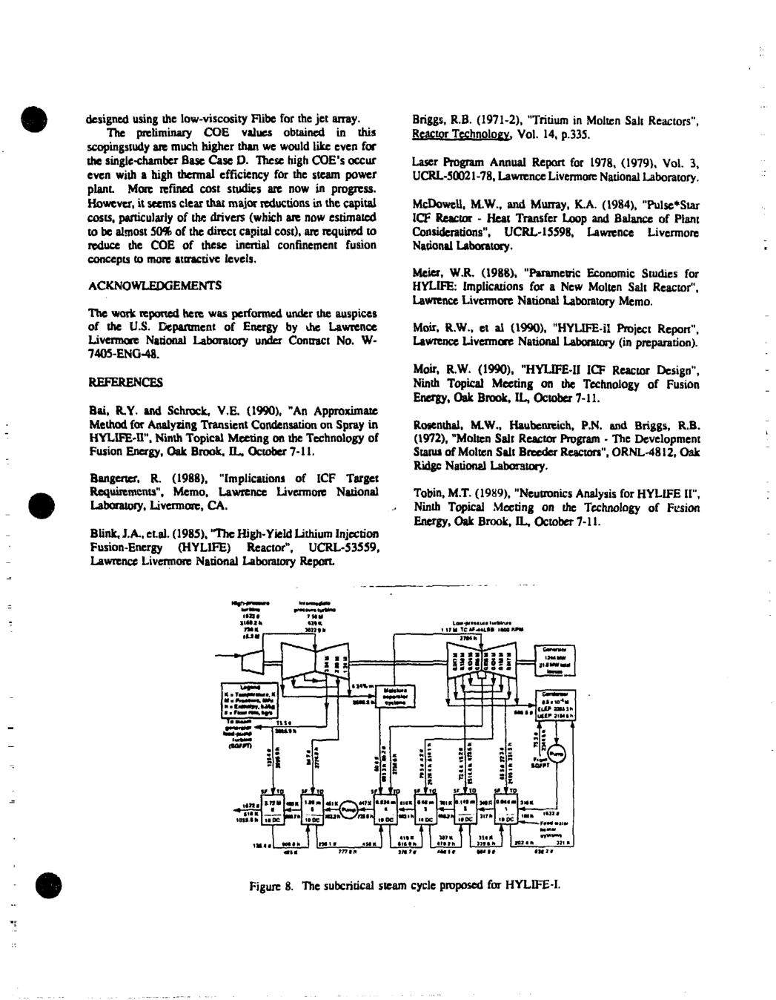

**designed using the low-viscosity Flibe for the jet array.**
**The preliminary COE values obtained in this**
**scopingstudy are much higher than we would like even for**
**the single-chamber Base Case D. These high COE's occur**
**even with a high thermal efficiency for the steam power**
**plant.** **More refined cost studies are now in progress.**
**However, it seems clear that major reductions in the capital**
**costs, particularly of the drivers (which are now estimated**
**to be almost 50% of the direct capital cost), are required to**
**reduce the COE of these inertial confinement fusion**
**concepts to more attractive levels.**

## **ACKNOWLEDGEMENTS**

**The work reported here was performed under the auspices**
**of the U.S. Department of Energy by the Lawrence**
**Livermore National Laboratory under Contract No. W-**
## **7405-ENG-48.** **REFERENCES**

**Bai, R.Y. and Schrock, V.E. (1990), "An Approximate**
**Method for Analyzing Transient Condensation on Spray in**
**HYLIFE-U". Ninth Topical Meeting on the Technology of**
**Fusion Energy, Oak Brook, IL. October 7-11.**

**Bangener, R. (1988), "Implications of ICF Target**
**Requirements", Memo, Lawrence Livermore National**
**Laboratory, Livermorc, CA.**

**Blink, J.A., et.al. (1985). "The High-Yield Lithium Injection**
## **Fusion-Energy (HYLIFE) Reactor", UCRL-53559,**

**Lawrence Livermore National Laboratory Report.**

**Briggs, R.B. (1971-2), "Tritium in Molten Salt Reactors",**
**Reactor Technology- Vol. 14, p.335.**

**Laser Program Annual Report for 1978, (1979), Vol. 3,**
**UCRL-50021-78, Lawrence Livermore National Laboratory.**

**McDowell. M.W., and Murray, K.A. (1984), "Pulse*Star**
**ICF Reactor - Heat Transfer Loop and Balance of Plant**
## **Considerations", UCRL-I5598, Lawrence Livermore**

**National Laboratory.**

**Meier, W.R. (1988), "Parametric Economic Studies for**
**HYLIFE: Implications for a New Molten Salt Reactor",**
**Lawrence Livermore National Laboratory Memo.**

**Moir, R.W., et al (1990), "HYUFE-il Project Report",**
**Lawrence Livermore National Laboratory (in preparation).**

**Moir. R.W. (1990), "HYLIFE-II ICF Reactor Design",**
**Ninth Topical Meeting on the Technology of Fusion**
**Energy, Oak Brook, IL, October 7-11.**

**Rosenthal, M.W., Haubenreich, P.N. and Briggs, R.B.**
**(1972), "Molten Salt Reactor Program - The Development**
**Status of Molten Salt Breeder Reactors". ORNL-4812. Oak**
**Ridge National Laboratory.**

**Tobin, M.T. (1989), "Neutronics Analysis for HYLIFE II",**
**Ninth Topical Meeting on the Technology of Fusion**
**Energy, Oak Brook, IL, October 7-11.**

## **1 •!•• T 1 »»K H<« T 1**

**1** **w i,** **I |im«** **w» I I m i . I I inih I I »i»t> I L;**

**Figure 8. The subcriacal steam cycle proposed for HYLIFE-I.**

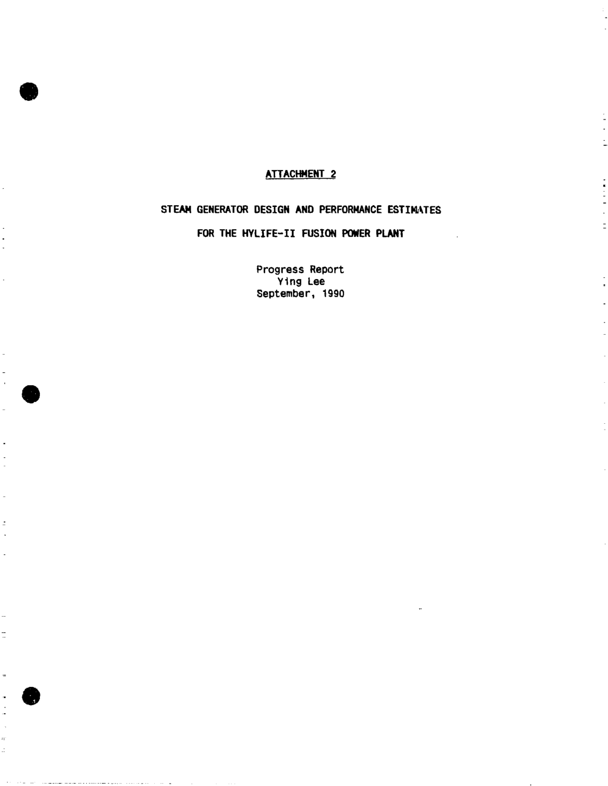
## **`ATTACHMENT 2`** **`STEAM GENERATOR DESIGN AND PERFORMANCE ESTIMATES`** **`FOR THE HYLIFE-II FUSION POWER PLANT`**

`Progress Report`
`Y1ng Lee`
`September, 1990`

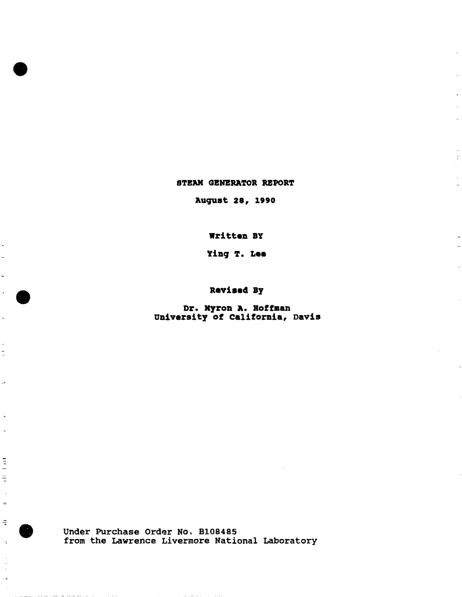
## **`STEAM GENERATOR REPORT`**

**`August 28, 1990`**

**`Written BY`**

**`Ying T. Las`**

**`Revised By`**

**`Dr. Myron A. Hoffman`**
**`University of California, Davis`**

`Under Purchase Order No, B108485`
`from the Lawrence Livenaore National Laboratory`

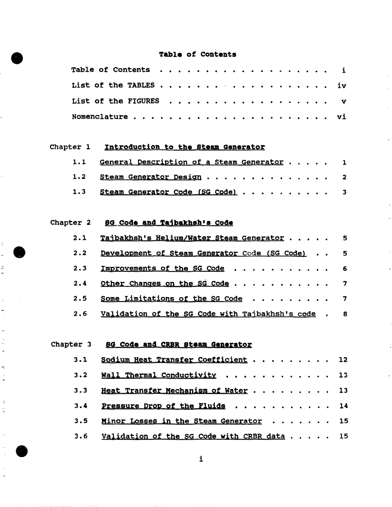

**Table of Contents**

Table of Contents . . . . . . . . . i

List of t h e TABLES iv

List of the FIGURES v

Nomenclature vi

Chapter 1 **Introduction to the Steam Generator**

1.1 General Description of a Steam Generator l

1.2 Steam Generator Design 2

`1-3` `Steam Generator Code (SG Code)` `3`

`Chapter 2` `SO` **`Code and Taibakhah'a Code`**

`2.1` `Ta-ibakhsh's Helium/Water Steam Generator` `5`

`2.2` `Development of steam Generator Code fSG Code) . . 5`

`2.3` `Improvements of the SG Code` `6`

`2.4` `Other Chances on the SG Code` `7`

`2.5` `Some Limitations of the SG Code` `7`

`2.6` `Validation of the SG Code with Taibakhsh's code . 8`

## Chapter 3 BO Code and CRBR steam Generator

`3.1` `Sodium Heat Transfer Coefficient` `12`

`3-2` `Wall Thermal Conductivity` `13`

`3.3` `Heat Transfer Mechanism of Water` `13`

`3.4` `Pressure Drop of the Fluids` `14`

`3.5` `Minor Losses in the Steam Generator` `15`

`3.6` `Validation of the SG Code with CRBR data` `15`

`i`

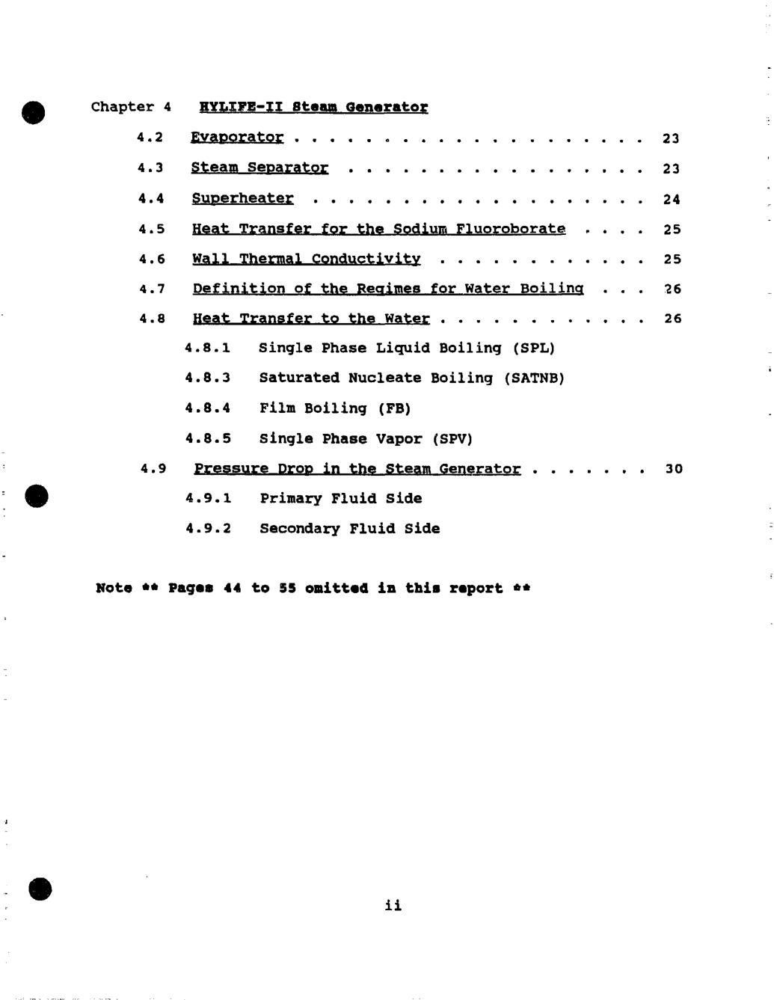

`Chapter 4` `HYLIFE-II` **`steam Generator`**

`4.2` `Evaporator` `.` `23`

`4.3` `Steam Separator` `23`

`4.4` `Superheater` `24`

`4.5` `Heat Transfer for the Sodium Fluoroborate .` `.` `.` `.` `25`

`4.6` `Wall Thermal Conductivity` `25`

`4.7` `Definition of the Regimes for Water Boiling . . .` `26`

`4.8` `Heat Transfer to the Water` `26`

`4.8.1` `Single Phase Liquid Boiling (SPL)`

`4.8.3` `Saturated Nucleate Boiling (SATNB)`

`4.8.4` `Film Boiling (FB)`

`4.8.5` `Single Phase Vapor (SPV)`

`4.9` `Pressure Drop in the Steam Generator` `30`

`4.9.1` `Primary Fluid Side`

`4.9.2` `Secondary Fluid Side`

**`Note ** Pages 44 to 55 omitted in this report **`**

`ii`

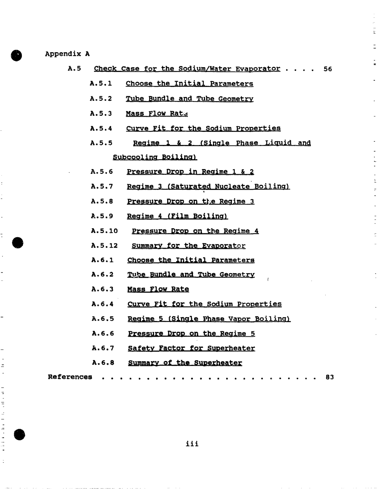
## **`A Appendix A`** **`A.5 Check Case for the Sodium/Water Evaporator . . . . 56`** **`A.5.1 Choose the Initial Parameters`** **`A.5.2 Tube Bundle and Tube Geometry`** **`A.5.3 Mass Flow Rat^`** **`A.5.4 Curve Fit for the Sodium Properties`** **`A.5.5 Regime 1 & 2 (Single Phase Liduid and`**

**`Subcooling Boiling)`**

## **`A.5.6 Pressure Prop in Regime 1 & 2`** **`A.5.7 Regime 3 (Saturated Nucleate Boiling)`** **`A.5.8 Pressure Drop on the Regime 3`** **`A.5.9 Regime 4 (Film Boiling)`** **`A.5.10 Pressure Drop on the Regime 4`** **W A.5.12 summary for the Evaporator** **`A.6.1 Choose the Initial Parameters`** **`A.6.2 Tube Bundle and Tube Geometry`** **`A.6.4 Curve Fit for the Sodium Properties`** **`A.6.5 Regime 5 (Single Phase Vapor Boiling)`** **`A.6.6 Pressure Drop on the Regime 5`** **`A.6.7 Safety Factor for Superheater`** **`A.6.8 Summary of the Superheater`**

**`References`** **`83`**

`iii`

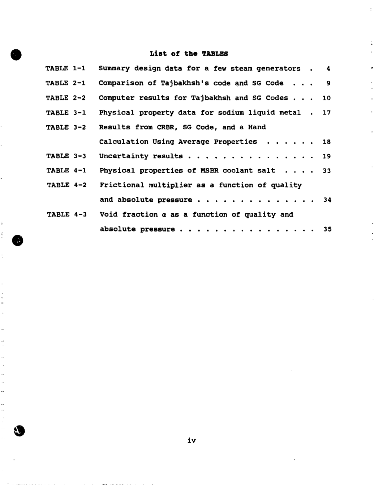

**`List of the TABLES`**

`TABLE 1-1` `Summary design data for a few steam generators .` `4`

`TABLE 2-1` `Comparison of Tajbakhsh's code and SG Code . . .` `9`

`TABLE 2-2` `Computer results for Tajbakhsh and SG Codes . . .` `10`

`TABLE 3-1` `Physical property data for sodium liquid metal . 17`

`TABLE 3-2` `Results from CRBR, SG Code, and a Hand`

`Calculation Using Average Properties` `18`

`TABLE 3-3` `Uncertainty results` `19`

`TABLE 4-1` `Physical properties of MSBR coolant salt .` `.` `.` `.` `33`

`TABLE 4-2` `Frictional multiplier as a function of quality`

`and absolute pressure` `34`

`TABLE 4-3` `Void fraction a as a function of quality and`

`absolute pressure` `35`

`iv`

## List of the FIGURES

| Figure | Caption | Page |
|--------|---------|------|
| FIGURE 2-1 | THTR 300 MW Helium/Water steam generator | 11 |
| FIGURE 3-1 | Hockey stick steam generator design for CRBR study | 20 |
| FIGURE 3-2 | Graphical display of the uncertainty analysis results (TABLE 3-3) | 21 |
| FIGURE 4-1 | Flow diagram of one of the three hockey stick steam generator systems for HYLIFE-II | 36 |
| FIGURE 4-2 | Flow chart of one steam generator system | 37 |
| FIGURE 4-3 | Definition of regimes inside an evaporator | 38 |
| FIGURE 4-4 | Definition of regime inside a superheater | 39 |
| FIGURE 4-5 | Critical heat flux in steam boiling | 40 |
| FIGURE 4-6 | Value of $\phi_{bo}^2$ as a function of pressure and mass quality | 41 |
| FIGURE 4-7 | Void fraction $\alpha$ as a function of pressure and mass quality | 41 |
| FIGURE 4-8 | Value of $r_t$ as a function of pressure and mass quality | 42 |
| FIGURE 4-9 | Scaled-up of the CRBR steam generator | 43 |

## Nomenclature

### Symbols

| Symbol | Description | Units |
|--------|-------------|-------|
| A | area | m² |
| C | cost | M$ |
| $C_p$ | heat capacity | kJ/kg·K |
| D | diameter | m |
| $D_h$ | hydraulic diameter | m |
| $f_a$ | fanning friction factor | |
| G | mass flow rate per unit area | kg/m²·s |
| H | height | m |
| HR | heat rate | |
| h | heat transfer coefficient | W/m²·K |
| i | enthalpy | kJ/kg[?] |
| K | thermal conductivity | W/m·K |
| $K_{minor}$ | minor loss | |
| L | tube length | m |
| $\dot{m}$ | mass flow rate | kg/m² |
| $N_t$ | number of tube | |
| Nu | Nusselt number | |
| $P_{e(gross)}$ | gross electrical power | MW |
| Pr | Prandtl number | |
| $P_{th}$ | thermal power | MW |

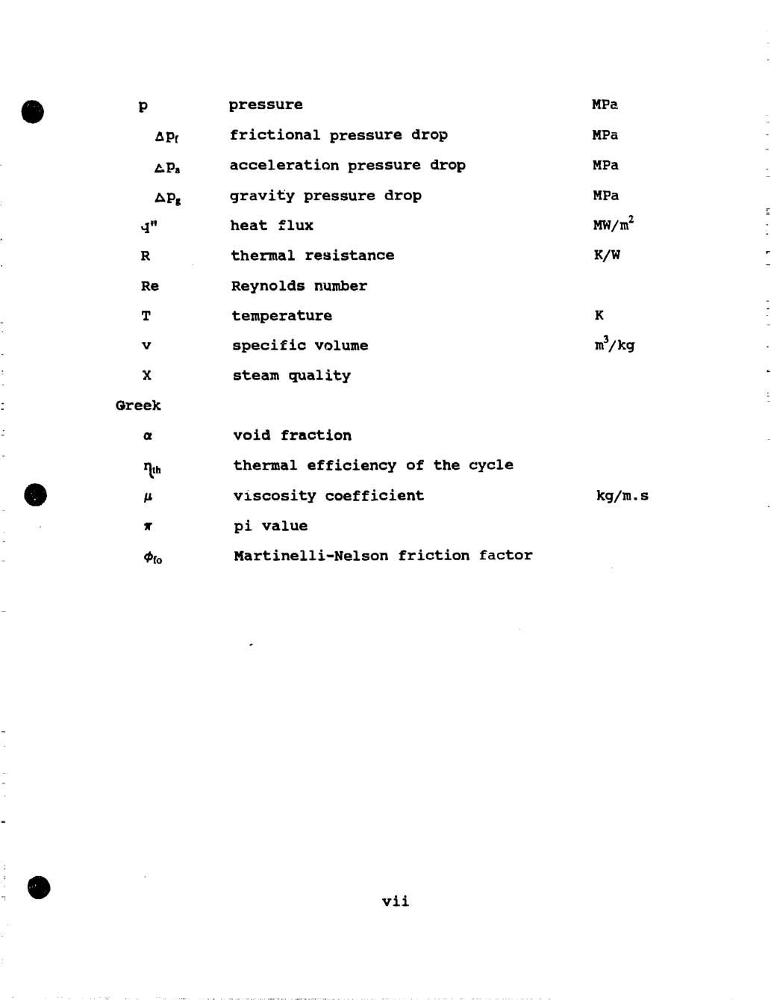

p pressure MPa

APf frictional pressure drop MPa

£.pa acceleration pressure drop MPa

& p g gravity pressure drop MPa

_4"_ heat flux MW/m2

R thermal resistance K/W

Re Reynolds number

T temperature K

v specific volume m3/kg

X steam quality

Greek

a void fraction

n t h thermal efficiency of the cycle

_H_ viscosity coefficient kg/m.s

T pi value

_<p[o_ `Martinelli-Nelson friction factor`

`vii`

**Subscripts**

| Symbol | Meaning |
|--------|---------|
| (number) | referring to number of regimes |
| DNB | departure from nucleate boiling |
| EV | evaporator |
| l | liquid |
| film | film |
| g, s | vapor |
| i | inlet condition |
| o | outlet condition |
| SH | superheater |
| sat | saturated |
| TB | tube bundle |
| ti | inner tube |
| to | outer tube |
| w | wall |

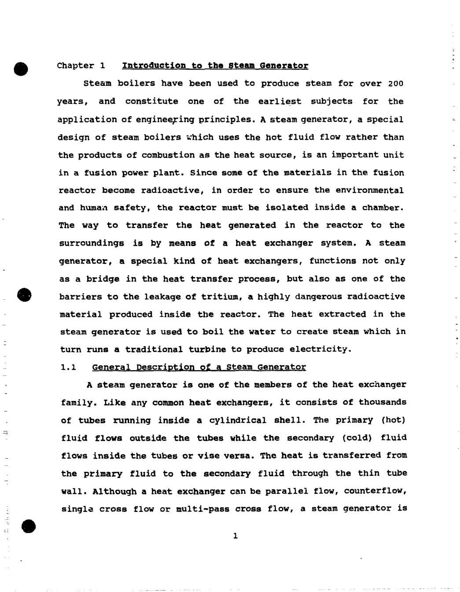

**`Chapter 1`** **`Introduction to the steam Generator`**

**`Steam boilers have been used to produce steam for over 200`**

**`years, and constitute one of the earliest subjects for the`**

**`application of engineering principles. A steam generator, a special`**

**`design of steam boilers which uses the hot fluid flow rather than`**

**`the products of combustion as the heat source, is an important unit`**

**`in a fusion power plant. Since some of the materials in the fusion`**

**`reactor become radioactive, in order to ensure the environmental`**

**`and human safety, the reactor must be isolated inside a chamber.`**

**`The way to transfer the heat generated in the reactor to the`**

**`surroundings is by means of a heat exchanger system. A steam`**

**`generator, a special kind of heat exchangers, functions not only`**

**`as a bridge in the heat transfer process, but also as one of the`**

**`barriers to the leakage of tritium, a highly dangerous radioactive`**

**`material produced inside the reactor. The heat extracted in the`**

**`steam generator is used to boil the water to create steam which in`**

**`turn runs a traditional turbine to produce electricity.`**

**`1.1`** **`General Description of a steam Generator`**

**`A steam generator is one of the members of the heat exchanger`**

**`family. Like any common heat exchangers, it consists of thousands`**

**`of tubes running inside a cylindrical shell. The primary (hot)`**

**`fluid flows outside the tubes while the secondary (cold) fluid`**

**`flows inside the tubes or vise versa. The heat is transferred from`**

**`the primary fluid to the secondary fluid through the thin tube`**

**`wall. Although a heat exchanger can be parallel flow, counterflow,`**

**`single cross flow or multi-pass cross flow, a steam generator is`**

**`1`**

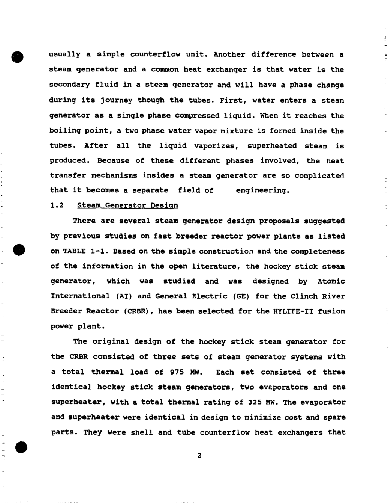

**`usually a simple counterflow unit. Another difference between a`**

**`steam generator and a common heat exchanger is that water is the`**

**`secondary fluid in a steam generator and will have a phase change`**

**`during its journey though the tubes. First, water enters a steam`**

**`generator as a single phase compressed liquid. When it reaches the`**

**`boiling point, a two phase water vapor mixture is formed inside the`**

**`tubes. After all the liquid vaporizes, superheated steam is`**

**`produced. Because of these different phases involved, the heat`**

**`transfer mechanisms insides a steam generator are so complicated`**

**`that it becomes a separate field of`** **`engineering.`**

**`1.2`** **`Steam Generator Design`**

**`There are several steam generator design proposals suggested`**

**`by previous studies on fast breeder reactor power plants as listed`**

**`on TABLE 1-1. Based on the simple construction and the completeness`**

**`of the information in the open literature, the hockey stick steam`**

**`generator, which was studied and was designed by Atomic`**

**`International (AI) and General Electric (GE) for the Clinch River`**

**`Breeder Reactor (CRBR), has been selected for the HYLIFE-II fusion`**

**`power plant.`**

**`The original design of the hockey stick steam generator for`**

**`the CRBR consisted of three sets of steam generator systems with`**

**`a total thermal load of 975 MW.`** **`Each set consisted of three`**

**`identical hockey stick steam generators, two evaporators and one`**

**`superheater, with a total thermal rating of 325 MW. The evaporator`**

**`and superheater were identical in design to minimize cost and spare`**

**`parts. They were shell and tube counterflow heat exchangers that`**

**`2`**

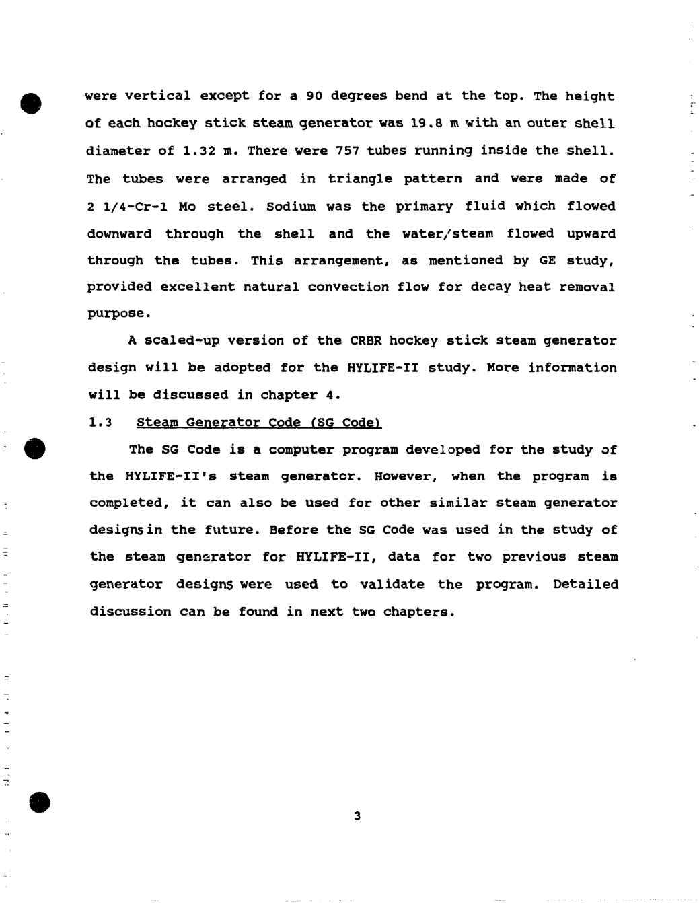

**`were vertical except for a 90 degrees bend at the top. The height`**

**`of each hockey stick steam generator was 19.8 m with an outer shell`**

**`diameter of 1.32 m. There were 757 tubes running inside the shell.`**

**`The tubes were arranged in triangle pattern and were made of`**

**`2 1/4-Cr-l Mo steel. Sodium was the primary fluid which flowed`**

**`downward through the shell and the water/steam flowed upward`**

**`through the tubes. This arrangement, as mentioned by GE study,`**

**`provided excellent natural convection flow for decay heat removal`**

**`purpose.`**

**`A scaled-up version of the CRBR hockey stick steam generator`**

**`design will be adopted for the HYLIFE-II study. More information`**

**`will be discussed in chapter 4.`**

**`1.3`** **`Steam Generator Code (SG Code!`**

**`The SG Code is a computer program developed for the study of`**

**`the HYLIFE-II's steam generator. However, when the program is`**

**`completed, it can also be used for other similar steam generator`**

**`designs in the future. Before the SG Code was used in the study of`**

**`the steam generator for HYLIFE-II, data for two previous steam`**

**`generator designs were used to validate the program. Detailed`**

**`discussion can be found in next two chapters.`**

**`3`**

**TABLE 1-1 Summary design data for a few steam generators**

| | PWR $^a$ | LMFBR $^a$ | LMFBR | Fusion Reactor |
|---|---|---|---|---|
| **Reactor Type** | PWR | LMFBR | LMFBR | Fusion Reactor |
| **Plant** | Oconee Unit 1 | Cregs-Malville | CRBR Design | HYLIFE-II |
| **Designer** | B & W | French | AI | UCD & LLNL |
| **Type** | Once-through | Once-through | Separated Evaporator & Superheater units | Same as CRBR design |
| **Tube shape** | Straight | Helical | Straight plus bend (hockey-stick) | Same as CRBR design |
| **Hot fluid** | Pressurized water | Sodium | Sodium | Sodium Fluoroborate |
| **Fluid in tube** | Water/steam | Water/steam | Water/steam | Water/steam |
| **Type of tube** | Plain | Plain | Plain | Plain |
| **Tube material** | Incoloy 800 | Incoloy 800 | 2 ¼ Cr-1-Mo | Hastelloy N or Modified 316 SS |
| **Capacity (MWt)** | 1295 | 750 | 325 | 1100 |
| **Tube ID (mm)** | 14 | 20 | 10.36 | 10.36 |
| **Tube length (m)** | 15 | 91 | 19.2 in each unit | Scaled-up for minimum COE |
| **Number of tubes** | 15530 | 1430 | 757 in each unit | |

$^a$ Data obtained from (Fraas, 1989)

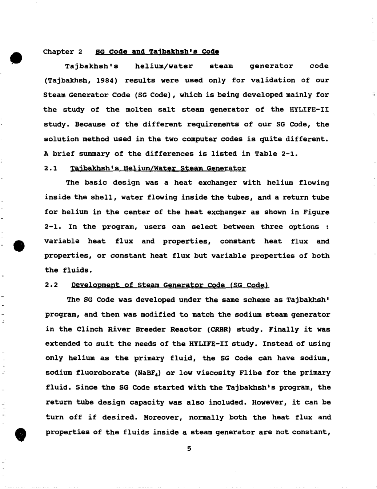

**`Chapter 2`** **`SG code and Taibakhsh's Coda`**

**`Tajbakhsh's`** **`helium/water`** **`steam`** **`generator`** **`code`**

**`(Tajbakhsh, 1984) results were used only for validation of our`**

**`Steam Generator Code (SG Code), which is being developed mainly for`**

**`the study of the molten salt steam generator of the HYLIFE-II`**

**`study. Because of the different requirements of our SG Code, the`**

**`solution method used in the two computer codes is quite different.`**

**`A brief summary of the differences is listed in Table 2-1.`**

**`2.1`** **`Taibakhsh's Helium/Water Steam Generator`**

**`The basic design was a heat exchanger with helium flowing`**

**`inside the shell, water flowing inside the tubes, and a return tube`**

**`for helium in the center of the heat exchanger as shown in Figure`**

**`2-1. In the program, users can select between three options :`**

**`variable heat flux and properties, constant heat flux and`**

**`properties, or constant heat flux but variable properties of both`**

**`the fluids.`**

**`2.2`** **`Development of Steam Generator Code (SG Code)`**

**`The SG Code was developed under the same scheme as Tajbakhsh1`**

**`program, and then was modified to match the sodium steam generator`**

**`in the Clinch River Breeder Reactor (CRBR) study. Finally it was`**

**`extended to suit the needs of the HYLIFE-II study. Instead of using`**

**`only helium as the primary fluid, the SG Code can have sodium,`**

**`sodium fluoroborate (NaBF4) or low viscosity Flibe for the primary`**

**`fluid. Since the SG Code started with the Tajbakhsh's program, the`**

**`return tube design capacity was also included. However, it can be`**

**`turn off if desired. Moreover, normally both the heat flux and`**

**`properties of the fluids inside a steam generator are not constant,`**

**`5`**

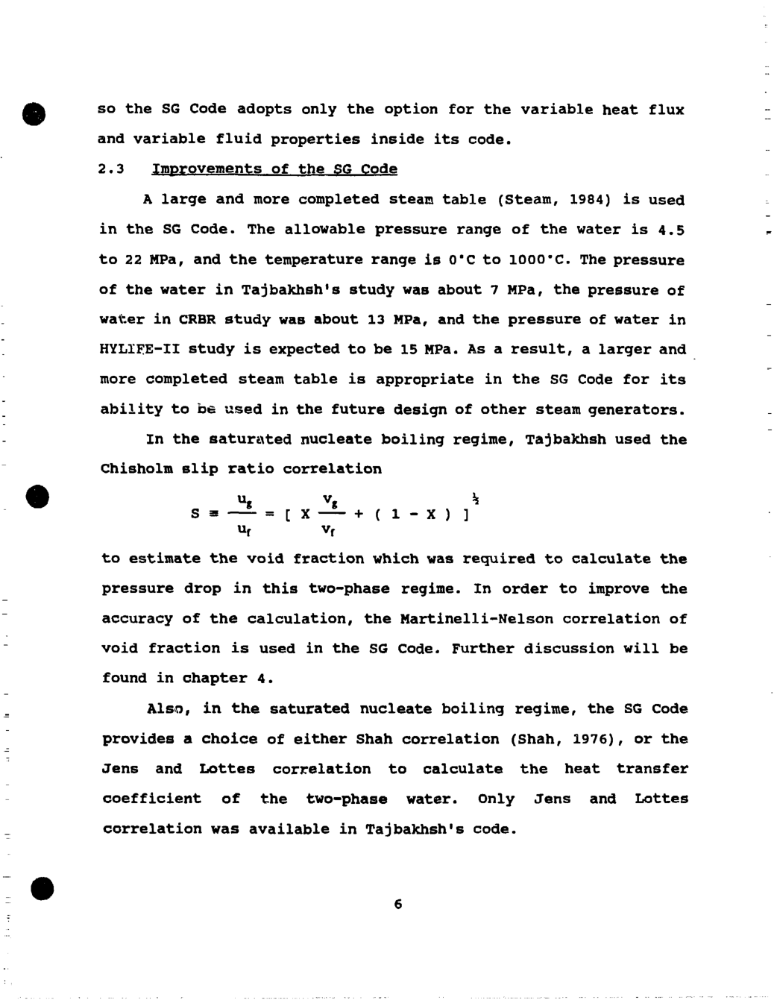

**`so the SG Code adopts only the option for the variable heat flux`**

**`and variable fluid properties inside its code.`**

**`2.3`** **`Improvements of the SG Code`**

**`A large and more completed steam table (Steam, 1984) is used`**

**`in the SG Code. The allowable pressure range of the water is 4.5`**

**`to 22 MPa, and the temperature range is O'C to lOOO'C. The pressure`**

**`of the water in Tajbakhsh's study was about 7 MPa, the pressure of`**

**`water in CRBR study was about 13 MPa, and the pressure of water in`**

**`HYLIFE-II study is expected to be 15 MPa. As a result, a larger and`**

**`more completed steam table is appropriate in the SG Code for its`**

**`ability to be used in the future design of other steam generators.`**

**`In the saturated nucleate boiling regime, Tajbakhsh used the`**

**`Chisholm slip ratio correlation`**

**`u«`** **`v«`** **`*`**
## **`S = [ X + ( 1 - X ) ]`**

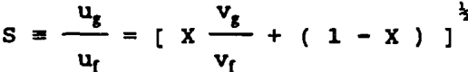

**`u`** **`f`** **`vf`**

**`to estimate the void fraction which was required to calculate the`**

**`pressure drop in this two-phase regime. In order to improve the`**

**`accuracy of the calculation, the Martinelli-Nelson correlation of`**

**`void fraction is used in the SG Code. Further discussion will be`**

**`found in chapter 4.`**

**`Also, in the saturated nucleate boiling regime, the SG Code`**

**`provides a choice of either Shah correlation (Shah, 1976), or the`**

**`Jens and Lottes correlation to calculate the heat transfer`**

**`coefficient of the two-phase water. Only Jens and Lottes`**

**`correlation was available in Tajbakhsh's code.`**

**`6`**

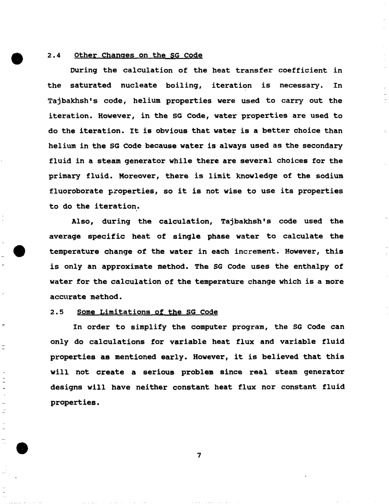

**`2.4`** **`Other Changes on the SG Code`**

**`During the calculation of the heat transfer coefficient in`**

**`the saturated nucleate boiling, iteration is necessary. In`**

**`Tajbakhsh's code, helium properties were used to carry out the`**

**`iteration. However, in the SG Code, water properties are used to`**

**`do the iteration. It is obvious that water is a better choice than`**

**`helium in the SG Code because water is always used as the secondary`**

**`fluid in a steam generator while there are several choices for the`**

**`primary fluid. Moreover, there is limit knowledge of the sodium`**

**`fluoroborate properties, so it is not wise to use its properties`**

**`to do the iteration.`**

**`Also, during the calculation, Tajbakhsh's code used the`**

**`average specific heat of single phase water to calculate the`**

**`temperature change of the water in each increment. However, this`**

**`is only an approximate method. The SG Code uses the enthalpy of`**

**`water for the calculation of the temperature change which is a more`**

**`accurate method.`**

**`2.5`** **`Some Limitations of the SG Code`**

**`In order to simplify the computer program, the SG Code can`**

**`only do calculations for variable heat flux and variable fluid`**

**`properties as mentioned early. However, it is believed that this`**

**`will not create a serious problem since real steam generator`**

**`designs will have neither constant heat flux nor constant fluid`**

**`properties.`**

**`7`**

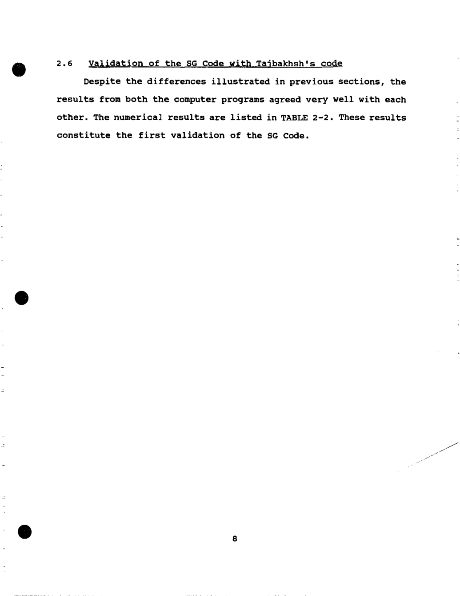

**`2.6`** **`Validation of the SG Code with Taibakhsh's code`**

**`Despite the differences illustrated in previous sections, the`**

**`results from both the computer programs agreed very well with each`**

**`other. The numerical results are listed in TABLE 2-2. These results`**

**`constitute the first validation of the SG Code.`**

**`8`**

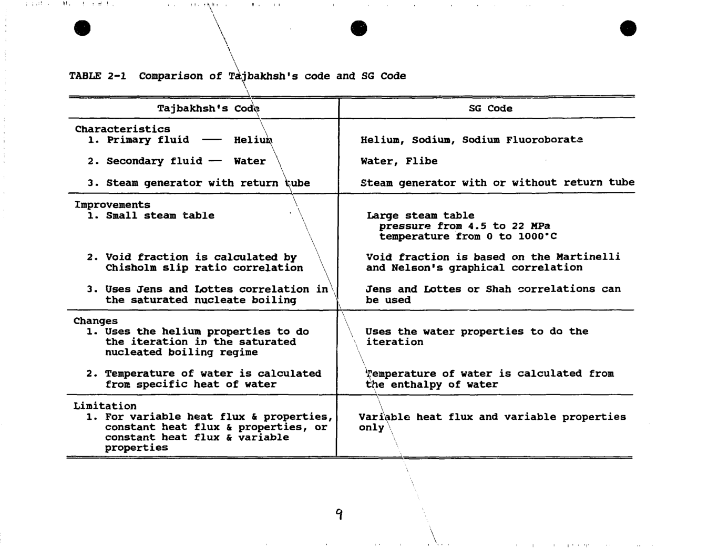

**`TABLE 2-1 Comparison of Taibakhsh's code and SG Code`**

**`Tajbakhsh's Code`** **`SG Code`**

**`Characteristics`**

## **`1. Primary fluid Heliuw`** **`2. Secondary fluid — Hater`** **`3. Steam generator with return tube`**

**`Improvements`**
## **`1. Small steam table`** **`2. Void fraction is calculated by`**

**`Chisholm slip ratio correlation`**

## **`3. Uses Jens and Lottes correlation in`**

**`the saturated nucleate boiling`**

**`Changes`**
## **`1. Uses the helium properties to do`**

**`the iteration in the saturated`**
**`nucleated boiling regime`**

_**2.**_ **`Temperature of water is calculated`**
**`from specific heat of water`**

**`Limitation`**
## **`1. For variable heat flux & properties,`**

**`constant heat flux & properties, or`**
**`constant heat flux & variable`**
**`properties`**

`9`

**`Helium, Sodium, Sodium Fluoroborata`**

**`Water, Plibe`**

**`Steam generator with or without return tube`**

**`Large steam table`**
**`pressure from 4.5 to 22 MPa`**
**`temperature from 0 to 1000*C`**

**`Void fraction is based on the Martinelli`**
**`and Nelson's graphical correlation`**

**`Jens and Lottes or Shah correlations can`**
**`be used`**

**`Uses the water properties to do the`**
**`iteration`**

**`Temperature of water is calculated from`**
**`the enthalpy of water`**

**`Variable heat flux and variable properties`**
**`only`**

**TABLE 2-2 Computer results for Tajbakhsh and SG Codes**

| Input Parameter | Tajbakhsh | SG Code |
|---|---|---|
| **Geometry** | | |
| Tube OD (mm) | 0.01316 | 0.01316 |
| Tube Wall (mm) | 0.00150 | 0.00150 |
| Pitch to Diameter Ratio | (1.565)a | 1.565 |
| Shell ID (m) | 3.2 | 3.2 |
| **He Side** | | |
| Flow/Unit (kg/s) | 512 | 512 |
| Outlet Temperature (°C) | 515 | 515 |
| **Water Side** | | |
| Flow/Unit (kg/s) | 395.3 | 395.3 |
| Inlet Temperature (°C) | 447 | 447 |
| Outlet Temperature (°C) | 773 | 773 |
| Inlet Pressure (MPa) | 6.89 | 6.89 |
| **Output Parameter** | | |
| **Geometry** | | |
| Duty/Unit (MW) | 1009 | 1011 |
| Number of Tube | 18670 | 18670 |
| Minimum Tube Length (m) | 12.7 | 12.6 |
| Heat Transfer Area OD (m²) | 9803 | 9726 |
| **He Side** | | |
| Inlet Temperature (°C) | 895 | 895 |
| Pressure Drop (MPa)b | 0.062 | 0.061 |
| **Water Side** | | |
| Outlet Pressure (MPa) | 6.819 | 6.820 |
| Pressure Drop (MPa)c | 0.071 | 0.068 |

a P/D is the output parameter, and number of tube is the input parameter in Tajbakhsh's code
b Pressure drop includes only frictional, acceleration, and gravity losses
c Pressure drop includes only frictional and acceleration losses

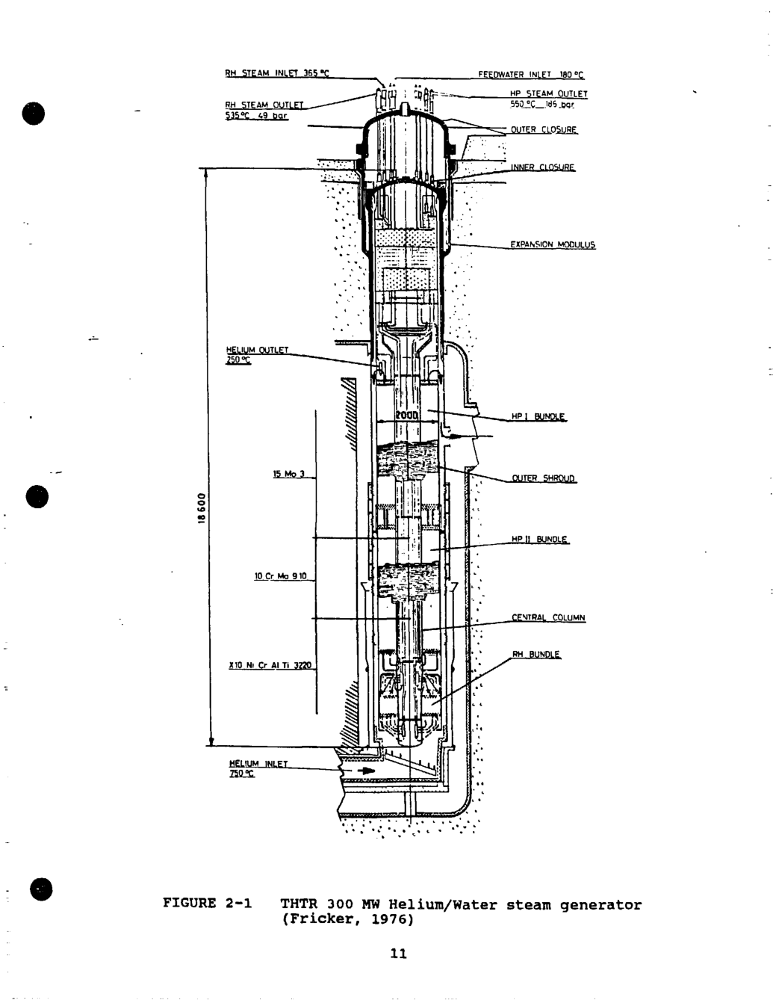
## **RH STEAM INLET 365 "C FEEDWATER INLET 160 °C** **INNFR CIOSURF** **EXPANSION MOCULU5** **HELIUM OUTLET** **250 °C**

**=~iS**

**— .HP | BWtE,**

## **K Mo 3** **«10 Nl Cr Al Ti 3TX** **HELIUM IWLFT** **750 °C**

**OUTER SHBOlin**

## **HP II BUNDLE** **CENTRAL COLUMN** **RH BUNDLE**

`FIGURE 2-1` `THTR 300 MW Helium/Water steam generator`
`(Fricker, 1976)`

`11`

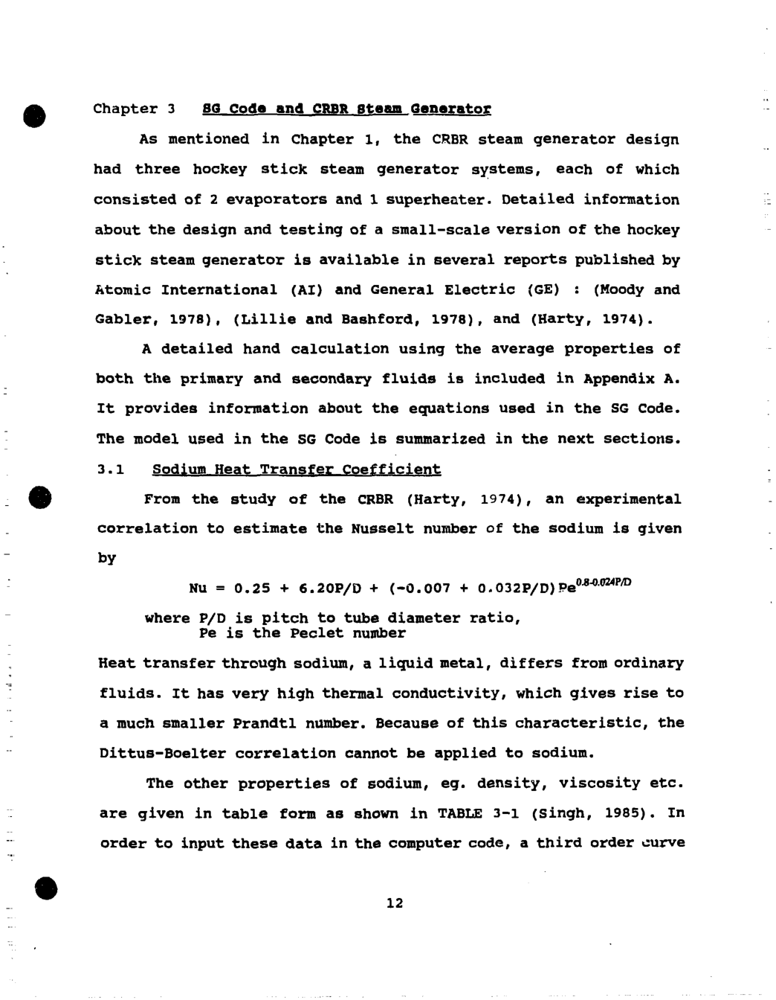

`Chapter 3` **`SO Coda and`** `CRBR Steam` **`Generator`**

`As mentioned in Chapter 1, the CRBR steam generator design`

`had three hockey stick steam generator systems, each of which`

`consisted of 2 evaporators and 1 superheater. Detailed information`

`about the design and testing of a small-scale version of the hockey`

`stick steam generator is available in several reports published by`

`Atomic International (AI) and General Electric (GE) : (Moody and`

`Gabler, 1978), (Lillie and Bashford, 1978), and (Harty, 1974).`

`A detailed hand calculation using the average properties of`

`both the primary and secondary fluids is included in Appendix A.`

`It provides information about the equations used in the SG Code.`

`The model used in the SG Code is summarized in the next sections.`

`3.1` `Sodium Heat Transfer Coefficient`

`From the study of the CRBR (Harty, 1974), an experimental`

`correlation to estimate the Nusselt number of the sodium is given`

`by`

`Nu = 0.25 + 6.20P/D + (-0.007 + 0.032P/D) p` `e`

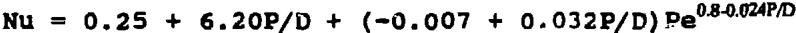

`where P/D is pitch to tube diameter ratio,`
`Pe is the Peclet number`

`w` `w` `0` `2` `4` `P` `/` `D`

`Heat transfer through sodium, a liquid metal, differs from ordinary`

`fluids. It has very high thermal conductivity, which gives rise to`

`a much smaller Prandtl number. Because of this characteristic, the`

`Dittus-Boelter correlation cannot be applied to sodium.`

`The other properties of sodium, eg. density, viscosity etc.`

`are given in table form as shown in TABLE 3-1 (Singh, 1985). In`

`order to input these data in the computer code, a third order curve`

`12`

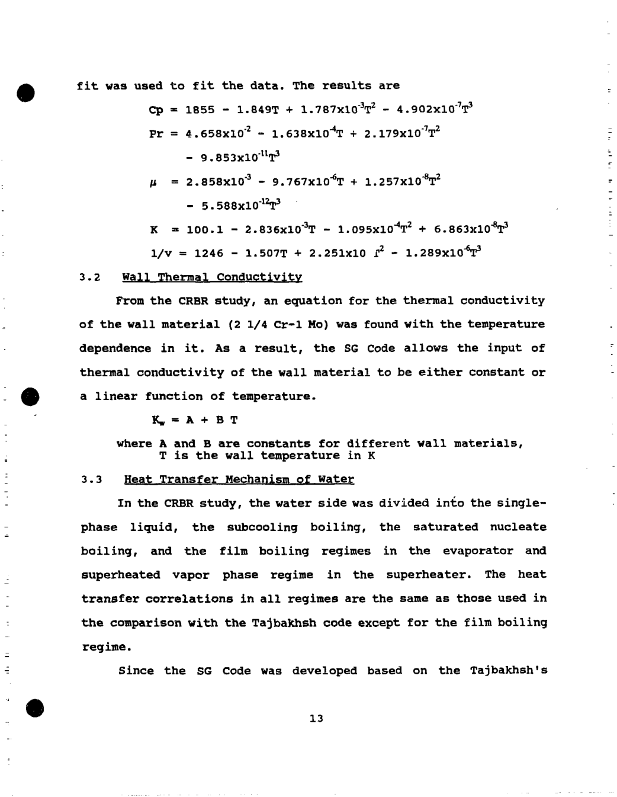

**`fit was used to fit the data. The results are`**

## **Cp = 1855 - 1.849T + 1.787xlO" 3T 2 - 4.902xlO'V**

**pr = 4 . 6 5 8 x i o** **2 - i . e s s x i o "** **4 ! + a - i y g x i o ' V**

## **- 9.853xlO' 1 1T 3** **M = 2.858xio" 3 - g^eTxio^T + I ^ S T X I C V** **- 5.588xl0" 1 2T 3** **K - 100.1 - 2.836xlO" 3T - 1.095X10""T 2 + 6.863xlO"V** **1/v = 1246 - 1.507T + 2.251x10 C2 - 1.289xlO"V**

**3.2** **Wall Thermal Conductivity**

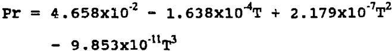

**`From the CRBR study, an equation for the thermal conductivity`**

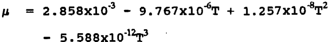
**`of the wall material (2 1/4 Cr-1 Mo) was found with the temperature`**

**`dependence in it. As a result, the SG Code allows the input of`**

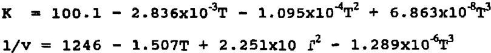

**`thermal conductivity of the wall material to be either constant or`**

**`a linear function of temperature.`**

## **`K, = A + B T`**

**`where A and B are constants for different wall materials,`**
**`T is the wall temperature in K`**

**`3.3`** **`Heat Transfer Mechanism of Water`**

**`In the CRBR study, the water side was divided into the single-`**

**`phase liquid, the subcooling boiling, the saturated nucleate`**

**`boiling, and the film boiling regimes in the evaporator and`**

**`superheated vapor phase regime in the superheater. The heat`**

**`transfer correlations in all regimes are the same as those used in`**

**`the comparison with the Tajbakhsh code except for the film boiling`**

**`regime.`**

**`Since the 8G Code was developed based on the Tajbakhsh's`**

**`13`**

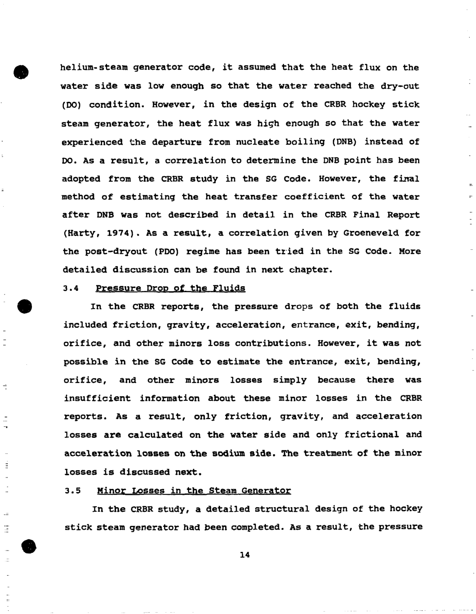

**`helium-steam generator code, it assumed that the heat flux on the`**

**`water side was low enough so that the water reached the dry-out`**

**`(DO) condition. However, in the design of the CRBR hockey stick`**

**`steam generator, the heat flux was high enough so that the water`**

**`experienced the departure from nucleate boiling (DNB) instead of`**

**`DO. As a result, a correlation to determine the DNB point has been`**

**`adopted from the CRBR study in the SG Code. However, the final`**

**`method of estimating the heat transfer coefficient of the water`**

**`after DNB was not described in detail in the CRBR Pinal Report`**

**`(Harty, 1974). As a result, a correlation given by Groeneveld for`**

**`the post-dryout (PDO) regime has been tried in the SG Code. More`**

**`detailed discussion can be found in next chapter.`**

**`3.4`** **`Pressure Drop of the Fluids`**

**`In the CRBR reports, the pressure drops of both the fluids`**

**`included friction, gravity, acceleration, entrance, exit, bending,`**

**`orifice, and other minors loss contributions. However, it was not`**

**`possible in the SG Code to estimate the entrance, exit, bending,`**

**`orifice, and other minors losses simply because there was`**

**`insufficient information about these minor losses in the CRBR`**

**`reports. As a result, only friction, gravity, and acceleration`**

**`losses are calculated on the water side and only frictional and`**

**`acceleration losses on the sodium side. The treatment of the minor`**

**`losses is discussed next.`**

**`3.5`** **`Minor Losses in the Steam Generator`**

**`In the CRBR study, a detailed structural design of the hockey`**

**`stick steam generator had been completed. As a result, the pressure`**

**`14`**

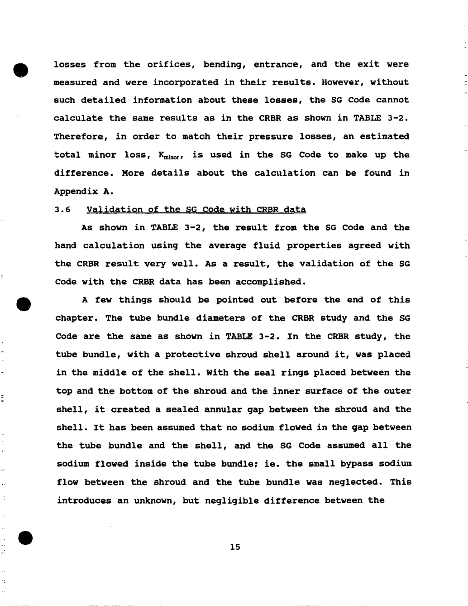

**`losses from the orifices, bending, entrance, and the exit were`**

**`measured and were incorporated in their results. However, without`**

**`such detailed information about these losses, the SG Code cannot`**

**`calculate the same results as in the CRBR as shown in TABLE 3-2.`**

**`Therefore, in order to match their pressure losses, an estimated`**

**`total minor loss, K^^,., is used in the SG Code to make up the`**

**`difference. More details about the calculation can be found in`**

**`Appendix A.`**

**`3.6`** **`Validation of the SG Code with CRBR data`**

**`As shown in TABLE 3-2, the result from the SG Code and the`**

**`hand calculation using the average fluid properties agreed with`**

**`the CRBR result very well. As a result, the validation of the SG`**

**`Code with the CRBR data has been accomplished.`**

**`A few things should be pointed out before the end of this`**

**`chapter. The tube bundle diameters of the CRBR study and the SG`**

**`Code are the same as shown in TABLE 3-2. In the CRBR study, the`**

**`tube bundle, with a protective shroud shell around it, was placed`**

**`in the middle of the shell. With the seal rings placed between the`**

**`top and the bottom of the shroud and the inner surface of the outer`**

**`shell, it created a sealed annular gap between the shroud and the`**

**`shell. It has been assumed that no sodium flowed in the gap between`**

**`the tube bundle and the shell, and the SG Code assumed all the`**

**`sodium flowed inside the tube bundle; ie. the small bypass sodium`**

**`flow between the shroud and the tube bundle was neglected. This`**

**`introduces an unknown, but negligible difference between the`**

**`15`**

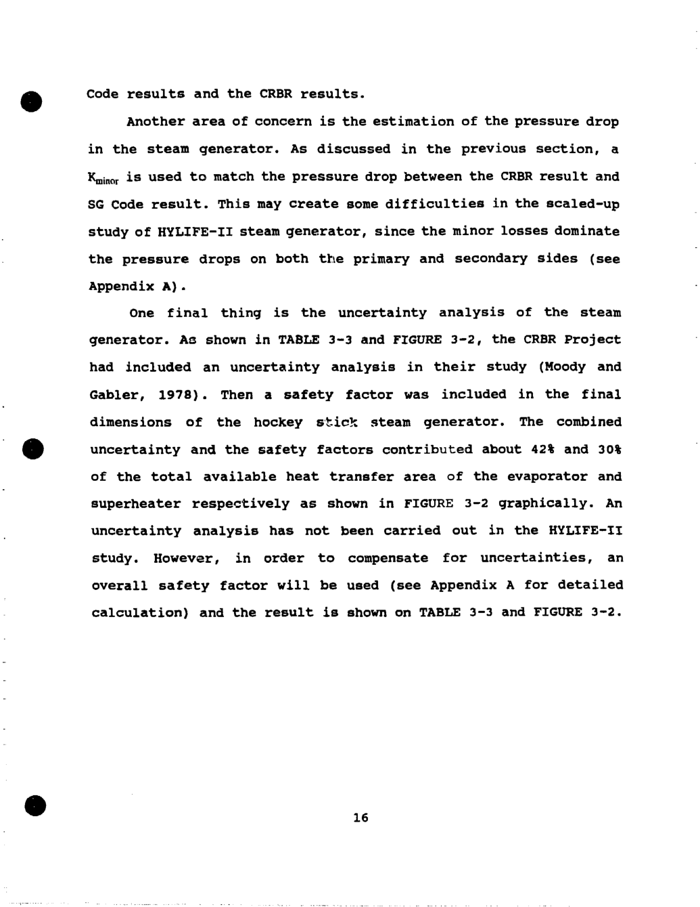

**`Code results and the CRBR results.`**

**`Another area of concern is the estimation of the pressure drop`**

**`in the steam generator. As discussed in the previous section, a`**

**`Kminoj is used to match the pressure drop between the CRBR result and`**

**`SG Code result. This may create some difficulties in the scaled-up`**

**`study of HYLIFE-II steam generator, since the minor losses dominate`**

**`the pressure drops on both the primary and secondary sides (see`**

**`Appendix A ) .`**

**`One final thing is the uncertainty analysis of the steam`**

**`generator. As shown in TABLE 3-3 and FIGURE 3-2, the CRBR Project`**

**`had included an uncertainty analysis in their study (Moody and`**

**`Gabler, 1978) . Then a safety factor was included in the final`**

**`dimensions of the hockey stic£ steam generator. The combined`**

**`uncertainty and the safety factors contributed about 42% and 30%`**

**`of the total available heat transfer area of the evaporator and`**

**`superheater respectively as shown in FIGURE 3-2 graphically. An`**

**`uncertainty analysis has not been carried out in the HYLIFE-II`**

**`study. However, in order to compensate for uncertainties, an`**

**`overall safety factor will be used (see Appendix A for detailed`**

**`calculation) and the result is shown on TABLE 3-3 and FIGURE 3-2.`**

**`16`**

**TABLE 3-1** Physical property data for sodium liquid metal (Singh, 1985)

| T (°C) | Density (kg/m³) | Specific heat (J/kg·K) | Thermal conductivity (W/m·°C) | Dynamic viscosity (mNs/m²) | Prandtl number |
|--------|-----------------|------------------------|-------------------------------|---------------------------|----------------|
| 125 | 921 | 1370 | 86.0 | 0.61 | 0.0097 |
| 225 | 897 | 1320 | 80.0 | 0.42 | 0.0069 |
| 325 | 872 | 1280 | 74.0 | 0.32 | 0.0055 |
| 525 | 823 | 1270 | 63.0 | 0.23 | 0.0046 |
| 625 | 774 | 1280 | 59.0 | 0.18 | 0.0039 |

**TABLE 3-2** Results from CRBR, SG Code, and a Hand Calculation Using Average Properties

| Input Parameter | Evaporator | | | Superheater | | |
|---|---|---|---|---|---|---|
| | CRBR | SG Code | Hand | CRBR | SG Code | Hand |
| **Geometry** | | | | | | |
| Tube OD (mm) | 15.9 | 15.9 | 15.9 | 15.9 | 15.9 | 15.9 |
| Tube Wall (mm) | 2.77 | 2.77 | 2.77 | 2.77 | 2.77 | 2.77 |
| Tube Pitch (mm) | 31 | 31 | 31 | 31 | 31 | 31 |
| Pitch to Diameter Ratio | 1.9497 | 1.95 | 1.95 | 1.9497 | 1.95 | 1.95 |
| Tube Bundle Diameter (m) | (0.896)a | 0.896 | 0.896 | (0.896)a | 0.896 | 0.896 |
| **Na Side** | | | | | | |
| Flow/Unit (kg/h x E6) | 3.05 | 3.05 | 3.05 | 6.1 | 6.1 | 6.1 |
| Outlet Temperature (°C) | 349 | 349 | 349 | 463 | 463 | 463 |
| **Water Side** | | | | | | |
| Flow/Unit (kg/h x E6) | 0.5 | 0.5 | 0.5 | 0.5 | 0.5 | 0.5 |
| Inlet Temperature (°C) | 285 | 285 | 285 | 331 | 331 | 331 |
| Outlet Temperature (°C) | 331 | 334 | 331 | 485 | 488 | 485 |
| Inlet Pressure (MPa) | 13.2 | 13.2 | 13.2 | 12.1 | 12.1 | 12.1 |
| **Output Parameter** | | | | | | |
| **Geometry** | | | | | | |
| Number of Tube | 757 | 757 | 757 | 757 | 757 | 757 |
| Minimum Tube Length (m) | 8.1 | 8.2 | 8.1 | 9.9 | 9.6 | 10.3 |
| Heat Transfer Area OD (m^2) | 304.5 | 310.1 | 306.3 | 372.8 | 363.0 | 389.5 |
| **Na Side** | | | | | | |
| Duty Unit (MM) | 120.8 | 118 | 116.3 | 83.4 | 84 | 81.4 |
| Inlet Temperature (°C) | 463 | 459 | 457 | 502 | 502 | 501 |
| Pressure Drop (MPa)b | (0.108) | 0.006 | 0.005 | (0.42) | 0.02 | 0.02 |
| **Water Side** | | | | | | |
| Outlet Pressure (MPa)c | 12.4 | 13.0 | 13.06 | 10.2 | 11.4 | 11.46 |
| Pressure Drop (MPa)c | (0.8) | 0.2 | 0.14 | (1.9) | 0.7 | 0.64 |

a Our estimate
b Total pressure drop in the CRBR study. Only frictional, acceleration, and gravity losses are included in SG Code and hand calculation.
c Total pressure drop in the CRBR study. Only frictional and acceleration losses are included in SG Code and hand calculation.

### TABLE 3-3 Uncertainty results

| Parameter | Heat Transfer Area OD (m^2) | | | | | |
|---|---|---|---|---|---|---|
| | **Evaporator** | | | **Superheater** | | |
| | CRBR | SG Code | Hand | CRBR | SG Code | Hand |
| Minimum Heat Transfer Area | 304.5 | 310.1 | 306.3 | 372.8 | 363.0 | 389.5 |
| Plugging, Fouling & Correction | 98.9 | | | 72.5 | | |
| Heat Transfer Uncertainty | 63.3 | | | 48.3 | | |
| Excess Margin (m^2) | 62.8 | (219.4) a | (223.2) a | 35.9 | (166.5) a | (140.0) a |
| **Available Heat Transfer Area** | **529.5** | **529.5** | **529.5** | **529.5** | **529.5** | **529.5** |

a Additional heat transfer areas are added in the SG Code and hand calculation to match the CRBR steam generator.

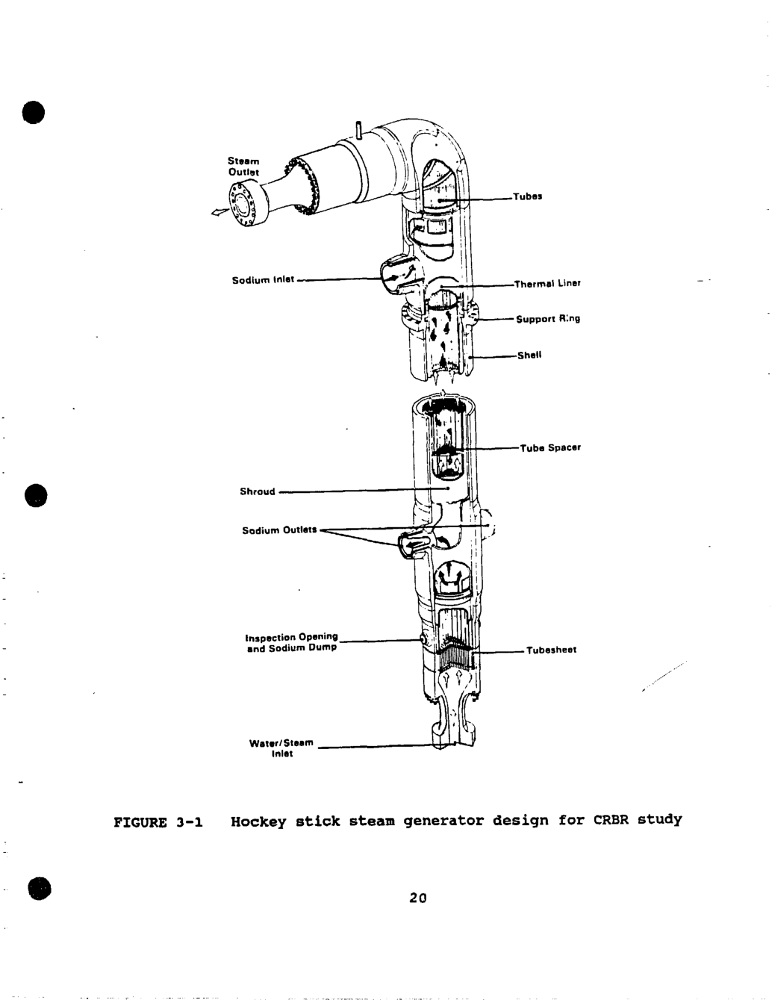

**Shroud**

**Sodium Outlets**

**Inspection Opening**
**and Sodium Dump**

**Water/Steam**
**Inlet**

**Tubes**

**Tubesheet**

## **FIGURE 3-1 Hockey stick steam generator design for CRBR study**

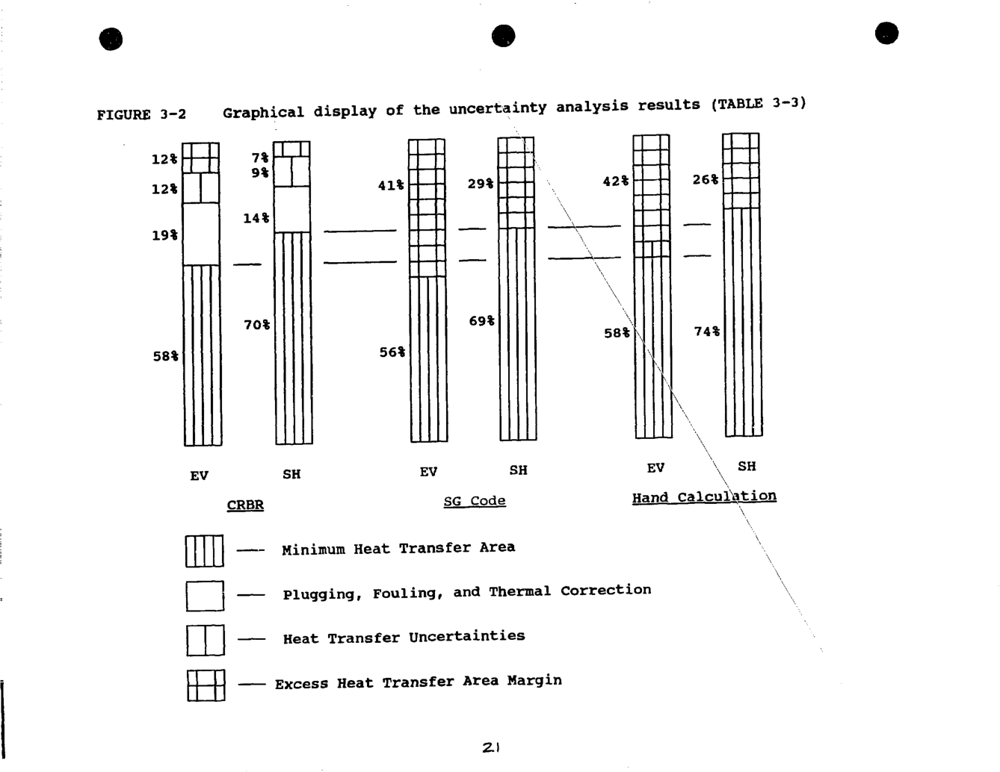
## **`FIGURE 3-2`**

**`12%`**

**`12%`**

**`19%`**

**`58%`**

**`Graphical display of the uncertainty analysis results (TABLE 3-3)`**

**`7%`**
**`9%`**

**`14%`**

**`70%`**

**`41%`**

**`56%`**

**`58%`**

**— .,**

**29%**

**69%**

## **`EV SH`**

**`SG Code`**

**`42% H—iH`** **`26%`**

V
**\**

## **`EV \ SH`**

**`Hand Calculation`**

**`74%`**

## **`EV SH`** **`CRBR`**

**`Minimum Heat Transfer Area`**

**`Plugging, Fouling, and Thermal Correction`**

**`Heat Transfer Uncertainties`**

**`Excess Heat Transfer Area Margin`**

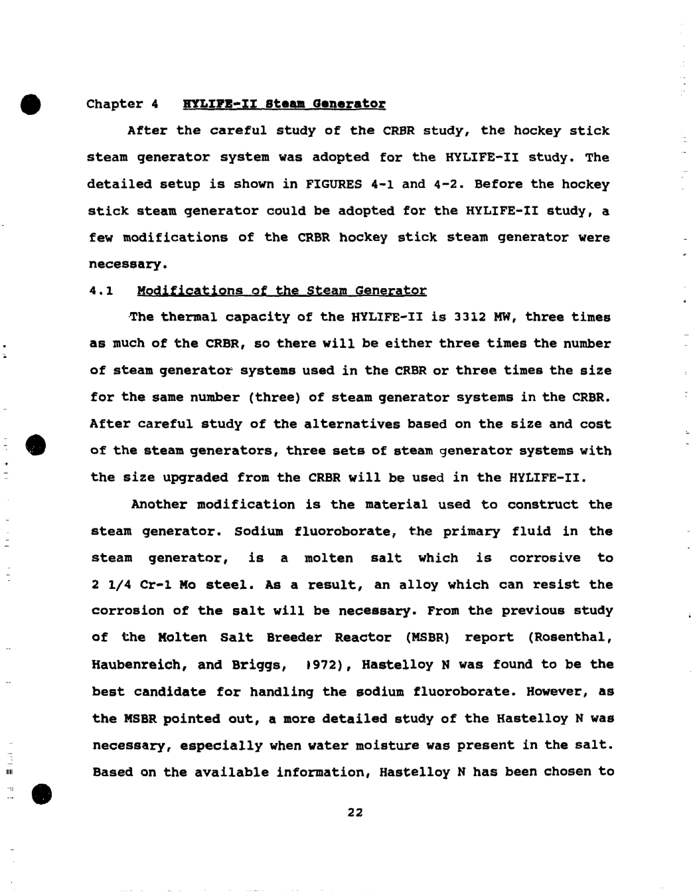

**`Chapter 4`** **`HYLIFE-II Steam Generator`**

**`After the careful study of the CRBR study, the hockey stick`**

**`steam generator system was adopted for the HYLIFE-II study. The`**

**`detailed setup is shown in FIGURES 4-1 and 4-2. Before the hockey`**

**`stick steam generator could be adopted for the HYLIFE-II study, a`**

**`few modifications of the CRBR hockey stick steam generator were`**

**`necessary.`**

**`4.1`** **`Modifications of the Steam Generator`**

**`The thermal capacity of the HYLIFE-II is 3312 MW, three times`**

**`as much of the CRBR, so there will be either three times the number`**

**`of steam generator systems used in the CRBR or three times the size`**

**`for the same number (three) of steam generator systems in the CRBR.`**

**`After careful study of the alternatives based on the size and cost`**

**`of the steam generators, three sets of steam generator systems with`**

**`the size upgraded from the CRBR will be used in the HYLIFE-II.`**

**`Another modification is the material used to construct the`**

**`steam generator. Sodium fluoroborate, the primary fluid in the`**

**`steam generator,`** **`is a molten salt which is corrosive to`**

**`2 1/4 Cr-1 No steel. As a result, an alloy which can resist the`**

**`corrosion of the salt will be necessary. From the previous study`**

**`of the Molten Salt Breeder Reactor (MSBR) report (Rosenthal,`**

**`Haubenreich, and Briggs,`** **`1972), Hastelloy N was found to be the`**

**`best candidate for handling the sodium fluoroborate. However, as`**

**`the MSBR pointed out, a more detailed study of the Hastelloy N was`**

**`necessary, especially when water moisture was present in the salt.`**

**`Based on the available information, Hastelloy N has been chosen to`**

**`22`**

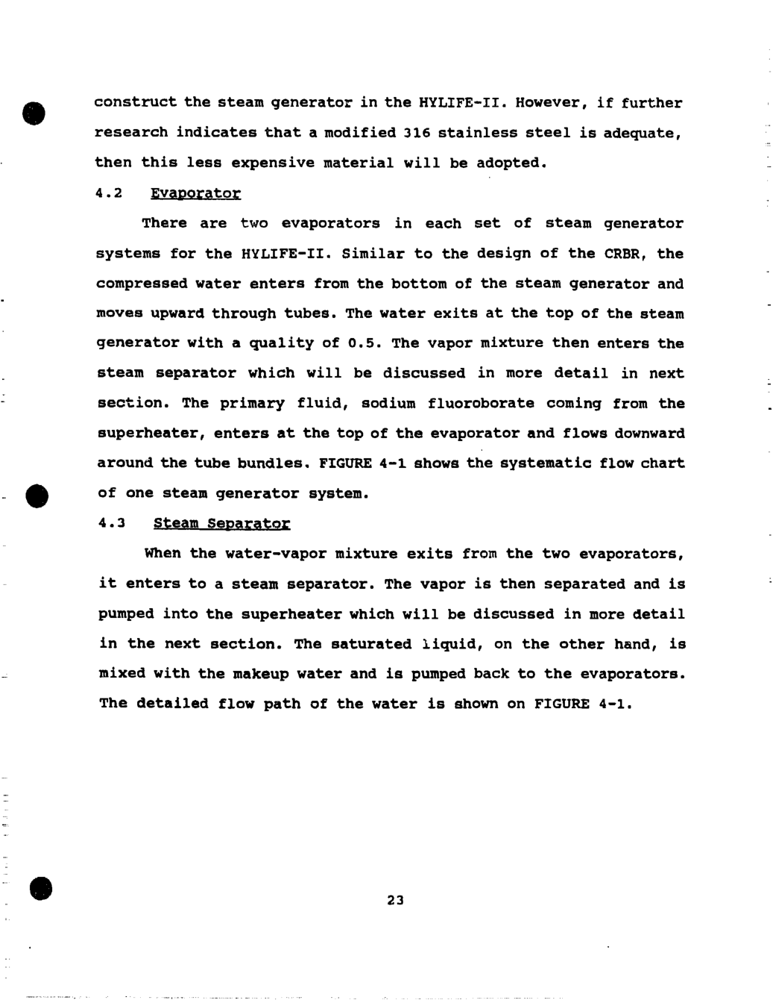

**`construct the steam generator in the HYLIFE-II. However, if further`**

**`research indicates that a modified 316 stainless steel is adequate,`**

**`then this less expensive material will be adopted.`**

**`4.2`** **`Evaporator`**

**`There are two evaporators in each set of steam generator`**

**`systems for the HYLIFE-II. Similar to the design of the CRBR, the`**

**`compressed water enters from the bottom of the steam generator and`**

**`moves upward through tubes. The water exits at the top of the steam`**

**`generator with a quality of 0.5. The vapor mixture then enters the`**

**`steam separator which will be discussed in more detail in next`**

**`section. The primary fluid, sodium fluoroborate coming from the`**

**`superheater, enters at the top of the evaporator and flows downward`**

**`around the tube bundles. FIGURE 4-1 shows the systematic flow chart`**

**`of one steam generator system.`**

**`4.3`** **`steam Separator`**

**`When the water-vapor mixture exits from the two evaporators,`**

**`it enters to a steam separator. The vapor is then separated and is`**

**`pumped into the superheater which will be discussed in more detail`**

**`in the next section. The saturated liquid, on the other hand, is`**

**`mixed with the makeup water and is pumped back to the evaporators.`**

**`The detailed flow path of the water is shown on FIGURE 4-1.`**

**`23`**

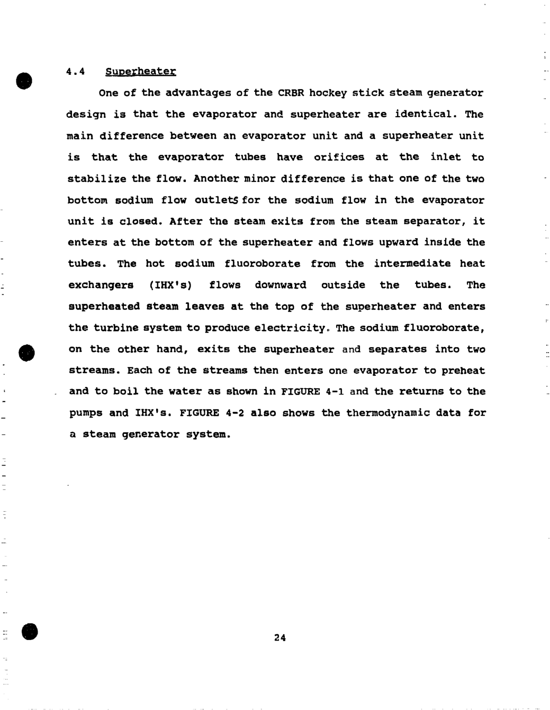

`4.4` `Superheater`

`One of the advantages of the CRBR hockey stick steam generator`

`design is that the evaporator and superheater are identical. The`

`main difference between an evaporator unit and a superheater unit`

`is that the evaporator tubes have orifices at the inlet to`

`stabilize the flow. Another minor difference is that one of the two`

`bottom sodium flow outlets for the sodium flow in the evaporator`

`unit is closed. After the steam exits from the steam separator, it`

`enters at the bottom of the superheater and flows upward inside the`

`tubes. The hot sodium fluoroborate from the intermediate heat`

`exchangers` `(IHX's)` `flows downward` `outside the tubes. The`

**`superheated steam leaves at`** `the top of the superheater and enters`

`the turbine system to produce electricity. The sodium fluoroborate,`

`on the other hand, exits the superheater and separates into two`

`streams. Each of the streams then enters one evaporator to preheat`

`and to boil the water as shown in FIGURE 4-1 and the returns to the`

`pumps` **`and`** `IHX's. FIGURE 4-2 also shows the thermodynamic data for`

`a steam generator system.`

`24`

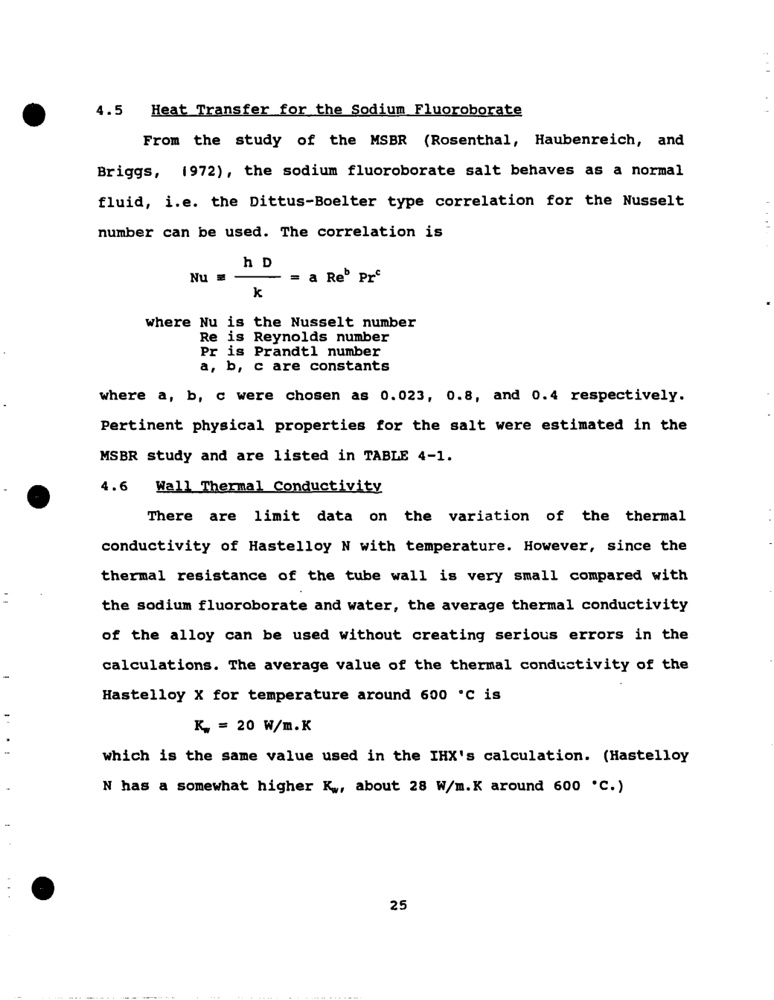

**`4.5`** **`Heat Transfer for the Sodium Fluoroborate`**

**`From the study of the MSBR (Rosenthal, Haubenreich, and`**

**`Briggs,`** **`1972), the sodium fluoroborate salt behaves as a normal`**

**`fluid, i.e. the Dittus-Boelter type correlation for the Nusselt`**

**`number can be used. The correlation is`**

**`h D`**
**`Nu s`** **`= a Re`** **`b Prc`**

**`k`**
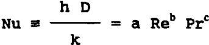
**`where Nu is the Nusselt number`**
**`Re is Reynolds number`**
**`Pr is Prandtl number`**
**`a, b, c are constants`**

**`where a, b, c were chosen as 0.023, 0.8, and 0.4 respectively.`**

**`Pertinent physical properties for the salt were estimated in the`**

**`MSBR study and are listed in TABLE 4-1.`**

**`4.6`** **`Wall Thermal Conductivity`**

**`There are limit data on the variation of the thermal`**

**`conductivity of Hastelloy N with temperature. However, since the`**

**`thermal resistance of the tube wall is very small compared with`**

**`the sodium fluoroborate and water, the average thermal conductivity`**

**`of the alloy can be used without creating serious errors in the`**

**`calculations. The average value of the thermal conductivity of the`**

**`Hastelloy X for temperature around 600 °C is`**

**`K„ = 20 W/m.K`**

**`which is the same value used in the IHX's calculation. (Hastelloy`**

**`N has a somewhat higher K,,, about 28 W/m.K around 600 *C.)`**

**`25`**

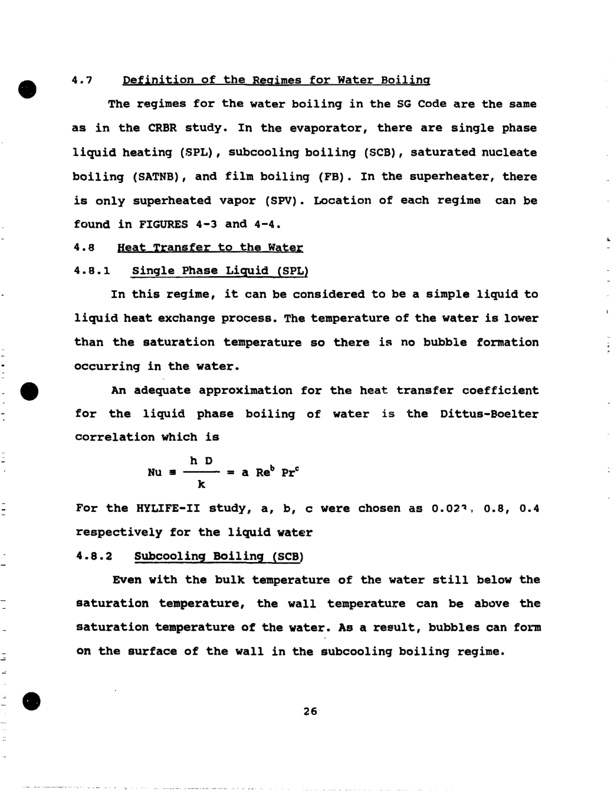

**`4.7`** **`Definition of the Regimes for Water Boiling`**

**`The regimes for the water boiling in the SG Code are the same`**

**`as in the CRBR study. In the evaporator, there are single phase`**

**`liquid heating (SPL), subcooling boiling (SCB), saturated nucleate`**

**`boiling (SATNB), and film boiling (FB). In the superheater, there`**

**`is only superheated vapor (SPV). Location of each regime can be`**

**`found in FIGURES 4-3 and 4-4.`**

**`4.8`** **`Heat Transfer to the Water`**

**`4.8.1`** **`Single Phase Liquid (SPL)`**

**`In this regime, it can be considered to be a simple liquid to`**

**`liquid heat exchange process. The temperature of the water is lower`**

**`than the saturation temperature so there is no bubble formation`**

**`occurring in the water.`**

**`An adequate approximation for the heat transfer coefficient`**

**`for the liquid phase boiling of water is the Dittus-Boelter`**

**`correlation which is`**

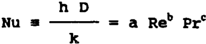

**`h D`**
**`Nu`** _**m**_ **`= a Re`** **`b Prc`**

**`k`**

**`For the HYLIFE-II study, a, b, c were chosen as 0.02'', 0.8, 0.4`**

**`respectively for the liquid water`**

**`4.8.2`** **`Subcooling Boiling (SCB)`**

**`Even with the bulk temperature of the water still below the`**

**`saturation temperature, the wall temperature can be above the`**

**`saturation temperature of the water. As a result, bubbles can form`**

**`on the surface of the wall in the subcooling boiling regime.`**

**`26`**

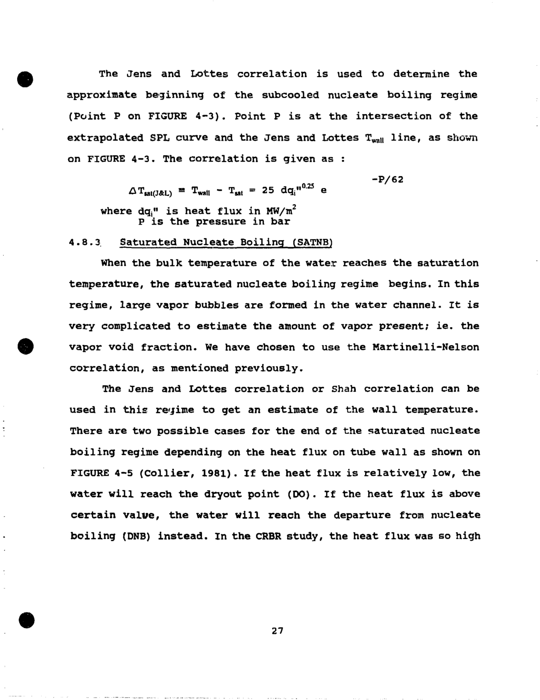

**`The Jens and Lottes correlation is used to determine the`**

**`approximate beginning of the subcooled nucleate boiling regime`**

**`(Point P on FIGURE 4-3). Point P is at the intersection of the`**

**`extrapolated SPL curve and the Jens and Lottes T^n line, as shown`**

**`on FIGURE 4-3. The correlation is given as :`**

## **`-P/62`**

**`0`** **`25`**
## **`^T„, ( J & L ) • T M „ - T u l = 25 dq;"- e`**

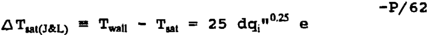

**`where dqj" is heat flux in MW/m2`**
**`P is the pressure in bar`**

**`4.8.3.`** **`Saturated Nucleate Boiling (5ATNB)`**

**`When the bulk temperature of the water reaches the saturation`**

**`temperature, the saturated nucleate boiling regime begins. In this`**

**`regime, large vapor bubbles are formed in the water channel. It is`**

**`very complicated to estimate the amount of vapor present; ie. the`**

**`vapor void fraction. We have chosen to use the Martinelli-Nelson`**

**`correlation, as mentioned previously.`**

**`The Jens and Lottes correlation or Shah correlation can be`**

**`used in this regime to get an estimate of the wall temperature.`**

**`There are two possible cases for the end of the saturated nucleate`**

**`boiling regime depending on the heat flux on tube wall as shown on`**

**`FIGURE 4-5 (Collier, 1981). If the heat flux is relatively low, the`**

**`water will reach the dryout point (DO) . If the heat flux is above`**

**`certain valve, the water will reach the departure from nucleate`**

**`boiling (DNB) instead. In the CRBR study, the heat flux was so high`**

**`27`**

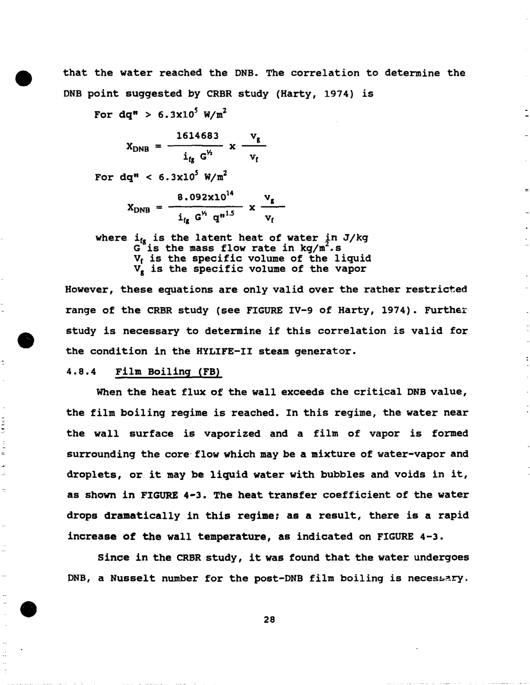

**`that the water reached the DNB. The correlation to determine the`**

**`DNB point suggested by CRBR study (Harty, 1974) is`**

**`For dq" > 6.3x10s W/m`** **`2`**

**`1614683`** **`v g`**
## **XDNB = Z. X**

**`if* G`** **`vf`**
**`For dq» < 6.3x10s W/m`** **`z`**

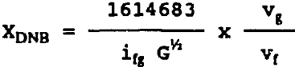
**`14`**
## **`8.092X10 v g`**

## **X D N B = Z 77~ x**

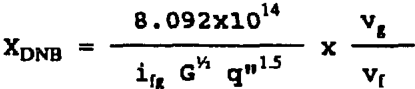
## **`ifg G W q,, 1 J vt`**

**`where i`** **`fg is the latent heat of water in J/kg`**
**`G is the mass flow rate in kg/m . s`**
## **`V f is the specific volume of the liquid`**

**`Vg is the specific volume of the vapor`**

**`However, these equations are only valid over the rather restricted`**

**`range of the CRBR study (see FIGURE IV-9 of Harty, 1974) . Further`**

**`study is necessary to determine if this correlation is valid for`**

**`the condition in the HYLIFE-II steam generator.`**

**`4.8.4`** **`Film Boiling (FB)`**

**`When the heat flux of the wall exceeds the critical DNB value,`**

**`the film boiling regime is reached. In this regime, the water near`**

**`the wall surface is vaporized and a film of vapor is formed`**

**`surrounding the core flow which may be a mixture of water-vapor and`**

**`droplets, or it may be liquid water with bubbles and voids in it,`**

**`as shown in FIGURE 4-3. The heat transfer coefficient of the water`**

**`drops dramatically in this regime; as a result, there is a rapid`**

**`increase of the wall temperature, as indicated on FIGURE 4-3.`**

**`Since in the CRBR study, it was found that the water undergoes`**

**`DNB, a Nusselt number for the post-DNB film boiling is necessary.`**

**`28`**

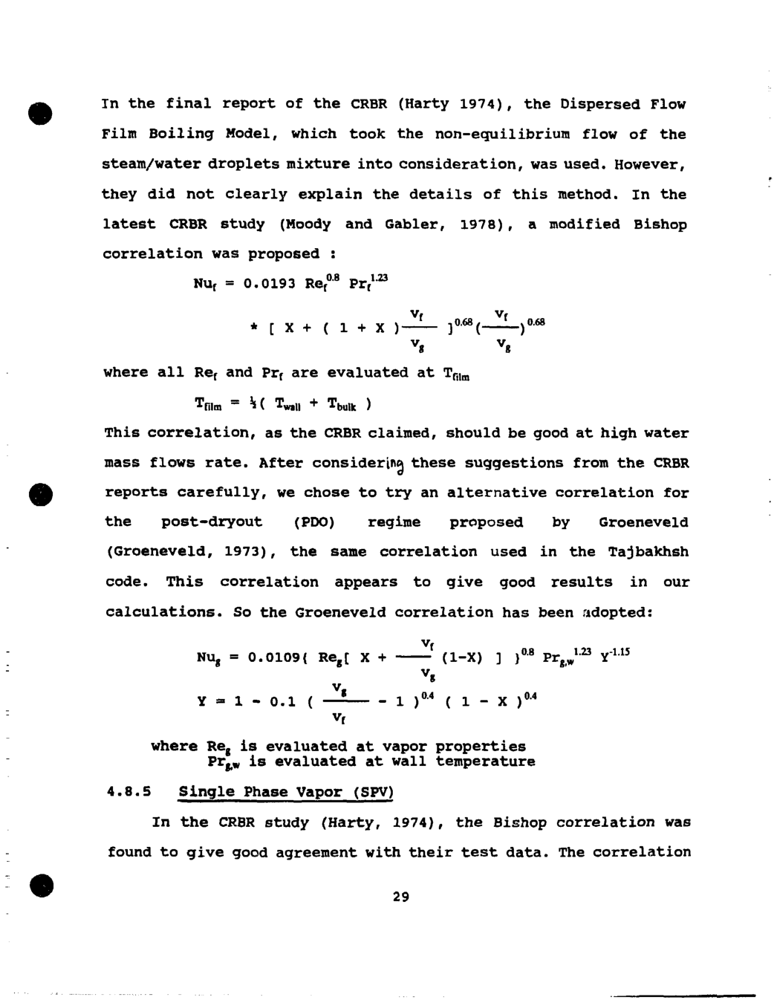

**`In the final report of the CRBR (Harty 1974), the Dispersed Flow`**

**`Film Boiling Model, which took the non-equilibrium flow of the`**

**`steam/water droplets mixture into consideration, was used. However,`**

**`they did not clearly explain the details of this method. In the`**

**`latest CRBR study (Moody and Gabler, 1978), a modified Bishop`**

**`correlation was proposed :`**

**Nu f = 0.0193 R e** **f**

## **0 8 Pr f**

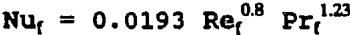

**1** **-** **2** **3**

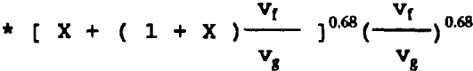

**v** **f** **v** **f**
## **[ X + ( 1 + X ) ] 0 6 8 ( ) C**

**`where all Re`** **`f and Prf are evaluated at T`** **`n`** **`i`** **`m`**

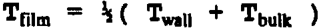

**Tfilm** **=** **^ (** _**^vt\\**_ _**+**_ **Tbulk )**

**`This correlation, as the CRBR claimed, should be good at high water`**

**`mass flows rate. After consider ina these suggestions from the CRBR`**

**`reports carefully, we chose to try an alternative correlation for`**

## **`the post-dryout (PDO) regime proposed by Groeneveld`**

**`(Groeneveld, 1973), the same correlation used in the Tajbakhsh`**

**`code. This correlation appears to give good results in our`**

**`calculations. So the Groeneveld correlation has been adopted:`**

**`vf`**
**`0`** **`8`**
## **`Nu g = 0.0109{ Reg[ X + (1-X) ] ) Pr g w`** **`Y - 1 - 0.1 ( — 1 ) 0 4 ( 1 - X ) 0 4`**

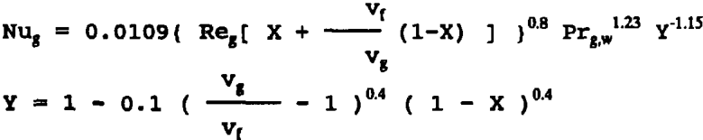
`Vf`

**`where Re, is evaluated at vapor properties`**
**`Pr`** **`ftW is evaluated at wall temperature`**

**`4.8.5`** **`Single Phase Vapor (SPV)`**

## **`1 2 3 Y"115`**

**`In the CRBR study (Harty, 1974), the Bishop correlation was`**

**`found to give good agreement with their test data. The correlation`**

**`29`**

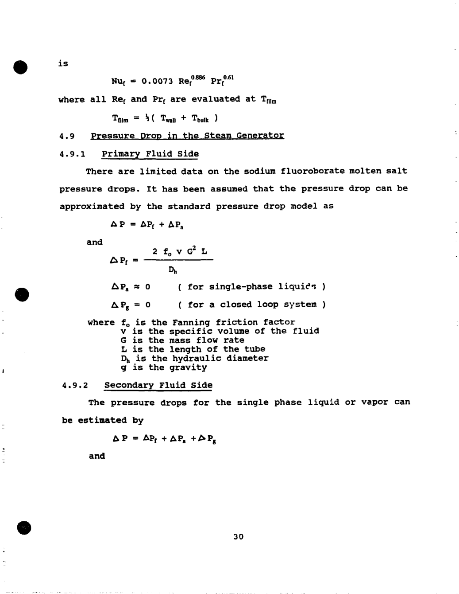
## **I S**

**Nuf = 0.0073 Re** **f**

## **0 J 8 6 Pr t**

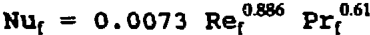

**0** **6** **1**

**where a l l Ret and Prf are evaluated at T** **rilm**

**Tfilm** **=** **^ (** **Tvrall** **+** **Tbulk** **)**

**`4.9`** **`Pressure Drop in the Steam Generator`**

**`4.9.1`** **`Primary Fluid Side`**

**`There are limited data on the sodium fluoroborate molten salt`**

**`pressure drops. It has been assumed that the pressure drop can be`**

**`approximated by the standard pressure drop model as`**

## **`A P = AP f + AP a`**

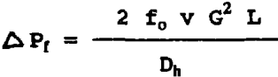

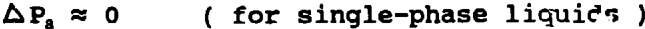

## **`2 f „ v G 2 L`** **`£>P, =`**

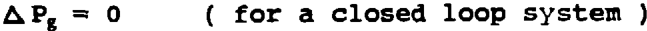
`Dh`

## **`A P a « 0 ( for single-phase liquid's )`** **`A P g => 0 ( for a closed loop system )`**

**`where f`** **`0 is the Fanning friction factor`**
**`v is the specific volume of the fluid`**
**`G is the mass flow rate`**
**`L is the length of the tube`**
**`D|, is the hydraulic diameter`**

**`g is the gravity`**

**`4.9.2`** **`Secondary Fluid Side`**

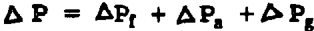
**`The pressure drops for the single phase liquid or vapor can`**

**`be estimated by`**

**`A P = APf + AP, + A P`** **`g`**

`30`

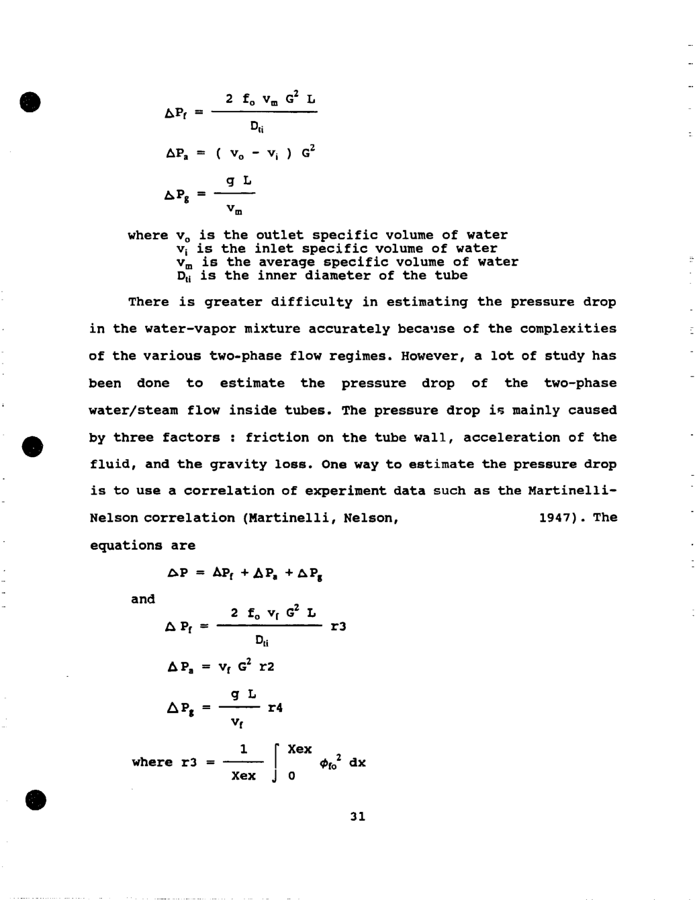

**`z`**
## **`2 f0 V m G L`**
**Ap f =**

**`AP a - ( V„ - V, ) G*`**

`*` `p` `g` `=`

**`g L`**

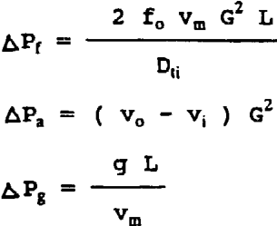

**`where v 0 is the outlet specific volume of water`**
**`V; is the inlet specific volume of water`**
**`v`** **`m is the average specific volume of water`**
**`Dti is the inner diameter of the tube`**

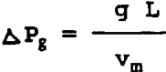

**`There is greater difficulty in estimating the pressure drop`**

**`in the water-vapor mixture accurately because of the complexities`**

**`of the various two-phase flow regimes. However, a lot of study has`**

**`been done to estimate the pressure drop of the two-phase`**

**`water/steam flow inside tubes. The pressure drop is mainly caused`**

**`by three factors : friction on the tube wall, acceleration of the`**

**`fluid, and the gravity loss. One way to estimate the pressure drop`**

**`is to use a correlation of experiment data such as the Martinelli-`**

**`Nelson correlation (Martinelli, Nelson,`** **`1947). The`**

**`equations are`**

## **£»P = APf + AP a + AP g**

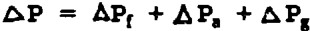

**`4`**
## **`2 f0 vf G L`** **`A P f = r3`**

**`z`**
**`AP, = vf G`** **`r2`**

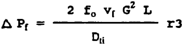

**`g L`**
`AP` `g =` **`r4`**

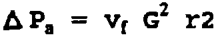
`Vf`

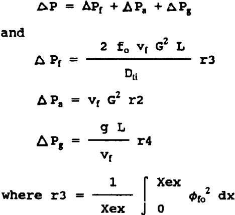

**`where r3 =`**

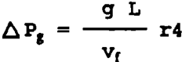

**`Xex`**

**`Xex`**

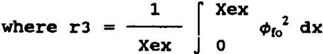
`#16 <*X`

**`31`**

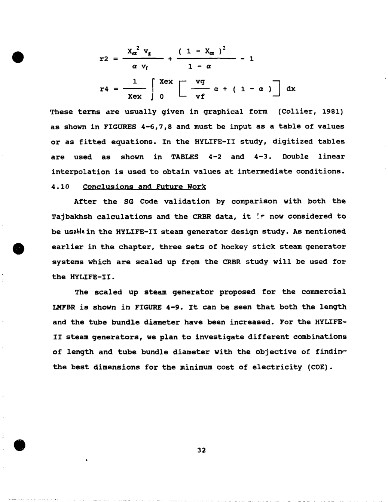

_xj_ `vg` `( i - x„ )` `2`
**`r2 =`** **`+`** **`1`**
_**a vf**_ _**1 - a**_

**`1`** **`[ Xex r— vg`** **`—l`**
**`r4 =`** **`a + ( 1 - a )`** **`dx`**

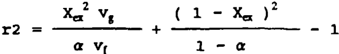

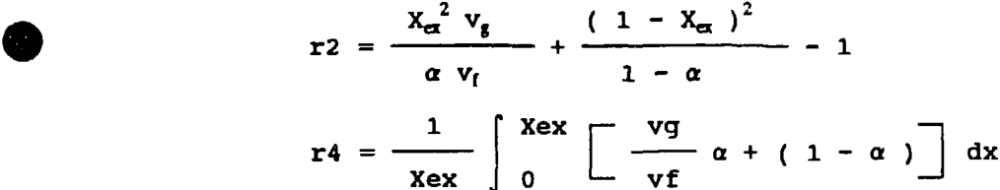
**`Xex J 0`** **`L- vf`** **`—'`**

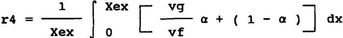
**`These terms are usually given in graphical form`** **`(Collier, 1981)`**

**`as shown in FIGURES 4-6,7,8 and must be input as a table of values`**

**`or as fitted equations. In the HYLIFE-II study, digitized tables`**

**`are used as shown in TABLES 4-2 and 4-3. Double linear`**

**`interpolation is used to obtain values at intermediate conditions.`**

**`4.10`** **`Conclusions and Future Work`**

**`After the SG Code validation by comparison with both the`**

**`Tajbakhsh calculations and the CRBR data, it ir now considered to`**

**`be us?t>lcin the HYLIFE-II steam generator design study. As mentioned`**

**`earlier in the chapter, three sets of hockey stick steam generator`**

**`systems which are scaled up from the CRBR study will be used for`**

**`the HYLIFE-II.`**

**`The scaled up steam generator proposed for the commercial`**

**`LMFBR is shown in FIGURE 4-9. It can be seen that both the length`**

**`and the tube bundle diameter have been increased. For the HYLIFE-`**

**`II steam generators, we plan to investigate different combinations`**

**`of length and tube bundle diameter with the objective of finding`**

**`the best dimensions for the minimum cost of electricity (COE).`**

**`32`**

**TABLE 4-1 Physical properties of MSBR coolant salt**

| Composition | HaBF₄·NaF (92-8 mole %) | |
|---|---|---|
| Melting-Point temperature | 384°C | |
| Properties at | 454°C | 621°C |
| Density, g/cm³ | 1.93 | 1.82 |
| Heat capacity, cal/g·°C (kJ/kg·K) | 0.36 (1.506) | 0.36 (1.506) |
| Viscosity, centipoise (Na/m²·2) | 1.9 (0.0019) | 1.1 (0.0011) |
| Thermal conductivity, W/°C·cm | 0.0045 | 0.0040 |
| Vapor pressure, torr (kPa) | 8 (1.1) | 252 (33.3) |

## TABLE 4-2 Friction multiplier as a function of quality and absolute pressure ( Martinelli-Nelson )

| Steam Quality | Pressure (Pa) | | | | | | | | |
|---|---|---|---|---|---|---|---|---|---|
| | 101353 | 689476 | 3447380 | 6894760 | 10342140 | 13789520 | 17236900 | 20684280 | 22104601 |
| 0.00 | 1 | 1 | 1 | 1 | 1 | 1 | 1 | 1 | 1 |
| 0.01 | 5.6 | 3.5 | 1.8 | 1.6 | 1.35 | 1.2 | 1.1 | 1.05 | 1.00 |
| 0.10 | 69 | 28 | 8.9 | 5.4 | 3.4 | 2.45 | 1.75 | 1.30 | 1.00 |
| 0.20 | 150 | 56 | 16.2 | 8.6 | 5.1 | 3.25 | 2.19 | 1.51 | 1.00 |
| 0.30 | 245 | 83 | 23.0 | 11.6 | 6.8 | 4.04 | 2.62 | 1.68 | 1.00 |
| 0.40 | 350 | 115 | 29.2 | 14.4 | 8.4 | 4.82 | 3.02 | 1.83 | 1.00 |
| 0.50 | 450 | 145 | 34.9 | 17.0 | 9.9 | 5.59 | 3.38 | 1.97 | 1.00 |
| 0.60 | 545 | 174 | 40.0 | 19.4 | 11.1 | 6.34 | 3.70 | 2.10 | 1.00 |
| 0.70 | 625 | 199 | 44.6 | 21.4 | 12.1 | 7.05 | 3.96 | 2.23 | 1.00 |
| 0.80 | 685 | 216 | 48.6 | 22.9 | 12.8 | 7.70 | 4.15 | 2.35 | 1.00 |
| 0.90 | 720 | 210 | 48.0 | 22.3 | 13.0 | 7.95 | 4.20 | 2.28 | 1.00 |
| 1.00 | 525 | 130 | 30.0 | 15.0 | 8.6 | 5.90 | 3.70 | 2.15 | 1.00 |

**TABLE 4-3** Void fraction α as a function of quality and absolute pressure ( Martinelli-Nelson )

| Steam Quality | Pressure (Pa) | | | | | | | | |
|---|---|---|---|---|---|---|---|---|---|
| | 101353 | 689476 | 3447380 | 6894760 | 10342140 | 13789520 | 17236900 | 20684280 | 22104601 |
| 0.00 | 0.000 | 0.000 | 0.000 | 0.000 | 0.000 | 0.000 | 0.000 | 0.000 | 0.000 |
| 0.01 | 0.683 | 0.550 | 0.317 | 0.167 | 0.110 | 0.067 | 0.050 | 0.033 | 0.014 |
| 0.02 | 0.750 | 0.643 | 0.443 | 0.286 | 0.200 | 0.129 | 0.093 | 0.050 | 0.017 |
| 0.03 | 0.786 | 0.700 | 0.517 | 0.371 | 0.257 | 0.171 | 0.129 | 0.071 | 0.021 |
| 0.04 | 0.814 | 0.729 | 0.586 | 0.429 | 0.321 | 0.214 | 0.157 | 0.100 | 0.029 |
| 0.05 | 0.836 | 0.757 | 0.621 | 0.474 | 0.357 | 0.257 | 0.186 | 0.114 | 0.036 |
| 0.06 | 0.843 | 0.771 | 0.643 | 0.514 | 0.400 | 0.200 | 0.213 | 0.136 | 0.047 |
| 0.07 | 0.846 | 0.786 | 0.657 | 0.543 | 0.429 | 0.329 | 0.231 | 0.150 | 0.057 |
| 0.08 | 0.864 | 0.800 | 0.693 | 0.571 | 0.460 | 0.357 | 0.257 | 0.171 | 0.071 |
| 0.09 | 0.879 | 0.807 | 0.707 | 0.600 | 0.493 | 0.379 | 0.279 | 0.186 | 0.093 |
| 0.10 | 0.899 | 0.814 | 0.721 | 0.614 | 0.514 | 0.400 | 0.307 | 0.200 | 0.100 |
| 0.20 | 0.929 | 0.871 | 0.807 | 0.736 | 0.650 | 0.557 | 0.443 | 0.343 | 0.200 |
| 0.30 | 0.964 | 0.914 | 0.857 | 0.803 | 0.736 | 0.671 | 0.557 | 0.443 | 0.300 |
| 0.40 | 0.971 | 0.929 | 0.893 | 0.843 | 0.793 | 0.743 | 0.664 | 0.540 | 0.400 |
| 0.50 | 0.986 | 0.943 | 0.921 | 0.893 | 0.843 | 0.800 | 0.729 | 0.629 | 0.500 |
| 0.60 | 0.994 | 0.957 | 0.936 | 0.914 | 0.879 | 0.843 | 0.800 | 0.707 | 0.600 |
| 0.70 | 0.996 | 0.979 | 0.957 | 0.943 | 0.914 | 0.900 | 0.843 | 0.793 | 0.700 |
| 0.80 | 0.993 | 0.993 | 0.974 | 0.957 | 0.943 | 0.936 | 0.900 | 0.850 | 0.800 |
| 0.90 | 0.999 | 0.997 | 0.994 | 0.990 | 0.986 | 0.971 | 0.943 | 0.921 | 0.900 |
| 1.00 | 1.000 | 1.000 | 1.000 | 1.000 | 1.000 | 1.000 | 1.000 | 1.000 | 1.000 |

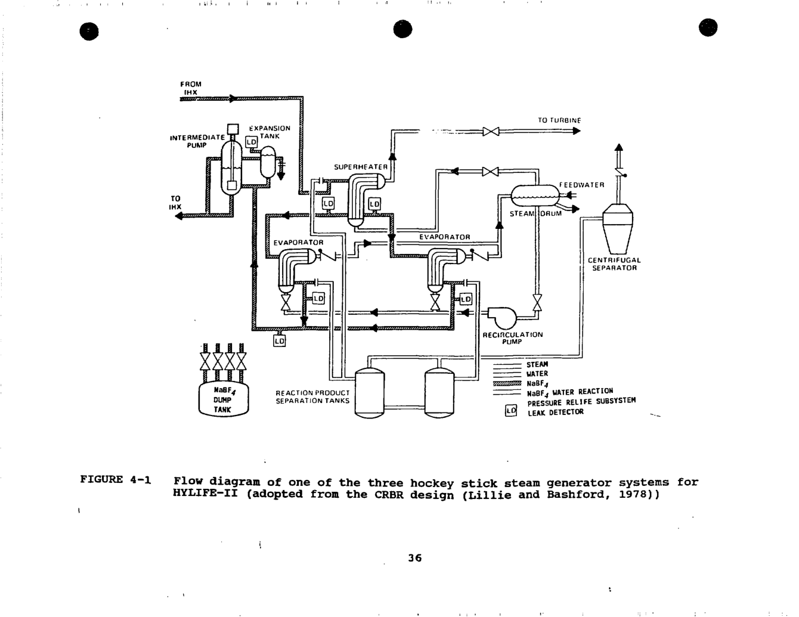

CENTRIFUGAL
SEPARATOR

**NaBF4 WATER REACTION**
## **PRESSURE RELIFE SUBSYSTEM** **LEAK DETECTOR**

`FIGURE 4-1` `Flow diagram of one of the three hockey stick steam generator systems for`
`HYLIFE-II (adopted from the CRBR design (Lillie and Bashford, 1978))`

`36`

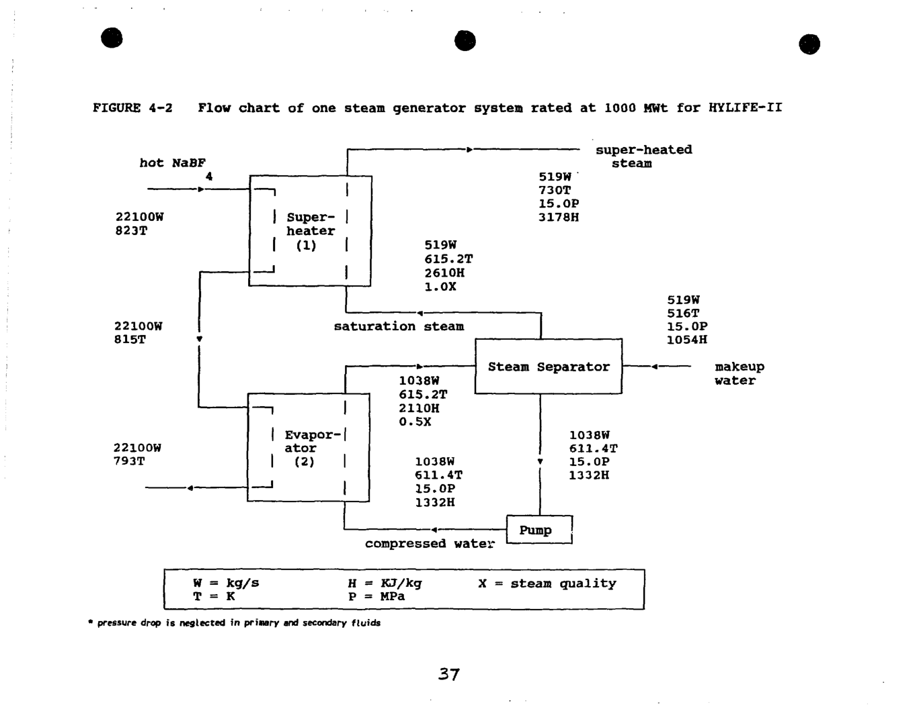

`FIGURE 4-2` **`Flow`** `chart of one steam generator system rated at 1000 HWt for HYLIFE-II`

`hot NaB` **`F`**

**`4`**

**`519W`**
**`615.2T`**
**`2610H`**
**`l.OX`**

`22100H`
`823T`

`221O0W`
`815T`

`22100W`
`793T`

`| Super­`
`heater`
`1 (1)`

`i`

`saturation steam`

`1038W`
`615.2T`
`2110H`
`0.5X`

`1038W`
`611.4T`
`15. OP`
`1332H`

`Steam Separator`

`1038W`
`611.4T`
`15.OP`
`1332H`

`super-heated`
`steam`
`519W`
`730T`
`15. OP`
`3178H`

`519W`
`516T`
`15. OP`
`1054H`

`makeup`
`water`

`compressed watev`

`Pump`

`W = kg/s` `H = KJ/kg` `X = steam quality`
`T = K` `P = MPa`

**`* pressure drop is neglected in primary end secondary fluids`**

`37`

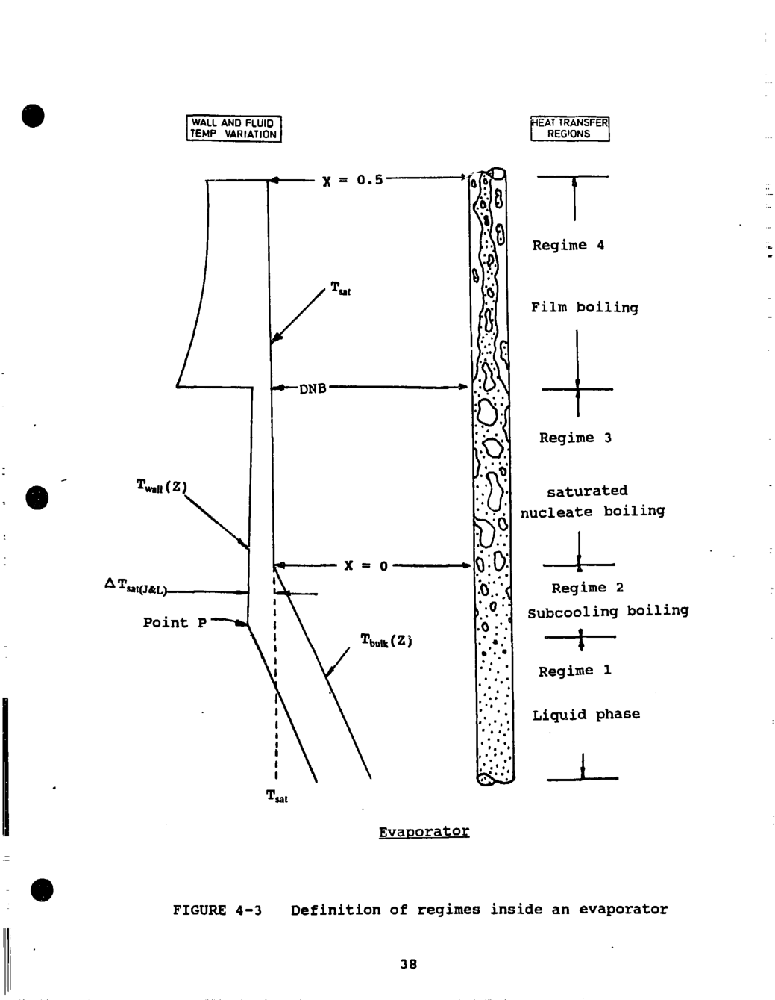
## **WALL AND FLUID jHEAT TRANSFERl** **TEMP VARIATION I REG'ONS**

**`Regime 4`**

**`Film boiling`**

**`Regime 3`**

**`Twll(Z)`**

## **`AT, »I(JAL>`**

**`Point P`**

**`saturated`**
**`nucleate boiling`**

**`Regime 2`**

**`Subcooling boiling`**

**—** _**\**_ _**—**_

**`Regime 1`**

**`Liquid phase`**

**`Evaporator`**

## **`FIGURE 4-3 Definition of regimes inside an evaporator`**

**`38`**

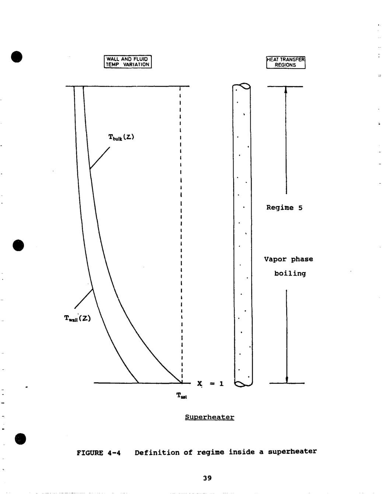
## **WALL AND FLUID HEAT TRANSFER]** **TEMP VARIATION REGIONS**

**rc>**

**Regime 5**

**Vapor phase**

**b o i l i n g**

**x = i** **c>J**

`Superheater`

## **`FIGURE 4-4 Definition of regime inside a superheater`**

**`39`**

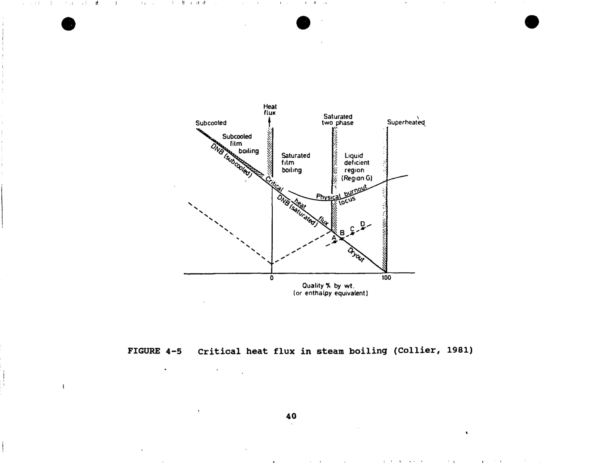

Subcooted

Superheated^

Ouality % by wt.
(or enthalpy equivalent)

## **`FIGURE 4-5 Critical heat flux in steam boiling (Collier, 1981)`**

**`40`**

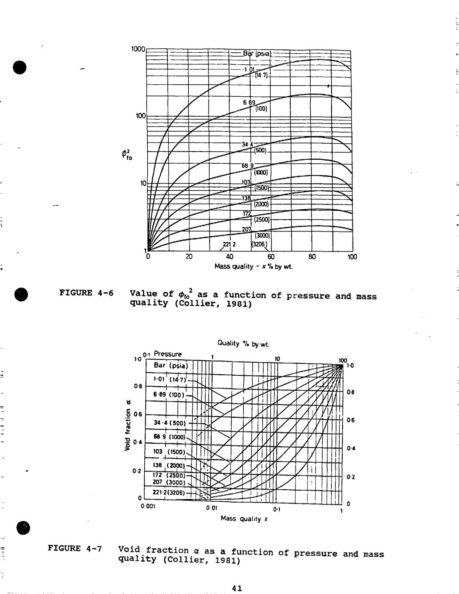

20 40 60 BO 100

Mass quality - _x_ V. by wt.

## **FIGURE 4-6 Value of 0q u a l i t y (Collier, f o 2 as a function of pressure and mass 1981)**

CM Pressure

Quality % by wt.

Mass quality _t_

**•**

`FIGURE 4-7` `Void fraction a as a function of pressure and mass`
`quality (Collier, 1981)`

`41`

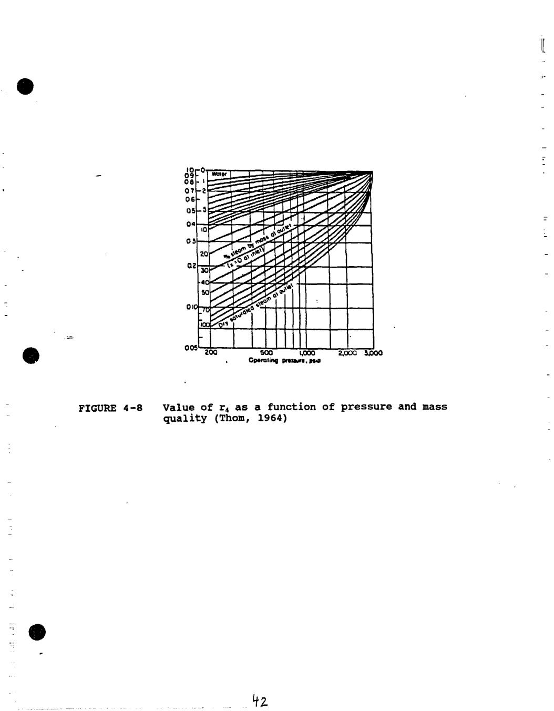

**005** **1**
## **200 500 1,000 2,000 WOO**

**Operating praam,** _**wo**_

`FIGURE 4-8` `Value of r 4 as a function of pressure and mass`
`quality (Thorn, 1964)`

_**Hz.**_

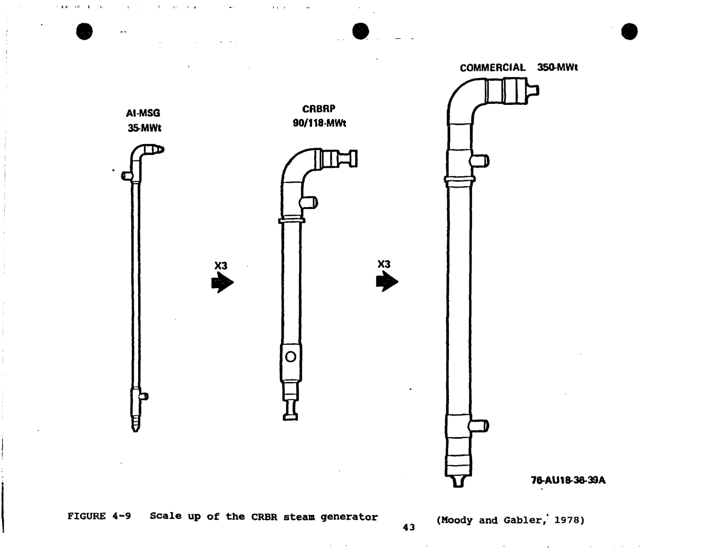

**COMMERCIAL 350-MWt**

**3**
**0**

## **AI-MSG** **354IM**

## **CRBRP**

**90/118 MWt**

## **X3 X3**

**lo**

**a>**
### **e**

## **76-AU18-36-39A**

## **`FIGURE 4-9 Scale up of the CRBR steam generator`**

**(Moody and Gabler," 1978)**

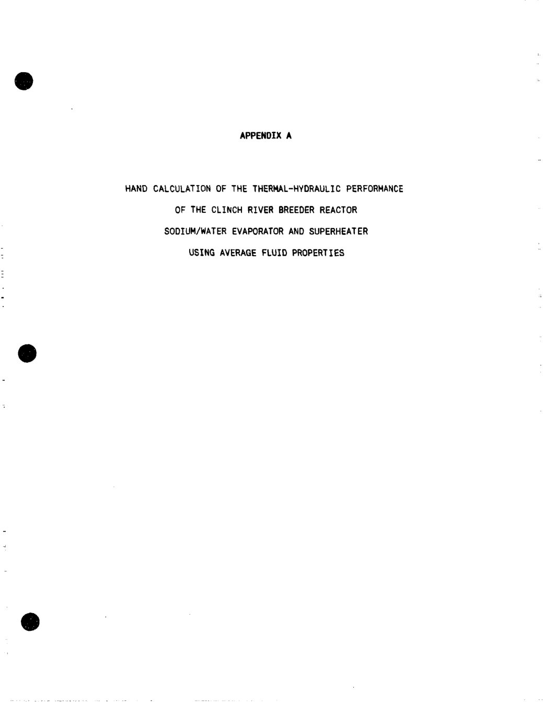
## **`APPENDIX A`**

`HAND CALCULATION OF THE THERMAL-HYDRAULIC PERFORMANCE`

`OF THE CLINCH RIVER BREEDER REACTOR`

`SODIUM/WATER EVAPORATOR AND SUPERHEATER`

`USING AVERAGE FLUID PROPERTIES`

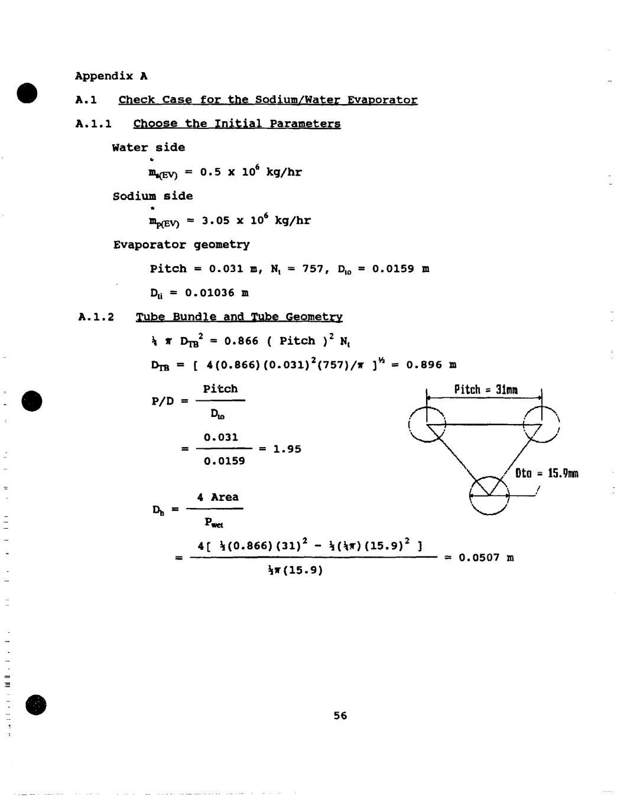

**Appendix A**

**A . l** **Check C a s e f o r t h e Sodium/Water Evaporator**

## **A . 1 . 1 Choose t h e I n i t i a l Parameters**

**Water** **s i d e**

**in^EV) = 0 . 5 x 10** **6 k g / h r**

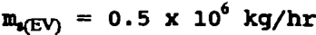

**Sodium** **s i d e**

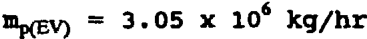

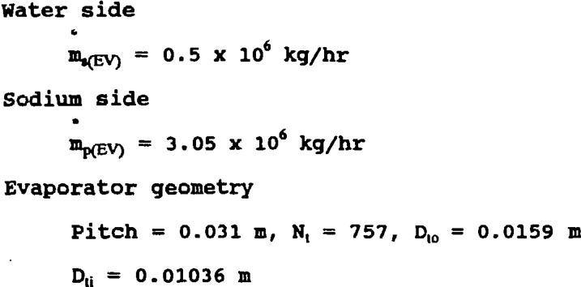
**nip^EV) = 3 . 0 5 x 10** **6 k g / h r**

**E v a p o r a t o r** **geometry**

**P i t c h = 0 . 0 3 1 m, N, = 7 5 7, D l 0 = 0 . 0 1 5 9 m**

**D u = 0 . 0 1 0 3 6 m**

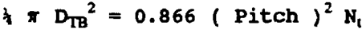
## **A . 1 . 2 Tube Bundle and Tube Geometry** **h * Dnj 2 = 0.866 ( P i t c h ) 2 N,**

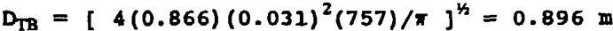
**DTB = [ 4 ( 0 . 8 6 6 ) ( 0 . 0 3 1 )** **2 ( 7 5 7 ) / i r** **]** **% = 0 . 8 9 6 m**

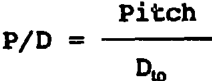
**Pitch** **Pitch = 31nn**
## **P/D =**

**Dto**

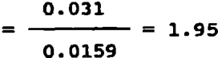

**0.031**
**=**

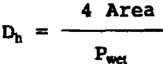
## **4 Area H^4-**

**Dh =**

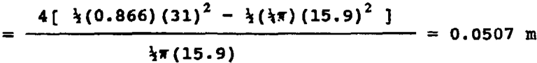

**4[ * ( 0 . 8 6 6 ) ( 3 1 )** **2 - * ( * i r ) ( 1 5 . 9 )** **2 ]**

= 0.0507 m
***ir(15.9)**

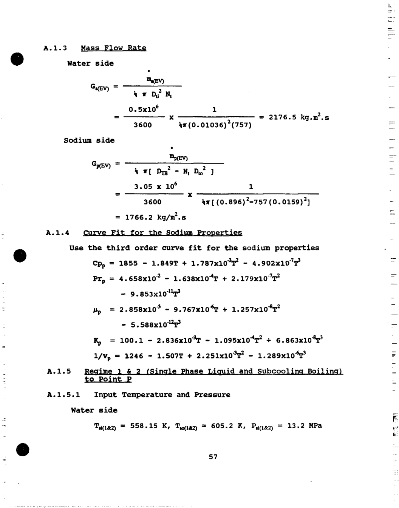

**`.1.3`** **`Mass Flow Rate`**

**`Water side`**

**`n^EV)`**

**`Gt(EV) ~ "`**
## **h * D d**

## **`2 N,`**

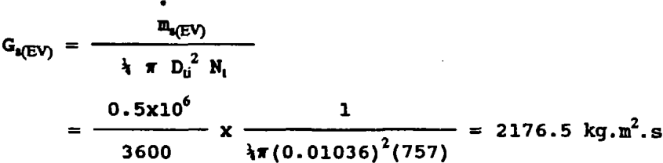

**`0.5x10*`** **`1`**
## **`— K`**

**`3600`** **`*»(0.01036) (757)`**

**`Sodium side`**

= 2176.5 kg.m 2 .s

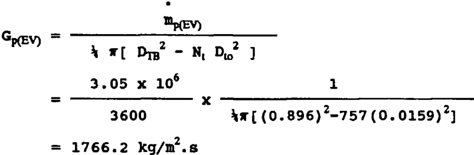

**`»p(EV)`**
## **GP(EV) = h «r[ D m 2 - N, D,,,2 ]**

### **`3.05 X 10 6 1`**

3600 *1T[(0.896) 2 -757(0.0159) 2 ]

= 1766.2 kg/m 2 .s

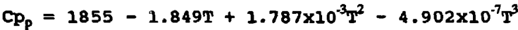
A.1.4 Curve F i t f o r t h e Sodium P r o p e r t i e s

Use t h e t h i r d o r d e r curve f i t for t h e sodium p r o p e r t i e s

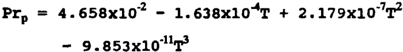
## Cp p = 1855 - 1.849T + 1.787xlO' 3T 2 - 4.902xl0"V

Pr p = 4.658X10" 2 - 1.638xl0"*T + 2.179xlO" 7T 2

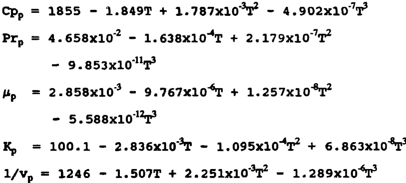

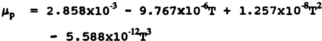
               - _9.B53xlO'n1^_

M„ = 2.858X10' 3 - 9.767xl0' 6T + 1.257xlO" 8T 2

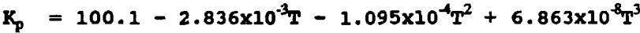
        - s.sasxio 1 2! 3

Kp = IOO.I - z.ssexio^r - i.o95xio"V + e.sesxio'V

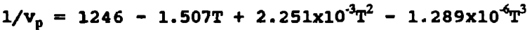
## l / v p = 1246 - 1.507T + 2.251xl0" 3T 2 - l^agxlO"*! 3

A . 1 . 5 Regime 1 & 2 (Single Phase Liquid and Subcooling Boiling)
to. Point P

## **`A.1.5.1 Input Temperature and Pressure`**

**`Hater side`**

**`^•1(142) ~ 558.15 K, T,^,^) = 605.2 K, P,`** **`i(142) = 13.2 MPa`**

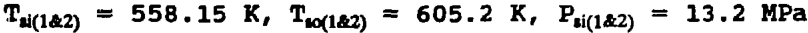

**`57`**

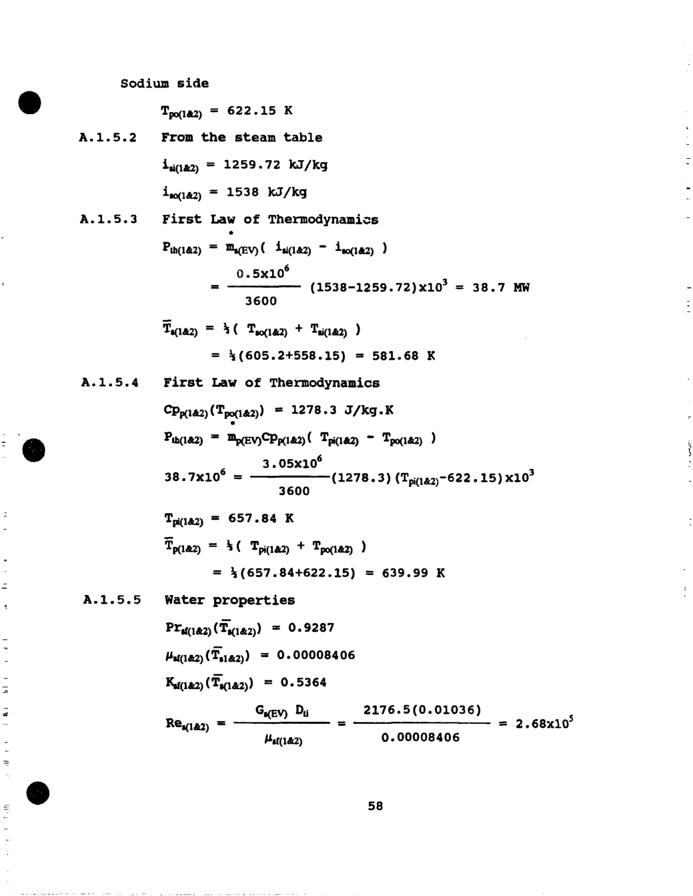

**`Sodium side`**

**`Tpo(ift2) = 622.15 K`**

## **`A.1.5.2 From the steam table`**

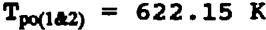

**`iii(i*2) = 1259.72 kJ/kg`**

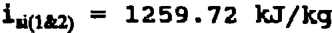
**`iio(i42) = I`** **`5`** **`3`** **`8 kJ/kg`**

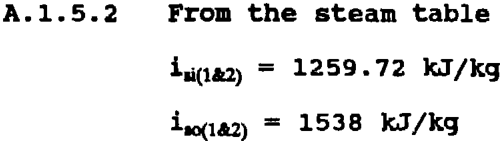
## **`A.1.5.3 First Law of Thermodynamics`**

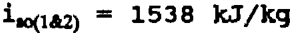

**PUl(142)** **=** **"VEVjt *«i(142) ~ i|o(l*2) )**

## **0.5X10***

**=** **( 1 5 3 8 - 1 2 5 9 . 7 2 ) X 1 0** **3 = 3 8 . 7 MW**
**3600**

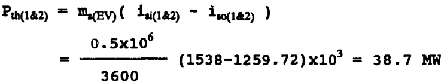

**Tt(lA2) = ^ ( Twflja)** **+** **Tii(142) )**

## **`= ^(605.2+558.15) «• 581.68 K`** **`A.1.5.4 First Law of Thermodynamics`**

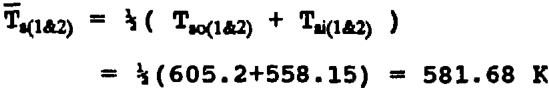

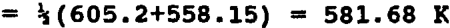
**`CPP(i*2)(Tp0(i42)) - 1278.3 J/kg.K`**

**`Plh(142) = "pCE^CPpCl^t Tpi(l&2) " Tpo(l*2) )`**

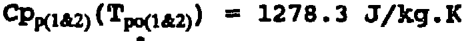
## **`3.05X10*`**

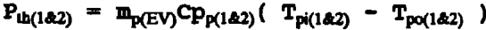
**`6`** **`3`**
## **`38.7X10 = (1278.3) ( T p i a 4 2 ) - 6 2 2 . 1 5 ) x l 0`**

**`3600`**

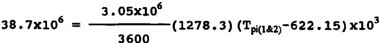

**`Tpi(iA2) = 657.84 K`**

**`Tp(142) = ^ ( 7pi(l&2) +`** **`Tpo(142) )`**

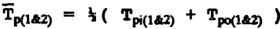
## **`= ^(657.84+622.15) = 639.99 K`** **`A.1.5.5 Water properties`** **P ^ (, « ) ( T " K I * 2 ) ) - 0.9287**

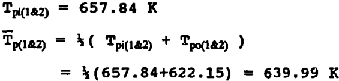

**Mtf(lft2)(Tii42)) = 0.00008406**

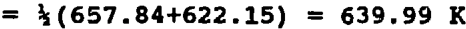

**Krf(i42)(Tl042)) = 0.5364**

**GKEV) D u** **2 1 7 6 . 5 ( 0 . 0 1 0 3 6 )**

**R eKl*2)** **=** **=** **=** **2.68x10** **s**

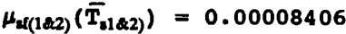
**M.f(i42)** **0.00008406**

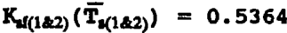
**58**

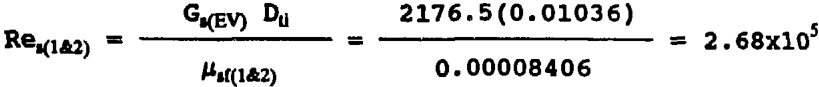

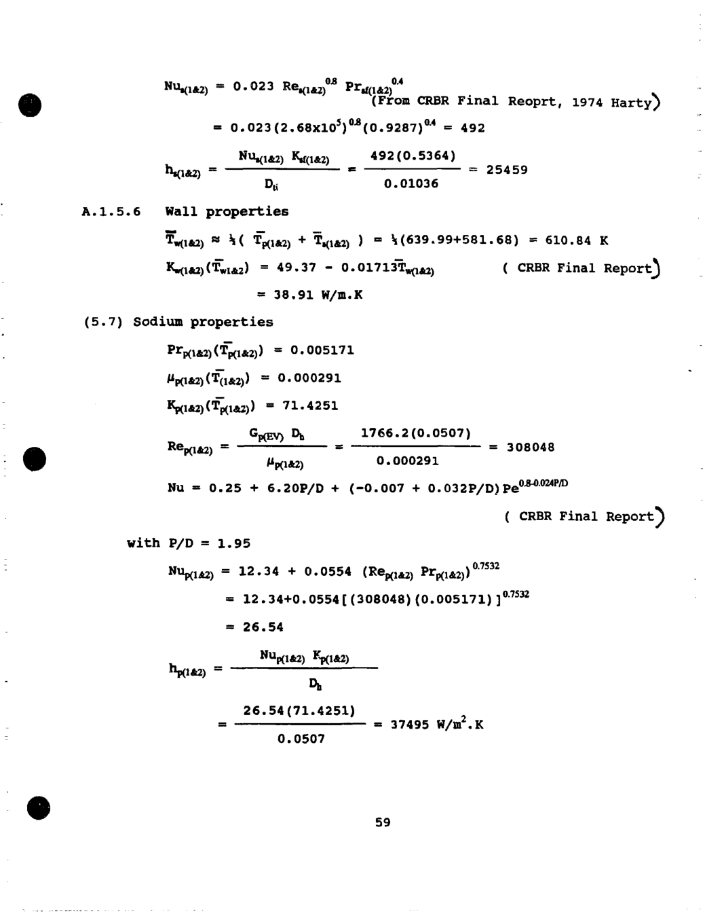

**N ui(i*2) -** **0 . 0 2 3 Re,(** **1** **4** **2** **)** **P r ^ ^ ) '**
**(From CRBR F i n a l Reoprt, 1974 H a r t y )**
## **= 0 . 0 2 3 ( 2 . 6 8 x l 0 S ) 0 J ( 0 . 9 2 8 7 ) 0 4 = 492**

**NUK1A2) Krf(i*2)** **4 9 2 ( 0 . 5 3 6 4 )**
**h^jaj** **=** **-** **25459**
## **D t i 0.01036** **A. 1 . 5 . 6 Wall p r o p e r t i e s** **^w(l&2) « *( T"p(i*2) + \i*2) ) = S ( 6 3 9 . 9 9 + 5 8 1 . 6 8 ) = 610.84 K**

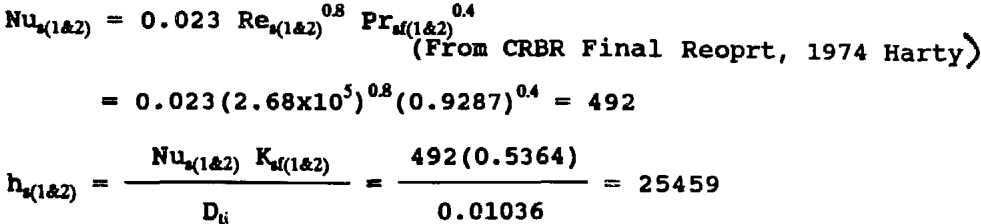
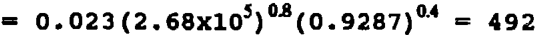

**Kw<i*2)(Ti(i*2) = 4 9 . 3 7 - 0.01713"T W (, 42 )** **( CRBR Final** **R e p o r t }**

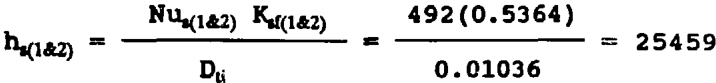

**» 3 8 . 9 1 W/m.K**

**( 5 . 7 )** **Sodium p r o p e r t i e s**

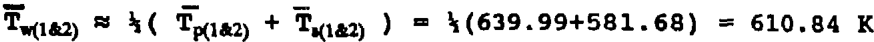
## **Prp( 1 A 2 ) (T^j & 2 ) ) = 0 . 0 0 5 1 7 1**

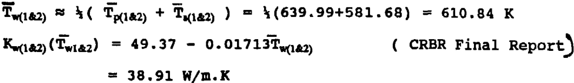

**Mp(iA2)(T^i&2)) = 0 . 0 0 0 2 9 1**

**Kp(l*2)C^(i42)) = 7 1 . 4 2 5 1**

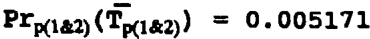

**GP(EV) Dt,** **1 7 6 6 . 2 ( 0 . 0 5 0 7 )**

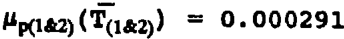
**Rep(lft2) =** **=** **= 308048**
**Mp(iA2)** **0.000291**

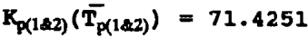
## **Nu = 0 . 2 5 + 6.20P/D + ( - 0 . 0 0 7 + 0.032P/D) P e ° * 0 0 2 4 P / D**

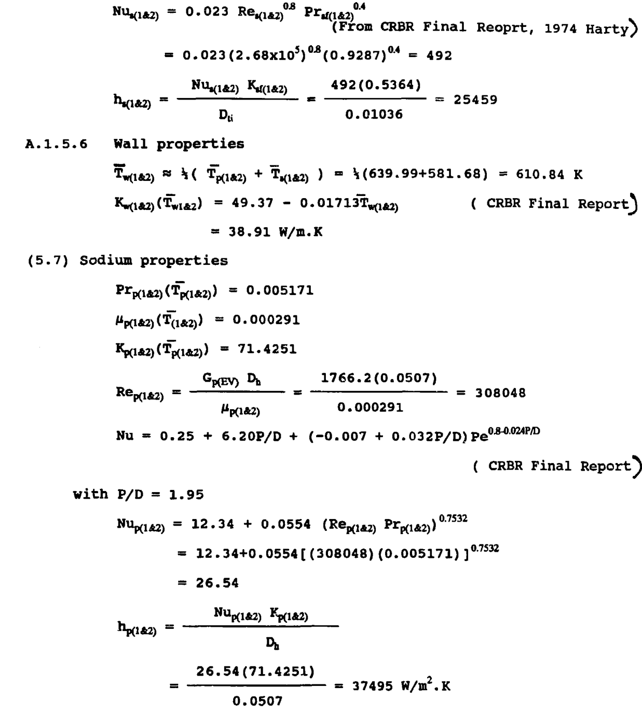

**( CRBR F i n a l** **R e p o r t }**

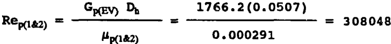

**w i t h P/D** **=** **1** **.** **9** **5**

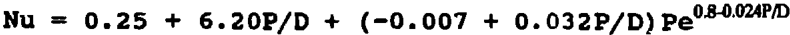

**NUp(iA2) = 1 2 . 3 4 + 0.0554** **( R e ^, ^** _**Pr^^))**_ **[0.7532 ]**

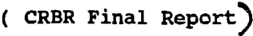

**= 1 2 . 3 4 + 0 . 0 5 5 4 [ (308048) ( 0 . 0 0 5 1 7 1 ) ]** **0** **7** **5** **3** **2**

**= 2 6 . 5 4**

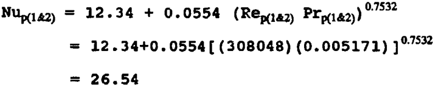
**Nup(lA2) ^142)**

**"1*1*2) ~**

**2 6 . 5 4 ( 7 1 . 4 2 5 1 )**
## **= 37495 W/m 2.K**

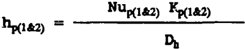
**0.0507**

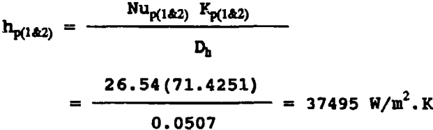

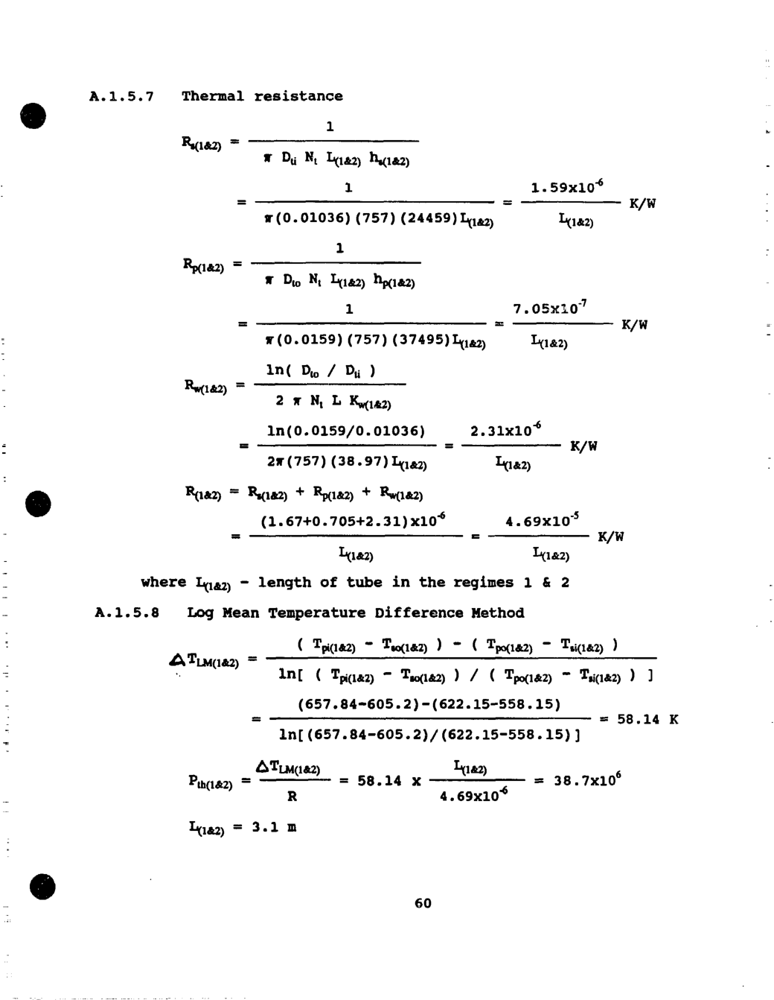

**A . 1 . 5 . 7** **Thermal** **r e s i s t a n c e**

**1**
**^1*2) ~**
## **V D u N t L(1A2) h^i42)** **1 1.59X10" 6** **ir(0.01036) (757) ( 2 4 4 5 9 ) 1 ^ L(j A 2 )**

**Rp(i&2) -**
## *** Dto N t ^142) kp(l*2)** **1 7.05X10" 7** **ir(0.0159) (757) (37495)^42) L ( 1 & 2 )**

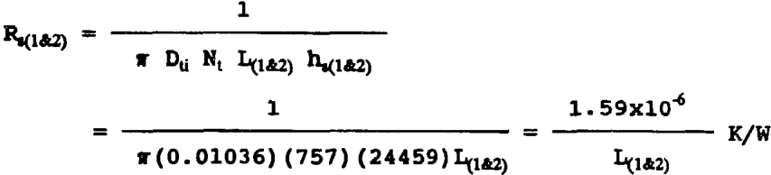

**l n ( D t o / D u )**

## **K/W** **K/W**

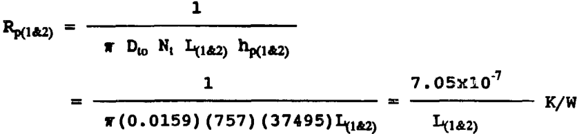

**HwO*^ ~**

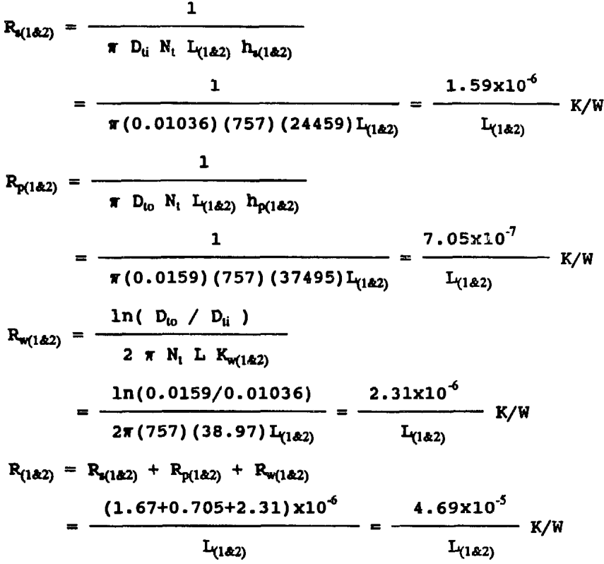

**2 ir N, L K„( 1 A 2)**

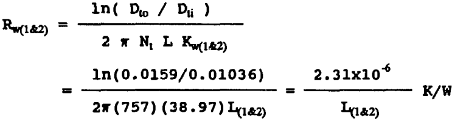
**`ln(0.0159/0.01036)`** **136)** **`2.31x10"*`** **2.31x10"***
## **K/W** **`2ir(757) (38.97)1^42, L ^ )`** **`(1.67+0.705+2.31) XlO*6 4.69X10"5`** **`K/W`** **`L{1*2) Ij(l&2)`**

**`where L ^ ) ~ length of tube in the regimes 1 & 2`**

## **`A.1.5.8 Log Mean Temperature Difference Method`** **`T`**

**`(`** **`pi(l*2) ~ ^^,(142) ) - ( 1^x42) ~ T»i(142) )`**
## **`ATLM(1&2) ~`**

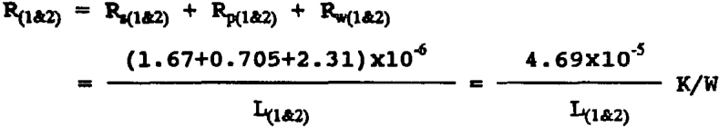
**`l n [ ( Tpi(l&2) "`** **`TK)(1&2) ) / ( Tpo(l*2) ~`** **`Tii(l&2) ) ]`**

**`(657.84-605.2)-(622.15-558.15)`**

**- = 58, .14**
**ln[(657., 8 4 -** **605.** **. 2 ) / ( 6 2 2 . 1 5 - 5 5 8 ., 1 5 ) ]**

## **= 58 . 1 4 hlAX) = 3 8 . 7X10 6** **R 4.69X10 -***

## **&TLM(1&2)**

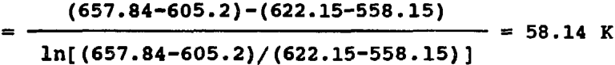
**Plh(142)**

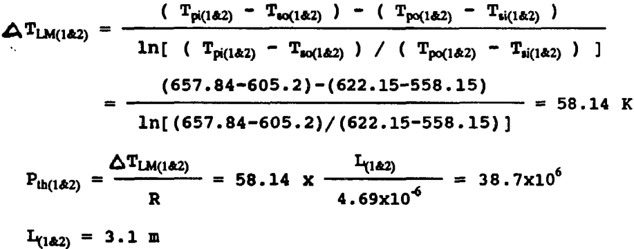

## **4.69X10 -***

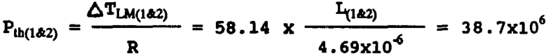

**^1*2) =** **[3 . 1 m ]**

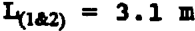

**`60`**

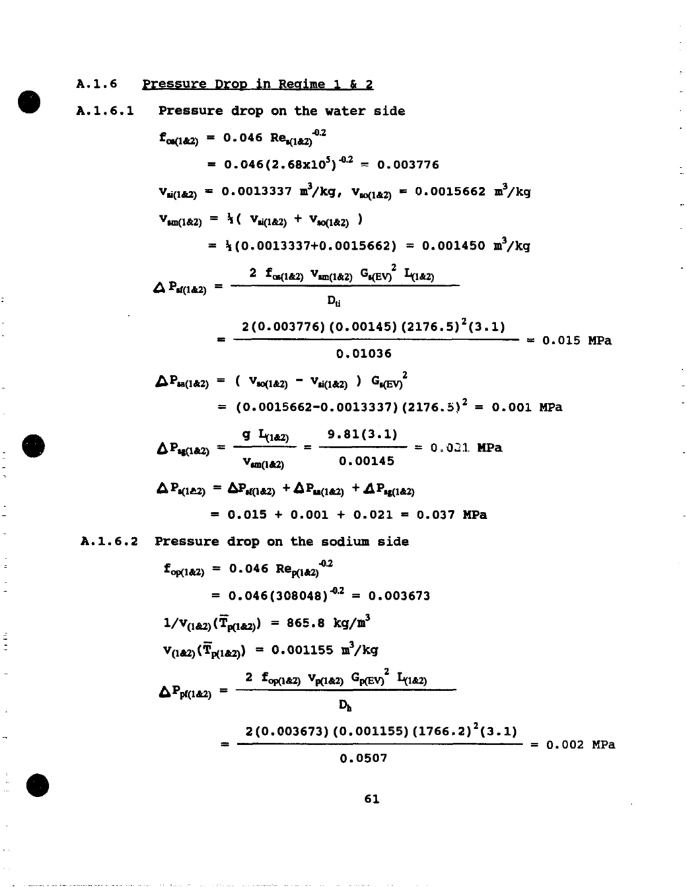

**`Pressure Drop in Regime 1 & 2`**

**`1`** **`Pressure drop on the water side`**

**fc»(142) = 0 . 0 4 6 Re^uuj '**

**= 0 . 0 4 6 ( 2 . 6 8 X 1 0** **5 ) *** **2 = 0.003776**

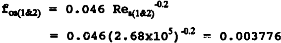
**v«(i42) • 0.0013337 m** **3** **/kg,** **V ^ A J J - 0.0015662** **m** **3** **/kg**

**vim(l&2)** **=** **^ (** **vii(l&2)** **+** **v»o(l&2) )**

**= * ( 0 . 0 0 1 3 3 3 7 + 0 . 0 0 1 5 6 6 2 )** **= 0 . 0 0 1 4 5 0** **m** **3** **/kg**

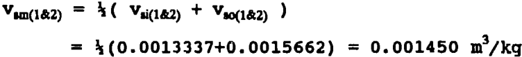

**2** **fo«(142)** **vun(l&2)** **Gi(EV) ^142)**
## **A P if(l&2) =** **D U**

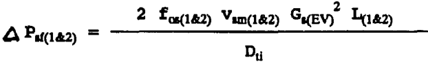
**2 ( 0 . 0 0 3 7 7 6 ) ( 0 . 0 0 1 4 5 ) ( 2 1 7 6 . 5 )** **2 ( 3 . 1 )**
**=** **= 0.015 MPa**
**0 . 0 1 0 3 6**

## **A P u(l«2) = ( VM(142) " vii(l&2) ) Gi(EV)**

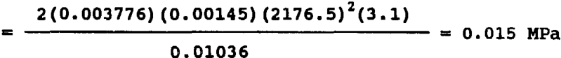

**= ( 0 . 0 0 1 5 6 6 2 - 0 . 0 0 1 3 3 3 7 ) ( 2 1 7 6 . 5 )** **2 = 0 . 0 0 1 MPa**

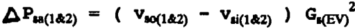

**g I** **^** **)** **9 . 8 1 ( 3 . 1 )**
## **A P H 0 * 2 ) = = = 0 . 0 2 1 MPa**

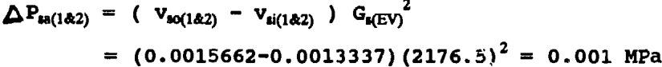
**V«,(i«2)** **0 . 0 0 1 4 5**

## **A Pi(l&2) = &Prf(lA2) +AP u (li2) +^Pi|(142)**

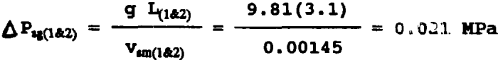

**= 0 . 0 1 5 + 0 . 0 0 1 + 0 . 0 2 1 = 0.037 MPa**

**. 2** **P r e s s u r e drop on t h e sodium** **s i d e**

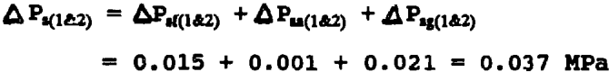

**f0*1*2) -** **0 . 0 4 6** **R e p d ^ *** **2**

**= 0 . 0 4 6 ( 3 0 8 0 4 8 )** **4** **2 = 0.003673**

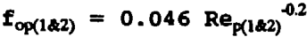
## **V v ( 1 & 2 ) ( T p ( i 4 2 ) ) = 8 6 5 . 8 kg/m 3**

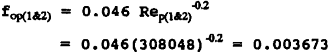

**V(i42)(T** **p** **(** **i** **4** **2** **)** **) = 0.001155 m** **3** **/kg**

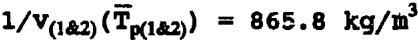
**2** **£op(l&2)** **vp(l&2)** **Gp(EV) ^142)**
**£bPpf(l&2)** **=**

**Dh**

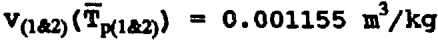
**2 ( 0 . 0 0 3 6 7 3 ) ( 0 . 0 0 1 1 5 5 ) ( 1 7 6 6 . 2 )** **2 ( 3 . 1 )**
**=** **= 0.002 MPa**
**0 . 0 5 0 7**

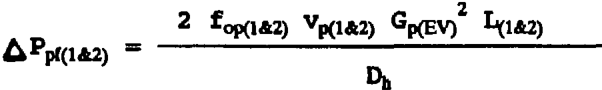

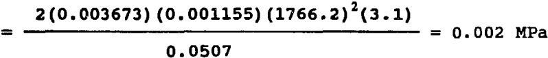

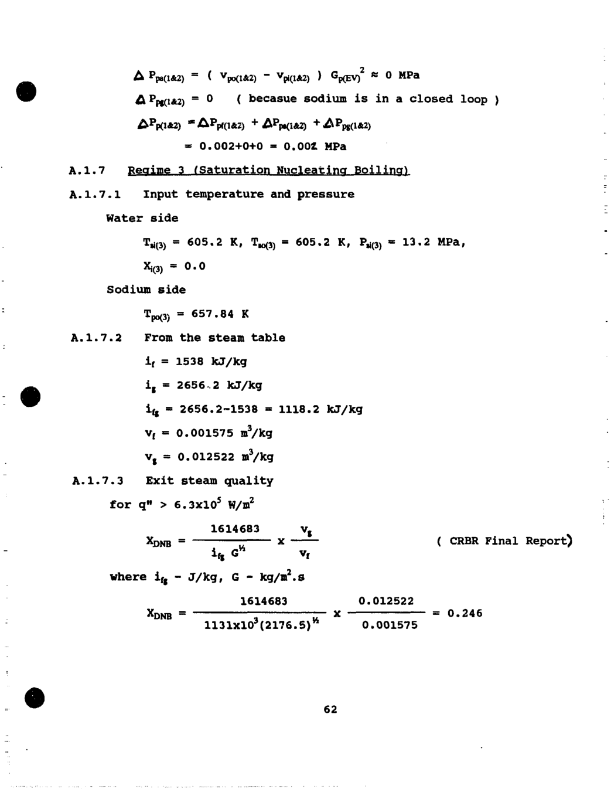

**`A Pp,(ii2) - ( v`** **`^`** **`i`** **`^ - Vp, ( 1 1 A 2 ) ) G`** **`p`** **`(`** **`E v`** **`) * 0 M P a`**

_**&**_ **`Pn(i&2) = °`** **`( becasue sodium is in a closed loop )`**

## **£>Pp(l&2) *& P pf(l*2) + APpt(l&2) + -APpg(l&2)**

**« 0.002+0+0 = 0.00Z MPa**

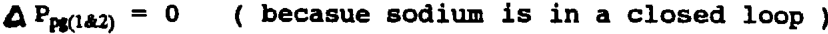
## **A.1.7 Regime 3 ( Saturation Nucleating Boiling)** **A. 1 . 7 . 1 Input temperature and pressure**

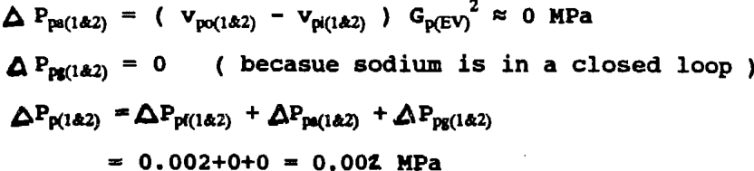

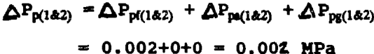
**Hater side**

**Tti(3) = 605.2 K, 1,0(3) = 605.2 K, P^** **(3) • 13.2 MPa,**

**Xi(3) = 0 . 0**

**Sodium s i d e**

**Tpo(3) = 657.84 K**

**A . 1 . 7 . 2** **From the steam table**

**i** **f = 1538 kJ/kg**

**i, = 2656.2 kJ/kg**

**i^ - 2656.2-1538 - 1118.2 kJ/kg**

**v, = 0.001575 m** **3Ag**

**v,** _**-**_ **0.012522 m** **3/kg**

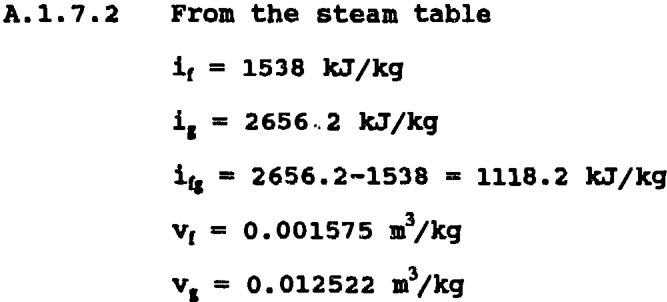

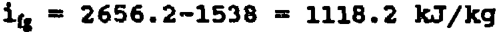
**A . 1 . 7 . 3** **Exit steam quality**

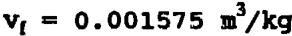
**for q" > 6.3x10** **s W/m2**

**1614683** **v.**
## ***DNB ( CRBR Final Report)**

**i** **f** **g G *** **Vf**

**where** _**iu**_ **- J/kg, G - kg/m** **2.s**

**1614683**
## **^DNB ~ 1131xl0 i (2176.5)'**

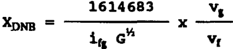

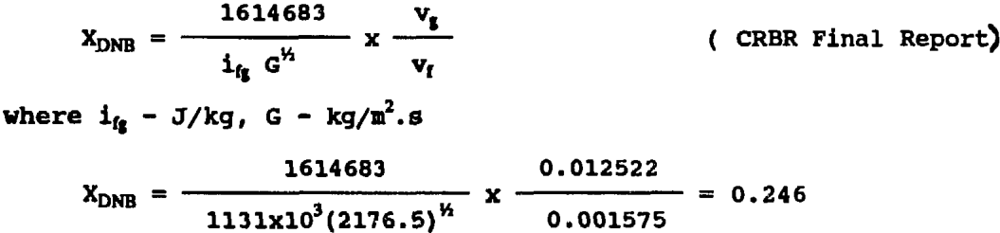
**= 0.246**
**0.001575**

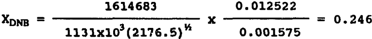

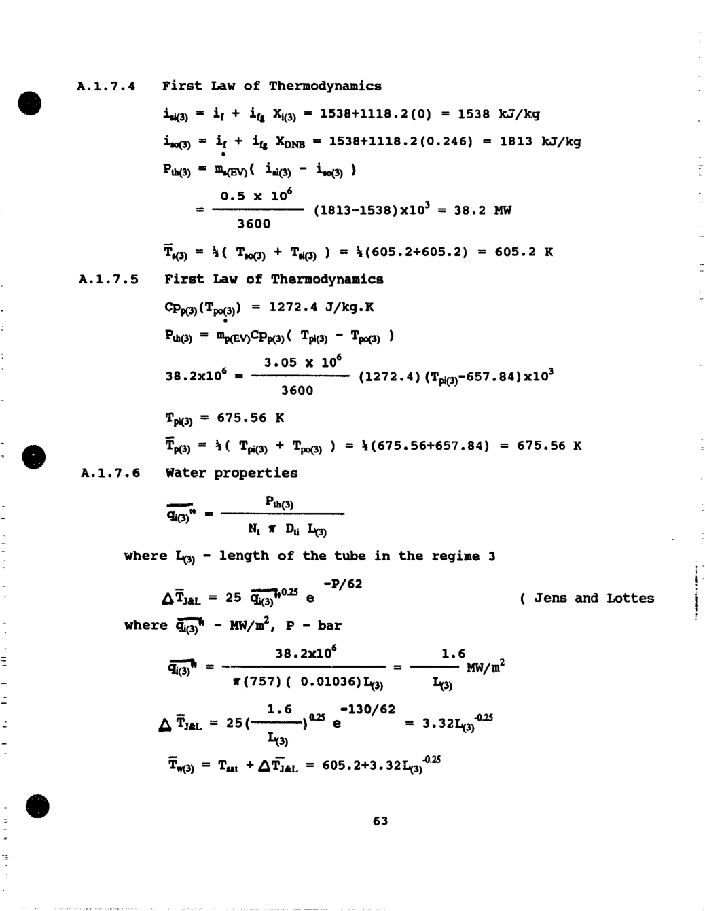
## **`A.1.7.4 First Law of Thermodynamics`**

**`i«(3) = if + if, Xi(3) = 1538+1118.2(0) = 1538 kJ/kg`**

## **iio(3) " if + iii X DNB = 1 5 3 8 + 1 1 1 8 . 2 ( 0 . 2 4 6 ) = 1813 kJ/kg**

**Pth(3) =** **""•(EVQC i«i(3) ~ iio(3) )**

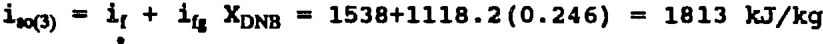
## **0 . 5 X 1 0 6**

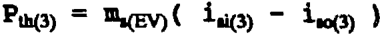
**(1813-1538)XlO** **3 = 3 8 . 2 MW**
**3600**

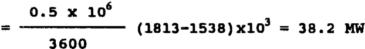
## **T^ 3 ) » *( ^ 3 ) + T r i ( 3 ) ) » ^ ( 6 0 5 . 2 + 6 0 5 . 2 ) - 6 0 5 . 2 K** **`A. 1.7.5 First Law of Thermodynamics`**

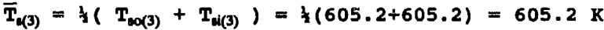
**`CP|X3)<TPO(3)) = 1272.4 J/kg.K`**

## **P|h(3) = • M E V ) C P K 9 ( Tpj^) - Tpop) )** **3 . 0 5 X 10*** **38.2X10 6 = ( 1 2 7 2 . 4 ) ( T p i, 3 ) - 6 5 7 . 8 4 ) X l O 3**

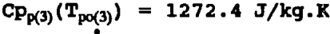
**3600**

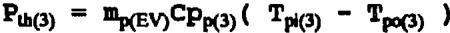

**Tpi(3) = 6 7 5 . 5 6 K**

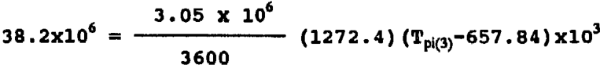

**j** **^** **T^) - *( Tpjoj + Tpoo) ) -** **fc(675.56+657.84)** **= 6 7 5 . 5 6 K**

## **`A.1.7.6 Hater properties`**

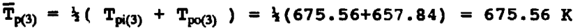
**P|h(3)**
**4(3)"**
## **N t w D u ^**

**where L^3) - length of the tube in the regime 3**

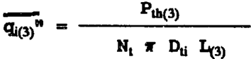
## A TJ&L = 25 qi(3)M e ( Jens and Lottes

**where** qJ^J* **- MW/m2, P - bar**

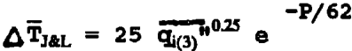

**38.2x10*** **1 . 6**
**qjrtj* =** **=** **MW/mz**

**r ( 7 5 7 ) (** **0 . 0 1 0 3 6 ) %** **%**

## **A T » L - 2 5 ( J* 2 5 e = 3 . 3 2 L W ' * 3 S** **L(3)** **T«(3) = T„, +nT7& L = 605.2+3.32L ( 3 ) - 0 2 5**

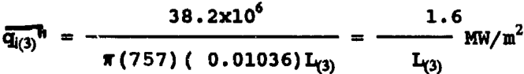

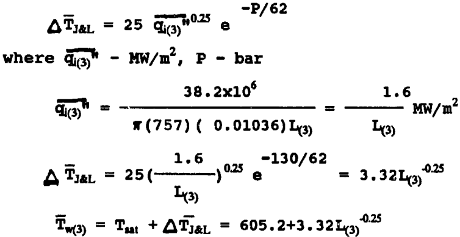
**63**

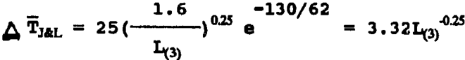
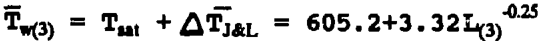

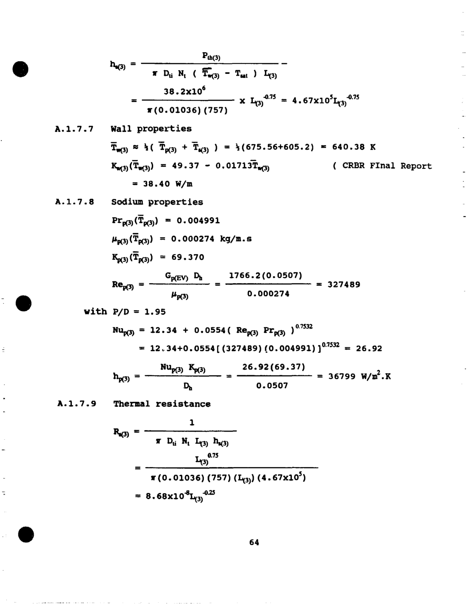

**th(3)**
**«i(3) =** _**—**_
## *** D u N, ( T^ 3 ) - T M, ) I^ 3 )**

**3 8 . 2 x 1 0 ***
## **X I^- 0" 7 5 = 4.67xl0 5 I X 3 ) -°- 7 S**

**rr(0.01036) (757)**

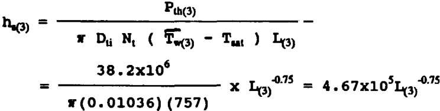
**7 . 7** **N a i l** **p r o p e r t i e s**

## **T.<3) » \{ T^) + T K 3 ) ) = ^ ( 6 7 5 . 5 6 + 6 0 5 . 2 ) = 6 4 0 . 3 8 K**

**K«(3)(Tw(3)) = 4 9 . 3 7 - 0.01713"T W (3 )** **( CRBR Final Report**

**= 3 8 . 4 0 W/m**

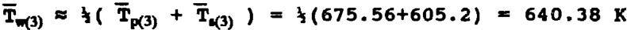

**7 . 8** **Sodium p r o p e r t i e s**

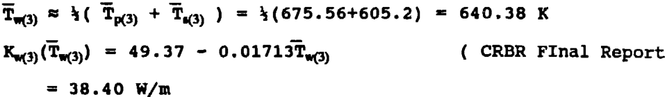

**P r ^ t T ^ j )** **=** **0 . 0 0 4 9 9 1**

**Mp(3)(Tp(3)) = 0 . 0 0 0 2 7 4** **k g / m . s**

**KpOjtTpp)) = 6 9 . 3 7 0**

**GP(EV) °h** **1 7 6 6 . 2 ( 0 . 0 5 0 7 )**
**R e, ^ =** **=** **= 327489**

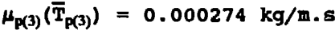

**Jip(3)** **0.000274**

**w i t h P/D = 1 . 9 5**

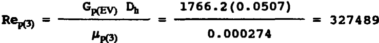
**Nu,^ = 1 2 . 3 4 + 0.0554 ( R** **e** **^ P r, ^** **)** **0** **7** **5** **3** **2**

**= 1 2 . 3 4 + 0 . 0 5 5 4 [ (327489) ( 0 . 0 0 4 9 9 1 ) ]** **0** **7** **5** **3** **2 = 2 6 . 9 2**

## **N U P ( 3 ) ^ 3 ) 26. . 9 2 ( 6 9 . 3 7 )**

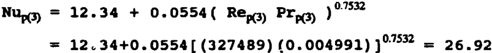

**= 36799 W/m2.K**
## **D,,D„ 0.0507 0.0507**

**hpp) -**
## **D,,D„ 0.0507 0.0507**

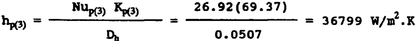

**. 7 . 9**

**Thermal** **resistance**

**«i(3) ~**
**Tf D** **u N** **t I ^** **3** **) 11^3)**

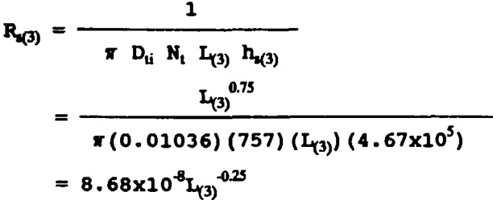
## **T 0.75**

**r ( 0 . 0 1 0 3 6 ) (757) (1^)) ( 4 . 6 7 x 1 0** **s )**

**= 8 .esxio"** **8^)"** **0-** **2 5**

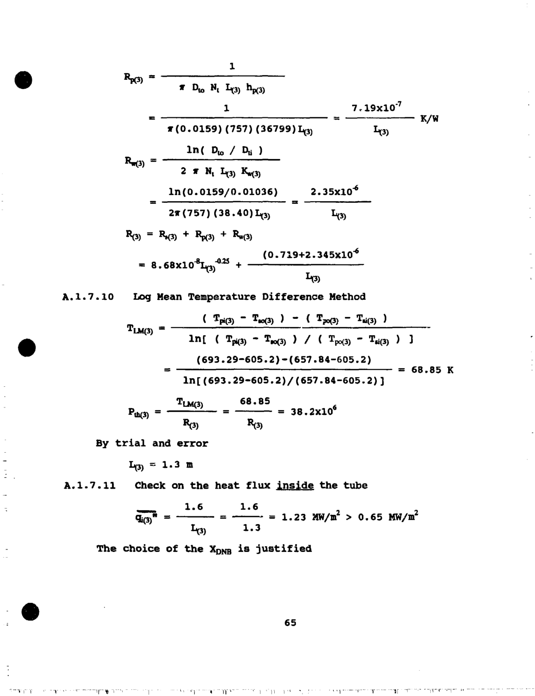

Rp(3) 
      - Du, N t 1^3) **hp(3)**

1 7 r 19xlO' 7

**1 ( 0 . 0 1 5 9 ) (757) (36799)1^3)** Lpj

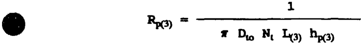

**l n ( D t o /** **Du )**

## **K/W**

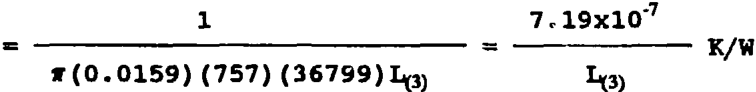

**Rw(3)** ~

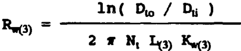
**`2 » N, L(3) K^3j`**

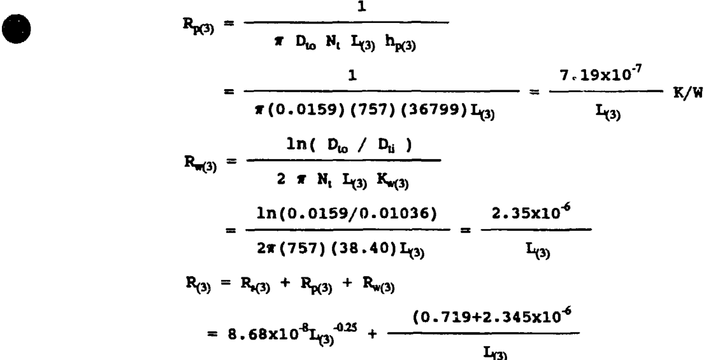

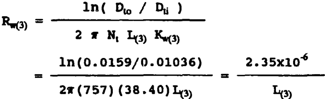
**`ln(0.0159/0.01036)`** **`2.35x10*`**

## **`2sr(757) (38.40)1^3, L ^`**

**`R(3) = Bjp) +`** _***v(3)**_ **`+ ^(3)`**

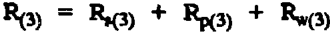

## **`= 8. esxio" 8!^)" 0 3 5 + (0.719+2.345X10"6`**

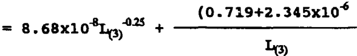
**`8!^)"`**

**`0 3 5 +`**

## **`A. 1.7.10 Log Mean Temperature Difference Method`**

**`( Tpj(3) - T,o(3) ) - ( Tj,„p) - T^ 3) )`**
## **`T LM(3)`**

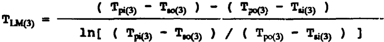
**`ln[ ( Tpp) - T^j) ) / ( Tp^j - T t i ( 3 ) ) ]`**

**`(693.29-605.2)-(657.84-605.2)`**

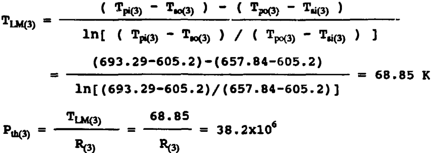
**`—`** **`- = 68, .85`**
**`ln[(693. 29-605. 2)/(657.84- 605. 2)]`**

**`Ptb<3)`** **`-`**

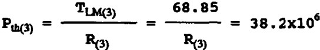

## **`T 68.85`** **`LM(3)`** **`= 38.2X10*`**

**`*<3)`**

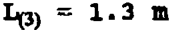
**`By trial and error`**

## **`B(3)`**

**`Lp) = 1. 3 m`**

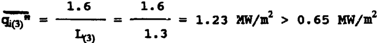

## **`A.,1. .7.11 Check • on the heat flux inside the tube`**

**`1.6`** **`1.6`**
**`*(3? -`** **`=1.23 MW/m2`** **`> 0. .65 MW/m`** **`2`**

**`L(3j`** **`1.3`**

## **`The choice of the X D N B is justified`**

**`65`**

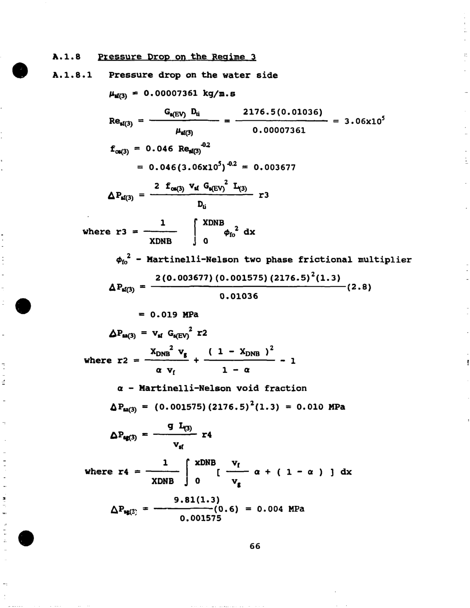
## **`A.1.8 Pressure Drop on the Regime 3`** **`A. 1.8.1 Pressure drop on the water side`**

**`0tf(3) * 0.00007361 kg/m.s`**

**GKEV) °u** **2 1 7 6 . 5 ( 0 . 0 1 0 3 6 )**
**Reifra)** **=** **=** **= 3 . 0 6 x 1 0** **s**

## **H^ 0.00007361** **f^ 3 ) = 0 . 0 4 6 R e ^**

**= 0 . 0 4 6 ( 3 . 0 6 x 1 0** **s ) "** **0** **2 = 0.003677**

**2**
**2** **f <»(3) v** **tf** **Gi(EV) L(3)**
**APrf(3) =** **r3**

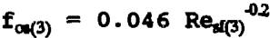

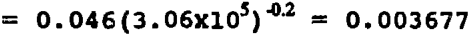
**where r3 =**
## **XDNB**

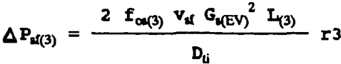

**r XDNB**

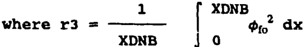
**0**

**0** **[** **o** **- M a r t i n e l l i - N e l s o n two phase f r i c t i o n a l** **m u l t i p l i e r**

**2 ( 0 . 0 0 3 6 7 7 ) ( 0 . 0 0 1 5 7 5 ) ( 2 1 7 6 . 5 )** **2 ( 1 . 3)**
## **AP,™ = ( 2 . 8 )**

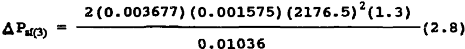
**0 . 0 1 0 3 6**

**= 0 . 0 1 9 MPa**

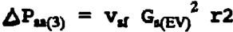
## **A Pu(3) = v i f Go(EV) r 2** **XDNB v j ( 1 - X D N B )**

**where r2 =** **+** **1**

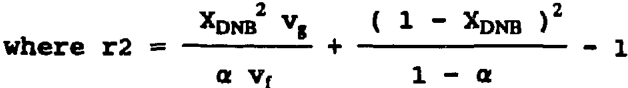

**a v** **f** **1 - a**

**a - M a r t i n e l l i - N e l s o n v o i d** **f r a c t i o n**

**APB(3) = ( 0 . 0 0 1 5 7 5 ) ( 2 1 7 6 . 5 )** **2 ( 1 . 3 ) = 0 . 0 1 0 MPa**
**g 1^3)**

## **XDNB v f** **where r4 = I [ a + ( 1 - a ) ] dx** **XDNB M )NB J O j v g**

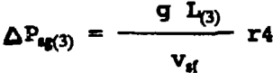
**9 . 8 1 ( 1 . 3 )**
## **A P,, ^ = ( 0 . 6 ) = 0.004 MPa**

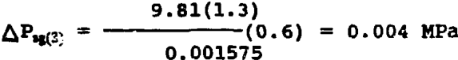

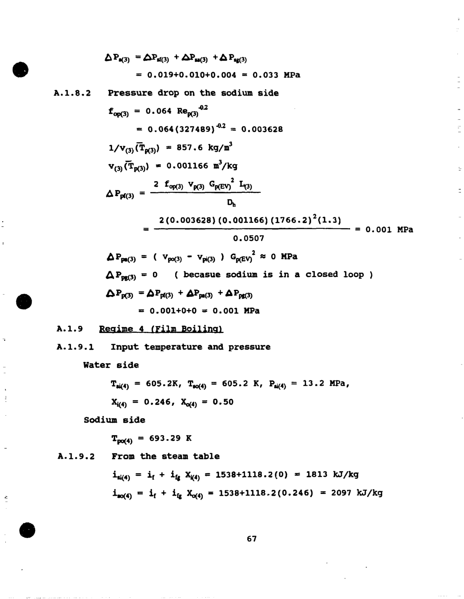

**&P.<3) =APtf(3) + AP.,(3) +AP^** **(** **3** **)**

**= 0 . 0 1 9 + 0 . 0 1 0 + 0 . 0 0 4 = 0.033 MPa**

## **A. 1 . 8 . 2 P r e s s u r e drop on t h e sodium s i d e**

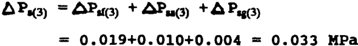
### **fop(3) - 0.064 Repp)"0"2**

**= 0.064(327489)"°^ = 0.003628**

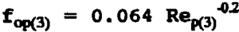

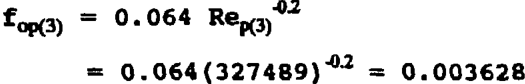
**l/v ( 3)(Tp(3)) = 8 5 7 . 6 kg/m** **3**

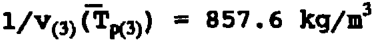
**V(3)(Tp(3)) - 0.001166 m** **3** **/kg**

## **2 f otK3) VP(3) GP(EV) %**

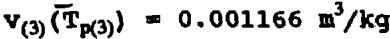
**APpf (3)**
**Dh**

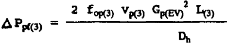
**2 ( 0 . 0 0 3 6 2 8 ) ( 0 . 0 0 1 1 6 6 ) ( 1 7 6 6 . 2 )0 1 1 6 6 ) ( 1 7 6 6 . 2 )** **22 ( 1 . 3 ) ( 1 . 3 )**
**= 0 . 0 0 1 MPa**

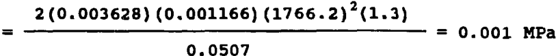

**APp.(3) " (** **vi»(3) " Vpjp) ) Gp^v)2 * 0 MPa**

**APpg(3) = 0** **( b e c a s u e sodium i s i n a c l o s e d l o o p )**

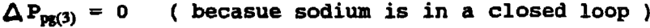

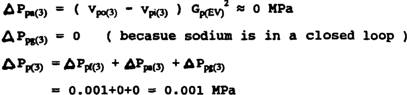
**&PpP) =APpf(3) +APp.(3) +APpg(3)**

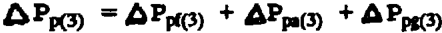

**= 0.001+0+0 = 0 . 0 0 1 MPa**

## **A . 1 . 9 Regime 4 fFilm B o i l i n g )**

**A . 1 . 9 . 1** **I n p u t temperature and p r e s s u r e**

**H a t e r** **s i d e**

## **T«i(4) = 605.2K, T.^4) = 6 0 5 . 2 K, P^ 4 ) = 1 3 . 2 MPa,** **X^j = 0 . 2 4 6, X„(4) = 0 . 5 0**

**Sodium** **s i d e**

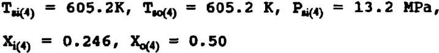
## **Tp°(«) = 6 9 3 - 2 9 K** **A. 1 . 9 . 2 From t h e steam t a b l e**

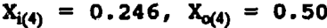

**3^4, = i** **f + i** **f** **t Xj(4) = 1538+1118.2(0)** **= 1813 kJ/kg**

**1,0(4) = i** **f + ifg X** **^ = 1 5 3 8 + 1 1 1 8 . 2 ( 0 . 2 4 6 )** **= 2097 kJ/kg**

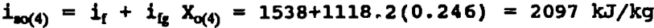

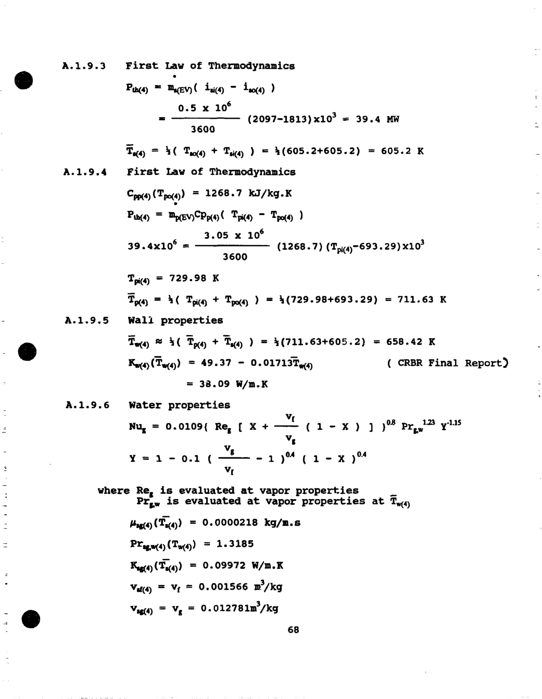
## **A. 1 . 9 . 3 F i r s t Law of Thermodynamics**

**P|h<4) "** _**™i(EV)(**_ **i«i(4) ~ i»o(4) )**

**0 . 5 x 10***
**(2097-1813)XlO** **3 = 3 9 . 4 MW**
**3600**

## **T^4) = *( T ^ ) + T^j ) = ^ ( 6 0 5 . 2 + 6 0 5 . 2 ) = 605.2 K**

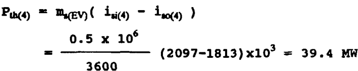

**A . 1 . 9 . 4** **F i r s t Law of** **Thermodynamics**

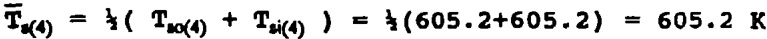

**Cp** **P(4)(Tp** **0(4** **)) = 1 2 6 8 . 7** **kJ/kg.K**

**P|h{4) = "pfl^CPpwt T ^ j - T ^ j )**

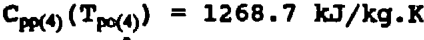
## **3 . 0 5 X 10***

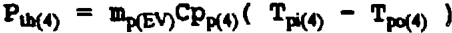
**3 9 . 4 x 1 0 * «** **(1268.7) (Tpj^-693 . 29)X10** **3**

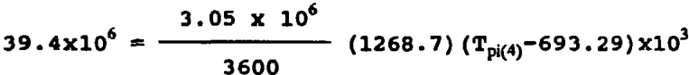

**Tpi(<)** **=** **7 2 9 . 9 8 K**

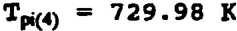
## **Tp(4) = *( Tpj^ + T ^ ) = ^ ( 7 2 9 . 9 8 + 6 9 3 . 2 9 ) = 711.63 K** **A. 1 . 9 . 5 H a l l p r o p e r t i e s** **T^ 4) * %( Tp^) + TK4) ) = * ( 7 1 1 . 6 3 + 6 0 5 . 2 ) = 658.42 K**

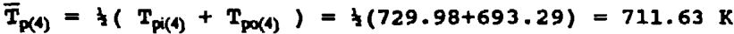

**Ki<4)CTw(4)) = 4 9 . 3 7 - 0.01713'T»** **(4)** **( CRBR F i n a l** **R e p o r t )**

**= 3 8 . 0 9 W/m.K**

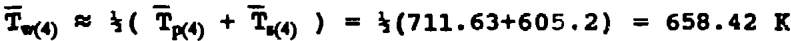

**A . 1 . 9 . 6** **Water** **p r o p e r t i e s**

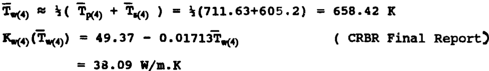
## **Nu, = 0 . 0 1 0 9 { Re g [ X + ( 1 - X ) ] } M Pr^ 1 " 2 1 Y' 1 1 5** **Y - 1 - 0 . 1 ( —- 1 ) 0 4 ( 1 - X ) 0 4**

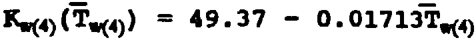

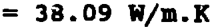
**where R e** **( i s e v a l u a t e d a t vapor p r o p e r t i e s** **_**

**Pr** **f** **c** **W i s e v a l u a t e d a t vapor p r o p e r t i e s a t T, ^**

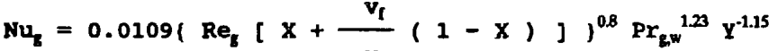

**^t** **l((4)(T^4** **)) = 0.0000218** **kg/m.s**

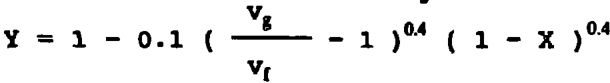
**P r ^ ^ j t T ^ ) )** **» 1 . 3 1 8 5**

**K H (4 )(T^4 )) = 0 . 0 9 9 7 2 W/m.K**

**vif(4) = v** **f = 0.001566** **m** **3** **/kg**

## **v H ( 4 ) = vg = 0.012781m 3 /kg**

**68**

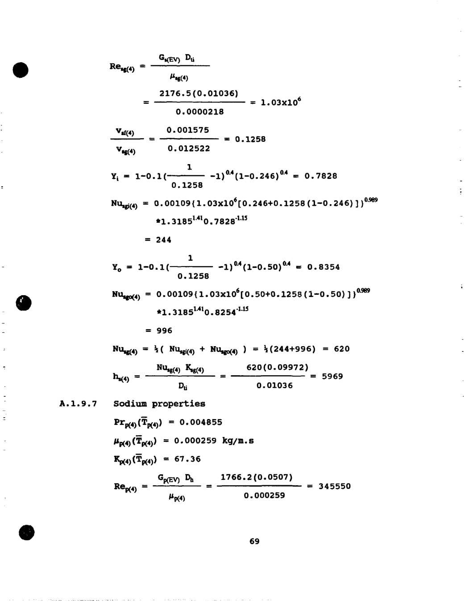
## **R e** **H ( « ) ~**

## **G»(EV) D u** **N(4)**

**2 1 7 6 . 5 ( 0 . 0 1 0 3 6 )**

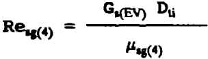
**= 1.03x10***
**0 . 0 0 0 0 2 1 8**

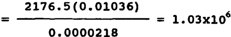
**V,f** **(4)** **0 . 0 0 1 5 7 5**
**= 0.1258**
## **V H ( 4 ) 0 . 0 1 2 5 2 2**

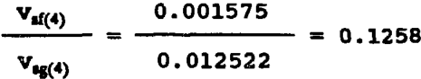
**Yi = 1 - 0 . 1 (** **l )** **0** **4 ( l - 0 . 2 4 6 )** **0** **4 =** **0 . 7 8 2 8**

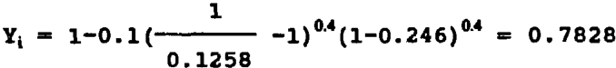

**N u»»(4)** **=** **0 . 0 0 1 0 9 ( 1 . 0 3 x l 0 * [ 0 . 2 4 6 + 0 . 1 2 5 8 ( 1 - 0 . 2 4 6 ) ] )**

*** 1 . 3 1 8 5** **,** **4** **1 0 . 7 8 2 8 "** **1** **1** **5**

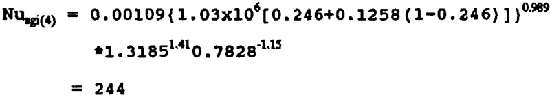
**= 244**

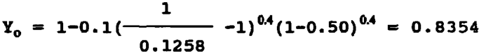

**Y 0 = 1 - 0 . 1 (** **1** **l )** **M ( l - 0 . 5 0 )** **0** **4 -** **0 . 8 3 5 4**

**0 . 1 2 5 8**

**N uHo(4) = 0 . 0 0 1 0 9 ( 1 . 0 3 x l 0** **6 [ 0 . 5 0 + 0 . 1 2 5 8 ( 1 - 0 . 5 0 ) ] )** **0** **5** **8** **9**
## *** 1 . 3 1 8 5 1 - 4 1 0 . 8 2 5 4 " U S**

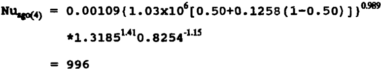

**= 996**

## **N u «gm " %< Nu*P(4) + Nu»B°(4) ) - * (244+996) = 620**

**Nu»g(4) ^§(4)** **6 2 0 ( 0 . 0 9 9 7 2 )**
**l V** **4** **) =** **=** **= 5969**
## **D u 0.01036**

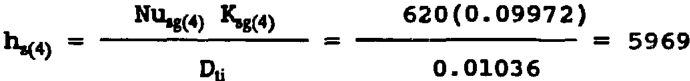
**Sodium p r o p e r t i e s**

**P rK4)(Tp(4)) = 0 . 0 0 4 8 5 5**

****p(4)^p(4)' ~ 0 . 0 0 0 2 5 9** **k g / m . s**

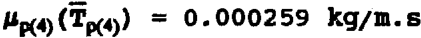
**Kp(4)(Tp(4)) = 6 7 . 3 6**

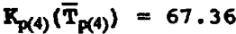
**Gp(EV) Dh** **1 7 6 6 . 2 ( 0 . 0 5 0 7 )**
## **R e P(4) = = = 3 4 5 5 5 0**

**Mp(4)** **0.000259**

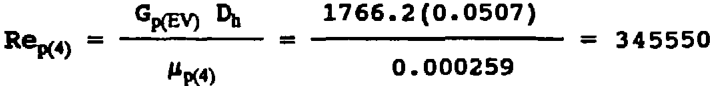

with P/D = 1.95

$$Nu_{W(t)} = 12.34 + 0.0554(\, Re_{W(t)}\, Pr_{W(t)}\,)^{0.332}$$

$$= 12.34 + 0.0554((34550)(0.004855))^{0.332} = 27.21$$

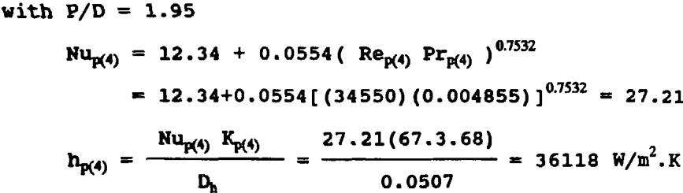
$$h_{W(t)} = \frac{Nu_{W(t)}\, K_{W(t)}}{D_t} = \frac{27.21(47.3.68)}{0.0507} = 36118 \ \text{W/m}^2\text{·K}$$

## A.1.9.8 Thermal resistance

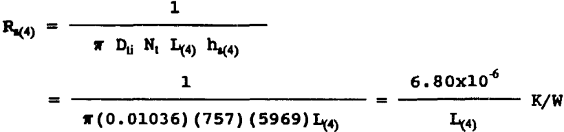
$$R_{t(t)} = \frac{1}{\pi\, D_t\, N_t\, l_{C(t)}\, h_{W(t)}}$$

$$= \frac{1}{\pi(0.01036)(757)(5969)l_{C(t)}} = \frac{6.80 \times 10^{-6}}{l_{C(t)}} \ \text{K/W}$$

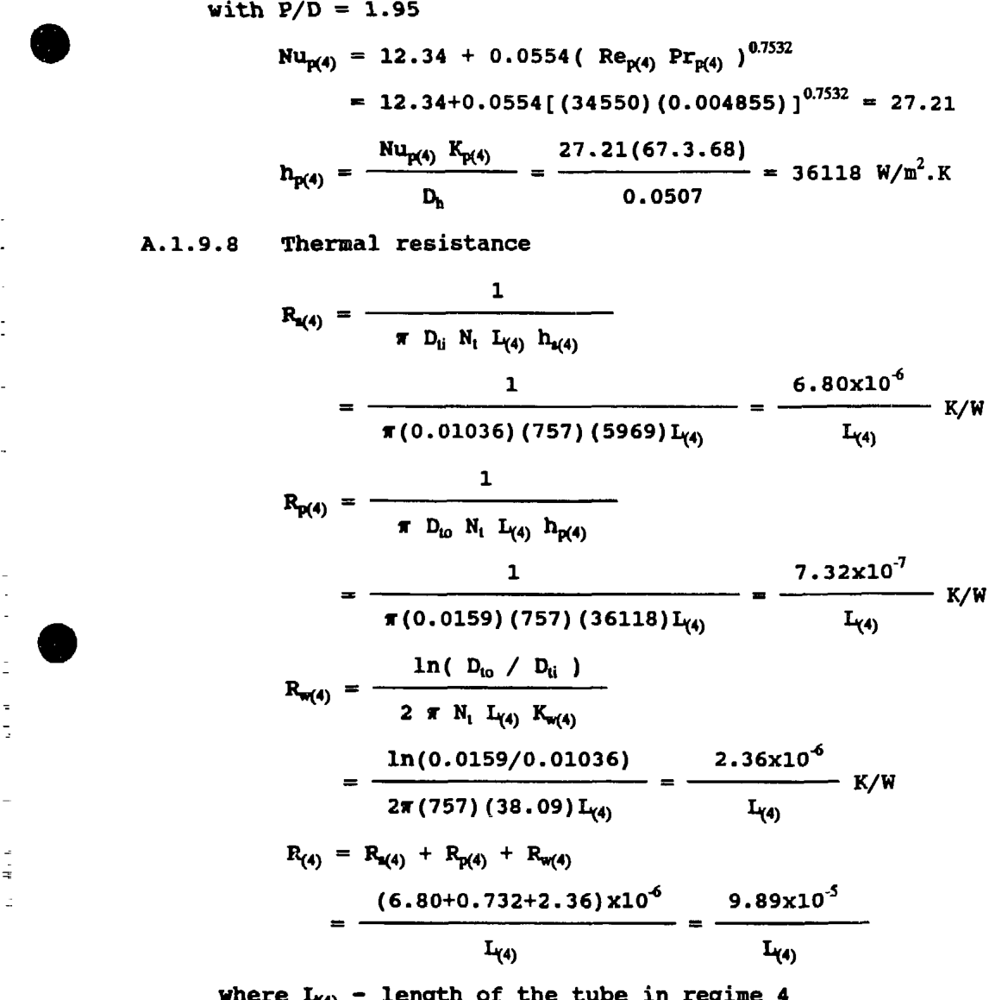
$$R_{p(t)} = \frac{1}{\pi\, D_m\, N_t\, l_{C(t)}\, h_{W(t)}}$$

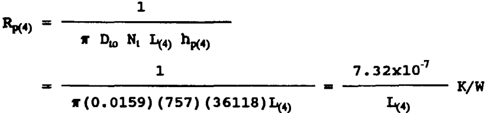
$$= \frac{1}{\pi(0.0159)(757)(36118)l_{C(t)}} = \frac{7.32 \times 10^{-7}}{l_{C(t)}} \ \text{K/W}$$

$$R_{m(t)} = \frac{\ln(\, D_m / D_h\,)}{2\,\pi\, N_t\, l_{C(t)}\, K_{W(t)}}$$

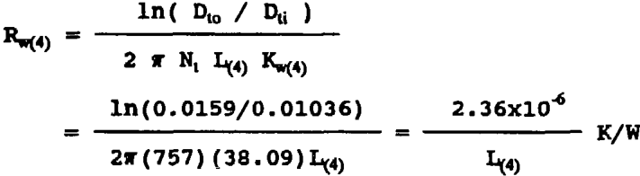
$$= \frac{\ln(0.0159/0.01036)}{2\pi(757)(38.09)l_{C(t)}} = \frac{2.36 \times 10^{-6}}{l_{C(t)}} \ \text{K/W}$$

$$R_{C(t)} = R_{t(t)} + R_{p(t)} + R_{m(t)}$$

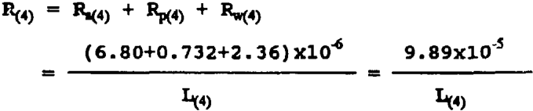
$$= \frac{(6.80 + 0.732 + 2.36) \times 10^{-6}}{l_{C(t)}} = \frac{9.89 \times 10^{-6}}{l_{C(t)}}$$

where $l_{C(t)}$ = length of the tube in regime 4

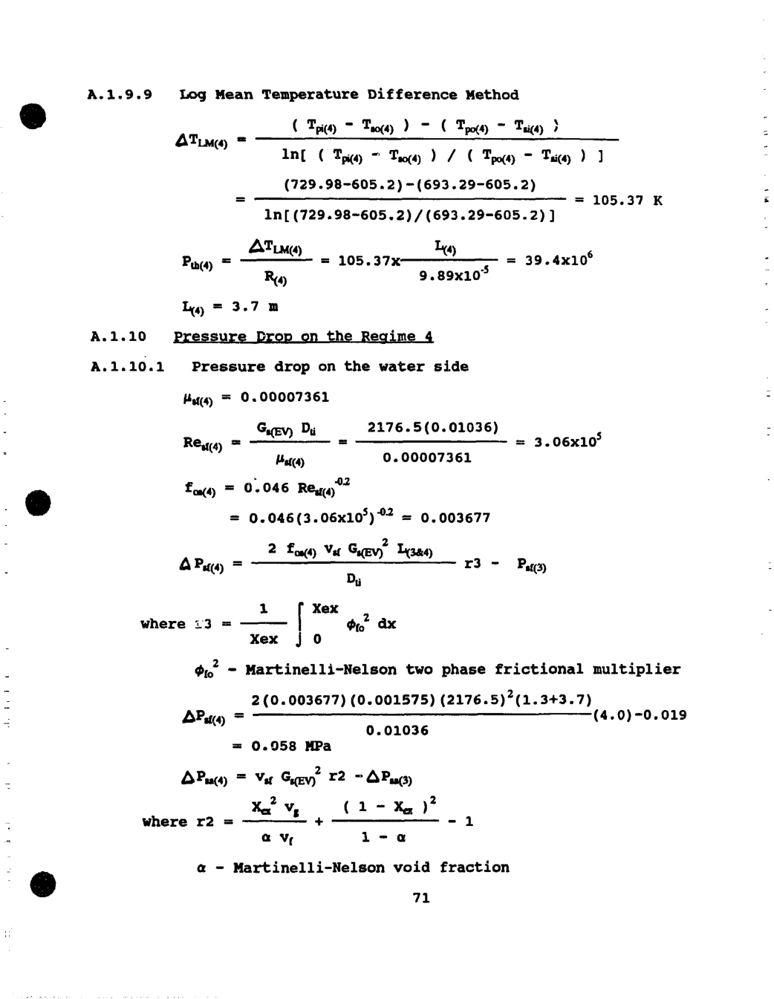
## **`A.1.9.9 Log Mean Temperature Difference Method`**

**`( TP'(4) ~ T»°(4) ' ~ ( Tp°(4) ~ T«(`** **`4) '`**
## **`ATLM (4)`**
**`ln[ ( T ^ ) - T ^ j ) / ( T p ^ - T^ { 4 ) ) ]`**

**`(729.98-605.2)-(693.29-605.2)`**
## **`= 105.37 K`**

**`ln[(729.98-605.2)/(693.29-605.2)]`**

## **A TLM(4) *\4),** **`Pm(4) = R ^ " 105.37X 9.89X10'— =5  39.4x10*`**

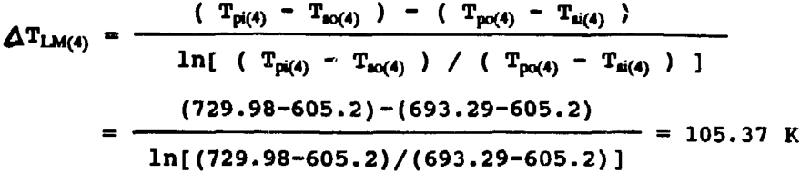
**`L/4)= 3.7 n`**

## **`A.1.10 pressure Drop on the Regime 4`** **`A.1.10.1 Pressure drop on the water side`**

**`M»f(4) = 0.00007361`**

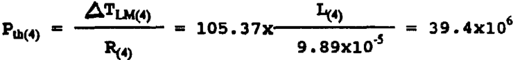

**`GyEV) D`** **`u`** **`2176.5(0.01036)`**

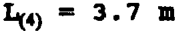
**`Rert(4) =`** _**~~**_ **`=`** **`= 3.06x10`** **`s`**

**`H r f ( 4 )`** **`0.00007361`**

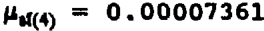
`f«x4) = o'-o46 "` `W` `2`
## **`= 0.046(3.06X10 5)"* 2 = 0.003677`**

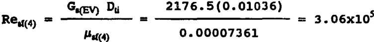
`2`

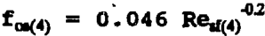
**`2`** **`f`** **`m(4) vrf <»i(EV) L(3A4)`**
## **`A P if(4) = r 3 " Pif(3)`**

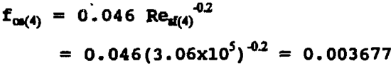

**`Du`**

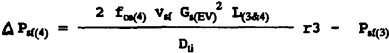
**`where 3.3 =`**

**`Xex`**
**`0`** **`f`** **`o dx`**
**`Xex`**

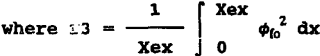

**`0`** **`(`** **`o`**

**`2 - Martinelli-Nelson two phase frictional multiplier`**

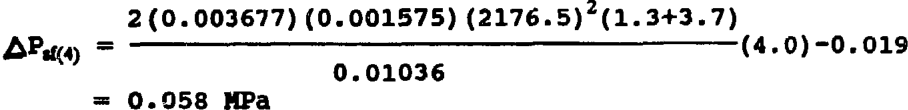

**2(0.003677)(0.001575)(2176.5)** **2** **(1.3+3.7)**
_**&Fm)**_ **=** **0.01036** **(4.0)-0.019**
**= 0.058 MPa**

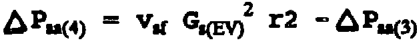
## **£P»(4) = v„ G^EV)2 r2 - ^ P ^ )** **where r2 = X« 2 v f + ( 1 - X^ ) 2 1**

_**a vt**_ **1 - o**

_**a**_ **- Martinelli-Nelson void fraction**

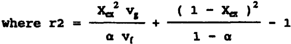

$$\Delta P_{m(4)} = (0.001575)(2176.5)^2(2.4) - 0.010 = 0.008 \text{ MPa}$$

$$\Delta P_{s(4)} = \frac{g \; I_{r(s4)}}{v_{sf}} \; r4 - \Delta P_{s(3)}$$

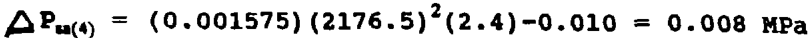
where $r4 = \frac{1}{Xex} \int_0^1 \left[ \frac{v_f}{v_g} - \alpha + (1 - \alpha) \right] dx$

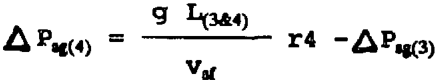
$$= \frac{9.81(1.3+3.7)}{0.001575} (0.5) - 0.004 = 0.007 \text{ MPa}$$

$$\Delta P_{s(4)} = \Delta P_{d(4)} + \Delta P_{m(4)} + \Delta P_{s(4)}$$

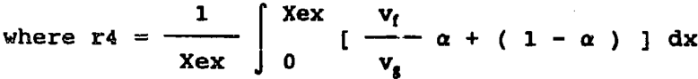
$$= 0.058 + 0.008 + 0.007 = 0.074 \text{ MPa}$$

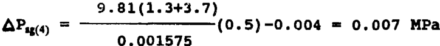
$$\Delta P_{K(V)} = \Delta P_{K(1\&2)} + \Delta P_{K(3)} + \Delta P_{K(4)}$$

$$= 0.037 + 0.033 + 0.074 = 0.144 \text{ MPa}$$

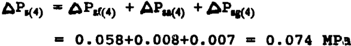
$$\Delta P_{CRBR(EV)} = 0.8 \text{ MPa}$$

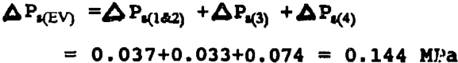
$$\Delta P_{minor(EV)} = \Delta P_{CRBR(EV)} - \Delta P_{K(V)}$$

$$= 0.8 - 0.144 = 0.656 \text{ MPa}$$

$$v_{sm} = \tfrac{1}{2}(v_{s(1)} + v_{s(5)}) = \tfrac{1}{2}(0.0013337 + 0.0070485)$$

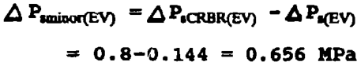
$$= 0.004191 \text{ m}^3/\text{kg}$$

$$\Delta P_{minor(EV)} = \tfrac{1}{4} G_{s(EV)}^2 \; v_{sm} \; K_{minor(EV)}$$

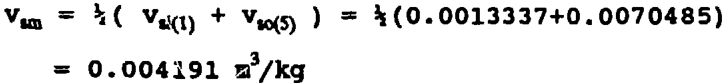
$$6.56 \times 10^5 = \tfrac{1}{4}(2176.5)^2(0.004191) K_{minor(EV)}$$

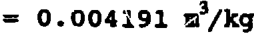
$$K_{minor(EV)} = 66.1$$

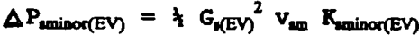
### A.1.10.2 Pressure drop on the sodium side

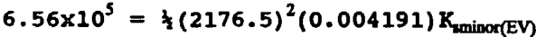
$$f_{s(4)} = 0.046 \; Re_{s(4)}^{-0.42}$$

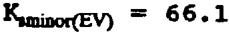
$$= 0.046(345550)^{-0.42} = 0.003590$$

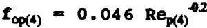
$$1/v_{s(4)}(\overline{T}_{s(4)}) = 848.9 \text{ kg/m}^3$$

$$v_{s(4)}\overline{T}_{s(4)} = 0.001178 \text{ m}^3/\text{kg}$$
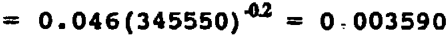
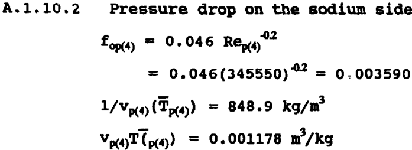
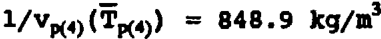
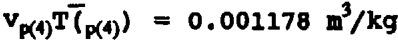

$$\Delta P_{p(4)} = \frac{2 \, f_{op(4)} \, v_{p(4)} \, G_{p(EV)}^2 \, L_{(4)}}{D_s}$$

$$= \frac{2(0.003590)(0.001178)(1766.2)^2(3.7)}{0.0507} = 0.002 \text{ MPa}$$

$$\Delta P_{ps(4)} = (v_{ps(4)} - v_{p(4)}) \, G_{p(EV)}^2 = 0 \text{ MPa}$$

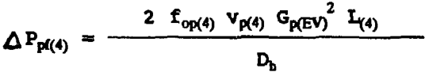
$$\Delta P_{p(4)} = 0 \quad \text{(because sodium is in a closed loop)}$$

$$\Delta P_{p(1)} = \Delta P_{p(4)} + \Delta P_{p(3)} + \Delta P_{ps(4)}$$

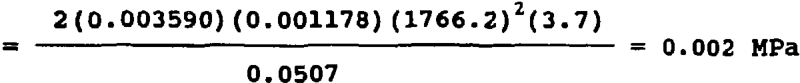
$$= 0.002 + 0 + 0 = 0.002 \text{ MPa}$$

$$\Delta P_{p(EV)} = \Delta P_{p(1\&2)} + \Delta P_{p(3)} + \Delta P_{p(4)}$$

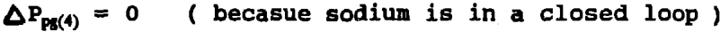
$$= 0.002 + 0.001 + 0.002 = 0.005 \text{ MPa}$$

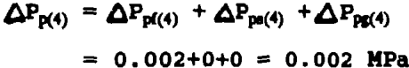
$$\Delta P_{sCRBR(EV)} = 0.108 \text{ MPa}$$

$$\Delta P_{pminor(EV)} = \Delta P_{pCRBR(EV)} - \Delta P_{p(EV)}$$

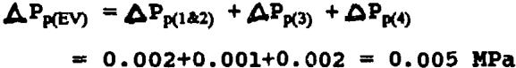
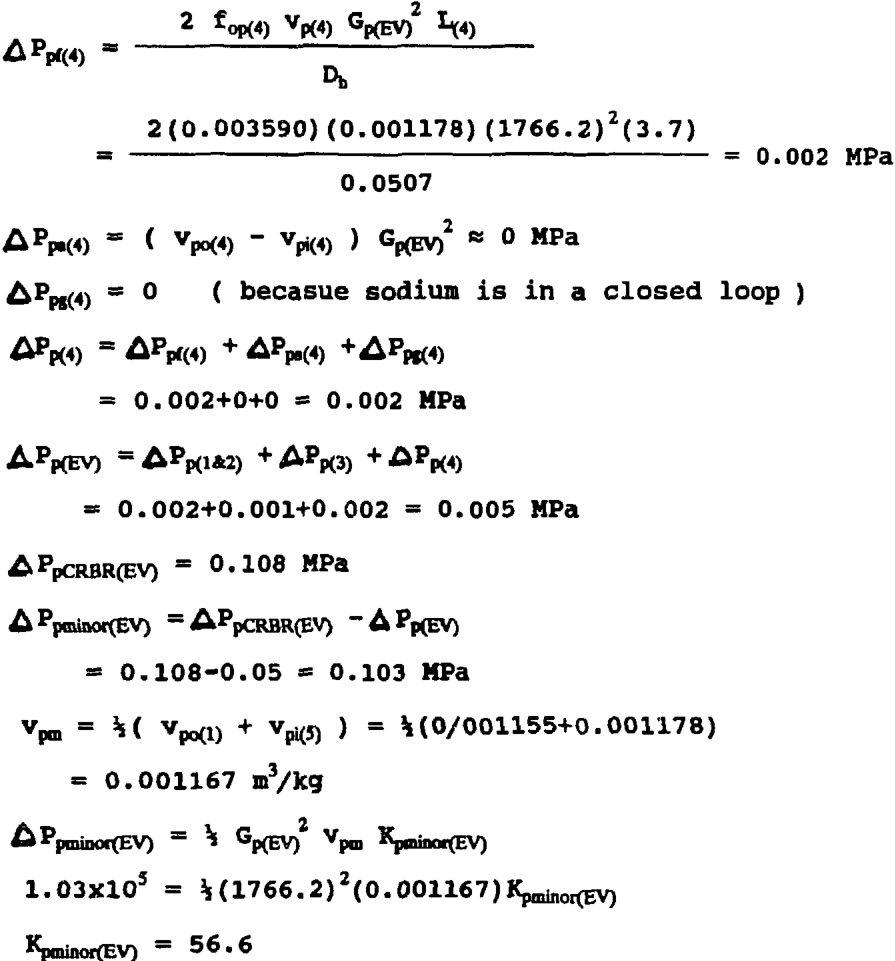
$$= 0.108 - 0.05 = 0.103 \text{ MPa}$$

$$v_{pm} = \frac{1}{4}(v_{p(1)} + v_{p(1)}) = \frac{1}{4}(0/001155 + 0.001178)$$

$$= 0.001167 \text{ m}^3/\text{kg}$$

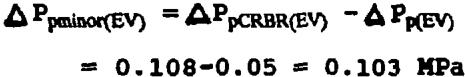
$$\Delta P_{pminor(EV)} = \frac{1}{4} \, G_{p(EV)}^2 \, v_{pm} \, K_{pminor(EV)}$$

$$1.03 \times 10^5 = \frac{1}{4}(1766.2)^2(0.001167) \, K_{pminor(EV)}$$

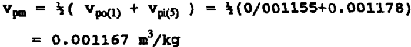
$$K_{pminor(EV)} = 56.6$$

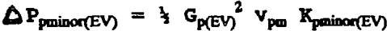
### A.1.11 Safety Factor for Evaporator

$$P_{h(EV)} = P_{h(1\&2)} + P_{h(3)} + P_{h(4)}$$

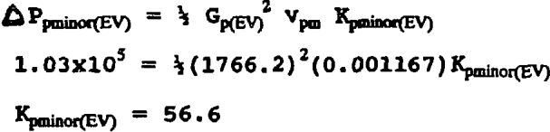
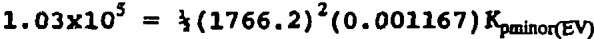
$$= 38.7 + 38.2 + 39.4 = 116.3 \text{ MW}$$

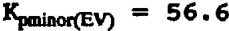
$$A_{tot} = \text{Total heat transfer area} = 529.5 \text{ m}^2 \qquad \text{(TABLE 4-3)}$$

$$L_{(EV)} = L_{(1\&2)} + L_{(2)} + L_{(4)}$$

$$= 3.1 + 1.3 + 3.7 = 8.1 \text{ m}$$

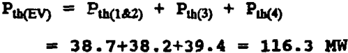
$$A_{(EV)} = \pi \, D_s \, L_{(EV)} \, N_t$$

$$= \pi(0.0159)(8.1)(757) = 306.3 \text{ m}^2$$
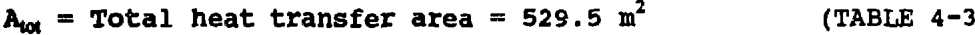
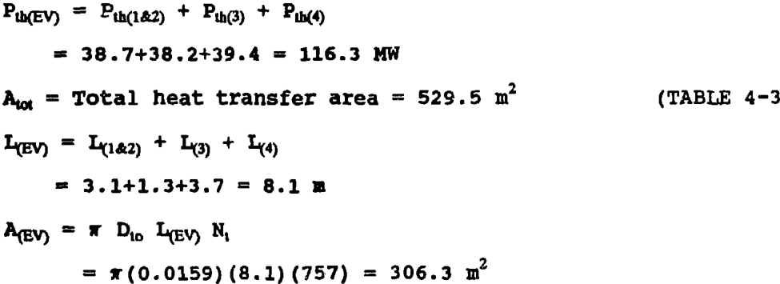
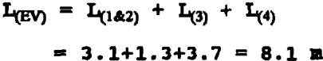
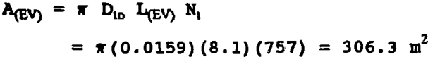

$$SF_{(EV)} = \frac{529.5}{306.3} = 1.73$$

### A.1.12 Summary for the Evaporator

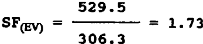
$P_{th(EV)} = 116.3 \text{ MW}$

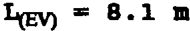

$L_{(EV)} = 8.1 \text{ m}$

$\Delta P_{p(EV)} = 0.005 \text{ MPa}$

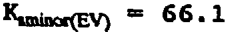

$K_{pminor(EV)} = 56.6$

$\Delta P_{s(EV)} = 0.144 \text{ MPa}$

$K_{sminor(EV)} = 66.1$

$SF_{(EV)} = 1.73$

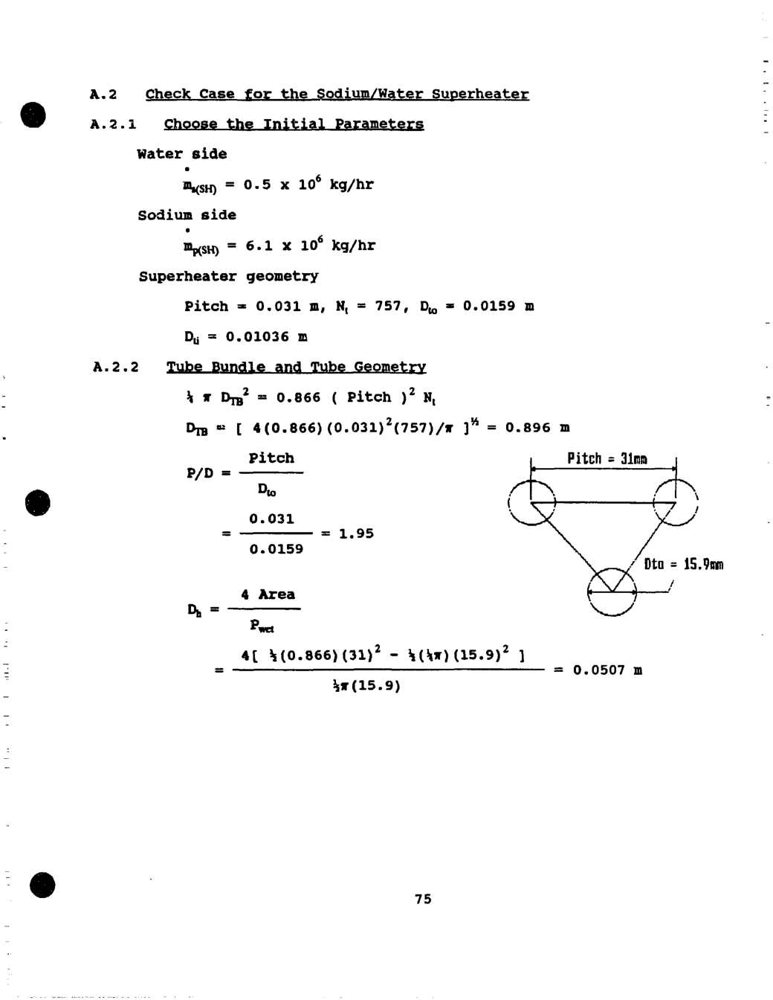

**Check Case for the Sodium/Water Superheater**

**i** **Choose the I n i t i a l Parameters**

**water side**

**"VSH) = 0.5 x 10** **6 kg/hr**

**Sodium side**

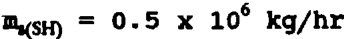

**m^sH) = 6.1 x 10** **6 kg/hr**

**Superheater geometry**

**Pitch - 0.031 m, N, = 757, D,,, - 0.0159 m**

**Dti = 0.01036 m**

**2** **Tube Bundle and Tube Geometry**

## **h * DTB2 - 0.866 ( Pitch ) 2 N,**

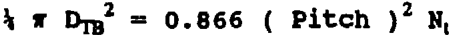

**Dm «* [ 4(0.866) (0.031)** **2** **(757)/ir ]** **w = 0.896 m**

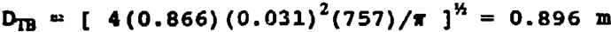

## **P/D =**

**Dh =**

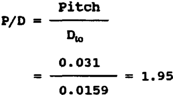
**Pitch**

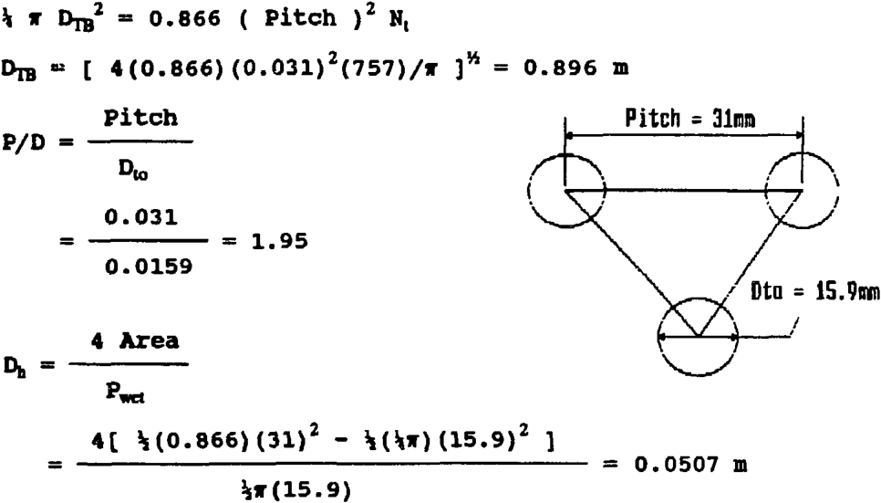

## **4 Area**

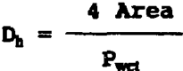

**= 1.95**

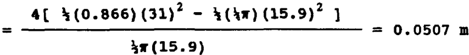
**4[ *(0.866)(31)** **2 - *(fcr)(15.9)** **2 ]**

**^ ( 1 5 . 9 )**

**Pitch = 31mm**

**Dta = 15.9«n**

**= 0.0507 m**

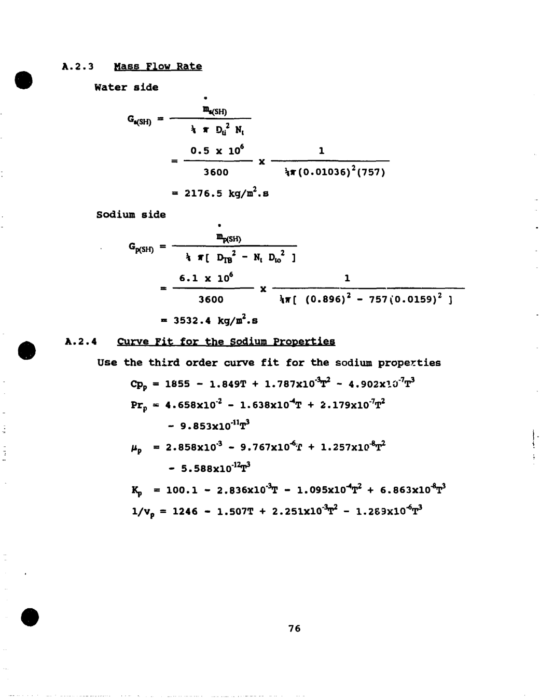
## **`A.2.3 Mass Flow Rate`**

**`Water side`**

## **"••(SH)** **G i(SH) ~** **h w D u**

## **2 N,**

**0.5 x 10** **6** **1**

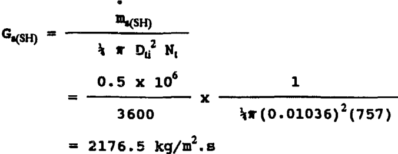

™ **• x** **•**
**3600** **!»ir(0.01036)** **2(757)**

**= 2176.5 kg/m** **2** **.s**

**Sodium side**

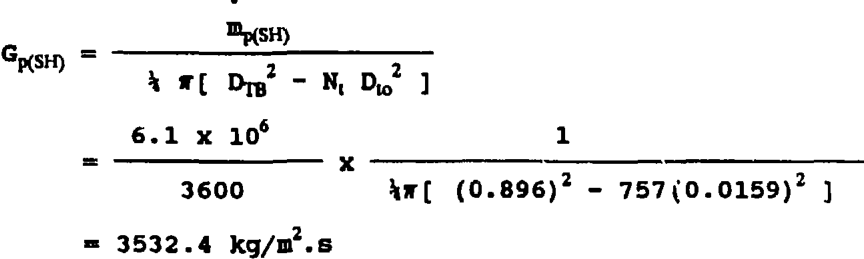
**"p(SH)**
## **G, S** **P( H) ~ •> t**

_**\**_ **»[ i>ni " N, D t o** **2 ]**

**6.1 x 10***

**3600** _**hw[**_ **(0.896)** **2 - 757(0.0159)** **2 ]**

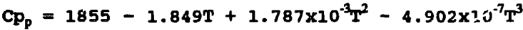
**» 3532.4 kg/m** **2** **.s**

## **A.2.4 Curve F i t for the Sodium Properties**

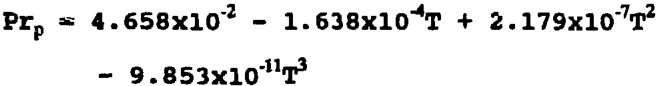

**Use the third order curve f i t for the sodium properties**

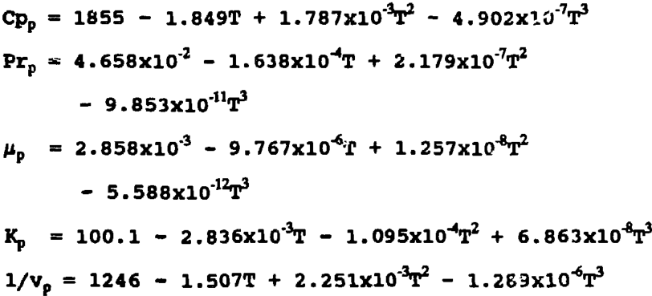

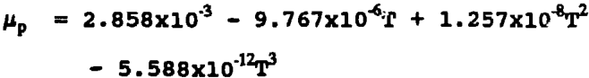
**Cpp = 1855 - 1.849T + 1.787xlO'V - 4.902xlO"V**

## **Pr p « 4.658X10" 2 - l.eSBxlO" 4! + 2.179xl0" 7T 2** **Mp = 2.858X10' 3 - 9.767X10" 6! + 1.257xl0*T 2**

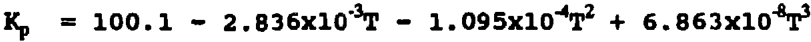

**- S.SBBxlO'** **1 2!** **3**

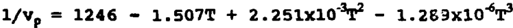

**Kp = IOO.I - 2.836xio** **3T - i.095xio"V +** _**e.se^xio^**_

**1/Vp = 1246 - 1.507T + 2.251Xl0"3T2 - 1.269xl0"V**

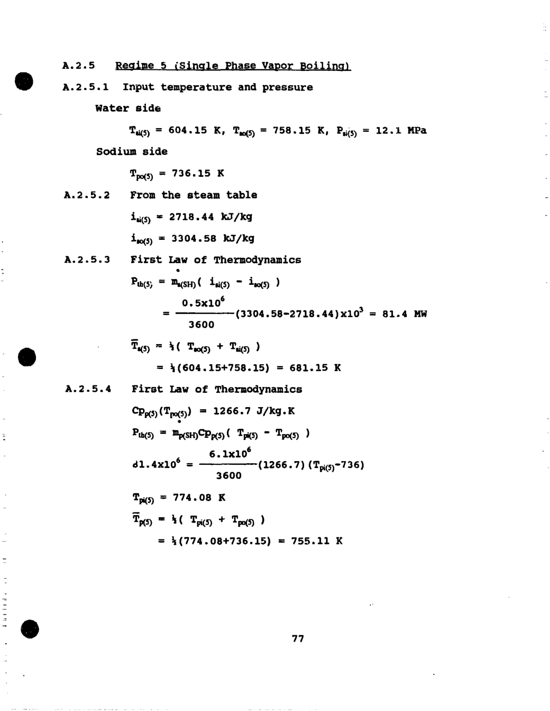
## **`A.2.5 Regime 5 (Single Phase Vapor Boiling)`** **`A.2.5.1 Input temperature and pressure`**

**`Hater side`**

## **`T`**

**`.i(5) = 604.15 K, T ^ q = 758.15 K, P r i { 5 ) = 1 2 . 1 MPa`**

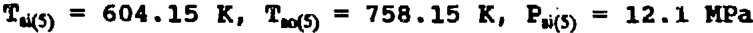
**`Sodium side`**

**`Tpo(5) = 736.15 K`**

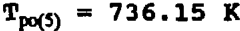
## **`A.2.5.2 From the steam table`**

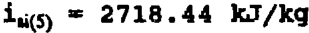
**`i^ ( 5 ) * 2718.44 kJ/kg`**

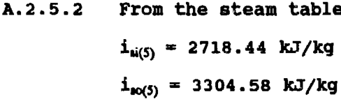

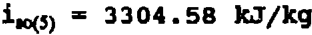
**`i.00) = 3304.58 kJ/kg`**

## **`A.2.5.3 First Law of Thermodynamics`**

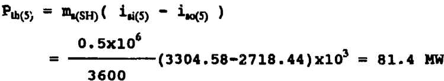
**`Plh(5) ~ °i(SH)( i|i(5) ~ iio(S) )`**

**`0.5x10*`**
## **`= (3304.58-2718.44)xl0 3 = 81.4 MW`**

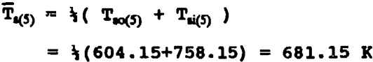
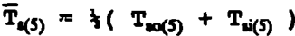
**`3600`**

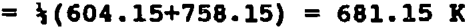
## **T^5) - h( T^JJ + T ^ )** **`= ^(604.15+758.15) = 681.15 K`** **`A.2.5.4 First Law of Thermodynamics`** **`CPP(S)( TPO(5)) = 1266.7 J/kg.K`**

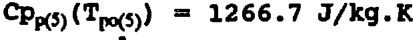
**`Pth(5) = ""pcstoCp^f T^s) - Tp^jj )`**

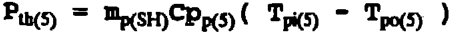
**`6.1x10*`**
**`dl.4xl0* =`** **`-(1266.7) (Tpjfs^Se)`**
**`3600`**
## **`TP«(5) = 7 ™. 0 8 K`**

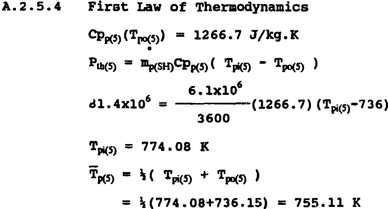
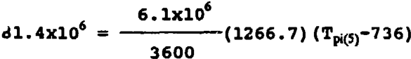

**`* * » - * <`** **`TPi(5) +`** **`Ti»(5) )`**
## **`= ^(774.08+736.15) = 755.11 K`**

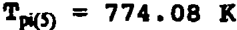

**`77`**

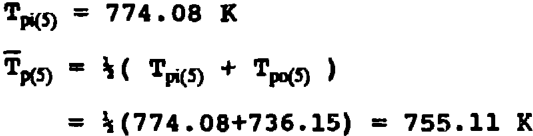

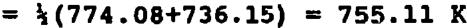

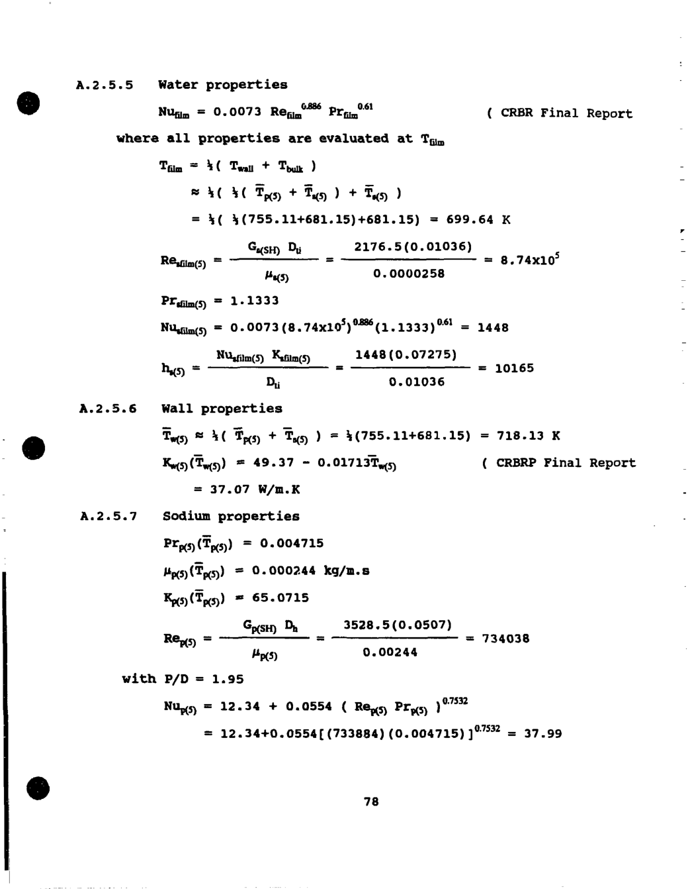

**A . 2 . 5 . 5** **Hater** **p r o p e r t i e s**

## **NUfito = 0 . 0 0 7 3 RefjJ'JK*' P r 0 I m**

**u**
**"** **( CRBR F i n a l** **Report**

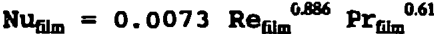

## **w h e r e a l l p r o p e r t i e s a r e e v a l u a t e d a t T m i I 1**

**Tfiim =** _**\(**_ **T„ii + Tb^ )**

## *** M * ( T ^ + T < S ) ) + T K 5 ) )**

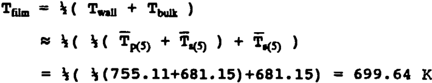

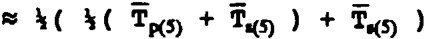
**= *( * ( 7 5 5 . 1 1 + 6 8 1 . 1 5 ) + 6 8 1 . 1 5 )** **= 6 9 9 . 6 4 K**

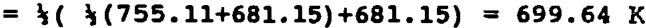

**G«(SH) °ii** **2 1 7 6 . 5 ( 0 . 0 1 0 3 6 )**
## **Re»fflm(5) = = = 8.74X10 5**

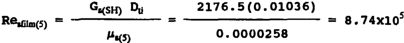
_**li^s)**_ **0 . 0 0 0 0 2 5 8**

**PCiOi^S) = 1 - 1 3 3 3**

**NUriam(5) = 0 . 0 0 7 3 ( 8 . 7 4 x l O** **s )** **a** **8** **8** **6 ( l . 1 3 3 3 )** **0** **6** **1 = 1448**

**»»tfta(S) KtfimfS)** **1 4 4 8 ( 0 . 0 7 2 7 5 )**
## **IVS) = i = = 10165** **D u 0 . 0 1 0 3 6**

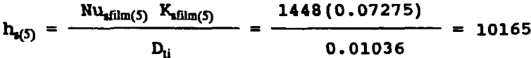

**A . 2 . 5 . 6** **H a l l** **p r o p e r t i e s**

**T«(j) «** _**h( TfQy + TK5)**_ _**) ~**_ **^ ( 7 5 5 . 1 1 + 6 8 1 . 1 5 )** **= 7 1 8 . 1 3 K**

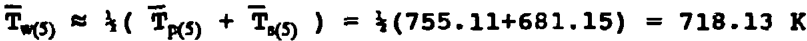

**`K»(5)(Tw(5)) • 49.37 - 0.01713"TW(5)`** **`( CRBRP Final Report`**

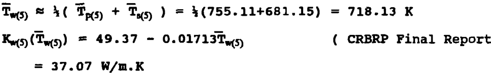

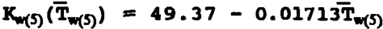
**`= 37.07 H/m.K`**

## **`A.2.5.7 Sodium properties`**

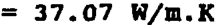

**`Pr^tf^)) = 0.004715`**
_**Hf(S)^p(S))**_ *** 0 . 0 0 0 2 4 4** **k g / m . s**

## **W W " 65.0715**

**GP(SH) Dh** **3 5 2 8 . 5 ( 0 . 0 5 0 7 )**
**R e, ^ =** **=** **= 734038**

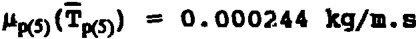

**Mp(5)** **0 . 0 0 2 4 4**

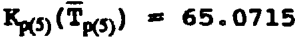

**w i t h P/D =** **1** **.** **9** **5**

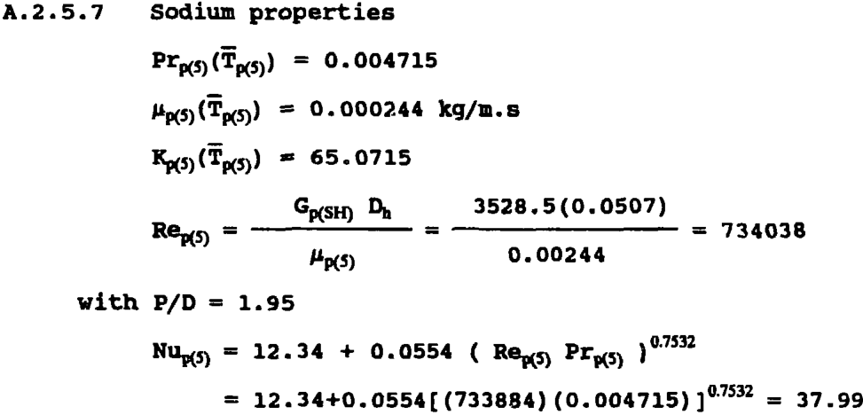

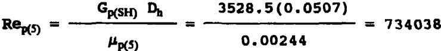
**NUpp) = 1 2 . 3 4 + 0.0554 ( Re^jj P** **r** **^** **)** **0** **7** **5** **3** **2**

**= 1 2 . 3 4 + 0 . 0 5 5 4 [ (733884) ( 0 . 0 0 4 7 1 5 ) ]** **0** **7** **5** **3** **2 = 37.99**

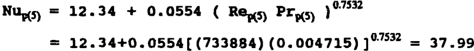

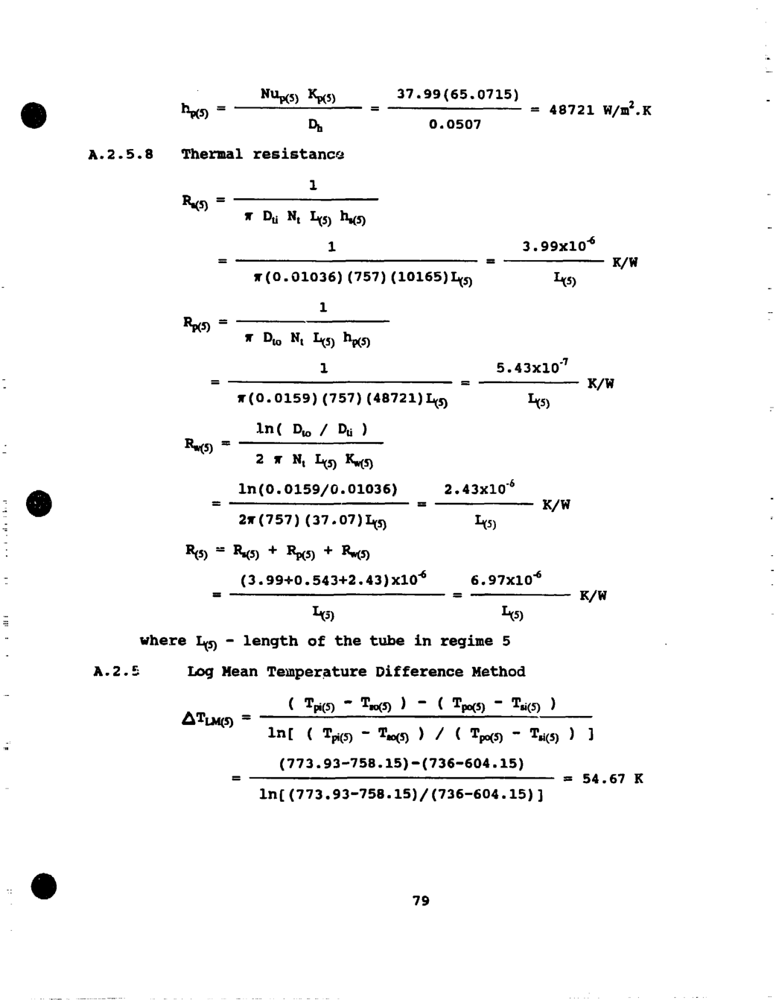

**M uP(5) K*,)** **3 7 . 9 9 ( 6 5 . 0 7 1 5 )**
**h^^ =** **=** **= 4 8 7 2 1 W/mz.K**
**Dh** **0.0507**

**A . 2 . 5 . 8** **Thermal** **r e s i s t a n c e**

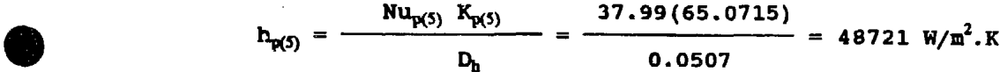

**1**
## **H*5) -**

_**w**_ **D u N** **t I^JJ** **h** **^**

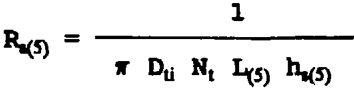
## **1 3.99X10" 6**

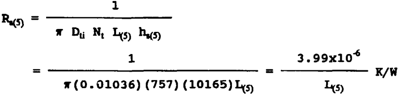

## **K/W** **K/W**

## **^ S ) -** **^ S )**

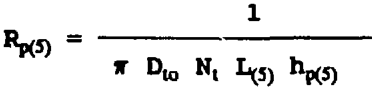

**» ( 0 . 0 1 0 3 6 ) (757) ( 1 0 1 6 5 ) 1 ^** **Lp,**

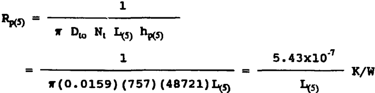

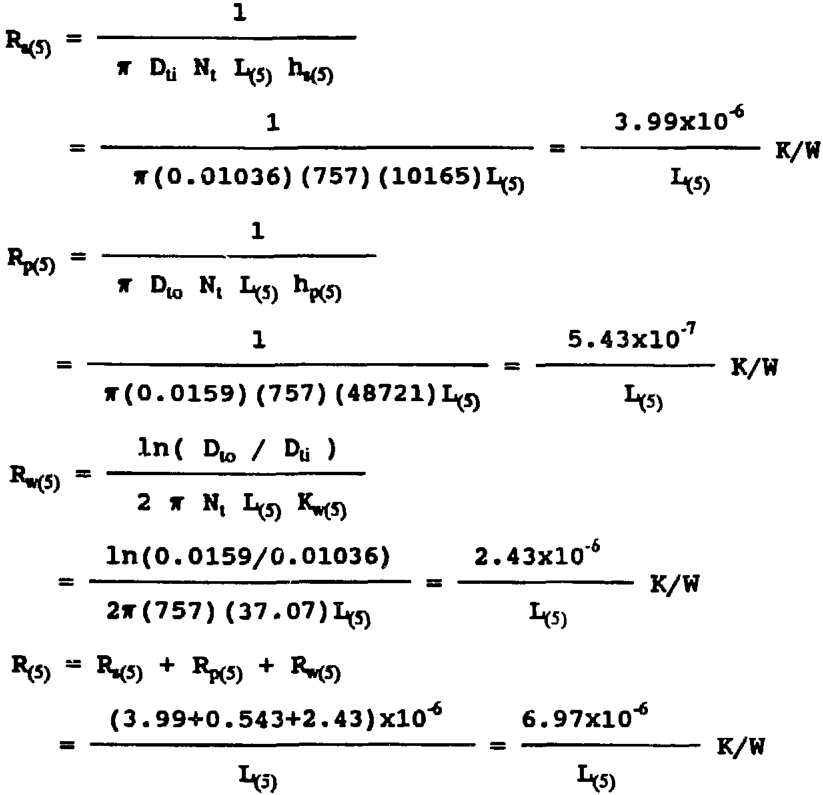
## **w D t o N, I^jj lXp(5j** **1 5.43X10' 7** **i r ( 0 . 0 1 5 9 ) (757) ( 4 8 7 2 1 ) I ^ L( 5 )** **l n ( D t o / D u )** **I n ( 0 . 0 1 5 9 / 0 . 0 1 0 3 6 ) 2.43X10' 4**

## **= = K/W** **2JT(757) ( 3 7 . 0 7 ) 1 ^, L<S)**

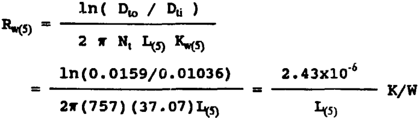
**R(5) = *i<5) + Rp(S) + Rw(S)**

**( 3 . 9 9 + 0 . 5 4 3 + 2 . 4 3 ) XlO"6** **6.97x10"***

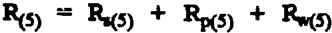
_**hp)**_ _**h.5)**_

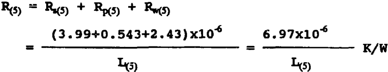
**where L-y, - l e n g t h o f t h e tube i n regime 5**

## **A. 2 . 5 Log Hean Temperature D i f f e r e n c e Method** **( Tpj (5) - T^j) ) - ( T ^ - T^ { 5 ) )**

## **K/W**

**ATui(5) =**
## **1 « [ ( T ^ - T^j) ) / ( Tp^j) - T r i ( 5 ) ) ]**

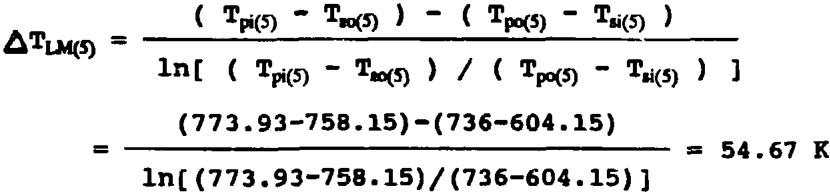
**( 7 7 3 . 9 3 - 7 5 8 . 1 5 ) - ( 7 3 6 - 6 0 4 . 1 5 )**

**= 5 4 . 6 7 K**
**l n [ ( 7 7 3 . 9 3 - 7 5 8 . 1 5 ) / ( 7 3 6 - 6 0 4 . 1 5 ) ]**

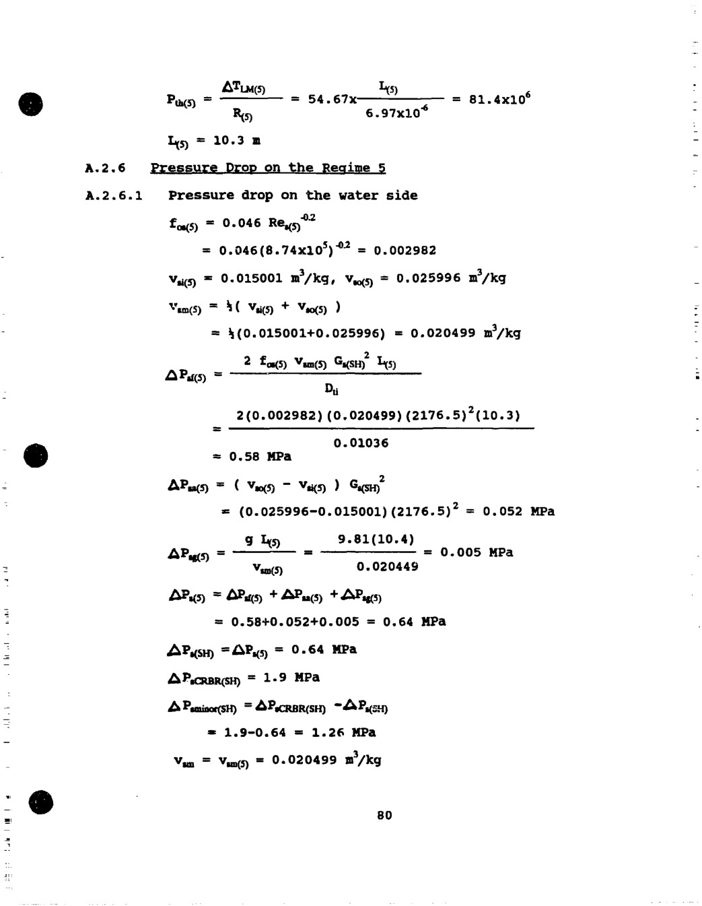
## **ATLM(5) ^5),** **Piws) = = 54.67X — = 81.4x10*** **R^ 6.97x10**

**Lp) - 10.3 D**

## **A.2.6 Pressure Drop on the Regime 5** **A.2.6.1 Pressure drop on the water side** **f«(5) " °-0* 6 R^S)"0-2** **= 0.046 (8.74xl0 S) "°^ = 0.002982**

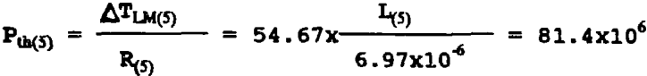

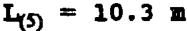
**vii(S) * 0.015001 m3/kg, v^j) = 0.025996 m3/kg**

**= %(0.01500[0.015001+0.0 25996) = 0 . 0 2 0 4 9 9** **m** **3** **/kg**

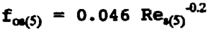
## **2 r o^5) V im(J) ^ S H ) " ^ 5 )**

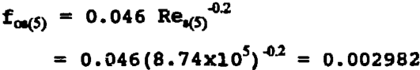

**2 ( 0 . 0 0 2 9 8 2 ) ( 0 . 0 2 0 4 9 9 ) ( 2 1 7 6 . 5 )** **2 ( 1 0 . 3 )**

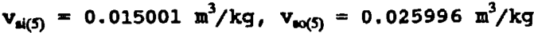

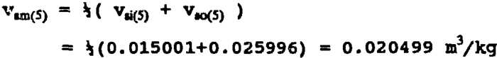
**- 0 . 5 8 MPa**

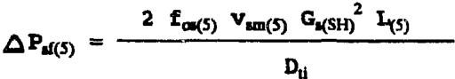
## **APm(S) = ( vio(5) ~ ViK5) ) G«(SH)**

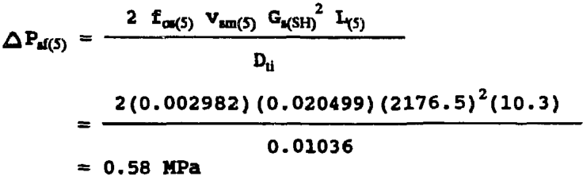
**= ( 0 . 0 2 5 9 9 6 - 0 . 0 1 5 0 0 1 ) ( 2 1 7 6 . 5 )** **2 = 0 . 0 5 2 MPa**

**g L j,** **9 . 8 1 ( 1 0 . 4 )**
**A P ^ n =** **=** **= 0 . 0 0 5 MPa**
**v** **m** **(** **5** **)** **0.020449**

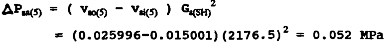

**= 0 . 5 8 + 0 . 0 5 2 + 0 . 0 0 5 = 0.64 MPa**

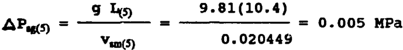
## **APKSH) = ^ P K 5 ) " ° ' 6 4 M p a** **^P(CRBR(SH) = 1 - 9 MPa** **A Ptmiou{SH) = APiCRBR(SH) ~^ Pi(£H)**

*** 1 . 9 - 0 . 6 4 = 1 . 2 6 MPa**

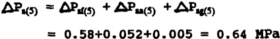

**V.U, = V^j) = 0 . 0 2 0 4 9 9** **m** **3** **/kg**

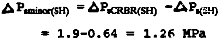

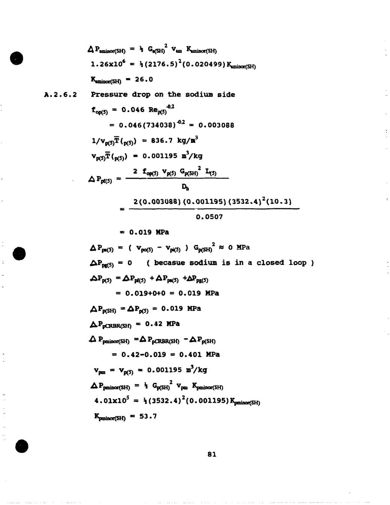

**APHniDor(SH) ~ ^ Gi(SH)** **v«m Kunino^SH)**
## **1.26X10* - ^ ( 2 1 7 6 . 5 ) Z ( 0 . 0 2 0 4 9 9 ) K ^ ^ S H )**

**Kmioo^SH) " 2 6 . 0**

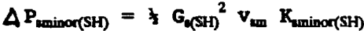

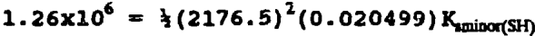
**2** **Pressure drop on the sodium side**

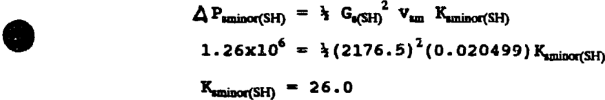

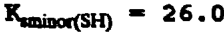
**= 0.046(734038)"°** **2 - 0.003088**

**Vv^TCpp)) = 836.7 Jcg/»** **3**

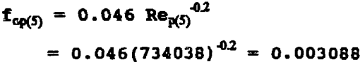
## **V «S)T(KS)) " 0.001195 m 3/kg**

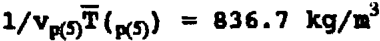
**2** **fQP(5) VP(3) GKSH)2 ^3)**
## **APPKS)**

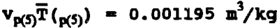

**2(0.003088)(0.001195)(3532.4)** **z** **(10.3)**

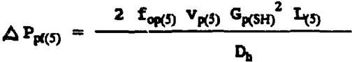

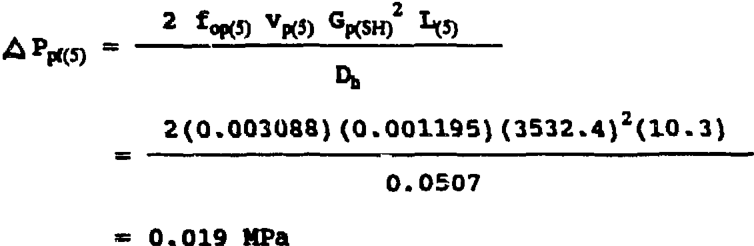
**= 0.019 MPa**

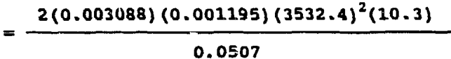

**APp.(j) = ( v ^ g - V^JJ ) GpfljH)2 * 0 MPa**

**APp^s) =** **0** **( becasue sodium i s in a c l o s e d loop )**

## **•*PK5) ~*PPV> +APp.(5) +APB(S)**

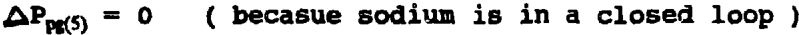
**= 0.019+0+0 = 0.019 MPa**
## **APtfSH) = A P P ( 5 ) = ° - 0 1 9 MP3**

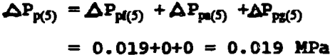
**APpCRBR(SH)** **= 0 . 4 2 MPa**

**A PpmiDor(SH) ™ A PpCRBR(SH) ~APp(SH)**

**= 0 . 4 2 - 0 . 0 1 9 = 0 . 4 0 1 MPa**

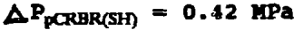

**Vpm - Vpp, = 0.001195 B** **3** **/Xg**

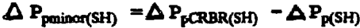
## **APpmino^SH) = ** GP(SH) vpm KpminottSH)** **4 . 0 1 X 1 0 5 = * ( 3 5 3 2 . 4 ) 2 ( 0 . 0 0 1 1 9 5 ) K p i a i l l „ ( S H )**

**KprninottSH) ~** **5** **3** **'** **7**

**8 1**

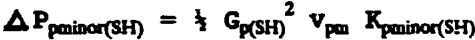

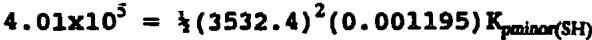
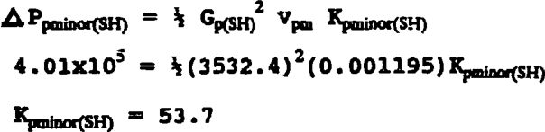
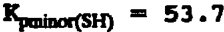

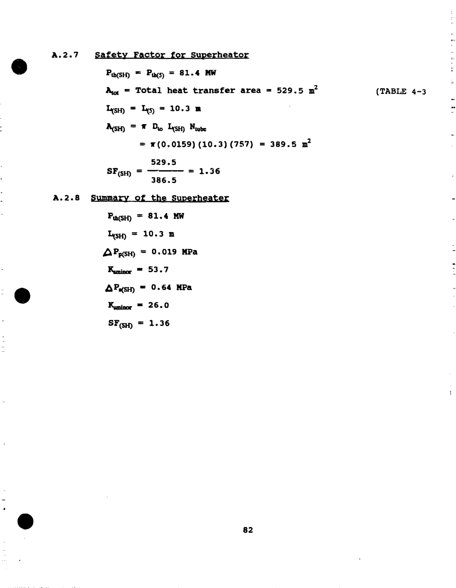
## **`A.2.7 Safety Factor for Superheator`**

`Plh(SH) *`

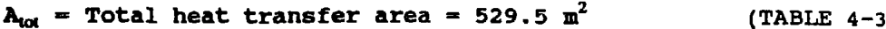
### `Pth(5) = 81.4 MW`

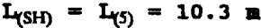

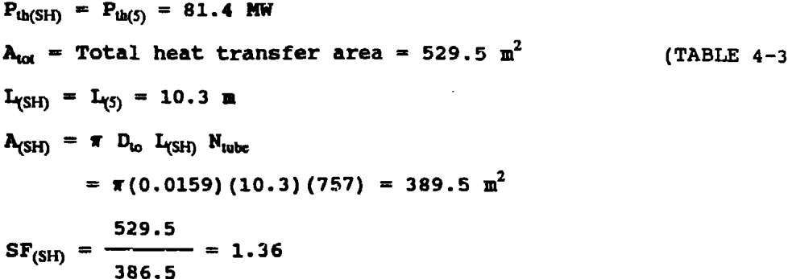

**`Am,`** `•»` **`Total heat transfer area`** `= 529.5` **`m`** **`2`** `(TABLE 4-3`

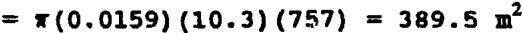
## **^SH) = ^5) = 10*3 •**

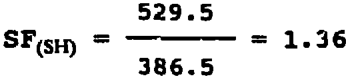

**= ir(0.0159) ( 1 0 . 3 ) (757) = 3 8 9 . 5 m** **2**

**5 2 9 . 5**
## **S F(SH) _ = 1 . 3 6**

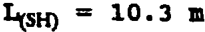
**3 8 6 . 5**

## **A . 2 . 8 Summary o f t h e S u p e r h e a t e r** **PUl(SH) = 8 1 ' * MW** **^SH) = 1 0 . 3 m**

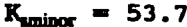
### **£ p p(SH) - 0.019 MPa**

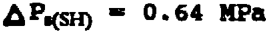

**Njwinnr** **™** **^ 3 • 7**

## **A pi(SH) • 0 . 6 4 MPa**

**Kiminor ™ 2 6 . 0**

## **S5"(SH) = i'36**

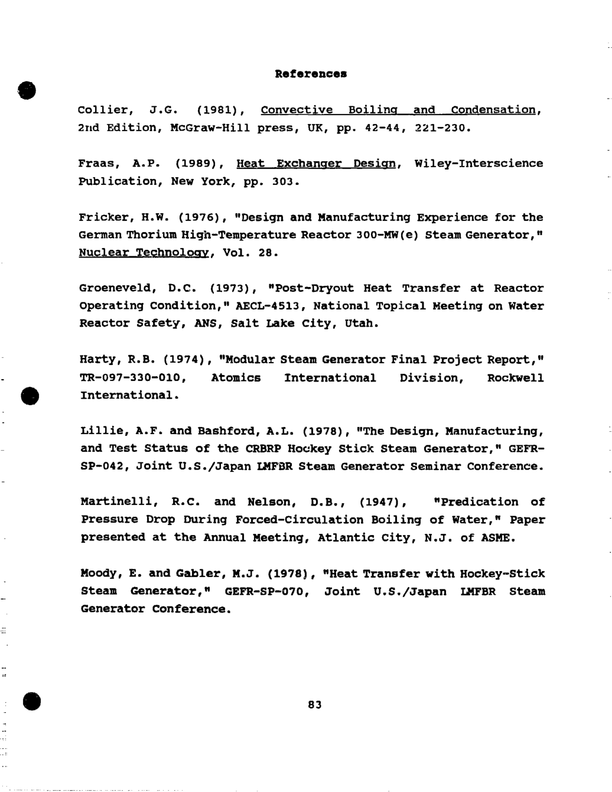

**`References`**

`Collier, J.G.` `(1981), Convective Boiling and Condensation.`
`2nd Edition, McGraw-Hill press, UK, pp. 42-44, 221-230.`

`Fraas, A.P. (1989), Heat Exchanger Design. Wiley-Interscience`
`Publication, New York, pp. 303.`

`Fricker, H.W. (1976), "Design and Manufacturing Experience for the`
`German Thorium High-Temperature Reactor 300-MW(e) steam Generator,"`
`Nuclear Technology. Vol. 28.`

`Groeneveld, D.C. (1973), "Post-Dryout Heat Transfer at Reactor`
`Operating Condition," AECL-4513, National Topical Meeting on Water`
`Reactor Safety, ANS, Salt Lake City, Utah.`

`Harty, R.B. (1974), "Modular Steam Generator Final Project Report,"`
`TR-097-330-010,` `Atomics` `International` `Division,` `Rockwell`
`A` `International.`

`Lillie, A.F. and Bashford, A.L. (1978), "The Design, Manufacturing,`
`and Test Status of the CRBRP Hockey Stick Steam Generator," GEFR-`
`SP-042, Joint U.S./Japan LMFQR Steam Generator Seminar Conference.`

`Martinelli, R.C. and Nelson, D.B., (1947),` `"Predication of`
`Pressure Drop During Forced-Circulation Boiling of Water," Paper`
`presented at the Annual Meeting, Atlantic City, N.J. of ASME.`

`Moody, E. and Gabler, M.J. (1978), "Heat Transfer with Hockey-stick`
`Steam Generator," GEFR-SP-070, Joint U.S./Japan LMFBR Steam`
`Generator Conference.`

**•** `83`

Rosenthal, M.W., Haubenreich, P.N., and Briggs, R.B. (1972) "The Development Status of MOLTEN-SALT BREEDER REACTORS," ORNL-4812, Oak Ridge National Laboratory.

Shah, M. M. (1976), "A New Correlation for Heat Transfer During Boiling Flow Through Pipes", ASHRAE Trans, Vol 82 Pat 2, pp. 66-86, Paper presented at the Annual Meeting, Seattle, Washington.

Singh, J. (1985), Heat Transfer Fluids and Systems for Process and Energy Applications, Marcel Dekker, Inc., New York, pp. 224.

Steam Table in SI-Units (1984), Springer-Verlag, New York, Table 1.

Tajbakhsh, A.E. (1984), "Thermal Hydraulic Design Study of Helium-Helium Heat Exchangers and Once-Through Steam Generator," M.S. Thesis, University of California, Davis.

Thom, J.R.S. (1964), "Predication of Pressure Drop During Forced Circulation Boiling of Water," Int. J. Heat Mass Transfer, Vol 7, pp. 709-724.