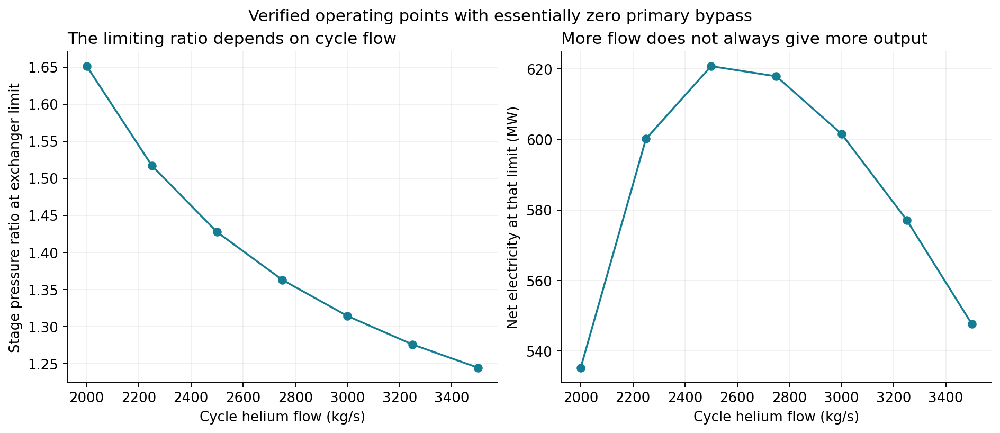

# Part 4, support 2: Testing the Stellaris model against ARIES

Supports [the main post](fusion-tea-exploratory-modeling.md). [Support 1](stellaris-evolution.md) describes how the Stellaris model was built. Part 3, [the full harness](harness.md), explains goals and rounds.

## 1. The hypothesis and the test

Our larger goal was to assess whether an AI-assisted modeling process could help us develop and evaluate engineering concepts. The hypothesis was that we could start from one documented stellarator design, abstract it into a generalized system model, and use that model to explore alternatives.

Think of the model as **a library of component definitions and a plant assembled from them**. A definition describes a component's behavior and limits. A plant selects components, connects them and supplies their input values. "Generalized" means the relationships live in the definitions and the choices live in the plant. We can then change dimensions and operating conditions, select different components or materials, and change how the plant is assembled: the [three kinds of design-space exploration](sysml-codegen-model-evaluation.md#11-exploring-the-design-space-parameters-components-and-architecture) the modeling strategy is intended to support.

The challenge is assessing whether those abstractions are realistic and coherent. A program can execute correctly and produce plausible numbers while describing the wrong physical system. Reproducing the design used to build the model is useful, but it does not tell us how well the model applies elsewhere.

We used a hold-out test: develop the model using one design, then assess it against a documented design we had deliberately withheld. We built the model from Stellaris and withheld ARIES-CS, a US design study of a compact stellarator power plant that published its physics, engineering and costs in detail. Agents were barred from reading the ARIES papers, and the research tooling refuses to register them ([Part 3, section 3](harness.md#3-where-everything-lives)).

The test asked two questions:

- **Can the model reproduce ARIES?** First with the existing library alone, changing only the plant's assembly, connections and inputs. If that fell short, we would add what ARIES needed, check that the additions worked with the existing components without changing the Stellaris model, and compare the result with ARIES's published power and cost.
- **Can the combined model explore designs neither plant covers?** With both plants' components in one library, we would run one study for each kind of design change: an operating parameter, a component choice and the connections between components.

The endpoint was an explained assessment: what the model could calculate, how its results compared with the publication, which differences or missing capabilities remained, and what the combined model taught us about design choices.

## 2. One false start before the main assessment

Our first ARIES run stopped before producing any result: a calculation that sized the magnet winding received a field outside the conductor model's range. Investigating it exposed a bigger problem. Several calculations sized equipment to meet calculated demand, including the magnet winding, facilities and fuel processing, instead of evaluating the equipment a designer had chosen. That breaks the design pattern the model is meant to follow ([support 1, theme 4](stellaris-evolution.md#4-following-the-engineering-design-pattern)), and none of our checks had caught it.

By then the agents had read all four ARIES papers, so the test could no longer be blind. We went back to the last code from before the reveal, strengthened the harness instructions, and ran a repair goal that turned those sizing calculations into supplied equipment with capacity checks. We recorded the exposure and kept ARIES-specific numbers out of the repair. Everything that follows is a comparison made after seeing the reference.

Evidence: [false start and repair basis](../../.project/active/aries-comparison-preparation/current-readiness/revealed-results/post-reveal-repair-results-note.md), [completed design-pattern repairs](../../work/orchestration/goals/preserve-model-design-choices/answer.md).

## 3. Question 1: can the model reproduce ARIES?

We answered this in three steps: the existing library alone, the library after adding what ARIES needed, and a comparison of the result with ARIES's published power and cost.

### 3.1 With the existing library

We first tried the existing library alone. Any change to the plant's assembly, connections and inputs was allowed, but no new or changed component definitions. We ran it once, on the repaired model. The run supplied the ARIES values that matched a model input directly: major radius, minor radius and peak ion temperature. The other 701 inputs stayed at the Stellaris design. That included the magnets' turns and current per turn, because the ARIES papers give total ampere-turns, which fix neither choice.

**The run stopped at the conductor calculation.** The model calculated the field of the Stellaris coils, with their turns and current, at ARIES's smaller major radius: 14.7 tesla on axis, where ARIES has 5.7, and 56.6 tesla at the coils. The conductor model covers 20 to 32 tesla, the limit [support 1 ends on](stellaris-evolution.md#model-limits), so it refused to calculate. We obtained no plant assessment and no LCOE, the lifecycle cost per unit of electricity.

That failure came from running ARIES with the Stellaris coils, so on its own it does not show the library is at fault. With ARIES's own coils and connections, the existing components might still have worked. So we compared each part of the ARIES design with the library directly, and found three gaps that no choice of inputs or connections could close:

- **Magnetic field:** the field calculation was calibrated at one coil geometry and leaves out a term that changes with geometry, so it cannot carry over to ARIES's coils. ARIES reports about 15.1 tesla at the coils.
- **Conductor performance:** ARIES uses Nb3Sn conductor at about 4 K. The library had only a REBCO model at 20 K.
- **Heat removal and conversion:** ARIES removes heat through separate helium and liquid-metal PbLi circuits and converts it in a helium Brayton cycle. Our plant had one helium circuit, a molten-salt intermediate loop and a steam cycle.

**The existing library could not describe ARIES, because it lacked the definitions ARIES needs.** Rewiring was allowed, but it could not supply the missing relationships.

Evidence: [attempt and supplied inputs](../../.project/active/aries-comparison-preparation/post-reveal-results/post-reveal-v1/report.md), [field investigation](../../.project/active/aries-comparison-preparation/post-reveal-investigation/findings.md), [structural and numerical assessment](../../.project/active/aries-comparison-preparation/final-assessment/report.md).

### 3.2 Adding what ARIES needed

Next we allowed new definitions. New physics was expected: we had modeled a steam cycle, not a helium Brayton cycle. The question was whether the new components would connect to the existing ones and reuse their relationships, without changing the Stellaris model.

| Design choice | Added for ARIES | How it connected to the existing library |
|---|---|---|
| Plasma density | A hollow density profile and its integration over the plasma | Uses the existing reaction mathematics; its fusion power feeds the existing fuel balance |
| Blanket and coolants | Region and material inventories; separate helium and PbLi heat accounts | Existing capacity checks apply to each circuit's heat |
| Power conversion | Helium Brayton components: compressors, intercoolers, turbine and recuperator | A second way to convert heat to power; it needed new connections and is not a drop-in replacement for steam |
| Equipment and costs | Selected capacities, operating demands and purchases | Existing adequacy checks and lifecycle cost calculations use the new plant's results |

The plasma-to-fuel connection is the clearest example of reuse. The new plasma calculation produced fusion power, and the existing fuel model used that power to calculate fuel demand. Raising the density by 50% increased fusion power from about 1.84 to 4.13 GW and exceeded the selected exhaust-processing capacity. The existing check caught that failure, with no ARIES-specific fuel equation and no automatic enlargement of the equipment.

The Stellaris model was unchanged: after the additions it still reproduced all 1,352 of its numeric outputs exactly.

Evidence: [component additions, reuse and executed cases](../../work/orchestration/aries-transfer-experiment/report.md), [plant integration](../../work/orchestration/goals/aries-integrated-heat-electricity/answer.md), [equipment and cost integration](../../work/orchestration/goals/aries-integrated-equipment-costs/answer.md).

### 3.3 How close the extended model came

After the additions above, we evaluated the model against ARIES's published power balance and costs. We used explicit assumptions for unfinished physics, including magnet qualification and breeding. The purpose was to find what explained agreement or disagreement, not to keep adding detail until the totals matched.

- **Power balance: our model produced about 11% less electricity from the same fusion power.** Given ARIES's 2,436 MW of fusion power, our best steady case produced **891 MW net against the published 1,000 MW**. [Power-balance assessment](../../work/orchestration/goals/aries-reference-heat-electricity-reconciliation/answer.md)
  - Beyond using the published inputs, removing all the heat took two changes. We corrected an error in our ARIES model, which had connected the cycle's three heat exchangers in series where ARIES splits the flow between two of them. And we raised the cycle flow and compressor rating above what the sources state.
  - The remaining gap is the cycle temperature: our turbine inlet reached 628 °C against the published 708 °C. An independent reviewer found that the published circuit heat loads and temperatures cannot all hold under the paper's stated exchanger temperature differences, and our sources do not say how ARIES reached its temperature. The gap remains unresolved.
- **Cost: almost all of the difference is the tritium assumption.** ARIES reported **$77.6/MWh** in 2004 dollars. For the 891 MW case our model gives **$686/MWh**, more than 90% of it tritium: the model cannot yet calculate ARIES's breeding, so it buys all its tritium at an assumed $30 million per kilogram. ARIES assumes the blanket breeds all the tritium the plant needs. [Cost assessment](../../work/orchestration/goals/aries-reconciled-alternative-economics/answer.md)
  - With that assumption and ARIES's other accounting conventions, we calculate about **$59/MWh at a 5% real discount rate**, and $32 to $105/MWh between 0 and 10%. ARIES's figure falls in that range, but its financing rate is not published, so the remaining difference is unresolved.
  - Much of our equipment cost came from ARIES's own accounts, so this is an accounting comparison, not an independent check of their estimate.

### 3.4 The answer to question 1

**Not with the library as built, but largely yes once we added what ARIES needed.** We made the big changes: a hollow plasma density profile, a blanket with separate helium and PbLi circuits, a helium Brayton cycle, ARIES's split exchanger network, and ARIES's equipment and costs. They assembled with the existing components into an ARIES plant the model can run, and the Stellaris model was unchanged. The numbers came close for reasons we can name: power is 11% low because our power cycle runs cooler than ARIES's, and our cost reaches ARIES's range only once we adopt its assumption that the blanket breeds its own tritium.

We then stopped, for time, before closing every gap. The ARIES magnets and conductor, breeding for the ARIES geometry, the cycle temperature and ARIES's financing remain open, each recorded with what it would take to close. And because we made the comparison after reading ARIES, it explains the differences rather than predicting them blind.

## 4. Question 2: can the combined model explore designs neither plant covers?

With both plants' components in the library, the design space should be much larger than either plant, because a component from one can be combined with components from the other. Each study below changes one kind of design choice and asks a concrete engineering question about it. Each uses the plant that fits its question.

| Study and question | What we change | What stays fixed | How we measure cost |
|---|---|---|---|
| **Parameters:** how far can lowering compressor pressure raise output? | Two operating settings: compressor pressure ratio and cycle flow | All equipment in a hybrid plant: the Stellaris helium loop, delivering heat at 500 °C, feeding the ARIES Brayton cycle | Cost per MWh excluding fuel. With the equipment fixed, this cost moves only with electricity output. |
| **Components:** steam or helium Brayton conversion? | The power-conversion system, with its exchangers and cooling equipment | A Stellaris-derived reactor at 2,500 or 2,800 MW of heat | Whole-plant LCOE. The options buy different equipment and sell different amounts of electricity, so only the whole plant compares them. |
| **Architecture:** can different exchanger connections produce more electricity? | How the cycle helium is routed through three exchangers: in series or split | All equipment in the ARIES plant at 1,835 MW of fusion power | Cost per MWh excluding fuel. With the equipment identical, this cost moves only with electricity output. |

The fuel treatment follows from section 3.4. The parameters and architecture studies use the ARIES plant's cost accounts, where the model cannot yet calculate breeding and so buys all the tritium at an assumed price. That adds more than $800/MWh to every case and would bury the $6 to $42/MWh differences these studies measure, so we leave fuel out. The components study uses the Stellaris reactor, which calculates its own breeding, so its fuel cost is negligible and the whole-plant LCOE includes it. The ARIES accounts are in 2004 dollars and the Stellaris accounts in 2025 dollars, so costs should not be compared across studies or with section 3.3.

### 4.1 Parameters: how far can lowering compressor pressure improve output?

We connected the Stellaris helium cooling loop to the ARIES helium Brayton cycle and varied two operating parameters: cycle flow and the pressure ratio of each compressor stage. The reactor heat and the selected equipment stayed fixed. How much electricity could these components produce together, and what would limit further improvement?

At a cycle flow of 2,500 kg/s, lowering the stage pressure ratio from the plant's starting value of 1.518 to about 1.427 raised net electricity **from 427 to 621 MW**, 45% more from the same equipment. Lowering it further to 1.425 left **7.8 MW of reactor heat unremoved**. That setting cannot hold the plant's heat balance, even though the model still reports about 620 MW.

*The last part of that range, near the limit, with pressure ratio falling from right to left. Blue points pass every implemented check; the red point fails heat removal and the return-temperature requirement.*

The limit comes from the connection between the power cycle and the exchanger. Lowering the pressure ratio changes the turbine and recuperator temperatures. The recuperator, which recovers turbine exhaust heat, then sends warmer gas toward the reactor heat exchanger. Eventually that gas is too warm for the exchanger to take all the reactor heat. **A compressor setting is therefore limited by heat transfer elsewhere in the plant.** The best setting is where the exchanger exactly matches its duty. At the starting ratio it had capacity to spare, so about a third of the loop flow had to bypass it to hold the return temperature.

Changing cycle flow moves that limit. More flow allows a lower ratio, but it does not always give more electricity, because compressor work and turbine inlet temperature change too.

*Each point is the limiting ratio at one flow. The best two, 2,500 and 2,750 kg/s, are within 3 MW of each other.*

Every cost except fuel is fixed in this sweep, so more electricity lowers the cost excluding fuel **from $133 to $91.5/MWh** in 2004 dollars. The output is low for the 3,300 MW of heat the loop delivers because the cycle runs cool: its turbine inlet is about 450 °C, against 708 °C in the ARIES design. The components study below shows what that costs. These results use fixed machine efficiencies rather than vendor performance maps, and the bypass hardware is not modeled.

Evidence: [final parameter-study assessment](../../work/orchestration/goals/design-study-parameters/answer.md), [verified case results](../../exploration/costed_loop_brayton/studies/20260926-design-study-parameters-b/results/readout.md), [figure data](aries-study-assets/parameter-figure-data.json) and [reproducible renderer](aries-study-assets/render_parameters.py).

### 4.2 Components: steam or helium Brayton conversion?

Which power-conversion system gives cheaper electricity from the same reactor? We built steam and helium Brayton alternatives from the expanded library, with their connecting exchangers and cooling equipment, and attached each to the same Stellaris-derived reactor, whose primary helium leaves at 500 °C. For each, we calculated the whole plant: electricity exported after internal use, capital, fuel, operation and equipment replacement.

**Steam gave the lower LCOE at both supported heat loads, because it exported more than twice as much electricity.**

| Reactor heat supplied | Steam net export | Steam LCOE | Brayton net export | Brayton LCOE |
|---|---:|---:|---:|---:|
| 2,500 MW | 664 MW | $408/MWh | 286 MW | $875/MWh |
| 2,800 MW | 747 MW | $371/MWh | 204 MW | $1,230/MWh |

Costs are in 2025 dollars, at 80% availability over 30 years and a 5% real discount rate. Equipment was selected separately at each heat load from a fixed list of priced options, so the rows are different selections, not one plant at rising heat. At 3,000 MW the selected cooling and divertor hardware failed their checks, so neither option gave a supported plant.

The difference starts with temperature. A gas cycle spends much of its turbine's work driving its compressors, and that share grows as the turbine inlet gets cooler. From 500 °C helium, the Brayton turbine inlet was about 413 °C, against about 708 °C in the ARIES design, and the compressors took about 1,900 MW of the turbine's 2,478 MW. At 2,500 MW, Brayton delivered 559 MW after its conversion equipment's own use, against 938 MW for steam. Both plants then spent another 274 MW on reactor circulation, heating, refrigeration and other services, leaving 664 MW and 286 MW to sell.

*Blue is electricity available for sale; orange and green show internal consumption. "Gas" denotes helium Brayton, with its compressor work already subtracted.*

Steam's conversion equipment cost $2.55 billion, against $1.54 billion for Brayton, but both plants needed the same $10.23 billion of other purchases. Steam spread those common costs, and later reactor replacements, over more than twice as many MWh. **The cheaper conversion equipment produced the more expensive electricity.** An earlier version of this study compared the conversion equipment alone and found the two within $5/MWh of each other at these heat loads. Only the whole-plant view showed the gap.

*Capital and replacement costs dominate. A similar reactor expense becomes a much larger cost per MWh when the plant exports less electricity.*

What would change the choice? Steam stayed cheaper under every tested change in prices, reactor cost and operating assumptions taken one at a time. Only a combination reversed it, at 2,800 MW: Brayton machine efficiencies three points higher, steam turbine efficiencies three points lower, Brayton equipment at half price and steam equipment 50% dearer. Brayton then cost $397/MWh against steam's $427/MWh, an assumed scenario rather than a vendor offer. [Sensitivity results](../../exploration/whole_plant_conversion/studies/20260927-design-study-whole-plant-conversion-b/results/presentation/preference-sensitivity.svg)

Evidence: [study results and assumptions](../../work/orchestration/goals/design-study-whole-plant-conversion/answer.md) (2,496 cases, each recalculated by an independent check), [earlier conversion-only comparison](../../work/orchestration/goals/design-study-component-alternatives/answer.md).

### 4.3 Architecture: can different exchanger connections produce more electricity?

We kept the reactor heat and selected equipment the same, then changed how the power-cycle helium passes through three heat exchangers. In series, the whole stream visits each exchanger in turn. In the split network, it passes through the blanket-helium exchanger first, divides between the PbLi and divertor exchangers, then mixes before the turbine. The split network is the arrangement ARIES uses; our first ARIES model had used series (section 3.3).

*Both arrangements use the same exchangers and machinery. Cycle flow is adjustable in both; the network also chooses its split between branches.*

At **1,835 MW of fusion power**, the best tested network operation produced **528 MW net against 498 MW for series**, about **31 MW or 6.2% more**. Both removed all the reactor heat, met the required return temperatures, and kept at least 30 K between the streams at both ends of every primary exchanger. ARIES cites 30 K for its exchanger bank as a whole; applying it to each exchanger is our assumption, and meeting it required a revised exchanger selection for both layouts.

**Both layouts depend on a large bypass.** To hold the reactor loops' return temperatures, roughly two-thirds of the blanket helium bypasses its exchanger: 63% in the network and 69% in series. With every bypass limited to 50%, no tested operation of either layout passed. The valves and their costs and pressure losses are not modeled, so the comparison holds only under that control assumption.

*Both layouts use the same revised exchangers: 18,000 m² each for blanket helium and PbLi, and 2,000 m² for the divertor. Cost excludes recurring fuel purchases; the bypass and any extra piping and controls are not priced.*

**The split lets the cycle take the same heat with less circulating helium.** In series, the divertor exchanger warms the entire stream before it reaches the PbLi exchanger. Splitting avoids that preheating, so the network needs about 1,246 kg/s of cycle flow where series needs 1,291 kg/s. Less flow means less compressor work and more electricity to export. At equal flow, when both remove all the heat, they produce exactly the same electricity: the split gives no separate efficiency bonus. With costs unchanged, the extra electricity lowers the cost excluding fuel **from $104.29 to $98.24/MWh** in 2004 dollars.

The study also shows what would reverse the choice. If the network loses 8% of the cycle pressure against 4.5% for series, its output falls to 491 MW, below series at 498 MW. The network's real pressure losses and its extra piping and controls therefore decide whether it is worth building.

**Changing connections can cut the circulation needed to carry the reactor heat, and so raise output, but added pressure loss can erase the gain.** The model puts numbers on both: a reason to prefer the network, and a concrete thing to check before choosing it.

Evidence: [final architecture assessment and replay](../../work/orchestration/goals/design-study-exchanger-architecture/answer.md), [verified sensitivities](../../work/orchestration/goals/design-study-exchanger-architecture/evidence/r3-data/sensitivity-coverage.csv), [figure data](aries-study-assets/architecture-figure-data.json) and [renderer](aries-study-assets/render_architecture.py).

### 4.4 The answer to question 2

**Yes.** Each study answered a design question for the whole plant and found what limits the choice:

- **Parameters:** an exchanger elsewhere in the plant limits the compressor setting, and the best setting raised output 45% with the same equipment.
- **Components:** conversion options that tie when their equipment is costed alone differ by more than 2× in LCOE once the whole plant is counted.
- **Architecture:** splitting the exchanger flow gains 6%, but a few percent more pressure loss erases the gain.

Two of the studies combine components from both plants, which neither original model could do. The results are conditional on the represented physics and assumed prices, and each says where the design is limited and what to check before choosing it.

## 5. What the test showed and where to go next

Across both supports, two things seem to be working:

- **The harness.** Over the 28 goals in [support 1](stellaris-evolution.md), the model grew from 55 calculations, 6 checks and 14 parts to 199, 67 and 76, and most of that growth came in the last eight goals. Goals also seemed to finish faster as we refined the harness.
- **The modeling framework.** With two design points, it held up and produced studies. ARIES assembled from the same library once we added what it needed, the Stellaris model stayed unchanged, and the combined library ran the three studies in section 4.

With these positive indications, we would love to see this get pushed further:

- **Across design sets.** Stellaris and ARIES are both stellarators. More diverse designs would show how far the library carries.
- **In detail.** Every result here depends on detail we left out or assumed, such as the ARIES magnets and breeding, and the machines' off-design performance.
- **Toward more interesting knowledge transfer.** For example, AI could reconcile data across sources and build strong component models from first principles where the primary source papers don't have the detail.

With this further push, we may find a way to have AI function as a force of leverage for highly technical concept design work on fusion and more. 
