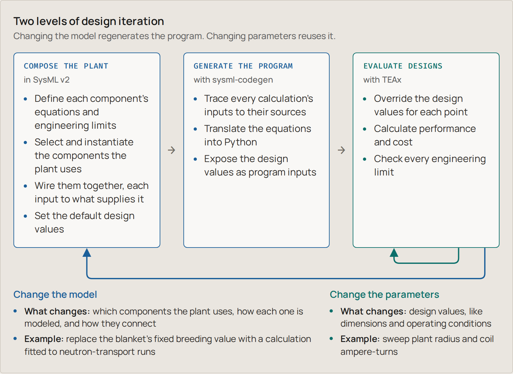
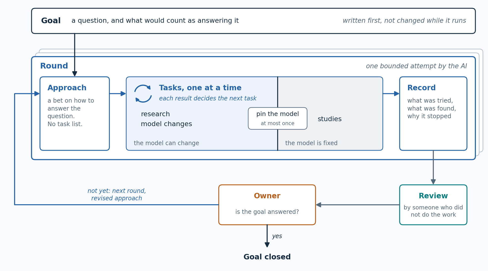
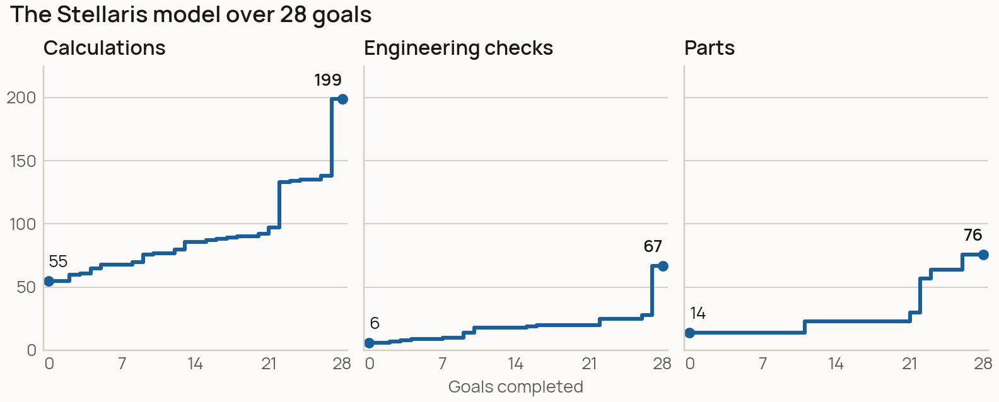
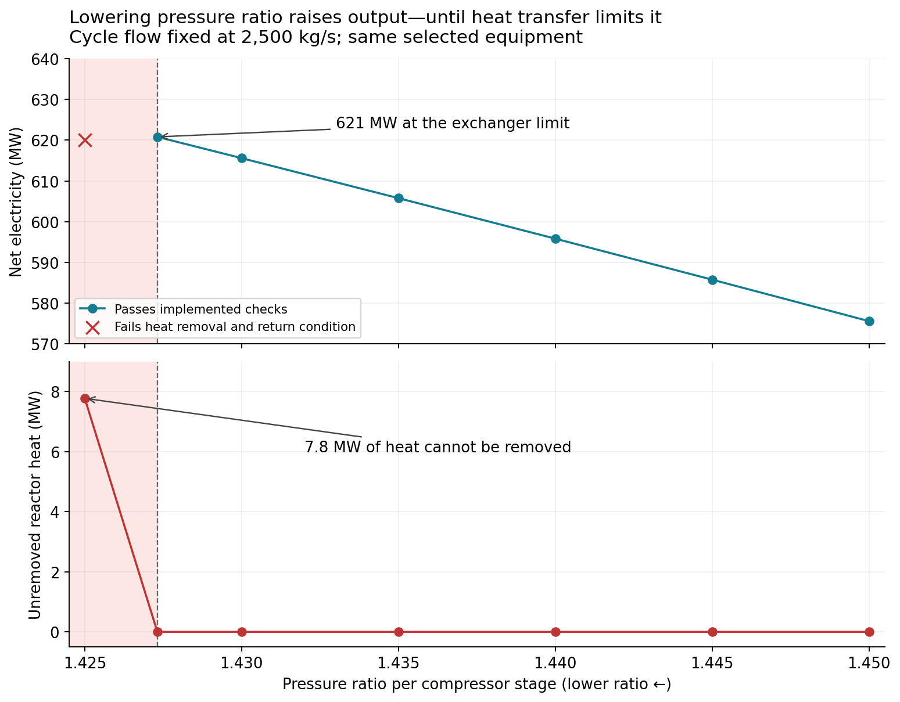
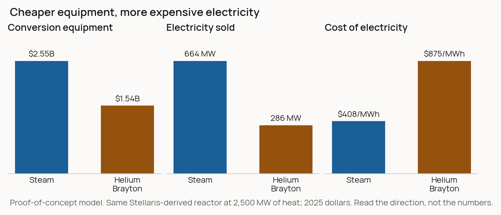

<!-- Draft of the main Substack post, built from fusion-tea-exploratory-modeling.md (the owner's outline). Page links are the published addresses; images are relative for review and get uploaded in the editor. -->

# Exploratory modeling: evolving a fusion plant design with AI and SysML v2

At 1cFE we set out to understand what would have to be true for fusion electricity to cost a cent per kilowatt-hour. Answering that means searching a large design space:

- A broad survey of 38 high-level concepts
- And then, within each, running optimizations to estimate the plant configuration with the best long-term levelized cost of electricity (LCOE)

1costingFE is pivotal here. It is the engine that lets the user specify end conditions (e.g. the output size of the plant) and, given input assumptions, calculates the plant's characteristics (physical size, component counts). In this way it functions as "inverse design": provide the target **attributes** of a system, and derive the input design **parameters**.

This approach is highly effective when you have a good understanding of the system being modeled. But what if you wanted to iteratively evolve and develop the very system you are studying? If the *execution* of your design model depends on the viability of the plant it represents, it can actually be quite hard to rapidly reimagine the plant and push the boundaries of its cost and performance.

In parallel, I have been working on an alternative methodology. My goal was to more closely emulate the engineering process itself:

- Build a rough concept design, parameterized by design decisions
- Evaluate the model: cost and performance across input parameters, learning about how the system works
- Refine the design concept: model additional behaviors, decompose systems into their parts, add fidelity to costing
- Evaluate, study, and repeat

For this reason, I will refer to this as *exploratory modeling*.

The motivation: how much useful feedback can we get before we start building? Can this methodology actually advance our understanding of the system, like what engineering limitations are holding us back? And could it allow us to discover new routes to better cost?

One note on how to read what follows. This is a proof of concept. Where I share results, read them as things the model *suggests*, not conclusions about fusion plants. I have spent the majority of time building the system and letting Claude/Codex run; and very little time sanity-checking the outputs. 

**The short version:**

- An AI-driven modeling loop grew a stellarator TEA model from 55 calculations to 199 over 28 passes (what we call "goals"), with about 95% of the work done without me stepping in.
- We held out a second stellarator design, ARIES-CS, to test how readily the models could be extended. The model's structure carried over; many of its component models had to be written new.
- On the combined model, we were able to demonstrate executing trade studies to try to answer real engineering questions. For instance, one study found that the cheaper power-conversion equipment gave the more expensive electricity. It's a proof-of-concept result, so treat it as a question worth asking, not an answer.

Below I summarize the concept, outcomes, and learnings in 5 parts. I have links to pages with additional detail. 

## 1. Why SysML v2?

We use SysML v2 as the language and specification for representing the system. Part of what drew me to using SysML v2 was the potential future benefits and use cases. For instance, run your TEA during concept design with SysML v2, and then you have bootstrapped your systems engineering when you start building hardware. More about this in Part 5. 

But the main motivation is actually what makes it harder to work with: **strict semantics.**

Code is unbounded. You define your own semantics, structures, data flows and patterns; you are free to change all those things on the fly. This flexibility can be a burden: every large piece of software has to define its structure with conventions, reviews and a lot of discipline. An AI writing code has the same freedom, and left alone it will use it. In my experience, strong patterns and established semantics are critical for fighting the natural entropy (i.e. slop) of AI.

Our goal here is modeling physical hardware and software systems. SysML, and now SysML v2, are specifications developed by really smart engineers and used broadly specifically because they are very effective at describing hardware and software systems. So instead of inventing our own modeling conventions, figuring out how to represent them in pure code (e.g. python) and letting the AI reinvent them every session, we borrow a language that already fixes what a model can say and how.

As discussed in the [prior post](https://1cf.energy/searching-the-fusion-design-space-systematically/), SysML v2 also supports very convenient patterns around composability, which can be leveraged for trade studies. We can vary categorical decisions (Material A vs B, Component C vs D) in addition to numerical parameters.

## 2. Model execution and studies

So if one motivation for using SysML v2 was to leverage the larger community and ecosystem, why would we need to write custom model execution code?

- First, SysML v2 is new, so when we started this project there really wasn't anything available.
- Second, I had a pretty specific idea of what capabilities were needed, and wanted to make sure they were fully accessible via command line (not hidden behind a complex human-centered GUI). Here the main user is an AI agent.

The main capability: a "study".

- Identify some output attribute(s) of interest
- Figure out what all the input design parameters are in the model
- Be able to readily set, sample or sweep the input parameters and observe the output

That's really it. Whether costs, energy, physics -- If we follow the primary modeling pattern (try to reflect the actual cause and effect of the modeled system), a forward-pass evaluation should be possible. So we built a pipeline for it: **sysml-codegen** reads the SysML plant model and generates a Python program from it, and **TEAx** runs that program across as many design points as a study asks for.

Features and limitations:

1. **Three types of studies.** We think about three types of studies this enables:
   - Parameters: for the same design, just sweep the input design parameters (e.g. plant radius and coil current).
   - Components and materials: swap one component model for another and compare them, A/B.
   - Architecture: a different composition of the plant altogether, with different components or connections.
2. **Feasibility through constraints.** Engineering limits are written into the model as constraints: true/false checks on calculated values, like "the winding pack fits inside its casing" or "the conductor can carry its current". Every design point comes back with its performance and cost, plus which checks it passes and fails. A point only counts as feasible if every check was evaluated and passed, and even then only against the limits we have modeled.
3. **DAG computation.** The generated program runs its calculations in one direction, as a directed acyclic graph (DAG). This was convenient for codegen, but it relies on being able to say that some values are design parameters and others are calculated attributes. It does not support coupled systems, where two calculations each need the other's result. See the supporting write-up for more details.

The full walkthrough, from one magnet equation to a map of which designs pass, is in [Executing the trade studies on a SysML v2 plant model](https://scoring.1cf.energy/exploratory-modeling/part-2-model-execution.html). It has interactive versions of the figures.

## 3. The full harness

While the term "harness" wasn't really a thing when I started, it seems like a pretty good description of what this is: a large set of tools and prompts, scaffolded by a file system and rules. The goals for a good harness:

- **High performance**: are models more successful at completing the test?
- **Reasonable token efficiency**: does the structure allow the model to reach the quality outcome more efficiently?
- **Stability and scalability**: Does the overall system stays reasonably organized on its own, so that performance and efficiency are maintained as the system grows?

That last one is the hard part. SysML v2 helps protects the "model", but the model is a small piece of the whole system. Around it sit the data, the sources behind every number, the reasoning traces, the operational records and the project management. All that needs to be well-defined so every agent session can pick up where the last left off.

Our harness includes research, knowledge ingestion, a modeling workflow with its own project management, the model execution tools and a run-study skill. And then an over-arching "run-goal" skill, which is where the demo's work actually happened.

A goal is a question, plus what would count as answering it. The AI works on it in rounds:

- Set a goal ("Improve the physics model in this particular component")
- Round 1: research, ingest what it finds, update the model for system X (and maybe system Y), run a study, then evaluate: is the goal accomplished?
- Round 2: start from what round 1 found, and go again

*One goal, pursued in rounds. Nothing builds on a round until someone who didn't do the work has reviewed it.*

The human operator keeps the gates: approving the goal and deciding when it's answered. We estimate about 95% of the goal work in the demo ran without me. For the four goals that built the ARIES model in Part 4, my only input was a written brief at the start and the decision to close at the end.

An example from early on: our model disagreed with the Stellaris paper about whether the paper's own design could work. To keep the plasma hot, the model said it needed 90.6 MW of external heating, but the design only installs 50 MW. The easy move is to tune something until the numbers fit. Instead, the goal traced most of the gap to how the model spread helium "ash" (what fusion reactions leave behind) through the plasma. Using the paper's own rule for that brought the heating needed down to 49.1 MW, just inside what's installed. Nothing was tuned.

[The full harness](https://scoring.1cf.energy/exploratory-modeling/part-3-harness.html) walks that goal round by round, shows where everything lives on disk, and lists the checks that run before anything builds on a round.

## 4. The demo: exploratory modeling

Back to our motivation: can we advance our understanding of the system? Reveal new ideas or insights? Actually discover new routes to better cost?

This is difficult to test. First, I did not expect that the results would reveal new insights to the 1cfe team who has been studying these concepts for almost a year. So helping build further intuition would be a high bar.

But even more difficult is assessing the AI's actual modeling judgement along the way. If you provide a well-defined system (e.g. a paper that includes a lot of detail about the design), the task becomes pure translation. But if you start modeling a system that doesn't exist, how would we evaluate the realism of its cost and viability results?

Our idea: try to build a hold-out set.

1. Provide documentation for one stellarator design point: Stellaris.
2. Strictly hold out any publications related to ARIES-CS, a US design study of a compact stellarator power plant that published its physics, engineering and costs in detail.
3. Set goals to generalize the Stellaris model: calculate the plant from its design choices rather than copying the paper's numbers, so it can evaluate stellarators other than the one it was built from.
4. Test the model on ARIES with two questions:
   - Can the model reproduce ARIES?
   - Can the model, with ARIES's parts added, explore designs neither plant covers?

### Modeling Stellaris

We started with a model that could price the Stellaris design but mostly repeated the paper's numbers back to us. Over about a month, we ran 28 goals against it.

*Model size after each goal. The late jumps are the buildings being sized from the equipment they hold, and the plant's equipment becoming design inputs with capacity checks.*

Looking back, the goals mostly did one of a few things:

- **Replace typed-in numbers with physics.** The magnetic field, for example, went from a number copied from the paper to a calculation from coil count, coil current and plant radius.
- **Make the model push back.** In one sweep, most of the "feasible" designs (1,113 of 1,839) turned out to be ignited plasmas the model had no way to control. That became the next goal and a new constraint.
- **Make cost follow the design.** The cooling system's $205M allowance became $8.2B of sized pumps, piping and exchangers once cost had to follow the hardware.

The [Stellaris evolution viewer](https://scoring.1cf.energy/exploratory-modeling/part-4a-modeling-stellaris.html) lets you step through all 28 goals, see what each one changed, and open any calculation in the model.

### Question 1: can the model reproduce ARIES?

We answered this in two steps.

**With the existing library alone: no.** We first allowed only changes to the plant's inputs and connections, with no new component models. ARIES needs relationships the library didn't have, and no amount of rewiring could supply them:

- **Magnetic field.** Our field calculation was calibrated to the Stellaris coils and can't carry over to ARIES's coil geometry.
- **Conductor.** ARIES uses Nb3Sn superconductor at about 4 K. The library only had a REBCO model at 20 K.
- **Heat removal and power conversion.** ARIES cools the reactor with separate helium and liquid-metal (PbLi) circuits, and makes electricity with a helium Brayton cycle, a gas-turbine cycle. Our plant had one helium circuit feeding a steam cycle.

**After adding what ARIES needed: largely yes.** We added a hollow plasma density profile, a blanket with separate helium and PbLi circuits, the helium Brayton cycle with ARIES's heat-exchanger layout, and ARIES's equipment and costs. These plugged into the existing library, and the Stellaris model was untouched: it still reproduced all 1,352 of its outputs exactly. The results came close, for reasons we can name:

- **Power: about 11% low.** From ARIES's 2,436 MW of fusion power, our model produces 891 MW of net electricity against the published 1,000 MW. Most of the gap is temperature: our turbine inlet reaches 628 °C, against 708 °C in ARIES.
- **Cost: close only on ARIES's own assumptions.** ARIES assumes its blanket breeds all the tritium the plant needs. Our model can't yet calculate that for the ARIES blanket, so it has to buy tritium, and fuel swamps every other cost. Adopting ARIES's assumption and accounting conventions puts us in the same range as its published $77.6/MWh (we get about $59/MWh at a 5% discount rate; ARIES doesn't publish its rate). Much of our equipment cost came from ARIES's own accounts, so this is an accounting check, not an independent estimate.

We stopped for time before closing every gap. The ARIES magnets and conductor, breeding, the cycle temperature and ARIES's financing are still open.

### Question 2: can it explore designs neither plant covers?

This is really the test of whether all this was worth building. Reproducing a published plant is useful, but it's still close to translation. Everything in Parts 1 to 3 (composable SysML v2, the three types of studies, a harness that runs goals largely on its own) was built so we could ask about designs nobody has written down yet. With both plants' parts in one library, a component from one can be combined with components from the other, so the design space is larger than either plant.

We ran one study for each of the three types of study from Part 2. I'll go into some of the details, because this is where the model starts to give the kind of feedback we were after. The caveat from the top applies most here: these are things the model suggests, not conclusions.

**Parameters: compressor pressure.** A compressor setting turned out to be limited by a heat exchanger somewhere else in the plant. We built a hybrid neither paper describes: the Stellaris reactor's helium cooling loop feeding the ARIES Brayton cycle. Then we swept the compressors' pressure ratio on the same equipment. Lowering it raised net electricity from 427 to 621 MW (45% more), until the exchanger between the two loops could no longer take all of the reactor's heat.

*Read right to left: output rises as the pressure ratio falls, until the exchanger runs out of capacity (shaded).*

**Components: steam vs helium Brayton.** The cheaper conversion equipment gave the more expensive electricity. We put steam and helium Brayton conversion, each with its own exchangers and cooling equipment, on the same Stellaris-derived reactor. The Brayton equipment was about $1B cheaper, but the plant sold less than half the electricity, so its cost per MWh more than doubled. The physical reason is temperature: the reactor delivers helium at 500 °C, so the Brayton turbine runs at about 413 °C, against 708 °C in ARIES, and its compressors eat most of the turbine's output. An earlier version of the study compared the conversion equipment alone and found the two within $5/MWh of each other. The gap only appeared once the whole plant was counted.

*Read the direction, not the numbers. The absolute costs come from a proof-of-concept model with partly represented physics and assumed prices.*

**Architecture: series vs split flow.** Splitting the flow produced about 6% more electricity, but a few percent more pressure loss would erase the gain. This study stays inside the ARIES plant and changes only how it's connected: the power cycle's helium passes through three heat exchangers, either in series or split between two of them (the split is ARIES's own arrangement). The split carries the same heat with less circulating helium, so the compressors do less work, and net electricity rose from 498 to 528 MW. If the split layout loses 8% of the cycle pressure against 4.5% for series, it falls to 491 MW, below series.

*Same reactor heat and equipment; only the connections change.*

[Testing the Stellaris model against ARIES](https://scoring.1cf.energy/exploratory-modeling/part-4b-aries-test.html) has the full comparison, all three studies, and what each one assumes.

### What to make of it

What I take from this is encouraging, but it's a proof of concept. The results suggest the model's structure generalizes: a second plant plugged into the same library, and the combined library could pose design questions that neither plant could on its own. They also show the limits. Much of the component library didn't carry over, and every number in these studies depends on physics and prices we have only partly represented.

I wouldn't make a design decision from any of these study outcomes. What I would take from them is that the model points at the right *kinds* of questions: a compressor setting limited by an exchanger elsewhere in the plant, a conversion choice that only shows up at whole-plant scale, a pressure-loss budget that decides a layout. That's the feedback we were after.

We also leaned on ground truth more than I'd like. Many of the issues we caught were found by comparing the model against a published design. Whether the harness's own checks are enough in a domain with nothing published to compare against is still an open question.

## 5. Takeaways and a forward outlook

What does this mean for fusion, and beyond?

I think this is an interesting possible path forward. Today the approach is held back by its execution: a one-way chain of calculations can't solve a coupled system. With more sophisticated computing behind it (e.g. solvers for coupled systems), this could be a practical way to explore a plant's design space before anyone commits to hardware. The supporting write-up also describes how we can replace simple calculations with more sophisticated surrogate or reduced-order-models. 

But beyond a mechanical TEA system, I see a few other trends that could come together like this. 

**The Context Layer**
As more parts of the engineering process become AI-native, the importance of context and connective tissue grows. Using a system-level representation (structural and behavioral) to "hang" data, references, and links feels natural: the source behind each number, the study that stressed it, the decision that changed it. 

You can imagine this functioning as an intuitive knowledge graph, organized around the thing you are building rather than around documents. Our repository is a rough version of this: every number in the model cites a source, and every study records which version of the model it ran against.

**Shared Semantics**
The other benefit of using the SysMLv2 specification is interoprability. What if parts catalogues were accomplied by model representations (maybe CAD and SysMLv2) instead of just spec sheets? With better data sharing, more engineering challenges could turn into reasoning-guided search problems. 

**Systems as Code**
Sepaking of search problems, when the system definition is text, you get the software loop for free: diff it, review it, regenerate and rerun. That's what made fast iteration possible here, for the AI and for us.

We're not the only ones thinking about this. Companies like Sensmetry, Flow Engineering, Dalus and Spread AI are all building tools in this space. (Our own pipeline reads the SysML v2 with Sensmetry's SysIDE.)

Looking forward, there is a LOT of opportunity for AI-native software systems. Models (esp. GPT-6 Astra) are starting to demonstrate better "intuition" for 3D and physical systems, and structure plus transparency and flexibility seem to be a winning combination.

I hope this serves as some inspiration: for SysML v2 as a way to share data and modeling, and for continuing to push the cost boundary. I would also love to hear if anyone tries putting this into practice for modeling or concept design of other physical systems.
