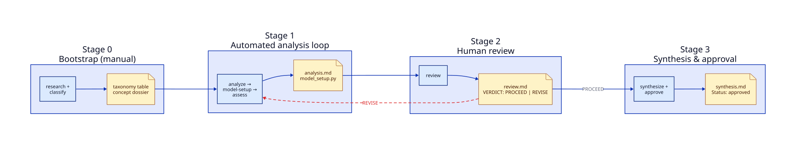
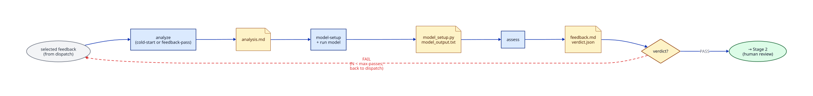
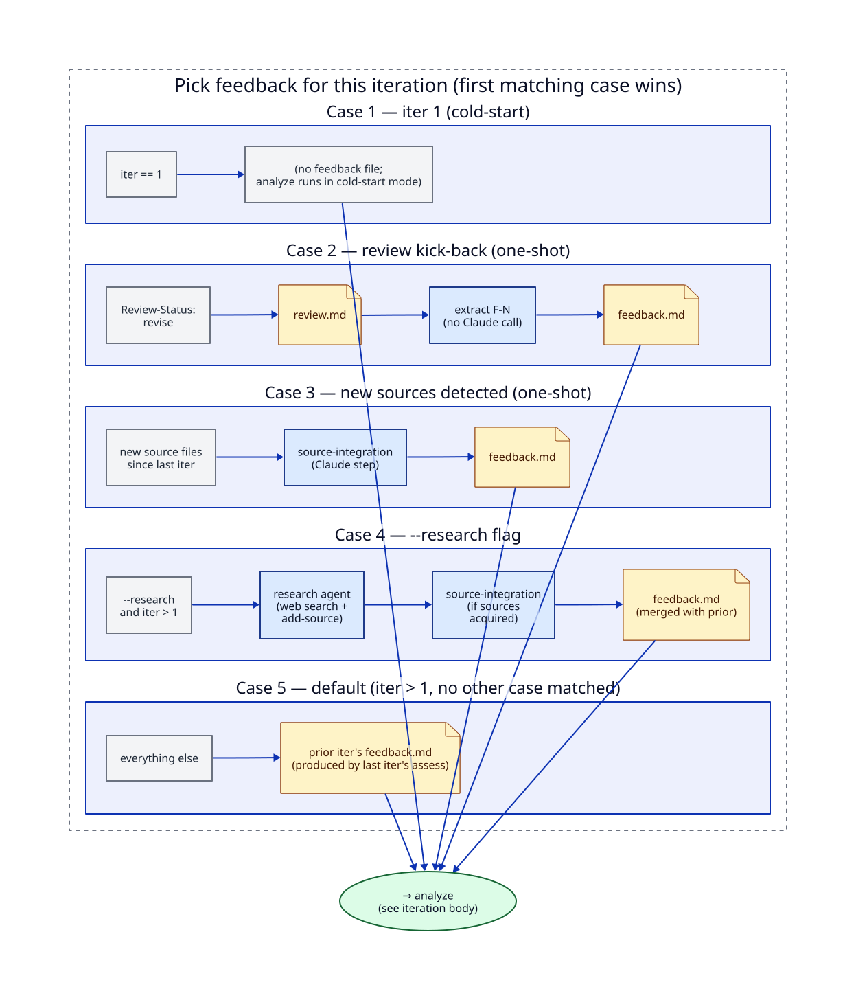

## Introduction

### Goals

- Run analyses across all major concepts ([38] identified). First, formalize the “concepts” by answering the core questions:
    - How does this concept relate to and compare with other approaches?
        - [Introduce the “taxonomy” and “tiling trees” language]
    - What is novel in the approach? How do those differences affect techno-economic analysis?
    - What are the key hypotheses that the cost model should test?
    - What are the biggest risks and assumptions? How do we capture them in the TEA? E.g. sensitivities, scenario branches, or explicit flags.
- Then transform the concept analyses into costing models, using `1costingFE` where possible
- Build tools to explore and build understanding of the concepts.

What we have built:

1. 1costingFE (link to other post)
2. An automated “concept analysis” tool
3. A concept exploration tool — take the outputs of (2) and using (1), enabled exploration of the concepts mapped and playing with the sensitivity analyses. 

We first want to invite anyone working in the space to explore the current assessments of the different concepts. 

**CAVEAT**: We are still working through them to perform audits. But we would appreciate any feedback and issues.  

## Automated Concept Analysis

### Challenges

Given the volume of concepts, we wanted to take an AI-first approach. This is a well-documented use case [Cite other publications like Anthropic research post].

Particular challenges to design around:

- Automate the research and data extraction
- Enable traceability and verification to mitigate hallucinations.
- Keep a level playing field and, to the extent possible with varying amounts of data per concept, enable apples-to-apples comparisons
- Include human review and feedback
- Consider each analysis as “living”, so that any new data that arrives can be incorporated and improve the analyses

### Strategy and Design

#### Pipeline at a glance

A concept moves through four stages. Each stage is an *operation* (blue) that produces *artifacts* (yellow) on disk. The next stage reads those artifacts and produces its own.

- **Stage 0 — Bootstrap (manual).** A human seeds the project with a taxonomy table classifying every concept (confinement family, fuel, magnet type, etc.) and a per-concept research dossier with extracted source documents. This is the only manual stage; everything downstream is automated and repeatable.
- **Stage 1 — Automated analysis loop.** An iterative loop of three steps — `analyze`, `model-setup`, `assess` — produces the techno-economic analysis (`analysis.md`) and a runnable cost model (`model_setup.py`). The loop self-assesses each pass and iterates until it converges or hits a pass cap. Detailed below.
- **Stage 2 — Human review.** A reviewer (human, optionally agent-assisted) reads the analysis and writes `review.md` with a verdict: `PROCEED` (good enough; minor decisions to apply) or `REVISE` (significant issues; kick back to Stage 1, where `review.md` becomes the next iteration's feedback).
- **Stage 3 — Synthesis & approval.** With the analysis approved, the synthesis step produces `synthesis.md` — a editorial cross-concept summary — and the approval step flips `Status: approved`.

The only feedback edge in the high-level flow is REVISE: Stage 2's verdict can send a concept back into Stage 1 for another round.

#### Core mental model: a filesystem state machine

We model the pipeline as a state machine, but the state lives on disk. There is no orchestrator process, no in-memory job graph, no database. A concept's *state is whatever files exist in its directory*, and the YAML frontmatter on those files holds the sub-state (`Status: draft|approved`, `Review-Status: proceed|revise|addressed`, `Stale: true`). Every command re-derives state from disk before doing anything.

This shifts the design center of gravity:

- **Transitions are prompts.** Each pipeline step (`analyze`, `model-setup`, `review`, `synthesize`, …) is one transition: read the current artifacts, invoke a templated prompt, write the resulting artifact. The CLI is a dispatch table of transitions; nothing more.
- **Resume is free.** The `analyze --resume` flag does not consult a journal — it just looks at which `iter-N/` directories exist and which `verdict.json` files have been written. The "next iteration" is whatever the filesystem says is missing.
- **Inspection is free.** Every prompt sent to Claude, every raw response, every intermediate output is a markdown file in the concept directory. The pipeline is auditable by construction, with no special tools.
- **Forking, redoing, and human edits are free.** Want to retry a stage? Delete the file. Want to try a variant? Copy the directory. Want to flip state? Edit a frontmatter field. The same operations work for the human and the agent.
- **Staleness is propagated, not tracked.** When `analysis.md` mutates, downstream artifacts (`model_setup.py`, `review.md`, `synthesis.md`) get a `Stale: true` marker. Each artifact clears its own marker on the next successful regeneration. No bookkeeping is needed to know what's safe to trust.
- **The feedback contract is uniform.** Every feedback-producer in the system — the in-loop assessor, the human reviewer (on REVISE), the source integrator, the autonomous research agent — emits the same schema: `VERDICT: PASS|FINDINGS` followed by `### F-N:` blocks with Target / Finding / Recommendation / Priority. The next analyze pass consumes any of them without caring who wrote it. This is what makes humans, automation, and external research interchangeable feedback sources.

The result is a system where the boundary between "agent ran a loop" and "human edited a file" disappears. They're both just filesystem mutations against the same state machine.

#### Zooming into Stage 1: the analysis loop

Stage 1 is the workhorse. One `analyze NN` invocation runs up to `--max-passes` iterations of the same body, with each iteration's output feeding the next. The body is three steps in a row: `analyze` → `model-setup` → `assess`. The end of `assess` writes a verdict; PASS exits the loop, FAIL triggers another iteration up to the cap.

The interesting part is what feeds the *first* step — the dispatch that decides which feedback source drives this iteration's `analyze`. There are five cases checked in priority order; the first match wins. Some cases run additional Claude steps to *produce* a fresh `feedback.md` before analyze sees it; others just point analyze at an existing file:

- **Case 1 — iter 1**: `analyze` runs in cold-start mode. No feedback file exists yet.
- **Case 2 — review kick-back** (one-shot): if `Review-Status: revise` is set on `analysis.md` (because Stage 2 sent the concept back), the loop extracts the `### F-N:` findings from `review.md` into a feedback file and points analyze at it.
- **Case 3 — new sources detected** (one-shot): if new source files appeared on disk since the last iteration (e.g., from `add-source`), the loop runs a `source-integration` Claude step that reads the new sources and writes a fresh `feedback.md`.
- **Case 4 — `--research` flag**: the loop runs a research agent (web search + autonomous `add-source`); if the agent acquires new sources, it chains into `source-integration` to write a `feedback.md` (merged with prior assess findings so unfixed issues carry forward). If it acquires nothing, the case falls through to the default.
- **Case 5 — default**: analyze reads the *prior iteration's* `feedback.md` — the one written by iter N-1's `assess` step. The same file produced by `assess` at the end of one iteration becomes the input for `analyze` at the start of the next.

The "one-shot" annotations on cases 2 and 3 mean the loop fires that case at most once per `analyze` invocation, then falls through to other cases on subsequent iterations. This prevents the loop from re-extracting the same review findings or re-integrating the same sources every pass.

Two structural properties make this work cleanly. First, every case ultimately produces (or points at) the same shape of file — `feedback.md` in the standard `VERDICT + F-N:` schema — so `analyze`'s feedback-pass mode doesn't care which case fed it. Second, the dispatch is read-only against the filesystem: a human dropping a new `review.md` on disk, or `add-source` adding a file under `iter-N/sources/`, automatically changes which case wins on the next pass.

#### Design patterns worth calling out

A few specific implementation choices that follow from the core model but are worth naming:

- **Iteration directories as transcripts.** Every loop pass writes a complete `iter-N/` directory: the rendered prompt, the raw output, the assess feedback, and a `verdict.json` summarizing what happened. The concept root holds the *latest* canonical copies, but every prior attempt remains on disk. Bisecting a regression to a single iteration is `diff iter-3 iter-4`.
- **Headless Claude as a subprocess.** All Claude invocations route through a single `invoke_claude_validated()` helper that handles `claude -p` shellout, retry, and per-step output validation (file-modified-since, python-syntax, review-verdict-present, etc.). Adding a new pipeline stage costs: one prompt template, one handler function, one validator.
- **Composable prompt templates.** Templates support `{{var}}` substitution, `{{#if var}}` conditionals, and `{{@path}}` file inclusion. Shared fragments in `prompt_templates/config/` (`analysis_goals.md`, `quality_standards.md`, `feedback_format.md`) are pulled into multiple templates, so the analyzer, the assessor, the reviewer, and the source integrator all share one source of truth for the analysis goals and the feedback contract. Evolving the contract means editing one file.

#### Usage patterns (single concept)

The pipeline is designed for one-concept-at-a-time iteration. The Stage 1 loop has knobs for tuning depth, mechanisms for human steering, and a clean way to start over.

**Running and tuning the Stage 1 loop:**

- **`analyze NN`** — runs the autonomous loop end-to-end: dispatch → analyze → model-setup → assess, repeating until the assessor returns `VERDICT: PASS` or the iteration cap is hit.
- **`--max-passes N`** (default 3) — caps total iterations. `--max-passes 1` produces a single-pass analysis with no self-assessment loop.
- **`--add-passes N`** — relative iteration budget: "give this concept N more passes from wherever it is now." Implies `--resume`. Useful when a concept has already converged once but you want to push it further.
- **`--research`** — on iter > 1, hands the agent web search and `add-source` so it can fill data gaps autonomously, capped by `--max-research-searches` and `--max-research-extractions` to bound cost.

**Manual intervention** (humans steering the loop without rewriting any artifact directly):

- **`--feedback PATH`** — point at a feedback file in the standard `VERDICT + F-N:` schema; the analyze step applies it as targeted edits. This is the "I have specific change requests" path — it sidesteps the autonomous loop entirely.
- **`add-source NN <path-or-url>`** — extracts a new PDF or URL into the concept's source library. On the next `analyze --resume`, the dispatch detects the new source and auto-selects the source-integration case for that pass.
- **`/manage-concept`** — an interactive helper that wraps the CLI for human operators (covered below).

**Restart:**

- **`--force`** — clears the concept's `iter-*/` directories and restarts the analysis from scratch. *Sources are not touched.* The library of extracted source documents persists across resets, so a forced restart benefits from every source ever added — including ones acquired by `--research` runs that didn't pan out.

#### `/manage-concept` — the human-side operator console

The CLI is the engine; `/manage-concept NN` is the cockpit. It's an interactive Claude Code command that loads the concept's full state on entry and adapts its behavior to which stage the concept is in:

- **Mid Stage 1** → presents the analysis as bets / assumptions / flags so the human can interrogate the agent's choices.
- **At the Stage 2 gate** → groups the review's proposed actions by severity and walks the human through filling in `Decision` fields, then suggests `address-review`.
- **After Stage 3** → summarizes synthesis verdicts and offers to challenge them or compare against other concepts.
- **Pre-Stage 1** → suggests the right pipeline command to begin.

It can perform on-demand comparisons against other concepts' artifacts (LCOE, model structure, risk breakdowns) and suggests the right pipeline command for each kind of issue the human surfaces. Critically, it never edits `analysis.md`, `model_setup.py`, or `synthesis.md` directly — all changes flow through the pipeline transitions so the audit trail stays intact.

### Usage & Example

## Concept Explorer