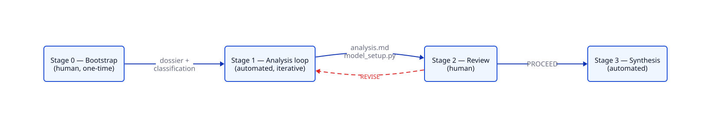
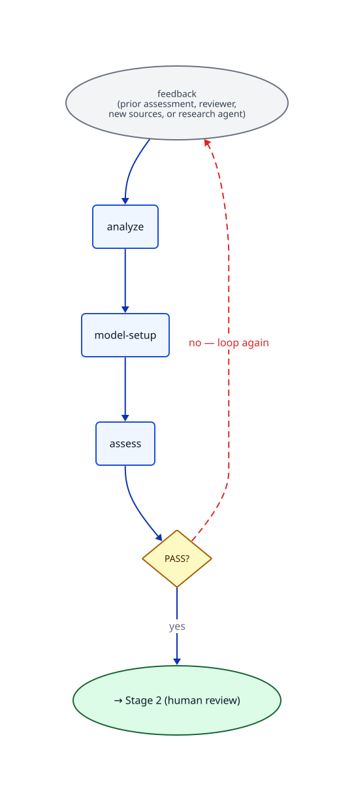

# An AI-driven concept analysis pipeline

We're doing a techno-economic analysis (TEA) of nuclear fusion that spans **38 concepts** across magnetic, inertial, and magneto-inertial confinement. To do that without months of hand-modeling each concept, we built three tools:

1. [**1costingFE**](TODO link) — a reusable cost-modeling library
2. **An automated concept analysis pipeline** — the subject of this post
3. **A concept explorer** — interactive exploration of the analyses

We invite anyone working in the space to look at the [current concept analyses](TODO link) and tell us what we got wrong.

> *We're still auditing the analyses, so expect rough edges. Issues and feedback are welcome.*

---

## The challenge

Volume × heterogeneity × traceability. We need cost models for many concepts whose physics and economics differ in fundamental ways, and every quantitative claim has to be traceable to a primary source. AI is an obvious fit for the volume problem, but a one-shot prompt produces fluent hallucinations, inconsistent framing across concepts, and no audit trail for the numbers it cites. The pipeline below is what it took to get from "AI summary" to "analysis we'd defend in front of a panel."

## The pipeline

A concept moves through four stages.

- **Stage 0 — Bootstrap (human).** A researcher seeds the concept with a classification in our shared taxonomy and a folder of source documents.
- **Stage 1 — Analysis loop (automated).** Produces the analysis (`analysis.md`) and a runnable cost model (`model_setup.py`). The loop self-grades each pass and iterates until it converges or hits a cap.
- **Stage 2 — Review (human).** A reviewer reads the analysis and writes a verdict: `PROCEED` or `REVISE`. `REVISE` kicks the concept back into Stage 1 with their findings as feedback.
- **Stage 3 — Synthesis (automated).** Once approved, an editorial cross-concept summary is written.

## Inside the loop

Stage 1 is the workhorse. One iteration runs three steps in order:

1. **`analyze`** — read the dossier and any pending feedback, write or edit `analysis.md`.
2. **`model-setup`** — generate a runnable cost model from the analysis, run it, capture the output.
3. **`assess`** — grade the iteration: does the analysis hang together, are the cited numbers actually in the sources, does the model run and produce sane outputs?

If `assess` returns `PASS`, the loop exits and the concept is ready for human review. Otherwise it iterates, with the assessor's findings feeding the next pass's `analyze`.

The interesting question is what *drives* the next iteration's `analyze`. There are four feedback sources, checked in priority order; the first match wins:

- **Reviewer kick-back.** Did Stage 2 send the concept back with `REVISE`? Then the reviewer's findings drive the next pass — every issue they raised becomes a targeted edit.
- **New source documents.** Did anyone — a human, the research agent — drop new papers into the concept's source folder since the last iteration? Then a `source-integration` step reads them and writes a feedback file naming what to update in the analysis.
- **Autonomous research.** Was the loop launched with a research budget? Then a research agent runs web search, picks promising papers, extracts them, and chains into source-integration.
- **Default.** None of the above? The prior iteration's assessment becomes the next iteration's input — unfixed issues carry forward until they're addressed.

What makes this clean is that **all four sources produce the same shape of file** — a `VERDICT: PASS|FINDINGS` header followed by a list of structured `### F-N:` findings (target / finding / recommendation / priority). `analyze` doesn't know or care which source it's reading. Adding a new feedback source means writing one more handler that emits the same schema.

## The key idea: a filesystem state machine

There is no orchestrator process, no in-memory job graph, no database. **A concept's state is whatever files exist in its directory.** Every command re-derives state from disk on each invocation. YAML frontmatter on the artifacts holds the sub-state — `Status: draft|approved`, `Review-Status: proceed|revise`, `Stale: true`.

This is the substrate that makes humans and agents interleave seamlessly:

- **Dropping a file drives the loop.** A reviewer writes `review.md` with `Review-Status: revise`; on the next `analyze`, the dispatch sees the marker and uses the reviewer's findings. No message bus, no signal — the file appearing on disk *is* the message. The same is true when `add-source` (or the autonomous research agent) drops a new paper into the source folder: next iteration picks it up.
- **Forking is free.** Want to try a variant of a concept? `cp -r 11-magnetic-mirror 11-magnetic-mirror-alt` and rerun. Want to undo a step? Delete the file.
- **Auditing is free.** Every iteration writes a complete `iter-N/` directory: the rendered prompt, the raw model output, the assessor's findings, a `verdict.json`. Bisecting a regression is `diff iter-3 iter-4`.
- **Humans and agents use the same operations.** A human can edit `analysis.md` directly, flip a frontmatter field, or hand-write a feedback file. The next loop pass picks it up the same way it picks up any other input.

The boundary between "agent did work" and "human did work" disappears. They're both just filesystem mutations against the same state machine.

## Driving the pipeline

A human starts the loop with `analyze NN` and watches it converge over a few iterations (typically 2–4). They can extend the iteration budget if a concept needs more depth, hand the agent a research budget for a round, or skip the autonomous loop entirely and apply a hand-written feedback file for targeted edits. There's an interactive helper, `/manage-concept`, that loads the concept's current state and presents the right next action — interrogating the analysis's bets and assumptions mid-loop, walking through reviewer decisions at the Stage 2 gate, or comparing this concept against others.

## What's next

- [**Browse the concept analyses**](TODO link) — the live explorer
- [**Read the detailed mechanics**](actual-mechanics.md) — how a single `analyze` invocation runs, line by line, file by file

## Concept Explorer

*TODO.*
