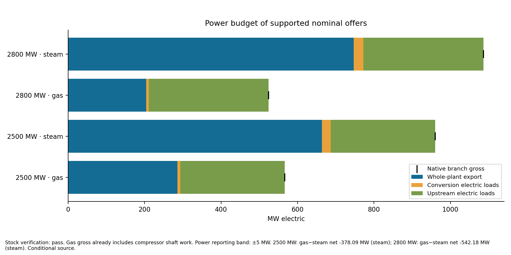
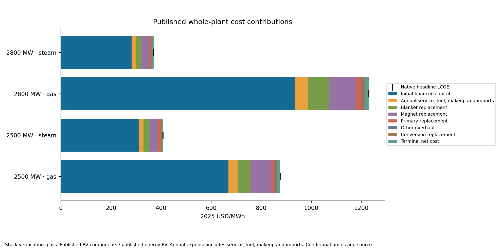
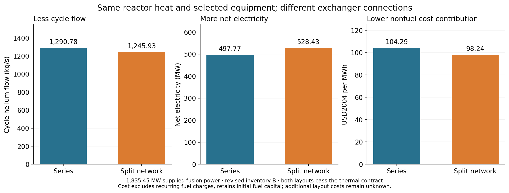

# Testing whether a stellarator model could support another design

Draft supporting [the main post](fusion-tea-exploratory-modeling.md). The interpretation below is editorial synthesis; linked assessment and study records provide the evidence.

## 1. The hypothesis and the test

Our larger goal was to assess whether an AI-assisted modeling process could help us develop and evaluate engineering concepts. The hypothesis was that we could start from one documented stellarator design, abstract it into a generalized system model, and use that model to explore alternatives.

“Generalized” has a concrete meaning here. The model should separate the relationships that describe a component from the choices made for a particular plant. We should be able to change dimensions and operating conditions, select different components or materials, and change how the plant is assembled. Those are the [three kinds of design-space exploration](sysml-codegen-model-evaluation.md#11-exploring-the-design-space-parameters-components-and-architecture) the modeling strategy is intended to support.

The challenge is assessing whether those abstractions are realistic and coherent. A program can execute correctly and produce plausible numbers while describing the wrong physical system. Reproducing the design used to build the model is useful, but it does not tell us how well the model applies elsewhere.

We used a hold-out test: develop the model using one design, then assess it against a documented design we had deliberately withheld.

We chose to use Stellaris as the design point for a stellarator and intentionally withhold ARIES publications. ARIES would provide a documented alternative against which to assess generalization: could our system models represent its components and architecture, and did their physical assumptions apply? Where the quantities and definitions matched, numerical comparisons would be a stretch goal.

If the existing library was insufficient, a second part would examine what had to change to evaluate the new design. The endpoint was an explained assessment of performance and cost: what the model could calculate, how its results compared with the publication, and which differences or missing capabilities remained unresolved.

## 2. One false start before the main assessment

Our first attempt quickly exposed major violations of the intended modeling patterns. Some calculations automatically selected equipment from demand instead of evaluating the equipment supplied by the designer. We returned to the pre-reveal code, strengthened the harness instructions and ran repair goals to restore that separation.

We had already learned something from opening ARIES. We documented that exposure and tried to keep reference-specific details out of the repair goals. With that limitation recorded, we proceeded to the main assessment.

Evidence: [false start and repair basis](../../.project/active/aries-comparison-preparation/current-readiness/revealed-results/post-reveal-repair-results-note.md), [completed design-pattern repairs](../../work/orchestration/goals/preserve-model-design-choices/answer.md).

## 3. Part 1: could we assemble ARIES from the existing component library?

Think of the system as **a library of component definitions and a plant assembled from them**. A definition describes a component's behavior and limits. A plant design selects instances of those components, connects them and supplies their input values.

For Part 1, we could change the assembly, wiring and inputs. The restriction was that we had to reuse the existing definitions. Could that library support an ARIES design without adding or changing component behavior?

**The first thing that broke was the conductor calculation.** In the attempted run, the magnetic-field calculation supplied 56.6 tesla. The conductor model only supported fields between 20 and 32 tesla, so it refused to calculate a result. We did not obtain a complete plant assessment or LCOE, the lifecycle cost per unit of electricity.

That failure told us where to investigate. It did not, by itself, prove that no arrangement of existing components could work. The inspection that followed identified the actual library gaps:

- **Magnetic field:** the field approximation lacked support for the ARIES coil geometry. ARIES reported about 15.1 tesla at the coils; the attempted calculation still used inherited coil choices and was not a reconstruction of those magnets.
- **Conductor performance:** the library lacked an Nb3Sn performance model for the ARIES magnets.
- **Heat removal and conversion:** ARIES needed separate helium and liquid-metal PbLi heat paths and helium Brayton power conversion. Our existing assembly used a different cooling arrangement and steam conversion. Representing ARIES required both new component behavior and different connections.

**Part 1 failed because applicable definitions were missing or inadequate.** Changing wiring was allowed, but wiring alone could not supply those missing relationships.

Evidence: [attempt and supplied inputs](../../.project/active/aries-comparison-preparation/post-reveal-results/post-reveal-v1/report.md), [field investigation](../../.project/active/aries-comparison-preparation/post-reveal-investigation/findings.md), [structural and numerical assessment](../../.project/active/aries-comparison-preparation/final-assessment/report.md).

## 4. What changed, and what became reusable?

Adding new physics was expected once we allowed library extensions. We had only modeled a steam cycle; we did not have a model for a helium Brayton cycle. The test in Part 2 was whether we could add the missing options while retaining useful relationships and connections elsewhere in the plant.

| Design choice | Extension for ARIES | Structural result |
|---|---|---|
| Plasma density distribution | Added a hollow-profile representation and profile integration | New plasma calculations used existing reaction mathematics and passed calculated fusion power into existing fuel balances. |
| Blanket construction and coolants | Added region/material inventories and separate helium/PbLi heat accounting | Different blanket regions and heat paths could be represented explicitly, with existing capacity checks applied to their demands. |
| Power-conversion system | Added helium Brayton components: compressors, intercoolers, turbine and recuperator | Another way to convert heat into power could be assembled. This required new behavior and connections; it was not demonstrated as a drop-in replacement for the steam cycle. |
| Equipment and operating conditions | Connected selected capacities, operating demands and purchases | Existing adequacy checks and lifecycle calculations could consume the extended plant's results. |

The strongest reuse example is the plasma-to-fuel connection. The new plasma calculation produced fusion power; the existing fuel model used that power to calculate fuel demand. Raising the density by 50% increased calculated fusion power from about 1.84 to 4.13 GW and exceeded the selected exhaust-processing capacity. The existing check caught that failure without a new ARIES-specific fuel equation or automatic equipment enlargement.

To test whether these additions expanded the design space, we also assembled components from the two plants in new combinations and studied changes to parameters and connections. Section 6 describes what those tests established.

The Stellaris baseline remained unchanged during these extensions. Evidence: [component additions, reuse and executed cases](../../work/orchestration/aries-transfer-experiment/report.md), [plant integration](../../work/orchestration/goals/aries-integrated-heat-electricity/answer.md), [equipment and cost integration](../../work/orchestration/goals/aries-integrated-equipment-costs/answer.md).

## 5. What the comparison with ARIES established

After the major component additions above, we evaluated the model against ARIES's published power balance and costs. We used explicit assumptions for unfinished physics, including magnet qualification and breeding. The purpose was to identify what explained agreement or disagreement, rather than keep adding detail until the totals matched.

- **Power balance: our model produced less electricity from the same fusion power.** Using ARIES's reported fusion power, our model calculated **891 MW of electricity versus the published 1,000 MW**. Our power cycle ran at a lower temperature and therefore converted less heat into electricity. We could not determine from the available sources how ARIES achieved its reported cycle temperature, so the difference remains unresolved. [Power-balance assessment](../../work/orchestration/goals/aries-reference-heat-electricity-reconciliation/answer.md)

- **Cost: the estimates use different fuel and financial assumptions.** ARIES reported **$77.6/MWh**. Using assumptions closer to theirs, we calculated about **$59/MWh at a 5% real discount rate**, also in 2004 dollars. We could not fully explain the remaining difference because their financing details were incomplete. Much of our equipment costing also used ARIES's own accounts, so this was an accounting comparison, not an independent validation of their estimate. [Cost assessment](../../work/orchestration/goals/aries-reconciled-alternative-economics/answer.md)

The comparison helped locate disagreements, but did not independently reproduce the complete ARIES design. A separate test addressed the other purpose of the model: using its components to explore design choices.

## 6. What could we learn by changing the design?

The expanded model supported three kinds of experiment: change operating parameters, select different components, or change their connections. By expanding our stellarator model space -- now capturing the Stellaris and ARIES design points, we should have in theory greatly expanded the total possible design space. 

To test this, we used each of our classes of experiment to ask a concrete engineering question. The results show both what the model can teach us and where the comparisons remain incomplete.

### Parameters: how far can lowering compressor pressure improve output?

We connected the Stellaris helium cooling loop to the ARIES helium Brayton power cycle and varied two operating parameters: cycle flow and pressure ratio per compressor stage. The reactor heat input and selected major equipment stayed fixed. The question was how much electricity those components could produce together, and what would limit further improvement.

At a cycle flow of 2,500 kg/s, lowering the stage pressure ratio from **1.45 to about 1.4273 increased net electricity from 576 to 621 MW**. Lowering it further to 1.425 left **7.8 MW of reactor heat unremoved**. That setting could not sustain the required heat balance, despite still reporting about 620 MW of electricity.

*Read from right to left as pressure ratio decreases. Blue points satisfy the implemented checks, including the loop return-temperature requirement. The red point fails heat removal and the return requirement. Points are verified evaluations; connecting lines guide the eye.*

The limit comes from the connection between the power cycle and the exchanger. Lowering pressure ratio changes the turbine and recuperator temperatures. The recuperator, which recovers turbine exhaust heat, then sends warmer gas toward the reactor heat exchanger. Eventually that gas is too warm for the exchanger to transfer all the required reactor heat. **A compressor operating choice is therefore limited by heat transfer elsewhere in the plant.**

Changing cycle flow moves that limit. We located the limiting pressure ratio at each tested flow, enforcing the required primary-loop return temperature. Increasing flow allows a lower ratio, but does not always produce more electricity: compressor work also increases and turbine inlet temperature changes.

*Each point uses the same selected equipment and its own limiting pressure ratio, with essentially no primary bypass. The best tested outputs are about 621 MW at 2,500 kg/s and 618 MW at 2,750 kg/s; their difference is smaller than the study's declared 5 MW materiality threshold.*

The economic consequence is direct. Over the 1.45 → 1.4273 pressure-ratio change, the nonfuel cost contribution falls from **$98.6 to $91.5/MWh in 2004 dollars** because the same assumed expenses are spread over more electricity. The study identifies both the benefit of changing an operating parameter and the physical constraint that stops it. These results use assumed machine efficiencies rather than vendor operating maps; the modeled return-temperature control omits bypass hardware costs and pressure losses.

Evidence: [final parameter-study assessment](../../work/orchestration/goals/design-study-parameters/answer.md), [verified case results](../../exploration/costed_loop_brayton/studies/20260926-design-study-parameters-b/results/readout.md), [figure data](aries-study-assets/parameter-figure-data.json) and [reproducible renderer](aries-study-assets/render_parameters.py).

### Components: steam or helium Brayton conversion?

Which power-conversion system gives cheaper electricity from the same reactor? We assembled steam and helium Brayton alternatives using the expanded component library, including their connecting exchangers and cooling equipment. We held the reactor configuration fixed within each comparison and calculated the consequences for the whole plant: electricity exported after internal consumption, capital, fuel, operation and equipment replacement.

**Steam's higher electricity output outweighed its higher equipment cost.** It gave the lower whole-plant LCOE at both supported heat loads.

| Reactor heat supplied | Steam net export | Steam LCOE | Brayton net export | Brayton LCOE |
|---|---:|---:|---:|---:|
| 2,500 MW | 664 MW | $408/MWh | 286 MW | $875/MWh |
| 2,800 MW | 747 MW | $371/MWh | 204 MW | $1,230/MWh |

Costs are USD2025, with 80% availability, a 30-year operating life and a 5% real discount rate. Equipment and operating settings were selected separately at each heat load from the modeled catalog. At 2,800 MW, the earlier Brayton selection could no longer accept the source heat within its limits; the replacement selection exported less electricity. These rows therefore compare different selections, rather than tracing one plant as its heat input rises. [Study results and assumptions](../../work/orchestration/goals/design-study-whole-plant-conversion/answer.md)

At 2,500 MW, steam delivered 938 MW after its conversion equipment's own consumption, versus 559 MW for Brayton. Both plants then needed another 274 MW for reactor circulation, heating, refrigeration and other services. That left 664 MW and 286 MW to sell. The same reactor electrical demand consumed a much larger share of Brayton's output.

*Blue is electricity available for sale; orange and green show internal consumption. “Gas” denotes helium Brayton. Brayton compressor work has already been subtracted before the quantities plotted here.*

Steam's conversion equipment cost $2.55 billion to purchase, versus $1.54 billion for Brayton. But both required the same roughly $10.23 billion of other plant purchases. Steam's additional electricity spread those common costs, and later reactor replacements, over more than twice as many exported MWh. The cheaper conversion equipment therefore produced the more expensive electricity.

*Capital and replacement costs dominate this comparison. A similar reactor expense becomes a much larger cost per MWh when the plant exports less electricity.*

What would change the choice? Steam remained cheaper under the individually tested price, reactor-cost and operating assumptions. A combined scenario reversed the result at 2,800 MW: raise Brayton compressor and turbine efficiencies by three percentage points, lower steam turbine efficiencies by three points, halve Brayton equipment prices and increase steam prices by 50%. Brayton then cost $397/MWh versus steam's $427/MWh. This identifies a combination of performance and price improvements that could make Brayton competitive; it is an assumed scenario, not an available vendor offer. [Sensitivity results](../../exploration/whole_plant_conversion/studies/20260927-design-study-whole-plant-conversion-b/results/presentation/preference-sensitivity.svg)

The study completed and independently verified 2,496 cases. At 3,000 MW, the selected primary cooling and divertor hardware failed their checks, so neither conversion option provided a supported plant design. The conclusions apply to the supplied reactor, assumed prices and tested equipment catalog. Within that scope, the model answered the component-choice question at plant level: saving on conversion equipment was a poor trade when it sharply reduced the electricity available to repay the reactor's cost.

### Architecture: can different exchanger connections produce more electricity?

We kept the reactor heat source and selected equipment the same, then changed how the power-cycle helium passes through three heat exchangers. In series, the whole stream visits each exchanger in turn. In the split network, it passes through the blanket-helium exchanger first, divides between the PbLi and divertor exchangers, then mixes before the turbine.

*The choice is the connections between components. Both arrangements use the same selected exchangers and machinery. Cycle flow is adjustable in both; the network also has a selectable split between its branches.*

At **1,835 MW supplied fusion power**, the best tested network operation produced **528 MW net versus 498 MW for series**, a gain of about **31 MW, or 6.2%**. Both removed all the assigned heat, met the specified primary return temperatures and maintained at least the adopted 30 K temperature difference at both ends of every primary exchanger. The comparison uses revised exchanger selections because the original inventory could not satisfy these thermal requirements. The 30 K requirement at each individual terminal is an explicit study assumption, not a complete reconstruction of the published ARIES exchanger design.

*Both cases use the same revised inventory: 18,000 m² each for the blanket-helium and PbLi exchangers and 2,000 m² for the divertor exchanger. The costs retain the same assumed equipment budgets. The plotted cost contribution excludes recurring fuel charges but retains initial fuel inventory in capital; unknown additional piping and control costs are not included.*

**The connections let the cycle accept the same heat with less circulating helium.** In series, the divertor exchanger warms the entire stream before it reaches the PbLi exchanger. Splitting the stream avoids that preheating. The network therefore needs about 1,246 kg/s of cycle flow where series needs 1,291 kg/s. Lower flow reduces compressor demand, increasing the electricity available for export. At equal flow, when both arrangements remove all heat, their modeled electricity is identical: splitting does not provide a separate efficiency bonus.

With the represented costs unchanged, more electricity reduces the nonfuel cost contribution from **$104.29 to $98.24/MWh in 2004 dollars**. Fine refinement of flow and split retained the advantage; it is not an artifact of choosing a coarse set of operating points. [Verified performance, thermal conditions and cost accounting](../../work/orchestration/goals/design-study-exchanger-architecture/answer.md)

The study also identifies what could reverse the choice. With an assumed **8% cycle pressure loss for the network versus 4.5% for series**, network output falls to **491 MW**, below series at **498 MW**. The extra pressure loss outweighs the benefit of the connections. Actual network hydraulics and additional piping/control costs are therefore decision-relevant inputs, not details that can be ignored after selecting the layout.

Both arrangements also depend on modeled bypass controls to maintain the reactor-loop return temperatures. At the highlighted points, roughly 63–69% of blanket-helium flow bypasses its exchanger. Valve capacities, hydraulic losses and incremental costs remain unqualified; restricting every bypass to 50% eliminated the sampled passing cases. The result is a conditional comparison under that control assumption.

The useful architectural result is specific: **changing connections can reduce the circulation required to carry the reactor heat, increasing plant output—but added hydraulic losses can erase the gain.** The model quantifies both effects, giving us a reason to prefer the network under the nominal assumptions and a concrete requirement to investigate before choosing it.

Evidence: [final architecture assessment and replay](../../work/orchestration/goals/design-study-exchanger-architecture/answer.md), [verified sensitivities](../../work/orchestration/goals/design-study-exchanger-architecture/evidence/r3-data/sensitivity-coverage.csv), [figure data](aries-study-assets/architecture-figure-data.json) and [renderer](aries-study-assets/render_architecture.py).

### What these studies add to the assessment

The parameter study showed how compressor settings improve electricity output until exchanger heat transfer becomes limiting. The component study showed why steam's higher output justified its more expensive conversion equipment once the reactor's costs and electrical consumption were included. The architecture study showed how changing exchanger connections reduces circulation demand and increases net output, and how additional pressure loss can reverse the preference. These are concrete uses of the expanded design space beyond evaluating Stellaris and ARIES separately.

The studies answer different design questions: how operating parameters affect LCOE, how conversion-system choices trade output against cost, and how exchanger connections affect plant electricity and cost. Their conclusions remain conditional on the represented physics, supported ranges and cost assumptions; none establishes a fully qualified plant design.
