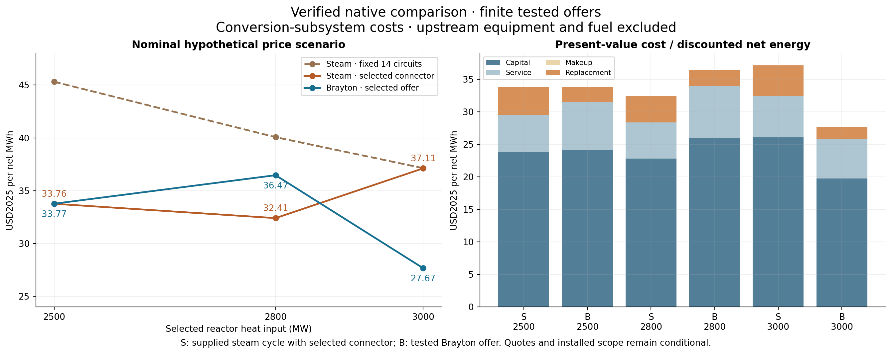
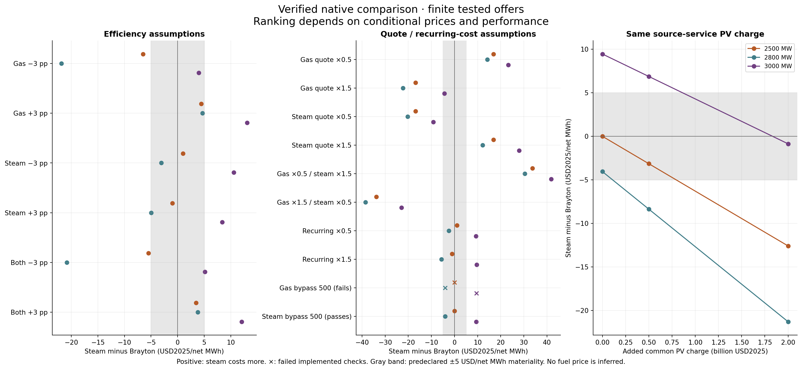

# Testing whether a stellarator model could support another design

Draft supporting [the main post](fusion-tea-exploratory-modeling.md). The interpretation below is editorial synthesis; linked assessment and study records provide the evidence.

## 1. The hypothesis and the test

Our larger goal was to assess whether an AI-assisted modeling process could help us develop and evaluate engineering concepts. The hypothesis was that we could start from one documented stellarator design, abstract it into a generalized system model, and use that model to explore alternatives.

“Generalized” has a concrete meaning here. The model should separate the relationships that describe a component from the choices made for a particular plant. We should be able to change dimensions and operating conditions, select different components or materials, and change how the plant is assembled. Those are the [three kinds of design-space exploration](sysml-codegen-model-evaluation.md#11-exploring-the-design-space-parameters-components-and-architecture) the modeling strategy is intended to support.

The challenge is assessing whether those abstractions are realistic and coherent. A program can execute correctly and produce plausible numbers while describing the wrong physical system. Reproducing the design used to build the model is useful, but it does not tell us how well the model applies elsewhere.

We used a hold-out test: develop the model using one design, then assess it against a documented design we had deliberately withheld.

We chose to use Stellaris as the design point for a stellarator and intentionally withhold ARIES publications. ARIES would provide a documented alternative against which to assess generalization: could our system models represent its components and architecture, and did their physical assumptions apply? Where the quantities and definitions matched, numerical comparisons would be a stretch goal.

If the existing library was insufficient, a second part would examine what had to change to evaluate the new design. The endpoint was an explained assessment of performance and cost: what the model could calculate, how its results compared with the publication, and which differences or missing capabilities remained unresolved.

## 2. One false start before the main assessment

Our first attempt quickly exposed major violations of the intended modeling patterns. Some calculations automatically selected equipment from demand instead of evaluating the equipment supplied by the designer. We returned to the pre-reveal code, strengthened the harness instructions and ran repair goals to restore that separation.

We had already learned something from opening ARIES. We documented that exposure and tried to keep reference-specific details out of the repair goals. With that limitation recorded, we proceeded to the main assessment.

Evidence: [false start and repair basis](../../.project/active/aries-comparison-preparation/current-readiness/revealed-results/post-reveal-repair-results-note.md), [completed design-pattern repairs](../../work/orchestration/goals/preserve-model-design-choices/answer.md).

## 3. Part 1: could we assemble ARIES from the existing component library?

Think of the system as **a library of component definitions and a plant assembled from them**. A definition describes a component's behavior and limits. A plant design selects instances of those components, connects them and supplies their input values.

For Part 1, we could change the assembly, wiring and inputs. The restriction was that we had to reuse the existing definitions. Could that library support an ARIES design without adding or changing component behavior?

**The first thing that broke was the conductor calculation.** In the attempted run, the magnetic-field calculation supplied 56.6 tesla. The conductor model only supported fields between 20 and 32 tesla, so it refused to calculate a result. We did not obtain a complete plant assessment or LCOE, the lifecycle cost per unit of electricity.

That failure told us where to investigate. It did not, by itself, prove that no arrangement of existing components could work. The inspection that followed identified the actual library gaps:

- **Magnetic field:** the field approximation lacked support for the ARIES coil geometry. ARIES reported about 15.1 tesla at the coils; the attempted calculation still used inherited coil choices and was not a reconstruction of those magnets.
- **Conductor performance:** the library lacked an Nb3Sn performance model for the ARIES magnets.
- **Heat removal and conversion:** ARIES needed separate helium and liquid-metal PbLi heat paths and helium Brayton power conversion. Our existing assembly used a different cooling arrangement and steam conversion. Representing ARIES required both new component behavior and different connections.

**Part 1 failed because applicable definitions were missing or inadequate.** Changing wiring was allowed, but wiring alone could not supply those missing relationships.

Evidence: [attempt and supplied inputs](../../.project/active/aries-comparison-preparation/post-reveal-results/post-reveal-v1/report.md), [field investigation](../../.project/active/aries-comparison-preparation/post-reveal-investigation/findings.md), [structural and numerical assessment](../../.project/active/aries-comparison-preparation/final-assessment/report.md).

## 4. What changed, and what became reusable?

Adding new physics was expected once we allowed library extensions. We had only modeled a steam cycle; we did not have a model for a helium Brayton cycle. The test in Part 2 was whether we could add the missing options while retaining useful relationships and connections elsewhere in the plant.

| Design choice | Extension for ARIES | Structural result |
|---|---|---|
| Plasma density distribution | Added a hollow-profile representation and profile integration | New plasma calculations used existing reaction mathematics and passed calculated fusion power into existing fuel balances. |
| Blanket construction and coolants | Added region/material inventories and separate helium/PbLi heat accounting | Different blanket regions and heat paths could be represented explicitly, with existing capacity checks applied to their demands. |
| Power-conversion system | Added helium Brayton components: compressors, intercoolers, turbine and recuperator | Another way to convert heat into power could be assembled. This required new behavior and connections; it was not demonstrated as a drop-in replacement for the steam cycle. |
| Equipment and operating conditions | Connected selected capacities, operating demands and purchases | Existing adequacy checks and lifecycle calculations could consume the extended plant's results. |

The strongest reuse example is the plasma-to-fuel connection. The new plasma calculation produced fusion power; the existing fuel model used that power to calculate fuel demand. Raising the density by 50% increased calculated fusion power from about 1.84 to 4.13 GW and exceeded the selected exhaust-processing capacity. The existing check caught that failure without a new ARIES-specific fuel equation or automatic equipment enlargement.

To test whether these additions expanded the design space, we also assembled components from the two plants in new combinations and studied changes to parameters and connections. Section 6 describes what those tests established.

The Stellaris baseline remained unchanged during these extensions. Evidence: [component additions, reuse and executed cases](../../work/orchestration/aries-transfer-experiment/report.md), [plant integration](../../work/orchestration/goals/aries-integrated-heat-electricity/answer.md), [equipment and cost integration](../../work/orchestration/goals/aries-integrated-equipment-costs/answer.md).

## 5. What the comparison with ARIES established

After the major component additions above, we evaluated the model against ARIES's published power balance and costs. We used explicit assumptions for unfinished physics, including magnet qualification and breeding. The purpose was to identify what explained agreement or disagreement, rather than keep adding detail until the totals matched.

- **Power balance: our model produced less electricity from the same fusion power.** Using ARIES's reported fusion power, our model calculated **891 MW of electricity versus the published 1,000 MW**. Our power cycle ran at a lower temperature and therefore converted less heat into electricity. We could not determine from the available sources how ARIES achieved its reported cycle temperature, so the difference remains unresolved. [Power-balance assessment](../../work/orchestration/goals/aries-reference-heat-electricity-reconciliation/answer.md)

- **Cost: the estimates use different fuel and financial assumptions.** ARIES reported **$77.6/MWh**. Using assumptions closer to theirs, we calculated about **$59/MWh at a 5% real discount rate**, also in 2004 dollars. We could not fully explain the remaining difference because their financing details were incomplete. Much of our equipment costing also used ARIES's own accounts, so this was an accounting comparison, not an independent validation of their estimate. [Cost assessment](../../work/orchestration/goals/aries-reconciled-alternative-economics/answer.md)

The comparison helped locate disagreements, but did not independently reproduce the complete ARIES design. A separate test addressed the other purpose of the model: using its components to explore design choices.

## 6. What could we learn by changing the design?

The expanded model supported three kinds of experiment: change operating parameters, select different components, or change their connections. By expanding our stellarator model space -- now capturing the Stellaris and ARIES design points, we should have in theory greatly expanded the total possible design space. 

To test this, we used each of our classes of experiment to ask a concrete engineering question. The results show both what the model can teach us and where the comparisons remain incomplete.

### Parameters: when does producing less electricity lower its cost?

We varied plasma density while keeping the selected equipment fixed. Lower density reduced fusion power, electricity output and fuel demand. Whether that improved LCOE depended on how the plant obtained its tritium.

| Operating point | Net electricity | LCOE: purchase all new tritium | LCOE: assume 100 kg/year of new supply |
|---|---:|---:|---:|
| Baseline density | 423 MW | $1,119/MWh | $176/MWh |
| Lower density | 350 MW | $1,295/MWh | $160/MWh |

Both rows use the same selected exchanger areas of 45,000 m² each and pass the evaluated checks. Prices are USD2004. Purchased tritium is assumed to cost $30 million/kg; the 100 kg/year supply carries an assumed $30 million/year service charge. These are operating scenarios from the earlier design study, separate from the 891 MW comparison above. [Cases and accounting](../../work/orchestration/goals/aries-integrated-design-studies/answer.md)

When all new tritium is purchased, the lower-density plant is more expensive per MWh: its reduced fuel bill does not compensate for producing less electricity from the same equipment. With the assumed 100 kg/year supply, the ranking reverses. Lower density brings annual demand below that supply limit and eliminates the remaining external purchases.

The lower-density case is cheaper only because it avoids expensive tritium purchases. It does not generate electricity more efficiently. Before recommending lower density, we would need to establish whether the plant can obtain the assumed 100 kg/year supply at the stated cost. The study tells us which missing information could change the design recommendation.

### Components: steam or helium Brayton conversion?

We connected components developed for the two plants in new combinations, then compared steam and helium Brayton conversion using the same modeled heat source. Each option included its connecting exchangers, conversion equipment, cooling and internal electrical loads. Reactor equipment, fuel and primary circulation were excluded equally. The result is **conversion-system cost per net MWh**, not whole-plant LCOE.

| Reactor heat input | Selected steam system | Tested Brayton system | Cost preference under the assumed prices |
|---|---:|---:|---|
| 2,500 MW | $33.76/MWh | $33.77/MWh | No material difference |
| 2,800 MW | $32.41/MWh | $36.47/MWh | Difference below the declared $5/MWh threshold |
| 3,000 MW | $37.11/MWh | $27.67/MWh | Brayton cheaper by $9.45/MWh |

All costs are USD2025. These compare specific equipment selections within supported operating ranges, not equally optimized technologies. The full study verified 498 cases; only cases passing the implemented engineering checks entered the ranking. [Verified comparison](../../work/orchestration/goals/design-study-component-alternatives/answer.md)

**More electricity did not necessarily mean cheaper electricity.** At 2,500 MW of reactor heat, the steam system produced about 938 MW net, versus 559 MW for Brayton. But steam's selected equipment cost $2.55 billion versus $1.54 billion. Its higher output and higher costs left the two systems almost equal in cost per MWh.

*The dashed line holds a larger steam-side exchanger and pump arrangement fixed. Selecting a smaller arrangement that still passes its checks lowers steam's cost at the lower heat loads. The component comparison therefore depends on the connecting equipment as well as the turbine technology.*

The 3,000 MW Brayton advantage was conditional. Changing the assumed equipment prices could reverse it. Including the cost of producing the reactor heat could also change the preference: steam produces more electricity over which to spread that common expense. A sensitivity calculation found that a common upstream present-value cost of about $1.83 billion erased the nominal Brayton advantage at this point; it was not a complete reactor-cost estimate.

*Positive differences favor Brayton; negative differences favor steam. The gray band marks differences smaller than the declared $5/MWh threshold. The right panel shows why a cheaper conversion subsystem need not give the cheaper complete plant.*

This is a practical use of component alternatives: we can compare the electricity gained against the equipment and operating costs required to obtain it, then identify which assumptions could change the choice. The models still restrict that comparison. Many Brayton offers lay outside the cooler calculation's supported water-temperature range, so the results do not establish the best possible Brayton design. [Sensitivity, exclusions and reproducible figures](../../work/orchestration/goals/design-study-component-alternatives/evidence/verified-comparison/report.md)

### Architecture: which exchanger arrangement can handle more fusion power?

We compared two arrangements of the same exchanger stages: all in series, or a first stage followed by two parallel branches. We then increased plasma density and checked both electricity and heat removal.

| Peak density, m⁻³ | Series: net electricity / unremoved heat | Split flow: net electricity / unremoved heat |
|---|---:|---:|
| 5.0 × 10²⁰ | 423 MW / 0 MW | 423 MW / 0 MW |
| 5.5 × 10²⁰ | 736 MW / 0 MW | 703 MW / 45 MW |
| 5.75 × 10²⁰ | 795 MW / 150 MW | 821 MW / 115 MW |

These cases use the same density-profile shape and selected hardware. Electrical output and unremoved thermal power are separate quantities. A case with unremoved heat fails the modeled steady-operation requirement, regardless of its electricity output. [Verified architecture study](../../exploration/aries_integrated/studies/20260926-aries-design-choice-interactions/results/interactions.md)

At the lower load, the arrangements give the same result. At the middle load, only the series arrangement removes all the heat. At the highest load, the split-flow arrangement produces more electricity, but neither arrangement removes all the heat. The apparent ranking reversal therefore does not identify a better operating design.

**Changing the connections changes the usable operating range.** In these cases, heat removal fails before the fuel-processing or compressor-capacity checks. A study that ranked only net electricity or LCOE would miss the reason the apparently attractive operating point cannot be sustained under the model's assumptions.

### What these studies add to the assessment

The parameter study exposed a fuel-supply threshold that reverses an economic preference. The component studies demonstrated new pairings and compared the output and cost of steam and Brayton conversion at matched heat inputs. The architecture study showed where changing connections changes the heat-removal limit. These are concrete uses of the expanded design space beyond evaluating Stellaris and ARIES separately.

The studies answer different design questions: how operating parameters affect LCOE, how conversion-system choices trade output against cost, and how exchanger connections change operating limits. Their conclusions remain conditional on the represented physics, supported ranges and cost assumptions; none establishes a fully qualified plant design.
