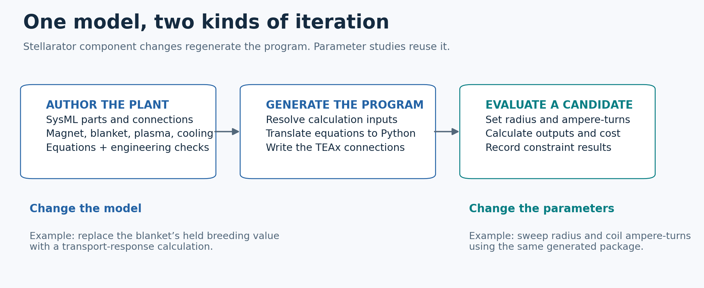
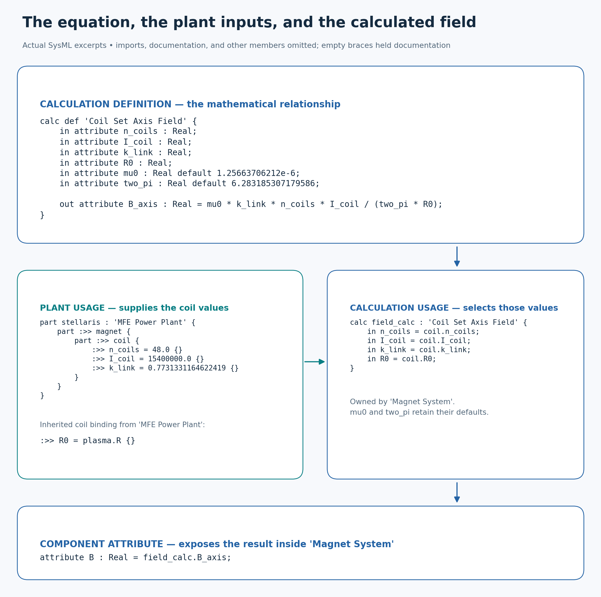
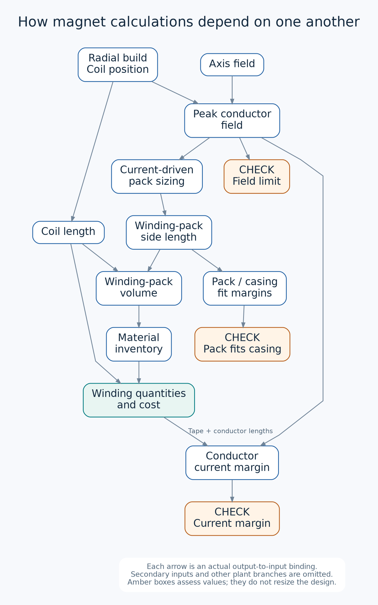
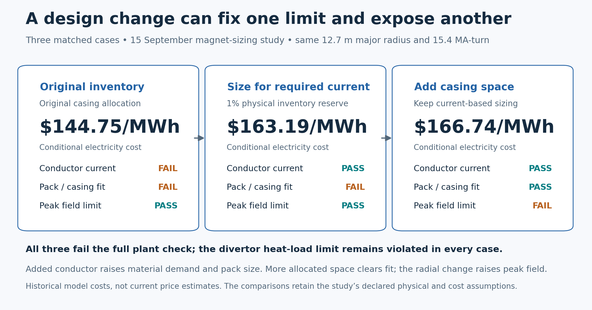
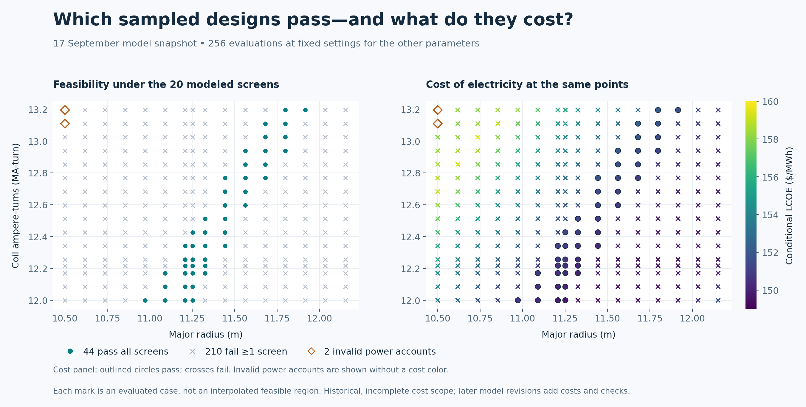

# Turning a SysML model into a calculator

## 1. Introduction

We want to iterate on engineering designs quickly enough to learn from them. That means varying numerical parameters, comparing component and material choices, and changing how the system is assembled. After each change, we want to evaluate the consequences: what performance does this design deliver, what does it cost, and which engineering limits does it violate?

The [earlier post on agentic modeling](https://1cf.energy/searching-the-fusion-design-space-systematically/) described why SysML v2 is useful for representing these alternatives. This post explains how we turn those models into executable calculations with **sysml-codegen**, run them with **TEAx**, and why we designed the pipeline this way.

### 1.1 Exploring the design space: parameters, components, and architecture

Each kind of design change needs different support from the model and its executable program.

**Numerical parameters** let us explore choices such as dimensions and operating conditions while keeping the same components and equations. The generated program exposes these values as inputs, with initial settings in JSON files. A study can vary the inputs and evaluate the resulting designs without changing the program.

**Component and material choices** are categorical: we select one alternative or another. These choices do not fit naturally into a numerical parameter sweep, because an alternative may bring different properties, equations, and engineering limits. In SysML, a component **definition** describes a kind of component and its calculations; a **usage** places a component of that kind in a particular design. We can create alternative definitions and select which one a design uses.

**Architectural choices** change the assembly itself: how many components there are and how they connect. The plant model expresses these choices through component usages and their connections. Codegen uses that assembly to construct the calculation network, so changing the assembly changes which calculations run and where they get their inputs.

These choices lead to two ways of iterating. A numerical study runs the existing program with different inputs. Changing component definitions or plant architecture generally means editing the SysML model and generating a new program. Both let us evaluate the consequences of a design decision.

### 1.2 Why build an execution pipeline?

Two reasons. First, when we started, we did not have an out-of-the-box SysML v2 execution tool ready for this workflow. Second, we needed machinery that agents could easily configure and run within a harness. That meant programmatic control over the model's inputs and repeated evaluations, along with the ability to incorporate custom calculations beyond what our SysML execution tools supported.

To support those studies, we built a code-generation pipeline that turns an assembled SysML plant model into an executable Python program. The program accepts design parameters, calculates performance and cost, and checks engineering limits. TEAx runs it repeatedly so a study can compare different design points.

Python also gives us access to more sophisticated computation and flexibility than we can express and execute through our supported SysML subset alone. Later, we will show how a custom calculation, such as a surrogate for a detailed simulation, can become part of the plant model.

### 1.3 From component models to a study

Our demo models and explores stellarator designs. To show how the codegen pipeline works, we will focus on a study of the magnet system: how changing plant radius and coil ampere-turns affects cost and the design's ability to meet engineering limits.

We will follow the component equations and plant connections through code generation, then show how the resulting program evaluates and compares design points.



The worked example follows our stellarator demo through seven steps:

- **2.1 Model a component:** separate the magnet's reusable equations from the values and connections chosen for the plant.
- **2.2 Define acceptable designs:** express engineering limits as constraints that each design point must pass.
- **2.3 Construct the calculation network:** determine where every calculation gets its inputs and which other calculations it depends on.
- **2.4 Implement the mathematics:** translate equations into Python and incorporate custom methods, including a simulation surrogate.
- **2.5 Change the component model:** give the blanket a more detailed calculation while keeping its place in the plant.
- **2.6 Assemble the executable program:** connect the Python calculations with TEAx and expose the inputs a study can vary.
- **2.7 Run a study:** evaluate many design points and compare their feasibility and cost.

All code examples come from the stellarator demo as read on 19 September 2026. Excerpts omit surrounding imports and documentation where indicated.

## 2. Process: a worked example

### 2.1 Modeling a component: separate its equations from the plant's choices

We begin by defining a component’s calculations and connecting their inputs and outputs to the plant model.

The stellarator's magnets produce the magnetic field that confines the plasma. For a proposed design, we want to calculate that field from the chosen coil ampere-turns and geometry. Other calculations then use the result to evaluate the plasma and check the magnet's engineering limits.

The magnet model uses a reusable field equation. The plant supplies the design values and connects the magnet to the plasma's radius. The figure below shows how those values reach the equation and how its result becomes available to the rest of the plant.



*Sources: the [calculation definition](../../models/library/analyses/mfe_magnet_field.sysml), [magnet component definition](../../models/library/cost_structure/mfe_power_core.sysml), [generic plant connections](../../models/designs/generic_mfe/mfe_plant.sysml), and [stellarator design values](../../models/designs/stellarator_09/stellarator_plant.sysml). Documentation and unrelated members are omitted. The calculation usage and exposed attribute belong inside `'Magnet System'`; the radius connection is inherited from the generic plant.*

Start with the plant's choices. At the reference point, it specifies 48 coils and 15.4 million ampere-turns per reference coil. The coil's radius attribute, `coil.R0`, is connected to the plasma's major radius, `plasma.R`. Changing the plant's plasma radius therefore also changes the radius used by the magnet.

The **calculation definition** declares the field equation and its inputs. Inside the magnet, the **calculation usage**, `field_calc`, connects the coil's attributes to those inputs. For example, it binds the equation's `R0` input to `coil.R0`, completing the connection from the plant's plasma radius to the field equation. The equation's constants, `mu0` (vacuum permeability) and `two_pi` (twice π), come from their declared defaults.

The equation returns the calculated field as `B_axis`. The magnet exposes that result through an attribute named `B`, which other components and calculations can read. Downstream calculations use it to determine peak conductor field and plasma beta, the ratio of plasma pressure to magnetic pressure. A new radius or coil ampere-turn value therefore affects both the field calculation and the calculations that depend on its result.

The physical scope of this equation matters when interpreting those results. Here `I_coil` denotes ampere-turns per reference coil; current in an individual conductor is checked separately. The equation estimates axis-averaged field using a fixed linkage factor from the reference coil set. It is a reference-scaled approximation, not a full three-dimensional magnetic-equilibrium calculation.

### 2.2 Constraints test whether a design point meets engineering limits

Next, we add constraints that test whether a design meets the modeled engineering limits.

Later, we will show how a study sweeps across a wide range of input combinations, such as plant radius and coil ampere-turns. Each complete set of input values defines a **design point**. The calculations tell us what performance and cost each point produces, but some combinations will violate engineering limits. We need a way to identify those failures as the study runs.

We express engineering limits as **constraints**: expressions that evaluate to true or false for a design point. A constraint can compare a calculated quantity with a limit, or relate several quantities that must be consistent with one another. In SysML, an `assert constraint` applies the condition to the model so the generated program can check it during evaluation.

For example, the magnet's conductor is arranged into a winding pack, which must fit inside its casing. A larger pack may provide the needed current capacity, but it also needs enough physical space.

The magnet's fit calculation compares the pack dimensions with the available space, accounting for insulation and assembly allowances. It calculates clearance in two directions and exposes the smaller margin as `fit_minimum_margin`.

The reusable [constraint definition](../../models/library/analyses/mfe_winding_pack_fit.sysml) states the condition: the minimum clearance must be nonnegative.

```sysml
constraint def 'Winding Pack Fits Casing' {
    in attribute minimum_margin_in : Real;
    minimum_margin_in >= 0.0
}
```

The stellarator plant applies that condition to its magnet's calculated clearance:

```sysml
assert constraint wp_fit_ok : 'Winding Pack Fits Casing' {
    in minimum_margin_in = magnet.fit_minimum_margin;
}
```

A negative clearance means the winding pack does not fit. The program still reports the design's calculated performance and cost, alongside the failed check. That lets a study show what a proposed change improves and which engineering limits it violates.

This fit check covers a local rectangular cross-section of the pack and casing cavity. Passing it does not establish that the entire nonplanar coil can be manufactured or assembled.

A design point passes the modeled feasibility checks only when all applicable assertions have been evaluated and satisfied. Results identify which assertions were assessed; an unassessed check cannot count as a pass. Even a point that passes every check still needs evidence for engineering limits the model does not yet represent.

### 2.3 Reconstructing the calculation network

Codegen now identifies the calculations used by the assembled plant and determines where each one gets its inputs.

Those connections determine what must be calculated first. The program cannot check winding-pack clearance until it knows the pack dimensions, and it cannot calculate those dimensions until it knows how much conductor is needed. TEAx will use these dependencies to order the calculations when it runs the program.

SysML organizes the model around physical components. Codegen constructs a second view organized around calculations: each calculation is a node, and a connection from one calculation's output to another's input is an edge. This is the **computational graph**. It tells the execution system which results must be available before a calculation can run. The following figure shows the magnet branch of the generated stellarator graph.



*Each arrow connects a calculation's output to another calculation's input. Multiple values exchanged by the same pair share an arrow. Secondary inputs and other plant branches are omitted. [Exact nodes, connections, and package identities](sysml-codegen-assets/graph-evidence.md).*

Read the graph from the top. The calculated field and magnet geometry determine the peak field at the conductor. That field affects how much current the conductor can carry, so it feeds the calculation that sizes the conductor supply. The sizing result then feeds the calculation of winding-pack dimensions.

The pack dimensions feed two branches: one checks whether the pack fits, while the other calculates material quantities and their procurement cost. A separate check determines whether the resulting conductor supply can carry the required current. Following the arrows shows how a change in field can affect both the physical fit and the cost of the magnet.

This execution order depends on the model author declaring each calculation's inputs and outputs. If two calculations each need the other's result before they can run, neither can start. The pipeline therefore requires a network without circular dependencies. It does not rearrange equations or build a solver automatically; a coupled calculation needs a numerical method supplied by the author.

Codegen constructs this network in three steps.

#### 2.3.1 Parse declarations and references

SysIDE reads the SysML declarations and resolves references between them. When a calculation names `coil.I_coil`, SysIDE identifies the declared attribute that name refers to. It gives codegen a structured representation of the components, equations, and connections in the model.

Identifying a declaration is only the first step. A reusable component definition can be used at several places in a plant, with different values at each place. Codegen must determine which use of the component a calculation belongs to.

#### 2.3.2 Expand the assembled design

Codegen walks the plant's component hierarchy to find each use of a component definition. At each location, it applies the definitions and overrides selected by the plant and creates records for that component's values, calculations, and checks. For the stellarator's magnet, this includes the field calculation from section 2.1 and the fit check from section 2.2.

Each component at a particular location in the assembly is an **occurrence**. The field equation is declared in the reusable magnet definition; its occurrence in this plant belongs to `stellaris.magnet`. If the same definition is used elsewhere, codegen creates separate records for that occurrence. Components declared as arrays are also expanded into individual occurrences.

These records let components have their own values even when they share a definition. The next step connects calculations to those values, including values shared across components.

#### 2.3.3 Resolve each input to its supplier

Codegen now follows the model's connections to find the value supplying each calculation input. The radius connection from section 2.1 shows how this works: the field calculation reads `coil.R0`, and the plant connects that attribute to `plasma.R`. Following the chain reaches the plant's plasma-radius parameter, so the generated field calculation reads that input directly.

The pack-sizing calculation illustrates the other case. Its effective current density, the current per unit winding-pack area, comes from the current-sizing calculation. Following that connection reaches a calculated output, so codegen adds an edge from current sizing to pack sizing. The program must calculate the density before it can use it to calculate pack dimensions.

In both cases, codegen uses the declaration identified by SysIDE together with its location in the assembled plant to find the supplying value. It follows connections through attributes until it reaches either an external input or a calculation output. Several calculations that reach the same supplier remain connected to that same value.

A missing or ambiguous supplier stops generation with a diagnostic. A broken connection cannot silently become an adjustable study parameter. Once the connections are resolved, codegen has the calculation network it needs to generate the executable program.

### 2.4 Turning modeled mathematics into executable Python

The graph tells us which calculations are needed and how they depend on one another. Each calculation also needs executable code that turns its input numbers into output numbers. For equations written in the supported SysML expression language, codegen generates that code directly, so the author does not have to maintain a second copy of the equation in Python.

Consider the magnetic-field equation from section 2.1. SysIDE represents its arithmetic as nested operations: multiply the numerator's terms, multiply the denominator's terms, then divide. Codegen visits those operations and writes the equivalent Python expression. The equation's `I_coil` input, for example, becomes `inputs.I_coil` in Python. The [generated function](../../exploration/stellarator_e2e/generated/handwritten/mfe_magnet_field/coil_set_axis_field_impl.py) returns:

```python
return ((((inputs.mu0 * inputs.k_link) * inputs.n_coils) * inputs.I_coil)
        / (inputs.two_pi * inputs.R0))
```

Only the line break has changed for readability. A generated wrapper checks the inputs and packages the result so TEAx can call the calculation.

The compiler supports a subset of SysML mathematics. The generated code does not automatically convert units, so equations and supplied values must use consistent units.

#### 2.4.1 Incorporating calculations beyond the expression translator

Some engineering calculations need numerical algorithms, external libraries, or a fast approximation to an expensive simulation. For these methods, the model declares the calculation's inputs, outputs, and plant connections. Codegen generates the Python interface, and the author supplies the computational method. TEAx can then run that method alongside the automatically translated equations. An untranslated calculation cannot run until its implementation is supplied.

The blanket surrounding the plasma uses fusion neutrons to breed tritium fuel. We want to explore how its thickness affects breeding, but running a detailed neutron-transport simulation at every design point would be expensive.

Instead, the model uses a [response table from prior neutron-transport calculations](../../models/designs/stellarator_09/breeding_response.json). A [handwritten Python function](../../exploration/stellarator_e2e/generated/handwritten/mfe_tritium_breeding/blanket_tritium_breeding_impl.py) estimates the breeding response between the stored results by interpolation. That function is a **surrogate**: a cheaper approximation to the detailed simulation, which the plant can call at each design point.

The table contains results at five blanket thicknesses spanning 0.60–1.00 m, with the remaining geometry and scenario assumptions fixed. The function checks that the inputs stay within those conditions and marks the response undefined outside them.

Both translated equations and custom methods expose declared inputs and outputs, so codegen can connect them into the same plant calculation network. The [implementation note](sysml-codegen-assets/model-evidence.md#implementation-preservation) covers how Python bodies are retained when regenerating a package.

### 2.5 Selecting a different component model

Changing numerical inputs lets us explore a component model’s existing behavior. To explore a different component or add more detailed behavior, we need to select a different definition for that component in the plant.

The blanket provides an example of adding detail. Its base model supplies a fixed breeding estimate, so varying blanket thickness does not change the breeding result. We want to replace that assumption with the thickness-dependent calculation introduced in section 2.4.

The stellarator design inherits a common plant assembly that already includes a blanket and its connections. The more detailed definition extends the base blanket, and the stellarator selects it for the existing blanket usage. Other parts of the plant can continue reading the breeding result from that same component.

The three declarations below express those choices. They come from separate source locations; the bodies are omitted:

```sysml
// Generic plant: the inherited component usage
part blanket : 'Blanket' {
    // ...
}

// Specialized component definition
part def 'Transport Calculated Blanket' :> 'Blanket' {
    // ...
}

// Stellarator design: select the specialization
part :>> blanket : 'Transport Calculated Blanket' {
    // ...
}
```

The declarations express three design choices:

- The [common plant assembly](../../models/designs/generic_mfe/mfe_plant.sysml) declares a blanket component using the base definition.
- The [specialized definition](../../models/designs/generic_mfe/mfe_subsystems.sysml) extends that base with `:>` and adds the breeding calculation inside its omitted body.
- The [stellarator design](../../models/designs/stellarator_09/stellarator_plant.sysml) redefines the inherited blanket usage with `:>>`, selecting the more detailed definition for that component.

After this model change, we regenerate the program. Codegen includes the selected blanket's calculation and connects it to the plant, so the breeding result now comes from the surrogate. A study can vary blanket thickness and evaluate its effect on breeding alongside the other plant calculations.

### 2.6 Putting together the Python computational model

We now have the calculation network and its Python functions, including any custom implementations. To run the plant, we need instructions for passing values between those functions and a way to supply the external inputs. The generated package captures both: a TEAx specification describes the connections, and input files hold the externally supplied parameters.

#### 2.6.1 Wiring the functions into an executable calculation network

A Python function for winding-pack size knows how to calculate a size from current density and ampere-turns. It does not decide which plant values to use. Codegen writes those choices into a YAML specification using the connections resolved in section 2.3. TEAx reads that specification to assemble and run the program.

Here is the complete pack-sizing entry from the stellarator pipeline:

```yaml
stellarator_09__stellaris__magnet__wp_sizing:
  module_type: mfe_magnet_field.Winding_Pack_SizingModule
  inputs:
    j_wp: float stellarator_09__stellaris__magnet__current_sizing__selected_effective_density
    I_coil: float stellarator_plant_params.stellarator_09__stellaris__magnet__coil__I_coil
  outputs:
    root: RootModel[float] stellarator_09__stellaris__magnet__wp_sizing__wp_side
```

The `module_type` selects the winding-pack sizing calculation. Its `j_wp` input receives the density calculated by current sizing, while `I_coil` receives the supplied coil ampere-turns. The output entry names the calculated pack side so other calculations can read it. The long names identify each value's location in the plant. [Generated pipeline](../../exploration/stellarator_e2e/studies/20260917-pre-reveal-feasible-neighborhood/preparation/package-pipelines/pipeline.yaml).

TEAx uses these connections to run each calculation after the results it needs are available. It gathers the inputs, calls the Python function, and makes the outputs available to the next calculations. It computes field before current-based sizing, sizing before pack dimensions, and dimensions before the fit check.

#### 2.6.2 Exposing the free input parameters

The connected calculations still need starting values. In our example, the program calculates magnetic field, but the study supplies radius and coil ampere-turns. These externally supplied values form the program's input interface. Changing them lets us evaluate a new design point without regenerating the program.

Codegen identifies these externally supplied values while resolving the graph and exposes them as public inputs. The model's authored values provide their initial settings. Values supplied by another calculation remain connected to that calculation's output.

Here is an exact subset of the stellarator's generated plant-input JSON:

```json
{
  "stellarator_09__stellaris__plasma__R": 12.7,
  "stellarator_09__stellaris__magnet__coil__I_coil": 15400000.0,
  "stellarator_09__stellaris__magnet__coil__n_coils": 48.0,
  "stellarator_09__stellaris__magnet__coil__k_link": 0.7731331164622419
}
```

These settings supply the plasma radius, coil ampere-turns, coil count, and linkage factor. Changing the radius changes the value received by every calculation connected to that plant attribute. The magnetic field remains a calculated result. [Full generated input file](../../exploration/stellarator_e2e/studies/20260917-pre-reveal-feasible-neighborhood/preparation/package-inputs/stellarator_plant_params.json).

The long JSON keys identify each input's location in the plant. File-based runs load these settings from JSON; studies can supply the values directly in memory. The [input-generation note](sysml-codegen-assets/model-evidence.md#input-generation-details) covers file grouping, defaults, and inputs that need values before evaluation.

A study chooses which inputs to vary and which to hold fixed. In the radius–current study, radius and ampere-turns vary while coil count and linkage factor remain fixed.

### 2.7 Running a study: compare feasibility and cost across design points

We can now use the generated program to ask an engineering question: which combinations of geometry and operating parameters meet the modeled limits, and what do they cost? A **study** evaluates a set of design points against the same generated plant program. It chooses which inputs to vary, which assumptions to hold fixed, and which results to compare.

In the radius–current study, we vary plant radius and coil ampere-turns. For each combination, the program calculates electricity cost and reports which engineering checks pass or fail.

TEAx loads the generated program once, then evaluates each input combination independently. The study records the inputs, calculated outputs, constraint results, and model version so each result can be traced to the design that produced it.

The current study runner evaluates grids and prepared lists of candidates. An external optimizer can call the same evaluator; the [study-runner note](sysml-codegen-assets/study-evidence.md#study-runner-capabilities) distinguishes that option from the built-in study strategies.

The following results illustrate two uses of a study: comparing a few proposed design changes, and mapping cost and feasibility across many input combinations. They come from two **dated model snapshots**. Their electricity costs reflect the assumptions and incomplete cost scope at that time; later breeding, cooling, and facility work changed the checks and cost estimates.

#### 2.7.1 See how a local change affects the rest of the design

The reference magnet has insufficient current capacity, and its winding pack does not fit inside the casing. The [15 September joint magnet-sizing study](../../exploration/stellarator_e2e/studies/20260915-joint-magnet-sizing/report.md) evaluated changes intended to address those problems. The three cases below compare the original design, a design with enough conductor to carry the current, and a design with more space for that conductor.



*Three cases evaluated with the same generated program. The second sizes the conductor supply for the required current, with a 1% reserve. The third also enlarges the space allocated to the magnet and its winding pack. None passes every check: all three exceed the modeled divertor heat-load limit. [Extracted values and original case identities](sysml-codegen-assets/magnet-sizing-comparison.csv).*

Sizing the conductor supply to carry the required current fixes the current-capacity problem but increases pack size and cost. Enlarging the allocated space fixes the fit problem, but the changed radial geometry raises peak conductor field to 25.30 T, above the retained 24.9 T limit.

Evaluating the connected model shows why fixing one limit does not necessarily produce an acceptable design. Each proposed change must be checked against its effects on the rest of the plant.

#### 2.7.2 Map feasibility and cost together

The [17 September neighborhood study](../../exploration/stellarator_e2e/studies/20260917-pre-reveal-feasible-neighborhood/report.md) provides the broader radius–current sweep introduced earlier. In the results shown below, major radius and coil ampere-turns vary while the other inputs remain fixed. Each mark represents one evaluated design point.



*This slice contains 256 samples: 44 pass all twenty then-implemented checks with a valid power account, 210 fail at least one check, and two have invalid power accounts. The passing samples span $149.77–152.36/MWh under that snapshot's cost assumptions. Circles identify passing samples in both panels; crosses retain failing results. No feasible region has been interpolated between the points. These samples do not establish a global optimum or the fraction of the whole design space that is feasible. [Plot data](sysml-codegen-assets/feasibility-cost-map.csv).*

The passing samples form a narrow band. At fixed ampere-turns, reducing radius increases the modeled field and can violate its limit. Increasing radius reduces field and changes the plasma power balance, eventually running into divertor heat or installed-heating limits. The cost plot explains why minimizing price alone would not answer the design question: low calculated costs also occur at points that fail engineering checks.

This pattern is conditional on the other inputs held fixed for the sweep. The [study evidence](sysml-codegen-assets/study-evidence.md#held-inputs-for-the-radiuscurrent-map) summarizes those settings and links to the complete record.

These studies turn design choices into engineering feedback. We can see what a proposed change improves, which limits it violates, and what to investigate next. When that investigation calls for a different component model or additional physics, we revise the model, regenerate the program, and run the next study.

## 3. Sources and figure data

- [Original agentic-mbse post](https://1cf.energy/searching-the-fusion-design-space-systematically/): motivation and the modeling workflow.
- [Codegen pipeline](https://github.com/1cFE/sysml-codegen/blob/main/docs/architecture/reference/00-pipeline-overview.md) and [TEAx evaluation and studies](https://github.com/rwestwood89/teax/blob/main/docs/evaluation-and-study.md): execution architecture.
- [Stellarator code excerpts and source hashes](sysml-codegen-assets/model-evidence.md): field, winding fit, handwritten calculations, and blanket specialization.
- [Graph extraction](sysml-codegen-assets/graph-evidence.md): exact generated connections and comparison against both frozen study pipelines.
- [Study extraction](sysml-codegen-assets/study-evidence.md): selected cases, fixed assumptions, data joins, source hashes, and later-model qualifications.
- [Figure sources and regeneration instructions](sysml-codegen-assets/README.md): PNG and SVG files, plotting code, and retained data.

<!-- Editorial provenance: The owner supplied the purpose and story in the drafting conversation and requested all examples be drawn from the stellarator demo. Three subagents verified code, graph, and study evidence for this revision on 2026-09-19. The graph and code excerpts use current local sources; study numerical claims use the named immutable record artifacts. This revision extracts and plots existing runs; it does not claim new physical qualification or a new study execution. -->
