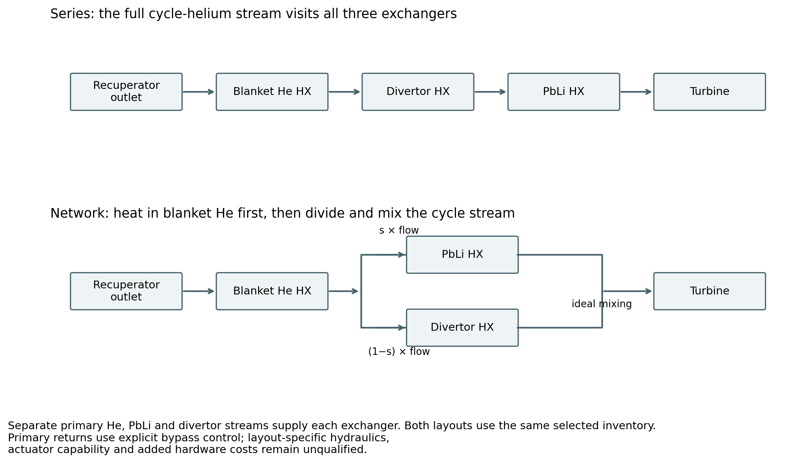
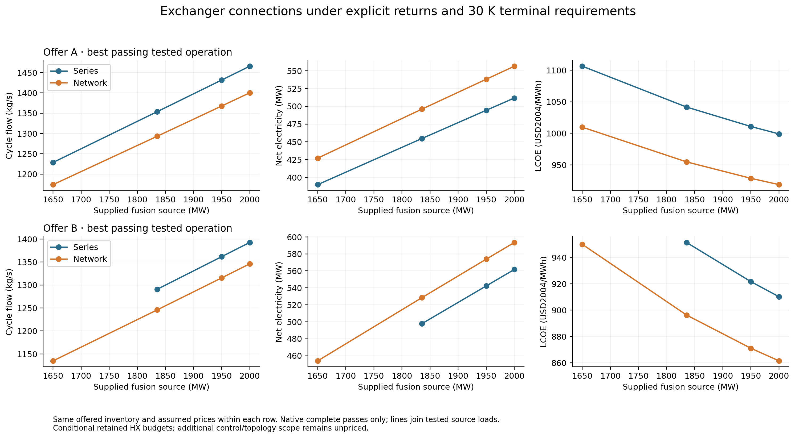
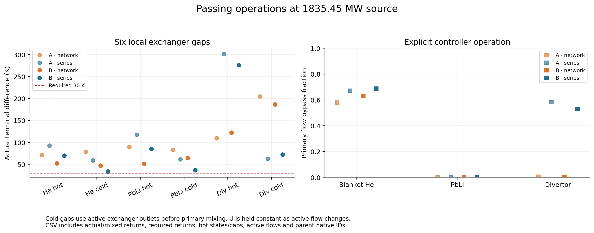
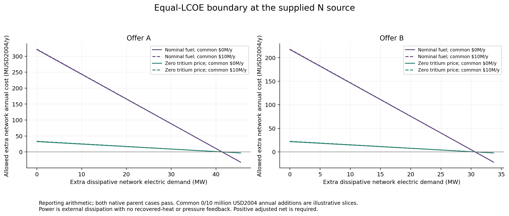
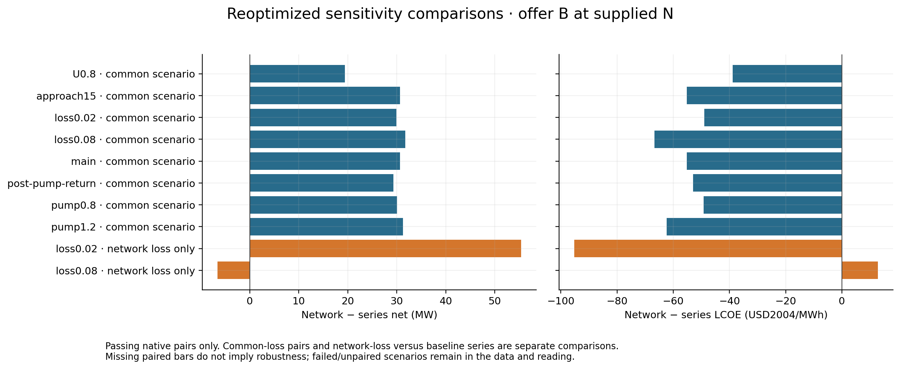

# Round 4 results analysis

[AGENT] Executor-authored reading of verified stored native results. This is a conditional comparison under the recorded N-R return convention, six 30 K terminal requirements and explicit assumed exchanger offers.

All 1277 exported cases completed and passed independent numerical verification. 535 satisfy every native engineering predicate and positive net electricity; 742 fail at least one acceptance condition.

## Main matched comparisons

| Source MW | Offer | Series / network flow kg/s | Series / network net MW | Network minus series LCOE, USD2004/MWh | Native parents |
|---:|---|---:|---:|---:|---|
| 1650.000 | A | 1228.7047 / 1174.1393 | 389.778 / 427.079 | -96.634 | case-00011 / case-00077 |
| 1835.451 | A | 1353.8086 / 1293.2918 | 454.684 / 496.054 | -86.873 | case-00123 / case-00207 |
| 1835.451 | B | 1290.7834 / 1245.9348 | 497.768 / 528.427 | -55.206 | case-00216 / case-00254 |
| 1950.000 | A | 1431.5758 / 1367.6270 | 494.437 / 538.153 | -82.116 | case-00279 / case-00338 |
| 1950.000 | B | 1361.6148 / 1315.4660 | 542.263 / 573.811 | -50.675 | case-00366 / case-00404 |
| 2000.000 | A | 1465.6383 / 1400.1891 | 511.709 / 556.451 | -80.331 | case-00429 / case-01234 |
| 2000.000 | B | 1392.5719 / 1346.0506 | 561.658 / 593.460 | -48.777 | case-00512 / case-00562 |

Selection uses every stored native passing candidate in each declared search group. Oracle `best_scan_id` is retained as provenance, not treated as the final authority. The selection receipt lists replacements and their native improvement. A best tested operation is not a global optimum.

## Passing range and original inventory

- Offer B at 1650.000 MW has a tested network-only pass: case-00108, 453.920 MW net. A paired LCOE or allowance is undefined.

Original-inventory controls: 14 executed, 0 complete passes. The case ledger retains every failed predicate and actual thermal state.

At 7 passing equal-flow controls, the largest absolute network/series net difference is 0 MW. These controls separate access to lower passing flow from equal-flow cycle output.

## Actual thermal states and refinement

The thermal CSV records all six local gaps, actual hot/cap margins, active exchanger returns, mixed returns, exact return targets, residuals, active flows and bypass fractions for each selected main case. All selected cases satisfy the native contract. Constant U despite changing active flow remains an assumption.

The refinement receipt maps recorded scout stages to native cases where available, records final native failure brackets and preserves missing mappings. Refinement evidence that was calculated only by the independent scout is labelled separately from native selected-case evidence. See the receipt before interpreting printed digits as resolution.

## Economics and missing scope

Main offers retain 58.3257 million USD2004 per exchanger as an explicit assumed purchase budget. Smaller-area extrapolation flags remain visible. This is not a vendor quote. Existing broad piping/control budgets stay booked; coverage of new bypass/manifold/actuation scope is unresolved.

Nonfuel LCOE here removes recurring tritium, deuterium and supply-service charges; it retains capital, including initial fuel inventory. The executed zero-tritium-price endpoint reprices both initial tritium stock and annual purchases. It is reported separately.

For passing parents, adjusted LCOE is (A_i+B_i)/[8760 availability (P_i−p_i)]. The allowed network addition is B_N,max = (E_N/E_S)(A_S+B_S)−A_N. If a common unknown annual addition B_c applies to both, the additional network allowance has coefficient E_N/E_S−1 multiplying B_c; common costs do not cancel when electricity differs.

The curves show external dissipative power with no thermal recovery or pressure feedback and retain positive adjusted net. Pump and pressure-loss sensitivities use native coupled re-evaluation. Curve coordinates and parent case IDs are stored in the break-even CSV.

## Sensitivity scope

Operating sensitivities cover offer B at the supplied N load only. Common loss changes are paired separately from a perturbed network versus baseline-loss series. Financial endpoints use the native executed operations recorded for each endpoint; they do not silently reprice a different unexecuted operating choice. Neither a finite sensitivity bracket nor passing hardware temperatures establish procurement, fuel-supply or hydraulic qualification.

## Interpretation at the supplied source

The supplied source is 1835.451283015 MW. Both offers give passing series and network operations. At equal cycle flow, all seven diagnostic pairs give exactly equal net output. The selected network advantage comes from reaching a lower passing cycle flow within this model.

| Offer | Series / network nonfuel LCOE | Series / network zero-tritium LCOE | Nominal annual allowance, MUSD2004/y | Zero-tritium annual allowance, MUSD2004/y | Extra dissipative power at equal LCOE, MW |
|---|---:|---:|---:|---:|---:|
| A | 114.173 / 104.651 | 105.054 / 96.293 | 320.875 | 32.361 | 41.370 |
| B | 104.291 / 98.240 | 95.961 / 90.393 | 217.216 | 21.907 | 30.659 |

All LCOE entries are USD2004/MWh. Annual cost allowances set the unpriced series addition and both extra electric demands to zero. The power allowance sets both unknown cost additions and extra series demand to zero. Annual allowances are maximum equivalent annual cost differences, not estimated hardware prices. The large nominal allowance scales with the assumed recurring fuel bill; it falls by about a factor of ten at zero tritium price.

- Offer A gives a 41.370 MW network advantage. Each additional common million USD2004/year changes the network allowance by 0.090986 million USD2004/year.
- Offer B gives a 30.659 MW network advantage. Each additional common million USD2004/year changes the network allowance by 0.061593 million USD2004/year.

### Actual streams at the supplied source

| Offer / architecture | Branch | Required mixed return, K | Actual HX outlet, K | Actual mixed return, K | Hot-cap margin, K | Bypass fraction |
|---|---|---:|---:|---:|---:|---:|
| A / network | he | 659.150 | 585.926 | 659.150 | 17.058 | 0.580378 |
| A / network | pbli | 724.150 | 724.147 | 724.150 | 83.307 | 0.000016 |
| A / network | divertor | 846.150 | 845.450 | 846.150 | 9.797 | 0.005935 |
| A / series | he | 659.150 | 550.702 | 659.150 | 17.058 | 0.671960 |
| A / series | pbli | 724.150 | 724.150 | 724.150 | 83.307 | 0.000001 |
| A / series | divertor | 846.150 | 682.191 | 846.150 | 9.797 | 0.583147 |
| B / network | he | 659.150 | 568.112 | 659.150 | 17.058 | 0.632294 |
| B / network | pbli | 724.150 | 724.027 | 724.150 | 83.307 | 0.000604 |
| B / network | divertor | 846.150 | 846.150 | 846.150 | 9.797 | 0.000004 |
| B / series | he | 659.150 | 542.012 | 659.150 | 17.058 | 0.688721 |
| B / series | pbli | 724.150 | 724.147 | 724.150 | 83.307 | 0.000015 |
| B / series | divertor | 846.150 | 714.339 | 846.150 | 9.797 | 0.529331 |

At the supplied source, a 0.00625 kg/s decrease below the selected flow fails the PbLi return/heat-removal checks for both offer A architectures and offer B series. Offer B network instead fails the divertor return/heat-removal checks. The six approach requirements pass at each selected operating point; they do not alone explain the lower-flow boundary.

### Refinement acceptance

Native selection replaces 0 recorded scout representatives. All 60 executed financial endpoints retain the selected native main parent. Near ties within 0.001 MW remain in best-ties.csv; they do not establish uniquely resolved split optima.

The original 0.0005 split-halving check exceeded 0.1 USD2004/MWh in six groups. The following 0.00025 checks supersede those earlier split checks. Their recorded final changes satisfy both 0.2 MW and 0.1 USD2004/MWh limits. Final native lower-flow failure brackets are 0.00625 kg/s for every passing search group, tighter than the 0.1 kg/s requirement.

| Scenario | Load MW / offer | Final split spacing | Final scout net change, MW | Final scout LCOE change, USD2004/MWh | Final selected scan |
|---|---|---:|---:|---:|---:|
| main | 1650.000 / A | 0.00025 | 0.000000 | 0.000000 | 5162 |
| main | 2000.000 / A | 0.00025 | 0.045797 | -0.075621 | 88771 |
| U1.2 | 1835.451 / B | 0.00025 | 0.000000 | 0.000000 | 58147 |
| loss0.08 | 1835.451 / B | 0.00025 | 0.000000 | 0.000000 | 68776 |
| pump1.2 | 1835.451 / B | 0.00025 | 0.000000 | 0.000000 | 79261 |
| post-pump-return | 1835.451 / B | 0.00025 | 0.000000 | 0.000000 | 87853 |

The CSV retains both the superseded split check and the accepted final check, with a source label and scan-to-native mappings. Intermediate scout states without executed native counterparts remain explicitly unmapped.

### Sensitivity outcomes

| Scenario / comparison | Network minus series net, MW | Network minus series LCOE, USD2004/MWh |
|---|---:|---:|
| U0.8 / matched | 19.414 | -38.861 |
| approach15 / matched | 30.659 | -55.206 |
| loss0.02 / matched | 29.938 | -49.000 |
| loss0.08 / matched | 31.770 | -66.683 |
| main / matched | 30.659 | -55.206 |
| post-pump-return / matched | 29.320 | -52.928 |
| pump0.8 / matched | 30.058 | -49.189 |
| pump1.2 / matched | 31.293 | -62.301 |
| loss0.02 / differential-network-loss | 55.347 | -95.211 |
| loss0.08 / differential-network-loss | -6.587 | 12.759 |

The network wins when both architectures use the same tested loss assumption. Giving only the network 0.08 loss while series keeps 0.045 reverses the ranking: the network loses 6.587 MW and costs 12.759 USD2004/MWh more. Missing topology-dependent losses can therefore erase the main advantage.

- U1.2: no sampled complete native pass for series.
- approach45: no sampled complete native pass for network, series.
- bypass0.25: no sampled complete native pass for network, series.
- bypass0.5: no sampled complete native pass for network, series.

At U1.2, the network has a passing operation while series has none in the declared search. The 45 K approach and bypass limits of 0.25/0.5 produce no sampled passing operation in either architecture. These are bounded search outcomes, not continuous impossibility proofs.

Halving or doubling the common assumed HX purchase budgets, and using the explicitly extrapolated linear-area sensitivity, retain the passing paired network ranking. At the supplied source, nominal offer B LCOE is 951.505/896.300 USD2004/MWh for series/network; half-price gives 949.070/894.006, double-price 956.375/900.886, and linear-area price 947.869/892.875. Unknown differential control/topology costs remain governed by the allowance rather than these common-price sensitivities.

## Figures

## Evidence

Native record: `exploration/exchanger_architecture/thermal_requirements/studies/20260927-exchanger-thermal-comparison-b`. Source cases SHA256 `479bfb1c45be9d365219a842f2ce554c2decd7cab6967643f2914f9dade0c17a`. All-point verification SHA256 `f7055f4e9636c9cab50fa57093f0362dac07fb15c7b4dea01abd56eb3af6323a`.

Data and traceability: [complete native case ledger](r3-data/cases.csv), [selections](r3-data/selections.csv), [paired economics](r3-data/pairs.csv), [actual thermal states](r3-data/thermal.csv), [refinement](r3-data/refinement.csv), [equal-flow controls](r3-data/equal-flow.csv), [break-even coordinates](r3-data/break-even.csv), and [complete reporting JSON](r3-data/reporting.json).
