2025 ARPA-E Fusion Programs Annual Meeting

Economical Proton-Boron [11] Fusion

ARPA-E Open 2021

Nat Fisch
Princeton University

July 9, 2025

Team: Ian Ochs, Elijah Kolmes, Tal Rubin, Alex Glasser, Mikhail Mlodik

### Why pB11?

**p**

## **B**

time + money

No tritium breeding and containment
No neutron damage and induced radioactivity
No waste storage issues
Cheap and non-radioactive reactants
Easier regulatory environment
Easier community acceptance

DT

pB11

## Typical fusion approach: metric is nT 

### Cook ions in a “soup” -- long confinement times  at high heat T

For pB11 fusion: A soup does not work → too much radiation

For pB11 fusion, need

### 1.  Differential confinement (p and B, not He) 2. Highly nonthermal approach (energetic p, colder e and B)

### In particular: Helium poisoning is an existential issue for pB11

- Reactor performance measured in "Engineering _Q"_

   - _Q_   - 0 is breakeven

- If helium stays in the soup, the **reactor never reaches**
**breakeven**

   - Even with perfect confinement!

- We need to **strain helium** from the soup!

- We also must **capture the helium energy**

- Essential **starting point** of a pB11 reactor design

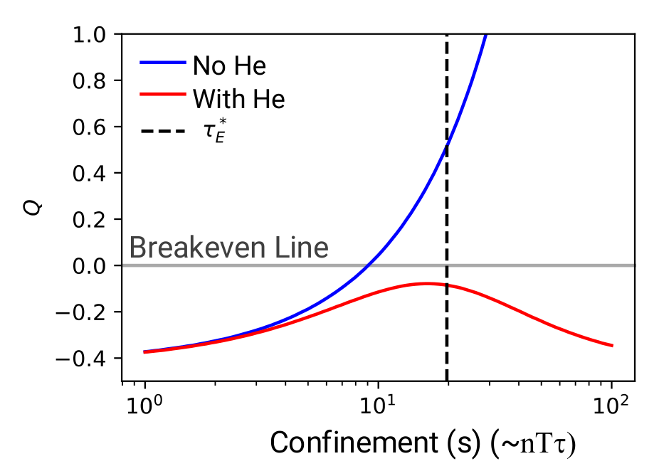

I. E. Ochs, E. J. Kolmes, and N. J. Fisch, _Preventing Ash from Poisoning Proton-Boron 11 Fusion Plasmas,_
Physics of Plasmas **32**, 052506 (2025).

### Our solution: multi-chamber centrifugal fusion

**chamber**

- Helium is extracted from heat exchange
chamber using **waves**

- Result: helium removed from the fusion
region, but energy captured

1. Start with engineering simplicity

2. Exploit unique properties of pB11

a. Disparate reactant masses and charges
b. Disparate byproduct charge/mass ratio

3. Deal with unique features

a. Alpha particles need prompt removal
b. Boron need not be hot
c. Energy output in radiation not neutrons
d. Heat loss by energetic electrons

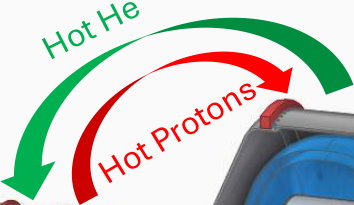

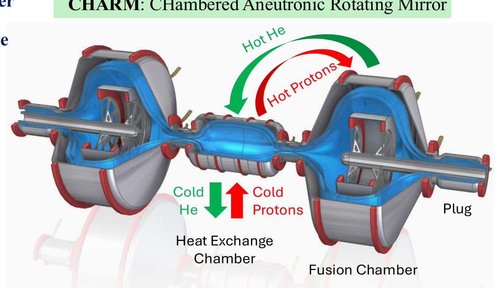

For Vision 2021, we began with questions

1. Is such a reactor realizable for feasible device parameters?
2. Can centrifugal mirror offer offer sufficient differential confinement?
3. Can rotation be maintained without intolerable voltage drops at walls?
4. Is wave-induced diffusion in the second chamber necessary?
5. Can synchrotron radiation be made tolerable?
6. Can selective ponderomotive barriers regulate ion traffic?
7. Can we make passive ponderomotive barriers?
8. Are one-way walls cost-efficient?
9. Can rotation energy be recovered efficiently?

### **_Derisking the Novel Underlying Physics_**

_**Boron Cell**_

_Boron centrifugally confined_
_Electrons electrostatically confined_

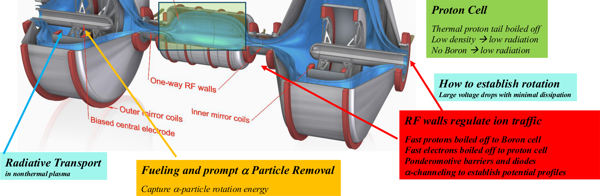

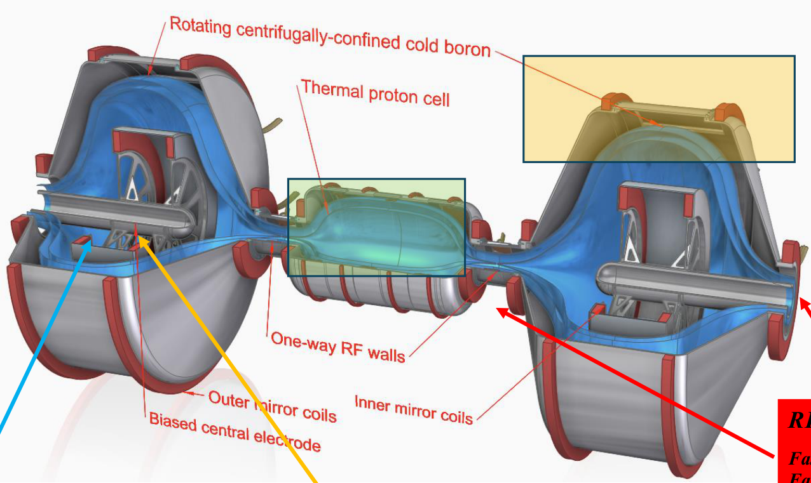

## Peer-Reviewed Publications under ARPA-E Support

1. I. E. Ochs, E. J. Kolmes, M. E. Mlodik, T. Rubin, and N. J. Fisch, _Improving the Feasibility of Economical Proton-Boron 11 Fusion via Alpha Channeling with a Hybrid Fast + Thermal Proton Scheme_,
Physical Review E **106**, 055215 (2022).
2. E. J. Kolmes, I. E. Ochs, and N. J. Fisch, _Wave-Supported Hybrid Beam-Thermal pB11 Fusion_, Physics of Plasmas **29**, 110701 (2022).
3. M. E. Mlodik, V. R. Munirov, T. Rubin, and N. J. Fisch, _Sensitivity of synchrotron radiation to the superthermal electron population in mildly relativistic plasma,_ Physics of Plasmas **30**, 043301 (2023).
4. T. Rubin, J. M. Rax, and N. J. Fisch, _Magnetostatic Ponderomotive Potential in Rotating Plasma_, Physics of Plasmas **30**, 052501 (2023).
5. E. J. Kolmes, M. E. Mlodik, and N. J. Fisch, _Extending the Single-Fluid Solvability Conditions for More General Plasma Systems_, Physics Letters A **477**, 128882 (2023).
6. I. E. Ochs, V. R. Munirov, and N. J. Fisch, _Confinement Time and Ambipolar Potential in a Relativistic Mirror-Confined Plasma_, Physics of Plasmas **30**, 052508 (2023).
7. V. R. Munirov and N. J. Fisch, _Suppression of Bremsstrahlung losses from relativistic plasma with energy cutoff_, Physical Review E **107**, 065205 (2023).
8. J. M. Rax, R. Gueroult, and N. J. Fisch, _DC electric fields generation and distribution in magnetized plasmas_, Physics of Plasmas 30, 072509 (2023).
9. I. E. Ochs and N. J. Fisch, _The Critical Role of Potential Surfaces in Static Ponderomotive End Plugs,_ Physical Review E 108, 065210 (2023).
10. T. Rubin, I. E. Ochs, and N. J. Fisch, _Guiding center motion for particles in a ponderomotive magnetostatic end plug_, Journal of Plasma Physics **89**, 905890615 (2023).
11. J. M. Rax, R. Gueroult, and N. J. Fisch, _Rotating Alfvén waves in rotating plasmas,_ Journal of Plasma Physics **89**, 905890613 (2023).
12. I. E. Ochs and N. J. Fisch, _Lowering the reactor breakeven requirements for proton-Boron 11 fusion_, Physics of Plasmas **31**, 012503 (2024).
13. E. J. Kolmes, I. E. Ochs, and N. J. Fisch, _Loss-Cone Stabilization in Rotating Mirrors: Thresholds and Thermodynamics_, Journal of Plasma Physics **90**, 905900203 (2024).
14. E. J. Kolmes, I. E. Ochs, and N. J. Fisch, _Massive, Long-Lived Electrostatic Potentials in a Rotating Mirror Plasma_, Nature Comm. **15**, 4302 (2024).
15. E. J. Kolmes, I. E. Ochs, and N. J. Fisch, _Upper and Lower Bounds on Phase-Space Rearrangements,_ Physics of Plasmas **31**, 042109 (2024).
16. I. E. Ochs, _When do waves drive plasma flows?_ Physics of Plasmas **31**, 042116 (2024).
17. T. Rubin, I. E. Ochs, and N. J. Fisch, _Flowing plasma rearrangement in the presence of static perturbing fields_, Physics of Plasmas **31**, 082109 (2024).
18. I. E. Ochs, M. E. Mlodik, and N. J. Fisch, _Electron Tail Suppression and Effective Collisionality due to Synchrotron Emission and Absorption in Mildly Relativistic Plasmas,_
Physics of Plasmas **31**, 083303 (2024).
19. E. J. Kolmes and N. J. Fisch, _Coriolis Forces Modify Ponderomotive Potentials,_ Physics of Plasmas **31**, 112107 (2024).
20. M. E. Mlodik and N. J. Fisch, _Curious Cross-Field Transport Effects in Multi-ion, Magnetized Plasma,_ Physics of Plasmas **31**, 112303 (2024).
21. R. Gueroult, S. K. P. Tripathi, F. Gaboriau, T. R. Look, and N. J. Fisch, _Plasma potential shaping using end-electrodes in the Large Plasma Device_, J. Plasma Physics **90**, 905900603 (2024).
22. H. Qin, E. J. Kolmes, M. Updike, N. Bohlsen, and N. J. Fisch, _Gromov ground state in phase space engineering for fusion energy_, Phys. Rev. E **111**, 025205 (2025).
23. J.-M. Rax, E. J. Kolmes, and N. J. Fisch, _Efficiency and Physical Limitations of Adiabatic Direct Energy Conversion in Axisymmetric Fields_, PRX Energy 4, 013007 (2025).
24. I. E. Ochs, E. J. Kolmes, and N. J. Fisch, _Preventing ash from poisoning proton–boron 11 fusion plasmas_, Physics of Plasmas **32**, 052506 (2025).
25. M. E. Mlodik, E. J. Kolmes, and N. J. Fisch, _Drift-energy replacement effect in multi-ion magnetized plasma_, Physical Review Letters **134**, 205101 (2025).
26. A. Mesa Dame, I. E. Ochs, and N. J. Fisch, _Energy spectrum of lost alpha particles in magnetic mirror confinement_, Physics Letters A **552**, 130631 (2025).
27. T. Rubin and N. J. Fisch, _Ponderomotive barriers in rotating mirror devices using static fields_, Physics of Plasmas **32**, 062104 (2025).
28. I. E. Ochs, _Bounce-Averaged Theory In Arbitrary Multi-Well Plasmas: Solution Domains and the Graph Structure of their Connections_, Journal of Plasma Physics, In Press (2025).
29. E.J. Kolmes, I. E. Ochs, and N. J. Fisch. _Ion Mix Can Invert Centrifugal Traps_, arXiv:2504.18634, submitted to Physical Review Letters (2025).

# Pivot to Pale Blue Fusion

T2M encouraged by ARPA-E; supported by Princeton University

Objective: Rapid sprint to pB11 fusion

Start where we left off. What did we derisk? What is left to derisk?

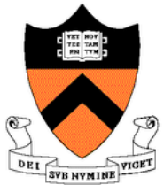

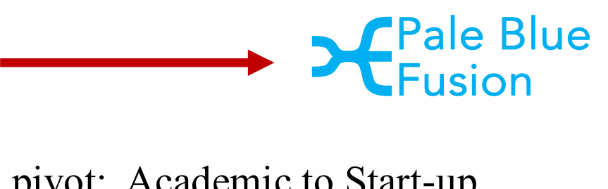

1. Concept captured in 29 publications; also invited talks
2. New theoretical constructs, mechanisms, and inventions
3. Some key risks retired
4. Patent Applications; Large moat protecting concept IP
5. Portfolio of novel computational tools
6. Team with history of working together

Among the new theoretical constructs, mechanisms, and inventions
Means of regulating particle traffic
Electrodeless rotation of plasma
Magnetostatic ponderomotive barrier in rotating plasma
Rotation energy replacement effect
Synchrotron radiation mitigation in nonthermal plasma
Alpha-channeling and ejection of alpha particles

Approvals and support from Princeton University in place with plan to incorporate as Pale Blue Fusion

Website
to be
launched
soon

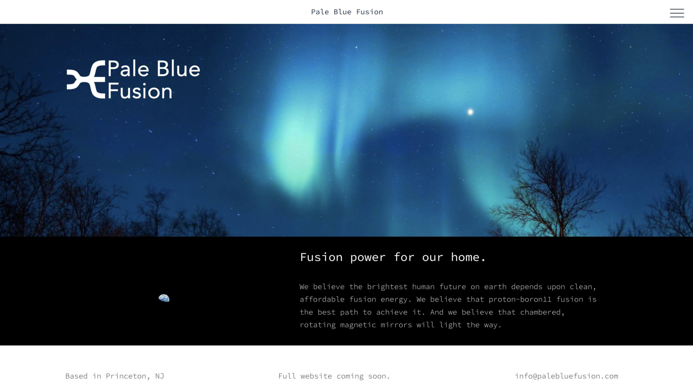

## Patent Applications

1. Nonthermal Proton-Boron11 Fusion with Separated Reactant Regions **,**

Nathaniel Fisch, Ian Ochs, Elijah Kolmes, Mikhail Mlodik, and Tal Rubin,
US Patent Application 19/083,790, filed March 19, 2025.

2. Enhanced Particle Confinement with Positive and Negative Ponderomotive Potentials,

Tal Rubin, Jean-Marcel Rax, Nathaniel Fisch, Ian Ochs, and Elijah Kolmes,
US Patent Application 19/084,168, filed March 19, 2025.

3. Systems and Methods for Producing Ultra-high DC Voltages in Open Field Line Traps with

Minimal Dissipation and Minimal Damage,
Nathaniel Fisch, Elijah Kolmes, Mikhail Mlodik, Ian Ochs, Jean-Marcel Rax, and Tal Rubin,
US Patent Application 19/175,473; filed April 10, 2025.

4. Method and Apparatus for Differential Confinement, Mixing, and Demixing of Plasma in a

Rotating Trap and Leading to Improved End Plugs,
Elijah Kolmes, Ian Ochs, and Nathaniel Fisch,
US Provisional Patent Application 63/794,470; filed April 25, 2025.

Example: Ponderomotive Barriers in Rotating Plasma using Passive Elements

T. Rubin, I. E. Ochs, and N. J. Fisch, _Flowing plasma rearrangement in the presence of static perturbing fields_,
Phys. Plasmas (2024). **Editor's Pick**
T. Rubin, JM Rax, N. Fisch, I. Ochs, and E. Kolmes, _Enhanced Particle Confinement with Positive and Negative Ponderomotive Potentials_,

US Patent Application 19/084,168, filed March 19, 2025.

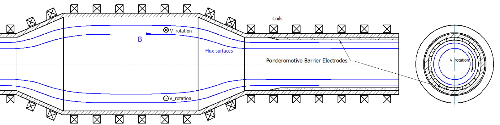

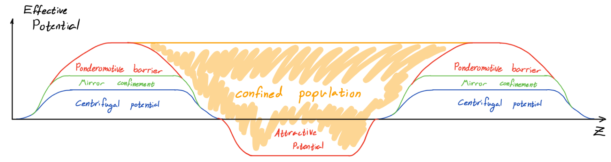

### Example: Novel, Mixed-Ion, Centrifugal Endplugs in Rotating Plasma

  - Ion mix affects emergent ambipolar electric fields

  - This effect can be used to construct centrifugal
_barriers_, in which a given ion species can be
excluded from a high-rotation region

  - Useful for improved (differential) confinement

    - We can **double the centrifugal confinement**
without increasing the rotation.

E. J. Kolmes, I. E. Ochs, and N. J. Fisch, _Ion Mix Can Invert Centrifugal Traps_,
arXiv:2504.18634 under review at Physical Review Letters (2025).

E. J. Kolmes, I. E. Ochs, and N. J. Fisch, _Method and Apparatus for Differential_
_Confinement, Mixing, and Demixing of Plasma in a Rotating Trap and Leading to_
_Improved End Plugs_, US Provisional Patent Application 63/794,470.

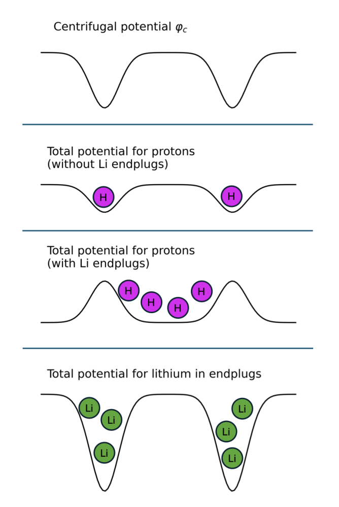

## Example: Drift Energy Replacement Effect B [10] He [4]

If no charge moved, 𝑱∙𝑬≅0

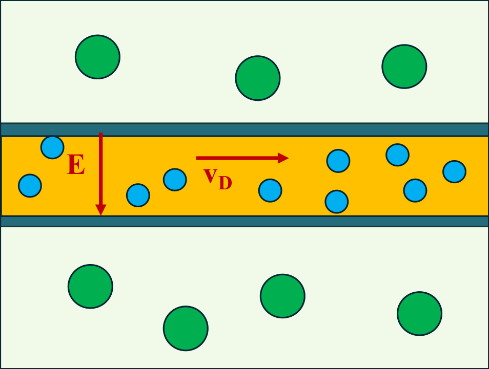
### **B**

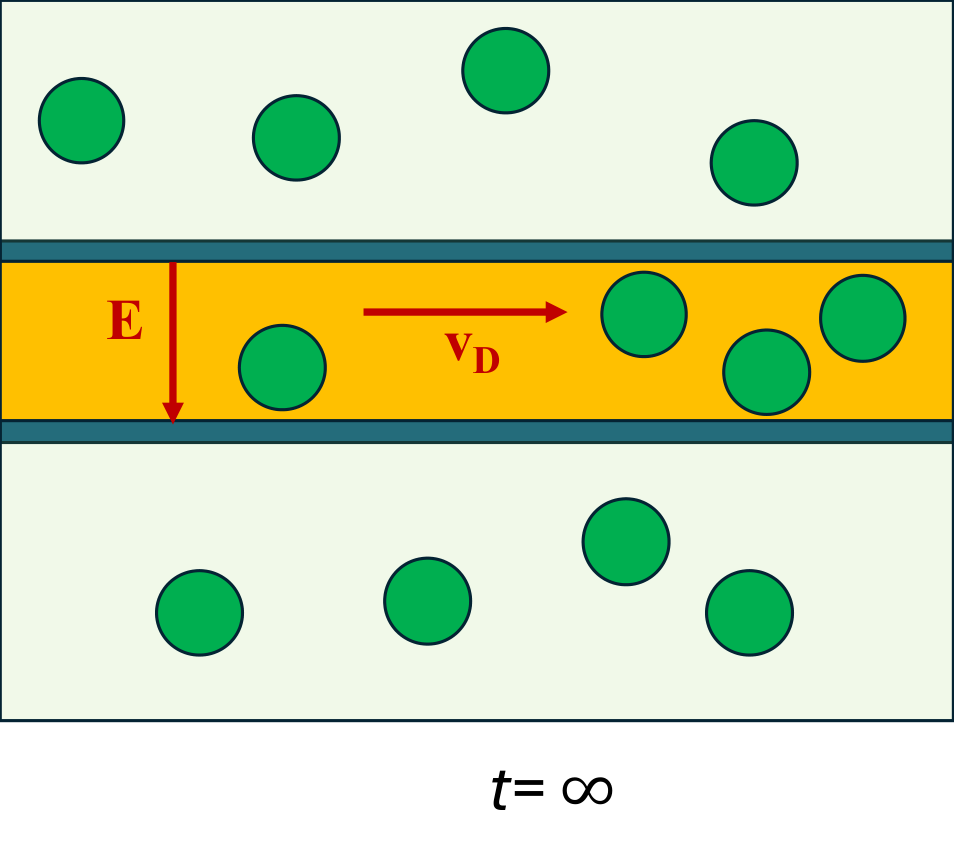

M. E. Mlodik, E. J. Kolmes, and N. J. Fisch, _Drift-energy replacement effect in multi-ion magnetized plasma_, PRL **134**, 205101 (2025).

### New problems required new computational new tools

#### Codes: (PB) [2] : Proton-Boron Power Balance

- 0D power balance code incorporating up-to-date fusion cross
sections, reduced kinetic effects, relativistic collisions and
bremsstrahlung

- Includes self-consistent helium poisoning

- Good for:

   - Quick approximate profiling of optimal reactor regimes

   - Evaluating the potential upside of various reactor
improvements

     - DEC, efficient heating, fat ion tails, etc

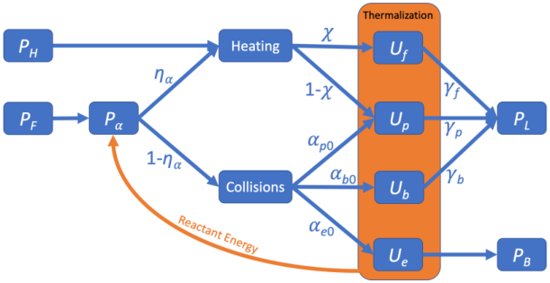

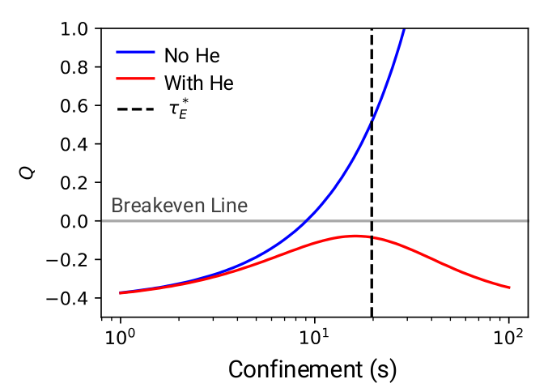

I. E. Ochs, E. J. Kolmes, M. E. Mlodik, T. Rubin, and N. J. Fisch, _Improving the Feasibility of Economical Proton-Boron 11 Fusion via Alpha Channeling with_

_a Hybrid Fast + Thermal Proton Scheme,_ Physical Review E, **106**, 055215 (2022).
E. J. Kolmes, I. E. Ochs, and N. J. Fisch, _Wave-Supported Hybrid Beam-Thermal pB11 Fusion_, Physics of Plasmas **29**, 110701 (2022).
I. E. Ochs and N. J. Fisch, _Lowering the reactor breakeven requirements for proton-Boron 11 fusion_, Physics of Plasmas **31**, 012503 (2024).
I. E. Ochs, E. J. Kolmes, and N. J. Fisch, _Preventing ash from poisoning proton–boron 11 fusion plasmas_, Physics of Plasmas **32**, 052506 (2025).

### Codes: S [5], a massively-scalable structure-preserving PIC code

   - We must accurately model wave-particle interactions in rapidly-rotating collisionless plasmas

   - S [5] is a new particle-in-cell code, so named because of its powerful properties:

      - **Structure-preserving** : the full hierarchy of Poincaré invariants in phase space is exactly preserved

      - **Symplectic** : charge conservation (via a Gauss’s Law momentum map) is also exactly preserved

      - **Scalable** : S5 reliance on PETSc and the DOLFINx finite element library afford massive scalability

      - **Simplicial:** compatible with cubical and simplicial (tetrahedral) meshes in 1D, 2D and 3D

      - **Spectrally-tunable:** differential operators can be optimized for accuracy at chosen frequencies

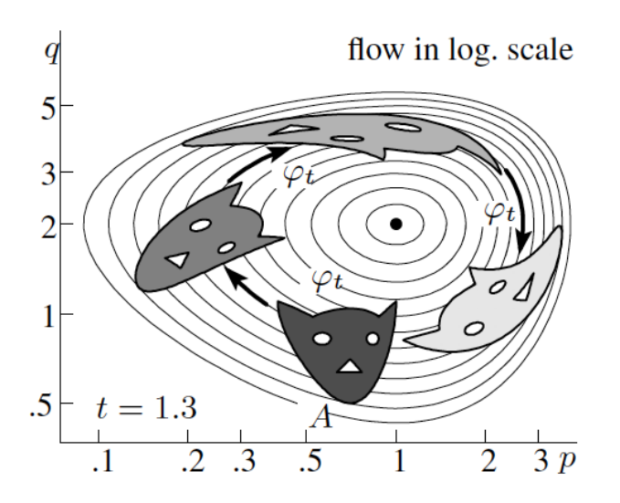

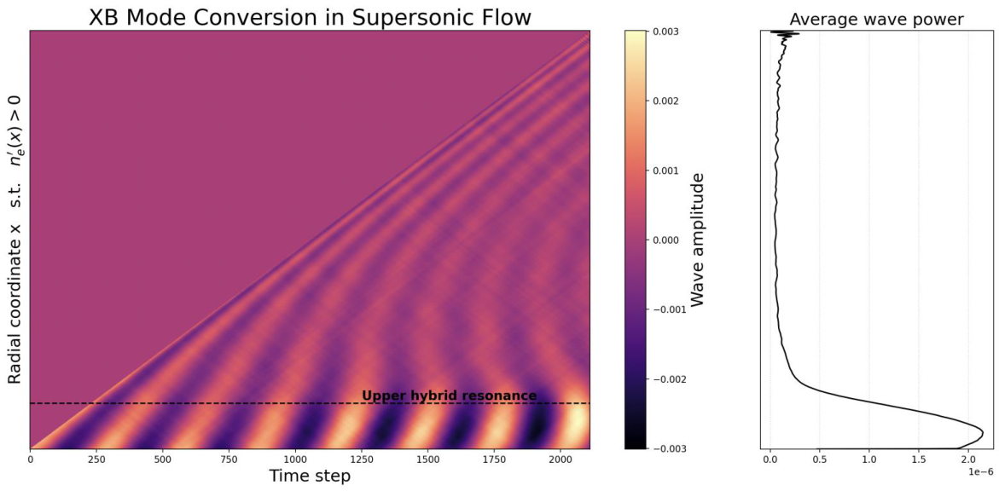

Codes: R [3] FP: Radiative Reabsorption in Relativistic Fokker-Planck

cone physics

 - R [3] FP captures the kinetic interplay of different processes
in ways (PB) [2] cannot

I. E. Ochs, _Bounce-Averaged Theory In Arbitrary Multi-Well Plasmas: Solution Domains and the Graph_

_Structure of their Connections_, Journal of Plasma Physics, In Press (2025).

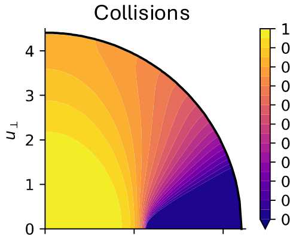

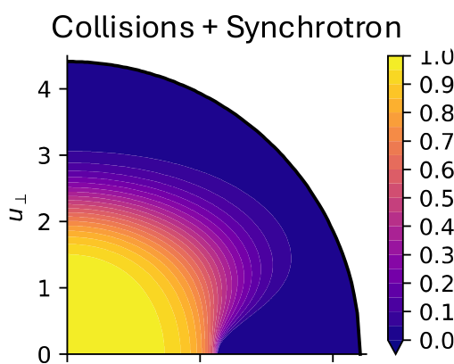

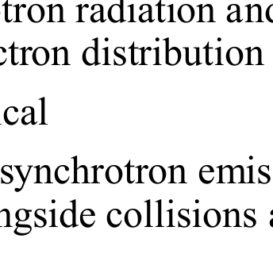

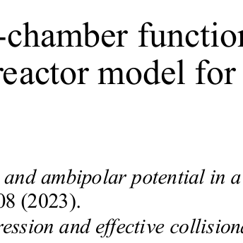

### Also: MITNS: Multiple Ion Transport Numerical Solver

- Treats _N_ -species, magnetized
particle, momentum, and heat
transport.

- Describes coupled dynamics of
the different ion species.

- Particularly useful for
uncovering fundamental, new
effects governing pB11 plasma.

E. J. Kolmes, I. E. Ochs, and N. J. Fisch, _MITNS: Multiple-Ion Transport Numerical Solver for Magnetized Plasmas_, Computer Physics Communications **258**, 107511 (2021).
M. E. Mlodik, E. J. Kolmes, I. E. Ochs, and N. J. Fisch, _Heat pump via charge incompressibility in a collisional magnetized multi-ion plasma_, Phys. Rev. E **102**, 013212 (2020).
M. E. Mlodik, E. J. Kolmes, and N. J. Fisch, _Drift-Energy Replacement Effect in Multi-ion Magnetized Plasma_, Phys. Rev. Lett. 134, 205101 (2025).

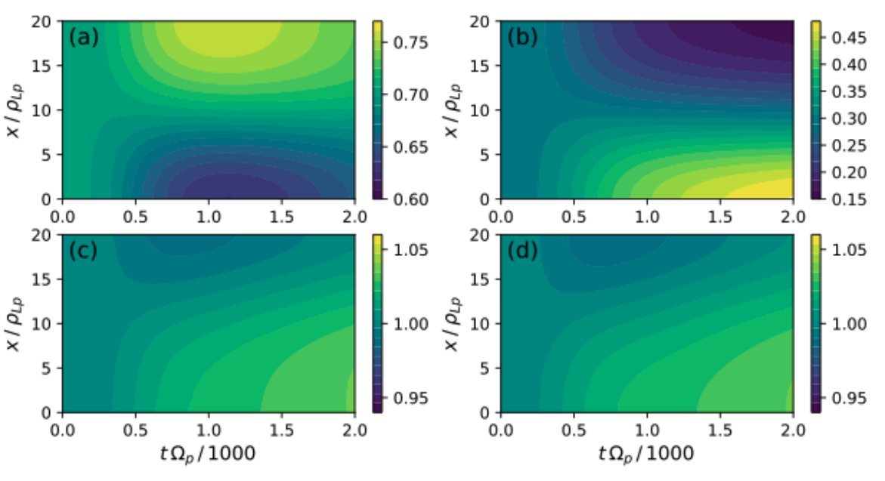

# The Team

Prof. Nat Fisch Associate Director for Academic Affairs, Princeton Plasma Physics Laboratory (1993-2024)
_Professor of Astrophysical Sciences_ Director of Program in Plasma Physics, Princeton University (1991-2024)
2005 American Physical Society Maxwell Prize, 2015 European Physical Society Alfvén Prize

Dr. Ian Ochs *22 Thesis: _Controlling and Exploiting Perpendicular Rotation in Magnetized Plasmas_
_Associate Research Scholar_ Harvard University BS 2015, Jacobus Fellow, DOE Fusion Energy Postdoctoral Fellow at Princeton University
2023 APS Division of Plasma Physics Outstanding Thesis Award

Dr. Elijah Kolmes *22 Thesis: _Particle, Charge, and Energy Rearrangement in Rotating Magnetized Plasma_
_Associate Research Scholar_ Princeton University BS 2015, DOE Fusion Energy Postdoctoral Fellow at Princeton University
Invited Talk APS 2023: _Upper and Lower Bounds on Phase-Space Rearrangements_

Dr. Mikhail Mlodik *23 Thesis: _Cross-Field Transport in Magnetized, Multi-ion Plasma_
_Postdoctoral Research Associate_ Nizhny Novgorod State University BS 2016, Postdoctoral Researcher at Princeton University
Invited Talk APS 2023: Curious Cross-Field Transport Effects in Multi-ion, Magnetized Plasmas

Tal Rubin Graduate student in astrophysical sciences at Princeton University
_Graduate Student_ Technion-Israel Institute of Technology MS in Mechanical Engineering 2014
Invited Talk APS 2024: _Ponderomotive barriers in rotating mirror devices using static fields_

Dr. Alex Glasser *22 Thesis: _Gauge Structure in Algorithms for Plasma Physics_ (Advisor: Professor Hong Qin)
_Associate Research Scholar_ Harvard BA 2006, Procter Honorific Fellow, DOE Fusion Energy Postdoctoral Fellow at PPPL
Experience prior to Ph.D.: Led portfolio risk management for a hedge fund startup

Summary: Where we stand now

- Questions posed and answered:
1. Individual components suggest feasibility of centrifugal, multi-cell pB11 reactor
2. Alpha handling is critical, and accomplishable in heat-exchange chamber
3. Wave-induced diffusion in the second chamber removes alpha particles promptly
4. Synchrotron radiation is manageable through reabsorption
5. Centrifugal drift energy is recoverable
6. Voltage drops can be minimized near walls
7. Selective ponderomotive walls can regulate ion traffic in rotating plasma
8. One-way walls have high energy cost, so use is situational
9. Multi-ion potential methods possibly double the proton confinement

- Now we need to see if these components work together **self-consistently**

- Further research facilitated by portfolio of novel, specialized computational tools

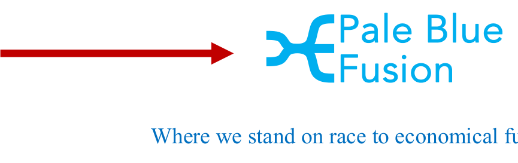
### T2M:

Starting Point for Pale Blue Fusion

Novel Design for pB11
New tricks for _**selective**_ confinement
Protected IP: 4 Patent Applications
Publications: 29 Peer-reviewed
Specialized Numerical Codes
Team with history of working well together

To reach goals quickly, we now seek

1. Recruitment
2. Partnerships
3. Collaborations
4. Investment

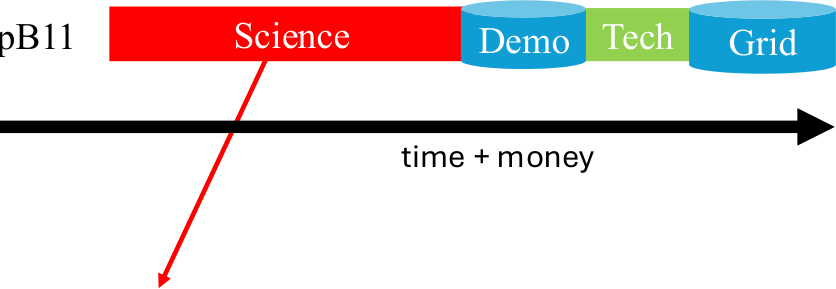

Derisk the **hardest problems** as **cheaply and quickly** as possible

Develop an **in silico** power-positive reactor

Validate experimentally key innovations

DT

