[Fusion Engineering and Design 214 (2025) 114868](https://doi.org/10.1016/j.fusengdes.2025.114868)

Contents lists available at [ScienceDirect](https://www.elsevier.com/locate/fusengdes)

# Fusion Engineering and Design

journal homepage: [www.elsevier.com/locate/fusengdes](https://www.elsevier.com/locate/fusengdes)

## Stellaris: A high-field quasi-isodynamic stellarator for a prototypical fusion power plant

J. Lion [a], [∗], J.-C. Anglès a, L. Bonauer a, A. Bañón Navarro b, S.A. Cadena Ceron [a],
R. Davies [c], M. Drevlak [c], N. Foppiani [a], J. Geiger [c], A. Goodman [c], W. Guo [a], E. Guiraud [a],
F. Hernández [f], S. Henneberg [c], R. Herrero [a], C. Hintze [a], H. Höchter [a], J. Jelonnek [f][,][g],
F. Jenko [b], R. Jorge [e], M. Kaiser [a], M. Kubie [a], E. Lascas Neto [d], H. Laqua [c], M. Leoni [a],
J.F. Lobsien [a], V. Maurin [a], A. Merlo [a], D. Middleton-Gear [a], M. Pascu [a], G.G. Plunk [c],
N. Riva [a], M. Savtchouk [a], F. Sciortino [a], J. Schilling [a], J. Shimwell [a], A. Di Siena [b],
R. Slade [a], T. Stange [c], T.N. Todd [a], L. Wegener [a], F. Wilms [b], P. Xanthopoulos [c], M. Zheng [a]

a _Proxima_ _Fusion_ _GmbH,_ _Flößergasse_ _2,_ _Munich,_ _81369,_ _Germany_
b _Max–Planck-Institute_ _for_ _Plasmaphysics,_ _Boltzmannstr._ _2,_ _Garching,_ _85748,_ _Germany_
c _Max–Planck-Institute_ _for_ _Plasmaphysics,_ _Wendelsteinstr._ _1,_ _Greifswald,_ _17491,_ _Germany_
d _Instituto_ _de_ _Plasmas_ _e_ _Fusão_ _Nuclear,_ _Instituto_ _Superior_ _Técnico,_ _Av._ _Rovisco_ _Pais_ _1,_ _Lisboa,_ _1049-001,_ _Portugal_
e _Department_ _of_ _Physics,_ _University_ _of_ _Wisconsin-Madison,_ _150_ _University_ _Ave_ _2320,_ _Madison,_ _53706,_ _WI,_ _USA_
f _Institute_ _for_ _Neutron_ _Physics_ _and_ _Reactor_ _Technology_ _(INR),_ _Karlsruhe_ _Institute_ _of_ _Technology_ _(KIT),_ _Kaiserstr._ _12,_ _Karlsruhe,_ _76131,_ _Germany_
g _Institute_ _for_ _Pulsed_ _Power_ _and_ _Microwave_ _Technology_ _(IHM),_ _Karlsruhe_ _Institute_ _of_ _Technology_ _(KIT),_ _Kaiserstr._ _12,_ _Karlsruhe,_ _76131,_ _Germany_

A R T I C L E I N F O

_Keywords:_
Stellarators
Fusion power plants
Stellarator reactors
Fusion reactor study
Stellarator optimization
Fusion technology
Sector splitting

**1.** **Introduction**

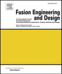

A B S T R A C T

Magnetic confinement fusion research has so far prioritized the tokamak concept, which presents greater
design simplicity at the cost of control complexity in comparison to stellarators. Recent progress on hightemperature superconductors (HTS) has enabled a new generation of high-field tokamaks with more compact
designs. However, the presence of large magnetic fields implies correspondingly large plasma currents, raising
challenges regarding plasma stability. Meanwhile, key milestones have been reached in recent years by
Wendelstein 7-X, the world’s most advanced stellarator, and breakthroughs in computational optimization
have enabled radically improved stellarator designs. In this paper, we present a concept for a new class of
quasi-isodynamic (QI) stellarators leveraging HTS technology to overcome well-known challenges of a tokamak.
This class of QI-HTS stellarators, labeled Stellaris, is shown to achieve an extensive set of desirable properties
for reactor candidates simultaneously for the first time, offering a compelling path toward commercially
viable fusion energy. We summarize a comprehensive reactor study, ranging from optimization of the plasma
confinement region to first wall cooling, divertor considerations, blanket design, magnet quench safety,
support structures, and remote maintenance solutions. Our results demonstrate that a coherent set of trade-offs
between physics and engineering constraints can lead to a compelling stellarator design, suited for power plant
applications. We anticipate that this work will motivate greater focus on QI stellarators, in both publicly and
privately funded research.

production [6], water desalination [7], and direct carbon capture from
the atmosphere [8].

Decarbonization of the energy sector plays a key role in addressing
climate change [1,2]. New technologies - including artificial intelligence, with its explosive energy consumption needs - further heighten
the need for carbon-free energy sources on an accelerated timeline [3].
Alongside the need for clean electricity, there is growing energy demand for carbon-free heat generation [4], hydrogen [5] and ammonia

∗ Corresponding author.

_E-mail_ _address:_ [jlion@proximafusion.com](mailto:jlion@proximafusion.com) (J. Lion).

Fusion stands as a major competitor in the race to supply a significant fraction of the world’s future clean energy demands [9]. Economic
studies for magnetic confinement extrapolate overnight capacity costs
for future fusion power plants in the range of 1–10 $/W [10–13]. Resulting cost estimates for fusion energy range between 20–100 $/MWh [14,

[https://doi.org/10.1016/j.fusengdes.2025.114868](https://doi.org/10.1016/j.fusengdes.2025.114868)
Received 2 September 2024; Received in revised form 20 January 2025; Accepted 6 February 2025

Available online 26 February 2025
[0920-3796/© 2025 The Authors. Published by Elsevier B.V. This is an open access article under the CC BY-NC license ( http://creativecommons.org/licenses/by-](http://creativecommons.org/licenses/by-nc/4.0/)
[nc/4.0/ ).](http://creativecommons.org/licenses/by-nc/4.0/)

15]. As more detailed cost estimates become available alongside greater
maturity of the fusion ecosystem, there are indications that the price
of fusion energy will be competitive even relatively early in fusion’s
technological development [16]. The fuel for fusion is not subject to
resource scarcity, as the reactants, deuterium and lithium-6 - as well
as neutron multipliers such as Pb, Be, Ti, Mn, or Zr - are abundantly
available on Earth, capable of providing virtually limitless resources
for future generations. The promise of fusion technology is therefore of
the highest relevance for providing human civilization with sustainable
energy in the coming centuries.

Under this premise, fusion is being globally pursued through various
concepts. Among the magnetic confinement approaches, large-scale
projects aiming to close the gap toward a fusion power plant include
(but are not limited to) the international research tokamak ITER [17];
the STEP spherical tokamak program [18] in the UK; the high-field
conventional tokamak concept of SPARC [19] in the United States, and
CFETR [20] in China. Various demonstration device conceptual studies
are additionally under investigation [21,22].

While tokamaks have historically been viewed as the clearest path
to a fusion power plant, they are prone to plasma disruptions [23],
which pose a significant challenge for commercially viable operation.
Extensive ongoing scientific efforts aim to solve this issue through prediction [24–26] and mitigation methods [27–30], but there have been
no experimental demonstrations that would indicate reliable usage in
a power plant setting.

The stellarator is a similar technology to the tokamak, with comparable energy confinement properties [31,32]. However, stellarators
with no net toroidal current in the plasma avoid problematic currentdriven plasma disruptions by design. These stellarators have the ability
to run in steady-state, intrinsically reducing thermal and mechanical
component fatigue and eliminating the need for an expensive plasma
current drive system. Although in principle tokamaks can also operate
in long pulses or even in steady-state, achieving the required steadystate current drive is both technologically challenging and economically demanding, requiring high electrical efficiencies. The absence of
current-driven disruptions in current-free stellarators greatly reduces
the need for active control of the plasma—circumventing the need for
in-vessel coils, which present challenges in environments subjected to
high neutron fluxes. Other advantages of stellarators over tokamaks
include the absence of a Greenwald-like density limit [33–35], allowing
operation at significantly higher densities. This is advantageous because
fusion power scales favorably with the square of the fuel density. Furthermore, stellarators do not exhibit the unfavorable ‘Eich-scaling’ [36]
of heat exhaust deposition width on divertor plates seen in tokamaks.
On the contrary, stellarators have shown large wetted areas on divertor
plates [37–40] and good access to almost complete ‘detachment’ [41–
43], an operation scenario that eases the heat exhaust challenge on the
plasma-facing components.

Among the most prominently discussed options, the quasi-isodynamic (QI) stellarator [44] is particularly promising for reactor applications due to its intrinsically minimized self-induced currents, like the
bootstrap current [45,46]. Optimized stellarator concepts without QI
symmetry can, in general, feature significant toroidal plasma currents.
Such concepts present a strong dependency of plasma equilibrium
properties on plasma profile shapes, are potentially subject to currentdriven disruptions, and - since their bootstrap current does not vanish

- likely do not have the ability to use the island divertor concept as
an exhaust concept without employing further (unexplored) control
systems. Among the investigated stellarator options, the modular, lowshear, QI stellarator holds the highest technological readiness level,
following exploration in Wendelstein 7-AS (W7-AS) [47] and the more
recent Wendelstein 7-X (W7-X) stellarator [48–50].

W7-X went into operation in 2015, and reached its full design
specifications only recently, in 2022. Within a few years, W7-X experiments have demonstrated the reduction of neoclassical transport to a
level at which turbulence is the major driver for heat transport in the

**Table** **1**
Comparison of the design concept presented in this paper (Stellaris) against the two
most recent Wendelstein stellarators. W7-AS values are extracted from [47]. W7-X
values are taken from [31].

W7-AS W7-X Stellaris

Minor radius [m] 0.18 0.5 1.3
Major radius [m] 2.0 5.5 12.7
Av. magnetic field strength [T] 2.6 2.5 9.0
Av. power density [MW∕m [3] ] 10 0.3 6.1
Peak ion temperature [keV] 1.7 3.4 15
Peak electron density [10 [20] m [−3] ] 4 2 5
Peak triple product [keV s m [−][3] ] 4 _._ 6 × 10 [18] 5 _._ 1 × 10 [19] 12 _._ 4 × 10 [21]

plasma [51]. It is difficult to overstate the importance of this achievement: W7-X’s results demonstrate that optimized stellarators can now
be designed to achieve neoclassical transport levels similar to those
of tokamaks. Therefore, optimized stellarators are now fundamentally
limited by the same physical (turbulent) phenomena that also constrain
tokamaks, while maintaining the critical steady-state capability and
stability advantages of stellarators.

Historically, stellarator reactor concept studies such as the ARIES-CS
study [52], the extrapolation of LHD to heliotron-based fusion reactors [53,54], or the HELIAS studies [55–60] have provided important
platforms for the fusion community to discuss the extrapolation of
physics and the validity of concepts from experiment to reactor scale.
However, despite successful operation of W7-X [50,51,61,62], one cannot merely scale W7-X to an economically attractive reactor size, due to
a number of known limitations including high fusion-born fast particle
losses [63], insufficient plasma-coil distance to fit a neutron shield
and blanket at moderate machine sizes [12,64], and high turbulent
transport levels, particularly ITG transport [65,66]. Moreover, W7-X’s
usage of NbTi as a superconductor [67] does not easily scale to the
magnetic field strength required for a reactor.

In recent years, the community has proposed various solutions
to address these challenges. For example, fast particle losses can be
mitigated through precise numerical optimization techniques [68–72].
The issue of insufficient plasma-coil distance has been tackled with
new cost functions for stellarator optimization [73] and more compact blanket designs [10]. Turbulent transport suppression has been
demonstrated in the presence of strong density gradients [74–77] as
well as in plasma geometry optimization efforts [71,78–81]. Additionally, advances in high-temperature superconductors (HTS) have
paved the way for achieving higher magnetic field strengths in modern
devices [82–85]. Despite this, there is currently no comprehensive
stellarator reactor concept study that simultaneously integrates these
developments into a single, coherent design. Therefore, it remains
unclear whether these advancements can be effectively combined to
create a stellarator that is viable for commercial power plants while
remaining feasible from an engineering perspective.

In this paper, we aim to bridge that existing gap by presenting
a stellarator configuration optimized for all essential reactor aspects,
including an engineering feasibility study. We argue that the configuration and concept introduced here offer a promising pathway to a
D-T stellarator power plant. This study extends recent breakthroughs in
the numerical optimization of QI stellarator plasma shapes, specifically
the ‘SQuiD’ configurations [70,71], toward a viable stellarator fusion
reactor.

The design introduced here represents the first of a new class of QI
stellarator designs harnessing the high-field potential of HTS magnets.
In this paper, the first conceptual design within this class is denoted as
Stellaris.

Relevant machine parameters of Stellaris are highlighted in Table 1,
providing a comparison to the two most recent Wendelstein stellarators.
Note that not all peak values displayed in this table were achieved
in the same experiment for each device—peak density values were
achieved independently of the peak temperatures. Stellaris represents

Key parameters of Stellaris, the high-field stellarator fusion power plant concept presented in this paper. ECRD stands for Electron cyclotron resonance heating.

| Variable | Value |
|---|---|
| Major plasma radius [m] | 12 |
| Minor plasma radius [m] | 1.5 |
| Plasma aspect ratio [1] | 9.9 |
| Plasma volume [m³] | 448 |
| Plasma surface area [m²] | 940 |
| Rotational transform $\iota/2\pi$ (edge) [?] | 0.86 |
| Peak magnetic field on-axis (HTS) [T] | 14.4 |
| Peak coil current (single coil) [MA] | 15.4 |
| Conduction power to coils [MW] | 111 |
| Stored magnetic energy [GJ] | 111 |
| Electron cyclotron resonance (ECRD) power [MW] | 50 |
| Peak fusion power [MW] | ~2700 |
| Peak thermal power (after blanket multiplier) [MW] | ~3300 |
| Peak electric power [MW] | ~1000 |
| Peak net/on wall load [MW m⁻²] | 4.05 |

## 2. Concept and analysis

In this section, we provide an overview of the Stellaris concept and proceed through different aspects of analysis, ranging from physics to engineering properties.

### 2.1. Overview

Stellaris is a quasi-isodynamic stellarator with modular coils, a minimized toroidal plasma current, a magnetic island chain in the edge allowing for an island divertor, and HTS superconducting magnets. The device closely follows the W7-X stellarator [36], with the addition of multiple improvements necessary for a reactor candidate. The main features are: old plasma rotational symmetry (number of field periods) in addition to 'stellarator symmetry', an internal discrete flip-mirror symmetry [86].

The underlying plasma configuration of Stellaris belongs to the class of recently proposed SQuID-configurations [71], adapted to meet the requirements of a power plant by a natural optimization for larger mid-plasma distances. Key parameters of the device are displayed in Table 2. The major radius is approximately 12.7 m while the minor radius is 1.5 m. By comparison, ITER has a minor radius of about 2.0 m [87] and the ARC tokamak concept approximately 1.1 m [19]. We adopt high-temperature superconductors for the modular coils, and remote maintenance is enabled through the splitting of modular sectors. The device is sized to provide about 2700 MW of peak fusion power. Considering the power multiplication incurred in the blanket (Section 2.3), Stellaris is predicted to produce approximately 3150 MW of thermal power and (assuming a single-element conversion efficiency of 1/3) nearly 1 GW of electrical power.

A schematic view of the device is shown in Fig. 1. A comparison of component sizes with ITER and ARC is shown in Fig. 2. We note that the displayed machines have different plasma volumes and fusion power targets: for ITER, $V = 840 \text{ m}^3$ and $P_{\text{fusion}} = 500 \text{ MW}$; for ARC, $V = 141 \text{ m}^3$ and $P_{\text{fusion}} = 500 \text{ MW}$; for Stellaris, $V = 425 \text{ m}^3$ and $P_{\text{fusion}} = 2700 \text{ MW}$. As shown in Fig. 2, although Stellaris is larger volume than ARC, its non-planar magnets are analogous in size to the TF magnets of ARC, and are smaller than the ARC Poloidal Field (PF) magnets (not shown).

In the following section, we survey the different subsystems of Stellaris, beginning with attributing plasma configurations and with different profile shapes and proceeding to expected physics properties, followed by requirements of the heating system to achieve the chosen operational point, mechanical design of the divertor concept, the first wall, blanket, shield, coils, and support structure, and finally, the remote maintenance concept.

### 2.2. Plasma properties

The stellarator plasma and its properties are of central importance to all reactor subsystems. The stellarator configuration employed here is a variant of the family introduced in [71], called 'SQuIDs'. The plasma configuration for Stellaris was optimized to allow for distant coils using the target formulation from [73] and low fast particle losses using a precise QI formulation from [72].

[Figure 1: Overview of Stellaris. Pictured here are the non-planar modular coils (green), the support structure (light grey) and the cryostat (outermost grey shell). The red region within the coils indicates the outer plasma surface. Not shown are the magnetic islands which are used to divert the plasma at the edge. One sector splitting interface is shown on the right. The outer radius of the cryostat is 6.5 m, its inner radius is 18 m. A person is shown for scale.]

[Figure 2: Size comparison between one of the ITER TF coils (a), one of the ARC tokamak TF coils [19] (b), and one of the non-planar stellarator coils of Stellaris (c).]

## Fusion Power and Design 214 (2021) 111868

**Fig. 3.** Visualization of the QI stellarator configuration used for Stellaris. Shown is the VMEC free-boundary plasma boundary at $\langle\beta\rangle = 5\%$ with its magnetic field strength. Corresponding coils are shown with their (currently used) winding packs for one rotationally symmetric module (one full field period).

[Figure 4: Comparison between the proposed QI configuration (Stellaris) and 3 previously published configurations: W7-X [23], QDPC [32,33], and Hydra [24]. Radial values are normalized by the largest (outermost) and minimum value in the set of plotted configurations. A larger (outermost) web area represents better performance against the requirements listed in Section 2, as not all metrics are for a description of each dimension, indicating that all configurations are evaluated at the same averaged plasma $\beta$ value. The meaning of the axis labels are explained in the main text.]

$$\log_{10}B_0$$

The configuration used for this study satisfies all relevant reactor requirements simultaneously, including feasible modular coils that leave sufficient space for the required thickness of shielding and breeding materials surrounding the plasma, good flat surface quality at finite $\beta$, equilibrium resilience with respect to finite $\beta$ effects, ideal-MHD stability, reduced neoclassical transport, and compatibility with the island divertor concept. Additionally, at a sufficiently high peak electron temperature of about 19 keV, the configuration has the ability to prevent impurity accumulation in the plasma core by creating a positive radial electric field. Details on the methodology used to obtain the stellarator configuration are obtainable from Ref. [71]. The rotational transform is chosen to have values between $\iota/2\pi = 4\%$ and $6\%$ at the edge, avoiding low order resonances in the main confinement volume. The corresponding coil set with 50 modular coils is optimized by minimizing the normal component of the magnetic field vector on the last flux surface (i.e. plasma boundary), as introduced in [74]. The total magnetic field is the superposition of the vacuum field generated by the electromagnetic coils and the field generated by the plasma currents. We use the virtual casing principle [75], as numerically implemented by [76], to compute the field generated by the plasma currents. The coils, together with plasma boundary at the targeted $\beta$ value of $\langle\beta\rangle = 5\%$, are shown in Fig. 3.

Table 3 presents several high-level plasma and engineering parameters of the stellarator plasma and its coils.

In this paper, unless otherwise stated, we use the free-boundary equilibria obtained with the VMEC code [66] for analysis. The term

### Table 3

Main configuration parameters of Stellaris scaled to a minor radius of $a = 1.5$ m. Full information provided in this table refers to the center filament. Additional information is given in Section 2.1 and in Section A.1.

| Description | Value |
|---|---|
| Aspect ratio [1] | 9.8 |
| Rotational transform $\iota/2\pi$ [1] | 0.05 |
| Axis rotational transform [1] | 0.06 |
| Edge rotational transform [1] | 0.04 |
| On-axis magnetic field $B_0$ [T] | 5.86 |
| Maximum coil-plasma distance [m] | 1.37 |
| Minimum coil-plasma distance [m] | 0.95 |
| Maximum radius of curvature [m] | 9.64 |

'free-boundary' refers to a plasma equilibrium that is obtained consistently with the vacuum field produced by the electromagnetic coils. The engineering feasibility of the coil-set of Stellaris will be discussed in more detail in Section 2.9.

We validate the performance of the plasma in a number of relevant metrics in Fig. 4, by comparing it to previously published QI stellarator plasma configurations [31–33]. The diagram showcases the performance plot where outermost values depict highest performance and innermost values depict lowest performance. In this diagram, W7-X [23] refers to the standard configuration of the W7-X experiment at $\langle\beta\rangle \sim 4\%$ [26]. The QDPC [32,33] stellarator configuration is a high $A$, $\langle\beta\rangle \sim 8.5\%$, configuration with improved QI quality and MHD stability with respect to W7-X. Hydra [24] is a proposed QI stellarator configuration that achieves low neoclassical transport, good confinement of fast particles, and reduced integrated bootstrap current with respect to W7-X. Fig. 4 summarizes the following properties:

- $A$ refers to the configuration aspect ratio $A = \frac{R}{a}$, where $a$ is the plasma minor radius, and $R$ is the major plasma radius;
- $\varepsilon_{\text{eff}}^{3/2}$ represents the Shafranov shift at a volume averaged $\beta$ of $\langle\beta\rangle = 10\%$, indicative of the equilibrium resilience;
- $f_c^*$ denotes the fraction of confined collision-less energetic particles when launched from mid-radius, which is evaluated with the SIMPLE code [67,98];
- $\epsilon_\text{eff}^{3/2}$ measures the strength of the maximum $j$ property at $s = 0.5$, and the maximum value across all bounce orbits have been considered. The maximum $j$ property contributes to confinement of energetic particles [70,99], improved MHD stability [100–102], and suppresses TEM driven turbulence [76,103–105];
- $D_{11}$ refer to the mono-energetic diffusion coefficients and indicates the degree of neoclassical particle and energy confinement degradation;
- $D_{31}^*$ is the mono-energetic bootstrap current coefficient. Both, $D_{11}$ and $D_{31}^*$ are given at $r/a = 0.5$, i.e., at half the minor radius, for a reference collisionality and normalized radial electric field strength of $\nu^* = 1 \times 10^{-4}$ and $r_E^* = 1 \times 10^{-6}$, respectively. The geometric quantities and physical meaning of the normalization chosen can be found in [105] and in [106];
- $f_{\text{BS}}$ is the integrated bootstrap current fraction, defined for the ideal-MHD infinite-$n$ ballooning mode evaluated with the COBRAVMEC code [108];
- and finally, $\Gamma_{\text{RS}}$ is the minimum magnetic field gradient length at the plasma boundary, as proposed in [71], which influences how well the island divertor can be modeled from the plasma.

For consistency, all dimensions in Fig. 4 are normalized using the maximum and minimum values across the four configurations plotted. Fixed-boundary metrics (i.e., metrics obtained from the equilibrium magnetic field using the optimized plasma boundary as boundary condition and fixed for the calculation of the plasma currents) is not available for every configuration. Fig. 4 demonstrates that the proposed QI plasma configuration presented in this paper improves upon the W7-X

configuration in all evaluated metrics.

In the following paragraphs, we offer a more detailed analysis of
performance metrics that are particularly important for reactor-relevant
plasma configurations.

_Fast_ _particle_ _confinement._ To evaluate the configuration’s confinement
of fusion-born alpha particles, we evaluate both collisionless and collisional losses.

We first simulate collisionless trajectories within the plasma volume using the symplectic gyro-center code SIMPLE [97,98] and neglect radial electric fields and slowing-down effects. Any wave-particle
interactions of the fast particle population are neglected in SIMPLE.

In SIMPLE simulations, we launch a total of 2 × 10 [5] particles, each
with an initial energy of _𝐸𝛼_ = 3 _._ 5 MeV, close to the original alpha
particle energy of a D-T fusion reaction. At initialization, we distribute
the particles uniformly in their pitch angle. Particles are launched from
flux surfaces equally spaced in effective minor radius. Within each
flux surface, the number of launched particles is proportional to an
alpha particle birth profile rate, _𝜆_ birth( _𝜌_ ) = _𝑛𝐷𝑛𝑇_ ⟨ _𝜎𝑣_ ⟩ _𝑇_ . For the analysis
presented in this section, the required kinetic profiles are taken from
the chosen physics design point (Point A) introduced in Section 2.3. On
each flux surface, particles are launched following a volumetric uniform
distribution (i.e., they are initialized proportionally to the Jacobian ~~[√]~~ _𝑔_
derived from the VMEC equilibrium). The particles are considered lost
if they cross the _𝑠_ = 1 boundary of the plasma.

Sub-figure (a) in Fig. 5 shows the fraction of lost energetic particles
at different volume-averaged plasma _𝛽_ values as a function of time
after their birth, as obtained from SIMPLE. At the optimized design
point, with ⟨ _𝛽_ ⟩ _𝑉_ = 3 _._ 0%, the cumulative lost fraction of fusion-born fast
particles after 100 ms is approximately 0 _._ 7%. This time frame of 100 ms is
a representative value for the alpha-electron momentum exchange time
at realistic temperatures and densities in stellarator reactors. Note that
the configuration was optimized for the full pressure operating point
⟨ _𝛽_ ⟩ _𝑉_ = 3 _._ 0%;

As a comparison, we perform a single collisional alpha particle confinement calculation at _𝛽_ = 3% using the Monte-Carlo code ANTS [63].
The code integrates drift orbits in 3D space using a grid-based interpolation of all field-related quantities required. The calculation includes
pitch-angle scattering and slowing down from collisions with the thermal background plasma, assumed to consist of electrons, deuterons and
tritons. As before, particles are considered lost in this simulation if
they cross the _𝑠_ = 1 boundary of the VMEC equilibrium. ANTS allows
for differentiation between particle and energy losses. Loss fractions of
both the energy and the particle loss of the fast particle population as
a function of the slowing down time are shown in sub-figure (b) of
Fig. 5. We find total alpha particle energy losses at around 0.8% with
this higher level of fidelity analysis, consistent with the values obtained
with SIMPLE.

Ultimately, the confinement of fast particles is constrained not
only by power balance considerations, since fast particles need to be
confined to reheat the plasma, but also by the heat load induced by
these particles on the first wall. To estimate the magnitude of that
heat load, we calculate the lost power from energetic particles as a
function of the volume-averaged plasma _𝛽_, as shown in Fig. 6. As the
plasma _𝛽_ increases from vacuum to the desired target design point,
the lost fusion power remains below approximately 10 MW. Following
the methodology outlined in [110], we estimate the peak heat load on
the wall using conservative assumptions, such as assuming no energy
loss of fast particles during their slowing-down period. By applying a
heuristic peaking factor of 320, which was determined in [110] for a
HELIAS-5 configuration, the estimated peak heat load on the wall at
the target design point for this study is about 1 _._ 4 MW m [−2] . This value is
of the same order of magnitude as the photon wall loads, demonstrated
later in this paper, in Section 2.7, and is therefore in line with the
technological limits of a solid first wall.

**Fig.** **5.** (a): Lost fraction of energetic particles initialized from a realistic birth profile
at different volume-averaged plasma _𝛽_, as obtained with SIMPLE using collision-less
simulations. (b): Results of collisional slowing-down simulations using code ANTS at
⟨ _𝛽_ ⟩ _𝑉_ = 3% using a realistic alpha particle birth profile. .

**Fig.** **6.** Lost fusion power from energetic particles initialized from a realistic birth
profile at different volume-averaged plasma _𝛽_ as obtained from the VMEC free boundary
equilibrium and using the SIMPLE code assuming collisionless fast particle trajectories
according to realistic birth profiles of a priori plasma background profiles.

_Neoclassical_ _transport._ Neoclassical parallel and radial transport must
be minimized for QI configurations to be reactor-relevant. Fig. 7 shows
the mono-energetic neoclassical radial transport coefficient as a function of the mono-energetic collisionality _𝜈_ ∗ = _𝑅𝜄𝑣_ 0 _𝜈_ for the SQuID

configuration used here and for the standard configuration of W7-X.
Both configurations have been scaled to the same plasma minor radius
and the same axis-averaged magnetic field strength.

The figure illustrates that with a finite radial electric field, the proposed configuration exhibits about one order of magnitude lower radial
neoclassical transport coefficients compared to W7-X. Furthermore, the
transport coefficients remain of a similar size across different plasma
_𝛽_ values. This highlights the resiliency of the equilibrium properties
against diamagnetic effects. The neoclassical mono-energetic transport
coefficients have been evaluated with the SFINCS code [107] on the
VMEC free-boundary equilibrium.

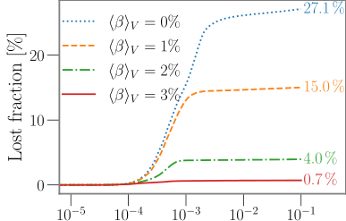

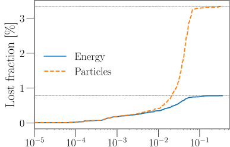

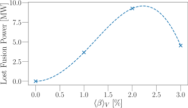

**Fig.** **7.** Neoclassical radial transport coefficients _𝐷_ 11 _[⋆]_ [as] [a] [function] [of] [collisionality] _[𝜈][⋆]_ [,]
inradialvacuumelectricandfield,at the _𝑣_ [∗] _𝐸_ target [=] _𝑣𝐵𝐸𝑟_ 0 volume-averaged [was] [set] [to] [10][−][3][.] plasma _[𝑣]_ [is] [the] ⟨ _𝛽_ ⟩ [particle] _𝑉_ = 3 _._ 0% [velocity] . The normalized [and] _[𝐵]_ [0] [is]

the flux-surface averaged magnetic field strength. Configurations are evaluated at midradius (i.e., _𝜌_ = 0 _._ 5). The computation was performed with SFINCS using free-boundary
VMEC equilibria.

**Fig.** **8.** The bootstrap current density profile _𝐽𝐵𝐶_ for the different species at the design
target of ⟨ _𝛽_ ⟩ _𝑉_ = 3 _._ 0% as a function of the plasma minor radius _𝑟_ . The integrated toroidal
current is _𝐼_ BC ≃ 23 kA.

The bootstrap current is another important neoclassical quantity.
Fig. 8 shows the magnitude of the bootstrap current density for different species. Species profiles are computed using the 0.5-D models
that will be introduced in Section 2.3. The radial electric field value
for this computation was evaluated with the NTSS code [111] in the
ion-root case (see ). For these profiles, the integrated bootstrap current
is approximately _𝐼_ BC ≃ 23 kA. For most practical purposes, a toroidal
current with this magnitude can be neglected, as it would result in a
shift of the rotational transform at the edge of only 0.5% .

_Ideal-MHD_ _stability._ In QI configurations with low net toroidal current,
MHD current-driven modes are expected to be negligible. However, it is
important to consider the stability of pressure-driven ideal-MHD modes.
In this analysis, local ideal-MHD stability criteria are employed to evaluate the configuration’s stability against ballooning and interchange
modes.

To this end, we examine the configuration’s stability against the
ideal-MHD interchange mode using the Mercier criterion [112–115].

**Fig.** **9.** The normalized Mercier criterion _𝛷_ edge [2] _[𝐷]_ [Merc] [as] [a] [function] [of] [the] [normalized]
toroidal flux _𝑠_ for different volume-averaged plasma _𝛽_ . A positive value of the Mercier
criterion suggests a stable configuration with respect to the high-mode number idealMHD interchange mode, whereas a negative value suggests an unstable configuration.
The proposed configuration features a positive Mercier criterion over the whole plasma
volume up to and beyond the target volume-averaged _𝛽_ value of ⟨ _𝛽_ ⟩ _𝑉_ = 3 _._ 0%. The red
dashed line represents the boundary of stability. The evaluation was performed using
the free boundary VMEC equilibrium.

**Fig.** **10.** Highest growth rate of the ideal-MHD infinite- _𝑛_ ballooning mode across all
evaluated field lines on a flux surface _𝛾_ max, plotted as a function of the normalized
toroidal flux _𝑠_ for different volume-averaged plasma _𝛽_ . The growth rates are evaluated
with the COBRAVMEC code. Negative growth rates indicate a stable configuration,
positive growth rates indicate an unstable configuration. The red dashed line represents
the boundary of stability. The evaluation was performed using the free boundary VMEC
equilibrium.

Appendix D describes the adopted definition of the Mercier criterion. A
positive value of the Mercier criterion is a necessary (but not sufficient)
condition for a stable configuration at that specific radial location,
whereas a negative value suggests potential instability.

Fig. 9 presents the Mercier criterion as a function of normalized
toroidal flux for various volume-averaged plasma _𝛽_ values, as evaluated
with VMEC using the free-boundary equilibrium. The results show
positive values across the entire plasma profile up to and beyond the
target _𝛽_ of ⟨ _𝛽_ ⟩ _𝑉_ = 3 _._ 0% (see Fig. 9).

Additionally, we employ the COBRAVMEC code [109], which computes the local (on a field line) growth rates of ideal-MHD infinite- _𝑛_
ballooning modes using the VMEC free-boundary equilibrium solution.
Fig. 10 shows the highest growth rate across all evaluated field lines
on a flux surface as a function of normalized toroidal flux for various
volume-averaged plasma _𝛽_ values. For each flux surface, growth rates
are computed on 100 field lines with starting locations uniformly
distributed across the poloidal and toroidal directions. We find that
the free-boundary plasma configuration is stable against ideal-MHD
infinite- _𝑛_ ballooning modes throughout the entire plasma domain up
to and beyond the design volume-averaged plasma ⟨ _𝛽_ ⟩ _𝑉_ = 3%.

_Equilibrium_ _resiliency_ _with_ _respect_ _to_ _finite-𝛽_ _effects._ Optimized QI configurations tend to be particularly resilient against varying plasma

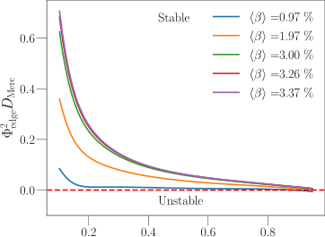

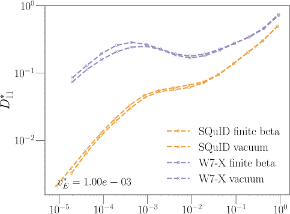

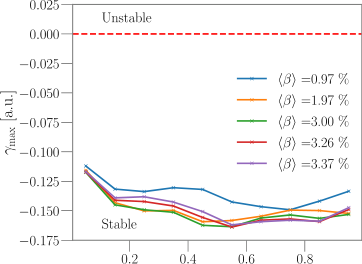

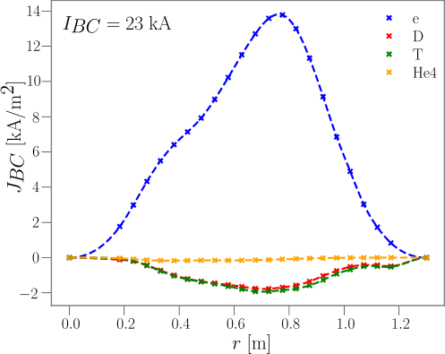

**Fig.** **11.** Profiles of the rotational transform _𝜄_ (a) and the effective helical ripple, _𝜖_ eff,
(b), at varying volume-averaged plasma _𝛽_ as a function of the normalized toroidal
flux _𝑠_ . In the rotational transform profile plot, resonant values between 45 [and] 44 [up]
to the 5th order are shown with dashed horizontal lines. All equilibria use the same
pressure profile shape. The evaluation was performed using the free boundary VMEC
equilibrium.

profiles. In order to validate this point for the present SQuID configuration, we analyze the resiliency of key metrics with respect to
finite _𝛽_ and profile effects. We note that this analysis is rarely done
in the literature, and configurations are often only optimized for one
set of profile profiles. However, consistent with the spirit of this reactor
study, we aim to address potential drawbacks of the Stellaris for reactor
applications. We split the analysis in two parts: first, we investigate the
resiliency with respect to changing plasma _𝛽_ for a fixed profile; second,
we assess the contribution of the profile shape for a fixed volumeaveraged plasma _𝛽_ . We take the corresponding a priori profile from
the identified design point in Section 2.3, see Fig. 16, as the default
pressure profile, then compute a VMEC equilibrium in free boundary
for each pressure profile variation.

Fig. 11 presents the rotational transform profile and the epsilon
effective, _𝜖_ eff, profiles at various volume-averaged plasma _𝛽_ values, two
key metrics that are particularly sensitive to small changes in pressure
profiles. Plasma _𝛽_ values up to and beyond the target design point are
shown. The bootstrap current was neglected in this simulation. The
rotational transform profile only crosses a resonance value (e.g. _𝜄_ = 0 _._ 8)
at a high plasma _𝛽_ of ⟨ _𝛽_ ⟩ _𝑉_ ≃ 4 _._ 75%. _𝜖_ eff captures the neoclassical
transport in the 1∕ _𝜈_ regime with negligible electric field, which is
the regime with the highest neoclassical heat flux. We find that the
neoclassical transport properties in this regime are robust to the plasma
_𝛽_ . Also, the edge rotational transform is found to be resilient against
profile effects, which is particularly relevant in achieving a stable island
chain for divertor applications.

**Fig.** **12.** Sensitivity analysis of equilibrium properties for different pressure and
(derived) toroidal current density profiles. pressure profile _𝑝_ ( _𝑠_ ) (a), toroidal current
density profile _𝐽𝜙_ ( _𝑠_ ) (b), rotational transform profile _𝜄_ ( _𝑠_ ) (c), epsilon effective profile
_𝜖_ eff( _𝑠_ ) (d), maximum growth rate on a flux surface for the ideal-MHD infinite- _𝑛_
ballooning mode profile _𝛾_ COBRAVMEC (e), and the normalized Mercier criterion profile
_𝜓_ edge [2] [D][Merc][(] _[𝑠]_ [)] [(f).] [All] [as] [a] [function] [of] [the] [normalized] [toroidal] [flux] _[𝑠]_ [.] [In] [case] [of] [the]
ideal-MHD criteria, a red, dashed, line represents the stability boundary. All profiles
are color-coded based on their pressure value at the axis. All equilibria have the same
stored integrated energy and the same integrated toroidal current.

In a second step, we analyze how changes in pressure and toroidal
current profile shapes affect the equilibrium properties. As before, we
evaluate the free boundary VMEC equilibrium using different pressure
profiles sampled around the reference profile. Each modified profile is
scaled to maintain the same total plasma energy as the original profile.

To simulate a realistic bootstrap current profile, we use a toroidal
current profile based on the plasma pressure variation across flux
surfaces,

_[𝑝]_
_𝐽_ tor( _𝑠_ ) = _𝐽⋆𝑠_ (1 - _𝑠_ ) _[𝑑]_ _𝑑𝑠_ _[.]_ (1)

Given the connection between the pressure gradient and the bootstrap current, this expression represents a simple informed proxy for the
expected current density profile. Additionally, we enforce the current
density to vanish at the magnetic axis and at the LCFS.

While varying the profile shape, we scale _𝐼⋆_ such that the integrated
current stays constant at a (conservative) value of 100 kA.

Fig. 12 shows the sampled pressure profile and toroidal current
density profiles. For each profile, the equilibrium properties were calculated using the VMEC code in the free-boundary mode. A total of 16
equilibria have been evaluated.

Almost all evaluated metrics reveal configuration resiliency with
respect to profile shapes. Despite the different pressure and toroidal
current profiles, the rotational transform remains far from critical

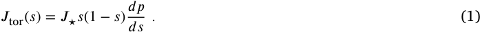

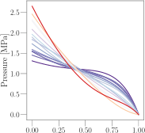

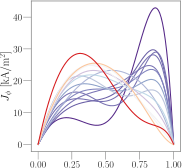

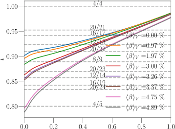

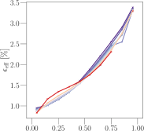

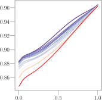

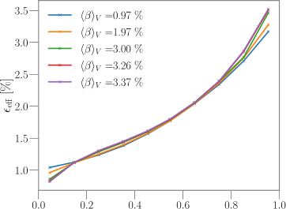

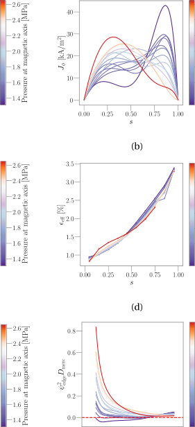

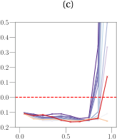

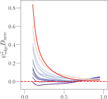

low-order rational values (e.g. 0 _._ 8). The _𝜖_ eff profile shows remarkable
resiliency to profile variations.

The two chosen metrics for evaluating MHD stability suggest that
the profile shape can affect the MHD stability of the configuration.
Positive growth rates for the ideal-MHD infinite- _𝑛_ ballooning mode are
observed near the plasma boundary, suggesting instability in that region for profiles with strong pressure gradients. In reality, such unstable
profiles would likely flatten toward profiles that are MHD-stable.

It should be noted that even if linear ideal-MHD stability is violated for some regimes, the plasma can still be non-linearly MHD
stable [116,117]. Modeling tools to test non-linear MHD stability are
under development [118].

The resiliency of the equilibrium properties with respect to finitebeta effects have been optimized only indirectly via the QI optimization. Future optimized configurations could benefit from including
additional metrics directly targeting the resiliency of MHD stability.

_Flux_ _surface_ _quality._ A set of nested surfaces is crucial for plasma confinement. In a stellarator field, nested flux surfaces are not guaranteed
to exist. The electromagnetic coils need to be carefully optimized so
that islands and stochastic regions are minimized within the confined
volume. At the same time, reliable island divertor operation across different plasma _𝛽_ values requires maintaining both stable island location
and size.

As plasma pressure increases, pressure-driven currents arise. These
currents can significantly alter the vacuum field and ‘break’ flux surfaces. In most previously proposed stellarator configurations, pressuredriven currents caused significant stochasticity of flux surfaces in a
substantial portion of the plasma volume [117,119–124]. This phenomenon has been observed both in simulation and in experimentation.
It is therefore critical to assess whether a set of nested flux surfaces
is preserved as the plasma _𝛽_ increases. The (indirect) minimization
of the Shafranov shift should also lead to good flux surface quality
at finite _𝛽_ . To assess the flux surface quality at finite _𝛽_, the HINT3D equilibrium code [125,126] has been employed. This code does
not rely on the assumption of the existence of a nested set of flux
surfaces, unlike VMEC, making it suitable to analyze configurations with
potential pressure-driven modifications.

Fig. 13 shows that no signs of loss of confined plasma volume are
visible as the plasma _𝛽_ increases. At _𝛽_ axis = 8 _._ 0% (which corresponds
to ⟨ _𝛽_ ⟩ _𝑉_ ∼ 3 _._ 0%), HINT-3D calculates a Shafranov shift of ∼8 _._ 0%, which
translates to a radial magnetic axis displacement of ≃0 _._ 1 m. Moreover,
the 4∕4-island chain is well-preserved, while the resonant islands themselves are moving slightly. The precise location and orientation of the
resonant islands will need to be controlled with an array of correction
coils, which are not further specified in this paper.

_Ambipolar_ _radial_ _electric_ _field._ Stellaris utilizes tungsten coatings as the
primary material for both the first wall and the divertor. Experiments
with tungsten divertors have shown that tungsten atoms can be sputtered and potentially accumulate in the core of the plasma [127]. This
accumulation can lead to a radiative collapse, causing operations to
halt.

A negative radial electric field (i.e., an electric field pointing radially
inwards) is known to be a significant factor in driving heavy impurities
toward the core [128,129]. Conversely, a positive radial electric field
can act to ‘flush out’ these heavy impurities.

Recent efforts have focused on developing methods to optimize
stellarator configurations to achieve a positive electric field within the
plasma core under reactor-relevant conditions (i.e., _𝑇𝑒_ ≃ _𝑇𝑖_ ) [71,108,
130]. The proposed configuration has been optimized similarly to the
configurations presented in [71]. Therefore, it is expected to support a
positive radial electric field in reactor-relevant conditions as well.

The 1-D NTSS [111] code has been used to compute the radial electric field profile from the ambipolarity condition. The mono-energetic
neoclassical transport coefficients for the necessary particle fluxes are
calculated using the SFINCS code [107]. Details of the simulation

**Fig.** **13.** Poincaré plots of the cross-section at _𝜑_ = _[𝜋]_ 4 [at] [2%] [(black)] [and] [8%] [(red)] [peak]

_𝛽_ values, corresponding to 1% and 4% volume averaged beta respectively. _𝑅_ is the
cylindrical major radius (which is 0 in the center of the device) and _𝑍_ is the Cartesian
coordinate. The cross section is mirror symmetric at the _𝑍_ = 0 plane. The analysis
reveals preservation of good, nested flux surfaces as plasma _𝛽_ increases. The 4∕4 island
chain remains intact across all relevant _𝛽_ values. The equilibrium magnetic field was
calculated using the HINT-3D equilibrium code [125,126].

set-up can be found in [108].

The proposed configuration has the potential to support a positive
radial electric field, as shown in Fig. 14. However, calculations based
on the target design point and plasma profiles outlined in Section 2.3
predict a negative electric field. By adjusting the operational point
toward a higher electron temperature ( _𝑇𝑒,_ 0 = 19 _._ 8 keV) and lower
ion density ( _𝑛𝑖,_ 0 = 1 _._ 7 ⋅10 [20] m [−3] ), the configuration can achieve a
positive radial electric field. This operational regime aligns with the 0-D
analysis, but it comes at the expense of reduced fusion power output
( _𝑃_ fusion = 860 MW).

While electron-root plasmas for reactor conditions are compelling
to address impurity transport challenges, the radial location of the root
transition is important: if it takes place at mid-radius, as in the case
of Fig. 14 (orange line), it could potentially lead to an ‘annulus’ of
impurity density accumulation at the region of the root transition, and
therefore potentially to a radiative collapse of the plasma. Secondly, at
the location of the root transition the radial electric field vanishes—in
a stellarator, this is expected to lead to maximal neoclassical transport.
Consequently, kinetic profiles might flatten at these locations. However, this may not be a significant drawback if the root transition were
located near the plasma edge, where turbulence shearing effects may
enable advanced confinement regimes. Future research will explore this
possibility in more detail.

_2.3._ _Physics_ _performance_

To determine possible operational temperatures and densities, we
chose an integrated treatment of the power balance to assess the
required auxiliary power and the fusion gain. This method is sometimes
referred to as a ‘0.5D’ treatment, as we calculate with an a priori
assumed profile shape, but enforce the power balance by equating the
integrated loss power with the integrated heating power, rather than
solving a set of transport equations. In this paper, we will equivalently
use the term ‘0D’ for this method, for simplicity. High-fidelity profile
predictions are still the subject of active research [132–134], and only
preliminary calculations are available for the Stellaris design.

To obtain key parameters for the design point, we choose a simple
parametrization of the ion density and electron temperature profiles:

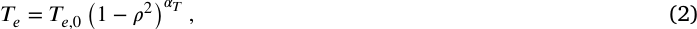
_𝑇𝑒_ = _𝑇𝑒,_ 0 (1 - _𝜌_ 2) _𝛼𝑇_ _,_ (2)

_𝑛𝑖_ = _𝑛𝑖,_ 0 (1 - _𝜌_ 2) _𝛼𝑛_ _,_ (3)

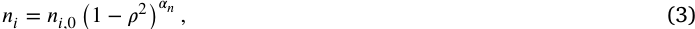

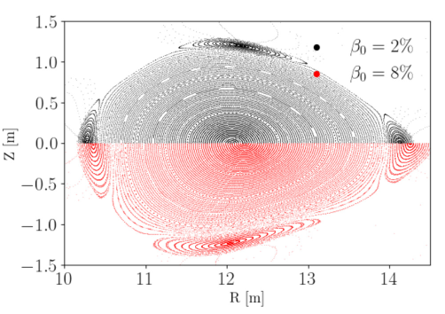

## Table 4

Assumed parameters for the 5D stellarator in this section. $f_{cool}$ refers to the confinement-fidelity factor of ISO4 energy confinement time scaling. $f_p$ measures the ratio between alpha particle and total pressure in the plasma. $\tau^*$ is the ratio between particle and energy confinement time for all species. $f_{ash}$  is a heuristic factor used to model the suppression of helium ash, and $\alpha_b \beta_b$ is the ratio between core tungsten density and central fuel density.

| Variable | Assumption |
|----------|------------|
| $f_{cool}$ | 1.0 |
| $f_p$ | 0.2 |
| $\tau^*$ | 0.95 |
| $f_{ash}$ | 0.5 |
| $n_b/n_e$ | 0.001 |

for the fusion reaction rates. For line and continuum radiation, we use a priori assumed emissivity functions and calculate the cooling factors using the Aurora code [118], relying on the Atomic Data and Analysis Structure (ADAS) database [119]. The synchrotron radiation is modeled using the model described in [140]. We apply the ISS04 energy confinement time scaling law from [141], with a modification to replace the heating power by the fusion heating power divided by the energy confinement time. Then, an averaged global energy confinement time is assumed: $\tau_{E0} = n_e T_0 \cdot V / P^{2/3}$ [?]. Helium ash profiles are obtained using a fixed ratio of particle-to-energy confinement time. Fast particle pressures are modeled using the model of [142]. For the purpose of this analysis, we take a conservative value of the fast particle confinement of 95% and a fixed ion-to-electron temperature ratio of 0.95. An important assumption is a helium suppression factor $f_{ash}$ heuristically reducing the amplitude of the resulting helium ash profile in the analysis. This factor accounts for the distinction between alpha particle birth location and thermalization location [110]. Assumed parameters are summarized in Table 4.

Fig. 15 shows a scan of the peak electron temperature $T_{e0}$ and the peak ion density $n_{i0}$, along with the Pfirsch-Schlüter ratio that support the operation point and relevant operational constraints, in a power-output-contour (POPCON) plot. Two chosen operation points are indicated with two red circles, labeled 'A' and 'B'. A green dashed line indicates a path to reach the operation point 'A' with minimal auxiliary heating power. According to the proposed model, about 50 MW of auxiliary heating power would need to be installed to reach the desired operation point.

Table 5 summarizes machine and plasma parameters for both operation points. It is worth highlighting that the ratio of the volumeaveraged pressures described by the Sudo-Sudo limit [143], $\langle n_e \rangle / n_{Sudo}$, at the chosen operation point 'B' is slightly greater than one. However, as suggested by recent publications [7], the Sudo limit strongly depends on the impurity fraction in the edge, and higher fidelity models should be employed to calculate the density limit more accurately. Note also that although only the two operation points with the highest fusion power are shown here, the performance of the stellarator seems to be sufficiently resilient at lower $\beta$ values, indicating that all other operation points with $P_{fus} \leq 50$ MW are likely feasible (e.g. an operation point with lower plasma density and lower fusion power may be considered), which would result in higher component lifetimes and easier burn control. However, to keep the scope of this work manageable, the scaling should be done along lines of constant fusion power (dashed contour in Figs. 15).

Profiles at the operation point 'A' are shown in Fig. 16. The profiles at the operation point 'B' would be similar but steeper in the vanilla gradients when $T_{e0}$ and $n_{i0}$ are scaled (e.g. at $\rho = 0.6$ we find ratios of $a/L_T \approx 2.25$ and $a/L_n \approx 0.66$).

An integrated control solution is the control scheme required to support the suggested operation points. Compared to tokamaks, stellarators usually require very limited effort on control systems. In the

Selected plasma and machine parameters for the two design points shown in Fig. 15. A point B data are used according to Table 1. Radius taken for the target location, $r_{eq}$, refers to the on-cell density of electron cyclotron resonance heating (ECRH) at the plasma midplane, not the target location per se. The standard deviations in squared brackets [±] are taken. Point B would violate the 'Sudo density limit' [113], but might still be feasible with sufficient plasma purity.

| Description | Point A | Point B |
|---|---|---|
| Minor plasma radius (m) | 1.5 | 1.5 |
| Major plasma radius (m) | 12.74 | 12.74 |
| Kink-averaged $R_c$ (T) | 5.4 | 5.4 |
| Aspect ratio | 8.0 | 9.8 [?] |
| Magnetic field at axis (T) | 5.0 | 5.0 |
| Plasma surface area (m²) | 327 | 327 |
| $\iota_{95}$ [1] | 0.0 | 0.0 |
| Vol.-av. $Z_{eff}$ (core) [1] | 1.20 | 1.21 |
| Vol.-av. $Z_{eff}$ (%) | 0.50 | 0.50 |
| Vol.-av. $n_e$ density [10²⁰ m⁻³] | 3.37 | 4.21 |
| Peak electron density [10²⁰ m⁻³] | 4.55 | 5.77 |
| Peak $n_i$ density [10²⁰ m⁻³] | 5.08 | 6.89 |
| Peak D density [10²⁰ m⁻³] | 3.94 | 5.36 |
| Peak T density [10²⁰ m⁻³] | 1.96 | 2.60 |
| Fusion power (MW) | 1800 | 1800 |
| $P_{e,fus}/P_{fus}$ [%] | 20 | 20 |
| Peak $n_e$ temperature (keV) | 15.40 | 12.25 |
| Peak $n_i$ temperature (keV) | 24.60 | 17.50 |
| Fusion gain [1] | 4 | 4 |
| Aux. power at operating point (MW) | 450 | 450 |
| Fusion power (MW) | 2700 | 2700 |
| Peak fusion power (MW/m³) | — | — |
| P/S | |  |
| $\beta_{N}$ [edge radiation fraction] (MW/m²) | 1.14 | 0.91 |
| Radiation fraction: (**) core/edge (%) | 24/49 | 25/46 |
| Av. neutron wall power (MW/m²) | 2.87 | 2.87 |
| Peak neutron wall power (MW/m²) | 4.95 | 4.95 |
| Peak triple product [10²¹ keVs/m³] | 1.03 × 10² | 5.64 × 10¹ |
| Confinement time $H_{98}$ [1] | 1.30 | 2.24 |
| Alpha slowing down time (ms) | 43.76 | 53.75 |
| Ratio $\tau^* / \tau_{SD}$ | 0.02 | 0.02 |
| Rad. tungsten fraction (core) [%] | 0.012 | 0.012 |
| Rad. tungsten fraction core $c_{W}$ [%] | 7.9 | 7.9 |

[Figure 16: Steady-state density profiles (a) and temperature profiles (b) for the chosen design point (Point A) as a function of the normalized toroidal radius. The shape of the profile corresponds to the analytical expression used in Eq. (1) for $\alpha_n = 1.2$ and $\alpha_T = 3.0$.]

case of Stellaris, the requirements are reduced to achieving density control, determining the edge transport properties, and establishing control of the edge island locations through an array of control coils. If the chosen design point is thermally unstable, an additional control scheme or confinement degradation scheme should be employed to achieve burn-control. While density control is widely adopted in current experiments and test devices, confinement control and temperature control are not yet well-established, but are conceptually straight-forward: plasma temperature degradation can be achieved by tuning coil currents or controlling the tritium fraction in the core. Alternatively, it may be possible to use electron-cyclotron-current-drive (ECCD)-driven confinement degradation [14]. We expect the temperature to be ultimately limited by temperature gradient-driven turbulence or electromagnetic turbulence, such as kinetic ballooning modes. However, no tools or workflows currently exist to predict limits with high confidence.

To contextualise the confinement time model utilised in this section, we compute the turbulent profiles at the operating points using a higher fidelity transport simulation of the selected stellarator configuration. This simulation assumes that turbulent timescales are distinctly separated from those governing significant changes in the density and temperature profiles.

For this analysis, turbulent diffusivities are computed using flux-tube simulations with GENE [148] and then passed to the transport solver TANGO [148], similar to the approach described in [149]. The transport equations are solved with fixed density profiles, and the electron and ion temperature values are constrained by a Dirichlet boundary condition set to 4.2 and 5.2 keV respectively at $\rho = 0.8$, informed by the assumed kinetic profiles of Fig. 16 at this location. The GENE simulations are conducted at the radial location with the label $a = 0$, specifically at $\rho \in \{0.1, 0.3, 0.6, 0.9\}$.

To reduce the thermal transport output and allow for a more direct comparison of the resulting profiles, we set the power source in TANGO fit to the fusion heating power computed at the D 5-D mesh point. We distribute this heating 80% to the electrons and 20% to the ions, following [134]. Note that by choosing fixed fusion heating profiles, the resulting profiles could change, but the heating profiles are not updated. The purpose is not a fully integrated, fully consistent temperature profile prediction, but instead a sensitivity assessment to determine whether the assumed temperature gradients can be supported by full electrostatic turbulence. For this reason, other radiation losses, such as bremsstrahlung, were neglected as a heat sink for the electrons. In order to obtain the profiles, an iterative loop is established between the heat fluxes obtained from GENE and the transport solver TANGO, following a methodology similar to that in [148,150]. The integration is treated as fixed-point iterations in a sequential simulation workflow. It is worth noting that if electromagnetic effects were included, one might expect stabilization of turbulence levels, leading to lower stiffness—provided that the system remains below the threshold for kinetic ballooning instability. We also remark that the effect of non-adiabatic $E \times B$ shear is not included in the simulations. Recent studies show that even moderate neoclassical $E \times B$ shear in W7-X can reduce turbulence levels significantly [151].

Fig. 17 shows the resulting temperature profiles for the given assumptions. We see that the GENE+TANGO results indicate that the temperature values of the 0.5 D profiles are supportable by electrostatic turbulence level within the used model assumptions, including favorable assumptions of the edge temperature value. However, the simulations demonstrate high sensitivity to the assumption of the edge temperature, and require high-quality experimental prediction or accurate edge transport simulations for first-principle profile prediction simulations to become accurate.

*On high confinement regimes in stellarators.* Before concluding this section, we put the assumptions taken on confinement quality into perspective, and comment on the potential requirements for the maximum achievable density and temperatures of a stellarator dominated by turbulent transport [152].

Experimentally, a wide range of confinement properties has been observed in both W7-X and W7-AS. In W7-X, confinement times deviating from ISS-04 scaling have been measured in recent campaigns [153] and higher performance experiments in quasi-steady state after pellet injection [154]. W7-AS achieved improved and very high confinement (H-Mode) in different forms [47,152,155] with significantly reduced transport levels.

It has been hypothesized that the ratio of heating power over plasma boundary surface area, $P/S$, is decisive for achieving the transition to improved confinement. According to recent experiments at ASDEX-Upgrade (AUG), within $2 \leq B_{tor} \leq 6$, the $P/S$ threshold value to access H-mode is $P/S \approx 0.07$ MW/m². Instead, W7-X has only reached

**Fig.** **17.** Comparison of the 0.5 D deuterium temperature profile and results of two
electrostatic GENE+TANGO simulations with different assumptions on the boundary
value for the temperature at _𝜌_ = 0 _._ 8. Fixed density profiles and fixed heating power
were assumed and were taken from Design Point A from Table 5. All radiative losses
were neglected for the GENE+TANGO simulations.

a maximum value of _𝑃_ ∕ _𝑆_ ≃ 0 _._ 02 MW∕m [2] [32]. For the design point in
this paper, _𝑃_ ∕ _𝑆_ is on the order of 1.18 MW∕m [2], significantly higher
than the values measured in W7-X and AUG, even when accounting
for respective magnetic field and density dependencies [154]. This
suggests that, if there indeed exists a _𝑃_ ∕ _𝑆_ threshold above which Hmode behavior occurs, the chosen physics design point of Stellaris may
need to be corrected to account for confinement enhancement due to
H-mode. In that case, resilient operation in an electron-root regime
would ensure low impurity retention, addressing a common issue with
many tokamak H-mode regimes. This point alone would justify the need
for an intermediate-step device on the path toward a stellarator power
plant, to determine whether H-mode physics follows analogous patterns
as in tokamaks.

Isotope effects are another potential confinement-enhancing effect
not typically covered in the ISS04 confinement time scaling laws. While
this effect is not significantly observed in the neoclassically dominated
heliotron LHD [155,156], it could still be relevant in optimized stellarators where confinement is ultimately limited by turbulence, as is
the case with W7-X and the Stellaris concept. Related multi-machine
regression fits in tokamaks suggest a decrease of turbulence levels for
deuterium-tritium plasmas compared to pure hydrogen plasmas [157],
and initial first-principle studies seem to support those findings [158].
Future deuterium campaigns in W7-X will shed more light on whether
such an effect could be exploited in future stellarator power plant
designs.

_2.4._ _Fueling_ _&_ _density_ _profile_ _control_

As indicated by W7-X experiments, density profile control is a highly
promising mechanism to reliably suppress ITG turbulence [74,75,135,
159,160]. The required density steepening can be achieved by either
(a) increasing the core density by means of fueling (with cryogenic
pellets or using neutral beam injection) or leveraging turbulent particle pinches [49,161,162], or (b) decreasing the edge density, for
example using boronization [163], efficient edge pumping, or active
boron powder injection [164]. An overview of density profile induced
enhancements of plasma performance in W7-X is given in [135].

A stellarator reactor would greatly benefit from the possibility of
externally controlling the steepening of density gradients. As no reliable
predictive capability is yet available for turbulent particle pinches, we
suggest density profile control for Stellaris via both core fueling with
cryogenic pellets and edge fueling via gas puffing.

**Fig.** **18.** (a): the pellet injection location, chosen in the _𝜑_ = 0 plane (the bean-shaped
plane). (b): corresponding plot of the magnetic field magnitude and the toroidal flux
over a straight line in the bean-shaped plane located at _𝑍_ = 0 and _𝜑_ = 0, where _𝑍_ is
the Cartesian coordinate and _𝑝ℎ𝑖_ is the cylindrical toroidal angle.

While the technology of pellet injectors is well-established and
has been demonstrated in various experiments [165–170], the pellet
deposition profiles cannot yet be fully simulated predicatively, and first
simulations are just becoming available [171]. From these simulations,
it is understood that the plasmoid drift effect that enables central
fueling is strongest if the pellet injection takes place from a highfield region of the machine. Experimental studies show less pronounced
sensitivities of the injection path to high- and low-field side [172].
Other control parameters, such as pellet sizes and injection speeds, are
relatively inefficient to achieve central fueling.

We therefore propose the installation of a high-frequency pellet
injector on the inboard side of the machine (e.g. in the bean-shaped
plane of the stellarator plasma), where the distance in real space
between the outermost plasma layer and the center is the smallest.
Fig. 18 offers a visualization of the injection location in the bean
shaped plane. Launching the pellet from a high-field region of the
machine maximizes the plasmoid drift effects according to current
understanding [171], potentially enhancing central fuel deposition. In
the concept presented in this paper, the space in the high-field side
bean plane is densely filled with structural material, posing a challenge
for installing a pellet port. However, the port opening can be as small
as 10 mm in diameter, as the cryogenic pellets are usually only a few
millimeters wide. Dedicated studies are needed to determine the port
opening that maximizes central fueling efficiency.

Gas puffing is used in almost all tokamak and stellarator experiments, and is an established method for plasma startup and edge
fueling. Further research is needed, both theoretically and on experimental devices, to determine how the penetration of gas fueling via the
plasma edge is expected to vary in large and high-density stellarators,
where neutral particles may be unable to reach the confinement region. Analogous challenges exist for high-field, high-density tokamaks,
where gas fueling is considered a control variable. Given uncertainties
regarding gas penetration through the edge, we consider high-speed
pellet injectors to be an important necessity for Stellaris.

_2.5._ _Heating_

There are different schemes available for heating fusion plasmas, of
which the most promising are:

   - Ion Cyclotron Resonance Heating (ICRH) [173–175], which requires installing antennas within the plasma vessel, resulting in
antenna straps being in contact with the plasma—and therefore
usually needing to be protected by highly conducting Faraday
shield bars. With such a heating scheme, sputtering naturally
occurs at the antenna, resulting in a significant impurity source
for the core plasma. Additionally, the effect of strong, unshielded
neutron irradiation on the antennas must be considered;

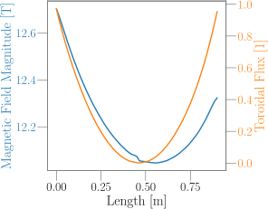

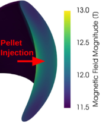

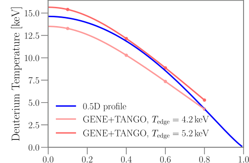

   - Lower Hybrid Heating (LHH) [176,177], which also needs launchers that are close to the plasma;

   - Neutral Beam Injection (NBI) is seen as difficult for reactor applications due to large port requirements, which cause problems with tritium breeding performance and free neutron streaming [178]. The negative ion NBI apparatus reaching MeV energies
for reactor applications also poses major challenges for economic
viability of the reactor, due to large capital costs. Wall-plug
efficiencies of NBI systems typically remain below 30% [179];

   - Electron Cyclotron Resonance Heating (ECRH), which features
high levels of theoretical understanding at both an engineering and physics level. Reactor-relevant ECRH technology was
demonstrated by W7-X [180–183] and ECRH systems will also
be implemented in ITER [184] and DTT [185–187] in addition to
being conceptualized for EU-DEMO [188,189]. While W7-X uses a
quasi-optical transmission in air, DTT and DEMO will use evacuated quasi-optical transmission systems. ITER, on the other hand,
will make use of overmoded waveguides. ECRH offers particularly
a high technological readiness level for reactor applications;

   - Other heating schemes, such as Transit Time Magnetic Pumping [190] and Alfvén Wave Heating [191–194], have been investigated experimentally, but have not received widespread acceptance and are not considered in more detail here.

Due to the above arguments and wide acceptance for reactor applications [188,189], we have selected ECRH as the primary heating method
for Stellaris. The microwaves used for this technology are generated by
a set of MW-class microwave sources that can be installed far away
from the torus hall and can be guided through a system of actively
cooled mirrors (as in W7-X, DTT and DEMO) or waveguides (as in ITER)
toward the injection port. Such a concept is highly attractive, as the
complexity of the heating system can be mostly decoupled from that of
the torus building.

Gyrotrons are the only known microwave sources capable of providing the necessary MW-class output power as continuous waves [195–
197]. Hence, gyrotrons are used in all large-scale magnetic confinement
fusion devices that use ECRH.

For ITER, the gyrotron efficiency is expected to be 50% [184],
leveraging beam energy recuperation via a depressed collector [198].
As of today, most gyrotron designs use Single-stage Depressed Collectors (SDCs). In the future, Multi-stage Depressed Collectors might
increase the gyrotron efficiency to above 60% [199–202], making it
an attractive heating solution even for steady-state applications in
non-ignited plasma scenarios.

While W7-X now uses a gyrotron class of 1.0 MW and 1.5 MW
operating at 140 GHz [203], ITER will operate with 170 GHz gyrotrons [204]. For future high-field machines to be heated via ECRH, it
is necessary to demonstrate efficient operation of 240 GHz high-power
gyrotrons. The technological development of gyrotrons is constantly
progressing toward higher power and higher frequencies [200,205–
207], ultimately enabling higher magnetic fields and more economical
operation.

For the heating scheme of Stellaris, we propose using the first
ordinary (O1) mode as the default scheme, noting that it has been wellstudied for ITER [208]. To ensure that high-density plasmas can be
heated, we choose the location of ports such that the first extraordinary
(X1) mode can also be used. The X1 mode would permit heating far
from the plasma cut-off density _𝑛_ [crit] _𝑋_ 1 [,] [which] [is] [given] [by] [the] [constraint]

_𝑛𝑒_ _<_ _𝑛_ [crit] _𝑋_ 1 [=] [2] _[ 𝑚]_ [2] _[𝑒][𝜖]_ [0]

_[𝑒]_ [0] _𝜔_ [2] gyro _[,]_ (4)

_𝑒_ [2]

that X1 mode heating from a high-field region would heat the highenergy tail of the electron distribution function. Further study is needed
to determine how this would impact plasma performance.

The injection beam path for the proposed device is illustrated in
Fig. 19, showing an access point on the inboard side of the device. This
unusual placement of an ECRH port not only enables the injection of
the ECRH via a high-field region, but also frees access at the outboard
side of the device, easing remote maintenance requirements. This is
especially relevant for the remote maintenance concept of Stellaris,
which uses sector splitting, as described in Section 2.11. It is worth
noting that inboard access ports are particularly enabled by the high
aspect ratio of Stellaris, and likely cannot be replicated in a comparable
tokamak at lower aspect ratio.

A total of eight ports, each with 300 mm of diameter and a circular
cross-section, are situated between the coils on the inboard side of
every half module. Stress analyses (presented in Section 2.10) indicate
that peak stresses around the port opening stay within design limits.
The ECRH ports are installed with stellarator symmetry and can be
adjusted to include a non-zero toroidal component. This set-up allows
for the possibility of canceling small amounts of residual net toroidal
currents by varying the relative ECRH power between the stellaratorsymmetric ports, without requiring movable mirrors near the vessel or
remote-steering launchers.

The port diameter was chosen to be as small as is reasonably
possible in order to mitigate degradation of the tritium breeding performance of the blanket. Still, in reality, specific neutron shielding
techniques would need to be employed, such as a labyrinth path to
ensure that free neutron streaming through the port is minimized. Such
considerations are outside the scope of this paper.

We anticipate Stellaris to operate with 50 MW of ECRH power in
the plasma, necessitating approximately 6.25 MW of power to be transmitted through each port. To achieve this, we propose a configuration
of 7 waveguides per port with outer diameters of 90 mm, fitting well
within the 300 mm circular cross-section of the ports. Each waveguide
would have an inner diameter of 60 mm, close to the design of the ECRH
upper launchers for ITER, which have inner diameters of 50 mm [211].
Assuming a transmission loss of 10% between the gyrotron output
and the launcher, each port would require seven 1 MW gyrotrons to
deliver approximately 6.3 MW into the plasma. Greater margins could
be achieved by increasing the output power per gyrotron, providing
greater flexibility and robustness in achieving the desired power levels.

We remark that the high mirror ratio of QI stellarators allows for
the use of a broad range of gyrotron frequencies, as the gyrofrequency
scales linearly with the magnetic field strength. In this study, the
magnetic field strength at the plasma boundary varies between 7 _._ 3 T
and 13 T in the toroidal direction, corresponding to gyro-frequencies
ranging from 200 GHz to 363 GHz. To minimize the required gyrotron
frequencies, the chosen port location enables heating close to the
toroidal low-field region of the stellarator, shown on the right-handside of Fig. 19. The potential effects of a resulting skewed distribution
function of the electron population caused by the heating of trapped
particles at the bottom of the magnetic mirror are yet to be investigated,
but may be sufficiently small when the dominant heating term is the
fusion heating at the operation point.

In order to validate the contention that wave absorption can take
place with the given port set-up, we plot the local gyro- (electron
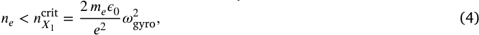
cyclotron) frequency and the cut-off density along the beam-path in
the plasma. Fig. 20 shows the cold resonance at ⟨ _𝛽_ ⟩ _𝑉_ = 0% and ⟨ _𝛽_ ⟩ _𝑉_ =
2% along the chosen beam-path in a cross section of the plasma, as
well as the relativistically shifted broadening of the resonance. We
chose a value of ⟨ _𝛽_ ⟩ _𝑉_ = 2% for the analysis here as the auxiliary
heating is maximized between 1% and 2% volume averaged plasma
_𝛽_, as shown in earlier in Fig. 15. We model the relativistic shift
on the gyro-frequency by employing a Maxwell-Jüttner distribution;
the broadening experienced at the target design point (Point A from
Table 5) is shown in Fig. 21. Fig. 21 visualizes this information again

where _𝑛𝑒_ is the electron density, _𝑚𝑒_ is the electron mass, _𝑒_ is the elementary charge and _𝜔_ gyro is the local electron gyro-frequency. Although not
yet experimentally investigated in stellarators, X1 mode heating is wellstudied in tokamaks [209,210]. A requirement for X1 mode heating is
a port design that allows a beamline with a monotonically decaying
magnetic field strength to permit wave propagation. It is worth noting

**Fig.** **19.** Visualization of one of the chosen port locations for the X1 heating scheme.
(a) Opening in the inboard support structure that allows for high field side injection to
allow X1 wave propagation. (b) Visualization of the field strength at the last closed flux
surface and chosen high-field location of injection. Fig. 21 and Fig. 22 show relevant
quantities over the beam path, here shown in red.

**Fig.** **20.** Visualization of 230 GHz resonance frequencies for (volume-averaged) _𝛽_ = 0%
and _𝛽_ = 2% in one of the 8 port locations that allow for ECRH heating. Here a toroidal
cross section of _𝜑_ = −0 _._ 636 _𝜋_ is plotted. The mass (relativistically) shifted frequency is
shown with thin purple dashed lines via the 20% and 80% quantiles of the distribution
function. The beam path corresponds to the one in Fig. 19. The plot shows that a
gyrotron with frequencies in the range of 230 GHz is realistically able to heat the
plasma through a range of _𝛽_ values.

in a 1D plot, showing the strictly monotonically decreasing gyrotron
frequency required for X1-mode heating. Based on this analysis, a set

**Fig.** **21.** Electron gyrofrequency at different plasma _𝛽_ values along the for the chosen
ECRH port as a function of distance along the beam path. The diamagnetic effect of the
plasma _𝛽_ leads to a reduction of the field and thus a reduction of the gyro-frequency.
In this picture, the ECRH microwaves would be injected from the left. Relativistic
mass shift and Doppler broadening lead to a smear-out of the gyro-frequency at a
given spatial location along the beamline, here visualized with 20% and 80% quantiles
of the distribution function. Corresponding normalized toroidal fluxes and the critical
densities are shown in Fig. 22.

**Fig.** **22.** Normalized toroidal flux (blue dashed) and electron density ratios for heating
assessments, shown as a function of distance along the chosen beam path (same abscissa
as in Fig. 21). The _𝑦_ -axis is a numerical value and shared between the curves. Green
solid line: ratio of electron density over the O1 cut-off density at ⟨ _𝛽_ ⟩ _𝑉_ = 2%, showcasing
that the cut-off density is reached near the origin for ‘operation point B’ shown in
Fig. 15; the red solid line shows the same for ‘operation point A’. Green/red dotted–
dashed line: the ratio of electron density over the X1 cut-off density at ⟨ _𝛽_ ⟩ _𝑉_ = 2%,
staying well below the cut-off density for both ‘operation point A’ and ‘operation point
B’.

of gyrotrons operating at frequencies around 230–240 GHz is capable
of effectively heating the plasma across a range of _𝛽_ values, achieving
relatively central deposition. For applications in which precise central
heating is necessary, frequency-tunable gyrotrons could be employed to
fine-tune the deposition location, ensuring optimal heating conditions.

As the local cut-off density for finite wave propagation in a stellarator varies as a function of the toroidal angle, we analyze the local
density in comparison to the O1 and X1 mode cut-off densities along
the chosen beam path, the two suggested heating scenarios. Fig. 22
illustrates that for the default design point (Point A) (as defined in
Table 5), O1 mode heating appears feasible, as the local plasma density
remains below the O1 cut-off density. However, for the high-density
design point (Point B), the local plasma density exceeds the O1 cut-off,
making O1 heating impractical. In this scenario, only X1 mode heating

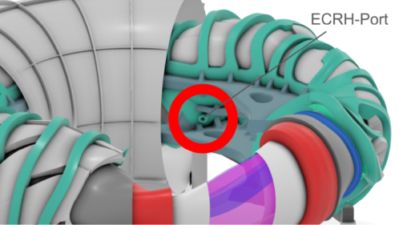

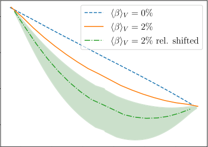

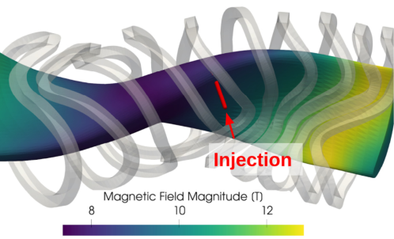

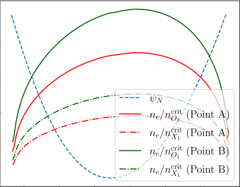

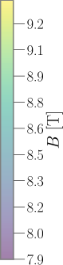

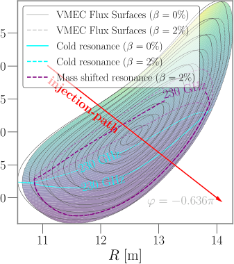

**Fig.** **23.** Visualization of edge islands (colored tubes) together with the LCFS of the
plasma boundary in vacuum (semi-transparent) in side and top view. Dark red plates
show the discrete target plates of the island divertor as used for the analysis in this
section.

remains viable, as it allows for effective heating despite higher plasma
densities due to its higher cut-off density.

_2.6._ _The_ _island_ _divertor_

QI stellarators, through their minimization of parallel plasma currents, allow for several stable X-points induced by deliberately placed
magnetic islands at the plasma edge. The island divertor concept is an
attractive candidate for a stellarator reactor due to its ease of access
to detached conditions [41], its observed large wetted areas [38], and
its comparably high technological readiness level, compared to other
stellarator divertor concepts. Compared to tokamaks, stellarators with
an island divertor usually feature very large connection lengths [39],
which broaden strike lines on divertor plates due to the effect of crossfield transport over long physical distances [39]. While stellarators at
reactor scale can have connection lengths in the range of kilometers,
typical tokamak values range between 5 and 50 m for comparable
machines [212].

The island divertor has been well studied in W7-X [37,42,213], although the W7-X open geometry has been found to provide insufficient
neutral gas compression for effective pumping and density control. For
Stellaris, we propose using a shape-optimized tungsten-based island
divertor that operates with strong detachment in steady-state. This
section describes initial efforts toward such a design.

For an island divertor to function effectively, it is crucial to sufficiently suppress the bootstrap current to prevent significant changes in
the rotational transform at the plasma edge. Such changes could shift
the location of the magnetic islands relative to the installed divertor
plates, potentially preventing the desired intersection between the islands and the target plates. Keeping the resonant island structures intact
ensures that the magnetic islands consistently intersect the divertor
target plates at the intended locations. As shown in Fig. 8, the total
bootstrap current for the stellarator design is calculated to be approximately 23 kA. This low value supports the use of resonant islands at the
edge to create the required X-points, as the edge rotational transform
is only calculated to change by 0.5% from vacuum conditions to the
equilibrium where the steady-state bootstrap current is achieved.

Fig. 13 shows that the stellarator concept presented in this paper
offers the desired magnetic island chain at the edge across a wide range
of plasma _𝛽_ values, from start-up (where no kinetic pressure is present
in the stellarator) to the final plasma _𝛽_ (where the islands are slightly
larger, but still preserved). This feature is necessary for installing a set
of divertor plates at the edge that cross the islands.

To meet the functional requirements of a divertor solution, the
system must efficiently exhaust particles while managing the heat
fluxes that impact material surfaces. Additionally, the divertor must
support robust tritium recycling and effectively remove helium ash. A
number of these issues are currently being addressed within a design
effort to upgrade the Wendelstein 7-X divertor, including tungstenbased plasma-facing components and enhanced geometrical features for

**Fig.** **24.** Visualization of target plates (black) in the cross section at toroidal angle
of _𝜑_ = 45 [◦], superposed with a Poincaré plot of the vacuum field. _𝑅_ is the cylindrical
major radius (which is 0 in the center of the device) and _𝑍_ is the Cartesian coordinate.

improved neutral gas pumping efficiency [214].

In this paper, we focus primarily on demonstrating the feasibility of
placing a set of target plates that intersect the 4/4 island chain, with an
emphasis on the thermal aspects of the divertor design. Other critical
aspects of the Stellaris divertor - such as recycling efficiency, ash removal, neutral gas compression, and erosion rates - are acknowledged,
but left for further exploration in subsequent studies.

The divertor plates proposed for Stellaris are optimized to limit heat
loads by following a two-step design approach, as outlined in [215].
In the first step, the plates are strategically positioned and adjusted
to ensure that a significant portion of the power crossing the ScrapeOff Layer (SOL) is captured by the plates. The second step involves
optimizing the length of the plates to ensure that the heat loads remain
below the desired flux limits. This approach aims to minimize the
divertor plate area, while ensuring that heat flux constraints are met.

A smaller divertor area is beneficial because it reduces the absorption of neutrons that are crucial for tritium breeding in the breeding
blanket, a topic further explored in Section 2.8. The location of the
target plates is illustrated in Fig. 23, showing a 3D visualization of
their placement, and in Fig. 24, where we display a cross section at
_𝜑_ = 45 [◦] . Unlike typical tokamak designs [212] and similar to the design
of the W7-X divertor [216], the selected divertor plates are toroidally
discontinuous.

To model the resulting heat flux, we utilize the code EMC3-Lite

[217]. The physics model employed by EMC3-Lite is based on an
anisotropic heat diffusion model along a set of field lines within a 3D
geometry, described by the equation

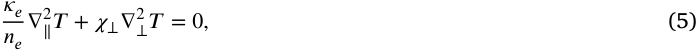
_𝜅𝑛𝑒𝑒_ ∇ [2] ∥ _[𝑇]_ [+] _[ 𝜒]_ [⟂][∇] ⟂ [2] _[𝑇]_ [=] [0] _[,]_ (5)

where the Bohm sheath boundary condition [218,219] is applied as

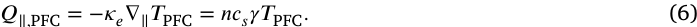

_𝑄_ ∥ _,_ PFC = - _𝜅𝑒_ ∇∥ _𝑇_ PFC = _𝑛𝑐𝑠𝛾𝑇_ PFC _._ (6)

In this context, _𝜅𝑒_ = _𝜅𝑒_ 0 _𝑇_ [5∕2] represents the Spitzer heat conductivity [220,221], with _𝜅𝑒_ 0 being a constant and _𝑇_ the temperature
(assumed identical for ions and electrons). Here, _𝑛𝑒_ denotes the electron density, and _𝜒_ ⟂ is the perpendicular thermal diffusivity, which
accounts for turbulent transport. _𝑄_ ∥ _,_ PFC represents the parallel heat flux
(expressed as power per unit area) on the Plasma Facing Components
(PFCs), while _𝑇_ PFC refers to the ~~√~~ plasma temperature at the PFCs. The
ion sound speed, _𝑐𝑠_, is given by 2 _𝑘𝐵𝑇_ ∕ _𝑚𝑖_, where _𝑘𝐵_ is the Boltzmann

constant and _𝑚𝑖_ is the ion mass, with _𝛾_ being the sheath transmission
factor.

A key advantage of the EMC3-Lite model compared to commonly
employed diffusive field line tracing (DFLT) methods [222–227] is

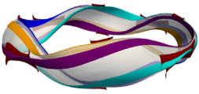

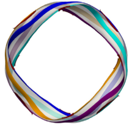

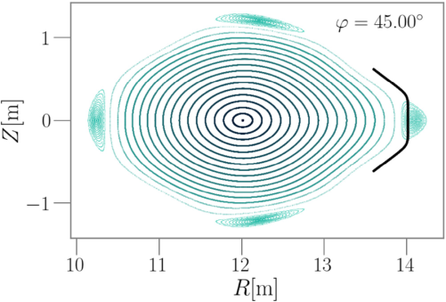

its ability to simulate bidirectional heat transport, allowing heat to
travel both forward and backward along the magnetic field line at
any point. In contrast, DFLT lacks this capability, which can result
in underestimations of heat loads in magnetically shaded regions, as
demonstrated in [228].

Compared to higher fidelity models, such as the EMC3-EIRENE
code [229], EMC3-Lite does not solve the Braginskii-like fluid equations for the edge plasma or include a kinetic neutral model. EMC3EIRENE has shown both qualitative and quantitative agreement with
experimental data from W7-X [230,231]. Although currently not ideal
for automated PFC design due to its computational cost and complexity,
and therefore not utilized in this study, EMC3-EIRENE would be
highly suitable for high fidelity modeling of devices like Stellaris, and
can be harnessed to better characterize detachment under reactor conditions, further advancing the divertor concept. Despite its simplified
approach, the EMC3-Lite model is expected to sufficiently cover the
physics relevant to the distribution of non-radiated heat exhaust over
the target plates [217,228]

An important factor in calculating the heat loads on divertor plates
is understanding the extent of edge radiation and the degree of detachment within the scrape-off layer (SOL). In this analysis, we assume
that the reactor operates under conditions of strong edge radiation and
nearly complete detachment, ensuring most of the heat flux is radiated
away in the last layers of the confined plasma and within the SOL itself.

Achieving stable detachment is critical, as it protects the divertor
target plates from excessive heat loads. To facilitate this, an active control system, likely involving a noble gas puff system, will be required.
Stable detachment and control mechanisms in island divertors have
already been demonstrated in the W7-X stellarator [42,232], as well as
radiative edge cooling techniques [233,234]. Both of these mechanisms
are expected to undergo further scientific investigation in W7-X.

For this analysis, we assume that 90% of the net heating power in
the plasma core is radiated before reaching the divertor region. This
means that, for a total of 500 MW of heating power, the divertor must
be capable of handling 50 MW. To accurately estimate the heat loads
on divertor plates, two additional hyperparameters are critical: (1) the
ratio of parallel to perpendicular transport, which depends on temperature and density, and (2) the perpendicular diffusion coefficient _𝜒_ ⟂,
representing turbulent cross-field transport. There remains considerable
uncertainty in estimating appropriate values of these parameters. For
the purpose of analyzing peak heat loads, we consider a lower bound of
_𝑇_ LCFS = 100 eV with _𝜒_ ⟂ = 3 m [2] s [−1] and an upper bound of _𝑇_ LCFS = 200 eV
with _𝜒_ ⟂ = 1 m [2] s [−1], where temperature values at the Last Closed Flux
Surface (LCFS) are taken as proxies to estimate the ratio of parallel to
perpendicular transport. Obtaining more accurate estimates for these
quantities should be a focus of future studies. The density was set to
_𝑛_ LCFS = 10 [19] m [−3] . Under these assumptions, our simulations indicate
that the divertor plates in Fig. 23 capture 97% of the non-radiated
heat for the lower parallel/perpendicular transport parameters ( _𝑇_ LCFS =
100 eV and _𝜒_ ⟂ = 3 m [2] s [−1] ) and 99% for the higher transport parameters
( _𝑇_ LCFS = 200 eV and _𝜒_ ⟂ = 1 m [2] s [−1] ). The corresponding peak heat
loads are simulated at 5 MW m [−2] and 9 _._ 5 MW m [−2], respectively. In the
scenario with higher perpendicular transport, the divertor wetted area
is broader, and therefore heat loads on the targets are lower, but more
of the heat is also reaching the first wall. The simulated heat fluxes for
the main target elements under the most pessimistic assumptions are
illustrated in Fig. 25. These values remain below 10 MW m [−2], which is
a commonly applied threshold for steady-state heat fluxes in divertor
designs [235]. This strike-line width is simulated to about 200 mm.

It is crucial to emphasize that the obtained values strongly hinge
on the assumed radiated power fraction, underscoring the importance
of robust detachment control in the divertor region, and potentially
additional edge radiation control using deliberate impurity seeding.
Complexity of the design and simulations increases when considering
transient heat flux limits. Such situations could arise during the start-up
phase of Stellaris, before full detachment is achieved, or in operational

**Fig.** **25.** Simulated heat load patterns on the proposed divertor targets in the 45 [◦] plane,
using the code EMC3-Lite, for _𝑇_ LCFS = 200 eV and _𝜒_ ⟂ = 1 m [2] s [−1] . The width of the
strike line is approximately 200 mm.

scenarios where detachment control is momentarily lost due to a failure
mode. For instance, it has been reported that in W7-X the divertor
plates experience significant heat loads during the initial seconds of a
discharge, before detachment is established and the heat loads on the
target plates effectively drop to zero [236]. As with the incorporation of
additional functional requirements into the divertor design, evaluating
transient heat loads is beyond the scope of this study and should be
addressed in the future.

In conclusion, this analysis serves as an initial step toward the
development of a reactor-relevant island divertor concept for Stellaris.
While this study primarily focused on the thermal management aspect
of the divertor, the optimization of PFC arrangements to fulfill all
exhaust requirements is an ongoing effort within the fusion community.
We note that it is crucial to transfer the insights and lessons learned
from the W7-X divertor to a new, fully integrated, reactor-relevant
divertor design. Such a dedicated effort will be instrumental in bridging
the gap between experimental findings and power plant applications.

_2.7._ _First_ _wall_

In the previous section, we considered the importance of strong edge
radiation to distribute a significant portion of the heat load across the
first wall before charged particle heat fluxes reach the target divertor
plates. The adopted operational scenario anticipates that approximately
90% of the heat flux is radiated in the outer layers of the plasma and
the SOL. In this section, we examine wall cooling capabilities. We adopt
a more conservative approach, assuming that 100% of the heating
power is radiated through core and edge radiation. This assumption
is specifically geared toward estimating the maximum heat load on
the first wall, which is critical for understanding peak temperature
conditions.

Our focus here is on a three-dimensional Finite Element thermal
analysis. We do not delve into the subject of erosion by neutral particles, which tends to be less significant in stellarators than in tokamaks,
provided that the SOL thickness is adequately large [237]. In the
Stellaris design, we ensure that the first wall is positioned at a minimum distance of 100 mm from the plasma. This spacing is expected to
mitigate erosion rates, allowing us to limit the present investigation to
thermal effects.

For broader context, the most comprehensive overview of the first
wall challenges in DEMO can be found in [238], though a comparable
in-depth study for stellarators is yet to be published. This gap in the
literature underscores the need for dedicated research into the unique
first wall challenges posed by stellarator designs like Stellaris. In order
to estimate the peak temperatures, we employ the same first wall geometry used in other sections of this paper, i.e., for divertor (Section 2.6)
and neutronics (Section 2.8) simulations. The wall encloses the edge

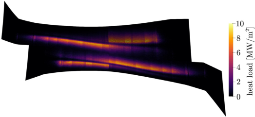

**Fig.** **26.** Visualization of the chosen first wall geometry, which leaves sufficient space
for the divertor target plates crossing the magnetic islands, shown here in different
colors for qualitative distinction. The chosen first wall geometry is the same across all
analyses in this paper.

magnetic islands that are used for the island divertor solution, and is
shaped to maximize the breeder volume outside of it (see Fig. 26 for a
visualization of the geometry).

While multiple first wall concepts for stellarators are currently being
explored, we select a straightforward approach for this analysis: a solid
EUROFER97 wall with a 2 mm-thick tungsten armor serving as the
plasma-facing surface. This choice is justified by the low loss of fast
particles, as demonstrated in Fig. 6, which permits the use of a solid
wall rather than more complex designs—such as those requiring liquid
walls to handle highly localized heat loads due to significant losses of
fusion-born _𝛼_ particles.

The first wall in this design incorporates several rectangular cooling
channels running in the toroidal direction, utilizing pressurized helium
gas as the primary coolant. We simulate helium at 8 MPa with an inlet
temperature of 350 [◦] C; the helium’s outlet temperature is computed
dynamically and is below 370 [◦] C. Here _inlet_ _temperature_ refers to the
temperature at the _front_ of the first wall; similarly, the _outlet_ _temperature_
is the temperature of the helium after flowing along the plasma-facing
side. Our study does not take into account the other two sides of
the first wall module. The conceptual dimensions of this first wall
design are illustrated in Fig. 27. Although an interlayer between the
EUROFER97 and tungsten layers will be included in the actual design,
it is omitted from our model due to its negligible impact on the overall
temperature distribution.

It is important to note that the feasibility of this manufacturing
process will be the focus of subsequent studies. However, we emphasize that the helium-cooled lithium lead (HCLL) blanket design serves
as a precedent, indicating the potential practicality of our proposed
approach.

In estimating the first wall temperature, we begin by calculating the
heat loads consistent with the design point outlined in Section 2.3 and
100% radiation of the heating power. The radiation source is divided
into two parts: core radiation and edge radiation.

First, core radiation is computed using the ‘0.5D-profiles’ introduced
in Section 2.3, considering contributions from Bremsstrahlung, tungsten impurity radiation, and synchrotron radiation. For edge radiation,
we model a Gaussian profile centered around _𝜌_ = 1 (discarding any
emission at _𝜌_ _>_ 1) to represent line radiation from partially ionized
impurities, such as Argon or Krypton [239]. These impurities would
need to be injected into the plasma to enable significant radiation of the
core heating power, facilitating a radiating edge and achieving divertor
detachment. Fig. 28 illustrates the combined emission region in one
cross section of the plasma from both core and edge as assumed and
calculated for the first wall power estimates.

**Fig.** **27.** Cross section at constant toroidal angle through the first wall design as used
for the FEM analysis in this section. Actual dimensions are _𝐻_ = 12 mm, _𝑊_ = 12 mm,
_𝑤_ = 5 mm, _𝐿_ = 27 mm, _𝑑_ = 3 mm, _ℎ_ = 5 mm. Channel cross sections are square in our
study for ease of modeling, but would be rounded in the actual wall. The wall section
in our model is a single strip wrapping around the poloidal direction, mainly due to
the fact that we have not fixed a tile design yet. This is not fully realistic, but it allows
us to perform a reliable analysis. The sector is defined by the toroidal angle and the
channels follow the parametrization of the surface, meaning they are not all the same
length, but they are all around one meter long.

**Fig.** **28.** Cross section through the plasma illustrating emission from both the plasma
core (green color legend) and edge (red color legend).

The first wall is also subjected to a volumetric heat load due to
neutrons produced by fusion reactions in the plasma. We include this
aspect in our model and simulations by incorporating the power density
data presented in the later Section 2.8, visually represented in Fig. 37.

We determine the peak temperatures in the first wall using a twostep process. First, to calculate the heat load on the first wall, we follow
the method suggested in [240], where the first wall power density, _𝑝𝑊_,
is obtained by integrating over a source volume _𝑉_ :

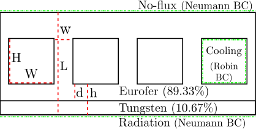

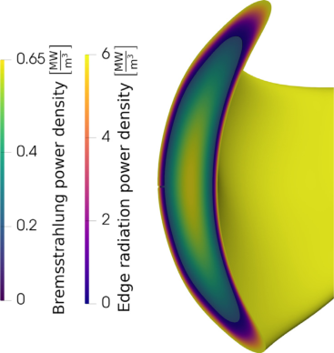

Here, _𝜙𝑠_ is the local emission; _⃗𝑟𝑆_ is the position vector of the source;
_⃗𝑟𝑊_ is the position vector to the wall; and _⃗𝑛_ is the normal vector of the
wall.

To implement this method, a regularization is necessary. We choose
to set the heat flux from a volume element on a surface area to zero
if the distance exceeds a characteristic length for the machine; in this
case, 8 m, since for the chosen configuration, this is a clear upper bound
on the distance between two points that have a direct line of sight to
eachthe integrandother. Whento zerocomputingfor contributionsthe integralthatin Eq.satisfy(7) numerically,( _⃗𝑛_ ⋅ _⃗𝑟𝑊_ - _⃗𝑟𝑆_ )we _<_ set0.
‖ _⃗𝑟𝑊_                                 - _⃗𝑟𝑆_ ‖

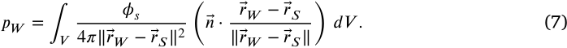
We verified a posteriori that this algorithm works effectively, as the
total emitted power from the LCFS and the total absorbed power by

)
_𝑑𝑉_ _._ (7)

( _⃗𝑛_ ⋅ _⃗𝑟𝑊_ - _⃗𝑟𝑆_
‖ _⃗𝑟𝑊_   - _⃗𝑟𝑆_ ‖

_𝑝𝑊_ = ∫
_𝑉_

_𝜙𝑠_
4 _𝜋_ ‖ _⃗𝑟𝑊_ - _⃗𝑟𝑆_ ‖ [2]

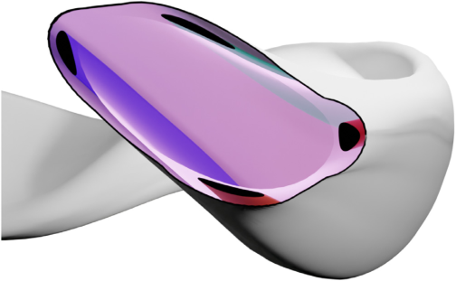

**Fig.** **29.** Visualization of the calculated first wall heat loads, distinguished by source.
The left-hand half shows the received core radiation, the right-hand half the received
edge radiation. Strong deviations in the toroidal and poloidal direction are observed.
The total power at the wall is the sum of both sources and its values span the range
0 _._ 18 MW m [−2] to 0 _._ 77 MW m [−2] .

**Fig.** **30.** Simulated temperature in a toroidal segment of the first wall, using the methods and parameters described in the text. With the current design, peak temperatures
are simulated to stay below 500 [◦] C and peak in the central module.

the first wall differ by only about 2%. The volume integral is carried
out in VMEC coordinates [241], and the Jacobian determinant ~~[√]~~ _𝑔_ is
obtained directly from the VMEC code.

In the second step, we solve the heat equation as a Finite Element
problem within a small toroidal section of the first wall. To obtain a
conservative estimate, we select a section that includes the geometry
points with the highest anticipated radiation load; the volumetric neutron load does not show significant enough variability to affect the
results if we changed section. For simplicity, the analysis omits the
divertor plates, recognizing that they could potentially shield some of
the heat loads on the first wall. We also assume that all radiation is
absorbed in the first layer of the wall, which we model as a Neumann
boundary condition in the Finite Element analysis. Any reflection or
black-body radiation effects of the first wall are neglected.

The method employed for this calculation is detailed in Appendix B.
The power loading on the first wall, distinguished by source is shown in
Fig. 29. The resulting temperature distribution for this design is shown
in Fig. 30. With the given assumptions, the steady-state temperature
remains below 500 [◦] C—a design limit typically imposed for EUROFER97 steels [238]. We conclude that a helium-cooled first wall can be
designed to withstand the heat fluxes anticipated for the high power
density design point proposed in this study. We note that evaluating
thermal stresses due to temperature asymmetries is beyond the scope
of this study, and warrants further investigation.

_2.8._ _Lithium_ _blanket_ _&_ _neutron_ _shield_

In this section, we explore a potential breeding blanket and shield
design for Stellaris. Research on stellarator breeding blankets in the

**Fig.** **31.** The geometry used in the neutronics simulations. Light green is the first wall,
orange is the homogenized breeding blanket, blue is the neutron shield, gray is the
vacuum vessel and green are the divertor modules. Coils are shown in turquoise. The
brown section shows the sector interface that will be introduced in Section 2.11.

literature addresses a range of topics, from balance of plant considerations [242] to detailed neutronics analyses [64,243–248] and
evaluations of structural capabilities [249,250].

Previous investigations into stellarator breeding blanket concepts
have primarily focused on dual-cooled lithium-lead and helium-cooled
pebble bed designs as potential breeders. These concepts aim to optimize both tritium breeding and structural integrity, balancing neutron
economy with effective heat transfer and material endurance.

However, prior reactor studies for stellarators have consistently
highlighted a critical challenge: the close proximity of the optimized
stellarator coils to the plasma. This proximity has been shown to be
insufficient to provide adequate neutron shielding, posing a significant
risk to the integrity and longevity of the coils in realistic reactor
settings [52,64]. Furthermore, the limited distance between the plasma
and the coils has been identified as the primary constraint on overall
machine size, directly influencing the feasibility of achieving a viable
reactor configuration [12]. The Stellaris concept strategically addresses
this challenge. By ensuring that the coils are positioned farther away
from the plasma in relative terms, this design provides greater space
for tritium breeding and neutron shielding, allowing the overall reactor
size to be reduced. The blanket concept itself was chosen from different
available options and finally adapted to match a set of requirements
that is in line with the overall machine design.

In the current breeding blanket design, the primary tritium breeding
material is a liquid lead-lithium (PbLi) eutectic alloy with 16 atomic
percent lithium. This material serves a dual role as a neutron multiplier
and tritium carrier. The liquid breeding material allows for drainage
to ease remote maintenance operations. The breeding zone is actively
cooled using water at pressurized water reactor (PWR) conditions,
ensuring efficient thermal management. EUROFER97, a low-activation
steel known for its structural integrity under fusion-relevant conditions,
is selected as the structural material for the blanket [251]. The nuclear
data cross sections for the materials are derived from the ENDF/B-VIII.0
library [252], with interpolations adjusted for material temperature.
To further enhance neutron management, an In-vessel Neutron Shield
(INS) composed primarily of tungsten-carbide (WC) is incorporated.
This material not only serves as a neutron shield, but also functions as
a neutron reflector, effectively increasing the backscatter to the blanket
and boosting the tritium breeding ratio (TBR).

The Vacuum Vessel (VV) design is modeled after the EU DEMO
project [253], utilizing SS316LN as the structural material. The design
includes a neutron shield in the bulk cooling region, with a thickness
reduced from the originally proposed 60 mm to 50 mm. Boron-carbide
(BC) is chosen for the shield due to its superior absorption cross section
in the thermal neutron range compared to WC.

Active cooling is essential for maintaining the structural integrity
of the breeding blanket, as the chosen structural material, EUROFER97,
has a maximum operating temperature limit of 550 [◦] C [254]. The breeding blanket’s composition is optimized for both thermal management
and tritium breeding, consisting of 73.5% PbLi eutectic, 12.5% water,

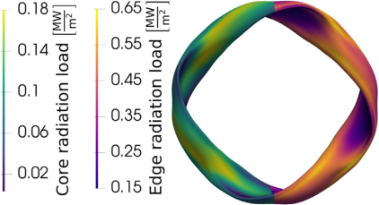

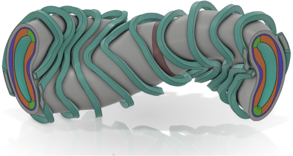

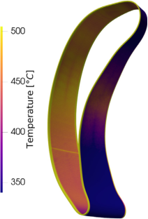

**Fig.** **32.** Cross section visualization of the radial build at the _𝜑_ = 0, _𝜑_ = _𝜋_ ∕8 and
_𝜑_ = _𝜋_ ∕4 cross sections (where _𝜑_ is the cylindrical toroidal angle). The thin green line
is the first wall, red is the homogenized breeding blanket, blue is the shield, and white
is the vacuum vessel. Note that the divertor is not included in this visualization.

and 14% EUROFER97 by volume. This composition accounts for the
segmentation effect in the structural budget, ensuring the blanket’s
performance and durability.

To achieve a tritium breeding ratio (TBR) above 1.05, considered
sufficient to close the fusion fuel cycle [255], a lithium-6 enrichment
level of 70 % has been chosen.

The decision to use a water-cooled breeding blanket simplifies the
power plant’s primary and secondary cycles, aligning them with those
of a conventional PWR. The high water content in the blanket has
a significant thermalization effect, which shifts the neutron spectrum
toward thermal energies—increasing the reaction rate and improving
tritium production. Additionally, the high heat capacity of water compared to gas cooling reduces the need for large cooling ports, which
helps in optimizing the overall design.

The first wall, as described earlier, is proposed to be helium-cooled,
while the breeding blanket utilizes water cooling. This necessitates the
use of two distinct cooling loops. The choice of helium cooling in
the first wall is driven by two main considerations. First, the lower
pressure in the helium loop allows for a thinner first wall, enhancing
thermal efficiency. Second, helium cooling offers greater resilience
against critical heat flux events, which are particularly challenging to
manage in high-pressure water cooling systems.

For the breeding blanket segmentation, one potential configuration
is the single module segment (SMS) design [256]. In this configuration,
each toroidal section of the reactor is split into poloidal segments
approximately every meter. Each segment is supplied independently to
ensure modularity and improve detectability of failures within a module. Within each segment, the manifold configuration directs helium
through back manifolds located behind the neutron shield, routing it radially toward the first wall, while the breeding blanket’s water cooling
system is fed through separate manifolds and distributed poloidally.

This modular approach reduces the need for complex manifold
systems at the back of the blanket, thereby creating more space for a
sufficiently large INS. The simplified geometry of the SMS design not
only facilitates maintenance but also enhances the overall efficiency of
neutron shielding and tritium breeding, making it a compelling choice
for the reactor’s blanket configuration.

Given the varying plasma-to-coil distance across different poloidal
and toroidal positions, we implement variable thicknesses for both the
blanket and the shield. This design strategy enables the optimization of
TBR while ensuring adequate neutron shielding at the cryogenic coils.
For instance, the INS thickness at various toroidal angles is shown in
Fig. 32, with a minimum thickness of 100 mm and a maximum thickness
of 225 mm. Additionally, the averaged thicknesses for each layer of the
radial build are illustrated in Fig. 34. To optimize the thickness of
the INS, we use a simple one-dimensional exponential decay model
for the fast neutron flux within the radial build, using two material
fractions for INS and BB. In particular, we vary the shielding thickness,
using a fixed first wall and outer shield surface, in order to minimize

**Fig.** **33.** The distribution of the neutron wall load on the first wall of Stellaris operating
in full power, at 2700 MW fusion power.

**Fig.** **34.** Averaged component thicknesses and gaps of the radial build. Values are only
approximate, as large variations in both toroidal and poloidal directions exist.

the neutron flux variation in a point-by-point fashion. The choices of
materials for INS and BB are kept constant during this optimization.

In the following neutronics simulations, we employ the 3D neutron Monte-Carlo simulation code OpenMC [257,258], integrated with
DAGMC [259] for efficient particle transport simulations. The CAD-toDAGMC tool [260] was utilized to convert the detailed CAD geometry
into a meshed representation suitable for the analysis. A comprehensive three-dimensional (3D) 90-degree reactor model is initialized,
incorporating multiple material layers, each homogenized into a single
OpenMC material for simplification. The reactor geometry used in the
neutronics analysis is depicted in Fig. 31, which illustrates the various
reactor layers, including the magnets described separately by their
casings and winding packs. For the particle sources, we employ a
neutron source function based on the plasma profiles introduced in Section 2.3, utilizing the nuclear reaction rates from [137]. The neutronics
simulations presented in this section are consistent across both physics
design Point A and Point B, as defined in Table 5, because the fusion
power remains constant and the effects of plasma temperature on the
neutron source distribution are neglected.

To approximate the neutron source, we use a monoenergetic source
at 14 _._ 06 MeV, with the spatial distribution discretized into 30 radial
points, 50 poloidal points, and 100 toroidal points. This source is
then represented as multiple point sources in the OpenMC simulation
environment. The resulting neutron wall load is shown in Fig. 33, using
the method proposed in [240].

We proceed to analyze the chosen breeding blanket and shielding
concept through five key evaluation steps:

   - Tritium Breeding Ratio Analysis: We assess whether the design
achieves sufficient tritium breeding using a multi-layer 3D model
that includes separately homogenized materials for each layer.

   - Power Multiplication: Due to endo- and exothermal nuclear reactions within the blanket, we estimate to which degree the total
neutron power is amplified by the blanket, a critical value to
estimate the commercial viability of a fusion power plant.

   - Neutron Shielding for Superconductor Protection: We evaluate
the effectiveness of neutron shielding in minimizing fast neutron
flux into the superconducting coils—ensuring long operational

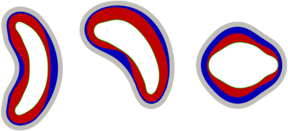

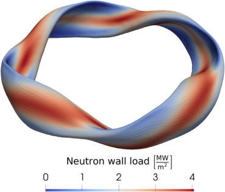

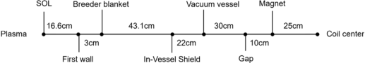

lifetimes for the device, as fast neutron fluences are measured
to significantly degrade the performance of superconducting coils
after 3 × 10 [22] m [−2] [261]. The neutron fluence on the copper
stabilizer should also be considered as the conductivity has been
shown to reduce with neutron irradiation by 5% after a neutron
fluence of 1 _._ 5×10 [23] m [−2] [262]. One strategy to potentially address
a conductivity decrease would be to make the copper stabilizer
thicker to accommodate the anticipated decrease in conductivity.

   - Neutron Shielding for Cryogenic Area Protection: We determine
whether the neutron shielding sufficiently reduces nuclear heating in the cryogenic regions to acceptable levels, ensuring the
integrity of the cryogenic components.

   - Lifetime Estimation of Key Components: We estimate the operational lifetime of the main components of the machine, considering the neutron flux and the resulting material degradation over
time.

Safety and activation calculations, as well as structural and thermal
simulations, fall outside the scope of this analysis.

_Tritium_ _breeding_ _ratio_ _analysis._ We performed a neutronics simulation
using 15 × 10 [6] particles per batch over 5 batches, tallying TBR, nuclear
heating, and neutron flux. Periodic boundary conditions were applied
at the _𝜑_ = 0 and _𝜑_ = _𝜋_ ∕2 surfaces, where _𝜑_ represents the toroidal
angle. No particle loss was observed during the simulation, ensuring
accurate results.

The simulation was focused solely on neutron transport, with the
nuclear heating tally assuming that secondary gamma power is deposited locally. The computed TBR, accounting for the remote maintenance solution discussed in Section 2.11 and a conceptual divertor
model, is 1 _._ 1070 ± 0 _._ 0002. After considering a 3% reduction due to the
heating ports, the final TBR stands at 1 _._ 074, which includes margins to
account for uncertainties and potential incomplete models.

_Power_ _multiplication._ Using the same 3D neutronic simulation that was
employed for the TBR calculation, we also tallied the power multiplication within the blanket, which primarily results from exothermal (Li-6,
n) reactions. From this analysis, we obtained a power multiplication
factor of 1.2. The initial 2160 MW of neutron power produced by
the reactor is thus amplified within the blanket to a nuclear power of
approximately 2611 MW. This thermal power is what can be extracted
from the blanket and shield systems, contributing to the overall energy
balance of the power plant. Corresponding simulation results are shown
in Fig. 37.

_Neutron_ _shielding_ _for_ _superconductor_ _protection._ To ensure sufficient statistical accuracy in the estimation of fast neutron fluxes in the volume
of the superconducting magnets, we performed a dedicated simulation
with a total of 2 _._ 5 × 10 [9] Monte Carlo particles.

The resulting fast neutron flux ( _𝐸𝑛_ _>_ 0 _._ 1 MeV) at the magnets is
illustrated in Fig. 36. The average fast neutron flux is estimated to
be 1 _._ 8 × 10 [13] 1∕m [2] ∕s. As the statistics of the Monte Carlo simulation
even at 2 _._ 5 × 10 [9] launched particles is particularly low, and assuming
local shielding can be used in severely loaded sections, we consider
the 99th quantile for the lifetime estimation of the coils due to fast
neutron flux, which is about 9 _._ 5 × 10 [13] 1∕m [2] ∕s. Estimating the allowable
fluence for ReBCO superconductors (from degradation of the critical
current density in the superconductor by fission neutrons [261]) as
3×10 [22] 1∕m [2], the magnet system would have a lifetime of approximately
10 full power years at a fusion power of 2700 MW.

Additionally, the neutron spectra at the coils are presented in
Fig. 35, providing further insight into the distribution of neutron energy
levels impacting the superconducting magnets.

**Fig.** **35.** Neutron flux per unit lethargy, as obtained from OpenMC with the setup described in the text. The spectra describe the winding pack of all six coils
independently at full power.

**Fig.** **36.** Fast neutron flux, as obtained from OpenMC with the set-up described in
the text. The figure shows the unstructured mesh tally on the magnet. The maximum
neutron flux is 7 _._ 27 × 10 [13] 1∕m [2] ∕s∕GWf (neutron flux normalized by GW fusion power),
and the mean value is 6 _._ 6 × 10 [12] 1∕m [2] ∕s∕GWf.

_Neutron_ _shielding_ _for_ _cryogenic_ _area_ _protection._ For the nuclear heating
at the winding pack, we obtain an average value of 35 _._ 5 W∕m [3] . This
heat load will need to be managed by the cryo-plant of Stellaris and
is in the order of the EU DEMO target, which is about 50 W∕m [3] peak
nuclear heating [263].

However, it is important to note that the EU DEMO requirement is
designed for a 4 K cryogenic environment, whereas the magnets in Stellaris are anticipated to be cooled to 20 K. Operating at this higher temperature offers an increase in efficiency of the cryogenic plant. Overall,
maintaining an average nuclear heating below 50 W∕m [3] is considered
an applicable reference for ensuring viable power plant efficiency,
considering the parasitic power consumption by the cryo-plant.

It should also be noted that local differences in nuclear heating
power density can lead to local temperature variations within the
winding pack, which again can affect quench behavior. However, these
temperature differences are highly dependent on the detailed cooling
design within the winding pack and a respective analysis is left for
further studies.

_Lifetime_ _estimation_ _of_ _key_ _components._ To estimate the operational lifetime of key reactor components, we calculate the Displacements-PerAtom (DPA) in regions experiencing the highest neutron flux, specifically the first wall and the divertor.

Neutron damage was tallied using OpenMC via the ‘444 Microscopic
Cross-Section Type (MT) reaction’ for iron isotopes in the first wall and
copper isotopes in the divertor. DPA values were evaluated using two
models: the NRT model [264] and the more recently developed ARC
model [265].

The ARC model, which has shown good agreement with molecular
dynamics simulations, particularly at higher energies [266], provides

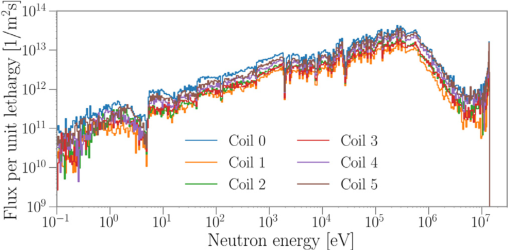

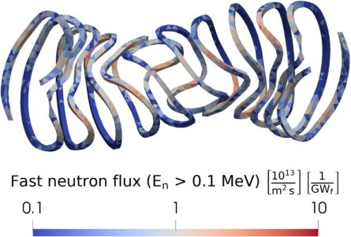

**Fig.** **37.** Nuclear heating, as obtained from OpenMC with the set-up described in the
text. The figure shows a cross-section through the _𝑍_ = 0 plane of the radial build. The
maximum heat deposition is at the first wall, with a peak value of 12 _._ 1 MW∕m [3] ∕GWf.
White lines mark the boundary of the neutron shield and the sector splitting bellow.

a more accurate estimate of neutron damage in these components.
However, we also present results from the NRT model, which has been
commonly used in past studies.

Most lattice-atom interactions occur at high neutron energies ( _𝐸𝑛_ _>_
1 MeV), where the Primary Knock-on Atom (PKA) energy typically
exceeds the cutoff energy _𝐸_ cutoff. Beyond this threshold, most of the
excess energy is lost to electronic interactions. The damage energy per
displacement process is thus approximated as _𝐸_ D ≈ _𝐸_ cutoff. The cutoff
energy was computed as _𝐸_ cutoff = 1000 ⋅ _𝐴_ keV, where _𝐴_ is the atomic
mass [267]. For our simulations, 56 keV for Fe and 63 _._ 5 keV for Cu were
used in the ARC model to compute the displacement efficiency.

DPA was determined by dividing the number of displacements by
the atomic density of the respective element in the material. For example, in the first wall, DPA was calculated as the displacements of iron
isotopes normalized by the atomic density of iron in the homogenized
material.

Using the NRT model, the peak DPA in the first wall is 34 _._ 9 DPA∕FPY,
while the ARC model yields 10 _._ 7 DPA∕FPY, where FPY represents fullpower years. Similarly, in the divertor, the peak DPA is evaluated to
36 _._ 2 DPA∕FPY for the NRT model and 6 _._ 1 DPA∕FPY for the ARC model.
These values align with previous studies, which report similar ratios for
Fe and Cu under 14 MeV neutron irradiation [268].

Fig. 38 illustrates the ARC-DPA simulation results for the first
wall. After four years of operation at full 2700 MW fusion power, the
cumulative peak DPA in the first wall is approximately 42 _._ 8 DPA, while
for the divertor cooling elements, it is approximately 24 _._ 4 DPA.

In addition to DPA, the accumulation of helium and hydrogen
within materials is also a critical factor in determining the lifespan of
components in a fusion reactor. These quantities are typically measured
in atomic parts per million (appm). Reliable first-principle simulations
for the accumulation of helium or hydrogen in materials induced
by 14 MeV neutrons are currently not available. Instead, heuristic
estimates from related studies suggest an accumulation rate of approximately 10–30 He appm/DPA [269–271], although the methodologies behind these estimates are sometimes questionable and lack
the required data for benchmarking purposes. Applying these esti

**Fig.** **38.** Damage rate on the first wall described by the Displacement Per Atom (DPA)
per GW of fusion power per year using the ARC-DPA model. (a) displays the outboard,
and (b) shows the inboard side. Peak value is 3.9 DPA/GWf /year and is located on the
inboard side, around the mid plane. The mean integrated value is 2.2 DPA/GWf /year.
The colorbar is shared between the two sub-figures.

mates to the first wall of Stellaris suggests a range of 40–120 He
appm/FPY/GWf, or equivalently 110–320 appm per full power year
(FPY) in peak locations.

The actual lifespan of these components will depend not only on
DPA and on the accumulated helium and hydrogen gases due to nuclear
reactions, but also the operational temperatures, and the structural
requirements of the materials. One particularly important factor is the
ductile-to-brittle transition temperature (DBTT), which is influenced
by both the DPA and the accumulated helium within the material.
Ensuring that structurally significant materials such as those in the
first wall and blanket remain above the DBTT throughout the reactor’s
operational life is crucial. EUROFER steel under irradiation tends to
harden (increasing yield strength), but also becomes more brittle. Operating steel in this hardened, brittle state is not necessarily disqualifying,
provided that the material is used well below its yield strength limit.

As no structural stress simulations are performed in this analysis,
the parameters for Stellaris are compared with available literature data
for context and understanding. At negligible helium accumulation (He
appm), the estimated DBTT for EUROFER97 under neutron irradiation
is expected to occur around 200 [◦] C [272]. However, when helium
accumulation is present (a more relevant scenario for this analysis), the
DBTT value carries significant uncertainties due to the limited material
data available. For the EUROFER97-based first wall of Stellaris, which
is expected to operate around 500 [◦] C (see Section 2.7), the wall should
remain well above the DBTT, despite the uncertainties induced by
helium accumulation in the material [273].

Given these conditions, we estimate that Stellaris could achieve
about 4 full power years of operation at 2700 MW fusion power, corresponding to approximately 42.8 DPA, before key components would
need to be replaced by remote maintenance. Future high-flux, 14 MeV
neutron irradiation facilities [274,275] are expected to provide greater
clarity for these estimates. Furthermore, a detailed structural analysis
of the first wall, blanket, and shield systems could align the structural
requirements with the material properties, helping to determine when

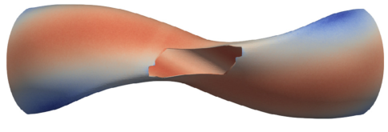

**Table 6**
Key parameters values as obtained from a 3D OpenMC calculation. TPF: is full power fusion. 'Power Multiplication' is sometimes also called 'Energy Multiplication' in the literature.

| Description | Value |
|---|---|
| TBR | 1.15 |
| Power Multiplication | 1.20 |
| Fast neutron flux (99th quantile) at coils (1/m²/s) | ~5 × 10⁷ |
| Coil lifetime (99th quantile) (DPF) | ~10 |
| Peak fast neutron flux at FW (1/m²/s) | ~5 × 10¹⁴ |
| Peak neutron wall loading at FW (W/m²) | ~1.5 |
| Estimated first wall structure lifetime (FPY) | ~5 |
| Peak neutron heating in blanket (W/kg) | ~6 |
| Mean cryogenic structure heating (winding pack) (W/kg²) | 0.5 |

[Figure 29: Physical dimensions of the first coil of the stellarator, including its casing (in mm). With casing, the coil is around 10.4 m tall, has 9.9 m of radial extent, and extends over 6.6 m in toroidal direction.]

the safety margin relative to the yield strength limit might be exceeded.

Looking forward, several strategies could be employed to manage elevated neutron irradiation levels, including:

- Targeted Replacement of High-DPA Sections: replacing only the first wall sections experiencing the highest Displacements-Per-Atom (DPA) levels could be an efficient strategy. These targeted replacements would not only extend the overall reactor lifespan, but also provide valuable samples for material characterization under high-DPA conditions, contributing to better understanding and prediction of material behavior. Analysis of first wall replacement has not been performed, but it may be necessary to limit the amount of first wall replacements so that such replacements can be carried out during scheduled maintenance periods.

- Increasing Radial Distance Between Plasma and First Wall: by increasing the distance between the plasma and the first wall, the neutron flux density at the wall can be reduced, lowering the DPA rate and extending the lifetime of the wall and other nearby components. Non-constant offsets between the first wall and the plasma could be employed to optimally utilize the available space while remaining within first wall, breeding and shielding limits. Non-uniform offsets could also be used to maximize the of DPA across the first wall by moving parts of the first wall that have the highest DPA outwards. The magnitude of any achievable reduction in DPA by optimizing the offsetting of the first wall to the plasma has not been studied within this paper, but is investigated in another analysis [246].

- Applying Treatments to Enhance EUROFER9? Properties: enhancement to certain grades of EUROFER, as explored in studies such as [275], could improve its resilience to radiation damage and potentially increase the lifespan of the first wall without requiring major design changes.

- Using a More Neutron-Resilient Material: exploring the use of alternative materials such as High-Entropy Alloys composed of ODS steels or other Reduced Activation Ferritic/Martensitic (RAFM) steels could offer significantly improved performance as compared to EUROFER9?. However, these materials currently have a lower technological readiness level (TRL), and implementing would require further research and development [277,278].

Additionally, the feasibility of using ferromagnetic steels such as EU-ROFER — which would affect the magnetic configuration of the stellarator and hence the confining properties — would need to be validated.

In conclusion, we have presented and performed conceptual study for the blanket and neutron shield system of Stellaris. This study includes modeling of the TBR, fast neutron flux (relevant to superconducting magnets, nuclear heating in the cryogenic areas, and DPA at the first wall. Key parameters are summarized in Table 6. It is important to emphasize that this study employs a simplified homogeneous treatment of the shell and breeder zones.

Future work should focus on advancing this preliminary model by conducting a detailed analysis of a heterogeneous blanket configuration. This will involve evaluating the neutronics, mechanical, and thermal performance of such a blanket, alongside a thorough manufacturing assessment. A critical risk to address is the interaction between lead-lithium and water, a well-documented exothermic reaction [279]. To mitigate this, we currently rely on established designs like the WCLi, which incorporates double-walled tubes to bolster the reactor's safety and reliability [280]. Additionally, further research on radiation activation and experimental studies—will be necessary to address corrosion challenges and to understand the magnetohydrodynamic effects in liquid lithium-lead, similar to the studies performed in [281]. Activated corrosion products, activated lithium-lead and activated water will also require careful shielding considerations, due to their mobility around the building. These steps will be crucial for refining the blanket and shield design to ensure it meets the demands of a commercial fusion reactor.

## 2.9. Magnets

In Fig. 29 we display a selected coil of Stellaris with its corresponding casing, including physical dimensions in millimeters. The coils have an approximate size of 7 × 5 × 10 m, with a typical circumference of 25 m, and the conductor needs to be manufactured using superconducting material, for which multiple options exist. High-temperature superconductors (HTS), particularly ReBCO-based superconductors, have important advantages for high-field magnetic confinement fusion. Most notably, they allow the design to use higher magnetic fields strengths as the superconducting material can withstand much larger critical current densities at high magnetic field strengths compared to conventional low-temperature superconductors [282–285]. The technology is also gaining maturity, with ReBCO conductors tested at relevant parameters—despite outstanding problems such as quench management and high stored energy. At the time of writing, the current record achieved with HTS magnets operating at 20 K stands at around 45.5 T [286] of peak field on the HTS. The SPARC tokamak [13] is currently being constructed using ReBCO-based magnets.

Despite their advantages, ReBCO-coated conductors pose several challenges for coil design. HTS cables are assemblies containing hundreds of individual HTS tapes in a specific arrangement. The major limitations for cables, especially in fusion applications, can be attributed to the high strains, resulting from thermal stress and strain that the conductor and the cable endure during the manufacturing process and operation [287]. The significant anisotropy caused by the anisotropic behavior of the ReBCO material under magnetic fields leads to critical current density degradation at much lower the magnetic fields perpendicular to the flat face of the tape than for magnetic fields parallel to the tape, making the tape alignment a important point of interest. Third, ensuring electro-thermal stability (i.e., avoiding quench events and loss of superconducting state) is crucial during the design phase.

Several successful cabling techniques have been developed over the past decade to address these challenges. Among these are concepts such

## Coil Design

**Coil 5** | **Winding Pack (Cross Section)** | **Unit Cell**

[Figure 40: A perpendicular cross section through the winding pack of the coil. The casing is not shown here, and the stacks are not aligned with the field for the sake of clarity. Note that **φ** represents the toroidal coordinate, **θ** the poloidal coordinate and **r** the radial coordinate.]

### Table 7

Material fractions in a winding pack of one of the Stellaris coils.

| Material | Fraction (%) |
|---|---|
| Conductor | 15 |
| Copper jacket | 10 |
| Insulation | 45 |
| Steel | 26 |
| Helium (cooling) | 4 |

For the superconducting magnets in this study, we propose a Non-Insulated (NI) concept. The NI method in the present work ensures that there is electric insulation between pancakes (azimuthally insulated) but only steel (electrical contact) between radial turns. More specifically, referring to Fig. 40, electric insulation between pancakes implies that current can only move in the *θ*-coordinate direction (azimuthal) through the joints/connections at the first and last turn of each pancake (the yellow stacks represent the electric insulation). On the other hand, radial electric contact means that current can leak in the *r*-coordinate direction (radially outward), particularly during a quench. The conceptualization of a concept is aligned with the current literature (e.g., TFMC and FSL/NHMFL [288,289]).

Unlike low-temperature superconducting (LTS) magnets, HTS magnets are fundamentally unlikely to quench unless they have a serious defect or issue. Nevertheless, designing coils to function if they quench is necessary for risk mitigation purposes. NI coils offer a self-protecting mechanism without complex external systems, allowing current to bypass local hotspots and enhance thermal stability. They are passively protected by natural current redistribution. However, large stored magnetic energy and high current density (final current distribution especially with low critical current regions) can still cause damage [288, 289]. For highest quality damage, it is crucial to ensure that the ratio of operational current density to critical current density *j*op/*j*crit varies only very weakly along a turn, and does not exceed a critical limit, which we take here to be 80%.

For the conductor design discussed here, we consider a fully presoldered, field-aligned stack REBCO tape stack surrounded by a Cu jacket that constrains the tape stack in the chosen orientation, similar to the CICC concept of [290]. We place the flat face of the individual RE-BCO tapes and align the *ab*-plane (flat face) of the ReBCO tapes/stacks with the magnetic field direction. We also compare the resulting to the whole winding pack an approach proposed for the helical (heliotron) reactor with the STARS conductor [291,292]. The resulting material fractions of each winding pack are summarized in Table 7. We assume mature and advanced manufacturing techniques. Additionally, we utilize grading techniques (i.e., increasing the number of REBCO HTS tapes where the magnetic field is lower [293]) to achieve an almost constant *j*op/*j*crit ratio along the turns.

The conductor is wound in non-planar stacked 'radial' plates made of stainless steel 316 LN, similarly to the MUSE or CIEMAT-UPM designs [293,294]. Fig. 40 shows a cross section of the winding pack for a 250-turn coil (coil 4) and the geometric and material details of the unit coil cell. For different coil sizes, the same winding pack has a variable number of turns, ranging from 225 to 324 turns per coil.

We note that the number of pancakes per coil is independent from the HTS tape stack orientation. The winding pack orientation is chosen so that a flat face is presented to the plasma at each point, allowing for a vacuum vessel surface that is as flat as possible and maximizing available space for the radial build while minimizing peak fields within the winding pack. Concretely, the orientation of the winding pack is chosen to align with the magnetic field orientation at each point along the table for each turn inside a coil winding.

Each turn is sized at 35 mm × 20 mm, with a 6 mm × 6 mm soldered tape stack embedded in a Cu jacket, covered with a steel casing.

With these dimensions, the current per turn is constrained to a maximum value of 50 kA, consistent with [294]. The flat plate concept leads to realize the connection between the superconductors in the coils at cryogenic temperatures to the bus bars, which are connected to the coil power supplies, at room temperature. The magnet is cooled to 20 K using supercritical helium channels at 15–20 bar. This approach entails using the casing as the pressure vessel itself, eliminating the

need for leak-tight pressure seals between the plates/turns. However, issues such as uncontrolled helium flow distribution could arise; the cooling strategy is still under discussion. An alternative option involves closed channels with welded lids or soldered-in copper/steel pipes. In this paper, the operating temperature (Top) is set to 20 K to provide a conservative basis for analysis, but it may be desirable to lower the operating temperature to around 10–15 K to provide more margin. At the chosen unit cell configuration, the current density in steel is about 112 A/mm², and the current density per copper fraction is approximately 353 A/mm². The overall winding pack density follows similar proposed designs [295,296]. The resulting material fractions of each winding pack are summarized in Table 7. We assume the same coil features in Table 8. Note that we report the specs for only six coils due to symmetry (i.e., 48 coils divided into four periods, with each period containing 12 coils of independent design captured), simplifying the representation.

In the following subsections, we discuss a high-level concept of a magnet system for the first version of the coils for the Stellaris class of stellarator, focusing on the main challenges and open questions. Our focus here is on the feasibility of the concept, as opposed to a full engineering analysis. Some simplifications/assumptions are noted where appropriate. The model does not constitute a thin shell analysis. Instead, to validate the proposed design, we discuss the maximum field on the conductor, the field variation within the coil windings, the thermally induced curvature and torsion, the structural integrity of the winding pack, the contact pressure between turns, and peak temperatures and currents during a quench event.

*Peak fields and critical current density.* The peak magnetic field in stellarator coils can vary significantly from one coil to the next, as typical in QI stellarators with a large magnetic mirror ratio. The peak field is also heavily dependent on the size of the winding pack, and is a decisive parameter for force and critical current density calculations. Here, we compute the peak fields using a 3D magneto-static model carried out by coupling finite element analysis and the commercial software COMSOL MultiPhysics® [297]. For this calculation, we assume that the coil geometry is represented by current-carrying winding packs. This section, Fig. 41 shows the peak fields for each independent coil. At the chosen V-T axis-averaged magnetic field strength, the peak field inside

The main coil parameters for every unique coil in Stellaris. 'WP' stands for winding pack. $J_{op}$ refers to the operational current density (in the text $J$ is used equivalently). Minimal distances are with respect to the neighboring coil.

| Coil Number | 1 | 2 | 3 | 4 | 5 | 6 |
|---|---|---|---|---|---|---|
| I (total Amp-turns) [MA] | 15.4 | 14.4 | 13.8 | 12.9 | 12.9 | 11.2 |
| Number of turns | 324 | 324 | 289 | 289 | 286 | 225 |
| Turn current [kA] | 47.6 | 44.9 | 47.8 | 44.7 | 46.8 | 49.8 |
| $J_{op}$ [A/mm²] | 119 | 112 | 120 | 112 | 122 | 124 |
| Tape current [kA] | 1340 | 1240 | 1340 | 1240 | 1310 | 1390 |
| Cross section side length [mm] | 500 | 500 | 500 | 500 | 500 | 500 |[?] (approx, from context) | 400 | 480 | 400 | 480 | 400 | 400 |
| Min. casing-to-casing dist. [m] | 1.06 | 1.04 | 1.05 | 1.08 | 1.11 | 3.07 |
| Coil mass, no casing [ton] | 44.5 | 52.3 | 48.3 | 55.4 | 50.0 | 43.6 |
| Peak field [T] | 24.6 | 23.1 | 23.0 | 23.0 | 21.4 | 19.5 |
| Max. curvature [m⁻¹] | 2.63 | 1.75 | 1.54 | 1.38 | 1.34 | 0.52 |
| Min. curvature radius [m] | 0.51 | 0.57 | 0.82 | 0.60 | 0.97 | 0.44 |[?] | 0.38 | 0.57 | 0.65 | 0.73 | 0.75 | 1.94 |
| Tilt/rotation [rad/m] | 2.41 | 2.75 | 1.74 | 2.87 | 1.68 | 1.27 |
| Max. $J_{op}/J_{crit}$, no grading (%) | 60.5 | 56.5 | 60.2 | 54.3 | 56.9 | 55.9 |
| Max. $J_{op}/J_{crit}$, 100% grading (%) | 60 | 60 | 60 | 60 | 60 | 60 |
| Tape length no grading [km] | 100 | 120 | 112 | 128 | 115 | 93 |
| Tape length with grading [km] | 107 | 141 | 146 | 154 | 121 | 108 |
| Tape width on winding pack [m] | 0.34 | 0.46 | 0.42 | 0.49 | 0.44 | 0.41 |[?] | 0.45 | 0.46 | 0.40 | 0.52 | 0.46 | 0.40 |
| Min. WP Inner Force [MN/m] | 174 | 131 | 113 | 113 | 115 | 85 |
| Peak stress [MPa] | — | — | — | — | — | — |
| Self-inductance [H] | 1.20 | 1.44 | 1.10 | 1.50 | 0.99 | 0.62 |
| Total energy [GJ] | 11250 (2.70 GJ per field period) |
| Turn-to-turn contact res. [aΩ] | 11.2 | 11.2 | 10 | 10 | 8.83 | 8.81 |
| Charging time [h] | <300 |
| Max. ramp during quench [K] | <300 |

[Figure 41: Results of a 3D magnetostatic finite-element simulation to test half-models, taking into account the field generated by Stellaris. Pictured is the magnetic field strength at the surface of the winding pack (shown for each surface) in the simulation, with values reported in Table 8. The labels indicate the maximum value of the field for each coil and the colormap indicates the norm of magnetic field in Tesla (T).]

the winding pack reaches 24.9 T.

We now evaluate the effect of the high magnetic field strength outside of the critical current of the winding pack cable. ReBCO based HTS tapes have a strong dependence of the critical current on the magnitude of the field component perpendicular to the direction of the current and the angle between the field and the so-called $c$-axis of the ReBCO crystal, which is usually (but not always) orthogonal to the flat side of the tape. We model this effect by using the magnetoanisotropy parameterization of the critical current density as a function of the field strength and the angle between the field and the $c$-axis suggested in [?ref]. We fit this model to a dataset of measurements of the critical current. The data from ReBCO 2G HTS wire collected at 20 K and different field strengths and angles with respect to the tape [?ref]. The critical current density presented here are calculated at 20 K, since we assume that the temperature is uniform in the winding pack and that there are no transients. Later, a temperature dependency

[Figure 42: (a) Critical current density parameterization as a function of the field strength and angle between the field and the plane, at 20K, for a commercial ReBCO 2G HTS tape. Here the magnetic field always refers to the component on the plane orthogonal to the current direction. (b) Ratio of operational current density over critical current density along coil 0. A representative turn is shown in orange, while the distribution across turns is illustrated by the maximum and minimum values (dashed blue), the median (solid blue), and the interval between the 16% and the 84% quantiles (shaded region).]

[Figure 43: A cross section of coil 5, displaying all turns at this layers to emphasize the field-aligned orientation of each turn. The turns are colored according to the ratio $J_{op}/J_{crit}$ before applying any grading.]

will be considered for the quench modeling. The left plot of Fig. 42 shows the model we use for $J_{crit}$ as a result of our fit.

We exploit the high anisotropy of $J_{crit}$ with respect to the inclination angle to maintain a high critical current despite the large field values inside the coil winding pack by orienting the tapes inside the winding pack optimally. To obtain the actual orientation of the tapes, we employ a simple optimization algorithm to balance the required level of field alignment while minimizing torsion in the tapes. Fig. 43 shows a cross section of the winding pack of coil 5, illustrating the chosen orientation. The colormap is derived from our model and indicates the ratio for the orientation of the tape stack.

With the orientation, we calculate $J_{crit}$ along the coils. To do so, we compute the magnetic field using a Biot-Savart integration over a finite coil with a square cross-section on the center of each winding [?].

Illustrative results of the critical current density calculations are shown in the right-hand side plot of Fig. 42, which displays the ratio of the operational current density to the critical current density for all turns present in coil 0, the coil experiencing the highest magnetic field strengths. The horizontal orange trace indicates the $J_{op}/J_{crit}$ along a representative turn inside the coil. To illustrate the distribution across turns, we display the maximum and minimum values, as well as the median and the interval between the 16% and 84% quantiles for each cross section along the winding pack central filament path.

The safety margin against quench is exceeded at this point, and a grading technique can be employed to tune the critical current density so that a relatively constant $J_{op}/J_{crit}$ is achieved. This grading could

**Fig.** **44.** (a): Analogously to the right plot in Fig. 42, curvature distribution for coil 4.
The upper limit is obtained by measurement in CroCo [286] cable stack as described
in the text. (b): Torsion distribution for coil 0.

involve locally replacing the superconducting tape with copper tape (or
other stabilizers compliant with the tape structure) wherever needed.
Using this technique would also reduce the amount of HTS tape required: coil 0, without grading, would require 807 km of 6 mm tape,
but with perfect grading (assuming _𝑗_ op∕ _𝑗_ crit = 80% everywhere), this
requirement decreases to 167 km.

It must be reiterated that locally aligning and grading the tapes
introduces engineering complexity to the design and manufacturing
process. Alignment requires precise calibration due to the narrow _𝑗_ crit
peak around the ReBCO _̂𝑐_ -axis, which restricts flexibility for adjustments and necessitates advanced manufacturing tools and techniques
for tracking tape alignment. In our quench simulations, we proceed
with the assumption of a constant _𝑗_ op∕ _𝑗_ crit throughout the turns, as
achieved through tape grading.

_Winding-induced_ _strain._ HTS stacks degrade under strain, induced by
bending and twisting them into the required form for fusion magnets. Stellarator non-planar magnets are particularly complex. Previous
studies have examined bending strain and field alignment optimization [299,300]. While a full strain analysis is beyond the scope of
this paper, especially considering the strong anisotropy of the HTS
tape stack as a composite material, we can draw conclusions about
the feasibility of this concept by analyzing the curvature and torsion
profiles of each turn across the winding packs. In the context of this
analysis, we refer to curvature as the total curvature, equal to the
square sum of the geodesic and normal curvatures.

The left plot of Fig. 44 illustrates the curvature profile for coil 4,
which experiences the largest curvature values across the coil set. Turnto-turn variation is significant, especially in high-curvature regions. To
extract a curvature limit, we compare this distribution to the values
obtained in [301] for a CroCo [286] cable with a maximum size of
3 × 3 mm. That study shows that the bending radius achieving critical
current degradation is lower than 5%, meaning _𝐼𝑐_ ∕ _𝐼𝑐_ [0] _[>]_ [95%][,] [where]
_𝐼𝑐_ [0] [is] [the] [critical] [current] [of] [the] [unbent] [cable,] [with] [ranges] [between] [206]
and 250 mm for the cable under consideration. The minimum bending
radius depends only mildly on the bending angle, indicating no significant difference between applying hard-way or easy-way bending for
this type of cable. However, the minimum bending radius exhibits some
statistical variation across the samples collected in the aforementioned
study. We therefore consider a reference value of 232 mm, which is
the average value obtained for the measurements in easy-way bending
only, the ones showing the largest degradation. We scale this value to
a 6 × 6 mm cable, obtaining 464 mm as the minimum bending radius,
which implies a curvature limit of _𝜅_ limit = 2 _._ 16 m [−1] . All turns are safely
below this limit, allowing us to conclude that degradation induced by
bending is not a limiting factor for the present concept.

The right plot of Fig. 44 shows an analogous distribution for the
torsion of coil 0, which experiences the highest torsion values. A typical
turn experiences torsion below 1 rad/m. However, some turns present
a spike in the torsion profile up to about 5 rad/m, corresponding to
a twist pitch of about 1 _._ 25 m. Investigation of these cases showed

that these turns experience a highly twisting magnetic field, where the
magnitude of the field component orthogonal to the current direction
drops to almost zero, fluctuating significantly. A study of the impact
of torsion on HTS tapes demonstrates no degradation for twist pitches
larger than 200 mm [302], suggesting that our concept is safely above
the degradation limit.

It is important to emphasize that critical current degradation is not
the only problem that appears when applying large torsion. Another
key issue is delamination, wherein the different tapes in the stack
may naturally follow slightly different orientations. While a complete
analysis of delamination is beyond the scope of this paper, we assume
in our concept that the copper jacket surrounding the HTS tape stack is
strong enough to hold the cable in place, inducing the necessary torsion
and curvature to achieve the required orientation of the tape stacks.

_Structural_ _analysis._ We now evaluate the effect of the high magnetic
field inside the coil in terms of the material stress and strain concentrations for the magnet design. An axisymmetric model was employed
## to approximate the magnetic field 𝐁 and the resulting 𝐈 × 𝐁 loads.

This approach simplifies the analysis while capturing the maximum
field magnitude (∼25 T) and the corresponding peak loads, which are
critical for understanding the structural forces in the system. The model
effectively treats the coil as a planar coil in a linear arrangement to
approximate the field within the winding pack, with the external field
represented as a linear stack of circular coils. It is acknowledged that
the axisymmetric assumption does not account for directional varia## tions in 𝐁 that occur in the true 3D geometry, which could influence

the detailed load distribution. However, for the purposes of this study,
the axisymmetric model provides a reasonable first approximation.
Future work will include a more detailed 3D analysis to address these
directional effects. For consistency with the inter-coil support structure
model (introduced in the next section) and the magnetic field peak and
distribution, we locate the center of the winding pack at a radius of
2.5 m. The out-of-plane (hoop) stress is then evaluated by integrating
over the full revolution of the coil. Appropriate continuity boundary
conditions are applied to the surfaces of the ‘air’ domain proximal to
the outer pancakes. In the simulation, the plates and casing are modeled
as independent bodies in contact with each other, with no friction or
clamping, to capture the most conservative stress state.

The wall thicknesses of the casings are consistent with the intercoil
support structure (introduced in the next section). In this section, we
show only local effects within the winding pack.

Fig. 45 illustrates the resulting von Mises stress plot within the
winding pack as obtained with the model described above. The peak
stress is located at the center of the winding pack, toward which the
local forces are oriented. For the present design, the peak stresses
are in the range of 600 MPa, well below the imposed stress limit of
800 MPa (see Section 2.10). The peak strain on the HTS stack due to
the deformation of the winding pack is below 0.2%, which is within
acceptable limits [303,304], even when adding strain from bending.

_Charging_ _time_ _and_ _steady_ _state_ _losses._ Charging times are crucial, as
they significantly impact the duration of remote maintenance periods.
Additionally, electrical losses in steady-state are important to estimate parasitic electrical inefficiencies in the reactor’s power balance.
To obtain the value of the contact resistance ( _𝑅_ c), we used a twodimensional electrostatic model to calculate the current path between
adjacent cables. This model assumes no insulation between turns in one
pancake, but complete insulation between pancakes. Other insulation
approaches, such as partial or metal insulation [305–307], are not
considered for the time being. From the present design, we obtain
an overall contact resistivity ranging from a maximum of 11 _._ 2 μΩ for
coil 0 to a minimum of 8 _._ 85 μΩ for coil 5. The different resistance
values are due to the varying number of turns per coil. Resistive joints
with resistance in the order of 4 nΩ have been demonstrated in the
literature [288,308,309], and this value is assumed here. Inductance

**Fig.** **45.** Visualization of (a) the three-dimensional revolved magnetostatic field
strength within the winding pack cross-section, (b) the von Mises stress in a revolved
cross-section of the winding pack of coil 0, and (c) the strain state in percent due to
the deformation of the winding pack. Although based on a 2D model, the results are
represented using a 3D revolved rendering for visualization purposes.

**Fig.** **46.** Azimuthal and radial current distribution, and electrical loss power evolution
for one group of coils (i.e., 8 coils with the same current connected in series) during
charging. The overall turn-to-turn contact resistance per coil is around 8.85 μΩ (Coil
4), and the charging time is 600 h.

values are obtained via a loop integral, using a central filament approximation of each coil. To simulate the dynamic behavior of the NI
coil during charging, steady-state, and open-circuit quench scenarios,
we implemented a simple low-fidelity electrothermal circuit model
commonly used in the literature [310,311]. This simple model captures
the key aspects of charging, steady state, and quench dynamics in NI
coils. Designing for an open-circuit scenario is essential due to several
critical engineering causes that can lead to such a failure. Potential
causes include power supply failure and current leads failure, during
which the current can no longer be driven through the coil, resulting
in uncontrolled conditions.

To simulate the charging and steady-state behavior of Stellaris, we
group the coils with the same currents in series (eight coils per period),
resulting in six groups of coils. Fig. 46 shows an electrical simulation for
one of the coil groups (specifically, coil group 4), though the simulation
was carried out considering the full stellarator. The typical pattern of
the radial currents (red dashed line) in a non-insulated coil is visible,
with radial currents being non-zero during charging and dropping to
almost zero after an exponential decay, forming a plateau. Note that
any non-zero radial current due to the redistribution at the joints or at
the current leads is currently neglected.

The AC losses (black dashed line) exhibit non-linear behavior during
ramp-up due to the presence of the superconductor (power-law behavior), while the constant plateau for _𝑡_ _>_ 800 h represents the losses due to
the resistive joints. In the simulation, we assume a resistive joint every
two pancakes. With an operational turn current of approximately 50
kA, we achieve a heating power as low as 10 W per joint. This results
in approximately 7.5 kW steady-state losses for the entire stellarator
coil set of Stellaris, which is negligible compared to other electricity
consumption and within the cooling capacity of existing cryocooler
designs. Note that this steady state electrical power should be smaller
than the total nuclear heating of the coils, the coil cases, and the
remaining 20 K cooled parts of the support structure, which will be
examined in future studies.

The coil group needs to be charged over a period of 600 h (25 days)
to reach its full operating current. The charging duration is deliberately
set to a very slow ramping rate, to mitigate the risk of inducing a
quench due to transient losses. This cautious approach is necessitated
by the large inductance and the characteristic _𝐿_ ∕ _𝑅_ -time constants of
the NI coils.

_Quench_ _considerations._ Quench detection systems and active protection
systems for NI coils—such as quench heaters, magnetic damping [312],
and capacity discharging [313]—can help ensure that a coil quenches
uniformly, and such concepts are currently under development. Design methodologies for systems with the elevated energy levels of
the present design are explored in the literature [314]. However, in
the current design we opt for a passive quench protection system,
meaning that the coil’s energy is entirely dissipated within the coil’s
cold mass. As a first model, one can calculate the temperature rise upon
dissipating all the coil energy within the coil, factoring in cryogenic
material properties [315] and the unit cell configuration. We find that
the overall temperature in the coils of the current design remains
below 300 K for each coil when uniformly heated with its own stored
magnetic energy. Note that this upper limit temperature is utilized in
literature [316–319].

As the pancake-to-pancake joints are resistive in the design presented here, the primary current redistribution occurs within the individual pancakes during the initial phase of the quench. Assuming an
almost constant _𝑗_ op∕ _𝑗_ crit ∼ 0 _._ 8, achieved via a combination of alignment
and grading, we simulate the quench behavior of a single pancake with
sixteen turns, using the inductance and energy parameters derived from
the full coil of Stellaris. In the conventional circuit model [310,311],
each RL unit represents one turn of the pancake—assigned with inductance, mutual inductance with other turns, a critical current value, and
a turn to turn contact resistance. These unit cells are then arranged in
series to represent 16 RL units (i.e., 16 turns).

**Fig.** **47.** Quench behavior in one pancake as obtained with 1D open circuit model,
with inductances and resistivities corresponding to Coil 4. (a): Dynamics of the turn
current during a quench. (b): Simulated temperature rise within the winding pack.

In Fig. 47, we plot the current and temperature distribution during
an open circuit event for coil 4. When we open the circuit in the simulation, we first observe an incubation phase (between 100 and 265 s),
where the current flows radially and redistributes according to contact
resistance and inductance. This phase is followed by an inductive phase
(between 265 and 269 s), in which the azimuthal current rapidly
redistributes between turns due to inductive coupling, creating current
distributions within seconds and generating an ‘inductive quench wave’
typically observed in NI coils [289,320,321].

The quench concludes with the resistive phase ( _𝑡_ _>_ 269 s), where
the coil transitions to a normal resistive state and the energy is entirely
dissipated within the coil’s cold mass. In the bottom panel of Fig. 47,
the maximum temperature after the quench events is shown to remain
below 200 K for each turn. It is important to note that these temperatures represent the maximum value calculated for each 1D section
in the simulation. Given the nature of the 1D model, however, they
can be interpreted as approximate averages for each turn, rather than
local hotspot temperatures. The actual hotspot temperature within a
turn could be significantly higher due to finer-scale non-uniformities
that are not resolved at the simulation’s current level of detail. This
is particularly relevant in cases of low thermal conduction between
turns, where localized heating can be more pronounced. To account
for these uncertainties, we adopt a conservative maximum allowable
hotspot temperature of 300 K for safety considerations. Future work

will focus on enhancing the resolution of the simulations to capture
hotspot temperatures at a ‘sub-turn’ level, providing a more accurate
representation of the temperature distribution during quench events.
The different temperatures between turns (ranging between 120 K and
200 K) are due to the varying current peaks during the inductive phase
of the quench and the low thermal conduction between the turns in the
model, as it uses the thermal conductance of 16 RL-unit cells arranged
in series. Note that the current analysis assumes that all the coils are
open-circuited and quenched at the same time, or within a fraction of
seconds between each other. A scenario in which only one (or part) of
the coils quench before the others would result in highly asymmetric
mechanical loads on the structure, and this should be avoided. Future
analyses will evaluate this scenario, as well as highly risky quench
scenarios such as hotspots due to damages, hot slug of helium coming
through an inlet, etc.

A key challenge during a quench event is managing the high rate of
change in turn current ( _𝜕𝐼_ ∕ _𝜕𝑡_ ) while maintaining toroidal symmetry in
the electromagnetic stresses. To address this, the system design includes
early detection of hotspots and the capability to quench all coils simultaneously using quench heaters or capacitor discharge systems [313].
Operation in an N-1 configuration, where one coil is quenched while
the others remain active, is explicitly avoided. Additionally, matching
the L/R ratio during the inductive quench through controlled adjustments of contact resistance is a potential solution under consideration.
In the simulated quench event, most of the current in the turns decays
within approximately two seconds. Despite the strong current variation,
no large voltages are simulated in the NI coil. However, significant
parasitic eddy currents are expected to flow in adjacent reactor components during the coil quench. To mitigate strong Lorentz forces on the
vacuum vessel, ‘close coupled secondary’ (CCS) loops - typically made
of hard copper and inductively closely coupled to the superconducting
coils - can be included in the reactor design. These loops would take
on large transient eddy currents induced in them during the ‘inductive
quench wave.’ Such loops have two benefits: relieving heating of the
HTS (as a significant portion of the current inductively transfers from
HTS tapes to the CCS loops) and slowing the collapse of the magnetic
field, as seen by other components [322,323]. A more detailed study
of such eddy currents is left for further investigation—noting that the
CCS may impact charging time and charging losses, too.

_2.10._ _Support_ _structures_

For high magnetic field fusion devices, the support structure must
withstand the resulting large Lorentz forces. Various stellarator support
structure concepts have been suggested over the years [59,324–328],
but no high-field stellarator designs with modular coils and _𝐵_ _>_ 20 _𝑇_
at the conductor have been presented until now. Whether there exist
support structure solutions for high-field stellarators with modular coils
has therefore been a source of uncertainty for stellarator reactor studies.

Here, we suggest and analyze for the first time a support structure
concept designed to cope with the high electromagnetic (Lorentz) loads
of a high-field HTS stellarator. Structural steel for coil casings and
inter-coil support structure need to fulfill several criteria, including
high-yield strength at cryogenic temperatures, low activation, and manufacturability for irregular parts as required in a stellarator. We have
chosen AISI 316LN steel as the support structure material for this
concept. This is standard in the industry as a cryogenic high-strength
steel (it is used, for example, in ITER [329]). The 316LN grade can
be manufactured in the form of plates, castings, or forgings, and its
yield strength at the support structure operating temperature range (20

- 30 K) is around 1000 MPa. We note that at the high field strengths
considered here, gravity and thermomechanical loads are lower than
the electromagnetic loads on the support structure, so we neglect the
former in our analysis.

In order to estimate peak stresses in the design, we perform a linear
stress finite element analysis in ‘Ansys [®] Mechanical, 2023 R2’ (Ansys),

**Fig.** **48.** Schema of the support structure set-up used for the analysis. The exact set-up
of the stress simulation with boundary conditions and connection is described in the
text. (a) Internal view; (b) external view.

for which we define a 3D model consisting of the coil winding packs
and a design of the coil support structure—which consists of casings,
inter-coil supports, and the central support ring. Fig. 48 schematically
shows the different components in one module. For the simulation,
we ‘smear out’ the internal structure of the winding pack as one
homogeneous and isotropic material. We take an effective average of
the winding pack material, obtaining an averaged Young’s modulus of
about 170 GPa and a Poisson’s ratio of 0.3 for the winding pack. For this
high-level calculation, we simply consider the support structure and the
casings with the winding pack that carries the loads to be fully bonded.

We then proceed to calculate static electromagnetic loads, using a
fixed discretization of 300 points for each coil. This point load is then
converted to a volumetric load, mapped to the section of the winding
pack (WP), and interpolated with the adjacent points within Ansys.
Resulting net forces for each coil range from 100 MN to 350 MN per
coil. We model only one full stellarator module (one field period), and
periodic boundary conditions are applied to ensure the displacement
field is continuous at the interfaces. Support legs are constrained in the
_𝑍_ and toroidal _𝜑_ directions at their root to simulate the behavior of
cryogenic legs, which are not modeled here but which would result in
similar behavior [330].

The support structure design includes three key features:

   - thick steel casings around the winding pack;

   - welded or bolted plates between the coils to stabilize lateral loads,
similar to the concept suggested in [59];

   - inner support rings that carry a major fraction of the net centering
force.

Depending on the local force field, support plates are not needed
everywhere. This creates natural openings that can be used as ports for
internal components, such as the first wall and blanket inlet/outlet. The
open port area is mostly located on the outboard side of the machine,
in the low-field region, and amounts to roughly 200 m [2] per module.
We design a specific opening for the ports for ECRH injection from the
inboard side, which is included in the stress calculations.

The coil casings could be cast with parts weighing between 63
tons and 200 tons—which is challenging, but comparable to existing
parts in heavy machinery [331]. The plates between the coils have
thicknesses between 0.7 m and 1 m and could be forged, with the
heaviest plate in this design weighing 58 tons. The inner rings, about
0.7 m thick and weighing about 200 tons each, can also be forged. The
reinforcement gussets would be designed to be welded as the coils are
successively installed. The weights of these parts are compatible with
industry standards.

A linear structural simulation is carried out using the volumetric
loads and boundary conditions in Ansys. Second-order tetrahedrons
are used for meshing, with a maximum mesh size of 0.15 m. Results
displaying peak stresses are shown in Fig. 49. Following the ASME
Boiler and Pressure Vessel Code Section VIII Division 2 [332], Eurocode 3 [333], and Eurocode 8 [334], the stress state needs to be
decomposed between membrane and membrane plus bending stresses

**Fig.** **49.** Von Mises stress in the support structure under full load. Forces are calculated
according to an axis-averaged magnetic field strength of 9 T. The majority of the support
structure stays below the design limit of 800 MPa for cryogenic AISI 316LN steel. (a)
Internal view; (b) external view.

**Fig.** **50.** Displacement analysis of the coils under full load. The peak displacements
occur in the outboard region at the toroidal location where the magnetic field is highest
in the QI stellarator. (a) Internal view; (b) external view.

then respectively compared to 2/3 of the yield stress, and the yield
stress as upper limits. We study the stress state of our design in
multiple regions; the membrane stress in the high stress regions is lower
than 660 MPa. To simplify the assessment and the readability of the
stress of this high-level concept, we propose considering von Mises
stresses as a proxy for membrane plus bending stresses. The simulation
results indicate that those are below 800 MPa throughout most of the
structure, demonstrating its ability to withstand the electro-mechanical
loads. In the coil casings, the stress is below 700 MPa, providing a
margin for manufacturing defects inherent to steel casting. It is worth
reiterating that in comparison to tokamaks, QI stellarators are not
subject to disruptions and fatigue from cyclic loadings. Therefore, our
main design focus is the static electromagnetic loads.

Fig. 50 reports on simulated displacements of coils under full load.
A peak displacement of 15 mm is simulated here in the outboard side
of the high-field region. To quantify the effect of this displacement, we
repeat the most sensitive calculation: the calculation of the location of
the islands. We find distortions of the island locations to a comparable
degree as those caused by finite _𝛽_ effects as shown in Fig. 13, which
ultimately need to be controlled with an array of correction coils.

Finally, detailed tolerances, assembly, and manufacturing of the
support structure would need to be considered in further analyses.

_2.11._ _Remote_ _maintenance_

Throughout the lifetime of a fusion reactor, several scheduled maintenance periods must be planned to replace deteriorating components.
Routine maintenance intervals are based on the anticipated lifespan
of critical parts. Key components expected to require multiple replacements during the stellarator’s operational life include first wall
tiles, blanket modules, and divertor plates. Minor maintenance tasks
should be manageable without significant machine disassembly, but
unplanned interventions must also be considered. These could include
replacing damaged diagnostics, repairing minor leaks, and addressing
the failure of major components. In this section, we outline strategies for managing both major unplanned interventions and scheduled
remote maintenance periods.

**Fig.** **51.** Schematic visualization of the design of the sector interface, which is located
in four symmetric positions around the torus.

While remote maintenance in tokamaks is explored in the EU DEMO
program and conceptualized to utilize a combination of large vertical
and horizontal ports [335,336], analogous concepts for stellarators
are far less mature. Compared to tokamaks, stellarators face the challenge of regular vertical ports often being infeasible due to irregularly
distributed vertical openings between the non-planar coils. Remote
maintenance concepts via vertical port openings almost always require
a rail system to transport heavy blanket segments to the openings [59].
The installation of such rail systems is often remarkably complex, due
to the need to transport components weighing up to several tens of tons
within the vessel.

There have been several investigations into remote maintenance
concepts for stellarators [337–342]. One explored method is known as
‘sector splitting,’ which involves removing a complete toroidal section
of the reactor without removing individual coils. This approach forms
the basis for the chosen maintenance strategy of the Stellaris reactor.
This procedure offers a significant advantage over traditional portbased maintenance approaches by providing substantial access to the
inside of the plasma vessel at the two ends of the removed sector. We
note that the sector splitting approach to maintenance is particularly
well-suited for stellarator designs with modular coils—while sector
splitting is also possible in tokamaks, it would first require the removal
of large poloidal field coils, leading to further complications during the
maintenance period.

Key to sector splitting is the careful design of the splitting interfaces,
and a meticulous procedure to manage nuclear contamination. Fig. 51
shows the schematic design of the sector interfaces, which in the
present design are located at four distinct locations around the torus.
The interface is designed to enable dynamic containment (via internal atmospheric depression) and re-weldability during the procedure,
explained in more detail below.

The necessary individual steps of the remote maintenance procedure
using the sector splitting approach can be summarized as follows:

1. **Machine** **preparation** ;
2. **Sector** **interfaces** **access** **operations** ;
3. **Sector** **splitting** **operations** ;
4. **Sector** **module** **transport** **operations** ;
5. In-vessel systems removal;
6. Plasma vessel preparation;
7. In-vessel systems installation;
8. Assembled module transport to torus hall;
9. Sector joining and sealing operations;
10. Reconnection of services and remote maintenance equipment
removal;
11. Machine recommissioning and plasma vessel conditioning.

The first four steps, highlighted in **bold**, are discussed in more detail
below. Full details, however, are outside the scope of this paper, and
are the subject of dedicated R&D.

_Machine_ _preparation._ In the first step, the device must be prepared for
disassembly, which involves isolating and disconnecting all associated
service connections to the sector modules that need to be removed.
These activities include, but are not limited to:

   - De-energizing and warming up the primary confinement coils;

   - Draining and purging the liquid breeder material within the
breeder blanket modules;

   - Draining, purging, and disconnecting all machine service lines;

   - Disconnecting and removing ancillary external equipment;

   - Raising the plasma vessel and cryostat to atmospheric pressure
using dry nitrogen.

Immediately after operation, an initial cool-down time will be required to allow short-lived radionuclides to decay and to reduce the
gamma radiation flux to acceptable levels before deploying the remote
handling systems. Based on previous assessments, this cool-down period is expected to be approximately 30 days [343]. It is assumed
that all necessary preparation activities will take place within this
cool-down period to minimize the overall maintenance duration. The
corresponding vacuum pump-down, conditioning, and system commissioning activities required at the end of the maintenance phases are
similarly assumed to take approximately 30 days [343].

As it will be necessary to breach the plasma vessel containment
boundary to split the sectors, active ventilation of the plasma vessel
during the sector splitting operation is required. This ventilation aims to
control the spread of contamination (both gaseous and particulate) by
maintaining a negative pressure differential between the plasma vessel
and the torus hall environment. The proposed design targets a pressure
differential of 125 Pa across the interface opening [344]. To enable active ventilation, temporary connections to suitably monitored exhaust
manifolds will be established during the sector splitting and transport to
the hot cells. Preliminary in-vessel cleaning may be necessary to remove
as much of the activated dust that has accumulated during operations
as is possible. These cleaning operations would be performed using
small dexterous manipulators deployed through dedicated access ports
in the plasma vessel near the sector interfaces, similar to the manipulators used in JET [345]. Such dexterous manipulators will need to be
hardened against gamma radiation, and the radiation tolerance of such
devices - as well as the effect on planned maintenance operations - will
need to be considered carefully in future design studies.

_Sector_ _interfaces_ _access_ _operations._ After the initial machine preparation, the sector interfaces will need to be readied for separation. To split
the modules from each other, the cryostat vacuum must be breached.
Local sealing welds around removable sections will be cut, and the
‘clamshell’ panels in the cryostat shell will be removed. This operation
can be accomplished using bespoke remotely operated or autonomous
cutting tools and a specifically designed lip weld interface joint. ‘Cold’
cutting operations are preferred due to the presence of hydrogen in the
vessel, likely using a ‘nibbler’ or reciprocating punch-type tool. Once
the sealing lip welds are cut, the cryostat clamshell panels are removed,
as shown in step 1 of Fig. 52.

Next, to access the sector interfaces and allow the sectors to separate, it is necessary to remove the inter-coil support structure between
coil 4 and coil 5. The respective structure members, highlighted in the
left picture of step 2 in Fig. 52, need to be designed specifically to
be removable. This can be achieved using teleoperated manipulators.
Once this removal is complete, remote handling access is granted to the
sector interfaces, as shown in the top-right image of step 2 in Fig. 52.

In the interface, an ultra-high vacuum (UHV) seal is needed to
obtain the necessary vacuum quality during plasma operations. This
will be achieved through lip-welding a collar around the interface

**Fig.** **52.** A schematic procedure of the sector interface splitting, described in more
detail within the text.

perimeter. The UHV seal does not mechanically couple the different
sector modules together. The mechanical connection occurs separately
at the interface flanges, for example, using a bolted interface. In the
next step of the procedure, the UHV vacuum seal is removed by cutting
the lip welds and removing the sealing collar, as illustrated in step 3 in
Fig. 52.

Next, a removable, straight ‘coupling ring’ is removed from between
the coils in a predefined direction to further increase clearance at the
interface, as seen in the lower-left image of step 4 in Fig. 52. Once
this has been removed, two closure plates can be installed at each
interface to provide the primary method of containment for particulate
and gaseous contamination, as shown in the right-hand picture of step
4 in Fig. 52. Although there remains a risk of some spread of contamination during this plate removal and insertion step, it is expected that
through cleaning the inside of the plasma vessel - and by maintaining
a sufficient depression within the plasma vessel during the operation any external contamination can be kept to acceptable levels. However,
further substantiation of this approach is required.

It is unknown at this stage exactly how much mechanical compliance between plasma vessel sections is required at the interface, so
although bellows-like structures are shown (similar to the approach
used in the connections between the JET vacuum vessel sections [346]),
it has not yet been determined whether this is necessary. After this
procedure, a full field period is mechanically decoupled from the rest of
the torus, and nuclear contamination is controlled via the installation of
closure plates and the sustained internal depression within the sector.
The module can then be extracted in the next step.

_Sector_ _module_ _transport_ _operations._ The handling and transport operations of the sector assemblies are intended to be performed using ground-based equipment. This approach avoids the need for very
high-capacity cranes and lifting tools, mitigating the risks inherent
in performing significant nuclear lifting operations fully remotely in
a hazardous environment. Additionally, to avoid dismantling the coil
assembly, the complete module assembly will be transported as a single
unit. Given that the mass of a single module once the breeder fluid has
been drained is predicted to be around 7000 tons, it is impractical to
transport using overhead cranes.

Once the closure plates are installed, a ground-based transporter
will be positioned to support the sector module assembly and withdraw
it from the reactor. The sector interface is designed to simplify the
kinematics of extracting a sector assembly, enabling the sector to be
withdrawn using a single purely radial translation vector, as shown
in the relevant figure. The machine and all interfaces are designed
to allow single-sector removal to be kinematically possible without
clashes. The sector extraction is showcased in Fig. 53. Once extracted,
the sector transporter will transfer the sector to the hot cells along

**Fig.** **53.** The device after one sector has been extracted.

existing rails installed in the torus hall and hot cells. In order to sustain
the active depression (as well as to provide other services such as power
and active cooling), flexible and mobile service connections will need
to be provided to the module sector and/or module transporter during
transit to the hot cells.

_Other_ _steps._ Once in the hot cells, the closure plates can be removed,
and the in-vessel assemblies can be taken out, with new components
installed through the open ends of the plasma vessel. The horizontal
openings are approximately 5 m×3 m in size, allowing for the horizontal
removal of blanket segments, typically achieved by installing a separate
rail system.

In addition to these specific operations to enable and replace the invessel systems and components, further parallel operations in other hot
cells will be required to manage the disposal of the spent components
removed from the reactor. Some expected operations include:

   - further system disassembly, cleaning, processing, and possible
reconditioning;

   - size reduction of components;

   - separation of different materials and waste classifications;

   - transfer to waste casks/storage containers;

   - waste storage to allow further cool-down and reduction in activity;

   - transfer to offsite disposal.

An indication of the type of hot cell facility layout that could be used

- and a possible logical flow of a module through such a facility is shown in Fig. 54. This hot cell diagram is intended to give an
impression of the facility size and possible floor plan, as well as how the
equipment could progress through the facility. A more detailed design
study for the hot cell building is required, including further assessment
of how separation of ‘dirty’ and ‘clean’ equipment will be achieved (for
instance, through the use of separate transfer airlocks).

In order to demonstrate commercial viability, a target overall plant
availability of 90% has been set, based on an approximate 4.5 year
operating cycle. The plant operational lifetime between major maintenance periods is set at four years, which is limited by the accumulated
radiation damage to the in-vessel systems. This operating schedule
imposes a target on the remote maintenance systems to achieve replacement of the in-vessel components within a five-month window.
A provisional, early estimate of the possible overall maintenance duration to replace the in-vessel assemblies, including full replacement of
the breeder blankets, has been performed, and a completion time of
seven months is estimated. However, this estimate is based on a very
early definition of the maintenance activities, sequences, and reactor
design concept. It will be refined as the design concept progresses in
maturity, and it is expected that opportunities to optimize and reduce
the maintenance duration will be identified and leveraged. One major
advantage of the sector splitting approach is that the coil assembly and
associated support structures can be transported as a single module.
This eliminates any disturbance to the coil positioning and alignment
within a module, and significantly reduces the amount of realignment
required upon reassembly.

**Fig.** **54.** A schema of a possible hall layout of the stellarator power plant. Green arrows
indicate steps for ‘usable’, still functional components, while red indicators refer to
waste or contaminated material.

**3.** **Summary** **and** **conclusions**

We conclude with a summary of this paper’s major findings and
suggest further avenues of research, before putting this work into
broader context.

_3.1._ _Summary_

In this paper, we have introduced a new stellarator concept for
fusion power plant applications. The concept is mostly based on (a) advances in stellarator optimization, which allow for higher performance
QI stellarator configurations, and (b) modern high-temperature superconductors capable of achieving magnetic field strengths far exceeding
those considered in previous reactor studies.

The physics design point proposed in this study provides a maximum of 2 _._ 7 GW of fusion energy, which - together with power multiplication in the blanket - results in about 3 _._ 1 GW of thermal power for the
plant. It is worth noting that the machine presented here will similarly
be able to operate at lower total power, though likely at the cost of
economic attractiveness. We estimate a required regular maintenance
interval of four to six years for scheduled component substitutions,
given structural degradation of the first wall.

The analysis performed in this study covers a wide range of relevant
physics and engineering aspects, with a far greater coherence than
that of any published (modular) stellarator designs or reactor studies
conducted up to this point, which often cover only a subset of the
overall stellarator. Our physics analysis spans from MHD stability to
neoclassical and turbulent transport, and we assess and confirm the
resilience of equilibrium properties with respect to relevant plasma
profile changes. All physics analyses are performed using the freeboundary VMEC equilibrium. For the first time, we use realistic values
of fast particle confinement for the power balance of a stellarator
reactor study that are derived from the actual free-boundary plasma
equilibrium of the stellarator.

Additional high-fidelity validation efforts, such as electrostatic ‘fluxtube’ GENE heat flux calculations coupled with the transport code
TANGO, indicate that the required peak temperatures in the plasma
core can be supported, given a set of assumptions for the edge temperature value. However, the employed GENE-TANGO model is subject
to significant uncertainty still and neglects effects such as turbulence
stabilization by density profile steepening, electromagnetic effects, and
radial electric fields. Significant theoretical uncertainties still exist
regarding profile predictions in stellarators, especially when considering effects of density and temperature gradients in the heat flux
calculations.

Plasma properties, coil geometries, dimensions, support structures,
port locations, and first wall geometries are shared among the different subsystem analyses. This comprehensive approach brings together
physics and engineering efforts, providing an unprecedented level of
completeness for a stellarator reactor study.

The most challenging aspects of a high-field stellarator reactor
concept have been addressed with special care in this paper, including
the properties of HTS magnets in terms of critical current density and
quench behavior, structural support, and managing strong radiation
heat loads resulting from high power density in the plasma. Conceptual
designs for the first wall, support structure, and divertor plates have
been developed, and feasibility has been demonstrated to the targeted
degree of fidelity.

For the first wall, we simulated a net photon load from plasma
radiation, taking into account both core radiation and edge radiation as
described in Section 2.7, between 0 _._ 18 MW m [−2] and 0 _._ 77 MW m [−2], and
thermal analysis predicts temperatures below 500 [◦] C when cooled with
pressurized helium.

The chosen liquid lithium-lead based breeding blanket employed in
Stellaris is simulated to provide a tritium breeding ratio of about 1.07,
potentially sufficient for self-sufficient operation. The blanket concept
exploits a liquid breeding material that reduces component complexity
in shaped stellarators compared to solid breeders. Additionally, a liquid
breeding material can potentially be drained for maintenance applications, drastically easing functional requirements of lifting capabilities of
maintenance equipment. The chosen material fraction of the breeding
blanket and neutron shield is optimized for sufficient neutron shielding
of the cryogenic coils, ensuring both simulated fast neutron fluxes and
nuclear heating in the coils stay within reasonable limits. 3D neutronic
simulations were employed based on homogenized materials.

Scheduled maintenance is conceptualized to employ the process
of sector splitting. Sector splitting for modular stellarators has been
suggested in various contexts before, most recently in Ref. [339].
Modular stellarators in particular can benefit from this technique due
to their lack of poloidal or helical coils—which would otherwise first
need to be removed, as they span around the machine and would hinder
the extraction of a sector. For the first time, Stellaris conceptualizes the
sector splitting approach for a stellarator reactor, and provides concrete
solutions for the splitting interfaces and contamination control. We
checked detailed kinematics for a concrete stellarator’s geometry with
realistic dimensions, and verified that a clash-free extraction of a single
sector along a straight path can be achieved.

The support structure in Stellaris uses a combination of strong
coil cases, inter-coil support structure elements, and a central support ring. We find that a feasible support structure is possible using
a readily-available high-strength cryogenic steel alloy. By simulating
peak stresses and expected coil displacements, we show that Stellaris
can operate within material limits.

Stellaris employs the island divertor concept for particle and heat
exhaust at the edge. Building on recent progress from the W7-X experiment, we aim to achieve a high level of detachment and design
the divertor so that a large fraction of the power is radiated in the
outermost layers of the plasma. This operational scenario underscores
the importance of further research on stable steady-state detachment
scenarios in the W7-X stellarator. Higher heat fluxes on divertor plates
are foreseen to be transient and to require active detachment and edge
radiation control (e.g. by edge impurity seeding).

Assuming that high radiated power fractions can be achieved, this
paper has shown that steady-state heat loads on the first wall can be
readily managed with a sufficiently sophisticated cooling system.

Additionally, a heating scheme capable of supporting the device
at the chosen fusion power design point is identified, consistent with
existing efforts to develop high-efficiency electron-cyclotron-resonance
heating (ECRH) technology in the frequency range of 240 GHz. We
propose injecting microwave beams from the high-field side using the
first extra-ordinary (X1) mode, which has the highest cut-off density of

all usually considered ECRH schemes and can heat effectively at the
target densities and temperatures.

We simulate the neutron-induced deterioration to reach a peak of
11 DPA per full power year in dedicated regions of the first wall using
the ARC-DPA model [265]. Average values are simulated to stay within
6 DPA per full power year at the first wall.

Overall, based on the fidelity of the analysis conducted in this paper,
we find the suggested concept to be feasible under all investigated
aspects.

_3.2._ _Further_ _improvements_ _and_ _ongoing_ _research_

The Stellaris reactor concept presented here is only the first version
of a QI stellarator reactor design fully leveraging HTS magnets. The
analysis in this paper is meant to demonstrate physics and engineering
feasibility to a sufficient extent to motivate further efforts on the QIHTS stellarator concept. The following is a non-comprehensive list of
further studies that would elevate the presented concept:

   - in-depth studies of economic viability;

   - use of a lower aspect ratio stellarator configuration to optimize
economic viability;

   - conceptualization of plasma diagnostics solutions aligned with
reactor requirements;

   - high-fidelity prediction of kinetic profiles and plasma performance evaluations, including electromagnetic effects and impurities;

   - investigations of H-mode access in stellarator reactor candidates;

   - simulations of flux surface degradation at finite beta, as recently
simulated in [118];

   - simulations of effects of ECRH heating in X1 mode, particularly examining the impact of heating superthermal and trapped
particles as in the current concept;

   - density control using cryogenic pellets, including deposition profiles and effects on the device performance;

   - full neutronics and structural calculations of a blanket design
that is not fully homogenized and includes open ports, including
thermal stress analysis and estimation of pumping requirements;

   - examination of the maintenance concept, including estimates for
the duration of maintenance operations, structural stability simulations during sector extraction, and studies on activation and
nuclear containment;

   - higher fidelity simulation of fast particle physics, especially including collisional losses and wave-particle scattering between
fast particles and Alfvén waves;

   - optimization of a Stellaris device to maximize coil tolerances,
assessing trade-offs with plasma performance;

   - divertor design, to include heat load calculations in attached and
detached conditions, active control schemes (including stable detachment steady-state detachment conditions), particle recycling,
neutral gas compression, and pumping;

   - further tritium blanket analyses, including simulating MHD effects in the PbLi, estimations of corrosion, simulation of tritium
transport and a respective TBR target, water activation and safety
relevant analyses;

   - analysis of ferromagnetic effects of non-magnetic steel, such as
EUROFER, and the liquid PbLi blanket on the magnetic field
quality;

   - high fidelity quench modeling in a detailed HTS coil design in 3D,
as opposed to the simplified analysis presented in this study for
an initial feasibility assessment.

We note that several of these topics are already under examination
by the authors, especially those related to quench modeling and neutronics. Economic aspects - including parasitic electricity consumption

and availability - are outside the scope of this paper, but are paramount
to assessing the feasibility of a commercial power plant. It is also worth
noting that stellarators with lower aspect ratios would potentially
require smaller capital costs, though at the expense of overall fusion
power. Appendix C shows an example of a stellarator configuration
with comparable physics performance to Stellaris, but at a lower aspect
ratio.

Multiple models should be developed and compared for all of the
above topics, and collaborative efforts between public and private
research institutions are recommended to accelerate progress.

_3.3._ _Conclusion_

Stellaris is a first-of-a-kind concept for a high-field, QI stellarator
fusion power plant. It combines significant physics performance improvements, an integrated and self-consistent engineering feasibility
study, and novel concepts for key subsystems and operations. Due to
the QI symmetry of the magnetic field, Stellaris is designed to operate
as an intrinsically steady-state device without disruptions. While the
basic concept of a modular QI stellarator operating in steady-state
has already been demonstrated by the W7-X experiment [51], it has
only recently become possible to optimize QI stellarator plasma and
coil shapes to target reactor viability [71]. The latter requires not
only excellent confinement of fusion-born fast particles, but also the
feasibility of reactor-relevant magnets and engineering systems.

New stellarator configurations presented in the literature often perform well in one metric but poorly in others. For example, a configuration optimized for good fast particle confinement may not be
ideally-MHD stable, or an MHD stable configuration with good fast
particle confinement may not be feasible with realistic coils. Until
now, no single consistent stellarator reactor study has been presented
that fulfills all relevant performance aspects of stellarator configuration
simultaneously, including an engineering feasibility analysis that builds
credibility for a reactor candidate. This paper aims to address this
gap, suggesting a new stellarator concept alongside a broad range of
analyses targeted at indicating viability for a power plant prototype.

As part of the Stellaris concept, several novel engineering design solutions are suggested and corresponding analyses have been performed.
Of particular relevance are the suggested concepts for high-field HTS
magnets, the support structure, and a high power density first wall
and blanket system handling tritium breeding and neutron shielding. Additionally, a remote maintenance solution is conceptualized
that overcomes the limitations of port-based scheduled maintenance
in stellarators—a major challenge on the path to commercial energy
production.

The main value of this paper is in showcasing a baseline QI stellarator design for prototypical power plant applications. The authors
hope and anticipate that Stellaris will serve as a foundation for further research and development on burning plasma physics, as well as
engineering solutions for economically viable fusion power plants.

Given increasing demand for clean energy and heightened investment in fusion technology - including HTS magnets and neutronresilient materials - QI stellarators are now positioned to play a prominent role in the global race to commercial fusion.

**CRediT** **authorship** **contribution** **statement**

## J. Lion: Writing – original draft, Visualization, Supervision, Soft- ware, Methodology, Investigation, Conceptualization. J.-C. Anglès:

Writing - original draft, Software, Methodology, Conceptualization.
## L. Bonauer: Software. A. Bañón Navarro: Software, Methodology. S.A. Cadena Ceron: Software. R. Davies: Software, Methodology. M. Drevlak: Software, Methodology. N. Foppiani: Writing – original draft, Visualization, Software, Methodology. J. Geiger: Methodology. A. Goodman: Methodology. W. Guo: Visualization, Methodology. E.

## Guiraud: Software. F. Hernández: Writing – review & editing, Super- vision. S. Henneberg: Supervision, Methodology. R. Herrero: Writing – original draft, Visualization, Software, Methodology. C. Hintze: Methodology. H. Höchter: Software. J. Jelonnek: Writing – review & editing, Investigation. F. Jenko: Writing – review & editing, Su- pervision. R. Jorge: Supervision, Methodology. M. Kaiser: Software. M. Kubie: Writing – review & editing, Supervision, Software, Method- ology, Conceptualization. E. Lascas Neto: Software, Methodology. H. Laqua: Writing – review & editing, Supervision. M. Leoni: Writ- ing – original draft, Software, Methodology. J.F. Lobsien: Software, Methodology. V. Maurin: Writing – original draft, Software, Method- ology. A. Merlo: Writing – original draft, Visualization, Software, Methodology, Investigation. D. Middleton-Gear: Writing – original draft, Visualization, Methodology, Investigation. M. Pascu: Software. G.G. Plunk: Writing – review & editing, Supervision, Methodology. N.

**Riva:** Writing - original draft, Visualization, Software, Methodology,
## Investigation. M. Savtchouk: Software. F. Sciortino: Writing – review & editing, Methodology. J. Schilling: Writing – review & editing, Visualization, Methodology. J. Shimwell: Writing – review & editing, Validation, Investigation. A. Di Siena: Supervision, Methodology. R. Slade: Writing – review & editing, Methodology, Conceptualization. T. Stange: Writing – review & editing, Methodology. T.N. Todd: Writing – review & editing, Supervision, Conceptualization. L. Wegener: Writing – review & editing, Conceptualization. F. Wilms: Software, Methodol- ogy. P. Xanthopoulos: Supervision, Investigation. M. Zheng: Software,

Investigation.

**Declaration** **of** **competing** **interest**

The authors declare the following financial interests/personal relationships which may be considered as potential competing interests:
Eduardo Lascas Neto reports financial support was provided by Proxima
Fusion GmbH. All Proxima Fusion Co-Authors reports a relationship
with Proxima Fusion GmbH that includes: employment and equity or
stocks. Martin Kubie, Wei Guo has patent #US63/665,597 pending to
Proxima Fusion GmbH. Victor Maurin, Jean-Claude Angles has patent
#EP24197718 pending to Proxima Fusion GmbH. Tom Todd, Martin
Kubie, David Middleton-Gear, Wei Guo has patent #US63/688,883
pending to Proxima Fusion GmbH. Jorrit Lion, Rodrigo Herrero has
patent #EP24197765 pending to Proxima Fusion GmbH. If there are
other authors, they declare that they have no known competing financial interests or personal relationships that could have appeared to
influence the work reported in this paper.

**Acknowledgments**

The authors would like to thank Alan Rochford, Fabrice Moncade,
Bernhard Auchmann, Chuanren Wu, Felix Schauer, and Nikola Jaksic
for their contributions and advice along the way.

We are grateful to Felix Warmer, Cesar Luongo, Craig Beidler, Per
Helander, Hartmut Zohm, and Christian Bachmann, for feedback on the
draft and their key role in driving the field forward over many years.

We are also thankful to Yasuhiro Suzuki for access and support with
the HINT-3D code.

We thank all open source developers whose software have enabled this work, particularly the following developer communities:
simsopt, OpenMC, Gmsh, FEniCS-X, Open-CASCADE.

The work presented here was independently funded by Proxima
Fusion. Some optimizations and simulations were performed at the Max
Planck Computing and Data Facility (Germany). Part of the work was
funded by the European Union (EU) via the Euratom Research and
Training Programme (Grant Agreement No. 101052200—EUROfusion).
A. Goodman is supported by a grant from the Simons Foundation,
United States (Grant No. 560651).

## **Appendix A. Confinement time scaling**

For the physics design point exploration performed in Section 2.3,
we restrict ourselves to a simple ‘0.5D’ power balance, where the
power balance is enforced only globally, after integration of both sides
of the power balance equation. We introduce the terminology _𝑝_ ≡
⟨ _𝑝_ ⟩ _𝑉_ ≡∫ _𝑉_ _𝑝𝑑𝑉_, where _𝑉_ is the plasma volume. Then, the integrated
steady-state power balance can be written as

!
_𝑝_ loss = _𝑝_ heat _,_ (A.1)

⇒ _𝑝_ rad + _𝑝_ conf = _𝑓𝛼𝑝𝛼_ + _𝑝_ aux _._ (A.2)

In these equations, _𝑝_ loss is the (volume averaged) loss power density,
_𝑝_ heat the heating power density, _𝑝_ rad the loss power density by radiation, _𝑝_ conf the loss power density due to finite confinement, _𝑝_ aux is the
auxiliary power density and _𝑝𝛼_ is the heating power density by fusion
alpha particles. _𝑓𝛼_ is the fraction of the total alpha power absorbed in
the plasma. When writing the volume averaged confinement loss power
density _𝑝_ conf in terms of the plasma energy density _𝑤_ and the energy
confinement time _𝜏𝐸_, we arrive at

_𝑝_ rad + _𝜏_ _[𝑤]_ _𝐸_ = _𝑓𝛼𝐸𝛼𝑛𝐷𝑛𝑇_ ⟨ _𝜎𝑣_ ⟩ _𝑇_ + _𝑝_ aux _._ (A.3)

Here, _𝑝_ aux is the auxiliary heating power density. _𝐸𝛼_ is the energy
carried by fast fusion alpha particles (3.5 MeV), _𝑛𝐷_ and _𝑛𝑇_ are densities
of deuterium and tritium in the plasma respectively. ⟨ _𝜎𝑣_ ⟩ _𝑇_ is the
Maxwellian averaged fusion reactivity.

The radiation term _𝑝_ rad we split in line and continuum radiation,
where we use a priori assumed impurity fractions and calculate the
cooling factors using the ‘Aurora’ code [138], relying on the Atomic
Data and Analysis Structure (ADAS) database [139]. For synchrotron
radiation, we take the model suggested in Ref. [140],

Here _𝑎,_ _𝑅_ are given in m, _𝑇𝑒_ in keV, _𝐵_ in T and _𝑛𝑒_ in 10 [20] m [−3] .

To resolve the helium fraction _𝑓_ He, one introduces the alpha particle
balance equation,

_𝑛𝜏_ He _𝛼_ _[⋆]_ = _𝑛𝐷𝑛𝑇_ ⟨ _𝜎𝑣_ ⟩ _𝑇_ _,_ (A.5)

and then usually _𝜏𝛼_ _[⋆]_ is assumed to be proportional to the energy
confinement time: _𝜏𝛼_ _[⋆]_ [=] _[𝜌][⋆]_ _[𝜏][𝐸]_ [,] [where] [we] [use] _[𝜌][⋆]_ [∼] [8][,] [where] _[𝜌][⋆]_ [shall]

not be confused with the normalized minor plasma radius. Determining
reasonable values for _𝜌_ _[⋆]_, and validity of that model in general, is a
subject of active research [161,347]. In this article we introduce a new
heuristic value _𝑓_ suppr which is used to suppress the resulting helium
density by a constant factor,

_𝑛_ [′] He [=] _[ 𝑓]_ [suppr] _[𝑛]_ [He] _[.]_ (A.6)

This assumption is informed by two considerations: first, by suppression
of helium ash due to a positive ambipolar radial electric field, and
second, by the effect that fast particles do not slow down directly in
the core, but are radially displaced due to their finite drift orbit. This
effect was quantified in [110] by employing Monte-Carlo slowing down
simulations in various stellarators. We capture it here heuristically by
choosing a value of _𝑓_ suppr = 2 [1] [.]

To extrapolate to a reactor, one can use the ISS04 inter-machine
scaling, which reads [141]

_𝜏𝐸_ = 0 _._ 134 _𝑓_ ren _𝑎_ [2] _[.]_ [28] _𝐵_ [0] _[.]_ [84] _𝜄_ [0] 2∕3 _[.]_ [41] _[𝑛]_ 19 [0] _[.]_ [54] _[𝑅]_ [0] _[.]_ [64] _[𝑃]_ [−0] _[.]_ [61] _[.]_ (A.7)

where _𝑓_ ren is a multiplier for the ISS04 scaling and the other variables
have their usual meanings. Rewriting the heating power _𝑃_ in terms of
temperature _𝑇_, _𝑃_ = _𝑊_ ∕ _𝜏𝐸_, where _𝑊_ is the stored plasma energy, one
arrives at

_𝜏𝐸_ = 0 _._ 152 _𝑓_ ren [2] _[.]_ [56] _[𝑎]_ [2] _[.]_ [72] _[𝐵]_ [2] _[.]_ [15] _[𝜄]_ [1] 2∕3 _[.]_ [05] _[𝑛]_ 19 [−0] _[.]_ [18] _𝑅_ [0] _[.]_ [08] _𝑇_ keV [−1] _[.]_ [56] _[,]_ (A.8)

1 _._ 0 + [18] _[.]_ [0] _[ 𝑎]_

~~√~~
_𝑝_ sync [W∕m−3] = 1 _._ 32 ⋅ 10−7 ( _𝐵_ _𝑇𝑒_ )2 _._ 5 _𝑛𝑒_

(

)

_𝑎_

~~√~~
_𝑅_

_𝑇𝑒_

_._ (A.4)

## Appendix B. First wall simulations

What follows is a brief outline of the method employed to calculate the first wall temperature in Section 3.

We estimated the temperature by numerically solving a heat equation with the Finite Element Method (FEM). We solved a steady-state heat equation with two different values for the thermal conductivity $\lambda$, one for the EUROFER97 steel and one for the tungsten (W):

$$T_{\text{steel}}(T) = 1.105 \times 10^{-3} T^2 - 8.4084 \times 10^{-3} T^1$$
$$+ 1.6097 \times 10^{-6} T + 31.76, \tag{B.1}$$

$$\lambda_W = 106.34 - 1.052 \times 10^{-3}(T + 273.15) + \frac{22.419 \times 10^3}{(T + 273.15)^2} \tag{B.2}$$

where the temperature is expressed in Celsius.

The expression (B.1) for EUROFER97 conductivity comes from a fit of the experimental data in [251]. The expression for tungsten is from [351]. Both values for $\lambda_{\text{steel}}$ and $\lambda_W$ are expressed in [W m⁻¹ K⁻¹].

The boundary conditions include a volumetric source term representing the neutron load (obtained from the neutronics analysis) and boundary conditions modeling heat input and output: a Neumann boundary condition on the plasma-facing surface prescribing a heat flux equal to the previously computed radiation load (combining edge radiation and core radiation), a homogeneous Neumann boundary condition at the blanket-facing surface, and a Robin boundary condition at the first wall-coolant interface: $\lambda \partial_n T = h(T_c - T)$ where $T$ is the unknown temperature, $T_c$ is the temperature of the coolant, and $h$ is the heat transfer coefficient. As detailed in the main text, we considered only a limited portion of the wall at its sides, we applied a homogeneous Neumann boundary condition. The entire problem then reads

$$-\nabla \cdot (\lambda(T)\nabla T) = \dot{E}_n \qquad \text{in } \Omega$$
$$\lambda(T)\partial_n T = q_{\text{rad}} \qquad \text{on } \Gamma_{\text{pfs}}$$
$$\lambda(T)\partial_n T = 0 \qquad \text{on } \Gamma_{\text{steel}}$$
$$-\lambda(T)\partial_n T = h(T - T_c) \qquad \text{on } \Gamma_{\text{cool}} \tag{B.3}$$

where $\lambda$ is a piecewise constant function that evaluates to $\lambda_{\text{steel/W}}$ and $\lambda_W$ (Eqs. (B.1) and (B.2)), $\dot{E}_n$ is the neutron volumetric load in the computational domain, $\Gamma_{\text{pfs}}$ is the plasma-facing part of the boundary, $\Gamma_{\text{steel}}$ is the blanket-facing part of the boundary, $\Gamma_{\text{sides}}$ are the lateral parts of the wall section that we are simulating, and $\Gamma_{\text{cool}}$ is the part of the boundary between the EUROFER97 and the pipes. The value of the heat transfer coefficient can be estimated in different ways. In our work, we used the Dittus-Boilter equation, according to which the heat transfer coefficient for Helium is given by [352]:

$$h = 0.023 \frac{\lambda_f}{d_h} \left(\frac{\rho v d_h}{\mu}\right)^{0.8} \left(\frac{c_p \mu}{\lambda_f}\right)^{0.4} \tag{B.4}$$

The quantities in Eq. (B.4) refer to the coolant: in our case, Helium. The values and meaning of the relevant thermo-physical properties of Helium and the cooling system are given in Table B.9.

The values listed here are for a temperature of 350 °C at a pressure of 8 MPa, but in order to account for their variation, we expressed both the thermal conductivity and the dynamic viscosity as

$$\lambda(T) = -7.2531 \times 10^{-7} T^2 + 1.2004 \times 10^{-4} T + 1.0666 \times 10^{-2}, \tag{B.5}$$

$$\mu(T) = -6.1429 \times 10^{-13} T^2 + 3.3173 \times 10^{-10} T + 0.15473, \tag{B.6}$$

**Table B.9**

Thermo-physical properties of Helium at 350 °C and cooling system hydraulic parameters.

| Variable | Value |
|----------|-------|
| Thermal conductivity, $\lambda$ | $0.2653 \text{ W m}^{-1} \text{ K}^{-1}$ |
| Pipe radius, $r_p$ | 12 mm |

| Mass flow, $\dot{m}$ | $0.0753 \text{ g s}^{-1}$ |
| Max flux, $q''$ | 1 MW |
| Dynamic viscosity, $\mu$ | $3.35 \times 10^{-5}$ Pa·s |
| Specific heat, $c_p$ | $5148 \text{ J kg}^{-1} \text{ K}^{-1}$ |

where the expressions are fits from experimental data from the NIST database [352].

In the Robin boundary condition, the temperature of the coolant cannot be taken as a constant, as this would violate conservation of energy in that the energy flowing out of the wall and into the pipes must increase the temperature of the Helium in the pipe. To find the temperature of the coolant along the pipe, we implemented a fixedpoint iteration in our simulation: we first solved the heat solver for the heat in the first wall with an initial guess of what the final temperature will be at the pipes' outlet and then computed the actual heat $Q$ that flows from the wall to the pipe after convergence. We used this value to update the outlet temperature according to the equation

$$T_c^{\text{new}} = T_{in}^{\text{pipe}} + \frac{Q}{\dot{m}c_p} \tag{B.7}$$

where $T_{in}^{\text{pipe}}$ and $T_{out}^{\text{pipe}}$ are a pipe's inlet and outlet temperature. We note that this update must be done for each pipe independently, for the reasons discussed above.

We then iterated the solver and continued until the temperature in the whole domain after two successive solutions had a relative change under 1% (this, which is less than a given tolerance, in our case, 10⁻⁵).

Having the inlet and outlet temperatures of a pipe does not tell us how the temperature varies along that pipe. Computing the coolant as a function of the temperature along the pipe is a complex operation, so we instead assumed that the temperature varies linearly along the pipe for simplicity.

For the purpose of this analysis, we developed C++ code based on OpenCASCADE for the CAD representation of the first wall geometry, and performed a Finite Element Analysis using C++ code based on FEniCSx [355–358]. Meshing uniformly is not particularly complex; in all our simulations we used a rather coarse tetrahedral mesh with hexahedral (H) continuous polynomial elements. Our design for the first wall, like most designs, comprises tiles which are physically separate, meaning we can avoid simulating a full wall in favor of just one column at a time, which is more convenient computationally.

## Appendix C. Toward smaller aspect ratios

We encourage the reader to interpret the results in this publication as a high-level 'version 1' of what a QI stellarator fusion power plant design can be. At time of writing (late 2024) of the original consideration of the presented concept, at the time of writing it is already evident that more commercially attractive Stellarator designs are possible. The modeling of such concepts is possible due to new computational tools that were partly developed for the present effort, and partly made possible by advancements in the published literature in the years.

This paper has described a QI configuration with an aspect ratio $A = 10$, minor radius $a$ and major radius $R = A \cdot a = 1$ m. The major radius could be further reduced if an equivalently- or better-performing configuration at lower aspect ratio is demonstrated. For example, a configuration with aspect ratio 6 and the same minor radius (upon which plasma confinement most directly depends) would result in a major radius of around 6 m. Based on the power road, such a device would only 1/3 of the fusion power as the Stellaris concept demonstrated here.

[Figure C.55: Comparison between alternative configurations with reduced aspect ratios from the SQuID family of QI configurations. The reference configuration used throughout the paper is labeled as 'SQuID'. The properties listed are the drift surfaces presented in Fig. 4, thus indicating isorotational quantities where the outermost value is normalized by the best performing configuration and a numerical value refers to the worst performing configuration. Here also as ITG-turbulence proxy is shown, following Ref. [71], a proxy used that is expected to correlate with mitigation of ITG turbulence. Further, we show the bootstrap current $\langle j_b \cdot B \rangle$ normalized by the reference value, and the local curvature (identified by the drift curvature $\langle \kappa_\psi \rangle/\langle V \rangle$, $\kappa_\psi = \mathbf{B} \times \nabla \mathbf{B}$). The value at $s = 0.5$ (the approximate location of the strongest temperature gradient) is reported. The spider plot dimensions have been normalized to reflect the best and worst values observed across all shown configurations. This plot focuses on fixed boundary metrics.]

## Data availability

Data will be made available on request.

## References

[1] Y. Liu, J. Matesic, G. Bela, L. Gao, S. Cerf, J. Danno, F. Egglhuber&, R. Jorge, J. Fell, C. Zhu, et al., J. Lion, A. Guillemin, O. Seltons, C. Paschal, T. Zhou, Future global climate: Scenario-based projections and near-term informaion, in: V. Masson-Delmotte, P. Zhai, A. Pirani, S. Connors, C. Péan, S. Berger, N. Caud, Y. Chen, L. Goldfarb, M. Gomis, M. Huang, K. Leitzell, E. Lonnoy, J. Matthews, T. Maycock, T. Waterfield, O. Yelekçi, R. Yu, B. Zhou (Eds.), Climate Change 2021: The Physical Science Basis. Contribution of Working Group I to the Sixth Assessment Report of the Intergovernmental Panel on Climate Change, Cambridge University Press, Cambridge, United Kingdom and New York, NY, USA, 2022, pp. 553–672, http://dx.doi.org/10.1017/9781009157896.006.

[2] O. Chemin et al., Mitigation of climate change, in: *Contribution of Working Group III to the Fifth Assessment Report of the Intergovernmental Panel on Climate Change*, vol. 1454, 2014, p. 147.

[3] A. de Vries, The growing energy footprint of artificial intelligence, Joule 7 (10) (2023) 2191–2194, http://dx.doi.org/10.1016/j.joule.2023.09.004.

[4] UP Thiel, A.R. Stark, To decarbonise industry, we must decarbonise heat, Joule 5 (3) (2021) 531–533, http://dx.doi.org/10.1016/j.joule.2021.02.001.

[5] M. Wappeler, D. Ungruber, X. Lu, H. Offenwart, H. Trechler, M. Lurker, Building the green hydrogen economy: Cost and demand analysis on green hydrogen demand and electrolyser manufacturing, Int. J. Hydrog. Energy 49 (79) (2022) 1305, http://dx.doi.org/10.1016/j.ijhydene.2022.10.153.

[6] R. Salwan, R. Balueta-Alcántara, Green ammonia as a spatial energy vector: a review, Sustain. Energy Fuels 5 (11) (2021) 2814–2839, http://dx.doi.org/10.1039/D1SE00247C.

[7] N. Ghaffour, T.M. Missimer, G.L. Amy, Technical review and evaluation of the economics of water desalination: Current and future challenges for better water supply sustainability, Desalination 309 (2013) 197–207, http://dx.doi.org/10.1016/j.desal.2012.09.020.

[8] R. Himms, A. Abdalla, Y. Xu, D.G. Victor, Emergency deployment of direct air capture as a response to the climate crisis, Nat. Commun. 12 (1) (2021) 368, http://dx.doi.org/10.1038/s41467-021-20437-0.

[9] P. Maurer, D. Giudice, R. Guetg, A. Thomas, How fusion power can contribute to a fully decarbonized European power mix after 2050, Fusion Eng. Des. 146 (2019) 2486–2489, http://dx.doi.org/10.1016/j.fusengdes.2019.04.056.

[10] B. Sorbom, J. Ball, T. Palmer, T. Mangiarotti, J. Sierchio, P. Bonoli, C. Kasten, C. Sutherland, H. Barnard, C. Haakonsen, J. Goh, C. Sung, D. Whyte, ARC: A compact, high-field, fusion nuclear science facility and demonstration power plant with volumetric neutron load $>3$ MW/m², Fusion Eng. Des. 100 (2015) 378–405, http://dx.doi.org/10.1016/j.fusengdes.2015.07.008.

[11] F. Warmer, S. Turney, C.N. Büttner, A. Ordinger, K. Egorov, Y. Feng, J. Geiger, H. Lux, F. Schauer, U. Teicher, R. Wolf, P. Xanthopoulos, Systemic code analysis of HELIAS-type fusion reactor: From component comparison to tokamak, Nucl. Fusion 56 (2) (2016) 026015, http://dx.doi.org/10.1088/0029-5515/56/2/026015.

[12] J. Lion, F. Warmer, H. Wang, C. Beidler, R. Mühker, R. Wolf, A general stellarator version of the systems code PROCESS, Nucl. Fusion 61 (131) (2021) 126021, http://dx.doi.org/10.1088/1741-4326/ac2dbf.

[13] D. Maisonnier, I. Cook, S. Pierre, B. Lorenzo, G. Luciano, N. Prachai, P. Aditi, P. Tran, et al., The European power plant conceptual studies in Europe, Fusion Eng. Des. 81 (8–14) (2006) 1123–1130, http://dx.doi.org/10.1016/j.fusengdes.2005.08.055.

[14] S. Entler, J. Horacek, T. Dlouhy, V. Dostal, Approximation of the economy of

fusion energy, Energy 152 (2018) 489–497, [http://dx.doi.org/10.1016/j.energy.](http://dx.doi.org/10.1016/j.energy.2018.03.130)
[2018.03.130.](http://dx.doi.org/10.1016/j.energy.2018.03.130)

[15] N. Nawal, H. Lux, R. Chapman, J.R. Cowan, Fusion power plant cost modeling

uncertainties, IEEE Trans. Plasma Sci. (2024) 1–6, [http://dx.doi.org/10.1109/](http://dx.doi.org/10.1109/tps.2024.3368623)
[tps.2024.3368623.](http://dx.doi.org/10.1109/tps.2024.3368623)

[16] M.C. Handley, D. Slesinski, S.C. Hsu, Potential early markets for fusion energy,

J. Fusion Energy 40 (2) (2021) 18, [http://dx.doi.org/10.1007/s10894-021-](http://dx.doi.org/10.1007/s10894-021-00306-4)
[00306-4.](http://dx.doi.org/10.1007/s10894-021-00306-4)

[17] S. Geng, An overview of the ITER project, J. Phys. Conf. Ser. 2386 (1) (2022)

012012, [http://dx.doi.org/10.1088/1742-6596/2386/1/012012.](http://dx.doi.org/10.1088/1742-6596/2386/1/012012)

[18] H. Wilson, I. Chapman, T. Denton, W. Morris, B. Patel, G. Voss, C. Waldon,

the STEP Team, STEP—on the pathway to fusion commercialization, in:
Commercialising Fusion Energy, IOP Publishing, 2020, pp. 8–1–8–18, [https:](https://doi.org/10.1088/978-0-7503-2719-0ch8)
[//doi.org/10.1088/978-0-7503-2719-0ch8.](https://doi.org/10.1088/978-0-7503-2719-0ch8)

[19] A.J. Creely, M.J. Greenwald, S.B. Ballinger, D. Brunner, J. Canik, J. Doody,

T. Fülöp, D.T. Garnier, R. Granetz, T.K. Gray, C. Holland, N.T. Howard, J.W.
Hughes, J.H. Irby, V.A. Izzo, G.J. Kramer, A.Q. Kuang, B. LaBombard, Y. Lin,
B. Lipschultz, N.C. Logan, J.D. Lore, E.S. Marmar, K. Montes, R.T. Mumgaard,
C. Paz-Soldan, C. Rea, M.L. Reinke, P. Rodriguez-Fernandez, K. Särkimäki, F.
Sciortino, S.D. Scott, A. Snicker, P.B. Snyder, B.N. Sorbom, R. Sweeney, R.A.
Tinguely, E.A. Tolman, M. Umansky, O. Vallhagen, J. Varje, D.G. Whyte, J.C.
Wright, S.J. Wukitch, J. Zhu, Overview of the SPARC tokamak, J. Plasma Phys.
86 (5) (2020) [http://dx.doi.org/10.1017/s0022377820001257.](http://dx.doi.org/10.1017/s0022377820001257)

[20] Y. Song, J. Li, Y. Wan, Y. Liu, X. Wang, B. Wan, P. Fu, P. Weng, S. Wu, X.

Duan, Q. Yang, K. Feng, Q. Li, M. Ye, G. Zhuang, Y. Liang, X. Gao, C. Chen,
H. Wang, G. Zheng, Y. Xu, T. Qian, V. Chan, B. Xiao, K. Lu, J. Zheng, M. Lu,
D. Liu, J. Liu, Y. Wu, X. Liu, Y. Shi, B. Hou, C. Liu, J. Ge, C. Zhou, H. Ran,
Q. Wang, X. Wang, S. Liu, S. Liu, D. Yao, Y. Cheng, L. Hu, C. Hu, F. Liu, G.
Chen, Engineering design of the CFETR machine, Fusion Eng. Des. 183 (2022)
113247, [http://dx.doi.org/10.1016/j.fusengdes.2022.113247.](http://dx.doi.org/10.1016/j.fusengdes.2022.113247)

[21] G. Federici, C. Bachmann, L. Barucca, C. Baylard, W. Biel, L. Boccaccini, C.

Bustreo, S. Ciattaglia, F. Cismondi, V. Corato, et al., Overview of the DEMO
staged design approach in Europe, Nucl. Fusion 59 (6) (2019) 066013, [http:](http://dx.doi.org/10.1088/1741-4326/ab1178)
[//dx.doi.org/10.1088/1741-4326/ab1178.](http://dx.doi.org/10.1088/1741-4326/ab1178)

[22] K. Kim, K. Im, H. Kim, S. Oh, J. Park, S. Kwon, Y. Lee, J. Yeom, C. Lee, G. Lee,

et al., Design concept of K-DEMO for near-term implementation, Nucl. Fusion
55 (5) (2015) 053027, [http://dx.doi.org/10.1088/0029-5515/55/5/053027.](http://dx.doi.org/10.1088/0029-5515/55/5/053027)

[23] N.W. Eidietis, Prospects for disruption handling in a tokamak-based fusion

reactor, Fusion Sci. Technol. 77 (7–8) (2021) 738–744, [http://dx.doi.org/10.](http://dx.doi.org/10.1080/15361055.2021.1889919)
[1080/15361055.2021.1889919.](http://dx.doi.org/10.1080/15361055.2021.1889919)

[24] J. Zhu, C. Rea, R. Granetz, E. Marmar, K. Montes, R. Sweeney, R. Tinguely, D.

Chen, B. Shen, B. Xiao, D. Humphreys, J. Barr, O. Meneghini, Scenario adaptive
disruption prediction study for next generation burning-plasma tokamaks, Nucl.
Fusion 61 (11) (2021) 114005, [http://dx.doi.org/10.1088/1741-4326/ac28ae.](http://dx.doi.org/10.1088/1741-4326/ac28ae)

[25] B.H. Guo, D.L. Chen, B. Shen, C. Rea, R.S. Granetz, L. Zeng, W.H. Hu, J.P.

Qian, Y.W. Sun, B.J. Xiao, Disruption prediction on EAST tokamak using a
deep learning algorithm, Plasma Phys. Control. Fusion 63 (11) (2021) 115007,
[http://dx.doi.org/10.1088/1361-6587/ac228b.](http://dx.doi.org/10.1088/1361-6587/ac228b)

[26] J. Kates-Harbeck, A. Svyatkovskiy, W. Tang, Predicting disruptive instabilities

in controlled fusion plasmas through deep learning, Nature 568 (7753) (2019)
526–531, [http://dx.doi.org/10.1038/s41586-019-1116-4.](http://dx.doi.org/10.1038/s41586-019-1116-4)

[27] P.L. Taylor, A.G. Kellman, T.E. Evans, D.S. Gray, D.A. Humphreys, A.W. Hyatt,

T.C. Jernigan, R.L. Lee, J.A. Leuer, S.C. Luckhardt, P.B. Parks, M.J. Schaffer,
D.G. Whyte, J. Zhang, Disruption mitigation studies in DIII-D, Phys. Plasmas 6
(5) (1999) 1872–1879, [http://dx.doi.org/10.1063/1.873445.](http://dx.doi.org/10.1063/1.873445)

[28] L. Baylor, T. Jernigan, S. Combs, S. Meitner, J. Caughman, N. Commaux, D.

Rasmussen, P. Parks, M. Glugla, S. Maruyama, R. Pearce, M. Lehnen, Disruptionmitigation-technology concepts and implications for ITER, IEEE Trans. Plasma
Sci. 38 (3) (2010) 419–424, [http://dx.doi.org/10.1109/tps.2009.2039496.](http://dx.doi.org/10.1109/tps.2009.2039496)

[29] D.G. Whyte, T.C. Jernigan, D.A. Humphreys, A.W. Hyatt, C.J. Lasnier, P.B.

Parks, T.E. Evans, M.N. Rosenbluth, P.L. Taylor, A.G. Kellman, D.S. Gray, E.M.
Hollmann, S.K. Combs, Mitigation of tokamak disruptions using high-pressure
gas injection, Phys. Rev. Lett. 89 (5) (2002) [055001, http://dx.doi.org/10.1103/](http://dx.doi.org/10.1103/physrevlett.89.055001)
[physrevlett.89.055001.](http://dx.doi.org/10.1103/physrevlett.89.055001)

[30] L. Baylor, S. Meitner, T. Gebhart, J. Caughman, J. Herfindal, D. Shiraki, D.

Youchison, Shattered pellet injection technology design and characterization
for disruption mitigation experiments, Nucl. Fusion 59 (6) (2019) 066008,
[http://dx.doi.org/10.1088/1741-4326/ab136c.](http://dx.doi.org/10.1088/1741-4326/ab136c)

[31] A. Dinklage, C.D. Beidler, P. Helander, G. Fuchert, H. Maaßberg, K. Rahbarnia,

T. Sunn Pedersen, Y. Turkin, R.C. Wolf, A. Alonso, T. Andreeva, B. Blackwell,
S. Bozhenkov, B. Buttenschön, A. Czarnecka, F. Effenberg, Y. Feng, J. Geiger,
M. Hirsch, U. Höfel, M. Jakubowski, T. Klinger, J. Knauer, G. Kocsis, A.
Krämer-Flecken, M. Kubkowska, A. Langenberg, H.P. Laqua, N. Marushchenko,
A. Mollén, U. Neuner, H. Niemann, E. Pasch, N. Pablant, L. Rudischhauser, H.M.
Smith, O. Schmitz, T. Stange, T. Szepesi, G. Weir, T. Windisch, G.A. Wurden, D.
Zhang, Magnetic configuration effects on the Wendelstein 7-X stellarator, Nat.
Phys. 14 (8) (2018) 855–860, [http://dx.doi.org/10.1038/s41567-018-0141-9.](http://dx.doi.org/10.1038/s41567-018-0141-9)

[32] U. Stroth, G. Fuchert, M. Beurskens, G. Birkenmeier, P. Schneider, E. Scott,

K. Brunner, F. Günzkofer, P. Hacker, O. Kardaun, J. Knauer, K. Rahbarnia, D.
Zhang, Stellarator-tokamak energy confinement comparison based on ASDEX
upgrade and Wendelstein 7-X hydrogen plasmas, Nucl. Fusion 61 (1) (2020)
016003, [http://dx.doi.org/10.1088/1741-4326/abbc4a.](http://dx.doi.org/10.1088/1741-4326/abbc4a)

[33] M. Greenwald, Density limits in toroidal plasmas, Plasma Phys. Control. Fusion

44 (8) (2002) R27–R53, [http://dx.doi.org/10.1088/0741-3335/44/8/201.](http://dx.doi.org/10.1088/0741-3335/44/8/201)

[34] A.H. Boozer, Stellarators as a fast path to fusion, Nucl. Fusion 61 (9) (2021)

096024, [http://dx.doi.org/10.1088/1741-4326/ac170f.](http://dx.doi.org/10.1088/1741-4326/ac170f)

[35] L. Giannone, J. Baldzuhn, R. Burhenn, P. Grigull, U. Stroth, F. Wagner, R.

Brakel, C. Fuchs, H.J. Hartfuss, K. McCormick, A. Weller, C. Wendland, K.
Itoh, S.-I. Itoh, Physics of the density limit in the W7-AS stellarator, Plasma
Phys. Control. Fusion 42 (6) (2000) 603–627, [http://dx.doi.org/10.1088/0741-](http://dx.doi.org/10.1088/0741-3335/42/6/301)
[3335/42/6/301.](http://dx.doi.org/10.1088/0741-3335/42/6/301)

[36] T. Eich, A. Leonard, R. Pitts, W. Fundamenski, R. Goldston, T. Gray, A.

Herrmann, A. Kirk, A. Kallenbach, O. Kardaun, A. Kukushkin, B. LaBombard, R.
Maingi, M. Makowski, A. Scarabosio, B. Sieglin, J. Terry, A. Thornton, Scaling
of the tokamak near the scrape-off layer H-mode power width and implications
for ITER, Nucl. Fusion 53 (9) (2013) 093031, [http://dx.doi.org/10.1088/0029-](http://dx.doi.org/10.1088/0029-5515/53/9/093031)
[5515/53/9/093031.](http://dx.doi.org/10.1088/0029-5515/53/9/093031)

[37] T. Sunn Pedersen, R. König, M. Jakubowski, M. Krychowiak, D. Gradic, C.

Killer, H. Niemann, T. Szepesi, U. Wenzel, A. Ali, G. Anda, J. Baldzuhn, T.
Barbui, C. Biedermann, B. Blackwell, H.-S. Bosch, S. Bozhenkov, R. Brakel, S.
Brezinsek, J. Cai, B. Cannas, J. Coenen, J. Cosfeld, A. Dinklage, T. Dittmar, P.
Drewelow, P. Drews, D. Dunai, F. Effenberg, M. Endler, Y. Feng, J. Fellinger,
O. Ford, H. Frerichs, G. Fuchert, Y. Gao, J. Geiger, A. Goriaev, K. Hammond,
J. Harris, D. Hathiramani, M. Henkel, Y. Kazakov, A. Kirschner, A. Knieps, M.
Kobayashi, G. Kocsis, P. Kornejew, T. Kremeyer, S. Lazerzon, A. LeViness, C.
Li, Y. Li, Y. Liang, S. Liu, J. Lore, S. Masuzaki, V. Moncada, O. Neubauer,
T. Ngo, J. Oelmann, M. Otte, V. Perseo, F. Pisano, A. Puig Sitjes, M. Rack,
M. Rasinski, J. Romazanov, L. Rudischhauser, G. Schlisio, J. Schmitt, O.
Schmitz, B. Schweer, S. Sereda, M. Sleczka, Y. Suzuki, M. Vecsei, E. Wang,
T. Wauters, S. Wiesen, V. Winters, G. Wurden, D. Zhang, S. Zoletnik, First
divertor physics studies in Wendelstein 7-X, Nucl. Fusion 59 (9) (2019) 096014,
[http://dx.doi.org/10.1088/1741-4326/ab280f.](http://dx.doi.org/10.1088/1741-4326/ab280f)

[38] H. Niemann, P. Drewelow, M.W. Jakubowski, A. Puig Sitjes, B. Cannas, Y.

Gao, F. Pisano, R. König, R. Burhenn, P. Hacker, F. Reimold, D. Zhang,
K.J. Brunner, J. Knauer, T. Sunn Pedersen, Large wetted areas of divertor
power loads at Wendelstein 7-X, Nucl. Fusion 60 (8) (2020) 084003, [http:](http://dx.doi.org/10.1088/1741-4326/ab937a)
[//dx.doi.org/10.1088/1741-4326/ab937a.](http://dx.doi.org/10.1088/1741-4326/ab937a)

[39] Y. Feng, M. Kobayashi, T. Lunt, D. Reiter, Comparison between stellarator and

tokamak divertor transport, Plasma Phys. Control. Fusion 53 (2) (2011) 024009,
[http://dx.doi.org/10.1088/0741-3335/53/2/024009.](http://dx.doi.org/10.1088/0741-3335/53/2/024009)

[40] Y. Feng, Up-scaling the island divertor along the W7-stellarator line, J. Nucl.

Mater. 438 (2013) S497–S500, [http://dx.doi.org/10.1016/j.jnucmat.2013.01.](http://dx.doi.org/10.1016/j.jnucmat.2013.01.102)
[102.](http://dx.doi.org/10.1016/j.jnucmat.2013.01.102)

[41] Y. Feng, C. Beidler, J. Geiger, P. Helander, H. Hölbe, H. Maassberg, Y. Turkin,

D. Reiter, On the W7-X divertor performance under detached conditions, Nucl.
Fusion 56 (12) (2016) 126011, [http://dx.doi.org/10.1088/0029-5515/56/12/](http://dx.doi.org/10.1088/0029-5515/56/12/126011)
[126011.](http://dx.doi.org/10.1088/0029-5515/56/12/126011)

[42] O. Schmitz, Y. Feng, M. Jakubowski, R. König, M. Krychowiak, M. Otte,

F. Reimold, T. Barbui, C. Biedermann, S.A. Bozhenkov, S. Brezinsek, B.
Buttenschön, K.J. Brunner, P. Drewelow, F. Effenberg, E. Flom, H. Frerichs, O.P.
Ford, G. Fuchert, Y. Gao, D. Gradic, O. Grulke, K. Hammond, U. Hergenhahn,
U. Höfel, J.P. Knauer, P. Kornejew, T. Kremeyer, H. Niemann, E. Pasch, A.
Pavone, V. Perseo, L. Rudischhauser, G. Schlisio, T. Sunn Pedersen, U. Wenzel,
V. Winters, G.A. Wurden, D. Zhang, Stable heat and particle flux detachment
with efficient particle exhaust in the island divertor of Wendelstein 7-X, Nucl.
Fusion (2020) [http://dx.doi.org/10.1088/1741-4326/abb51e.](http://dx.doi.org/10.1088/1741-4326/abb51e)

[43] Y. Feng, M. Jakubowski, R. König, M. Krychowiak, M. Otte, F. Reimold, D.

Reiter, O. Schmitz, D. Zhang, C. Beidler, C. Biedermann, S. Bozhenkov, K.
Brunner, A. Dinklage, P. Drewelow, F. Effenberg, M. Endler, G. Fuchert, Y. Gao,
J. Geiger, K. Hammond, P. Helander, C. Killer, J. Knauer, T. Kremeyer, E. Pasch,
L. Rudischhauser, G. Schlisio, T. Sunn Pedersen, U. Wenzel, V. Winters, W7-X
team, Understanding detachment of the W7-X island divertor, Nucl. Fusion 61
(8) (2021) 086012, [http://dx.doi.org/10.1088/1741-4326/ac0772.](http://dx.doi.org/10.1088/1741-4326/ac0772)

[44] S. Gori, W. Lotz, J.J. Nührenberg, [Theory](http://refhub.elsevier.com/S0920-3796(25)00070-5/sb44) of Fusion Plasmas, vol. p. 335,

Editrice [Compositori,](http://refhub.elsevier.com/S0920-3796(25)00070-5/sb44) Bologna, 1996.

[45] P. Helander, J. Nührenberg, Bootstrap current and neoclassical transport in

quasi-isodynamic stellarators, Plasma Phys. Control. Fusion 51 (5) (2009)
055004, [http://dx.doi.org/10.1088/0741-3335/51/5/055004.](http://dx.doi.org/10.1088/0741-3335/51/5/055004)

[46] P. Helander, J. Geiger, H. Maaßberg, On the bootstrap current in stellara
tors and tokamaks, Phys. Plasmas 18 (9) (2011) [http://dx.doi.org/10.1063/](http://dx.doi.org/10.1063/1.3633940)
[1.3633940.](http://dx.doi.org/10.1063/1.3633940)

[47] M. Hirsch, J. Baldzuhn, C. Beidler, R. Brakel, R. Burhenn, A. Dinklage, H.

Ehmler, M. Endler, V. Erckmann, Y. Feng, J. Geiger, L. Giannone, G. Grieger,
P. Grigull, H.-J. Hartfuß, D. Hartmann, R. Jaenicke, R. König, H.P. Laqua,
H. Maaßberg, K. McCormick, F. Sardei, E. Speth, U. Stroth, F. Wagner, A.
Weller, A. Werner, H. Wobig, S. Zoletnik, Major results from the stellarator
Wendelstein 7-AS, Plasma Phys. Control. Fusion 50 (5) (2008) 053001, [http:](http://dx.doi.org/10.1088/0741-3335/50/5/053001)
[//dx.doi.org/10.1088/0741-3335/50/5/053001.](http://dx.doi.org/10.1088/0741-3335/50/5/053001)

[48] L. Wegener, Status of Wendelstein 7-X construction, Fusion Eng. Des. 84 (2–6)

(2009) 106–112, [http://dx.doi.org/10.1016/j.fusengdes.2009.01.106.](http://dx.doi.org/10.1016/j.fusengdes.2009.01.106)

[49] R.C. Wolf, et al., Major results from the first plasma campaign of the Wendel
stein 7-X stellarator, Nucl. Fusion 57 (10) (2017) 102020, [http://dx.doi.org/](http://dx.doi.org/10.1088/1741-4326/aa770d)
[10.1088/1741-4326/aa770d.](http://dx.doi.org/10.1088/1741-4326/aa770d)

[50] T. Klinger, et al., Overview of first Wendelstein 7-X high-performance operation,

Nucl. Fusion 59 (11) (2019) 112004, [http://dx.doi.org/10.1088/1741-4326/](http://dx.doi.org/10.1088/1741-4326/ab03a7)
[ab03a7.](http://dx.doi.org/10.1088/1741-4326/ab03a7)

[51] C.D. Beidler, et al., Demonstration of reduced neoclassical energy transport

in Wendelstein 7-X, Nature 596 (7871) (2021) 221–226, [http://dx.doi.org/10.](http://dx.doi.org/10.1038/s41586-021-03687-w)
[1038/s41586-021-03687-w.](http://dx.doi.org/10.1038/s41586-021-03687-w)

[52] F. Najmabadi, A.R. Raffray, S.I. Abdel-Khalik, L. Bromberg, L. Crosatti, L. El
Guebaly, P.R. Garabedian, A.A. Grossman, D. Henderson, A. Ibrahim, T. Ihli,
T.B. Kaiser, B. Kiedrowski, L.P. Ku, J.F. Lyon, R. Maingi, S. Malang, C. Martin,
T.K. Mau, B. Merrill, R.L. Moore, R.J.P. Jr., D.A. Petti, D.L. Sadowski, M.
Sawan, J.H. Schultz, R. Slaybaugh, K.T. Slattery, G. Sviatoslavsky, A. Turnbull,
L.M. Waganer, X.R. Wang, J.B. Weathers, P. Wilson, J.C.W. III, M. Yoda, M.
Zarnstorff, The ARIES-CS compact stellarator fusion power plant, Fusion Sci.
Technol. 54 (3) (2008) 655–672, [http://dx.doi.org/10.13182/FST54-655.](http://dx.doi.org/10.13182/FST54-655)

[53] A. Sagara, Y. Igitkhanov, F. Najmabadi, Review of stellarator/heliotron design

issues towards MFE DEMO, Fusion Eng. Des. 85 (7–9) (2010) 1336–1341,
[http://dx.doi.org/10.1016/j.fusengdes.2010.03.041.](http://dx.doi.org/10.1016/j.fusengdes.2010.03.041)

[54] A. Sagara, H. Tamura, T. Tanaka, N. Yanagi, J. Miyazawa, T. Goto, R. Sakamoto,

J. Yagi, T. Watanabe, S. Takayama, T.F. design group, Helical reactor design
FFHR-d1 and c1 for steady-state DEMO, Fusion Eng. Des. 89 (2014) 2114,
[http://dx.doi.org/10.1016/j.fusengdes.2014.02.076.](http://dx.doi.org/10.1016/j.fusengdes.2014.02.076)

[55] C. Beidler, E. Harmeyer, F. Herrnegger, [Y.](http://refhub.elsevier.com/S0920-3796(25)00070-5/sb55) Igitkanov, A. Kendl, J. Kisslinger, Y.I.

Kolesnichenko, V. Lutsenko, C. [Nührenberg,](http://refhub.elsevier.com/S0920-3796(25)00070-5/sb55) I. Sidorenko, et al., The HELIAS
reactor, in: 16th Int. Conf. Fusion [Energy,](http://refhub.elsevier.com/S0920-3796(25)00070-5/sb55) vol. 3, 1997, pp. 407–418.

[56] H. Wobig, T. Andreeva, C. Beidler, E. Harmeyer, F. Herrnegger, Y. Igitkhanov,

J. Kisslinger, Y.I. Kolesnichenko, V. Lutsenko, V. Marchenko, et al., Concept of
a Helias ignition experiment, Nucl. Fusion 43 (9) (2003) 889, [http://dx.doi.](http://dx.doi.org/10.1088/0029-5515/43/9/313)
[org/10.1088/0029-5515/43/9/313.](http://dx.doi.org/10.1088/0029-5515/43/9/313)

[57] T. Andreeva, C.D. Beidler, E. Harmeyer, Y.L. Igitkhanov, Y.I. Kolesnichenko,

V.V. Lutsenko, A. Shishkin, F. Herrnegger, J. Kißlinger, H.F. Wobig, The helias
reactor concept: comparative analysis of different field period configurations,
Fusion Sci. Technol. 46 (2) (2004) 395–400, [http://dx.doi.org/10.13182/fst04-](http://dx.doi.org/10.13182/fst04-a579)
[a579.](http://dx.doi.org/10.13182/fst04-a579)

[58] F. Schauer, K. Egorov, V. Bykov, Coil winding pack FE-analysis for a HELIAS

reactor, Fusion Eng. Des. 86 (6–8) (2011) 636–639, [http://dx.doi.org/10.1016/](http://dx.doi.org/10.1016/j.fusengdes.2011.01.058)
[j.fusengdes.2011.01.058.](http://dx.doi.org/10.1016/j.fusengdes.2011.01.058)

[59] F. Schauer, K. Egorov, V. Bykov, HELIAS 5-B magnet system structure and

maintenance concept, Fusion Eng. Des. 88 (9–10) (2013) 1619–1622, [http:](http://dx.doi.org/10.1016/j.fusengdes.2013.01.035)
[//dx.doi.org/10.1016/j.fusengdes.2013.01.035.](http://dx.doi.org/10.1016/j.fusengdes.2013.01.035)

[60] F. Warmer, C. Beidler, A. Dinklage, R. Wolf, et al., From W7-X to a HELIAS

fusion power plant: motivation and options for an intermediate-step burningplasma stellarator, Plasma Phys. Control. Fusion 58 (7) (2016) 074006, [http:](http://dx.doi.org/10.1088/0741-3335/58/7/074006)
[//dx.doi.org/10.1088/0741-3335/58/7/074006.](http://dx.doi.org/10.1088/0741-3335/58/7/074006)

[61] T.S. Pedersen, et al., Confirmation of the topology of the Wendelstein 7-X

magnetic field to better than 1:100,000, Nat. Commun. 7 (1) (2016) [http:](http://dx.doi.org/10.1038/ncomms13493)
[//dx.doi.org/10.1038/ncomms13493.](http://dx.doi.org/10.1038/ncomms13493)

[62] R. Wolf, A. Alonso, S. Äkäslompolo, J. Baldzuhn, M. Beurskens, C. Beidler,

C. Biedermann, H.-S. Bosch, S. Bozhenkov, R. Brakel, et al., Performance of
Wendelstein 7-X stellarator plasmas during the first divertor operation phase,
Phys. Plasmas 26 (8) (2019) [http://dx.doi.org/10.1063/1.5098761.](http://dx.doi.org/10.1063/1.5098761)

[63] M. Drevlak, J. Geiger, P. Helander, Y. Turkin, Fast particle confinement with

optimized coil currents in the W7-X stellarator, Nucl. Fusion 54 (7) (2014)
073002, [http://dx.doi.org/10.1088/0029-5515/54/7/073002.](http://dx.doi.org/10.1088/0029-5515/54/7/073002)

[64] A. Häußler, Computational Approaches for Nuclear Design Analyses of the

Stellarator Power Reactor HELIAS, Karlsruhe, 2020, [http://dx.doi.org/10.5445/](http://dx.doi.org/10.5445/IR/1000124072)
[IR/1000124072.](http://dx.doi.org/10.5445/IR/1000124072)

[65] M.N.A. Beurskens, S.A. Bozhenkov, O.P. Ford, P. Xanthopoulos, A. Zocco, Y.

Turkin, J. Alonso, C.D. Beidler, I. Calvo, et al., Ion temperature clamping in
Wendelstein 7-X electron cyclotron heated plasmas, Nucl. Fusion Accept. (2021)
[http://dx.doi.org/10.1088/1741-4326/ac1653.](http://dx.doi.org/10.1088/1741-4326/ac1653)

[66] A.B. Navarro, G. Merlo, G. Plunk, P. Xanthopoulos, A. Von Stechow, A. Di Siena,

M. Maurer, F. Hindenlang, F. Wilms, F. Jenko, Global gyrokinetic simulations
of ITG turbulence in the magnetic configuration space of the Wendelstein
7-X stellarator, Plasma Phys. Control. Fusion 62 (10) (2020) 105005, [http:](http://dx.doi.org/10.1088/1361-6587/aba858)
[//dx.doi.org/10.1088/1361-6587/aba858.](http://dx.doi.org/10.1088/1361-6587/aba858)

[67] T. Rummel, K. Ribe, G. Ehrke, K. Rummel, A. John, T. Monnich, K.-P. Buscher,

W.H. Fietz, R. Heller, O. Neubauer, et al., The superconducting magnet system
of the stellarator Wendelstein 7-X, IEEE Trans. Plasma Sci. 40 (3) (2012)
769–776, [http://dx.doi.org/10.1109/tps.2012.2184774.](http://dx.doi.org/10.1109/tps.2012.2184774)

[68] M. Landreman, E. Paul, Magnetic fields with precise quasisymmetry for plasma

confinement, Phys. Rev. Lett. 128 (3) (2022) 035001, [http://dx.doi.org/10.](http://dx.doi.org/10.1103/physrevlett.128.035001)
[1103/physrevlett.128.035001.](http://dx.doi.org/10.1103/physrevlett.128.035001)

[69] F. Wechsung, M. Landreman, A. Giuliani, A. Cerfon, G. Stadler, Precise

stellarator quasi-symmetry can be achieved with electromagnetic coils, Proc.
Natl. Acad. Sci. 119 (13) (2022) [http://dx.doi.org/10.1073/pnas.2202084119.](http://dx.doi.org/10.1073/pnas.2202084119)

[70] A. Goodman, K.C. Mata, S.A. Henneberg, R. Jorge, M. Landreman, G. Plunk, H.

Smith, R. Mackenbach, C. Beidler, P. Helander, Constructing precisely quasiisodynamic magnetic fields, J. Plasma Phys. 89 (5) (2023) 905890504, [http:](http://dx.doi.org/10.1017/s002237782300065x)
[//dx.doi.org/10.1017/s002237782300065x.](http://dx.doi.org/10.1017/s002237782300065x)

[71] A.G. Goodman, P. Xanthopoulos, G.G. Plunk, H. Smith, C. Nührenberg, C.D.

Beidler, S.A. Henneberg, G. Roberg-Clark, M. Drevlak, P. Helander, Quasiisodynamic stellarators with low turbulence as fusion reactor candidates, PRX
Energy 3 (2024) 023010, [http://dx.doi.org/10.1103/PRXEnergy.3.023010.](http://dx.doi.org/10.1103/PRXEnergy.3.023010)

[72] E. Sánchez, J. Velasco, I. Calvo, S. Mulas, A quasi-isodynamic configuration

with good confinement of fast ions at low plasma _𝛽_, Nucl. Fusion 63 (6) (2023)
066037, [http://dx.doi.org/10.1088/1741-4326/accd82.](http://dx.doi.org/10.1088/1741-4326/accd82)

[73] J. Kappel, M. Landreman, D. Malhotra, The magnetic gradient scale length

explains why certain plasmas require close external magnetic coils, Plasma
Phys. Control. Fusion 66 (2) (2024) 025018, [http://dx.doi.org/10.1088/1361-](http://dx.doi.org/10.1088/1361-6587/ad1a3e)
[6587/ad1a3e.](http://dx.doi.org/10.1088/1361-6587/ad1a3e)

[74] J. Baldzuhn, H. Damm, C.D. Beidler, K. McCarthy, N. Panadero, C. Bieder
mann, S.A. Bozhenkov, A. Dinklage, K.J. Brunner, G. Fuchert, Y. Kazakov,
M. Beurskens, M. Dibon, J. Geiger, O. Grulke, U. Höfel, T. Klinger, F. Köchl,
J. Knauer, G. Kocsis, P. Kornejew, P.T. Lang, A. Langenberg, H. Laqua, N.A.
Pablant, E. Pasch, T.S. Pedersen, B. Ploeckl, K. Rahbarnia, G. Schlisio, E.R.
Scott, T. Stange, A.V. Stechow, T. Szepesi, Y. Turkin, F. Wagner, V. Winters,
G. Wurden, D. Zhang, Enhanced energy confinement after series of pellets
in Wendelstein 7-X, Plasma Phys. Control. Fusion 62 (5) (2020) 055012,
[http://dx.doi.org/10.1088/1361-6587/ab8112.](http://dx.doi.org/10.1088/1361-6587/ab8112)

[75] S. Bozhenkov, Y. Kazakov, O. Ford, M. Beurskens, J. Alcusón, J. Alonso, J.

Baldzuhn, C. Brandt, K. Brunner, H. Damm, G. Fuchert, J. Geiger, O. Grulke,
M. Hirsch, U. Höfel, Z. Huang, J. Knauer, M. Krychowiak, A. Langenberg, H.
Laqua, S. Lazerson, N.B. Marushchenko, D. Moseev, M. Otte, N. Pablant, E.
Pasch, A. Pavone, J. Proll, K. Rahbarnia, E. Scott, H. Smith, T. Stange, A. von
Stechow, H. Thomsen, Y. Turkin, G. Wurden, P. Xanthopoulos, D. Zhang, R.
Wolf, High-performance plasmas after pellet injections in Wendelstein 7-X, Nucl.
Fusion 60 (6) (2020) 066011, [http://dx.doi.org/10.1088/1741-4326/ab7867.](http://dx.doi.org/10.1088/1741-4326/ab7867)

[76] J. Proll, G. Plunk, B. Faber, T. Görler, P. Helander, I. McKinney, M. Pueschel,

H. Smith, P. Xanthopoulos, Turbulence mitigation in maximum-J stellarators
with electron-density gradient, J. Plasma Phys. 88 (1) (2022) 905880112,
[http://dx.doi.org/10.1017/s002237782200006x.](http://dx.doi.org/10.1017/s002237782200006x)

[77] I. García-Cortés, K.J. McCarthy, T. Estrada, V. Tribaldos, D. Medina-Roque, B.

van Milligen, E. Ascasíbar, R. Carrasco, A.A. Chmyga, R. García, J. HernándezSánchez, C. Hidalgo, A.S. Kozachek, F. Medina, M.A. Ochando, J.L. de Pablos,
N. Panadero, I. Pastor, Enhanced confinement induced by pellet injection in
the stellarator TJ-II, Phys. Plasmas 30 (7) (2023) [http://dx.doi.org/10.1063/5.](http://dx.doi.org/10.1063/5.0151395)
[0151395.](http://dx.doi.org/10.1063/5.0151395)

[78] G.T. Roberg-Clark, G.G. Plunk, P. Xanthopoulos, C. Nührenberg, S.A. Hen
neberg, H.M. Smith, Critical gradient turbulence optimization toward a compact
stellarator reactor concept, Phys. Rev. Res. 5 (3) (2023) l032030, [http://dx.doi.](http://dx.doi.org/10.1103/physrevresearch.5.l032030)
[org/10.1103/physrevresearch.5.l032030.](http://dx.doi.org/10.1103/physrevresearch.5.l032030)

[79] G. Roberg-Clark, P. Xanthopoulos, G. Plunk, Reduction of electrostatic

turbulence in a quasi-helically symmetric stellarator via critical gradient optimization, J. Plasma Phys. 90 (3) (2024) 175900301, [http://dx.doi.org/10.](http://dx.doi.org/10.1017/s0022377824000382)
[1017/s0022377824000382.](http://dx.doi.org/10.1017/s0022377824000382)

[80] S. Stroteich, P. Xanthopoulos, G. Plunk, R. Schneider, Seeking turbulence

optimized configurations for the Wendelstein 7-X stellarator: ion temperature
gradient and electron temperature gradient turbulence, J. Plasma Phys. 88 (5)
(2022) 175880501, [http://dx.doi.org/10.1017/s0022377822000757.](http://dx.doi.org/10.1017/s0022377822000757)

[81] P. Kim, S. Buller, R. Conlin, W. Dorland, D.W. Dudt, R. Gaur, R. Jorge,

E. Kolemen, M. Landreman, N.R. Mandell, et al., Optimization of nonlinear
turbulence in stellarators, J. Plasma Phys. 90 (2) (2024) 905900210, [http:](http://dx.doi.org/10.1017/s0022377824000369)
[//dx.doi.org/10.1017/s0022377824000369.](http://dx.doi.org/10.1017/s0022377824000369)

[82] A. Godeke, High temperature superconductors for commercial magnets, Super
cond. Sci. Technol. 36 (11) (2023) 113001, [http://dx.doi.org/10.1088/1361-](http://dx.doi.org/10.1088/1361-6668/acf901)
[6668/acf901.](http://dx.doi.org/10.1088/1361-6668/acf901)

[83] Z.S. Hartwig, R.F. Vieira, B.N. Sorbom, R.A. Badcock, M. Bajko, W.K. Beck,

B. Castaldo, C.L. Craighill, M. Davies, J. Estrada, et al., VIPER: an industrially scalable high-current high-temperature superconductor cable, Supercond.
Sci. Technol. 33 (11) (2020) 11LT01, [http://dx.doi.org/10.1088/1361-6668/](http://dx.doi.org/10.1088/1361-6668/abb8c0)
[abb8c0.](http://dx.doi.org/10.1088/1361-6668/abb8c0)

[84] M.J. Wolf, C. Ebner, W.H. Fietz, R. Heller, D. Nickel, K.-P. Weiss, High

temperature superconductors for fusion applications and new developments
for the HTS CroCo conductor design, Fusion Eng. Des. 172 (2021) 112739,
[http://dx.doi.org/10.1016/j.fusengdes.2021.112739.](http://dx.doi.org/10.1016/j.fusengdes.2021.112739)

[85] N. Riva, R. Granetz, R. Vieira, A. Hubbard, A. Pfeiffer, P. Harris, C. Chamber
lain, Z. Hartwig, A. Watterson, D. Anderson, et al., Development of the first
non-planar REBCO stellarator coil using VIPER cable, Supercond. Sci. Technol.
36 (10) (2023) 105001, [http://dx.doi.org/10.1088/1361-6668/aced9d.](http://dx.doi.org/10.1088/1361-6668/aced9d)

[86] R. Dewar, S. Hudson, Stellarator symmetry, Phys. D: Nonlinear Phenom. 112

(1–2) (1998) 275–280, [http://dx.doi.org/10.1016/s0167-2789(97)00216-9.](http://dx.doi.org/10.1016/s0167-2789(97)00216-9)

[87] M. Shimada, D. Campbell, V. Mukhovatov, M. Fujiwara, N. Kirneva, K. Lackner,

M. Nagami, V. Pustovitov, N. Uckan, J. Wesley, et al., Overview and summary,
Nucl. Fusion 47 (6) (2007) S1, [http://dx.doi.org/10.1088/0029-5515/47/6/](http://dx.doi.org/10.1088/0029-5515/47/6/S01)
[S01.](http://dx.doi.org/10.1088/0029-5515/47/6/S01)

[88] C. Zhu, S.R. Hudson, Y. Song, Y. Wan, Designing stellarator coils by a modified

Newton method using FOCUS, Plasma Phys. Control. Fusion 60 (6) (2018)
065008, [http://dx.doi.org/10.1088/1361-6587/aab8c2.](http://dx.doi.org/10.1088/1361-6587/aab8c2)

[89] V. Shafranov, L. Zakharov, Use of the virtual-casing principle in calculating

the containing magnetic field in toroidal plasma systems, Nucl. Fusion 12 (5)
(1972) 599, [http://dx.doi.org/10.1088/0029-5515/12/5/009.](http://dx.doi.org/10.1088/0029-5515/12/5/009)

[90] D. Malhotra, A.J. Cerfon, M. O’Neil, E. Toler, Efficient high-order singular

quadrature schemes in magnetic fusion, Plasma Phys. Control. Fusion 62 (2)
(2019) 024004, [http://dx.doi.org/10.1088/1361-6587/ab57f4.](http://dx.doi.org/10.1088/1361-6587/ab57f4)

[91] G. Grieger, I. Milch, Das fusionsexperiment Wendelstein 7-X, Phys. Blätter 49

(11) (1993) 1001, [http://dx.doi.org/10.1002/phbl.19930491106.](http://dx.doi.org/10.1002/phbl.19930491106)

[92] A. Subbotin, M. Mikhailov, V. Shafranov, M.Y. Isaev, C. Nührenberg, J.

Nührenberg, R. Zille, V. Nemov, S. Kasilov, V. Kalyuzhnyj, et al., Integrated
physics optimization of a quasi-isodynamic stellarator with poloidally closed
contours of the magnetic field strength, Nucl. Fusion 46 (11) (2006) 921,
[http://dx.doi.org/10.1088/0029-5515/46/11/006.](http://dx.doi.org/10.1088/0029-5515/46/11/006)

[93] M.I. Mikhailov, V.D. Shafranov, J. Nührenberg, Pressure insensitivity of a high
_𝛽_ quasi-isodynamic stellarator, Plasma Phys. Rep. 35 (7) (2009) 529–534,
[http://dx.doi.org/10.1134/s1063780x09070010.](http://dx.doi.org/10.1134/s1063780x09070010)

[94] M. Drevlak, C. Beidler, J. Geiger, P. [Helander,](http://refhub.elsevier.com/S0920-3796(25)00070-5/sb94) Y. Turkin, Quasi-isodynamic

configuration with improved [confinement,](http://refhub.elsevier.com/S0920-3796(25)00070-5/sb94) in: 41st EPS Conference on Plasma
[Physics,](http://refhub.elsevier.com/S0920-3796(25)00070-5/sb94) 2014.

[95] S. Hirshman, Steepest-descent moment method for three-dimensional magneto
hydrodynamic equilibria, Phys. Fluids 26 (12) (1983) 3553, [http://dx.doi.org/](http://dx.doi.org/10.1063/1.864116)
[10.1063/1.864116.](http://dx.doi.org/10.1063/1.864116)

[96] T. Andreeva, Vacuum Magnetic Configurations of Wendelstein 7-X, IPP Report

IPP III/270, Max-Planck-Institut für Plasmaphysik, 2002, URL [https://pure.mpg.](https://pure.mpg.de/rest/items/item_2138236/component/file_2138235/content)
[de/rest/items/item_2138236/component/file_2138235/content.](https://pure.mpg.de/rest/items/item_2138236/component/file_2138235/content)

[97] C.G. Albert, S.V. Kasilov, W. Kernbichler, Accelerated methods for direct

computation of fusion alpha particle losses within, stellarator optimization, J.
Plasma Phys. 86 (2) (2020-03) [http://dx.doi.org/10.1017/s0022377820000203.](http://dx.doi.org/10.1017/s0022377820000203)

[98] C.G. Albert, S.V. Kasilov, W. Kernbichler, Symplectic integration with non
canonical quadrature for guiding-center orbits in magnetic confinement devices,
J. Comput. Phys. 403 (2020) 109065, [http://dx.doi.org/10.1016/j.jcp.2019.](http://dx.doi.org/10.1016/j.jcp.2019.109065)
[109065.](http://dx.doi.org/10.1016/j.jcp.2019.109065)

[99] J.L. Velasco, I. Calvo, E. Sánchez, F. Parra, Robust stellarator optimization

via flat mirror magnetic fields, Nucl. Fusion 63 (12) (2023) 126038, [http:](http://dx.doi.org/10.1088/1741-4326/acfe8a)
[//dx.doi.org/10.1088/1741-4326/acfe8a.](http://dx.doi.org/10.1088/1741-4326/acfe8a)

[100] P. Helander, Theory of plasma confinement in non-axisymmetric magnetic

fields, Rep. Progr. Phys. 77 (8) (2014) 087001, [http://dx.doi.org/10.1088/](http://dx.doi.org/10.1088/0034-4885/77/8/087001)
[0034-4885/77/8/087001.](http://dx.doi.org/10.1088/0034-4885/77/8/087001)

[101] E. Rodríguez, R. Mackenbach, Trapped-particle precession and modes in qua
sisymmetric stellarators and tokamaks: a near-axis perspective, J. Plasma Phys.
89 (5) (2023) 905890521, [http://dx.doi.org/10.1017/s0022377823001125.](http://dx.doi.org/10.1017/s0022377823001125)

[102] E. Rodriguez, P. Helander, A. Goodman, The maximum-j property in quasi
isodynamic stellarators, J. Plasma Phys. 90 (2) (2024) 905900212, [http://dx.](http://dx.doi.org/10.1017/S0022377824000345)
[doi.org/10.1017/S0022377824000345.](http://dx.doi.org/10.1017/S0022377824000345)

[103] J.H.E. Proll, P. Helander, J.W. Connor, G.G. Plunk, Resilience of quasi
isodynamic stellarators against trapped-particle instabilities, Phys. Rev. Lett.
108 (24) (2012) 245002, [http://dx.doi.org/10.1103/physrevlett.108.245002.](http://dx.doi.org/10.1103/physrevlett.108.245002)

[104] P. Helander, J.H.E. Proll, G.G. Plunk, Collisionless microinstabilities in stel
larators. I. Analytical theory of trapped-particle modes, Phys. Plasmas 20 (12)
(2013) [http://dx.doi.org/10.1063/1.4846818.](http://dx.doi.org/10.1063/1.4846818)

[105] J.H.E. Proll, P. Xanthopoulos, P. Helander, Collisionless microinstabilities in

stellarators. II. Numerical simulations, Phys. Plasmas 20 (12) (2013) 122506,
[http://dx.doi.org/10.1063/1.4846835.](http://dx.doi.org/10.1063/1.4846835)

[106] C. Beidler, K. Allmaier, M. Isaev, S. Kasilov, W. Kernbichler, G. Leitold, H.

Maaßberg, D. Mikkelsen, S. Murakami, M. Schmidt, D. Spong, V. Tribaldos,
A. Wakasa, Benchmarking of the mono-energetic transport coefficients—results
from the international collaboration on neoclassical transport in stellarators
(ICNTS), Nucl. Fusion 51 (7) (2011) 076001, [http://dx.doi.org/10.1088/0029-](http://dx.doi.org/10.1088/0029-5515/51/7/076001)
[5515/51/7/076001.](http://dx.doi.org/10.1088/0029-5515/51/7/076001)

[107] M. Landreman, H.M. Smith, A. Mollén, P. Helander, Comparison of particle

trajectories and collision operators for collisional transport in nonaxisymmetric
plasmas, Phys. Plasmas 21 (4) (2014) [http://dx.doi.org/10.1063/1.4870077.](http://dx.doi.org/10.1063/1.4870077)

[108] E.L. Neto, R. Jorge, C. Beidler, J. Lion, Electron root optimisation for stellarator

reactor designs, 2024, arXiv preprint [arXiv:2405.12058.](http://arxiv.org/abs/2405.12058)

[109] R. Sanchez, S. Hirshman, H. Wong, Improved magnetic coordinate representa
tion for ideal ballooning stability calculations with the COBRA code, Comput.
Phys. Comm. 135 (1) (2001) 82–92, [http://dx.doi.org/10.1016/s0010-4655(00)](http://dx.doi.org/10.1016/s0010-4655(00)00225-3)
[00225-3.](http://dx.doi.org/10.1016/s0010-4655(00)00225-3)

[110] J. Lion, Systems Code Models for Stellarator Fusion Power Plants and Appli
cation to Stellarator Optimisation (Ph.D. thesis), Technische Universitaet Berlin
(Germany), 2023, [http://dx.doi.org/10.14279/depositonce-18188.](http://dx.doi.org/10.14279/depositonce-18188)

[111] Y. Turkin, C.D. Beidler, H. Maaßberg, S. Muakami, V. Tribaldos, Neoclassical

transport simulations for stellarators, Phys. Plasmas 18 (2011) 022505, [http:](http://dx.doi.org/10.1063/1.3553025)
[//dx.doi.org/10.1063/1.3553025.](http://dx.doi.org/10.1063/1.3553025)

[112] J.M. Greene, J.L. Johnson, Stability criterion for arbitrary hydromagnetic

equilibria, Phys. Rev. Lett. 7 (11) (1961) 401, [http://dx.doi.org/10.1063/1.](http://dx.doi.org/10.1063/1.1706651)
[1706651.](http://dx.doi.org/10.1063/1.1706651)

[113] C. Mercier, Critère de stabilité d’un système toroïdal hydromagnétique en

pression scalaire, Nucl. [Fusion](http://refhub.elsevier.com/S0920-3796(25)00070-5/sb113) Suppl. 2 (1962) 801.

[114] C. Mercier, Equilibrium and stability of a toroidal magnetohydrodynamic system

in the neighbourhood of a magnetic axis, Nucl. Fusion 4 (3) (1964) 213–226,
[http://dx.doi.org/10.1088/0029-5515/4/3/008.](http://dx.doi.org/10.1088/0029-5515/4/3/008)

[115] F. Bauer, O. Betancourt, P. Garabedian, Magnetohydrodynamic Equilibrium and

Stability of Stellarators, Springer Science & Business Media, 2012.

[116] M. Fujiwara, K. Kawahata, N. Ohyabu, O. Kaneko, A. Komori, H. Yamada, N.

Ashikawa, L. Baylor, S. Combs, P. deVries, M. Emoto, A. Ejiri, P. Fisher, H.
Funaba, M. Goto, D. Hartmann, K. Ida, H. Idei, S. Iio, K. Ikeda, S. Inagaki, N.
Inoue, M. Isobe, S. Kado, K. Khlopenkov, T. Kobuchi, A. Krasilnikov, S. Kubo, R.
Kumazawa, F. Leuterer, Y. Liang, J. Lyon, S. Masuzaki, T. Minami, J. Miyajima,
T. Morisaki, S. Morita, S. Murakami, S. Muto, T. Mutoh, Y. Nagayama, N.
Nakajima, Y. Nakamura, H. Nakanishi, K. Narihara, K. Nishimura, N. Noda,
T. Notake, S. Ohdachi, Y. Oka, S. Okajima, M. Okamoto, M. Osakabe, T. Ozaki,
R. Pavlichenko, B. Peterson, A. Sagara, K. Saito, S. Sakakibara, R. Sakamoto,
H. Sanuki, H. Sasao, M. Sasao, K. Sato, M. Sato, T. Seki, T. Shimozuma, M.
Shoji, H. Sugama, H. Suzuki, M. Takechi, Y. Takeiri, N. Tamura, K. Tanaka, K.
Toi, T. Tokuzawa, Y. Torii, K. Tsumori, K. Watanabe, T. Watanabe, T. Watari, I.
Yamada, S. Yamaguchi, S. Yamamoto, M. Yokoyama, N. Yoshida, Y. Yoshimura,
Y. Zhao, R. Akiyama, K. Haba, M. Iima, J. Kodaira, T. Takita, T. Tsuzuki, K.
Yamauchi, H. Yonezu, H. Chikaraishi, S. Hamaguchi, S. Imagawa, N. Inoue, A.
Iwamoto, S. Kitagawa, Y. Kubota, R. Maekawa, T. Mito, K. Murai, A. Nishimura,
H. Chikaraishi, K. Takahata, H. Tamura, S. Yamada, N. Yanagi, K. Itoh, K.
Matsuoka, K. Ohkubo, I. Ohtake, S. Satoh, T. Satow, S. Sudo, S. Tanahashi,
K. Yamazaki, Y. Hamada, O. Motojima, Overview of LHD experiments, Nucl.
Fusion 41 (10) (2001) 1355–1367, [http://dx.doi.org/10.1088/0029-5515/41/](http://dx.doi.org/10.1088/0029-5515/41/10/305)
[10/305.](http://dx.doi.org/10.1088/0029-5515/41/10/305)

[117] A. Weller, J. Geiger, A. Werner, M.C. Zarnstorff, C. Nührenberg, E. Sallander, J.

Baldzuhn, R. Brakel, R. Burhenn, A. Dinklage, E. Fredrickson, F. Gadelmeier, L.
Giannone, P. Grigull, D. Hartmann, R. Jaenicke, S. Klose, J.P. Knauer, A. Könies,
Y.I. Kolesnichenko, H.P. Laqua, V.V. Lutsenko, K. McCormick, D. Monticello, M.
Osakabe, E. Pasch, A. Reiman, N. Rust, D.A. Spong, F. Wagner, Y.V. Yakovenko,
W. Team, NBI-Group, Experiments close to the beta-limit in W7-AS, Plasma
Phys. Control. Fusion 45 (12A) (2003) A285, [http://dx.doi.org/10.1088/0741-](http://dx.doi.org/10.1088/0741-3335/45/12a/019)
[3335/45/12a/019.](http://dx.doi.org/10.1088/0741-3335/45/12a/019)

[118] R. Ramasamy, K. Aleynikova, N. Nikulsin, F. Hindenlang, I. Holod, E. Strum
berger, M. Hölzl, Nonlinear MHD modeling of soft _𝛽_ limits in W7-AS, Nucl.
Fusion (2024) [http://dx.doi.org/10.1088/1741-4326/ad56a1.](http://dx.doi.org/10.1088/1741-4326/ad56a1)

[119] A. Weller, S. Sakakibara, K.Y. Watanabe, K. Toi, J. Geiger, M.C. Zarnstorff,

S.R. Hudson, A. Reiman, A. Werner, C. Nührenberg, S. Ohdachi, Y. Suzuki,
H. Yamada, Significance of MHD effects in stellarator confinement, Fusion Sci.
Technol. 50 (2) (2006) 158–170, [http://dx.doi.org/10.13182/fst06-a1231.](http://dx.doi.org/10.13182/fst06-a1231)

[120] A. Reiman, M. Zarnstorff, D. [Monticello,](http://refhub.elsevier.com/S0920-3796(25)00070-5/sb120) J. Krommes, A. Weller, J. Geiger, W7
AS Team, et al., Localized breaking of [flux](http://refhub.elsevier.com/S0920-3796(25)00070-5/sb120) surfaces and the equilibrium _𝛽_ limit
in the W7AS stellarator, in: 21st IAEA [Fusion](http://refhub.elsevier.com/S0920-3796(25)00070-5/sb120) Energy Conference, International
Atomic Energy Agency, 2007.

[121] Y. Suzuki, Effect of pressure profile on stochasticity of magnetic field in a

conventional stellarator, Plasma Phys. Control. Fusion 62 (10) (2020) 104001,
[http://dx.doi.org/10.1088/1361-6587/ab9a13.](http://dx.doi.org/10.1088/1361-6587/ab9a13)

[122] A.H. Reiman, Pressure-driven stochastization of flux surfaces in stellarator

equilibria: a review of the experimental observations and their analysis, Plasma
Phys. Control. Fusion 63 (5) (2021) 054002, [http://dx.doi.org/10.1088/1361-](http://dx.doi.org/10.1088/1361-6587/abf091)
[6587/abf091.](http://dx.doi.org/10.1088/1361-6587/abf091)

[123] X.-Q. Wang, Y. Xu, A. Shimizu, M. Isobe, S. Okamura, Y. Todo, H. Wang, H. Liu,

J. Huang, X. Zhang, et al., The three-dimensional equilibrium with magnetic
islands and MHD instabilities in the CFQS quasi-axisymmetric stellarator, Nucl.
Fusion 61 (3) (2021) 036021, [http://dx.doi.org/10.1088/1741-4326/abd3ec.](http://dx.doi.org/10.1088/1741-4326/abd3ec)

[124] A. Knieps, Y. Liang, Y. Suzuki, T. [Andreeva,](http://refhub.elsevier.com/S0920-3796(25)00070-5/sb124) P. Drews, Y. Gao, J. Geiger, O.

Grulke, K.-P. Hollfeld, M. Jakubowski, [et](http://refhub.elsevier.com/S0920-3796(25)00070-5/sb124) al., Changes in the edge magnetic field
of Wendelstein 7-X in high-beta [plasmas,](http://refhub.elsevier.com/S0920-3796(25)00070-5/sb124) in: 47th EPS Conference on Plasma
Physics, European [Physical](http://refhub.elsevier.com/S0920-3796(25)00070-5/sb124) Society, 2021.

[125] Y. Suzuki, N. Nakajima, K. Watanabe, Y. Nakamura, T. Hayashi, Development

and application of HINT2 to helical system plasmas, Nucl. Fusion 46 (11) (2006)
L19, [http://dx.doi.org/10.1088/0029-5515/46/11/l01.](http://dx.doi.org/10.1088/0029-5515/46/11/l01)

[126] Y. Suzuki, HINT modeling of three-dimensional tokamaks with resonant mag
netic perturbation, Plasma Phys. Control. Fusion 59 (5) (2017) 054008, [http:](http://dx.doi.org/10.1088/1361-6587/aa5adc)
[//dx.doi.org/10.1088/1361-6587/aa5adc.](http://dx.doi.org/10.1088/1361-6587/aa5adc)

[127] T. Pütterich, R. Dux, V. Bobkov, S. [Marsen,](http://refhub.elsevier.com/S0920-3796(25)00070-5/sb127) R. Neu, M. Sertoli, M. Beurskens,

K. Lawson, J. Mailloux, M.L. [Mayoral,](http://refhub.elsevier.com/S0920-3796(25)00070-5/sb127) A. Meigs, F. Rimini, M. Stamp, S.
Brezinsek, J.W. Coenen, M. Lehnen, S. [Wiesen,](http://refhub.elsevier.com/S0920-3796(25)00070-5/sb127) J. Bucalossi, E. Joffrin, I. Coffey,
A. Czarnecka, E. De la Luna, G. Van [Rooij,](http://refhub.elsevier.com/S0920-3796(25)00070-5/sb127) Tungsten screening and impurity
control in [JET,](http://refhub.elsevier.com/S0920-3796(25)00070-5/sb127) 2012.

[128] S. Buller, H. Smith, P. Helander, A. Mollén, S. Newton, I. Pusztai, Colli
sional transport of impurities with flux-surface varying density in stellarators, J. Plasma Phys. 84 (4) (2018) 905840409, [http://dx.doi.org/10.1017/](http://dx.doi.org/10.1017/s0022377818000867)
[s0022377818000867.](http://dx.doi.org/10.1017/s0022377818000867)

[129] I. Calvo, F.I. Parra, J.L. Velasco, J.A. Alonso, J. García-Regaña, Stellarator

impurity flux driven by electric fields tangent to magnetic surfaces, Nucl. Fusion
58 (12) (2018) 124005, [http://dx.doi.org/10.1088/1741-4326/aae8a1.](http://dx.doi.org/10.1088/1741-4326/aae8a1)

[130] P. Helander, A. Goodman, C. Beidler, M. Kuczynski, H. Smith, Optimised

stellarators with a positive radial electric field, J. Plasma Phys. 90 (6) (2024)
175900602, [http://dx.doi.org/10.1017/S0022377824001004.](http://dx.doi.org/10.1017/S0022377824001004)

[131] S. Sudo, Y. Takeiri, H. Zushi, F. Sano, K. Itoh, K. Kondo, A. Iiyoshi, Scalings

of energy confinement and density limit in stellarator/heliotron devices, Nucl.
Fusion 30 (1) (1990) 11, [http://dx.doi.org/10.1088/0029-5515/30/1/002.](http://dx.doi.org/10.1088/0029-5515/30/1/002)

[132] A.B. Navarro, A. Di Siena, J.L. Velasco, F. Wilms, G. Merlo, T. Windisch, L.

LoDestro, J.B. Parker, F. Jenko, First-principles based plasma profile predictions
for optimized stellarators, Nucl. Fusion 63 (5) (2023) 054003, [http://dx.doi.](http://dx.doi.org/10.1088/1741-4326/acc3af)
[org/10.1088/1741-4326/acc3af.](http://dx.doi.org/10.1088/1741-4326/acc3af)

[133] F. Wilms, A.B. Navarro, G. Merlo, L. Leppin, T. Görler, T. Dannert, F.

Hindenlang, F. Jenko, Global electromagnetic turbulence simulations of W7X-like plasmas with GENE-3D, J. Plasma Phys. 87 (6) (2021) 905870604,
[http://dx.doi.org/10.1017/s0022377821001082.](http://dx.doi.org/10.1017/s0022377821001082)

[134] A. Bañón Navarro, G. Roberg-Clark, G. Plunk, D. Fernando, A. Di Siena, F.

Wilms, F. Jenko, Assessing core ion thermal confinement in critical-gradientoptimized stellarators, Phys. Plasmas 31 (6) (2024) [http://dx.doi.org/10.1063/](http://dx.doi.org/10.1063/5.0204597)
[5.0204597.](http://dx.doi.org/10.1063/5.0204597)

[135] O.P. Ford, M.N. Beurskens, S.A. Bozhenkov, S.A. Lazerson, L. Vano, A. Alonso,

J. Baldzuhn, C.D. Beidler, C. Biedermann, R. Burhenn, et al., Turbulencereduced high-performance scenarios in Wendelstein 7-X, Nucl. Fusion (2024)
[http://dx.doi.org/10.1088/1741-4326/ad5e99.](http://dx.doi.org/10.1088/1741-4326/ad5e99)

[136] F. Warmer, C.D. Beidler, A. Dinklage, K. Egorov, Y. Feng, J. Geiger, F. Schauer,

Y. Turkin, R. Wolf, P. Xanthopoulos, HELIAS module development for systems
codes, Fusion Eng. Des. 91 (2014) 60, [http://dx.doi.org/10.1016/j.fusengdes.](http://dx.doi.org/10.1016/j.fusengdes.2014.12.028)
[2014.12.028.](http://dx.doi.org/10.1016/j.fusengdes.2014.12.028)

[137] H.-S. Bosch, G.M. Hale, Improved formulas for fusion cross-sections and ther
mal reactivities, Nucl. Fusion 32 (1992) 611, [http://dx.doi.org/10.1088/0029-](http://dx.doi.org/10.1088/0029-5515/32/4/i07)
[5515/32/4/i07.](http://dx.doi.org/10.1088/0029-5515/32/4/i07)

[138] F. Sciortino, T. Odstrčil, A. Cavallaro, S. Smith, O. Meneghini, R. Reksoatmodjo,

O. Linder, J. Lore, N. Howard, E. Marmar, et al., Modeling of particle transport,
neutrals and radiation in magnetically-confined plasmas with Aurora, Plasma
Phys. Control. Fusion 63 (11) (2021) 112001, [http://dx.doi.org/10.1088/1361-](http://dx.doi.org/10.1088/1361-6587/ac2890)
[6587/ac2890.](http://dx.doi.org/10.1088/1361-6587/ac2890)

[139] H. Summers, W. Dickson, M. O’mullane, N.R. Badnell, A. Whiteford, D. Brooks,

J. Lang, S. Loch, D. Griffin, Ionization state, excited populations and emission
of impurities in dynamic finite density plasmas: I. The generalized collisional–
radiative model for light elements, Plasma Phys. Control. Fusion 48 (2) (2006)
263, [http://dx.doi.org/10.1088/0741-3335/48/2/007.](http://dx.doi.org/10.1088/0741-3335/48/2/007)

[140] H. Zohm, On the use of high magnetic field in reactor grade tokamaks, J. Fusion

Energy 38 (2019) 3–10, [http://dx.doi.org/10.1007/s10894-018-0177-y.](http://dx.doi.org/10.1007/s10894-018-0177-y)

[141] H. Yamada, J. Harris, A. Dinklage, E. Ascasibar, F. Sano, S. Okamura, J. Tal
madge, U. Stroth, A. Kus, S. Murakami, M. Yokoyama, C. Beidler, V. Tribaldos,
K. Watanabe, Y. Suzuki, Characterization of energy confinement in net-current
free plasmas using the extended international stellarator database, Nucl. Fusion
45 (12) (2005) 1684–1693, [http://dx.doi.org/10.1088/0029-5515/45/12/024.](http://dx.doi.org/10.1088/0029-5515/45/12/024)

[142] N. Uckan, J. Tolliver, W. Houlberg, S. Attenberger, Influence of fast alpha

diffusion and thermal alpha buildup on tokamak reactor performance, Fusion
Technol. 13 (3) (1988) 411–422, [http://dx.doi.org/10.13182/fst88-a25117.](http://dx.doi.org/10.13182/fst88-a25117)

[143] G. Fuchert, K. Brunner, K. Rahbarnia, T. Stange, D. Zhang, J. Baldzuhn, S.

Bozhenkov, C. Beidler, M. Beurskens, S. Brezinsek, R. Burhenn, H. Damm, A.
Dinklage, Y. Feng, P. Hacker, M. Hirsch, Y. Kazakov, J. Knauer, A. Langenberg,
H. Laqua, S. Lazerson, N. Pablant, E. Pasch, F. Reimold, T.S. Pedersen, E. Scott,
F. Warmer, V. Winters, R. Wolf, Increasing the density in Wendelstein 7-X:
benefits and limitations, Nucl. Fusion 60 (3) (2020) 036020, [http://dx.doi.org/](http://dx.doi.org/10.1088/1741-4326/ab6d40)
[10.1088/1741-4326/ab6d40.](http://dx.doi.org/10.1088/1741-4326/ab6d40)

[144] M. Zanini, H. Laqua, H. Thomsen, T. Stange, C. Brandt, H. Braune, K.J. Brunner,

G. Fuchert, M. Hirsch, J. Knauer, et al., ECCD-induced sawtooth crashes at
W7-X, Nucl. Fusion 60 (10) (2020) 106021, [http://dx.doi.org/10.1088/1741-](http://dx.doi.org/10.1088/1741-4326/aba72b)
[4326/aba72b.](http://dx.doi.org/10.1088/1741-4326/aba72b)

[145] F. Jenko, W. Dorland, G. Hammett, Critical gradient formula for toroidal

electron temperature gradient modes, Phys. Plasmas 8 (9) (2001) 4096–4104,
[http://dx.doi.org/10.1063/1.1391261.](http://dx.doi.org/10.1063/1.1391261)

[146] J.B. Parker, L.L. LoDestro, D. Told, G. Merlo, L.F. Ricketson, A. Campos, F.

Jenko, J.A. Hittinger, Bringing global gyrokinetic turbulence simulations to the
transport timescale using a multiscale approach, Nucl. Fusion 58 (5) (2018)
054004, [http://dx.doi.org/10.1088/1741-4326/aab5c8.](http://dx.doi.org/10.1088/1741-4326/aab5c8)

[147] J.B. Parker, L.L. LoDestro, A. Campos, Investigation of a multiple-timescale

turbulence-transport coupling method in the presence of random fluctuations,
Plasma 1 (1) (2018) 126–143, [http://dx.doi.org/10.3390/plasma1010012.](http://dx.doi.org/10.3390/plasma1010012)

[148] A. Di Siena, A.B. Navarro, T. Luda, G. Merlo, M. Bergmann, L. Leppin, T. Görler,

J. Parker, L. LoDestro, T. Dannert, et al., Global gyrokinetic simulations of
ASDEX upgrade up to the transport timescale with GENE–Tango, Nucl. Fusion
62 (10) (2022) 106025, [http://dx.doi.org/10.1088/1741-4326/ac8941.](http://dx.doi.org/10.1088/1741-4326/ac8941)

[149] S.A. Lazerson, A. LeViness, J. Lion, Simulating fusion alpha heating in a

stellarator reactor, Plasma Phys. Control. Fusion 63 (12) (2021) 125033, [http:](http://dx.doi.org/10.1088/1361-6587/ac35ee)
[//dx.doi.org/10.1088/1361-6587/ac35ee.](http://dx.doi.org/10.1088/1361-6587/ac35ee)

[150] A. Di Siena, R. Bilato, A.B. Navarro, M. Bergmann, L. Leppin, T. Görler, E.

Poli, M. Weiland, G. Tardini, F. Jenko, et al., Impact of supra-thermal particles
on plasma performance at ASDEX upgrade with GENE-Tango simulations, Nucl.
Fusion 64 (6) (2024) 066020, [http://dx.doi.org/10.1088/1741-4326/ad4168.](http://dx.doi.org/10.1088/1741-4326/ad4168)

[151] F. Wilms, A. Banon Navarro, T. Windisch, S.A. Bozhenkov, F. Warmer, G.

Fuchert, O. Ford, D. Zhang, T. Stange, F. Jenko, Global gyrokinetic analysis
of Wendelstein 7-X discharge: unveiling the importance of trapped-electronmode and electron-temperature-gradient turbulence, Nucl. Fusion (2024) [http:](http://dx.doi.org/10.1088/1741-4326/ad6675)
[//dx.doi.org/10.1088/1741-4326/ad6675.](http://dx.doi.org/10.1088/1741-4326/ad6675)

[152] V. Erckmann, F. Wagner, J. Baldzuhn, R. Brakel, R. Burhenn, U. Gasparino, P.

Grigull, H. Hartfuss, J. Hofmann, R. Jaenicke, et al., H mode of the W 7-AS
stellarator, Phys. Rev. Lett. 70 (14) (1993) 2086, [http://dx.doi.org/10.1103/](http://dx.doi.org/10.1103/PhysRevLett.70.2086)
[PhysRevLett.70.2086.](http://dx.doi.org/10.1103/PhysRevLett.70.2086)

[153] F. Wagner, J. Baldzuhn, R. Brakel, R. Burhenn, V. Erckmann, T. Estrada, P.

Grigull, H.J. Hartfuss, G. Herre, M. Hirsch, J.V. Hofmann, R. Jaenicke, A. Rudyj,
U. Stroth, A. Weller, H-mode of W7-AS stellarator, Plasma Phys. Control. Fusion
36 (7A) (1994) A61–A74, [http://dx.doi.org/10.1088/0741-3335/36/7a/006.](http://dx.doi.org/10.1088/0741-3335/36/7a/006)

[154] Y. Martin, T. Takizuka, et al., Power requirement for accessing the H-mode in

ITER, J. Phys. Conf. Ser. 123 (1) (2008) 012033, [http://dx.doi.org/10.1088/](http://dx.doi.org/10.1088/1742-6596/123/1/012033)
[1742-6596/123/1/012033.](http://dx.doi.org/10.1088/1742-6596/123/1/012033)

[155] K. Tanaka, M. Nakata, Y. Ohtani, T. Tokuzawa, H. Yamada, F. Warmer, M.

Nunami, S. Satake, T. Tala, T. Tsujimura, et al., Extended investigations of
isotope effects on ECRH plasma in LHD, Plasma Phys. Control. Fusion 62 (2)
(2019) 024006, [http://dx.doi.org/10.1088/1361-6587/ab5bae.](http://dx.doi.org/10.1088/1361-6587/ab5bae)

[156] K. Tanaka, K. Nagaoka, K. Ida, H. Yamada, T. Kobayashi, S. Satake, M. Nakata,

T. Kinoshita, Y. Ohtani, T. Tokuzawa, et al., Isotope effects on transport in
LHD, Plasma Phys. Control. Fusion 63 (9) (2021) 094001, [http://dx.doi.org/](http://dx.doi.org/10.1088/1361-6587/abffb6)
[10.1088/1361-6587/abffb6.](http://dx.doi.org/10.1088/1361-6587/abffb6)

[157] S. Kaye, M. Greenwald, U. Stroth, O. Kardaun, A. Kus, D. Schissel, J. DeBoo, G.

Bracco, K. Thomsen, J. Cordey, et al., ITER L mode confinement database, Nucl.
Fusion 37 (9) (1997) 1303, [http://dx.doi.org/10.1088/0029-5515/37/9/i10.](http://dx.doi.org/10.1088/0029-5515/37/9/i10)

[158] C.F. Maggi, H. Weisen, J.C. Hillesheim, A. Chankin, E. Delabie, L. Horvath,

F. Auriemma, I.S. Carvalho, G. Corrigan, J. Flanagan, L. Garzotti, D. Keeling,
D. King, E. Lerche, R. Lorenzini, M. Maslov, S. Menmuir, S. Saarelma, A.C.C.
Sips, E.R. Solano, E. Belonohy, F.J. Casson, C. Challis, C. Giroud, V. Parail, C.
Silva, M. Valisa, Isotope effects on L-H threshold and confinement in tokamak
plasmas, Plasma Phys. Control. Fusion 60 (1) (2017) 014045, [http://dx.doi.](http://dx.doi.org/10.1088/1361-6587/aa9901)
[org/10.1088/1361-6587/aa9901.](http://dx.doi.org/10.1088/1361-6587/aa9901)

[159] P. Xanthopoulos, S.A. Bozhenkov, M.N.A. Beurskens, H.M. Smith, G.G. Plunk,

P. Helander, C.D. Beidler, J.A. Alcusón, A. Alonso, A. Dinklage, O. Ford, G.
Fuchert, J. Geiger, J.H.E. Proll, M.J. Pueschel, Y. Turkin, F. Warmer, t.W.-X.
Team, Turbulence mechanisms of enhanced performance stellarator plasmas,
Phys. Rev. Lett. 125 (2020) 075001, [http://dx.doi.org/10.1103/PhysRevLett.](http://dx.doi.org/10.1103/PhysRevLett.125.075001)
[125.075001.](http://dx.doi.org/10.1103/PhysRevLett.125.075001)

[160] T. Romba, F. Reimold, R. Jaspers, O. Ford, L. Vanó, T. Klinger, et al., Sup
pression of anomalous impurity transport in NBI-heated W7-X plasmas, Nucl.
Fusion 63 (7) (2023) 076023, [http://dx.doi.org/10.1088/1741-4326/acd5e1.](http://dx.doi.org/10.1088/1741-4326/acd5e1)

[161] H. Thienpondt, J. García-Regaña, I. Calvo, J. Alonso, J. Velasco, A. González
Jerez, M. Barnes, K. Brunner, O. Ford, G. Fuchert, et al., Prevention of core
particle depletion in stellarators by turbulence, Phys. Rev. Res. 5 (2) (2023)
L022053, [http://dx.doi.org/10.1103/physrevresearch.5.l022053.](http://dx.doi.org/10.1103/physrevresearch.5.l022053)

[162] P. Helander, A. Zocco, Quasilinear particle transport from gyrokinetic instabili
ties in general magnetic geometry, Plasma Phys. Control. Fusion 60 (8) (2018)
084006, [http://dx.doi.org/10.1088/1361-6587/aac8b7.](http://dx.doi.org/10.1088/1361-6587/aac8b7)

[163] S. Sereda, S. Brezinsek, E. Wang, T. Barbui, R. Brakel, B. Buttenschön, A. Go
riaev, U. Hergenhahn, U. Höfel, M. Jakubowski, et al., Impact of boronizations
on impurity sources and performance in Wendelstein 7-X, Nucl. Fusion 60 (8)
(2020) 086007, [http://dx.doi.org/10.1088/1741-4326/ab937b.](http://dx.doi.org/10.1088/1741-4326/ab937b)

[164] R. Lunsford, C. Killer, A. Nagy, D. Gates, T. Klinger, A. Dinklage, G.

Satheeswaran, G. Kocsis, S. Lazerson, F. Nespoli, et al., Characterization
of injection and confinement improvement through impurity induced profile
modifications on the Wendelstein 7-X stellarator, Phys. Plasmas 28 (8) (2021)
[http://dx.doi.org/10.1063/5.0047274.](http://dx.doi.org/10.1063/5.0047274)

[165] K. McCarthy, S.K. Combs, L.R. Baylor, J. Caughman, D.T. Fehling, C.R. Foust,

J.M. McGill, J. Carmona, D.A. Rasmussen, A compact flexible pellet injector
for the TJ-II stellarator, Rev. Sci. Instrum. 79 (10) (2008) [http://dx.doi.org/10.](http://dx.doi.org/10.1063/1.2955706)
[1063/1.2955706.](http://dx.doi.org/10.1063/1.2955706)

[166] I. Vinyar, A. Geraud, M. Wyman, L. Dequan, A. Lukin, A. Umov, S. Skoblikov,

P. Reznichenko, Pellet injectors developed at PELIN for JET, TAE and HL-2A,
Fusion Eng. Des. 86 (9–11) (2011) 2208–2211, [http://dx.doi.org/10.1016/j.](http://dx.doi.org/10.1016/j.fusengdes.2011.03.108)
[fusengdes.2011.03.108.](http://dx.doi.org/10.1016/j.fusengdes.2011.03.108)

[167] S.K. Combs, C.R. Foust, J.M. McGill, J. Caughman, K. McCarthy, L.R. Baylor, M.

Chamorro, D.T. Fehling, R. Garciab, J.H. Harris, et al., Results from laboratory
testing of a new four-barrel pellet injector for the TJ-II stellarator, Fusion Sci.
Technol. 64 (3) (2013) 513–520, [http://dx.doi.org/10.13182/fst13-a19144.](http://dx.doi.org/10.13182/fst13-a19144)

[168] J. Baldzuhn, H. Damm, C. Beidler, K. McCarthy, N. Panadero, C. Biedermann, S.

Bozhenkov, K. Brunner, G. Fuchert, Y. Kazakov, et al., Pellet fueling experiments
in Wendelstein 7-X, Plasma Phys. Control. Fusion 61 (9) (2019) 095012,
[http://dx.doi.org/10.1088/1361-6587/ab3567.](http://dx.doi.org/10.1088/1361-6587/ab3567)

[169] A. Geraud, M. Lennholm, T. Alarcon, P. Bennett, D. Frigione, D. Garnier, P.

Lang, A. Lukin, R. Mooney, I. Vinyar, et al., Status of the JET high frequency
pellet injector, Fusion Eng. Des. 88 (6–8) (2013) 1064–1068, [http://dx.doi.org/](http://dx.doi.org/10.1016/j.fusengdes.2012.12.019)
[10.1016/j.fusengdes.2012.12.019.](http://dx.doi.org/10.1016/j.fusengdes.2012.12.019)

[170] S.K. Combs, L.R. Baylor, Pellet-injector technology—brief history and key

developments in the last 25 years, Fusion Sci. Technol. 73 (4) (2018) 493–518,
[http://dx.doi.org/10.1080/15361055.2017.1421367.](http://dx.doi.org/10.1080/15361055.2017.1421367)

[171] N. Panadero, F. Koechl, A. Polevoi, J. Baldzuhn, C. Beidler, P. Lang, A.

Loarte, A. Matsuyama, K. McCarthy, B. Pégourié, et al., A comparison of
the influence of plasmoid-drift mechanisms on plasma fuelling by cryogenic
pellets in ITER and Wendelstein 7-X, Nucl. Fusion 63 (4) (2023) 046022,
[http://dx.doi.org/10.1088/1741-4326/acbc34.](http://dx.doi.org/10.1088/1741-4326/acbc34)

[172] R. Ishizaki, N. Nakajima, Magnetohydrodynamic simulation on pellet plasmoid

in torus plasmas, Plasma Phys. Control. Fusion 53 (5) (2011) 054009, [http:](http://dx.doi.org/10.1088/0741-3335/53/5/054009)
[//dx.doi.org/10.1088/0741-3335/53/5/054009.](http://dx.doi.org/10.1088/0741-3335/53/5/054009)

[173] D.G. Swanson, Radio frequency heating in the ion-cyclotron range of fre
quencies, Phys. Fluids 28 (9) (1985) 2645–2677, [http://dx.doi.org/10.1063/](http://dx.doi.org/10.1063/1.865224)
[1.865224.](http://dx.doi.org/10.1063/1.865224)

[174] F.W. Perkins, Heating tokamaks via the ion-cyclotron and ion-ion hybrid

resonances, Nucl. Fusion 17 (6) (1977) 1197, [http://dx.doi.org/10.2172/](http://dx.doi.org/10.2172/7310011)
[7310011.](http://dx.doi.org/10.2172/7310011)

[175] D. Start, J. Jacquinot, V. Bergeaud, V. Bhatnagar, S. Conroy, G. Cottrell, S.

Clement, G. Ericsson, L.-G. Eriksson, A. Fasoli, et al., Bulk ion heating with
ICRH in JET DT plasmas, Nucl. Fusion 39 (3) (1999) 321, [http://dx.doi.org/](http://dx.doi.org/10.1088/0029-5515/39/3/303)
[10.1088/0029-5515/39/3/303.](http://dx.doi.org/10.1088/0029-5515/39/3/303)

[176] P. Bonoli, Linear theory of lower hybrid heating, IEEE Trans. Plasma Sci. 12

(2) (1984) 95–107, [http://dx.doi.org/10.1109/tps.1984.4316302.](http://dx.doi.org/10.1109/tps.1984.4316302)

[177] M. Porkolab, Survey of lower hybrid experiments, IEEE Trans. Plasma Sci. 12

(2) (1984) 107–117, [http://dx.doi.org/10.1109/tps.1984.4316303.](http://dx.doi.org/10.1109/tps.1984.4316303)

[178] P. Pereslavtsev, U. Fischer, M. Loughlin, L. Lu, E. Polunovskiy, S. Vielhaber,

Modelling and shielding analysis of the neutral beam injector ports in ITER,
Fusion Eng. Des. 98 (2015) 1585–1588, [http://dx.doi.org/10.1016/j.fusengdes.](http://dx.doi.org/10.1016/j.fusengdes.2015.02.051)
[2015.02.051.](http://dx.doi.org/10.1016/j.fusengdes.2015.02.051)

[179] P. Sonato, P. Agostinetti, T. Bolzonella, F. Cismondi, U. Fantz, A. Fassina, T.

Franke, I. Furno, C. Hopf, I. Jenkins, et al., Conceptual design of the DEMO
neutral beam injectors: main developments and R&D achievements, Nucl. Fusion
57 (5) (2017) 056026, [http://dx.doi.org/10.1088/1741-4326/aa6186.](http://dx.doi.org/10.1088/1741-4326/aa6186)

[180] V. Erckmann, P. Brand, H. Braune, G. Dammertz, G. Gantenbein, W. Kasparek,

H.P. Laqua, H. Maassberg, N.B. Marushchenko, G. Michel, M. Thumm, Y.
Turkin, M. Weissgerber, A. Weller, W.E.T. at IPP Greifswald, W.E.T. at FZK Karlsruhe, W.E.T. at IPF Stuttgart, Electron cyclotron heating for W7-X: Physics and
technology, Fusion Sci. Technol. 52 (2) (2007) 291–312, [http://dx.doi.org/10.](http://dx.doi.org/10.13182/FST07-A1508)
[13182/FST07-A1508.](http://dx.doi.org/10.13182/FST07-A1508)

[181] T. Stange, H.P. Laqua, M. Beurskens, H.-S. Bosch, S. Bozhenkov, R. Brakel,

H. Braune, K.J. Brunner, A. Cappa, A. Dinklage, V. Erckmann, G. Fuchert,
G. Gantenbein, F. Gellert, O. Grulke, D. Hartmann, M. Hirsch, U. Höfel, W.
Kasparek, J. Knauer, A. Langenberg, S. Marsen, N. Marushchenko, D. Moseev, N.
Pablant, E. Pasch, K. Rahbarnia, H.T. Mora, T. Tsujimura, Y. Turkin, T. Wauters,
R. Wolf, Advanced electron cyclotron heating and current drive experiments on
the stellarator Wendelstein 7-X, in: J. Hillairet (Ed.), EPJ Web of Conferences,
157 (2017) 02008, [http://dx.doi.org/10.1051/epjconf/201715702008.](http://dx.doi.org/10.1051/epjconf/201715702008)

[182] R.C. Wolf, S. Bozhenkov, A. Dinklage, G. Fuchert, H.P. Laqua, S. Marsen, N.B.

Marushchenko, T. Stange, M. Zanini, I. Abramovic, A. Alonso, J. Baldzuhn, M.
Beurskens, C.D. Beidler, H. Braune, K.J. Brunner, N. Chaudhary, H. Damm,
G. Gantenbein, J. Geiger, M. Hirsch, U. Höfel, J. Jelonnek, Y.O. Kasakov, W.
Kasparek, J. Knauer, A. Langenberg, C. Lechte, H. Trimino Mora, U. Neuner,
D. Moseev, H. Oosterbeek, N. Pablant, E. Pasch, B. Plaum, T. Sunn Pedersen,
K. Rhabarnia, J. Schilling, E. Scott, H. Thomsen, M. Thumm, Y. Turkin,
F. Wilde, the Wendelstein 7-X Team, Electron-cyclotron-resonance heating in
Wendelstein 7-X: A versatile heating and current-drive method and a tool for
in-depth physics studies, Plasma Phys. Control. Fusion 61 (1) (2018) 014037,
[http://dx.doi.org/10.1088/1361-6587/aaeab2.](http://dx.doi.org/10.1088/1361-6587/aaeab2)

[183] B. Plaum, C. Lechte, W. Kasparek, S. Gaiser, A. Zeitler, V. Erckmann, M.

Weißgerber, A. Bechtold, M. Busch, B. Szcepaniak, Design of a remote steering
antenna for ECRH heating in the stellarator Wendelstein 7-X, Fusion Eng. Des.
96 (2015) 568–572, [http://dx.doi.org/10.1016/j.fusengdes.2015.03.026.](http://dx.doi.org/10.1016/j.fusengdes.2015.03.026)

[184] T. Omori, M. Henderson, F. Albajar, S. Alberti, U. Baruah, T. Bigelow, B.

Beckett, R. Bertizzolo, T. Bonicelli, A. Bruschi, et al., Overview of the ITER EC
H&CD system and its capabilities, Fusion Eng. Des. 86 (6–8) (2011) 951–954,
[http://dx.doi.org/10.1016/j.fusengdes.2011.02.040.](http://dx.doi.org/10.1016/j.fusengdes.2011.02.040)

[185] S. Garavaglia, B. Baiocchi, A. Bruschi, D. Busi, F. Fanale, L. Figini, G. Granucci,

A. Moro, P. Platania, N. Rispoli, et al., Progress of DTT ECRH system design,
Fusion Eng. Des. 168 (2021) 112678, [http://dx.doi.org/10.1016/j.fusengdes.](http://dx.doi.org/10.1016/j.fusengdes.2021.112678)
[2021.112678.](http://dx.doi.org/10.1016/j.fusengdes.2021.112678)

[186] A. Salvitti, A. Bruschi, D. Busi, F. Fanale, F. Giorgetti, G. Granucci, G. Calabrò,

P. Fanelli, M. Nobili, Preliminary design and thermal analyses of the steerable
mirror cooling channel of the DTT ECRH, Fusion Eng. Des. 161 (2020) 111880,
[http://dx.doi.org/10.1016/j.fusengdes.2020.111880.](http://dx.doi.org/10.1016/j.fusengdes.2020.111880)

[187] A. Bruschi, A. Allio, F. Fanale, P. Fanelli, S. Garavaglia, F. Giorgetti, G.

Granucci, A. Moro, P. Platania, A. Romano, et al., Conceptual design of the
DTT ECRH quasi-optical transmission line, Fusion Eng. Des. 194 (2023) 113727,
[http://dx.doi.org/10.1016/j.fusengdes.2023.113727.](http://dx.doi.org/10.1016/j.fusengdes.2023.113727)

[188] M. Tran, P. Agostinetti, G. Aiello, K. Avramidis, B. Baiocchi, M. Barbisan, V.

Bobkov, S. Briefi, A. Bruschi, R. Chavan, et al., Status and future development
of heating and current drive for the EU DEMO, Fusion Eng. Des. 180 (2022)
113159, [http://dx.doi.org/10.1016/j.fusengdes.2022.113159.](http://dx.doi.org/10.1016/j.fusengdes.2022.113159)

[189] A. Bruschi, J.-P. Hogge, J. Jelonnek, D. Strauss, C. Wu, G. Aiello, K. Avramidis,

B. Baiocchi, D. Birlan, R. Chavan, et al., Conceptual design of a modular EC
heating system for EU-DEMO, Nucl. Fusion (2024) [http://dx.doi.org/10.1088/](http://dx.doi.org/10.1088/1741-4326/ad66e3)
[1741-4326/ad66e3.](http://dx.doi.org/10.1088/1741-4326/ad66e3)

[190] J.M. Dawson, M.F. Uman, Heating a plasma by means of magnetic pumping,

Nucl. Fusion 5 (3) (1965) 242, [http://dx.doi.org/10.1088/0029-5515/5/3/009.](http://dx.doi.org/10.1088/0029-5515/5/3/009)

[191] R. Majeski, P. Probert, P. Moroz, T. Intrator, R. Breun, D. Brouchous, H. Che,

J. DeKock, D. Diebold, M. Doczy, et al., Alfvén wave experiments in the
phaedrus-t tokamak, Phys. Fluids B: Plasma Phys. 5 (7) (1993) 2506–2512,
[http://dx.doi.org/10.1063/1.860736.](http://dx.doi.org/10.1063/1.860736)

[192] L. Villard, S. Brunner, A. Jaun, J. Vaclavik, Alfvén wave heating and stability,

Phys. Scr. 1995 (T60) (1995) 44, [http://dx.doi.org/10.1088/0031-8949/1995/](http://dx.doi.org/10.1088/0031-8949/1995/t60/006)
[t60/006.](http://dx.doi.org/10.1088/0031-8949/1995/t60/006)

[193] T. Intrator, P.H. Probert, M. Vukovic, S. Wukitch, A. Elfimov, R. Durst, R.A.

Breun, D. Brouchous, D. Diebold, M. Doczy, et al., Alfvén ion–ion hybrid wave
heating in the Phaedrus-T tokamak, Phys. Plasmas 3 (4) (1996) 1331–1339,
[http://dx.doi.org/10.1063/1.871786.](http://dx.doi.org/10.1063/1.871786)

[194] B. Joye, A. Lietti, J. Lister, J.-M. Moret, W. Simm, Measurements of strong

electron core heating during Alfven-wave heating on the TCA tokamak, Phys.
Rev. Lett. 56 (23) (1986) 2481, [http://dx.doi.org/10.1103/physrevlett.56.2481.](http://dx.doi.org/10.1103/physrevlett.56.2481)

[195] G.S. Nusinovich, Introduction to the Physics of Gyrotrons, JHU Press, 2004,

[http://dx.doi.org/10.1353/book.62236.](http://dx.doi.org/10.1353/book.62236)

[196] M. Thumm, State-of-the-art of high-power gyro-devices and free electron

masers, J. Infrared Millim. Terahertz Waves 41 (1) (2020) 1–140, [http://dx.](http://dx.doi.org/10.1007/s10762-019-00631-y)
[doi.org/10.1007/s10762-019-00631-y.](http://dx.doi.org/10.1007/s10762-019-00631-y)

[197] M. Thumm, State-of-the-Art of High-Power Gyro-Devices: Update of Experimen
tal Results 2023, KIT Scientific Publishing, 2024, [http://dx.doi.org/10.5445/](http://dx.doi.org/10.5445/KSP/1000164947)
[KSP/1000164947.](http://dx.doi.org/10.5445/KSP/1000164947)

[198] K. Sakamoto, M. Tsuneoka, A. Kasugai, T. Imai, T. Kariya, K. Hayashi,

Y. Mitsunaka, Major improvement of gyrotron efficiency with beam energy
recovery, Phys. Rev. Lett. 73 (26) (1994) 3532, [http://dx.doi.org/10.1103/](http://dx.doi.org/10.1103/physrevlett.73.3532)
[physrevlett.73.3532.](http://dx.doi.org/10.1103/physrevlett.73.3532)

[199] A. Singh, S. Rajapatirana, Y. Men, V.L. Granatstein, R.L. Ives, A.J. Antolak,

Design of a multistage depressed collector system for 1-MW CW gyrotrons. I.
Trajectory control of primary and secondary electrons in a two-stage depressed
collector, IEEE Trans. Plasma Sci. 27 (2) (1999) 490–502, [http://dx.doi.org/10.](http://dx.doi.org/10.1109/27.772278)
[1109/27.772278.](http://dx.doi.org/10.1109/27.772278)

[200] J. Jelonnek, et al., Design considerations for future DEMO gyrotrons: a review

on related gyrotron activities within EUROfusion, in: Symposium of Fusion
Technology 2016, Prague, 123, Elsevier BV, 2016, pp. 241–246, [http://dx.doi.](http://dx.doi.org/10.1016/j.fusengdes.2017.01.047)
[org/10.1016/j.fusengdes.2017.01.047,](http://dx.doi.org/10.1016/j.fusengdes.2017.01.047)

[201] G. Ling, B. Piosczyk, M.K. Thumm, A new approach for a multistage depressed

collector for gyrotrons, IEEE Trans. Plasma Sci. 28 (3) (2000) 606–613, [http:](http://dx.doi.org/10.1109/27.887683)
[//dx.doi.org/10.1109/27.887683.](http://dx.doi.org/10.1109/27.887683)

[202] C. Wu, I. Pagonakis, S. Illy, M. Thumm, G. Gantenbein, J. Jelonnek, Preliminary

studies on multistage depressed collectors for fusion gyrotrons, in: 2016 German
Microwave Conference, GeMiC, IEEE, 2016, pp. 365–368, [http://dx.doi.org/10.](http://dx.doi.org/10.1109/gemic.2016.7461632)
[1109/gemic.2016.7461632.](http://dx.doi.org/10.1109/gemic.2016.7461632)

[203] H. Laqua, K. Avramidis, H. Braune, I. Chelis, G. Gantenbein, S. Illy, Z. Ioannidis,

J. Jelonnek, J. Jin, L. Krier, et al., The ECRH-power upgrade at the Wendelstein
7-?x stellarator, EPJ Web Conf. 277 (2023) 04003, [http://dx.doi.org/10.1051/](http://dx.doi.org/10.1051/epjconf/202327704003)
[epjconf/202327704003.](http://dx.doi.org/10.1051/epjconf/202327704003)

[204] M. Thumm, Progress on gyrotrons for ITER and future thermonuclear fusion

reactors, IEEE Trans. Plasma Sci. 39 (4) (2010) 971–979, [http://dx.doi.org/10.](http://dx.doi.org/10.1109/tps.2010.2095042)
[1109/tps.2010.2095042.](http://dx.doi.org/10.1109/tps.2010.2095042)

[205] S. Illy, K.A. Avramidis, G. Gantenbein, Z. Ioannidis, J. Jin, P.C. Kalaria, I.G.

Pagonakis, S. Ruess, T. Ruess, T. Rzesnicki, et al., Recent status and future
prospects of coaxial-cavity gyrotron development at KIT, EPJ Web Conf. 203
(2019) 04005, [http://dx.doi.org/10.1051/epjconf/201920304005.](http://dx.doi.org/10.1051/epjconf/201920304005)

[206] M.K. Thumm, G. Denisov, K. Sakamoto, M.Q. Tran, High-power gyrotrons

for electron cyclotron heating and current drive, Nucl. Fusion 59 (7) (2019)
073001, [http://dx.doi.org/10.1088/1741-4326/ab2005.](http://dx.doi.org/10.1088/1741-4326/ab2005)

[207] T. Kariya, R. Minami, T. Imai, M. Okada, F. Motoyoshi, T. Numakura, Y.

Nakashima, H. Idei, T. Onchi, K. Hanada, et al., Development of high power
gyrotrons for advanced fusion devices, Nucl. Fusion 59 (6) (2019) 066009,
[http://dx.doi.org/10.1088/1741-4326/ab0e2c.](http://dx.doi.org/10.1088/1741-4326/ab0e2c)

[208] M. Henderson, G. Saibene, C. Darbos, D. Farina, L. Figini, M. Gagliardi, F.

Gandini, T. Gassmann, G. Hanson, A. Loarte, et al., The targeted heating and
current drive applications for the ITER electron cyclotron system, Phys. Plasmas
22 (2) (2015) [http://dx.doi.org/10.1063/1.4908598.](http://dx.doi.org/10.1063/1.4908598)

[209] A. Pochelon, Electron Cyclotron Resonance Heating, Tech. Rep., Ecole

Polytechnique Federale, 1994, URL [https://inis.iaea.org/records/rn6kh-ncw23.](https://inis.iaea.org/records/rn6kh-ncw23)

[210] T.N. Todd, MHD control and ECCD in compass-D, Plasma Phys. Control. Fusion

35 (SB) (1993) B231, [http://dx.doi.org/10.1088/0741-3335/35/sb/019.](http://dx.doi.org/10.1088/0741-3335/35/sb/019)

[211] D. Strauss, G. Aiello, R. Bertizzolo, A. Bruschi, N. Casal, R. Chavan, D. Farina,

L. Figini, M. Gagliardi, T. Goodman, et al., Nearing final design of the ITER EC
H&CD upper launcher, Fusion Eng. Des. 146 (2019) 23–26, [http://dx.doi.org/](http://dx.doi.org/10.1016/j.fusengdes.2018.11.013)
[10.1016/j.fusengdes.2018.11.013.](http://dx.doi.org/10.1016/j.fusengdes.2018.11.013)

[212] G. Janeschitz, K. Borrass, G. Federici, Y. Igitkhanov, A. Kukushkin, H. Pacher,

G. Pacher, M. Sugihara, The ITER divertor concept, J. Nucl. Mater. 220 (1995)
73–88, [http://dx.doi.org/10.1016/0022-3115(94)00447-1.](http://dx.doi.org/10.1016/0022-3115(94)00447-1)

[213] T.S. Pedersen, R. König, M. Krychowiak, M. Jakubowski, J. Baldzuhn, S.

Bozhenkov, G. Fuchert, A. Langenberg, H. Niemann, D. Zhang, et al., First
results from divertor operation in Wendelstein 7-X, Plasma Phys. Control. Fusion
61 (1) (2018) 014035, [http://dx.doi.org/10.1088/1361-6587/aaec25.](http://dx.doi.org/10.1088/1361-6587/aaec25)

[214] J. Fellinger, M. Richou, G. Ehrke, M. Endler, F. Kunkel, D. Naujoks, T.

Kremeyer, A. Menzel-Barbara, T. Sieber, J. Lobsien, et al., Tungsten based
divertor development for Wendelstein 7-X, Nucl. Mater. Energy 37 (2023)
101506, [http://dx.doi.org/10.1016/j.nme.2023.101506.](http://dx.doi.org/10.1016/j.nme.2023.101506)

[215] R. Davies, Y. Feng, B. D., A semi-automated algorithm for designing stellarator

divertor and limiter plates and application to HSX, Submitt. Nucl. Fusion (2024)
[http://dx.doi.org/10.1088/1741-4326/ad8017.](http://dx.doi.org/10.1088/1741-4326/ad8017)

[216] H. Renner, J. Boscary, H. Greuner, H. Grote, F.W. Hoffmann, J. Kisslinger,

E. Strumberger, B. Mendelevitch, Divertor concept for the W7-X stellarator
and mode of operation, Plasma Phys. Control. Fusion 44 (6) (2002) 1005,
[http://dx.doi.org/10.1088/0741-3335/44/6/325.](http://dx.doi.org/10.1088/0741-3335/44/6/325)

[217] Y. Feng, W. team, Review of magnetic islands from the divertor perspective and

a simplified heat transport model for the island divertor, Plasma Phys. Control.
Fusion 64 (12) (2022) 125012, [http://dx.doi.org/10.1088/1361-6587/ac9ed9.](http://dx.doi.org/10.1088/1361-6587/ac9ed9)

[218] D. Bohm, The characteristics of [electrical](http://refhub.elsevier.com/S0920-3796(25)00070-5/sb218) discharges in magnetic fields, Qual.

Descr. Arc Plasma A Magn. Field (1949).

[219] K.-U. Riemann, The Bohm criterion and sheath formation, J. Phys. D: Appl.

Phys. 24 (4) (1991) 493, [http://dx.doi.org/10.1088/0022-3727/24/4/001.](http://dx.doi.org/10.1088/0022-3727/24/4/001)

[220] R.S. Cohen, L. Spitzer Jr., P.M. Routly, The electrical conductivity of an ionized

gas, Phys. Rev. 80 (2) (1950) 230, [http://dx.doi.org/10.1103/PhysRev.80.230.](http://dx.doi.org/10.1103/PhysRev.80.230)

[221] L. Spitzer Jr., R. Härm, Transport phenomena in a completely ionized gas, Phys.

Rev. 89 (5) (1953) 977, [http://dx.doi.org/10.1103/PhysRev.89.977.](http://dx.doi.org/10.1103/PhysRev.89.977)

[222] E. Strumberger, Magnetic field line diversion in helias stellarator configurations:

perspectives for divertor operation, Nucl. Fusion 32 (5) (1992) 737, [http:](http://dx.doi.org/10.1088/0029-5515/32/5/I02)
[//dx.doi.org/10.1088/0029-5515/32/5/I02.](http://dx.doi.org/10.1088/0029-5515/32/5/I02)

[223] H. Renner, D. Sharma, J. Kisslinger, J. Boscary, H. Grote, R. Schneider, Physical

aspects and design of the Wendelstein 7-X divertor, Fusion Sci. Technol. 46 (2)
(2004) 318–326, [http://dx.doi.org/10.13182/FST04-A570.](http://dx.doi.org/10.13182/FST04-A570)

[224] N. Ohyabu, N. Noda, H. Ji, H. Akao, K. Akaishi, T. Ono, H. Kaneko, T.

Kawamura, Y. Kubota, S. Morimoto, et al., Helical divertor in the large helical
device, J. Nucl. Mater. 196 (1992) 276–280, [http://dx.doi.org/10.1016/S0022-](http://dx.doi.org/10.1016/S0022-3115(06)80045-0)
[3115(06)80045-0.](http://dx.doi.org/10.1016/S0022-3115(06)80045-0)

[225] S. Masuzaki, T. Morisaki, N. Ohyabu, A. Komori, H. Suzuki, N. Noda, Y.

Kubota, R. Sakamoto, K. Narihara, K. Kawahata, et al., The divertor plasma
characteristics in the large helical device, Nucl. Fusion 42 (6) (2002) 750,
[http://dx.doi.org/10.1088/0029-5515/42/6/313.](http://dx.doi.org/10.1088/0029-5515/42/6/313)

[226] B. Nelson, L. Berry, A. Brooks, M. Cole, J. Chrzanowski, H.-M. Fan, P. Fogarty,

P. Goranson, P. Heitzenroeder, S. Hirshman, et al., Design of the national
compact stellarator experiment (NCSX), Fusion Eng. Des. 66 (2003) 169–174,
[http://dx.doi.org/10.1016/S0920-3796(03)00183-2.](http://dx.doi.org/10.1016/S0920-3796(03)00183-2)

[227] T. Mau, T. Kaiser, A. Grossman, A. Raffray, X. Wang, J.F. Lyon, R. Maingi, L.

Ku, M. Zarnstorff, A.-C. Team, Divertor configuration and heat load studies for
the ARIES-CS fusion power plant, Fusion Sci. Technol. 54 (3) (2008) 771–786,
[http://dx.doi.org/10.13182/FST08-27.](http://dx.doi.org/10.13182/FST08-27)

[228] Y. Gao, Y. Feng, M. Endler, M.W. Jakubowski, J. Geiger, S. Bozhenkov,

A.P. Sitjes, F. Pisano, C.P. Dhard, D. Naujoks, et al., Improvement in the
simulation tools for heat distribution predictions and control of baffle and
middle divertor loads in Wendelstein 7-X, Nucl. Fusion 63 (2) (2023) 026031,
[http://dx.doi.org/10.1088/1741-4326/acaf0e.](http://dx.doi.org/10.1088/1741-4326/acaf0e)

[229] Y. Feng, H. Frerichs, M. Kobayashi, A. Bader, F. Effenberg, D. Harting, H.

Hoelbe, J. Huang, G. Kawamura, J.D. Lore, T. Lunt, D. Reiter, O. Schmitz,
D. Sharma, Recent improvements in the EMC3-eirene code, Contrib. Plasma
Phys. 54 (4–6) (2014) 426, [http://dx.doi.org/10.1002/ctpp.201410092.](http://dx.doi.org/10.1002/ctpp.201410092)

[230] D. Bold, F. Reimold, H. Niemann, Y. Gao, M. Jakubowski, C. Killer, V.R.

Winters, et al., Parametrisation of target heat flux distribution and study of
transport parameters for boundary modelling in W7-X, Nucl. Fusion 62 (10)
(2022) 106011, [http://dx.doi.org/10.1088/1741-4326/ac7e2f.](http://dx.doi.org/10.1088/1741-4326/ac7e2f)

[231] V.R. Winters, F. Reimold, R. König, M. Krychowiak, T. Romba, C. Biedermann,

S. Bozhenkov, P. Drewelow, M. Endler, Y. Feng, et al., EMC3-EIRENE simulation
of first wall recycling fluxes in W7-X with relation to H-alpha measurements,
Plasma Phys. Control. Fusion 63 (4) (2021) 045016, [http://dx.doi.org/10.1088/](http://dx.doi.org/10.1088/1361-6587/abe39c)
[1361-6587/abe39c.](http://dx.doi.org/10.1088/1361-6587/abe39c)

[232] D. Zhang, R. König, Y. Feng, R. Burhenn, S. Brezinsek, M. Jakubowski, B.

Buttenschön, H. Niemann, A. Pavone, M. Krychowiak, et al., First observation
of a stable highly dissipative divertor plasma regime on the Wendelstein 7-X
stellarator, Phys. Rev. Lett. 123 (2) (2019) 025002, [http://dx.doi.org/10.1103/](http://dx.doi.org/10.1103/physrevlett.123.025002)
[physrevlett.123.025002.](http://dx.doi.org/10.1103/physrevlett.123.025002)

[233] F. Effenberg, S. Brezinsek, Y. Feng, R. König, M. Krychowiak, M. Jakubowski,

H. Niemann, V. Perseo, O. Schmitz, D. Zhang, et al., First demonstration
of radiative power exhaust with impurity seeding in the island divertor at
Wendelstein 7-X, Nucl. Fusion 59 (10) (2019) 106020, [http://dx.doi.org/10.](http://dx.doi.org/10.1088/1741-4326/ab32c4)
[1088/1741-4326/ab32c4.](http://dx.doi.org/10.1088/1741-4326/ab32c4)

[234] T. Barbui, F. Effenberg, R. König, M. Krychowiak, O. Schmitz, J. Baldzuhn,

B. Blackwell, B. Buttenschön, P. Drews, M. Jakubowski, et al., Radiative edge
cooling experiments in Wendelstein 7-X start-up limiter campaign, Nucl. Fusion
59 (7) (2019) 076008, [http://dx.doi.org/10.1088/1741-4326/ab18c5.](http://dx.doi.org/10.1088/1741-4326/ab18c5)

[235] H. Renner, J. Boscary, V. Erckmann, H. Greuner, H. Grote, J. Sapper, E. Speth,

F. Wesner, M. Wanner, et al., The capabilities of steady state operation at the
stellarator W7-X with emphasis on divertor design, Nucl. Fusion 40 (6) (2000)
1083, [http://dx.doi.org/10.1088/0029-5515/40/6/306.](http://dx.doi.org/10.1088/0029-5515/40/6/306)

[236] M. Jakubowski, M. Endler, Y. Feng, Y. Gao, C. Killer, R. König, M. Krychowiak,

V. Perseo, F. Reimold, O. Schmitz, et al., Overview of the results from divertor
experiments with attached and detached plasmas at Wendelstein 7-X and their
implications for steady-state operation, Nucl. Fusion 61 (10) (2021) 106003,
[http://dx.doi.org/10.1088/1741-4326/ac1b68.](http://dx.doi.org/10.1088/1741-4326/ac1b68)

[237] M. Beckers, Entwicklung eines Werkzeugs zur Modellierung der Nettoerosion im

Hauptraum der Brennkammer eines Tokamaks und Studium der Plasma-WandWechselwirkung an DEMO1 (Ph.D. thesis), University of Duesseldorf, 2018, URL
[https://docserv.uni-duesseldorf.de/servlets/DocumentServlet?id=44726.](https://docserv.uni-duesseldorf.de/servlets/DocumentServlet?id=44726)

[238] R. Wenninger, R. Albanese, R. Ambrosino, F. Arbeiter, J. Aubert, C. Bachmann,

L. Barbato, T. Barrett, M. Beckers, W. Biel, L. Boccaccini, D. Carralero, D. Coster,
T. Eich, A. Fasoli, G. Federici, M. Firdaouss, J. Graves, J. Horacek, M. Kovari,
S. Lanthaler, V. Loschiavo, C. Lowry, H. Lux, G. Maddaluno, F. Maviglia, R.
Mitteau, R. Neu, D. Pfefferle, K. Schmid, M. Siccinio, B. Sieglin, C. Silva, A.
Snicker, F. Subba, J. Varje, H. Zohm, The DEMO wall load challenge, Nucl.
Fusion 57 (4) (2017-02) [046002, http://dx.doi.org/10.1088/1741-4326/aa4fb4.](http://dx.doi.org/10.1088/1741-4326/aa4fb4)

[239] A. Kallenbach, M. Bernert, R. Dux, L. Casali, T. Eich, L. Giannone, A. Herrmann,

R. McDermott, A. Mlynek, H. Müller, F. Reimold, J. Schweinzer, M. Sertoli, G.
Tardini, W. Treutterer, E. Viezzer, R. Wenninger, M. Wischmeier, the ASDEX
Upgrade Team, Impurity seeding for tokamak power exhaust: from present
devices via ITER to DEMO, Plasma Phys. Control. Fusion 55 (12) (2013)
124041, [http://dx.doi.org/10.1088/0741-3335/55/12/124041.](http://dx.doi.org/10.1088/0741-3335/55/12/124041)

[240] J. Lion, F. Warmer, H. Wang, A deterministic method for the fast evaluation and

optimisation of the 3D neutron wall load for generic stellarator configurations,
Nucl. Fusion 62 (7) (2022) 076040, [http://dx.doi.org/10.1088/1741-4326/](http://dx.doi.org/10.1088/1741-4326/ac6a67)
[ac6a67.](http://dx.doi.org/10.1088/1741-4326/ac6a67)

[241] W.D. D’haeseleer, W.N.G. Hitchon, W.I. van Rij, S.P. Hirshman, J.L. Shohet,

Flux Coordinates and Magnetic Field Structure, Springer, 1991, [http://dx.doi.](http://dx.doi.org/10.1007/978-3-642-75595-8)
[org/10.1007/978-3-642-75595-8.](http://dx.doi.org/10.1007/978-3-642-75595-8)

[242] F. Warmer, E. Bubelis, First considerations on the balance of plant for a

HELIAS fusion power plant, Fusion Eng. Des. 146 (2019) 2259–2263, [http:](http://dx.doi.org/10.1016/j.fusengdes.2019.03.167)
[//dx.doi.org/10.1016/j.fusengdes.2019.03.167.](http://dx.doi.org/10.1016/j.fusengdes.2019.03.167)

[243] T. Tanaka, A. Sagara, T. Goto, N. Yanagi, S. Masuzaki, H. Tamura, J. Miyazawa,

T. Muroga, et al., Neutronics investigations for helical demo reactor FFHRd1, Plasma Fusion Res. 7 (2012) 2405132, [http://dx.doi.org/10.1585/pfr.7.](http://dx.doi.org/10.1585/pfr.7.2405132)
[2405132.](http://dx.doi.org/10.1585/pfr.7.2405132)

[244] I. Palermo, F. Warmer, A. Häußler, Nuclear design and assessments of helical
axis advanced stellarator with dual-coolant lithium-lead breeding blanket:
adaptation from DEMO tokamak reactor, Nucl. Fusion 61 (7) (2021) 076019,
[http://dx.doi.org/10.1088/1741-4326/abfd71.](http://dx.doi.org/10.1088/1741-4326/abfd71)

[245] I. Palermo, J. Alguacil, J.P. Catalán, I. Fernández-Berceruelo, J. Lion, J.Á.N.

Valiente, D. Sosa, D. Rapisarda, F.R. Urgorri, F. Warmer, et al., Challenges
towards an acceleration in stellarator reactors engineering: The dual coolant
lithium–lead breeding blanket helical-axis advanced stellarator case, Energy 289
(2024) 129970, [http://dx.doi.org/10.1016/j.energy.2023.129970.](http://dx.doi.org/10.1016/j.energy.2023.129970)

[246] J. Alguacil, J. Catalan, I. Palermo, D. Sosa, J. Lion, F. Warner, J. Sanz, Fast

generation of parametric neutronic models for stellarators. coupling HeliasGeom
and GEOUNED, Fusion Eng. Des. 203 (2024) 114470, [http://dx.doi.org/10.](http://dx.doi.org/10.1016/j.fusengdes.2024.114470)
[1016/j.fusengdes.2024.114470.](http://dx.doi.org/10.1016/j.fusengdes.2024.114470)

[247] A. Häußler, U. Fischer, F. Warmer, Verification of different Monte Carlo

approaches for the neutronic analysis of a stellarator, Fusion Eng. Des. 124
(2016) 1207–1210, [http://dx.doi.org/10.1016/j.fusengdes.2017.04.010.](http://dx.doi.org/10.1016/j.fusengdes.2017.04.010)

[248] A. Häußler, F. Warmer, U. Fischer, Neutronics analyses for a stellarator power

reactor based on the HELIAS concept, Fusion Eng. Des. 136 (2018) 345–349,
[http://dx.doi.org/10.1016/j.fusengdes.2018.02.026.](http://dx.doi.org/10.1016/j.fusengdes.2018.02.026)

[249] G. Bongiovì, A. Häußler, P. Arena, Preliminary structural assessment of the

HELIAS 5-B breeding blanket, Fusion Eng. Des. 146 (2019) 55–58, [http://dx.](http://dx.doi.org/10.1016/j.fusengdes.2018.11.027)
[doi.org/10.1016/j.fusengdes.2018.11.027.](http://dx.doi.org/10.1016/j.fusengdes.2018.11.027)

[250] G. Bongiovì, G. Marra, R. Mozzillo, [A.](http://refhub.elsevier.com/S0920-3796(25)00070-5/sb250) Tarallo, Heterogeneous design and

mechanical analysis of HELIAS 5-B [helium-cooled](http://refhub.elsevier.com/S0920-3796(25)00070-5/sb250) pebble bed breeding blanket
concept, Int. J. Energy [Res.](http://refhub.elsevier.com/S0920-3796(25)00070-5/sb250) 46 (3) (2022) 2748–2770.

[251] K. Mergia, N. Boukos, Structural, thermal, electrical and magnetic properties

of Eurofer 97 steel, J. Nucl. Mater. 373 (1) (2008) 1–8, [http://dx.doi.org/10.](http://dx.doi.org/10.1016/j.jnucmat.2007.03.267)
[1016/j.jnucmat.2007.03.267.](http://dx.doi.org/10.1016/j.jnucmat.2007.03.267)

[252] D. Brown, M. Chadwick, R. Capote, A. Kahler, A. Trkov, M. Herman, A.

Sonzogni, Y. Danon, A. Carlson, M. Dunn, D. Smith, G. Hale, G. Arbanas,
R. Arcilla, C. Bates, B. Beck, B. Becker, F. Brown, R. Casperson, J. Conlin,
D. Cullen, M.-A. Descalle, R. Firestone, T. Gaines, K. Guber, A. Hawari, J.
Holmes, T. Johnson, T. Kawano, B. Kiedrowski, A. Koning, S. Kopecky, L.
Leal, J. Lestone, C. Lubitz, J. Márquez Damián, C. Mattoon, E. McCutchan,
S. Mughabghab, P. Navratil, D. Neudecker, G. Nobre, G. Noguere, M. Paris, M.
Pigni, A. Plompen, B. Pritychenko, V. Pronyaev, D. Roubtsov, D. Rochman, P.
Romano, P. Schillebeeckx, S. Simakov, M. Sin, I. Sirakov, B. Sleaford, V. Sobes,
E. Soukhovitskii, I. Stetcu, P. Talou, I. Thompson, S. van der Marck, L. WelserSherrill, D. Wiarda, M. White, J. Wormald, R. Wright, M. Zerkle, G. Žerovnik, Y.
Zhu, ENDF/B-VIII.0: the 8th major release of the nuclear reaction data library
with CIELO-project cross sections, new standards and thermal scattering data,
Nucl. Data Sheets 148 (2018-02) 1–142, Special Issue on Nuclear Reaction Data
[https://doi.org/10.1016/j.nds.2018.02.001.](https://doi.org/10.1016/j.nds.2018.02.001)

[253] R. Mozzillo, C. Bachmann, G. Aiello, D. Marzullo, Design of the European

DEMO vacuum vessel inboard wall, Fusion Eng. Des. 160 (2020) 111967,
[http://dx.doi.org/10.1016/j.fusengdes.2020.111967.](http://dx.doi.org/10.1016/j.fusengdes.2020.111967)

[254] R. Lindau, A. Möslang, M. Rieth, M. Klimiankou, E. Materna-Morris, A.

Alamo, A.-A. Tavassoli, C. Cayron, A.-M. Lancha, P. Fernandez, et al., Present
development status of EUROFER and ODS-EUROFER for application in blanket
concepts, Fusion Eng. Des. 75 (2005) 989–996, [http://dx.doi.org/10.1016/j.](http://dx.doi.org/10.1016/j.fusengdes.2005.06.186)
[fusengdes.2005.06.186.](http://dx.doi.org/10.1016/j.fusengdes.2005.06.186)

[255] U. Fischer, L. Boccaccini, F. Cismondi, M. Coleman, C. Day, Y. Hörstensmeyer,

F. Moro, P. Pereslavtsev, Required, achievable and target TBR for the European
DEMO, Fusion Eng. Des. 155 (2020) 111553, [http://dx.doi.org/10.1016/j.](http://dx.doi.org/10.1016/j.fusengdes.2020.111553)
[fusengdes.2020.111553.](http://dx.doi.org/10.1016/j.fusengdes.2020.111553)

[256] G. Bongiovì, P. Arena, P. Chiovaro, P.A. Di Maio, A. Del Nevo, R. Forte,

Multi-module vs. Single-module concept: Comparison of thermomechanical
performances for the DEMO water-cooled lithium lead breeding blanket, Fusion
Eng. Des. 136 (2018) 1472–1478, Special Issue: Proceedings of the 13th
International Symposium on Fusion Nuclear Technology (ISFNT-13), [https:](https://doi.org/10.1016/j.fusengdes.2018.05.037)
[//doi.org/10.1016/j.fusengdes.2018.05.037.](https://doi.org/10.1016/j.fusengdes.2018.05.037)

[257] P.K. Romano, B. Forget, The OpenMC monte carlo particle transport code, Ann.

Nucl. Energy 51 (2013) [274–281, http://dx.doi.org/10.1016/j.anucene.2012.06.](http://dx.doi.org/10.1016/j.anucene.2012.06.040)
[040.](http://dx.doi.org/10.1016/j.anucene.2012.06.040)

[258] P.K. Romano, N.E. Horelik, B.R. Herman, A.G. Nelson, B. Forget, K. Smith,

OpenMC: A state-of-the-art Monte Carlo code for research and development,
Ann. Nucl. Energy 82 (2015) 90–97, [http://dx.doi.org/10.1016/j.anucene.2014.](http://dx.doi.org/10.1016/j.anucene.2014.07.048)
[07.048.](http://dx.doi.org/10.1016/j.anucene.2014.07.048)

[259] P.P. Wilson, T.J. Tautges, J.A. Kraftcheck, B.M. Smith, D.L. Henderson, Ac
celeration techniques for the direct use of CAD-based geometry in fusion
neutronics analysis, Fusion Eng. Des. 85 (10) (2010) 1759–1765, Proceedings
of the Ninth International Symposium on Fusion Nuclear Technology, [https:](https://doi.org/10.1016/j.fusengdes.2010.05.030)
[//doi.org/10.1016/j.fusengdes.2010.05.030.](https://doi.org/10.1016/j.fusengdes.2010.05.030)

[260] J. Shimwell, CAD to DAGMC. Convert CAD geometry (STP files) or Cadquery

assemblies to DAGMC h5m files, 2024, URL [https://github.com/fusion-energy/](https://github.com/fusion-energy/cad_to_dagmc)
[cad_to_dagmc.](https://github.com/fusion-energy/cad_to_dagmc)

[261] D.X. Fischer, R. Prokopec, J. Emhofer, M. Eisterer, The effect of fast neutron

irradiation on the superconducting properties of REBCO coated conductors with
and without artificial pinning centers, Supercond. Sci. Technol. 31 (4) (2018)
044006, [http://dx.doi.org/10.1088/1361-6668/aaadf2.](http://dx.doi.org/10.1088/1361-6668/aaadf2)

[262] Y. Zhai, D. van der Laan, P. Connolly, C. Kessel, Conceptual design of HTS

magnets for fusion nuclear science facility, Fusion Eng. Des. 168 (2021) 112611,
[http://dx.doi.org/10.1016/j.fusengdes.2021.112611.](http://dx.doi.org/10.1016/j.fusengdes.2021.112611)

[263] U. Fischer, C. Bachmann, I. Palermo, P. Pereslavtsev, R. Villari, Neutronics

requirements for a DEMO fusion power plant, Fusion Eng. Des. 98 (2015)
2134–2137, [http://dx.doi.org/10.1016/j.fusengdes.2015.02.029.](http://dx.doi.org/10.1016/j.fusengdes.2015.02.029)

[264] M. Norgett, M. Robinson, I.M. Torrens, A proposed method of calculating

displacement dose rates, Nucl. Eng. Des. 33 (1) (1975) 50–54, [http://dx.doi.](http://dx.doi.org/10.1016/0029-5493(75)90035-7)
[org/10.1016/0029-5493(75)90035-7.](http://dx.doi.org/10.1016/0029-5493(75)90035-7)

[265] K. Nordlund, S.J. Zinkle, A.E. Sand, F. Granberg, R.S. Averback, R. Stoller,

T. Suzudo, L. Malerba, F. Banhart, W.J. Weber, et al., Improving atomic
displacement and replacement calculations with physically realistic damage
models, Nat. Commun. 9 (1) (2018) 1084, [http://dx.doi.org/10.1038/s41467-](http://dx.doi.org/10.1038/s41467-018-03415-5)
[018-03415-5.](http://dx.doi.org/10.1038/s41467-018-03415-5)

[266] F. Sun, D. Chen, C. Hao, Y. Oya, J. Zhu, D. Li, L. Luo, Y. Wu, Estimation

of different calculation models for evaluating heavy ion-induced damage in
plasma facing materials, Fusion Eng. Des. 194 (2023) 113910, [http://dx.doi.](http://dx.doi.org/10.1016/j.fusengdes.2023.113910)
[org/10.1016/j.fusengdes.2023.113910.](http://dx.doi.org/10.1016/j.fusengdes.2023.113910)

[267] D.R. Olander, A.T. Motta, A new [book:‘light-water](http://refhub.elsevier.com/S0920-3796(25)00070-5/sb267) reactor materials’, Nucl. Eng.

Technol. 37 (4) [(2005)](http://refhub.elsevier.com/S0920-3796(25)00070-5/sb267) 309–316.

[268] Y. Iwamoto, S.-i. Meigo, S. Hashimoto, Estimation of reliable displacements
per-atom based on athermal-recombination-corrected model in radiation
environments at nuclear fission, fusion, and accelerator facilities, J. Nucl. Mater.
538 (2020) 152261, [http://dx.doi.org/10.1016/j.jnucmat.2020.152261.](http://dx.doi.org/10.1016/j.jnucmat.2020.152261)

[269] N. Baluc, K. Abe, J. Boutard, V. Chernov, E. Diegele, S. Jitsukawa, A. Kimura,

R. Klueh, A. Kohyama, R.J. Kurtz, et al., Status of R&D activities on materials
for fusion power reactors, Nucl. Fusion 47 (10) (2007) S696, [http://dx.doi.org/](http://dx.doi.org/10.1088/0029-5515/47/10/s18)
[10.1088/0029-5515/47/10/s18.](http://dx.doi.org/10.1088/0029-5515/47/10/s18)

[270] S. Breidokaite, G. Stankunas, Helium production and material damage rate

assessment in EU DEMO HCPB divertor, Radiat. Phys. Chem. 210 (2023)
111024, [http://dx.doi.org/10.1016/j.radphyschem.2023.111024.](http://dx.doi.org/10.1016/j.radphyschem.2023.111024)

[271] M. Gilbert, S. Dudarev, D. Nguyen-Manh, S. Zheng, L. Packer, J.-C. Sublet,

Neutron-induced dpa, transmutations, gas production, and helium embrittlement of fusion materials, J. Nucl. Mater. 442 (1–3) (2013) S755–S760, [http:](http://dx.doi.org/10.1016/j.jnucmat.2013.03.085)
[//dx.doi.org/10.1016/j.jnucmat.2013.03.085.](http://dx.doi.org/10.1016/j.jnucmat.2013.03.085)

[272] B. Van der Schaaf, C. Petersen, Y. De Carlan, J. Rensman, E. Gaganidze, X.

Averty, High dose, up to 80 dpa, mechanical properties of Eurofer 97, J. Nucl.
Mater. 386 (2009) 236–240, [http://dx.doi.org/10.1016/j.jnucmat.2008.12.329.](http://dx.doi.org/10.1016/j.jnucmat.2008.12.329)

[273] G. Pintsuk, G. Aiello, S.L. Dudarev, M. Gorley, J. Henry, M. Richou, M. Rieth,

D. Terentyev, R. Vila, Materials for in-vessel components, Fusion Eng. Des. 174
(2022) 112994, [http://dx.doi.org/10.1016/j.fusengdes.2021.112994.](http://dx.doi.org/10.1016/j.fusengdes.2021.112994)

[274] F. Arbeiter, E. Diegele, U. Fischer, A. Garcia, A. Ibarra, J. Molla, F. Mota, A.

Möslang, Y. Qiu, M. Serrano, et al., Planned material irradiation capabilities of
IFMIF-DONES, Nucl. Mater. Energy 16 (2018) 245–248, [http://dx.doi.org/10.](http://dx.doi.org/10.1016/j.nme.2018.05.026)
[1016/j.nme.2018.05.026.](http://dx.doi.org/10.1016/j.nme.2018.05.026)

[275] U. Fischer, B. Bienkowska, K. Drozdowicz, M. Frisoni, F. Mota, F. Ogando,

Y. Qiu, G. Stankunas, G. Tracz, Neutronics of the IFMIF-DONES irradiation
facility, Fusion Eng. Des. 146 (2019) 1276–1281, [http://dx.doi.org/10.1016/j.](http://dx.doi.org/10.1016/j.fusengdes.2019.02.057)
[fusengdes.2019.02.057.](http://dx.doi.org/10.1016/j.fusengdes.2019.02.057)

[276] L. Pilloni, C. Cristalli, O. Tassa, L. Bozzetto, E. Zanin, N. Bettocchi, Development

of innovative materials and thermal treatments for DEMO water cooled blanket,
Nucl. Mater. Energy 19 (2019) 79–86, [http://dx.doi.org/10.1016/j.nme.2019.](http://dx.doi.org/10.1016/j.nme.2019.01.026)
[01.026.](http://dx.doi.org/10.1016/j.nme.2019.01.026)

[277] A.-A. Tavassoli, E. Diegele, R. Lindau, N. Luzginova, H. Tanigawa, Current status

and recent research achievements in ferritic/martensitic steels, J. Nucl. Mater.
455 (1–3) (2014) 269–276, [http://dx.doi.org/10.1016/j.jnucmat.2014.06.017.](http://dx.doi.org/10.1016/j.jnucmat.2014.06.017)

[278] L. Tan, Y. Katoh, A.-A. Tavassoli, J. Henry, M. Rieth, H. Sakasegawa, H.

Tanigawa, Q. Huang, Recent status and improvement of reduced-activation
ferritic-martensitic steels for high-temperature service, J. Nucl. Mater. 479
(2016) 515–523, [http://dx.doi.org/10.1016/j.jnucmat.2016.07.054.](http://dx.doi.org/10.1016/j.jnucmat.2016.07.054)

[279] V. Cossu, F. Galleni, M. Eboli, A.D. Nevo, N. Forgione, S. Paci, Lithium
lead/water interaction: LIFUS5/Mod3 series E tests analysed by SIMMER-III
coupled with RELAP5, Fusion Eng. Des. 190 (2023) 113537, [http://dx.doi.org/](http://dx.doi.org/10.1016/j.fusengdes.2023.113537)
[10.1016/j.fusengdes.2023.113537.](http://dx.doi.org/10.1016/j.fusengdes.2023.113537)

[280] A. Tassone, A.D. Nevo, P. Arena, G. Bongiovi, G. Caruso, P.A. di Maio, G.

di Gironimo, M. Eboli, N. Forgione, R. Forte, F. Giannetti, G. Mariano, E.
Martelli, F. Moro, R. Mozzillo, A. Tarallo, R. Villari, Recent progress in the
WCLL breeding blanket design for the DEMO fusion reactor, IEEE Trans. Plasma
Sci. 46 (5) (2018) 1446–1457, [http://dx.doi.org/10.1109/tps.2017.2786046.](http://dx.doi.org/10.1109/tps.2017.2786046)

[281] D. Uglietti, A review of commercial high temperature superconducting materials

for large magnets: from wires and tapes to cables and conductors, Supercond.
Sci. Technol. 32 (2019) [http://dx.doi.org/10.1088/1361-6668/ab06a2.](http://dx.doi.org/10.1088/1361-6668/ab06a2)

[282] D. Larbalestier, A. Gurevich, D.M. Feldmann, A. Polyanskii, High-Tc supercon
ducting materials for electric power applications, Nature 414 (6861) (2001)
368–377, [http://dx.doi.org/10.1038/35104654.](http://dx.doi.org/10.1038/35104654)

[283] V. Braccini, A. Xu, J. Jaroszynski, Y. Xin, D.C. Larbalestier, Y. Chen, G. Carota,

J. Dackow, I. Kesgin, Y. Yao, A. Guevara, T. Shi, V. Selvamanickam, Properties
of recent IBAD–MOCVD coated conductors relevant to their high field, low
temperature magnet use, Supercond. Sci. Technol. 24 (3) (2010) 035001,
[http://dx.doi.org/10.1088/0953-2048/24/3/035001.](http://dx.doi.org/10.1088/0953-2048/24/3/035001)

[284] S. Hahn, K. Kim, K. Kim, X. Hu, T. Painter, I. Dixon, S. Kim, K.R. Bhattarai,

S. Noguchi, J. Jaroszynski, D.C. Larbalestier, 45.5-Tesla direct-current magnetic
field generated with a high-temperature superconducting magnet, Nature 570
(7762) (2019) 496–499, [http://dx.doi.org/10.1038/s41586-019-1293-1.](http://dx.doi.org/10.1038/s41586-019-1293-1)

[285] D.C. Van Der Laan, J.D. Weiss, D.M. McRae, Status of CORC cables and wires for

use in high-field magnets and power systems a decade after their introduction,
Supercond. Sci. Technol. 32 (3) (2019) [33001, http://dx.doi.org/10.1088/1361-](http://dx.doi.org/10.1088/1361-6668/aafc82)
[6668/aafc82.](http://dx.doi.org/10.1088/1361-6668/aafc82)

[286] M.J. Wolf, W.H. Fietz, C.M. Bayer, S.I. Schlachter, R. Heller, K.-P. Weiss,

HTS CroCo: A stacked HTS conductor optimized for high currents and longlength production, IEEE Trans. Appl. Supercond. 26 (2) (2016) 19–24, [http:](http://dx.doi.org/10.1109/tasc.2016.2521323)
[//dx.doi.org/10.1109/tasc.2016.2521323.](http://dx.doi.org/10.1109/tasc.2016.2521323)

[287] L. Muzzi, A. Augieri, G. Celentano, S. Chiarelli, A. della Corte, G. De Marzi,

A. Di Zenobio, L. Giannini, M. Marchetti, A. Masi, G. Messina, A. Rufoloni,
S. Turtù, A. Vannozzi, A. Bragagni, M. Seri, M. Arabi, A. Anemona, A.
Formichetti, Design and feasibility assessment of an HTS sector shaped highcurrent conductor for fusion coils, IEEE Trans. Appl. Supercond. 33 (5) (2023)
1–6, [http://dx.doi.org/10.1109/TASC.2023.3236592.](http://dx.doi.org/10.1109/TASC.2023.3236592)

[288] R.F. Vieira, D. Arsenault, R. Barnett, L. Bartoszek, W. Beck, S. Chamberlain,

J.L. Cheng, E. Dombrowski, J. Doody, D. Dunn, J. Estrada, V. Fry, S. Garberg,
T. Golfinopoulos, A. Greenberg, S. Heller, A. Hubbard, D. Korsun, S. Kuznetsov,
B. LaBombard, C. Lammi, R. Leccacorvi, M. Levine, D.C. Mendoza, K. Metcalfe,
P. Michael, T. Mouratidis, R. Mumgaard, J.P. Muncks, R. Murray, D. Nash,
A. Pfeiffer, S. Pierson, A. Radovinsky, R. Rosati, M. Rowell, E. Salazar, S.
Schweiger, S. Shiraiwa, B. Sorbom, P. Stahle, K. Stevens, D. Tammana, T.
Toland, M. Vernacchia, E. Voirin, A. Warner, A. Watterson, D.G. Whyte, S.
Wilcox, L. Zhou, A. Zhukovsky, Z.S. Hartwig, Design, fabrication, and assembly
of the SPARC toroidal field model coil, IEEE Trans. Appl. Supercond. 34 (2)
(2024) 1–15, [http://dx.doi.org/10.1109/TASC.2024.3356571.](http://dx.doi.org/10.1109/TASC.2024.3356571)

[289] D. Whyte, B. LaBombard, J. Doody, T. Golfinopolous, R. Granetz, C. Lammi,

S. Lane-Walsh, P. Michael, T. Mouratidis, R. Mumgaard, et al., Experimental
assessment and model validation of the SPARC toroidal field model coil, IEEE
Trans. Appl. Supercond. 34 (2) (2023) 1–18, [http://dx.doi.org/10.1109/tasc.](http://dx.doi.org/10.1109/tasc.2023.3332823)
[2023.3332823.](http://dx.doi.org/10.1109/tasc.2023.3332823)

[290] N. Yanagi, Y. Terazaki, S. Ito, K. Kawai, Y. Seino, T. Ohinata, Y. Tanno, K.

Natsume, S. Hamaguchi, H. Noguchi, H. Tamura, T. Mito, H. Hashizume, A.
Sagara, Progress of the design of HTS magnet option and R&D activities for
the helical fusion reactor, IEEE Trans. Appl. Supercond. 24 (3) (2014) 4202805,
[http://dx.doi.org/10.1109/TASC.2013.2292775.](http://dx.doi.org/10.1109/TASC.2013.2292775)

[291] N. Yanagi, S. Ito, Y. Terazaki, K. Natsume, H. Tamura, S. Hamaguchi, T. Mito,

H. Hashizume, J. Morikawa, Y. Ogawa, M. Iwakuma, A. Sagara, Feasibility of
HTS magnet option for fusion reactors, Plasma Fusion Res. 9 (2014) 1405013,
[http://dx.doi.org/10.1585/pfr.9.1405013.](http://dx.doi.org/10.1585/pfr.9.1405013)

[292] N. Deelen, B. Curé, A. Dudarev, M. Mentink, A. Vaskuri, High temperature

superconductor detector magnets for future particle physics experiments, IEEE
Trans. Appl. Supercond. 33 (5) (2023) 1–6, [http://dx.doi.org/10.1109/TASC.](http://dx.doi.org/10.1109/TASC.2023.3243873)
[2023.3243873.](http://dx.doi.org/10.1109/TASC.2023.3243873)

[293] T. Mito, Y. Onodera, N. Hirano, K. Takahata, N. Yanagi, A. Iwamoto, S.

Hamaguchi, S. Takada, T. Baba, N. Chikumoto, A. Kawagoe, R. Kawanami,
Development of FAIR conductor and HTS coil for fusion experimental device,
J. Phys. Commun. 4 (3) (2020) 035009, [http://dx.doi.org/10.1088/2399-6528/](http://dx.doi.org/10.1088/2399-6528/ab7954)
[ab7954.](http://dx.doi.org/10.1088/2399-6528/ab7954)

[294] S. Imagawa, K. Takahata, H. Tamura, N. Yanagi, T. Mito, T. Obana, A. Sagara,

Concept of magnet systems for LHD-type reactor, Nucl. Fusion 49 (7) (2009)
075017, [http://dx.doi.org/10.1088/0029-5515/49/7/075017.](http://dx.doi.org/10.1088/0029-5515/49/7/075017)

[295] COMSOL Multiphysics [®] v. 5.4. (Website), - Software COMSOL Multiphysics [®]

V. 5.4    - Stockholm, Sweden, URL [www.comsol.com.](http://www.comsol.com)

[296] X. Zhang, Z. Zhong, H. Ruiz, J. Geng, T. Coombs, General approach for the

determination of the magneto-angular dependence of the critical current of
YBCO coated conductors, Supercond. Sci. Technol. 30 (2) (2016) 025010,
[http://dx.doi.org/10.1088/1361-6668/30/2/025010.](http://dx.doi.org/10.1088/1361-6668/30/2/025010)

[297] S. Wimbush, N. Strickland, A. Pantoja, Critical current characterisation of

SuperOx YBCO 2G HTS superconducting wire, [2021, http://dx.doi.org/10.6084/](http://dx.doi.org/10.6084/m9.figshare.13708690.v1)
[m9.figshare.13708690.v1.](http://dx.doi.org/10.6084/m9.figshare.13708690.v1)

[298] S.J. Sackett, EFFI: A Code for [Calculating](http://refhub.elsevier.com/S0920-3796(25)00070-5/sb298) the Electromagnetic Field, Force, and

Inductance in Coil Systems of [Arbitrary](http://refhub.elsevier.com/S0920-3796(25)00070-5/sb298) Geometry, Tech. Rep. UCRL-52402,
LLL, Univ. California, [Oakland,](http://refhub.elsevier.com/S0920-3796(25)00070-5/sb298) CA, USA, 1978.

[299] C. Paz-Soldan, Non-planar coil winding angle optimization for compatibility

with non-insulated high-temperature superconducting magnets, J. Plasma Phys.
86 (5) (2020) 815860501, [http://dx.doi.org/10.1017/s0022377820001208.](http://dx.doi.org/10.1017/s0022377820001208)

[300] P. Huslage, D. Kulla, J.-F. Lobsien, T. Schuler, E.V. Stenson, Winding angle

optimization and testing of small-scale, non-planar, high-temperature superconducting stellarator coils, Supercond. Sci. Technol. (2024) [http://dx.doi.org/10.](http://dx.doi.org/10.1088/1361-6668/ad5382)
[1088/1361-6668/ad5382.](http://dx.doi.org/10.1088/1361-6668/ad5382)

[301] D.S. Nickel, W.H. Fietz, K.-P. Weiss, M.J. Wolf, Impact of bending on the

critical current of HTS CrossConductors, IEEE Trans. Appl. Supercond. 31 (5)
(2021) 1–4, Conference Name: IEEE Transactions on Applied Superconductivity,
[https://doi.org/10.1109/TASC.2021.3076491.](https://doi.org/10.1109/TASC.2021.3076491)

[302] M. Takayasu, J.V. Minervini, L. Bromberg, Torsion strain effects on critical

currents of HTS superconducting tapes, AIP Conf. Proc. 1219 (1) (2010)
337–344, [http://dx.doi.org/10.1063/1.3402320.](http://dx.doi.org/10.1063/1.3402320)

[303] F. Pierro, M. Delgado, L. Chiesa, X. Wang, S.O. Prestemon, Measurements of

the strain dependence of critical current of commercial REBCO tapes at 15 T
between 4.2 and 40 K for high field magnets, IEEE Trans. Appl. Supercond. 29
(5) (2019) 1–5, [http://dx.doi.org/10.1109/TASC.2019.2902458.](http://dx.doi.org/10.1109/TASC.2019.2902458)

[304] C. Barth, G. Mondonico, C. Senatore, Electro-mechanical properties of REBCO

coated conductors from various industrial manufacturers at 77 K, self-field and
4.2 K, 19 T, Supercond. Sci. Technol. 28 (4) (2015) 045011, [http://dx.doi.org/](http://dx.doi.org/10.1088/0953-2048/28/4/045011)
[10.1088/0953-2048/28/4/045011.](http://dx.doi.org/10.1088/0953-2048/28/4/045011)

[305] T. Lécrevisse, X. Chaud, P. Fazilleau, C. Genot, J.-B. Song, Metal-as-insulation

HTS coils, Supercond. Sci. Technol. 35 (7) (2022) 074004, [http://dx.doi.org/](http://dx.doi.org/10.1088/1361-6668/ac49a5)
[10.1088/1361-6668/ac49a5.](http://dx.doi.org/10.1088/1361-6668/ac49a5)

[306] W. Lee, D. Park, J. Bascuñán, Y. Iwasa, Partial-insulation HTS magnet for

reduction of quench-induced peak currents, IEEE Trans. Appl. Supercond. 32
(6) (2022) 1–5, [http://dx.doi.org/10.1109/tasc.2022.3156064.](http://dx.doi.org/10.1109/tasc.2022.3156064)

[307] J.-B. Song, S. Hahn, Y. Kim, D. Miyagi, J. Voccio, J. Bascuñán, H. Lee,

Y. Iwasa, Dynamic response of no-insulation and partial-insulation coils for
HTS wind power generator, IEEE Trans. Appl. Supercond. 25 (3) (2014) 1–5,
[http://dx.doi.org/10.1109/tasc.2014.2384739.](http://dx.doi.org/10.1109/tasc.2014.2384739)

[308] T. Mouratidis, D.G. Whyte, B. LaBombard, W.K. Beck, Performance of de
mountable solder joints for no-insulation superconducting coils produced by
vacuum pressure impregnation, Supercond. Sci. Technol. 37 (2) (2024) 025006,
[http://dx.doi.org/10.1088/1361-6668/ad0b2b.](http://dx.doi.org/10.1088/1361-6668/ad0b2b)

[309] T. Mouratidis, D.G. Whyte, Performance degradation due to thermal cycling in

soldered Faraday and SuperPower HTS tape stacks, Supercond. Sci. Technol. 37
(5) (2024) 055001, [http://dx.doi.org/10.1088/1361-6668/ad3313.](http://dx.doi.org/10.1088/1361-6668/ad3313)

[310] Y. Wang, H. Song, D. Xu, Z.Y. Li, Z. Jin, Z. Hong, An equivalent circuit grid

model for no-insulation HTS pancake coils, Supercond. Sci. Technol. 28 (4)
(2015) 045017, [http://dx.doi.org/10.1088/0953-2048/28/4/045017.](http://dx.doi.org/10.1088/0953-2048/28/4/045017)

[311] S. Noguchi, S. Hahn, A newly developed screening current simulation method

for REBCO pancake coils based on extension of PEEC model, Supercond. Sci.
Technol. 35 (4) (2022) 044005, [http://dx.doi.org/10.1088/1361-6668/ac5315.](http://dx.doi.org/10.1088/1361-6668/ac5315)

[312] S. An, K. Choi, S. Noguchi, C. Im, J. Bang, U. Bong, J. Kim, S. Hahn, A

feasibility study on ‘‘magnetic dam’’ to absorb magnetic energy in NI HTS
magnet during quench, IEEE Trans. Appl. Supercond. 30 (4) (2020) 1–5,
[http://dx.doi.org/10.1109/tasc.2020.2972221.](http://dx.doi.org/10.1109/tasc.2020.2972221)

[313] T. Mulder, M. Wozniak, A. Verweij, Quench protection of stacks of no-insulation

HTS pancake coils by capacitor discharge, IEEE Trans. Appl. Supercond. (2024)
[http://dx.doi.org/10.1109/tasc.2024.3362755.](http://dx.doi.org/10.1109/tasc.2024.3362755)

[314] M. Mentink, A. Dudarev, T. Mulder, J. Van Nugteren, H. ten Kate, Quench

protection of very large, 50-GJ-class, and high-temperature-superconductorbased detector magnets, IEEE Trans. Appl. Supercond. 26 (4) (2016) 1–8,
[http://dx.doi.org/10.1109/TASC.2015.2510078.](http://dx.doi.org/10.1109/TASC.2015.2510078)

[315] National Institute of Standards and Technology, Properties of Solid Materials

from Cryogenic-to Room-Temperatures, U.S. Department of Commerce, Washington, D.C., URL [https://trc.nist.gov/cryogenics/materials/materialproperties.](https://trc.nist.gov/cryogenics/materials/materialproperties.htm)
[htm.](https://trc.nist.gov/cryogenics/materials/materialproperties.htm)

[316] L. Bottura, Magnet quench 101, 2014, arXiv preprint [arXiv:1401.3927.](http://arxiv.org/abs/1401.3927)

[317] G. Ambrosio, Maximum allowable temperature during quench in Nb3Sn

accelerator magnets, 2014, arXiv preprint [arXiv:1401.3955.](http://arxiv.org/abs/1401.3955)

[318] C. Sanabria, The SPARC tokamak [central](http://refhub.elsevier.com/S0920-3796(25)00070-5/sb318) solenoid model coil test campaign, in:

ASC 2024, Salt Lake [City,](http://refhub.elsevier.com/S0920-3796(25)00070-5/sb318) 2024, Invited Talk.

[319] C. Sanabria, A. Radovinsky, C. Craighill, K. Uppalapati, A. Warner, J. Colque, E.

Allen, S. Evcimen, S. Heller, D. Chavarria, K. Metcalfe, S. Lenzen, A. Hubbard,
A. Watterson, S. Chamberlain, R. Diaz-Pacheco, B. Weinreb, E. Brownell, J.
Nealey, A. Hughes, E. Laamanen, K. Vasudeva, D. Nash, C. McCormack, E.
Salazar, O. Duke, M. Hicks, J. Adams, D. Kolb-Bond, T. Liu, K. Malhotra, D.P.
Meichle, A. Francis, J. Cheng, M. Shepard, A. Greenberg, V. Fry, N. Kostifakis,
C. Avola, P. Ljubicic, L. Palmer, G.S. Rajan, R. Padukone, S. Kuznetsov, K.
Donez, T. Golfinopoulos, P.C. Michael, R. Vieira, N. Martovetsky, R. Badcock,
M. Davies, A. Hunze, B. Ludbrook, R. Gupta, P. Joshi, S. Joshi, A.B. Yahia, H.
Bajas, M. Jenni, C. Mueller, M. Holenstein, K. Sedlak, B. Sorbom, D. Brunner,
Development of a high current density, high temperature superconducting
cable for pulsed magnets, Supercond. Sci. Technol. 37 (11) (2024) 115010,
[http://dx.doi.org/10.1088/1361-6668/ad7efc.](http://dx.doi.org/10.1088/1361-6668/ad7efc)

[320] K.R. Bhattarai, K. Kim, K. Kim, K. Radcliff, X. Hu, C. Im, T. Painter, I. Dixon, D.

Larbalestier, S. Lee, et al., Understanding quench in no-insulation (NI) REBCO
magnets through experiments and simulations, Supercond. Sci. Technol. 33 (3)
(2020) 035002, [http://dx.doi.org/10.1088/1361-6668/ab6699.](http://dx.doi.org/10.1088/1361-6668/ab6699)

[321] K.R. Bhattarai, K. Kim, S. Kim, S. Lee, S. Hahn, Quench analysis of a multiwidth

no-insulation 7-t 78-mm REBCO magnet, IEEE Trans. Appl. Supercond. 27 (4)
(2017) 1–5, [http://dx.doi.org/10.1109/tasc.2017.2669962.](http://dx.doi.org/10.1109/tasc.2017.2669962)

[322] P. Smith, Protection of superconducting coils, Rev. Sci. Instrum. 34 (4) (1963)

368–373, [http://dx.doi.org/10.1063/1.1718368.](http://dx.doi.org/10.1063/1.1718368)

[323] M. Green, The role of quench back in quench protection of a superconducting

solenoid, Cryogenics 24 (12) (1984) 659–668, [http://dx.doi.org/10.1016/0011-](http://dx.doi.org/10.1016/0011-2275(84)90034-1)
[2275(84)90034-1.](http://dx.doi.org/10.1016/0011-2275(84)90034-1)

[324] M. Gasparotto, F. Elio, B. Heinemann, N. Jaksic, B. Mendelevitch, J. Simon
Weidner, B. Streibl, et al., The WENDELSTEIN 7-X mechanical structure support
elements: Design and tests, Fusion Eng. Des. 74 (1–4) (2005) 161–165, [http:](http://dx.doi.org/10.1016/j.fusengdes.2005.06.039)
[//dx.doi.org/10.1016/j.fusengdes.2005.06.039.](http://dx.doi.org/10.1016/j.fusengdes.2005.06.039)

[325] S. Kinoshita, A. Shimizu, S. Okamura, M. Isobe, G. Xiong, H. Liu, Y. Xu,

C. Team, et al., Engineering design of the Chinese first quasi-axisymmetric
stellarator (CFQS), Plasma Fusion Res. 14 (2019) 3405097, [http://dx.doi.org/](http://dx.doi.org/10.1585/pfr.14.3405097)
[10.1585/pfr.14.3405097.](http://dx.doi.org/10.1585/pfr.14.3405097)

[326] N. Jaksic, B. Mendelevitch, J. Tretter, Alternative conceptual design of a magnet

support structure for plasma fusion devices of stellarator type, Fusion Eng. Des.
86 (6–8) (2011) 689–693, [http://dx.doi.org/10.1016/j.fusengdes.2011.01.139.](http://dx.doi.org/10.1016/j.fusengdes.2011.01.139)

[327] H. Tamura, N. Yanagi, T. Goto, J. Miyazawa, T. Tanaka, A. Sagara, S. Ito,

H. Hashizume, Design modification of structural components for the helical
fusion reactor FFHR-d1 with challenging options, Fusion Eng. Des. 124 (2017)
605–609, [http://dx.doi.org/10.1016/j.fusengdes.2017.03.031.](http://dx.doi.org/10.1016/j.fusengdes.2017.03.031)

[328] H. Tamura, T. Goto, J. Miyazawa, T. Tanaka, N. Yanagi, Seismic analysis of

magnet systems in helical fusion reactors designed with topology optimization,
IEEE Trans. Appl. Supercond. 32 (6) (2022) 1–4, [http://dx.doi.org/10.1109/](http://dx.doi.org/10.1109/tasc.2022.3149731)
[tasc.2022.3149731.](http://dx.doi.org/10.1109/tasc.2022.3149731)

[329] M. Iguchi, T. Sakurai, M. Nakhira, N. [Koizumi,](http://refhub.elsevier.com/S0920-3796(25)00070-5/sb329) H. Nakajima, Cryogenic struc
tural materials of the ITER toroidal [field](http://refhub.elsevier.com/S0920-3796(25)00070-5/sb329) coil structure, in: Fourth International
Workshop on Structural Materials for [Innovative](http://refhub.elsevier.com/S0920-3796(25)00070-5/sb329) Nuclear Systems (SMINS-4),
Nuclear Energy [Agency](http://refhub.elsevier.com/S0920-3796(25)00070-5/sb329) Paris, France, 2016.

[330] P. Lee, B. Hou, Z. Sun, D. Kang, S. Han, T. Zhang, D. Xu, T. Yan, B. Zhang,

Design, qualification & manufacture of ITER gravity supports, Heliyon 6 (3)
(2020) [http://dx.doi.org/10.1016/j.heliyon.2020.e03609.](http://dx.doi.org/10.1016/j.heliyon.2020.e03609)

[331] M. Blair, T.L. Stevens, Steel Castings Handbook, ASM International, 1995.

[332] A. Boiler, ASME bOiler and [Pressure](http://refhub.elsevier.com/S0920-3796(25)00070-5/sb332) Vessel Code: an International Code,

American Society of [Mechanical](http://refhub.elsevier.com/S0920-3796(25)00070-5/sb332) Engineers New York, 1998.

[333] E.-E.C. for Constructional Steelwork, [Design](http://refhub.elsevier.com/S0920-3796(25)00070-5/sb333) of Steel Structures: Eurocode 3:

Design of Steel Structures, Part 1-1: [General](http://refhub.elsevier.com/S0920-3796(25)00070-5/sb333) Rules and Rules for Buildings,
John Wiley [&](http://refhub.elsevier.com/S0920-3796(25)00070-5/sb333) Sons, 2015.

[334] B. Standard, Eurocode 8: Design of [structures](http://refhub.elsevier.com/S0920-3796(25)00070-5/sb334) for earthquake resistance, Part 1

(2005) [1998–1.](http://refhub.elsevier.com/S0920-3796(25)00070-5/sb334)

[335] O. Crofts, A. Loving, D. Iglesias, M. Coleman, M. Siuko, M. Mittwollen, V.

Queral, A. Vale, E. Villedieu, Overview of progress on the European DEMO
remote maintenance strategy, Fusion Eng. Des. 109 (2016) 1392–1398, [http:](http://dx.doi.org/10.1016/j.fusengdes.2015.12.013)
[//dx.doi.org/10.1016/j.fusengdes.2015.12.013.](http://dx.doi.org/10.1016/j.fusengdes.2015.12.013)

[336] C. Bachmann, C. Gliss, G. Janeschitz, T. Steinbacher, R. Mozzillo, Conceptual

study of the remote maintenance of the DEMO breeding blanket, Fusion Eng.
Des. 177 (2022) 113077, [http://dx.doi.org/10.1016/j.fusengdes.2022.113077.](http://dx.doi.org/10.1016/j.fusengdes.2022.113077)

[337] A.R.R. X. R. Wang, Maintenance approaches for ARIES-CS compact stellarator

power core, Fusion Sci. Technol. 47 (4) (2005) 1074–1078, [http://dx.doi.org/](http://dx.doi.org/10.13182/FST05-A829)
[10.13182/FST05-A829.](http://dx.doi.org/10.13182/FST05-A829)

[338] V. Queral, F.A. Volpe, D. Spong, et al., Initial exploration of high-field pulsed

stellarator approach to ignition experiments, J. Fusion Energy 37 (2018)
275–290, [http://dx.doi.org/10.1007/s10894-018-0199-5.](http://dx.doi.org/10.1007/s10894-018-0199-5)

[339] A.W. James Lilburne, Remote [maintenance,](http://refhub.elsevier.com/S0920-3796(25)00070-5/sb339) safety and control (2020) (CCFE),

EuroFusion Report [S2-WP19.2-T003-D002,](http://refhub.elsevier.com/S0920-3796(25)00070-5/sb339) 2020.

[340] A. Sagara, S. Imagawa, O. Mitarai, T. Dolan, T. Tanaka, Y. Kubota, K. Yamazaki,

K. Watanabe, N. Mizuguchi, T. Muroga, et al., Improved structure and longlife blanket concepts for heliotron reactors, Nucl. Fusion 45 (4) (2005) 258,
[http://dx.doi.org/10.1088/0029-5515/45/4/006.](http://dx.doi.org/10.1088/0029-5515/45/4/006)

[341] N. Yanagi, T. Goto, J. Miyazawa, H. Tamura, Y. Terazaki, S. Ito, T. Tanaka, H.

Hashizume, A. Sagara, Progress in the conceptual design of the helical fusion
reactor FFHR-d1, J. Fusion Energy 38 (2019) 147–161, [http://dx.doi.org/10.](http://dx.doi.org/10.1007/s10894-018-0193-y)
[1007/s10894-018-0193-y.](http://dx.doi.org/10.1007/s10894-018-0193-y)

[342] J. Miyazawa, H. Tamura, T. Tanaka, T. Murase, T. Goto, N. Yanagi, R.

Sakamoto, A. Sagara, et al., Cartridge-type helical blankets aiming at easy
construction and maintenance for the FFHR-d1, Plasma Fusion Res. 12 (2017)
1405017, [http://dx.doi.org/10.1585/pfr.12.1405017.](http://dx.doi.org/10.1585/pfr.12.1405017)

[343] I. Farquhar, J. Davies, J. Caumont, G. Keech, A. Loving, Parametric modelling

of EU-DEMO remote maintenance strategies and concepts, Fusion Eng. Des. 145
(2019) 29–32, [http://dx.doi.org/10.1016/j.fusengdes.2019.04.097.](http://dx.doi.org/10.1016/j.fusengdes.2019.04.097)

[344] J. Keeton, An aid to the deisgn of radioactive areas, Nucl. Ind. Guid. (2009)

URL [https://www.nuclearinst.com/write/mediauploads/sdf%20documents/](https://www.nuclearinst.com/write/mediauploads/sdf%2520documents/ventilation/nvf_dg001_ventilation_design_guide_issue_1_2009.pdf)
[ventilation/nvf_dg001_ventilation_design_guide_issue_1_2009.pdf.](https://www.nuclearinst.com/write/mediauploads/sdf%2520documents/ventilation/nvf_dg001_ventilation_design_guide_issue_1_2009.pdf)

[345] A. Rolfe, P. Brown, P. Carter, R. Cusack, A. Gaberscik, L. Galbiati, B. Haist,

R. Horn, M. Irving, D. Locke, et al., A report on the first remote handling
operations at JET, Fusion Eng. Des. 46 (2–4) (1999) 299–306, [http://dx.doi.](http://dx.doi.org/10.1016/s0920-3796(99)00022-8)
[org/10.1016/s0920-3796(99)00022-8.](http://dx.doi.org/10.1016/s0920-3796(99)00022-8)

[346] G. Rappé, The j.e.t. (joint European torus) vacuum vessel, Rev. Phys.

Appl. 12 (10) (1977) 1735–1741, [http://dx.doi.org/10.1051/rphysap:](http://dx.doi.org/10.1051/rphysap:0197700120100173500)
[0197700120100173500.](http://dx.doi.org/10.1051/rphysap:0197700120100173500)

[347] T. Kremeyer, R. König, S. Brezinsek, O. Schmitz, Y. Feng, V. Winters, L.

Rudischhauser, B. Buttenschön, K. Brunner, P. Drewelow, E. Flom, G. Fuchert,
Y. Gao, J. Geiger, M. Jakubowski, C. Killer, J. Knauer, M. Krychowiak, S.
Lazerson, F. Reimold, G. Schlisio, H. Viebke, the W7-X Team, Analysis of
hydrogen fueling, recycling, and confinement at Wendelstein 7-X via a singlereservoir particle balance, Nucl. Fusion 62 (3) (2022) 036023, [http://dx.doi.](http://dx.doi.org/10.1088/1741-4326/ac4acb)
[org/10.1088/1741-4326/ac4acb.](http://dx.doi.org/10.1088/1741-4326/ac4acb)

[348] J. Miyazawa, H. Yamada, R. Sakamoto, H. Funaba, K. Watanabe, S. Sakakibara,

K. Ida, M. Goto, T. Morisaki, S. Murakami, et al., Characteristics of the global
energy confinement and central pressure in LHD, Fusion Sci. Technol. 58 (1)
(2010) 29–37, [http://dx.doi.org/10.13182/fst10-a10790.](http://dx.doi.org/10.13182/fst10-a10790)

[349] W.K. Hagan, E.A. Frieman, Nonlinear gyrokinetic theory, the direct interaction

approximation, and anomalous thermal transport in tokamaks, Phys. Fluids 29
(11) (1986) 3635, [http://dx.doi.org/10.1063/1.865793.](http://dx.doi.org/10.1063/1.865793)

[350] J. Connor, Invariance principles and plasma confinement, Plasma Phys. Control.

Fusion 30 (6) (1988) 619–650, [http://dx.doi.org/10.1088/0741-3335/30/6/](http://dx.doi.org/10.1088/0741-3335/30/6/001)
[001.](http://dx.doi.org/10.1088/0741-3335/30/6/001)

[351] I.L. Shabalin, Tungsten, in: Ultra-High Temperature Materials I, Springer

Netherlands, Dordrecht, 2014, pp. 237–315, [http://dx.doi.org/10.1007/978-94-](http://dx.doi.org/10.1007/978-94-007-7587-9_3)
[007-7587-9_3.](http://dx.doi.org/10.1007/978-94-007-7587-9_3)

[352] R. Winterton, Where did the Dittus and Boelter equation come from? Int. J.

Heat Mass Transfer 41 (4) (1998) 809–810, [http://dx.doi.org/10.1016/S0017-](http://dx.doi.org/10.1016/S0017-9310(97)00177-4)
[9310(97)00177-4.](http://dx.doi.org/10.1016/S0017-9310(97)00177-4)

[353] National Institute of Standards and Technology, NIST Chemistry WebBook, U.S.

Department of Commerce, URL [https://webbook.nist.gov.](https://webbook.nist.gov)

[354] C. Geuzaine, J.-F. Remacle, Gmsh: A 3-D finite element mesh generator with

built-in pre- and post-processing facilities, Internat. J. Numer. Methods Engrg.
79 (11) (2009) 1309–1331, [http://dx.doi.org/10.1002/nme.2579.](http://dx.doi.org/10.1002/nme.2579)

[355] I.A. Baratta, J.P. Dean, J.S. Dokken, M. Habera, J.S. Hale, C.N. Richardson,

M.E. Rognes, M.W. Scroggs, N. Sime, G.N. Wells, DOLFINx: the next generation
FEniCS problem solving environment, 2023, Published: preprint, [https://doi.](https://doi.org/10.5281/zenodo.10447666)
[org/10.5281/zenodo.10447666.](https://doi.org/10.5281/zenodo.10447666)

[356] M.W. Scroggs, J.S. Dokken, C.N. Richardson, G.N. Wells, Construction of arbi
trary order finite element degree-of-freedom maps on polygonal and polyhedral
cell meshes, ACM Trans. Math. Softw. 48 (2) (2022) 18:1–18:23, [http://dx.](http://dx.doi.org/10.1145/3524456)
[doi.org/10.1145/3524456.](http://dx.doi.org/10.1145/3524456)

[357] M.W. Scroggs, I.A. Baratta, C.N. Richardson, G.N. Wells, Basix: a runtime finite

element basis evaluation library, J. Open Source Softw. 7 (73) (2022) 3982,
[http://dx.doi.org/10.21105/joss.03982.](http://dx.doi.org/10.21105/joss.03982)

[358] M.S. Alnaes, A. Logg, K.B. Ølgaard, M.E. Rognes, G.N. Wells, Unified form

language: A domain-specific language for weak formulations of partial differential equations, ACM Trans. Math. Softw. 40 (2014) [http://dx.doi.org/10.](http://dx.doi.org/10.1145/2566630)
[1145/2566630.](http://dx.doi.org/10.1145/2566630)

[359] G.T. Roberg-Clark, G.G. Plunk, P. Xanthopoulos, Coarse-grained gyrokinetics for

the critical ion temperature gradient in stellarators, Phys. Rev. Res. 4 (2022)
L032028, [http://dx.doi.org/10.1103/PhysRevResearch.4.L032028.](http://dx.doi.org/10.1103/PhysRevResearch.4.L032028)

