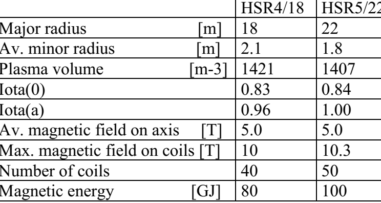
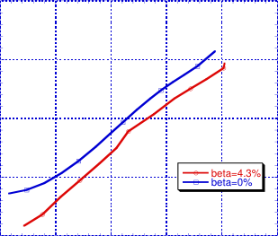
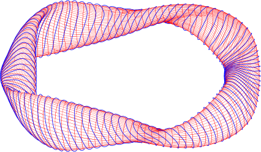
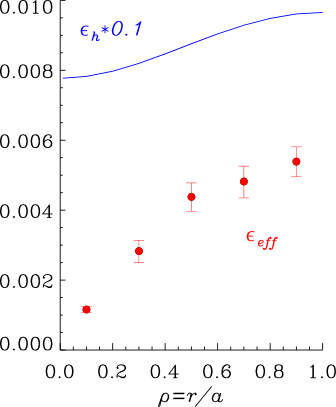
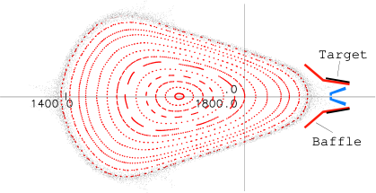
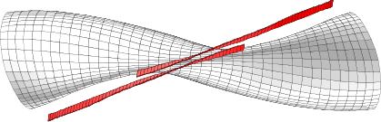
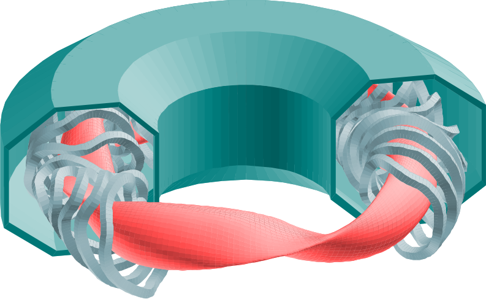
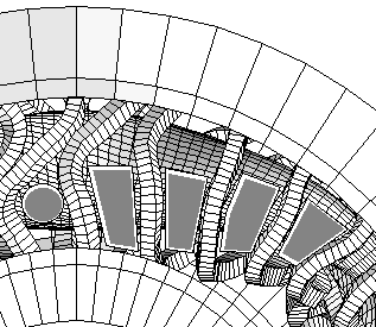
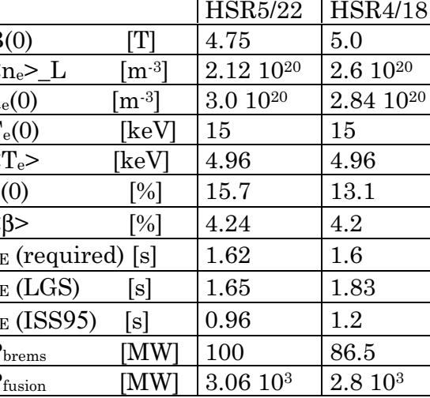

# **The Helias Reactor**

C.D. Beidler, E. Harmeyer, F. Herrnegger, Yu. Igitkanov, A. Kendl, J. Kisslinger,
Ya.I. Kolesnichenko [1], V.V. Lutsenko [1], C. Nührenberg, I. Sidorenko, E. Strumberger,
H. Wobig, Yu.V. Yakovenko [1]

Max-Planck Institut für Plasmaphysik, EURATOM Association D-85740 Garching bei
München, Germany.
1 Scientific Centre “Institute for Nuclear Reseach” 03680 Kyiv, Ukraine

e-mail: wobig@ipp.mpg.de

**Abstract:** The Helias reactor is an upgraded version of the Wendelstein 7-X experiment. A straightforward
extrapolation of Wendelstein 7-X leads to HSR5/22, which has 5 field periods and a major radius of 22 m.
HSR4/18 is a more compact Helias reactor with 4 field periods and 18 m major radius. Stability limit and energy
confinement times are nearly the same as in HSR5/22, thus the same fusion power (3000 MW) is expected in
both configurations. Neoclassical transport in HSR4/18 is very low, the effective helical ripple is below 1%. The
paper describes the power balance of the Helias reactor, the blanket and maintenance concept. The coil system of
HSR4/18 comprises 40 modular coils with NbTi-superconducting cables. The reduction from 5 to 4 field periods
and the concomitant reduction in size will also reduce the cost of the Helias reactor.

**1.** **Introduction**

The Wendelstein 7-X experiment, which is under construction in the city of Greifswald, is
the basis of the Helias reactor studies. HSR5/22 (5 field periods, major radius 22 m) is a
straightforward extrapolation of Wendelstein 7-X. In order to reduce the size of the reactor
another option with 4 field periods and a major radius of 18 m has been investigated and the
main subject of this paper is the presentation of this 4-period Helias reactor. The main
optimisation principle of the Helias reactor is the reduction of the Pfirsch-Schlüter currents
and the Shafranov shift while maintaining a MHD-stability limit of < β - above 4%. A further
important goal is to reduce prompt α -particle losses as much as possible, which in particular
requires confinement of trapped α -particles for more than one slowing down time. The
modular coil system comprises 10 coils per period, which are constructed using NbTi-superconducting cables. This implies that the maximum magnetic field on the coils must not
exceed 10 T. The data of the Helias reactors are listed in the following table.

_TABLE I: Main parameters of HSR4/18 and HSR5/22_

|  |  | HSR4/18 | HSR5/22 |
| --- | --- | --- | --- |
| Major radius | [m] | 18 | 22 |
| Av. minor radius | [m] | 2.1 | 1.8 |
| Plasma volume | [m-3] | 1421 | 1407 |
| Iota(0) |  | 0.83 | 0.84 |
| Iota(a) |  | 0.96 | 1.00 |
| Av. magnetic field on axis | [T] | 5.0 | 5.0 |
| Max. magnetic field on coils | [T] | 10 | 10.3 |
| Number of coils |  | 40 | 50 |
| Magnetic energy | [GJ] | 80 | 100 |

## 2. Coil System of the Helias Reactor

The coil system of the Helias reactor HSR5/22 consists of 50 modular coils but with only 5 different types. In HSR4/18 the number of coils is 40, as again there are 10 coils per period. A smaller number of coils facilitates the accessibility to the blanket, but this would raise the modular ripple and the losses of highly energetic alpha particles. By shaping the winding pack into a trapezoidal form the maximum magnetic field on the coils could be reduced to 10 T, while the averaged magnetic field on axis is close to 5 T. There is a sufficient safety margin to the limit of a NbTi-superconductor, if forced flow cooling with super-critical Helium at 1.8 K is applied.

[Figure 1: *HSR4/18, one period of the coil system. Winding pack plus casing and magnetic surface Left: Double pancake of windings and winding mould. Right: Winding pack and casing. Weight of coil 94 t, length of SC cable 10 km per coil*]

In contrast to a former design [1] the turns are wound in double pancakes consisting of 2x18 turns each (Fig. 1). Stresses in the coils depend strongly on the geometry of the support system. This support system consists of the coil casing and the intercoil support elements, which are not shown in Fig. 1. In designing this support system a compromise could be reached between the need to minimize the stresses and the desire for optimum access to blanket and the plasma chamber. Stress analysis of the coil system in HSR5/22 has been performed using the ANSYS code [2].In these computations the orthotropic elastic data of the envisaged "cable in conduit" were used in the winding pack, while for coil housing and intercoil structure the elastic data of stainless steel with E = 210 GPa, ν ~0.3 and a non-linear stress-strain curve with a yield stress of 800 MPa were applied. The maximum stress found in the coil housing is 650 MPa leading to a maximum displacement of 35 mm. Locally the deformation is larger than 0.2%, which implies that further optimisation of the support system is needed to reduce the local stress maxima. First results for the winding pack given in Fig. 1 show that the compression stress in the super-conducting windings can reach 70 MPa. The maximum displacement inside the winding pack is 1.6 mm in the actual design.

## 3. Magnetic Field of the Helias Reactor

Magnetic surfaces of the vacuum field in HSR4/18 are shown in Fig. 2. The rotational transform ranges from 0.83 in the center to 0.96 at the boundary. There is a shallow magnetic well of roughly 1%, which deepens with rising plasma pressure to 7.5% at <β> = 4.3%. Outside the last magnetic surface, which has an average radius of 2m, the magnetic field is stochastic. This stochastic region is the remnant of the 4 islands at ι = 1.0, however the basic structure of the 4/4-islands is still present and the plasma flow in this region will follow

certain channels towards the divertor target plates. In the bulk plasma there are no significant
magnetic islands, except for ι = 8/9, where 9 small islands exist.

_FIG.2: Poincaré plot of HSR18, vacuum_
_field. Left: symmetry plane_ ϕ _=0°, right top:_
_symmetry plane_ ϕ _=45°. Units in m. Right_
_bottom: Rotational transform vs radius._

**4.** **Plasma Equilibrium and Stability**

**Iota-Profile HSR4/18**

**Average Radius [cm]**

The reduction of the Pfirsch-Schlüter
currents leads to a small Shafranov shift.
This principle could be verified in
HSR4/18 to a large extent. Current lines on
a magnetic surface are shown in the
following figure (Fig.3). In some regions
the current flows nearly perpendicular to
the field lines indicating small parallel
current density in this place. The maximum
ratio between parallel current density and
diamagnetic current density is 1.6, on

_FIG. 3: Magnetic surface of HSR4/18. The_

average the ratio is 0.7. _thick solid lines are the plasma current lines._

The MHD-equilibrium has been computed using the NEMEC code and the MFBE-code

[3].The results shown in the next figures verify the small Shafranov shift at < β - = 4.3%.
Numerical investigations of the MHD-stability in HSR5/22 have shown stability up to an
averaged beta of 4% [4]. This result was found by local ballooning mode analysis using the
JMC-code and by global mode analysis with the CAS3D code [5]. Both methods yield
instability at < β >=5%. Interpolating the results of CAS3D results in a stability limit of 4.2%

[6]. Low-order rational magnetic surfaces, which do not exist in the vacuum field, can exist in
the finite beta plasma. This concerns the 5/6 resonance, which appears for < β - ≥ 4.2%. In

order to prove MHD-stability at the design point of < β - = 4.2%, detailed computations of the
equilibrium and careful optimisation of the pressure profile are necessary.

_FIG. 4: Poncaré plot of magnetic surfaces_
_at <_ β _>=4.3%. Left: symmetry plane_ ϕ _=0°._
_Right: symmetry plane_ ϕ _=45°._

Stability analysis using CAS3D has shown that the equilibrium depicted in Fig. 4 is
unstable against global modes in the boundary regions, while at < β - = 3.5% these modes are
stable. There is a chance that by tailoring the pressure profile global modes can also be stable
at < β - = 4.3%. As shown in Fig. 2 the rotational transform in HSR4/18 slightly decreases in
the finite ß-case. Above < β - = 4.3% it is expected that the resonant surface at ι =4/5 exists in
the plasma center. Since the global modes found in HSR4/18 occur in the boundary region
this may be of no relevance in context with stability.
Drift waves in the linear and non-linear approximations have also been studied taking into
account the specific geometry of the Helias configuration. In particular, attention has been
focussed on the effect of field line curvature and local shear on the linear growth rate of the
dissipative drift waves. The larger local shear in Helias configurations, which is a by-product
of the optimisation process, has a stabilising effect on the drift waves [7].

**5.** **Neoclassical Transport and Alpha-Particle Confinement**

Good confinement of highly energetic alpha particles is a necessary condition for selfsustaining operation of the fusion process in a Helias reactor. Energetic α -particles can excite
Alfvén instabilities, which may cause enhanced losses of these particles and, thus, reduce the
heating efficiency. Therefore, the structure of the Alfvén continuum in HSR4/18 was studied,
Alfvén eigenmodes residing in the continuum gaps were investigated, and possible energy
losses associated with the escaping of circulating and transitioning α -particles were evaluated.
It was found that the largest losses can result from destabilization of Mirror-induced Alfvén
eigenmodes (MAE) and helicity-induced Alfvén eigenmodes with the poloidal and toroidal
mode coupling ∆µ = ∆ν =1 (HAE_11). It was shown that the destabilization of certain Alfvén
eigenmodes affects transport of the partly slowed down alphas, thus promoting the removal of
the helium ash from the reactor. Computations of single particle orbits under effect of Alfvén
waves have confirmed this effect [8].
Investigations concerning the neoclassical transport properties of Helias reactors have been
concentrated on three main topics: (1) neoclassical losses in the bulk plasma under reactorrelevant conditions, (2) the confinement of fast α -particles, and (3) the minimisation of the

bootstrap current. Results concerning these three topics are summarised in the next three
paragraphs.
The Helias reactor is expected to operate at high density (central electron density of 3x10 [20]

m [-3] ) and moderate temperature (central temperatures of 15 keV). Under these conditions,
neoclassical theory predicts that only the so-called ‘ion-root’ solution for the radial electric
field exists, thus demanding strong optimisation of the magnetic field spectrum to minimize
losses in the stellarator-specific 1/ ν -regime. HSR4/18 is excellent in this regard, having an
effective helical ripple considerably less than one per cent over the entire plasma cross section
(see Figure 5). At this level, 1/ ν -losses pose no threat to ignition.

_FIG. 5: Numerical results for the effective_
_helical ripple for 1/_ ν _-transport,_ ε _eff, are shown_
_as a function of normalized minor radius. For_
_comparison, the geometric value of the helical_
_ripple,_ ε _h, is also shown (reduced by a factor of_
_10). For a classical stellarator,_ ε _eff and_ ε _h are_
_equal._

The magnetic field spectrum of the
Helias reactor is chosen so that the device
becomes a true minimum-B configuration
at operational values of plasma pressure,
thereby providing good confinement of fast
α -particles [9]. This effect has been
verified in HSR4/18 by following the
guiding center orbits of 1000 α -particles,
launched according to the expected density
and temperature profiles, for approximately one slowing-down time (0.13 seconds
for the chosen parameters). The α -particles
have an inital energy of 3.52 MeV but then
experience pitch-angle and energy scattering during the simulation. The results confirmed that no direct losses are present (the
earliest losses occurring after roughly 10 [-2]

seconds) but that stochastic diffusion due
to particles trapping/detrapping in local
ripple wells leads to a lost-energy fraction
of ≈2.5% in HSR4/18. This is considered
tolerable with respect to the energy balance
of the reactor.

The design philosophy of the Helias concept is to minimize the bootstrap current so as to
avoid the possibility of low-order rational values of rotational transform within the confinement volume and to maintain a fixed edge topology of the magnetic field structure to
insure the proper functioning of the divertor. Initial calculations indicate that HSR4/18 would
have a bootstrap current significantly less than that of the equivalent axisymmetric device but
further investigations are required to ascertain whether this reduction is sufficient.

**6.** **Divertor Concept**

Although the structure of the magnetic field outside the last closed surface is stochastic
there exists a separatrix region of the 4/4–islands, where a strong radial transport of the
outflowing plasma arises. The structure of this inhomogeneity has been investigated by
Monte-Carlo technique following particles along field lines subject to pitch angle scattering.
Anomalous transport and radial spreading of the scrape-off layer is simulated by a collision
frequency leading to an effective diffusion coefficient of D=1 m [2] /s.

_FIG. 6: Poincaré plot of magnetic surfaces and_
_scrape-off layer in the symmetry plane_ ϕ _=45°._
_The stochastic region is created by intersection_
_points of diffusing particles._

This technique allows one to optimise
the shape and the position of the target
plates. As Fig. 6 shows, radial diffusion is
strong in some specific regions, which
quite naturally are selected for positioning
target plates.

**7.** **The Helias Reactor as a Power Plant**

The purpose of the baffle plates is to
confine the recyling neutrals. Toroidally
the target and baffle plates extend until the
next symmetry plane as shown in Fig. 7.

_FIG. 7: HSR4/18. One period of magnetic_
_surface and divertor target plates seen from_
_outside. Baffle plates are not shown._

Heat load on the target plates is a critical
issue; preliminary computations indicate a
thermal load of more than 10 MW/m [2] .

First steps are being made to develop an integrated concept of the stellarator power plant
including the buildings and the thermal conversion cycle. The coil system is enclosed in a
cryostat of roughly 16 x 16 m [2] cross section (see Fig. 8). The volume of the cryostat in
HSR4/18 is 21500 m [3] .

_FIG.8: Plasma, coils and cryostat of HSR4/18. The inner diameter of the cryostat is 20 m._

In contrast to earlier concepts of maintenance and repair, in which a whole
period of the coil system is horizontally
withdrawn, it is now proposed to replace

blanket segments through portholes between the coils. In every period there are 8
big portholes available, 4 on the top and 4
at the bottom of the period.

Typical dimensions of the portholes are
2x6 m [2] . The following figure (Fig. 9)
shows the arrangement of the portholes.

_FIG. 9: View from the top onto half a period of_
_HSR4/18 with portholes for maintenance._

The blanket options envisaged in the
Helias reactor are: Helium-cooled solid
breeder blanket (HCPB), Water-cooled LiPb blanket (WCLL). The weight of the
blanket and shield depends on the specific
concept, first estimates for HSR5/22 [10]
resulted in an overall weight of 7080 t for a
HCPB-blanket and 14450 t in case of a
water-cooled Pb-17Li- blanket. In this case
the breeder material alone weighs 12500 t.
Net efficiency of the thermal conversion
cycle is about 35%, however the more
advanced TAURO-concept of a self-cooled
Pb-17Li blanket [11] would provide a net
efficiency of more than 40%.

Two major differences between a tokamak reactor and a Helias reactor are decisive with
respect to blanket design and performance. These are the three-dimensional shape of the
blanket and the larger area of the first wall. In the present concept of HSR5/22 this area is
2600 m [2], which leads to an averaged neutron wall loading of less than 1 MW/m [2] (fusion
power 3000 MW). The peak wall loading is 1.7 MW/m [2] . Compared with the DEMO tokamak
reactor, where a lifetime of 2.3 years [12] (70 dpa in the structural material) is envisaged, the
lifetime of blanket elements in HSR can reach 4.6 years. Since in recent studies a limit of 140
dpa is considered realistic [13], the lifetime of components in the Helias reactor may reach 9
years. In HSR4/18 the area of the first wall is 2500 m [2], which results in similar neutron wall
load as in HSR5/22.

Power balance in the Helias reactor
HSR5/22 has been studied by various
methods: local transport calculations using
the ASTRA-code and the TOTAL_P-code,
and extrapolation of empirical scaling laws
of stellarator confinement to reactor conditions [14]. Empirical scaling laws predict
nearly the same confinement times for both
reactor concepts. Extrapolating experimental results from Wendelstein 7-AS allows
one to model a fusion plasma with peak
density of 3*10 [20] m [-3] and a temperature of
15 keV. The following table gives the
design point at 3000 MW fusion power.
Ignition, however, is possible at lower
values of beta, in HSR4/18 ignition occurs
at < β - = 3.2%. As shown in Table II, the
empirical scaling time (LGS = LacknerGottardi scaling) meets the required
confinement time, while the ISS-scaling
predicts a confinement time which is too

low. The beta value of 4.2% is at the limit
of MHD-stability as outlined above.

_TABLE II: Plasma parameters in HSR4/18 and_
_HSR5/22_

|  |  | HSR5/22 | HSR4/18 |
| --- | --- | --- | --- |
| B(0) | [T] | 4.75 | 5.0 |
| <ne>_L | [m-3] | 2.12 1020 | 2.6 1020 |
| ne(0) | [m-3] | 3.0 1020 | 2.84 1020 |
| Te(0) | [keV] | 15 | 15 |
| <Te> | [keV] | 4.96 | 4.96 |
| β(0) | [%] | 15.7 | 13.1 |
| <β> | [%] | 4.24 | 4.2 |
| τE (required) | [s] | 1.62 | 1.6 |
| τE (LGS) | [s] | 1.65 | 1.83 |
| τE (ISS95) | [s] | 0.96 | 1.2 |
| Pbrems | [MW] | 100 | 86.5 |
| Pfusion | [MW] | 3.06 103 | 2.8 103 |

**8.** **Conclusions**

The magnetic field of the 4–period Helias configuration has been optimised with respect to
plasma equilibrium and neoclassical transport, which is extremely low; the effecive helical
ripple is below 1%. Fast alpha-particle losses could be reduced to 2.5% of the heating power.
Empirical scaling laws (LGS) predict ignition in HSR4/18, any improvement factor is not
necessary. However, further theoretical studies are needed to clarify the confinement at the
beta-limit, which is expected around 4.3%.
The present engineering studies of a 4-period Helias reactor HSR4/18 have demonstrated
the good prospects of this concept as a viable fusion reactor. The configuration HSR4/18 is
more compact than the 5-period HSR5/22, which also may lead to a 20% cost reduction of the
reactor core. Because of the low neutron average wall load the number of maintenance
procedures will be smaller than in a more compact tokamak reactor, however the amount of
activated waste at shut-down of the reactor will be about the same.
In principle all blanket concepts developed for tokamak reactors can be realised in the
stellarator reactor, however the three-dimensional geometry requires a large number of different blanket segments, while in axisymmetric devices only two different shapes – inboard and
outboard segment – are needed. The blanket segments in the Helias reactor can be replaced
through the portholes between adjacent modular coils. Neutronics calculations using the
MCNP-code are in preparation, in particular, the effect of the 3-D geometry on the breeding
ratio and the activation of the structural material need to be investigated.
The absence of current disruptions in stellarators eliminates the risk of destroying plasma
facing components by sudden mechanical loading. With respect to nuclear hazards there is no
significant difference between stellarators and tokamaks, since at the same fusion power
output also the rate of neutron production and consequently all neutron induced effects are the
same.
One major cost-driving item of a fusion reactor is the coil system. Since in HSR4/18 the
maximum magnetic field is 10 T, this is still in the range of NbTi technology if cooling at
1.8K can be realised in a reliable way. The total length of superconducting NbTi cable is 400
km and the weight about 700 t. The total weight of the super-conducting coils including the
casing is 4100 t. Together with the support system the overall weight will remain below
10000 t, which will keep the costs of the magnet system certainly far below those of an ITERtype tokamak reactor.

**References**

[1 ] HARMEYER, E., et al., J, Proc. SOFT-19, Lisboa 1996, Vol. II, p. 1035,

[2] HARMEYER, E., et al, Proc. SOFT-21, Madrid 2000, Paper F-44

[3] STRUMBERGER, E Nuclear Fusion 37 (1997) 19

[4] STRUMBERGER, E., NÜHRENBERG, C. et al., Proc. 26 [th] EPS-Conf. Maastricht, 1999
## [5] NÜHRENBERG, C. Phys. Fluids B5 (1993) 3195

[6] STRUMBERGER, E. et al., IPP-report IPP III/249

[7] KENDL, A., WOBIG, H., Phys. Plasmas **6**, (1999), 4714

[8] WOBIG, H., SIDORENKO, I., SHISHKIN, A.A., IPP-report IPP III/251, Oct. 1999

[9] LOTZ W., et al.., Plas. Phys. Control. Fusion 34 (1992) 1037.

[10] WOBIG, H. et al. IPP-Report III/244 (1999)

[11] GIANCARLI, L. et al., Fus. Eng. Des. 41 (1998) 165-171

[12] DALLE-DONNE, M. et al. KfK Report KfK 5429, Nov. 1994

[13] MALANG, S., Limitations on blanket performance, Proc. SOFT-20, Marseille, France, 1998

[14] BEIDLER, C.D. et al. Proc 17 [th] Conf. on Fus. Energy, Yokohama 1998, IAEA-F1-CN-69/FTP/01

