# Heterogeneous design and mechanical analysis of HELIAS 5-B helium-cooled pebble bed breeding blanket concept

Gaetano Bongiovi¹ | Giovanni Marra² | Rocco Mozzillo³ | Andrea Tarallo²

¹Institute for Neutron Physics and Reactor Technology (INR), Karlsruhe Institute of Technology (KIT), Eggenstein-Leopoldshafen, Germany
²CREATE Consortium, Università degli Studi di Napoli Federico II, Naples, Italy
³School of Engineering, University of Basilicata, Potenza, Italy

**Correspondence**
Gaetano Bongiovi, Institute for Neutron Physics and Reactor Technology (INR), Karlsruhe Institute of Technology (KIT), Hermann-von-Helmholtz-Platz 2, 76344 Eggenstein-Leopoldshafen, Germany.
Email: gaetano.bongiovi@kit.edu

**Funding information**
H2020 Euratom, Grant/Award Number: 633053; Karlsruher Institut für Technologie (KIT)

## Summary

One of the most challenging objectives of the European research concerning nuclear fusion technology, promoted by the EUROfusion consortium, is to bring stellarator-type nuclear fusion devices to maturity. To this purpose, studies on a large HELIcal-axis advanced stellarator (HELIAS), extrapolated from Wendelstein 7-X and based on a 5-fold symmetry (HELIAS 5-B), are currently ongoing. The HELIAS 5-B stellarator reactor will be endowed with a breeding blanket (BB) system to allow for the self-sustainability of the nuclear fusion reaction and make it suitable for electricity generation. In this paper, we present the first ever heterogeneous mechanical design and the preliminary structural assessment of a bean-shaped ring of a HELIAS 5-B BB sector. The proposed mechanical design, which is based on the helium-cooled pebble bed (HCPB) BB concept and developed according to the "sandwich" architecture, foresees an actively cooled segment box connected to a back-supporting structure equipped with manifolds. The internal region (breeding zone) is reinforced by actively cooled steel plates. The proposed heterogeneous design was checked against nominal loads and an in-box loss of coolant accidental scenario, which is a typical design driver for BBs. The assessment has been performed according to the RCC-MRx structural design code. Our results are herewith presented and critically discussed, focusing on the potential follow-up of the HELIAS 5-B HCPB BB design.

**KEYWORDS**
breeding blanket, FEM analysis, HELIAS, Stellarator, structural design, thermo-mechanics

## 1 | INTRODUCTION

In order to pursue the realization of electricity from nuclear fusion on a large scale, the European roadmap for the realization of fusion energy² has been issued and up to date in the last years. It aims at producing electric power by fusion in EU by the end of this century. To this end, the EUROfusion consortium has been created under the umbrella of the European Commission. EUROfusion is leading the design of the European DEMO fusion reactor. According to the roadmap, DEMO will be a large-size fusion facility, based on the tokamak concept, able to

generate hundreds of megawatts of net electric power
starting from the D-T nuclear fusion reaction. In parallel,
EUROfusion is promoting research on a similar large
fusion machine based on the stellarator concept to have a
valid and credible long-term alternative (to be used as a
backup solution, whether necessary) to the tokamak line.
In this framework, preliminary conceptual studies of
a HELIcal-axis advanced stellarator (HELIAS) [2] are ongoing in the European Union. The conceptual layout of the
HELIAS reactor is directly extrapolated by the
Wendelstein 7-X (W7-X), the world's largest stellarator
reactor. [3] The W7-X is mainly devoted to plasma physics
experiments and test and validation of plasma confinement, control and diagnostic systems. Although the
W7-X is equipped with a shielding blanket and it is not
conceived to host tritium to produce any electricity, its
success is crucial for the development of the stellarator
line as it is a stellarator machine bigger than a
laboratory-scale prototype.
On the contrary, HELIAS reactor will be endowed
with a breeding blanket (BB) system that would guarantee the self-sustainability of the nuclear fusion reaction
and make it suitable for baseload electrical power generation. The studies on the HELIAS BB are at a very primitive stage compared with the DEMO ones and are
focused on the HELIAS 5-B reactor, [4] a large 5-fold
stellarator machine. To give a term of comparison,
research studies on large stellarators are, at present, at
the same level of PPCS studies [5,6] of the tokamak line.
Conceptual studies, mainly based on fully homogenized
models, [7,8] are ongoing with the aim of gathering basic
results to develop, in a close future, a credible design for
the HELIAS 5-B BB. So far, only scoping analyses of the
most representative BB regions have been studied, using
homogeneous models, to check the general applicability
of different blanket concepts to the peculiar stellarator
geometry. Moreover, the segmentation strategy proposed
for the whole BB sector has been investigated. [9] The novelty introduced by this work is the realization of heterogeneous models aimed at the preliminary mechanical
design and analysis of the HELIAS 5-B BB. In particular,
a first heterogeneous design of a whole bean shape BB
ring has been developed and assessed under both nominal and accidental steady-state loading conditions, the
latter relevant to an in-box loss of coolant (in-box LOCA)
accident. With respect to previous works available in the
literature (eg, Reference 9), the heterogeneous design is
developed for a whole BB ring, the nominal loading conditions are considered together with the reference accidental loading scenario and a new pattern has been
followed for the design of cooling plates (CPs) and channels, as widely explained in the following.

The design moved from the helium-cooled pebble bed
(HCPB) BB concept, based on the “sandwich”
architecture, [10] to keep coherence between neutronic and
structural assessments. [11] Indeed, instead of following the
HCPB BB design development carried out for the DEMO
tokamak reactor, it has been decided to freeze the sandwich architecture as the reference one for the HELIAS
stellarator. Since HELIAS is still in the phase of conceptual study, the aim of the study has been to assess the
potential feasibility of such a kind of system. To this end,
the structural performances of the proposed design solution were analysed according to the RCC-MRx design
code. [12]

In this work, the main features of the HELIAS 5-B BB
are briefly described in Section 2. The proposed geometric configuration of the assessed region (a bean-shaped
ring) envisages a segment box (SB), namely the side wall
(SW)-first wall (FW)-SW region, endowed with cooling
channels, closed at the top and the bottom by two Caps, a
back-supporting structure (BSS) equipped with manifolds
and a set of actively cooled cooling plates (CPs). It is
depicted and described in Section 3. Section 4 describes
our analysis methodology and the FEM model setup.
Then (Sections 5-7), the structural performances have
been assessed under the aforementioned steady-state
loading conditions. Eventually, a stress linearization procedure has been performed within the most critical
regions, and the results have been checked against the
criteria reported in the RCC-MRx structural design code,
purposely considering Level A criteria for the nominal
loading scenario and Level D rules for the accidental one.

2 | THE BREEDING BLANKET OF
THE HELIAS 5-B REACTOR

As mentioned, in order to create a D-T fusion reactor
suitable for baseload electrical generation, the plasma
chamber must house a BB system that produces enough
tritium to ensure self-sufficiency and, at the same time,
allows for removing the heat power generated by the
fusion reactions and shielding the vacuum vessel and the
magnets from radiation coming from the plasma. Most of
the technologies assumed for the HELIAS 5-B fusion
power plant have already been considered in the tokamak DEMO and can be considered valid for similar loading conditions. For this reason, the approach adopted in
this work was based on the HCPB BB concept. So far,
only homogenized CAD models were developed, mainly
to investigate the maintainability of HELIAS 5-B BB and
to set up the most promising BB segmentation strategy to
avoid overlapping between adjacent BB segments both

along toroidal and poloidal directions during the normal operation.

Preliminary studies have been performed over the last years to assess the feasibility of the proposed BB segmentation and its neutronic performances. From these studies, the viability of the proposed BB segmentation strategy has been confirmed, even though it was found that the structure suffers, both in terms of deformation and shielding performances, especially in regions where a minimum space is available as the so-called bean-shaped ring.[11] Anyway, a promising TBR value (1.3863) has been calculated for this configuration, although using a neutronic model characterized by idealistic design features (no gaps in between blanket segments and big breeding zone's radial thickness). Then, the next step involves a more accurate mechanical design of BB components and the parallel development of heterogeneous models aimed at assessing their structural performances. To this end, we moved from the design of the HCPB BB concept, considering the "sandwich" architecture.[12]

As said above, the HELIAS 5-B fusion reactor is based on the 5-fold symmetry. This implies that a BB sector (Figure 1) extends for 72° (ie, 1/5 of the torus) along the toroidal direction. Each BB sector is divided into16 rings, toroidally separated by 20 mm gaps. Each ring is composed of 5 BB segments separated, poloidally, by 20 mm gaps. Therefore, each HELIAS 5-B BB sector is composed of 80 BB segments overall. Such a kind of segmentation ensures that each segment's weight is below the acceptable threshold of the remote maintenance tools considered at present for the BB segments' remote handling. As depicted in Figure 1, eight rings show large openings, whereas the other eight are poloidally continuous (except for the separating gaps). These are the openings (ie, space reservation) for the HELIAS 5-B divertor, conceived according to the island concept just like the W7-X one. At this stage of the work, no further openings are considered in the BB geometric model (ie, no ancillary system is considered for integration).

From a geometric point of view, the HELIAS 5-B BB sector can be obtained starting from half a sector, encompassing the eight central rings (four continuous adjacent to the other four that house the divertor openings). The geometric configuration of the whole BB sector can be obtained by applying the flip-symmetry condition to both the groups of four segments, with respect to the corresponding far-end section plane. The 80 BB segments are connected to the vacuum vessel (VV), which is a three-layer structure (inner, shield and outer layers) that keeps the high vacuum within the plasma chamber, mechanically supports the BB and contributes to the shielding of the magnets from the radiation coming from the plasma. As well as for the BB, no openings (ie, ports and pipe forest) are presently considered in the VV

[Figure 1: HELIAS 5-B BB sector of 72° including vacuum vessel and the 16 BB Rings]

geometric configuration, even though the VV must allow
for installation procedures and remote maintenance.
Moreover, at the current stage, no attachment system has
been developed and, consequently, the BB segments are
assumed as integral to the VV. This implies that no
attachments are presently considered, and the BB segments are considered directly tied to the VV. Indeed,
since it is a big issue for DEMO BB too, at present, the
maintenance scheme of HALIAS BB is not defined.
Regarding structural materials, the EUROFER
97 RAFM steel has been assumed for the BB segments,
whereas the AISI 316 L steel is foreseen for the VV. A
2-mm thick tungsten layer covers the FW of the BB segments to protect them from the charged particles
sputtering.

3 | HETEROGENOUS DESIGN OF
THE BEAN-SHAPED RING

Since the preliminary studies on the HELIAS 5-B BB
have shown that the bean shape region is one of the most
critical of the whole BB sector, in terms of both structural
(ie, deformation issues) and nuclear performances [9,11] (ie,
shielding issues), this work focused on a more detailed
mechanical design of this BB ring in order to better investigate its structural behaviour by means of a heterogeneous model. CATIA V5 by Dassault Systemes was
adopted to build up the solid model of the so-called bean

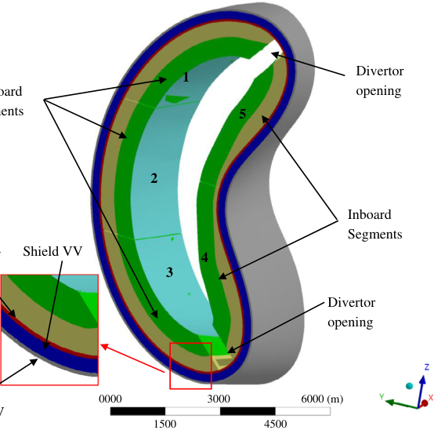

shaped ring. Starting from the overall BB homogenous
geometric model, also used for neutronic studies, the
space reservation for the BB bean-shaped ring along with
the related portion of VV (Figure 2) and the tungsten
layer covering the FW were extracted. The ring can be
divided into an inboard region, whose BB segments have
been identified as segment no. 4 and no. 5, and an outboard region composed of the remaining ones, labelled as
segment no. 1, no. 2 and no. 3, respectively (Figure 2).
Hence, a heterogeneous (ie, detailed) geometric model
has been developed containing, for each BB segment, a
W layer (in pale blue in Figure 2), an SB (ie, the SW-FWSW region closed at the top and the bottom by Caps, in
green in Figure 2), a BSS (in yellow in Figure 2) and a set
of actively cooled CPs devoted to internally reinforce the
SB, shown in the following. As said, the concept is
inspired by DEMO HCPB BB “sandwich” architecture.
Hence, in the initial phase of the design, several design
constraints stemming from the HCPB BB design were
collected. The considered design constraints (Table 1)
take into account neutronic, thermal-hydraulic, structural, tritium permeation-related and manufacturing
aspects and, at present, have been assumed to be valid
also for the HELIAS BB as, conceptually, the machines
should be run in similar loading scenarios. [13-17] Hence,
the HELIAS 5-B HCPB BB design has been developed, in
this first attempt, in analogy with the DEMO BB.
The applicability of each requirement was just preliminarily evaluated, thus future analyses could highlight

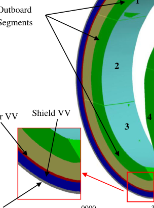

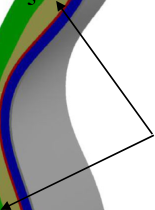

FIGURE 2 Heterogeneous CAD model of the

**TABLE 1** Design constraints stemming from DEMO HCPB BB

| Requirement | Value | Unit |
|---|---|---|
| FW and SW radial thickness | 25 | mm |
| W armour radial thickness | 2 | mm |
| Caps poloidal thickness | 84 | mm |
| CPs poloidal thickness | 5 | mm |
| Li₂SiO₄ pebble bed poloidal thickness | 15.5 | mm |
| Be pebble bed poloidal thickness | 40 | mm |
| FW channels cross section | 12.5 × 12.5 | mm |
| FW channels poloidal distance | 4.5 | mm |
| CPs channels cross section | 2.5 × 5 | mm |
| CPs channels radial distance | 2 | mm |
| Caps channels cross section | 36 × 36 | mm |
| ISS manifolds cross section | 300 × 600 | mm |
| Maximum EUROFER 97 operating temperature | 500 | °C |
| Coolant He nominal pressure | 8.0 | MPa |
| Coolant He design pressure | 9.2 | MPa |

new complications not considered here. However, this work is intended as a first step that will pave the way to future studies about other possible configurations.

## 3.1 | Preliminary dimensioning

The layout of the cooling channels of the FW and the poloidal distance between the CPs has preliminary dimensions assuming a square section for the channels like in DEMO BB. This sizing study is a preliminary attempt aimed at finding the limit values of the cooling channels and SPs main geometric features to safely withstand the pressure loads they undergo. Considering the symmetry of the generic section, the study focused on the simplified FW model shown in Figure 3. The geometrical parameters of the section adopted for the study, shown in Figure 3, were taken by DEMO BB design and are reported and described in Table 2.

The main scope of the calculation consisted in defining the optimal distance between the channels (X in Figure 3) and checking it against the corresponding values assumed in DEMO BB.[?] First of all, we considered the notch effect due to the shape of the assumed section since in the case of static loading, stress concentration is important in case of unusual materials that, under special conditions, behave in a brittle manner.[?] We considered the design pressure of the coolant ($P = 9.2$ MPa) as the only load condition. According to

[Figure 3: FW channels layout and simplified model]

**TABLE 2** Geometrical parameters of the cooling channel section[?]

| Symbol | Meaning | Values |
|---|---|---|
| W | Channels pitch | 17 mm |
| w | Thickness of the steel in between two consecutive channels | 4.5 mm |
| h | Thickness of the steel beside the channels | 6.25 mm |
| T | FW thickness | 25 mm |
| l | Assumed FW length | ∞ |

[Figure 4: Stress behaviour in a notched component T-head]

this assumption and the stress behaviour (Figure 4), the nominal and the maximum stress intensities can be calculated as follows:

$$\sigma_{nom} = \frac{p \cdot (W - w)}{W} = 25.5 \text{ MPa,} \tag{1}$$

$$\sigma_{max} = K_t \cdot \sigma_{nom} = 127.5 \text{ MPa,} \tag{2}$$

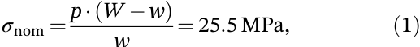
Where:

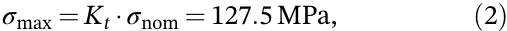
- $K_t$ is the theoretical stress concentration factor, based on a theoretical elastic, homogeneous, isotropic material,18 which is about 5 according to the tabular data in Reference 12, considering the geometrical parameters of the section.
- $\sigma_{nom}$ maximum stress in the notched area,
- $\sigma_{max}$ stress in case of unnotched section.

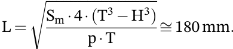
From Equation (2), it is clear that $\sigma_{max}$ in the notched area is wide under the yield stress for EUROFER 97 at 500°C ($S_y$ = 371 MPa). Hence, it can be concluded that the assumed geometric layout of the FW channels is able to safely withstand, in the idealized conditions assumed in this preliminary sizing, the pressure loads considered and then they can be adopted for the FEM analysis of the HELIAS BB.

Using the same approach, the distance between the stiffening plates (ie, the CPs of the HCPB BB) has been initially dimensioned, assuming a simplified model of single BB cell (Figure 5).

In this configuration, the maximum poloidal distance between the CPs, given the shell thickness and the assumed section of the FW (Figure 3), was calculated

[Figure 5: Simplified scheme of BB box—section on poloidal-radial plane]

assuming the FW as an over-constrained beam (Figure 6).19

As a worst case, the section shown in Figure 6 is considered for dimensioning of the distance between adjacent CPs (L). According to RCC-MRx Level D criteria verification12 and assuming the simplified scheme of an over-constrained, beam the maximum allowable distance between SPs is

$$L = \sqrt{\frac{S_m \cdot 4 \cdot (T^3 - H^3)}{p \cdot T}} \approx 180 \text{mm.}$$

This result means that CPs maximum distance equal to 180 mm can ensure they safely withstand pressure loads. It should be noted that this preliminary dimensioning does not consider the secondary loads and, therefore, FEM analyses are necessary. However, this first result can be useful to develop the design of the breeding zone for the HELIAS BB.

## 3.2 | The geometric model

As mentioned in the previous sub-sections, the BSS and the SB of each BB segment in the heterogeneous model, were designed starting from the space reservation taken from the homogenized geometric model. The dimension of the sandwich of each BB cell (Figure 7) was chosen in order that its thickness respected as much as possible the thicknesses selected for DEMO HCPB BB based on the "sandwich" architecture.10 On the other hand, each SB is composed of an FW, five SWs and two Caps (Figure 8). Due to the HELIAS 5-B BB peculiar geometry, some changes were necessary to the original HCPB BB "sandwich" architecture. The square section for cooling channel with a side of 12.5 mm was maintained as well as the distance of 4.5 mm between the cooling channels along the poloidal direction. However, we had to change the position of these channels with respect to the current DEMO FW configuration. In particular, as a first attempt, it has been set in the middle of the radial thickness instead of at 3 mm from the tungsten-steel interface.

Since all five BB segments do not have the same shape, the number of SB channels varies for each segment (Table 3). In any case, their axes lay onto planes parallel to the equatorial/mid-poloidal plane. Hence, different reference planes have been assumed for each of the five segments as their shape and orientation are quite different from each other. In particular, SB1 and SB3 present the lower number of channels due to their peculiar curvature, which entails that, within these SBs, the regions close to the Caps are not actively cooled.

[Figure 6: First wall scheme and section cut on plane A]

[Figure 7: Geometric models of the back-supporting structures and details of the manifolds]

Each SB also comprehends the so-called Caps, which are closure plates (84 mm thick) arranged along the poloidal direction. Therefore, the design has been simplified in order to have 36 mm square channels. These channels have been designed in the middle of the Caps, with faces parallel to those of the Caps themselves (Figure 8). The design of the CPs is also inspired by HCPB BB DEMO concept. They are designed not only to cool the breeder zone but also to reinforce the SB (Figure 9). The CPs lay onto planes parallel to the equatorial radial-toroidal plane, which are different for each segment. Moreover, since the segments do not have the same shape, this criterion implies a different number of plates for each SB. The plates are 5 mm thick, and the cooling channels inside have a rectangular section (2.5 mm vertical × 5 mm radial) and are arranged with a 7 mm pitch (Figure 9). The CPs are spaced vertically in order to alternate 15.5 mm layers of Li₄SiO₄ (breeder material) with 40 mm layers of Be (neutron multiplier), both in the form of pebble beds.

Table 3 shows, for each segment, the number of channels in the SB and the number of CPs resulting from the assumptions made.

One can notice that SB1 and SB3 have significantly fewer plates than the other SBs, due to their peculiar shape elongated towards the divertor openings. Hence, the regions close to SB1 upper Cap (Figure 9) and SB3 lower Cap encompass fewer CPs than the other SBs, as

[Figure 8: Geometric models of the segment boxes and details of the cooling channels]

**TABLE 3** Number of channels and plates for each segment

| SB channels number | CPs number |
|---|---|
| Segment 1: 144 | 58 |
| Segment 2: 205 | 108 |
| Segment 3: 111 | 60 |
| Segment 4: 216 | 102 |
| Segment 5: 209 | 95 |

well as the SWs regions close to Caps are not actively cooled by SB channels. Nevertheless, this configuration led to quite satisfactory results, as shown in Section 5 and in Section 6.

## 4 | THE FE MODEL

The structure of the bean-shaped ring of the HELIAS 5-B HCPB BB was assessed with the commercial finite element method (FEM) code ANSYS v.19.1. The analysis involved a normal operation (NO) and an overpressurization (OP) steady-state scenario. The NO scenario represents the nominal loading conditions that the HELIAS BB is supposed to undergo. As to the OP scenario, for the sake of simplicity, it was assumed that a break occurring within the SB instantaneously pressurizes the whole box at the coolant design pressure (steady-state analysis). The temperature of EUROFER 97 was conservatively assumed equal to 500°C to consider the highest thermal gradient with the VV and, at the same time, to deal with the lowest allowable stress limits. RCC-MRx is the reference design code used for the analysis of the results. In particular, since the assumed loading scenario is an accidental event, the corresponding RCC-MRx Level D criteria have been considered. Instead, concerning NO scenario, Level A criteria have been adopted, as it represents the nominal operating conditions. Overall, the FEM model (Figure 10) comprehends 23 geometric domains whose characteristics are summarized in Table 4. The total node and element number are equal to ~26.4 M and ~117 M, respectively. Linear tetrahedral elements have been chosen for the discretization, with average element size from previous mesh independence analysis.

According to the BB load specifications developed for DEMO and, presently, used in analogy also for HELIAS BB, the NO scenario has been set considering loads reported in Table 5. It has to be noted that, in spite of a nominal coolant pressure of 8.0 MPa, the DEMO BB load specifications document (based in its turn on the ITER TBM load specifications) prescribes to assume, conservatively, a design pressure (equal to 1.15 times the nominal pressure) also in the nominal conditions. The temperatures considered for normal operations were extrapolated from DEMO HCPB BB thermal analysis,20 while the breeding zone pressure was considered equal to 0.23 MPa

[Figure 9: Isometric view of CPs for the outboard segments and detailed view of their cooling channels]

[Figure 10: The 3D mesh of the bean-shaped ring]

(ie, the helium purge gas design pressure23). In any case, the temperature of tungsten armour was assumed to be equal to 550°C, as obtained from DEMO HCPB BB thermal analysis.

Regarding the assumed temperatures, considering that the power is the same, the structural and functional materials are the same as well as the cooling scheme, as a first approximation (since HELIAS is still in the conceptual studies phase), the average temperatures can be considered exportable from DEMO to HELIAS BB.

As mentioned, the OP loading scenario considered in Reference 21 is given by the most severe conditions that may occur in case of an in-box loss of coolant accident (in-box LOCA). This accident consists of a break of a cooling channel towards the SB internals, which causes the sudden pressurization of the whole box. Table 6 summarizes the loading conditions. It has to be noted the weight of the assessed structures has been taken into account in both the loading scenarios by assuming a proper gravity load.

No assumptions were made on the HELIAS 5-8 BB helium loop; thus, six different OP scenarios were investigated (Table 7). It has to be noted that currently, the frequency of occurrence of the postulated accidental events is not known.

Concerning cases from B1 to B5, normal operations conditions were assumed for all the segments not interested by the OP (Tables 8-12).

Regarding the portion of VV included in the model, thermal conditions inferred from DEMO design47 have been assumed (VV outer at 180°C, VV shield at 205°C and VV inner at 230°C). A set of mechanical restraints has been imposed to simulate the action of a VV support system and the rest of the BB sector not included in the model (Figure 11). In particular, the vertical displacement has been prevented to nodes lying onto two lines in order to simulate the mechanical action of a vertical

**TABLE 4** Mesh features of the assessed domains

| Geometric domain | Nodes | Elements |
|---|---|---|
| VV | | |
| VV inner | 2989 | 7917 |
| VV shield | 1486 | 3956 |
| VV outer | 1578 | 4171 |
| Segment 1 | | |
| W armour | 7063 | 20 483 |
| SB | 68 986 | 284 881 |
| BSS | 8504 | 27 397 |
| CPs | 2 955 491 | 12 629 528 |
| Segment 2 | | |
| W armour | 8730 | 25 331 |
| SB | 103 150 | 443 645 |
| BSS | 19 406 | 73 512 |
| CPs | 6 046 869 | 25 853 598 |
| Segment 3 | | |
| W armour | 7686 | 22 207 |
| SB | 68 066 | 279 590 |
| BSS | 11 904 | 43 715 |
| CPs | 3 046 874 | 12 876 763 |
| Segment 4 | | |
| W armour | 8009 | 22 881 |
| SB | 125 967 | 518 723 |
| BSS | 17 069 | 57 856 |
| CPs | 4 952 794 | 21 006 726 |
| Segment 5 | | |
| W armour | 7210 | 20 636 |
| SB | 100 908 | 429 242 |
| BSS | 4 307 637 | 23 974 604 |
| CPs | 4 319 998 | 18 310 418 |

**TABLE 5** Normal operation scenario loading conditions

| Segment | Temperature [°C] | | | Pressure [Pa] | | | | |
|---|---|---|---|---|---|---|---|---|
| | W | SB | CPs | SB channels | SB internal surfaces | CPs channels | CPs top/bottom surfaces | BSS manifolds |
| 1 | 550 | 445.8 | 434.7 | 304.9 | 9.20E+06 | 0.23E+06 | 9.20E+06 | 0.23E+06 | 9.20E+06 |
| 2 | 550 | 445.8 | 484.7 | 320.3 | 9.20E+06 | 0.23E+06 | 9.20E+06 | 0.23E+06 | 9.20E+06 |
| 3 | 550 | 445.8 | 484.5 | 316.1 | 9.20E+06 | 0.23E+06 | 9.20E+06 | 0.23E+06 | 9.20E+06 |
| 4 | 550 | 445.8 | 418.5 | 306.9 | 9.20E+06 | 0.23E+06 | 9.20E+06 | 0.23E+06 | 9.20E+06 |
| 5 | 550 | 445.8 | 418.6 | 306.8 | 9.20E+06 | 0.23E+06 | 9.20E+06 | 0.23E+06 | 9.20E+06 |

**TABLE 6** Loading conditions assumed in case of in-box LOCA accident

| Load | Value |
|---|---|
| EUROFER 97 temperature | 500°C |
| Pressure onto SB internals | 9.2 MPa |
| Pressure within manifolds and cooling channels | 9.2 MPa |

**TABLE 7** Over-pressurization scenarios

| Case Id | Situation |
|---|---|
| A | OP occurring simultaneously within all the five SBs |
| B1 | OP occurring within SB 1 |
| B2 | OP occurring within SB 2 |
| B3 | OP occurring within SB 3 |
| B4 | OP occurring within SB 4 |
| B5 | OP occurring within SB 5 |

TABLE 8 Case B1 loading conditions

TABLE 9 Case B2 loading conditions

TABLE 10 Case B3 loading conditions

5 | RESULTS

The obtained results in terms of total displacement field,
Von Mises Equivalent stress field and RCC-MRx criteria
verification (Level A for NO scenario and Level D for OP
scenario) are herewith reported and critically discussed.
A stress linearization procedure was conducted along
stress lines (paths) throughout the FW and SW radial
thicknesses, within the regions characterized by the
highest Von Mises equivalent stress values in the OP conditions. Hence, for the latter scenario, contour maps

showing the Von Mises equivalent stress spatial distributions also report the selected locations for the stress
paths, always located through the radial thickness of a
SB's FW or SW. As a consequence, stress linearizations in
NO scenario have been performed along the same paths.
The RCC-MRx criteria for preventing failure against
immediate plastic collapse (Pm < Sm), immediate plastic
instability ((Pm + Pb) < (keff - Sm)), immediate plastic
flow localization ([Pm + Qm] < Sem) and immediate fracture due to exhaustion of ductility ([Pm + Pb + Q + F]
< Set) have been taken into account, by analogy the

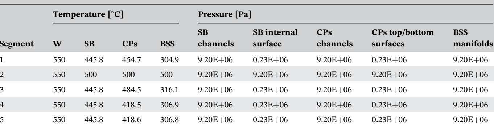

| Segment | W | Temperature \nSB | [C] \nCPs | BSS | Pressure \nSB channels | [Pa] \nSB internal surface | CPs channels | CPs top/bottom surfaces | BSS manifolds |
| --- | --- | --- | --- | --- | --- | --- | --- | --- | --- |
| 1 | 550 | 445.8 | 454.7 | 304.9 | 9.20E+06 | 0.23E+06 | 9.20E+06 | 0.23E+06 | 9.20E+06 |
| 2 | 550 | 500 | 500 | 500 | 9.20E+06 | 9.20E+06 | 9.20E+06 | 9.20E+06 | 9.20E+06 |
| 3 | 550 | 445.8 | 484.5 | 316.1 | 9.20E+06 | 0.23E+06 | 9.20E+06 | 0.23E+06 | 9.20E+06 |
| 4 | 550 | 445.8 | 418.5 | 306.9 | 9.20E+06 | 0.23E+06 | 9.20E+06 | 0.23E+06 | 9.20E+06 |
| 5 | 550 | 445.8 | 418.6 | 306.8 | 9.20E+06 | 0.23E+06 | 9.20E+06 | 0.23E+06 | 9.20E+06 |

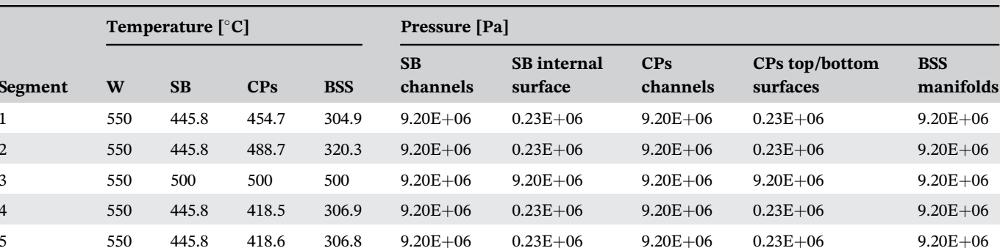

| Segment | W | Temperature \nSB | [C] \nCPs | BSS | Pressure [Pa] \nSB channels | SB internal surface | CPs channels | CPs top/bottom surfaces | BSS manifolds |
| --- | --- | --- | --- | --- | --- | --- | --- | --- | --- |
| 1 | 550 | 445.8 | 454.7 | 304.9 | 9.20E+06 | 0.23E+06 | 9.20E+06 | 0.23E+06 | 9.20E+06 |
| 2 | 550 | 445.8 | 488.7 | 320.3 | 9.20E+06 | 0.23E+06 | 9.20E+06 | 0.23E+06 | 9.20E+06 |
| 3 | 550 | 500 | 500 | 500 | 9.20E+06 | 9.20E+06 | 9.20E+06 | 9.20E+06 | 9.20E+06 |
| 4 | 550 | 445.8 | 418.5 | 306.9 | 9.20E+06 | 0.23E+06 | 9.20E+06 | 0.23E+06 | 9.20E+06 |
| 5 | 550 | 445.8 | 418.6 | 306.8 | 9.20E+06 | 0.23E+06 | 9.20E+06 | 0.23E+06 | 9.20E+06 |

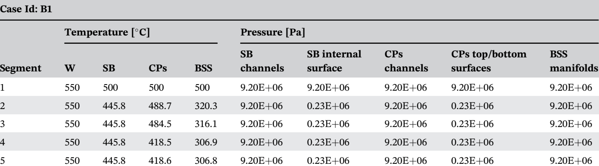

| Case Id: B1 \nSegment | W | Temperature \nSB | [C] \nCPs | BSS | Pressure \nSB channels | [Pa] \nSB internal surface | CPs channels | CPs top/bottom surfaces | BSS manifolds |
| --- | --- | --- | --- | --- | --- | --- | --- | --- | --- |
| 1 | 550 | 500 | 500 | 500 | 9.20E+06 | 9.20E+06 | 9.20E+06 | 9.20E+06 | 9.20E+06 |
| 2 | 550 | 445.8 | 488.7 | 320.3 | 9.20E+06 | 0.23E+06 | 9.20E+06 | 0.23E+06 | 9.20E+06 |
| 3 | 550 | 445.8 | 484.5 | 316.1 | 9.20E+06 | 0.23E+06 | 9.20E+06 | 0.23E+06 | 9.20E+06 |
| 4 | 550 | 445.8 | 418.5 | 306.9 | 9.20E+06 | 0.23E+06 | 9.20E+06 | 0.23E+06 | 9.20E+06 |
| 5 | 550 | 445.8 | 418.6 | 306.8 | 9.20E+06 | 0.23E+06 | 9.20E+06 | 0.23E+06 | 9.20E+06 |

TABLE 11 Case B4 loading conditions

TABLE 12 Case B5 loading conditions

FIGURE 11 The assumed mechanical
restraints

prevented

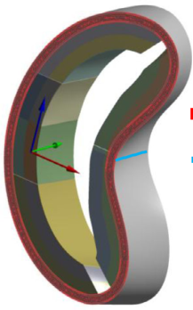

DEMO BB structural assessment, considering the different sets of stress limits values depending on whether it is
Level A or Level D analysis. Moreover, only for NO scenario (Level A), the criterion against the failure due to
progressive deformations (Max[Pm + Pb] + Q < 3 - Sm)
has been checked. In the tables reporting the criteria verification results, the numbers represent the ratio between
the stress intensity and the stress limit. Hence values
lower than 1.0 indicate that the criterion is fulfilled, vice

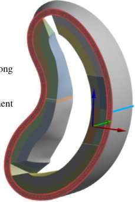

versa the stress intensity exceeds the stress limit, and the
criterion is not met in the considered path.

5.1 | OP scenario—Case A—The
displacement field

The total displacement field calculated for the BB segments (SB + BSS + tungsten) of the bean-shaped ring in

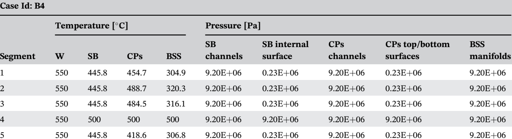

| Case Id: B4 \nSegment | W | Temperature \nSB | [C] \nCPs | BSS | Pressure [Pa] \nSB channels | SB internal surface | CPs channels | CPs top/bottom surfaces | BSS manifolds |
| --- | --- | --- | --- | --- | --- | --- | --- | --- | --- |
| 1 | 550 | 445.8 | 454.7 | 304.9 | 9.20E+06 | 0.23E+06 | 9.20E+06 | 0.23E+06 | 9.20E+06 |
| 2 | 550 | 445.8 | 488.7 | 320.3 | 9.20E+06 | 0.23E+06 | 9.20E+06 | 0.23E+06 | 9.20E+06 |
| 3 | 550 | 445.8 | 484.5 | 316.1 | 9.20E+06 | 0.23E+06 | 9.20E+06 | 0.23E+06 | 9.20E+06 |
| 4 | 550 | 500 | 500 | 500 | 9.20E+06 | 9.20E+06 | 9.20E+06 | 9.20E+06 | 9.20E+06 |
| 5 | 550 | 445.8 | 418.6 | 306.8 | 9.20E+06 | 0.23E+06 | 9.20E+06 | 0.23E+06 | 9.20E+06 |

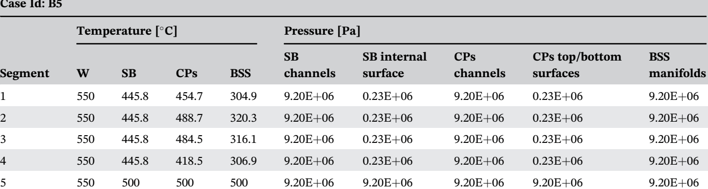

| Case Id: B5 \nSegment | W | Temperature \nSB | [C] \nCPs | BSS | Pressure [Pa] \nSB channels | SB internal surface | CPs channels | CPs top/bottom surfaces | BSS manifolds |
| --- | --- | --- | --- | --- | --- | --- | --- | --- | --- |
| 1 | 550 | 445.8 | 454.7 | 304.9 | 9.20E+06 | 0.23E+06 | 9.20E+06 | 0.23E+06 | 9.20E+06 |
| 2 | 550 | 445.8 | 488.7 | 320.3 | 9.20E+06 | 0.23E+06 | 9.20E+06 | 0.23E+06 | 9.20E+06 |
| 3 | 550 | 445.8 | 484.5 | 316.1 | 9.20E+06 | 0.23E+06 | 9.20E+06 | 0.23E+06 | 9.20E+06 |
| 4 | 550 | 445.8 | 418.5 | 306.9 | 9.20E+06 | 0.23E+06 | 9.20E+06 | 0.23E+06 | 9.20E+06 |
| 5 | 550 | 500 | 500 | 500 | 9.20E+06 | 9.20E+06 | 9.20E+06 | 9.20E+06 | 9.20E+06 |

## 5.2 | OP scenario—Case A—Stress analysis results

The results obtained from Case A (OP occurring simultaneously in all the five SBs) show that Von Mises equivalent stress values lower than 400 MPa (please note that values are reported in Pa in the pictures) are predicted in a wide part of the investigated domain. Von Mises stress values are depicted for outboard segments (Figure 13) and inboard ones (Figure 14). It can also be noted that the side walls of the segments are the most stressed areas and, consequently, those to keep under observation for future design development. As to inboard segments, the peculiar curvature changes are probably responsible of the highest stress values arising within FWs.

The evaluation of the SBs structural performances in terms of RCC MRx Level D criteria is reported from Tables 13 to 17. In particular, all the considered criteria are met in every selected path, with an encouraging margin, except for SB5, where the curvature should be the main responsible for the highest stress. The paths' location has been determined considering those regions experiencing particularly high Von Mises stress throughout a considerably wide area.

## 5.3 | OP scenario—Case B1—Stress analysis results

In this case, where OP conditions are imposed only to SB 1, whereas the other segments are in nominal conditions, the stress value of 500 MPa is exceeded within SW5 probably because of the peculiar SB1 geometric shape (Figure 15). Hence, only the Von Mises stress field arising within

[Figure 12: Total displacement [m] of the bean-shaped ring]

[Figure 13: Case A—CPs, Von Mises equivalent stress [Pa] and path locations for SB1, SB2 and SB3]

[Figure 14: Case A—CPs, Von Mises equivalent stress [Pa] and path locations for SB4 and SB5]

TABLE 13 Case A—CPs, RCC-MRx Level D criteria verification, segment 1

| Criteria | Path top | Path mid | Path bot | Path sidewall-1 | Path sidewall-2 |
|---|---|---|---|---|---|
| $P_m \leq S_m$ | 0.42 | 0.33 | 0.45 | 0.44 | 0.77 |
| $P_m + P_b \leq k_m S_m$ | 0.29 | 0.24 | 0.35 | 0.30 | 0.63 |
| $P_m + Q_m \leq S_{ps}$ | 0.23 | 0.29 | 0.29 | 0.19 | 0.52 |
| $P_m + P_b + Q + F \leq S_{ps}$ | 0.54 | 0.05 | 0.47 | 0.03 | 0.10 |

TABLE 14 Case A—CPs, RCC-MRx Level D criteria verification, segment 2

| Criteria | Path top | Path mid | Path bot | Path sidewall-1 | Path sidewall-2 |
|---|---|---|---|---|---|
| $P_m \leq S_m$ | 0.10 | 0.14 | 0.14 | 0.09 | 0.59 |
| $P_m + P_b \leq k_m S_m$ | 0.08 | 0.10 | 0.14 | 0.07 | 0.39 |
| $P_m + Q_m \leq S_{ps}$ | 0.34 | 0.15 | 0.24 | 0.19 | 0.35 |
| $P_m + P_b + Q + F \leq S_{ps}$ | 0.48 | 0.47 | 0.48 | 0.03 | 0.05 |

TABLE 15 Case A—CPs, RCC-MRx Level D criteria verification, segment 3

| Criteria | Path top | Path mid | Path bot | Path sidewall-1 | Path sidewall-2 |
|---|---|---|---|---|---|
| $P_m \leq S_m$ | 0.24 | 0.34 | 0.34 | 0.64 | 0.65 |
| $P_m + P_b \leq k_m S_m$ | 0.21 | 0.26 | 0.25 | 0.53 | 0.48 |
| $P_m + Q_m \leq S_{ps}$ | 0.25 | 0.28 | 0.35 | 0.79 | 0.60 |
| $P_m + P_b + Q + F \leq S_{ps}$ | 0.48 | 0.44 | 0.05 | 0.07 | 0.10 |

TABLE 16 Case A—CPs, RCC-MRx Level D criteria verification, Segment 4

| Criteria | Path top | Path mid-1 | Path mid-2 | Path bot | Path sidewall1 | Path sidewall2 |
|---|---|---|---|---|---|---|
| $P_m \leq S_m$ | 0.22 | 0.24 | 0.25 | 0.24 | 0.40 | 0.32 |
| $P_m + P_b \leq k_m S_m$ | 0.17 | 0.23 | 0.21 | 0.20 | 0.33 | 0.25 |
| $P_m + Q_m \leq S_{ps}$ | 0.21 | 0.20 | 0.24 | 0.27 | 0.47 | 0.40 |
| $P_m + P_b + Q + F \leq S_{ps}$ | 0.03 | 0.03 | 0.04 | 0.44 | 0.07 | 0.09 |

## TABLE 17 Case A—CPs, RCC-MRx Level D criteria verification, segment 5

| Criteria | Path top | Path mid-1 | Path mid-2 | Path bot | Path sidewall1 | Path sidewall2 |
|----------|----------|------------|------------|----------|----------------|----------------|
| $P_m \leq S_m$ | 1.12 | 1.06 | 0.88 | 1.01 | 1.31 | 0.69 |
| $P_m + P_b \leq k_b S_m$ | 1.01 | 0.44 | 0.69 | 0.70 | 1.07 | 0.46 |
| $P_m + Q_s \leq S_m$ | 0.65 | 0.28 | 0.34 | 0.42 | 0.88 | 0.68 |
| $P_m + P_b + Q + F \leq S_p$ | 0.51 | 0.07 | 0.06 | 0.08 | 0.34 | 0.10 |

[Figure 15: Case B1—CPs, Von Mises equivalent stress [Pa] and path locations for SB1 in OP]

## TABLE 18 Case B1—CPs, RCC-MRx Level D criteria verification, segment 1

| Criteria | Path top | Path mid | Path bot | Path sidewall-1 | Path sidewall-2 |
|----------|----------|----------|----------|-----------------|-----------------|
| $P_m \leq S_m$ | 0.42 | 0.33 | 0.44 | 0.94 | 0.77 |
| $P_m + P_b \leq k_b S_m$ | 0.29 | 0.24 | 0.35 | 0.69 | 0.63 |
| $P_m + Q_s \leq S_m$ | 0.16 | 0.35 | 0.30 | 0.66 | 0.56 |
| $P_m + P_b + Q + F \leq S_p$ | 0.53 | 0.06 | 0.47 | 0.10 | 0.11 |

segment 1 SB is shown since the other segments remain in the nominal conditions, whereas the postulated in-box LOCA accident occurs only within segment 1. As sidewalls are the most stressed regions, here the criteria are fulfilled with the narrowest margin (Table 18). This may be mainly due to the direct connection between BSS and VV in addition to the curvature. Anyway, the considered RCC-MRx Level D criteria are fulfilled along all the considered paths.

## 5.4 | OP scenario—Case B2—Stress analysis results

As shown in Figure 16, globally the values of the Von Mises equivalent stress for Case B2 remain below Von Mises stress sensitivity threshold of 500 MPa, probably because of the quite regular shape. It satisfies, indeed, with a large margin, the selected RCC-MRx design criteria (Table 19). Due to its quite symmetric layout, SB2 presents the lowest Von Mises stress values in the whole assessed domain.

## 5.5 | OP scenario—Case B3—Stress analysis results

The Von Mises stress field calculated for SB3 is shown in Figure 17, together with the location of the paths. The RCC-MRx criteria verification is reported in Table 20, showing that paths located through the thickness of the sidewall fulfil criteria with the lowest margin, probably due to the combined effect of the direct BSS-VV connection and the segment curvature.

## 5.6 | OP scenario—Case B4—Stress analysis results

In this case, the OP occurs just in SB4. The Von Mises stress field here calculated is shown in Figure 18, together with the location of the path. SB4 shows acceptable stress values within almost all its geometric domain. The RCC-MRx criteria verification is reported in Table 21.

[Figure 16: Von Mises equivalent stress [Pa] and path locations for SB2 in OP]

**TABLE 19** SB2 RCC-MRx Level D criteria verification, segment 2

| Criteria | Path top | Path mid | Path bot | Path sidewall-1 | Path sidewall-2 |
|---|---|---|---|---|---|
| $P_m \leq S_m$ | 0.10 | 0.12 | 0.14 | 0.10 | 0.19 |
| $P_m + P_b \leq k_b S_m$ | 0.09 | 0.09 | 0.14 | 0.08 | 0.11 |
| $P_m + Q_m \leq S_m$ | 0.14 | 0.15 | 0.25 | 0.18 | 0.30 |
| $P_m + P_b + Q + F \leq S_m$ | 0.30 | 0.30 | 0.30 | 0.03 | 0.04 |

[Figure 17: Von Mises equivalent stress [Pa] and path locations for SB3 in OP]

## 5.7 | OP scenario—Case B5—Stress analysis results

Segment 5 is the only one showing some areas where the equivalent stress exceeded 500 MPa (Figure 19), and the criteria are not verified (Table 22). The performed assessment suggests that this is the most critical segment with the assumed CPs spatial layout. This result is mainly due to the very peculiar shape of the segment, which makes the proposed CPs design unable to fully withstand the accidental loads.

## 5.8 | NO scenario results

As far as the NO scenario is concerned, the displacement field predicted within SBs and BSSs is depicted in Figure 20. The predicted displacement ranges from 0.0443 to 0.0648 m, indicating an acceptable deformation behaviour in line with that predicted for DEMO III.

The Von Mises stress distributions calculated within the SBs geometric domains are depicted in Figure 21. Regions where the predicted stress is greater than

**TABLE 20** SB3 RCC-MRx level D criteria verification, segment 3

| Criteria | Path top | Path mid | Path bot | Path sidewall-1 | Path sidewall-2 |
|---|---|---|---|---|---|
| $P_m \leq S_m$ | 0.24 | 0.34 | 0.34 | 0.65 | 0.66 |
| $P_m + P_b \leq k_b S_m$ | 0.21 | 0.27 | 0.25 | 0.53 | 0.47 |
| $P_m + Q_m \leq S_m$ | 0.25 | 0.30 | 0.40 | 0.43 | 0.54 |
| $P_m + P_b + Q + F \leq S_n$ | 0.48 | 0.44 | 0.40 | 0.08 | 0.11 |

[Figure 18: Von Mises equivalent stress and path locations for SB4 in OP [Pa]]

**TABLE 21** SB4 RCC-MRx level D criteria verification, segment 4

| Criteria | Path top | Path mid-1 | Path mid-2 | Path bot | Path sidewall1 | Path sidewall2 |
|---|---|---|---|---|---|---|
| $P_m \leq S_m$ | 0.20 | 0.21 | 0.25 | 0.24 | 0.55 | 0.31 |
| $P_m + P_b \leq k_b S_m$ | 0.16 | 0.20 | 0.20 | 0.17 | 0.40 | 0.22 |
| $P_m + Q_m \leq S_m$ | 0.17 | 0.13 | 0.18 | 0.26 | 0.43 | 0.36 |
| $P_m + P_b + Q + F \leq S_n$ | 0.03 | 0.02 | 0.03 | 0.45 | 0.07 | 0.09 |

[Figure 19: Von Mises equivalent stress [Pa] and path locations for SB5 in OP]

500 MPa are extremely localized. Globally, Von Mises stress lower than ~400 MPa is calculated.

The results of the RCC-MRx Level A criteria verification are reported from Tables 23 to 27. As it can be noted, all the criteria are fulfilled along all the considered paths, even if sometimes with a narrow margin. These results allow concluding that the proposed design may be robust enough to withstand nominal loads, at least from the primary stress point of view. In fact, the adoption of a more detailed thermal field (once HELIAS-relevant neutronic

**TABLE 2.2** SBS RCC-MRs level D criteria verification, segment 5

| Criteria | Path top | Path mid-1 | Path mid-2 | Path bot | Path sidewall1 | Path sidewall2 |
|---|---|---|---|---|---|---|
| $P_m \leq S_m$ | 1.11 | 0.86 | 0.88 | 1.01 | 0.07 | 0.75 |
| $P_m + P_b \leq k_b S_m$ | 1.00 | 0.64 | 0.69 | 0.70 | 1.07 | 1.16 |
| $P_m + Q_n \leq S_m$ | 0.65 | 0.32 | 0.36 | 0.44 | 0.85 | 0.61 |
| $P_m + P_b + Q + F \leq S_u$ | 0.52 | 0.07 | 0.06 | 0.08 | 0.34 | 0.09 |

[Figure 2.9: Displacement field [m] in NO]

Max displacement = 0.0648 m

Displacement [m]:
0.0679, 0.0657, 0.0636, 0.0614, 0.0593, 0.0571, 0.055, 0.0529, 0.0507, 0.0486, 0.0464, 0.0443, 0.0421, 0.04

Min displacement = 0.0443 m [?]

loads will be available) will allow fully predicting the mechanical effect of the secondary loads, which is presently slightly under-estimated.

## 6 | DISCUSSION AND RESULTS COMPARISON

As far as NO scenario is concerned, the obtained results are encouraging for the follow-up of the design activities. The considered RCC-MRs criteria are fulfilled with a remarkable margin. This means that the proposed design is robust enough, at least against primary loads. On the other hand, more detailed analyses are necessary to have a complete evaluation of the secondary loads effect. To this end, an extensive campaign of neutronic analysis is necessary to calculate the proper 3D distribution of the nuclear power density, together with further assumptions on the HELIAS BB cooling system. Hence, fully HELIAS-relevant thermal field should be assumed for the future in order to further evaluate the impact of secondary stresses on the RCC-MRs criteria verification. In any case, the obtained results suggest that the adopted design strategy is worthy of being pursued.

Regarding OP results, the same logic can be applied. Moreover, the following Table 28 shows a comparison

[Figure 21: Von Mises equivalent stress [Pa] in NO]

**TABLE 2.3** RCC-MRx level A criteria verification, segment 1

| Criteria | Path top | Path mid | Path bot | Path sidewall-1 | Path sidewall-2 |
|---|---|---|---|---|---|
| $P_m \leq S_m$ | 0.08 | 0.10 | 0.12 | 0.13 | 0.17 |
| $P_m \leq k_m 0 S_m$ | 0.06 | 0.07 | 0.08 | 0.09 | 0.12 |
| $P_m + P_b \leq S_m$ | 0.79 | 0.77 | 0.48 | 0.93 | 0.73 |
| $P_m + P_b + Q \leq F \leq S_m$ | 0.58 | 0.16 | 0.49 | 0.17 | 0.16 |
| $\text{Max}\,(P_m + P_b) + Q \leq 3S_m$ | 0.63 | 0.63 | 0.56 | 0.76 | 0.67 |

**TABLE 2.4** RCC-MRx level A criteria verification, segment 2

| Criteria | Path top | Path mid | Path bot | Path sidewall-1 | Path sidewall-2 |
|---|---|---|---|---|---|
| $P_m \leq S_m$ | 0.10 | 0.14 | 0.10 | 0.12 | 0.19 |
| $P_m \leq k_m 0 S_m$ | 0.07 | 0.10 | 0.07 | 0.09 | 0.13 |
| $P_m + P_b \leq S_m$ | 0.42 | 0.45 | 0.35 | 0.71 | 0.95 |
| $P_m + P_b + Q \leq F \leq S_m$ | 0.57 | 0.55 | 0.59 | 0.13 | 0.17 |
| $\text{Max}\,(P_m + P_b) + Q \leq 3S_m$ | 0.51 | 0.53 | 0.69 | 0.56 | 0.74 |

between Case A (OP occurring simultaneously in all the 5 BB segments) and Case B (OP occurring in one segment at a time). At the moment, both the conditions are considered as possible since no RAMI analysis has been performed and their frequency of occurrence is not known. The percentage difference between the case of a single BB in OP and the Case A with respect to the latter is reported along each considered path. It is not possible to select a unique trend of variation between Case A and Case B. Anyway, it can be qualitatively deduced that a path verifying a certain criterion in Case A still verifies that criterion also in Case B, sometimes with a different

TABLE 25 RCC-MRx level A criteria verification, segment 3

| Criteria | Path top | Path mid | Path bot | Path sidewall-1 | Path sidewall-2 |
|---|---|---|---|---|---|
| $P_m \leq S_m$ | 0.09 | 0.08 | 0.04 | 0.12 | 0.21 |
| $P_m + P_b \leq k_0 S_m$ | 0.08 | 0.06 | 0.03 | 0.26 | 0.14 |
| $P_m + Q_e \leq S_m$ | 0.38 | 0.44 | 0.82 | 0.52 | 0.70 |
| $P_m + P_b + Q + F \leq S_m$ | 0.63 | 0.61 | 0.14 | 0.11 | 0.16 |
| $\text{Max}(P_m + P_b) + Q \leq 3S_m$ | 0.71 | 0.53 | 0.65 | 0.57 | 0.59 |

TABLE 26 RCC-MRx level A criteria verification, segment 4

| Criteria | Path top | Path mid-1 | Path mid-2 | Path bot | Path sidewall1 | Path sidewall2 |
|---|---|---|---|---|---|---|
| $P_m \leq S_m$ | 0.05 | 0.08 | 0.09 | 0.12 | 0.10 | 0.22 |
| $P_m + P_b \leq k_0 S_m$ | 0.04 | 0.09 | 0.09 | 0.09 | 0.07 | 0.15 |
| $P_m + Q_e \leq S_m$ | 0.49 | 0.58 | 0.59 | 0.62 | 0.79 | 0.52 |
| $P_m + P_b + Q + F \leq S_m$ | 0.10 | 0.12 | 0.12 | 0.53 | 0.12 | 0.12 |
| $\text{Max}(P_m + P_b) + Q \leq 3S_m$ | 0.39 | 0.58 | 0.61 | 0.59 | 0.58 | 0.44 |

TABLE 27 RCC-MRx level A criteria verification, segment 5

| Criteria | Path top | Path mid-1 | Path mid-2 | Path bot | Path sidewall1 | Path sidewall2 |
|---|---|---|---|---|---|---|
| $P_m \leq S_m$ | 0.16 | 0.21 | 0.20 | 0.21 | 0.13 | 0.21 |
| $P_m + P_b \leq k_0 S_m$ | 0.11 | 0.18 | 0.15 | 0.14 | 0.09 | 0.15 |
| $P_m + Q_e \leq S_m$ | 0.52 | 0.56 | 0.52 | 0.52 | 0.62 | 0.94 |
| $P_m + P_b + Q + F \leq S_m$ | 0.54 | 0.44 | 0.12 | 0.10 | 0.11 | 0.16 |
| $\text{Max}(P_m + P_b) + Q \leq 3S_m$ | 0.56 | 0.31 | 0.31 | 0.31 | 0.52 | 0.79 |

margin, as well as a path not verifying in Case A still does not verify in Case B. This non-univocal behaviour should be due to the complicated geometry, which makes extremely local the response of the structure to a certain type of load. Hence, very detailed sub-models may be set up to locally assess the structural behaviour of the HELIAS BB, once the pertinent neutronic and mechanical set of loads have been defined. In any case, the mesh effect on the stress linearization results should be further investigated to improve the reliability of the results.

Although the results obtained were promising from a structural point of view, the CPs in that configuration did not properly fill some regions of the SB. Therefore, a second configuration that provides the CPs orthogonal to the surface of the FW is currently under study. In that way, the breeding region will be significantly increased. Table 29 indicates the plates number increase passing from the parallel configuration to the orthogonal one. This configuration could be assessed to highlight the pros and cons of this alternative design approach.

# 7 | CONCLUSION AND FUTURE WORKS

The present work focused on the conceptual design of the so-called bean shape BB ring of HELIAS 5-B stellarator fusion reactor. The study moved from the reference homogeneous model developed in the framework of the research activities on the BB promoted by the European Commission through the EUROfusion consortium.

To the best of the authors' knowledge, this is the first ever study involving a non-homogeneous model. The arrangement of the cooling channels passing through the SBs and the CPs was inspired by DEMO HCPB BB developed according to the "sandwich" configuration. The design of the HELIAS 5-B bean-shaped BB ring has been, therefore, conceived in analogy with DEMO HCPB BB, assuming the same design constraints and approach. Thus, CPs were arranged in such a way that they were parallel to the toroid-radial plane designed. The study

TABLE 2.8 Comparison between the cases of single segment in OP and all segments in OP

| Path | $P_{ac}/S_{ac}$ | | $(P_{ac} + P_h)/(Q_{ac} \cdot S_{ac})$ | | | $(P_{ac} + Q_{ac})/S_v$ | | | $(P_{ac} + P_h + Q + P)/S_{ac}$ | | |
|------|-----------------|--|----------------------------------------|--|--|-------------------------|--|--|----------------------------------|--|--|

| | Case A | Case B1 | $\Delta\%$ | Case A | Case B1 | $\Delta\%$ | Case A | Case B1 | $\Delta\%$ | Case A | Case B1 | $\Delta\%$ |
|------|--------|---------|-----------|--------|---------|-----------|--------|---------|-----------|--------|---------|-----------|

| | Case A | Case B1 | $\Delta\%$ | Case A | Case B1 | $\Delta\%$ | Case A | Case B1 | $\Delta\%$ | Case A | Case B1 | $\Delta\%$ |
|------|--------|---------|-----------|--------|---------|-----------|--------|---------|-----------|--------|---------|-----------|
| Top | 0.42 | 0.42 | 0.0 | 0.29 | 0.29 | 0.0 | 0.10 | 0.14 | 4.5 | 0.34 | 0.33 | −1.9 |
| Mid | 0.33 | 0.33 | 0.0 | 0.34 | 0.24 | −10.3 | 0.15 | 0.35 | 17.1 | 0.05 | 0.06 | 16.7 |
| Bott | 0.45 | 0.44 | −2.3 | 0.35 | 0.35 | 0.0 | 0.29 | 0.30 | 5.3 | 0.47 | 0.47 | 0.0 |
| SW 1 | 0.44 | 0.94 | 33.2 | 0.30 | 0.69 | 56.5 | 0.19 | 0.66 | 71.2 | 0.03 | 0.10 | 70.0 |
| SW 2 | 0.77 | 0.77 | 0.0 | 0.63 | 0.63 | 0.0 | 0.52 | 0.56 | 7.1 | 0.10 | 0.11 | 9.1 |

| | Case A | Case B2 | $\Delta\%$ | Case A | Case B2 | $\Delta\%$ | Case A | Case B2 | $\Delta\%$ | Case A | Case B2 | $\Delta\%$ |
|------|--------|---------|-----------|--------|---------|-----------|--------|---------|-----------|--------|---------|-----------|
| Top | 0.09 | 0.10 | 0.0 | 0.08 | 0.09 | 11.1 | 0.14 | 0.14 | 0.0 | 0.48 | 0.30 | −40.0 |
| Mid | 0.14 | 0.12 | −11.4 | 0.15 | 0.13 | −11.3 | 0.14 | 0.15 | 6.7 | 0.40 | 0.43 | 7.0 |
| Bott | 0.14 | 0.14 | 0.0 | 0.14 | 0.14 | 0.0 | 0.24 | 0.25 | 4.0 | 0.48 | 0.50 | 4.0 |
| SW 1 | 0.09 | 0.10 | 10.0 | 0.07 | 0.08 | 12.5 | 0.19 | 0.18 | −5.6 | 0.03 | 0.03 | 0.0 |
| SW 2 | 0.59 | 0.19 | −210.5 | 0.39 | 0.13 | −200.0 | 0.35 | 0.30 | −16.7 | 0.05 | 0.04 | −25.0 |

| | Case A | Case B3 | $\Delta\%$ | Case A | Case B3 | $\Delta\%$ | Case A | Case B3 | $\Delta\%$ | Case A | Case B3 | $\Delta\%$ |
|------|--------|---------|-----------|--------|---------|-----------|--------|---------|-----------|--------|---------|-----------|
| Top | 0.24 | 0.24 | 0.0 | 0.21 | 0.21 | 0.0 | 0.25 | 0.25 | 0.0 | 0.48 | 0.48 | 0.0 |
| Mid | 0.34 | 0.39 | −12.8 | 0.28 | 0.27 | −3.7 | 0.15 | 0.20 | 25.0 | 0.7 | 0.44 | −59.1 |
| Bott | 0.34 | 0.34 | 0.0 | 0.25 | 0.25 | 0.0 | 0.35 | 0.40 | 12.5 | 0.05 | 0.06 | 16.7 |
| SW 1 | 0.64 | 0.65 | 1.5 | 0.53 | 0.53 | 0.0 | 0.39 | 0.43 | −9.3 | 0.07 | 0.09 | 22.2 |
| SW 2 | 0.65 | 0.64 | −1.6 | 0.48 | 0.47 | −2.1 | 0.50 | 0.54 | 7.4 | 0.10 | 0.11 | 9.1 |

| | Case A | Case B4 | $\Delta\%$ | Case A | Case B4 | $\Delta\%$ | Case A | Case B4 | $\Delta\%$ | Case A | Case B4 | $\Delta\%$ |
|------|--------|---------|-----------|--------|---------|-----------|--------|---------|-----------|--------|---------|-----------|
| Top | 0.22 | 0.20 | −10.0 | 0.17 | 0.16 | −6.3 | 0.21 | 0.17 | −23.5 | 0.03 | 0.03 | 0.0 |
| Mid 1 | 0.24 | 0.21 | −14.3 | 0.23 | 0.20 | −15.0 | 0.20 | 0.15 | −33.3 | 0.04 | 0.02 | −50.0 |
| Mid 2 | 0.25 | 0.25 | 0.0 | 0.20 | 0.20 | 0.0 | 0.24 | 0.18 | −33.3 | 0.04 | 0.03 | −33.3 |
| Mid 3 | 0.24 | 0.24 | 0.0 | 0.08 | 0.17 | 0.0 | 0.27 | 0.26 | −3.9 | 0.44 | 0.02 | 0.0 |
| SW 1 | 0.55 | 0.55 | 0.0 | 0.40 | 0.40 | 0.0 | 0.47 | 0.43 | −9.3 | 0.07 | 0.07 | 0.0 |
| SW 2 | 0.32 | 0.31 | −3.2 | 0.23 | 0.22 | −4.6 | 0.40 | 0.36 | −11.1 | 0.03 | 0.08 | 62.5 |

| | Case A | Case B5 | $\Delta\%$ | Case A | Case B5 | $\Delta\%$ | Case A | Case B5 | $\Delta\%$ | Case A | Case B5 | $\Delta\%$ |
|------|--------|---------|-----------|--------|---------|-----------|--------|---------|-----------|--------|---------|-----------|
| Top | 1.12 | 1.12 | 0.0 | 1.09 | 1.09 | 0.0 | 0.29 | 0.28 | −3.6 | 0.51 | 0.51 | 0.0 |
| Mid | 0.85 | 0.36 | 3.2 | 0.64 | 0.64 | 0.0 | 0.28 | 0.32 | 12.5 | 0.07 | 0.07 | 0.0 |
| Bott | 1.01 | 1.01 | 0.0 | 0.70 | 0.70 | 0.0 | 0.42 | 0.44 | 4.6 | 0.08 | 0.08 | 0.0 |
| SW 1 | 1.31 | 1.31 | 0.0 | 1.07 | 1.07 | 0.0 | 0.34 | 0.34 | −3.5 | 0.14 | 0.14 | 0.0 |
| SW 2 | 0.69 | 0.71 | 2.8 | 0.46 | 0.48 | 4.2 | 0.68 | 0.61 | −11.5 | 0.10 | 0.09 | −11.1 |

was conducted on the BB under both nominal and accidental loading conditions (ie, in-box LOCA) to investigate its thermo-mechanical performances.

The analysis has allowed predicting displacement values, in both nominal and accidental conditions, compatible with displacement normally obtained in

**TABLE 2.9** Different number plates between the two configurations

| Segment | CPs number— Parallel configuration | CPs number— Orthogonal configuration |
|---------|--------------------------------------|---------------------------------------|
| 1 | 58 | 91 |
| 2 | 108 | 109 |
| 3 | 60 | 115 |
| 4 | 102 | 131 |
| 5 | 95 | 97 |

DEMO BB under similar loading conditions. Moreover, from the stress point of view, the considered RCC-MRx Level A criteria were totally fulfilled, whereas Level D rules were mostly satisfied. Most importantly, the obtained outcomes have allowed predicting a good margin for the criteria satisfied, whereas, in the case of not-fulfilled rules, stress values slightly above the limit have been obtained. This means that further assessments are still necessary, but the proposed design is quite promising. Future design activities will concern neutronic analysis aimed at calculating the spatial distribution of neutronic power deposited within BB and the consequent thermomechanical analysis. Then, the assessment under OP conditions involving a fully HELIAS-relevant thermal field is mandatory. In that occasion, further CBs configuration could be analysed.

## ACKNOWLEDGMENTS

This work has been carried out within the framework of the EUROfusion Consortium and has received funding from the Euratom research and training programme 2014 to 2018 and 2019 to 2020 under grant agreement No 633053. The views and opinions expressed herein do not necessarily reflect those of the European Commission. As a final remark, the authors deeply thank all the W7-X Team for having made possible this research activity and Dr. Lorenzo Virgilio Boccaccini for the suggestions aimed at improving the quality of the paper. Open access funding enabled and organized by Projekt DEAL.

## DATA AVAILABILITY STATEMENT

Data available on request from the authors.

## ORCID

*Gaetano Bongiot* https://orcid.org/0000-0002-8092-7054

## REFERENCES

1. Donné T, Morris W, Litaudon X, et al. European Research Roadmap to the Realisation of Fusion Energy. EUROfusion, 2018.
2. Warmer F, Bykov V, Brendak M, et al. From W7-X to a HELIAS fusion power plant: on engineering considerations for next-step stellarator devices. *Fus Eng Des.* 2017;123:47-53.
3. Klinger T, Andreeva T, Borhonkov S, et al. Overview of first Wendelstein 7-X high-performance operation. *Nucl Fus.* 2019; 59:112004.
4. Schauer F, Egorov K, Bykov V. HELIAS 5-B magnet system structure and maintenance concept. *Fus Eng Des.* 2013;88:1619-1622.
5. Maisonnier D, Cook I, Pierre S, et al. The European power plant conceptual study. *Fus Eng Des.* 2005;75-79:1173-1179.
6. Gasparotto M, Boccaccini LV, Giancotti L, Malang S, Marbach G. Demo blanket development in the EU task force. *Fus Eng Des.* 2002;61-62:263-271.
7. Bongiovì G, Häußler A, Arena P. Preliminary structural assessment of the HELIAS 5-B breeding blanket. *Fus Eng Des.* 2019; 146:35-38.
8. Bongiovì G, Häußler A. Advancements in the HELIAS 5-B breeding blanket structural analysis. *Fus Eng Des.* 2020;161: 111929.
9. Bongiovì G, Häußler A, Giambrone S, et al. Structural assessment of a whole toroidal sector of the HELIAS 5-B breeding blanket. *Fus Eng Des.* 2021;169:112451.
10. Hernandez F, Pereslavtsev P, Kang Q, et al. A new HCPB breeding blanket for the EU DEMO: evolution, rationale and preliminary performances. *Fus Eng Des.* 2017;124:882-886.
11. Häußler A. Computational approaches for nuclear design analyses of the stellarator power reactor HELIAS. PhD Thesis, KIT; 2020. https://doi.org/10.5445/IR/1000122986.
12. RCC-MRx. Design and Construction Rules for Mechanical Components of Nuclear Installations: AFCEN; 2015.
13. Zhou G, Hernandez F, Boccaccini LV, Chen H, Ye M. Preliminary structural analysis of the new HCPB breeding blanket for EU DEMO. *Fus Eng Des.* 2019;146:948-952. https://doi.org/10.1016/j.fusengdes.2019.01.175
14. Zhou G, Hernandez F, Boccaccini LV, Chen H. Preliminary steady state and transient thermal analysis of the new HCPB breeding blanket for EU DEMO. *Nuclear Materials and Energy.* 2019; 41(17):7047-7052.
15. Hernandez FA, Fischer U, Hernandez F, Lu L. Neutronic analyses for the optimization of the advanced HCPB breeder blanket design for DEMO. *Fus Eng Des.* 2017;124:910-914.
16. Ibarra A, Molla J, Jimenez-Morales A, Moron A, Neuberger H. Test blanket modules (ITER) and breeding blanket (DEMO): history of major fabrication technologies development of HCLL and HCPB blankets. *Fus Eng Des.* 2014;89:1639-1643.
17. Hernandez FA, Arbeiter F, Boccaccini LV, et al. Overview of the HCPB research activities in EUROfusion. *IEEE Trans Plasma Sci.* 2018;46:2247-2261.
18. Juvinall RC, Marshek KM. *Fundamentals of Machine Component Design.* 5th ed. Hoboken: John Wiley & Sons Inc; 1991.
19. Mozzillo R, Mozzillo D, Tarallo A, Bachmann C, Di Girosimo G. Development of a master model concept for DEMO. *Fus Eng Des.* 2021;167. https://doi.org/10.1016/j.fusengdes.2021.112345[?].
20. Zhou G, Hernández FA, Zeile C, Maione IA. Transient thermal analysis and structural assessment of an ex-vessel LOCA event

on the EU DEMO HCPB breeding blanket and the attachment
system. Fus Eng Des. 2018;136:34-41.
21. Spagnuolo GA, Boccaccini LV, Bongiovì G, Cismondi F,
Maione IA. Development of load specifications for the design
of the breeding blanket system. Fus Eng Des. 2020;157:111657.
22. Federici G, Biel W, Gilbert MR, Kemp R, Taylor N,
Wenninger R. European DEMO design strategy and consequences for materials. Nucl Fus. 2017;57:092002.

How to cite this article: Bongiovì G, Marra G,
Mozzillo R, Tarallo A. Heterogeneous design and
mechanical analysis of HELIAS 5-B helium-cooled
pebble bed breeding blanket concept. Int J Energy
[Res. 2022;46(3):2748-2770. doi:10.1002/er.7343](info:doi/10.1002/er.7343)

