# **Comparison of Fuel Cycles for Lead-Lithium and Pure** **Lithium Liquid Metal Walls in a Magnetized Target** **Fusion Power Plant**

## Holly B. Flynn [1], George K. Larsen [1], Arron P. Rowell [1], and Kristin Skrecky [2]

1Savannah River National Laboratory, Aiken, SC 29803

2General Fusion, Vancouver, Canada

**Abstract**

General Fusion (GF) is developing an adaptable, commercial fusion power plant based on
Magnetized Target Fusion (MTF). General Fusion's approach involves forming a spherical torus
of deuterium-tritium plasma in a large (~4 m diameter) cavity formed in liquid metal, and then
collapsing that cavity with an array of pneumatic piston drivers. The liquid metal is constantly
flowing through the fusion chamber and out to processing systems where tritium and heat will be
extracted using tritium extraction technologies and heat exchangers, respectively. This study
focuses on two candidate designs for the liquid metal blanket and first wall material for the GF
MTF power plant and assesses their impact on the tritium fuel cycle. The first candidate is the lead
lithium eutectic (LLE) and the second candidate is pure lithium (Li). It was found that the main
differences between LLE and Li designs are the extraction technologies required to remove tritium from
the blanket and the amount of tritium and its distribution within the facility. More than 80% of the inprocess tritium inventory for the LLE design is contained in the isotope separation system, while for the Li
design, over 60% of the in-process tritium inventory is contained within the blanket material. This is due
to significant tritium retention by Li. For the Li blanket, the burden of tritium processing rests on the blanket
extraction technology rather than the traditional exhaust processing route. Thus, the blanket extraction
technology is a main driver of tritium inventory in the Li system and determines the subsequent interface
with the tritium processing plant.

**1.** **Introduction**

General Fusion (GF) is developing an adaptable, commercial fusion power plant based on Magnetized
Target Fusion (MTF)[1-3]. This approach builds from concepts originally developed under the LINUS
program at the US Naval Research Laboratory and combines it with advances from experiments such as
CTX and SSPX in compact toroid plasmas and coaxial Marshall gun systems[4-6]. General Fusion's
evolution of this approach involves forming a spherical torus of deuterium-tritium plasma in a large (~4 m
diameter) cavity formed in liquid metal, and then collapsing that cavity with an array of pneumatic piston
drivers (Figure 1). If compression on a timescale faster than the thermal confinement time of the plasma is
achieved, 350-fold volumetric compression would achieve the Lawson criterion and ignition [reference].
The advantages of this approach include a 1.5 m thick liquid metal blanket with 4π coverage surrounding
the plasma, which provides straightforward heat extraction, a good tritium breeding ratio, and excellent
neutron shielding for all structural components. The pneumatic drivers, synchronized with modern digital
servo control systems, provide a low-cost driver, and the plasma target enables a pulsed system without
manufactured consumables.

Other than serving as the liner for the collapsing
cavity, the liquid metal in the GF MTF power plant
performs identical functions as it does in other
deuterium-tritium fueled fusion powerplants:
tritium breeding and heat extraction. Thus, the
liquid metal is constantly flowing through the
fusion chamber and out to processing systems
where tritium and heat will be extracted using
tritium extraction technologies and heat
exchangers, respectively. Tritium breeding and
coolant materials and the corresponding process
systems are intense areas of research within the Figure 1. The block diagram used to describe
fusion community due to their critical importance the GF device built using ASPEN Plus.
and current low level of development[7, 8] .  The
MTF approach can leverage much of this research
due to similarity of these systems across most fusion concepts. However, MTF has different requirements
than other confinement approaches, and therefore, the optimal breeding material may be different from
laser inertial confinement or tokamak devices. Additionally, blanket properties have impacts across the
whole fusion power plant, and therefore, systematic investigations are needed to ensure compatibility across
all interfaces. This study focuses on two candidate designs for the liquid metal blanket and first wall
material for the GF MTF power plant and assesses their impact on the tritium fuel cycle. The first candidate
is the lead lithium eutectic (LLE), which is more extensively studied[9-13] and offers a lower meting point,
favorable neutronics, lower reactivity, and low tritium solubility. However, it has a much higher density and
can poison the plasma as a high Z contaminant, which may seriously impact the GF MTF approach since
the liquid metal first wall will be used to compress the plasma for the fusion reaction. The second candidate
is pure lithium (Li), which has the potential for higher tritium breeding ratios (TBR) and does not poison
the plasma as a high Z contaminant. However, Li has a higher reactivity and significant tritium solubility,
and the tritium extraction techniques are less developed. In order to assess the impacts of liquid metal
choices, fuel cycle process models of both the LLE and Li systems have been developed, and the subsequent
process flows and tritium inventories are calculated and compared.

**2.** **Methodology**

Figure 2 shows block diagrams drawn up in ASPEN Plus detailing the processing units and their connecting
flows for the LLE (a.) and Li (b.) candidate blanket and first wall materials. In the diagrams, the red line
(6) is the Direct Internal Recycling (DIR) flow stream. For both material choices a DIR of 95% is set,
meaning that 95% of the flow stream is sent back to Fueling. This is enabled by the GF MTF design, which
expects little-to-no impurities and very little protium in the fueling stream.

For the LLE material choice, over 90% of the fuel will be exhausted from the fusion chamber (Chamber)
through the pumps and sent to Palladium Cleanup (PdC). The flow is then split 95% to Fueling and 5% to
Exhaust Processing (EP). For the Li material choice, the DIR originates from the blanket extraction
(EXTRACT) where 95% is sent to the Fueling block and 5% directly to Isotope Separation (IS). This is the
main difference, in design, between the two material choices. The modification of DIR in the Li material
choice is due to the expectation that there will be an excessive amount of retention of tritium fuel by the
lithium first wall (>99%). This high retention of tritium is caused by the direct contact between the
𝑚 𝑚
plasma/fuel and the first wall in the fusion chamber. The neutral flow of hydrogen (155
ℎ𝑟𝑟 [)][ will be ]

[𝑚]
completely retained in the lithium blanket since it is ≪ 0.1-0.2% of the 5.2 × 10 [8][ 𝑚] [lithium flow rate,[14] ]
ℎ𝑟𝑟
and the hydrogen ions in the plasma will be completely retained in the flowing lithium[15]. The uptake of
the DT fuel into the blanket moves the burden of processing from the chamber exhaust to the blanket
extraction system.

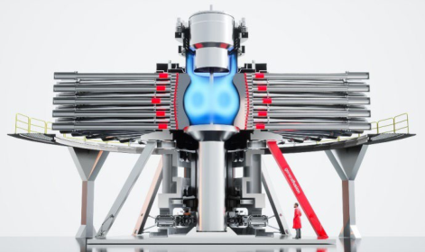

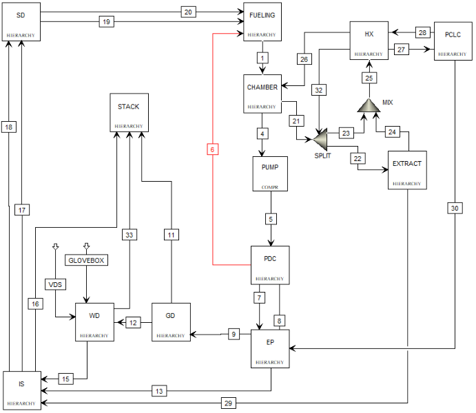
line (6) is the DIR flow stream and indicates the major change between both systems.

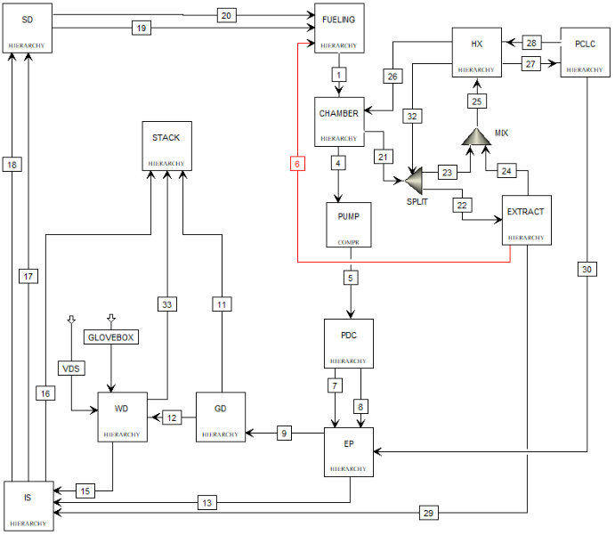

Table 1 lists the specific system block with the corresponding technology assumed for the modeling input.
Depending on the candidate blanket material the blanket extraction technology (EXTRACT) is updated.
For the LLE the blanket extraction technology is a Gas Liquid Contactor (GLC); however, a scoping study
was performed for Vacuum Sieve Traces (VST) and Permeation Against Vacuum (PAV). Direct LiT
Electrolysis[16, 17] is used for the Li candidate but a scoping study is performed using the Maroni
Process[18]. The extraction efficiency for the GLC was selected to be a modest 40%[19] and Direct LiT
Electrolysis was set to 20%. This means 40% and 20% of the tritium flowing through the extraction
technology was sent to the rest of the fuel cycle and the rest stayed in the blanket and sent through the Heat
Exchanger (HX).

A split stream is included in the blanket system to control flow volume to the blanket extraction
(EXTRACT) technology. For the LLE technology a restriction of 10% to the blanket extraction
(EXTRACT) is applied and for Li there was a restriction of 50%. The difference in allowable flow is due
to the restrictions of the chosen tritium extraction technology. A higher flow is enabled in the Li design due
to Direct LiT Electrolysis. In Direct LiT Electrolysis, the use of high temperature lithium ceramic
conductors and the design flexibility to match flows enables a theoretical high flow rate through this
extraction technology[16].

**Table 1:** Modeled system blocks and their represented technologies in Aspen Plus and the Reduced
Hydrogen INventory Optimization (RHINO) model as outlined in Figure 2.

For the modeling effort, SRNL utilized the in-house developed Reduced Hydrogen INventory Optimization
(RHINO) model and the industry standard chemical process modeling software ASPEN Plus. RHINO is a
reduced, discrete time model based on processing times[20-22] and calculates the time-dependent inventory
of each fuel cycle subsystem. The information provided by RHINO is used to calculate Startup Inventory
(𝐼𝐼𝑠 𝑠 𝑠 𝑠𝑠) as described in Equation 1 and shown in Figure 3[23].

𝐼𝐼𝑠 𝑠 𝑠 𝑠𝑠 = 𝐼𝐼𝑟 𝑟𝑟 + 20% 𝐶 𝐶 𝐶 𝐶 𝐶 𝐶𝐶                  𝐸 𝐸 𝐸 𝐸 1

The 20% contingency is a value selected by SRNL based on historical efforts and is intended to encompass
the need for tritium during commissioning and the amount lost to material saturation in the startup period
of the plant. The contingency should be described in such a way that a zero-inventory event in Storage and
Delivery (S&D) is avoided. The variable 𝐼𝐼𝑟 𝑟𝑟 is described by Equation 2 and is the difference between the

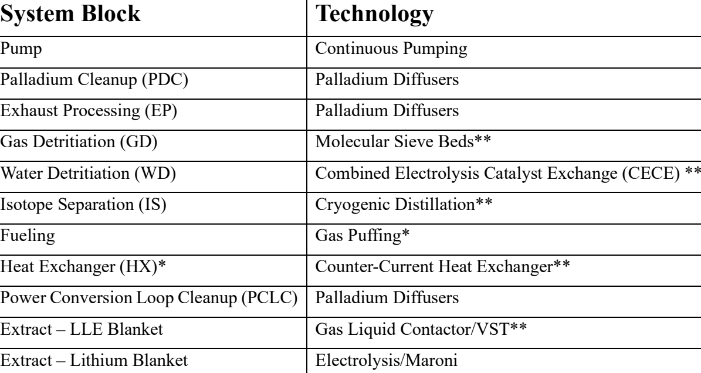

| System Block | Technology |
| --- | --- |
| Pump | Continuous Pumping |
| Palladium Cleanup (PDC) | Palladium Diffusers |
| Exhaust Processing (EP) | Palladium Diffusers |
| Gas Detritiation (GD) | Molecular Sieve Beds** |
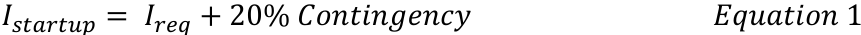
| Water Detritiation (WD) | Combined Electrolysis Catalyst Exchange (CECE) ** |
| Isotope Separation (IS) | Cryogenic Distillation** |
| Fueling | Gas Puffing* |
| Heat Exchanger (HX)* | Counter-Current Heat Exchanger** |
| Power Conversion Loop Cleanup (PCLC) | Palladium Diffusers |
| Extract – LLE Blanket | Gas Liquid Contactor/VST** |
| Extract – Lithium Blanket | Electrolysis/Maroni |

initial inventory ($I_0$) and the minimum inventory ($I_{min}$) in S&D (Figure 3). This value is dominated by the In-Process Tritium Inventory (IPTI) needs.

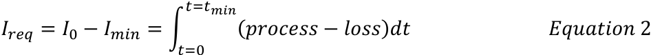
$$I_{req} = I_0 - I_{min} = \int_{t_{dep}}^{t+t_{min}} (process - loss) dt \qquad \textit{Equation 2}$$

In the above equation, *process* is the added flow of tritium that makes it to S&D from breeding and fueling and *loss* is the tritium lost through radioactive decay, the stack, and that gets held up in the processing systems until steady state operation is met. Once the system has reached steady state operation all processing components have a near steady state inventory. This occurs when S&D has achieved a minimum inventory ($I_{min}$), which is shown by the inflection point in Figure 3. Passed this point the amount bred just has to overcome the losses from radioactive decay and the stack, hence the increase in S&D inventory post inflection.

[Figure 3: A mock plot demonstrating key values for the operation of a fusion fuel cycle, including Startup Inventory (SI) (magenta), $I_{req}$ (grey), the 20% contingency (red), and $t_d$ (blue). SI is shown to be equal to the sum of $I_{req}$ and the 20% contingency and $t_d$ is shown to be the point at which the inventory in Storage and Delivery equals the Starting Inventory plus the Operational Inventory. $I_{min}$ is the point at which the system has reached near steady state conditions and all processing components have a max processing inventory.]

The plant doubling time ($t_{pd}$) occurs when the inventory in S&D acquires a sum of the startup inventory ($I_{startup}$) and the operation inventory ($I_{op}$). The $I_{op}$ is described by Equation 3.

$$I_{op} = \left(\frac{N}{\beta\eta}\right) t_r (1 - DR_{frac}) \qquad \textit{Equation 3}$$

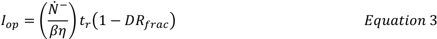
In the above equation, $t_r$ is the amount of time allotted to operate on a tritium reserve inventory. This reserve inventory is a function of the plant's maintenance plans and preferences. For the purpose of this study, $t_r$ has been set to 24 hrs[23], but this value can be more or less conservative based on plant design,

cost, and requirements. For example, the more redundancies implemented the shorter 𝑡𝑡𝑟𝑟 can be, but this
would increase the plant overall cost. The combination of the reserve inventory and 𝐷𝐷𝑅𝑅𝑓 𝑓, the fraction of
inventory flow that is returned to fueling by Direct Internal Recycling (DIR), enables a plant to continue
operation and power production if a downstream system or series of systems undergoes unplanned
maintenance or issues. For this study and based on the General Fusion design 𝐷 𝑅𝑅𝑓 𝑓 has been set to 0.95.

Table 2 lists the processing times (𝑇𝑇𝑖𝑖) of each processing block from Figure 1, burn fraction ( β ), fueling
efficiency ( η ), burn rate (𝑁𝑁 [ −] ), tritium breeding ratio (TBR), and source terms for different subsystems (𝑆𝑆𝑖𝑖)
for both the LLE and Li candidate materials.

Table 2. Processing times (𝑇𝑇𝑖𝑖) and fuel cycle parameters of each processing block from Figure 1, burn
fraction ( β ), fueling efficiency ( η ), burn rate (𝑁𝑁 [ −] ), tritium breeding ratio (TBR), and source terms for
different subsystems (𝑆𝑆𝑖𝑖) for both the LLE and Li candidate materials.

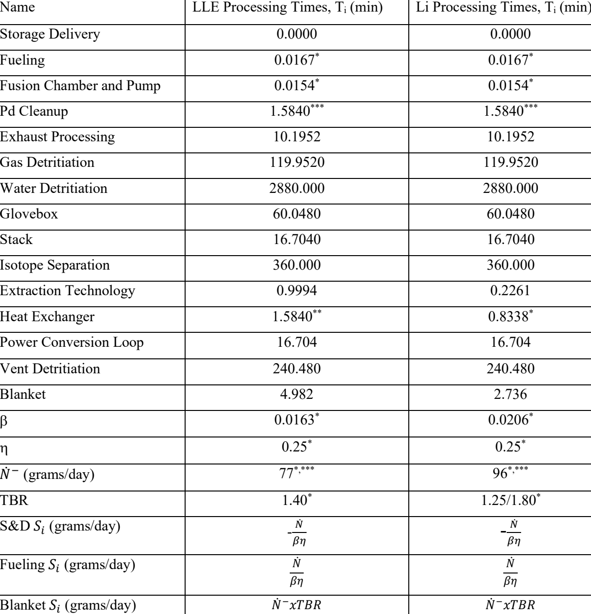

| Name | LLE Processing Times, Ti (min) | Li Processing Times, Ti (min) |
| --- | --- | --- |
| Storage Delivery | 0.0000 | 0.0000 |
| Fueling | 0.0167* | 0.0167* |
| Fusion Chamber and Pump | 0.0154* | 0.0154* |
| Pd Cleanup | 1.5840*** | 1.5840*** |
| Exhaust Processing | 10.1952 | 10.1952 |
| Gas Detritiation | 119.9520 | 119.9520 |
| Water Detritiation | 2880.000 | 2880.000 |
| Glovebox | 60.0480 | 60.0480 |
| Stack | 16.7040 | 16.7040 |
| Isotope Separation | 360.000 | 360.000 |
| Extraction Technology | 0.9994 | 0.2261 |
| Heat Exchanger | 1.5840** | 0.8338* |
| Power Conversion Loop | 16.704 | 16.704 |
| Vent Detritiation | 240.480 | 240.480 |
| Blanket | 4.982 | 2.736 |
| β | 0.0163* | 0.0206* |
| η | 0.25* | 0.25* |
| ̇− (grams/day) | 77*,*** | 96*,*** |
| TBR | 1.40* | 1.25/1.80* |
| S&D (grams/day) | - ̇ | - ̇ |
| (grams/day) | Fueling ̇ | ̇ |
| (grams/day) | Blanket ̇− * | ̇− |

The source terms (𝑆𝑆𝑖𝑖) for Storage and Delivery (S&D) and Fueling are identical but have different signs.
This is because S&D is a storage unit without a processing time and supplies the needed amount of fuel to
Fueling to maintain the targeted power output. The blanket receives a value equal to the product of the TBR
and 𝑁𝑁 [ −], which represents the amount of tritium bred and added to the system. Due to changes in blanket
material flow rate and blanket material type the Heat Exchanger, Blanket, and Extraction Technology have
different processing times between the two candidate materials. Auxiliary and secondary confinement
systems (Vent Detritiation Glovebox, and Power Conversion Loop) accumulate tritium due to nonradioactive loss fractions of the subsystems in the fuel cycle.

**3.** **Results**

Figure 4 shows the in-process tritium inventory in the Palladium Cleanup (PdC), Isotope Separation System
(ISS), Blanket Extraction (EXTRACT), Heat Exchanger (HX), and Blanket (32) subsystems at steady-state
operations for both the LLE with a TBR of 1.4 (blue) and Li with a TBR of 1.8 (magenta). Each of these
subsystems are most impacted by the changes made between material selections. For the LLE, Li with a
TBR of 1.8, and Li with a TBR of 1.25 the total in-process tritium inventory was 303, 749, and 747 grams,
respectively. The total in-process inventory of the different TBR Li systems were near identical because the
systems design and processing times are unchanged. The only difference is the TBR values, which has no
impact on the in-process inventory of the subsystems that are not tied to the blanket and its processes. The
impact on the other subsystems is minimal.

Figure 4. A bar plot showing the steady-state inventory of the Palladium Cleanup (PdC), Isotope Separation System
(ISS), Blanket Extraction (EXTRACT), Heat Exchanger (HX), and Blanket (32) subsystems for both the LLE (blue)
and Li (magenta) candidate materials for the blanket.

For the LLE material the system behaves as expected and IS, at steady state operation, has > 80% of the
total in-process tritium inventory held up in the system for operations. For the Li blanket material > 60%

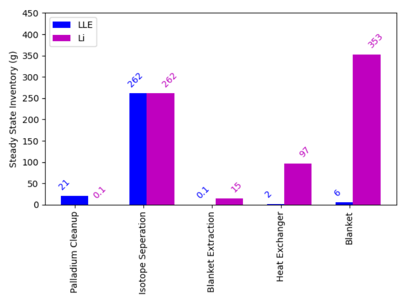

of the total in-process tritium inventory is held up in the blanket and its subsystems, whereas 35% is held
up in IS. The Li candidate system has almost 2.5 times the amount of in-process tritium inventory than the
LLE candidate system. Since IS has the same processing time for both configurations and still processes
5% of the tritium flow plus what is returned to the process through detritiation both configurations have the
same IS in-process values. The difference in in-process inventory is due to the gettering of the fuel and
plasma ions by the Li first wall and blanket material, which also leads to a reduction in exhausted gas from
the fusion chamber. This reduction of exhausted inventory leads to the Li PdC stage having roughly 200x
less tritium held up in the process than in the LLE configuration. The LLE blanket material only contains
the bred tritium hence the considerably lower tritium inventories.

Figure 5 shows the time-dependent inventory over a 75-day period in Storage and Delivery (S&D) for the
LLE (black) and Li (blue and cyan) candidate material fuel cycle configurations. The Startup Inventory
(𝐼𝐼𝑠 𝑠 𝑠 𝑠𝑠) for the LLE, Li with a TBR of 1.25, and Li with a TBR of 1.8 is 317, 844, and 793 grams,
respectively. Each 𝐼𝐼𝑠 𝑠 𝑠 𝑠𝑠 is calculated with a 20% contingency. In the previous paragraphs it was shown
that both Li systems have a total in-process tritium inventory near identical due to the minimal impact of
the TBR change. This is not the case for the startup inventory. Relative to the several 100 grams of startup
inventory 51 grams may not seem like much, but the impact of TBR on the startup inventory can be
described by Equation 2 and Figure 5. Equation 2 is an integration from time of 𝑡𝑡= 0 to 𝑡𝑡= 𝑡𝑡𝑚 𝑚𝑚. If 𝑡𝑡𝑚 𝑚𝑚
is shifted later in time this impacts the 𝐼𝐼𝑠 𝑠 𝑠 𝑠𝑠 by a factor equal to that shift in 𝑡𝑡𝑚 𝑚𝑚. The Li system with a
TBR of 1.25 is breeding less tritium, meaning it takes longer for the system to reach a 𝑡𝑡𝑚 𝑚𝑚 making the
startup inventory greater than the TBR of 1.8 which is breeding more tritium.

Figure 5. The time-dependent inventory in the Storage and Delivery (S&D) system for the LLE (TBR=1.4), Li
(TBR=1.25), and Li (TBR=1.80) candidate material first wall and blanket fuel cycle.

The startup inventory (𝐼𝐼𝑠 𝑠 𝑠 𝑠𝑠) is more heavily impacted by the processing time of the fuel cycle
subsystems. Processing time determines the amount of tritium held up in the system for operations. In the

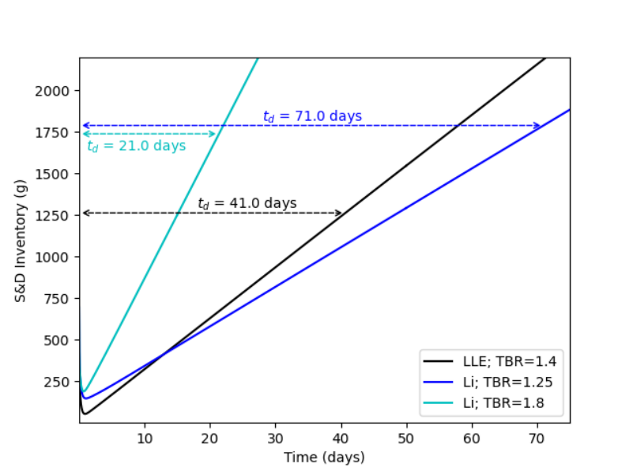

case of the LLE the highest processing time is the IS and the flow is some fraction of 5% that comes from
the exhaust of the FCP. If this flow stream were increased due to a less efficient DIR system, then the
amount of inventory held up in IS would increase. For the Li configuration, >99.9% is entering the blanket
material meaning the startup inventory is dominated by the blanket, its systems, and IS. Not covered in this
paper, but worth noting is that the startup inventory is also impacted by the burn fraction, burn rate, and
fueling efficiency as described in [23]. Improvements to burn fraction and/or fueling efficiency would
decrease the amount of fuel needed to be supplied to the system, which decreases the amount of fuel needed
for the system during startup.

Figure 5 also shows the respective 𝑡𝑡𝑝 or plant doubling time. For 𝑡𝑡𝑝 changes in TBR have a significant
impact as demonstrated by the curves. For the two Li systems an increase in TBR corresponds to a decrease
in the plant doubling time. Once the plant has reached steady state operation the amount of tritium bred
must simply overcome the losses due to radioactive decay and stacking. Both loss mechanisms are minimal
or should be kept to a minimal, meaning the more tritium bred the faster the plant reaches its plant doubling
time. For each system the doubling time is reached within a two-month time frame. This means that the
startup inventory used to start up the initial plant can either be shipped offsite for sale or used to start up a
second power plant. The current power plant will continue to operate using the operation inventory (𝐼𝐼𝑜 ) as
described in Section 2.

Figure 6 and Figure 7 shows the steady state inventory of the blanket extraction system for the LLE and the
Li first wall and blanket material fuel cycle configurations, respectively. The inventory is varied across a
range of extraction efficiencies (5%-100%) and increasing processing times (1 second – 5 hrs). The boxed
values represent expected operating conditions for technologies of interest. For the LLE (Figure 6)
candidate material the extraction systems chosen for investigation were the Gas Liquid Contactor (GLC)
shown in yellow, and the Vacuum Sieve Tray (VST)/Permeation Against Vacuum (PAV) shown in magenta.
Values were provided by GF from prior work that enabled the calculations of the bounding processing times
and extraction efficiencies for the GLC. The VST and PAV were determined to have similar bounding
processing times and extraction efficiencies when scaled to fusion relevant throughputs at their current TRL
values, as they are both expected to have low hold-up volumes while being able to handle moderately fast
flow rates[24, 25].

For the Li (Figure 7) candidate material the Maroni process bounded by a magenta box and the Direct LiT
Electrolysis process bounded by a yellow box were investigated. The Maroni process used for the analysis
is the suggested configuration. It contains a parallel network of centrifugal contactors, 25 cm diameter and
45 cm in height, resulting in a need for 314 units to handle the full throughput of 2 m [3] /s of Li[18]. Each unit
has a processing time on the order of 2.7 seconds and draws 3.7 kW of power during continuous operation
with an extraction efficiency of 20%. LiT Electrolysis functions similarly to a continuously stirred tank
reactor with the reaction rate and residence time being the main considerations. The residence time of your
unit is tied to the flowrate and volume of the system, while the extraction efficiency is proportional to the
surface area of the electrode. The LiT electrolysis process itself has little concern for power draw as running
the electrode consumes power on the order of kilowatts, but the process is in its infancy and will require
more research to determine to what level of throughput it can handle. With the current TRL being low it is
difficult to accurately determine hard values for these parameters but in theory they could be tuned to fit in
the desired fuel cycle conditions for a given system design.

The LLE candidate results show that the steady state inventory of the blanket is not a concern unless the
selected technology has very poor operating conditions and are outside of expected bounds. The highest
inventory expected for either of these technologies is a steady state inventory of 12 grams, which is 21times smaller than the steady-state inventory held up in the ISS system. This analysis was also done with
90% of the blanket material bypassing the extraction system, meaning that 10% of the LLE blanket material
was flowing through the extraction system. Combining this information with the data in Figure 4 means

that improving the processing time and extraction efficiency of the blanket extraction system or increasing
the split stream, for the LLE candidate material, does not have a significant impact on the startup inventory
or total in-process tritium inventory.

For the Li candidate material this is not the case. Not only is the steady-state in-process tritium inventory
higher for the blanket extraction subsystem than the LLE case, but the models took longer to converge when
the extraction efficiency was less than 50%. This is due to the high isotope concentration in the Li blanket
material. When the extraction efficiency is low the inventory of tritium in the blanket material increases.
The higher the extraction efficiency the more tritium that can be moved out of the blanket loop and back to
fueling or ISS. This was also calculated with 50% of the flow moving through the blanket extraction
technology, meaning that half of the Li blanket material is being processed through extraction. Ultimately,
the modifications to extraction efficiency, slip fraction, and processing times in the extraction technology
and the blanket would have a significant impact on the in-process tritium inventory in the Li first wall and
blanket material fuel cycle. Ultimately impacting the 𝐼𝐼𝑠 𝑠 𝑠 𝑠𝑠.

Figure 6. Steady-state inventory of the extraction system across varied efficiencies and processing times for LLE
assuming 90% of the blanket flow bypasses the extraction system. Yellow box represents GLC and magenta box
represents VST/PAV.

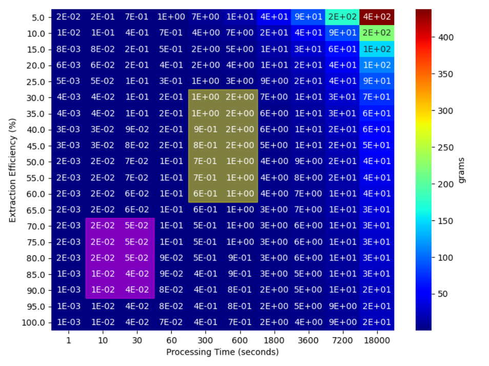

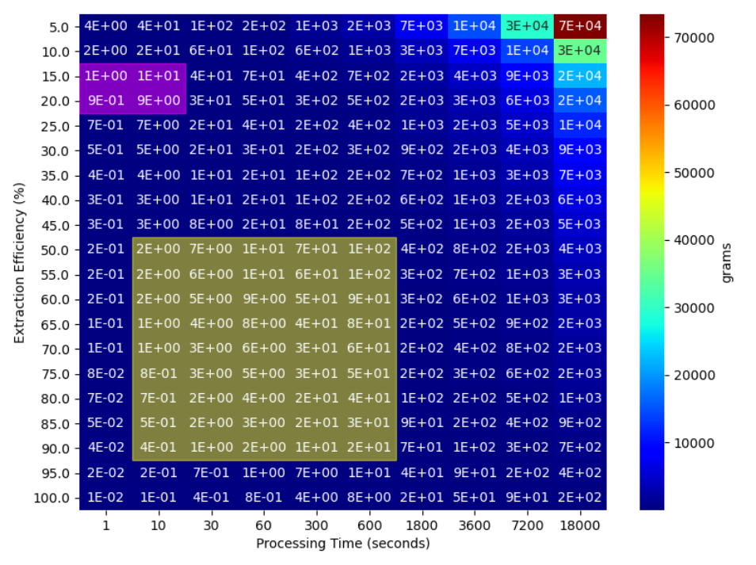
for Li assuming 50% of the blanket flow bypasses the extraction system. Yellow box represents LiT Electrolysis
and magenta box represents Maroni.

**4.** **Discussion**

The most significant difference between the two candidate first wall and blanket material is the required
physical design of the power plant. For the LLE blanket design, the system is very similar to other
contemporary designs. This system utilizes higher TRL processing subsystems and the highest amount of
in-process tritium inventory (>80%) is held up in IS. For the Li candidate material, the lithium blanket
material acts as a getter for the hydrogen and its isotopes. This means that a large portion of the total inprocess tritium inventory (>60%) is held up in the liquid lithium circulating through the blanket systems
and the fusion chamber. Due to the increase in in-process tritium inventory in the blanket systems the
fractional flow split between the blanket extraction system and the heat exchanger needs to be high. This
means that a larger portion of the flow needs to move through the blanket extraction technology and the
extraction technology needs a >20% extraction efficiency.

Furthermore, the increase in blanket inventory requires that the main tritium processing be done after the
blanket extraction system. This moves the processing load from the exhaust of the fusion chamber to the
outlet of the blanket. So, the design for the Li blanket option needs to have DIR implemented directly after
the blanket extraction system and there needs to be some mitigation system that controls the flow of isotopes
to the isotope separation system. The flow rate entering the Pd cleanup stage in the exhaust stream is orders

of magnitude lower (0.0045 $\frac{\text{m}^3}{\text{min}}$) than the LLE blanket design (0.1797 $\frac{\text{m}^3}{\text{min}}$). This value impacts the size of the Pd Cleanup phase and its processing time.

**Table 3.** Comparison of the need Startup Inventory, Plant Doubling Time, and TBR for the GF LLE and GF Li designs with values from ARC, ITER, and DEMO.

| | Startup Inventory (kg) | Plant Doubling Time (days) | TBR |
|---|---|---|---|
| GF LLE | 0.317 | 56 | 1.4 |
| GF Li | 0.747 | 67 | 1.8 |
| ARC[9] | 0.3* – 1.5 | 730 | 1.08 |
| ITER | −1.2 – 18.5** | NA | NA |
| DEMO | 4.0 – 10.0 | 1825 | 1.1–1.2 |

\*Required significant improvements in fuel cycle technologies and plasma operations and calculated using Abdou's equation.[9]

\*\*ITER will not have production of tritium so expected over the lifetime to consume ~18 kg[26, 27]

For illustrative purposes, Table 6 presents the startup inventory, plant doubling time, and TBR of both LLE and Li designs and compares them with other fuel cycle parameters: ITER, the European Union's DEMO, and Commonwealth Fusion System's ARC.

## 5. Conclusion

The modeling effort was performed using data and assumptions available on the current state of technology. Both the GF MTF LLE and Li model calculations yielded feasible systems with startup inventories below 1 kg. But the main results from the study highlighted that for the application of pure liquid Li first walls and blanket materials the blanket technology is going to be the most critical and key technologies to success. The calculated inventory in the GF MTF blanket material was greater than 300 grams; therefore, it is recommended that for similar systems utilizing pure Li first wall and blanket material that Research and Development (R&D) efforts should be focused on optimizing the blanket technology. This includes optimizing the blanket extraction system so that greater than 20% is removed from the blanket, so the extraction technology can handle greater than 50% of the material flow, and by reducing the processing times to reduce inventory hold up. The blanket inventory will also include protium and deuterium and understanding the impact this increased inventory has on the system will be important and should be further studied.

## 6. Acknowledgements

The authors thank Alex Somers and Collin Malone for their helpful discussions and direction and are grateful for support from the Office of Fusion Energy Sciences, DOE. This work was produced by Battelle Savannah River Alliance, LLC under Contract No. 89303321CEM000080 with the U.S. Department of Energy. Publisher acknowledges the U.S. Government license to provide public access under the DOE Public Access Plan (http://energy.gov/doe/downloads/doe-public-access-plan). The United States Government retains and the publisher, by accepting this article for publication, acknowledges that the United States Government retains a non-exclusive, paid-up, irrevocable, worldwide license to publish or reproduce the published form of this work, or allow others to do so, for United States Government purposes.

**7.** **References**

1. Laberge, M., _Experimental Results for an Acoustic Driver for MTF._ Journal of Fusion Energy, 2008.
**28** (2): p. 179-182.
2. Howard, S., et al., _Development of Merged Compact Toroids for Use as a Magnetized Target Fusion_
_Plasma._ Journal of Fusion Energy, 2008. **28** (2): p. 156-161.
3. O'Shea, P., et al., _Magnetized target fusion at General Fusion: an overview._ 59th Annual Meeting of
the APS Division of Plasma Physics, Milwaukee, USA, 2017: p. 23-27.
4. Hudson, B., et al., _Energy confinement and magnetic field generation in the SSPX spheromak._ Physics
of Plasmas, 2008. **15** (5).
5. Marshall, J. and I. Henins, _THE FAST PLASMA FROM A COAXIAL GUN_ . 1964, Los Alamos National
Laboratory (LANL): Los Alamos, NM (United States).
6. Turchi, P., et al., _Development of imploding liner systems for the NRL LINUS program_ . 1979, Naval
Research Laboratory (NRL): Washington, D.C. (United States).
7. Hernández, F.A. and P. Pereslavtsev, _First principles review of options for tritium breeder and neutron_
_multiplier materials for breeding blankets in fusion reactors._ Fusion Engineering and Design, 2018.
**137** : p. 243-256.
8. Konishi, S., et al., _Functional materials for breeding blankets—status and developments._ Nuclear
Fusion, 2017. **57** (9).
9. Meschini, S., et al., _Modeling and analysis of the tritium fuel cycle for ARC- and STEP-class D-T fusion_
_power plants._ Nuclear Fusion, 2023. **63** (12).
10. Abdou, M., et al., _Physics and technology considerations for the deuterium–tritium fuel cycle and_
_conditions for tritium fuel self sufficiency._ Nuclear Fusion, 2020. **61** (1).
11. Coleman, M., Y. Hörstensmeyer, and F. Cismondi, _DEMO tritium fuel cycle: performance, parameter_
_explorations, and design space constraints._ Fusion Engineering and Design, 2019. **141** : p. 79-90.
12. Federici, G., et al., _Overview of the DEMO staged design approach in Europe._ Nuclear Fusion, 2019.
**59** (6).
13. Humrickhouse, P.W. and B.J. Merrill, _Tritium aspects of the fusion nuclear science facility._ Fusion
Engineering and Design, 2018. **135** : p. 302-313.
14. Stubbers, R., et al., _Measurement of hydrogen absorption in flowing liquid lithium in the flowing lithium_
_retention experiment (FLIRE)._ Journal of Nuclear Materials, 2005. **337-339** : p. 1033-1037.
15. Baldwin, M.J., et al., _Plasma interaction with liquid lithium: Measurements of retention and erosion._
Fusion Engineering and Design, 2002. **61-62** : p. 231-236.
16. Teprovich, J.A., et al., _Electrochemical extraction of hydrogen isotopes from Li/LiT mixtures._ Fusion
Engineering and Design, 2019. **139** : p. 1-6.
17. Garcia-Diaz, B.L., et al., _Recovery of tritium from molten lithium blanket_ . 2019, Savannah River Site
(SRS): Aiken, SC (United States).
18. Maroni, V.A., R.D. Wolson, and G.E. Staahl, _Some Preliminary Considerations of A Molten-Salt_
_Extraction Process to Remove Tritium from Liquid Lithium Fusion Reactor Blankets._ Nuclear
Technology, 2017. **25** (1): p. 83-91.
19. Alpy, N., T. Dufrenoy, and A. Terlain, _Hydrogen extraction from Pb–17Li: Tests with a packed column._
Fusion Engineering and Design, 1998. **39-40** : p. 787-792.
20. Abdou, M.A., et al., _Deuterium-Tritium Fuel Self-Sufficiency in Fusion Reactors._ Fusion Technology,
1986. **9** (2): p. 250-285.
21. Flynn, H.B. and G. Larsen, _Investigating the application of Kalman Filters for real-time accountancy_
_in fusion fuel cycles._ Fusion Engineering and Design, 2022. **176** .
22. Flynn, H.B. and G. Larsen, _Fusion Fuel Cycle Inventory Reduction Studies Using a Processing-Time–_
_Based Discrete-Time Interval Model._ Fusion Science and Technology, 2022. **79** (1): p. 60-68.
23. Malone, C., et al., _Approach to Startup Inventory for Viable Commercial Fusion Power Plant._

24. Garcinuño, B., et al., _Design and fabrication of a Permeator Against Vacuum prototype for small scale_
_testing at Lead-Lithium facility._ Fusion Engineering and Design, 2017. **124** : p. 871-875.
25. Okino, F., et al., _Feasibility analysis of vacuum sieve tray for tritium extraction in the HCLL test blanket_
_system._ Fusion Engineering and Design, 2016. **109-111** : p. 1748-1753.
26. Glugla, M., et al., _The ITER tritium systems._ Fusion Engineering and Design, 2007. **82** (5-14): p. 472487.
27. Pearson, R.J., A.B. Antoniazzi, and W.J. Nuttall, _Tritium supply and use: a key issue for the development_
_of nuclear fusion energy._ Fusion Engineering and Design, 2018. **136** : p. 1140-1148.

