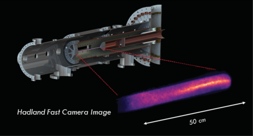
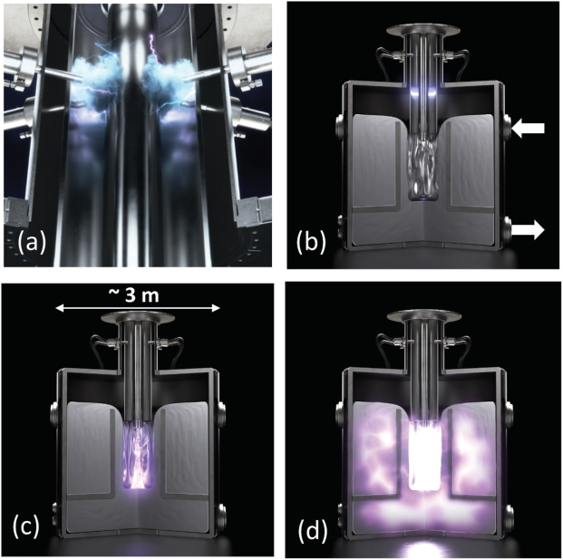
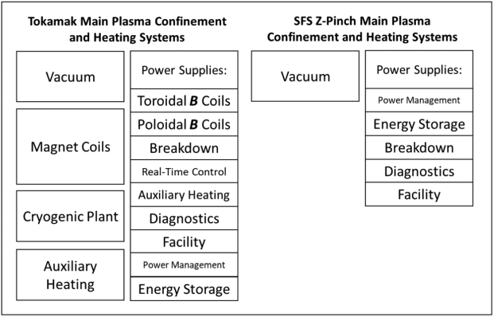
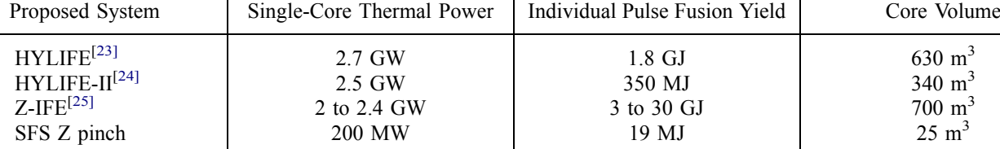

### **Fusion Science and Technology**

**[ISSN: 1536-1055 (Print) 1943-7641 (Online) Journal homepage: www.tandfonline.com/journals/ufst20](https://www.tandfonline.com/journals/ufst20?src=pdf)**

## **Engineering Paradigms for Sheared-Flow-** **Stabilized Z-Pinch Fusion Energy**

**M. C. Thompson, B. Levitt, B. A. Nelson & U. Shumlak**

**To cite this article:** M. C. Thompson, B. Levitt, B. A. Nelson & U. Shumlak (2023) Engineering
Paradigms for Sheared-Flow-Stabilized Z-Pinch Fusion Energy, Fusion Science and Technology,
[79:8, 1051-1058, DOI: 10.1080/15361055.2023.2209131](https://www.tandfonline.com/action/showCitFormats?doi=10.1080/15361055.2023.2209131)

**To link to this article:** [https://doi.org/10.1080/15361055.2023.2209131](https://doi.org/10.1080/15361055.2023.2209131)

© 2023 Zap Energy, Inc. Published with
license by Taylor & Francis Group, LLC.

Published online: 12 Jun 2023.

[Submit your article to this journal](https://www.tandfonline.com/action/authorSubmission?journalCode=ufst20&show=instructions&src=pdf)

Article views: 5296

[View related articles](https://www.tandfonline.com/doi/mlt/10.1080/15361055.2023.2209131?src=pdf)

[View Crossmark data](http://crossmark.crossref.org/dialog/?doi=10.1080/15361055.2023.2209131&domain=pdf&date_stamp=12%20Jun%202023)

[Citing articles: 7 View citing articles](https://www.tandfonline.com/doi/citedby/10.1080/15361055.2023.2209131?src=pdf)

Full Terms & Conditions of access and use can be found at
[https://www.tandfonline.com/action/journalInformation?journalCode=ufst20](https://www.tandfonline.com/action/journalInformation?journalCode=ufst20)

FUSION SCIENCE AND TECHNOLOGY - VOLUME 79 - 1051–1058 - NOVEMBER 2023
© 2023 Zap Energy, Inc. Published with license by Taylor & Francis Group, LLC.
DOI: https://doi.org/10.1080/15361055.2023.2209131

# **Engineering Paradigms for Sheared-Flow-Stabilized Z-Pinch** **Fusion Energy**

_aZap Energy Inc, Seattle, Washington, 98275_
_bUniversity of Washington, Aerospace & Energetics Research Program, Seattle, Washington_

Received July 14, 2022
Accepted for Publication April 24, 2023

**Abstract**     - _The sheared-flow-stabilized Z-pinch concept is on a path to commercialization at Zap Energy._
_Recent experiments on the Fusion Z-pinch Experiment (FuZE) device corroborate expected plasma stability_
_and thermonuclear fusion reaction rates. Experimental campaigns are underway to increase the pinch current,_
_the stable plasma duration, and the DD fusion neutron production. The next-generation device FuZE-Q is_
_currently undergoing commissioning and will begin operation at current levels where scientific breakeven-_
_equivalent conditions are expected in the near future. The Z-pinch configuration offers the promise of_
_a compact fusion device owing to its simple geometry, unity beta, and absence of external magnetic field coils._

_In addition to a robust experimental program pushing plasma performance toward breakeven condi­_
_tions, Zap Energy has parallel programs developing power handling systems suitable for future power_
_plants. Technologies under development include high-average-power repetitive pulsed power, high-duty-_
_cycle cathodes, and liquid-metal wall systems. High-level features of the conceptual power plant core_
_design are elaborated and compared with other approaches to fusion energy._

**Keywords**    - _Z-pinch, alternative fusion concept, deuterium-tritium, compact fusion reactor, fusion experi­_
_mental reactor design._

**Note —** _Some figures may be in color only in the electronic version._

## **I. INTRODUCTION**

Interest in controlled nuclear fusion as a power source
is growing rapidly due to the acute need for large-scale
sources of carbon-free electrical power and process heat to
mitigate climate change. Sixty years of past plasma con­
finement research have produced steady increases in per­
formance as measured by the Lawson criterion. [[][1][] ] Recent

*E-mail: matt@zap.energy
This is an Open Access article distributed under the terms of the
Creative Commons Attribution-NonCommercial-NoDerivatives
License (http://creativecommons.org/licenses/by-nc-nd/4.0/), which
permits non-commercial re-use, distribution, and reproduction in
any medium, provided the original work is properly cited, and is
not altered, transformed, or built upon in any way. The terms on
which this article has been published allow the posting of the
Accepted Manuscript in a repository by the author(s) or with their
consent.

advances toward scientific breakeven, the point at which
the fusing plasma produces more energy from fusion reac­
tions than the energy used to ionize and heat it, have
spurred the development of a nascent private fusion
industry. [[][2][] ] The achievement of net energy production
from a confined fusing plasma is a necessary but insuffi­
cient condition for the creation of a practical and econom­
ically attractive power plant. Issues surrounding
confinement and heating system complexity, fuel cycle,
longevity and maintainability of components, total radio­
active inventory, and operational overhead will drive the
cost of future fusion energy.

Lidsky clearly showed that the largest impediments to
an economic fusion power plant group into two
categories. [[][3][] ] The first category revolves around the plasma
confinement device’s large size, high technological com­
plexity, and low power density compared with alternatives
like fission-based nuclear energy. The second category

focuses on the neutron intensity of the deuterium-tritium
(DT) fuel cycle and the associated issues of radiation
damage in materials, induced radioactivity, and shielding.
Both sets of issues drive up the cost of the prototypic
magnetic confinement (tokamaks and mirror machines)
and inertial confinement (both laser- and particle beam–
driven) DT-fueled systems.

Lidsky advocated, as have others before and since, for
focusing on lower-neutron-intensity fuel cycles, particu­
larly deuterium with [3] He (D- [3] He) and proton with
11B (p-11B), to mitigate these factors and prevent them
from making future fusion-generated power economically
unattractive. [[][3][] ] However, the risks of pursuing this strategy
are high and driven by the temperatures and confinement
times necessary to burn these fuels. [[][1][] ] While ~10-keV
thermal temperature is generally sufficient for a DT reac­
tor, D- [3] He requires ~70 keV [[][4][] ] and p- [11] B ~100 keV. [[][1][] ]

Given that six decades of research are just now bringing
breakeven thermal DT plasma conditions within grasp, it is
unclear when the order of magnitude improvements in the
thermal plasma temperatures and confinement necessary
for D-He [3 ] and p-B [11 ] will be available. A non-Maxwellian
system based on high energy beam injection into a colder
ion target can successfully generate energy from these
fuels in principle, but the very high requirements on elec­
tron temperature in such a system exceed what has been
achieved experimentally by a wide margin. [[][5][–][7]]

The sheared-flow-stabilized (SFS) Z-pinch approach
to fusion energy [[][8][] ] aims to improve the economic viability
of fusion power by creating a system that can use the DT
fuel cycle as advantageously as possible. Compared with
typical magnetic and inertial confinement approaches, the
SFS Z pinch is intrinsically small in physical size, low in
technical complexity, and high in power density. Sections
II and III of this paper elaborate on the history of Z-pinch
fusion research and the short (~0.5 m), thin (~0.15 mm),
and high density (~10 [26 ] m [−3] ) SFS Z-pinch plasmas
planned for prototypical power plants based on the tech­
nology. Section IV describes how the SFS Z pinch is
directly and efficiently driven by an electrical power sup­
ply without the need for external magnets, auxiliary heat­
ing, or inefficient conversion of the drive energy to other
intermediate forms. Section V discusses how the linear
geometry of the SFS Z-pinch enables relatively straightfor­
ward engineering implementation of a liquid-metal first
wall and breeding blanket compared with other fusion
approaches. Operating a DT fusion plasma within a liquidmetal first wall and blanket has the potential to greatly
reduce the engineering problems associated with first-wall
heat flux, neutron radiation damage, and activation.
Finally, Sec. VI provides a summary of this paper.

## **II. Z-PINCH FUSION**

Z-pinch fusion relies on the self-compression that
occurs in a plasma column due to the passage of a strong
unidirectional current and has a long history in controlled
thermonuclear fusion research. Early promising results on
the ZETA device in the late 1950s briefly made Z-pinches
the front runner in fusion energy research. [[][9][] ] However, pro­
gress in Z-pinch performance was short-lived due to the
rampant plasma instabilities endemic to a basic Z-pinch.
By the 1960s, research on Z-pinches as systems for fusion
energy was largely abandoned in favor of other approaches.
This situation began to change in the 1990s with the propo­
sal to stabilize Z-pinch plasmas via sheared flow. [[][10][]]

The SFS Z-pinch concept, [[][8][] ] originally developed at the
University of Washington with Lawrence Livermore
National Laboratory collaborators, is now on a path to
commercialization at Zap Energy. The Fusion Z-pinch
Experiment (FuZE) employs high power–handling electro­
des, flexible gas injection, and independently switched
capacitor bank modules to tailor the discharge current and
gas distribution to establish stabilizing sheared flow and
pinch current (Fig. 1). [[][11][] ] Recent experiments corroborate
the expected DD fusion neutron production rates sustained
for ~10 µs, which is thousands of times the magnetohydro­
dynamic instability growth time typical of an unstabilized
Z-pinch with similar parameters. [[][12][] ] The measured neutron
spectra are also consistent with thermonuclear production. [[][13][]]

Experimental campaigns are underway to increase
the pinch current, stability duration, and DD fusion neu­
tron production. The next-generation device FuZE-Q is
currently undergoing commissioning and will soon begin
operation at currents levels where scientific breakevenequivalent conditions are expected. The Z-pinch config­
uration offers the promise of a compact fusion device

Fig. 1. False color, visible wavelength image of a SFS
Z-pinch plasma (lower right) shown with the approxi­
mate location the plasma occupies within the FuZE
device.

## III. SFS Z-PINCH OF PLANT PROTOTYPICAL PARAMETERS

The SFS Z pinch is an inherently compact form of plasma confinement that enables similarly compact power plant designs. Table I lists the approximate plasma parameters at each step between the FuZE and a nominal SFS Z-pinch power plant core.[13] In all cases, the plasma length remains 0.5 m long. A single plasma temperature *T* is given since equal ion temperature $T_i$ and electron temperature $T_e$ are assumed in SFS Z-pinch plasmas.[9] That assumption was validated on FuZE with independent $T_i^{[14]}$ and $T_e^{[15]}$ measurements. As shown in Table I, Z-pinch plasma parameters elevate rapidly with increasing pinch current. Delivering pinch currents of ~1 MA is well within the technical state of the art in the field of pulsed power and numerical simulations suggest that sheared-flow stabilization is robust, but the question remains if sheared flows will continue to be effective at stabilizing laboratory Z pinches with higher fusion performance and longer pulse durations.[3] The FuZE-Q device was designed and built to explore this question experimentally.

The current conceptual core design uses a vertically oriented plasma operated in pulsed mode (Fig. 2). A tank of liquid metal serving the dual functions of heat exchange and tritium breeding medium forms the main body of the conceptual core. The liquid is pumped from the sides of the tank up and over a weir wall to form a central cavity surrounded by flowing liquid metal. The SFS Z-pinch formation system sits on top of the tank and repeatedly fires pulses of plasma that assemble and generate fusion reactions within the liquid-metal-lined cavity. Each plasma pulse will produce a nominal yield of 19 MJ of fusion energy, as described in Table I. The pulse rate is variable to allow for controllably output power and load-following with a nominal maximum thermal power of 200 MW.

A power generation plant could have several SFS Z-pinch fusion cores to increase maximum power output and reduce costs by sharing maintenance and the tritium handling infrastructure among multiple cores. The core's size of approximately 3 m in diameter is set by the required thickness of the liquid blanket, which is composed of lithium and lead in the current conceptual design. The following sections detail the advantages of this approach to fusion energy.

## IV. COMPLEXITY AND EFFICIENCY OF PLASMA CONFINEMENT AND HEATING SYSTEMS

A clear advantage of the SFS Z-pinch approach to fusion energy is the relative simplicity of the device. Focusing just on the major systems required to confine, heat, and burn the thermonuclear plasma, a typical tokamak requires superconducting magnets and coils, a cryogenic plant, a vacuum system, and electrical power supplies. A SFS Z-pinch device only requires a vacuum system and electrical power supplies. Dispensing with the superconducting magnets and cryogenic plant is already a substantial reduction in technical complexity. Furthermore, five types of electrical power supplies are necessary for typical tokamak fusion devices.[16] Four of these power supply categories are dedicated to the magnetic coils and auxiliary heating systems, none of which are necessary for a SFS Z-pinch system. The remaining five categories dealing with driving plasma current and facility load are common to both approaches to fusion. Therefore, the engineering of a SFS Z-pinch-based power plant begins at a substantially lower

**TABLE I**

SFS Z-pinch Approximate Plasma Parameters at Each Development Step

| Parameter | Symbol | FuZE | Scientific Breakeven | Engineering Breakeven | Power Plant (Each Core) |
|---|---|---|---|---|---|
| Pinch current | $I_{\text{pinch}}$ (MA) | 0.25 to 0.3 | 0.6 to 0.7 | 1.0 | 1.2 to 1.5 |
| Pinch radius | $a$ (mm) | 1 to 3 | 1 to 3 | 0.5 | 0.15 |
| Pinch length | $L_p$ (m) | 0.5 | 0.5 | 0.5 | 0.5 |
| Electron density | $n_e$ (m$^{-3}$) | $10^{23}$ to $10^{24}$ | $5 \times 10^{24}$ | $10^{25}$ | $1.5 \times 10^{26}$ |
| Temperature | $T$ (keV) | 1 to 2 | 10 to 15 | 10 to 15 | 35 to 30 |
| Plasma lifetime | $\tau_p$ (μs) | 20 to 40 | 100 | 150 | 200 |
| Fusion energy | $E_{\text{fus}}$ (MJ) | $10^{-8}$ | 0.07 | 0.7 | 19 |

Fig. 2. Artist’s conception of a SFS Z-pinch fusion power core. (a) DT gas injection and ionization occur near the top of the
device. (b) The plasma travels down the coaxial accelerator region toward a cavity formed by pumping liquid metal up and over
a weir wall within a larger tank. White arrows denote the liquid-metal inlet and outlet. (c) SFS Z-pinch plasma column assembles
on axis and fuses. (d) Fusion neutrons are captured in the liquid-metal blanket.

level of interacting systems and complexity than
a prototypical tokamak (Fig. 3). Tokamaks have had
a longer development history than SFS Z-pinch devices
and are currently much closer to breakeven performance
as measured by the Lawson criterion. [[][1] ] The degree to
which SFS Z-pinch plasma confinement and heating sys­
tems will increase in complexity as their performance
increases remains to be seen.

The SFS Z-pinch is an explicitly pulsed device.
A power plant based on this technology would operate
in a manner analogous to an internal combustion engine.
Each individual firing of the stabilized Z-pinch would be
a discrete event that produces ~20 MJ of fusion energy
(Table I). The rate of firing, much like the revolutions
per minute of an internal combustion engine, may be
varied to adjust total power output as needed. This opera­
tional paradigm opens up possibilities for effective loadfollowing to better support a grid powered with
a significant fraction of variable wind and solar sources.

Considerations of the recirculating power fraction
and capacity factor, which are both vital to the economic
viability of fusion energy, highlights the advantages of

the SFS Z-pinch in pulsed-mode operation. Recirculating
power refers to the amount of electricity generated from
fusion power that must be fed back into the plant to
maintain its operation. All fusion power systems have
substantially higher recirculating power needs than
legacy fossil fuel or fission power plants due to the
need for plasma confinement and heating to maintain
the fusion reaction. The capacity factor is the timeaveraged power produced by the plant divided by the
nominal plant design power. Early generations of fusion
power plant designs based on steady-state tokamak con­
cepts are expected to barely produce net power based on
estimates of recirculating power between 0.4 to 0.6,
capacity factors of 0.4 to 0.8, and the commensurate
poor overall plant efficiency. [[][17]]

One key factor in this analysis is that tokamaks are
designed to operate at a fixed magnetic field and plasma
current. [[][17] ] Therefore, the current drive power, which is
a dominant part of the recirculating power, does not scale
with the output power. This is not the case in a pulsedmode SFS Z pinch where the power output is expected to
scale with the input current and power, [[][8] ] improving

SHEARED-FLOW-STABILIZED Z-PINCH FUSION ENERGY                  - THOMPSON et al. **1055**

Fig. 3. Graphical representation of the relative complexity of plasma confinement and heating systems in tokamaks and SFS Zpinch devices. Power supply categorization for tokamaks is adapted from Lampasi and Minucci [[][16][] ] and mapped approximately to
SFS Z-pinch systems for comparison purposes.

overall plant efficiency when variable output is required.
While other approaches to fusion, like inertial confine­
ment fusion (ICF), share some advantages of pulsedmode operation, they suffer from extreme inefficiencies
in their approaches to plasma heating. Projections based
on current and near-term laser technology suggest that
electrical-to-optical energy efficiency in a future National
Ignition Facility (NIF)–derived laser ICF system could
reach 18%. [[][18] ] This is a much higher efficiency than the
current state of the art at the NIF and would require
heavily optimizing the 17 loss mechanisms analyzed by
Bayramian et al. in the lengthy conversion chain between
alternating current (AC) power and laser light. [[][18]]

The electrical energy necessary to confine and heat
the SFS Z-pinch is driven directly from the power supply
to the plasma without highly inefficient intermediate con­
version to other forms (e.g., neutral particle beams, lasers,
or radio-frequency electromagnetic waves). The SFS Zpinch driving power supply consists mainly of AC to
direct current (DC) rectification followed by a pulsedpower modulator. The AC-DC rectification efficiency of
~90% has been documented at the long-running
12.5-MW High Intensity Proton Accelerator (HIPA)
cyclotron-based proton accelerator facility. [[][19] ] Pulsedpower modulator units based on solid-state thyristor
switch stacks with current and voltage ratings relevant
to future SFS Z-pinch power plants have demonstrated
80% efficiency via calorimetric measurement when oper­
ating for hours at five pulses per second. [[][20] ] Taking these
numbers as a basis and rounding down, the total effi­
ciency of the electrical drive system for the SFS Z pinch
from the “wall plug” to the plasma cathode is expected to

be approximately 70%. The repetitive pulsed-power pro­
gram at Zap Energy is currently building subscale test
stands to evaluate and develop power supply technology
for future power plants.

## **V. HIGH COVERAGE LIQUID-METAL FIRST WALL AND** **BLANKET**

In addition to confining, heating, and fusing the fuel,
any practical fusion power plant based on the DT fuel
cycle must economically turn the high-energy neutrons
produced into electricity and more tritium. The preferred
engineering approach to this requirement is minimizing
the solid structure near the fusing plasma and designing
the first wall and neutron-absorbing tritium breeding
blanket to consist primarily of a flowing, lithiumbearing liquid coolant. Neutrons absorbed in a liquid are
prevented from striking and embrittling solid parts of the
core structure. A flowing first wall can also tolerate
higher heat fluxes than a solid first wall. Finally,
a combined liquid coolant and breeding medium can be
pumped through the core to facilitate the extraction of
both heat and tritium.

Much work has been done on liquid surfaces for plasmafacing components in tokamaks, but it has been largely
focused on thin layers for mitigating heat flux and impurity
recycling from the vacuum chamber wall. [[][21] ] Lithium is
preferred in this application since it is the lightest nongaseous
element, which makes it a relatively benign plasma impurity
and a good chemical getter of other common heavier impu­
rities. However, the toroidal geometry and high magnetic

fields of tokamaks make the use of any flowing liquid metal
difficult due to magneto-hydrodynamic and gravitational
forces and precludes any obvious technical path to a thick
liquid first wall.

Here we use the term thick liquid first wall to denote
a width of liquid material, likely on the order of a meter or
more, sufficient to significantly reduce the neutron flux and
the commensurate neutron damage rate impinging on the
main solid structural components of the fusion device.
While there is little prospect of reducing neutron damage to
the plasma-facing solid mechanical structures of tokamaks
using a thick liquid first wall, tritium breeding in nonconduct­
ing molten salts behind the first-wall system is an active area
of development. [[][22]]

Thick liquid first walls are much more feasible in
inertial and magneto-inertial fusion concepts where there
are either no strong magnetic fields in the system or the
strong magnetic fields do not extend outside the plasma
itself. The absence of magnetic fields, and hence magnetohydrodynamic forces, in the first-wall and blanket regions
significantly reduces the difficulty of pumping liquid metal
through these volumes. The High-Yield Lithium-Injection
Fusion-Energy (HYLIFE) design study envisioned using
175 vertical liquid lithium jets surrounding the point
where ICF fuel pellets are repeatedly exploded to protect
the first structural wall from X-rays, alpha particles, debris,
and 90% of the neutron flux. [[][23]]

The HYLIFE-II considered the same design with
a molten salt composed of fluorine, lithium, and beryllium
(Li2BeF4) called FLiBe, replacing pure molten lithium. [[][24] ]

This avoids the fire hazard of pure lithium, but also com­
plicates the chemical environment within the core and intro­
duces beryllium along with its associated toxicity hazards.
Similar approaches using liquid jets have been studied for
inertial fusion energy driven by unstabilized Z pinches. [[][25]]

Common to all these approaches is the large size of
the power plant overall and the magnitude of the indivi­
dual pulses of fusion energy (Table II). SFS Z pinches are
expected to operate effectively at a comparatively small
individual pulse fusion yield. The lower individual pulse

yield relaxes the requirements around protecting the solid
structures near the plasma from the pressure shock of the
fusion burst, in addition to the average heat loads and
cumulative neutron damage, leading to substantially
smaller individual core volumes.

Proposals for alternative concepts with thick liquid walls
include spheromaks [[][26] ] and spherical tokamaks. [[][27] ] While
some of these are at a smaller scale than the ICF plant
proposals, they typically involve spinning the molten wall/
blanket liquid to generate centrifugal forces that push it
against the walls in order to maintain openings in the fluid
at both the top and bottom, which is required for access to the
plasma in these approaches. [[][26] ] Spinning tons of molten
metal or salt fast enough to hold it on a vertical wall against
the force of gravity adds significant engineering complexity
to the design. Some magnetized target fusion concepts
involve rapidly driving large masses of molten metal to act
as a compression liner for a spherical tokamak plasma. [[][27] ]

This approach adds issues of timing and high repetitive
mechanical stress to the complexities of high-speed fluid
flow.

The SFS Z pinch requires neither externally driven
compression from the liquid wall nor access to the plasma
from the bottom of the system through the blanket.
Therefore, a fusion power core based on this plasma
confinement technology can implement a thick liquid
wall and blanket using a simple tank with internal baffles
forming a weir wall. Zap Energy’s current working point
design uses the eutectic mixture of lithium and lead LiPb
(17% lithium and 83% lead), which is pumped into
a volume and allowed to cascade over the rim of the
weir wall under gravity to from the first wall and
a cavity for the SFS Z-pinch plasma. [[][14] ] The pinch cur­
rent terminates in the LiPb liquid at the bottom of the
cavity. The LiPb has approximately the same resistivity at
600 K as stainless steel does at 300 K. [[][28]]

At plant-relevant pinch currents (Table I), the fusion
Q ( _Pfusion_ / _Pinput_ ) is greater than 10 and ohmic heating of
the LiPb is a small fraction of the fusion power
heating. [[][14] ] With the exception of resistive losses in the

TABLE II

Nominal Power, Shot Yield, and Size of Selected Pulsed Fusion Concepts

| Proposed System | Single-Core Thermal Power | Individual Pulse Fusion Yield | Core Volume |
| --- | --- | --- | --- |
| HYLIFE[23] | 2.7 GW | 1.8 GJ | 630 m3 |
| HYLIFE-II[24] Z-IFE[25] | 2.5 GW 2 to 2.4 GW | 350 MJ 3 to 30 GJ | 340 m3 700 m3 |
| SFS Z pinch | 200 MW | 19 MJ | 25 m3 |

SHEARED-FLOW-STABILIZED Z-PINCH FUSION ENERGY - THOMPSON et al. **1057**

cathode structures and fusion-generated particles hitting
its relatively small volume, virtually all the electrical
drive power input _Pinput_ to the core and the fusion power
_Pfusion_ generated in DT reactions is deposited in the
liquid-metal wall and blanket. The bulk of _Pinput_ becomes
bremsstrahlung radiation in the SFS Z-pinch plasma,
which deposits in a thin layer of the flowing liquid first
wall of the pinch cavity. _Pfusion_ is emitted largely in the
form of 14.1-MeV neutrons that penetrate the bulk of the
liquid blanket as they deposit their energy and 3.5-MeV
4He nuclei that deposit their energy in a thin layer of the
first wall. The heated liquid LiPb flowing down the weir
wall collects at the bottom of the tank where it is pumped
out, passed through a heat exchanger and tritium extrac­
tion stage, and recirculated into the core.

Liquid LiPb has the advantages of combining the
tritium breeding lithium and a neutron multiplier, via
the Pb(n, 2n) reaction, in the same material and greatly
reducing chemical reactivity with air and water compared
to pure lithium. [[][28] ] The disadvantages of LiPb include its
high density, which increases pumping power require­
ments, and the production of activation products like
210Po and 203Hg, though the latter can be mitigated by
controlling the isotope mix in the LiPb eutectic. [[][29] ] Initial
calculations of the tritium breeding ratio in a SFS Z-pinch
core with a LiPb wall and blanket returned a value of
approximately 1.1. [[][14] ] Zap Energy has an active materials
program working to advance our thick-liquid-wall core
design.

While liquid LiPb can protect most of the solid
structure of a SFS Z-pinch power core from high heat
flux and reduce neutron damage, the plasma cathode is an
exception. The cathode carries and shapes the megaam­
pere-scale currents necessary to form and briefly sustain
each SFS Z-pinch plasma pulse. [[][11] ] This function requires
a solid cathode structure that is in direct contact with the
plasma, and therefore directly exposed to plasma erosion
and the high neutron flux emanating from the fusing
plasma. However, the cathode represents a small volume
and mass of material compared to the rest of the plant
core and its simple geometry facilitates straightforward
remote removal and replacement.

There are decades of successful plasma arc cathode
operation experience in the extreme, albeit nonnuclear, con­
ditions of commercial arc smelting furnaces at powers up to
60 MW. [[][30][,][31][] ] This provides confidence that practical engi­
neering solutions can be found for SFS Z-pinch power plant
cathode design. To this end, Zap Energy is working on
several damage-mitigation techniques to increase cathode
longevity and reduce the maintenance interval in a future
power plant. Notably, the cathode structure also subtends

a relatively small solid angle as viewed from the plasma and
minimally interferes with the tritium breeding process.

## **VI. SUMMARY**

The demonstration of high-gain plasma performance
in the SFS Z pinch will open the pathway to implement­
ing simple and flexible DT fusion power core designs.
Compact plasma geometry and the absence of external
magnets allows for the straightforward operation of
a liquid lithium–lead first wall and blanket to address
the high first-wall heat flux and DT neutron damage
issues. Plasma confinement and heating electrical effi­
ciency, as well as pulsed operation variable output char­
acteristics, are both attractive for end-product economics
compared with other fusion approaches. Subscale testing
of liquid-metal wall concepts, high average power sup­
plies, and durable cathode designs are underway to lay
foundations for future SFS Z-pinch power plants.

**Disclosure Statement**

No potential conflict of interest was reported by the authors.

## **ORCID**

742X

**References**

1. S. E. WURZEL and S. C. HSU, “Progress Toward Fusion

Energy Breakeven and Gain as Measured Against the
Lawson Criterion,” _Phys. Plasmas_, **29**, 062103 (2022);
[https://doi.org/10.1063/5.0083990.](https://doi.org/10.1063/5.0083990)

2. E. G. CARAYANNIS and J. DRAPER, “The Growth of

Intellectual Property Ownership in the Private-Sector,”
_Fusion Eng. Des_ ., **173**, 112815 (2021); [https://doi.org/10.](https://doi.org/10.1016/j.fusengdes.2021.112815)
[1016/j.fusengdes.2021.112815.](https://doi.org/10.1016/j.fusengdes.2021.112815)

3. L. M. LIDSKY, “End Product Economics and Fusion

Research Program Priorities,” _J. Fusion Energy_, **2**, 269
[(1982); https://doi.org/10.1007/BF01063682.](https://doi.org/10.1007/BF01063682)

4. P. E. STOTT, “The Feasibility of Using D- [3] He and

D-D Fusion Fuels,” _Plasma Phys. Controlled Fusion_, **47**,
_8_ [, 1305 (2005); https://doi.org/10.1088/0741-3335/47/8/011.](https://doi.org/10.1088/0741-3335/47/8/011)

5. J. M. DAWSON, H. P. FURTH, and F. H. TENNY,

“Production of Thermonuclear Power by Non-Maxwellian
Ions in a Closed Magnetic Field Configuration,” _Phys. Rev._

_Lett._, **26**, _19_ [, 1156 (1971); https://link.aps.org/doi/10.1103/](https://link.aps.org/doi/10.1103/PhysRevLett.26.1156)
[PhysRevLett.26.1156.](https://link.aps.org/doi/10.1103/PhysRevLett.26.1156)

6. N. ROSTOKER, M. W. BINDERBAUER, and
H. J. MONKHORST, “Colliding Beam Fusion Reactor,”
_Science_, **278**, _5342_, 1419 (1997); [https://www.science.org/](https://www.science.org/doi/abs/10.1126/science.278.5342.1419)
[doi/abs/10.1126/science.278.5342.1419.](https://www.science.org/doi/abs/10.1126/science.278.5342.1419)

7. F. SANTINI, “Non-thermal Fusion in a Beam Plasma

System,” _Nucl. Fusion_, **46**, _2_, 225 (2006); [https://doi.org/](https://doi.org/10.1088/0029-5515/46/2/005)
[10.1088/0029-5515/46/2/005.](https://doi.org/10.1088/0029-5515/46/2/005)

8. U. SHUMLAK, “Z-Pinch Fusion,” _J. Appl. Phys._, **127**,

[200901 (2020); https://doi.org/10.1063/5.0004228.](https://doi.org/10.1063/5.0004228)

9. P. C. THONEMANN et al., “Controlled Release of

Thermonuclear Energy: Production of High Temperatures
and Nuclear Reactions in a Gas Discharge,” _Nature_, **181**,
_4604_ [, 217 (1958); https://doi.org/10.1038/181217a0.](https://doi.org/10.1038/181217a0)

10. U. SHUMLAK and C. W. HARTMAN, “Sheared Flow

Stabilization of the M = 1 Kink Mode in Z Pinches,”
_Phys. Rev. Lett._, **75**, _18_, 3285 (1995); [https://link.aps.org/](https://link.aps.org/doi/10.1103/PhysRevLett.75.3285)
[doi/10.1103/PhysRevLett.75.3285.](https://link.aps.org/doi/10.1103/PhysRevLett.75.3285)

11. A. D. STEPANOV et al., “Flow Z-pinch Plasma Production

on the FuZE Experiment,” _Phys. Plasmas_, **27**, _11_, 112503
[(2020); https://doi.org/10.1063/5.0020481.](https://doi.org/10.1063/5.0020481)

12. Y. ZHANG et al., “Sustained Neutron Production from a

Sheared-Flow Stabilized Z Pinch,” _Phys. Rev. Lett._, **122**,
_13_, 135001 (2019); [https://link.aps.org/doi/10.1103/](https://link.aps.org/doi/10.1103/PhysRevLett.122.135001)
[PhysRevLett.122.135001.](https://link.aps.org/doi/10.1103/PhysRevLett.122.135001)

13. J. M. MITRANI et al., “Thermonuclear Neutron Emission

from a Sheared-Flow Stabilized Z-pinch,” _Phys. Plasmas_,
**28** [, 112509 (2021); https://doi.org/10.1063/5.0066257.](https://doi.org/10.1063/5.0066257)

14. E. G. FORBES et al., “Progress Toward a Compact Fusion

Reactor Using the Sheared-Flow-Stabilized Z-Pinch,”
_Fusion Sci. Technol._, **75**, _7_, 599 (2019); [https://doi.org/10.](https://doi.org/10.1080/15361055.2019.1622971)
[1080/15361055.2019.1622971.](https://doi.org/10.1080/15361055.2019.1622971)

15. J. T. BANASEK et al., “Probing Local Electron

Temperature and Density Inside a Sheared Flow
Stabilized Z-pinch Using Portable Optical Thomson
Scattering,” _Rev. Sci. Instrum._, **94**, _2_, 023508 (2023);
[https://doi.org/10.1063/5.0135265.](https://doi.org/10.1063/5.0135265)

16. A. LAMPASI and S. MINUCCI, “Survey of Electric Power

Supplies Used in Nuclear Fusion Experiments,” presented
at the 2017 IEEE Int. Conf. on Environment and Electrical
Engineering and 2017 IEEE Industrial and Commercial
Power Systems Europe (EEEIC/I&CPS Europe), Milan,
Italy, Institute of Electrical and Electronics Engineers
[(2017); https://doi.org/10.1109/EEEIC.2017.7977851.](https://doi.org/10.1109/EEEIC.2017.7977851)

17. R. A. MULDER, Y. G. MELESE, and N. J. LOPES

CARDOZO, “Plant Efficiency: A Sensitivity Analysis of
the Capacity Factor for Fusion Power Plants with High
Recirculated Power,” _Nucl. Fusion_, **61**, _4_, 046032 (2021);
[https://doi.org/10.1088/1741-4326/abe68b.](https://doi.org/10.1088/1741-4326/abe68b)

18. A. BAYRAMIAN et al., “Compact, Efficient Laser

Systems Required for Laser Inertial Fusion Energy,”
_Fusion Sci. Technol._, **60**, _1_, 28 (2011); [https://doi.org/10.](https://doi.org/10.13182/FST10-313)
[13182/FST10-313.](https://doi.org/10.13182/FST10-313)

19. A. KOVACH et al., “Energy Efficiency and Saving Potential

Analysis of the High Intensity Proton Accelerator HIPA at
PSI,” _J. Phys. Conf. Ser._, **874**, 012058 (2017); [https://doi.](https://doi.org/10.1088/1742-6596/874/1/012058)
[org/10.1088/1742-6596/874/1/012058.](https://doi.org/10.1088/1742-6596/874/1/012058)

20. F. HEGELER et al., “A Durable Gigawatt Class Solid State

Pulsed Power System,” _IEEE Trans. Dielectr. Electr. Insul._, **18**,
_4_ [, 1205 (2011); https://doi.org/10.1109/TDEI.2011.5976117.](https://doi.org/10.1109/TDEI.2011.5976117)

21. R. E. NYGREN and F. L. TABARÉS, “Liquid Surfaces for

Fusion Plasma Facing Components—A Critical Review.
Part I: Physics and PSI,” _Nucl. Mater. Energy_, **9**, 6
[(2016); https://doi.org/10.1016/j.nme.2016.08.008.](https://doi.org/10.1016/j.nme.2016.08.008)

22. B. N. SORBOM et al., “ARC: A Compact, High-Field,

Fusion Nuclear Science Facility and Demonstration Power
Plant with Demountable Magnets,” _Fusion Eng. Des._, **100**,
[378 (2015); https://doi.org/10.1016/j.fusengdes.2015.07.008.](https://doi.org/10.1016/j.fusengdes.2015.07.008)

23. J. A. BLINK et al., “High-Yield Lithium-Injection

Fusion-Energy (HYLIFE) Reactor,” UCRL-53559,
Lawrence Livermore National Laboratory (Dec. 1985);
[https://doi.org/10.2172/6124368.](https://doi.org/10.2172/6124368)

24. R. W. MOIR et al., “HYLIFE-II: A Molten-Salt Inertial Fusion

Energy Power Plant Design—Final Report,” _Fusion Technol._,
**25**, _1_ [, 5 (1994); https://doi.org/10.13182/FST94-A30234.](https://doi.org/10.13182/FST94-A30234)

25. J. T. COOK et al., “Z-Inertial Fusion Energy: Power Plant

Final Report FY 2006,” SAND2006-7148, Sandia National
[Laboratories (Oct. 2006); https://doi.org/10.2172/901970.](https://doi.org/10.2172/901970)

26. R. W. MOIR et al., “Spheromak Magnetic Fusion Energy

Power Plant with Thick Liquid-Walls,” _Fusion Sci. Technol._,
**44**, _2_ [, 317 (2003); https://doi.org/10.13182/FST03-A354.](https://doi.org/10.13182/FST03-A354)

27. M. LABERGE, “Magnetized Target Fusion with
a Spherical Tokamak,” _J. Fusion Energy_, **38**, 199 (2019);
[https://doi.org/10.1007/s10894-018-0180-3.](https://doi.org/10.1007/s10894-018-0180-3)

28. V. COEN, “Lithium-Lead Eutectic as Breeding Material in

Fusion Reactors,” _J. Nucl. Mater._, **133–134**, 46 (1985);
[https://doi.org/10.1016/0022-3115(85).](https://doi.org/10.1016/0022-3115(85)

29. M. KONDO et al., “Effect of Isotope Enrichment on

Performance of Lead-Lithium Blanket of Inertial Fusion
Reactor,” _J. Phys. Conf. Ser._, **1090**, 012004 (2018);
[https://doi.org/10.1088/1742-6596/1090/1/012004.](https://doi.org/10.1088/1742-6596/1090/1/012004)

30. F. GREYLING, W. GREYLING, and F. I. WAAL,

“Development in the Design and Construction of DC Arc
Smelting Furnaces,” _J. South Afr. Inst. Min. Metall._, **110**, _12_,
[711 (2010); https://www.saimm.co.za/Journal/v110n12p711.pdf.](https://www.saimm.co.za/Journal/v110n12p711.pdf)

31. G. SÆVARSDÓTTIR et al., “Electrode Erosion due to

High-Current Electric Arcs in Silicon and Ferrosilicon
Furnaces,” _Steel Res. Int._, **77**, _6_, 385 (2006); [https://doi.](https://doi.org/10.1002/srin.200606403)
[org/10.1002/srin.200606403.](https://doi.org/10.1002/srin.200606403)

