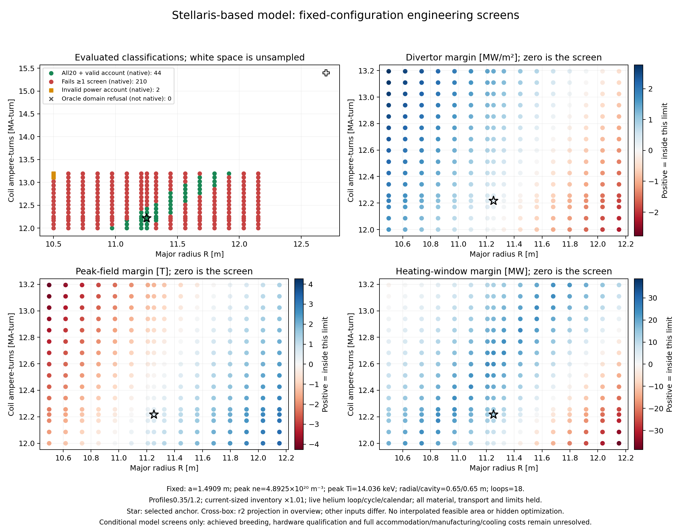

# Pre-reveal feasible neighborhood — native results

[AGENT] 103 of 334 selected native cases pass all 20 authored screens with a valid power account. The sampled-neighborhood check is True; 43 of 45 declared neighbors pass. These are deliberately selected cases, not a probability of feasibility.

## Anchor and assumptions

R=11.251748 m; a=1.4908855 m; coil current=12.217184 MA-turn; peak electron density=4.8924678e+20 m⁻³; peak ion temperature=14.035596 keV. Radial exterior/transverse clear cavity=0.65/0.65 m; 18 representative helium loops; purchased inventory multiplier 1.01. Exact profiles 0.35/1.2 and live plasma/thermal/calendar; all other parameters are held in preparation/resolved-defaults.json. Full precision is in preparation/refinement-selection.json.

| Screen | Anchor signed margin | Minimum among passing tested neighbors |
|---|---:|---:|
|peak_field_ok|0.51378633|0.026062055|
|divertor_heat_ok|0.29166879|0.031533402|
|sustainment_ok|12.894671|3.3584504|
|burn_hold_ok|37.105329|28.140226|
|wp_fit_ok|0.12503172|0.11214886|
|loop_capacity_ok|68.502763|58.342763|
|wall_load_ok|0.33784616|0.17416407|
|reference_conductor_current_ok|0.0079207921|0.0079207921|

Margins are native predicate operand differences: field T, divertor/wall MW/m², heating MW, fit m, flow kg/s and current operating-fraction margin dimensionless. Current margin is measured against the unchanged0.8 allowance, not a material qualification. The fixed coupling-efficiency upper predicate remains exactly at equality; no tolerance was changed.

## Neighborhood and map

The map contains 256 locations with counts {'pass': 44, 'fail': 210, 'invalid-account': 2, 'oracle-refused': 0}. Every native plotted coordinate is joined to its retained candidate and full inputs in map-data.csv and preparation/proposals.json. Other parameters are fixed. The r2 marker is a projection, not an evaluation at this slice. White space and interpolated regions have no feasibility claim.

The complete two-sided tests, including failed larger perturbations, are in results/neighborhood-summary.json. Combined perturbations change all seven continuous levers by ±0.5% and loop count by ±1. This supports a sampled neighborhood only, not every point in a rectangular box or a global boundary.

## Verification and finite search

Screening: 837 calls at 835 unique coordinates; 121 refusal calls retained. Native selected cases:334, plus one manifest baseline. Exact r2 forward and Table5 controls match their frozen242 scalar outputs and 20 verdicts. All 75484 mapped scalar comparisons satisfy the retained relative/absolute 1e-9 criterion; 6 strict-relative near-zero differences remain explicit. 6680 oracle predicate comparisons include3 retained exact-current exceptions; all6680 native-operand reconstructions agree. Sixteen native scalar channels are unmapped; see oracle-all-points.json for exact identities and signs.

## Economics and qualification

Anchor conditional LCOE is $150.4295/MWh at 1010.112 MW net. The 18-loop choice implies 36 representative circulators and 18 IHXs with total duty 3013.915 MW (167.440 MW per loop). These are required quantities, not qualified hardware or installed quotes. Larger transverse accommodation has no modeled cost penalty; complete winding manufacture, assembly, support/space changes and added cooling equipment remain unpriced. Held mixed-year prices and finance make this conditional LCOE, not a complete plant price or an optimum.

Achieved TBR is held 1.074 while required TBR is 1.190: the authored floor passes without demonstrating self-sufficiency. Fixed shape/topology, source transport/profile transfer, exact conductor construction and local field angles, stress/strain proxies, divertor radiation deposition, water-to-helium correspondence and whole-plant reliability remain unresolved. The anchor peak field exceeds the approximately 24 T measurement extent. Numeric agreement cannot establish these engineering premises.

## Meaning before reveal

[AGENT] The current exact-profile model can be tested beyond the earlier fixed-operation negative search; the retained data show the specific outcome above. Proceeding to the already-prepared conditional ARIES comparison remains useful, with r2 unchanged and its own failures preserved. This study cannot improve the frozen comparison retrospectively, and expected ARIES performance played no role. Reveal and formal goal closure remain owner-held.

## Matched mechanisms

Each row restores only the named input to its r2 reference value while holding the anchor choices fixed. These interventions explain the tradeoff without claiming an optimized equilibrium.

| Restored input | Auxiliary MW | Divertor MW/m² | Failed screens |
|---|---:|---:|---|
|restore-plasma__R|109.8947|13.3422|divertor_heat_ok, sustainment_ok, wall_load_ok|
|restore-plasma__a|108.5255|9.9832|sustainment_ok|
|restore-magnet__coil__I_coil|-10.9044|6.8228|burn_hold_ok, peak_field_ok|
|restore-plasma__n_e0|33.5085|10.1511|divertor_heat_ok|
|restore-plasma__T_i0|22.2496|10.2741|divertor_heat_ok, wall_load_ok|
|restore-both-peaks|17.1053|10.7347|divertor_heat_ok, wall_load_ok|
