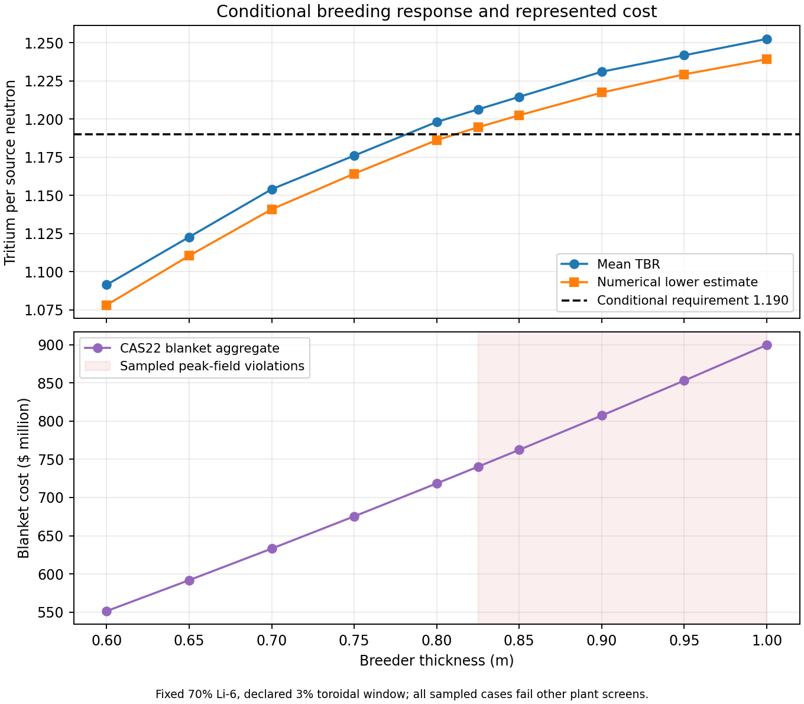

# Computed breeding thickness study

Executor synthesis, 2026-09-18. This is a conditional conceptual-design sensitivity, with all native outcomes retained. It is not an independent study reading or an actual-plant self-sufficiency claim.

The 0.80 m reference build has mean TBR 1.198074, but its numerical lower estimate is 1.186146 against the conditional requirement 1.190000. The mean alone would hide the failed numerical screen. The sampled 0.825 m case clears that screen and newly fails the peak-field screen. Every case also retains failed divertor heat, reference conductor current and winding-pack fit screens. No whole-plant feasible case was found in this fixed-default study.

| Thickness m | Mean TBR | Numerical lower | TBR screen | Peak-field screen | Blanket cost $M | LCOE $/MWh |
|---|---|---|---|---|---|---|
| 0.6 | 1.091447 | 1.078198 | violated | satisfied | 551.362 | 134.126 |
| 0.65 | 1.122735 | 1.110481 | violated | satisfied | 591.792 | 136.722 |
| 0.7 | 1.154022 | 1.140898 | violated | satisfied | 633.111 | 139.358 |
| 0.75 | 1.176048 | 1.164212 | violated | satisfied | 675.318 | 142.033 |
| 0.8 | 1.198074 | 1.186146 | violated | satisfied | 718.414 | 144.747 |
| 0.825 | 1.206295 | 1.194584 | satisfied | violated | 740.295 | 146.119 |
| 0.85 | 1.214516 | 1.202447 | satisfied | violated | 762.399 | 147.501 |
| 0.9 | 1.230959 | 1.217298 | satisfied | violated | 807.272 | 150.295 |
| 0.95 | 1.241704 | 1.229241 | satisfied | violated | 853.034 | 153.127 |
| 1 | 1.252449 | 1.239155 | satisfied | violated | 899.684 | 156.000 |

These are generated-package interpolation results, not new transport histories. The lower estimate subtracts the fixed 0.01 interpolation allowance and twice the propagated Monte Carlo standard error. Independent withheld transport points tested the interpolation upstream. Those numerical checks do not bound alloy, source-profile, nuclear-data, actual openings or shaped-geometry uncertainty. The exact crossing between sampled values was not searched and no continuous feasible boundary or optimum is claimed.

[Exportable PDF](results/response-and-cost.pdf).

## Consequences elsewhere in the plant

At supported endpoints 0.60 and 1.00 m, native coil-bore radius rises from 2.8 to 3.2 m, blanket cost from $551.362M to $899.684M, total capital from $8.364B to $9.471B and LCOE from $134.126 to $156.000/MWh. Thermal power remains 3301.213 MW and availability 0.902778 because their relevant assumptions are held. Net power decreases slightly from 1012.6337 to 1012.5828 MW. These outcomes come from the existing plant graph; increasing computed TBR does not supply extra energy. The neutron-energy multiplier remains the held input 1.2.

Moving from 0.80 to 0.90 m increases blanket cost from $718.414M to $807.272M and LCOE from $144.747 to $150.295/MWh. At the 0.90 m point breeding passes conditionally and peak field fails. Improving one screen therefore incurs a represented magnet/build tradeoff rather than recovering a previously passing whole plant.

## Undefined-domain diagnostics

The 0.55 m and 1.05 m thickness cases and the R=12.71 m case retain undefined breeding and a failed TBR predicate. Their raw zero carriers remain in native-cases.json, while interpreted-cases.json and points.csv display breeding-derived quantities as null. They retain defined account requirements and independent loss streams, plus unrelated plant costs/power/verdicts. None is evidence of a physical TBR deficit or an extrapolated response.

## Volume and cost accounting

At 0.80 m, the native blanket cost volume is 1013.406045 m³. It aggregates full-shell first wall (35.723033 m³), gross breeder (742.036337 m³) and reflector (235.646675 m³). The transport scenario removes 22.261090 m³ of breeder in its 10.8-degree window, leaving 719.775247 m³. It also removes the same angular fraction of reflector and high-temperature shield, while retaining the first wall.

The source formula is C=2π²Rκ and each shell has volume C(r_outer²−r_inner²), with R=12.7 m and κ=1. The inner radii are 1.40 m for the first wall, 1.45 m for the breeder and 1.45+t for the reflector; thicknesses are 0.05 m, t and 0.20 m. The copied model source and complete per-case reconstruction are retained in preparation/source-copies/ and results/volume-accounting.json. The CAS22 aggregate is not a pure breeder volume. Full-shell charging, generic unit costs and an opening with no installed port cost form a declared cost convention; they do not establish identical material inventories or qualified installed costs.

## Verification and custody

All 13 native cases completed. Independent software arithmetic agreed for all 3,185 mapped scalar comparisons and all 260 predicate comparisons. The generic verifier also passed with no exceptions; its worst relative scalar deviation was 1.512e-15. All 261 numeric native outputs are retained at every case; 16 are outside the 245-channel oracle map. The oracle and implementation share transport response data, so their agreement is not independent physical validation. Physical table review, transport validation and benchmark limitations are copied into this record.

Evidence: results/points.csv; results/native-cases.json; results/oracle-all-points.json; results/verification_summary.json; results/volume-accounting.json; preparation/transport-evidence/; reviews/table-release-review.md. The 13 prepared points and all failed screens remain unchanged. No model, limit, allowance, operating input or studied window was tuned after results.
