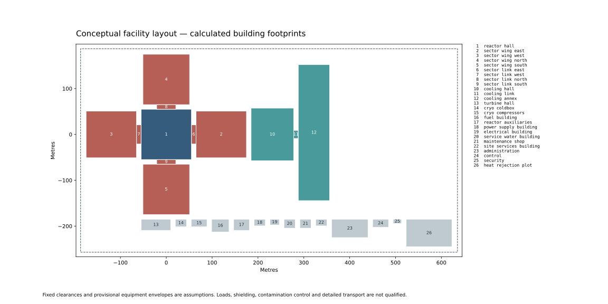

# Facilities derived from equipment and maintenance demand

[AGENT executor reading] The model now sizes 25 buildings, sector wings and transfer links from its declared layout, equipment envelopes and dated maintenance stocks. Costs below cover the modeled civil and ventilation scope; they are not a complete installed-facility quote. All numbers below are read from [native case exports](results/interpreted-cases.json); proposal IDs join to [inputs and scenario purposes](preparation/proposals.json).

## Matched accounting cases

`default14` is the current plant input point with 14 cooling circuits. `selected18` is a retained comparison point with 18 circuits and several different plasma/magnet inputs. CAS21 is the structures/buildings cost account. LCOE means levelized cost of electricity, reported in model dollars per megawatt-hour.

| Context | Legacy CAS21 $M | Layout CAS21 $M | Legacy plant capital $M | Layout plant capital $M | Δ plant capital $M | Legacy LCOE $/MWh | Layout LCOE $/MWh |
|---|---|---|---|---|---|---|---|
| default14 | 652.635 | 799.759 | 17,860.732 | 18,059.442 | 198.710 | 270.824 | 273.455 |
| selected18 | 619.666 | 814.705 | 20,903.392 | 21,170.938 | 267.545 | 310.633 | 314.182 |

Matched controls passed: default14: 380 entering comparisons, 662 exactly unchanged physical/layout channels and all 25 predicates identical; selected18: 380 entering comparisons, 662 exactly unchanged physical/layout channels and all 25 predicates identical. See [matched-control-checks.json](results/matched-control-checks.json). Only the facility cost selector differs within each pair. The new-minus-old delta replaces the former grouped building estimate with the scoped civil/ventilation calculation and changed land requirement, including the existing downstream capital-account treatment. It does not claim that every dollar is newly discovered missing scope. Calendar and physical inputs are held fixed; compare the matched cases in the retained export. Facility estimates use the stated 2025 USD purchasing-power proxy. Whole-plant totals retain the model’s inherited monetary bases.

## What determines the space

Default14 requires 100,059.551 m² of gross building footprint on a 364,839.043 m² conceptual parcel. Selected18 requires 104,152.731 m² and 364,504.981 m². The parcel includes the conventional campus, cooling buildings, controlled transfer links and outdoor heat-rejection plot. Its dimensions are a layout bound, not licensed site need.

| Civil occurrence | Sizing driver | Gross floor area m² | Enclosed air m³ | Civil cost $M |
|---|---|---|---|---|
| administration | Assumed occupants, area/person and circulation | 3,191.454 | 12,480.000 | 7.223 |
| control | Assumed occupants, area/person and circulation | 616.145 | 2,340.000 | 1.933 |
| cooling_annex | Dated stocks, two-sided racks, airlocks and service slots | 20,271.440 | 177,491.700 | 66.904 |
| cooling_hall | Circuit count, exchanger pull and machine envelopes | 10,676.400 | 94,968.720 | 24.993 |
| cooling_link | Carrier cross-corridor envelope and 10m gap | 176.000 | 1,530.000 | 0.716 |
| cryo_coldbox | Explicit provisional equipment envelope plus access/headroom | 408.360 | 4,992.000 | 3.065 |
| cryo_compressors | Explicit provisional equipment envelope plus access/headroom | 574.360 | 5,984.000 | 3.461 |
| electrical_building | Explicit provisional equipment envelope plus access/headroom | 259.560 | 2,160.000 | 1.759 |
| fuel_building | Explicit provisional equipment envelope plus access/headroom | 1,064.000 | 8,976.000 | 12.029 |
| maintenance_shop | Explicit provisional equipment envelope plus access/headroom | 482.160 | 5,016.000 | 2.962 |
| power_supply_building | Explicit provisional equipment envelope plus access/headroom | 359.160 | 3,696.000 | 2.516 |
| reactor_auxiliaries | Explicit provisional equipment envelope plus access/headroom | 851.160 | 10,608.000 | 4.835 |
| reactor_hall | Sector exterior/removal envelope and wing width | 12,058.104 | 157,858.363 | 73.274 |
| sector_link_east | Sector lane width and 10m transfer gap | 418.094 | 5,331.125 | 3.578 |
| sector_link_north | Sector lane width and 10m transfer gap | 418.094 | 5,331.125 | 3.578 |
| sector_link_south | Sector lane width and 10m transfer gap | 418.094 | 5,331.125 | 3.578 |
| sector_link_west | Sector lane width and 10m transfer gap | 418.094 | 5,331.125 | 3.578 |
| sector_wing_east | Sector bay, clean/dirty stock and accessible aisles | 11,199.034 | 138,966.726 | 94.672 |
| sector_wing_north | Sector bay, clean/dirty stock and accessible aisles | 11,199.034 | 138,966.726 | 94.672 |
| sector_wing_south | Sector bay, clean/dirty stock and accessible aisles | 11,199.034 | 138,966.726 | 94.672 |
| sector_wing_west | Sector bay, clean/dirty stock and accessible aisles | 11,199.034 | 138,966.726 | 94.672 |
| security | Assumed occupants, area/person and circulation | 172.257 | 624.000 | 0.775 |
| service_water_building | Explicit provisional equipment envelope plus access/headroom | 482.160 | 5,016.000 | 2.962 |
| site_services_building | Explicit provisional equipment envelope plus access/headroom | 359.160 | 3,024.000 | 2.164 |
| turbine_hall | Explicit provisional equipment envelope plus access/headroom | 1,589.160 | 27,648.000 | 9.806 |

Total civil cost is $614.377 million; nuclear ventilation adds $100.382 million. The retained site allowance is $85.000 million. The installed facility subtotal eligible for the facility shipping exclusion is $714.759 million; it excludes that retained site allowance. The actual contingency-loaded facility shipping exclusion is $786.235 million. Selected default14 preconstruction capital changes from $18.511 to $16.902 million with the new land requirement.

The sector wings represent hot-cell functions: controlled spaces intended for remote work on radioactive components. Remote handling means moving and servicing those components without direct human access. The reactor hall and four sector wings follow the reactor exterior envelope, withdrawal space, access corridors and maintenance stock. The cooling hall follows circuit count, exchanger pull space and machine envelopes; its annex follows dated receipt, waiting, processing and storage demand. Ten support-equipment rooms use explicit provisional envelopes; three support rooms use occupancy assumptions. Fuel construction uses the nuclear scenario. Dimensions of these conventional-support functions are not presented as calculated equipment designs.

## Response to equipment dimensions

| Case | Major radius m | Minor radius m | Circuits | Gross building area m² | Installed facility subtotal $M | LCOE $/MWh |
|---|---|---|---|---|---|---|
| default14-layout | 12.700 | 1.300 | 14 | 100,059.551 | 714.759 | 273.455 |
| R-12.065 | 12.065 | 1.300 | 14 | 97,010.209 | 689.927 | 277.661 |
| R-13.334999999999999 | 13.335 | 1.300 | 14 | 103,153.611 | 739.822 | 281.428 |
| a-1.2349999999999999 | 12.700 | 1.235 | 14 | 97,554.028 | 690.843 | 295.342 |
| a-1.3650000000000002 | 12.700 | 1.365 | 14 | 100,123.871 | 717.971 | 257.314 |
| circuits-12 | 12.700 | 1.300 | 12 | 96,358.591 | 705.135 | 266.590 |
| circuits-18 | 12.700 | 1.300 | 18 | 107,461.471 | 734.006 | 295.449 |
| circuits-22 | 12.700 | 1.300 | 22 | 114,863.391 | 753.254 | 321.962 |

These equipment-response cases vary one declared input from default14. They rerun the existing plant physics and maintenance calendar, rather than holding computed duties or component demand artificially fixed. They are distinct from the selected18 retained-context comparison, where several plant inputs differ together.

## Maintenance capacity and conflicts

The default case requires 36 packages per sector, 18 waiting positions and 36 finished-waste positions per wing. The assumed intervention takes 180.000 days against 213.062 offered. Initial readiness has 16.000 days of margin; recurring batch readiness has 54.000. These margins include completion of initial cooling carrier returns before commissioning.

20 of 48 cases fail at least one facility screen. The table retains all such cases; negative values indicate the particular schedule, capacity or route conflict.

| Case | Initial days | Recurring days | Outage days | Stock/resource count | Route/site metres | Failed facility screens |
|---|---|---|---|---|---|---|
| circuits-22 | 8.000 | 54.000 | 33.062 | 0.000 | -23.495 | facility_routes_ok |
| selected18-fixed-space | 12.000 | 55.000 | 35.062 | -8.000 | 0.000 | facility_capacity_ok |
| teams-1 | -25.000 | 54.000 | -64.938 | 0.000 | 0.000 | facility_outage_ok, facility_initial_ready |
| tasks-0.75 | 7.000 | 54.000 | -2.938 | 0.000 | 0.000 | facility_outage_ok |
| sector-hold6-mode0 | 16.000 | 54.000 | 33.062 | -36.000 | 0.000 | facility_capacity_ok |
| cooling-hold16-mode0 | 16.000 | 54.000 | 33.062 | -28.000 | 0.000 | facility_capacity_ok |
| long-process-mode0 | 16.000 | 54.000 | 33.062 | -22.000 | 0.000 | facility_capacity_ok |
| cooling-hold16-mode1 | 16.000 | 54.000 | 33.062 | 0.000 | -19.600 | facility_routes_ok |
| late-component_receipt_lead_days | 16.000 | -6.000 | 33.062 | 0.000 | 0.000 | facility_replacement_ready |
| late-initial_receipt_lead_days | -136.000 | 54.000 | 33.062 | 0.000 | 0.000 | facility_initial_ready |
| late-cooling_receipt_lead_days | 16.000 | -13.000 | 33.062 | 0.000 | 0.000 | facility_replacement_ready |
| late-cooling_initial_receipt_lead_days | -50.500 | 54.000 | 33.062 | 0.000 | 0.000 | facility_initial_ready |
| three-machine-stations | 16.000 | 54.000 | 33.062 | -1.000 | 0.000 | facility_capacity_ok |
| narrow-cooling_aisle_width | 16.000 | 54.000 | 33.062 | 0.000 | -0.200 | facility_routes_ok |
| narrow-cooling_cross_width | 16.000 | 54.000 | 33.062 | 0.000 | -0.600 | facility_routes_ok |
| lower-packing-mode0 | -8.000 | 22.000 | -30.938 | -32.000 | 0.000 | facility_capacity_ok, facility_outage_ok, facility_initial_ready |
| lower-packing-mode1 | -8.000 | 22.000 | -30.938 | 0.000 | 0.000 | facility_outage_ok, facility_initial_ready |
| wide_helium | 16.000 | 54.000 | 33.062 | 0.000 | -4.000 | facility_routes_ok |
| long_salt | 16.000 | 54.000 | 33.062 | 0.000 | -15.495 | facility_routes_ok |
| slow_initial_delivery | -40.000 | 54.000 | 33.062 | 0.000 | 0.000 | facility_initial_ready |

Resized storage adds space when stock grows; it does not create more crew time, move a nominal delivery deadline or make an oversized package fit a 6 m door. The fixed/resized hold and processing pairs preserve that distinction. Zero recurring replacement cases still include initial demand. The changed fluence-limit case is a zero-event branch diagnostic; the reference maintenance requirement remains unchanged. A positive horizon-length outage margin in a zero-event case is a satisfied sentinel, not extra outage time or demonstrated intervention capacity. The model does not silently change availability to repair a facility conflict. Detailed inventories and serialized carrier/service reservations are retained in the per-case facility ledgers.

Slower 0.75-day removal/install tasks reduce the dirty waiting peak to 9 positions and gross area to 95,172.700 m². LCOE falls to 272.668069, but the outage margin is -2.9375 days: the lower cost belongs to a failed schedule. Six-year sector storage requires 72 finished positions per wing versus 36 initially; resizing expands gross area to 122,050.381 m² and LCOE to 276.974299.

Some route/site failures are actual building overlaps under the fixed campus placement. Increasing cooling capacity or package size can make the annex intrude into that campus even after its internal storage is resized. The native-linked diagnostic ledgers identify these conflicts:

| Case | First structure | Second structure | Intrusion m |
|---|---|---|---|
| circuits-22 | cooling_annex | site_services_building | 9.791 |
| circuits-22 | cooling_annex | administration | 23.495 |
| cooling-hold16-mode1 | cooling_annex | maintenance_shop | 19.600 |
| cooling-hold16-mode1 | cooling_annex | site_services_building | 14.600 |
| long_salt | cooling_annex | maintenance_shop | 15.495 |
| long_salt | cooling_annex | site_services_building | 14.600 |

Fixed versus resized storage/resource scenarios:

| Case | Capacity margin count | Outage margin days | Gross building area m² | Installed facility subtotal $M | LCOE $/MWh |
|---|---|---|---|---|---|
| sector-hold6-mode0 | -36.000 | 33.062 | 100,059.551 | 714.759 | 273.455 |
| cooling-hold16-mode0 | -28.000 | 33.062 | 100,059.551 | 714.759 | 273.455 |
| long-process-mode0 | -22.000 | 33.062 | 100,059.551 | 714.759 | 273.455 |
| sector-hold6-mode1 | 0.000 | 33.062 | 122,050.381 | 901.083 | 276.974 |
| cooling-hold16-mode1 | 0.000 | 33.062 | 107,709.151 | 738.209 | 273.897 |
| long-process-mode1 | 0.000 | 33.062 | 100,947.451 | 717.481 | 273.506 |
| lower-packing-mode0 | -32.000 | -30.938 | 100,059.551 | 714.759 | 273.455 |
| lower-packing-mode1 | 0.000 | -30.938 | 129,380.657 | 962.868 | 278.141 |

Each mode 0/mode 1 pair holds the same maintenance demand and timing assumptions. Mode 0 retains configured offered positions; mode 1 allocates the calculated required stock. Failure of a non-storage requirement remains visible after resizing.

## Construction and source uncertainty

The following are engineering sensitivity cases. Neither a lower assumed price nor passing predicates establish source applicability, qualified construction or an optimum.

| Case | Gross building area m² | Civil cost $M | Layout CAS21 $M | Plant capital $M | LCOE $/MWh |
|---|---|---|---|---|---|
| default14-layout | 100,059.551 | 614.377 | 799.759 | 18,059.442 | 273.455 |
| provisional_envelope_scale-0.8 | 98,164.111 | 601.141 | 786.008 | 18,039.785 | 273.194 |
| provisional_envelope_scale-1.2 | 102,285.231 | 629.883 | 815.976 | 18,082.614 | 273.761 |
| nuclear_wall-1 | 95,244.888 | 515.283 | 698.192 | 17,914.651 | 271.538 |
| nuclear_wall-3 | 105,082.214 | 719.498 | 907.369 | 18,212.847 | 275.486 |
| conventional_wall-0.2 | 99,699.292 | 609.239 | 794.621 | 18,052.117 | 273.358 |
| conventional_wall-0.5 | 100,784.988 | 624.725 | 810.107 | 18,074.196 | 273.650 |
| civil_rate_multiplier-0.5 | 100,059.551 | 307.188 | 492.570 | 17,621.627 | 267.658 |
| civil_rate_multiplier-2.0 | 100,059.551 | 1,228.754 | 1,414.136 | 18,935.073 | 285.047 |
| rebar-100-75 | 100,059.551 | 541.543 | 726.925 | 17,955.637 | 272.080 |
| rebar-200-150 | 100,059.551 | 692.136 | 877.518 | 18,170.267 | 274.922 |
| metric-tonne | 100,059.551 | 593.639 | 779.021 | 18,029.887 | 273.063 |

The source concrete, reinforcement and formwork rows are installed-direct civil commodities, converted from their 2018 USD basis. The separate ventilation formula is a conditional historical transfer. Rebar density and wall thickness are construction assumptions, not a structural or dose calculation. The US-short-ton/metric-tonne comparison changes the source rate conversion, not the physical steel mass. The owner authorized the half/base/double rate and tonne cases as sensitivity only; their absence of constraint response remains a recorded gap.

## Limits and next evidence

0/48 cases satisfy every modeled plant predicate. These are modeled screening results. No optimum, licensed design or qualified whole-plant operating point is claimed. The full 25-predicate table is in [record.md](record.md), including all non-facility failures.

Civil commodities do not independently price doors, cranes, carrier/rail hardware, full remote handling, or every ordinary building service. The retained handling/radwaste allowances do not prove those omissions covered. Sector loads, shielding, contamination procedures, detailed removal paths and cooling field outages remain unqualified. The zero qualification disclosures are intentional. Filling the remaining scope requires actual upstream equipment dimensions, maintenance procedure/resource evidence, structural/radiological design and scope-specific procurement estimates. No fresh R9.S grade is asserted by this executor report.
