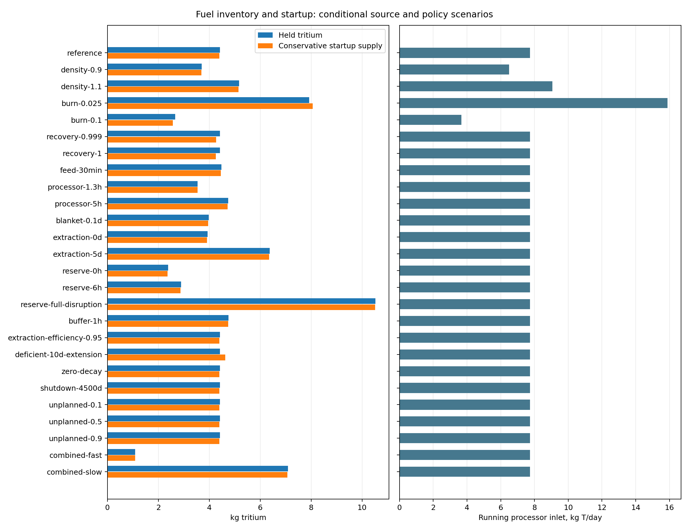

# Tritium held, startup supply and processing demand

The reference model holds **4.418 kg of tritium**, including **2.038 kg of interruption reserve**. Its conservative initial external supply is **4.400 kg** for the declared 2-day startup horizon. Running exhaust processing receives **7.743 kg T/day**, or **12.912 kg D+T/day**. These are represented-boundary calculations under explicit assumptions, not evidence that tritium can be procured or that a plant can sustain itself. All values below come from [native points](results/points.csv); [all native channels](results/all-native-channels.csv) retain the complete executable output.

## What is being counted

Inventory is tritium present in equipment or storage. Throughput is material passing through per unit time. The source burn fraction sets how much tritium circulates for each atom burned; the recovery fraction applies to unburned exhaust. The processor inventory is counted before recovery loss. Breeding-zone and extraction inventories use gross production; extraction efficiency acts once at the final outlet.

| Represented stock | Reference kg T | Basis |
|---|---:|---|
| Injection equipment | 0.113197 | Injection flow × feed residence |
| Plasma | 0.000308177 | Integrated tritium particle density |
| Combined exhaust processor | 1.29045 | Unburned exhaust × processing residence |
| Breeding zone | 0.488227 | Gross bred flow × blanket release time |
| Extraction equipment | 0.488227 | Gross bred flow × extraction residence |
| Usable working buffer | 0 | Injection flow × buffer duration |
| Interruption reserve | 2.03755 | Injection flow × disrupted fraction × reserve duration |

The first six entries total 2.38041 kg working inventory. The separately declared reserve produces the 4.41795 kg represented total. Unmodeled wall retention, coolant permeation, detritiation, impurity/carrier streams and bypass mean this is not a qualified total-plant inventory.

## What startup means

Feed equipment, plasma and working buffer are prefilled; reserve is kept separately. The exhaust processor and breeding/extraction stages start empty. Full-power operation begins immediately. Recycled fuel arrives after the combined processing delay, and bred fuel after the sum of breeding-zone and extraction delays. This is a deterministic-delay approximation, not an ignition or ramp simulation.

Reference prefill is 0.113505 kg, the maximum subsequent storage draw is 2.24742 kg, and reserve is 2.03755 kg. Together they give 4.39847 kg no-decay minimum initial supply. A conservative 0.00165634 kg decay allowance raises this to 4.40012 kg. Working inventory is not added again: processor fill is already in the storage draw, and blanket inventory is produced internally.

The decay allowance assumes replacement fuel can reach the affected stock within the abstract supply boundary. It is not a demonstrated transport or availability guarantee. A finite commissioning supply does not remedy a continuing operating deficit.

## Source scenarios and operating choices

| Input family | Candidate values | Authority and limitation |
|---|---|---|
| Feed residence | 20/30 min | Abdou Table2 technology scenarios |
| Combined cleanup/separation | 1.3/4/5 h | Abdou Table2; no invented split between stages |
| Breeding-zone release | 0.1/1 day | Abdou Table3 scenarios; no helium/PbLi qualification |
| Extraction delay | 0/1/5 days | Table3; zero is an ideal online diagnostic |
| Reserve and buffer | 0/6/24 h reserve; disrupted fraction0.25/1; buffer0/1 h | Explicit policies, not established reliability requirements |
| Burn/recovery/extraction | burn0.025/0.05/0.10; recovery0.99/0.999/1; extraction0.95/1 | Conditional performance sensitivities; inherited reference factors unchanged |
| Other diagnostics | density±10%; zero decay;4500-day passive shutdown; live unplanned fraction0.1/0.5/0.9 | Causal model inputs and explicit mathematical/operating scenarios |

Source facts and source-transfer limits are retained in [research](preparation/references/research.md), [released design](preparation/references/design.md) and the original-source witness copies. Fast and slow combinations are engineered scenarios. They are not confidence intervals, physical bounds or optimization results.

## Response across the finite list

| Case | Held kg T | Startup kg T, conservative | Processor kg T/day | Annual shortfall kg T | LCOE $/MWh |
|---|---:|---:|---:|---:|---:|
| reference | 4.4180 | 4.4001 | 7.7427 | 0 | 273.455 |
| density-0.9 | 3.7056 | 3.6907 | 6.4943 | 0 | 314.521 |
| density-1.1 | 5.1717 | 5.1509 | 9.0638 | 0 | 252.428 |
| burn-0.025 | 7.9271 | 8.0598 | 15.8929 | 26.218 | 273.471 |
| burn-0.1 | 2.6634 | 2.5703 | 3.6676 | 0 | 273.446 |
| recovery-0.999 | 4.4180 | 4.2723 | 7.7427 | 0 | 273.455 |
| recovery-1 | 4.4180 | 4.2581 | 7.7427 | 0 | 273.455 |
| feed-30min | 4.4746 | 4.4567 | 7.7427 | 0 | 273.455 |
| processor-1.3h | 3.5469 | 3.5375 | 7.7427 | 0 | 273.455 |
| processor-5h | 4.7406 | 4.7196 | 7.7427 | 0 | 273.455 |
| blanket-0.1d | 3.9785 | 3.9628 | 7.7427 | 0 | 273.455 |
| extraction-0d | 3.9297 | 3.9142 | 7.7427 | 0 | 273.455 |
| extraction-5d | 6.3709 | 6.3468 | 7.7427 | 0 | 273.455 |
| reserve-0h | 2.3804 | 2.3619 | 7.7427 | 0 | 273.455 |
| reserve-6h | 2.8898 | 2.8715 | 7.7427 | 0 | 273.455 |
| reserve-full-disruption | 10.5306 | 10.5147 | 7.7427 | 0 | 273.455 |
| buffer-1h | 4.7575 | 4.7398 | 7.7427 | 0 | 273.455 |
| extraction-efficiency-0.95 | 4.4180 | 4.4001 | 7.7427 | 7.2081 | 273.455 |
| deficient-10d-extension | 4.4180 | 4.6291 | 7.7427 | 7.2081 | 273.455 |
| zero-decay | 4.4180 | 4.3985 | 7.7427 | 0 | 273.455 |
| shutdown-4500d | 4.4180 | 4.4001 | 7.7427 | 0 | 273.455 |
| unplanned-0.1 | 4.4180 | 4.4001 | 7.7427 | 0 | 302.370 |
| unplanned-0.5 | 4.4180 | 4.4001 | 7.7427 | 0 | 506.582 |
| unplanned-0.9 | 4.4180 | 4.4001 | 7.7427 | 0.12829 | 2293.592 |
| combined-fast | 1.0911 | 1.0866 | 7.7427 | 0 | 273.455 |
| combined-slow | 7.0897 | 7.0630 | 7.7427 | 0 | 273.455 |

The combined fast and slow cases hold 1.091 and 7.090 kg T and require 1.087 and 7.063 kg conservative startup supply. Their throughput is unchanged from reference because residence and reserve policies do not change burn or circulating flow. The full selected list spans 1.091–10.531 kg held and 1.087–10.515 kg conservative startup supply.

The extraction-efficiency0.95 case has signed running makeup 2.52334e-07 kg/s. Extending the startup horizon by ten days increases conservative initial supply from 4.400 to 4.629 kg while its operating inventory and processor capacity remain unchanged. This separates a longer initial supply horizon from the continuing deficit.

Lower burn fraction increases injection, exhaust processing and reserve needs at fixed fusion power. Faster recycling lowers processor stock and startup draw. Recovery changes permanent losses and return supply; its assumed technology has no new equipment price in this model. Calendar availability changes annual operating flows while installed running capacity remains set by the full-power point. Maintained-stock decay continues through calendar downtime; passive shutdown decay is a separate diagnostic.

## Verification and limits

All 26 native cases are retained. 0 satisfy every whole-plant screen; this study claims no feasible plant or boundary. The reference fails: divertor_heat_ok;reference_conductor_current_ok;tbr_ok;wp_fit_ok. [Constraint details](results/native-cases.json) retain every qualified predicate identity and outcome. LCOE is reported for context; new inventory and throughput outputs do not price a fuel-processing plant.

The independent oracle checks every mapped scalar and independently derives every authored predicate at every point. Separate upstream tests verify hand cases, integrated startup trajectories, plasma-profile integration and decay bounds. Shared source assumptions and neutron-transport data are not independent physical validation. Twenty-two exported numeric channels are outside the oracle map and remain native evidence only. Final independent study and rubric review are coordinator-owned and pending at this executor snapshot.

The calculations provide a useful conditional estimate and expose its main drivers. They do not establish reactor-specific residence performance, trapping/release behavior, purchased tritium availability, equipment reliability, full fuel-cycle self-sufficiency or complete process costs. A future process design must connect residence, recovery, buffer and reserve choices to actual equipment and operating constraints.

The 906 mapped scalar channels comprise 892 numeric channels and14 Boolean cooling flags. The 22 unmapped numeric channels are listed explicitly in [coverage exceptions](results/unmapped-native-channels.json); every new inventory output is mapped.
