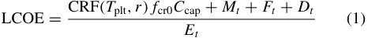
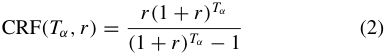
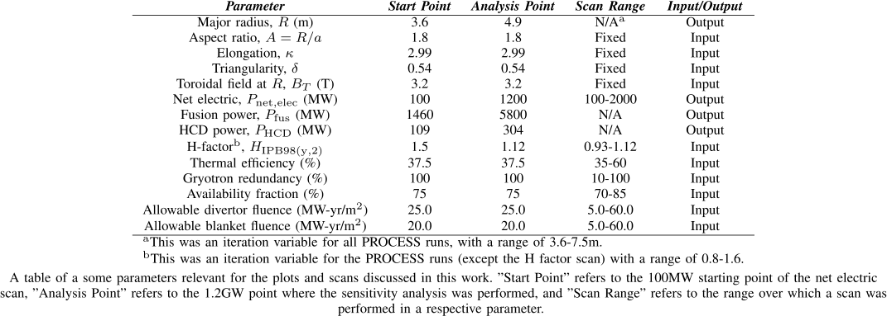
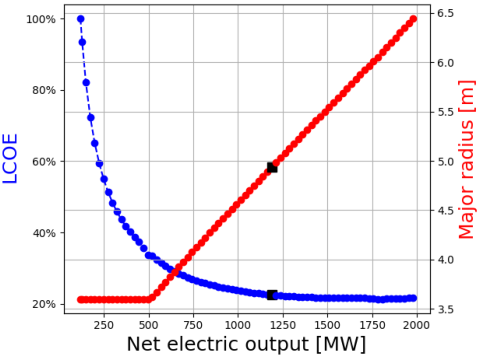
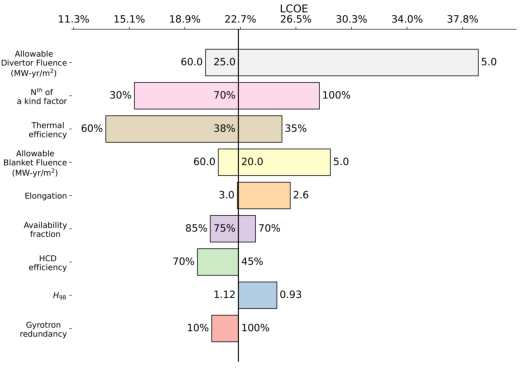
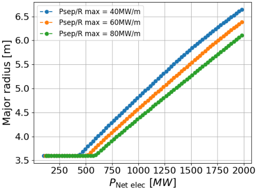

## Extrapolating Costs to Commercial Fusion Power Plants 

Jack Foster , Hanni Lux , _Member, IEEE_ , Samuel Knight , Dan Wolff , _Member, IEEE_ , and Stuart I. Muldrew 

_**Abstract**_ **— For mega-projects like fusion power plants, modularity is a key enabler to cost and schedule efficiency. One way of achieving more modularity is aiming for higher numbers of smaller fusion reactors. Previous work has demonstrated that the levelized cost of electricity (LCOE) of commercial magnetic confinement fusion power plants falls at a decreasing rate with increasing net electric power. Furthermore, net electric power increases more rapidly than size/cost. This is because as fusion power increases the proportion of energy being exported as net electric power plateaus but the size of the plant required increases linearly. Increases in plant size increase upfront capital costs and project complexity. Therefore, there is an optimal design point beyond which any increases in net electric power continue to increase the project cost and complexity but deliver only marginal gains in LCOE. This helps identify a sweet spot between anticipated, better economy of size (cost per unit being smaller at larger unit sizes), and economy of scale (cost per unit being smaller at a higher scale of production).** 

_**Index Terms**_ **— Commercialization, costs, fusion power generation, fusion reactors, spherical tokamaks (STs).** 

## I. INTRODUCTION 

ANY different prototypes or demonstrator fusion power **M** plant concepts are in their conceptual or even engineering design phases [1], [2], [3], [4], [5], [6], [7], [8], [9]. Estimates of costs of prototype/demonstrator fusion power plants and their potential commercial successors have been attempted to understand the potential commercial viability of specific concepts to support investment decisions into specific designs [10], [11], [12], [13]. 

However, estimating the costs of prototype or demonstration fusion power plants is difficult due to the often still preliminary designs. This difficulty is compounded by nonexisting supply chains for many bespoke technologies or materials. Extrapolating to commercial fusion power plants without a clear design is even harder and uncertainties are large. As a result, forecasts of the commercial viability of fusion are often built on many assumptions that cannot be validated or refuted until the next set of prototype plants has been built. However, it is crucial to understand which factors impact the costs of commercial power plants to address the right validations either on prototypes or separate rigs/facilities on the path to 

Manuscript received 2 October 2023; revised 19 December 2023 and 12 January 2024; accepted 16 January 2024. Date of publication 27 February 2024; date of current version 9 December 2024. This work was supported by the Spherical Tokamak for Energy Production (STEP). The review of this article was arranged by Senior Editor S. J. Gitomer. _(Corresponding author: Jack Foster.)_ 

The authors are with the United Kingdom Atomic Energy Authority, Culham Campus, OX14 3DB Abingdon, U.K. (e-mail: jack.foster@ukaea.uk). Color versions of one or more figures in this article are available at https://doi.org/10.1109/TPS.2024.3362428. Digital Object Identifier 10.1109/TPS.2024.3362428 

commercialization. Relative costs can be used to determine expected cost drivers for commercial power plants and help determine decisions that affect the balance between operational and capital costs. 

The Spherical Tokamak for Energy Production (STEP) Programme is consciously designed to test the smallest scale of prototype fusion power plants by targeting at least 100 MW of net electric output [14]. This assures the prototype is at the lowest capital costs to demonstrate electricity production and fuel self-sufficiency, but is not expected to produce electricity at commercially competitive costs. While we expect commercial power plants to have higher net electric output to have commercially viable costs, this work explores the tradeoffs between net electric output, size, and levelized cost of electricity (LCOE) while considering the smallest potentially viable commercial-scale plants. 

LCOE is defined as the cost of electricity required for the power plant to break even. In this article, we use LCOE as a metric for assessing factors that drive costs down. While we acknowledge that LCOE has limitations as a metric, since we are comparing the technology considered against itself within the context of cost drivers and sensitivities, it provides reasonable insights into potential roads to the commercial viability of a fusion power plant. 

In Section II, we describe the methodology used in this work. In Section III, we analyze our results, and in Section IV, we draw some conclusions and assess potential next steps. 

A similar study looked at the impact of cost drivers on LCOE and overnight capital cost of different types of small modular nuclear reactors (SMRs) [15]. This study goes into detail on economies of size versus economies of scale, as well as modularization, the impacts of which are significant. It is likely that there would be similar impacts for fusion power plants but this goes beyond the scope of this work. 

## II. METHODOLOGY 

## _A. PROCESS_ 

PROCESS [16], [17], [18], [19] is a systems code for assessing the engineering and economic viability of potential fusion power plant designs using simple 0-D and 1-D models of the reactor and all plant subsystems. It uses a constrained optimization solver to find an optimal solution given a user-specified figure of merit (FoM, e.g., minimized major radius) while simultaneously adhering to user-selected engineering constraints and physical laws (e.g., a fixed net electric output). PROCESS does this by varying iteration variables within user-defined bounds to satisfy both the FoM and the constraints. The simplicity of the models within 

## 0093-3813 © 2024 Crown Copyright. 

Authorized licensed use limited to: UK ATOMIC ENERGY AUTHORITY. Downloaded on October 17,2025 at 09:09:54 UTC from IEEE Xplore.  Restrictions apply. 

PROCESS allows for rapid iterations of power plant designs while also providing an integrated overview of the plant as a whole. The results can then be used to inform more detailed and specialized design work but need to be interpreted within the limitations of the simple models, that do not capture high-fidelity impacts on the design. PROCESS also contains cost models for calculating the capital cost of the different systems and aspects (blankets, divertors, buildings, and so on) that make up a fusion power plant, as well as the operational costs (staff, maintenance, replacement components, and so on). We discuss cost modeling in PROCESS in Section II-B. 

## _B. Cost Modeling in PROCESS_ 

Due to their highly integrated nature, estimating costs for fusion power plants is ideally done in the same tool as the integrated plant design is created, to allow tradeoffs and evaluations of all design drivers including costs to be taken into account. Subsystems and facilities could be costed independently and then totaled to give a whole plant cost, but this would not capture any interdependencies between systems. For example, if the superconducting magnets and cryoplant were costed independently, it could be overlooked how their size affects the pumping power required for the cooling, which then has a knock-on effect on the recirculating power and net electric output of the plant. 

These oversights can be avoided by using a systems code like PROCESS where not only are the physics and engineering models fully integrated, but the cost models are too. The ability for rapid iterations mentioned above also lends itself to costing fusion power plants, allowing for continuous evaluation and reevaluation of estimates for subsystems, and the plant as a whole. The built-in ability to scan in a desired variable also facilitates extrapolating a particular design and its costs up to a commercial-scale plant, an example of which we will discuss in detail in the next section. However, due to the simplicity of the cost evaluation, especially in the extrapolation toward commercial plants, these cost models are more relevant for differential cost assessments than absolute cost assessments. 

Within PROCESS, LCOE is defined as 

where _T_ plt is the total plant life (years), _f_ cr0 is the fixed charge rate during construction, _C_ cap is the total capital cost including interest, _Mt_ is the operations and maintenance expenditure in the year _t_ , _Ft_ is the fuel expenditure in the year _t_ , _Dt_ is the decommissioning cost in the year _t_ , _Et_ is the electrical energy generated in the year _t_ , _r_ is the discount rate, and _N_ op is the total years of power plant operation. CRF is the capital recovery factor, given by 

where _Tα_ is lifetime of a given time period. Equation (1) is based on the assumptions that the project has constant annual expenditures and revenues, the construction costs are paid off in the first period of the plant operation, and the capital recovery starts immediately [20]. 

## _C. Scans_ 

To extrapolate to a commercial scale plant, we started with a plant design with a spherical tokamak (ST) reactor similar to the current conceptual design point of the STEP Prototype reactor [21]. We then performed a scan in net electric output _P_ net _,_ elec: 100 MW–2 GW, in steps of 25 MW, minimizing major radius as the FoM.[1] Some of the important parameters are listed in Table I. The major radius at the start point, and the parameters that are fixed, are consistent with the current STEP Prototype Powerplant design point [21]. The additional parameters listed have been allowed to vary as part of this study, and therefore do not correspond to any baseline design. 

Once the scan was successfully performed, a plot of which can be seen in Fig. 1, the point at 1.2 GW was selected, around which we performed some sensitivity analysis on certain parameters to explore their impact on LCOE. 

- 1) _Allowable Blanket Fluence (MW-yr./m_[2] _):_ Determines lifetime of blanket/first wall based on neutron wall load. The value of 20 MW-yr./m[2] in Table I comes from an assumed limit of 200 displacements per atom (dpa) for an advanced low activation ferritic-martensitic (LAFM) steel that would form the blanket structure. Since this work, a limit of 100 dpa is more commonly used, which corresponds to the fluence of 10 MW-yr./m[2] . This limit will be used in future work. 

- 2) _Allowable Divertor Fluence (MW-yr./m_[2] _):_ Determines lifetime of the divertor based on divertor heat load. 

   - a) Neither of these fluences is currently consistently influencing the plant availability and therefore only impacts operational costs. This is not an issue in regimes where the overall plant availability is consistent with those lifetimes, but this is unlikely over the entire scan range. 

- 3) _N_ th _-of-a-Kind (NOAK) Factor:_ Represents the cost of an item/system at its Nth generation with respect to its 1st generation (due to, e.g., improved manufacturing, mass production, and so on). This factor only applies to novel technologies and not the entire plant. 

- 4) _Thermal Efficiency:_ Efficiency converting total thermal power into gross electrical power. It was shown in [2] how critically the thermal-to-electric conversion efficiency impacts the estimated capital costs. As capital costs are expected to dominate the LCOE for commercial fusion power plants, this is expected to have a similarly significant impact on LCOE. 

- 5) _Availability Fraction:_ What percent of the time the plant is available to produce electricity. Given that achievable availability fractions on commercial fusion power plants cannot be understood without building demonstration/prototype fusion power plants, scanning this parameter helps us understand the impact of different availability factors on LCOE. 

- 6) _Heating and Current Drive (HCD) Efficiency:_ Wall-plug efficiency of HCD systems. As the HCD systems are expected to be the source of the highest recirculating 

- 1All PROCESS work done as part of this paper used PROCESS v3.0.0 

- Git hash: 536de61792fd064f13421b2e1d9209645a9a7180. 

Authorized licensed use limited to: UK ATOMIC ENERGY AUTHORITY. Downloaded on October 17,2025 at 09:09:54 UTC from IEEE Xplore.  Restrictions apply. 

TABLE I 

SUMMARY OF KEY SCAN PARAMETERS 

   - losses in a tokamak, having higher efficiency systems is being explored as an option to reduce LCOE by increasing net electric output. 

- 7) _H-Factor [IPB98(y,2)]:_ Radiation corrected H-factor [22], [23]. Varying the H-factor helps us explore the effect of uncertainty in the plasma performance in the design and potential performance gains if higher-performing plasma scenarios can be found. 

- 8) _Gyrotron Redundancy:_ Ratio of the gyrotron needed for a startup to flat-top. PROCESS sets the flat-top heating and current drive requirements in line with what is needed to achieve the relevant plasma current. This is also to allow system redundancy. Depending on the design a higher amount of HCD will be needed for startup/ramp-down or for redundancy to cover unreliable systems. Reducing the ratio between the flat-top HCD requirements and the overall gyrotron cost assumes that going toward commercialization we can create more reliable HCD sources and learn to ramp-up plasmas more efficiently. 

The point for the sensitivity study was chosen as it has an achievable net electric output with respect to the starting point 

design. There are also diminishing returns in LCOE reduction beyond this point. 

In the next section, we will discuss the results of these scans in more detail, as well as any potential implications for current and future endeavors to design fusion power plants. 

## III. RESULTS 

The scan in net electric output is plotted in Fig. 1 where the blue line is LCOE normalized with respect to the LCOE value at 100 MW net electric and the red line is the major radius. First, it demonstrates that by building a bigger device, the power plant is not only generating more electricity but is doing so in a more cost-efficient way, reducing the LCOE. However, it is the size of this reduction that is most striking, reaching as low as ∼20% of the LCOE of a 3.6-m major radius, 100-MW device. It is worth noting that the major radius only begins to increase at a net electric output of ∼500 MW, at which point the LCOE has reduced to ∼30% of that of a 3.6-m major radius, 100-MW device. Nevertheless, STEP’s target of 100 MW is to account for margins and uncertainties. Second, as mentioned previously, there are diminishing returns in LCOE reduction beyond ∼1.2 GW. This behavior is driven predominantly by the change in the proportion of recirculating power to net electric output as the machine increases in size. This can be seen in Fig. 2 where, for example, 100 MW net electric is only ∼17% of the gross electric, whereas 1.2 GW net electric is ∼42% of the gross electric. At 2 GW net electric, this output is ∼44% of the gross electric, meaning that for only 2% more efficient net-gross electric ratio, substantially more power needs to be generated in a larger device, driving up the capital cost and complexity of the plant for very little reduction in LCOE. It is worth noting that the increased complexity that would come with a larger device is not modeled here, which would increase the capital cost of the plant, and hence affect LCOE. Across the scan, the operational costs are a fraction of the capital costs, predominantly dominated by resources (e.g., component replacements) and paying the operators. The initial flatness of the red line in Fig. 1 is due to the initial 3.6 m major radius design point being able to generate more electricity in 

Authorized licensed use limited to: UK ATOMIC ENERGY AUTHORITY. Downloaded on October 17,2025 at 09:09:54 UTC from IEEE Xplore.  Restrictions apply. 

a machine of the same size. Despite minimizing the major radius, PROCESS cannot make the machine smaller as it is limited by the imposed engineering constraints on the inboard build. A similar plot is presented in [2] for a conventional aspect ratio device. 

The sensitivity analysis is presented as a tornado plot in Fig. 3. Here, the LCOE scale should be thought of as an expanded section of the LCOE axis in Figs. 1 and 2. This plot illustrates the impact of different parameters on LCOE with the black line representing the initial 1.2-GW design point (the black square in Figs. 1 and 2). We will discuss some interesting features of these results. 

- 1) _Allowable Divertor Fluence (MW-yr./m_[2] _):_ This has a large effect on LCOE, but it is worth noting that the greatest impact happens over a short range of values, 5.0–25.0, beyond which little is to be gained. A similar behavior is observed for the allowable blanket fluence although with a smaller impact. This is due to the respective component having a lower lifetime at lower allowable fluence, resulting in more frequent replacements, increasing operational expenses, and hence LCOE. 

- 2) _NOAK:_ There is a linear relationship between NOAK and LCOE because this factor is a purely multiplicative one. This factor represents the effects of economies of scale such as the establishment of suitable supply chains, and research and development programs into manufacturing, waste, and maintenance, all of which will be empowered by a fleet approach to future fusion power plants. 

- 3) _Thermal-to-Electric Conversion Efficiency:_ Here, we see another expected trend where a greater thermal-toelectric conversion efficiency results in more net electric for the same thermal power, decreasing LCOE. What is interesting here is that for just a 3% improvement in efficiency (from 35% to 38%), we get ∼3% reduction in LCOE, which, while not a large improvement, does suggest that gains can be made in reducing LCOE 

   - without having to improve thermal-to-electric efficiency all the way up to 60%. This reflects that there will always be diminishing gains from increasing thermal efficiency, but the initial efficiency improvements are still impactful. Such a high efficiency would be a result of, for example, higher temperatures from in-vessel components (IVCs) or higher coolant temperatures. Both these would require either more robust materials for the IVCs, coolant pipes, and heat exchangers, or more frequent replacement of these components, driving up cost. 

- 4) _Availability Fraction:_ We expect this to have a greater impact on LCOE than indicated in Fig. 3. This is likely due to being a simple multiplicative factor within PROCESS, as opposed to being calculated based on component lifetimes and maintenance schedules. The more comprehensive availability models in PROCESS do not capture the factors that affect availability within an ST specifically (e.g., replaceable central solenoid/column). This will be revisited in the future. 

In Fig. 4, we plot major radius against net electric output for different maximum allowable values for _P_ sep _/R_ , where _P_ sep is the power across the separatrix. These values are chosen as a result of the example for DEMO where _P_ sep _/R_ = 20 MW/m corresponds to a divertor heat load of ∼ 10 MW/m[2] [24]. The maximum of this parameter acts as a proxy for the upper limit of the allowable heat load on the divertors, effectively corresponding to the resilience of the divertors. A limitation of this metric is that it only holds if the scrape-off layer (SoL) width is approximately constant for different aspect ratios. An alternative divertor metric proposed in the literature is _P_ sep _B_ T _/q_ 95 _AR_ , where _B_ T is the toroidal field, _q_ 95 is the safety factor at 95% flux surface, _A_ is the aspect ratio, and _R_ is the major radius [24]. For this study, we are holding _B/A_ constant, limiting the parameter space for exploration, hence have kept to the _P_ sep _/R_ metric. As the scans were run with the machine in double-null mode, _P_ sep _/R_ max should be halved for the maximum allowable heat load for each divertor. Halving _P_ sep _/R_ exactly corresponds to perfect double-null 

Authorized licensed use limited to: UK ATOMIC ENERGY AUTHORITY. Downloaded on October 17,2025 at 09:09:54 UTC from IEEE Xplore.  Restrictions apply. 

control. Due to the immaturity of understanding of double null control, and the fidelity of the models used in this study, we assume that perfect double null control will be achievable when commercial-scale fusion power plants are on the grid. Systems modeling necessarily must make such assumptions to evaluate their impact before they can be validated. 

We see that the range of net electric outputs achievable in a 3.6-m device increases with _P_ sep _/R_ max. This makes sense as when designing a device, _P_ sep _/R_ can be kept below its limit either by decreasing _P_ sep, for example, by increasing the core radiation fraction, or by increasing the radius, or, more likely, a combination of the two. Therefore, once _P_ sep can no longer be reduced for a given _R_ , the machine has to increase in size to keep _P_ sep _/R_ at/below its limit. Hence, while the inboard build is the constraining factor for STs at small _R_ , eventually the divertor begins to constrain the design, as has been observed with conventional aspect ratio devices [24]. It is worth mentioning that scans were performed with the major radius allowed to vary outside the range of 3.6–7.5 m, however, solutions were not found below 3.6 m, despite using the minimized major radius FoM. This is due to the inboard build constraint mentioned above. 

## IV. CONCLUSION 

In this work, we have analyzed the extrapolation of costs of an ST fusion power plant up to a commercial scale. While this work has focused on a STEP-like power plant, many of the trends identified are generally applicable. 

It summarizes the results of a two-stage analysis: 1) a scan in net electric output to evaluate the effect on LCOE when moving to commercial-scale output and 2) a sensitivity study on a selection of parameters and their effect on LCOE for a commercial-scale plant. It is apparent that significant reductions can be made in the LCOE of fusion power plants when moving from prototype to commercial power plants. The greatest reduction is made by building higher output plants where beyond around 500 MW, this necessitates physically larger machines. However, a point is reached beyond which there are diminishing returns, as evidenced in Fig. 1. This is 

a result of the change in recirculating power when moving from low to high net electric output, as seen in Fig. 2. Further reductions can be made through various systems, with the degree of impact on LCOE being documented in Fig. 3. 

We assess from this analysis that the sweet spot for a commercial scale fusion power plant is between 500 MW and 1.2 GW net electric output. This range is consistent with the uncertainties expected in the model and can be motivated as follows: up to 500 MW, a large reduction in LCOE has been achieved, approximately 70% with respect to the initial 3.6-m major radius, 100-MW net electric output design point. Beyond 1.2 GW, there is little to be gained in LCOE reduction, with only a 2% reduction from 1.2 to 2 GW with respect to the initial 3.6-m major radius, 100-MW net electric output design point. The capital cost and complexity of the plants beyond 1.2 GW are also likely to prohibit the success of their investment and construction. The significance of this is that it suggests that there is a variety of roles fusion power plants can fulfill within the electricity production landscape, depending on the demands and available investment. However, there is an upper limit on the power generation role fusion plants can play, beyond this point, their cost-effectiveness diminishes. 

The work then discusses the constraining factors in an ST, highlighting how while the inboard build constrains the design at a small major radius, eventually the heat load on the divertor becomes the constraining factor, forcing the machine to increase in size. This is evidenced in Fig. 4, where the point at which the ST increases in size increases with the maximum allowed value of _P_ sep _/R_ , which acts as a proxy for divertor resilience. This reinforces the understanding that the inboard build is the constraining factor for STs, at a small major radius. It also demonstrates that at a certain size, the divertor becomes the constraining factor, which is more in line with conventional aspect ratio devices. 

The next steps for this work would be to look at different potential ST designs as starting points. It would also be interesting to analyze compound sensitivities of the parameters investigated in Fig. 3. Potentially, reductions in LCOE due to compound sensitivities could reduce improvements in required technologies (e.g., blankets and divertors) needed for the viability of a commercial-scale plant. Regarding the divertor constraint analysis, investigating the alternative quantity, _P_ sep _B_ T _/q_ 95 _AR_ , by varying _B_ T and/or _A_ , as a proxy for divertor resilience and comparing against the above analysis could provide more insight to the divertor constraint within STs. Repeating the above analysis with a more tailored and comprehensive availability model will give more clarity on the impact of availability on LCOE within STs. 

## ACKNOWLEDGMENT 

This work has been funded by Spherical Tokamak for Energy Production (STEP), a United Kingdom Atomic Energy Authority (UKAEA) programme to design and build a prototype fusion energy plant and a path to commercial fusion. To obtain further information on the data and models underlying this article, please contact PublicationsManager@ukaea.uk. 

Authorized licensed use limited to: UK ATOMIC ENERGY AUTHORITY. Downloaded on October 17,2025 at 09:09:54 UTC from IEEE Xplore.  Restrictions apply. 

## REFERENCES 

- [1] B. Flyvbjerg, “Make megaprojects more modular,” _Harvard Bus. Rev._ , vol. 2021, pp. 58–63, Oct. 2021. 

- [2] M. R. Wade and J. A. Leuer, “Cost drivers for a tokamak-based compact pilot plant,” _Fusion Sci. Technol._ , vol. 77, no. 2, pp. 119–143, Feb. 2021, doi: 10.1080/15361055.2020.1858670. 

- [3] J. Sheffield et al., “Cost assessment of a generic magnetic fusion reactor,” _Fusion Technol._ , vol. 9, no. 2, pp. 199–249, Mar. 1986, doi: 10.13182/fst9-2-199. 

- [4] G. Federici, “Status and prospects for fusion development in Europe,” in _Proc. Sel. Papers 30th IEEE Symp. Fusion Eng._ , 2023. 

- [5] Y. Song and J. Li, “Recent east experimental results and craft R&D progress for CFETR in China,” in _Proc. Sel. Papers from 30th IEEE Symp. Fusion Eng._ , 2023. 

- [6] Y. Sakamoto, “Strategy and progress of ja demo development,” in _Proc. Sel. Papers 30th IEEE Symp. Fusion Eng._ , 2023. 

- [7] D. Brunner, “Commonwealth fusion systems’ high-field path to fusion energy,” in _Proc. Sel. Papers 30th IEEE Symp. Fusion Eng._ , 2023. 

- [8] A. Creely, “Operational plans for the sparc tokamak,” in _Proc. Sel. Papers from 30th IEEE Symp. Fusion Eng._ , 2023. 

- [9] M. Laberge, “Magnetized target fusion at general fusion,” in _Proc. Sel. Papers from 30th IEEE Symp. Fusion Eng._ , 2023. 

- [10] S. Woodruff and R. L. Miller, “Cost sensitivity analysis for a 100MWe modular power plant and fusion neutron source,” _Fusion Eng. Design_ , vol. 90, pp. 7–16, Jan. 2015. [Online]. Available: https://www.sciencedirect.com/science/article/pii/S0920379614005997 

- [11] S. Woodruff, J. K. Baerny, N. Mattor, D. Stoulil, R. Miller, and T. Marston, “Path to market for compact modular fusion power cores,” _J. Fusion Energy_ , vol. 31, no. 4, pp. 305–316, Aug. 2012. 

- [12] S. Woodruff, R. Miller, D. Chan, S. Routh, S. Basu, and S. Rao, “Conceptual cost study for a fusion power plant based on four technologies from the DOE ARPA-E alpha program,” pp. 6–19, Jul. 2017. [Online]. Available: https://www.researchgate.net/publication/ 318215383_Conceptual_Cost_Study_for_a_Fusion_Power_Plant_ Based_on_Four_Technologies_from_the_DOE_ARPA-E_ALPHA_ Program 

- [13] H. Lux, D. Wolff, and J. Foster, “Commercialization of fusion power plants,” _IEEE Trans. Plasma Sci._ , vol. 50, no. 11, pp. 4401–4405, Nov. 2022. 

- [14] H. Wilson, I. T. Chapman, and C. Waldon, “One small step,” in _Nuclear Future_ . Los Angeles, CA, USA: Taiko Studios, 2020, pp. 46–49. 

- [15] A. Asuega, B. J. Limb, and J. C. Quinn, “Techno-economic analysis of advanced small modular nuclear reactors,” _Appl. Energy_ , vol. 334, Mar. 2023, Art. no. 120669. [Online]. Available: https://www. sciencedirect.com/science/article/pii/S0306261923000338 

- [16] M. Kovari, R. Kemp, H. Lux, P. Knight, J. Morris, and D. J. Ward, “‘PROCESS’: A systems code for fusion power plants—Part 1: Physics,” _Fusion Eng. Design_ , vol. 89, no. 12, pp. 3054–3069, Dec. 2014. [Online]. Available: https://www.sciencedirect.com/science/ article/pii/S0920379614005961 

- [17] M. Kovari et al., “‘PROCESS’: A systems code for fusion power plants—Part 2: Engineering,” _Fusion Eng. Des._ , vol. 104, pp. 9–20, Mar. 2016. [Online]. Available: https://www.sciencedirect.com/ science/article/pii/S0920379616300072 

- [18] S. I. Muldrew et al., “‘PROCESS”’: Systems studies of spherical tokamaks,” _Fusion Eng. Design_ , vol. 154, May 2020, Art. no. 111530. [Online]. Available: https://www.sciencedirect.com/science/ article/pii/S0920379620300788 

- [19] J. Morris et al. (Sep. 2023). _Process_ . [Online]. Available: https://github.com/ukaea/PROCESS 

- [20] J. Aldersey-Williams and T. Rubert, “Levelised cost of energy— A theoretical justification and critical assessment,” _Energy Policy_ , vol. 124, pp. 169–179, Jan. 2019. [Online]. Available: https://www. sciencedirect.com/science/article/pii/S0301421518306645 

- [21] C. Waldon et al., “Concept design overview,” _Philosophical Transaction R. Soc. A_ , 2024. 

- [22] H. Lux, R. Kemp, D. J. Ward, and M. Sertoli, “Impurity radiation in DEMO systems modelling,” _Fusion Eng. Design_ , vol. 101, pp. 42–51, Dec. 2015. [Online]. Available: https://www. sciencedirect.com/science/article/pii/S0920379615302891 

- [23] H. Lux, R. Kemp, E. Fable, and R. Wenninger, “Radiation and confinement in 0d fusion systems codes,” _Plasma Phys. Controlled Fusion_ , vol. 58, no. 7, May 2016, Art. no. 075001, doi: 10.1088/07413335/58/7/075001. 

- [24] M. Siccinio, G. Federici, R. Kembleton, H. Lux, F. Maviglia, and J. Morris, “Figure of merit for divertor protection in the preliminary design of the EU-DEMO reactor,” _Nucl. Fusion_ , vol. 59, no. 10, Aug. 2019, Art. no. 106026, doi: 10.1088/1741-4326/ab3153. 

**Jack Foster** received the Ph.D. degree in physics, specializing in theoretical/mathematical physics, from the University of Southampton, Southampton, U.K., in 2020. 

He then worked as an Experimental Data Analyst with Crossfield Fusion Ltd., Milton Park, U.K., from 2020 to 2021. In January 2022, he began working for UKAEA, Culham Science Centre, Abingdon, U.K., as a Systems Modeller, primarily working on costing for the Spherical Tokamak for Energy Production (STEP) Programme. 

**Hanni Lux** (Member, IEEE) received the diploma degree in physics from the University of Heidelberg, Heidelberg, Germany, in 2007, and the Ph.D. degree in theoretical astrophysics from the University of Zurich, Zurich, Switzerland, in 2010. 

She has held a postdoctoral position in theoretical astrophysics at the University of Nottingham, Nottingham, U.K. She joined the UK Atomic Energy Authority (UKAEA), Abingdon, U.K., in 2013, and has held various roles covering fusion power plant integration and cost aspects, where she currently leads the Cost Modelling Team of the Spherical Tokamak for Energy Production (STEP) Programme. 

Dr. Lux holds a Chartership with the Institute of Physics. 

**Samuel Knight** received the M.Sci. degree in physics from the University of Bristol, Bristol, U.K., in 2012, the M.A. degree in planning policy and practice from London South Bank University, London, U.K., in 2018, and the M.Sc. degree in sustainable energy engineering from Queen Mary University London, London, in 2021. 

He currently leads the Commercial Viability Workstream of the Spherical Tokamak for Energy Production (STEP) Programme with UK Atomic Energy Authority (UKAEA), Abingdon, U.K. Previous experience includes working for a renewable energy start-up, alongside eight years’ experience in local economic development and placemaking. Mr. Wolff is a member of IET. 

**Dan Wolff** (Member, IEEE) received the master’s degree in mechanical engineering from the University of Bristol, Bristol, U.K., in 2002. He joined UK Atomic Energy Authority (UKAEA), Abingdon, U.K., in 2008, and has held various roles covering mechanical engineering, systems engineering, and strategic planning. He currently leads the Business Strategy Team of the Spherical Tokamak for Energy Production (STEP) Programme with UKAEA. Before his current role at UKAEA, he spent two years 

seconded into UKAEA’s sponsoring department in government as a Senior Technical Advisor on nuclear innovation and research. Earlier in his career, he worked in nuclear fission, defence, and laser research across the public and private sectors. 

Mr. Wolff holds a Chartership with the Institution of Mechanical Engineers, where he sits on their nuclear power committee. 

**Stuart I. Muldrew** received the M.Phys. degree in physics and astronomy from Durham University, Durham, U.K., in 2009, and the Ph.D. degree from the University of Nottingham, Nottingham, U.K., in 2013. 

He is a Principal Fusion Technologist with the UK Atomic Energy Authority (UKAEA), Abingdon, U.K., and the Whole Plant Performance Lead of Spherical Tokamak for Energy Production (STEP). Before joining UKAEA, he held research positions at the University of Nottingham, Nottingham, U.K., 

and the University of Leicester, Leicester, U.K. 

Authorized licensed use limited to: UK ATOMIC ENERGY AUTHORITY. Downloaded on October 17,2025 at 09:09:54 UTC from IEEE Xplore.  Restrictions apply. 

