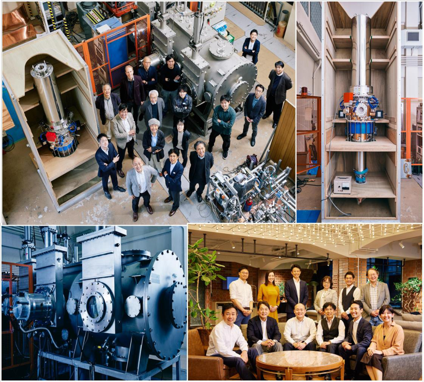
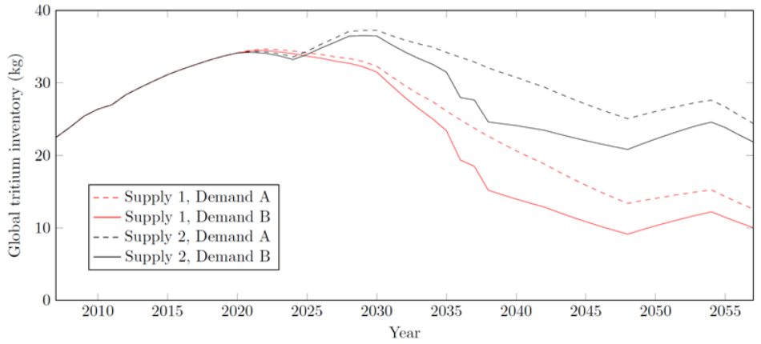
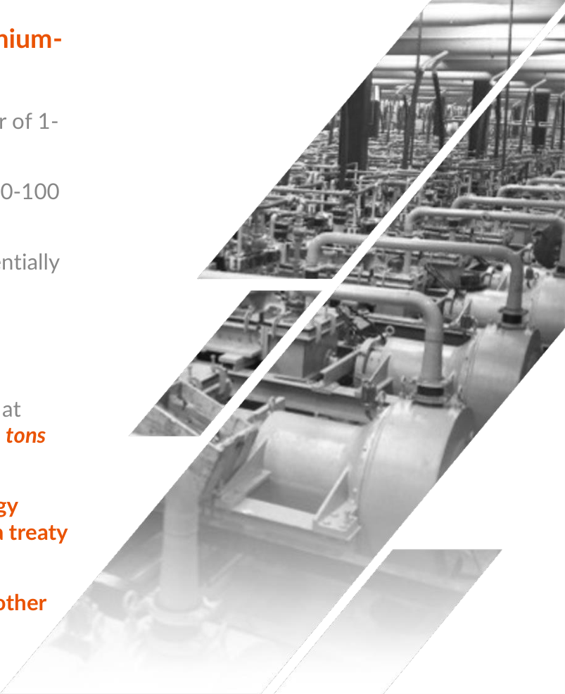
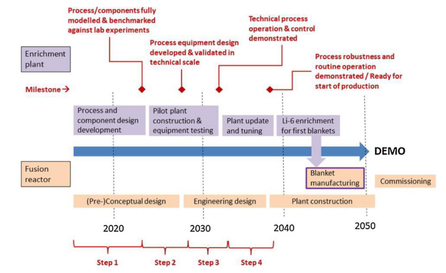
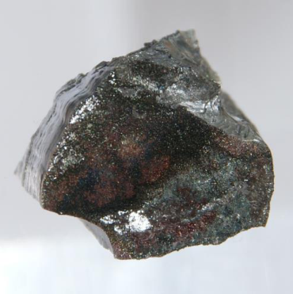

**The Availability & Supply of Critical Natural Resources for the Realization of a Fusion Pilot Plant:** _**Fuels for Fusion**_ 

**Dr. Richard J. Pearson – Chief Innovator & UK Director, Kyoto Fusioneering** U.S. DoE Fusion Workshop  |  Washington DC  |  June 1-3, 2022 _(Pre-recorded Virtual Presentation)_ 

## **About Kyoto Fusioneering** 

**Mission statement:** To **accelerate** the development of **high performance** , **commercially viable reactor technologies** associated with **power generation** and the **fuel cycle** to support the rapid **expansion** of the budding **fusion industry.** 

**Established:** October 2019 **Funding (VC):** ¥2.1B JPY (~$17M USD) **Investors:** 

**Locations:** Kyoto (laboratory) Tokyo (business HQ) Reading (UK HQ) US location by end 2022 (TBD) **Company size:** 45+ staff (incl. part-time) 

## **Introduction** 

## • **One commonly cited benefit of fusion is its abundant fuels that are said to be practically inexhaustible.** 

- **Primary fuels for D-T fusion are deuterium and tritium – which are both are abundant:** 

   - **Deuterium** is present in 1 in 6700 parts (sea)water 

   - **Tritium can be produced from lithium** in a _breeding blanket_ (interaction of neutrons with lithium) – and lithium is indeed abundant in both land-based deposits and in (sea)water. 

- **The reality is more complex, however:** 

   - 

   - **A breeding blanket** _**a critical path technology for any**_ **–** 

   - _**D-T fusion reactor (to attain tritium self-sufficiency)**_ **is .** 

   - **made up of more than just lithium** 

- **These resources that make up a blanket can be considered as “fuels” in a fusion reactor because they are consumable (and critical to operation)** 

The D-T fusion & tritium breeding reaction mechanism 

- See (Pearson, 2020). 

## **Breeding Blankets: Fuels (Consumables) for a Fusion Pilot Plant** 

- **Small (kg-scale) quantities of externally sourced tritium are required for the start-up of a pilot plant (pre-tritium breeding):** 

   - Tritium is available from only one source (commercially): as a by-product in **CANDU-type fission reactors** . 

   - Anticipated that existing fusion reactors will breed **surplus tritium for start-up of new reactors** , eliminating external tritium need. 

- **Most blanket concepts require a change to the natural isotopic composition of lithium for effective breeding:** 

   - **Lithium-6** is the isotope of significance for breeding, but only constitutes only _7.4% of natural lithium_ . 

   - Typically, a breeding blanket will require natural lithium to be **enriched to** _**30-90%**_ **lithium-6** . 

   - **Lithium-6 supply** is practically **zero** . 

## • **Other key resources required are “used up” and similarly critical for the blanket to function:** 

- **Neutron multipliers** (to increase neutron yield for breeding): materials with special nuclear properties – **beryllium** or **lead** (or uranium). 

- “ 

- **Coolants** : Some concepts are **water-cooled** , others **helium-cooled** . Some are **self-cooled” by the breeder (liquid metal or salts)** . 

- **Structural materials:** advanced low-activation steels, advanced ceramics (e.g. SiCf/SiC composites), or advanced alloys (e.g. V-alloys). 

## **The challenge: scaling-up for a fusion pilot plant (and beyond…)** 

- **Supply of these resources is currently very limited – they are not typically available in a form “** _**ready for use**_ **”** 

   - Most **resource supply chains** are not yet ready for even **pilot plant scale** (e.g. for breeding blankets). 

      - See (Surrey, 2019). 

   - Focus to date has been on **scientific R&D, not on scale-up** (manufacturability etc). 

      - Few industrial-scale processes have been developed – in many cases, fundamental R&D still required. 

   - **Industrialisation of these fusion supply chains is a key goal for the 2020s** if commercialisation is to be **accelerated** . 

- **Despite limited supply of key resources (fuels, materials or components), none of the challenges appears to present a showstopper for the commercialisation of fusion energy.** 

- **However, without action and development, these issues may create a bottleneck that slows commercialisation.** 

   - ITER has provided lessons on supply chain delays and complexity… The time to tackle these issues is now. 

# Key challenges:

## (1) tritium, (2) lithium-6, (3) beryllium

Note: the availability and supply of these resources in particular will likely affect <u>all</u> D-T reactor types, not just tokamaks. These are thus cross-cutting, industry-wide challenges.

## **Other critical materials & components for a Fusion Pilot Plant** 

- **Other materials and components are needed for key reactor. Whilst not “fuels”, these are potentially consumable and/or critical to reactor function – but currently have** _**limited/no established supply chain**_ **(even at scale/size for a pilot plant).** 

- **Key materials and components:** 

   - **Structural materials** (e.g. reduced activation steels) 

   - **Functional materials** (e.g. tungsten for divertor plates) 

   - **Magnets** (both low-temperature or high-temperature superconductors) 

   - **Lasers** (and related technologies) 

   - **Diagnostics** (for plasma and other in-vessel measurements) 

   - **Plasma heating devices** (e.g. gyrotrons) 

_(These are not included in today’s presentation – but will be included in more detail in a presentation I am giving at the IAEA next week, on this same topic)_ 

## **Tritium supply for start-up (1 of 2)** 

- **All commercially available tritium is produced as a by-product in CANDU fission reactors.** 

- **Current production rate is ~2 kg per year, with a ~30 kg (decaying) stockpile.** 

   - The majority of the global stockpile is in Darlington, Canada, and is owned by Ontario Power Generation (Canadian government). 

- **Global supply and stockpile expected to diminish towards 2050 as the global CANDU fleet ages and demand for tritium from fusion developers increases.** 

- **Recent modelling by Kyoto Fusioneering (based on research by: Pearson et al., 2018 & Kovari et al., 2018):** 

   - **Fusion demand** likely to begin to **deplete the available stockpile from as early as ~2035** . 

   - **Beyond 2050** , it is unlikely that tritium will be produced by CANDU (end of life), so **supply is highly uncertain** . 

- There is a **window of low demand for tritium** and **(relatively) abundant supply** from **now to ~2035** (before ITER and other domestic programmes come online, e.g. STEP in the UK, CFETR in China). 

Modelling of global tritium availability, considering various scenarios of supply and demand (optimistic and pessimistic). (Pearson et al., 2018) 

## **Tritium supply for start-up (2 of 2)** 

## • **Future outlook:** 

   - **Not enough external tritium** to support any fusion program **beyond the start-up of the first (** _**or perhaps the first few**_ **) commercial reactors** . 

   - In the medium-term ( _beyond the start-up of any fusion pilot plants, as well as ITER_ ), **tritium breeding blankets must be successfully developed** and have a tritium breeding ratio **(TBR) above 1** . 

   - If future reactor **TBR<1** , risk that **externally sourced tritium will be unavailable** to fill the gap. 

- **There are also a range of challenges associated with physical supply of tritium:** 

   - **Export controls** (end user agreements) 

   - **International transport of tritium** (including limitations on supply containers) 

   - **Competition** for supply (potential future geopolitical ramifications) 

   - **High Cost** (approximate value is around $35,000 per gram [$35M per kg]) 

## **Path forward: tritium** 

## • **DOE and fusion developers should:** 

- **Speak to international vendors** (Canada, Korea) about obtaining tritium for fusion pilot plants. 

- Understand **legal requirements to buy tritium** : export controls, transport containers (and licenses) etc. 

- Renew/develop facilities to **handle tritium in fusion-relevant (kg-scale) quantities** . 

- Provide information about near-term experiments, providing **estimated tritium quantities and timescales** to vendors. 

## • **Mission-critical for fusion: pursue development of a tritium breeding blanket** 

- Demonstration of **tritium self-sufficiency** in the **very first fusion pilot plant** . 

- Ensure future reactors do not need to rely on an (unstable) external source from CANDU. 

## **Lithium-6 for tritium breeding (1 of 2)** 

## • **A breeding blanket for a fusion pilot plant will likely require lithium6 enrichment in quantities in the order of ~tens of tonnes:** 

- **30-60% lithium-6 enrichment for beryllium-based blankets** (in the order of 1- 10 tonnes per reactor) + top-up (Bradshaw et al., 2011) 

- **60-90% lithium-6 enrichment for lead-based blankets** (in the order of 10-100 tonnes per blanket) + top-up (Bradshaw et al., 2011) 

- There is scope for a **blanket with natural lithium (no enrichment)** – potentially a pure lithium or other novel combination of materials. 

## • **Current supply of lithium-6 is effectively zero** . 

- **COLEX process** is the only historically proven way to produce lithium-6 at scale: _Y-12 facility at Oak Ridge National Laboratory produced approx._ _**442 tons of lithium-6 using COLEX (1954 to 1963)**_ **.** 

- **COLEX** is **expensive** ( **est. ~$4000 per kg** (von Hippel et al., 2012)), **energy intensive** and **environmentally damaging** . Now banned under **Minamata treaty** (ban on new use of large quantities of mercury for industrial processes). 

- Y-12 stockpile unknown (assumed unavailable for commercial use). **No other stockpile or supply of lithium-6 currently exists in the West.** 

## **Lithium-6 for tritium breeding (2 of 2)** 

## • **Research group at KIT (@HgLab) exploring novel lithium-6 enrichment (Giegerich et al., 2019)** 

   - Assessing **opportunities** and **risks** of several **alternative lithium-6 enrichment technologies** . 

   - **ICOMAX** – a _“cleaner version of COLEX”_ is under development as a frontrunner. 

   - Conclude that it could take **decades to fully establish and scale up.** 

- **Export controls on both lithium-6 and .** 

- **technology for production** 

   - Hypothesis: **the issue is not necessarily quantity (and cost) of lithium-6** , but **production of the material altogether** (Pearson, 2020). 

      - _Blankets with low lithium-6 enrichment may be no more favourable than those with higher enrichment._ 

   - **Commercially optimal blankets** would use **natural lithium** (technically challenging, but not impossible). 

Suggested process and timeline to develop lithium-6 production facilities in the EU (Giegerich et al., 2019) 

## **Path forward: lithium-6** 

## • **DOE and fusion developers should:** 

- **Commission a study into new US lithium-6 production for fusion** _potentially led by DOE and its laboratories_ . 

- Work with **international partners** (UK, EU, Japan). 

- **Consider revisiting regulations and export controls** for lithium-6-containing materials for fusion. 

- Ask the challenging question: _**can we get to a blanket with no lithium-6 enrichment?**_ 

## • **Next steps:** 

- After identifying the best available lithium-6 production method, **commission a small-scale production facility to supply lithium-6 for a first pilot plant** . 

   - _Question: cost of pilot lithium-6 enrichment facility is likely to be high – who pays for it? Government, industry, developer?_ 

- Consider **scale-up needs** to produce lithium-6 in the **order of tens, then hundreds of tonnes per year** . 

## **Beryllium for breeding blankets (1 of 2)** 

## • **Beryllium availability and supply** 

- Beryllium is **not abundant on Earth – official resource base estimate: 100,000 tonnes** (USGS, 2022) 

   - Thought to be an underestimate, and actual resource base is likely around **500,000 tonnes** 

- Largest known **economical beryllium deposits are in the US** (largest mine at Spor Mountain, UT), owned and operated by **Materion Corporation** – who produce the lion’s share of global beryllium (Trueman & Sabey, 2014). 

- **Global production** is **~170 tons per year** (maximum production capacity is around 350-400 tons) 

This Photo of beryllium metal by Unknown Author is licensed under CC BY 

## • **Beryllium for fusion** 

- Beryllium is a **unique nuclear material** with attractive characteristics for tritium breeding. 

- **One fusion reactor** using a **Be-based blanket** requires **approximately the same quantity of beryllium as the total annual global supply of beryllium** (Bradshaw et al., 2011; Pearson, 2020). 

- Despite resource constraints, likely to be a viable blanket material for the **first generation of commercial fusion reactors** . 

- Some of the **challenges can be avoided through using beryllium in the form of FLiBe rather than as a solid** _as FLiBe in a blanket can be recycled and reused at end of life, and is less expensive to manufacture_ . 

## **Beryllium for breeding blankets (2 of 2)** 

- **Expensive** : current price for **$610 per kg of beryllium alloy** 

   - Cost increases further when considering manufacturing costs to transform into solid form suitable for fusion. 

- **Challenging (and expensive) to manufacture** using beryllium due to **toxicity of beryllium** . 

- **Trace uranium content in beryllium** causes the **production of plutonium upon irradiation** , which is a long-lived and safeguarded radioactive isotope (Kolbasov et al., 2016). 

   - Special grade of beryllium has been developed with ultra-low uranium concentration to avoid this (Materion S65). 

## • The **U.S. DoD holds a National Defence Stockpile of beryllium** . 

   - Likely to be geopolitical concerns over widespread production, distribution and exhaustion for fusion. 

- **Certain grades of beryllium are export controlled under dual use** ( _>50% contained beryllium metal_ ). 

- **Scaling up** to meet the demand from a commercial fusion programme requiring beryllium will require **significant investment and time** . 

## **Path forward: beryllium** 

## • **Next steps** 

- Obtaining **beryllium in order of ~hundreds of tonnes** for a **single pilot plant** is **not likely to be a big challenge** . 

- However, if beryllium will be used for a fusion industry, **commercial scalability of the beryllium supply chain** must be considered; _the beryllium industry will need warning to ramp up production for fusion demand_ . 

- DOE and fusion developers should **engage the beryllium industry** to understand the **capability of the beryllium industry to handle future fusion demand** , considering: **scale-up costs** , **lead time** and **solutions to challenges** . 

## • **Key challenge: handling a beryllium industry monopsony** 

- All parts of the **fusion supply chain need certainty** that they are scaling up to support an industry that will succeed. 

- In the case of beryllium, **fusion as “customer industry” could present such a sharp increase in demand** that the **beryllium industry becomes a monopsony** (the opposite to a monopoly) whereby it **serves only one customer** . 

- **High demand from fusion** _an industry in its infancy and unproven in the market_ – will be seen as a **risk from the beryllium industry’s standpoint** . Government guarantees may be needed to support scale-up (Pearson, 2020). 

## **Conclusions: no showstoppers, but significant challenges ahead** 

- **.** 

- **No showstoppers, but significant challenges with complexity and individuality/variation** 

   - There is no single solution that will solve all the problems simultaneously. 

- **.** 

- **Key issue with significant potential to be rate-limiting for fusion commercialisation** 

   - Unique resources and materials scale-up needed for all new industries – akin to renewables scale-up happening now. 

   - Several niche resources/materials means perhaps greater effort is needed for the fusion industry. 

- **Solutions will require investment of human resource, time and capital (including on R&D).** 

- **Many of these resource and supply chain challenges are out of the control of the fusion industry –** _**and instead at the mercy of political, societal, market and regulatory forces**_ **(Surrey, 2019).** 

- **Such issues have not been centre stage to date. If fusion development is to be accelerated, then the time to act is now.** 

## **Recommendation 1: Involve relevant stakeholders in seeking a solution** 

## • **Requires collective action from various stakeholders:** 

- **Central government** (who can provide **investment** in the form of grants, and other **guarantees** or **support** ) 

- **Laboratories and research institutions** (who will provide **R&D** and other **relevant expertise** on highly specialised problems) 

- **Private fusion developers** (who can help define **required resources/materials/components** to realise their pilot plants) 

- **Industry** (who will **provide** the resources, materials and components) 

- **International collaborators** (who can provide **additional resource in all the above areas** – fusion is already a global industry!) 

## _Note that_ _**public-private partnership** is intrinsic and critical in solving these challenges!_ 

## **Recommendation 2: Tackle industrialisation with next-step commercialisation in mind** 

- **Solutions to develop resource, materials and component supply chains for a pilot plant must be scalable to enable next step commercial rollout.** 

- **All technologies must be developed with industrial (resource, materials, manufacture) aspects considered.** 

- **Solutions require a systems-thinking approach, looking at the problem through the lenses of:** 

   - **Legal** (E.g. regulation, materials codes and standards) 

   - **Political** (e.g. where supply is coming from, trade agreements, international collaboration) 

   - **Environmental** (e.g. mining or ecological impact through use of mining materials/chemicals) 

   - **Technological** (e.g. manufacturing methods, quality assurance) 

   - **Social** (siting of new mines or facilities, regional industry revitalisation) 

   - **Economic** (job creation, investment into the industry) 

## **Recommendation 3: General guidance for the path forward** 

- **Commission assessments of the critical resources, materials, and components** for required for the **realisation of a fusion pilot plant** & determine a path forward for each. 

   - _The three included in this presentation – tritium, lithium-6 and beryllium – are perhaps the most acute, but there are many others that are challenging in different ways._ 

- **Subsequently, engage industry/vendors** of **resources, materials and components** to find a solution. 

- **Take action to realize industrialisation in the 2020s towards a fusion pilot plant** , and consider preparations for the steps beyond ( **commercialisation…** ) 

## **Concluding remark…** 

The 2020s needs to be seen as the **age of fusion industrialisation** , and the investment of time, effort and capital in this decade is the foundation for **fusion commercialisation in the 2030s** . 

## **References** 

- Bradshaw, A. M., Hamacher, T., & Fischer, U. (2011). **Is nuclear fusion a sustainable energy form?.** _Fusion Engineering and Design_ , _86_ (9-11), 2770-2773. 

- Giegerich, T., Battes, K., Schwenzer, J. C., & Day, C. (2019). **Development of a viable route for lithium-6 supply of DEMO and future fusion power plants.** _Fusion Engineering and Design_ , _149_ , 111339. 

- Kolbasov, B. N., Khripunov, V. I., & Biryukov, A. Y. (2016). **On use of beryllium in fusion reactors: resources, impurities and necessity of detritiation after irradiation** . Fusion Engineering and design, 109, 480-484. 

- Kovari, M., Coleman, M., Cristescu, I., & Smith, R. (2017). **Tritium resources available for fusion reactors.** _Nuclear Fusion_ , _58_ (2), 026010. 

- Pearson, R. J. (2020). _**Towards commercial fusion: innovation, Technology Roadmapping for start-ups, and critical natural resource availability**_ **.** Open University (United Kingdom). 

- Pearson, R. J., Antoniazzi, A. B., & Nuttall, W. J. (2018). **Tritium supply and use: a key issue for the development of nuclear fusion energy.** _Fusion Engineering and Design_ , _136_ , 1140-1148. 

- Surrey, E. (2019). **Engineering challenges for accelerated fusion demonstrators.** _Philosophical Transactions of the Royal Society A_ , _377_ (2141), 20170442. 

- Trueman, D.L. and Sabey, P. (2014). **Beryllium.** In Critical Metals Handbook, G. Gunn (Ed.). 

- U.S. Geological Survey (2022) **Mineral Commodity Summary: Beryllium (2022).** [Online]. National Minerals Information Center. Available from: https://www.usgs.gov/centers/nmic/beryllium-statistics-and-information [Accessed: 31 May 2022]. 

- _von Hippel et al. in_ Johansson, T. B., Patwardhan, A. P., Nakićenović, N., & Gomez-Echeverri, L. (Eds.). (2012). _**Global energy assessment: toward a sustainable future**_ **.** Cambridge University Press. 

ありがとうございます

(Thank You!)

Please send questions/comments to:
r.pearson@kyotofusioneering.com

Web: www.kyotofusioneering.com
Contact: biz@kyotofusioneering.com
Twitter: @kyotofusioneer
LinkedIn: linkedin.com/company/kyoto-fusioneering/