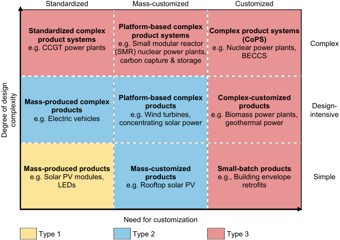
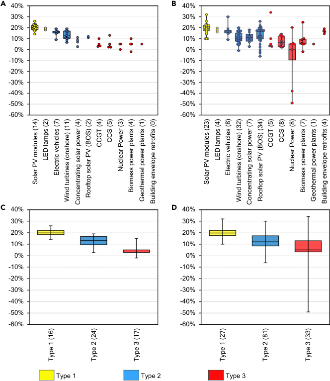

## Accelerating Low-Carbon Innovation 

Abhishek Malhotra[1][,][2][,] * and Tobias S. Schmidt[2][,][3][,] * 

## SUMMARY 

Accelerating innovation in low-carbon technologies is fundamental in order to achieve global climate targets. However, only few technologies are currently on track to meet these targets. Here, we review and synthesize the innovation literature to develop a technology typology that helps explain systematic differences in technologies’ experience rates. Based on the typology, we derive implications for policy makers and climate and energy modelers. More specifically, we argue that the Paris Agreement’s focus on the national green industrial policy only suits innovation in certain types of technologies, and thus, should be complemented by topdown measures to coordinate research, development, demonstration, deployment, and regulations across countries. 

## INTRODUCTION 

Achieving global climate goals will require continuing technological innovation across a diverse portfolio of low-carbon technologies.[1] Under the Paris Agreement, national governments are taking the lead in accelerating innovation and deployment of low-carbon technologies by means of national policies.[2] While several low-carbon technologies have seen increasing deployment and rapidly falling costs, thus far, solar photovoltaics (PV), light emitting diodes (LEDs), and electric vehicles (EVs) are among the only low-carbon technologies on track to help meet the Paris Agreement’s target of limiting global warming to well below 2[�] C above pre-industrial levels.[3] In contrast, many other technologies, such as nuclear power, biomass power, and carbon capture and storage (CCS) are not on track.[1][,][3] Recent studies have attempted to explain differences between technologies based on their scale[4] and its influence on ‘‘learning by doing’’[5] , recommending an increased focus on smaller-scale technologies. However, we argue that considering other technology-inherent characteristics, learning mechanisms, and spillovers can help provide a more nuanced and complete picture of observed differences in experience rates, thus providing a broader range of policy options for energy technology innovation. In this perspective, we synthesize key insights from innovation studies and present a novel technology typology, to help explain systematic differences in technologies’ experience rates, which we also review. Based on this typology, we discuss policy implications and argue that the Paris Agreement’s reliance on national green industrial policies is suited for promoting innovation only for some technologies. For highly complex and/or customized technologies, such as nuclear power, biomass power, and CCS, national policies need to be augmented with top-down measures to coordinate research, development, demonstration, deployment, and regulations across countries to facilitate learning-by-doing and inter-project and inter-context spillovers at a regional or global scale. 

## A TYPOLOGY EXPLAINING DIFFERENCES IN TECHNOLOGIES’ EXPERIENCE CURVES 

Experience curves are a well-established approach to describe the cost dynamics of low-carbon technologies, according to which a technology’s cost decreases by a 

## Context & Scale 

Accelerating innovation in lowcarbon technologies is fundamental to achieving global climate targets. However, only few technologies, such as solar PV, LEDs, and electric vehicles, are currently on track to meet these targets. In contrast, many other technologies, such as nuclear power, biomass power, and carbon capture and storage (CCS) are not on track. In this perspective, we conduct a thorough review of experience rates of low-carbon technologies that have been reported in the existing literature. We also draw on complexity theory, evolutionary economics, and cybernetic theory to develop a technology typology that helps explain systematic differences in technologies’ experience rates by distinguishing between technologies on the basis of (1) their design complexity and (2) the extent to which they need to be customized. 

Based on this typology, we derive implications for policy makers and climate and energy modelers. We argue that the Paris Agreement’s reliance on the nationally driven green industrial policy only suits innovation in certain types of technologies, and thus, should be complemented by top-down measures to coordinate R&D, demonstration, deployment, and regulations across countries. We suggest that integrated assessment modelers and policy 

Joule 4, 2259–2267, November 18, 2020 ª 2020 Elsevier Inc. 2259 

fixed percentage for each doubling of its cumulative installed capacity.[6] Experience curves have been criticized in mainstream economics for their lack of theoretical grounding and inconsistency with observed economy- and sector-wide cost reductions.[7] In response, a large body of literature has emerged to estimate experience rates for specific technologies,[8][,][9] unpack the underlying mechanisms contributing to cost reductions,[10][,][11] and provide a theoretical basis to explain the functional form of experience curves and observed values of experience rates.[12][,][13] Thus, over time, experience curves have come to find extensive use in industry and energy policy for technology forecasting, energy system modeling, and integrated assessment modeling. Recent studies, such as Wilson et al.[4] and Sweerts et al.,[5] have attempted to explain differences in experience rates between technologies, finding that they are correlated with unit size. However, since neither study goes into any detail regarding the mechanisms of learning and innovation that underlie observed cost reductions, they provide no insight on what the barriers to learning, spillovers, and innovation in large-scale technologies are and what can be done to address them. Instead, they recommend that policymakers should focus on small-scale technologies, ignoring the recent successes of large-scale technologies (e.g., offshore wind), the fact that large-scale technologies might still be required as part of a diversified technology portfolio to decarbonize the energy system (e.g., nuclear power), and that small-scale mitigation options might be infeasible in certain sectors (e.g., industry decarbonization). 

Scholarship in innovation studies suggests that technology-inherent characteristics can help explain the degree of variation across technologies in terms of their experience rates. Yet, many innovation and industrial policies do not consider these differences systematically.[14] One reason is that these literature insights remain scattered. Here, drawing on insights from complexity theory, evolutionary economics, and cybernetic theory,[12][,][15–17] we present a novel synthesis of these insights and structure them in a single typology, distinguishing between technologies based on their design complexity and the extent to which they need to be customized, as illustrated in Figure 1. We further discuss how these two dimensions are important determinants of the pace of technological progress and the effectiveness of bottomup, nationally driven green industrial policies. For more information regarding the characterization of technologies in Figure 1 in terms of their design complexity, need for customization and technological experience rates, please refer to the Supplemental Information. 

First, the patterns of innovation and the pace of technological progress differ across technologies depending on their design complexity. The design complexity refers to the number of design elements in a product and the extent to which they interact with each other. Studies such as McNerney et al.[16] and Fink and Reeves[17] have developed theoretical models to demonstrate that the rate of progress of a technology depends on its design complexity: the more complex the design, the slower the rate of improvement. There are at least five main approaches to quantifying the design complexity of individual technologies. First, as is prevalent in the systems engineering and management science literature, and as proposed by McNerney et al.,[16] one could design structure matrices (DSMs) for individual technologies. DSMs represent the number of components in a technology, as well as the pairwise relationships between them, which can then be used to compute the design complexity (for more details, please refer to McNerney et al., 2011). Second, for large-n studies, one could follow Fleming and Sorenson[18] to use the N/K model of complexity introduced by Kauffman[19] and apply it to patent data. By doing so, they quantify the number and degree of interdependence of subcomponents of 

scholars concerned with the political feasibility and dynamics of interventions should take caution with respect to technologies with high design complexity and need for customization, where global experience rates might be substantially lower than what can be expected from the diffusion in current localized niche markets. Finally, while several approaches for measuring the design complexity and need for customization of technologies exist in the literature, innovation scholars should direct their efforts toward improving our understanding of how these approaches differ and toward characterizing different technologies along the two dimensions in a systematic and replicable manner. 

1School of Public Policy, IIT Delhi, Hauz Khas, New Delhi 110016, India 

2Energy Politics Group, ETH Zurich, Haldeneggsteig 4, 8092 Zurich, Switzerland 

3Institute of Science, Technology and Policy, ETH Zurich, 8092 Zurich, Switzerland 

*Correspondence: absmalhotra@gmail.com (A.M.), tobiasschmidt@ethz.ch (T.S.S.) 

https://doi.org/10.1016/j.joule.2020.09.004 

**----- Start of picture text -----** 
Standardized Mass-customized Customized Platform-based complex Standardized complex  Complex product systems product systems product systems  (CoPS) e.g. Small modular reactor  Complex e.g. CCGT power plants  e.g. Nuclear power plants, (SMR) nuclear power plants,  BECCS carbon capture & storage Platform-based complex  Complex-customized Mass-produced complex products products Design- products e.g. Wind turbines,  e.g. Biomass power plants,  intensive e.g. Electric vehicles concentrating solar power  geothermal power Mass-produced products Mass-customized  Small-batch products e.g. Solar PV modules,  products e.g., Building envelope  Simple LEDs  e.g. Rooftop solar PV  retrofits Need for customization  Type 1   Type 2   Type 3 complexity Degree of design **----- End of picture text -----** 

Figure 1. Schematic Characterization of Different Energy Technologies Based on Their Design Complexity and Need for Customization Note that the axes represent a continuum along each of these two dimensions and that the locations of technologies within this framework are relative to each other. Based on this characterization, the technologies are grouped into three types, each requiring different roles of national and international innovation and deployment policy. For Type 1 technologies (no shading), access to large and increasing global markets induces innovation. Type 2 technologies (blue) provide opportunities for national green industrial policies fostering local industry, technological adaptation, and participation in global value chains. Type 3 technologies (red) require a combination of national green industrial policies and measures to promote international coordination for inter-project and inter-context learning at a regional or global scale. The need for international coordination increases as one moves towards the top-right of the figure. 

knowledge (as represented by subclasses of an individual patent). Third, Balland and Rigby[20] and Ivanova et al.[21] adapted the economic complexity index developed by Hidalgo and Hausmann[22] to develop an index of technological complexity. Specifically, they used patent data to calculate the geographic distribution of patenting activity, assuming that complex knowledge is not ubiquitous and co-concentrates with other kinds of complex knowledge. Fourth, Broekel[23] proposed to use network analysis methods and patent data to calculate the diversity of (sub-) network topologies in patent networks, which is a proxy for technological complexity. Finally, Chapman and Hyland[24] used expert elicitation methods to develop ex-ante estimates of design complexity of emerging technologies. 

In agreement with the theoretical predictions of McNerney et al.[16] and Fink and Reeves,[17] low-carbon energy technologies with relatively low design complexity, such as solar PV modules and LEDs, have benefited massively from price reductions, primarily through learning-by-producing and economies of scale in mass manufacturing.[25] Knowledge related to such technologies is embedded in the manufacturing equipment. Although the manufacturing equipment itself can be complex, it is jointly developed and operated by manufacturers and manufacturing equipment suppliers in highly controlled and closed environments internal to the firm. Thus, the knowledge embodied in manufacturing equipment is relatively easy to acquire, replicate, and implement globally. Thus, investments in manufacturing equipment represent an extremely important driver for knowledge 

**----- Start of picture text -----** 
A  40% B  40% 30% 30% 20% 20% 10% 10% 0% 0% -10% -10% -20% -20% -30% -30% -40% -40% -50% -50% -60% -60% C  40% D  40% 30% 30% 20% 20% 10% 10% 0% 0% -10% -10% -20% -20% -30% -30% -40% -40% -50% -50% -60% -60%  Type 1   Type 2   Type 3 Solar PV modules (14) LED lamps (2) Electric vehicles (7) Wind turbines (onshore) (11) Concentrating solar power (4) Rooftop solar PV (BOS) (2) CCGT (4) CCS (5) Nuclear Power (3) Biomass power plants (4) Geothermal power plants (1) Building envelope retrofits (0) Solar PV modules (23) LED lamps (4) Electric vehicles (8) Wind turbines (onshore) (32) Concentrating solar power (7) Rooftop solar PV (BOS) (34) CCGT (5) CCS (8) Nuclear Power (8) Biomass power plants (7) Geothermal power plants (1) Building envelope retrofits (4) Type 1 (16) Type 2 (24) Type 3 (17) Type 1 (27) Type 2 (81) Type 3 (33) **----- End of picture text -----** 

Figure 2. Experience Rates and Box Plots for Different Technology Types and Technologies Illustrated in Figure 1 and Reviewed in Table S1 (A–D) For technologies with five or fewer data points, only the data points have been shown. The lower and upper box boundaries represent the 25th and 75th percentiles, respectively. The line inside the box represents the median, and the lower and upper error lines depict the minimum and maximum of all the data, respectively. The numbers in brackets next to the category labels represents the number of data points. (A) and (C), global experience rates, only. (B) and (D), all values (i.e., national, regional, and global). Experience rates that are calculated for time periods that are subsets of the longest time period in a study, as well as values that are calculated using cumulative electricity production (instead of cumulative deployment, sales, or manufacturing) are excluded. No studies calculating global experience rates for building envelope retrofits were found in the literature. For more details, see Table S1 in the Supplemental Information. 

absorption at the firm level and global knowledge spillovers at the industry level, resulting in relatively lower barriers to entry and higher competition.[14] 

In contrast, highly complex technologies, such as combined cycle gas turbine (CCGT) plants and CCS, have progressed at a relatively slower pace (see Figures 2A and 2B). Although technologies with higher design complexity provide more opportunities to improve technological performance through refinements in product design, the multiple interactions between the design elements make technological performance difficult to predict. Thus, improvements are driven by a highly iterative process with a high risk of encountering bottlenecks and dead-ends in terms of 

technological progress.[16][,][17][,][26] With increasing design complexity, firms benefit to a greater extent from economies of scale in product design, product research, development and demonstration (RD&D), learning-by-interacting within the value chain, and learning-by-using. Technologies with high design complexity are often ‘‘lumpy’’ and large-scale, requiring a high degree of technical, project management, and financing capabilities.[14][,][26] In addition, the cumulativeness of knowledge leads to a higher first-mover advantage, higher barriers to entry for latecomers, and oligopolistic market structures. Thus, the high uncertainty, high cost of experimentation, long product development cycles, and high cost of coordination in large value chains act as barriers to learning-by-doing and inter-project spillovers. 

Second, the patterns of innovation and the pace of technological progress differ depending on the extent to which technologies need to be customized.[15][,][27] The need for customization depends on the extent to which technologies need to be adapted to their use environments, which can be described in terms of three characteristics: user preferences, regulatory contexts, and physical environments.[28] Frenken et al.[29] proposed to use two measures to calculate the design variety in technological populations using data on product families. First, they used the entropy value of a technological population to measure the degree of uncertainty or variety in a distribution of products. Second, they proposed to use Weitzman’s[30] measure of diversity for technological populations, which is based on the distance between product designs, and indicates the degree of differentiation in the population. Theoretically, Wene[12] interprets experience curves as a fundamental property of the operationally closed learning system, whose experience rate is determined by the eigenvalues of the system. However, in cases where the learning system needs to respond to external perturbations in the form of a continuously changing use environment, the condition for operational closure of the learning system is no longer satisfied, which can cause the experience rate to deviate from the eigenvalues of an operationally closed learning system. Thus, the greater the need to customize technologies to use environments with unknown, uncertain, or highly heterogeneous characteristics, the more difficult it is difficult to achieve scale and develop a standardized body of knowledge that can be controlled, replicated, and made effective in a variety of contexts, thus slowing down technological progress.[15] 

Accordingly, relatively standardized technologies, called Type 1 technologies, as shown in Figure 1, such as solar PV modules, LEDs, or batteries for electric vehicles, have progressed significantly in terms of their cost and performance, benefiting from the cumulative experience gained from deployment in large, global markets (see Figures 2C and 2D). New knowledge related to such technologies is often globally applicable, meaning that it can be scaled up across multiple contexts with relative ease.[31][,][32] 

In contrast, more customized technologies, such as building envelope retrofits, geothermal power plants, and biomass power plants, all belonging to technology Type 3, as shown in Figure 1, have relatively lower global progress rates (see Figures 2C and 2D). With an increasing need for customization, firms have a greater opportunity to operate in specialized niches that are protected from competitive pressure. However, at the same time, knowledge spillovers can become increasingly context specific, leading to relatively lower global experience rates as compared with local experience rates (compare Figures 2A and 2B). Thus, scaling up beyond these niches often requires reducing uncertainty in user preferences, regulatory contexts, and physical environments, and adapting the technology accordingly (ideally using mass-customization techniques[33][,][34] ). Firms learn through market research and development (R&D), characterization of use environments, learning-by-interacting with users and dynamic 

economies of scope (that is, re-use of knowledge gained through cumulative deployment across a variety of different use environments). Thus, fragmented and heterogeneous markets, the high cost of technology adaptation, and difficulties in scaling up and export of customized technologies act as barriers to learning-by-doing and intercontext learning.[27][,][32] 

## IMPLICATIONS FOR PUBLIC POLICY AND FUTURE RESEARCH 

We propose that these two dimensions are independent, and that they influence barriers to learning-by-doing, inter-project and inter-context spillovers, and opportunities to frame industrial strategies around them. Characterizing low-carbon technologies along the two dimensions can help explain why technologies, such as nuclear power, biomass power, and CCS, have progressed in isolated niches but not at a global scale. Furthermore, policymakers at the national and international level should systematically consider these dimensions while framing policies to create markets and address barriers to learning and innovation. 

First, bottom-up, national industrial policies are particularly suited for massproduced complex products (such as electric vehicles), platform-based complex products (such as wind turbines), and mass-customized products (such as rooftop solar PV) (Type 2 in Figure 1). Although design-intensive Type 2 technologies, such as EVs and wind turbines, may require large initial public investments to create stable home markets to enable build-up of capabilities through learning by doing, they also provide a high first-mover advantage and opportunities for export in global markets. Thus, these technologies represent a sweet spot characterized by high added value and high market volume, and hence, they have the potential to form the cornerstone for national green industrial policies.[35][,][36] Furthermore, masscustomized Type 2 technologies, such as rooftop solar PV and wind turbines, have core modules that have experienced significant cost reductions. Since the balance of system components account for increasingly larger shares of the total cost, they are increasingly the focus of innovation to adapt them to specific contexts and to standardize them across multiple contexts, creating opportunities for local valueadd and employment generation.[25][,][32] As a result, national green industrial policies have thus far played an important role in supporting innovation in Type 2 technologies[35] and are likely to also do so in the future. 

Second, although bottom-up, nationally driven deployment policies are also suited for simple, standardized Type 1 technologies that are readily mass-produced (such as solar PV modules and LEDs), national policymakers face a first-mover disadvantage in enacting industrial policies for such technologies.[37] For example, while the US, Japan, and Germany successively took the lead in the solar PV industry through R&D and creation of home markets, they were all overtaken by China in terms of market share, due to China’s relative competitive advantages in manufacturing, including access to low-cost capital and access to global supply chains.[36] Nevertheless, national deployment policies for Type 1 technologies add up globally in a bottom-up manner, contributing to growth in total global market volume. This enables scaling up of production processes, learning-by-producing and global spillovers,[25][,][37] setting off a virtuous cycle of falling costs and more ambitious deployment policies. Thus, international agreements can play a role in overcoming the first-mover disadvantage and ensuring growing markets for Type 1 technologies, by coordinating the creation of early markets, spreading the higher cost of deployment among several countries and removing trade barriers between them. 

Third, highly complex and/or customized Type 3 technologies rarely provide attractive opportunities for national green industrial policies, due to barriers related to technical capabilities required, and due to barriers to learning-by-using, interproject and inter-context spillovers. Large, highly complex technologies with a project-based mode of organization (such as CCGT, small modular reactor [SMR] nuclear power plants, and CCS) provide opportunities for green industrial policies to only a very small set of countries with high technical capabilities.[14] Even firms in the majority of such countries need to contend with small market volumes, regulatory uncertainty, long product development cycles, and high financial risks, which create barriers for learning-by-doing and inter-project spillovers. Similarly, highly customized technologies with fragmented markets (such as building envelope retrofits, biomass power, and geothermal power) do not provide national policymakers and firms with attractive markets for export-oriented industrial policy. Since inter-context spillovers are limited, local experience rates in early market niches can be higher than eventual global experience rates. Finally, few countries (such as the US and China) have the technical capabilities and sufficient domestic market volume to enable them to unilaterally facilitate inter-project and inter-context learning at sufficient scale for complex and customized technologies, such as nuclear power and biomass power with carbon capture and storage (BECCS).[38] 

Thus, bottom-up, nationally driven policies might be unfit to accelerate scaling up and innovation in Type 3 technologies. Ongoing efforts by national-level policymakers and the private sector to scale up and mass-customize Type 3 technologies need to be complemented with top-down international measures to enable learning-by-using and to maximize inter-project and inter-context spillovers.[38–40] Ideally, such measures would include (1) enhanced coordination in RD&D activities across projects and firms to facilitate inter-project spillovers for highly complex technologies, (2) support for characterization of user preferences and physical environments to facilitate inter-context spillovers for customized technologies, and (3) support for learning by doing through harmonization of regulations across multiple countries for technologies that need extensive customization to suit different regulatory environments. 

These measures would help operationalize and provide focus to Article 6.1 of the Paris Agreement, which recognizes international cooperative approaches toward meeting nationally determined contributions, as well as Article 10.2, which calls for strengthened cooperative action on technology development and transfer. For instance, the Technology Mechanism, whose mandate is to enhance technology development and transfer to developing countries, should tailor its support to national governments based on specific technology types. The Climate Technology Center and Network (CTCN, the implementation arm of the Technology Mechanism) should work together with groups of developing countries to help develop and deploy customized technologies, such as geothermal power, biomass power, and building envelope retrofits. In particular, they can help harmonize technical, safety, and licensing regulations across jurisdictions, and to aggregate regional demand across similar use environments by designing application-specific deployment policies and provision of export credits. 

Similarly, our insights can inform the efforts of existing international climate clubs focusing on R&D, such as the Clean Energy Ministerial and Mission Innovation, as well as potential climate clubs focusing on sector- or technology-specific green industrial policies.[41][,][42] Alliances of nations with common interests in specific Type 3 technologies or their associated sectors should not only direct efforts toward funding R&D 

activities. Instead, for highly complex technologies, such as SMR nuclear power plants and CCS, they should also facilitate inter-project spillovers by supporting test facilities and a coordinated portfolio of pilot and demonstration projects for co-development and characterization of technological performance across a diverse range of designs and use environments.$^{38,40}$ For customized technologies, data related to user preferences and relevant factors in the physical environment (e.g., detailed geological maps for geothermal power, biomass feedstock characteristics and availability for biomass power, data on building stocks for building envelope retrofits) can be considered a public good. Thus, the efforts of such clubs also need to be directed toward collection and dissemination of such data across contexts, which can facilitate aggregation of markets and scaling up of customized technologies.

Finally, researchers should more systematically consider technology differences while forecasting technological progress based on historical trends. Many integrated assessment models (IAMs) project important roles for Type 3 technologies (such as BECCS). However, IAMs should take caution with respect to technologies with high design complexity and need for customization, where global experience rates might be substantially lower than what can be expected from the diffusion in current localized niche markets. Furthermore, policy scholars concerned with the political feasibility and dynamics of interventions$^{2,41}$ should systematically consider technology differences, since creating a virtuous feedback cycle of falling costs and more ambitious deployment policies may be more likely in technologies with high progress rates.

## SUPPLEMENTAL INFORMATION

Supplemental Information can be found online at https://doi.org/10.1016/j.joule.2020.09.066.

## ACKNOWLEDGMENTS

The project was partly financially supported by InnoSuisse through the Swiss Competence Center for Energy Research – Heat and Electricity Storage (SCCER HaE) contract number 1155000153. We would like to acknowledge this support, as well as feedback on early drafts of this manuscript from M. Beuse and B. Steffen and research assistance for data collection by Varun Duggal.

## AUTHOR CONTRIBUTIONS

Conceptualization, A.M. and T.S.; Investigation, A.M.; Writing – Original Draft, A.M.; Writing – Review and Editing, A.M. and T.S.; Visualization, A.M.; Funding Acquisition, T.S.

## REFERENCES

1. Kupel, J., Smolelj, C., Jiang, X., Filila, S., Forster, P., Ginsburg, V., Handa, C., Mazingo, H., Kobayashi, S., Kriegler, E., et al. (2018). 3. Chapter 2: mitigation pathways compatible with 1.5°C in the context of sustainable development. In Global Warming of 1.5C, IPCC Special Report on the impacts of global warming of 1.5°C above pre-industrial levels and related global greenhouse gas emission pathways, in the context of strengthening the global response to the threat of climate change, V. Masson-Delmotte, P. Zhai, H.-O. Pörtner, D. Roberts, J. Skea, P.R. Shukla, A. Pirani, W. Moufouma-Okia, C. Pean, and R. Pidcock, et al., eds. (Intergovernmental Panel on Climate Change), pp. 95–174.

2. MacKerlay, J., Kelsey, N., Biber, E., and Zysman, J. (2015). Climate change. Winning coalitions for climate policy. Science 349, 1170–1171.

3. IEA (2018). Tracking clean energy progress. https://www.iea.org/topics/tracking-clean-energy-progress.

4. Wilson, C., Grubler, A., Bento, N., Healey, S., De Stercke, S., and Zimm, C. (2020). Granular technologies to accelerate decarbonization. Science 368, 36–39.

5. Sweerts, B., Dalla, R.J., and van der Zwaan, B. (2020). Evaluating the role of unit costs in learning-by-doing of energy technologies. Joule 4, 967–970.

6. Rubin, E.S., Yeh, S., Antes, M., Berkenpas, M., and Davison, J. (2007). Use of experience curves to estimate the future cost of power plants with CO$_2$ capture. International Journal of Greenhouse Gas Control 1, 188–197.

7. Nordhaus, W.D. (2014). The perils of the learning model for modeling endogenous technological change. Energy J. 35, 1–13.

8. Rubin, E.S., Azevedo, I.M.L., Jaramillo, P., and Yeh, S. (2015). A review of learning rates for electricity supply technologies. Energy Policy 86, 198–218.

9. McDonald, A., and Schrattenholzer, L. (2001). Learning rates for energy technologies. Energy Policy 29, 255–261.

policy support mechanisms. Energy Policy 35, 1844–1857. 

10. Nemet, G.F. (2006). Beyond the learning curve: 22. Hidalgo, C.A., and Hausmann, R. (2009). The factors influencing cost reductions in building blocks of economic complexity. Proc. photovoltaics. Energy Policy 34, 3218–3232. Natl. Acad. Sci. USA 106, 10570–10575. 

   36. Gallagher, K.S. (2014). The Globalization of Clean Energy Technology: Lessons from China (MIT Press). 

11. Kavlak, G., McNerney, J., and Trancik, J.E. 23. Broekel, T. (2019). Using structural diversity to (2018). Evaluating the causes of cost reduction measure the complexity of technologies. PLoS in photovoltaic modules. Energy Policy 123, One 14, e0216856. 700–710. 

      37. Peters, M., Schneider, M., Griesshaber, T., and Hoffmann, V.H. (2012). The impact of technology-push and demand-pull policies on technical change – does the locus of policies matter? Research Policy 41, 1296–1308. 

   24. Chapman, R., and Hyland, P. (2004). Complexity and learning behaviors in product innovation. Technovation 24, 553–561. 24, 553–561., 553–561.. 

- [12]. Wene, C.-O. (2008). A Cybernetic Perspective Complexity and learning behaviors in product on Technology Learning Theoretical innovation. Technovation 24, 553–561. 24, 553–561., 553–561.. Grounding of Learning Curve View Project Models for Analysing Energy Systems View 25. Huenteler, J., Schmidt, T.S., Ossenbrink, J., and Project A Cybernetic Perspective on Hoffmann, V.H. (2016). Technology life-cycles Technology Learning. Innovation for a low in the energy sector - Technological carbon economy: economic, institutional and characteristics and the role of deployment for management approaches (Edward Elgar innovation. Technol. Forecast. Soc. Change Publishing), pp. 15–46. 104, 102–121. 

38. Cao, J., Cohen, A., Hansen, J., Lester, R., Peterson, P., and Xu, H. (2016). China-US cooperation to advance nuclear power. Science 353, 547–548. 

