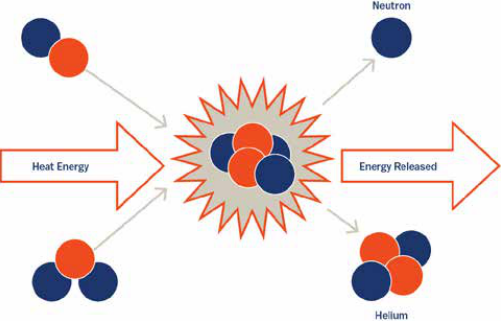
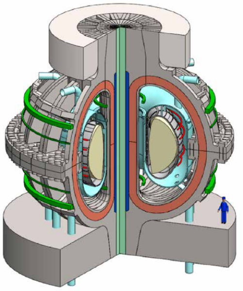
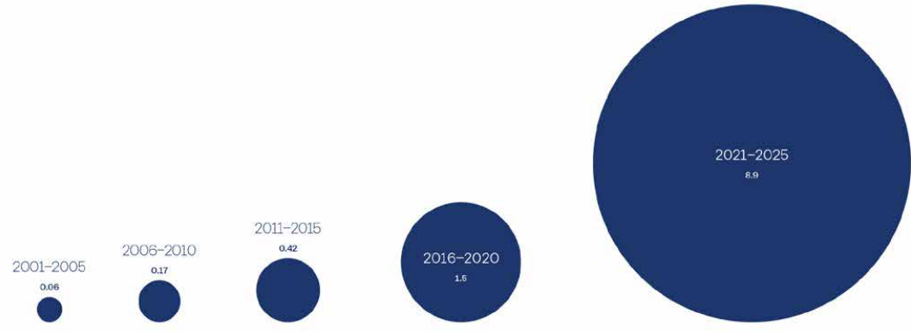
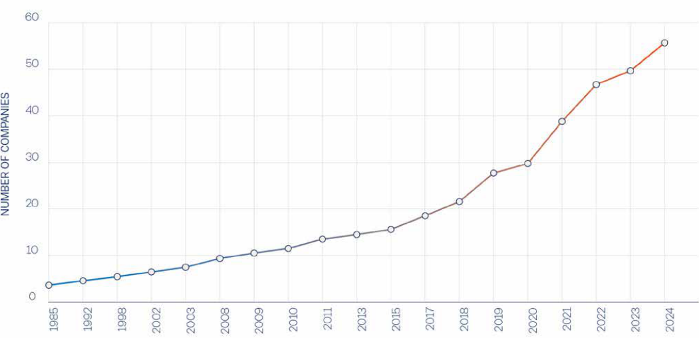

DIGEST | EMERGING TECH 

## Bringing Fusion Energy to the Grid: Challenges and Pathways 

## **OCTOBER 2025** 

Colby A. Snyder and Benjamin L. Schmitt 

## Bringing Fusion Energy to the Grid: Challenges and Pathways 

## **OCTOBER 2025** 

Colby A. Snyder and Benjamin L. Schmitt 

in basic fusion science suggest otherwise. The National Ignition Facility (NIF) continues to set new records for fusion energy yield in a laboratory setting, improving upon 2022’s scientific net energy gain milestone (LLNL 2022, 23). In addition to NIF’s laser experiments, superconducting magnet advances at MIT and subsequent private sector growth mean commercial fusion is closer than ever before (Chandler 2024, ITER 2023). 

The private sector has taken notice of this progress, with hyperscalers like Google and Microsoft signing power purchase agreements (PPAs) with fusion startups. However, several major challenges to commercializing fusion will require public–private cooperation and investment. For fusion to succeed on a climate-relevant timeline, policymakers should support fusion research and development as a national priority. 

**Figure 1:** Example of a Fusion Reaction Between Hydrogen Isotopes 

## Introduction: The Case for Fusion 

Despite progress in deploying renewables like solar and wind, about 65% of U.S. electricity still comes from fossil fuels (U.S. Energy Information Administration 2024). Fusion, the carbon-neutral process that powers the sun, offers a transformative alternative if technological and economic barriers are overcome (IAEA 2023). Standard deuterium–tritium fusion fuel can release millions of times more usable energy than an equivalent mass of fossil fuels—roughly 3x1014 J/ kg as compared to 3x107—and it even surpasses the energy density of uranium fission (World Nuclear Association 2024). 

While power plant components will require mediumterm radioactive waste management, the selflimiting nature of fusion plasmas makes fission-style meltdowns impossible (EIA 2024; IAEA 2023). If technologically realized, fusion could provide baseload electricity without operational carbon emissions, support rising energy demands from artificial intelligence, and promote domestic energy security. 

Fusion energy is often mocked as a technology perpetually 30 years away, but recent breakthroughs 

The reaction results in the release of helium, a neutron, and kinetic energy. 

Source: Stallard 2022 

## Fusion as a Baseload to Intermittent Renewables 

Existing renewables, like solar, wind, and hydroelectric, are excellent answers to some of our energy challenges. However, these technologies have fundamental limitations preventing them from providing a complete 

solution. The hourly and seasonal variability of the sun, wind, and water means renewables might not produce energy when needed, or they may stress the electricity grid during peak production. 

The availability of land also limits renewables (Lovering et al. 2022). Solar farms must either invest in pricey land near population centers or pay for grid infrastructure upgrades. Likewise, offshore wind faces financing challenges; and half of economically viable hydropower has already been tapped (NPR 2023; IEA 2021). 

**Figure 2:** Commonwealth Fusion System’s Proposed ARC Demonstration Power Plant 

This proposed power plant uses the tokamak reactor design. Plasma is confined in the innermost layer, superconducting toroidal field magnets are depicted in brown, and superconducting poloidal field magnets are in green. Person shown for scale. 

Source: Sorbom et al. 2015 

If technically realized in the coming years, fusion energy systems would share few of the issues of current alternative energy sources. Fusion can provide reliable baseload power with a relatively small geographic footprint, unlike intermittent wind, solar, and hydroelectric power. It’s often confused with nuclear fission power plants, but fusion doesn’t produce long-lived radioactive waste, and it presents no risk of a meltdown from exponential chain reactions (IAEA 2024). 

Most importantly, deuterium and tritium—the hydrogen isotopes most often proposed as feedstock for future fusion reactors—could be extracted from seawater and regenerated during the fusion fuel cycle, respectively. Tritium regeneration remains a critical technical challenge for economical fusion. With continued fuel cycle R&D, these hydrogen isotopes may meet humanity’s energy demand for millions of years (ITER 2024). 

## Fusion’s Rapid Growth 

## 1. New private funding is flowing into the fusion space 

After decades of fusion investment being limited to universities and national labs, private companies are finally raising significant capital to build first-of-a-kind (FOAK) power plants (Dean 2004). According to the Fusion Industry Association (FIA), 53 private fusion startups have attracted $9.7 billion in total investment (private plus public) to date. In an optimistic scenario, their success could realize a $40 trillion market for fusion energy (FIA 2025; Bloomberg 2021). 

These companies vary in their approaches and technological maturity, but the diverse set of approaches to fusion increases the likelihood that one will prove successful. Notably, more than two-thirds of fusion startups were founded within the past decade. However, companies estimate over $77B more is required to reach commercialization. This influx of private funding activity enables rapid technological progress, but it also intensifies an urgent need for new regulatory support. 

**Figure 3:** Cumulative Private Fusion Funding ($ Billion) Over Time 

Source: _FIA 2025_ ; _McKinsey_ 2022 

**Figure 4:** Number of Private Fusion Companies, 1985–2025 

Source: FIA 2025 

2. Fusion funding supports multiple technological approaches, increasing the probability of success 

The best-funded approach to harness fusion energy is magnetic confinement fusion (MCF), which works by magnetically compressing a plasma within a reactor 

for a relatively long period of time. The most common MCF reactor design is the donut-shaped tokamak, but other designs like the stellarator and the field-reversed configuration also exist (ITER 2024; U.S. Department of Energy 2019, 24). 

The recent breakthroughs in high-temperature superconducting magnets have increased the viability of MCF, with the FIA listing 25 startups in the space (Chandler 2024). Commonwealth Fusion Systems (CFS), an MIT spinoff that has received nearly $3 billion in funding, aims to deliver power to the grid in the early 2030s (CFS 2025). 

However, MCF still faces major technological challenges. Few materials can withstand the constant bombardment of neutrons that would be found in a tokamak operating at full capacity. Additionally, the same principle that makes fusion safe makes it challenging: sustaining the fragile fusion plasma to produce steadystate power can be difficult. 

A second approach, inertial confinement fusion (ICF), has been responsible for recent scientific breakthroughs, from decades of research at the University of Rochester’s Laboratory for Laser Energetics (UR-LLE) to the recent groundbreaking advances on the NIF experiment (LLNL 2022, LLE 2010). ICF involves compressing small, cryogenically cooled fuel pellets over a much shorter duration than MCF using powerful laser beams or other energy sources. 

This short confinement time creates new issues. To produce net electricity, an ICF power plant would need to ignite pellets many times per second, which is a dizzying engineering challenge (Anderson 2024). 

Despite these hurdles, the FIA lists 11 startups, including Pacific Fusion and Focused Energy, that are pursuing inertial approaches. 

## 3. Congress has successfully implemented a new regulatory framework for fusion under the ADVANCE Act. 

The bipartisan Accelerating Deployment of Versatile, Advanced Nuclear for Clean Energy (ADVANCE) Act, passed on July 9, 2024, includes the Fusion Energy Act, which allows fusion to sidestep the harsh limitations placed on fission technologies (FIA 2024; U.S. Congress, Senate 2024; Zhang 2024). It codifies the Nuclear Regulatory Commission’s earlier decision to place fusion energy systems under the same regulatory framework as particle accelerators, streamlining the path to grid deployment. Without this, fusion could be subject to the costly, time-intensive approval processes that were developed in the wake of fission energy incidents (NRC 2022). 

Neutrons from fusion reactions can activate reactor components, which must be responsibly stored after decommissioning (Gonzalez de Vicente et al. 2022). Nevertheless, the Fusion Energy Act recognizes that fusion can produce nuclear energy without long-lived nuclear waste or the threat of meltdown, reducing regulatory uncertainty and paving the way for future investment. 

**Table 1:** Fusion Industry by Plasma Confinement Approach 

## Fusion’s Greatest Challenges 

Despite the recent influx of capital to the fusion ecosystem and fusion’s bipartisan government support, sustained effort will be required to bring the technology to market. Increased investment in the fusion workforce and research infrastructure, progress towards a competitive levelized cost of energy (LCOE), and widespread public education on fusion must occur before fusion power plants can be developed at scale. 

## 1. Public funding for R&D facilities and workforce development 

Private startups are driving fusion towards the grid, but profitability pressures limit their focus to nearterm challenges. Developing a mature fusion industry in the U.S. will require fusion R&D facilities to pursue long-term questions that private companies cannot. It will also need an expansive fusion workforce to design, construct, and operate many new power plants. However, the imbalance between private and public investment—public funding represents currently undermines that goal. 

Scientific user facilities can enable academia and industry alike to collect experimental data without building their own reactor-scale labs, but only if they represent real fusion power plant conditions. Fusionrelevant heat fluxes, neutron energies, and durations require building a fusion device first, which is infeasible for most individual institutions. 

_-_ Historically, facilities like the _UR LLE National Laser ’ - Users Facility_ (NLUF) program, the _DIII D National Fusion Facility_ , and Princeton’s _National Spherical Torus Experiment_ have enabled hundreds of users to conduct experiments not possible at their home institutions, diffusing knowledge while harnessing national scientific ingenuity (U.S. Department of Energy 2024). As private companies construct their own prototype fusion devices, private–public partnerships could secure their use for open-access science. 

Domestic R&D capabilities also hinge upon the availability of talented scientists and engineers to support each step of fusion commercialization. While many universities have plasma and fusion programs, 

few are large enough to provide a comprehensive fusion education. For each school with a listed fusion program, the median number of fusion faculty is 2, while the corresponding metric for nuclear fission programs is 16.5 (Whyte et al. 2023). 

Paradoxically, increased funding for fusion may be weakening nuclear departments nationwide by attracting top graduate students and researchers toward industry instead of academia. To support the growing fusion ecosystem, the number of faculty at nuclear engineering programs and the resources of each program must be increased, which will benefit both research and instruction. 

Expanding faculty positions would have cascading benefits on course offerings, graduate student mentorship, opportunities for undergraduates, and research progress itself. More faculty would help develop a strong fusion research ecosystem at a greater number of universities and national labs, where future talent can be developed through hands-on experience (Whyte et al. 2023). 

Training a workforce for a new industry cannot happen overnight. To meet the needs of the growing fusion industry, these opportunities for students should be expanded as soon and as broadly as possible. 

Private funding alone will not build R&D infrastructure at universities and national laboratories, and it will not prop up the academic ecosystem required to develop a fusion workforce. The current fusion investment landscape stimulates startup activity without strengthening the academic foundation needed to sustain industry. 

Instead, pairing private investments with increased public funding is of critical importance. This public investment, in turn, would clear future roadblocks for the private fusion industry, accelerating the timeline for deployment. Public–private fusion partnerships have accelerated globally, with the UK government recently announcing £2.5 billion to be invested in fusion over the next five years (U.K. Atomic Energy Authority 2025). Now, Congress should ensure the nascent fusion industry thrives in America by allocating public funds to research infrastructure and fusion-relevant training. 

## 2. Engineering a cost-competitive fusion power plant 

Connecting a first-of-a-kind fusion reactor to the grid is only one step toward commercialization. Once a technological proof-of-concept is successful, successive reactors must become cost-competitive with today’s most economical energy technologies: combined-cycle gas turbines (CCGT) and utility-scale solar farms (Schwartz et al. 2023). 

Despite the abundance and extreme energy density of fusion fuel, fusion plants will face high upfront capital costs, making low-cost power difficult in the industry’s infancy. The LCOE of utility-scale solar PV farms ranges from $0.03 to $0.09 per kWh), and that of natural gas power plants is only slightly higher (Lazard 2024). Initial attempts at fusion plants may exceed $0.15 per kWh, which will only significantly decrease once several technical pain points are addressed (Lindley et al. 2023). 

One of fusion’s largest technological and economic challenges is designing materials compatible with fusion plasma environments, which are unlike anywhere else on Earth (Knaster et al. 2016). Few materials can survive these harsh conditions, so inadequate plasma-facing components could require replacement every few years. 

Moreover, some presently-used materials contaminate the plasma, reducing efficiency, and others absorb precious unreacted tritium. Each of these risks imperils power plant economics. Given the historically long timelines for materials development, advanced materials should be pursued as a top priority today (King 2018). 

Even more critically, the fusion fuel cycle, which will ensure recovery and regeneration of tritium, has yet to be fully engineered. Tritium, one of two fusion fuel inputs, is more reactive than alternative fuels, but its 12.3-year half-life means it does not exist in significant quantities naturally (Nuclear Engineering International 2025). 

Instead, it is produced by 30 CANDU-style fission reactors globally, which in total generate less than four kilograms of tritium per year (Canadian Nuclear Association 2025). Until the fuel cycle is closed in an operational power plant, tritium availability could throttle fusion development. 

The U.S. could mitigate this risk by strengthening domestic tritium production, like the Watts Bar reactors in Tennessee, and allocating the tritium for fusion energy development (Federation of American Scientists 2024). This would ensure prototype reactors in the U.S. will not be stalled by fuel availability. 

Fusion economics will also be limited by the ability of new supply chains to sustain private-sector growth. The fusion industry will require specialized components that don’t yet have well-established supply chains, like superconducting cables and the aforementioned advanced materials (FIA 2023), and shortages of these components would delay development and inflate costs. 

As companies strive to meet investor expectations and utility demand, suppliers will need to scale up rapidly to support them. For suppliers, this is a risky bet on the emerging fusion market. More likely, they will wait for fusion demonstration plants to succeed before expanding their operations. 

After successful power demonstrations, however, the diversity of fusion reactor designs could create standardization issues. As evidenced by France’s successful nuclear fission development, standardizing reactor designs can drive down the costs of components and the resulting electricity (World Nuclear Association 2025). As specific designs emerge as leaders in the commercial fusion race, government regulation can support the industry 

Of course, the value that fusion provides extends far beyond a price at the meter. Unlike renewables, fusion will provide reliable baseload power that reduces the costs associated with managing intermittency. By eliminating the need for high volumes of imported fuel, fusion supports domestic energy security, and it also offers a less carbon-intensive alternative to today’s baseload technologies. 

Nevertheless, the price of building early fusion plants could diminish their impact on the energy landscape, so these costs must be minimized to accelerate largescale deployment. Aggressively supporting advanced materials, establishing domestic tritium sources, and standardizing supply chains would be strong federal policy interventions. 

## 3. Addressing disinformation and fostering public acceptance 

Fusion energy does not face the same catastrophic safety risks as fission, and it is crucial that the public recognize this. High-profile nuclear fission accidents and nuclear weapons shape public perceptions. Policymakers and the public often conflate these risks with fusion, creating a false equivalence. Decades of fission regulation show that public acceptance is essential for deploying new energy technologies. 

Even though fusion will not produce high-level radioactive waste—in fact, irradiated components could eventually be recycled— fusion will face scrutiny due to the high-profile fission accidents of recent memory (ITER 2024). This scrutiny must be addressed by scientists, journalists, and policymakers to combat disinformation and increase public understanding. 

Disinformation about fusion is widespread. If left unaddressed, it could undermine public funding (van Lierop 2021). Commonly-held misconceptions include the beliefs that fusion reactors can “melt down” like fission reactors, that fusion produces high-level radioactive waste, and that fusion systems will lead to nuclear proliferation (Gupta et al. 2024). Scientific and political communications should correct these beliefs clearly but graciously to avoid alienating members of the public. 

From fusion companies themselves, overly optimistic corporate press releases risk misleading stakeholders. In the race to secure venture funding and government grants, fusion startups may make aspirational claims about their progress and timelines for deployment (Gupta et al. 2024). 

These claims may excite in the short term. However, when startups miss their targets, they erode trust in all fusion institutions and reinforce the old “decades away” critique (Mumgaard 2024). Fusion companies and investors must take responsibility for maintaining trust in the science or risk losing long-term support. 

For populations that have not been exposed to disinformation, the difference between fission and fusion can be explained to promote a robust understanding. This group includes not only students 

but also policymakers, other stakeholders, and the general public who are new to the topic and can support the rise of fusion technology. 

Therefore, fusion communication strategies should be appropriate for broad audiences. Explaining the physical distinction between fusion and fission to all stakeholders will be challenging, especially since nuclear physics education is rare at all levels, but it is one of the key challenges in bringing fusion to the grid. 

## Recommendations: A Fusion-Powered Future for Humanity 

In recent years, investors and policymakers have demonstrated increased optimism about fusion energy. The G7 Climate, Energy and Environment Minister’s Communiqué recently established a “working group to support multinational cooperation… to realize fusion as an energy source” (University of Pennsylvania 2024). However, government pledges to support fusion commercialization, like the 2022 White House fusion summit and COP28’s Fusion Energy Task Force, conspicuously lack aggressive R&D budgets (White House 2022; IAEA 2023). Critics may argue that fusion is a risky, long-term investment that isn’t ready for major public investment, but its R&D demands are exactly why fusion funding is important. Fusion progress stalled for decades under unstable public funding, and support remains limited today. The millions allocated to fusion pale in comparison to subsidies for other renewables, like multibillion-dollar solar tax credits (Reuters 2023), that were provided before the One Big Beautiful Bill Act. To accelerate progress today, policymakers should focus their efforts on fusion’s key challenges. 

## **Support R&D Facilities and Workforce Development** 

Universities and other public institutions require increased funding to advance foundational fusion research while educating and training a new workforce. Funds for these purposes are already available via the CHIPS and Science Act, which authorizes support for 

non-semiconductor technologies including advanced energy technologies (White House 2022). 

For example, $10 billion is authorized for “regional innovation and technology hubs”—exactly what is needed for fusion—and much of this funding is still available. Congress can support the first key fusion challenge by appropriating available CHIPS and Science funds, ensuring that the U.S. remains a leader in the race to bring fusion energy to the grid. 

In addition to these new funds, the Department of Energy should continue to support the catalytic Milestone-Based Fusion Development Program, which committed $46 million of federal funding to fusion companies. Sustaining these federal initiatives will help the fusion industry pursue R&D with longer time horizons, like fuel cycle engineering and advanced materials, that private companies may struggle to address otherwise. 

## **Improve Fusion Economics** 

Capital costs for future fusion power plants must decrease, the fuel cycle must be closed, and standard fusion supply chains must be established. Policymakers can support these goals by securing access to critical materials for fusion, like tritium and rare earth elements for superconducting magnets (White House 2022). 

The ADVANCE Act includes a requirement for a study on nuclear energy supply chains, but it does not explicitly mention fusion (U.S. Congress, Senate 2024). Expanding this requirement to add a parallel study for fusion supply chains would be an appropriate first step in improving economic viability and preventing catastrophic supply chain disruptions. 

## **Address Disinformation** 

Stakeholders involved in fusion energy, which include the energy-consuming public in addition to governments, research institutions, and corporations, must be educated on the distinction between fusion and fission. Policymakers can help fund and publicize these 

efforts, which can happen at all levels of education and even beyond the classroom. The federal government is also responsible for involving communities in fusion development via Community Benefit Plans, and continuing this involvement will help spread awareness about fusion technology (Nehl 2023). 

## Conclusion 

As the clean energy transition matures, it’s important to direct government funding toward fusion, which isn’t yet commercially viable but has the potential to transform global energy markets. Solar and wind power have become cost competitive as they’ve matured, so public funds would be better spent on socially beneficial research that can’t yet support itself (United Nations 2024). 

Cutting-edge energy solutions like fusion must be prioritized in the U.S. energy strategy. By supporting the upstream fusion research ecosystem today with precisely targeted interventions, policymakers across the world will accelerate the arrival of a net-zero, energy-secure future. 

## Bibliography 

Barbarino, Matteo. 2023. “What Is Nuclear Fusion?” IAEA. August 3. _https://www.iaea.org/ newscenter/news/what-is-nuclear-fusion_ . 

_Bloomberg_ . 2024. “Nuclear Fusion Market Could Achieve a $40 Trillion Valuation.” Bloomberg Professional Services. _https://www.bloomberg.com/professional/insights/trading/nuclearfusion-market-could-achieve-a-40-trillion-valuation/_ . Canadian Nuclear Association. 2025. “How a Nuclear Reactor Works.” _https://cna.ca/ reactors-and-smrs/how-a-nuclear-reactorworks/_ . 

Chandler, David L. 2024. “Tests Show High-Temperature Superconducting Magnets Are Ready for Fusion.” MIT News. _https://news.mit.edu/2024/tests-show-high-temperaturesuperconducting-magnets-fusion-ready-0304_ . 

Chyong, Chi-Kong and David Newbery. 2023. “Can Fusion Energy Be Cost-Competitive and Commercially Viable? An Analysis of Magnetically Confined Reactors.” _Energy Policy_ 156: 112–130. _https://www.sciencedirect.com/science/article/abs/pii/S0301421523000964_ . Commonwealth Fusion Systems. 2024. “About Us.” Commonwealth Fusion Systems. _https:// cfs.energy/_ . 

Dean, Stephen. 2004. “U.S. Fusion Energy Policy.” Fusion Power Associates. _https://fire. pppl.gov/Dean_US_fusion_TOFE_2004.pdf_ . 

Economic Development Administration. 2025. “Regional Technology and Innovation Hubs (Tech Hubs).” U.S. Department of Commerce. _https://www.eda.gov/funding/programs/ regional-technology-and-innovation-hubs_ . 

EIA. 2023. “Frequently Asked Questions: What Is the Role of Renewable Energy Consumption in the United States?” U.S. Energy Information Administration. _https://www. eia.gov/tools/faqs/faq.php?id=97&t=3_ . 

Reuters. 2023. “U.S. Doubles Renewable Subsidies to $156 Billion in the Last Seven Years.” _Reuters_ , August 2. _https://www.reuters.com/business/energy/us-doubles-renewablesubsidies-156-billion-last-seven-years-eia-2023-08-02/_ . 

Federation of American Scientists. 2024. “Promoting Fusion Energy Leadership with U.S. Tritium Production Capacity.” _https://fas.org/publication/fusion-energy-leadership-tritium-capacity/_ . Fusion Energy Sciences Advisory Committee. 2024. _Fusion Community Planning Report_ . _https://science.osti.gov/-/media/fes/fesac/pdf/2024/FCP_REPORT-mk4.pdf_ . Fusion Industry Association (FIA). 2023. _FIA Supply Chain Report 2023_ . Fusion Industry Association. _https://www.fusionindustryassociation.org/wp-content/uploads/2023/05/FIASupply-Chain-Report_05-2023.pdf_ . 

Schwartz, Jacob A., Wilson Ricks, Egemen Kolemen, and Jesse D. Jenkins. 2023. “The Value of Fusion Energy to a Decarbonized United States Electric Grid.” _Joule_ 7(4), 675–699. _https://doi.org/10.1016/j.joule.2023.02.006_ . 

SLAC. 2024. “SLAC Scientists Explain What Inertial Fusion Energy Is.” SLAC National Accelerator Laboratory, February 21. _https://www6.slac.stanford.edu/news/2024-02-21slac-scientists-explain-what-inertial-fusion-energy_ . 

Fusion Industry Association. 2025. _2025 Global Fusion Industry Report_ . Fusion Industry Association. _https://www.fusionindustryassociation.org/wp-content/ uploads/2025/07/2025-Global-Fusion-Industry-Report.pdf_ . 

Sorbom, Brandon N., et al. 2015. “ARC: A Compact High-Field Fusion Nuclear Science Facility and Demonstration Power Plant with Demountable Magnets.” _Fusion Engineering and Design_ 100: 378–405. _https://doi.org/10.1016/j.fusengdes.2015.07.008_ . 

Fusion Industry Association. 2024. “US Senate Passes ADVANCE Act, Including Legislation to Codify US Fusion Regulations.” Fusion Industry Association. _https://www. fusionindustryassociation.org/us-senate-passes-advance-act-including-legislation-tocodify-us-fusion-regulations/_ . 

Stallard, Esme. 2022. “Nuclear Fusion Breakthrough—What Is It and How Does It Work?” _BBC News_ Climate and Science. _https://www.bbc.com/news/science-environment-63957085_ . U.K. Atomic Energy Authority. 2025. “Major Funding Milestone for World-First Prototype Fusion Plant.” _https://www.gov.uk/government/news/25-billion-for-world-first-prototypefusion-energy-plant_ . U.S. Congress. Senate. 2024. Fusion Energy Act of 2024. S. 4151. 118th Cong., 2nd sess. Introduced April 17, 2024. _https://www.congress.gov/bill/118th-congress/senate-bill/4151_ . U.S. Department of Energy. 2024. “DIII-D National Fusion Facility.” _https://science.osti.gov/ fes/Facilities/User-Facilities/DIII-D_ . 

Gupta, Kuhika, Hank Jenkins-Smith, Joseph Ripberger, Christopher Silva, Aaron Fox, and William Livingston. 2024. “Americans’ Views of Fusion Energy: Implications for Sustainable Public Support.” _Fusion Science and Technology_ : 1–17. _https://doi.org/10.1080/15361055.2 024.2328457_ . 

Gonzalez de Vicente, Sehila M., Nicholas A. Smith, Laila El-Guebaly, Sergio Ciattaglia, Luigi Di Pace, Mark Gilbert, Robert Mandoki, Sandrine Rosanvallon, Youji Someya, Kenji Tobita, and David Torcy. 2022. “Overview on the Management of Radioactive Waste from Fusion Facilities: ITER, Demonstration Machines and Power Plants.” _Fusion Energy_ 62 (8): 1–20. _https://doi.org/10.1088/1741-4326/ac62f7_ . 

U.S. Department of Energy. 2024. “National Spherical Torus Experiment.” _https://science. osti.gov/fes/Facilities/User-Facilities/NSTX-U_ . 

IAEA. 2023. “Frequently Asked Questions: Fusion Energy.” IAEA. _https://www.iaea.org/ topics/energy/fusion/faqs_ . 

U.S. Department of Energy. 2024. “DOE Explains Stellarators.” _https://www.energy.gov/ science/doe-explainsstellarators_ . 

IAEA. 2024. “IAEA Opens Fusion Energy Discussion at COP28 as Momentum Keeps Growing.” IAEA. _https://www.iaea.org/newscenter/news/iaea-opens-fusion-energydiscussion-at-cop28-as-momentum-keeps-growing_ . IEA. 2021. Hydropower Special Market Report. Paris: International Energy Agency. _https:// www.iea.org/reports/hydropower-special-market-report_ . License: CC BY 4.0. 

U.S. Department of Energy. 2024. “Fusion’s Path to Practicality.” _https://www.energy.gov/ science/articles/fusions-path-practicality_ . 

U.S. Department of Energy. 2024. “Small Fusion Experiment Hits Temperatures Hotter than the Sun’s Core.” _https://www.energy.gov/science/fes/articles/small-fusion-experiment-hitstemperatures-hotter-suns-core_ . 

ITER. 2023. “Fusion Science: Understanding the Power of the Sun.” ITER. _https://www.iter. org/sci/Fusion_ . 

U.S. Department of Energy. 2025. “U.S. Department of Energy Announces Selectees for $107 Million Fusion Innovation Research Engine Collaboratives, and Progress in Milestone Program Inspired by NASA.” _https://www.energy.gov/articles/us-department-energyannounces-selectees-107-million-fusion-innovation-research-engine_ . U.S. Energy Information Administration. 2024. “U.S. Energy Facts Explained.” _https://www. eia.gov/energyexplained/us-energy-facts/_ . 

ITER. 2023. “The Tokamak: The Heart of ITER.” ITER. _https://www.iter.org/mach/Tokamak_ . 

King, Alexander. 2018. “Faster: Accelerating the Transition from Materials Discovery to Commercial Deployment.” JOM 70 (12): 2703–2710. _https://link.springer.com/ article/10.1007/s11837-018-3291-4_ . 

Knaster, Juan, Alexander Moeslang, and Toshiteru Muroga. 2016. “Materials Research for Fusion.” Nature Physics 12: 424–434. _https://doi.org/10.1038/nphys3735_ . Lazard. 2024. “Levelized Cost of Energy+.” Lazard. _https://www.lazard.com/researchinsights/levelized-cost-of-energyplus/_ . 

U.S. Nuclear Regulatory Commission. 2024. “Backgrounder: Three Mile Island Accident.” U.S. NRC. _https://www.nrc.gov/reading-rm/doc-collections/fact-sheets/3mile-isle.html#impact_ . United Nations. 2024. “Renewables Are the Cheapest Form of Power.” UN Climate Change. _https://www.un.org/en/climatechange/renewables-cheapest-form-power_ . 

LLE. 2010. “Around the Lab: Highlighting the History of the LLE.” University of Rochester Laboratory for Laser Energetics. _https://www.lle.rochester.edu/highlighting-the-history-of-the-lle/_ . LLNL. 2023. “Age of Ignition: The Dawn of a New Era in Fusion Energy.” Lawrence Livermore National Laboratory. _https://lasers.llnl.gov/sites/lasers/files/2023-06/Age_of_Ignition.pdf_ . LLNL. 2023. “Fusion Ignition Breakthrough Hailed as One of the Most Impressive Scientific Feats of the 21st Century.” Lawrence Livermore National Laboratory. _https://www.llnl. gov/article/49301/shot-ages-fusion-ignition-breakthrough-hailed-one-most-impressivescientific-feats-21st_ . 

University of Pennsylvania. 2024. “Global Energy Experts at Penn Respond to G7 Coal Phaseout.” Perry World House at the University of Pennsylvania. _https://global.upenn.edu/ perryworldhouse/news/global-energy-experts-penn-respond-g7-coal-phaseout_ . Van Lierop, Wal. 2021. “Stop Misinformation from Blocking the Rollout of Fusion Energy.” _Forbes_ , May 25. _https://www.forbes.com/sites/walvanlierop/2021/05/25/stopmisinformation-from-blocking-the-rollout-of-fusion-energy/_ . 

Washington Post. 2023. “New IPCC Climate Change Report Released.” _Washington Post_ , March 20. _https://www.washingtonpost.com/climate-environment/2023/03/20/climatechange-ipcc-report-15/-ipcc-report-15/ipcc-report-15/-report-15/report-15/-15/15/_ . 

Lovering, Jessica, Michael Swain, Linus Blomqvist, and Raúl R. Hernandez. 2022. “Land-use _change-ipcc-report-15/-ipcc-report-15/ipcc-report-15/-report-15/report-15/-15/15/_ . Intensity of Electricity Production and Tomorrow’s Energy Landscape.” PLOS ONE 17 (7): e0270155. _https://doi.org/10.1371/journal.pone.0270155_ . Whyte, Dennis, Carlos Paz-Soldan, and Brian Wirth. 2024. “The Academic Research Ecosystem Required to Support the Development of Fusion Energy.” _Physics of Plasmas_ 30 McKinsey. 2023. “Will Fusion Energy Help Decarbonize the Power System?” McKinsey & (9). _https://pubs.aip.org/aip/pop/article/30/9/090604/2913878_ . Company. _https://www.mckinsey.com/industries/electric-power-and-natural-gas/ourinsights/will-fusion-energy-help-decarbonize-the-power-system_ . World Nuclear Association. 2020. “Heat Values of Various Fuels.” World Nuclear Association Information Library. _https://world-nuclear.org/information-library/facts-and-figures/heat-_ MIT News. 2024. “Tests Show High-Temperature Superconducting Magnets Are Fusion _values-of-various-fuels?_ Ready.” _MIT News_ , March 4. _https://news.mit.edu/2024/tests-show-high-temperaturesuperconducting-magnets-fusion-ready-0304_ . World Nuclear Association. 2024. “Nuclear Fusion Power.” World Nuclear Association Information Library. _https://world-nuclear.org/information-library/current-and-future-_ Mumgaard, Bob. 2024. “Building Trust in Fusion Energy.” Commonwealth Fusion Systems. _generation/nuclear-fusion-power? https://cfs.energy/news-and-media/building-trust-in-fusion-energy_ . World Nuclear Association. 2025. “Nuclear Power in France.” _https://world-nuclear.org/_ Nehl, Colleen, Scott Hsu, Chris Gunn, and Yasmin Yacoby. 2023. “American Physical Society _information-library/country-profiles/countries-a-f/france_ . Meeting: Fusion Energy Innovations.” NASA Astrophysics Data System. _https://ui.adsabs. harvard.edu/abs/2023APS..DPPUO5009N/abstract_ . 

NPR. 2023. “Offshore Wind in the U.S. Hit Headwinds in 2023. Here’s What You Need to Know.” _NPR_ , December 27. _https://www.npr.org/2023/12/27/1221639019/offshore-wind-inthe-u-s-hit-headwinds-in-2023-heres-what-you-need-to-know_ . Nuclear Engineering International. 2025. “Answering the Big Tritium Question.” _https://www. neimagazine.com/analysis/answering-the-big-tritium-question/_ . 

## About the Authors 

**Colby A. Snyder** is an undergraduate studying physics and chemical engineering in the Vagelos Integrated Program in Energy Research. Snyder was also a 2024 undergraduate student fellow at the Kleinman Center. 

**Benjamin L. Schmitt** is a senior fellow at the University of Pennsylvania, where he holds a joint academic appointment with the Department of Physics and Astronomy and the Kleinman Center for Energy Policy. He is also a senior fellow at Perry World House. 

Cover Photos: istock.com/Filipp Borshch; istock.com/eugenesergeev 

## _Stay up to date with all of our research._ 

kleinmanenergy.upenn.edu 

University of Pennsylvania Stuart Weitzman School of Design Fisher Fine Arts Building, Suite 401 220 S. 34th St. Philadelphia, PA 19104 **P** 215.898.8502 **F** 215.573.1650 kleinmanenergy@upenn.edu 

