Contents lists available at ScienceDirect 

## Renewable and Sustainable Energy Reviews 

journal homepage: http://www.elsevier.com/locate/rser 

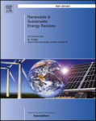

## Economics and finance of Small Modular Reactors: A systematic review and research agenda 

## B. Mignacca, G. Locatelli[* ] 

_School of Civil Engineering, University of Leeds, LS2 9JT, United Kingdom_ 

A R T I C L E I N F O A B S T R A C T _Keywords:_ The interest toward Small Modular nuclear Reactors (SMRs) is growing, and the economic competitiveness of Small modular reactor SMRs versus large reactors is a key topic. Leveraging a systematic literature review, this paper firstly provides an SMR overview of “ _what we know_ ” and “ _what we do not know_ ” Economics about the economics and finance of SMRs. Secondly, the paper develops a research agenda. Several documents discuss the economics of SMRs, highlighting how the size Finance Modularisation is not the only factor to consider in the comparison; remarkably, other factors (co-siting economies, modularModularity isation, modularity, construction time, etc.) are relevant. The vast majority of the literature focuses on economic and financial performance indicators (e.g. Levelized Cost of Electricity, Net Present Value, and Internal Rate of Return) and SMR capital cost. Remarkably, very few documents deal with operating and decommissioning costs or take a programme (and its financing) rather than a “single project/plant/site” perspective. Furthermore, there is a gap in knowledge about the cost-benefit analysis of the “modular construction” and SMR decommissioning. 

## **1. Introduction** 

The International Atomic Energy Agency [1] defines Small Modular Reactors (SMRs) as “ _newer generation [nuclear] reactors designed to generate electric power up to_ 300 MW _, whose components and systems can be shop fabricated and then transported as modules to the sites for installation as demand arises_ ” (Page 1). [2] provides a summary of the innovative features of SMRs and describes SMRs as “ _reactor designs that are deliberately small, i.e. designs that do not scale to large sizes but rather capitalize on their_ ”. Several SMR _smallness to achieve specific performance characteristics_ designs, detailed in Refs. [1,3–5], are currently at different stages of development. SMR designs relate to virtually all the main reactor categories: water-cooled reactors, high-temperature gas-cooled reactor, liquid-metal, sodium and gas-cooled reactors with fast neutron spectrum, and molten salt reactors [1,4]. The interest in SMRs is growing mainly because of the SMR unique characteristics (in primis size and modular construction) and different applications (electrical, heat, hydrogen production, seawater desalination) [1]. 

Several documents consider the size as one of the main SMR disadvantages [6–9] in the evaluation of SMR competitiveness with respect to Large Reactors (LRs) because of the loss of the economy of scale. However, the size is not the only factor to consider in the evaluation of SMR competitiveness versus LRs. SMRs present unique benefits mostly 

determined by modularisation and modularity. Modularisation (factory fabrication of modules, transportation and installation on-site [10]) allows working in a better-controlled environment [8,11,12], standardisation and design simplification [13,14], reduction of the construction time [15]. Modularity (a plant built by the assembly of nearly identical reactors of smaller capacity [16]) allows the co-siting economies [7,12,17,18], cogeneration for the load following of Nuclear Power Plants (NPPs) [19], higher and faster learning, and better adaptability [20]. 

Once all the aforementioned factors are considered, it is possible to evaluate the SMR economic and financial competitiveness properly. Economic and financial issues represent key barriers for SMR development (as well as LRs) and are of the main reasons because no one “truly modular” SMR has been built so far. Since this paper deals with economics and financial aspects of SMRs, it is worth to clarify these concepts right at the start. Economics is a social science concerned with the study of management of goods and services, comprising production, consumption, and the elements affecting them [21,22]. Usually, economic models do not consider the payment of taxes, remuneration of debt or equity, or debt amortisation. The Levelised Cost of Electricity (LCOE) is a common metric used in economic studies in the energy sector. 

On the other hand, finance is concerned with managing funds by taking account of time, financial resources and the risk involved. The 

* Corresponding author. 

_E-mail address:_ g.locatelli@leeds.ac.uk (G. Locatelli). 

https://doi.org/10.1016/j.rser.2019.109519 Received 8 July 2019; Received in revised form 27 September 2019; Accepted 22 October 2019 

Available online 1 November 2019 

1364-0321/© 2019 The Authors. Published by Elsevier Ltd. This is an open access article under the CC BY license (http://creativecommons.org/licenses/by/4.0/). 

## **List of abbreviations** 

aim is to balance risk and profitability. In the energy sector, a financial model is concerned with the analysis of cash flows for both debt and equity holder, establishing a remuneration of the capital according to different risk attitudes. Financial models consider additional stakeholders since financial models deal with the payment of taxes and/or subsidies (so are relevant for a government), raising debt (so relevant for debt providers such as banks and export credit agencies), and equity (so relevant for project developers) [21,22]. Payback Period (PP), Net Present Value (NPV), and Internal Rate of Return (IRR) are metrics commonly used in financial studies. 

Economics and finance are two sides of the same coin, and the appraisal of a certain technology needs to consider both. Consequently, both economic and financial studies are reviewed in this paper. 

The amount of documents published about SMR economics and finance so far is relatively large, the information is disorganised, and most of the quantitative studies do not follow a standardised approach, making a proper comparison in most of the cases impossible. This paper aims to provide, through a Systematic Literature Review (SLR), an overview of _what we know_ and _what we do not know_ about the economics and finance of “land-based” Small “Modular” Reactors. Therefore, studies about “Small Reactors” or “Floating Small Modular Reactors” are excluded. Instead of a traditional narrative review, an SLR has been performed to provide a holistic perspective and allow repeatability. The research objective is “to identify the state-of-the-art about economics and finance of land-based SMRs and the most relevant gap in ” knowledge . 

The rest of the paper is structured as follows: section 2 presents the methodology used to conduct the SLR; section 3 summarises “ _what we know_ ” and “ _what we do not know_ ” about SMR economics and finance, suggesting a research agenda; section 4 concludes the paper. 

## **2. Methodology** 

This paper provides an SLR combining the methodologies detailed in Refs. [23,24]. The selection process of the documents includes two sections. Section A deals with documents extracted from the scientific search engine Scopus, and section B deals with reports published by key stakeholders (e.g. International Atomic Energy Agency). 

Section A has three main stages. The first stage is the identification of relevant keywords related to the research objective. Several discussions with experts and several iterations led to this list: 

- SMRs: “ _small modular reactor_ ”, “ _small medium reactor_ ”. 

- Economics and finance: “ _economic_ ”, “ _economy_ ”, “ _cost_ ”, “ _finance_ ”, “ ” . 

- _financing_ 

- Construction: “ _construction_ ”, “ _modularisation_ ”, “ _modularization_ ”, “ ” “ ” “ ” “ ” _modularity_ , _fabrication_ , _prefabrication_ , _factory_ . 

- O&M: “ _operation_ ”, “ _operating_ ”, “ _maintenance_ ”, “ _O&M_ ”. 

- Decommissioning: “ _decommissioning_ ”, “ _end of life_ ”, “ _shut down_ ”, “r _emoval_ ”, “ _site restoration_ ”, “ _dismantling_ ”. 

SMR fuel cost is a relatively small percentage of the total cost [19, 25], and given the same technology, it is not differentiable between large and small reactors. Therefore, studies about the fuel cost are excluded from the analysis. 

In the second stage, strings with the Boolean operator *AND*/*OR* are introduced in Scopus: 

- 1) “ _small modular reactor_ ” OR “ _small medium reactor_ ” AND “ _economic_ ” OR “economy” OR “ _cost_ ” OR “ _finance_ ” OR “ _financing_ ” (search date: 11/01/2019). 

- 2) “ _small modular reactor_ ” OR “ _small medium reactor_ ” AND “ _modularization_ ” OR “ _modularisation_ ” OR “ _modularity_ ” OR “ _construction_ ” OR “ _fabrication_ ” OR “ _prefabrication_ ” OR “ _factory_ ” (search date: January 10, 2019). 

- 3) “ _small modular reactor_ ” OR “ _small medium reactor_ ” AND “ _operation_ ” OR “ _operating_ ” OR “ _O&M_ ” OR “ _maintenance_ ” (search date: 14/01/ 2019); 

- 4) “ _small modular reactor_ ” OR “ _small medium reactor_ ” AND “ _decommissioning_ ” OR “ _end of life_ ” OR “ _shut down_ ” OR “ _removal_ ” OR “ _site restoration_ ” OR “ _dismantling_ ” (search date: January 10, 2019). 

Scopus was chosen because of the scientific merit of the indexed literature. A timeframe was not selected a priori because all the documents have been published after 2004 (therefore it is 2004–2019). The selection step used the aforementioned strings (applied to title, abstract or keywords) and retrieved 763 documents (excluding 14 non-English documents). 

The third stage is the filtering characterised by the following two steps: 

- 1) A careful reading of the title and abstract of each document to filter out documents not related to the research objective or duplication. 

After the first step, 640 documents were removed leaving 123 documents. 

- 2) A careful reading of the introduction and conclusion of the 123 documents retrieved after the first step to filter out documents not related to the research objective. After the second step, 58 documents were removed, leaving 65 documents. 

The distribution of the final retrieved documents is: 

- SMR Economics and finance: 46 documents; 

- SMR Construction: 14 documents; 

- SMR O&M: 3 documents; 

- SMR Decommissioning: 2 documents. 

Considering the overlap of the documents (i.e. some documents are related to more than one search string), the total number of documents to be analysed is 52 (see the list in Appendix 1). Fig. 1 summarises the selection process for section A. 

In the selection process for section B, the documents were searched specifically on the IAEA (International Atomic Energy Agency) and NEA (Nuclear Energy Agency) websites (section: publications) excluding non-serial publications (i.e. lecture notes). IAEA and NEA were selected because they are two leading organisations in the nuclear field and publish high-quality reports. Three keywords related to SMRs were used to search documents: “SMR”, “Small” and “Modular” (search date: March 22, 2019). 

The distribution of the retrieved documents is: 

- - SMR : 5 (4 IAEA documents and 1 NEA document); 

- - Small : 136 (129 IAEA documents and 7 NEA documents); 

- - Modular : 13 (11 IAEA documents and 2 NEA documents). 

The filtering stage has the same two steps of section A. Fig. 2 shows the results. 

After the check for duplication, four documents are related to the research objective: [26–28], and [29]. 

Following discussions with stakeholders, other five documents were added: [30–33], and [34]. 

Most of the selected documents are published in journals (45.9%), and nine documents (14.75%) are published by organisations/companies/working groups. The remaining ones are conference papers: ICONE[1 ] (16.39%), ICAPP[2 ] (13.11%), SMR[3 ] (4.92%), ASEE[4 ] (1.64%), ICST[5 ] (1.64%), and one book (1.64%). 

The research objective “to identify the state-of-the-art about economics and finance of land-based SMRs and the most relevant gap in knowledge” determined the choice of information to retrieve from the selected documents. The main themes that emerged from the analysis of the selected documents determined the organisation of the information in the following sections. 

## **3. Economics and finance of SMRs** 

## _3.1. Introduction to the terms used in this paper_ 

This section provides a brief overview of the terms mainly used in the next sections. 

## _3.1.1. Life-cycle costs_ 

In the nuclear sector, the life-cycle costs (or generation costs) are commonly divided into four groups: capital cost, operation and maintenance costs, fuel cost, and decommissioning cost [9]. 

_3.1.1.1. Capital cost._ Capital cost is the sum of the “overnight capital cost” and the Interest During Construction (IDC) [35]. [10] defines the “overnight capital cost” as “ _the base construction cost plus applicable owner’ s cost, contingency, and first core costs. It is referred to as an overnight cost in the sense that time value costs (IDC) are not included_ ” (Page 25). [10] defines the “base construction cost” as “ _the most likely plant construction cost based on the direct and indirect costs only_ ” (Page 19). Examples of owner’s cost are land, site works, project management, administration and associated buildings [36]. Capital cost represents the biggest percentage of the life-cycle cost of a nuclear power plant, and typical values are in the region of 50–75% [8]. 

_3.1.1.2. Operation and maintenance costs._ Operation and maintenance (O&M) costs are the costs needed for the operation and maintenance of an NPP [37]. O&M costs include “ _all non-fuel costs, such as costs of plant staffing, consumable operating materials (worn parts) and equipment, repair and interim replacements, purchased services, and nuclear insurance. They also include taxes and_ fees _, decommissioning allowances, and miscellaneous costs_ ” [10] (Page 33). 

_3.1.1.3. Fuel cost._ The fuel cost is the sum of all activities related to the nuclear fuel cycle, from mining the uranium ore to the final high-level waste disposal [38]. Examples of activities related to the nuclear fuel cycle are the enrichment of uranium, manufacture of nuclear fuel, reprocessing of spent fuel, and any related research activities [39]. 

_3.1.1.4. Decommissioning cost._ The decommissioning cost includes: “ _all activities, starting from planning for decommissioning, the transition phase (from shutdown to decommissioning), performing the decontamination and dismantling and management of the resulting waste, up to the final remediation of the site_ ” [40] (Page 6). 

## _3.1.2. Indicators of economic and financial performance_ 

_3.1.2.1. Levelised unit of electricity cost/Levelised Cost of Electricity._ The levelized cost of the electricity for a power plant is usually termed “Levelised Unit Electricity Cost” (LUEC) or “Levelised Cost of Electricity (LCOE)”; it is one of the main indicators for policymakers. This indicator accounts for all the life cycle costs and is expressed in terms of energy currency, typically [$/kWh] [9,41,42]. 

_3.1.2.2. Net Present Value and Internal Rate of Return._ The most popular indicators to investigate the profitability of investing in a nuclear power plant are the Net Present Value (NPV) and the Internal Rate of Return (IRR) [9]. NPV measures the absolute profitability [$] and uses a discount factor to weight “present cost” versus the “future revenue” [43]. The discount factor depends on the source of financing and for many practical applications can be intended as the Weighted Average Cost of Capital (WACC). A low WACC gives similar weighting to present cost and future revenue (promoting capital-intensive plants, like NPP), while high WACC is weighted more towards the present cost respect to future revenues (promoting low capital cost solutions like gas plants). The IRR is a “specific dimensionless indicator”, i.e. the value of WACC that brings the NPV to zero. The greater the IRR, the higher is the profitability of the investment [9,44]. 

- 1 International Conference on Nuclear Engineering. 

- 2 International Congress on Advances in Nuclear Power Plants. 

- 3 ASME Small Modular Reactors Symposium. 

- 4 International Conference on Advances in Energy Systems and Environ- 

- mental Engineering. 

> 5 International Conference on Science and Technology. 

## _3.2. What we know_ 

- _3.2.1. Factors to be considered in the evaluation of SMR competitiveness_ This section summarises the key factors in the evaluation of SMR 

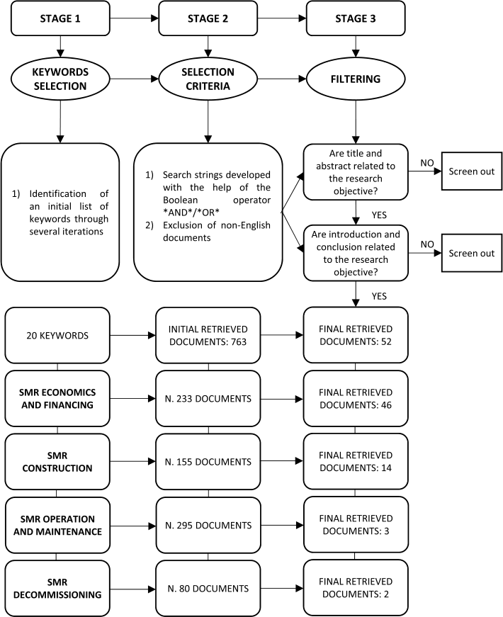

**Fig. 1.** Section A of the selection process - Framework adapted from Ref. [23]. 

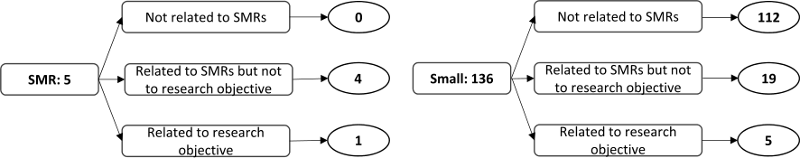

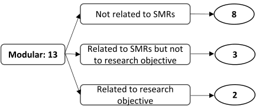

**Fig. 2.** Results of the filtering stage (Section B). 

economic and financial competitiveness, providing qualitative and quantitative information about the impact of these factors. 

_3.2.1.1. Size._ SMR size is frequently considered as a disadvantage for SMRs with respect to LRs [6–9]. Size is related to the “economy of scale” principle. In general, the economy of scale is the cost advantage determined by the spreading of both fixed and variable costs over a larger volume of production [45]. In particular [46], point out how the overnight capital costs and the size (small and large in MWe) of reactors with similar design and characteristics are related: 

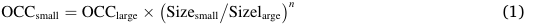

where n is the scaling factor, and OCC is the Overnight Capital Cost [46]. point out that the cost decreases between 20% and 35% by doubling of the reactor size. Indeed, according to several studies, SMR capital cost is dramatically higher (up to 70%) than the LR one if only the factor size is considered [7,47,48]. The lack of the economy of scale determines higher O&M costs [31,33] and decommissioning cost. Therefore, SMRs might not be seen as competitive with respect to LRs because of an inappropriate interpretation of the economy of scale principle. Indeed, the economy of scale principle cannot be directly applied into the investment analysis of SMRs vs LRs because it relies upon the clause “ _other things being equal_ ”, remarkably comparing one small plant with one large plant having the same design [9]. By contrast, SMRs exhibit several unique benefits related to having, for the same power installed, multiple units (fostering learning, co-siting economies, etc.) and different design solutions. These factors, analysed in details in the following sections, can reduce the gap of the economy of scale [7]. 

_3.2.1.2. Modularisation and modularity._ One of the main characteristics of SMRs, as their name emphasises, is the “modular construction”. It is often called indifferently “modularisation” or “modularity” both in the 33 scientific and industrial literature. However [ ], define modularisation as a “ _way of simplifying construction by splitting the plant up into packages (modules) which can be factory manufactured, transported to site and_ 

_assembled in situ, (or close by in an assembly area before being installed)_ ” (Page 20). On the other hand [49], state: “ _the arrangement in which a large capacity power plant is built by assembly of several independent and identical reactors of small capacity is also referred to as “modularity” by GIF (EMWG, 2005)_ ” (Page 5). This section is based on these two definitions. Fig. 3 further clarifies the definition of modularisation and modularity, also highlighting the meaning of stick-built and pure standardisation. The key aspects of modularisation are: 

- Factory fabrication allows working in a better-controlled environment determining a quality improvement. This allows increasing the quality of the components (reducing mistakes in construction, reworks etc.), reducing construction schedule, reducing maintenance cost because of a reduction of the probability of failure of components, and having a safer construction process [8,11,12]. A great percentage of factory fabrication also improves workers’ safety on-site because they handle a smaller number of components [13]. Factory fabrication could determine a cost-saving in labour and construction. By contrast, the supply chain start-up cost is expected to be very high [31]. 

- Standardisation and design simplification increase efficiency in construction, operation and decommissioning. Standardisation reduces the construction time variability, and the testing and maintenance activities [13,14]. 

- The expected higher cost of transportation activities is one of the disadvantages of modularisation [8,31,50]. However, for smaller plants like SMRs, modularised components are envisaged to be transported by truck or rail, determining a less vulnerability to delays [13]. Furthermore, modularisation determines an increase in project management effort [8]. Accurate communication between suppliers and contractors is essential to ensure the synchrony of the shipments [8]. 

- The economic viability is one of the challenges of modularisation and requires research and international collaboration to quantify it [14]. [50] report several examples of cost reduction (an average of 15%) and schedule saving (an average of 37.7%) determined by the 

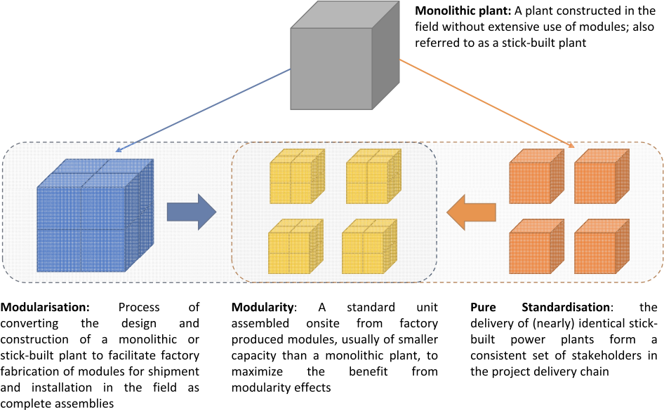

**Fig. 3.** Meaning of modularisation, modularity, standardisation, stick-built -Text adapted from Ref. [10]. 

transition from the stick-built construction to modularisation in infrastructure.

- There is a minimum number of SMRs at a certain selling price to recover the cost of setting up a supply chain for modular components. In particular, in the case of 180 MWe SMRs and a factory with $1 billion fixed costs, the selling price and the number of orders should be respectively $1.5 billion and 4 to recover the factory cost [12].
- The impact of modularisation on SMR capital cost depends on the degree of modularisation. [51] evaluate the impact of modularisation on three construction strategies. The analysis shows a capital cost (15% discount rate) saving of 39% for a "complete modularisation", and of 11% for a "lesser degree of modularisation" with respect to the "stick-built" strategy. Furthermore, [11] carry out the same analysis but with a 10% discount rate showing a 29.95% capital cost reduction in the case of "complete modularisation". [52] extend the analysis showing a capital cost reduction of 18% determined by the factory fabrication of the super modules. [53] analyse the impact of modularisation on SMR capital cost, highlighting how a 60% degree of modularisation is necessary to obtain a significant construction cost reduction.
- Modularisation allows performing functional and system-testing activities during the fabrication and assembly stage, determining a higher level of parallelism and, therefore, a shorter time [54].
- Modularisation could reduce construction time. [15] evaluate the impact of the modularisation on the SMR construction time, showing that if the maximum (66%) effective modularisation is applied to the full SMR power plant, the expected SMR construction time could reduce from 5 years to 42–48 months.
- A plant layout simplification and a plant design "ad hoc" is necessary to obtain the expected advantages of modularisation [8]. [55] provide an optimisation model for module layout and allocation within an NPP.
- [56] point out seven steps to follow in a modularisation design process. 1) Assess project applicability; 2) Define built strategy, supply chain, transport and logistic requirements; 3) Refine the configurations of the modules breaking down the system and classifying modules; 4) Optimise breakdown of the systems in order to optimise costs and buildability; 5) Definition of the interfaces; 6) Definition of design tools (e.g. CAD, BIM); and 7) Definition of the equipment layout.

The main consequences "strictly" related to modularity translate into several factors to consider in the evaluation of SMR competitiveness with respect to LRs:

*3.2.1.3. Incremental capacity addition and the possibility of a gradual shutdown.* The incremental capacity addition of SMRs allows a favourable cash flow profile than an LR because the first SMR starts generating revenue while the other SMRs could be still in construction [9]. The incremental capacity addition allows using the revenue generated by this first unit(s) for the reduction of the up-front investment (therefore a lower capital at risk) and the need for loans. Furthermore, the incremental capacity addition allows the investment scalability (considering a relatively constant rate of demand growth) and a reduction of the exposure to external delay events [17,18]. SMRs also present the possibility of a gradual shutdown of some modules which could be applied when electricity price decreases, improving SMR economics [57]. However, this latter aspect is controversial since virtually all the costs of a nuclear power plant are either sunk (e.g. capital cost) or fixed (e.g. salaries), therefore there is little or no saving in reducing the power output.

*3.2.1.4. Co-siting economies.* Co-siting economies (i.e. having multiple units in the same site) is one of the SMR advantages with respect to LRs. Certain fixed indivisible costs (e.g. licences, insurances, human resources, evacuation plans) can be saved when installing the second and subsequent units [7,12,17,19]. Therefore, the larger the number of NPP co-sited units, the smaller the costs for each unit [58]. The merit of the co-siting economies is confirmed by Ref. [30], which point out an expected capital cost saving per unit of 15–20%.

The sharing of personnel and spare parts across multiple units, and the possibility to share the upgrades on multiple units (e.g. software upgrading) could reduce the operational costs [7,59]. More units in the same site also have an impact on the decommissioning cost, determining a cost saving of 22% in the case of 4 SMRs vs 1 LR [10]. The key point is that also more than one LRs can be built on the same site, but again, considering the same plant capacity (i.e. four SMRs has the LRs power), having greater saving from co-siting economies [10].

*3.2.1.5. Cogeneration and load following.* SMRs are more suitable for cogeneration than LRs because it is possible to switch some of the SMRs for the cogeneration, and, consequently, SMRs can run at the full nominal power and maximum conversion efficiency [60]. [19,60] provide an overview of the challenges and opportunities related to cogeneration for the load following of NPPs, highlighting how the SMR technologies are particularly suitable for: district heating, desalination, and hydrogen production.

[61] analyse the load following of SMRs by cogeneration of hydrogen, providing an assessment of the technological economic feasibility with three technologies: Alkaline Water Electrolysis, High-Temperature Steam Electrolysis, and Sulphur-Iodine thermochemical. The first technology is technically feasible, and the investment can be profitable depending on the hydrogen and electricity price (hydrogen price < 0.40 €/Nm$^3$ and the electricity price relatively low). Regarding the second technology, the coupling with a Light Water Reactor SMR could be challenging because of the temperature mismatch between the steam produced and the cogeneration process requirements. This coupling becomes profitable when the hydrogen price is in the range of 0.30–0.45 €/Nm$^3$ or above. Regarding the third technology, the coupling with a High-Temperature Gas Reactor SMR is possible, but it is infeasible for the coupling with a Light Water Reactor SMR. This coupling results very profitably as far as the hydrogen price reaches 0.30 €/Nm$^3$.

[62,63] analyse the coupling of a "Nukcale" SMR plant with different desalination technologies, and [25] carry out a similar analysis on demonstrate the economic viability of coupling an SMR (IRIS) plant with a desalination plant. Both analyses show how the coupling is easy and effective. [64] analyse the coupling of via "SMART" reactors with desalination plants in Indonesia. The analysis shows a rate of return of 11% and a Payback Period (PP) of around 14 years. Furthermore, [65] evaluate a combination of an off-shore wind farm and an SMR operating as a virtual power plant. A key result of the study is that the combination of a wind farm and SMR in demand-following mode might improve the synchronisation with demand by up to 60–70% with respect to the wind-only system.

Next sections summarise other factors to consider in the evaluation of SMR competitiveness: learning, construction time, design, cost uncertainties, adaptability to market conditions, availability, licensing time, capacity factor, and the possibility of nuclear power plant construction.

*3.2.1.6. Learning.* [33] explains the learning rate is: "*A progressive increase in efficiency and effectiveness can be achieved by building experience and learning how to perform a process and use tools to deliver a product. The learning rate is the cost reduction realised in this way, for every cumulative doubling of production*". Since more SMRs than LRs are built for the same power installed, stronger and faster learning is expected. The expected learning rate of the SMR industry ranges between 5% and 10% (with a proportion of factory fabrication of 45–60%) [33]. This range is

consistent with the 8% considered by Ref. [7] in the comparison 4 SMRs vs 1 LR. [32] points out that a 10% cost reduction is achievable for every doubling of volume (with a proportion of factory fabrication of 30%). Learning rate increases through modularisation and factory fabrication, high production rates, standardisation of design, the achievement of best practice by the workforce (both on the same site and in the factory), a consistent delivery chain, in a stable regulatory environment [9,17,33]. As highlighted by Ref. [66], the learning curve generally flattens out after 5–7 units. [6] agree with this view by pointing out that at least 5–7 SMR units are needed to exploit learning from factory fabrication fully. 

[9] highlight the difference between “worldwide learning” and “on-site learning”. The first is independent of where the units are built, and it is mostly related to the vendor and contractors shared across the various projects, while the construction of successive units at the same site determines the second and it is mostly related to local/national stakeholders. Learning can provide a huge advantage to SMRs. However, the learning factor is “time-dependent”, which means that after a certain time, the experience accumulated will not determine relevant construction saving [18]. [67] present a model to assess how the supply chain structure influences the SMR production learning in factories and the consequent capital cost saving. 

þ reactor (e.g. elimination of the pressuriser, steam generator pressure vessels, high-pressure injection emergency core cooling system) might determine a 17% capital cost saving [7]. Furthermore, designers estimate a capital cost reduction determined by design simplification of 15% for PWR SMRs [30], and [18] highlight other saving determined by the smaller quantity of material (e.g. concrete, steel) used with respect to LRs. By contrast, [31] points out that the cost-saving is counterbalanced by the expected higher cost for validating and testing the new technology. 

_3.2.1.9. The cost uncertainties related to the FOAK._ The cost uncertainty related to a FOAK Generation III þ LR is lower with respect to a FOAK SMR because there are already several Generation III þ LRs operating or under construction. In the evaluation of the uncertainties related to the investment cost for the installation of a certain amount of MWe, the investor should consider both the option of one LR (e.g. 1340 MWe) and the option of several SMRs (e.g. four of 335 MWe). The uncertainty associated with the first unit is greater in the second option, but the average uncertainty is potentially smaller for the SMRs [71]. [72] provide an overview of the cost uncertainties related to the SMR early design stage. 

_3.2.1.7. Construction time._ SMRs could solve one of the key issues in the nuclear industry: the long construction time. The long construction time is a key issue in the nuclear sector for several reasons. For instance: 

- Thousands of workers and the utilisation of expensive equipment (e. g. cranes) determine high fixed costs for each working day [9]; 

- The postponing of cash in-flow increases the interest to be paid on the debt [9]; 

- The present value of future cash flow decreases exponentially with time [9]; 

- Possible scope changes due to changes in legislation (e.g. postFukushima accident); 

- Price of commodities could increase. 

SMRs have an expected shorter construction schedule than LRs [33, 68]. The SMR expected schedule is 4/5 years for the FOAK (First-of-a-kind) and 3/4 years for the NOAK (nth-of-a-kind), instead of the six years (or more) for LRs [33,69]. SMR schedule reduction is determined by smaller size, simpler design, increased modularisation, a large fraction of components produced in a factory, serial fabrication of components and standardisation [47,69]. 

Three key consequences of the schedule reduction are: 

1) reduction of the time to market [68]; 

_3.2.1.10. Adaptability to market conditions._ SMRs are more adaptable to market conditions than LRs. SMRs have an expected shorter construction time allowing splitting the investment according to the market evolution and avoiding it if not needed [18]. The capability to better adapt to market conditions minimises also the cost of “not satisfied demands”, which is obtained “ _by multiplying the margin for the investor in the plant i at the time with the potential market for the plant i at the time t_ ” [20] (Page 5). 

_3.2.1.11. Availability._ [7] point out that SMRs present a fuel cycle extension (from 18-24 months of the existing plants to 36–40 months) determining a 2–5% capital cost saving and a 3% O&M annual cost saving. Furthermore, some SMR units can be refuelled while the remaining ones are still in operation [12]. Therefore, two main considerations can be argued: 

   - SMR plant has a higher availability with respect to LR because of the fuel cycle extension; the fuel cycle extension also increases the “overall” availability. 

   - Considering an amount of reserves equal to the sum of the two largest generating units [73] and the possibility to refuel more SMR units while the remaining ones are still in operations [12], SMRs improve the overall availability because, in contrast to LR, the amount of reserves does not change increasing the overall plant availability. 

- 2) reduction of the interest during construction [70]; 

- 3) possibility to match demand growth [9]. 

[7] estimate a capital cost saving of 6% determined by the shorter construction schedule coupled with the capability of better following the demand, and [30] points out a capital cost saving estimated by SMR vendors of 20% determined by the shorter construction schedule. [15] present a methodology to forecast SMR construction schedule starting from a built LR. Furthermore, SMRs could present a reduction of schedule risks with respect to LRs [12]. 

_3.2.1.8. Design._ SMR design could determine a cost-saving with respect to LRs [17]. Design simplification in some SMRs could be achieved through “ _broader incorporation of size-specific inherent safety features that would not be possible for large reactors_ ” [30] (Page 149). The SMR integral (major primary system components inside the reactor vessel eliminating the external piping) and modular approach simplify the plant leading to a reduction of the number and type of components [9]. For instance, the design-related characteristics of the “IRIS” SMR with respect to GEN III 

_3.2.1.12. Licensing time._ The licencing time influences the time to market and, therefore, the competitiveness of SMRs. It is worth to clarify that there is a difference between design, construction and operation licensing, as shown in Ref. [20]. The information about SMR licensing time in the retrieved document mainly focuses on the design licensing time, and it is controversial. According to Ref. [20], considering the same licensing time for the LR and the first SMR, the licensing time for the following SMRs will be shorter because the design is identical to the first one, allowing a better time to market. However, [6] state that the licensing is one of the SMR challenges because of the difficulty of modifying the actual regulatory and legal framework, and [31] highlights a cost for regulatory approval for SMRs higher than for LRs because of the newness of the SMR designs and the overall SMR concept. 

_3.2.1.13. The possibility of NPP construction._ Firstly, SMRs are suitable for small, remote or isolated areas where the power provided by LRs is not needed or the grid connection is not able to reliably handle so much power [13,30,74]. Secondly, SMR size allows incremental investment 

eliminating the huge financial resources needed for LRs and the associated financial risk [8,75]. These two SMR characteristics determine an expected increased possibility of NPP construction. In particular, [76] evaluate the SMR economic feasibility in three small islands (Jeju, Tasmania and Tenerife) in different generation mix scenarios. SMR results competitive in the case of an average generation cost _<_ 100 $/MWh for Jeju, _<_ 140 $/MWh for Tenerife, and _<_ 80 $/MWh for Tasmania. 

_3.2.1.14. Capacity factor._ The capacity factor is “ _the actual energy output of an electricity-generating device divided by the energy output that would be produced if it operated at its rated power output (Reference Unit Power) for the entire year_ ” [77]. A high capacity factor dramatically improves the economics of the plant. Indeed, according to Ref. [78], the capacity factor (in the paper availability) is the third most relevant driver of SMR and LR economics. Refuelling, unplanned shutdown, planned maintenance, and load following are key drivers of the capacity factor [33]. [79] evaluates SMR competitiveness in four scenarios. A key conclusion of the study is that an SMR capacity factor equal to or higher than current light water reactors is a key condition for SMR competitiveness. SMR vendors claim a capacity factor of 95% or more for their SMR. Operational learning (determined through familiarity with the designs and consistency of operations) might improve SMR capacity factors [33, 80]. Furthermore, since SMRs might have a simpler design and fewer components than LRs, there would be fewer chances of failure for components or systems [33]. 

## _3.2.2. Studies about SMR capital cost_ 

Most of the quantitative studies about SMR life-cycle costs focus on SMR Capital Cost (CC) or components and sub-components of SMR CC (i. e. overnight cost, base construction cost). This section provides a summary and compares the quantitative information. 

_3.2.2.1. Journal/conference papers._ Most of the studies focusing on SMR CC and its components and subcomponents retrieved from journal or conference papers highlight how the economic comparison SMR vs LR is strictly dependent on the factors considered in the analysis. In particular, [7] compare four 335 MWe SMRs (IRIS) and one 1340 MWe Generation III þ PWR. SMR CC is 70% greater, considering only the factor size. Considering cost reduction determined by multiple units at a single site (14%), learning (8%), construction schedule (6%), and related design characteristics (17%), SMR CC is 5% higher. 

Regarding the impact of the economy of multiples on the CC, [48,70] evaluate the opportunity to invest in SMRs or LRs in Italy and Switzerland. Both analyses show an SMR CC higher than the LR one, as shown in Fig. 5. However, both analyses highlight the merit of the 

economy of multiples in reducing the gap. [81] assesses the opportunity to invest in SMRs vs LRs in three different scenarios in India: 1) Total power output: 600–675 MWe, 2) Total power output: 1100–1350 MWe, and 3) Total power output: 2200–2500 MWe), and with different reactors to reach the total power output. The analysis highlights that the SMR and LR overall capital expenditure are comparable. 

Regarding SMR Overnight Cost (OVC) [69], estimate a 225 MWe SMR OVC in different scenarios, highlighting the impact of the design simplification and the learning effect, and demonstrating the potential benefits of the co-siting economies, as shown in Fig. 5. [82] interviewed 16 experts from the nuclear industry or closely associated about the expected OVC of five scenarios including one GEN III þ LR (1000 MWe) and two integral LW-SMRs (45 MWe, 225 MWe). The results highlight the merit of the co-siting economies in reducing the SMR OVC. 

Regarding the base construction cost (BCC), [83] estimate and compare the NuScale SMR (12 modules of 57 MWe each) BCC and the PWR–12 BCC. The analysis shows a NuScale SMR BCC ¼ 3465.72 $/kWe, and a PWR-12 BBC ¼ 5587.12 $/kWe, determining a difference of 2421.42 $/kWe. 

In summary, considering only the factor size in the economic comparison SMR vs LR limits the validity of the analysis. Indeed, as shown in section 3.2.1, considering only the factor size would mean applying the economy of scale principle, which relies upon the clause “ _other things being equal_ ” [9]. In turn, this neglects the importance of unique SMR characteristics. The aforementioned studies show that several factors (e. g. economy of multiples, learning, construction schedule, design characteristics, etc.) need to be evaluated and considered. The studies point out the lack of a standardised approach in the evaluation of SMR competitiveness with respect to LRs; each study considers different factors, and the methodology is also often different. 

_3.2.2.2. Organisation/company documents._ [33] highlights that SMR OVC can be reduced up to 20% by the way of: 1) modularisation and factory fabrication, 2) advanced manufacturing, 3) Building Information – Modelling (4 10%), 4) advanced construction methods such as open-top construction (up to 2%), and 5) co-siting of multiple reactors (5–14%, considering between 2 and 12 reactors on the same site) [30]. provides several OVC estimations for several SMRs called PWR-X (each PWR-X is based on the characteristics of specific SMR designs), and [31] provides the OVC estimations for several NOAK and country-specific (domestic market) SMR plants. 

Fig. 4 shows some of the SMR OVC estimations. 

_3.2.2.3. Comparisons SMR vs LR OVC._ Most of the comparisons for SMRs vs LRs focus on the OVC. Fig. 5 shows some of the comparisons (%) 

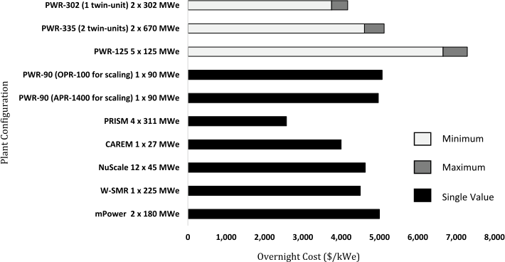

**Fig. 4.** SMR OVC Estimations - data from Refs. [30,31]. 

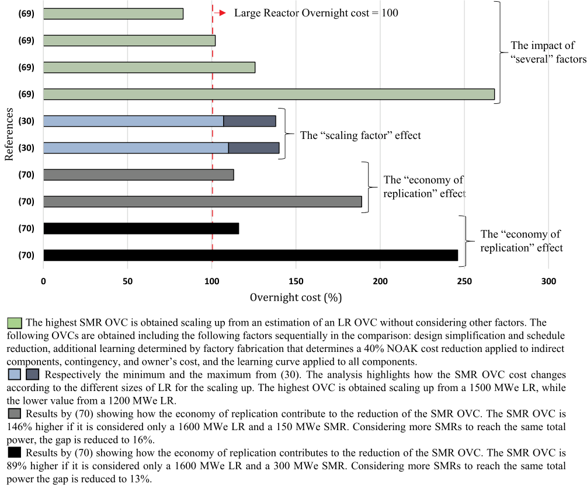

**Fig. 5.** Comparisons SMR vs LR OVC (%). 

SMR vs LR OVC considering LR OVC ¼ 100. 

## _3.2.3. Studies about SMR O&M costs_ 

This section summarises the key insights from the few documents focusing on SMR O&M costs. 

[7] evaluate and compare the O&M costs of four 335 MWe SMRs (IRIS) and a 1340 MWe LR. Considering only the factor “size”, SMR O&M costs are 51% greater. Considering cost reduction determined by multiple units at single sites (15%), additional outage cost (3%), and outage duration (4%), SMR O&M costs are 19% higher [31,33]. point out that SMR O&M costs are expected to be higher with respect to LRs. [31] highlights that the main reason is the loss of the economy of scale. [33] highlights that the co-siting economies might reduce the fixed O&M costs by 10%–20%, and the operational learning (determined through familiarity with the designs and consistency of operations) might further reduce the variable O&M costs (potential saving of 5%). 

Furthermore, cost saving in O&M costs can be achieved through the shared control of multi-module reactors determining a reduction of the staffing cost [33]. However, [31] points out an expected SMR staff cost per MWe 40% higher with respect to LRs. 

[30] highlights how the expected LUEC share of O&M and fuel costs for SMRs is 17–41%, which is amply below the correspondent of LRs, which is 45–58%. 

## _3.2.4. Studies about SMR decommissioning cost_ 

[58] provide the unique quantitative study about SMR decommissioning in the documents retrieved, comparing one 1340 MWe LR versus four 335 MWe SMRs (IRIS) and two 1340 MWe LRs versus eight 335 MWe SMRs (IRIS). If only the economy of scale is considered, the expected SMR decommissioning cost would be 3.09 times higher, both in the case of immediate and deferred decommissioning. Considering both the saving determined by multiples units at the same site and the technical saving, the gap is reduced but with a major impact in the case of “2 LRs vs 8 SMRs”. However, SMR decommissioning is expected to be easier with respect to LRs because the modules can be replaced and disassembled in factory conditions [6]. [47] points out that the possibility of SMR immediate decommissioning determines a cost saving of 13%, and a cluster decommissioning is 20% cheaper than a unit is. 

## _3.2.5. Indicators of economic and financial performance_ 

Fig. 6, Fig. 7, and Fig. 8 summarise respectively the main quantitative information about SMR LCOE, SMR NPV and SMR IRR estimations. 

## _3.2.6. Additional considerations about SMR investment_ 

[71] shows that SMRs present an average debt lower than LRs but with a longer duration. SMRs also present an equity capital required lower than the LR. These two considerations are consistent with the results of the analysis carried out by Ref. [70] in the specific case of Italy. 

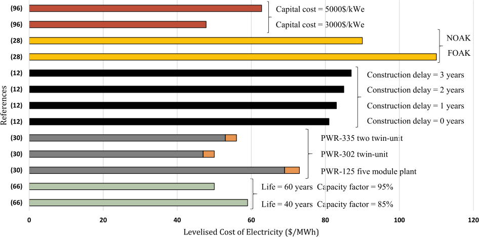

**Fig. 6.** SMR LCOE Estimations. 

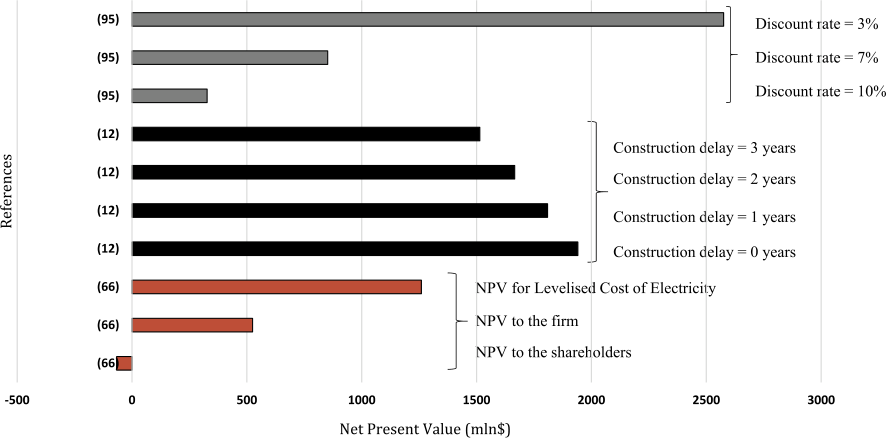

**Fig. 7.** SMR NPV Estimations. 

[84] analyse the value of the management’s flexibility to adapt later decision, comparing the investment profitability of 4 SMRs vs 1 LR on the same site both using the Real Options Analysis and the Discounted Cash Flow methodology. The results show that the managerial flexibility has a value, and it is higher in an SMR project (more options to take advantage) than in an LR project. However, profitability is higher for an LR project. Regarding the PP, [12] compare a 1260 MWe LR and a multimodule (1–7) SMR (180MWe) site, highlighting how the LR PP is less than the SMR one considering a staggered SMR schedule. However, considering an SMR simultaneous construction, the PP is similar. Furthermore, SMRs smaller size and relatively short construction time allow a better diversification of the investment. [68] present a model based on Real Options Analysis allowing quantitative evaluation of these two factors. 

## _3.3. What we do not know: a research agenda_ 

This chapter proposes a research agenda for further research on the economics and finance of SMRs, with the items ranked according to their relative importance. The items and the ranking of the agenda are based on the aforementioned SLR and countless meetings that the authors had in the last 14 years with SMR vendors, contractors, policymakers, utilities, government and financers. 

## _3.3.1. Performing analysis at programme/country level_ 

The body of literature focuses mostly on analysis at the plant-level (1 SMR vs 1 LR) or site-level (X SMRs vs 1 LR of equivalent total size). However, as shown in Ref. [59], the focus at the programme level is a major determinant. For instance, the “successful nuclear programme” in South Korea is mostly due to an approach at “programme level” [80], instead of a “plant-level” like in USA or “site-level” like in France [85]. A topic even less discussed, but still critical is the interdependency 

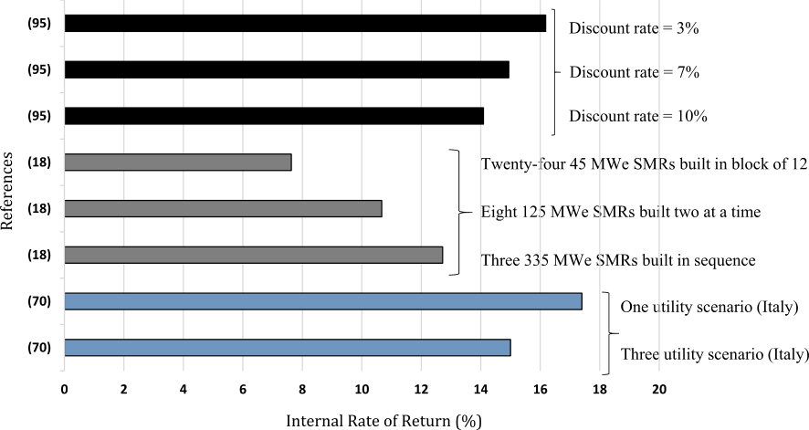

**Fig. 8.** SMR IRR Estimations. 

between the programme and the strategy adopted by each country. Indeed, a key aspect for SMRs is the modularisation and, consequently, the factory fabrication of modules [50]. Therefore, a certain country might face a range of choices, e.g. 

- 1) Develop SMR design and build the supply chain and the reactors in its own country, aiming to export the technology. The advantages are the creation of know-how, scientific development, and improvement of the import-export balance. The disadvantages are a high level of risk, the necessity to use relevant economic and financial resources, and longer lead time; 

- 2) Import a proved reactor design (or in an extreme case, import the modules) from other countries. The main advantages, in this case, are: less risk upfront to develop the technology and shorter leadtime. The disadvantages are a reduced development of know-how and national capabilities, worsening of the import-export balance, and risky dependence on resources outside the country. 

Several factors might push in a direction with respect to another: experience in building and operating nuclear reactors, availability of potential suppliers, finance available, electricity market structure, and regulatory regime etc. However, a comprehensive review of all these aspects and an overall framework to integrate them are not available. 

power installed, more units are installed, create more degrees of freedom. The cons are that there is now considerable experience in building LRs, even modern GENIII and GENIIIþ (such as AP1000, EPR etc.) while virtually none in building modern “truly modular” SMRs, and there is a consistent upfront investment in building the factories producing the modules. [34] is the only published documents providing pros and cons of several financing structures for SMR development (in the specific case of the United Kingdom). Financing is an essential element because, as bankers say, if there is no financing, there is not project and needs further research. 

## _3.3.3. Develop a better understanding of O&M and decommissioning costs_ 

As also said in the above discussion, the number of studies related to O&M and particularly decommissioning costs is extremely low. O&M and decommissioning costs are traditionally believed, in the nuclear industry, to be a relatively small percentage of the life-cycle cost [87]. However, this idea could be empirically challenged. Regarding O&M costs, several reactors in the USA have been closed in recent years because the electricity price was so low to not even cover the O&M costs [88]. Regarding decommissioning, the cost keeps increasing, the projects are often over budget, and the stakeholders have limited understanding of why this happens [89]. More studies about O&M and decommissioning costs are needed before embarking in the construction. 

## _3.3.2. Exploring different financing mechanisms and their implications_ 

Financing is a critical issue for SMRs. Indeed, SMRs are scalable investments, with the cost of a single SMR being substantially less than a single LR. However, given a certain identical total power to be installed overall, the overall cost of a programme is similar for SMRs and LRs [78], ranging in the decades of billions of dollars. The financing of an SMR programme is a key issue for several countries, and different options are considered [34]. Financing is challenging because nuclear power plant projects are well known to be often delivered over budget and late (particularly in the EU and USA) [59], and therefore, investors lack confidence. Investing in nuclear project and programme is extremely risky, project financing is not applied like in other energy infrastructure [86], and several stakeholders are reluctant to do it. SMRs have pros and cons in this perspective. The pros are that the single investment has less “value at risk” than a large investment. This is particularly relevant for FOAK project, where the money is “gambled” on a much smaller investment. Furthermore, the fact that, for the same 

_3.3.4. Explore the link between modularisation and circular economy_ Building on the previous point about decommissioning, there is the highly relevant and unexplored topic of “circular economy”. According to Ref. [90]: “ _The basic idea of the Circular economy is to shift from a system in which resources are extracted, turned into products and finally discarded towards one in which resources are maintained at their highest value possible_ ”. In the case of nuclear power plants, this includes a range of solutions including recycling and reusing of components and systems. A key precondition to reap the advantages of modularisation in a “circular economy” perspective is the assessment of the lifecycle options of modules since the concept phase. Further research might investigate to what extent SMRs could leverage their modularisation for decoupling the life-cycle of modules (or systems) from the lifecycle of the plant. In theory, modularisation could reduce the resources needed in construction and waste generated in the deconstruction process. 

_3.3.5. Define new criteria for the cost-benefit analysis of nuclear reactors_ The methodologies for the cost-benefit analysis are often inadequate or incorrectly applied to deal with a nuclear programme. Indeed, the development of a nuclear programme involves a wide range of stakeholders: government (also representing taxpayers), utilities, contractors, regulator(s), financers, local community etc. Indeed, the idea to apply the cost-benefit analysis to infrastructure is not a good idea since the cost-benefit analyses are not perceived at the infrastructure level, but at stakeholder level, where the stakeholders can be an organisation or even persons. Therefore, each stakeholder sees a different cost-benefit analysis that might be extremely positive for some stakeholders and extremely negative for others (and everything in the middle). Furthermore, considering that the entire life cycle of a nuclear infrastructure can be for 100 years, some stakeholders (company and people) are not even existing when the reactor is built. All this considered there is not a single reference providing the cost-benefit analysis of SMRs with respect to LRs or other reactors. There is either a classical cost-benefit analysis (infrastructure level) or an enhanced one (stakeholder level). A proper holistic study is needed. 

## _3.4. Main areas of disagreement_ 

This section provides a summary of the main areas of disagreement emerged from the SLR. 

## _3.4.1. Overall SMR economic competitiveness_ 

As summarised in the previous sections, SMR unique characteristics (factory fabrication, learning, co-siting economies, shorter construction time, etc.) should, in theory, compensate for the lack of the economies of scale and make SMR investment attractive. However, four documents [75,91–93] deny some SMR unique characteristics or even define SMR investment unattractive. According to Ref. [91], each SMR design has specific characteristics, but no one of them presents all the characteristics that should compensate for the lack of the economy of scale. In general, SMRs might reduce the construction cost with respect to LRs, but it is unlikely that SMRs will present a lower cost of generating each unit of electrical energy than LRs. [91] point out how that the SMR competitiveness is even worse if compared to other energy sources (e.g. coal and natural gas-based thermal power). According to Ref. [75], regulators claim an SMR cost (which cost is not specified) 30% higher than LRs. In particular, the expected cost reduction determined by factory fabrication is too optimistic because “mass manufacturing” presents problems in the case of very expensive pieces of equipment in a small number [75]. [75] also points out how challenging and requiring a huge amount of capital is the creation of a massive assembly line. This approach could also hinder competition driving innovation and cost reduction. Another aspect that should be considered in the evaluation of SMR economic competitiveness is that the introduction of new technologies raises the cost significantly. 

Furthermore, learning cannot balance the diseconomies of scale because “this has been the case in the past” and because of the “astronomical number” of SMRs needed to benefit from the learning effect [75, 93]. 

## _3.4.2. SMR potential market_ 

Although the SMR suitability for small, remote or isolated areas is very often recognised as one of the main SMR characteristics, or even a key advantage for increasing the possibility of NPP construction all over the world, [92,93] strongly deny this point. According to Refs. [13,30, 74], SMR size allows providing power where the bigger power of LRs is not needed, and where the grid connection is not able to reliably handle the power provided by traditional LRs. Furthermore, SMR size allows incremental investment reducing the financial risk and the huge financial resources associated with LRs. Therefore, in theory, Jordan and Ghana could be two good candidates for SMR applications by considering the grids with small capacity and the limited financial resources. 

However, [93] analyse the suitability of SMRs for Jordan, and point out that “ _SMRs are only going to heighten the economic challenge. This problem of SMRs not being economically competitive with large nuclear reactors is, of course, not specific to Jordan_ ” (Page 241). [92] argue the same considerations in Ghana. Furthermore, [75] argue that there is no reason to believe that SMR characteristics would increase the demand for NPPs. [93] highlight that SMRs increase the need for construction sites considering that more SMRs are needed to obtain the same power of a LR. 

## **4. Conclusions** 

Not a single “truly modular” SMR has been built so far. Economic and financial reasons are strongly hindering SMR development. However, there are plenty of studies about SMR economics and finance. Through an SLR, this paper aims to provide an overview of what we know and what we do not know about the economics and finance of land-based SMRs, and to suggest a research agenda. Instead of a traditional narrative review, an SLR has been performed to provide a holistic perspective and allow repeatability. One of the limitations of an SLR is the inclusion of papers of different perspectives (still published in respectable journals). Furthermore, more recent papers are, in principle, considered equal to older references that might have less up-to-date information and theories. The exclusion of certain papers because of the authors disagree on or consider too old is an arbitrary choice. The strength of an SLR is the high scientific rigour allowing a full reproducibility of the work. One or more option-based papers leveraging an arbitrary choice of references and data can be considered a follow up from this work. 

As highlighted by the words “Small” and “Modular”, SMRs present three main peculiarities with respect to large scale traditional reactors: smaller size, modularisation, and modularity. SMR size has three main implications: loss of the “economy of scale”, for the same power installed more units can be built fostering phenomenon like the industrial learning, and the reduction of the up-front investment per unit. This latter makes SMR investment particularly attractive considering the multi-billions up-front investment of LRs. Modularisation has several implications: working in a better-controlled environment, standardisation and design simplification, reduction of the construction time, logistical challenges. Modularity allows having a favourable cash flow profile, taking advantage of the co-siting economies, cogeneration for the load following of NPPs, a higher and faster industrial learning, and better adaptability to market conditions. Furthermore, the interest in SMRs is growing because of the different applications: electrical, heat, hydrogen production, and seawater desalination. 

The SLR highlights how most of the quantitative studies about SMR economics and finance focus on SMR capital cost, component and subcomponents of the capital cost (i.e. overnight cost, base construction cost), indicators of economic and financial performances (LCOE, NPV, IRR). The number of studies focusing on O&M and decommissioning costs is extremely low, and there is a gap in knowledge about the cost“modular construction”. benefit analysis of the 

There is a lack of a standardised approach in the evaluation of the economic and financial performances of SMRs, making a proper comparison impossible in most of the cases. 

Most of the studies are at plant-level (1 SMR vs 1 LR) or site-level (X SMRs vs 1 LR of equivalent total size), neglecting the focus at the programme-level and the interdependency between the programme and the strategy of each country. Furthermore, most of the methodologies for the cost-benefit analysis are often inadequately applied, by not considering that the development of a nuclear programme involves a wide range of stakeholders. 

The SMR world strongly needs a standardised approach at the programme level taking a holistic and realistic perspective in the evaluation of SMR economic and financial competitiveness to foster SMR development. 

## **Acknowledgements** 

This work was supported by the UK Engineering and Physical Sciences Research Council (EPSRC) grant EP/N509681/1. Furthermore, this work was partially supported by the Major Project Association (MPA). The authors are immensely grateful to the ESPRC and MPA. The authors also wish to thank Dr Chun Sing Lai and Mr Ata Babaei that 

provided substantial feedback. The authors also acknowledge the substantial contribution of the reviewers. The opinions in this paper represent only the point of view of the authors, and only the authors are responsible for any omission or mistake. This paper should not be taken to represent in any way the point of view of MPA or EPSRC or any other organisation involved. 

**Appendix 1. Documents retrieved – Part A** 

|Source/Area|SMR Economics and fnance|SMR Construction|SMR O&M|SMR Decommissioning|
|---|---|---|---|---|
|[82] (Abdulla et al., 2013)|X||||
|[72] (Agar et al., 2018)|X||||
|[94] (Agar et al., 2019)|X||||
|[95] (Alonso et al., 2016)|X||||
|[46] (Aydogan et al., 2015)|X||||
|[18] (Barenghi et al., 2012)|X||||
|[83] (Black et al., 2019)|X|X|||
|[70] (Boarin et al., 2011a)|X||||
|[48] (Boarin et al., 2011b)|X||||
|[17] (Boarin and Ricotti, 2014)|X||||
|[12] (Boldon et al., 2014)|X|X|||
|[8] (Carelli and Ingersoll, 2014)|X|X|X||
|[7] (Carelli et al., 2008)|X||X||
|[75] (Cooper, 2014)|X||||
|[14] (Hidayatullah et al., 2015)|X||X||
|[76] (Hong and Brook, 2018)|X||||
|[62] (Ingersoll et al., 2014a)|X||||
|[63] (Ingersoll et al., 2014b)|X||||
|[57] (Liman, 2018)|X|||X|
|[15] (Lloyd and Roulstone, 2018)|X|X|||
|[53] (Lloyd et al., 2018)|X|X|||
|[9] (Locatelli et al., 2014)|X||||
|[60] (Locatelli et al., 2017a)|X||||
|[61] (Locatelli et al., 2018)|X||||
|[25] (Locatelli et al., 2015)|X||||
|[19] (Locatelli et al., 2017b)|X||||
|[81] (Locatelli et al., 2013a)|X||||
|[13] (Locatelli et al., 2010)||X|||
|[84] (Locatelli et al., 2012)|X||||
|[68] (Locatelli et al., 2017c)|X||||
|[58] (Locatelli and Mancini, 2010a)||||X|
|[66] (Locatelli and Mancini, 2010b)|X||||
|[6] (Lokhov et al., 2013)|X||||
|[67] (Lyons and Roulstone, 2018)|X||||
|[20] (Mancini et al., 2009)|X||||
|[52] (Maronati and Petrovic, 2018)|X|X|||
|[11] (Maronati et al., 2017)|X|X|||
|[51] (Maronati et al., 2016a)|X|X|||
|[54] (Maronati et al., 2016b)|X||||
|[50] (Mignacca et al., 2018)|X|X|||
|[64] (Oktavian et al., 2018)|X||||
|[47] (Playbell, 2016)|X||||
|[91] (Ramana and Mian, 2014)|X||||
|[93] (Ramana and Ahmad, 2016)|X||||
|[79] (Shropshire, 2011)|X||||
|[65] (Shropshire et al., 2012)|X||||
|[71] (Trianni et al., 2009)|X||||
|[49] (Upadhyay and Jain, 2016)||X|||
|[69] (Vegel and Quinn, 2017)|X||||
|[56] (Wrigley et al., 2018)||X|||
|[55] (Wrigley et al., 2018b)||X|||
|[96] (Wyrwa and Suwała, 2017)|X||||

## **References** 

- [1] IAEA. Advances in small modular reactor technology developments. Available from: https://aris.iaea.org/Publications/SMR-Book_2016.pdf; 2016. 

- [2] Ingersoll DT. Deliberately small reactors and the second nuclear era. Prog Nucl Energy 2009 May;51(4–5):589–603. 

- [3] IAEA. Advances in small modular reactor technology developments. A supplement to: IAEA advanced reactors information system (ARIS). 2014. Vienna. 

- [4] Locatelli G, Mancini M, Todeschini N. Generation IV nuclear reactors: current status and future prospects. Energy Policy 2013;61:1503–20. 

- [5] Karol M, John T, Zhao J. Small and Medium sized Reactors ( SMR ): a review of technology. Renew Sustain Energy Rev 2015;44:643–56. 

- [6] Lokhov A, Cameron R, Sozoniuk V. OECD/NEA study on the economics and market of small reactors. In: International congress on Advances in nuclear power plants. Jeju Island, Korea: ICAPP; 2013. 2013. 

- [7] Carelli MD, Mycoff CW, Garrone P, Locatelli G, Mancini M, Ricotti ME, et al. Competitiveness of small-medium, new generation reactors: a comparative study 

on capital and O&M costs. In: 16th international conference on nuclear engineering, ICONE16. Orlando, Florida, USA: ASME; 2008. 

- [8] Carelli MD, Ingersoll DT. Handbook of small modular nuclear reactors. Woodhead Publishing, Elsevier; 2014. p. 1–536. 

- [9] Locatelli G, Bingham C, Mancini M. Small modular reactors: a comprehensive overview of their economics and strategic aspects. Prog Nucl Energy 2014;73: 

75–85. 

- [10] GIF/EMWG. Cost estimating guidelines for generation IV nuclear energy systems. Available from: https://bit.ly/2QH4cDc; 2007. 

- [11] Maronati G, Petrovic B, Wyk JJ Van, Kelley MH, White CC. EVAL: a methodological approach to identify NPP total capital investment cost drivers and sensitivities. Prog Nucl Energy 2017;104:190–202. 

- [12] Boldon L, Sabharwall P, Painter C, Liu L. An overview of small modular reactors: status of global development, potential design advantages, and methods for economic assessment. Int J Energy Environ Econ 2014;22(5):437–59. 

- [13] Locatelli G, Mancini M, Galli A. Introducing nuclear power plants in an OECD country: size influence on the external factors. In: 18th international conference on nuclear engineering. Xi’an, China: ICONE18; 2010. 

- [14] Hidayatullah H, Susyadi S, Subki MH. Design and technology development for small modular reactors - safety expectations, prospects and impediments of their deployment. Prog Nucl Energy 2015;79:127–35. 

- [15] Lloyd CA, Roulstone A. A methodology to determine SMR build schedule and the impact of modularisation. In: 26th international conference on nuclear engineering. Lundon, United Kingdom: ICONE26; 2018. p. 1–8. 

- [16] GIF/EMWG. Cost estimating guidelines for generation IV nuclear energy systems. Available from: https://www.nrc.gov/docs/ML1408/ML14087A250.pdf; 2005. 

- [17] Boarin S, Ricotti ME. An evaluation of SMR economic attractiveness. Sci Technol Nucl Install 2014;2014:1–8. 

- [18] Barenghi S, Boarin S, Ricotti ME. Investment in different sized SMRs : economic evaluation of stochastic scenarios by INCAS code. In: International congress on Advances in nuclear power plants 2012. Chicago, USA: ICAPP 2012; 2012. p. 2783–92. 

- [19] Locatelli G, Fiordaliso A, Boarin S, Ricotti ME. Cogeneration: an option to facilitate load following in Small Modular Reactors. Prog Nucl Energy 2017;97:153–61. 

- [20] Mancini M, Locatelli G, Tammaro S. Impact of the external factors in the nuclear field: a comparison between small medium reactors vs. large reactors. In: 17th international conference on nuclear engineering. Brussels, Belgium: ICONE17; 2009. 

- [21] Investopedia. What is finance? 2019. Available from: https://www.investopedia. com/ask/answers/what-is-finance/. 

- [22] Ehrhardt B. Financial management: theory and practice. thirteenth ed. SouthWestern Cengage Learning; 2011 Available from: 

   - http://213.55.83.214:8181/Bussiness Ebook/Financial books/Financial_Manage ment_Brigham_13th_Edition.pdf. 

- [23] Di Maddaloni F, Davis K. The influence of local community stakeholders in megaprojects: rethinking their inclusiveness to improve project performance. Int J Proj Manag 2017;35(8):1537–56. 

- [24] Sainati T, Locatelli G, Brookes N. Special Purpose Entities in Megaprojects: empty boxes or real companies? Proj Manag J 2017;48(2). 

- [25] Locatelli G, Boarin S, Pellegrino F, Ricotti ME. Load following with Small Modular Reactors (SMR): a real options analysis. Energy 2015;80:41–54. 

- [26] IAEA. Status of innovative small and medium sized reactor designs 2005. 2006. 

- [27] IAEA. Approaches for assessing the economic competitiveness of small and medium sized reactors. Available from: https://bit.ly/2TG5iRt; 2013. 

- [28] OECD/NEA. Small modular reactors: nuclear energy market potential for near-term deployment. Available from: https://www.oecd-nea.org/ndd/pubs/2016/7213 -smrs.pdf; 2016. 

- [29] IAEA. Delployment indicators for small modular reactors. 2018. 

- [30] OECD/NEA. Current status , technical feasibility and economics of small nuclear reactors. Available from: https://www.oecd-nea.org/ndd/reports/2011/current-s tatus-small-reactors.pdf; 2011. 

- [31] UxC Consulting. SMR market Outlook, vol. 30076; 2013. 

- [32] NNL. Small modular reactors (SMRs) feasibility study. Available from: http:// www.nnl.co.uk/media/1627/smr-feasibility-study-december-2014.pdf; 2014. 

- [33] EY. Small modular reactors - can building nuclear power become more costeffective?. Available from: https://go.ey.com/2FrQ6Un; 2016. 

- [34] EFWG. Market framework for financing small nuclear. Available from: https://bit. ly/2D3DdOF; 2018. 

- [35] MIT. The future of nuclear energy in a Carbon-Constrained world. 2018. 

- [36] WNA. The economics of nuclear power. 2008. 

- [37] IAEA. Integrated approach to optimize operation and maintenance costs for operating nuclear power plants. 2006. 

- [38] NEA. The economics of the nuclear fuel cycle. Available from: http://www.oecd-ne a.org/ndd/reports/efc/EFC-complete.pdf; 1994. 

- [39] IAEA. IAEA safety glossary. 2006. Available from: http://www-ns.iaea.org/dow nloads/standards/glossary/glossary-english-version2point0-sept-06-12.pdf. 

- [40] IAEA. Cost estimation for research reactor decommissioning. 2013. Available from: http://www-pub.iaea.org/MTCD/Publications/PDF/Pub1596_web.pdf. 

- [41] Lai CS, Jia Y, Xu Z, Lai LL, Li X, Cao J, et al. Levelized cost of electricity for photovoltaic/biogas power plant hybrid system with electrical energy storage degradation costs. Energy Convers Manag 2017;153(May):34–47. 

- [42] Lai CS, McCulloch MD. Levelized cost of electricity for solar photovoltaic and electrical energy storage. Appl Energy 2017;190:191–203. 

- [43] Investopedia. Net present value (NPV). Available from: https://www.investopedia. com/terms/n/npv.asp; 2019. 

- [44] Investopedia. Internal rate of return (IRR) definition. Available from: https://www. investopedia.com/terms/i/irr.asp; 2019. 

- [45] Investopedia. Economies of scale. Available from: https://www.investopedia. com/terms/e/economiesofscale.asp; 2019. 

- [46] Aydogan F, Black G, Taylor Black MA, Solan D. Quantitative and qualitative comparison of light water and advanced small modular reactors. J Nucl Eng Radiat Sci 2015;1(4):1–14. 

- [47] Playbell I. Economy, safety and applicability of small modular reactors. Proc Inst Civ Eng May, 2017;170(2):67–79. 

- [48] Boarin Locatelli G, Mancini M, Ricotti ME. Are SMR a reasonable choice for Switzerland? An application of the INCAS model. In: ASME 2011 small modular reactors Symposium. Washington, DC, USA: SMR 2011; 2011. 

- [49] Upadhyay AK, Jain K. Modularity in nuclear power plants: a review. J Eng Des Technol 2016;14(3). 

- [50] Mignacca B, Locatelli G, Alaassar M, Invernizzi DC. We never built small modular reactors (SMRs), but what do we know about modularization in construction?. In: 26th international conference on nuclear engineering. London,United Kingdom: ICONE26; 2018. 

- [51] Maronati Petrovic B, Banner JW, White CC, Kelley MH, Van Wyk J. Total capital investment cost evaluation of smr modular construction designs. In: International congress on Advances in nuclear power plants. San Francisco, California, USA: ICAPP 2016; 2016. p. 943–8. 

- [52] Maronati G, Petrovic B. Extending modularization from modules to super modules: a cost evaluation of barge-Transportable small modular reactors Petrovic. In: International congress on Advances in nuclear power plants. Charlotte, NC, USA: ICAPP 2018; 2018. p. 357–62. 

- [53] Lloyd CA, Roulstone ARM, Middleton C. The impact of modularisation strategies on small modular reactor cost. In: International congress on Advances in nuclear power plants 2010. Charlotte, NC, USA: ICAPP; 2018. 2018. 

- [54] Maronati Petrovic B, Van Wyk JJ, Kelley MH, White CC. Impact of testing activities on small modular reactor total capital investment cost. In: 24th international conference on nuclear engineering ICONE24; 2016. Charlotte, North Carolina, USA. 

- [55] Wrigley PA, Wood P, Stewart P, Hall R, Robertson D. Module layout optimization using a genetic algorithm in light water modular nuclear reactor power plants. Nucl Eng Des 2018;341:100–11. 

- [56] Wrigley P, Wood P, Stewart P, Hall R, Robertson D. Design for plant modularisation: nuclear and SMR. In: 26th international conference on nuclear engineering, ICONE26; 2018. London, United Kingdom. 

- [57] Liman J. Small modular reactors: methodology of economic assessment focused on incremental construction and gradual shutdown options. Prog Nucl Energy 2018; 108:253–9. 

- [58] Locatelli Mancini. Competitiveness of small-medium , new generation Reactors : a comparative study on decommissioning. J Eng Gas Turbines Power 2010;132. 

- [59] Locatelli G. Why are megaprojects, including nuclear power plants, delivered overbudget and late? Reasons and Remedies. Available from: https://arxiv.org/ ftp/arxiv/papers/1802/1802.07312.pdf; 2018. 

- [60] Locatelli G, Boarin S, Fiordaliso A, Ricotti M. Load following by cogeneration: options for small modular reactors, gen IV reactor and traditional large plants. In: 25th international conference on nuclear engineering. Shanghai, China: ICONE25; 2017. 

- [61] Locatelli G, Boarin S, Fiordaliso A, Ricotti ME. Load following of Small Modular Reactors (SMR) by cogeneration of hydrogen: a techno-economic analysis. Energy 2018;148:494–505. 

- [62] Ingersoll, Houghton ZJ, Bromm R, Desportes C. Integration of NuScale SMR with desalination technologies. In: ASME 2014 small modular reactors Symposium. Washington, DC, USA: SMR; 2014. 2014. 

- [63] Ingersoll, Houghton ZJ, Bromm R, Desportes C. NuScale small modular reactor for Co-generation of electricity and water. Desalination 2014;340(1):84–93. 

- [64] Oktavian MR, Febrita Di, Arief MM. Cogeneration power-desalination in small modular reactors ( SMRs ) for load following in Indonesia. In: 4th international conference on science and technology (ICST); 2018. Yogyakarta, Indonesia. 

- [65] Shropshire D, Purvins A, Papaioannou I, Maschio I. Benefits and cost implications from integrating small flexible nuclear reactors with off-shore wind farms in a virtual power plant. Energy Policy 2012;46:558–73. 

- [66] Locatelli Mancini M. Small-medium sized nuclear coal and gas power plant: a probabilistic analysis of their financial performances and influence of CO2cost. Energy Policy 2010;38(10):6360–74. 

- [67] Lyons RE, Roulstone ARM. Production learning in a small modular reactor supply chain. In: International congress on Advances in nuclear power plants 2018. Charlotte, North Carolina, USA: ICAPP; 2018. 2018. 

- [68] Locatelli G, Pecoraro M, Meroni G, Mancini M. Appraisal of small modular nuclear reactors with ‘real options’ valuation. Proc Inst Civ Eng - Energy. 2017;170(2): 51–66. 

- [69] Vegel B, Quinn JC. Economic evaluation of small modular nuclear reactors and the complications of regulatory fee structures. Energy Policy 2017;104:395–403. 

- [70] Boarin Locatelli G, Mancini M, Ricotti ME. Italy Re-opening the nuclear option: are SMR a suitable choice? An application of the INCAS model. In: ASME 2011 small modular reactors Symposium. Washington, DC, USA: SMR; 2011. p. 1–10. 2011. 

- [71] Trianni A, Locatelli G, Trucco P. Competitiveness of small-medium reactors: a probabilistic study on the economy of scale factor. In: International congress on Advances in nuclear power plants 2009. Tokyo, Japan: ICAPP; 2009. 2009. 

- [72] Agar AS, Fry AJ, Goodfellow MJ, Goh YM, Newnes LB. Expected accuracy range of cost estimation for small modular reactors at the early concept design stage. In: 26th international conference on nuclear engineering. London, United Kingdom: ICONE26; 2018. p. 1–8. 

- [73] Locatelli G, Mancini M. The role of the reactor size for an investment in the nuclear sector: an evaluation of not-financial parameters. Prog Nucl Energy 2011;53(2): 212–22. 

- [74] Black G, Black MAT, Solan D, Shropshire D. Carbon free energy development and the role of small modular reactors: a review and decision framework for deployment in developing countries. Renew Sustain Energy Rev 2015;43:83–94. 

- [75] Cooper M. Small modular reactors and the future of nuclear power in the United States. Energy Res Soc Sci 2014;3(C):161–77. 

- [76] Hong S, Brook B. Economic feasibility of energy supply by small modular nuclear reactors on small islands: case studies of Jeju, Tasmania and Tenerife. Energies 2018;11(2587). 

- [77] IAEA. Pris - glossary. 2019. Available from: https://pris.iaea.org/PRIS/Glossary.as px. 

- [78] Boarin S, Locatelli G, Mancini M, Ricottia ME. Financial case studies on small- and medium-size modular reactors. Nucl Technol 2012;178(2):218–32. 

- [79] Shropshire D. Economic viability of small to medium-sized reactors deployed in future European energy markets. Prog Nucl Energy 2011;53(4):299–307. 

- [80] Choi S, Jun E, Hwang I, Starz A, Mazour T, Chang S, et al. Fourteen lessons learned from the successful nuclear power program of the Republic of Korea. Energy Policy 2009 Dec;37(12):5494–508. 

- [81] Locatelli G, Mancini M, Belloni P. Assessing the attractiveness of SMR: an application of INCAS model to India. In: 21st international conference on nuclear engineering; 2013. Chengdu, China ICONE21-15932 ASSESSING. 

- [82] Abdulla A, Azevedo IL, Morgan MG. Expert assessments of the cost of light water small modular reactors. Proc Natl Acad Sci 2013;110(24):9686–91. 

- [83] Black GA, Aydogan F, Koerner CL. Economic viability of light water small modular nuclear reactors: general methodology and vendor data. Renew Sustain Energy Rev 2019;103:248–58. 

- [84] Locatelli G, Mancini M, Ruiz F, Solana P. Using real options to evaluate the flexibility in the deployment of SMR. In: International congress on Advances in nuclear power plants. ICAPP; 2012. 2012. 2012. 

- [85] Grubler A. The costs of the French nuclear scale-up: a case of negative learning by doing. Energy Policy 2010 Sep;38(9):5174–88. 

- [86] Sainati T, Locatelli G, Smith N. Project financing in nuclear new build, why not? The legal and regulatory barriers. Energy Policy 2019;129(May 2018):111–9. 

- [87] OECD/NEA. Nuclear energy today. Available from: www.oecd-nea.org; 2012. 

- [88] World Nuclear Association. Nuclear power in the USA. Available from: http ://www.world-nuclear.org/information-library/country-profiles/countries-t-z/usa 

   - -nuclear-power.aspx; 2019. 

- [89] Invernizzi DC, Locatelli G, Brookes NJ. How benchmarking can support the selection, planning and delivery of nuclear decommissioning projects. Prog Nucl Energy 2017;99:155–64. 

- [90] Preston F, Lehne J. A wider circle? The circular economy in developing countries. Available from: https://www.chathamhouse.org/sites/files/chathamhouse/publ 

- [91] Ramana MV, Mian Z. One size doesnications/research/2017-12-05-circular-economy-preston-lehne-final.pdf’t fit all: social priorities and technical ; 2017. conflicts for small modular reactors. Energy Res Soc Sci 2014;2:115–24. 

- [92] Ramana MV, Agyapong P. Thinking big? Ghana, small reactors, and nuclear power. Energy Res Soc Sci 2016;21:101–13. 

- [93] Ramana MV, Ahmad A. Wishful thinking and real problems: small modular reactors, planning constraints, and nuclear power in Jordan. Energy Policy 2016; 93:236–45. 

- [94] Agar AS, Goodfellow MJ, Goh YM, Newnes LB. Stakeholder perspectives on the cost requirements of small modular reactors. Prog Nucl Energy 2019;112:51–62. 

- [95] Alonso G, Bilbao S, Del Valle E. Economic competitiveness of small modular reactors versus coal and combined cycle plants. Energy 2016;116:867–79. 

- [96] Wyrwa A, Suwała W. Prospects for the use of SMR and IGCC technologies for power generation in Poland. In: E3S web conf. vol. 22; 2017, 00191. 

