## Empirically grounded technology forecasts and the energy transition 

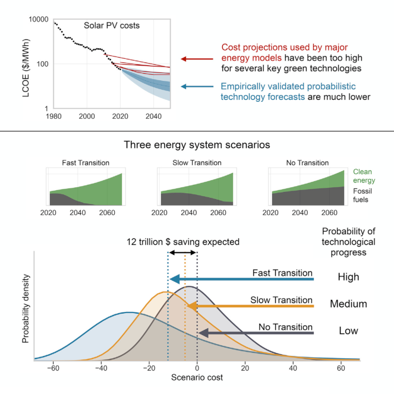

Rupert Way, Matthew C. Ives, Penny Mealy, J. Doyne Farmer rupert.way@smithschool.ox.ac.uk 

## Highlights 

Empirically validated probabilistic forecasts of energy technology costs 

Future energy system costs are estimated for three different scenarios 

A rapid green energy transition will likely result in trillions of net savings 

Energy models should be updated to reflect high probability of low-cost renewables 

Decisions about how and when to decarbonize the global energy system are highly influenced by estimates of the likely cost. Here, we generate empirically validated probabilistic forecasts of energy technology costs and use these to estimate future energy system costs under three scenarios. Compared to continuing with a fossil fuel-based system, a rapid green energy transition is likely to result in trillions of net savings, even without accounting for climate damages or climate policy co- 

Way et al., Joule 6, 2057–2082 September 21, 2022 ª 2022 The Authors. Published by Elsevier Inc. https://doi.org/10.1016/j.joule.2022.08.009 

## Empirically grounded technology forecasts and the energy transition 

Rupert Way,[1][,][2][,][6][,] * Matthew C. Ives,[1][,][2] Penny Mealy,[1][,][2][,][3] and J. Doyne Farmer[1][,][4][,][5] 

## SUMMARY 

Rapidly decarbonizing the global energy system is critical for addressing climate change, but concerns about costs have been a barrier to implementation. Most energy-economy models have historically underestimated deployment rates for renewable energy technologies and overestimated their costs. These issues have driven calls for alternative approaches and more reliable technology forecasting methods. Here, we use an approach based on probabilistic cost forecasting methods that have been statistically validated by backtesting on more than 50 technologies. We generate probabilisticcostforecastsforsolarenergy, wind energy, batteries, and electrolyzers, conditional on deployment. We use these methods to estimate future energy system costs and explore how technology cost uncertainty propagates through to system costs in three different scenarios. Compared to continuing with a fossil fuel-based system, a rapidgreenenergytransitionwill likely result in overall net savings of many trillions ofdollars—even without accounting for climate damages or co-benefits of climate policy. 

## INTRODUCTION 

Future energy system costs will be determined by a combination of technologies that produce, store, and distribute energy. Their costs and deployment will change with time due to innovation, competition, public policy, concerns about climate change, and other factors. To provide some perspective on the likely future energy system, Figure 1 shows how the energy landscape has evolved over the last 140 years. Figure 1A shows the historical costs of the principal energy technologies, and Figure 1B gives their deployment; both of which are on a logarithmic scale. As we approach the present in Figure 1A, the diagram becomes more congested, making it clear that we are in a period of unprecedented energy diversity, with many technologies with global average costs around $100/MWh competing for dominance. 

The long-term trends provide a clue as to how this competition may be resolved: The prices of fossil fuels such as coal, oil, and gas are volatile, but after adjusting for inflation, prices now are very similar to what they were 140 years ago, and there is no obvious long-range trend. In contrast, for several decades the costs of solar photovoltaics (PV), wind, and batteries have dropped (roughly) exponentially at a rate near 10% per year. The cost of solar PV has decreased by more than three orders of magnitude since its first commercial use in 1958.[1] 

## CONTEXT & SCALE 

Decisions about how and when to decarbonize the global energy system are highly influenced by estimates of the likely cost. Most energy-economy models have produced energy transition scenarios that overestimate costs due to underestimating renewable energy cost improvements and deployment rates. This paper generates probabilistic cost forecasts of energy technologies using a method that has been statistically validated on data for more than 50 technologies. Using this approach to estimate future energy system costs under three scenarios, we find that compared to contuinuing with a fossil fuel-based system, a rapid green energy transition is likely to result in trillions of net savings. Hence, even without accounting for climate damages or climate policy co-benefits, transitioning to a net-zero energy system by 2050 is likely to be economically beneficial. Updating models and expectations about transition costs could dramatically accelerate the decarbonization of global energy systems. 

Figure 1B shows how the use of technologies in the global energy landscape has evolved since 1880, when coal passed traditional biomass. It documents the slow exponential rise in the production of oil and natural gas over a century and the rapid rise and plateauing of nuclear energy. But perhaps the most remarkable feature is 

Joule 6, 2057–2082, September 21, 2022 ª 2022 The Authors. Published by Elsevier Inc. 2057 This is an open access article under the CC BY license (http://creativecommons.org/licenses/by/4.0/). 

## **ll** OPEN ACCESS 

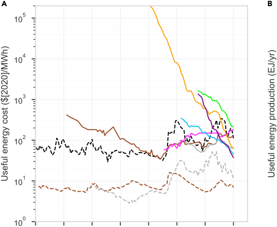

**----- Start of picture text -----** 
A B **----- End of picture text -----** 

Figure 1. Historical costs and production of key energy supply technologies (A) Inflation-adjusted useful energy costs (or prices for oil, coal, and gas) as a function of time. We show useful energy because it takes conversion efficiency into account (see Document S1 section ‘‘End-use conversion efficiencies’’). Electricity generation technology costs are levelized costs of electricity (LCOEs). Battery series show capital cost per cycle and energy stored per year, assuming daily cycling for 10 years (these are not directly comparable with other data series here). Modeled costs of power-to-X (P2X) fuels, such as hydrogen or ammonia, assume historical polymer electrolyte membrane (PEM) electrolyzer costs and a 50–50 mix of solar and wind electricity. (B) Global useful energy production. The provision of energy from solar photovoltaics has, on average, increased at 44% per year for the last 30 years, whereas wind has increased at 23% per year. These are just a few representative time series; all data sources and methods are given in Document S1 section ‘‘Data sources for Figure 1.’’ 

the dramatic exponential rise in the deployment of solar PV, wind, batteries, and electrolyzers over the last decades as they transitioned from niche applications to mass markets. Their rate of increase is similar to that of nuclear energy in the 1970s, but unlike nuclear energy, they have all consistently experienced exponentially decreasing costs. The combination of exponentially decreasing costs and rapid exponentially increasing deployment is different from anything observed in any other energy technologies in the past, and positions these key green technologies to challenge the dominance of fossil fuels within a decade. 

How likely is it that clean energy technology costs will continue to drop at similar rates in the future? Under what conditions will this happen, and what does this imply for the overall cost of the green energy transition? Is there a path forward that can get us to net-zero emissions cheaply and quickly? We address these questions here by applying empirically tested, state-of-the-art cost forecasting methods to energy technologies. 

1Institute for New Economic Thinking at the Oxford Martin School, University of Oxford, Oxford OX1 3UQ, UK 

- 2Smith School of Enterprise and the Environment, University of Oxford, Oxford OX1 3QY, UK 

- 3SoDa Labs, Monash Business School, Monash University, Melbourne, VIC 3800, Australia 

- 4Mathematical Institute, University of Oxford, Oxford OX2 6GG, UK 

- 5Santa Fe Institute, Santa Fe, NM 87501, USA 

- 6Lead contact 

Historically, most energy-economy models have underestimated deployment rates for renewable energy technologies and overestimated their costs[2–7] , which has led to calls for alternative approaches and more reliable technology forecasting 

*Correspondence: rupert.way@smithschool.ox.ac.uk 

https://doi.org/10.1016/j.joule.2022.08.009 

methods[8–15] . Recent efforts have made progress in this direction[16–19] , but they are largely deterministic in nature. The methods we use are probabilistic, allowing us to view energy pathways through the lens of placing bets on technologies. After all, powering modern economies requires betting on some technologies one way or another, be they clean technologies or more fossil fuels—the best we can do is make good bets. Which technologies should we bet on, and how likely are they to pay off? We focus on solar, wind, batteries, and electrolyzers, which we call here ‘‘key green technologies’’, because they could play crucial roles in decarbonization and have strong progress trends that are well documented in publicly available datasets. We also consider the major incumbent energy technologies and compare our forecasts with projections made by influential energy-economy models. We investigate three different energy transition scenarios and discuss the implications for whole system costs and transition pathways. 

Figure 1 provides a glimpse into the diverse nature of technological change as technologies rise and fall from dominance.[20–22] It reflects how innovation and technological learning produce different outcomes for different technologies. The diversity of rates of technological improvement for energy technologies seen in Figure 1 is typical of technologies in general.[23–25] Roughly speaking, technologies can be divided into two groups based on their rates of improvement. For the first group, comprising the vast majority of technologies, inflation-adjusted costs have remained roughly constant through time. Fossil fuels provide a good example: although there has been enormous progress in technologies for discovery and extraction, as easily accessible resources are depleted, it becomes necessary to extract less accessible resources, creating a ‘‘running-to-stand-still’’ dynamic in which prices have remained roughly constant for more than a century (this is true for all minerals[26][,][27] ). Another example of a non-improving technology is carbon capture and storage (CCS); despite significant effort, over its 50-year commercial history for enhanced oil recovery, costs have not declined at all.[28][,][29] There are even cases, such as nuclear power, where costs have increased. By contrast, for a select group of improving technologies, costs have dropped roughly exponentially while deployment has increased exponentially.[23–25] Rates of improvement for technologies such as optical fibers and transistors are as high as 40%–50% per year. Solar PV, wind, and batteries have behaved similarly but with improvement rates closer to 10% (see Document S1 section ‘‘The heterogeneity and persistence of technological change’’). This makes unit costs for these technologies predictable, even if the specific technological innovations that lead to lower costs are not predictable. 

Because the behavior of these two groups of technologies is so different, they require different cost forecasting models. Fossil fuels such as oil and gas are tradable commodities, and according to efficient markets theory, their prices should follow a random walk.[30] This provides a useful approximation for roughly a decade, but over longer spans of time they display mean reversion.[31][,][32] This makes autoregressive models a natural choice, and we use them to forecast oil, coal, and gas prices (see Experimental procedures and Document S1 sections ‘‘AR(1) process,’’ ‘‘Oil,’’ ‘‘Coal,’’ and ‘‘Gas’’). 

For the select group of technologies that are improving, improvement rates are remarkably consistent.[33] For these technologies there are two dominant methods for quantitatively forecasting costs based on historical data. The first is a generalized form of Moore’s law, which says that costs drop exponentially as a function of time (i.e., at a fixed percentage per year).[23][,][24][,][34] The second is Wright’s law, which 

predicts that costs drop as a power law of cumulative production.[35] This relationship is also called an experience curve or learning curve, and cumulative production is also called experience. (For a discussion of challenges and caveats concerning Wright’s law, see Document S1 section ‘‘Wright’s law caveats.’’) Multifactor models have been proposed using additional input variables, such as patenting activity and research and development (R&D) expenditures, but data are limited and they require additional parameters. This can lead to overfitting, resulting in poor out-of-sample forecasts[25] (see Document S1 section ‘‘Bias-variance trade-off’’). Multifactor models have so far not been properly tested, and we do not use them here. 

Successful technologies tend to follow an ‘‘S-curve’’ for deployment, starting with a long phase of exponential growth in production that eventually tapers off due to market saturation.[22] Under Wright’s law, during the exponential growth phase costs drop exponentially in time, as they do for Moore’s law, but when production growth eventually slows, cost improvement also slows. Improving technologies often spend many decades in the exponential growth phase, making it hard to distinguish between Moore’s law and Wright’s law. Forecasts using the two models have similar accuracy in backtesting experiments.[25] 

This brings up the important question of responsiveness to investment. Under Moore’s law, costs are assumed to change exogenously over time, independent of policy and investment. Under Wright’s law, costs depend on experience. Although experience does not directly cause costs to drop, it is correlated with other factors that do, such as level of effort and R&D, and has the essential advantage of being relatively easy to measure.[36][,][37] For comparison, the historical time series displayed in Figure 1 are plotted as experience curves in Figure S17. The same heterogeneity of improvement rates seen in Figure 1 is evident for Wright’s law—the fact that fossil fuel prices have not dropped historically means that experience had no net effect—in stark contrast to key green technologies. In this paper, we focus on Wright’s law because it satisfies the basic intuition that exerting greater effort induces greater effects. (We repeated all our modeling experiments using Moore’s law and found that the qualitative conclusions are similar; see Document S1 section ‘‘Moore’s law results.’’ For a more thorough discussion of causality, see Document S1 section ‘‘Discussion on questions of causality.’’) 

Wright’s law has usually been used to generate point forecasts, meaning that the forecast is a deterministic function of experience, with no estimate of the error of the forecast. Early attempts at introducing error bars did not provide a priori functional forms, which made the data requirements for out-of-sample testing prohibitive.[25][,][38] More recently, a priori error estimates were derived that predict forecasting accuracy as a function of historical improvement rates and volatility, and the number of data points available for forecasting.[33][,][39] Based on comprehensive backtesting, this method was shown to generate reliable probabilistic estimates of future costs. This was done by selecting reference dates in the past and then, using only the data available at the time, making forecasts over all time horizons up to 20 years into the future with respect to each reference date. Using historical data for 50 different technologies, based on roughly 6,000 forecasts, the empirically observed forecast accuracy closely matched the a priori derived estimates on all time horizons up to 20 years ahead.[33][,][39] Our main contribution in this paper is to systematically apply this method—which we call the stochastic experience curve or stochastic Wright’s law—to the energy transition. 

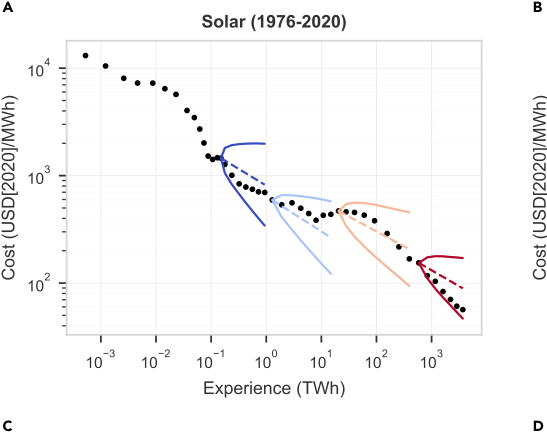

**----- Start of picture text -----** 
A B C D **----- End of picture text -----** 

Figure 2. Historical performance of the stochastic experience curve forecasting method (A–D) The four panels show stochastic Wright’s law applied to observed data for (A) solar, (B) wind, (C) batteries, and (D) P2X electrolyzers. Forecasts are made at regular intervals, using prior cost and deployment data to calibrate the model and ‘‘future’’ deployment data to generate the forecasts. Forecast medians and 95% confidence intervals (CIs) are shown, and colors denote forecast year, from earliest (dark blue) to most recent (red). Costs are LCOEs for solar and wind, and capacity costs for batteries and electrolyzers. P2X electrolyzers are assumed to be PEM electrolyzers here. See Document S1 section ‘‘Data, calibration and technology forecasts’’ for further details and data sources. 

## RESULTS 

To test the accuracy of the stochastic experience curve method for forecasting costs of energy technologies, we applied it to historical data for solar, wind, batteries, and polymer electrolyte membrane (PEM) electrolyzers; the results are shown in Figure 2. Data prior to each forecast year were used to estimate parameters, then observed deployment data in subsequent years were used to generate forecasts conditioned on experience. The forecasts for solar, wind, and batteries are reasonable: most of the future values lie within the 95% confidence interval (CI), consistent with the a priori error estimates. As expected, forecast uncertainty decreases for later forecasts with more historical data. Due to the short dataset and high historical volatility, forecasts for electrolyzers are not as accurate, but the confidence intervals capture this. 

**----- Start of picture text -----** 
A B **----- End of picture text -----** 

![Figure 3. Historical PV cost projections and floor costs (A) The black dots show the observed global average levelized cost of electricity (LCOE) over time. Red lines are LCOE projections reported by the International Energy Agency (IEA);[81] dark blue lines are integrated assessment model (IAM) LCOE projections reported in 2014;[41] and light blue lines are IAM projections reported in 2018.[42][,][43] IAM projections are rooted in 2010 despite being produced in later years. The projections shown are exclusively ‘‘high technological progress’’ cost trajectories drawn from the most aggressive mitigation scenarios, corresponding to the largest projected cost reductions used in these models. Other projections made were even more pessimistic about future PV costs. The inset compares a histogram of projected compound annual reduction rates of PV system investment costs from 2010 to 2020 with what actually occurred (based on all 2,905 scenarios for which the data are available[41] ).](images/empirically-grounded-technology-forecasts-and-the-energy-transition.pdf-0007-04.png)

(B) PV system floor costs implemented in a wide range of IAMs. The colors denote the year the floor cost was reported, ranging from 1997 (dark green) to 2020 (light green). Observed PV system costs are also shown. The cost of PV modules scaled by a constant factor of 2.5 is provided as a reference. For further details and data sources, see Figures 8 and 9A and Document S1 section ‘‘Solar PV electricity.’’ 

It is instructive to compare the accuracy of the forecasts in Figure 2 to the outputs of influential global energy-economy models that are used to inform the Intergovernmental Panel on Climate Change (IPCC) and guide global climate policy.[40] Integrated assessment models (IAMs) are used to evaluate policies and generate scenarios for deployment and cost that are consistent with given climate targets under the assumption of optimal decision-making by economic agents. Their outputs are typically called ‘‘projections’’ to indicate that they are not intended to be used as forecasts. Figure 3 emphasizes this point. Figure 3A shows past projections of solar PV energy costs by the International Energy Agency’s (IEA) World Energy Model and several IAMs and compares them with the observed data. 

The projections shown correspond to scenarios with the most aggressive climate policies and highest rates of technological innovation, i.e., those that produce the highest rates of key green technology deployment and the most optimistic cost declines. Nonetheless, their projected costs have been consistently much higher than historical trends. The inset of Figure 3A gives a histogram of all 2,905 projections of the annual rate at which solar PV system investment costs would fall between 2010 and 2020, as reported by nine separate IAM teams in the AMPERE modeling comparison project.[41] The mean value of these projected cost reductions was 2.6%, 

and all were less than 6%. In stark contrast, during this period, solar PV costs actually fell by 15% per year. 

This makes it clear that it would have been a bad idea to treat these projections as conditional forecasts. By contrast, the stochastic experience curve method produces reliable conditional forecasts of known accuracy (and a published forecast of 2020 solar costs, made in 2010 using the deterministic version of Wright’s law, was indeed far more accurate than any of the IAM or IEA projections made at the time[44] ). One of our goals in this paper is to illustrate how such forecasts are useful for planning the energy transition. (Note that IAM and IEA projections are better for mature incumbent technologies such as fossil fuels, but their projections for solar PV, wind, batteries, and electrolyzers have systematically underestimated deployment and overestimated costs.).[2,5,45] 

Wright’s law is widely used to generate technology cost projections in IAMs.[46–48] However, it is typically used in conjunction with ad hoc constraints such as deployment rate limits and floor costs, i.e., fixed levels that costs are assumed to never fall below. Because IAMs use costs to determine deployment (and vice versa), and many allow perfect foresight, constraints are necessary to prevent sharp cost declines due to Wright’s law from leading to solutions in which key green technologies are deployed faster than is physically or socially plausible. It is difficult to know what constraints are realistic, which leads to ad hoc choices that strongly influence the results. 

The historical record indicates that the constraints on key green technology deployment and costs used in IAMs have so far been much too stringent. For example, as shown in Figure 3B, past floor costs used in IAMs have already repeatedly been violated. We know of no empirical evidence supporting floor costs and do not impose them (see Document S1 section ‘‘The use of floor costs in endogenous technological learning models’’). Similarly, while there are likely limits to how quickly we can deploy key green technologies, it is difficult to know what they are. The outputs of IAMs depend critically on these constraints, which always alter the projections in the same direction, making them more pessimistic about the costs and deployment of key green technologies. As demonstrated here, the exponential growth of key green technologies and the relative accuracy of the unconstrained version of Wright’s law suggest that thus far these constraints have not been binding. The imposition of excessively strong constraints is likely an important reason why the projections of these models have not corresponded to the historical record. 

## Probabilistic cost forecasts for individual technologies 

We applied the methods discussed so far to make forecasts of future energy costs and prices. Given the reasons discussed in the introduction, for solar, wind, batteries, and electrolyzers, we used the stochastic form of Wright’s law; and for oil, coal, and gas, we used an autoregressive model of order 1 (AR(1)). To generate experience curve forecasts, parameters for each technology were estimated from historical data. We then specified scenarios for the future deployment of each technology as a function of time and predicted a distribution of future costs. 

We defined three representative deployment scenarios that we will explain in more detail later. The first scenario is consistent with the energy system transitioning away from fossil fuels by around 2050, and so we label this deployment scenario the ‘‘Fast Transition’’. The second scenario is consistent with eliminating fossil fuels by around 2070, so we label it the ‘‘Slow Transition’’. The final scenario is consistent with fossil 

**----- Start of picture text -----** 
A B C D **----- End of picture text -----** 

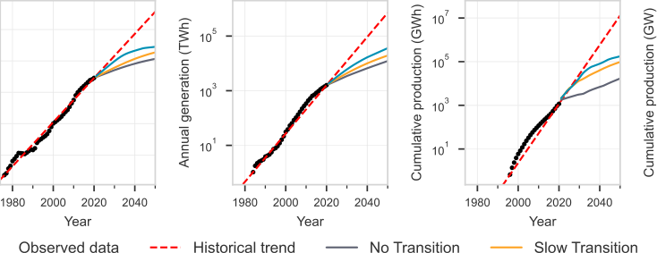

fuels continuing to dominate the energy system, so we label it the ‘‘No Transition’’. Figure 4 shows these three deployment scenarios for each of the four key green technologies in the context of their historical long-term growth trends. The deployment trajectories for these scenarios are consistent with the S-shaped curve widely observed in technology diffusion—the differences between them reflect differences in the timing and abruptness with which the growth of each technology tapers off.[22] 

Figure 5 shows probabilistic forecasts for seven particularly important energy technologies. The main panels of Figures 5A–5D show forecasts for key green technologies in the Fast Transition scenario, which are made using the stochastic version of Wright’s law. The insets show costs versus experience and emphasize that median costs develop identically as a function of experience in all scenarios. The side panels of Figures 5A–5D illustrate that under Wright’s law, forecast distributions depend on the scenario; as a result, in a faster transition, we are likely to reach lower costs sooner. Each Wright’s law technology initially follows its current trend of exponentially decreasing costs, but then progress slows as its rate of deployment drops. To generate fossil fuel cost forecasts, the AR(1) model was calibrated to observed data. For fossil fuels, model parameters depend on past data, but forecasts are independent of deployment, so each technology has a single forecast in all scenarios. 

Figure 5 also shows a selection of future cost projections reported by IAM and IEA studies. As before, we show only their most optimistic projections, i.e., low cost projections that correspond to high technological progress scenarios. Consistent with the historical behavior of these models illustrated in Figure 3, the cost projections are high relative to historical trends. They are also all substantially higher than our forecast medians. 

Of course, the deployment corresponding to these cost projections is not the same as that used to make our forecasts, so they are not perfectly comparable. However, as the boxplot panels show, the disparities persist across all our scenarios, including the No Transition scenario. This makes it clear that our cost forecasts are, all things equal, significantly lower than those used in these highly influential energy-economy models. 

The stochastic version of Wright’s law we use here captures the historical volatility of technological progress and the associated parameter estimation error, and it 

**----- Start of picture text -----** 
ll OPEN ACCESS **----- End of picture text -----** 

**----- Start of picture text -----** 
Article **----- End of picture text -----** 

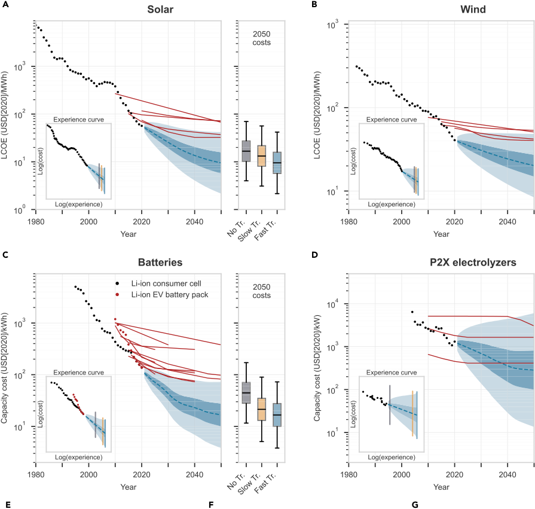

**----- Start of picture text -----** 
A B C D E F G **----- End of picture text -----** 

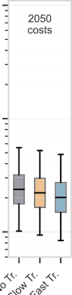

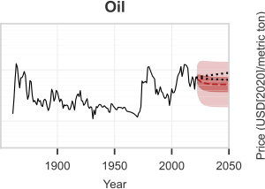

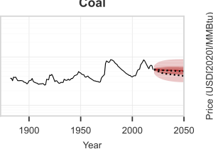

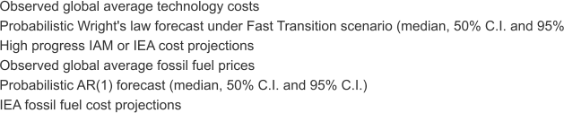

(A–D) The main panels show cost forecast distributions under the Fast Transition scenario for solar PV, wind, batteries, and PEM electrolyzers; the 50% confidence interval (CI) is dark blue, and the 95% CI is light blue. Also shown are several representative recent and past projections corresponding to 

## Figure 5. Continued 

‘‘optimistic’’ mitigation scenarios made by IAMs and the IEA (red lines) (see Figure 9). For batteries, both lithium-ion (Li-ion) consumer cells and Li-ion electric vehicle (EV) battery packs are shown, although their costs have now converged; our forecasts are based on consumer cells, whereas the IEA projections shown are based on EV batteries. The boxplots in the right-hand panels compare cost forecasts in 2050 under the No Transition, Slow Transition, and Fast Transition scenarios. The insets show historical experience curves and forecasts, with learning rates that are independent of the scenario, and vertical lines that indicate how far each technology moves down the probabilistic experience curve in each scenario. (E–G) These panels show probabilistic cost forecasts for oil, coal, and gas based on the AR(1) time-series model (see Document S1section ‘‘Data, calibration and technology forecasts’’ for details of data sources and model calibration). 

projects this uncertainty forward in future cost distributions. It thus provides cost ranges that are supported by empirical evidence, as opposed to the ad hoc ranges that are often used to design energy scenarios and pathways.[49] Similarly, the AR(1) model captures the historical volatility of fossil fuel prices and projects this forward in forecast distributions. Although it might appear that the range of possible outcomes in Figure 5 is larger for solar, wind, and batteries than for fossil fuels, they are actually smaller in absolute terms. The 95% confidence interval for solar costs in 2050 in the Fast Transition scenario, for example, ranges from roughly $2 to $40 per MWh, which is a factor of 20 and an absolute range of $38. By contrast, the price of oil in 2050 ranges from $20 to $110 per barrel, which is a factor of 5.5 but an absolute range of $90. The uncertainty ranges we forecast for fossil fuels are in line with IEA estimates.[81] Note that the uncertainties for electrolyzers are much higher than for the other three key green technologies because the historical series is short and volatile. 

## From single technologies to a full system model 

To forecast the likely costs of the green energy transition and explore how uncertainty in individual technology costs propagates through to uncertainty in system costs, we constructed a simple, transparent model of the global energy system based on well-defined technology deployment scenarios. We added seven more technologies to the seven technologies already presented: coal-fired and gas-fired electricity, nuclear power, hydroelectric power, biopower, redox flow batteries, and electricity networks. While the real-world energy system includes many other technologies, we used this limited ensemble because (1) it covers most of the current final and useful energy of the system (around 90%), (2) it includes sufficiently many diverse technologies for representing a wide range of energy transition pathways, and (3) it maintains a level of simplicity suitable for conveying our main results on future technology costs and their uncertainties. 

Since our study is not intended to be comprehensive, but rather to focus on cost declines for key green technologies, we do not consider liquid biofuels, geothermal power, marine energy, traditional biomass, co-generation of heat, solar thermal energy, or CCS (our results are nevertheless robust to these modeling choices; see Experimental procedures). 

Our approach to scenario construction differs from that currently used in most standard energy-economy models, where deployment in one period is used to project costs in the next, and vice versa. By iterating between costs and deployment in this way, small errors can quickly get amplified, leading to scenarios that are inconsistent with empirically observed trends. Instead, we followed earlier energy system models[50] and constructed scenarios exogenously by specifying how much energy or storage will be provided by each technology as a function of time, just as we did for single technology deployment trajectories earlier (Document S1 section ‘‘Scenario construction’’). We classify energy services into four categories—transport, industry, buildings, and energy sector self-use (Document S1 section ‘‘Model 

components13)—and assume that end-use sector demand grows at an overall rate of 2% per year (we vary this assumption in Document S1 section "Sensitivity to system growth rate"). We impose the constraint that all scenarios must reliably provide identical levels of energy services throughout the economy. This straightforward scenario construction method allowed us to match long-standing technology growth trends. This is in contrast to scenarios generated by IAMs, which typically do not match historical deployment trends for fast-progressing technologies and often fail to match wider transition dynamics too.57

The three scenarios that we introduced earlier—Fast Transition, Slow Transition, and No Transition—are shown in more detail in Figure 6. They run from 2021 to 2070 and were chosen to represent three distinctly different energy system pathways. In the Fast Transition scenario (Figures 6A, 6D, and 6G), solar, wind, and batteries continue to grow at rates that are somewhat slower than their long-term growth rates, as indicated in Figure 4, for approximately a decade. Electrolyzers are at an earlier stage of their S-curve; they behave similarly but stick to their current exponential growth rate for two decades. Following trajectories similar to standard S-curves, once these technologies become dominant, deployment slows to grow at 2% per year. Shortterm storage and electrification of most transport are achieved with batteries, whereas long-duration energy storage (LDES) and all hard-to-electrify applications are served by power-to-X (P2X) fuels, i.e., by using electricity for hydrogen electrolysis and either directly using hydrogen or using it to make other fuels such as ammonia and methane as needed.11 This corresponds to an "electrify almost everything" scenario, with full sector coupling.15 Under this scenario, as shown in Figure 6D, emissions quickly get close to zero. If non-energy sources of carbon emissions such as agriculture and land-use change are brought under control, it would likely meet the 1.5° Paris Agreement target (Document S1 section "Emission reductions and reduced climate risks").

In the Slow Transition scenario (Figures 6B, 6E, and 6H), by contrast, current rapid deployment trends for key green technologies slow down immediately, so that fossil fuels are phased out more slowly and continue to dominate until mid-century. Finally, in the No Transition scenario (Figures 6C, 6F, and 6I), the energy system remains similar to its current form for several decades, as low-carbon energy sources grow only very slowly. This is similar to the reference or "no policy" scenario used by many IAMs. To provide some context for these three scenarios, they are compared with scenarios from the IPCC's Sixth Assessment Report (AR6) in Document S1 section "Comparison with AR6 scenarios." Full scenario details are shown in Document S1 section "Scenarios."

To understand these scenarios, it is important to distinguish final energy, which is the energy delivered for use in sectors of the economy, from useful energy, which is the portion of final energy used to provide energy services, such as heat, light, and kinetic energy (Document S1 section "Energy system description"). Fossil fuels tend to have large end-use conversion losses in comparison to electricity, which means that significantly more final energy is required to obtain a given amount of useful energy. Switching to energy carriers with higher conversion efficiencies (e.g., moving to electric vehicles [EVs]) significantly reduces final energy consumption.13,24 In the Fast Transition scenario, eventually almost all energy services originate with electricity generated by solar PV and wind, which is used either directly, via batteries, or by making P2X fuels for later consumption. As shown by comparing Figures 6G and 6I, the Fast Transition qualitatively increases the role of electricity in the energy system.

**----- Start of picture text -----** 
ll OPEN ACCESS Article **----- End of picture text -----** 

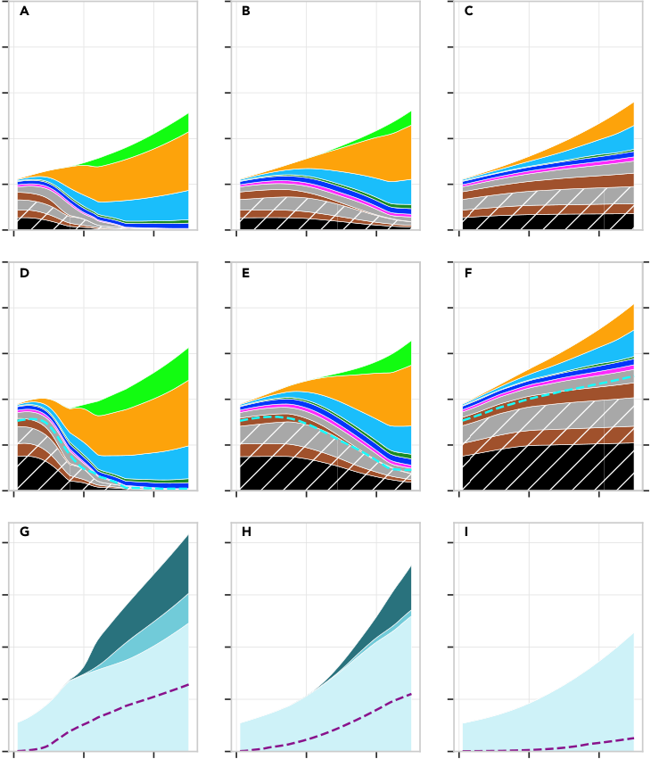

**----- Start of picture text -----** 
A B C D E F G H I **----- End of picture text -----** 

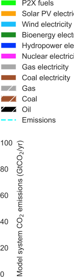

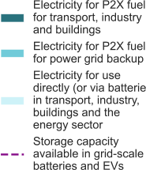

(A–I) The three columns represent the three energy system scenarios. The three rows are: (A–C) annual useful energy provided by each technology as a function of time; (D–F) annual final energy provided by each technology as a function of time; and (G–I) annual electricity generation and storage in gridscale batteries and EV batteries. Total electricity generation is divided between final electricity delivered to the economy and electricity used to produce P2X fuels for hard-to-electrify applications and for power grid backup. 

Our model captures approximately 90% of current final energy (excluding energy carriers that are already renewable, such as bioenergy and biofuels, plus petrochemical feedstock, which is not an energy carrier; see Table S2). Of course though, useful energy is what matters. The model also covers around 90% of current useful energy, but this is more difficult to estimate. Under the Fast Transition and Slow Transition scenarios, this fraction increases with time due to increased electrification. (See Document S1 section ‘‘Model description’’ for further details). 

To estimate full system costs, we need cost forecasts for all technologies. Although coal-fired electricity and gas-fired electricity showed significant cost declines for 

some of the 20th century (as power generation components underwent technological learning; see Figure 1), in the long run their costs are increasingly dominated by fuel costs,[55] so we used the AR(1) model for these (Document S1 sections ‘‘Coal electricity’’ and ‘‘Gas electricity’’). We used stochastic Wright’s law for nuclear power, hydropower, and biopower, although these all have flat or rising costs, so the choice of cost model is immaterial here, and they have only limited significance for energy transition in this analysis. We also used stochastic Wright’s law for flow batteries, but for electricity networks, since we did not have historical cost data characterizing them in enough detail, we pessimistically assumed that unit costs will remain the same as they are now, bearing in mind that costs are heterogeneous (Document S1 section ‘‘Electricity networks’’). 

## How much will each scenario cost? 

There are many different approaches to modeling energy system pathway costs.[56][,][57] We used the ‘‘direct engineering costs’’ approach, in which the overall cost of a scenario is computed by adding up the costs of the component technologies (Document S1 section ‘‘Estimating total system costs’’). We summed the costs of direct-use oil, coal, and gas; electricity generated by seven different technologies; utility-scale grid batteries and electrolyzers; and additional infrastructure for expansion of the electricity grid. For electricity generation costs, we used the levelized cost of electricity (LCOE) metric. This is particularly advantageous here because then the experience curve formulation inherently captures historical progress trends in all LCOE components, including capital costs, capacity factors, and interest rates, which would otherwise be difficult to forecast separately (Document S1 section ‘‘Units and justification for the use of LCOE’’). We estimated infrastructure costs that are not directly covered by technologies included in the model, for example, for fuel storage and distribution (Document S1 section ‘‘Fuels infrastructure’’), and for fueling or charging light duty vehicles (Document S1 section ‘‘Electrification of transport’’), and argue that they are roughly the same across scenarios. 

To apply our probabilistic technology cost forecasting methods in a given scenario, we employed a Monte Carlo approach, simulating many different future cost trajectories, then exponentially discounting future costs to calculate the expected net present cost (NPC) of the scenario up to 2070 (Document S1 sections ‘‘Net present cost of transition’’ and ‘‘Main case results’’). Figure 7A shows annual system costs through time for each scenario. The black boxplots represent the full cost forecast distributions, whereas the colored bars show median expenditures by technology group. This shows how, in the Fast Transition scenario, expenditures transfer rapidly from fossil fuels to key green technologies. 

Figure 7B shows the annual system cost forecast distributions in 2050. Rapid replacement offossilfueltechnologiesbylow-costkey greentechnologies—inpowerandtransport in particular—causes the expected annual energy system cost in 2050 for the Fast Transition scenario to be $514 billion cheaper than that for the No Transition scenario, although the distribution of possible costs for the Fast Transition is wider. After 2050, as shown in Figure 7A, while the median and interquartile range (IQR) remain relatively low, the uncertainty of the Fast Transition in relation to No Transition increases. If costs areintheupperendoftheuncertaintyrange,cheaperalternativeswouldbeused;weare not taking this into account, which is a drawback of our method. 

Figure 7C shows the forecast distribution of the NPC of each scenario at a fixed discount rate of 2%. Although there is considerable uncertainty, the NPC of the Fast Transition is likely to be quite a bit lower than that of the No Transition. By contrast, 

**----- Start of picture text -----** 
Article **----- End of picture text -----** 

**----- Start of picture text -----** 
A **----- End of picture text -----** 

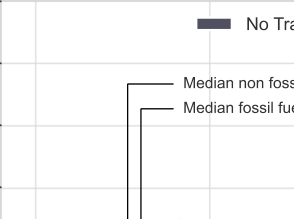

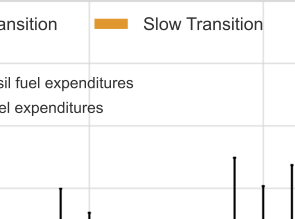

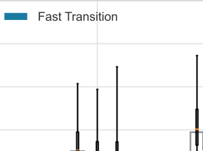

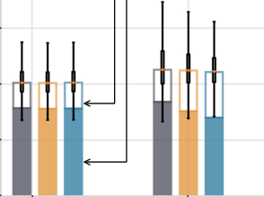

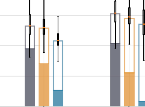

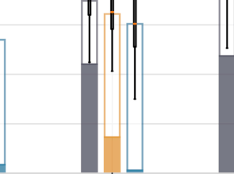

**----- Start of picture text -----** 
B C D **----- End of picture text -----** 

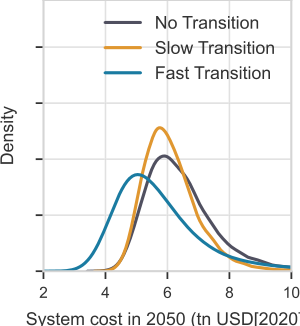

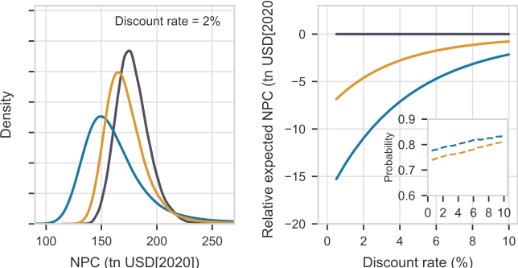

(A) Colored bars show median annual expenditures on fossil fuel and non-fossil fuel technologies in each scenario in trillions of dollars (tn USD). Boxplots show the median and interquartile range (IQR) of total annual expenditures, and whiskers extend from the box by 1.5 times the IQR. (B) Forecast distributions of the annual system cost in 2050 for each scenario. 

(C) Forecast distributions of the net present cost (NPC) of each scenario, for a fixed discount rate of 2%. 

(D) Expected net present cost of each scenario relative to the No Transition scenario, as a function of the discount rate. The inset shows the probability that the NPCs of the Fast Transition and Slow Transition will be lower than that of the No Transition, as a function of the discount rate. 

the Slow Transition is not as cheap as the Fast Transition. This is because the current high spending on fossil fuels continues for decades, and the savings from key green technologies are only realized much later. Nonetheless, it also generates savings relative to the No Transition scenario. Similarly to Figure 7B, the NPC distribution of the Fast Transition is wider than that of the No Transition. Although this is caused by higher technology uncertainty, it is important to note that this increased uncertainty is compensated for by the leftward shift in the distribution, due to expected cost declines associated with scaling up key green technologies. 

Figure 7D shows how the expected NPC of each scenario varies with the discount rate relative to the No Transition scenario. The inset shows that there is roughly an 80% chance that the NPC of the Fast Transition is lower than that of the No Transition, regardless of discount rate. Previous analyses have suggested that whether or not it makes good economic sense to quickly transition to clean energy technologies depends on the discount rate.[58][,][59] But here we show a striking result: the Fast Transition is likely to be much cheaper at all reasonable discount rates. Using the 1.4% social discount rate recommended in the Stern Review,[60] for example, the expected net present saving is roughly $12 trillion. At the higher discount rate of 5%, the expected saving is around $5 trillion. Note that there is some evidence that technological progress does not slow when technologies reach their saturation phase.[61] If this is true, then costs continue to drop at their current pace, according to Moore’s law, and the Fast Transition saves even more relative to the other scenarios (see Document S1 section ‘‘Moore’s law results’’). 

We constructed an additional scenario in which nuclear plays a dominant role in replacing fossil fuels, but this is much more expensive than the other scenarios. For example, using a 1.4% discount rate, the expected NPC is about $25 trillion more than for the No Transition (Document S1 sections ‘‘Slow nuclear transition’’ and ‘‘Main case results’’). 

To enhance the credibility of our estimates, we have used consistently conservative assumptions regarding the costs, performance, and operational requirements of clean energy technologies, and we have done the opposite for fossil fuels. Our requirement that we ground forecasts on historical data means that in many cases we were forced to neglect promising solutions, such as demand-side management of power grids, heat pumps, and end-use efficiency, where there are insufficient data.[13] As a result, the estimated savings presented here should be viewed as lower bounds on the savings likely to be achieved in reality, as many other innovative technologies and solutions are likely to be developed (Document S1 section ‘‘Estimating total system costs’’). 

Our analysis is based on (weighted) global average costs, but there is wide geographic variation in energy costs. Within countries, solar and wind tend to be deployed first in regions where their costs are favorable, but that is not the case globally (Document S1 section ‘‘Regional differences in competing technologies’’). In any case, under the Fast Transition, regional cost differences are quickly overcome through time. In the historical record of solar PV, for example, it takes less than a decade for costs to fall from the 95th to the 5th percentile of the geographical cost distribution at any fixed point in time. Because costs are summed here, global averages are sufficient to estimate total system costs, and we expect that future efforts will take advantage of geographic variation to achieve even cheaper solutions. 

Although the Fast Transition happens quickly, it is still possible to replace the energy system without excessive stranding of capital. Lifetimes of large energy infrastructure projects typically range from 25 to 50 years, meaning that on average about 2%–4% of capacity needs replacing in any given year. In addition, useful energy demand grows at 2% per year in all our scenarios. These two factors make it possible for key green technologies to replace most of the existing energy system in 20 years, and replace the remaining 5% within a few decades more, without necessarily stranding assets before their economic lifetimes. Past estimates that suggest the emissions from existing, planned, and proposed electricity generation infrastructure will exceed the Paris carbon budget assumed that current utilisation rates of such assets will remain constant in future, despite an increasingly competitive market, and 

that all planned and proposed deployments will go ahead, which has become increasingly unlikely over the last decade (Document S1 section ‘‘Stranded assets’’). 

## DISCUSSION 

To avoid confusion, we want to be clear about what we have done and what we have not done. In contrast to most IAMs, which attempt to project both deployment and costs conditioned on policies, we are less ambitious: we only forecast costs conditioned on deployment. Although we have tried to choose deployment scenarios that we think are reasonable, we do not attempt to forecast deployment. Our motivation for taking a less ambitious modeling approach is that this allows us to stay close to the empirical data. For improving technologies, we base all our forecasting on methods that have been carefully tested by making out-of-sample forecasts. We do not assume future technology costs, we forecast them using a well-tested methodology. If the historical data were different, the results would be different. Humility is always required in making forecasts, but we have gone to great lengths to ground our forecasts with empirical data, using statistical methods to assess their reliability. 

Although our Fast Transition scenario is subjective, we believe it is plausible (Document S1 section ‘‘Is the speed of the Fast Transition achievable?’’). The deployment trajectories are in line with past trends. There appear to be no major obstacles to bringing the necessary technologies to scale in terms of land use, sea, climate, raw materials, manufacturing capacity, energy return on energy invested, or system integration.[62] Nonetheless, there are significant institutional challenges, and to stay on the current growth paths for the next decade, policies that enforce portfolio standards and/or stimulate demand will likely be needed. Our key contribution here is to show that if we can stay on these growth paths for the next decade, we will likely realize substantial savings. The cornerstone of the Fast Transition scenario is the timely expansion of key green technologies, because only as these are scaled up can fossil fuels be phased out and the savings be realized. The primary policy implication of our results is that there are enormous advantages to rapid deployment of key green technologies. Achieving this is likely to require strong international policies for building infrastructure, skills training, and making the investments required to realize future gains. 

Our approach is complementary to IAMs. It builds on historical trends directly and thus provides a counterweight to projections by IAMs. We have demonstrated that the constraints that are commonly used in IAMs are likely an important cause of the mismatch of their projections with historical data. Future work could explore how softening these constraints within IAMs changes their projections. 

We want to stress that, unlike IAMs, we are not attempting to find optimal solutions. There are very likely other scenarios that are cheaper than the Fast Transition scenario, which was constructed to explore whether (with sufficiently rapid deployment) a rapid transition can achieve net cost savings, and if so, with what probability. Given the likely future cost of gas, it could be possible to achieve cheaper scenarios by using gas in place of P2X fuels in some locations and applications, but these of course would not be zero-emissions systems. Similarly, while fossil fuel prices have not historically trended down, competition from key green technologies may force them down, although this is feasible only at substantially reduced production levels where only the cheapest fossil fuel producers are competitive.[63] This emphasizes the point that, while most of the Fast Transition is aligned with market forces, policies that discourage the use of fossil fuels will still be needed to fully decarbonize energy. 

Our forecasts are based on time-series methods. It would be preferable to be able to make forecasts based on first principles, but unfortunately this is not possible (even though Wright's law can be derived from a simple model$^{27}$). Certain characteristics of technologies, such as modularity, are predicted to be associated with more rapid technological progress,$^{99}$ but despite some evidence that this is indeed true for modularity, it only explains a small fraction of the variance.$^{43}$ A fundamental limitation of all model-based forecasting methods is data, as this is required for model calibration. When historical data are too sparse or do not exist, these methods can not be used. In such cases, expert elicitation methods may be applied,$^{45}$ although this requires care, as retrospective analysis indicates that time-series methods are more reliable.$^{77}$ Future research to address the issue of sparse data could consider hybrid approaches that combine model-based forecasts with expert judgments, or it could investigate the extent to which technology analogs can reliably be used in forecasting. Perhaps most useful though would be a better understanding of the role of technology aggregation in model-based forecasting; for example, how do forecasts of global solar PV costs relate to specific subtypes of PV and to regional costs? In any case, the time-series methods that we used here are currently the most reliable way to make conditional forecasts of technology costs that agree with historical data.

Although the infrastructure costs for a rapid green energy transition are substantial, we forecast that they are likely to be more than offset by lower energy costs. The largest infrastructure cost is for enhanced grid capacity. In 2050, for example, our estimated electricity network annual expenditure for the Fast Transition is about $670 billion per year, compared with $530 billion per year for the No Transition. However, the expected total system cost in 2050 is about $5.9 trillion per year for the Fast Transition and $6.3 trillion per year for the No Transition. Thus, although the additional $140 billion of grid costs might seem expensive, it is significantly less than the savings due to cheaper energy. The essential reason that the Fast Transition is cheaper than the Slow Transition is because it realizes the cost savings due to cheaper energy sooner—faster deployment increases the probability of rapid progress in key green technologies, so that savings accrue for longer.

The likelihood of cheaper energy raises the possibility of a rebound effect. Cheaper energy may increase global energy demand so that it grows faster than the historical 2% per year rate assumed here. We view this as a "good problem": while this would raise overall costs in the Fast Transition, renewables produce clean energy, and cheaper energy is likely to improve global living standards. To address the potential cost increases, we performed a sensitivity analysis around the system growth rate assumption, by also considering long-run growth rates of 1% and 3%. The resulting energy systems vary widely in size and therefore represent a wide range of plausible population, economic, and technological pathways in future. We found that our results are robust to these variations (Document S1 section "Sensitivity to system growth rate").

In response to our opening question, "Is there a path forward that can get us to net-zero emissions cheaply and quickly?," our answer is: "Very likely, and the savings are probably quite large." Our quantitative analysis supports other recent efforts using up-to-date data and technology assumptions that conclude that the green energy transition may be cheap.$^{10,15,69-71}$ The 2022 IPCC AR6 estimates that the additional cost of decarbonizing the energy system in order to have a greater than 67% chance of keeping warming below 2°C corresponds to a GDP loss in 2050 of 1.3%–2.7%.$^{40}$ Our results suggest that there is likely no cost at all—the transition is expected to be a net economic benefit, raising future GDP.

We have demonstrated that the models used by the IPCC have in the past consistently overestimated key green technology costs. It is important that this bias is addressed (although, as shown in Figure 9A, the PV cost projections in the AR6 database have so far exhibited the same upward bias seen previously). In the context of the probabilistic forecasts presented in this paper, the IPCC database models are only considering costs that are extremely unlikely—in the pessimistic direction— and are not fully exploring the space of plausible scenarios. IPCC conclusions thus appear to be based on an over-sampling of near worst-case scenarios regarding key green technology costs. While even technologies with strong progress trends sometimes experience cost increases, as has occurred for solar in the mid-2000s and the current period due to supply shortages of key production inputs, our results account for these fluctuations. By carefully characterizing historical progress trends and volatility, the stochastic methods used here capture both the downside risk that progress in some key green technologies may stall, and the upside risk—the probability that via routine invention and innovation some technology costs will fall faster than historical trends some of the time. 

Our analysis indicates that even the downside outcomes of a rapid green energy transition are not that bad, due to the dramatic cost declines seen already. When energy system pathways are viewed in terms of bets placed on portfolios of technologies,[72] we find that the Fast Transition scenario has an expected payoff of around $5–$15 trillion. Moreover, it is also a safe bet, with around an 80% probability that it will be cheaper than continuing with a fossil fuel-based system (and 82% when compared with a slower transition). Since the future is uncertain, all public policy and decision-making is ultimately a question of making the smartest bets we can, given the often precarious circumstances we face. Our results suggest that deploying technologies according to the Fast Transition scenario is a very good bet, both in terms of lowest costs and lowest emissions. 

We want to emphasize that our results indicate that a rapid green energy transition is likely to be beneficial, even if climate change were not a problem. When climate change is taken into account, the benefits of the Fast Transition become overwhelming. A common simplified method for estimating economic damages due to climate change is to apply a social cost of carbon (SCC)[15][,][73–75] to emissions. The range of proposed values is vast, but just as an example, at a discount rate of 5%, assuming SCC values in the range $30–300/tCO[2] (rising at 3% per year[58] ) yields total expected Fast Transition savings, up to 2070, of $31–$255 trillion. At a lower discount rate of 1.4%, the range of expected savings is $88–$775 trillion. Thus, the benefits of the Fast Transition are likely much larger than the energy system cost savings evaluated in this study. 

The belief that the green energy transition will be expensive has been a major driver of the ineffective response to climate change for the past 40 years. This pessimism is at odds with past technological cost improvement trends and risks locking humanity into an expensive and dangerous energy future. While arguments for a rapid green transition cite benefits such as the avoidance of climate damages, reduced air pollution, and lower energy price volatility (Document S1 section ‘‘Additional benefits from the Fast Transition’’), these benefits are often contrasted against discussions about the associated costs of the transition. Our analysis suggests that such trade-offs are unlikely to exist: a greener, healthier, and safer global energy system is also likely to be cheaper. Updating expectations to better align with historical evidence could fundamentally change the debate 

## EXPERIMENTAL PROCEDURES

### Resource availability

#### Lead contact

Correspondence and requests for resources should be addressed to rupert.way@smithschool.ox.ac.uk.

#### Materials availability

This study did not generate any new materials.

#### Time-series models

We employ two time-series models for forecasting technology costs. The first is a first-difference stochastic form of Wright's law, developed and tested by Lafond et al.,$^{19}$ which models costs dropping as a power law of cumulative production. Let $c_t$ be the cost and $z_t$ be the experience of a given technology at time $t$, and let $\omega_t \sim \mathcal{N}(0, \sigma_\omega^2)$ be an independent and identically distributed (IID) draw from a normal distribution. Then future costs are predicted using the iterative relationship:

$$\log c_t - \log c_{t-1} = -\omega(\log z_t - \log z_{t-1}) + \omega_t + \mu \omega_{t-1} \quad \text{(Equation 1)}$$

This relationship has three parameters. For a given technology, the experience exponent $\omega$ characterizes the average rate at which costs drop as a function of experience, and the noise variance $\sigma_\omega^2$ characterizes the variability of this relationship. The autocorrelation parameter $\mu$ characterizes the persistence of fluctuations in cost improvements. To avoid overfitting, and to ensure that our forecasts adhere strictly to the same statistical properties as those tested by Lafond et al.,$^{19}$ we use $\mu = 0.19$ for all technologies, which was found to be a good overall choice for 50 different technologies. This was necessary because fitting three parameters to short data series such as those we have here degrades out-of-sample forecasting accuracy. (We also did a comparison of all our results replacing Wright's law by a generalized form of Moore's law [see Document S1 section "Moore's law results"]).

When applying the model to technologies with falling costs, as shown in Figure 5, two features of the model must be stressed. First, the Wright's law model does not simply "assume" that if costs fell in the past then they will fall in future—indeed, costs are predicted to rise with a non-zero probability that depends directly on observed data in the past. Second, despite the downward trends, all cost forecast distributions are always strictly positive, since costs develop in log space.

For fossil fuels we use an AR(1) model:

$$\log c_t = \log c_{t-1} + \delta(\mu - \log c_{t-1}) + \kappa_t, \quad \text{with IID } \kappa_t \sim \mathcal{N}(0, \sigma_\kappa^2), \quad \text{(Equation 2)}$$

where $\mu = E(\log c_t)$ is the unconditional mean of the logarithm of cost, $\sigma_\kappa$ is the volatility of the noise process $\kappa_t$, and $\delta$ is the rate of mean reversion. For comprehensive details on forecasting methods see Document S1 section "Technology cost models."

#### Additional technology cost projections

Figures 8 and 9 show the solar and wind cost projection ensembles that underlie the specific cost projections displayed in Figures 3 and 5.

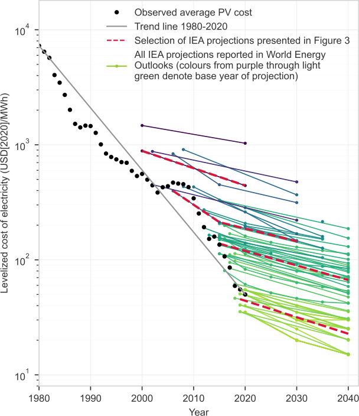

All PV LCOE projections found in the IEA’s World Energy Outlook (WEO) reports are shown in colors varying from purple through light green (note that ‘‘projection’’ here means conditional forecast—this is a forecast that is conditional upon a whole array of modeling assumptions regarding the scenario within which the forecast is embedded). The first such projection was found in the WEO 2001. The four projections we selected to plot in Figure 3 are shown in red and were chosen as examples of ‘‘high progress’’ projections. The first two, published in the WEOs from 2001 and 2008, may be considered high progress projections, because in those reports, cost ranges were provided, and we simply picked the lowest points of those ranges. The upper ends of the ranges were significantly higher. The second two (beginning in 2015 and 2019) may be interpreted as ‘‘high progress’’ projections, because they correspond to the highest mitigation scenarios available in the WEOs from which they are sourced (WEO 2016 and 2020). Note, however, that in those reports, only region-specific cost projections were provided, so we have plotted the simple global average of those values in the high mitigation scenarios. Observed values are from the Performance Curve Database (described in Nagy et al.[25] ) up to 2010 and from Bloomberg New Energy Finance (BNEF) thereafter. 

See Document S1 section ‘‘Data, calibration, and technology forecasts’’ for more details on data sources. 

## Scenario construction 

We model the supply of energy services increasing at a fixed rate per year (2% in our main specification). Energy services include heating/cooling, light, mobility, sustenance, materials, hygiene, and communications, but since these are hard to measure and data are sparse, we take useful energy as a proxy for energy services. Energy transition scenarios are constructed by assuming that growth rates of energy carriers and technologies follow logistic (‘‘S’’) curves with specified start and end points consistent with the growth of total useful energy. We model the relationship 

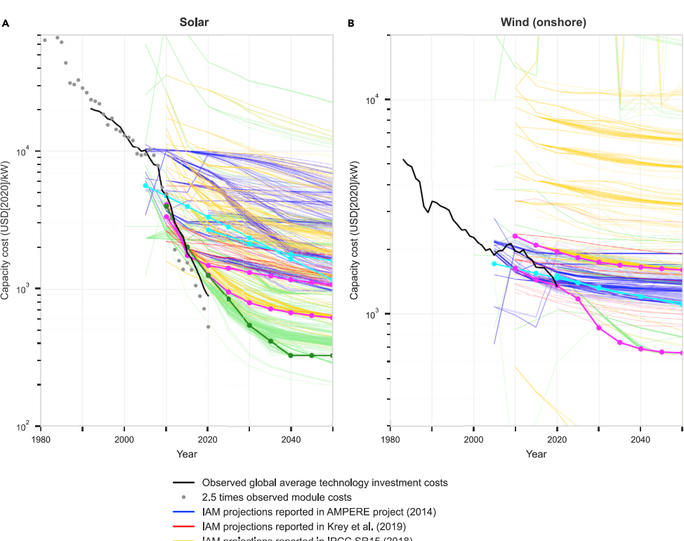

**----- Start of picture text -----** 
A B **----- End of picture text -----** 

Capital cost projections reported by various modeling comparison projects are shown as blue, red, yellow, and green lines for (A) PV and (B) onshore wind. Each line corresponds to a single scenario. To construct and plot the LCOE projections in Figure 3, we selected two capacity cost projections reported in 2014 (cyan lines) and two reported in 2018 (magenta lines). For Figure 5, we also added one PV projection reported in 2022 (dark green). These may all be interpreted as ‘‘high progress’’ projections because they are among the lowest in their cohorts (i.e., the cyan lines are on the low end of the suite of blue lines, the magenta lines are low relative to the red and yellow lines, and the dark green line is low relative to the green lines). Note that these are (in eight out of nine cases) global average values, whereas some other projections are region specific. For PV, the projections plotted are as follows: (1) model: MESSAGE, scenario: ‘‘AMPERE3-450,’’ region: World (from AMPERE[41] ); (2) model: DNE21, scenario: ‘‘AMPERE3-450,’’ region: World (from AMPERE[41] ); (3) model: IMAGE 3.0, scenario: baseline, region: China (from Krey et al.[42] ); (4) model: REMIND-MAgPIE 1.7–3.0, scenario: SMP_1p5C_early, region: World (from SR15[43] ); and (5) model: WITCH 5.0, scenario: EN_INDCi2030_1000, region: World (from AR6[40] ). For wind, the projections plotted are as follows: (1) model: MESSAGE, scenario: AMPERE3-450, region: World (from AMPERE[41] ); (2) model: DNE21, scenario: AMPERE3-450, region: World (from AMPERE[41] ); (3) model: AIM/CGE 2.1, scenario: TERL_15D_LowCarbonTransportPolicy, region: World (from SR15[43] ); and (4) model: REMIND-MAgPIE 1.7–3.0, scenario: SMP_1p5C_early, region: World (from SR15[43] ). To calculate LCOEs, we used technology lifetimes and discount rates reported in Krey et al.,[42] and operations and maintenance (O&M) values from the original studies where possible (and if not, then Krey et al.[42] values again). We used global average capacity factors of 0.18 for PV and 0.3 for wind, based on recent data reported by IRENA[83] and IEA.[76] Observed data sources for PV are given in Table S21. Wind data are from IRENA.[83] 

between final and useful energy based on average conversion efficiency factors given by DeStercke.[77] We take these conversion factors to be static and apply them on a per-energy-carrier, per-sector basis. The model therefore does not 

include improvements in the underlying efficiency of each energy carrier at providing energy services, but it does allow efficiency improvements on a per-sector basis, via energy carrier substitution. For example, the conversion efficiencies of oil and electricity in the transport sector are assumed constant, yet the efficiency of the sector as a whole may be improved by switching from oil to electricity. The end point of each scenario in 2070 is defined by the shares of technologies providing electricity generation and the shares of energy carriers providing final energy. The start points for all scenarios are identical and match the current shares in the base year, 2020. Details of all growth rates, timings, and energy carrier mixes for each scenario are given in Document S1 sections ‘‘Scenario construction’’ and ‘‘Scenarios.’’ 

Our modeling approach is based on two key design principles: (1) include only the minimal set of variables necessary to represent most of the global energy system and the most important cost and production dynamics, and (2) ensure all assumptions and dynamics are technically realistic and closely tied to empirical evidence (Document S1 section ‘‘General approach’’). This means that we focus on energy technologies that have been in commercial use for sufficient time to develop a reliable historical record for forecasting purposes. This is also an essential constraint because deployment of technologies typically takes a long time, and only technologies that have track records are positioned to play an immediate role in confronting climate change.[22] 

We choose a level of model granularity well suited to the probabilistic forecasting methods used, i.e., one that allows accurate model calibration and ensures overall cost-reduction trends associated with cumulative production are captured for each technology. Our model design can be run on a laptop, is easy to understand and interpret, and allows us to calibrate all components against historical data so that the model is firmly empirically grounded. The historical data do not exist to do this on a more granular level. 

We omitted several minor energy technologies. Co-generation of heat, traditional biomass, marine energy, solar thermal energy, and geothermal energy were omitted either due to insufficient historical data or because they have not exhibited significant historical cost improvements, or both. Liquid biofuels were also excluded because any significant expansion would have high environmental costs (Document S1 section ‘‘Bioenergy, solar thermal energy, marine energy and geothermal energy’’). Finally, CCS in conjunction with fossil fuels was omitted because (1) it is currently a very small, low growth sector, (2) it has exhibited no promising cost improvements so far in its 50-year history, and (3) the cost of fossil fuels provides a hard lower bound on the cost of providing energy via fossil fuels with CCS (Document S1 section ‘‘CCS’’). This means that within a few decades electricity produced with CCS will likely not be competitive even if CCS is free. There may of course be some role for CCS in non-energy, direct-emission applications, but this is outside the scope of this paper. 

Since renewable energy production is variable, storage is essential. In the Fast Transition scenario we have allocated so much storage capacity using batteries and P2X fuels that the entire global energy system could run for a month without any sun or wind (Document S1 section ‘‘Energy storage and flexibility requirements’’). This is a sensible choice because both batteries and electrolyzers have highly favorable trends for cost and production (Document S1 sections ‘‘Batteries’’ and ‘‘Hydrogen and electrolyzers’’). From 1995 to 2018 the production of lithium-ion (Li-ion) batteries increased at 30% per year, while costs dropped at 12% per year, giving an 

experience curve comparable to that of solar PV.[78] Currently, about 60% of the cost of electrolytic hydrogen is electricity, and hydrogen is around 80% of the cost of ammonia,[79] so these automatically take advantage of the high progress rates for solar PV and wind. 

We ensure system reliability constraints are met—including robustness to seasonal demand variations—by providing sufficient levels of energy storage, firm capacity resources, over-generation of variable renewable energy (VRE) sources, and network expansion[80] (Document S1 section ‘‘Energy storage and flexibility requirements’’). To be specific, when VRE penetration is high, we ensure enough utility-scale battery storage is available to store 20% of average daily electricity generation (though note that daily generation is much higher than daily end-use consumption, because excess generation is used to produce P2X fuels). Flow batteries are able to store a further 10% of average daily generation. In addition, when VRE penetration is high, transport is electrified, which as well as being a flexible demand source, could also act as another storage source (though system reliability constraints are met here without relying on it). Excess VRE is used to produce P2X fuels in sufficient quantities to supply all end-use sector requirements and also to provide global power grid backup for 1 month each year. 

## Data and code availability 

We used data from a wide range of sources. Many of these were free and openly available on the internet, but some were accessed via standard university-wide subscription licenses held by the University of Oxford. Sources include: the IEA,[81] BP,[82] the International Renewable Energy Agency,[83] Lazard,[84] the U.S. Energy Information Administration,[85] Bloomberg New Energy Finance, Bloomberg L.P. (via Bloomberg Terminal), and several academic papers. For more details, see Document S1 section ‘‘Data, calibration and technology forecasts.’’ All data will be made available upon request (unless legal restrictions exist). 

The code used in this analysis will be made available upon request. 

## SUPPLEMENTAL INFORMATION 

Supplemental information can be found online at https://doi.org/10.1016/j.joule. 2022.08.009. 

## ACKNOWLEDGMENTS 

This work was supported by funding from Partners for a New Economy (R.W. and J.D.F.); Baillie Gifford (J.D.F.); the European Union’s Horizon 2020 research and innovation programme under grant agreement no. 730427 (COP21 RIPPLES) (R.W.); and the Oxford Martin School, through the Institute of New Economic Thinking and the Post-Carbon Transition programme (LDR00530) (M.C.I. and P.M.). This research was also funded by the Economics of Energy Innovation and System Transition project (EEIST), which is jointly funded through UK Aid by the UK Government Department for Business, Energy, and Industrial Strategy (BEIS) and the Children’s Investment Fund Foundation (CIFF) (R.W. and M.C.I.). The contents of this manuscript represent the views of the authors and should not be taken to represent the views of the UK government or CIFF. The authors gratefully acknowledge all these sources of financial support and, additionally, the Institute for New Economic Thinking at the Oxford Martin School for its continuing support. The authors also thank Lucas Kruitwagen and Jing Meng for valuable contributions to the work. 

## AUTHOR CONTRIBUTIONS

Conceptualization, J.D.F.; methodology, R.W. and J.D.F.; investigation, R.W.; data curation, R.W. and M.C.I.; formal analysis, R.W. and M.C.I.; writing—original draft, J.D.F., R.W., M.C.I., and P.M.; writing—review & editing, J.D.F., R.W., M.C.I., and P.M.; visualization, R.W.; supervision, J.D.F.; funding acquisition, J.D.F.

## DECLARATION OF INTERESTS

The authors declare no competing interests.

Received: December 23, 2021
Revised: May 16, 2022
Accepted: August 19, 2022
Published: September 13, 2022

## REFERENCES

1. Perlin, J. (1999). From Space to Earth: the Story of Solar Electricity (Aatech Publications).

2. Creutzig, F., Agoston, P., Goldschmidt, J.C., Luderer, G., Nemet, G., and Pietzcker, R.C. (2017). The underestimated potential of solar energy to mitigate climate change. Nat. Energy *2*, 17140. https://doi.org/10.1038/nenergy.2017.140.

3. Xiao, M., Junne, T., Haas, J., and Klein, M. (2021). Plummeting costs of renewables - are energy scenarios lagging? Energy Strategy Rev *35*, 100636. https://doi.org/10.1016/j.esr.2021.100636.

4. Jean-Rozen, M., and Trutnevyte, E. (2021). Sources of uncertainty in long-term global scenarios of solar photovoltaic technology. Nat. Clim. Change *11*, 266–273. https://doi.org/10.1038/s41558-021-00998-8.

5. Hoekstra, Auke, Steinbuch, M., and Verbong, G. (2017). Creating agent-based energy transition management models that can uncover profitable pathways to climate change mitigation. Complexity *2017*, 1–23. https://doi.org/10.1155/2017/1967645.

6. Shiraki, H., and Sugiyama, M. (2020). Back to the basic: toward improvement of technoeconomic representation in integrated assessment models. Clim. Change *162*, 13–24. https://doi.org/10.1007/s10584-020-02731-4.

7. Victoria, M., Haegel, N., Peters, I.M., Sinton, R., Jäger-Waldau, A., del Cañizo, C., Breyer, C., Stocks, M., Blakers, A., Kaizuka, I., et al. (2021). Solar photovoltaics is ready to power a sustainable future. Joule *5*, 1041–1056. https://doi.org/10.1016/j.joule.2021.03.005.

8. Stein, N. (2016). Economic numeric climate models are grossly misleading. Nature *530*, 407–409. https://doi.org/10.1038/530407a.

9. Pindyck, R.S. (2013). Climate change policy: what do the models tell us? J. Econ. Lit. *51*, 860–872. https://doi.org/10.1257/jel.51.3.860.

10. Pindyck, R.S. (2017). The use of models in science and economics of climate change. Environ. Resour. Econ. *68*, 581–594.

11. Gambhir, A., Butnar, I., Li, P.-H., Smith, P., and Strachan, N. (2019). A review of criticisms of integrated assessment models and proposed approaches to address these, through the lens of biocs. Energies *12*, 1747. https://doi.org/10.3390/en12091747.

12. McCollum, D.L., Gambhir, A., Rogelj, J., and Wilson, C. (2020). Energy modellers should explore extremes more systematically in scenarios. Nat. Energy *5*, 104–107. https://doi.org/10.1038/s41560-020-0555-3.

13. Loomis, A.B., Gege-Ekkstad, D., Mendoza, L., Kammen, D.M., and Glassman, J.M. (2019). Recalibrating climate prospects. Environ. Res. Lett. *14*, 105004.

14. Pye, S., Broad, O., Bataille, C., Brockway, P., Daly, H.E., Freeman, R., Gambhir, A., Geden, O., Rogan, F., Sanghvi, S., et al. (2021). Modelling net-zero emissions energy systems requires a change in approach. Clim. Policy *21*, 222–231. https://doi.org/10.1080/14693062.2020.1824891.

15. Stern, N., Stiglitz, J.E., and Taylor, C. (2021). The economics of immense risk, urgent action and radical change: towards new approaches to the economics of climate change. J. Econ. Methodol. *29*, 1–36.

16. Grubler, A., Wilson, C., Bento, N., Boza-Kiss, B., Krey, V., McCollum, D.L., Rao, N.D., Riahi, K., Rogelj, J., De Stercke, S., et al. (2018). A low energy demand scenario for meeting the 1.5°C target and sustainable development goals without negative emission technologies. Nat. Energy *3*, 515–527. https://doi.org/10.1038/s41560-018-0172-6.

17. Victoria, M., Zhu, K., Brown, T., Andresen, G.B., and Greiner, M. (2020). Early decarbonisation of the European energy system pays off. Nat. Commun. *11*, 6223. https://doi.org/10.1038/s41467-020-20015-4.

18. He, G., Lin, J., Sifuentes, F., Liu, X., Abhyankar, N., and Phadke, A. (2020). Rapid cost decrease of renewables and storage accelerates the decarbonization of china's power system. Nat. Commun. *11*, 2486. https://doi.org/10.1038/s41467-020-16184-x.

19. Bogdanov, D., Ram, M., Aghahosseini, A., Gulagi, A., Oyewo, A.S., Child, M., Caldera, U., Sadovskaia, K., Farfan, J., De Souza Noel Simas Barbosa, L., et al. (2021). Low-cost renewable electricity as the key driver of the global energy transition towards sustainability. Energy *227*, 120467. https://doi.org/10.1016/j.energy.2021.120467.

20. Arthur, W.B. (2011). The Nature of Technology: What It Is and How It Evolves (Free Press).

21. Funguen, R. (2008). Hear, Power and Light: Revolutions in Energy Services (Edward Elgar Publishing).

22. Grubler, A., Nakicenovic, N., and Victor, D.G. (1999). Dynamics of energy technologies and global change. Energy Policy *27*, 247–280. https://doi.org/10.1016/S0301-4215(98)00067-6.

23. Koh, Heebyung, and Magee, C.L. (2006). A functional approach for studying technological progress: application to information technology. Technol. Forecasting Soc. Change *73*, 1061–1083. https://doi.org/10.1016/j.techfore.2006.04.001.

24. Koh, H., and Magee, C.L. (2008). A functional approach for studying technological progress: extension to energy technology. Technol. Forecasting Soc. Change *75*, 735–758. https://doi.org/10.1016/j.techfore.2007.05.007.

25. Nagy, B., Farmer, J.D., Bui, Q.M., and Trancik, J.E. (2013). Statistical basis for predicting technological progress. PLoS One *8*, e52669.

26. U.S. Geological Survey (2022). Mineral Commodity Summaries 2022. Technical report. http://pubs.er.usgs.gov/publication/mcs2022.

27. Trancik, J.E., Jean, J., Kavlak, G., Klemun, M.M., Edwards, M.R., McNerney, J., Miotti, M., Brown, P.R., Mueller, J.M., and Needell, Z.A. (2015). Technology Improvement and Emissions Reductions as Mutually Reinforcing Efforts: Observations from the Global Development of Solar and Wind Energy Technologies (MIT Press).

28. Reiner, D.M. (2016). Learning through a portfolio of carbon capture and storage demonstration projects. Nat. Energy *1*, 1–7.

29. Rubin, E.S., Davison, J.E., and Herzog, H.J. (2015). The cost of CO$_2$ capture and storage. Int. J. Greenhouse Gas Control *40*, 378–400. Special Issue commemorating the 10th year anniversary of the publication of the Intergovernmental Panel on Climate Change Special Report on CO2 Capture and Storage. https://doi.org/10.1016/j.ijggc.2015.05.018.

30. Mlakar, B.D. (1993). Inflation Walk down Wall Street (Penzon & Co).

31. Pindyck, R.S. (1999). The long-run evolution of energy prices. Energy J. *20*, 19499089. http://www.jstor.org/stable/41322828.

32. Shafiee, S., and Topal, E. (2010). A long-term view of worldwide fossil fuel prices. Appl. Energy *87*, 988–1000. https://doi.org/10.1016/j.apenergy.2009.09.012.

33. Farmer, J.D., and Lafond, F. (2016). How predictable is technological progress? Res. Policy *45*, 647–665.

34. Moore, G.E. (1998). Cramming more components onto integrated circuits. Proc. IEEE *86*, 82–85.

35. Wright, T.P. (1936). Factors affecting the cost of airplanes. J. Aeronaut. Sci. *3*, 122–128.

36. Thompson, P. (2012). The relationship between unit cost and cumulative quantity and the evidence for organizational learning-by-doing. J. Econ. Perspect. *26*, 203–224.

37. Bilrajewski-Bahrlola, J., Vandziro, E., and Tarasi, M. (2013). Bending the learning curve. Energy Econ. *52*, 586–599. https://doi.org/10.1016/j.eneco.2015.09.007.

38. Albrith, S. (2008). Forecasting technology costs via the experience curve—myth or magic? Technol. Forecasting Soc. Change *75*, 952–983.

39. Lafond, F., Bailey, A.G., Bakker, J.D., Rebois, D., Zadourian, A., McSharry, P., and Farmer, J.D. (2018). How well do experience curves predict technological progress? a method for making distributional forecasts. Technol. Forecasting Soc. Change *128*, 104–117.

40. IPCC (2022). Mitigation of climate change. Contribution of working Group III to the sixth assessment report of the Intergovernmental Panel on Climate Change. In Climate Change 2022 (Cambridge University Press).

41. Riahi, K., Kriegler, E., Johnson, N., Bertram, C., den Elzen, M., Eom, J., Schaeffer, M., Edmonds, J., Isaac, M., Krey, V., et al. (2015). Locked into Copenhagen pledges— implications of short-term emission targets for the cost and feasibility of long-term climate goals. Technol. Forecasting Soc. Change *90*, 8–23. https://doi.org/10.1016/j.techfore.2013.09.016.

42. Krey, V., Guo, F., Kolp, P., Zhou, W., Schaeffer, R., Awasthy, A., Bertram, C., de Boer, H.-S., Fragkos, P., Fujimori, S., et al. (2019). Looking under the hood: a comparison of techno-economic assumptions across national and global integrated assessment models. Energy *172*, 1254–1267. https://doi.org/10.1016/j.energy.2018.12.131.

43. Heppestein, M., Kriegler, E., Krey, V., Riahi, K., Rogelj, J., Calvin, K., Humpenödler, F., Popp, A., Rose, S.K., Wepert, J., et al. (2019). IIASA

(continued bibliography)

Science Express and Data Hosted by NASA Technical Report (IIASA).

44. Ferguson, C.D., Marburger, L.E., Doyle Farmer, J.D., and Makhijani, A. (2010). A US nuclear future? Nature *467*, 391–393. https://doi.org/10.1038/467391a.

45. Wilson, C., Grubler, A., Bauer, N., Krey, V., and Riahi, K. (2013). Future capacity growth of energy technologies: are scenarios consistent with historical evidence? Clim. Change *118*, 381–395. https://doi.org/10.1007/s10584-012-0618-y.

46. Anandarajah, G., McDonald, M., and Ekins, P. (2013). Decarbonising road transport with hydrogen and electricity, long term global technology learning scenarios. Int. J. Hydr. Energy *38*, 3419–3432.

47. Neuberger, C.F., Rubin, E.S., Staffell, I., Shah, N., and Mac Dowell, N. (2017). Power-capacity expansion planning considering endogenous technology cost learning. Appl. Energy *204*, 831–845.

48. DeCarolis, J., Daly, H., Dodds, P., Keppo, I., Li, F., McDowall, W., Pye, S., Strachan, N., Trutnevyte, E., Usher, W., et al. (2017). Formalizing best practice for energy system optimization modelling. Appl. Energy *194*, 184–198.

49. Friko, O., Havlik, P., Rogelj, J., Klimont, Z., Gusti, M., Johnson, N., Kolp, P., Strubegger, M., Valin, H., Amann, M., et al. (2017). The marker quantification of the shared socioeconomic pathway 2: a middle-of-the-road scenario for the 21st century. Global Environ. Change *42*, 251–267. https://doi.org/10.1016/j.gloenvcha.2016.06.004.

50. Schwanitz, A., and Niedermann, M. (2020). Modeling uncertainty in induced technological change. Energy Policy *38*, 957–970.

51. Trutnevyte, E. (2016). Does cost optimization approximate the real-world energy transition? Energy *106*, 182–193.

52. Davis, S.J., Lewis, N.S., Shaner, M., Aggarwal, S., Arent, D., Azevedo, I.L., Benson, S.M., Bradley, T., Brouwer, J., Chiang, Y.-m., et al. (2018). Net-zero emissions energy systems. Science *360*, eaas9793. https://doi.org/10.1126/science.aas9793.

53. Brown, T., Schlachtberger, D., Kies, A., Schramm, S., and Greiner, M. (2018). Synergies of sector coupling and transmission reinforcement in a cost-optimised, highly renewable European energy system. Energy *160*, 720–739. https://doi.org/10.1016/j.energy.2018.06.222.

54. Eyre, N. (2019). Energy efficiency in the energy transition (European Council for an Energy-Efficient Economy Summer Study Proceedings), pp. 247–256.

55. McNerney, J., Doyne Farmer, J., and Trancik, J.E. (2011). Historical costs of coal-fired electricity and implications for the future. Energy Policy *39*, 3042–3054.

56. Krey, V. (2014). Global energy-climate scenarios and models: a review. WIREs Energy Environ. *3*, 363–383. https://doi.org/10.1002/wene.98.

57. Edenhofer, O., Lessmann, K., Kemfert, C., Grubb, M., and Köhler, J. (2006). Induced technological change: exploring its implications for the economics of atmospheric stabilization: synthesis report from the innovation modeling comparison project. Energy J. *SI2006*, 19499089. http://www.jstor.org/stable/23297027.

58. Nordhaus, W.D. (2017). Revisiting the social cost of carbon. Proc. Natl. Acad. Sci. USA *114*, 1518–1523.

59. Broome, J. (2008). The ethics of climate change. Sci.Am. *298*, 96–102. http://www.jstor.org/stable/26000446.

60. Stern, N. (2007). The Economics of Climate Change: the Stern Review (Cambridge University Press).

61. Wos, J.R., and Magee, C.L. (2021). Relationship between technological improvement and innovation diffusion: an empirical test. Technol. Forecasting Soc. Change *126*, 1–16. https://doi.org/10.1016/j.techfore.2017.11.001.

62. Lowe, R.J., and Drummond, P. (2022). Solar, wind and logistic substitution in global energy supply to 2050—barriers and implications. Renew. Sustain. Energy Rev. *153*, 111720. https://doi.org/10.1016/j.rser.2021.111720.

63. Mercure, J.-F., Pollitt, H., Vinuelas, J.E., Edwards, N.R., Holden, P.B., Chewpreecha, U., Salas, P., Sognnaes, I., Lam, A., and Knobloch, F. (2018). Macroeconomic impact of stranded fossil fuel assets. Nat. Clim. Change *8*, 588–593. https://doi.org/10.1038/s41558-018-0182-1.

64. McNerney, J., Farmer, J.D., Redner, S., and Trancik, J.E. (2011). Role of design complexity in technology improvement. Proc. Natl. Acad. Sci. USA *108*, 9008–9013.

65. Wilson, C., Grubler, A., Bento, N., Healey, S., De Stercke, S., and Zimm, C. (2020). Granular technologies to accelerate decarbonization. Science *368*, 36–39. https://doi.org/10.1126/science.aaz8060.

66. Verdolini, E., Anadon, L.D., Baker, E., Bosetti, V., and Aleluia Reis, L.A. (2018). Future prospects for energy technologies: insights from expert elicitations. Rev. Environ. Econ. Policy *12*, 133–153. https://doi.org/10.1093/reep/rex028.

67. Meng, J., Way, R., Verdolini, E., and Diaz Anadon, L.D. (2021). Comparing expert elicitation and model-based probabilistic technology cost forecasts for the energy transition. Proc. Natl. Acad. Sci. USA *118*, e1917445118. https://doi.org/10.1073/pnas.1917445118.

68. Zenni, C., Goldenberg, J., Nakicenovic, N., and Busch, S. (2019). Is the renewables transformation a piece of cake or a pie in the sky? Energy Strategy Rev. *26*, 100401. https://doi.org/10.1016/j.esr.2019.100401.

69. Grubb, M., Wieners, C., and Yang, P. (2021). Modeling myths: on dna and dynamic realism in integrated assessment models of climate change mitigation. WIREs Clim. Change *12*, e698. https://doi.org/10.1002/wcc.698.

70. Köberle, A.C., Vandyck, T., Guivarch, C., Macaluso, N., Bosetti, V., Gambhir, A., Tavoni,

Joule *6*, 2057–2082, September 21, 2022 **2081**

M., and Rogelj, J. (2021). The cost of mitigation revisited. Nat. Clim. Change 11, 1035–1045. https://doi.org/10.1038/s41558021-01203-6. 

71. Luderer, G., Madeddu, S., Merfort, L., Ueckerdt, F., Pehl, M., Pietzcker, R., Rottoli, M., Schreyer, F., Bauer, N., Baumstark, L., et al. (2022). Impact of declining renewable energy costs on electrification in low-emission scenarios. Nat. Energy 7, 32–42. https://doi. org/10.1038/s41560-021-00937-z. 

72. Way, R., Lafond, F., Lillo, F., Panchenko, V., and Farmer, J.D. (2019). Wright meets Markowitz: how standard portfolio theory changes when assets are technologies following experience curves. J. Econ. Dyn. Control 101, 211–238. https://doi.org/10.1016/j.jedc.2018. 10.006. 

73. Pindyck, R.S. (2019). The social cost of carbon revisited. J. Environ. Econ. Manag. 94, 140–160. https://doi.org/10.1016/j.jeem.2019. 02.003. 

74. Kikstra, J.S., Waidelich, P., Rising, J., Yumashev, D., Hope, C., and Brierley, C.M. (2021). 

The social cost of carbon dioxide under climate-economy feedbacks and temperature variability. Environ. Res. Lett. 16, 094037. https://doi.org/10.1088/1748-9326/ ac1d0b. 

75. Aldy, J.E., Kotchen, M.J., Stavins, R.N., and Stock, J.H. (2021). Keep climate policy focused on the social cost of carbon. Science 373, 850–852. https://doi.org/10.1126/science. abi7813. 

76. IEA (2019). Offshore wind Outlook 2019. Technical report (International Energy Agency). 

77. De Stercke, S. (2014). Dynamics of Energy Systems: a Useful Perspective. IIASA interim report (IIASA). http://pure.iiasa.ac.at/id/eprint/ 11254/. 

78. Ziegler, M.S., and Trancik, J.E. (2021). Reexamining rates of lithiumion battery technology improvement and cost decline. Energy Environ. Sci. 14, 1635–1651. https://doi.org/10. 1039/D0EE02681F. 

79. IEA (2019). The Future of Hydrogen. Technical report (International Energy Agency). 

80. Tong, D., Farnham, D.J., Duan, L., Zhang, Q., Lewis, N.S., Caldeira, K., and Davis, S.J. (2021). Geophysical constraints on the reliability of solar and wind power worldwide. Nat. Commun. 12, 6146. https://doi.org/10.1038/ s41467-021-26355-z. 

81. IEA (2021). World Energy Outlook 2021. Technical report (International Energy Agency). 

82. BP (2021). BP Statistical Review of World Energy. Technical report (BP plc). 

83. IRENA (2021). Renewable Power Generation Costs in 2020 (International Renewable Energy Agency). Technical report. 

84. Lazard (2021). Lazard’s Levelized Cost of Energy Analysis Versions 2–15. Technical report (Lazard). 

85. EIA (2021). Annual Energy Outlook Reports 1979–2021. Technical report (Energy Information Administration). 

