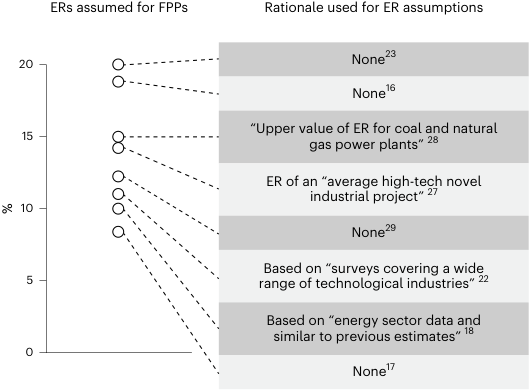
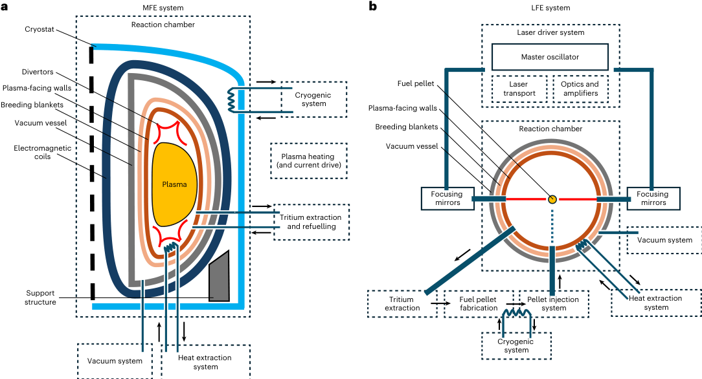
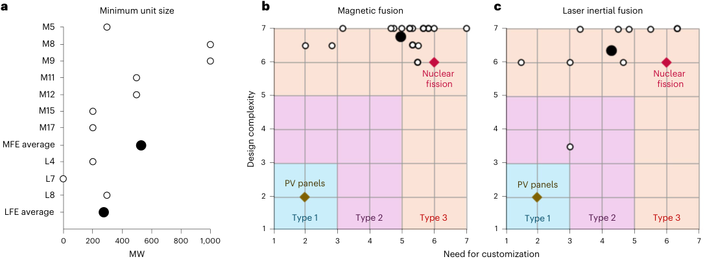
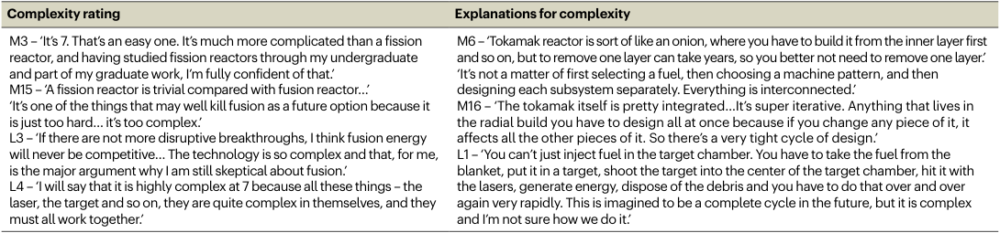
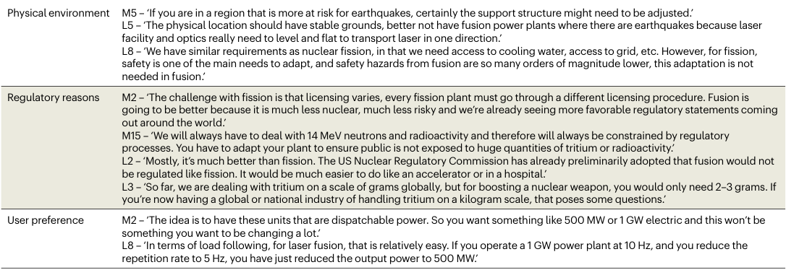
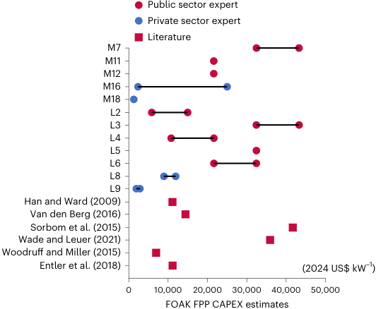
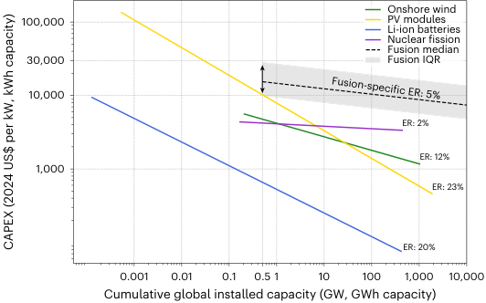
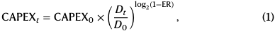
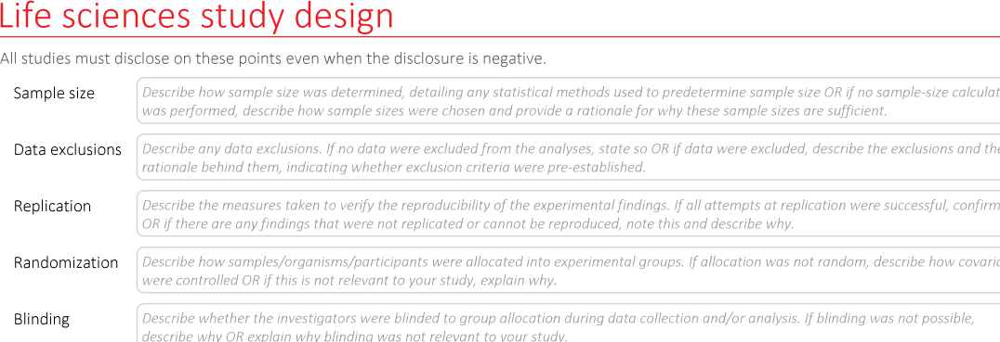
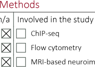

## **nature energy** 

## **Fusion power experience rates are overestimated** 

Received: 21 August 2025 **Lingxi Tang[1] , Bessie Noll[1] , Anurag Panda[1] & Tobias S. Schmidt[1,2]** Accepted: 2 March 2026 Published online: xx xx xxxx Fusion power plants (FPPs) are viewed as a promising source of firm low-carbon electricity, attracting large investments. However, their future Check for updates cost is highly uncertain. Current projections assume widely varying starting costs and highly arbitrary experience rates (ERs) of 8–20%. Here, leveraging recent insights from innovation literature, we examine the currently assumed ER range for FPPs by linking technological characteristics of the two dominant fusion approaches, magnetic fusion and laser-based inertial fusion, to ERs. We find that FPPs’ large unit size, extraordinary complexity and intermediate need for customization are empirically linked to ERs of 2–8%, which are much lower than currently assumed for FPPs. When paired with the expected high initial capital costs, the results raise questions about the viability of FPP in future net-zero energy systems. We urge for the adoption of ERs for FPPs that are justifiably lower than currently assumed in cost projections, energy system modelling and investor valuations, and for the research community to explore alternative fusion designs with greater cost reduction potential. 

The decarbonization of the power sector is necessary to limit global warming and achieve international climate targets[1][,][2] . Firm low-carbon electricity sources, which can produce electricity in all seasons and over long durations, will be a key component in decarbonizing power generation systems[3][–][5] . Fusion energy promises to be a safe, abundant and firm low-carbon electricity source[6][,][7] , thus receiving major investment from both the public and the private sectors, with hopes to revolutionize the energy sector. In terms of public research funding, the US Department of Science was allocated US$1.01 billion towards fusion energy research for the 2024 fiscal year, a comparable amount to the US$1.78 billion towards nuclear fission energy research[8] , despite fusion technology being at a much lower technological readiness level (TRL)[9][,][10] . For comparison, US$1.01 billion dedicated to fusion energy research far exceeds the US$216 million allocated for geothermal energy, also a firm low-carbon electricity source, in the same budget[8] . Outside the USA, China’s public investments in fusion energy research are estimated to be larger than the USA’s (but unknown)[11] . In terms of private sector funding, between July 2024 and July 2025, global private investments into fusion companies totalled US$2.2 billion, of which US$0.9 billion was into a single company[12] . This amount of private funding dwarves 

the US$783 million received by advanced nuclear fission companies in 2024[13] . 

Substantial investments in fusion energy development should be informed by the best available evidence that the technology can play a considerable role in future power systems. However, the future role of fusion energy remains highly uncertain, not only technologically but also economically[14] . Given their low operational expenditures, the extent to which fusion power plants (FPPs) will be widely deployed depends greatly on their future investment cost or capital expenditure (CAPEX)[15][–][18] . A high CAPEX would render it uncompetitive with alternative low-carbon firm power sources, such as nuclear fission, hydropower and geothermal[19][–][21] , ultimately limiting its deployment and contribution towards future net-zero energy systems[15][,][17][,][22] . However, due to the low TRL of fusion power[9][,][10][,][23] , there are limited empirical data on a commercial FPP’s CAPEX. Current studies project future FPP CAPEX by applying cost reductions to estimated initial CAPEX using experience rates (ERs)[18][,][22][,][23] , also commonly referred to as learning rates. The ER of a technology is the (close to constant) percentage reduction in the specific cost (for example, US dollars per watt) per doubling of cumulative deployment, and has been shown to vary between 

> 1Energy and Technology Policy Group, Swiss Federal Institute of Technology, ETH Zurich, Zurich, Switzerland. 2Einstein School of Public Policy, Swiss Federal Institute of Technology, ETH Zurich, Zurich, Switzerland. e-mail: lingxi.tang@gess.ethz.ch; tobiasschmidt@ethz.ch 

**----- Start of picture text -----** 
ERs assumed for FPPs Rationale used for ER assumptions 20 None [23] None [16] 15 “Upper value of ER for coal and natural gas power plants”  [28] ER of an “average high-tech novel industrial project”  [27] 10 None [29] Based on “surveys covering a wide 5 range of technological industries”  [22] Based on “energy sector data and similar to previous estimates”  [18] 0 None [17] % **----- End of picture text -----** 

**Fig. 1 | ERs used in existing literature for fusion power in the literature and rationale used for each specific value[16][–][18][,][22][,][23][,][27][–][29] .** The rationale behind using each specific ER value is listed in order, corresponding to decreasing ER values, with the first row corresponding to the highest ER and so on. See Supplementary Table 1 for the sources of each ER used and more information on each rationale. 

technologies substantially[24] . Using ERs has been shown to be the most reliable way of projecting future technology costs, as compared with direct estimations by experts[25][,][26] . Because technology-specific ERs are primarily estimated on the basis of historical cost data[26] , current fusion cost projection literature, with no empirical data points to draw from, either arbitrarily assumes an ER or repurposes an ER from other technology groups[16][,][18][,][22][,][23][,][27][–][29] , leading to a potentially inaccurate ER range of 8–20% (Fig. 1). With high ER assumptions, energy system models project that fusion energy will play a substantial role in future net-zero power systems[16][,][23][,][27][,][28] . However, these projections will be inaccurate if the applied ERs and subsequent fusion cost projections are inaccurate[30] , leading to erroneous investor valuations and policy decisions. 

To address this limitation, this Analysis builds on recent progress in innovation literature that establishes a relationship between a technology’s inherent characteristics and its ER[26][,][31][–][34] to assess the validity of currently assumed FPP ERs. Specifically, we conduct interviews with experts to rate the unit size, design complexity and need for customization of the two dominant FPP technologies—magnetic fusion and laser-based inertial fusion. ER ranges empirically associated with technologies with characteristics similar to FPPs are then compared with the currently assumed FPP ER range. Given that there is slight uncertainty in each relationship between a characteristic and ERs, we analyse three characteristics rather than a single one to improve the robustness of our research results. Based on the results, we illustrate the implications for future cost reductions of FPP technologies by estimating its cost evolution curve. Finally, we discuss the implications of our results for both private and public investors, energy system modellers and researchers in fusion energy. 

## **FPP technology** 

Fusion energy refers to the energy released when two hydrogen nuclei fuse, a process that requires extremely high temperatures and pressures. The goal of the FPP concept is to harvest this energy from a nuclear fusion reactor to generate electricity. The fusion of two hydrogen isotopes, deuterium and tritium (D–T), is the most common fuel combination due to its relatively low temperature requirement[35] . It has thus been the focus of most research and development efforts[35][,][36] and will accordingly be the scope of this work. 

Among the variety of fusion power approaches[37] , the International Atomic Energy Agency identifies three dominant categories: tokamaks, 

stellarators and laser inertial devices[38] . Based on expert interviews, tokamaks and stellarators overlap heavily in their working principles and plant design (see Supplementary Table 2 for supporting interview quotes). As such, in this Analysis, they are collectively analysed and referred to as magnetic fusion energy (MFE). MFE has been the most heavily researched approach to fusion energy; out of 102 operating fusion devices worldwide, 70 are MFE devices[38] . For laser inertial devices, despite only five currently operating in the world, it is the second most popular approach among private fusion companies[12] and was specially allocated US$690 million of research funding in the USA for the 2024 fiscal year[39] . This investment optimism may be attributed to the historic first fusion energy net gain achieved (see Supplementary Note 1 for more details), the laser-based inertial fusion energy (LFE) approach in 2022[40] , a milestone not yet achieved by MFE. Due to the dominance of the MFE and LFE approaches, this Analysis will focus on estimating the ERs of these two approaches. 

While there are still many uncertainties around the specifics of a future FPP design, here we briefly explain each fusion energy approach on a broad system level, based on information collected from interviews. In MFE (Fig. 2a), a superheated plasma is sustained and contained within a vacuum using magnetic fields generated by a collection of electromagnetic coils. The magnetic fields act like a ‘cage’ to keep the hot plasma from coming into contact with any wall materials. To generate magnetic fields that are strong enough, electromagnetic coils must be supercooled by the cryogenic system to maintain high electrical conductivity. Fusion reactions occur consistently within the plasma, generating fusion energy to be extracted for electricity generation. 

In LFE (Fig. 2b), high-intensity lasers are targeted at a fuel pellet, compressing and heating it to induce a fusion reaction. The laser driver system generates and directs lasers to the reaction chamber, where they are precisely focused onto fuel pellets via focusing mirrors. The pellet injection system will consistently release fuel pellets to be compressed by pulsed lasers, generating a steady flow of fusion energy. For consistent fuel pellet delivery, a closed tritium cycle is operated by the tritium extraction, fuel pellet fabrication and pellet injection system. A cryogenic system is also required in LFE systems for a different purpose: to keep fuel pellets supercooled to maintain fuel efficacy. 

In both MFE and LFE, breeding blankets are a necessary component to breed more tritium to sustain further D–T fusion reactions, as well as to absorb and convert the generated fusion energy into heat, which will then be converted to electricity via a conventional turbine cycle. Further detailed explanations of each fusion approach are found in Supplementary Note 2. 

## **Technology-inherent characteristics of FPPs** 

Recent innovation literature has established that three technological - characteristics—unit size, design complexity and need for customiza tion—are key determinants of technology-specific ERs[26][,][31][–][33] . Technologies of larger unit sizes have been shown to exhibit slower learning[32] , with ERs significantly reducing for every order of magnitude increase in unit size[33] . In addition, Malhotra and Schmidt[31] developed a technology typology that classified technologies on the basis of their design complexity and need for customization (Fig. 3b,c). Design complexity refers to the number of components in a technology and the extent to which they are interdependent[31] . Need for customization describes the extent to which a technology must be adapted to its use environment[41] . The typology indicates that higher design complexity and/or a greater need for customization in technologies are associated with lower ERs (see Supplementary Note 3 for details). This typology has been empirically verified on the basis of existing technologies and has also been applied to a low-TRL technology: direct air capture systems[34] . 

Utilizing these verified relationships, we conduct structured expert interviews to rate these three characteristics for MFE and LFE, with respect to existing technologies with known ERs. With 

**----- Start of picture text -----** 
a MFE system b LFE system Reaction chamber Cryostat Laser driver system Master oscillator Divertors Plasma-facing walls Fuel pellet Laser  Optics and Cryogenic  transport amplifiers Breeding blankets system Plasma-facing walls Vacuum vessel Breeding blankets Reaction chamber Electromagnetic Vacuum vessel coils Plasma heating (and current drive) Plasma Focusing  Focusing mirrors mirrors Tritium extraction and refuelling Vacuum system structureSupport Tritium  Fuel pellet  Pellet injection  Heat extraction extraction fabrication system system Cryogenic system Vacuum system Heat extraction system . **----- End of picture text -----** 

**Fig. 2 | Overview of MFE and LFE systems. a** , **b** , The critical components and subsystems of an MFE ( **a** ) and an LFE ( **b** ) system. A subsystem (dotted box) comprises a combination of components (solid-outlined box or labelled solid shape) that work together to serve the function of the subsystem. Components may interact with each other via physical connections (blue bar), such as piping, that transport a medium (black arrow), such as heat transfer fluids. The 

components depicted were derived from a combination of technical literature review and expert interviews. It is important to note that the illustrations are general and high-level and that variations in specific design choices and configurations within each approach exist. However, the components presented reflect an expert consensus view of the necessary common components for each FPP approach. 

characteristic ratings for FPP technologies elicited, empirical ERs of technologies with similar technological characteristics can then be compared with those currently assumed for FPP technologies. For the unit size characteristic, we ask interviewees to estimate a theoretical minimum capacity of an FPP. For design complexity and need for customization, interviewees rate FPPs on these characteristics in comparison with two reference technologies. We use solar panels and nuclear fission power plants as reference technologies that are low/high in complexity and customization, respectively. Key insights shared by interviewees regarding the three technological characteristics—unit size, design complexity and need for customization—are presented, along with supporting quotes in Tables 1 and 2. On unit size, both MFE and LFE FPPs are expected to be deployed as large-scale units, with estimated average theoretical minimum capacities at 530 MW and 230 MW, respectively (Fig. 3a). These estimations are based on technological constraints, as well as economic considerations (see Supplementary Table 5 for supporting quotes). In particular, interviewees M11 and L4 (see Supplementary Table 3 for interviewee backgrounds) highlighted the high energy input requirements of subsystems for FPPs, especially the coils and crygogenic system for MFE and the laser system for LFE, rendering a version with a small output infeasible. Many experts also emphasized a minimum thickness of 1 m for the breeding blankets (Fig. 2a), which is the stopping distance for 14 MeV high-energy neutrons released by D–T reactions[42] . This requirement establishes a minimum physical size for the reactor chamber. Regarding economic considerations, experts agree that the capital intensity of FPPs encourages larger unit sizes to maximize returns through economies of scale. Given these factors, FPP capacities will probably mirror the large unit sizes typical of large-scale thermal power plants, of at least a few hundred megawatts. 

On design complexity, both MFE and LFE exhibit exceptionally high design complexity, with average ratings of 6.8 and 6.4, respectively. Experts clearly rate the design complexity of both fusion approaches as equal to or greater than that of a fission power plant (Fig. 3b), a benchmark for a complex and highly customized power generation technology[31] . Several interviewees placed fusion’s complexity beyond the provided scale. For example, L1 noted that ‘fusion is a 12’, and M18 stated that ‘if fission reactors are at 6, then fusion would definitely be a 7 or even 8’. 

While both are highly complex, MFE and LFE have different drivers for their high complexity. For MFE, complexity resides mainly in the reaction chamber. Not only does it have a large number of components, but the chamber’s components are also concentrically arranged in layers like an ‘onion’ (see quote by M6 in Table 1). This structure intensifies component interdependence in design and construction. For example, M3 highlighted how increasing the magnetic field strength of the coils would improve plasma confinement, but also increases structural loads due to electromagnetic forces, thus requiring further reinforcement of the support structure. However, to enable access to inner components for maintenance, access ports would need to be installed, which would then reduce available space for support structures. These interactions demonstrate how adjustments to individual components would propagate design consequences to other components. The ‘onion’ structure also leads to further interactions between the chamber and external subsystems. Chamber components would need to be designed to allow piping access to some subsystems at the centre of the ‘onion’. 

Although the LFE system has a relatively simpler reaction chamber, the overall FPP system complexity remains high. This is largely due to the higher number of subsystems required, especially for fuel delivery. LFE requires an integrated fuel cycle that involves pellet fabrication and 

**----- Start of picture text -----** 
a Minimum unit size b Magnetic fusion c Laser inertial fusion M5 7 7 M8 M9 6 6 M11 Nuclear  Nuclear fission fission M12 5 5 M15 M17 4 4 MFE average L4 3 3 L7 PV panels PV panels L8 2 2 LFE average Type 1 Type 2 Type 3 Type 1 Type 2 Type 3 1 1 0 200 400 600 800 1,000 1 2 3 4 5 6 7 1 2 3 4 5 6 7 MW Need for customization Design complexity **----- End of picture text -----** 

**Fig. 3 | Experts’ estimations of FPPs’ theoretical minimum capacity and MFE and LFE ratings for their respective design complexity and need for customization. a** , Interviewee codes starting with ‘M’ refer to MFE experts, and ‘L’ to LFE experts. The professional background of each interviewee is presented in Supplementary Table 3. The average estimations for minimum power plant capacity of MFE and LFE are also presented. **b** , **c** , Graphs plotting each expert’s rating of MFE ( _n_ = 18) and LFE ( _n_ = 10) systems’ design complexity and need for customization. Ratings are on a Likert scale between 1 and 7. Design complexity is rated from 1 for a simple technology to 7 for a highly complex technology. Need for customization is rated from 1 for a standardized technology to 7 for a customized technology. Need for customization rating presented is 

the average of three ratings for need to customize to physical environment, regulatory reasons and user preferences. Solar PV panels and nuclear fission power plants are presented to interviewees as reference ‘simple’ and ‘complex’ technologies. PV panels and nuclear fission power plants are fixed at ratings 2 and 6, respectively, for each characteristic. Graphs are overlaid with the technology typology that outlines three technology types differentiated on the basis of their design complexity and need for customization. The different technology types have different average ERs (type 1, 22%; type 2, 13%; type 3, 5%)[31] . The explanation for the outlier rating placed in the type 2 zone is provided in Supplementary Note 4. Individual ratings by interviewees are presented in Supplementary Table 4. 

**Table 1 | Key quotes on design complexity of fusion energy technologies** 

**----- Start of picture text -----** 
Complexity rating Explanations for complexity M3 – ‘It’s 7. That’s an easy one. It’s much more complicated than a fission  M6 – ‘Tokamak reactor is sort of like an onion, where you have to build it from the inner layer first reactor, and having studied fission reactors through my undergraduate  and so on, but to remove one layer can take years, so you better not need to remove one layer.’ and part of my graduate work, I’m fully confident of that.’ ‘It’s not a matter of first selecting a fuel, then choosing a machine pattern, and then M15 – ‘A fission reactor is trivial compared with fusion reactor…’ designing each subsystem separately. Everything is interconnected.’ ‘It’s one of the things that may well kill fusion as a future option because it  M16 – ‘The tokamak itself is pretty integrated…It’s super iterative. Anything that lives in is just too hard… it’s too complex.’ the radial build you have to design all at once because if you change any piece of it, it L3 – ‘If there are not more disruptive breakthroughs, I think fusion energy  affects all the other pieces of it. So there’s a very tight cycle of design.’ will never be competitive… The technology is so complex and that, for me,  L1 – ‘You can’t just inject fuel in the target chamber. You have to take the fuel from the is the major argument why I am still skeptical about fusion.’ blanket, put it in a target, shoot the target into the center of the target chamber, hit it with L4 – ‘I will say that it is highly complex at 7 because all these things – the  the lasers, generate energy, dispose of the debris and you have to do that over and over laser, the target and so on, they are quite complex in themselves, and they  again very rapidly. This is imagined to be a complete cycle in the future, but it is complex must all work together.’ and I’m not sure how we do it.’ **----- End of picture text -----** 

The left column presents quotes highlighting the degree of complexity in FPPs. The right column presents quotes elaborating on the reasons for complexity. Professional backgrounds of each interviewee are found in Supplementary Table 3. Interviewee codes starting with ‘M’ refer to MFE experts, with ‘L’ for LFE experts. 

high-precision injection after the tritium has been extracted. Experts emphasized that LFE’s design complexity stems less from the reaction chamber, but from the number of steps involved in the high-frequency fuel injection process. Complexity also arises within the fuel pellet itself due to the interaction between the laser and the pellet, necessitating the integration of design considerations for precise coordination between the fuel pellet and the laser driver system. Thus, any changes to the fuel pellet would extend not only to the pellet fabrication and injection systems, but also to the laser driver system. 

On need for customization, fusion energy technologies exhibit an intermediate need for customization, slightly lower than that of nuclear fission power plants. The analysis of customization needs is organized around three key drivers: the technology’s need to adapt due to varying physical environment, regulatory reasons and user preferences[31] (see Supplementary Note 3 for details). Both MFE and LFE share similar reasons for their need to customize and thus will be discussed together. 

For physical environment, experts convey that FPPs share many design requirements with thermal power plants, including nuclear 

fission power plants. They generally require customized construction solutions for grid connectivity and access to cooling water. Interviewees also emphasized earthquake risks as a major design concern for FPPs, with varying seismic risks necessitating different needs for building supports. In this regard, the precise alignment of lasers in LFE systems is particularly sensitive and must be protected against seismic activities. 

When discussing the regulations for fusion energy, experts often point out that fusion’s main advantage is safety. Unlike nuclear fission power plants, FPPs do not risk a runaway reaction or meltdown, thereby requiring fewer safety-related design variations. Owing to its safety, fusion is also likely to face greatly reduced licensing barriers compared with fission. There is optimism among experts that fusion-related regulations would be simpler and more standardized across jurisdictions. For example, the USA and UK have already signalled their intention to separate fusion and fission energy and develop more favourable regulations for FPPs. However, experts expressed uncertainty about regulations around the use of tritium, 

**Table 2 | Key quotes on the need for customization of fusion energy, grouped based on the driver of the need for customization** 

**----- Start of picture text -----** 
Physical environment M5 – ‘If you are in a region that is more at risk for earthquakes, certainly the support structure might need to be adjusted.’ L5 – ‘The physical location should have stable grounds, better not have fusion power plants where there are earthquakes because laser facility and optics really need to level and flat to transport laser in one direction.’ L8 – ‘We have similar requirements as nuclear fission, in that we need access to cooling water, access to grid, etc. However, for fission, safety is one of the main needs to adapt, and safety hazards from fusion are so many orders of magnitude lower, this adaptation is not needed in fusion.’ Regulatory reasons M2 – ‘The challenge with fission is that licensing varies, every fission plant must go through a different licensing procedure. Fusion is going to be better because it is much less nuclear, much less risky and we’re already seeing more favorable regulatory statements coming out around the world.’ M15 – ‘We will always have to deal with 14 MeV neutrons and radioactivity and therefore will always be constrained by regulatory processes. You have to adapt your plant to ensure public is not exposed to huge quantities of tritium or radioactivity.’ L2 – ‘Mostly, it’s much better than fission. The US Nuclear Regulatory Commission has already preliminarily adopted that fusion would not be regulated like fission. It would be much easier to do like an accelerator or in a hospital.’ L3 – ‘So far, we are dealing with tritium on a scale of grams globally, but for boosting a nuclear weapon, you would only need 2–3 grams. If you’re now having a global or national industry of handling tritium on a kilogram scale, that poses some questions.’ User preference M2 – ‘The idea is to have these units that are dispatchable power. So you want something like 500 MW or 1 GW electric and this won’t be something you want to be changing a lot.’ L8 – ‘In terms of load following, for laser fusion, that is relatively easy. If you operate a 1 GW power plant at 10 Hz, and you reduce the repetition rate to 5 Hz, you have just reduced the output power to 500 MW.’ **----- End of picture text -----** 

Professional backgrounds of each interviewee are found in Supplementary Table 3. Interviewee codes starting with ‘M’ refer to MFE experts, with ‘L’ for LFE experts. 

due to its radioactivity and potential military applications. Nonetheless, tritium is acknowledged as generally less problematic than the fission fuels. 

When asked about user-driven customization, experts all agree that FPP designs will not respond to varying user demands, but rather to technical and economic constraints. For differing capacity needs, upscaling is expected through multiple standardized units rather than a larger bespoke design. This is similar to how a larger nuclear fission power plant would have multiple smaller standardized reactors, rather than a single large reactor. A few experts noted the ability of LFE systems to modulate power output easily, allowing a single design to serve a large range of power output needs. This explains the slightly lower customization rating for LFE. 

Overall, experts share that FPPs’ need to be customized to physical environment and user preferences would be similar to nuclear fission’s. Differences emerge in terms of customization to regulations as FPPs’ inherent safety allows for simpler regulations. Thus, compared with nuclear fission, MFE and LFE have lower average ratings of 5.0 and 4.3, respectively. However, the uncertainty surrounding future regulatory regimes led to a wider variance in expert ratings for FPPs’ need to customize, as compared with design complexity. Some interviewees envisioned standardized licensing processes, while some expect new regulatory hurdles to emerge, especially around the use of tritium. 

To summarize, both MFE and LFE exhibit the following technology characteristics: large unit sizes on the order of hundreds of megawatts, extremely high design complexity and an intermediate need to customize. For these characteristics, empirical evidence points to the following ERs: large energy technologies on the scale of hundreds of megawatts have ERs of 5–10% (refs. 26,32,33). Extremely high complexity alone classifies FPPs as a type 3 technology (Fig. 3b,c), which averages a global ER of 5% (ref. 31). Within the realm of type 3 technologies, our work showed that FPPs are specifically technologically close to nuclear fission power plants. Although FPPs have a need for customization that is slightly lower than that of nuclear fission power plants, this advantage is negated by the extraordinary design complexity, which is much greater than that of nuclear fission. Thus, our work supports the argument that FPPs’ ER will be similar to that of nuclear fission power plants[43] , which have exhibited a global ER of 2% (ref. 44). In sum, the ERs of technologies with similar characteristics to FPPs are below the previously assumed range of 8–20%. Thus, the evidence presented in our work suggests that currently assumed ERs for fusion power are without any robust rationale and overestimated. Hence, the assumed ER should be drastically reduced. 

**----- Start of picture text -----** 
Public sector expert Private sector expert Literature M7 M11 M12 M16 M18 L2 L3 L4 L5 L6 L8 L9 Han and Ward (2009) Van den Berg (2016) Sorbom et al. (2015) Wade and Leuer (2021) Woodruff and Miller (2015) Entler et al. (2018) (2024 US$ kW [–1] ) 0 10,000 20,000 30,000 40,000 50,000 FOAK FPP CAPEX estimates **----- End of picture text -----** 

**Fig. 4 | Compilation of FOAK FPP CAPEX estimates from expert elicitations and literature[18][,][22][,][27][,][55][–][58] .** Public sector experts refer to experts who are from universities or public research institutes. Private sector experts refer to professionals from private companies. Author names and publication year are presented for each literature CAPEX estimate. The professional backgrounds of each interviewee are listed in Supplementary Table 3. See Supplementary Table 6 for more details on each estimate. 

## **Initial costs of FPPs** 

To illustrate the effects of a lower ER on FPPs’ cost trajectory, a starting cost of a technology must first be established to plot fusion energy’s experience curve, also commonly referred to as a learning curve. To this end, we compile CAPEX estimates for first-of-a-kind (FOAK) FPPs from expert elicitation and literature, which are presented in Fig. 4 (see Supplementary Table 6 for more details). 

The results indicate that there is no strong consensus on the CAPEX of FPP within the fusion energy community, as estimates range from US$1,400 to US$43,000 per kilowatt of capacity. This uncertainty in cost can be primarily attributed to the low TRL of FPP technologies, as many challenges of obtaining fusion energy remain unresolved[23][,][35] . Most relevant to CAPEX, fusion-specific heat extraction systems, tritium breeding systems and materials that are capable of withstanding the extreme conditions of consistent fusion reaction are 

**----- Start of picture text -----** 
Onshore wind 100,000 PV modules Li-ion batteries Nuclear fission Fusion median 30,000 Fusion IQR 10,000 ER: 2% ER: 12% 1,000 ER: 23% ER: 20% 0.001 0.01 0.1 0.5 1 10 100 1,000 10,000 Cumulative global installed capacity (GW, GWh capacity) Fusion-specific ER: 5% CAPEX (2024 US$ per kW, kWh capacity) **----- End of picture text -----** 

**Fig. 5 | CAPEX experience curve range of FPPs beginning from the IQR of compiled FOAK CAPEX estimates, and historical CAPEX experience curves of existing commercial energy technologies.** The experience curve range for FPPs is based on the median and IQR of CAPEX estimates (see Supplementary Table 6 for details and context around each estimate) as the starting CAPEX, and a justified fusion-specific ER of 5%. The first FPP is assumed to have a capacity of 500 MW. For Li-ion batteries, CAPEX and cumulative deployment are presented in 2024 US$ per kWh of capacity and GWh of capacity, respectively. For more details on data sources and calculations, refer to the Methods. 

still undeveloped and untested[23][,][35] . Therefore, at the time of writing, the uncertainty in design specifics of a working FPP makes it difficult to estimate the CAPEX for an FOAK FPP. This difficulty is undoubtedly reflected in the wide range of cost estimates, with uncertainties driven by many non-technological factors, such as the role and sector of interviewees, or time and assumptions used in publications. 

For example, for the sector of interviewees, Fig. 4 reflects greater optimism among private sector experts in cost estimates, compared with public sector experts. The two lowest estimates were provided by private sector experts, at US$1,404 kW[−1] (L9) and US$2,500 kW[−1] (average, M18). Private sector experts’ CAPEX estimates averaged at US$7,000 kW[−1] , while public sector experts estimated an average of US$26,000 kW[−1] . This disparity can be explained by an optimism bias in firms, especially among entrepreneurs, that results in private sector experts focusing on positive outcomes[45] and to believe in a more cost-favourable realization of fusion power technology. 

Although uncertainties exist and must be duly noted (see Supplementary Table 6 for relevant contexts surrounding each estimate), referring to a range of samples, rather than individual sources, still serves to reduce the effects of biases. For the purpose of the subsequent analysis, this range acts as a useful reference for the CAPEX range of an FOAK FPP. 

## **Discussion** 

To justify major investments in fusion power technology as a decarbonization solution, FPPs must be able to generate low-carbon electricity at a low cost in the near future. The literature has previously shown that, if FPP technology achieved ERs of 8–20%, it could be affordable enough to play a role in net-zero power systems, thereby justifying current levels of investment. However, using a combination of expert elicitation and empirically grounded theory, we demonstrate that FPPs exhibit technological characteristics suggesting that their ERs are likely to resemble those of nuclear fission power plants, around 2%, or, at best, align with those of large-scale energy technologies, which have an average ER of approximately 8% (ref. 26). Thus, the previously assumed ERs of 8–20% for fusion appear unjustified and overly optimistic and should accordingly be revised downwards in fusion cost projections and, where relevant, energy system projection models. As such, for the subsequent analysis, we assign an optimistic but justified ER of 5% to 

FPPs, a value that is the median of the aforementioned 2–8% and also the average global ER of type 3 technologies[31] . 

With this evidence-backed ER, Fig. 5 presents an estimated experience curve for FPPs, constructed using the interquartile range (IQR) of FOAK CAPEX estimates (to remove potentially anomalous estimates that are excessively high or low) and the fusion-specific ER, alongside the historical experience curves of other CAPEX-heavy energy technologies. The cases of photovoltaic (PV) modules and Li-ion batteries demonstrate how a high ER can help an initially expensive technology become affordable through continued deployment. The successful proliferation of PV modules and Li-ion batteries today can be attributed to this accelerated learning effect, which has probably inspired optimism in the ERs of other energy technologies, including fusion energy. Unfortunately, as our results show, fusion energy is unlikely to benefit from the rapid cost decline experienced by other technologies with different characteristics. A low ER would be less consequential if costs were relatively low from the outset, as demonstrated by the cases of nuclear fission and onshore wind, where their costs have remained stable and were affordable from early deployments. However, fusion energy is expected to have the disadvantaged combination of a low ER and high initial CAPEX. As such, despite uncertainties surrounding specific designs and costs of future FPPs, the expected cost trajectory for the technology will probably remain orders of magnitude above competing energy technologies. This result casts considerable doubt on the affordability and future role of fusion energy in a net-zero energy system. 

These findings carry important implications for energy system modellers, investors in both the public and private sectors, and fusion energy researchers and their funders. Energy system modellers play a crucial role in shaping investment decisions by projecting future costs and the deployment of energy technologies. Our results suggest that these models should update their ERs for FPPs to better reflect their likely cost trajectories. Overly optimistic ER assumptions can lead to inflated expectations of fusion’s economic competitiveness, which in turn may distort investment decisions. Even if fuel costs are minimal, continuously high CAPEX suggests that electricity produced by FPPs will remain economically uncompetitive with other low-carbon technologies. Although public policymakers do not base technology investments solely on economic competitiveness, in the case of the highly substitutable product of electricity, economic considerations will carry a large weight. As such, given our findings, investors should continue to recognize that FPPs represent a high-risk investment. 

For fusion energy researchers and the agencies that fund them, we recommend considering alternative fusion concepts that exhibit technological characteristics with more favourable cost-reduction potential. This study has limited its scope to the mainstream fusion approaches of tokamak, stellarators and LFE, and specifically utilizing the dominant D–T fuel combination. Yet, other fusion concepts exist, based on alternative technology designs (such as field-reversed configurations or z-pinch)or utilizing other fuel combinations (such as deuterium–deuterium or proton–boron). Future research should follow our structured evaluation to analyse whether these alternatives potentially offer more favourable technological attributes—such as reduced complexity, lower need for customization or smaller unit size—that could enable higher ERs. Even if such alternatives might require a high initial specific investment, a steeper experience curve could make them economically superior in the long term (or not). 

In summary, our results show that currently assumed ER assumptions for fusion energy are too high and urge a reassessment of fusion energy’s role in the clean energy transition based on its likely cost dynamics rather than its technical promise alone. 

## **Methods** 

**Approach to examining ERs for fusion power technologies** Using ERs is a reliable method to forecast future cost reductions of technologies[25][,][26] . However, the availability of historical cost data had 

remained a prerequisite for obtaining ERs of technologies, making it inapplicable for nascent technologies. The method used in this study overcomes this limitation by connecting two key pillars of knowledge: first, technological characteristics are empirically linked to ERs, and second, the ERs of technologies with known characteristics are available[26][,][31][–][33] . Based on these, the general approach of this study is as follows: First, semi-structured expert interviews were conducted to assess the technological characteristics of FPPs. Second, as part of the interviews, interviewees complete a survey that places FPPs’ characteristics in relation to technologies with known characteristics and known ERs. Lastly, a qualitative analysis based on existing academic literature obtains the ER ranges associated with the identified characteristics of FPPs, which can then be compared with existing ER assumptions. 

## **Interview guide and characteristic ratings** 

A semi-structured interview guide was developed to improve consistency and reduce bias in interview questions. Rather than solely surveying experts on their direct ratings of the technological characteristics of fusion energy, interviewees were asked guiding questions designed to elicit the underlying reasons for their assessments of MFE or LFE systems, depending on their expertise (see Supplementary Table 7 for the interview guide). For design complexity and need for customization, after answering the guiding questions, experts were asked to rate a future commercial FPP from 1 to 7, where for design complexity, 1 is ‘simple’ and 7 is ‘highly complex’, and for need for customization, 1 is ‘standardized’ and 7 is ‘customized’. A unique feature introduced in this study is the usage of reference technologies in the survey ratings. Without reference technologies, the definitions of ratings become much more subjective to interpretation. For example, some might view a pen as a ‘simple’ technology with a design complexity rating of 1, while others might rate it as 2, believing that a pencil would be less complex. In this study, solar panels and nuclear fission power plants were placed at rating levels 2 and 6 to represent a simple, standardized technology and a complex, customized technology, respectively. Now, it becomes clearer to interviewees that both pens and pencils would have a design complexity of 1. As such, the use of reference technologies enables stronger consistency across interviewees in their assessment of the available range of 1–7. The technological characteristic of unit size was often introduced naturally during the flow of conversation when discussing FPPs’ need to customize to user preferences. 

## **Interviews** 

The identified interviewees are experts from both the public and private sectors, with extensive involvement in magnetic confinement or laser-based inertial confinement fusion research or projects. Experts were identified through online resources, specifically LinkedIn and websites of fusion energy organizations, as well as through snowball sampling, where interviewees were asked to identify other potential experts. Interviewees were contacted via email or LinkedIn messaging, during which they were provided an information sheet with background information on the study. All interviews were conducted under the Chatham House Rule[46] ensuring that neither the identity nor the affiliation of the speaker may be disclosed. A total of 28 interviews were conducted via online video calls between August 2024 and March 2025, each lasting between 40 min and 1 h, and were recorded with the participants’ explicit consent. The interviews received ethics approval from the ETH Zurich Ethics Commission without reservations (Ethics Approval Reference24: ETHICS-349). 

## **Interview data analysis** 

Recorded interviews were transcribed using either the built-in transcription software of Microsoft Teams or NoScribe[47] . Each transcript was then manually reviewed by the authors and a student research assistant to remove filler words and erroneous transcriptions. 

- Postprocessed transcripts and the notes were then coded for argu ments conveyed by interviewees that are relevant for technological characteristic analysis. 

## **CAPEX experience curve calculations** 

To obtain the experience curve of fusion energy technology, the following formula was used to plot the evolution of CAPEX with increasing cumulative deployment: 

where _CAPEX_ is the initial CAPEX, _Dt_ is the cumulative deployment at time _t_ , _D_ 0 is the initial deployment at time 0, and ER is the ER. The IQR of CAPEX estimates (Supplementary Table 6) is plotted as CAPEX0, at a starting deployment of 500 MW. An ER of 5% is applied to the mean initial CAPEX as well as the IQR. 

To obtain the experience curves for onshore wind, PV modules and Li-ion batteries, historical starting CAPEX (in US$ kW[−1] , or US$ per kWh capacity), the corresponding starting cumulative deployment (in GW or GWh capacity), and ERs are collected for each technology. Based on equation (1), a line graph is plotted for each technology, which ends at the global cumulative deployment of each technology to date. For onshore wind, the starting cost and starting cumulative deployment are obtained from Wiser et al.[48] , ER from Rubin et al.[49] and end cumulative deployment from Wiser et al.[50] . For PV modules, starting costs, starting cumulative deployment and ER are obtained from Nemet[51] , while the end cumulative deployment is taken from IRENA[52] . For Li-ion batteries, all relevant data are obtained from Ziegler and Trancik[53][,][54] . 

To obtain the experience curve for nuclear fission power plants, historical overnight construction costs (OCCs) of individual nuclear fission power plants and their corresponding global cumulative installed capacity are obtained from Lovering et al.[44] . A least-squares error linear fit is then plotted based on 

where log(CAPEX) is the dependent variable of the log of OCC (in US$ kW[−1] ) and log( _D_ ) is the independent variable of the log of global cumulative installed capacity (in GW). The ER of nuclear fission power plants is then obtained from the resultant linear line graph. All monetary data are adjusted for inflation and converted to 2024 US dollars, based on average annual US inflation rates. 

## **Reporting summary** 

Further information on research design is available in the Nature Portfolio Reporting Summary linked to this article. 

## **Data availability** 

Data to reproduce Fig. 5 are available via GitHub at https://github.com/ LingxiTang/fusion-ER. 

## **References** 

1. Bistline, J. E. T. & Blanford, G. J. The role of the power sector in net-zero energy systems. _Energy Clim. Change_ **2** , 100045 (2021). 

2. IPCC. in _Climate Change 2023: Synthesis Report. Contribution of Working Groups I, II and III to the Sixth Assessment Report of the Intergovernmental Panel on Climate Change_ (Core Writing Team et al.) 35–115 (IPCC, 2023). 

3. Sepulveda, N. A., Jenkins, J. D., de Sisternes, F. J. & Lester, R. K. The role of firm low-carbon electricity resources in deep decarbonization of power generation. _Joule_ **2** , 2403–2420 (2018). 

4. Bistline, J. E. T. Roadmaps to net-zero emissions systems: emerging insights and modeling challenges. _Joule_ **5** , 2551–2563 (2021). 

5. Hainsch, K. et al. Emission pathways towards a low-carbon energy system for Europe: a model-based analysis of decarbonization scenarios. _Energy J._ **42** , 41–66 (2021). 

6. Ward, D. J. The contribution of fusion to sustainable development. _Fusion Eng. Des._ **82** , 528–533 (2007). 

7. Sadik-Zada, E. R., Gatto, A. & Weißnicht, Y. Back to the future: revisiting the perspectives on nuclear fusion and juxtaposition to existing energy sources. _Energy_ **290** , 129150 (2024). 

8. Energy and water development: FY2024 appropriations. _Congressional Research Service_ https://www.congress.gov/ crs_external_products/R/PDF/R47553/R47553.50.pdf (2024). 

9. de Vicente, G. D. & Prinja, N. K. Fusion specific technology readiness levels. In _Proc. 28th IAEA Fusion Energy Conference_ (IAEA, 2021). 

10. Carmack, W. J., Braase, L. A., Wigeland, R. A. & Todosow, M. Technology readiness levels for advanced nuclear fuels and materials development. _Nucl. Eng. Des._ **313** , 177–184 (2017). 

11. Gardner, T. & Gardner, T. _Global Investment in Fusion Energy Rises the Most Since 2022_ (Reuters, 2025). 

12. _The Global Fusion Industry in 2025_ (Fusion Industry Association, 2025). 

13. Private equity flows to advanced nuclear companies hit record high in 2024. _S&P Global Market Intelligence_ https:// www.spglobal.com/market-intelligence/en/news-insights/ articles/2025/2/private-equity-flows-to-advanced-nuclearcompanies-hit-record-high-in-2024-87302728 (2025). 

14. Grünwald, R. Auf dem Weg zu einem möglichen Kernfusionskraftwerk. Wissenslücken und Forschungsbedarfe aus Sicht der Technikfolgenabschätzung. _Karlsruher Institut für Technologie_ https://publikationen.bibliothek.kit.edu/1000177720 (2024). 

15. Schwartz, J. A., Ricks, W., Kolemen, E. & Jenkins, J. D. The value of fusion energy to a decarbonized United States electric grid. _Joule_ **7** , 675–699 (2023). 

16. Lopes Cardozo, N. J., Lange, A. G. G. & Kramer, G. J. Fusion: expensive and taking forever? _J. Fusion Energy_ **35** , 94–101 (2016). 

17. Cabal, H. et al. Fusion power in a future low carbon global electricity system. _Energy Strategy Rev._ **15** , 1–8 (2017). 

18. Lindley, B., Roulstone, T., Locatelli, G. & Rooney, M. Can fusion energy be cost-competitive and commercially viable? An analysis of magnetically confined reactors. _Energy Policy_ **177** , 113511 (2023). 

19. Sanchez, D. L., Nelson, J. H., Johnston, J., Mileva, A. & Kammen, D. M. Biomass enables the transition to a carbon-negative power system across western North America. _Nat. Clim. Change_ **5** , 230–234 (2015). 

20. OECD & Nuclear Energy Agency. _Technical and Economic Aspects of Load Following with Nuclear Power Plants_ (OECD, 2021); https:// doi.org/10.1787/29e7df00-en 

21. Nicholas, T. E. G. et al. Re-examining the role of nuclear fusion in a renewables-based energy mix. _Energy Policy_ **149** , 112043 (2021). 

22. Han, W. E. & Ward, D. J. Revised assessments of the economics of fusion power. _Fusion Eng. Des._ **84** , 895–898 (2009). 

23. _The Role of Fusion Energy in a Decarbonized Electricity System_ (MIT Energy Initiative, 2024). 

24. Lewis, J. I. & Nemet, G. F. Assessing learning in low carbon technologies: toward a more comprehensive approach. _WIREs Clim. Change_ **12** , e730 (2021). 

25. Meng, J., Way, R., Verdolini, E. & Diaz Anadon, L. Comparing expert elicitation and model-based probabilistic technology cost forecasts for the energy transition. _Proc. Natl Acad. Sci. USA_ **118** , e1917165118 (2021). 

26. Toribio-Ramirez, D. A., van der Zwaan, B. C. C., Detz, R. J. & Faaij, A. A review of methods to analyze technological change in industry. _Renew. Sustain. Energy Rev._ **212** , 115310 (2025). 

27. Entler, S., Horacek, J., Dlouhy, T. & Dostal, V. Approximation of the economy of fusion energy. _Energy_ **152** , 489–497 (2018). 

28. Hiwatari, R., Goto, T. & Joint Special Design Team for Fusion DEMO Assessment on Tokamak fusion power plant to contribute to global climate stabilization in the framework of Paris Agreement. _Plasma Fusion Res._ **14** , 1305047–1305047 (2019). 

29. European Fusion Development Agreement. _A Conceptual Study Of Commercial Fusion Power Plants: Final Report of the European Fusion Power Plant Conceptual Study (PPCS)_ (EFDA, 2005). 

30. Kosugi, T. Learning rate matters: reexamining optimal power expansion planning with endogenized technological experience curves. _Energy_ **283** , 129049 (2023). 

31. Malhotra, A. & Schmidt, T. S. Accelerating low-carbon innovation. _Joule_ **4** , 2259–2267 (2020). 

32. Wilson, C. et al. Granular technologies to accelerate decarbonization. _Science_ **368** , 36–39 (2020). 

33. Sweerts, B., Detz, R. J. & van der Zwaan, B. Evaluating the role of unit size in learning-by-doing of energy technologies. _Joule_ **4** , 967–970 (2020). 

34. Sievert, K., Schmidt, T. S. & Steffen, B. Considering technology characteristics to project future costs of direct air capture. _Joule_ **8** , 979–999 (2024). 

35. Takeda, S. & Pearson, R. Nuclear Fusion Power Plants. in _Power Plants in the Industry_ (IntechOpen, 2018); https://doi.org/10.5772/ intechopen.80241 

36. _The Global Fusion Industry in 2024_ (Fusion Industry Association, 2024). 

37. Pearson, R. J. & Takeda, S. Review of approaches to fusion energy. In _Proc. Commercialising Fusion Energy: How Small Businesses Are Transforming Big Science_ (IOP Publishing, 2020). 

38. _Fusion Device Information System—FusDIS_ (International Atomic Energy Agency, 2024). 

39. Congress increases U.S. funding for fusion energy sciences research. _Fusion Industry Association_ https://www. fusionindustryassociation.org/congress-increases-u-s-fundingfor-fusion-energy-sciences-research (2024). 

40. Tollefson, J. How the world’s biggest laser smashed a nuclear-fusion record. _Nature_ https://www.nature.com/ immersive/d41586-024-03745-z/index.html (2024). 

41. Nelson, R. R. On the uneven evolution of human know-how. _Res. Policy_ **32** , 909–922 (2003). 

42. Nuclear fusion power. _World Nuclear Association_ https://worldnuclear.org/information-library/current-and-future-generation/ nuclear-fusion-power (2025). 

43. Griffiths, T., Pearson, R., Bluck, M. & Takeda, S. The commercialisation of fusion for the energy market: a review of socio-economic studies. _Prog. Energy_ **4** , 042008 (2022). 

44. Lovering, J. R., Yip, A. & Nordhaus, T. Historical construction costs of global nuclear power reactors. _Energy Policy_ **91** , 371–382 (2016). 

45. Trevelyan, R. Optimism, overconfidence and entrepreneurial activity. _Manag. Decis._ **46** , 986–1001 (2008). 

46. Chatham House Rule. _Chatham House_ https://www. chathamhouse.org/about-us/chatham-house-rule (2022). 

47. Dröge, K. _noScribe._ AI-powered audio transcription. _GitHub_ https://github.com/kaixxx/noScribe (2024). 

48. Wiser, R. et al. _2016 Wind Technologies Market Report_ (DOE, 2017). 

49. Rubin, E. S., Azevedo, I. M. L., Jaramillo, P. & Yeh, S. A review of learning rates for electricity supply technologies. _Energy Policy_ **86** , 198–218 (2015). 

50. Wiser, R. et al. _Land-Based Wind Market Report_ (Berkeley Lab, 2024). 

51. Nemet, G. F. Interim monitoring of cost dynamics for publicly supported energy technologies. _Energy Policy_ **37** , 825–835 (2009). 

52. Renewable energy statistics 2025. _IRENA_ https://www.irena.org/ Publications/2025/Jul/Renewable-energy-statistics-2025 (2025). 

53. Ziegler, M. S. & Trancik, J. E. Data series for lithium-ion battery technologies. _Harvard Dataverse_ https://doi.org/10.7910/ DVN/9FEJ7C (2021). 

54. Ziegler, M. S. & Trancik, J. E. Re-examining rates of lithium-ion battery technology improvement and cost decline. _Energy Environ. Sci._ **14** , 1635–1651 (2021). 

55. van den Berg, A. _Economics of Large DT Tokamak Fusion Technology_ (Univ. Cambridge, 2016). 

56. Sorbom, B. N. et al. ARC: a compact, high-field, fusion nuclear science facility and demonstration power plant with demountable magnets. _Fusion Eng. Des._ **100** , 378–405 (2015). 

57. Wade, M. R. & Leuer, J. A. Cost drivers for a Tokamak-based compact pilot plant. _Fusion Sci. Technol._ **77** , 119–143 (2021). 

58. Woodruff, S. & Miller, R. L. Cost sensitivity analysis for a 100 MWe modular power plant and fusion neutron source. _Fusion Eng. Des._ **90** , 7–16 (2015). 

## **Acknowledgements** 

Funding from the Swiss State Secretariat for Education, Research and Innovation as part of the Horizon Europe Project PRISMA (SERI, contract number 22.00541) has been received by L.T. and B.N. We thank all interviewees for their participation and B. Movido for assisting in the postprocessing of interview transcripts. 

## **Author contributions** 

L.T., B.N. and T.S.S. conceptualized the research and designed the methodology; L.T. conducted the interviews; T.S.S. contributed to funding acquisition; L.T. wrote the original draft; L.T., B.N., A.P. and T.S.S. contributed to the final draft, including review and editing. 

## **Additional information** 

**Supplementary information** The online version contains supplementary material available at https://doi.org/10.1038/s41560-026-02023-8. 

**Correspondence and requests for materials** should be addressed to Lingxi Tang or Tobias S. Schmidt. 

**Peer review information** _Nature Energy_ thanks Chiara Bustreo and Yolanda Lechon Perezand the other, anonymous, reviewer(s) for their contribution to the peer review of this work. 

**Reprints and permissions information** is available at www.nature.com/reprints. 

**Publisher’s note** Springer Nature remains neutral with regard to jurisdictional claims in published maps and institutional affiliations. 

**Open Access** This article is licensed under a Creative Commons Attribution 4.0 International License, which permits use, sharing, adaptation, distribution and reproduction in any medium or format, as long as you give appropriate credit to the original author(s) and the source, provide a link to the Creative Commons licence, and indicate if changes were made. The images or other third party material in this article are included in the article’s Creative Commons licence, unless indicated otherwise in a credit line to the material. If material is not included in the article’s Creative Commons licence and your intended use is not permitted by statutory regulation or exceeds the permitted use, you will need to obtain permission directly from the copyright holder. To view a copy of this licence, visit http://creativecommons. org/licenses/by/4.0/. 

## **Competing interests** 

The authors declare no competing interests. 

© The Author(s) 2026 

# Plants

| Field | Description |
|---|---|
| Seed stocks | Report on the source of all seed stocks or other plant material used. If applicable, state the seed stock centre and catalogue number. If plant specimens were collected from the field, describe the collection location, date and sampling procedures. |
| Novel plant genotypes | Describe the methods by which all novel plant genotypes were produced. This includes those generated by transgenic approaches, gene editing, chemical/radiation-based mutagenesis and hybridisation. For transgenic lines, describe the transformation method, the number of independent lines analyzed and the generation upon which experiments were performed. For gene-edited lines, describe the editor used, the endogenous sequence targeted for editing, the targeting guide RNA sequence (if applicable) and how the editor was applied. |
| Authentication | Describe any authentication procedures for each seed stock used or novel genotype generated. Describe any experiments used to assess the effect of a mutation and, where applicable, how potential secondary effects (e.g. second site T-DNA insertions, mosaicism, off-target gene editing) were examined. |

# ChIP-seq

## Data deposition

- [ ] Confirm that both raw and final processed data have been deposited in a public database such as GEO.
- [ ] Confirm that you have deposited or provided access to graph files (e.g. BED files) for the called peaks.

| Field | Description |
|---|---|
| Data access links May remain private before publication. | For "Initial submission" or "Revised version" documents, provide reviewer access links. For your "Final submission" document, provide a link to the deposited data. |
| Files in database submission | Provide a list of all files available in the database submission. |
| Genome browser session (e.g. UCSC) | Provide a link to an anonymized genome browser session for "Initial submission" and "Revised version" documents only, to enable peer review. Write "no longer applicable" for "Final submission" documents. |

## Methodology

| Field | Description |
|---|---|
| Replicates | Describe the experimental replicates, specifying number, type and replicate agreement. |
| Sequencing depth | Describe the sequencing depth for each experiment, providing the total number of reads, uniquely mapped reads, length of reads and whether they were paired- or single-end. |
| Antibodies | Describe the antibodies used for the ChIP-seq experiments; as applicable, provide supplier name, catalog number, clone name, and lot number. |
| Peak calling parameters | Specify the command line program and parameters used for read mapping and peak calling, including the ChIP, control and index files used. |
| Data quality | Describe the methods used to ensure data quality in full detail, including how many peaks are at FDR 5% and above 5-fold enrichment. |
| Software | Describe the software used to collect and analyze the ChIP-seq data. For custom code that has been deposited into a community repository, provide accession details. |

# Flow Cytometry

## Plots

- [ ] The axis labels state the marker and fluorochrome used (e.g. CD4-FITC).
- [ ] The axis scales are clearly visible. Include numbers along axes only for bottom left plot of group (a 'group' is an analysis of identical markers).
- [ ] All plots are contour plots with outliers or pseudocolor plots.
- [ ] A numerical value for number of cells or percentage (with statistics) is provided.

## Methodology

| Field | Description |
|---|---|
| Sample preparation | Describe the sample preparation, detailing the biological source of the cells and any tissue processing steps used. |
| Instrument | Identify the instrument used for data collection, specifying make and model number. |
| Software | Describe the software used to collect and analyze the flow cytometry data. For custom code that has been deposited into a community repository, provide accession details. |

| Field | Description |
| --- | --- |
| Cell population abundance | Describe the abundance of the relevant cell populations within pure sort fractions, providing details on the purity of the samples and how it was determined. |
| Gating strategy | Describe the gating strategy used for all relevant experiments, specifying the preliminary FSC/SSC gates of the starting cell population, indicating where boundaries between "positive" and "negative" staining cell populations are defined. |

Tick this box to confirm that a figure exemplifying the gating strategy is provided in the Supplementary Information.

# Magnetic resonance imaging

## Experimental design

| Field | Description |
| --- | --- |
| Design type | Indicate task or resting state; event-related or block design. |
| Design specifications | Specify the number of blocks, trials or experimental units per session and/or subject, and specify the length of each trial or block (if trials are blocked) and interval between trials. |
| Behavioral performance measures | State number and/or type of variables recorded (e.g. correct button press, response time) and what statistics were used to establish that the subjects were performing the task as expected (e.g. mean, range; and/or standard deviation across subjects). |

## Acquisition

| Field | Description |
| --- | --- |
| Imaging type(s) | Specify: functional, structural, diffusion, perfusion. |
| Field strength | Specify in Tesla |
| Sequence & imaging parameters | Specify the pulse sequence type (gradient echo, spin echo, etc.), imaging type (EPI, spiral, etc.), field of view, matrix size, slice thickness, orientation and TR/TE/flip angle. |
| Area of acquisition | State whether a whole brain scan was used OR define the area of acquisition, describing how the region was determined. |
| Diffusion MRI | ☐ Used   ☐ Not used |

## Preprocessing

| Field | Description |
| --- | --- |
| Preprocessing software | Provide detail on software version and revision number and on specific parameters (model/functions, brain extraction, segmentation, smoothing kernel size, etc.). |
| Normalization | If data were normalized/standardized, describe the approach(es): specify linear or non-linear and define image types used for transformation OR indicate that data were not normalized and explain rationale for lack of normalization. |
| Normalization template | Describe the template used for normalization/transformation, specifying subject space or group standardized space (e.g. original Talairach, MNI305, ICBM152) OR indicate that the data were not normalized. |
| Noise and artifact removal | Describe your procedure(s) for artifact and structured noise removal, specifying motion parameters, tissue signals and physiological signals (heart rate, respiration). |
| Volume censoring | Define your software and/or method and criteria for volume censoring, and state the extent of such censoring. |

## Statistical modeling & inference

| Field | Description |
| --- | --- |
| Model type and settings | Specify type (mass univariate, multivariate, RSA, predictive, etc.) and describe essential details of the model at the first and second levels (e.g. fixed, random or mixed effects; drift or auto-correlation). |
| Effect(s) tested | Define precise effect in terms of the task or stimulus conditions instead of psychological concepts and indicate whether ANOVA or factorial designs were used. |
| Specify type of analysis: | ☐ Whole brain   ☐ ROI-based   ☐ Both |
| Statistic type for inference (See [Eklund et al. 2016](#)) | Specify voxel-wise or cluster-wise and report all relevant parameters for cluster-wise methods. |
| Correction | Describe the type of correction and how it is obtained for multiple comparisons (e.g. FWE, FDR, permutation or Monte Carlo). |

# Models & analysis

| n/a | Involved in the study |
|-----|----------------------|
| ☐ | Functional and/or effective connectivity |
| ☐ | Graph analysis |
| ☐ | Multivariate modeling or predictive analysis |

| Field | Description |
|-------|-------------|
| Functional and/or effective connectivity | *Report the measures of dependence used and the model details (e.g. Pearson correlation, partial correlation, mutual information).* |
| Graph analysis | *Report the dependent variable and connectivity measure, specifying weighted graph or binarized graph, subject- or group-level, and the global and/or node summaries used (e.g. clustering coefficient, efficiency, etc.).* |
| Multivariate modeling and predictive analysis | *Specify independent variables, features extraction and dimension reduction, model, training and evaluation metrics.* |