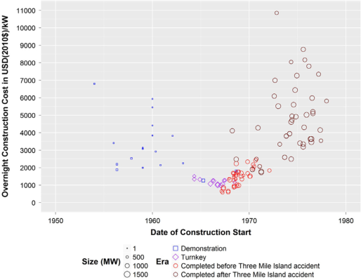
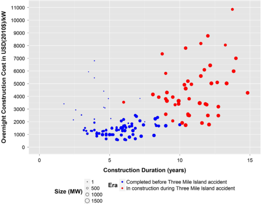
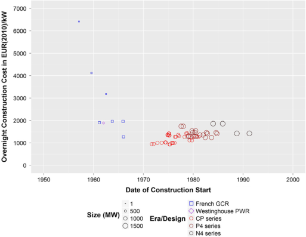
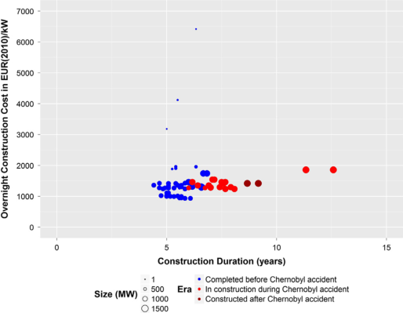
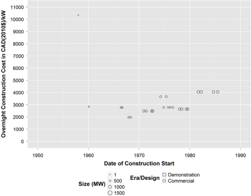
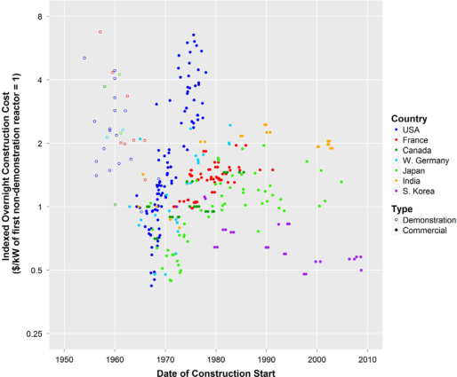
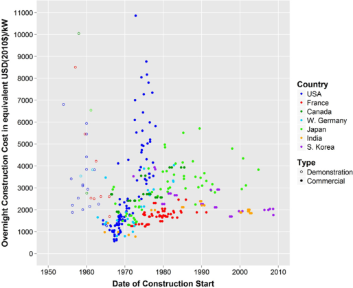

Energy Policy 91 (2016) 371–382

Contents lists available at ScienceDirect

# Energy Policy

journal homepage: www.elsevier.com/locate/enpol

# Historical construction costs of global nuclear power reactors

Jessica R. Lovering $^{a,*}$, Arthur Yip $^{a,b}$, Ted Nordhaus $^a$

$^a$ *The Breakthrough Institute, CA, USA*
$^b$ *Department of Engineering and Public Policy, Carnegie Mellon University, PA, USA*

## HIGHLIGHTS

- Comprehensive analysis of nuclear power construction cost experience.
- Coverage for early and recent reactors in seven countries.
- International comparisons and re-evaluation of learning.
- Cost trends vary by country and era; some experience cost stability or decline.

## ARTICLE INFO

*Article history:*
Received 15 September 2015
Received in revised form
12 January 2016
Accepted 13 January 2016
Available online 2 February 2016

*Keywords:*
Nuclear construction costs
Experience curves
International comparison

## ABSTRACT

The existing literature on the construction costs of nuclear power reactors has focused almost exclusively on trends in construction costs in only two countries, the United States and France, and during two decades, the 1970s and 1980s. These analyses, Koomey and Hultman (2007); Grubler (2010), and Escobar-Rangel and Lévêque (2015), study only 26% of reactors built globally between 1960 and 2010, providing an incomplete picture of the economic evolution of nuclear power construction. This study curates historical reactor-specific overnight construction cost (OCC) data that broadens the scope of study substantially, covering the full cost history for 349 reactors in the US, France, Canada, West Germany, Japan, India, and South Korea, encompassing 58% of all reactors built globally. We find that trends in costs have varied significantly in magnitude and in structure by era, country, and experience. In contrast to the rapid cost escalation that characterized nuclear construction in the United States, we find evidence of much milder cost escalation in many countries, including absolute cost declines in some countries and specific eras. Our new findings suggest that there is no inherent cost escalation trend associated with nuclear technology.

© 2016 The Authors. Published by Elsevier Ltd. This is an open access article under the CC BY-NC-ND license (http://creativecommons.org/licenses/by-nc-nd/4.0/).

## 1. Introduction

Studies by the Intergovernmental Panel on Climate Change and the International Energy Agency have identified nuclear power as a key technology in reducing carbon emissions (IPCC, 2014; IEA, 2014). Today, nuclear energy makes up one-third of global low-carbon electricity, and countries with the lowest carbon intensities depend heavily on low-carbon sources of baseload power: nuclear and hydroelectric. Yet the high cost of nuclear power in developed countries has slowed its deployment, as low-carbon nuclear power cannot compete with cheaper fossil fuels, especially in deregulated power markets. Additionally, cost estimates for future nuclear energy are among the most important inputs to energy system models and climate mitigation scenarios (Lebowiscz et al., 2013; Bosetti et al., 2015; Bárron and McJeon, 2015).

Several analyses of historical nuclear cost trends have pointed to escalating costs for nuclear power plants over time, raising doubts about whether nuclear can become cost competitive (Bupp and Derian, 1978; Hultman et al., 2007; Cooper, 2010). However, past studies have been limited in their scope, focusing primarily on cost trends in the 1970s and 1980s for the US (Komanoff, 1981; Koomey and Hultman, 2007) and France (Grubler, 2010; Escobar-Rangel and Lévêque, 2015). These studies represent 26% of the total number of nuclear power reactors completed in the world and only look at two of the 31 countries that have generated electricity from nuclear power today.

The US and France may not be representative of broad cost trends, as they suffered first-mover disadvantages of deploying an evolving technology (Jamasb, 2007). More importantly, the US and France built most of their reactors over 30 years ago. The last

$^*$ Corresponding author at: The Breakthrough Institute, 436 14th Street STE 820, Oakland, CA 94612, USA.
*E-mail address:* jessica@thebreakthrough.org (J.R. Lovering).

http://dx.doi.org/10.1016/j.enpol.2016.01.011
0301-4215/© 2016 The Authors. Published by Elsevier Ltd. This is an open access article under the CC BY-NC-ND license (http://creativecommons.org/licenses/by-nc-nd/4.0/).

reactor to come online in the US began construction in 1978. The limited scope of the existing literature on nuclear costs is further limited by the industry wide disruption caused by the Three Mile Island accident in 1979. Of the 100 US reactors included in previous studies, half were under construction and had not yet received operating licenses when the accident occurred. Given the event's potential effect on construction costs, there is a need to study the cost experience of a wider sample of countries and eras in nuclear power history. 

In addition to the US and France, the UK, Germany, Japan, Canada, and the USSR were all building nuclear reactors during this time period. When the US and Western European countries stopped building nuclear power in the 1990s, several other countries continued to build out their nuclear fleets in East and South Asia and Eastern Europe. In particular, large fleets of standardized reactors were built in Japan, South Korea, India, and more recently in China. While a handful of studies note the low cost of reactors in these regions today (Du and Parsons, 2009; IEA, 2010), there is little analysis of historic cost trends in these countries. 

This study extends and reassesses the literature by collecting and analyzing cost data from a broader set of countries and time periods. We focus our analysis on the real Overnight Construction Cost (OCC) of completed plants because it is both the dominant component of lifetime costs for nuclear power, and the cost component that varies most over time and between countries. The metric OCC includes the costs of the direct engineering, procurement, and construction (EPC) services that the vendors and the architect-engineer team are contracted to provide, as well as the indirect owner’s costs, which include land, site preparation, project management, training, contingencies, and commissioning costs. The OCC excludes financing charges known as Interest During Construction. Further details on OCC can be found in Section 3.2. 

We expand the scope of analyses to include the costs of 32 US and eight French reactors built prior to 1970. Beyond the US and France, we collect complete cost histories for Japan, South Korea, West Germany, Canada, and India (153 reactors in total). To summarize, our study provides costs for a full set of reactors in seven countries, covering builds from 1954 through projects that had been completed by the end of 2015, covering costs for 58% of all power reactors ever built globally. 

## 2. Literature review 

Experience curves, progress ratios, and learning rates are all methods of analysis that were originally used to compare innovation and advancement across aircraft manufacturing firms (Wright, 1936), and have since been employed to analyze development of a broad range of technologies including power plants (Zimmerman, 1982; Joskow and Rose, 1985). Since nuclear power plants are complex infrastructure projects – not a product that rolls off an assembly line – a range of factors go into the final cost. To isolate learning effects for a specific reactor developer, many studies have used regression models to isolate for a theoretical learning-by-doing based on a manufacturer or architect-engineer firm's progress. 

Cantor and Hewlett (1988) summarized four such regression studies that attempt to isolate the effects of learning, economies of scale, and regulatory changes on Overnight Capital Costs of US reactors. They found that individual firms experience learning, but that the increased size of plants and increased regulation led to longer lead times and higher overnight costs, thus offsetting any learning-by-doing effect. 

Kouvaritakis et al. (2000); Jamasb (2007), and Kahouli (2011) also derived learning rates for nuclear construction costs for the 

OECD and EU. They found that learning-by-searching, ie, improvement through R&D, can have an important effect. Berthélemy and Escobar-Rangel (2015) performed a regression analysis to isolate hypothetical cost drivers, including learning effects, using a combined data set of French and US reactors. They find that standardization of reactor designs is key for decreasing lead times and costs, and that innovation can actually lead to higher capital costs and longer lead times. 

While these studies calculate theoretical learning rates for specific developers and construction firms, it is difficult to truly isolate learning effects when so many other factors were changing at the same time as firms potentially gained experience. Jamasb (2007) demonstrated how incorporating multiple factors – such as technological improvements due to research and development – changed the learning-by-doing rate significantly. Clarke et al. (2006); Söderholm and Sundqvist (2007), and Pan and Köhler (2007) warned against using learning curves beyond the scope of a manufacturing firm, since there are many drivers of cost reductions that are unrelated to replications or experience. These drivers include market demand, supply chain, labor relations, research and development, and regulation. 

Given these conflation issues – and in the absence of any causal framework – a simpler method is to look at historical cost trends for reactors built within a specific country over time or by cumulative deployed capacity; this metric is often referred to as an experience curve. Such analysis can be likened to industry-wide or country-wide learning and can shed light on the combined effect of developer experience, learning-by-doing, and the accumulation of other time-related cost drivers. Analyzing the historical experience in this way has been a common approach to help understand the prospects and challenges of nuclear power. Past studies (Thomas, 1988; MacKerron, 1992; Koomey and Hultman, 2007; Escobar-Rangel and Lévêque, 2015) have documented dramatic cost escalation and have identified the presence of “negative learning-by-doing,” suggesting an “intrinsic” or inevitable increase in costs (Grubler, 2010). These results have played a role in informing integrated assessment modellers and policy makers (Neij, 2008; Junginger et al., 2008; Harris et al., 2013; Azevedo et al., 2013). 

The phenomenon of cost escalation has been interpreted as a lack of learning in the traditional sense of firm-level production, but the studies have deployed a broader use of the term to describe a theoretical country-level, industry-wide learning. Experience curves may not be able to isolate firm-level learning, but they can be useful in highlighting differences between the experiences across countries or during different phases of reactor development within a single country. Importantly, experience curves do not provide a causal explanation of cost drivers for nuclear power (or other energy technologies), but can help quantify historic trends and lead to future case studies or econometric studies. 

Despite these constraints, the single-factor learning curve methodology has been commonly and broadly applied in studies of nuclear cost trends, due to the availability of data and its ease of use (Jamasb, 2007). Of particular note, Grubler (2010) analyzed the historical costs of nuclear power for France and the US, and concluded that nuclear power construction costs “invariably exhibited negative learning” and “forgetting by doing,” citing an increase in system complexity for nuclear power construction, which was hypothesized by Lovins (1986), Bupp and Derian (1978), and Komanoff (1981). Additionally, Grubler (2010), using Fig. 1, observed a “rhythm of cost escalation” for both the US and France, describing 20 GW and 50 GW as “threshold levels” at which cost escalation “accelerated” and “skyrocketed.” 

Regardless of the methods used to analyze cost trends, the existing literature mainly ignores cost data in several dominant and emerging nuclear countries. The data analyzed for 99 US 

reactors by Koomey and Hultman (2007) and 58 French reactors (29 pairs) by Escobar-Rangel and Lévêque (2015) only represent 26% of the total number of nuclear power reactors completed in the world (596 reactors in 34 countries). The US and France were two of the nuclear pioneers, but until 2008, the last construction start of a nuclear reactor was 1978 in the US and 1984 in France. In the 24 years between 1984 and 2008, 96 reactors began construction around the world. The exclusive study of the cost experience of the US and France neglects the experiences of other pioneers such as Canada (25 completed reactors), the UK (45), and USSR (39), early adopters such as Germany (36), Japan (62), and India (21), and later adopters such as the Republic of Korea (24) and China (28). 

Even in the oft-studied US and France, most analyses have excluded early fleets of nuclear reactors, particularly demonstration reactors and commercial reactors built on turnkey contracts, where reactors were built at a fixed price. While there are good reasons for excluding such reactors (Koomey and Hultman, 2007; Escobar-Rangel and Lévêque, 2015), experience curve analyses for other energy industries often include the early, small-scale demonstration plants (Ordowich et al., 2012; Rubin et al., 2007). With a full cost history for a given energy technology, it is easier to observe different eras when different drivers of cost trends may have been dominant, such as R&D early on, economies of scale later, economies of multiples, and finally industrial learning or regulatory stability. 

The state of the existing literature highlights the need for a broader and more holistic analysis of the historical experience and trends of nuclear costs. Rather than perform analysis in search of learning-by-doing or economies of scale – which may prematurely misattribute cost trends based on a narrow data set – we start with an in-depth survey of nuclear construction costs across a diverse set of countries. Once complete, further studies can explore cost drivers in each country. 

## 3. Methodology 

## 3.1. New data on reactor costs 

This study provides a more holistic picture of nuclear costs by filling important gaps in previous analyses, collecting costs for a total of 349 reactors in seven countries (58% of all reactors built globally). We use the IAEA Power Reactor Information System 

database for a globally comprehensive listing of nuclear power reactors completed as of 2015. We curate construction cost data sets for 32 previously omitted reactors in the US, eight in France, and new costs for 153 reactors in West Germany, Canada, Japan, South Korea, and India. Our goal was to obtain complete cost trend data for the countries with the largest nuclear reactor fleets. However, reliable and complete data could not be found for Russia (39 nuclear power reactors, third largest nuclear energy producer), China (28 reactors, fifth largest producer), and for the second generation of gas-cooled reactors in the UK (13 reactors built from 1967 through 1980). 

Nuclear power encompasses a wide variety of reactor technologies, but over 80% of operating reactors around the world are light-water reactors. For this study, we include cost data for lightwater reactors, as well as for heavy-water reactors and gas-cooled reactors where data were available. While some cost estimates were available for demonstrations of advanced reactors such as fast breeder reactors, we excluded them from our cost trend analysis if the demonstration was one-off and not followed by commercial reactors of the same design. 

## 3.1.1. Data from US and France 

Past studies generally have cited a lack of data availability for their partial coverage of the US and France (Koomey and Hultman, 2007; Komanoff, 1981), or have limited their scope of analysis to operational second-generation reactors (Grubler, 2010). Because this study intends to thoroughly explore the cost experience of nuclear power, we present the costs of the first-generation reactors for analysis and comparison. 

We collected costs for 131 US reactors from several sources. For 99 reactors that began construction between 1967 and 1978, we use the data from Koomey and Hultman (2007), which stem from a database built by Komanoff (1981). The Koomey and Hultman (2007) data are adjusted for minor methodological differences regarding inflation adjustments (see Appendix). 

For the 14 reactors ordered in the US in the turnkey era between 1962 and 1968, we use estimates of the costs to the contractors and builders prepared by United Engineers and Constructors in the Atomic Energy Commission (AEC) WASH-1345 report from 1974, as documented by Burness et al. (1980). Note that these estimated costs are higher than the turnkey contract price, because most of these plants were built at a loss to early developers trying to gain market share (see Appendix). 

For the 18 earlier demonstration[1] reactors that began construction between 1954 and 1963, we use cost figures found in IAEA (1963) and Loftness (1964), who compiled figures from USAEC reports. The cost information for these turnkey and demonstration reactors used in this analysis differ from their reported contract prices. The historical context (see Appendix) suggests that the cost estimates are a more accurate representation of costs than the turnkey contract prices, and that they should be seen as lower-bounds for the true costs. 

For France, we use the Cour des Comptes (2012) construction cost data for 66 nuclear power reactors, including seven gascooled reactors and one PWR that did not receive attention from Escobar-Rangel and Lévêque (2015); Boccard (2014), or Grubler (2010). We exclude costs for France's two fast-breeder reactors, since they were not followed by commercial designs, and we exclude costs for two prototype gas-cooled reactors because data were unavailable. 

> 1 For this paper, demonstration reactors are limited to those that are ordered by utility companies and connected to the grid for the purposes of power generation, and are not for research or experimental purposes. 

### 3.1.2. Data from other countries

For Canada, [Vu and Bate (1982)](#), representing the Atomic Energy of Canada Ltd. (AECL), provided detailed cost data for 23 reactors. These data are corroborated and supplemented with data from [IAEA (1983)](#) for the first reactor at Rolphton, and from [Gavor (1985)](#), [McConnell et al. (1983)](#), [Thomas (1988)](#), and the [Pembina Institute (2004)](#) for final costs of subsequent reactors built after 1984, 24 out of 25 reactors in Canada. The cost of one reactor in Quebec was unavailable.

For Germany, [Kim (1991)](#) obtained detailed cost data from plant operators for 21 reactors in West Germany. Additional data for earlier reactors were obtained from [IAEA (1965)](#) and [El-Foudi (1970)](#). Costs were not available for the six reactors constructed in East Germany and four experimental reactors: two high-temperature gas-cooled reactors, one heavy-water gas-cooled reactor, and one fast- reactor.

For Japan, the Institute for Energy Economics, Japan (IEEJ), conducted a survey of utility companies in Japan to acquire cost data for every Japanese reactor ([IEEJ, 2012](#)). We use IEEJ survey results for 56 reactors, and corroborate the IEEJ data with partial data from [IAEA (1963)](#), [Marshall and Navarro \(1991\)](#), and [Du and Parsons \(2009\)](#), supplementing cost data for four more reactors to cover all 60 reactors in Japan. We exclude costs for two experimental reactors: the Fugen Advanced Thermal Reactor because no data were available and the Monju Fast Breeder Reactor because it was not followed by any commercial fast reactors.

For India, [Bohra and Sharma \(2006\)](#), representing the Nuclear Power Corporation of India Ltd. (NPCIL), provided cost data for the latest 16 reactors. Cost data for the earliest 14 reactors were also presented in [Ramana et al. \(2005\)](#), who obtained data from the Indian Department of Atomic Energy from 1996 and 2002 reports. For the eight reactors covered by both studies, costs differ by  $-10\%$  to  $+20\%$  after methodological adjustments.2 For these eight reactors, the cost information from [Bohra and Sharma \(2006\)](#) is used, considering their recency, data access, and methodological consistency.

For Korea, a direct inquiry to the Korea Hydro and Nuclear Power (KHNP) utility company collected data for all 26 reactors in South Korea. These data are corroborated by information from the [KHNP \(2014\)](#) annual report, the National Assembly Budget Office ([NABO\) \(2014\)](#), and [Korea Power Exchange \(KPX\) \(2015\)](#).

### 3.2. Metrics for comparison

We use the Overnight Construction Cost (OCC) specific to each reactor as the metric of comparison in this study. The OCC includes the costs of the direct engineering, procurement, and construction (EPC) services that the vendors and the architect-engineer team are contracted to provide, as well as the indirect owner's costs, which include land, site preparation, project management, training, contingencies, and commissioning costs. For heavy-water reactors, the OCC includes the cost of the initial heavy-water inventory. The OCC includes back-fit costs but excludes retrofitting or capital expenditures after first operation and the cost of the initial fuel core.

The OCC represents the single largest component of the total levelized cost of generating electricity with nuclear power, typically accounting for roughly 75%. In this study, we focus exclusively on OCC because the other lifecycle costs – approximately 15% for Interest During Construction (IDC), 15% for O&M and decommissioning provisions, and 15% for fuel and provisions for used fuel – are more predictable and have had far less variation over time and country ([Dhaeseleer, 2013](#)).

The "overnight" attribute refers to the construction cost of a nuclear reactor as if the reactor construction process were completed instantaneously, without incurring the financing charges accrued before commercial operation, known as Interest During Construction (IDC). The OCC metric is meant to isolate the cost invariant to construction duration and interest rate, in order to capture the cost intrinsic to the reactor technology.3 For some countries, costs were already reported in overnight terms, while in others, we adjusted the data by removing the IDC. Then, the data are adjusted for inflation by their country-specific GDP deflator to the year 2010 from World Bank data. Finally, the OCC is normalized to a per-kilowatt power rating based on the original designs' net power capacity, as reported in the IAEA PRIS database.

Although we exclude IDC from this analysis, it is worth noting that how large an effect it [?] has on the total cost of a nuclear plant. An anonymized survey of actual construction costs for US plants found that on average IDC comprised 46% of the total upfront cost ([DOE, 1988](#)). [Davis \(2011\)](#) found that IDC could range from 12% of total construction costs with a 5% cost of capital and a five-year construction duration to 54% of total construction costs for a 15% cost of capital and a ten-year construction duration. Factors that affect IDC are much better understood, primarily construction duration, discount rate, and the weighted average cost of capital (D'haeseleer, 2013).

In contrast to other studies that assess historical cost trends by the reactor's date of commercial operation ([Koomey and Hultman,](#) [2007;](#) [Grubler, 2010](#)), this study uses reactor construction start dates from the IAEA PRIS database, defined as the first foundation concrete pour. Because nuclear construction durations have been exceptionally long, up to 10–20 years at the extremes, the state of technology and the reactor designs are not representative of the date of eventual commission, but rather, more representative of the date of the start of construction. Using construction start dates to analyze the nuclear power experience allows for a focus on the cost characteristics of the "best available technology" at the time of deployment, consistent with the technological learning literature ([Junginger et al., 2008](#)).

We present historical cost trends for each country to illustrate the detailed and varied histories of its respective nuclear power industry. A country-level analysis of costs in local currency units avoids issues related to currency valuation and international variation in labor costs. Mott [MacDonald \(2011\)](#) estimated that labor, either on-site or embedded in the supply chain, accounts for two-thirds of the capital expenditure of nuclear power stations.

## 4. Results and discussion

### 4.1. US and France: new patterns do not fit old stories

The US and France are the two countries subject to the most analysis in the existing literature of nuclear cost trends. While [Komey and Hultman \(2007\)](#) and [Escobar-Rangel and Lévêque](#) [\(2015\)](#) have shown sharply rising costs for the US, and smaller but steadily rising costs for France, our more complete data set shows that there is not a single story of rising costs, but a more complex history.

2 Costs for four earlier reactors were 10–20% higher than the comparable adjusted figure from [Ramana et al. \(2005\)](#), and costs for four later reactors were 5– 10% lower than the comparable adjusted figure in [Ramana et al. \(2005\)](#).

3 The overnight construction cost will inevitably include time-related costs related to delays, such as additional price inflation for nuclear-specific materials, equipment, and labor, extension of equipment rentals, labor retention, and back-fit costs caused by regulatory changes during construction.

## 4.1.1. Cost trends in the United States 

By capturing a full overnight construction cost history for the US by construction start date, four distinct phases of nuclear power construction become visible, shown in Fig. 2. 

Between 1954 and 1968, starting with the first reactor at Shippingport, 18 demonstration reactors were ordered and completed. In this first phase, overnight construction cost (OCC) decline sharply, from a high of $6800/kW to a low of $1300/kW, an 81% drop, or an average annualized rate of decline of 14%. In this period, reactor size increases from under 80 MW to 620 MW, suggesting economies of scale were important. The second phase, from 1964 to 1967, represents the era of turnkey contracts. The OCC of these 14 reactors are in the range of $1000-1500/kW, a 33% drop, or an average annualized rate of decline of 13%. In this period, reactor sizes increase to a range of 800–1100 MW. 

The cost experience of these earlier reactors contrasts sharply with the picture in the existing literature. Koomey and Hultman (2007) started with the first non-turnkey reactor, Palisades, which started construction in 1967 and cost $650/kW once completed. Between 1967 and 1972, the 48 reactors that were completed before the Three Mile Island accident in 1979 began construction. Their OCC rise from a range of $600–$900/kW to approximately $1800–$2500/kW. These reactors follow a trend of increasing costs by 187%, or an annualized rate of 23%. Phung (1985) attributed these pre-TMI cost increases to emerging safety requirements resulting from pre-TMI incidents at Browns Ferry and Rancho Seco. Two outliers, Diablo Canyon 1 and 2, cost about $4100/kW in overnight construction cost, and were completed 17 and 15 years later, in 1984 and 1985. 

A break in construction starts is visible around 1971 and 1972, which is likely attributable to a confluence of events affecting nuclear power construction in the late 1960s and early 1970s. These include the establishment of the Environmental Protection Agency in 1971, and the AEC's gradual loss in public trust and its eventual replacement by the Nuclear Regulatory Commission (NRC) in 1975. Golay et al. (1977) determined that 88 reactors in various stages of permitting, construction, and licensing were affected by the 1971 Calvert Cliffs court decision resulting in revised AEC regulations that included back-fit requirements. 

Finally, the last 51 completed reactors represent a set that began their construction between 1968 and 1978 and were under construction at the time of the Three Mile Island accident in 1979. For these reactors, OCC varies from $1800/kW to $11,000/kW. Thirty-eight of these reactors fall within a mid-range of $3000/kW 

to $6000/kW, with 11 between $1800 and $3000/kW and 10 between $6000 and $11,000/kW. From the OCC of about $2,000/kW for reactors beginning construction in 1970, OCC increases another 50–200%, or an annual increase of 5–15% between 1970 and 1978. 

To better understand the impact of Three Mile Island on nuclear power construction, we plot reactor construction durations, represented by the time between the construction start date and the grid connection date, as an additional variable to OCC in Fig. 3. 

When the full cost experience of US nuclear power is shown with construction duration experience, we observe distinctive trends that change after the Three Mile Island accident. As shown in Fig. 3 in blue, reactors that received their operating licenses before the TMI accident experience mild cost escalation. But for reactors that were under construction during Three Mile Island and eventually completed afterwards, shown in red, median costs are 2.8 times higher than pre-TMI costs and median durations are 2.2 times higher than pre-TMI durations. Post-TMI, overnight costs rise with construction duration, even though OCC excludes the costs of interest during construction. This suggests that other duration-related issues such as licensing, regulatory delays, or back-fit requirements are a significant contributor to the rising OCC trend. Phung (1985) observed retrofit costs due to new safety requirements before and after TMI. Rust and Rothwell (1995) argued this rise was due to unprecedented regulatory flux and uncertainty post-accident. Hultman and Koomey (2013) disputed the economic impact of the Three Mile Island accident on the US nuclear industry, but failed to observe its distinctive effects on overnight construction costs. These results suggest that the Three Mile Island accident in 1979 did uniquely affect the nuclear industry in terms of overnight construction cost. 

## 4.1.2. Cost trends in France 

The French nuclear power overnight construction cost history follows distinct stages that we highlight in Fig. 4. The cost history of the first era of French nuclear power has not been discussed in previous studies of French construction costs by Grubler (2010) or Escobar-Rangel and Lévêque (2015). Prior to the second-generation PWRs, France built a series of indigenously designed gas-cooled reactors (GCRs). These reactors fall in cost from €6500/kW to €1200/kW between 1957 and 1966, a decline of 82%, or 17% annualized. These GCRs scale from a size of 68 MW to 540 MW. 

In 1962, a single imported Westinghouse 305 MW pressurized water reactor, Chooz-A, began construction and cost 

approximately €2000/kW. Thomas (1988) gave credit to the participation of Framatome and EdF in the early construction experience of this reactor, under a technology license from Westinghouse, for valuable lessons deployed in the second era of nuclear power in France. 

From 1971 to 1991, when the French began rapidly expanding their domestic nuclear industry, OCC rises slowly from €1000/kW to €1500/kW–2000/kW, representing a 50% to 100% increase, or a 2% to 4% annualized rate of escalation. Within this second phase, the CP series of reactors increase in cost, while the costs of the reactors in the P4 series are remarkably stable. The last two pairs of reactors at Chooz-B and Civaux were the result of the N4 program, which was intended to indigenize the reactor design and move away from designs based on the Westinghouse license. The costs at Chooz-B-1 and -2 deviate from the strong trend of stable costs around €1400/kW. 

While the cost escalation in France is trivial compared to the US experience, it does require some explanation. Escobar-Rangel and Lévêque (2015) conclude that rising labor costs (faster than inflation), technological change due to increased regulation, and increased complexity due to larger reactors led to higher costs. Escobar-Rangel and Lévêque (2015) credited the vertical integration of the utility and reactor developer, standardization of reactor designs, and multi-siting of reactors, for keeping costs low. 

An analysis of French nuclear construction costs and construction durations together in Fig. 5 shows that the Chernobyl accident in 1986 resulted in a small but observable increase in costs and a steady increase in construction duration. In contrast to the US experience with the Three Mile Island accident, the French nuclear power construction cost and duration trends were much less affected by the accident at Chernobyl. This is seen by comparing Figs. 3 and 5. 

One challenge with the data is that in France, reactors were built in pairs, resulting in an averaged construction cost for all of the reactors at the same site. The OECD Nuclear Energy Agency described the potential for cost savings for subsequent reactors at the same site, from staged schedules, shared equipment and facilities, and construction experience (OECD NEA, 2000). However, since costs for multiple-unit plants have often been reported in aggregate, this level of learning has been obscured in the data (see Appendix). 

## 4.2. Other Western nuclear powers: data from Canada and West Germany 

Canada and Germany are two other Western countries that early on had considerable nuclear power programs. The Canadian cost history, shown in Fig. 6, is similar in shape to the French experience: sharply declining costs and then relatively mild cost escalation. 

Canada built its first nuclear power reactor in 1957, a 17 MWe demonstration reactor, at an overnight cost of CAD$11,000/kW. Canada's Deuterium Uranium (CANDU) reactor design, which uses heavy water as a moderator, was scaled up to 200 MWe and then 500 MWe. The costs of these reactors, ordered from 1960 to 1974, including the initial heavy water inventory, were between $2000 and $3000/kW, representing a cost decline of approximately 77% (8% annualized) from the first CANDU. Construction of larger plants consisting of sets of four reactors started in 1971, and the last construction start occurred in 1986. Twelve reactors eventually cost $2500–3000/kW, while six other reactors, the latter four at Darlington, cost near $4000/kW, a 60% increase in costs, or a 4% average annual increase. The mild cost escalation experienced 

[Figure 7: Overnight Construction Cost of West German Nuclear Reactors by Construction Start Date. No data for East Germany and non-LWR/PHWR reactors.]

[Figure 8: Overnight Construction Cost of Japanese Nuclear Reactors by Construction Start Date. While Japan's costs increased from the early 1970s to the early 1980, costs have remained relatively stable, albeit varied, over the last 30 years. Diseconomies of scale are not as apparent as seen in the US and France.]

in Canada could be due to consistency in builders and manufacturers, the smaller reactor sizes, or that reactors were almost always built in tight pairs (close in time), as can be seen in Fig. 6.

The cost experience in West Germany follows a similar pattern as the other Western countries, shown in Fig. 7. Germany ordered its first reactor from GE in 1958, and the Vak Kahl reactor was reported to cost in the range of €2700/kW. Construction costs for plants that began construction between 1965 and 1973 decline to approximately €1000/kW, a 63% reduction (6% annualized). For plants beginning construction between 1973 and 1983, there is a trend of increasing cost from €1000 to €3000/kW, a 200% increase, or a 12% average annual increase.

### 4.3. New cost histories: data from Japan, India, and South Korea

The cost experience of the US and France is important for analysis because they have the first and second-largest fleets of nuclear reactors and were leaders in the early commercial nuclear power industry. The cost histories of Canada and Germany provide additional context as to the experience of other nuclear pioneers in the Western world. However, these four countries share similar first-mover disadvantages, obstacles, and setbacks that come with deploying an emerging, immature technology (Jamasb, 2007). For a more complete global picture, we present new comprehensive data from Japan, South Korea, and India, which now have the third, fifth, and seventh largest operating⁴ reactor fleets in the world. More importantly, Japan, India, and South Korea continued building nuclear power plants through the 1990s and 2000s when the nuclear industry had stagnated in the United States and Europe.

In Japan, the cost trend repeats an L- or U-shape seen in the four previous countries, but evolves differently afterward, as shown in Fig. 8. In the first phase of Japan's nuclear power history, from 1960 to 1969, reactors were first imported from American and British companies, with costs of approximately ¥1,100,000/kW and ¥600,000/kW for a 10 MW boiling water reactor and a 159 MW gas-cooled reactor, respectively. Reactor size increases between 300 and 700 MW, and costs fall to ¥150,000/kW for reactors by 1971, representing an 82% decline (16% annualized). The second phase, from 1970 to 1980, represents when Japanese

industries took over the construction and manufacturing of reactors. During this time, reactor size also grows to an average of 950 MW. The overnight construction cost increases from ¥150,000/kW to ¥300,000/kW, an increase of 100%, or an 8% annual rate of escalation. In the third era of nuclear power construction in Japan, from 1980 to 2007, costs remain between ¥250,000/kW and ¥400,000/kW, representing an annual change of −1% to 1%. This period experienced relatively stable costs over 27 years.

The Indian cost history, shown in Fig. 9, differs from both Western and East Asian experiences. India ordered a pair of boiling water reactors from General Electric in 1964, at a price of ₹45,000/ kW, and a pressurized heavy-water reactor (PHWR) of the CANDU design from Atomic Energy of Canada Ltd. (AECL) in 1965, at a price of ₹65,000/kW. After testing its first nuclear weapon in 1974 and their exclusion from the Non-Proliferation Treaty, India proceeded to design and deploy their own indigenous PHWR design at 200 MW power capacities, which were much smaller than other standard designs. The first three of these indigenous reactors, which began construction between 1968 and 1972, cost between ₹35,000/kW and ₹45,000/kW, a decline of 38% (7% annualized).

[Figure 9: Overnight Construction Cost of Indian Nuclear Reactors by Construction Start Date.]

⁴ As of publication, most of Japan's reactor fleet is temporarily closed awaiting potential restarts after safety upgrades prompted by the Fukushima Daiichi accident in 2011. However, Japan is still considered to have 48 reactors operational.

[Figure 10: Overnight Construction Cost of South Korean Nuclear Reactors by Construction Start Date. South Korea began by importing large foreign reactor designs, and then began building their own indigenous reactor in 1989. Also note that most of South Korea's reactors were built in pairs.]

from the first CANDU. However, the costs of the next eight reactors ordered between 1976 and 1990 jump to ₩90,000/kW to ₩110,000/kW, an increase of 150% (5% annualized). Following a ten-year pause in reactor construction, six reactors of the Indian design and two of the Russian VVER design began construction between 2000 and 2003, and cost approximately ₩90,000/kW, approximately 10% lower than the cost of the previous era.

The data from South Korea, shown in Fig. 10, tell an entirely new story. Notably, Korea entered the nuclear market much later than US, France, Canada, Germany, or Japan. Korea's first power reactor, a 558 MW Westinghouse design, began construction in 1972, and cost approximately 4,000,000 KRW/kW. Korea skipped the early, small-scale demonstration phase and went straight to importing a large commercial reactor. In its first phase of construction, Korea continued to import several reactor designs from American, French, and Canadian companies, a total of 9 between 1972 and 1993. These plants cost between 2,500,000 KRW/kW and 4,500,000 KRW/kW. Within this era of imported designs, costs fell approximately 25% (2% annualized). In 1989, Korea began construction on their first domestically developed OPR-1000 design, based on Westinghouse, Framatome, and Combustion Engineering designs. This first reactor cost 2,600,000 KRW/kW. Twelve reactors of this standard design began construction between 1989 and 2008, and their costs declined in a stable manner, sitting between 2,000,000 KRW/kW and 2,500,000 KRW/kW, representing a 13% cost decline (1% annualized). Overall, from the first reactor in Korea in 1971, costs fell by 50%, or an annual rate of decline of 2% for the entire Korean nuclear construction history. This is in sharp contrast to every other country for which we present cost data.

In Table 1, we provide a summary of the cost trends for each country. Rather than calculating a single learning rate for each country, we separate out specific eras and present the annualized rate of change in overnight construction cost for these eras and the total change in OCC in each era.

## 4.4. Global trends and experience curves

### 4.4.1. National experience curves of nuclear construction

A broader look at nuclear cost history allows us to analyze a new set of country-level experience curves for nuclear power. Rather than look at a trend in a single country, we have presented complete cost histories for seven countries. Fig. 11 shows Overnight Construction Costs scaled to the cost of the first non-demonstration reactor in each country.

The most surprising feature is the large diversity in trends, with the US and South Korea at the two extremes. Countries building reactors more recently, particularly those with construction starts after 1980, have different trend shapes than the early nuclear pioneers. Rather than an "invariable exhibition of negative learning" and "inevitable" increases in complexity intrinsic to nuclear technology that lead to cost escalation (Grubler, 2010), it is clear that there is not a singular cost trend for nuclear technology, but a plurality of different country-specific experiences. A consistent "rhythm" of cost escalation suggested by Grubler (2010) does not match the historical record.

We see that the pre-commercial "demonstration" costs of global nuclear reactors generally fell in the 1950's and 1960's. Excluding demonstration plants, reactor costs in the US, France, Canada, West Germany, and Japan experienced some cost declines in the early years of commercialization, as shown by the costs below 1.0 in the 1960's and 1970's, before rising above 1.0.

One issue with experience curve analysis is the choice of system boundary, which can exclude important parts of a learning system, and could produce misleading results (Junginger et al., 2008). Technologies are often globally developed, and nuclear power is no exception, as evidenced by the diffusion of reactor

**Table 1**
Summary of Cost Trends by Country.

| Country | Era (defined by time period in which reactors began construction) | Annualized rate of change in OCC (%/yr) | Total change in OCC by era (%) |
|---------|-------------------------------------------------------------------|------------------------------------------|--------------------------------|
| **USA** | 1954–1968, 18 demonstration reactors | −14% | −81% |
|  | 1964–1967, 14 turnkey reactors | −13% | −33% |
|  | 1967–1972, 48 reactors completed pre-TMI | +23% | +100% |
|  | 1968–1978, 51 reactors completed post-TMI | +5 to +10% | +50 to +200% |
| **France** | 1957–1966, 7 gas-cooled reactors | −17% | −82% |
|  | 1971–1991, 59 light-water reactors | +2 to +4% | +50 to +100% |
| **Canada** | 1957–1974, 6 reactors | −8% | −77% |
|  | 1971–1986, 18 reactors | +4% | +60% |
| **West Germany** | 1958–1973, 8 reactors | −9% | −63% |
|  | 1973–1983, 18 reactors | +3% | +200% |
| **Japan** | 1960–1971, 11 imported reactors | −15% | −82% |
|  | 1970–1980, 15 foreign designs | +8% | +100% |
|  | 1980–2007, 30 domestic reactors | −1% to +2% | −17% to +33% |
| **India** | 1964–1972, 5 imported reactors | −7% | −38% |
|  | 1971–1980, 8 domestic reactors | −5% | +50% |
|  | 1990–2003, 6 domestic reactors+2 imported | −1% | −10% |
| **South Korea** | 1972–1993, 9 foreign designs | −2% | −25% |
|  | 1989–2008, 19 domestic reactors | −1% | −13% |

designs via exports and licenses. One way to explore this issue is to analyze historical cost experience in a global context. 

## 4.4.2. Nuclear construction costs in a global perspective 

While the seven countries in this study present unique nuclear construction histories, a global perspective can also produce additional insight into the cost history of nuclear power. Fig. 12 shows the costs of nuclear reactors in the seven studied countries in 2010$ USD equivalent. Compared to the picture commonly presented in previous studies (see Fig. 1), Fig. 12 shows a more complex set of trends. 

The truncated cost history of the US can be seen as a global outlier. Reactors in the US that began construction between 1971 and 1978 and were mid-construction during the Three Mile Island accident experience a rapid increase in cost. No new reactors started construction after 1978. This is in contrast to the reactors in France that experience lower and stable costs. The cost experience of Canada and Germany follows patterns that are in between the US and France, with mild cost escalation for reactors that began construction around 1970, and then atypically high 

costs for the last few reactors beginning construction in the early 1980s. Like France, Canada and Germany also saw their last construction starts in the 1980s. 

The experiences of Japan, India, and Korea help fill in the picture past 1980. In Japan, costs also fall and escalate in a pattern similar to Western countries, but with a lag of about five years. The costs of Japanese reactors beginning construction in the 1980s rise above those in the 1970s, and become less consistent between reactors, but do not appear to follow an escalation trend. In India, costs increase from a low level and stabilize at the $2000/kW level. Finally, in Korea, where nuclear power was adopted much later than all six other countries, construction costs follow a steady decline. 

While this study is focused on presenting cost histories and not analyzing potential drivers of cost trends, several possible explanations are observable. In addition to the lower costs seen by the later adopters of nuclear power, countries that emphasized design standardization, such as in France and Korea, see more stable costs, as qualitatively described by Choi et al. (2009) and Lévêque (2014). Countries that consistently built reactors in pairs, or larger sets at the same site, such as France, Canada, and Korea, see lower costs than in the USA, Japan, and Germany. 

## 4.4.3. Nuclear's cost experience curves in context 

Other energy technologies have experienced similarly dramatic rises and falls in cost. There is a large difference in learning curves between small-scale modular energy technologies like solar panels and wind turbines and large energy infrastructure projects like nuclear reactors and hydroelectric dams. In Fig. 13, the cost experience curve of solar photovoltaics in Germany is compared with the global nuclear construction cost experience based on global cumulative deployment. 

The construction cost history of nuclear power is significantly more varied than that of solar photovoltaics, but this is obscured when it is presented as a single global learning curve such as in Trancik (2006). While it is clear the construction cost of nuclear power has experienced periods of rapid escalation in several countries, there are also two periods in nuclear power construction history where costs declined sharply and at steep exponential rates comparable to those experienced by solar photovoltaics: the early development of nuclear power up to 100 GW, and the recent experience of Korea. The massive declines in nuclear construction 

costs in their early development suggest the critical role of cost drivers other than learning-by-doing for nuclear power, such as R&D, economies of unit scale, and economies of production scale. The latest experience in South Korea, with its standardized design and stable regulatory regime, suggests the possibility of learningby-doing in nuclear power. 

The cost experiences of Japan and Korea at the latter end of nuclear power construction history raise the possibility of spillover and learning from the earlier experiences in other countries such as the US and France. Thomas (1988) pointed out that learning in nuclear power may require significant operational experience in addition to complete construction experience, before benefits are accrued in the form of new rationalized designs and lower construction costs. This suggests that cost escalation with increased experience is not an inevitable outcome. 

On the other hand, rising capital costs for nuclear power have been associated with improved safety and performance (EscobarRangel and Lévêque, 2015). 

Junginger et al. (2008) notes that the investment prices for wind and solar technologies experienced negative learning post2002 and suggests the causes are increasing demand for these technologies and rising raw material prices. 

In the US, the capacity-adjusted price of a wind turbine rose by 100% from 2002 to 2008, an annual growth rate of 10%, caused by a mix of diseconomies of scale, labor prices, steel prices, and currency movement (Bolinger and Wiser, 2012). Rather than predict that wind power cost would continue to rise or that the technology was inherently expensive, most analysis focused on understanding the drivers of these cost increases. 

In Fig. 14, we show how the nuclear experience curves compare to the US coal experience. In contrast to photovoltaic panels, which are mass-produced in a factory, coal power plants are more analogous to nuclear power plant construction. For both industries, plants faced increased environmental and safety regulation that may have led to cost increases, along with increased complexity of managing large construction projects. Between 1971 and 1978 in the US, the cost of a coal power plant increased at 8% annually, in addition to construction-sector inflation, primarily due to increased air and water quality regulations (Komanoff, 1981). About 20% of this increase for coal plants could be attributed to new required equipment – scrubbers and cooling towers – and the other 80% of cost increases were attributed to other 

aspects of meeting tighter regulations: longer lead times for projects, more delays due to legal intervention, and higher labor costs to evaluate environmental impacts (Joskow and Rose, 1985). 

It is worth noting how nuclear power construction costs also follow escalation trends similar to those for coal power in these time periods and stage of development at the 100 GW level. Part of the cost escalation of nuclear power may also reflect changing requirements in an era of extreme uncertainty for the technology, and general trends in construction costs such as materials and labor. 

## 5. Conclusions and policy implications 

This paper presents a new data set of historic experience curves for overnight nuclear construction costs across seven countries. From these data, we draw several conclusions that are in contrast to the past literature. While several countries show increasing costs over time – with the US as the most extreme case – other countries show more stable costs in the longer term and cost declines over specific periods in their technological history. Moreover, one country, South Korea, experiences sustained construction cost reductions throughout its nuclear power experience. The variations in trends show that the pioneering experiences of the US or even France are not necessarily the best or most relevant examples of nuclear cost history. 

These results show that there is no single or intrinsic learning rate that we should expect for nuclear power technology, nor an expected cost trend. How costs evolve over time appears to be dependent on different regional, historical, and institutional factors at play. The large variance we see in cost trends over time and across different countries – even with similar nuclear reactor technologies – suggests that cost drivers other than learning-bydoing have dominated the cost experience of nuclear power construction. Factors such as utility structure, reactor size, regulatory regime, and international collaboration may play a larger effect. Therefore, drawing any strong conclusions about future nuclear power costs based on one country's experience – especially the US experience in the 1970s and 1980s – would be ill-advised. 

## 5.1. Policy implications 

Economic modelers and policy makers relying on projections of future energy costs should be aware of the severe limitations – and frequent misapplication – of theoretical learning rates in energy technologies. Historical learning curves are context-dependent and may not apply to future energy scenarios, where regulations, values, and economies will be quite different from when and where past nuclear power was deployed. The conflation of learning curves and experience curves for the purposes of long-term energy projections locks in implicit assumptions about the current state of the domestic nuclear industrysuch as the state of technology, deployment rates, supply chain, and utility structure. 

Koomey and Hultman (2007) and Grubler (2010) asked policy makers to ground their assumptions of future costs with history and to learn lessons from the past, but relied on a subset of the global nuclear cost experience to make their case. There are many lessons learned from these cases: the importance of reactor standardization, multi-unit builds, and regulatory stability. But we must also recognize that the US and France deployed their fleet of reactors in a unique stage of nuclear power history. 

Rather than rely on learning curves to predict future costs, decision makers should focus on pursuing and developing policies that aim to drive the price of clean energy technologies down: innovation policy, industrial policy, trade policy, and energy policy. Where projections of future cost are necessary, they should be 

based on relevant historical experience that matches the economic drivers of their industry today. Assumptions regarding future costs should reflect the large variance in global and historic trends. Rubin et al. (2007) note that “the potential for costs [of several GHG-mitigating technologies] to rise before they fall is an important finding affecting projections of future cost trends” and we find that this conclusion is applicable to the nuclear case. 

## 5.2. Future work 

Data for three other major nuclear powers- the UK, Russia, and China- would add more breadth to our analysis of the historical and institutional factors that influence cost trends within countries. The costs of modern Russian and Chinese reactors would be of particular interest, given their dominance in the nuclear construction market today. In addition, there is a larger set of countries that may not have robust domestic nuclear industries, but may have a different set of experience when importing and building foreign reactor designs. Therefore, it would be useful to gather data for countries with two to nine reactors, including Belgium, Spain, Czech Republic, Taiwan, Switzerland, Slovakia, Hungary, Finland, Pakistan, Argentina, Bulgaria, Romania, South Africa, Mexico, and Brazil. These countries studied in aggregate could provide insight on how small domestic nuclear programs compare with the dominant countries, and how importing a small handful of reactors compares with investing in a strong, domestic industry. 

While construction cost is the largest component of the cost of nuclear power, other trends in factors such as operational and maintenance costs, fuel, operational efficiency, and capacity factor have significant influence on costs. For example, Koomey and Hultman (2007) showed that while construction costs ($/kW) of the least and most expensive nuclear reactors in the US differed by a factor of 12, the lowest and highest levelized cost of electricity ($/kWh) from these reactors only differed by a factor of 4. A future study investigating trends in levelized cost of nuclear electricity over time and across countries could provide further insight. Similarly, with detailed performance data, future studies could attempt to understand if higher-cost reactors are better performing in the long-run, as suggested by Berthelemy (2012). 

Our broader data set allows us to isolate more factors than cumulative capacity where learning can occur. Given that learning can be firm-level, industry-level, country-level, or global, future studies could analyze the cost experience of specific reactor sets, such as those built by the same architect-engineer, those with their Nuclear Steam Supply System from the same manufacturer, or those reactors in the same reactor model class or type. There have been many regression studies that have attempted to isolate the cause of cost increases in the past, but they have been constrained by their cost data. 

## Authors’ Contributions 

J.L. designed the research and wrote the paper. A.Y. analyzed the data and wrote the paper. T.N. designed the research and wrote the paper. 

## Acknowledgments 

The authors would like to thank Yuhji Matsuo of the Institute for Energy Economics, Japan, and Sanghyun Hong of the University of Adelaide for their assistance in data collection. The authors appreciate the early review from Per Peterson, Harry Saunders, 

Roger Pielke Jr., Loren King, Jesse Jenkins, Brian Sergi, David Hess, and Ashley Finan. The authors received no specific funding for this research. 

## Appendix A. Supplementary material 

Supplementary notes and data associated with this article can be found in the online version at http://dx.doi.org/10.1016/j.enpol. 2016.01.011. 

## References 

- Azevedo, I., Jaramillo, P., Rubin, E., Yeh, S., 2013. Modeling Technology Learning for Electricity Supply Technologies, (May), 59. Report to Electric Power Research Institute. 

- Barron, R., McJeon, H., 2015. The differential impact of low-carbon technologies on climate change mitigation cost under a range of socioeconomic and climate policy scenarios. Energy Policy 80, 264–274. http://dx.doi.org/10.1016/j. enpol.2015.01.038. 

- Berthélemy, M., 2012. What drives innovation in nuclear reactors technologies? An empirical study based on patent counts. CERNA WORKING PAPER SERIES 201201. 

- Berthélemy, M., Escobar-Rangel, L., 2015. Nuclear reactors’ construction costs : the role of lead-time, standardization and technological progress. Energy Policy 82, 118–130. http://dx.doi.org/10.1016/j.enpol.2015.03.015. 

- Boccard, N., 2014. The cost of nuclear electricity: France after Fukushima. Energy Policy 66, 450–461. http://dx.doi.org/10.1016/j.enpol.2013.11.037. 

- Bohra, S.A., Sharma, P.D., 2006. Construction management of Indian pressurized heavy water reactors. Nucl. Eng. Des. 236 (7–8), 836–851. http://dx.doi.org/ 10.1016/j.nucengdes.2005.09.031. 

- Bolinger, M., Wiser, R., 2012. Understanding wind turbine price trends in the U.S. over the past decade. Energy Policy 42, 628–641. http://dx.doi.org/10.1016/j. enpol.2011.12.036. 

- Bosetti, V., Marangoni, G., Borgonovo, E., Diaz Anadon, L., et al., 2015. Sensitivity to energy technology costs: a multi-model comparison analysis. Energy Policy 80, 244–263. http://dx.doi.org/10.1016/j.enpol.2014.12.012. 

- Bupp, I.C., Derian, J., 1978. Light water: How the Nuclear Dream Dissolved. Basic Books, Inc, New York City. 

- Burness, H.S., Montgomery, W.D., Quirk, J.P., 1980. The Turnkey Era in Nuclear Power. Land Econ. 56, 2. 

- Cantor, R., 1985. An Analysis of Public Costs and Risks in the Canadian Nuclear Industry. Duke University, United States. 

- Cantor, R., Hewlett, J., 1988. The Economics of Nuclear Power: Further Evidence on Learning, Economies of Scale, and Regulatory Effects. Resour. Energy 10, 315–335. 

- Choi, S., Jun, E., Hwang, I., Starz, A., Mazour, T., Chang, S., Burkart, A.R., 2009. Fourteen lessons learned from the successful nuclear power program of the Republic of Korea. Energy Policy 37 (12), 5494–5508. http://dx.doi.org/10.1016/ j.enpol.2009.08.025. 

- Clarke, L., Weyant, J., Birky, A., 2006. On the sources of technological change: Assessing the evidence. Energy Economics 28 (5-6), 579–595. http://dx.doi.org/ 10.1016/j.eneco.2006.05.004. 

- Cooper, M., 2014. Unavoidable Economics of Nuclear Power. Corporate Knights, Canada. 

- Cour des Comptes, 2012. Les coûts de la filière électronucléaire (The costs of the nuclear power sector of France). 

- D’haeseleer, W. D., 2013. Synthesis on the Economics of Nuclear Energy. Davis, L., 2011. Prospects for US Nuclear Power After Fukushima. Energy Inst. Haas Work. Pap. Ser. 

- DOE. 1988 “Technical Reference Book for the Energy Economic Data Base Program EEDB Phase IX,”, DOE/NE-0092. 

- Du, Y., Parsons, J. E., 2009. Update on the cost of nuclear power. Center for Energy and Environmental Policy Research Working Paper. 

- El-Fouly, M. F., 1970. Cost survey of nuclear power stations in industrialized and developing countries. In: International Atomic Energy Agency Symposium on nuclear energy costs and economic development. 

- Escobar-Rangel, L., Lévêque, F., 2015. Revisiting the cost escalation curse of nuclear power New lessons from the French experience. Econ. Energy Environ. Policy 4, 2. 

- Golay, M.M., Saragossi, I.I., Willefert, J.-M., 1977. Comparative Analysis of United States and French Nuclear Power Plant Siting and Construction Regulatory Policies and Their Economic Consequences. 

- Grubler, A., 2010. The costs of the French nuclear scale-up: a case of negative learning by doing. Energy Policy 38 (9), 5174–5188. http://dx.doi.org/10.1016/j. enpol.2010.05.003. 

- Harris, G., Heptonstall, P., Gross, R., Handley, D., 2013. Cost estimates for nuclear power in the UK. Energy Policy 62 (August), 431–442. http://dx.doi.org/10.1016/ j.enpol.2013.07.116. 

Hultman, N.E., Koomey, J., Kammen, D.M., 2007. What History can teach us about 

the future costs of U.S. nuclear power. Environ. Sci. Technol. 41 (7), 2088–2093. 

Hultman, N., Koomey, J., 2013. Three Mile Island: the driver of US nuclear power’s decline? Bull. At. Sci. 69 (3), 63–70. http://dx.doi.org/10.1177/ 0096340213485949. 

IAEA, 1963. Nuclear Power Costs. In: IAEA General Conference. 

IEA, 2010. Projected Costs of Generating Electricity 2010. OECD Publishing, France http://dx.doi.org/10.1787/9789264084315-en. 

IEA, 2014. The way forward: five key actions to achieve a low-carbon energy sector. 

IEEJ, 2012. Summary and Evaluation of Cost Calculation for Nuclear Power Generation by the “Cost Estimation and Review Committee”. Executive summary Background to the power generation cost estimation, May, pp. 1–12. 

IPCC, 2014. Contribution of Working Group III to the Fifth Assessment Report of the Intergovernmental Panel on Climate Change. 

- Jamasb, T., 2007. Technical change theory and learning curves: patterns of progress in Electricity Generation Technologies. Energy J. 28 (3), 51–72. http://dx.doi. org/10.5547/ISSN0195-6574-EJ-Vol28-No3-4. 

- Joskow, P.L., Rose, N.L., 1985. The effects of technological change, experience, and environmental regulation on the construction cost of coal-burning generating units. RAND J. Econ. 16 (1), 1. http://dx.doi.org/10.2307/2555585. 

- Junginger, H., Lako, P., Lensink, S., van Sark, W., Weiss, M., 2008. Technological learning in the energy sector, Universiteit Utrecht. 

- Kahouli, S., 2011. Effects of technological learning and uranium price on nuclear cost: preliminary insights from a multiple factors learning curve and uranium market modeling. Energy Econ. 33 (5), 840–852. http://dx.doi.org/10.1016/j. eneco.2011.02.016. 

KHNP, 2014. 원자력발전 백서. Annual Report. 

- Kim, J.-G., 1991. Economics of Nuclear and Coal in Germany. University of Essen, Germany. 

- Komanoff, C., 1981. Power Plant Cost Escalation: Nuclear and Coal Capital Costs, Regulation, and Economics. Van Nostrand Reinhold Company, Inc, New York. 

- Koomey, J.G., Hultman, N.E., 2007. A reactor-level analysis of busbar costs for US nuclear plants, 1970–2005. Energy Policy 35 (11), 5630–5642. http://dx.doi.org/ 10.1016/j.enpol.2007.06.005. 

Korea Power Exchange (KPX), 2013. 발전설비현황 2012년도2013.7. 

- Kouvaritakis, N., Soria, A., Isoard, S., 2000. Modelling energy technology dynamics: methodology for adaptive expectations models with learning by doing and learning by searching. Int. J. Glob. Energy Issues 14, 104–115. 

- Leibowicz, B.D., Roumpani, M., Larsen, P.H., 2013. Carbon Emissions Caps and the Impact of a Radical Change in Nuclear Electricity Costs. Int. J. Energy Econ. 

Policy 3 (1), 60–74. 

- Lévêque, F., 2014. The Economics and Uncertainties of Nuclear Power. Loftness, R., 1964. Nuclear Power Plants. D. Van Nostrand Company Inc, United States. 

- Lovins, A.B., 1986. The origins of the nuclear fiasco.. In: J., Byrne, D., Rich (Eds.), Transaction Books, New Brunswick. 

- MacKerron, G., 1992. Nuclear costs: why do they keep rising? Energy Policy 20 (7), 641–652. http://dx.doi.org/10.1016/0301-4215(92)90006-N. 

Marshall, J.M., Navarro, P., 1991. Costs of nuclear power plant construction: theory 

and new evidence. RAND J. Econ. 22 (1), 148. http://dx.doi.org/10.2307/ 2601013. 

- McConnell, L., Woodhead, L., Fanjoy, G., 1983. CANDU operating experience. In: Nuclear Power Production, IAEA CN 42/68. 

- McNerney, J., Doyne Farmer, J., Trancik, J.E., 2011. Historical costs of coal-fired electricity and implications for the future. Energy Policy 39 (6), 3042–3054. http://dx.doi.org/10.1016/j.enpol.2011.01.037. 

- Mott MacDonald, 2011. Costs of low-carbon generation technologies. Study of the UK Committe on Climate Change, May. 

- NABO, 2014. 원자력 발전비용의쟁점과과제2014. 3. 

- Neij, L., 2008. Cost development of future technologies for power generation—A study based on experience curves and complementary bottom-up assessments. Energy Policy 36 (6), 2200–2211. http://dx.doi.org/10.1016/j.enpol.2008.02.029. 

- Ordowich, C., et al., 2012. Applying learning curves to modeling future coal and gas power generation technologies. Energy Fuels 26, 753–766. 

- Pan, H., Köhler, J., 2007. Technological change in energy systems: learning curves, logistic curves and input–output coefficients. Ecol. Econ. 63 (4), 749–758. http: //dx.doi.org/10.1016/j.ecolecon.2007.01.013. 

- Pembina Institute, 2004. Appendix 2 Ontario's Nuclear Generating Facilities: A History and Estimate of Unit Lifetimes and Refurbishment Costs. 

- Phung, D., 1985. Economics of nuclear power: past record, present trends and future prospects. Energy 10 (8), 917–934. http://dx.doi.org/10.1016/0360-5442 (85)90004-0. 

- Ramana, M.V., D’Sa, A., Reddy, A., 2005. Nuclear energy economics in India. Energy Sustain. IX (2), 35–48, Retrieved from 〈〈http://repository.ias.ac.in/34472/〉〉. 

- Rubin, E.S., Yeh, S., Antes, M., Berkenpas, M., Davison, J., 2007. Use of experience curves to estimate the future cost of power plants with CO2 capture. Int. J. Greenh. Gas Control 1, 188–197. 

- Rust, J., Rothwell, G., 1995. Optimal response to a shift in regulatory regime: the case of the US nuclear power industry. J. Appl. Econom. 10 S 〈http://onlineli brary.wiley.com/doi/10.1002/jae.3950100506/full〉. 

- Seel, J., Barbose, G., Wiser, R., 2014. An analysis of residential PV system price differences between the United States and Germany. Energy Policy 69, 216–226. 

- Söderholm, P., Sundqvist, T., 2007. Empirical challenges in the use of learning curves for assessing the economic prospects of renewable energy technologies. Renew. Energy 32 (15), 2559–2578. http://dx.doi.org/10.1016/j. renene.2006.12.007. 

- Thomas, S., 1988. The Realities of Nuclear Power: International Economic and Regulatory Experience. Cambridge University Press, Cambridge, UK. 

- Trancik, J.E., 2006. Scale and innovation in the energy sector: a focus on photovoltaics and nuclear fission. Environ. Res. Lett. 1, 014009. 

- Wright, T.P., 1936. Factors affecting the cost of airplanes. J. Aeronaut. Sci. 3 (4), 122–128. 

- Yu, A.M., Bate, D.L., 1982. Trends in the capital costs of CANDU generating stations. In: Proceedings of the IAEA International Conference on Nuclear Power Experience. 

- Zimmerman, M., 1982. Learning effects and the commercialization of new energy technologies: the case of nuclear power. Bell J. Econ. 13, 297–310. 

