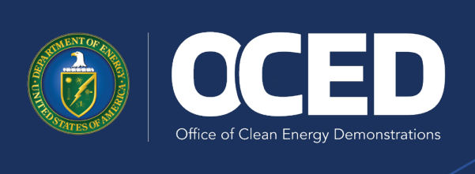

**PORTFOLIO INSIGHTS Learning from Case Studies: Financing and Development Approaches from Recent First-of-a-Kind Projects** 

November 2024 

**Acknowledgements** 

## **Acknowledgements** 

The document was developed under the leadership of the Office of Clean Energy Demonstration’s (OCED’s) Acting Director, Kelly Cummins. It was brought to fruition under guidance from the Director of Portfolio Strategy, Melissa Klembara and led by a core team comprising Alexa Thompson, Olivia Corriere, Emily Goldfield, and William Dean. Many staff from OCED and the Department of Energy (DOE) provided valuable feedback during the process. These contributors included, in alphabetical order: Leslie Biddle, Maressa Brennan, Vanessa Chan, Theresa Christian, Rachel Enright, Ramsey Fahs, Andrew Gilbert, Julius GoldbergLewis, Rachel Gould, Chase Horine, Campbell Howe, Katheryn Scott, Doug Schultz, Divya Singh, Jonah Wagner, Chris Wu, and Julia Xiong. 

## **Disclaimers** 

This report, “Learning from Case Studies: Financing and Development Approaches from Recent First-of-aKind Projects,” synthesizes insights from research and interviews with over thirty executives representing eight case study companies (hereafter, collectively, the “Companies,” and, singularly, the “Company” where referring to a single case study, as applicable) who have brought demonstration- and deployment-stage projects to final investment decision in the last ten years. This report is intended to provide the private sector and the American public with a clearer understanding of the common features and innovative approaches of these projects to facilitate more informed and accelerated engagement on first-of-a-kind project development. 

The content herein reflects observed features of projects studied by OCED. It should not be interpreted as policy or procedural guidelines, recommendations, or as an investment decision framework that will apply to OCED projects or operations. The insights and perspectives shared in this document aim to enhance transparency and understanding of recent first-of-a-kind projects and are not representations of OCED’s selection or negotiation considerations or commitments. 

This report was prepared by an agency of the United States government. Neither the United States government nor any agency thereof, nor any of their employees, makes any warranty, express or implied, or assumes any legal liability or responsibility for the accuracy, completeness, or usefulness of any information, apparatus, product, or process disclosed, or represents that its use would not infringe privately owned rights. Reference herein to any specific commercial product, process, or service by trade name, trademark, manufacturer, or otherwise does not necessarily constitute or imply its endorsement, recommendation, or favoring by the United States government or any agency thereof. 

## **OCED’s** _**Portfolio Insi hts**_ **series** _**g**_ 

OCED’s _Portfolio Insights_ is a series of reports outlining OCED’s perspective on the potential impacts of OCED’s funding programs and drawing insights that will help make progress on key barriers to commercialization (identified in DOE’s _Pathways to Commercial Liftoff_ reports and elsewhere). While most documents in the series will share learnings directly from OCED’s portfolio, this report examines a series of projects that have already advanced through financing and commenced construction (and hence are not in OCED’s portfolio, which covers projects that are currently early in development). OCED anticipates updating the findings from this report as OCED’s project portfolio advances to execution. 

Last Updated November 2024 

**1** 

**Table of Contents** 

_Financing and Development Approaches from Recent First of a Kind Projects_ 

## **Contents** 

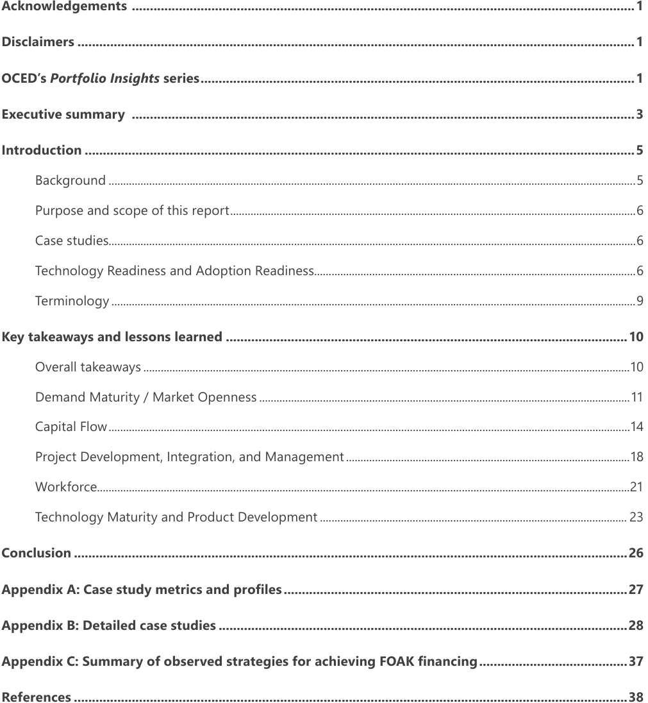

**----- Start of picture text -----** 
||||
|---|---|---|
|Acknowledgements|...........................................................................................................................................1|
|Disclaimers ..........................................................................................................................................................1|
|OCED’s|Portfolio Insights|series........................................................................................................................1|
|Executive summary ...........................................................................................................................................3|
|Introduction ........................................................................................................................................................5|
|Background|......................................................................................................................................................................................5|
|Purpose and scope of this report............................................................................................................................................6|
|Case|studies......................................................................................................................................................................................6|
|Technology Readiness and Adoption Readiness...............................................................................................................6|
|Terminology|.....................................................................................................................................................................................9|
|Key takeaways and lessons learned ...............................................................................................................10|
|Overall takeaways|........................................................................................................................................................................10|
|Demand Maturity / Market Openness|................................................................................................................................11|
|Capital Flow....................................................................................................................................................................................14|
|Project Development, Integration, and Management|..................................................................................................18|
|Workforce........................................................................................................................................................................................21|
|Technology Maturity and Product Development|..........................................................................................................|23|
|Conclusion .........................................................................................................................................................26|
|...............................................................................................27|
|Appendix A: Case study metrics and profiles|
|Appendix B: Detailed case studies .................................................................................................................28|
|.........................................37|
|Appendix C: Summary of observed strategies for achieving FOAK financing|
|References .........................................................................................................................................................38|

**----- End of picture text -----** 

**Executive summary** 

## **Executive summar y** 

This report shares two important learnings: 

- ĥ **Developing a financeable business model and structure for First-of-a-Kind (FOAK) projects requires creativity and iteration.** While there are many conversations around “bankable” project features (i.e., readily able to access low-cost pools of capital such as bank debt), this report highlights projects that fell short of “bankable” but ultimately raised financing and developed the capabilities required for FOAK project execution. 

- ĥ **Viable offtake and financing structures depend on sector-specific demand signals and technology maturity, among other factors.** When there is strong demand for environmental attributes, developers can strike long-term offtake agreements, even when short-term trading is typical. When demand for environmental attributes is limited, it is more challenging to strike long-term offtake agreements. In these cases, developers often adhere to conventional offtake structures and use alternative strategies to derisk revenues and unlock financing. 

Commercialization for new clean energy technologies is capital and time-intensive, characterized by four “valleys of death” at the research, development, demonstration, and deployment (RDD&D) stages.[1] Among these, demonstration and deployment have the largest capital needs and longest execution timelines. While large corporations often have the wherewithal to strategically invest in high-risk demonstration projects, startups and smaller developers using innovative technologies face two core challenges as they progress to the demonstration and deployment stages: 

- ĥ **Capital** : Many investors do not have appetite for the size and risk-return profile of FOAK projects. This mismatch needs to be addressed to overcome financing challenges. 

- ĥ **Capability** : Large-scale project development requires organizational growth and new skills. 

Public and private investments targeting clean energy demonstration and deployment projects have surged in recent years, thanks in part to the Bipartisan Infrastructure Law and Inflation Reduction Act. However, there remains a “missing middle” between early- and late-stage investments[2] (i.e., there are not enough investors with appetite for FOAK size and risk-return profile) that is constraining commercialization critical to meeting US net-zero emissions goals by 2050. 

This report examines observed barriers to and strategies for accelerating FOAK projects, which include, for the purposes of this report, large-scale pilots, early demonstration, late demonstration, and early deployment projects (see _Terminology_ section for more details on the definitions of each). The report is informed by eight case study companies (referred to throughout the report collectively as the “Companies” and singularly as the “Company” where referring to a single case study, as applicable), each with a unique technology, which have collectively built or are building 21 demonstration and deployment projects ranging from $10M to over $1B in CAPEX across seven countries in the last decade. The Companies cover a broad range of sectors including steel, cement, chemicals and feedstocks, sustainable aviation fuel, industrial energy efficiency, and carbon dioxide removal. The U.S. Department of Energy’s Office of Clean Energy Demonstrations (OCED) conducted research and detailed interviews with more than 30 executives across these Companies to inform this report, which outlines takeaways within the Technology Readiness and Adoption Readiness frameworks. The appendices illustrate the project-by-project commercialization pathway for each case study, highlighting the range of paths taken by the different Companies. 

**Executive summary** 

The Companies used many strategies, each with risks and tradeoffs, to unlock financing for FOAK projects. Figure 1 summarizes these strategies across five key Adoption Readiness and Technology Readiness dimensions. 

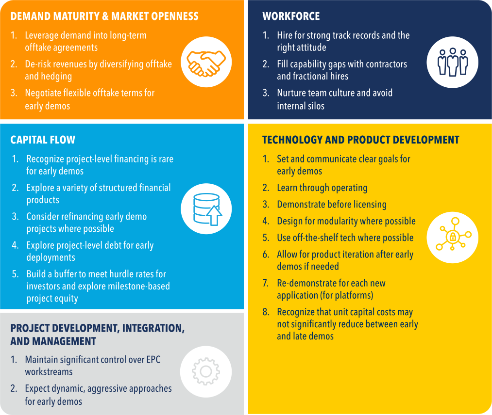

_Figure 1: Observed strategies for financing FOAK projects across five key Adoption Readiness and Technology Readiness dimensions_ 

## **Introduction** 

## **Background** 

Meeting the United States’ goal of a net-zero emissions economy by 2050 requires widespread deployment of both mature technologies (e.g., solar, wind, electric vehicles, energy efficiency) and new technologies (e.g., clean hydrogen, point-source carbon capture, and decarbonization technologies for steel, cement, petrochemicals and plastics, and aviation). New clean energy technologies face four “valleys of death” during commercialization at the research, development, demonstration, and deployment (RDD&D) stages.[3] Among these, the most capital and time-intensive stages are demonstration and deployment, when startups and smaller developers face two key challenges building First-of-a-Kind (FOAK) projects[i] : 

**1. Capital gap** : FOAK[ii] demonstration and deployment projects include significant scale-up of new technology,[iii] inherently posing performance risk. These projects often have large capital requirements for development and construction that exceed typical venture capital check sizes but are smaller than most infrastructure investment mandates. FOAK projects also require long development timelines[iv,4] and face market risks due to factors like low-cost competition from incumbents and demand uncertainty. Investment in demonstration and early deployment projects has grown in recent years (e.g., from specialist climate venture capital, growth equity, philanthropic and catalytic capital, and emerging and growth infrastructure investors). However, these capital pools remain smaller than those supporting earlier- and later-stage technologies, so a “missing middle” persists.[5] The International Energy Agency (IEA) quantified the capital gap at $200B by 2030 and noted that “By 2050, almost 50% of CO2 emissions avoided in the [IEA’s Net Zero Emissions scenario] require technologies that are not yet past the demonstration stage.”[6 ] 

**2. Capability gap** : During the demonstration stage, clean energy technology startups and smaller developers typically move from a focus on technology development to project execution, which requires fundamentally different skills, experience, and risk management approaches. Companies must identify needs well in advance and hire for capabilities at the right time, which can be challenging given the scarcity and cost of attracting talent. 

Efforts to address the capital and capability gaps for early projects are gathering momentum. The historic Bipartisan Infrastructure Law (BIL)[7] and Inflation Reduction Act (IRA)[8] have positioned the US government to invest billions of dollars in large-scale demonstration and deployment projects over the next decade to drive commercialization and unlock trillions in private co-investment. State and local support for FOAK projects has enabled successful project execution. Barriers and solutions to accelerating FOAK projects are the focus of extensive recent thought leadership.[9] Investors are launching FOAK-focused funds and firms.[v][,][10] Industry groups are convening to workshop solutions to close the capital and capability gaps (e.g., insurance).[vi] 

- i While demonstration and deployment stages can be challenging for all technology developers (including major corporations), they present a particularly acute challenge for startups and early-stage developers that must raise external capital and navigate organizational transitions. See the Terminology section for descriptions of FOAK and other terms. 

- ii This report frequently refers to FOAK projects. In many cases, insights and learnings are relevant to early-of-a-kind (EOAK) projects. 

- iii Observed scale-up factors (in terms of production capacity) ranged from 10-100x in the transition from pilot to early demonstration and were typically on the order of 10x from early demonstration to late demonstration/early deployment projects. 

- iv Among case studies, project development and construction timelines range from 2-2.5 years (at the shortest) for early demonstration projects, up to 5-7 years for first deployment projects. These development timelines mean it is difficult for venture capital and private equity investors to realize a return during their typical fund life (often 10 years) and portfolio hold times (historically 2-5 years on average, with recent trends increasing to 7 years). 

- v New firms and funds span asset classes, including specialist climate venture capital that offers larger and more patient investments than traditional VC (e.g., Breakthrough Energy Ventures, Lowercarbon Capital); philanthropic/catalytic investors that seek a concessionary return (e.g., Prime Coalition, Schmidt Futures); emerging infrastructure investors that combine corporate and project equity investments to achieve relatively high rates of return (e.g., Spring Lane Capital, Breakthrough Energy Catalyst); and growth infrastructure capital that seeks high returns via early project equity investments (e.g., Generate Capital, Just Climate). CTVC’s 2023 newsletter,The Sophisticating Climate Capital Stack, provides a more comprehensive overview. 

- vi E.g. The Geneva Association’s 2024 reports on Climate Tech and Insurance: Report 1: Climate Tech for Industrial Decarbonisation: What role for insurers?; Report 2: Bringing Climate Tech to Market: The powerful role of insurance. 

Other FOAK-focused advisor initiatives (e.g., accelerators and development-as-a-service) have emerged to complement traditional advisory services.[vii] Demand-side consortia and other industry coalitions are building demand for low-carbon products and services.[viii] 

## **Purpose and scope of this report** 

This report contributes to the growing knowledge base around FOAK demonstration and deployment projects built over the last decade. The report aims to be a resource for developers and investors of FOAK projects by: 

- ĥ **Highlighting common features and innovative strategies of recent FOAK projects** . 

- ĥ **Profiling eight companies with 21 demonstration and deployment projects** , illustrating each case study Company’s project-by-project commercialization pathway. 

The purpose of the report is to widely disseminate successful models for developing and executing FOAK projects — looking at their offtake arrangements, capital structures, and project development, among other areas — to inform and accelerate the development and delivery future projects. 

While developers with a variety of corporate profiles successfully build FOAK projects (e.g., large developers with significant track records and experience), this report focuses on startups and smaller developers because of their unique financing challenges and capacity building needs. This focus is not representative of OCED’s portfolio; OCED works with a range of entities, including startups, large companies, non-profits, and tribes. 

## **Case studies** 

This report examines eight case study companies (hereafter for the purposes of this report, collectively, the “Companies,” or, singularly, the “Company” to reference a single case study, as applicable), each developing a unique technology covering a broad range of sectors including steel, cement, chemicals and feedstocks, sustainable aviation fuel, industrial energy efficiency, and carbon dioxide removal. The Companies have collectively built (or are building) 21 demonstration and deployment projects, widely ranging in size, across seven countries in the last decade. OCED conducted research and detailed interviews with more than 30 executives across the Companies, from which the insights in this report were distilled. More details on each case study, including the project-by-project commercialization pathway for each, are available in the Appendix. Five of the Companies are attributed by name throughout the body of the report; three of the Companies have requested full anonymization. 

## **Technology Readiness and Adoption Readiness** 

This report organizes key takeaways and lessons learned from recent FOAK projects using the Adoption Readiness Level[ix] (ARL) framework and widely used Technology Readiness Level[x] (TRL) framework. While the TRL framework is a well-known, useful metric for describing technology maturity, it does not assess all factors critical for commercial adoption. DOE’s ARL framework assesses the _adoption_ risks of a technology and translates this risk assessment into a readiness score of 1-9, representing the readiness of a technology to be adopted by the ecosystem. ARL considers 17 important factors for private sector uptake beyond technology maturity. Adoption Readiness Assessments and Technology Readiness Assessments each 

> vii E.g. DOE’s ARPA-E’s SCALEUP program provides follow-on funding and support for companies who have participated in ARPA-E’s earlier stage OPEN program. Other accelerator program leaders include Elemental Excelerator, The Engine, Greentown Labs and NYU’s Urban Future Lab. RMI’s Third Derivative and Deep Science Ventures launched Mark1, a developer-as-a-service program. Spring Lane Capital launched Developer U, a training program for the transition from technology development to commercial deployment. V1 Climate Solutions and Eunoia Group are new advisory firms that focus specifically on supporting FOAK projects. 

> viii Multi-sector efforts (e.g., First Movers Coalition, Mission Possible Partnership) coordinate demand targets/pledges. Sector-specific efforts focus in one area (e.g., Climate Group’s SteelZero, Sustainable Aviation Buyers Alliance, Center for Green Market Activation). ix Guide to ARL available at: https://energy.gov/technologytransitions/arl 

> x Guide to TRL available at: https://www.directives.doe.gov/terms_defnitions/technology-readiness-level 

produce ratings of 1-9, where 1 represents low readiness and 9 represents high readiness. ARL can be used in a complementary manner with TRL assessments to understand the maturation of technologies across the RDD&D continuum; the below graphic provides an illustrative example.[11] 

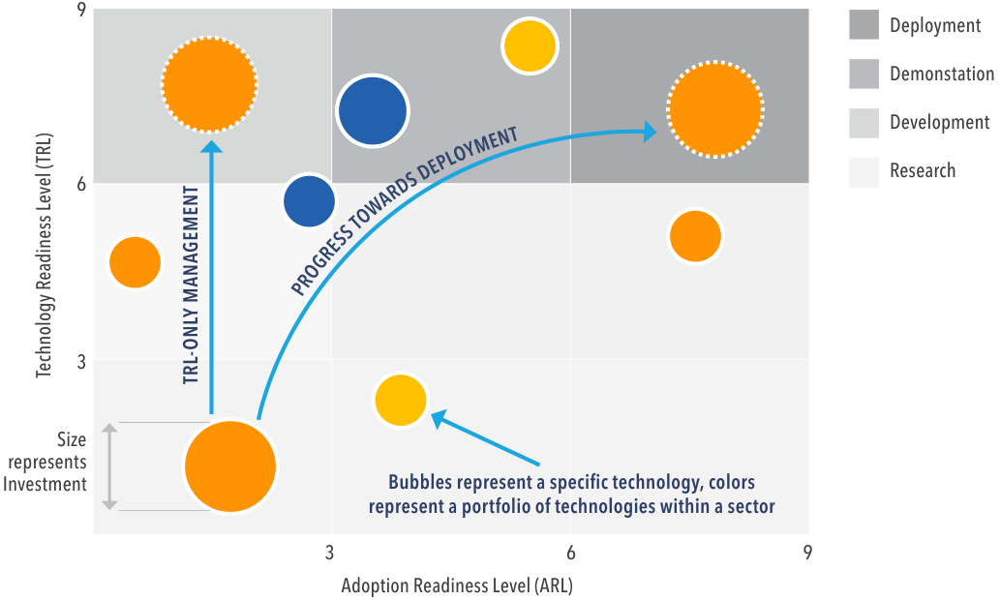

**----- Start of picture text -----** 
9 Deployment Demonstation Development Research 6 3 Size represents Investment Bubbles represent a specific technology, colors represent a portfolio of technologies within a sector 3  6 9 Adoption Readiness Level (ARL) DS DEPLOYMENT R A W TO S S E R G O R P Technology Readiness Level (TRL) TRL-ONLY MANAGEMENT **----- End of picture text -----** 

_Figure 2: Mapping maturation of technologies across the RDD&D continuum using ARL and TRL_ 

Although all Technology Readiness and Adoption Readiness dimensions are critical for a technology’s commercial liftoff, this report focuses on FOAK project takeaways related to five key readiness dimensions: Demand Maturity / Market Openness; Capital Flow; Project Development, Integration and Management; Workforce; and Technology Maturity and Product Development (see Table 1).[xi] 

> xi Many other ARL elements are critical to projects’ success. For example, community engagement is vital to de-risking development timelines and ensuring projects deliver tangible benefits to communities; working closely with relevant permitting and regulatory agencies is key to managing project and environmental safety, and meeting development timelines; the prevailing policy environment impacts project viability; and materials sourcing, supply chain development, workforce and infrastructure are critical to technical and commercial execution (note: feedstock agreements will be just as heavily scrutinized as offtake agreements for commercial exposure). However, for this report, OCED has focused on four ARL dimensions (plus TRL) where there are strong cross-project themes and lessons, including solutions that may be non-obvious or different from traditional project development and financing approaches. 

**Table 1: Summary of DOE’s Adoption Readiness Framework. This report focuses on the four dimensions highlighted.** 

## **Adoption Readiness Dimensions** 

**Delivered Cost 4 Demand Maturity / 7 Capital Flow 13 Regulatory Environment** Risks associated with achieving **Market Openness** Risks associated with the Risks associated with local, state, delivered cost competitiveness Risks associated with demand availability of capital needed to and federal regulations or other when produced at full scale, certainty and access to move the technology solution requirements / standards that must including amortization of standardized sales & contracting from its current state to be met to deploy the technology incurred development and mechanisms (if required, as well production at scale, including solution at scale. capital costs, and accounting for as with natural (e.g.,network total investment required, switching costs (if any). effects,and/or structural (e.g.,existing first-mover-advantages) availability of willing investors, availability of associated **14 Policy Environment** monopolies / oligopolies) financial & insurance products, Risks associated with local, state, **Functional Performance** barriers to entry in the market(s) and speed of capital flow. and federal government policy Risks associated with the ability of actions that support or hinder the to which the technology solution the technology solution to meet adoption of the technology solution or exceed the performance and can be applied. **8 Project Development,** at scale. feature-set of incumbent solutions **Integration, and** or create new end-use markets. **5 Market Size Management** Risks associated with the overall Risks associated with the overall **15 Permitting & Siting** size of the market that can size of the market that can Risks associated with the process to **Ease of Use / Complexity** be served by the technology be served by the technology secure approvals to site and Risks associated with operational solution, and the level of solution, and the level of build equipment & infrastructure switching costs; the ability of a uncertainty with which it will uncertainty with which it will associated with deploying the new user (individual, company, materialize. materialize. technology solution at scale. system integrator) to adopt and operationalize the technology solution with limited training, **6 Downstream Value Chain 9 Infrastructure 16 Environment & Safety** few new requirements, or special Risks associated with the Risks associated with the physical Risks associated with the potential resources (e.g., tools, workforce, projected path to get the and digital large-scale systems for hazardous side effects or contract structures). product from a producer to that need to be in place to adverse events inherent to the a customer along the value support, enable, or facilitate production or use of the technology chain (e.g., considering split deployment at full scale (e.g., solution or end-product in the incentives, technology solution pipelines, transmission lines, absence of sufficient controls. acceptance, business model roads and bridges) changes). 

**17 Community Perception Manufacturing &** Risks associated with the general **Supply Chain** perception by global and local Risks associated with all the communities of the technology entities & processes that will solution and its risks or impact, produce and deliver the endwhether founded or unfounded. product to the market, including integrators, component, and sub-component manufacturers & providers. 

## **Materials Sourcing** 

Risks associated with the availability of critical materials required by the technology solution (i.e., rare earths and other limited availability materials). 

## **Workforce** 

Risks associated with the human capital and capabilities required to design, produce, install, maintain, and operate the technology solution at scale. 

## **Terminology** 

## _Project stages_ 

For the purposes of this report, projects are grouped into six stages grounded in the RDD&D continuum: pilots, large-scale pilots, early demonstrations, late demonstrations, early deployments, and late deployments. Although there is no consensus definition of these project categories in the market – which can obscure projects’ technical maturity, commercial goals, and appropriate sources of capital/commercial arrangements – for the purposes of this report, Figure 3 describes each stage. 

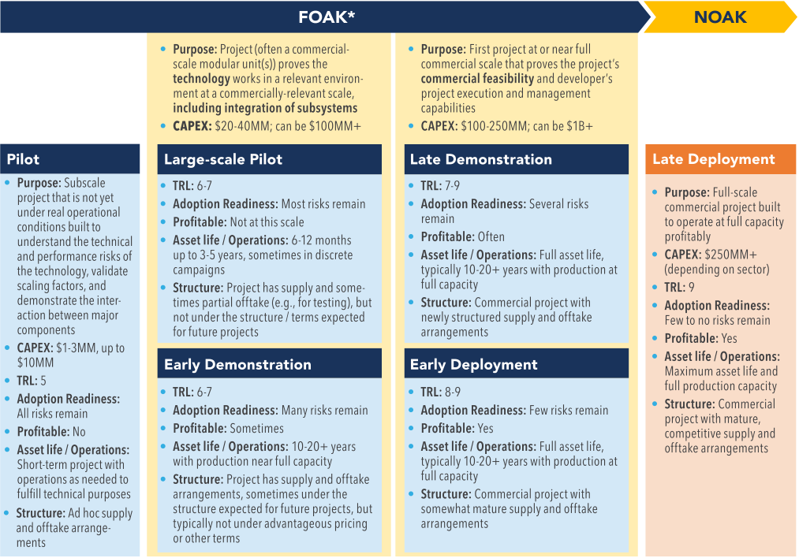

**----- Start of picture text -----** 
FOAK*  NOAK **----- End of picture text -----** 

_*The specific project details and commercialization pathway highly depend on sector_ 

_Figure 3: Project stage terminology for the purposes of this report_ 

**This report focuses on large-scale pilots, early demonstrations, late demonstrations, and early deployments.** These stages are most recognizable by their typical capital cost range[xii] and Technology Readiness. However, there can be notable differences in Adoption Readiness at each of these stages based on the technology, market, economics, and project management approach taken by developers. Figure 3 groups earlier and later project types together because projects often play substitutable roles and companies can take non-linear paths through commercialization. 

## _“Financeable” versus “Bankable”_ 

For the purposes of this report, “bankable” refers to projects with ready access to low-cost pools of capital through familiar structures such as bank debt. For example, established technologies in the late deployment stage are typically bankable. “Financeable” refers to projects that have the ability to raise financing required to execute a project, which could include any sources of capital and a wide variety of financial instruments. 

xii Typical project capital costs are based on the case studies, which focused on startups and smaller developers, and should be considered illustrative only. There will be a larger range of capital costs at each stage depending on the developer profile and technology type, among other factors. 

As discussed in the _Executive Summary_ , since bankable business models and contractual arrangements are seldom available to FOAK projects, this report focuses on strategies the Companies used to make projects **financeable** – i.e., what it takes to raise financing for a project that fell short of “bankable,” but ultimately raised financing and developed capabilities required for FOAK project execution. 

## **Ke takeawa s and lessons learned y y** 

## **Overall takeaways** 

Across the eight Companies, overarching themes and strategies emerged from their approaches to financing FOAK, as summarized below and discussed in more detail in the following sections. It is critical to recognize that all strategies described in this report involve risks and require tradeoffs. 

**1. Developing a financeable project requires creativity and iteration: developers of FOAK projects can use strategies that diverge from highly-structured, “bankable” projects, but are still “financeable.”** 

A large share of the available resources on FOAK projects aims to educate startups and smaller developers on the expectations of late-stage investors. For example, some project finance (PF) checklists outline “bankable” business models and development strategies (e.g., long-term, fixed price/volume, creditworthy offtake agreements; fully wrapped engineering, procurement, and construction (EPC) contracts; strict operational processes managed by a project team with an extensive project delivery track record). However, these strategies are only readily accessible and/or cost effective for technologies that are already in late deployment. Instead, the Companies used strategies that diverge from highly-structured, “bankable” projects, but are still “financeable.” The following sections discuss the Companies’ strategies.[xiii] 

**2. Viable offtake and financing structures often depend on sector-specific demand signals and technology maturity, among other factors.** 

Many FOAK developers are entering markets that differ substantially from the electricity sector, where solar and wind projects have historically secured long-term offtake agreements and highly structured project finance. In comparison, FOAK developers have pursued a range of offtake and financing approaches, depending on the strength of demand for low-carbon attributes in the relevant sector, technology maturity, and other factors. For example: 

   - Î When there is strong demand for environmental attributes, developers can strike long-term offtake agreements, even when short-term trading is typical. 

   - Î When demand for environmental attributes is limited, it is more challenging to strike long-term offtake agreements. In these cases, developers often adhere to conventional offtake structures and use alternative strategies to derisk revenues and unlock financing. 

   - Î For early demonstration projects, flexibility on contracted volumes, performance, ramp-up schedule, and customer creditworthiness can address performance risks associated with lower technical maturity. 

**3. FOAK projects require flexible, diverse financing strategies, balancing initial reliance on corporate equity with opportunities for structured financial products to evolve the capital structure over time.** 

For early demonstrations, corporate equity is the primary source of capital. These projects’ risk profiles are rarely suited for project-level debt or equity. For early demonstration projects with strong commercial propositions, however, structured financial instruments at the equipment- or corporate-level can defer or recoup cash outlays, minimize dilution, and reduce the need for further equity raises. The Companies utilized products such as equipment finance, corporate debt, corporate revolving credit facilities, and construction loans backstopped with insurance. Some early demonstration projects can refinance their projects during operations. Early deployment projects may be able to secure project-level debt, though developers should expect very strong protections for lenders and guarantors. 

xiii These examples should be considered observations from case studies that successfully developed and financed a project, rather than approaches endorsed by OCED. **10** 

**4. To accelerate project execution, recent FOAK projects advanced development processes in parallel and maintained high control over EPC workstreams.** 

Traditional project development approaches focus on minimizing and dispersing risks among multiple counterparties. A common tool under this approach is a fully wrapped engineering, procurement, and construction (EPC) agreement with a top-tier EPC firm that has clear development stage gates (e.g., financial close precedes procurement and construction). However, all case studies diverged significantly from this model. For example, six of the eight Companies reported maintaining substantial control over project engineering. Instead of using large EPC firms, these Companies engaged smaller engineering firms, outsourced work packages selectively, led procurement, and played the role of project integrator. In addition, projects did not advance neatly through progressive stage gates. Due to urgency and the need for capital efficiency, project processes often occurred in parallel. More than half the Companies commenced procurement and construction for early demonstration projects before finalizing the projects’ capital structures. All of the Companies emphasized the importance of communicating with and educating investors about the rationale and strategy behind this aggressive approach. It is important to note, however, that this strategy is not suited to all projects and sectors. For example, in a recent case of advanced nuclear, beginning construction before designs were complete led to extensive rework and remediation, resulting in significant cost overruns and delays.[12] 

**5. Hiring the right expertise at the right time is critical to closing the capability gap.** 

To close the capability gap, startups and smaller developers must quickly scale up and build the capacity to transition their focus from technology development, venture fundraising, and early business development to project development. Most of the Companies initiated this transition by hiring experienced team members at senior levels during the development and execution of their early demonstration projects (i.e., first substantial scale-ups). An experienced and highly capable project leadership team was largely in place before the Companies embarked on developing their late demonstration and early deployment projects. All of the Companies spoke about the importance of finding project leaders that have experience with managing large, complex infrastructure projects and an entrepreneurial, risk-tolerant attitude. 

## **Demand Maturity / Market Openness** 

The _Demand Maturity / Market Openness_ Adoption Readiness dimension considers demand certainty, access to sales/ contracting, and barriers to entry. Several takeaways emerged from the Companies’ experiences in this area: 

**1. When there is strong demand for environmental attributes, developers can strike long-term offtake agreements, even when short-term trading is typical.** 

Several of the Companies have disrupted industry norms by striking long-term offtake agreements — a major advantage for developers pursuing traditional project finance structures. For example, Stegra (formerly H2 Green Steel) leveraged strong demand to close multiple five- and seven-year offtake agreements,[13] and sustainable aviation fuels (SAF) producer Twelve announced a 14-year contract with IAG Group.[14] These examples represent substantial shifts compared to typical one-year contracts for steel and jet fuel, possible in part due to proximity to end customers in markets that have signaled strong demand for low-carbon products. Industrial purchasers (such as airlines for SAF, automakers for steel) have been willing to enter long-term contracts at a premium for low-carbon attributes because they are confident they will be able to pass this premium through to end customers with strong sustainability commitments (e.g., corporate flyers, luxury car buyers). Industry-wide demand initiatives, like First Movers Coalition and the Sustainable Aviation Buyers Alliance (SABA), may also stimulate competition to purchase limited supply. 

However, among the Companies, few long-term agreements feature firm pricing (which is typical in solar and wind power purchase agreements (PPAs)). As one interviewee described, industrial purchasers are not willing to take on pricing structures that are substantially different from their competitors, even if they offer certainty. 

Observed offtake strategies from case studies include: 

Î **Establishing long-term offtake contracts with pricing at a fixed percentage premium above the conventional product’s commodity price.** This structure offers demand certainty for developers while maintaining conventional cost structures and hedging strategies for customers. Three of the Companies utilized this structure (in steel, low-carbon fuels, and specialty chemicals), with green premia of 15–100% above commodity prices. While these arrangements resemble cost-plus pricing structures, the Companies did not use the same (fossil) commodity inputs as conventional products. Therefore, this pricing structure for low-carbon technologies decouples a project’s unit costs and sales price. This strategy can drive additional margin if market trends are in the projects’ favor (i.e., fossil energy inputs rise over time due to emissions pricing), though it does result in less overall margin certainty. 

   - Î **Negotiating with your customer’s customer.** Twelve struck a three-way agreement with Alaska Airlines and Microsoft, allowing the offtaker to pass on some of the cost of SAF (and its environmental attributes) to Microsoft.[15] Another Company negotiated with customers downstream of their direct offtaker, encouraging them to specify emissions intensity requirements in their procurements. This increased downstream demand certainty for the Company’s product. 

**2. When demand for environmental attributes is limited, it is more challenging to strike long-term offtake agreements. In these cases, developers often adhere to conventional offtake structures and use alternative strategies to derisk revenues and unlock financing.** 

For industrial projects that are upstream in the value chain or in sectors where demand for environmental attributes is limited, negotiating offtake agreements that depart from market standards is particularly challenging. This dynamic is most apparent for products like low-carbon chemicals and fuels, which sit in a long and complex value chain. Two of the Companies assessed that lengthening offtake contracts’ tenor was unlikely. Instead, they pursued alternative strategies to derisk their revenue streams, educate investors, and adapt their financing strategies. 

Observed strategies include: 

Î **Developing a diverse customer base across multiple industries.** Diversification creates redundancy to backfill demand if needed. For example, Solugen sells its low-carbon chemicals to multiple sectors — including energy, construction, water treatment and consumer goods — with several customers in each. Another Company takes a flexible approach to timing the sale or use of its hydrogen production volumes, driven by demand signals (similar to a spot market). The Company also takes a flexible approach to sales by parallel pathing merchant and contracted offtake channels. However, varying levels of diversification have tradeoffs: many diverse offtake channels require more management. 

- Î **Pursuing differentiation and value-based pricing[xiv] opportunities where possible.** For example, Solugen utilized its distribution facilities to improve product delivery timelines. To further simplify logistics, Solugen’s long-term strategy is to build a distributed network of assets in close proximity to customers.[16] Solugen has also developed custom chemical formulations and new applications via customer partnerships,[17] helping customers to displace multiple expensive products. Strategies that address customer needs beyond volume/price have allowed Solugen to identify value-based pricing opportunities. 

xiv Value-based pricing is a pricing strategy where companies set their prices for their products based on their estimated or perceived value to the customer, rather than tying pricing to production costs or competitor pricing. 

   - Î **Increasing revenue certainty through hedging instruments or contract terms.** One Company initially explored a revenue put option[xv] for its low-carbon product sales structured by a large, investment-grade trading house. Although the revenue put option stimulated conversations with prospective investors, ultimately the Company pursued merchant sales instead to eliminate the transaction fees associated with the hedge. Some of the other Companies, including LanzaTech and Twelve, have negotiated price floors that allow developers to meet revenue minimums in downside conditions (typically in exchange for price ceilings which limit upside if market prices spike). 

   - Î While **Preserving optionality by maintaining relationships with a variety of prospective offtakers.** one Company is planning to sell its low-carbon products on a merchant basis initially, the Company maintains conversations with large potential buyers and is considering a long-term offtake in the future under suitable conditions. 

   - Î **Adjusting capital structure.** Projects with commodity price exposure should plan for lower leverage and other lender protections in their financing strategy (see more in the _Capital Flow_ section). 

**3. For early demonstration projects, the Companies pursued flexible offtake terms around volume, performance guarantees, and customer creditworthiness.** 

The Companies employed a variety of strategies: 

- Î **Negotiating longer commissioning timelines, flexibility on delivery volumes and timelines, and non-binding performance guarantees.** Several of the Companies noted that offtakes for their early demonstration project included longer commissioning timelines (and/or lower penalties for delays) than industry standard terms (e.g., providing an extra 3- to 6-months’ runway to meet expected production rates). In addition, at least two of the Companies — both industrial chemical/feedstock producers — had “take or extend” contracts with customers for their early demonstration projects. This flexibility on volumes throughout the contract term meant that customers had lower financial exposure during low-demand periods and provided these Companies with some protection in the event of plant disruptions. In another 

- case, Via Separations’ as-a-service agreement provides a performance guarantee on system uptime and sets targets for product specifications; these specifications will become stricter guarantees in future contracts. 

- Î **Partnering with small/mid-sized customers.** Though project financiers prefer offtake arrangements with large, investment-grade counterparties, this can be challenging for first projects due to large customers’ volume requirements, long sales cycles, and need for redundancy. In contrast, one Company commented that small- and mid-sized customers are often more entrepreneurial and have faster adoption timelines. Working with smaller customers may be a realistic, beneficial strategy for early projects where rapid execution is vital. 

- Î **Partnering with customers that understand the vision.** Offtakers that understand a developer’s vision for a technology, commercialization pathway, and scaling challenges can accommodate flexibility needs. 

- Î **Fulfilling small volume batch sales initially to allow for regulatory and customer acceptance testing and enable ramp-up over time.** Certain industrial products must undergo rigorous performance and safety testing with regulators and/or customers before filling larger orders. In these cases, large-scale pilots and early demonstration projects with small, short-term purchase volumes are a necessary step in the sales cycle before full-scale commercial projects. For example, one Company announced that it had signed a “collaboration agreement” with a leading global manufacturer “on the development and potential use” of the Company’s low-carbon materials in their products. The following year, the Company confirmed the launch of a new product made by the brand that uses the Company’s low-carbon materials. Solugen pursued a mixed strategy, targeting larger-volume sales for energy and construction applications with fewer product restrictions, while pursuing smaller-volume partnerships with tightly regulated consumer products companies (e.g., Solugen’s partnership with Sasol Chemicals to “evaluate effectiveness of sustainable ingredients in care chemicals applications”[18] ). 

xv In a revenue put, the hedge counterparty provides a payment to the project if commodity prices fall below a specified floor. 

Another Company initially sold non-structural concrete products (e.g., pavers) and pursued regulatory certification for structural products (e.g., CMU blocks) in parallel. By initially selling small volumes to customers in tightly regulated markets, this testing step allowed these Companies to ramp up to significantly larger volumes once customers qualified their products. 

## **Capital Flow** 

The _Capital Flow_ Adoption Readiness dimension considers the availability of capital needed to get to production at scale (dollars, number of investors, insurance, speed). Several takeaways emerged from the Companies’ financing strategies, which varied across demonstrations and early deployments. 

## _Large-scale pilot and early demonstration projects_ 

The Companies raised a variety of “capital stacks” (i.e., sources of capital) across the observed early demonstrations. 

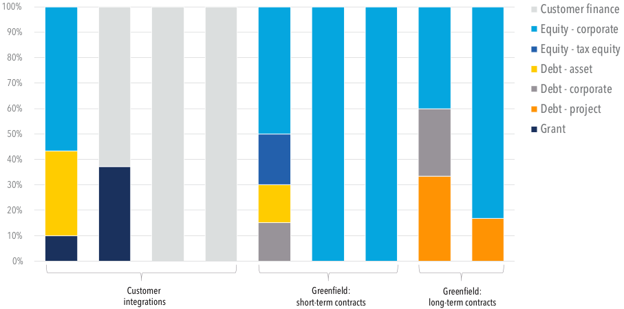

**----- Start of picture text -----** 
100% Customer finance 90% Equity - corporate Equity - tax equity 80% Debt - asset 70% Debt - corporate 60% Debt - project 50% Grant 40% 30% 20% 10% 0% Customer  Greenfield:  Greenfield: integrations  short-term contracts  long-term contracts **----- End of picture text -----** 

_Figure 4: Capital stacks for the Companies’ large-scale pilot and early demonstration projects[xvi ]_ 

**1. For early demonstrations, corporate equity is the primary capital source. Project-level financing is rare.** 

   - CTVC describes five primary financing sources for FOAK projects[19] : a “super round” with equity; philanthropic or catalytic (e.g., impact-oriented) capital; strategics (i.e., actual or prospective customers and suppliers; usually large corporations); government; and project investment. These sources align closely to those observed in the case studies. 

The case studies surfaced several common financing strategies: 

- Î **Equity super rounds were the largest source of capital** . Specialist energy/climate venture capital and growth equity firms provided the vast majority of funds to support early demonstrations. For example, Solugen funded its Bioforge One project using capital raised from its Series B funding round; Via Separations funded Project Kodiak primarily from its Series B fundraise; another Company funded its early demonstration with corporate equity. It is notable that several of the Companies raised substantial amounts during the strong venture environment in 2021-22; today, developers may need to blend a larger array of capital sources to fund CAPEX. 

xvi “Customer integrations” are projects that closely integrate with a host site’s existing assets. “Greenfield” projects are new, standalone assets. 

   - Î **Strategic equity investors can play multiple roles as co-developers, offtakers, and other project counterparties.** For example, ArcelorMittal invested equity in LanzaTech and is a customer of LanzaTech’s technology.[20] A carbon dioxide removal Company counts multiple offtakers on its capitalization table. A low-carbon fuels and feedstocks producer has several co-developers that are also equity investors. Among deployment stage projects, many of Stegra’s investors (e.g., Mercedes-Benz, Scania, Kingspan, Hitachi Energy) are involved in their Boden project as offtakers, suppliers, or both (in the case of Hitachi). Although many equity investors seek exclusivity in their capacity as project counterparties, the Companies typically shied away from granting exclusivity as it reduces flexibility to pursue other relationships. 

   - Î **Leveraging the “halo effect” from partnerships can spur follow-on conversations, relationships, and investments** . Initially, a relationship can unlock introductory conversations and encourage persistence through final investment decisions. Once a partnership is formalized, developers can then leverage the “halo effect” — for example, a government grant can open doors to conversations with investors due to the rigorous diligence process that competitive grants require. 

   - Î **Customer prepayments can provide a source of upfront capital.** One Company negotiated with customers to secure partial prepayment for offtake, minimizing project outlays from dilutive equity. 

   - Î **Government grants improved financial returns and contributed other important project benefits.** Non-dilutive grants improve the risk-return profile for other investors, which can attract private investment. Two of the Companies received government grants for their early demonstration projects, improving viability for private investors. Several of the Companies cited additional benefits of government funding support. Via Separations noted that the grant process accelerated project execution due to strict deadlines set by the granting agency to meet milestones (e.g., completing project contracts, commencing construction), which ultimately accelerated negotiations with its customer. However, working with government can involve tradeoffs: at least two of the Companies noted that they did not pursue government funding because they thought it would slow down the capital raise and delivery timeline for their early demonstration projects. 

   - Î **Philanthropic and concessionary capital played an important role.** At least three of the Companies received philanthropic or catalytic capital to fund early projects. Via Separations received funding from Prime Impact Fund in its Series A round to build a pilot project.[xvii,21] Twelve received support from the Chan Zuckerberg Initiative’s Strategic Program Investments Program to fund its electrolyzer development.[22] Another Company secured debt and equity from a catalytic investor. After three years of extensive diligence, the Company and investor reached a dual-asset agreement to provide senior project debt (below one-third loan-to-value ratio) in addition to a corporate equity investment. 

   - Î **Project-level investment financing was rare for early demonstrations** given the technology maturity and untested commercial arrangements. Only one of nine early demonstration projects secured project debt for construction. However, certain projects were able to utilize other structured finance instruments to partially fund upfront costs (see strategy 2) and/or refinance at the project- or company-level during operations once commercial arrangements were derisked (see strategy 3). 

**2. Structured financial products other than traditional project finance are available.** 

Early demonstration project risk profiles are rarely suited for project-level debt or equity. However, for early demonstration projects with strong commercial propositions, structured finance instruments at the equipment-, project- or corporate-level can defer or recoup cash outlays, minimize dilution, and reduce the need for further equity raises.[xviii] Around half of the Companies’ early demonstration projects incorporated at least one structured financial product: two each at equipment- and corporate-level- and three at project-level. These instruments comprised a minority of the total project capital stack for all projects except one, where structured instruments comprised 60 percent of the capital stack. 

> xvii Prime Impact Fund (PIF), which is structured as a donor-advised fund, can make catalytic, program-related investments (PRIs) in the form of low-interest loans or nondilutive equity investments. 

> xviii Keyframe Capital provides a more comprehensive overview of different types of structured capital in its article “The Case for Structured Capital”, https://www. keyframecapital.com/post/the-case-for-structured-capital. 

Structured finance instruments can be expensive and involve tradeoffs. However, these financial products can preserve expensive equity. In addition, rigorous lending diligence processes can accelerate the development of internal operational processes and risk management practices vital for raising other sources of mature capital, and demonstrating repayment builds a track record that can open up access to other forms of capital. 

Observed structured finance products from case studies include: 

- Î **Equipment finance[xix]** : Equipment financers have a lien on physical equipment — rather than the project’s integrated assets or cash flows — and therefore are not exposed to binary technical risk of the project “working.” Two of the Companies — Solugen and Via Separations — funded up to onethird of upfront project costs through equipment leases. In mature infrastructure projects, it is common for major equipment suppliers to provide financing to large developers or EPC firms. However, these financing terms may not be available to smaller developers. Solugen and Via Separations[23] engaged a third-party equipment financier to provide a lease that packaged all financeable equipment in their projects’ bill of materials. 

- Î **Offtake prepayment** : Customers pre-pay for product volumes to offset upfront project costs. One Company negotiated partial pre-payment of its 10- to 15-year offtake agreements, securing cash to fund its project outlays. The Company initially negotiated contracts that were non-asset specific, providing it with flexibility to oversubscribe its current project and meet contracted volumes through future projects. However, lenders subsequently saw this strategy as high risk and would only underwrite asset-specific contracts. 

- Î **Corporate debt** : Raising corporate-level debt allowed Solugen to defer some of the initial cash outlays for its early demonstration project and made the project schedule less dependent upon another equity raise. In these cases, existing cash flows can give lenders comfort — for example, Solugen’s existing cash flows from its distribution business gave its lender comfort. 

- Î **Corporate revolving credit facility** : A revolving credit facility is secured against the value of a pool of assets and contracts and provides working capital to fund business operations. To keep equity spending focused on product development and R&D, one Company opened a revolving credit facility with a strategic banking partner during development of its early demonstration project. 

- Î **Construction loan backstopped with insurance** : Construction loans provide short-term debt to finance project construction, reducing the equity outlay required for project execution. Although rare for FOAK projects, Twelve secured a low-leverage, expensive construction loan backstopped by strong insurance.[24 ] 

- Î **Tax credits** : Tax credits can provide a meaningful source of capital. To monetize tax credits, large corporations might claim tax benefits in-house, sell credits for cash via transferability (for which bridge loans are sometimes available), or raise tax equity. Solugen was eligible for a location-based tax credit (Treasury’s New Markets Tax Credit) and secured a tax equity partner for its early demonstration project in Houston.[25] Another Company is planning to structure conventional tax equity against _Inflation Reduction Act_ and state tax credits. 

- Î **Creative insurance:** Using insurance can give investors comfort. For example, one Company that had multiple EPC packages and acted as the project integrator was still able to raise a construction loan for its early demonstration project by procuring insurance. In another case, Stegra obtained performance guarantees from its equipment suppliers to give lenders comfort. In contrast, one Company explored performance guarantees for its early demonstration project, but ultimately decided to forgo insurance because it was not required by the lender. Another Company utilized “intermediation,” a financial product typically used in oil and gas (wherein a third-party signs parallel supply and offtake arrangements with a project and effectively finances the project’s feedstock purchases). 

> xix A recent report from Equipment Leasing and Finance Foundation, Climate Finance: A Massive Commercial Opportunity for Equipment Finance, indicates appetite from the industry to expand this source of funding for early climate infrastructure projects. https://www.store.leasefoundation.org/cvweb/cgi-bin/msascartdll.dll/ ProductInfo?productcd=ClimateFinance2024 

In this structure, the Company benefits from the creditworthiness of the third-party intermediator, which in turn reduces certain costs (e.g., price of hedge products). From the Company’s perspective, this structure effectively allows them to “rent a balance sheet” and convert the need for an equity raise into an operating expense. 

Some of the Companies have also utilized structured financial products to raise financing for their deployment projects. 

**3. Some early demonstration projects can refinance their projects during operations.** 

Broadly, two financing pathways for large-scale pilots and early demonstration projects were observed among case studies: 

- Î **Fund project with corporate equity (or blended capital stack) and keep asset on balance sheet** . This strategy was used by at least two of the Companies and suits large-scale pilot projects that are primarily focused on at-scale technology validation. Commercial goals (e.g., demand validation, proving profitable unit economics) may be less important if markets are already wellestablished (e.g., for fuels/feedstocks like ammonia) and/or the technology does not achieve profitable economies of scale. 

- Î **Fund project with corporate equity (or blended capital stack) and refinance during operations** (e.g., Solugen, Via Separations) **.** This strategy suits projects that must validate technology and demand maturity in parallel, and have attractive unit economics – described in Figure 3 as early demonstration projects. A project’s commercial arrangements may make it attractive to refinance once the asset is operational (i.e., technology is derisked and project is generating cashflows from customer sales). For example, Solugen refinanced its Bioforge One demonstration project once operational. In another case, a Company operated its demonstration asset for approximately three years and built up a book of offtakers before it was partially refinanced by a private catalytic lender. 

## _Late demonstration and early deployment projects_ 

The Companies raised a variety of capital stacks across the observed late demonstrations and early deployments. 

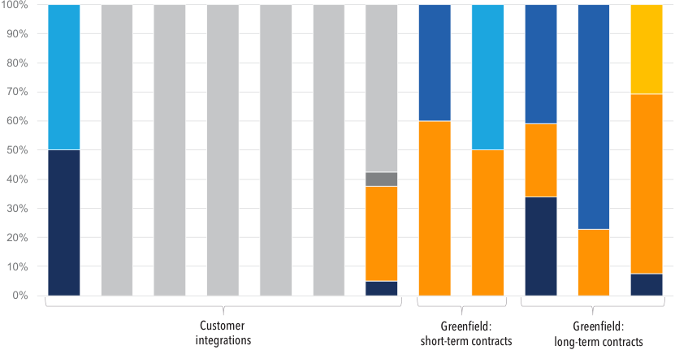

**----- Start of picture text -----** 
100% 90% 80% 70% 60% 50% 40% 30% 20% 10% 0% Customer  Greenfield:  Greenfield: integrations  short-term contracts  long-term contracts **----- End of picture text -----** 

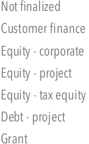

**----- Start of picture text -----** 
Customer finance Equity - corporate Equity - project Equity - tax equity Debt - project Grant **----- End of picture text -----** 

_Figure 5: Capital stacks for the Companies’ late demonstration and early deployment projects_ 

**4. Securing project-level debt is possible for early deployment projects,[xx] though developers should expect very strong protections for lenders and guarantors.** 

Notable features and terms of lending processes include: 

   - Î **Extensive diligence.** By nature, FOAK projects require extensive diligence. For example, project-level investors want to closely diligence licensing agreements to ensure continued access to the technology in the event of a change of control. Three of the Companies reported diligence processes lasting two years or more before securing conditional commitments from lenders or guarantors. Few banks and infrastructure investors have appetite or technical capability for such diligence. To date, FOAK project lending has been dominated by government-backed financing agencies, including the US DOE Loan Programs Office, the European Investment Bank, and national export credit agencies. 

   - Î **Limited leverage and short tenors.** Because FOAK projects are relatively high risk, project-level lenders generally provided limited leverage, i.e., less debt provided against each dollar of project value, sometimes over relatively short tenors compared to conventional project finance loans. Case studies achieved loan-to-value (LTV) ratios of 20–60%, well below the 80% LTV common in solar. While debt service coverage ratios (DSCRs)[xxi] of 1.2-1.5x are typical for late deployment projects, FOAK projects should expect DSCRs of 1.5-2.0x or higher. One Company with commodity price exposure reported a DSCR of 3.0x. 

   - Î **High contingency.** The Companies and investors reported contingencies that were double the size of those expected in mature infrastructure, at 25-30% of final project costs based on mature engineering designs, and in addition to equipment-level contingency. 

**5. Project equity investors are increasingly willing to come in at the early deployment stage, but will expect high returns. Developers can build a buffer to ensure their business case remains viable.** 

Project equity investors are increasingly willing to come in at the early deployment stage if projects can mitigate risks and meet attractive equity returns. For example, in September 2024, Twelve announced a capital raise including $400M in project equity led by TPG Rise Climate. This funding was part of a larger announcement of $645M in funding, which also included $200M in Series C financing and an additional $45M in credit facilities.[26] In addition, LanzaTech has announced a strategic partnership with Brookfield covering an initial $500M commitment to new LanzaTech projects.[27] In both cases, the Companies must meet certain pre-agreed targets and milestones to unlock the funding. 

Project equity investors coming in at this stage will expect significantly higher returns than investors in derisked technologies such as solar and wind. For mature solar and wind projects, unlevered project returns can be 10% or below, with return expectations for project equity investors in the low- to midteens. In order to raise project-level equity, late demonstration and early deployment project companies set their return expectations much higher to compensate investors for substantially higher risk and to create a buffer, given that initial business cases for FOAK projects are often eroded by high costs (e.g., for insurance, contingency, transaction costs) and uncertain revenues. Corporate-level equity investors (e.g., growth equity and private equity) expect 20 to 30% returns. Emerging and growth infrastructure investors have project-level hurdle rates (i.e., return requirements) in the high teens to twenties. 

## **Project Development, Integration, and Management** 

The _Project Development, Integration, and Management_ Adoption Readiness dimension considers the existence of processes and capabilities to successfully and repeatably execute projects using the technology solution. The Companies’ experiences in this area produced several takeaways for FOAK projects. 

> xx Typically, projects at TRL 8/9, or targeting progression from TRL 7 to 8/9; $100 million+ capital cost. 

> xxi A DSCR ratio identifies the number of dollars that must be available to pay debt service (i.e., principal and interest) for each dollar of debt service due in a particular period. For example, a 1.2x DSCR requires $1.20 of cashflow to be available to pay a debt service of $1.00 in each period. A low DSCR indicates relatively high leverage; a high DSCR indicates relative low leverage. 

## **1. Maintain significant control over project EPC processes and outsource selectively for early projects.** 

Traditional, risk-averse project development approaches focus on minimizing and dispersing project risks among counterparties (which in turn attracts risk-averse investors). For example, mature infrastructure investors expect developers to execute fully wrapped EPC (engineering, procurement, and construction) contracts, where an EPC provides all equipment, labor, and services to bring a project to operation, typically with a fixed price and schedule. In such fully wrapped contracts, creditworthy EPC firms essentially guarantee project execution with financial remedies in the event of delays, equipment failures, underperformance, etc. However, all case studies diverged from this model. 

The Companies noted challenges with this traditional approach as most EPC firms are not well-suited for the highly dynamic and iterative development inherent to FOAK projects. The Companies felt they were not prioritized by top-tier EPC firms, sometimes resulting in lower quality work for a high price. Additionally, the developer is often further from the EPC workstreams, disrupting critical learning during scale-up around cost, performance, and process optimization. 

For large-scale pilots and early demonstration projects, the Companies employed the following strategies to combat these challenges: 

- Î **Using small/mid-sized and specialist engineering firms, suppliers, and distributors.** Project investors prefer developers to procure from major suppliers who have strong reputations, credible performance guarantees, and extended payment terms. However, the Companies reported that major suppliers can be slow to respond to smaller developers. To ensure access to relevant expertise, Via Separations worked with a small, specialist engineering firm that focuses on pulp mill upgrades. Solugen preferred to work with Tier 2 or 3 equipment suppliers for certain pieces of equipment. Twelve decided to bring some manufacturing in-house, reasoning that it would never be a top priority for third-party manufacturers. 

- Î **Using a secondment model.** For its early demonstration project, Solugen partnered with mid-sized engineering firm Ambitech (later acquired by Zachry) under a secondment model, where 40 Ambitech engineers worked on-site with Solugen for a six-week sprint, supervised by Solugen’s lead engineers. 

- Î **Procuring equipment creatively to minimize capital costs.** Solugen procured equipment from retired or closed plants at significantly discounted costs; though much of it was new or lightly used, equipment warranties were voided — a major tradeoff that enabled lower costs. 

- Î **Keeping engineering design in-house to enable feedback loops and iteration.** One Company described, “you have to suffer through your own designs. That’s how you’ll become a closed-loop engineer.” Another Company noted, “external firms design with purpose of building, not optimizing... we need to bring [engineering] in house to optimize designs.” These Companies found that keeping engineering design in-house allowed for rapid feedback loops that enabled quick iteration and improvement. 

Early demonstration, late demonstration, and early deployment projects utilized some of the same strategies: 

- Î **Dividing project engineering into several packages and acting as the project integrator.** Twelve and Stegra divided project engineering requirements into multiple packages, corresponding to the projects’ major subsystems, and engaged separate EPC firms to develop each design package. Twelve and Stegra then managed each project integration and construction in-house. As an additional benefit, an interviewee from Stegra noted that in-house engineering management gives the Company full cost traceability. 

- Î **Maintaining some engineering scope in-house.** For its early projects with customer-owned assets, LanzaTech conducted project engineering up to the basic engineering package (equivalently, front-end engineering design, FEED, or front-end loading phase 3, FEL 3). LanzaTech’s engineering team then handed the project over to an EPC firm (selected by its customer) to complete detailed engineering design. 

Where it is the project owner, LanzaTech has moved toward greater utilization of EPC firms over time. LanzaTech divides project engineering into packages and retains control of the scope involving LanzaTech’s proprietary technology. Another Company selected a top-tier EPC firm to develop FEED for its early deployment project, prompted by its goal to manage a mature EPC project and seek project-level debt; it later re-established greater control over detailed project engineering after high costs and delays. 

- Î **Using unit-rate contracts to maintain in-house oversight of contractors and derisk compensation for EPCs.** For example, Stegra engaged EPC firms under unit-rate contracts rather than fully wrapped 

- EPC agreements, and managed the ‘wrap’ (i.e., integration) in-house, reporting that this approach helped to manage cost and quality by enabling project managers to quickly step in to manage inefficiencies and make fast decisions. An interviewee from LanzaTech mentioned that compensating EPC firms for time and materials addresses EPCs’ concern around at-risk compensation when working with start-ups and small developers. 

- Î **Taking time to select the right partner.** Several of the Companies noted that a willingness to design with the objective of optimizing cost and to iterate on designs are important qualities in the engineering approach for late demonstration and early deployment projects. The Companies often found it challenging to find an EPC partner with an aligned approach. At least two of the Companies reported that they switched engineering firms after the concept design stage for their early deployment projects, exploring alternative partnerships with smaller firms or firms in different countries with different working models. A further two of the Companies described working models where engineers from each respective Company and the EPC firm co-located to work together for a period of weeks to months to foster tight collaboration and communication. 

**All of the Companies found it critically important to educate investors on their development approach in the context of their corporate profile.** While large developers can spread risk over a portfolio of projects, startups often own only 1-2 operating assets, particularly during the early commercialization stages. Existential project-level risks are unavoidably consequential at the corporate level. As a result, startups take particularly aggressive development approaches that may seem incredibly risky compared with late-stage deployment assets. However, in the context of this dynamic, some investors can get comfortable with the idea that an aggressive approach is more likely to be successful. 

**2. Developing and delivering an early demonstration project is like “building a plane while flying it”: expect highly dynamic, aggressive approaches to project management, engineering, and procurement.** 

Motivated by the goal of accelerating project delivery (and technology commercialization timelines), many of the Companies reported doing things “out of order” compared to a classic project engineering and development schedule. As one interviewee described, “we did not execute this in a classic engineering fashion where we had a full design, and we had quotes, and we started building it… we [just] started building it.” Another interviewee explained that “we had to do technology development and project development in parallel, or it would take 30 years to get from lab to deployment.” 

Observed strategies from case studies include: 

- Î **Some of the Companies commenced procurement and construction before financing was finalized** . This strategy is highly risky but can pay off if successful. This strategy demonstrates to investors that the developer has significant “skin in the game.” For example, Solugen had secured less than half the capital for its demonstration project before it commenced procurement. Others started procurement/site preparation before finalizing project capital raises.[xxii] 

xxii Projects funded by the US government must comply with the National Environmental Policy Act (NEPA) and other environmental reviews. 

- Î **Although enormously risky, to accelerate project delivery, some of the Companies commenced procurement and/or construction before engineering designs are finalized.** FOAK projects have an uphill battle and minimal resources, so efficiency is paramount. To expedite project delivery and avoid delays, several of the Companies commenced procurement and sometimes construction before engineering designs were finalized. For example, long procurement lead times (up to 12 months) prompted developers to order major pieces of equipment as soon as specifications reached high confidence. Limited construction windows in cold climates prompted four of the Companies to start construction in early summer before reaching typical milestones to avoid a 12-month delay. This strategy can be effective, but is highly risky with existential consequences. **It is important to note that this strategy does not work for all projects or sectors.** In the case of advanced nuclear, for example, the opposite can be true: the Vogtle Electric Generating Plant in Georgia could have minimized cost overruns by better upfront planning, which would have avoided extensive rework and remediation of the plant.[28 ] 

The Companies noted that flexible project management approaches have tradeoffs, including: 

- Î **Advantage: Accelerated delivery timelines.** For their early demonstration projects, Via Separations and Solugen both had an overall project timeline of 2-2.5 years from commencing development to completing commissioning, including construction periods of around 9 months. A “buttoned up” approach may have doubled the timeline for project development and delivery. Stegra’s dynamic development approach is the basis for its ambitious 3-year construction period for the Boden project. 

- Î **Disadvantage: Higher costs and re-work; harder to attract mature infrastructure finance.** The Companies acknowledged that their projects faced some re-design and additional costs after procurement and/or construction commenced, which could make it challenging to attract investors. Via Separations’ VP of Engineering commented, “moving forward, we still want speed, but slightly more rigid processes.” 

## **Workforce** 

The _Workforce_ Adoption Readiness dimension considers the human capital and capabilities required to design, produce, install, maintain, and operate the technology solution at scale. The right expertise (across all Adoption Readiness dimensions) at the right time is crucial to FOAK development, especially as startups and smaller developers pivot from technology development to demonstration and deployment and need to focus not only on TRL barriers but also ARL barriers. Several takeaways stand out from the case studies’ experiences: 

**1. Hire expertise with a strong project execution track record and the right attitude for FOAK development.** Observed Company hiring strategies include: 

   - Î **Ensure key commercial and project leaders are in place before developing late demonstration and early deployment projects.** Many of the Companies relied on technical experts and generalist staff to lead early engineering, business development, and financing efforts for large-scale pilot or early demonstration projects, rather than hiring an experienced project management team. The subsequent full-scale commercial project typically requires a different skillset: developers must manage large CapEx projects to a predictable budget, schedule, and performance and structure more “buttoned up” contracting arrangements to enable the project to attract lower cost/risk financing. Most of the Companies had hired experienced finance and engineering executives before advancing development on their first full-scale commercial project. 

   - Î **Fill capability gaps through contractors and fractional hires.** Startups and smaller developers may not have fulltime needs or sufficient resources to attract experienced talent by the time they need certain expertise, particularly during the development of a large-scale pilot or early demonstration project. Many of the Companies engaged contractors until they firmed up their strategy and had sufficient work to occupy a full-time employee’s bandwidth. 

For example, Solugen worked with a fractional finance manager before hiring a full-time Chief Financial Officer during the construction phase of their early demonstration project (i.e., before commencing development of their early deployment project). Solugen’s early engineering/operational managers were brought on originally as contractors to support the execution of their early demonstration projects; they were then hired as full-time employees to lead subsequent projects. 

   - Î **Seek commercial and financing expertise from external advisors before advancing key commercial negotiations** (e.g., feedstock/fuel and offtake arrangements). Particularly for early demonstration projects, feedback from later-stage investors can help developers understand their expectations around projects’ commercial terms. For example, Via Separations doubled the term length of its as-a-service agreement based on conversations with later-stage investors. Additionally, the Companies noted the importance of engaging financial advisors that understand their mission. One interviewee noted that Stegra selected its Debt Advisor for its early deployment project because the team understood what Stegra was trying to accomplish and demonstrated a willingness to innovate with creative financing structures. 

   - Î **Hire project development executives with the right qualifications and attitude.** Typically, the Companies hired project engineering and management executives with backgrounds in development and execution of FOAK and scale-up projects in adjacent industries; competence with overseeing large, complex projects with multiple interdependent processes; and an entrepreneurial attitude and comfort with the risk inherent to FOAK projects. The Companies hired from technology divisions of large corporations, other startups, and other smaller developers. Solugen’s Chief Engineer previously led a new technology division for an oil & gas major for 20+ years and advised two chemical startups on their first deployments in a contractor capacity. Via Separations’ VP of Engineering previously led two startups through their first commercial projects and brought a similar technology to commercial maturity. 

**2. Nurture team culture and avoid internal silos: getting the best results with internal team members and external partners depends on trust, transparency, and collaboration.** 

As organizations grow and transition from technology development to project execution, they face a cultural transition from being highly entrepreneurial to more structured. As project development progresses, the team will engage a large, diverse group of stakeholders (e.g., advisors, investors, suppliers, EPC firms, regulatory/permitting agencies, local communities), requiring sophisticated communication and coordination. Observed Company strategies include: 

- Î **Build relationships and break down communication barriers** through frequent, multi-channel communication **.** The Companies highlighted the importance of informal relationships to cross-team communication and problem-solving, generally easier with in-person work. The Companies also noted the importance of day-to-day coordination between teams; one Company held monthly cross-team meetings between the R&D/product development, project engineering and operations teams, ramping up to weekly in critical phases. 

- Î **Build transparency and trust with external counterparties.** External counterparties (e.g., suppliers, EPCs) may be challenged by aspects of startup life like changes in strategy (which can affect project scope) and short-term liquidity issues (which can delay payments). Transparent, frequent communication with external counterparties resulted in several benefits for the Companies: some counterparties did work before contracts and/or payments were finalized; some counterparties accommodated changes on quick timelines without full re-scoping and re-quoting. For example, Stegra heavily engaged EPCs in early development with front-heavy payment structures and using Limited Notices to Proceed (NTPs) to kick off work; when financial close slipped, Stegra ramped up communication with EPCs to maintain engagement until full NTP could be delivered. 

- Î **Focus on procedures and document management.** Documentation is key for onboarding, accelerating project engineering and development for future projects, and providing investors information during diligence. Stegra highlighted its documentation and digitalization strategy as a key competency for project development. 

## **Technology Maturity and Product Development** 

The _Technology Readiness_ framework assesses technology maturity, an important aspect of FOAK projects. Early demonstration projects are essential to proving that a technology works in a relevant environment, including integration of all subsystems. The first commercial-scale deployment is critical to addressing engineering scale-up challenges and proving technology effectiveness at scale. Several key takeaways related to technology maturity and product development emerged from the Companies’ experiences with demonstration and early deployment projects. 

## _Large-scale pilot and early demonstration projects_ 

The following takeaways relate to **large-scale pilots and early demonstration projects** (see Figure 3 for description): 

**1. Set and communicate clear technical goals for large-scale pilots and early demonstration projects.** 

   - Early demonstration projects have a similar set of technical goals: 

   - Î **Proving the technology works at scale, in a continuous and integrated manner, and under varying operating conditions.** To retire technology risk, large-scale pilots and early demonstration projects aim to address an important proof point: does the technology work as predicted at a relevant scale, in a relevant environment, under relevant operating conditions? The Companies’ prior projects are typically pilots that use sized-down equipment (not commercial off-the-shelf (COTS)) and operate in a controlled environment (i.e., indoor with high control over ambient conditions; highly instrumented, with control over inputs; and operated in batches, not round-the-clock). In cases where large-scale pilot and early demonstration projects utilize a modular unit, developers and investors gain meaningful confidence for future scaling. 

   - Î **Providing a reference plant for customers and investors.** Interviewees emphasized the importance of a physical, operating asset as a reference for prospective investors and customers. One Company chose to paint its facility with bright, eye-catching colors to build excitement. Another Company negotiated the right to tour prospective customers (including competitors) through the project site (hosted at a customer site). 

It is also important for developers to set clear, realistic commercial benchmarks for early demonstration projects, working in close consultation with investors and customers and considering technical readiness, cost, and market and product characteristics. 

**2. Learning through operating can be more valuable than perfecting technology products in the lab.** 

To build an early demonstration project, companies must finalize the technical specifications (often before they feel ready) and hand off a final ‘Generation 1’ design from the product development to the project development team. The Companies reflected on the importance of an operating asset in the field, even if the technology wasn’t perfect: 

_“My advice to start-ups is to get in front of customers early and often, and in as real a way as possible (e.g., a pilot, a FOAK), even when you might believe the technology is not 100% perfect. In other words, find the cheapest way to prove the customer’s needs. You can spend a lot of time and money working towards theoretical specifications from conversations that shift with the market, or their full understanding of the value proposition.”_ 

- Shreya Dave, Co-founder and CEO, Via Separations 

_“Get something in the ground and learn how to make it operate. It might not be the world’s best asset, it might not be the best 100% everything, but it’s something you can build from… something you can show [to investors and customers].”_ 

– Kenneth Keckler, Chief Engineer, Solugen 

Early demonstrations in the field act as a reference for continued technology development. Solugen noted that having its R&D team co-located on the same site as the early demonstration project allowed the company to quickly implement process improvements and trial new processes at scale, avoiding cumbersome hand-offs between geographies or departments. Operating assets also provide a valuable reference for investors and stakeholders that are interested in subsequent demonstration and/or deployment projects. 

## **3. Demonstrate before commercial licensing.** 

Licensing models (where a technology developer licenses its product to users) are attractive for developers, particularly for technologies that closely integrate with existing assets (“customer integrations”) and where developers don’t seek to become owner-operators. Licensing models also significantly reduce capital outlays for licensors, which is attractive to smaller developers. However, customers typically want to see an operating plant before purchasing a license to any technology. The Companies show that technology companies that intend to use a licensing model in the long term must develop and demonstrate their technology in-house before it’s possible to build a large licensing customer base. Two of the Companies succeeded in licensing their technology in early demonstrations with highly committed customers but found it challenging to expand their customer base; one of these Companies ultimately reverted to developing and financing their own assets. The timescales required to develop a licensing base of customers means that diversification of business models is essential. 

_Late demonstration and early deployment projects_ 

## **4. Modular designs present lower risk during scaling.** 

For most of the Companies, large-scale pilots and early demonstration projects use a “productized” modular unit that developers then replicated (or plan to replicate) in late demonstration/early deployment projects. As Breakthrough Energy Catalyst writes, FOAK investors perceive that a modular unit “inherently carries lower risk, once the individual unit has been proven in use. Risks are mitigated across the full lifecycle of Engineering, Procurement, Construction (EPC) and operations.”[29] 

If scale-up did occur, the Companies limited scale-up factors and still leveraged modularity. For example, one Company scaled up their reactor unit size 2.5x between their early demonstration and early deployment project. They then replicated three of the new, larger units. 

## **5. Using commercial off-the-shelf technology where possible reduces costs and lowers risk.** 

Deploying commercial off-the-shelf (COTS) technology can reduce CAPEX, simplify integration, accelerate commissioning timelines, and help get investors comfortable. All case study projects incorporated a significant amount of COTS mechanical and electrical equipment such as pumping and cooling systems and electrical inverters. Developers can calibrate novel project components with standard dimensions to take advantage of COTS equipment. For one Company, adopting standard module sizes from an adjacent industry allowed the Company to take advantage of contract manufacturers’ existing tooling and established supply chains for casings and other balance of plant (BOP) equipment. Another Company, which was using a COTS electrolyzer in a novel integration, opted for designing the plant with additional units and greater redundancy to reduce operating risks and get investors comfortable. 

## **6. Some product iteration from early demonstration to early deployment project is possible.** 

Project finance investors prefer to see little to no change to the core technology between the early demonstration project and subsequent deployments. Yet innovative technologies typically achieve substantial improvements between early product generations. Five of the Companies will ship a “next generation” product at their late demonstration versus their early demonstration plant. The most common technology de-risking strategy (i.e., proving the next generation component before deploying at scale) was testing new components at a pilot facility or (ideally) at the early demonstration facility. This was enabled by interchangeability, i.e., the product generations had the same form factor, enabling them to be easily switched out with old generations. To enable at-scale testing of next generation components, one Company — a customer integration project — reserved the right in its service agreement to perform limited R&D at its early demonstration facility. The Company also negotiated to own all data generated at the facility to capture technical test results and learnings. Another Company allows 10% of operating time at its early demonstration asset for new R&D and has scaled its customer commitments accordingly. It is also important for investors to have confidence in these technology changes during development, typically through an independent engineer; however, it can be challenging to identify independent engineers with the expertise to comment on FOAK technology. 

## **7. ‘Platform’ technologies need to re-demonstrate for each new application.** 

Five of the eight case studies involve ‘platform’ technologies, where the core technology could be adapted to new applications, e.g., processing new feedstocks or producing alternate products. This versatility may factor into a company’s marketing and valuation, but it may also lengthen a company’s path to financeability. It is critical for developers to understand market segments and thoughtfully select initial application(s) on which to focus.[30] Three of the Companies focus on progressively scaling up for a single application (chosen based on factors such as complexity, expected profitability, and overall likelihood of success). One Company noted, “only when we have debt-financeable assets does [our company] even have permission to try to go after all the different [products].” In contrast, two of the Companies have pursued multiple applications in parallel or quick succession. For these Companies, customer and investor preferences meant they needed to go back through all the commercialization steps for each application, including new early and late demonstration projects. While this strategy can be effective, startups pursuing multiple applications before one is fully commercial should be wary of potential timeline and project capital requirement increases. 

**8. Companies may or may not achieve unit capital cost reductions between early and late demonstrations.** 

Three of the Companies achieved or expect to achieve significant cost reductions between their early and late demonstrations. One Company’s approach to the early demonstration project was to build greater redundancy and instrumentation to ensure the project’s reliability and capture data to inform future plant designs. This Company sees a path to 40% reduction in capital cost per unit in their next project. Another Company’s early demonstration plant size required the Company to purchase a processing unit with a custom specification smaller than industry standard, which drove up engineering and procurement costs. At full commercial scale in a late demonstration, they will use a COTS system with a lower unit cost. 

Two of the Companies had, or expect to have, similar unit capital costs for their early demonstration and late demonstration/ early deployments projects. One Company built their early demonstration facility “scrappily,” minimizing initial CAPEX, but enduring higher repair and maintenance costs over time. Their subsequent plant is designed vice versa, with higher expected CAPEX but lower expected repair costs. Several other projects acknowledged shortcuts they had taken for early demonstration plants to save CAPEX. For example, one Company chose not to winterize their early demonstration plant, instead running six-month campaigns over two summers. Another Company chose to install only one chargeable, behindthe-meter power source, accepting greater down time rather than spending more capital to achieve redundancy. In sum, plant-level unit capital cost reductions are possible between early demonstration and late demonstration (i.e., first full-scale commercial) projects. However, each developer’s cost curve is unique to the context of its early demonstration plant’s goals and design choices. 

**Conclusion** 

## **Conclusion** 

Deploying new clean energy technologies is both critical to meeting the United States’ net-zero emissions goal by 2050 and a significant market opportunity. While developing and investing in FOAK projects may require a more creative approach than the well-trodden path of established technologies, the opportunity to get in on the ground floor of these emerging technologies is unprecedented. 

This report shares observed strategies from startups and smaller developers for overcoming the capital and capability challenges and prompts investors to step into the “missing middle” between early- and late-stage investments. The Companies highlighted in this report have all successfully charted a path to financing FOAK projects, providing archetypes from which future projects can learn. Each subsequent deployment of the technology — second-, third-, fourth-, etc. of-a-kind projects — can learn from and build on the successes and challenges of their predecessors. 

**Appendix A: Case study metrics and profiles** 

## **A endix A: Case stud metrics and pp y p rofiles** 

This Appendix provides a profile of key metrics for the case study projects in focus in this report. 

**Number of Large-Scale Pilots and Early Demonstration Projects by Capital Cost,** USD 

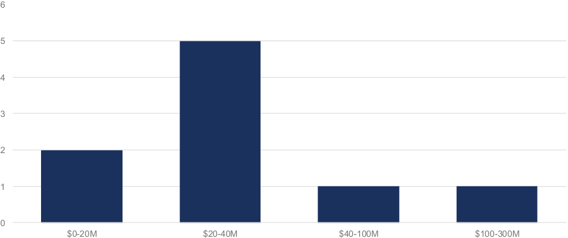

**----- Start of picture text -----** 
6 5 4 3 2 1 0 $0-20M $20-40M $40-100M $100-300M **----- End of picture text -----** 

_Figure 6: Capital costs of large-scale pilots and early demonstration projects in case study set_ 

**Number of Late Demonstration and Early Deployment Projects by Capital Cost,** USD 

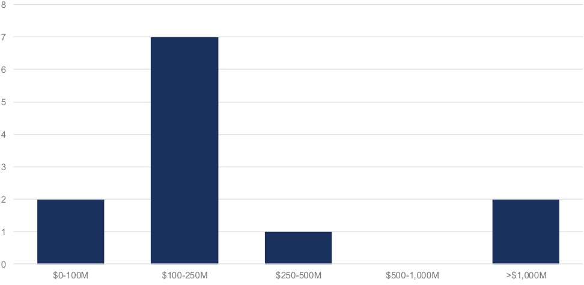

**----- Start of picture text -----** 
8 7 6 5 4 3 2 1 0 $0-100M $100-250M $250-500M $500-1,000M >$1,000M **----- End of picture text -----** 

_Figure 7 : Capital costs of late demonstration and early deployment projects in case study set_ 

## **A endix B: Detailed case studies pp** 

**LanzaTech** is a public company founded in 2005 and headquartered in Skokie, Illinois. LanzaTech’s Gas Fermentation Technology is a novel continuous fermentation system that captures and converts industrial offgases (i.e., industrial waste streams) — a mix of CO2, CO and H2 — to ethanol for use as a fuel or chemical feedstock. LanzaTech is also exploring production of other base chemicals from its Bioreactor. LanzaTech’s systems can be retrofitted to existing industrial facilities in a range of industries including steel and ferroalloy manufacturing, waste processing, refining, and biomass/biogas processing. In 2020, LanzaTech spun out LanzaJet and currently holds a 36% equity stake. LanzaJet has adapted LanzaTech’s core technology to produce sustainable aviation fuels (SAF). 

**Solugen** is a venture-backed private company founded in 2016 and headquartered in Houston, Texas. Solugen’s core technology combines an enzyme reactor and metal catalytic reactor to form a ‘biorefinery’ that produces chemicals using bio-based feedstocks instead of fossil-based feedstocks (oil and gas) with competitive economics. Solugen builds greenfield biorefinery plants (known as Bioforges) and operates its own warehousing and distribution business to supply the chemicals industry. 

**Stegra (formerly H2 Green Steel)** is a private company founded in 2020 and headquartered in Stockholm, Sweden. Stegra’s first project in Boden, Sweden produces low-carbon steel and hot briquetted iron (HBI) products. The project’s three integrated systems include hydrogen production using alkaline electrolyzers; iron (HBI) production using hydrogen-based direct reduced iron (DRI) technology; and steel production using an electric arc furnace. While the individual systems have been deployed in other applications, Stegra’s project is the first large-scale integration of all three processes. Stegra’s customers include automakers, metals distributors, and industrial manufacturers. 

**Via Separations** is a venture-backed private company founded in 2017 and headquartered in Watertown, Massachusetts. Via Separations’ core technology is a novel filtration system that uses graphene oxide membranes to reduce energy use in industrial separation processes. Via Separations’ membrane filtration technology replaces thermal separation processes (e.g., evaporators) and allows for process intensification (increased throughput, reduced energy use, reduced chemical feedstock consumption and reduced emissions). Via Separations’ technology is applicable to a wide range of industries; their initial projects are in the pulp and paper industry. 

**Case study 5** is a carbon removal company. The company builds greenfield assets that combine its proprietary direct air capture technology with carbon storage technology provided by a technology partner. 

**Case study 6** is a US-based company producing industrial chemicals and fuels/feedstocks. The company builds greenfield assets to manufacture its low-carbon products. 

**Case study 7** is a US-based company producing low-carbon fuels. The company builds greenfield assets that integrate proprietary and off-the-shelf technology systems. 

**Case study 8** is a US-based company producing low-carbon cement and concrete products. The company’s technology is retrofitted to integrate with existing facilities. 

**Table 2: LanzaTech’s commercialization pathway at a glance: project evolution across ARL/TRL characteristics[i ]** 

**Table 3: Solugen’s commercialization pathway at a glance: project evolution across ARL/TRL characteristics** 

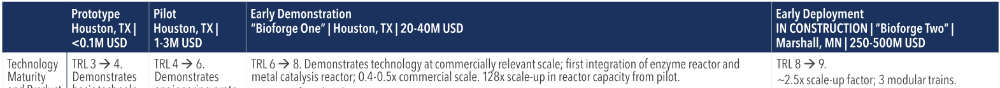

**----- Start of picture text -----** 
Technology TRL 3 à  4. TRL 4 à  6. TRL 6 à  8. Demonstrates technology at commercially relevant scale; first integration of enzyme reactor and TRL 8 à  9. Maturity Demonstrates Demonstrates metal catalysis reactor; 0.4-0.5x commercial scale. 128x scale-up in reactor capacity from pilot. ~2.5x scale-up factor; 3 modular trains. **----- End of picture text -----** 

## **Table 4: Stegra’s commercialization pathway at a glance: project evolution across ARL/TRL characteristics** 

**Table 5: Via Separations’ commercialization pathway at a glance: project evolution across ARL/TRL characteristics** 

ii Award of $2.85 million in 2019 under ARPA-E’s OPEN program. Further award of $9.75 million in 2022, under ARPA-E’s SCALEUP program, to support continued tech development. iii Award of $3.6 million CAD from the Canadian Government through Natural Resources Canada’s Investments in Forestry Industry Transformation (IFIT) program. 

**Table 6: Case Study 5’s commercialization pathway at a glance: project evolution across ARL/TRL characteristics** 

**Table 7: Case Study 6’s commercialization pathway at a glance: project evolution across ARL/TRL characteristics** 

**Table 8: Case Study 7’s commercialization pathway at a glance: project evolution across ARL/TRL characteristics** 

**Appendix C: Summary of observed strategies for achieving FOAK financing** 

**Table 9: Case Study 8’s commercialization journey at a glance: project evolution across ARL/TRL characteristics** 

**Appendix C: Summary of observed strategies for achieving FOAK financing** 

## **A endix C: Summar of observed strate ies for achievin pp y g g g FOAK financin** 

## **References** 

   - automotive-and-h2-green-steel-in-130million-deal-for-supply-near-zeroemissions-steel; Stegra (2023), “Purmo Group in 7-year agreement with H2 Green Steel for near zero emission steel supply”, https://www.stegra. com/latestnews/purmo-group-in-7-year-agreement-with-h2-greensteel-for-near-zero-emission-steel-supply; Stegra (2023), “Roba Metals in 7-year supply agreement for near-zero emissions steel with H2 Green Steel”, https://www.stegra.com/latestnews/roba-metals-in-7-year-supplyagreement-for-near-zero-emissions-steel-with-h2-green-steel; Stegra (2023), “Mercedes Benz and H2 Green Steel announce agreements in both Europe and North America”, https://www.stegra.com/latestnews/ mercedes-benz-and-h2-green-steel-announce-agreements-in-botheurope-and-north-americanbsp; Stegra (2023), “Cargill and H2 Green Steel sign multi-year offtake contract to supply near-zero emission steel”, https://www.stegra.com/latestnews/cargill-and-h2-green-steel-signmulti-year-offtake-contract-to-supply-near-zero-emission-steel 

- 1 Third Derivative (2020), Climate Tech’s Four Valleys of Death and Why We Must Build a Bridge, https://www.third-derivative.org/blog/climatetechs-four-valleys-of-death-and-why-we-must-build-a-bridge 

- 2 S2G Ventures (2024), The Missing Middle: Capital Imbalances in the Energy Transition, https://www.s2gventures.com/reports/missing-middle 

- 3 Third Derivative (2020), Climate Tech’s Four Valleys of Death and Why We Must Build a Bridge, https://www.third-derivative.org/blog/climatetechs-four-valleys-of-death-and-why-we-must-build-a-bridge 

- 4 Vidal, Karl Angelo and Sabater, Annie (2023), “Private equity buyout funds show longest holding periods in 2 decades”, https://www.spglobal. com/marketintelligence/en/news-insights/latest-news-headlines/ private-equity-buyout-funds-show-longest-holding-periods-in-2decades-79033309 

- 5 S2G Ventures (2024), The Missing Middle: Capital Imbalances in the Energy Transition, https://www.s2gventures.com/reports/missing-middle 

- 6 International Energy Agency (2022), Net Zero by 2050: The need for net zero demonstration projects, https://iea.blob.core. windows.net/assets/160ead77-a291-4d97-8ffb-24ca9c8ae93c/ Theneedfornetzerodemonstrationprojects.pdf 

   - Bogue, Zachary (2024). “Twelve’s Historical Sustainable Aviation Fuel Deal with IAG is Deep-Tech Gold”. Twelve Benefit Corporation, https:// www.twelve.co/post/twelve-s-historic-sustainable-aviation-fuel-dealwith-iag-is-deep-tech-gold 

      - Lyngaas, Cailee (2022). “Alaska Airlines, Microsoft and Twelve partner to advance new form of sustainable aviation fuel”. Alaska Airlines. https:// news.alaskaair.com/sustainability/alaska-airlines-microsoft-twelve-newform-of-sustainable-fuel/ 

- 7 Pub. L. 117-58 (Nov. 15, 2021). 8 Pub. L. 117-169 (Aug. 16, 2022). 

- 9 A non-exhaustive list of recent resources includes: BCG and Elemental Excelerator (2024), Traversing the Climate Technology Scale Gap; Breakthrough Energy Catalyst (2024), Unlocking Capital for Climate Tech Projects: The 12 Keys to Scaling-up; Catalyst with Shayle Kann (2023), Financing first-of-a-kind climate assets, CREO Syndicate (2024), The CREO FOAK Framework – Case Study: Carbon Management Technologies; CTVC (2023-24), Newsletter series on FOAK projects, including What the FOAK; FOAK Financing: The Good, The Bad, and The Eligible; The FOAK Checklist; From FOAK to NOAK; EQT Ventures (2024), The Climate Brick: The Missing Manual For Scaling Climate Tech (2024 Edition); Prime Coalition (2022), Barriers to the Timely Deployment of Climate Infrastructure; RMI, Five Lessons for Industrial Project Finance from H2 Green Steel; Stanford University (2024), Guidebook for Early Climate Infrastructure: How Climate Technology Developers are Approaching First-of-a-Kind Projects; Trellis Climate (2024), Catalyzing Development of First-of-a-Kind Climate Projects; Trellis Climate (2024), Resources for FOAK Project Preparation & Development. 

- 10 CTVC (2023), The Sophisticating Climate Capital Stack, https://www.ctvc. co/the-sophisticating-climate-capital-stack/ 

   - 16 The Chemical Show (2024), “Solugen CEO Gaurab Chakrabarti on Decarbonizing the Chemical Industry”, https://www.youtube.com/ watch?v=B0--30UgO-I 

   - 17 Solugen (2024), Partnerships, https://solugen.com/partnerships 

   - 18 Sasol Chemicals (2023). “Sasol Chemicals and Solugen will evaluate effectiveness of sustainable ingredients in care chemicals applications.” https://www.sasol.com/media-centre/media-releases/sasol-chemicalsand-solugen-will-evaluate-effectiveness-of-sustainable-ingredients-incare-chemicals-applications#:~:text=Houston%2C%20USA%20%E2%80%93%20Sasol%20Chemicals%2C,home%20and%20personal%20 care%20products. 

   - 19 CTVC (2024). “FOAK Financing: The Good, The Bad, and the Eligible.” https://platform.sightlineclimate.com/insights/369 

      - ArcelorMittal (2021), “ArcelorMittal expands partnership with carbon capture and re-use specialist LanzaTech through US $30 million investment”, https://corporate.arcelormittal.com/media/press-releases/ arcelormittal-expands-partnership-with-carbon-capture-and-re-usespecialist-lanzatech-through-us-30-million-investment Via Separations (2019), “Via Separations closes financing round to scale development of transformative processing technology”, https:// viaseparations.com/wp-content/uploads/2021/01/20190313-Via-PressRelease.pdf 

- 11 Department of Energy (2024), “Adoption Readiness Levels (ARL): A Complement to TRL”, https://www.energy.gov/technologytransitions/ adoption-readiness-levels-arl-complement-trl 

- 12 U.S. Department of Energy (2023), “Pathways to Commercial Liftoff: Advanced Nuclear,” Advanced Nuclear - Pathways to Commercial Liftoff (energy.gov) 

   - 22 Chan Zuckerberg Initiative (2022), “Chan Zukerberg Initiative Invests in Promising Climate Change Solutions,” https://chanzuckerberg.com/ newsroom/chan-zuckerberg-initiative-invests-in-promising-climatechange-solutions/ 

- 13 Stegra, formerly H2 Green Steel (H2GS) (2023), “SPM and H2 Green Steel sign 5 year supply agreement for green steel. https://www.stegra.com/ latestnews/spm-and-h2-green-steel-sign-5-year-supply-agreement-forgreen-steelnbsp; Stegra (2023), “BILSTEIN GROUP reduces CO2-footprint 23 through deal with H2 Green Steel that exceeds €250 million”, https:// www.stegra.com/latestnews/bilstein-group-reduces-co2-footprintthrough-deal-with-h2-green-steel-that-exceeds-250-millionnbspnbsp; Stegra (2023), “H2 Green Steel in €1.79 billion green steel deal with Marcegaglia”, https://www.stegra.com/latestnews/h2-green-steel-in-17924 billion-green-steel-deal-with-marcegaglia; Stegra (2024), “KIRCHOFF Automotive and H2 Green Steel in €130 million deal for supply near zero emissions steel”, https://www.stegra.com/latestnews/kirchhoff- 

   - Freeman, Madison (2024). Guidebook for Early Climate Infrastructure: How Climate Technology Developers are Approaching First-of-a-Kind Projects. Stanford Steyer-Taylor Center for Energy Policy and Finance, - - 

   - p.16. https://law.stanford.edu/wp content/uploads/2024/04/Guidebook for-Early-Climate-Infrastructure_4.18.24-v2.pdf Fehrenbacher, Katie (2024), “Exclusive: Sustainable aviation fuel startup inks $45M debt deal for U.S. plant”, Axios, https://www.axios.com/pro/ climate-deals/2024/08/07/twelve-45m-debt-for-saf 

- 25 Obrist, Dana (2023), “Solugen: Transforming the Chemicals Industry. 38 LanzaTech (2022), LanzaTech and Brookfield Form Strategic Partnership Regions New Market Tax Credit investments fuel growth in Houston that with an Initial $500 Million Commitment, https://lanzatech.com/ could impact the world.” Regions, https://doingmoretoday.com/solugen-lanzatech-and-brookfeld-form-strategic-partnership-with-an-initial-500transforming-the-chemicals-industry/-the-chemicals-industry/the-chemicals-industry/-chemicals-industry/chemicals-industry/-industry/industry/ million-commitment/ 

- 26 Gunderson Dettmer (2024), “Twelve Announces $645M Financing to 39 LanzaTech (2023), LanzaTech Forms Joint Venture with Olayan Financing De-Fossilize Manufacturing Processes,” https://www.gunder.com/en/ Company to Deploy Carbon Recycling Technology in Saudi Arabia, news-insights/client-news/twelve-announces-dollar645m-fnancing-tohttps://lanzatech.com/lanzatech-forms-joint-venture-with-olayande-fossilize-manufacturing-processes#:~:text=Twelve%20converts%20 fnancing-company-to-deploy-carbon-recycling-technology-in-saudicaptured%20carbon%20dioxide%20into%20valuable%20chemicals,%20 arabia/ fuels,%20and. 40 LanzaTech (2023), Analyst Day Presentation – Jan 2023, https:// 

- 27 LanzaTech (2022), “LanzaTech and Brookfield Form Strategic Partnership ir.lanzatech.com/static-fles/21eb4d1f-3e47-4224-9957-03bfb658aeab with an Initial $500 Million Commitment,” LanzaTech and Brookfeld 41 LanzaTech (2023), Analyst Day Presentation – Jan 2023, https:// Form Strategic Partnership with an Initial $500 Million Commitment – ir.lanzatech.com/static-fles/21eb4d1f-3e47-4224-9957-03bfb658aeab LanzaTech 42 LanzaTech (2023), 3Q 2023 Earnings Presentation, https://ir.lanzatech. 

- 28 U.S. Department of Energy (2023), “Pathways to Commercial Liftoff: com/static-fles/f70cba08-dd37-4bbf-abba-af87e3f92362 ; LanzaTech Advanced Nuclear,” Advanced Nuclear - Pathways to Commercial Liftoff (2024), 4Q and FY2023 Earnings Presentation, https://ir.lanzatech.com/ (energy.gov) static-fles/e0eb3f5f-b742-4ed2-8f80-cc079f0fe6f1 

- 29 Breakthrough Energy Catalyst (2024), “Unlocking Capital for Climate Tech 43 LanzaTech (2023), 3Q 2023 Earnings Presentation, https://ir.lanzatech. Projects: 12 Keys to Scaling-up”, https://www.breakthroughenergy.org/news/ com/static-fles/f70cba08-dd37-4bbf-abba-af87e3f92362 ; LanzaTech unlocking-capital-for-climate-tech-projects-the-12-keys-to-scaling-up/-capital-for-climate-tech-projects-the-12-keys-to-scaling-up/capital-for-climate-tech-projects-the-12-keys-to-scaling-up/-for-climate-tech-projects-the-12-keys-to-scaling-up/for-climate-tech-projects-the-12-keys-to-scaling-up/-climate-tech-projects-the-12-keys-to-scaling-up/climate-tech-projects-the-12-keys-to-scaling-up/-tech-projects-the-12-keys-to-scaling-up/tech-projects-the-12-keys-to-scaling-up/-projects-the-12-keys-to-scaling-up/projects-the-12-keys-to-scaling-up/-the-12-keys-to-scaling-up/the-12-keys-to-scaling-up/-12-keys-to-scaling-up/12-keys-to-scaling-up/-keys-to-scaling-up/keys-to-scaling-up/-to-scaling-up/to-scaling-up/-scaling-up/scaling-up/-up/up/ (2024), 4Q and FY2023 Earnings Presentation, https://ir.lanzatech.com/ 

- 30 Boren, Michael et. al., McKinsey & Company (2012), “The path to static-fles/e0eb3f5f-b742-4ed2-8f80-cc079f0fe6f1 

- 25 Obrist, Dana (2023), “Solugen: Transforming the Chemicals Industry. Regions New Market Tax Credit investments fuel growth in Houston that could impact the world.” Regions, https://doingmoretoday.com/solugen-transforming-the-chemicals-industry/-the-chemicals-industry/the-chemicals-industry/-chemicals-industry/chemicals-industry/-industry/industry/ 

- 29 Breakthrough Energy Catalyst (2024), “Unlocking Capital for Climate Tech 43 Projects: 12 Keys to Scaling-up”, https://www.breakthroughenergy.org/news/ unlocking-capital-for-climate-tech-projects-the-12-keys-to-scaling-up/-capital-for-climate-tech-projects-the-12-keys-to-scaling-up/capital-for-climate-tech-projects-the-12-keys-to-scaling-up/-for-climate-tech-projects-the-12-keys-to-scaling-up/for-climate-tech-projects-the-12-keys-to-scaling-up/-climate-tech-projects-the-12-keys-to-scaling-up/climate-tech-projects-the-12-keys-to-scaling-up/-tech-projects-the-12-keys-to-scaling-up/tech-projects-the-12-keys-to-scaling-up/-projects-the-12-keys-to-scaling-up/projects-the-12-keys-to-scaling-up/-the-12-keys-to-scaling-up/the-12-keys-to-scaling-up/-12-keys-to-scaling-up/12-keys-to-scaling-up/-keys-to-scaling-up/keys-to-scaling-up/-to-scaling-up/to-scaling-up/-scaling-up/scaling-up/-up/up/ 

- 30 Boren, Michael et. al., McKinsey & Company (2012), “The path to improved returns in materials commercialization,” https://www.mckinsey. 44 com/capabilities/operations/our-insights/the-path-to-improved-returnsin-materials-commercialization 

- 31 Emissions Reduction Alberta, LanzaTech’s Carbon Recycling Technology Turns Waste Into Saleable Products, https://www.eralberta.ca/story/ lanzatechs-carbon-recycling-technology-turns-waste-into-saleable45 products/ 

- 32 European Commission (2024), Production of sustainable, advanced bioethANOL through an innovative gas-fermentation process using exhaust gases emitted in the STEEL industry, https://cordis.europa.eu/project/ 46 id/656437 

- 33 European Investment Bank (2020), Belgium: EU supports ArcelorMittal with EUR 75m EIB loan to scale up breakthrough technology to reduce carbon emissions, https://www.eib.org/en/press/all/2020-120-eusupports-arcelormittal-with-eur-75m-eib-loan-to-scale-up-breakthroughtechnology-to-reduce-carbon-emissions 47 

- 34 Primemetals Technologies (2023), Important Milestone Reached at Steelanol CCU Plant in Belgium, https://www.primetals.com/pressmedia/news/important-milestone-reached-at-steelanol-ccu-plant-in48 belgium ; Flanders Investment and Trade (2024), Environmental tech & sustainability, https://invest.fandersinvestmentandtrade.com/en/ sectors/environmental-tech-sustainability 49 

- 35 Rathi, Akshat (2022), Grant From Bill Gates-led Fund Will Make Green Jet Fuel As Cheap As Fossil Fuels, https://www.bloomberg.com/news/ articles/2022-10-19/bill-gates-led-fund-makes-green-jet-fuel-as-cheap50 as-oil-based-competitor 

- 36 Bioenergy International (2016), LanzaTech receives grant to design and plan a demo-scale waste gas to biofuel facility, https://bioenergyinternational.com/lanzatech-receives-grantto-design-and-plan-a-demo-scale-waste-gas-to-biofuel-facility/ ; Bioenergy International (2019), US DOE announces U$14 million investment in demonstration-scale integrated biorefineries, https:// bioenergyinternational.com/us-doe-announces-u14-million-investmentin-demonstration-scale-integrated-biorefneries/ 

- 37 LanzaJet (2022), LanzaJet Announces Investment from Microsoft’s 51 Climate Innovation Fund, Supporting Continued Company Growth, https://www.lanzajet.com/news-insights/lanzajet-secures-industryleading-innovative-fnancing-with-microsoft-climate-innovation-fundto-construct-the-worlds-frst-commercial-alcohol-to-jet-sustainablefuel-plant 

   - 44 Solugen (2023). Sasol Chemicals and Solugen will Evaluate Effectiveness of Sustainable Ingredients in Care Chemicals Applications. https://solugen.com/sasol-chemicals-and-solugen-will-evaluateeffectiveness-of-sustainable-ingredients-in-care-chemicalsapplications?utm_source=terminus-webexperiences 

   - 45 Obrist, Dana (2023), “Solugen: Transforming the Chemicals Industry. Regions New Market Tax Credit investments fuel growth in Houston that could impact the world.” Regions, https://doingmoretoday.com/solugentransforming-the-chemicals-industry/ 

   - 46 Loan Programs Office (2024). LPO Announces Conditional Commitment to Solugen’s Bioforge Marshall for Sustainable Biomanufacturing. https:// www.energy.gov/lpo/articles/lpo-announces-conditional-commitmentsolugens-bioforge-marshall-sustainable#:~:text=Today%2C%20 the%20U.S.%20Department%20of,%2C%20Minnesota%2C%20for%20 bio%2Dbased 

   - 47 Solugen (2024). “Solugen Breaks Ground on Bioforge Marshall Facility.” https://solugen.com/solugen-breaks-ground-on-bioforge-marshallfacility 

   - 48 Neeley, Todd (2023). “ADM to Expand Corn Plant in Minnesota.” Progressive Farmer. https://www.dtnpf.com/agriculture/web/ag/news/ article/2023/10/30/marshall-minnesota-adm-corn-plant 

   - 49 HYBRIT (2022), “HYBRIT: Milestone reached – pilot facility for hydrogen storage up and running”, https://www.hybritdevelopment.se/en/hybritmilestone-reached-pilot-facility-for-hydrogen-storage-up-and-running/ 

   - 50 Stegra (2023), “thyssenkrupp nucera and H2 Green Steel partner for one of the largest electrolysis plants globally”, https://stegra.com/ news-and-stories/thyssenkrupp-nucera-and-h2-green-steel-partnerfor-one-of-the-largest-electrolysis-plants-globally- ; Stegra (2022), “H2 Green Steel partners with Midrex for technology and Kobe Steel for equity investment”, https://stegra.com/news-and-stories/h2green-steel-partners-with-midrex-for-technology-and-kobe-steel-forequity-investment ; Stegra (2022), “H2 Green Steel and SMS group in technology partnership”, https://stegra.com/news-and-stories/h2-greensteel-and-sms-group-in-technology-partnership 

   - 51 Stegra (2024), “H2 Green Steel raises more than 4 billion in debt financing for the world’s first large-scale green steel plant”, https:// stegra.com/news-and-stories/h2-green-steel-raises-more-than-4-billionin-debt-fnancing-for-the-worlds-frst-large-scale-green-steel-plant 

- 52 Stegra (2024), “Stegra granted state aid from the Industrial Leap and the Swedish Energy Agency”, https://stegra.com/news-and-stories/stegragranted-state-aid-from-the-industrial-leap-and-the-swedish-energyagency 

- 53 Bhat, Shravan and Salazar, Asia (2023), “Five Lessons for Industrial Project Finance from H2 Green Steel”, RMI, https://rmi.org/fve-lessonsfor-industrial-project-fnance-from-h2-green-steel/ 

- 54 Stegra (2024), “H2 Green Steel raises more than 4 billion in debt financing for the world’s first large-scale green steel plant”, https:// stegra.com/news-and-stories/h2-green-steel-raises-more-than-4-billionin-debt-fnancing-for-the-worlds-frst-large-scale-green-steel-plant 

- 55 ARPA-E (2019). Via Separations: Scalable Graphene Oxide Membranes for Energy-Efficient Chemical Separations. https://arpa-e.energy.gov/ technologies/projects/scalable-graphene-oxide-membranes-energyeffcient-chemical-separations. 

   - ARPA-E (2022). “U.S. Department of Energy Announces $100 Million to Boost Commercialization of Eight New Clean Energy Technologies.” https://arpa-e.energy.gov/news-and-media/press-releases/usdepartment-energy-announces-100-million-boost-commercialization 

   - Freeman, Madison (2024). Guidebook for Early Climate Infrastructure: How Climate Technology Developers are Approaching First-of-a-Kind Projects. Stanford Steyer-Taylor Center for Energy Policy and Finance, - - 

   - p.16. https://law.stanford.edu/wp content/uploads/2024/04/Guidebook for-Early-Climate-Infrastructure_4.18.24-v2.pdf 

- 57 Natural Resources Canada (2023). “Government of Canada Invests in First-of-its-Kind Filtration Technology in Grande Prairie to Help Reduce Carbon Emissions.” https://www.canada.ca/en/natural-resources-canada/ news/2023/06/government-of-canada-invests-in-frst-of-its-kindfltration-technology-in-grande-prairie-to-help-reduce-carbon-emissions. html 

- 58 Office of Clean Energy Demonstrations (2024). Industrial Demonstrations Program Selections for Award Negotiations: Chemicals and Refining. https://www.energy.gov/oced/industrial-demonstrations-programselections-award-negotiations-chemicals-and-refning 

- 59 Freeman (2024). Guidebook for Early Climate Infrastructure. 

