## **Progress toward fusion energy breakeven and gain as measured against the Lawson criterion** 

Samuel E. Wurzel and Scott C. Hsu 

_Advanced Research Projects Agency-Energy, U.S. Department of Energy, Washington, DC 20585_ 

## (*sam.wurzel@hq.doe.gov) 

The Lawson criterion is a key concept in the pursuit of fusion energy, relating the fuel density _n_ , pulse duration _τ_ or energy confinement time _τE_ , and fuel temperature _T_ to the energy gain _Q_ of a fusion plasma. The purpose of this paper is to explain and review the Lawson criterion and to provide a compilation of achieved parameters for a broad range of historical and contemporary fusion experiments. Although this paper focuses on the Lawson criterion, it is only one of many equally important factors in assessing the progress and ultimate likelihood of any fusion concept becoming a commercially viable fusion-energy system. Only experimentally measured or inferred values of _n_ , _τ_ or _τE_ , and _T_ that have been published in the peer-reviewed literature are included in this paper, unless noted otherwise. For extracting these parameters, we discuss methodologies that are necessarily specific to different fusion approaches (including magnetic, inertial, and magneto-inertial fusion). This paper is intended to serve as a reference for fusion researchers and a tutorial for all others interested in fusion energy. 

Keywords: fusion energy, nuclear fusion, Lawson criterion, triple product 

## **I. INTRODUCTION** 

In 1955, J. D. Lawson identified a set of necessary physical conditions for a “useful” fusion system.[1] By evaluating the energy gain _Q_ , the ratio of energy released by fusion reactions to the delivered energy for heating and sustaining the fusion fuel, Lawson concluded that for a pulsed system, energy gain is a function of temperature _T_ and the product of fuel density _n_ and pulse duration _τ_ (Lawson used _t_ ). When thermal-conduction losses are included in a steady-state system (extending Lawson’s analysis), the power gain is a function of _T_ and the product of _n_ and energy confinement time _τE_ . We call both these products, _nτ_ and _nτE_ , the _Lawson parameter_ . The required temperature and Lawson parameter for self heating from charged fusion products to exceed all losses is known as the _Lawson criterion_ . A fusion plasma that has reached these conditions is said to have achieved _ignition_ . Although ignition is not required for a commercial fusion-energy system, higher values of energy gain will generally yield more attractive economics, all other things being equal. If the energy applied to heat and sustain the plasma can be recovered in a useful form, the requirements on energy gain for a useful system are relaxed. 

Lawson’s analysis was declassified and published in 1957[2] and has formed the scientific basis for evaluating the _physics progress_ of fusion research toward the key milestones of plasma energy breakeven and gain. Over time, the Lawson criterion has been cast into other formulations, e.g., the _fusion triple product_[3,4] ( _nT τE_ ) and “p-tau” (pressure _p_ times _τE_ ), which have the same dimensions (with units of m _[−]_[3] keV s or atm s) and combine all the relevant parameters conveniently into a single value. However, these single-value parameters do not map to a unique value of _Q_ , whereas unique combinations of _T_ and _nτ_ (or _nτE_ ) do. Various plots of the Lawson parameter, triple product, and “p-tau” versus year achieved or versus _T_ have been published for subsets of experimental results,[5–8] but to our knowledge there did not exist a comprehensive compilation of such data in the peer-reviewed litera- 

ture that spans the major thermonuclear-fusion approaches of magnetic confinement fusion (MCF), inertial confinement fusion (ICF), and magneto-inertial fusion (MIF). This paper fills that gap. 

The motivation to catalog, define our methodologies for inferring, and establish credibility for a compilation of these parameters stems from the prior development of the Fusion Energy Base (FEB) website ( `http://www. fusionenergybase.com` ) by the first author. FEB is a free resource with a primary mission of providing objective information to those, especially private investors, interested in fusion energy. This paper provides access to the many included plots, tables, and codes, while also providing context for understanding the history of fusion research[9–11] and the tremendous scientific progress that has been made in the 65+ years since Lawson’s report. 

The combination of _T_ and _nτ_ (or _nτE_ ) is a scientific indicator of how far or near a fusion experiment is from energy breakeven and gain. Achieving high values of these parameters is tied predominantly to plasma physics and related engineering challenges of producing stable plasmas, heating them to fusion temperatures, and exerting sufficient control. Since the 1950s, these challenges have driven the development of the entire scientific discipline of plasma physics, which has dominated fusion-energy research to this day. _However, we emphasize that there are many additional considerations, entirely independent of but equally important as the Lawson criterion, in evaluating the remaining technical and socio-economic risks of any fusion approach and the likelihood of any approach ultimately becoming a commercially viable fusion-energy system_ . These include the feasibility, safety, and complexity of the engineering and materials subsystems and fuel cycle that impact a commercial fusion system’s economics[12] and social acceptance,[13] as illustrated conceptually in Fig. 1. The issues of RAMI (reliability, accessibility, maintainability, and inspectability)[14] and government regulation[15,16] impact both the economics and social acceptance. This paper discusses only the progress of fusion energy 

along the axis of energy gain, and we caution the reader not to over-emphasize nor under-emphasize any one axis. 

Although we do not further emphasize it in this paper, a different scientific metric called the _Sheffield parameter_[8,17] aims to embody both the required physics performance (like the Lawson parameter) and the “efficiency” of achieving that performance for MCF concepts. The Sheffield parameter can be thought of as a normalized triple product by explicitly including the parameter _β_ , which is a measure of how much plasma pressure (related to the triple product) can be confined for a given magnetic field (which affects cost and engineering difficulty). 

Because of these additional considerations, fusion approaches that have achieved the highest values of _T_ and _nτ_ (or _nτE_ ), i.e., tokamak-based MCF[6] and laser-driven ICF,[18,19] may not necessarily become the first widely deployed commercial fusion-energy systems. In fact, most private fusion companies focusing on developing commercial fusion systems have opted for fusion approaches with lower demonstrated values to-date of temperature and Lawson parameter because of the expectation that the required economics and social acceptance may be more readily achievable. Further discussion of these other considerations are beyond the scope of this paper but are discussed elsewhere in the fusion literature.[8,14,20,21] 

This paper is organized as follows. Section II defines the key variables used in the paper and provides plots of the compiled parameters. Section III provides a review and mathematical derivations of the Lawson criterion and the multiple definitions of fusion energy gain used by fusion researchers. Section IV provides a physics-based justification for the approximations required to compare fusion energy gain across a wide range of fusion experiments and approaches. Readers primarily interested in seeing and using the data without getting entangled in the details can largely ignore Secs. III and IV. Section V provides a summary and conclusions. The appendices provide supporting information, including data tables of the compiled parameters, additional plots, and consideration of advanced fusion fuels (D-D, D-[3] He, p-[11] B). 

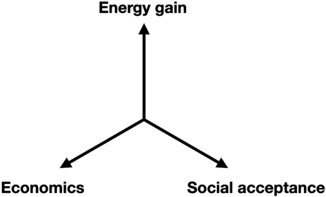

## **II. VARIABLE DEFINITIONS AND PLOTS** 

This section provides variable definitions (Table I), and plots of compiled Lawson parameters, fuel temperatures, and triple products. In many places (especially Secs. I, III, and V), we use the generic variables _n_ , _T_ , _τ_ , _Q_ for economy. However, in most of the paper and as indicated in Table I, all these variables have more precise and differentiated versions with various subscripts. The energy unit keV is used for temperature variables throughout this paper, and therefore the Boltzmann constant _k_ is not explicitly shown. 

TABLE I: Definitions of variables used in this paper. 

TABLE I: Definitions of variables used in this paper. 

|Variable|Defnition|
|---|---|
|¯_Z_|Mean charge state, i.e., ratio of electron to ion|
||density in a quasi-neutral plasma|
|_Z_eff|Effective value of charge state. Factor by which|
||bremsstrahlung is increased as compared to a|
||hydrogenic plasma, see Eq. (41).|
|_η_|Effciency of recapturing thermal energy at the|
||conclusion of the confnement duration in Law-|
||son’s second scenario|
|_ηE_|Effciency of converting electrical recirculating|
||power to externally applied heating power|
|_η_abs|Effciency of coupling externally applied power|
||to the fuel|
|_η_hs|Effciency of coupling shell kinetic energy to|
||hotspot thermal energy in laser ICF implosions|
|_η_th|Effciency of converting total output power to|
||electricity|
|_Q_fuel|Fuel gain. Ratio of fusion power to power ab-|
||sorbed by the fuel|
|_⟨Q_fuel_⟩_|Volume-averaged fuel gain in the case of non-|
||uniform profles|
|_Q_sci|Scientifc gain. Ratio of fusion power to exter-|
||nally applied heating power|
|_⟨Q_sci_⟩_|Volume-averaged scientifc gain in the case of|
||non-uniform profles|
|_Q_eng|Engineering gain. Ratio of electrical power to|
||the grid to recirculating power|
|_Q_wp|Wall-plug gain. Ratio of fusion power to input|
||electrical power from the grid|
|_Q_|Generic energy gain. For MCF, this can refer to|
||_Q_fuel or_Q_sci. For ICF, this refers to_Q_sci.|

Figure 2 plots achieved Lawson parameters versus _Ti_ for MCF, MIF, and ICF experiments, overlaid with contours of _scientific energy gain Q_ sci, which is the fusion energy released divided by the energy delivered to the plasma fuel (in the case of MCF) or the target (in the case of ICF). See the remainder of the paper for details on how the relevant data are extracted from the primary literature, the mathematical definition of _Q_ sci, and how the effects of non-uniform spatial profiles, impurities, heating efficiency, and other experimental details are treated. Figure 3 shows record triple products achieved by different fusion concepts versus year achieved (or anticipated to be achieved) relative to horizontal lines representing various values of _Q_ sci. 

Typically, MCF uses _τE_ and ICF uses _τ_ in their respective Lawson-parameter and triple-product definitions. Although _τE_ and _τ_ have different physical meanings (see Secs. III E and III F, respectively), they lead to analogous measures of energy breakeven and gain, allowing for MCF and ICF to be plotted together in Figs. 2, 3, and 25. We caution the reader that sometimes Lawson parameters and triple products may be overestimated by concept advocates, especially in unpublished materials, because _τ_ is used incorrectly in place of _τE_ . 

## **III. LAWSON CRITERION, LAWSON PARAMETER, TRIPLE PRODUCT, AND ENERGY GAIN** 

In this section, we provide a detailed review of the derivation of the Lawson criterion, following Lawson’s original papers.[1,2] We then introduce the mathematical definitions of the Lawson parameter in the context of idealized MCF and ICF scenarios, derive the fusion triple product, and define three forms of fusion energy gain used by fusion researchers. 

Lawson considered the deuterium-tritium (D-T) and deuterium-deuterium (D-D) fusion reactions: 

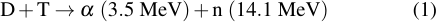

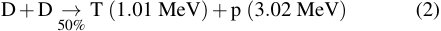

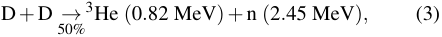

where _α_ denotes a charged helium ion ([4] He[2][+] ), p denotes a proton, n denotes a neutron, and 1 MeV = 1 _._ 6 _×_ 10 _[−]_[13] J. The fusion reactivities _⟨σ v⟩_ for thermal ion distributions for these reactions, as well as the additional reactions, 

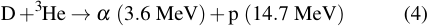

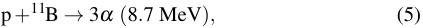

are shown in Fig. 4. 

As did Lawson, this paper assumes _thermal_ populations of ions and electrons, i.e., Maxwellian velocity distributions characterized by a temperatures _Ti_ and _Te_ , respectively. Throughout this paper, we assume that ions and electrons are in thermal equilibrium with each other such that _T_ = _Ti_ = _Te_ . Non-equilibrium fusion approaches, where _Ti > Te_ , must account for the energy loss channel and timescale of energy transfer from ions to electrons.[24] Analysis of such systems is not included in this paper. Furthermore, this paper does not consider non-thermal ion or electron populations such as those with beam-like distributions. The latter typically must contend with reactant slowing at a much faster rate than the fusion rate. The inherent difficulty (though not necessarily impossibility) for non-thermal fusion approaches to achieve _Q_ sci _>_ 1 is discussed in Ref. 25. 

Lawson’s original papers considered two distinct fusion operating conditions. The first is a steady-state scenario in which the charged fusion products are confined and contribute to self heating. The second is a pulsed scenario in which the charged fusion products escape and energy is supplied over the duration of the pulse. Lawson’s analysis did not address _how_ the fusion plasma is confined and assumed an ideal scenario without thermal-conduction losses in both cases. 

## **A. Lawson’s first insight: ideal ignition temperature** 

Lawson’s first insight was that a self-sustaining, steadystate fusion system without external heating must, at a minimum, balance radiative power losses with self heating from the charged fusion products, as illustrated conceptually in Fig. 5. The power released by charged fusion products in a 

![FIG. 2. Experimentally inferred Lawson parameters ( _ni_ 0 _τE[∗]_[for MCF and] _[ n][τ]_[for ICF) of fusion experiments vs.] _[ T][i]_[0][ for MCF and] _[ ⟨][T][i][⟩]_[n][ for ICF] (see Sec. III for definitions of these quantities), extracted from the published literature (see Tables VI, VII, and VIII). The various contours in the upper right correspond to the required Lawson parameters and ion temperatures required to achieve the indicated values of scientific gain _Q_[MCF] sci for MCF (colored contours) and _Q_[ICF] sci[for ICF (solid and dotted black contours), assuming representative density and temperature] profiles, external-heating absorption efficiencies, and D-T fuel. For experiments that do not use D-T, the contours represent a D-T-equivalent value of _Q_ sci. The finite widths of the _Q_[MCF] sci contours represent a range of assumed impurity levels. See the rest of the paper for details on how individual data points are extracted and how the _Q_[MCF] sci and _Q_[ICF] sci[contours are calculated.][Note that] _[ Q]_[MCF] sci ≳ 20 and _Q_[ICF] sci[≳][100 are likely] needed for practical fusion energy; see Sec. III H and Eq. (27) for discussion and definition, respectively, of _Q_ eng.](images/2105.10954.pdf-0004-01.png)

![FIG. 3. Triple products ( _ni_ 0 _Ti_ 0 _τE[∗]_[for][MCF][and] _[n][⟨][T][i][⟩]_[n] _[τ]_[for][ICF;][see][Sec.][III][for][definitions][of][these][quantities)][that][set][a][record][for][a][given] concept vs. year achieved. Record values for different concepts are shown to illustrate the progress towards energy gain of different concepts over time. The horizontal lines labeled _Q_[MCF] sci represent the minimum required triple product to achieve the indicated values of _Q_[MCF] sci , assuming _η_ abs = 0 _._ 9. The horizontal line labeled _Q_[ICF] sci[=][ ∞][represents][the][required][triple][product][to][achieve][ignition][and][propagating][burn][for][ICF,] assuming _Ti_ = 4 keV and _η_ abs = 0 _._ 006. The projected triple-product ranges for SPARC and ITER are bounded above by their projected peak triple products and below by the stated mission of each experiment (i.e., _Q_[MCF] fuel[=][ 2 for SPARC and] _[ Q]_[MCF] fuel[=][ 10 for ITER). Note that] _[ Q]_[MCF] sci ≳ 20 and _Q_[ICF] sci[≳][100 are likely needed for practical fusion energy; see Sec. III H and Eq. (27) for discussion and definition, respectively, of] _[ Q]_[eng][.] The NIF shot from August 8, 2021 does not appear in this plot because it did not achieve a record triple product, despite achieving a record _Q_[ICF] sci[for ICF.][This highlights the main limitation of the triple product, i.e., it does not map to a unique value of gain (see Secs. III G and IV B] for further explanation).](images/2105.10954.pdf-0005-01.png)

![FIG. 4. Thermal fusion reactivities _⟨σ v⟩_ vs. _Ti_ for fusion reactions shown in the legend. All reactivities are calculated by numerical integration of velocity-averaged cross sections from Ref. 22 with the exception of p-[11] B, which is calculated from the parametrization of Ref. 23. Note that the two D-D branches are nearly on top of each other.](images/2105.10954.pdf-0006-01.png)

plasma of volume _V_ is 

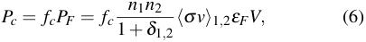

where _n_ 1 and _n_ 2 are the number densities of the reactants, _δ_ 1 _,_ 2 = 1 in the case of identical reactants (e.g., D-D), and _δ_ 1 _,_ 2 = 0 otherwise (e.g., D-T). 

where _CB_ is a constant and _Z_ = 1 in a hydrogenic plasma. Entering values of density in m _[−]_[3] , temperature in keV, volume in m[3] , and setting _CB_ = 5 _._ 34 _×_ 10 _[−]_[37] W m[3] keV _[−]_[1] _[/]_[2] gives _PB_ in watts. 

If the fusion plasma is to be completely self heated by charged fusion products (i.e., _α_ , T, p, or He[3] in the above reactions), then _Pc ≥ PB_ is required in order for the plasma to reach ignition (ignoring conduction losses for the moment). In the case of an equimolar D-T fusion plasma, i.e., _n/_ 2 = _n_ 1 = _n_ 2, where _n_ is the total ion number density and _Z_ = 1, and given the assumption _T_ = _Ti_ = _Te_ , the condition _Pc ≥ PB_ becomes 

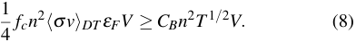

Dividing both sides by _V_ and plotting the resulting fusion power density _Sc_ = _Pc/V_ (left-hand side) and bremsstrahlung power density _SB_ = _PB/V_ (right-hand side) versus _T_ in Fig. 6 shows that _T ≥_ 4 _._ 3 keV is required for _Sc ≥ SB_ . This temperature is known as the ideal ignition temperature because, under the idealized scenario of perfect confinement, ignition occurs at this temperature. Note that because _n_[2] cancels on both sides of Eq. (8), the ideal ignition temperature is independent of density. In Appendix C, we discuss and show how the ignition temperature could be modified if bremsstrahlung radiation losses are mitigated. 

## **B. Lawson’s second insight: dependence of fuel energy gain on** _T_ **and** _nτ_ 

The power emitted by bremsstrahlung radiation is 

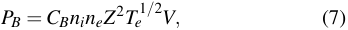

Lawson’s second insight involves a pulsed scenario where a plasma is heated instantaneously to a temperature _T_ and main- 

tained at that temperature for time _τ_ , as illustrated conceptually in Fig. 7. In this scenario, bremsstrahlung radiation and all fusion reaction products escape, and heating must come from an external source during duration _τ_ . Idealized confinement is assumed, and thermal-conduction losses are ignored. 

We define the fuel gain _Q_ fuel (Lawson used _R_ ) as the ratio of energy released in fusion products to the applied external energy that is _absorbed_ by the entire fuel over the duration _τ_ of the pulse. This absorbed energy is the sum of the instantaneously deposited energy 2[3][(] _[n][e]_[ +] _[n][i]_[)] _[TV]_[=][ 3] _[nTV]_[(assuming] _T_ = _Ti_ = _Te_ and _n_ = _ni_ = _ne_ ) and the energy applied and absorbed over the pulse duration, _τP_ abs. To maintain constant _T_ over duration _τ_ , _P_ abs = _PB_ is required, and the fuel gain is therefore, 

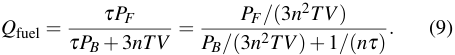

Because both _PF_ and _PB_ are proportional to _n_[2] _V_ and functions of _T_ [see Eqs. (6) and (7)], the _n_[2] _V_ dependence cancels out, and _Q_ fuel is solely a function of _T_ and _nτ_ , 

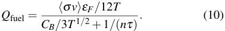

Figure 8 plots _Q_ fuel as a function of _T_ for the indicated values of _nτ_ , illustrating that even without self-heating, _Q_ fuel _≫_ 1 is theoretically possible. Lawson noted that a “useful” system would require _Q_ fuel _>_ 2, assuming that fusion energy and bremsstrahlung could be converted to useful energy with an efficiency of 1/3, and remarked on the severity of the required _T_ and _nτ_ . 

In this section, we have assumed that at time _t_ = _τ_ the external heating is turned off and none of the applied energy is recaptured. Lawson noticed, however, that if a fraction _η_ (Lawson used _f_ ) of the thermal energy at the conclusion of the pulse duration is recovered and converted into a useful form of energy (e.g., electrical or mechanical) that could offset the externally applied energy, the quantity _nτ_ in Eq. (10) is replaced by _nτ/_ (1 _− η_ ). The utilization of energy recovery to relax the requirements on _nτ_ for achievement of energy gain is discussed further in Sec. III H. 

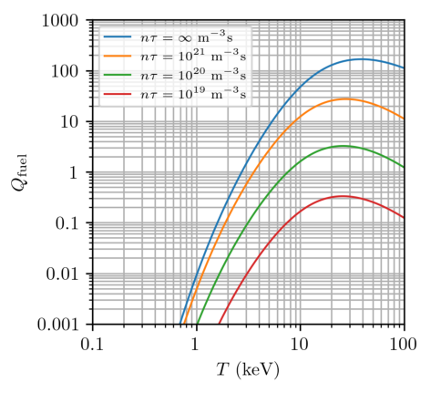

## **C. Extending Lawson’s second scenario: effect of self heating and relationship between characteristic times** _τ_ **and** _τE_ 

In an effort to capture experimental realities, we extend Lawson’s second scenario to include thermal-conduction losses and self heating from charged fusion products, as illustrated in Fig. 9. The rate of energy leaving the plasma via thermal conduction is characterized by an _energy confinement time τE_ , which is the time for energy equal to the thermal energy 3 _nTV_ to exit the plasma. The power balance over the duration of the constant-temperature pulse is 

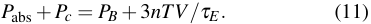

Applying a similar analysis to that of the previous section, we obtain 

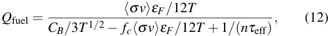

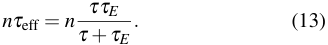

The relationship between the two characteristic times _τ_ and _τE_ is like two resistors in parallel, i.e., it is the smaller of the two that limits the value of _τ_ eff. If _τ ≪ τE_ , the confinement duration _τ_ limits _Q_ fuel because there is limited time to overcome the initial energy investment of raising the plasma temperature. If _τE ≪ τ_ , the energy confinement time _τE_ limits _Q_ fuel because the rate of energy leakage from thermal conduction places higher demand on external and self heating. If the two characteristic times are of similar magnitude, then both play a role in limiting _Q_ fuel. 

Figure 10 plots _Q_ fuel versus _T_ for the indicated values of _nτ_ eff, illustrating that self heating enables ignition ( _Q_ fuel _→_ ∞) above a threshold of _T_ and _nτ_ eff, made possible by the reduction of the denominator of Eq. (12) by amount _fc⟨σ v⟩εF /_ 12 _T_ . We explore these thresholds in subsequent sections. 

## **D. Scientific energy gain and breakeven** 

Because external-heating efficiency varies widely across fusion concepts, and because the absorption efficiency is intrinsic to the physics of each concept, we define _P_ ext as the heating power applied _at the boundary_ of the plasma (in the case of MCF) or the target assembly (in the case of ICF). This definition of _P_ ext encapsulates all _physics_ elements of the experiment. The boundary can typically be regarded as the vacuum vessel for all concepts, where _P_ ext could be electromagnetic waves for MCF, laser beams for ICF, or electrical current and voltage for MIF. The previously introduced _P_ abs is the fraction _η_ abs of _P_ ext that is actually _absorbed by the fuel_ , 

i.e., _P_ abs = _η_ abs _P_ ext. The previously defined _fuel gain_ is 

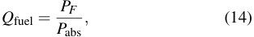

and the newly defined _scientific gain_ is 

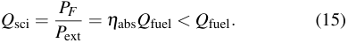

Whereas _Q_ fuel ignores the plasma-physics losses of the absorption of heating energy into the fuel (e.g., neutral-beam shine-through in MCF or reflection of laser light via laserplasma instabilities in ICF), _Q_ sci accounts for all plasmaphysics-related losses between the vacuum vessel and the fusion fuel. Therefore, _Q_ sci is the better metric for assessing remaining _physics risk_ of a fusion concept. 

_Scientific breakeven_ is historically defined as _Q_ sci = 1, which is an important milestone in the development of fusion energy because it signifies that very significant (but not all) plasma-physics challenges have been retired. Scientific breakeven has not yet been achieved, although D-T tokamak experiments such as TFTR and JET from the 1990s and the NIF experiment of August 8, 2021[26] have come close ( _Q_ sci = 0 _._ 27 for TFTR,[27] _Q_ sci = 0 _._ 64 for JET,[28] and _Q_ sci _∼_ 0 _._ 7 for NIF[29] ). Because _η_ abs is much closer to unity in MCF experiments, the MCF community often uses _Q_ to refer to _Q_ fuel or _Q_ sci interchangeably. 

## **E. Idealized, steady-state MCF:** _τE ≪ τ_ 

MCF relies on strong magnetic fields to confine fusion fuel, minimize thermal-conduction losses, and trap the charged fusion products for self heating. By the time that Lawson’s report was declassified in 1957, the UK, US, and USSR were all actively developing MCF experiments that included externally applied heating. 

Adapting the extension of Lawson’s second insight to this scenario, we consider the power balance of an externally heated and self-heated, steady-state plasma. Figure 11 illustrates this scenario for two different values of energy gain. The power balance and fuel gain of the plasma are described by Eqs. (11) and (12), respectively, in the limit of steady-state operation, i.e., _τ →_ ∞. 

To more clearly observe the requirements on _nτE_ and _T_ to achieve certain values of _Q_ fuel, we solve Eq. (12) for _nτE_ in the steady-state limit ( _τ ≫ τE_ ), 

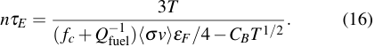

Plotting this expression in Fig. 12 (dashed lines) for D-T fusion shows that a threshold value of _nτE_ , which varies with _T_ , is required to achieve a given value of _Q_ fuel. Table II lists the minimum values of Lawson parameter and corresponding temperature required to achieve _Q_ fuel = 1 and _Q_ fuel = ∞ for the indicated reactions. Thus far, spatially uniform profiles of all quantities are assumed, and geometrical effects and impurities are ignored. Later in the paper, we consider the effects of 

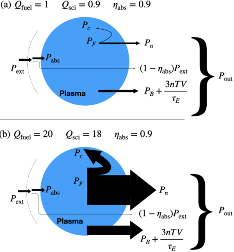

TABLE II. Values of minimum _niτE_ and corresponding _T_ for _Q_ fuel = 1 and _Q_ fuel = ∞, for different fusion fuels assuming _T_ = _Ti_ = _Te_ , based on Eq. (16) for D-T (see Appendix D for advanced fuels). 

nonuniform spatial profiles, different geometries (e.g., cylinder, torus, etc.), and impurities. 

To more clearly observe the requirements on _nτE_ and _T_ to achieve certain values of _Q_ sci, we replace _Q_ fuel with _Q_ sci _/η_ abs in Eq. (16), 

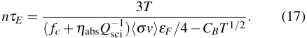

The ignition contours are identical for _Q_ fuel = ∞ and _Q_ sci = ∞. For MCF experiments, where _η_ abs is close to unity ( _η_ abs _∼_ 0 _._ 9), non-ignition _Q_ sci _<_ ∞ contours are shifted relative to their respective _Q_ fuel contours only very slightly toward the ignition contour ( _Q_ fuel _, Q_ sci = ∞), as seen in Fig. 12 (solid lines). 

The _Lawson criterion_ , where _P_ abs _→_ 0 and _Q_ fuel _→_ ∞ in Eqs. (11) and (14), respectively, is satisfied for values of _nτE_ and _T_ on or above the _Q_ fuel _, Q_ sci = ∞ curves in Fig. 12. In this ignition regime, the plasma is entirely self heated by charged fusion products, and external heating is zero. While the minimum Lawson parameter required for ignition occurs at _T ≈_ 25 keV, MCF approaches aim for _T ≈_ 10–20 keV because the pressure required to achieve high gain is minimized in this lower-temperature range (as discussed in Sec. III G). 

## **F. Idealized ICF:** _τ ≪ τE_ 

ICF relies on the inertia of highly compressed fusion fuel to provide a duration to fuse a sufficient amount of fuel to overcome the energy invested in compressing the fuel assembly. In 1971, the concept of using lasers to compress and heat a fuel pellet was declassified, first by the USSR and later that year by the US.[30] In 1972, Nuckolls _et al._[18] described the direct-drive laser ICF concept, where lasers ablate the surface of a hollow fuel pellet outward, driving the inner surface toward the center. In this scenario the kinetic energy of the inward-moving material is converted to thermal energy of a central, lower-density “hot-spot” that ignites. The fusion burn propagates outward through the surrounding denser fuel shell, which finally disassembles. The four-step, “central hot-spot ignition” process is illustrated in Fig. 13. Laser indirect-drive ICF bathes the fuel pellet in X-rays generated by the interactions between lasers and the inside of a “hohlraum” (a metal enclosure surrounding the fuel pellet) to similar effect. 

To adapt the extension of Lawson’s second insight, we con- 

sider the energy balance of the hot spot over duration _τ_ , during which it is inertially confined [Fig. 13(b)]. The sequence of events that leads to energy delivered to the hot spot are: 

1. The laser energy strikes the fuel pellet (or hohlraum); 

2. A fraction _η_ abs of the laser energy is absorbed by the fuel in the form of kinetic energy _Eabs_ of the imploding fuel shell; 

3. The imploding shell with energy _Eabs_ does _p_ d _V_ work on the hot spot of volume _V_ , resulting in hot-spot thermal energy _Ehs_ = _η_ hs _Eabs_ ; 

4. If sufficiently high temperature and Lawson parameter are achieved, additional energy _τPc_ is delivered to the hot spot by charged fusion products. 

We describe the fuel gain of the hot-spot by applying the following assumptions and modifications to Eq. (12). In this simplified model, we neglect bremsstrahlung and thermalconduction losses, i.e., _CB →_ 0 and _τE →_ ∞. While both processes are present in the hot spot, the cold, dense shell is largely opaque to bremsstrahlung and partially insulates the hot spot. In practice (which we also ignore here), both loss mechanisms have the effect of ablating material from the inner shell wall into the hot spot, increasing density and decreasing temperature while maintaining a constant pressure.[31] To account for the fraction _η_ hs of the shell kinetic energy that is deposited in the hot-spot, the definition of _Q_ fuel becomes, 

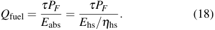

We assume that the charged fusion products generated in the hot spot deposit all their energy within the hot spot. 

To more clearly observe the requirements on _nτ_ and _T_ to achieve certain values of _Q_ fuel, we solve Eq. (12) for _nτ_ with the above limits and modifications, 

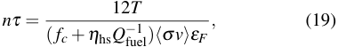

Plotting this expression in Fig. 14 (dashed lines) for D-T fusion shows that a threshold value of _nτ_ , which varies with _T_ , 

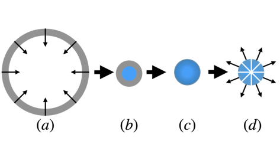

is required to achieve a given value of _Q_ fuel in an ICF hot spot. We have assumed _η_ hs = 0 _._ 65 based on NIF shot N191007.[32] Thus far, reductions in _τ_ due to instabilities, impurities, losses due to bremsstrahlung and thermal conduction, and the requirements to initiate a propagating burn in the cold, dense shell have been ignored. Later in this paper, we consider some of these effects. 

Similarly to the MCF example, the required Lawson parameter and temperature required to reach a certain value of _Q_ sci can be evaluated by replacing _η_ hs _Q[−]_ fuel[1][with] _[η]_[abs] _[η]_[hs] _[Q][−]_ sci[1] in Eq. (19), 

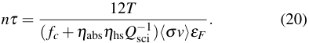

For ICF experiments, where _η_ abs _η_ hs is very low (e.g., _η_ abs _η_ hs _∼_ 0 _._ 006 for indirect-drive ICF), non-ignition ( _Q_ sci _<_ ∞) contours are shifted relative to their respective _Q_ fuel contours strongly toward the ignition contour ( _Q_ sci = ∞), as seen in Fig. 14 (solid lines). For this reason, ignition is effectively required to achieve scientific breakeven in ICF. While the minimum Lawson parameter required for ignition occurs at _T ≈_ 25 keV, laser-driven ICF approaches aim for hot-spot _T ≈_ 4 keV (prior to the onset of significant fusion leading to further increases in _Ti_ ) due to the limits of achievable implosion speed, which sets the maximum achievable temperature due to _p_ d _V_ heating alone. 

Note that our definition of _Q_ fuel for ICF differs slightly from the standard definition of ICF fuel gain, _G_ f, which is the ratio of fusion energy to total energy content of the fuel imme- 

diately before ignition.[19] The Lawson parameter of an ICF hot spot is usually framed in terms of the hot-spot _ρ_ hs _R_ hs, where _ρ_ hs and _R_ hs are the hot-spot mass density and radius, respectively.[19] For the purposes of having a Lawson parameter and fuel gain that parallel the MCF case, we proceed with our definition of ICF _Q_ sci, which is the same as the standard definition of ICF target gain _G_ .[19] 

The condition for hot-spot ignition for a D-T plasma is, 

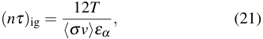

where _εα_ is the energy of the charged alpha-particle fusion product in the D-T fusion reaction. More generally, “ignition” has many different meanings in the ICF context.[33] The 1997 National Academies review of ICF[34] addressed the lack of consensus around the definition of ICF ignition by defining ignition as fusion energy produced exceeding the laser energy (i.e., _Q_ sci _>_ 1). More recently, the hot-spot conditions needed to initiate propagating burn in the colder, dense fuel shell (another definition of ignition) have been quantified.[35] These details are discussed further in Sec. IV B. 

![FIG. 15. Triple product vs. _T_ required to achieve indicated values of _Q_ fuel for MCF [Eq. (22)].](images/2105.10954.pdf-0011-05.png)

## **G. Fusion triple product and “p-tau”** 

The triple product ( _nT τE_ ) and p-tau ( _pτE_ ) are commonly used by the MCF community to quantify fusion performance in a single value. While less common in the ICF community, _pτ_ is sometimes used, and triple product ( _nT τ_ ) is typically used only in the context of comparing ICF to MCF.[31] In a uniform plasma with _n_ = _ni_ = _ne_ and _T_ = _Ti_ = _Te_ , the relationship between triple product and p-tau in both embodiments is _nT τ_ = 2[1] _[p][τ]_[and] _[ nT][τ][E]_[=][1] 2 _[p][τ][E]_[.] 

An expression for the MCF triple product is obtained by multiplying both sides of Eq. (16) by _T_ , 

TABLE III. Values of minimum _niT τE_ and corresponding _T_ for _Q_ fuel = 1 and _Q_ fuel = ∞ for different fusion fuels assuming _T_ = _Ti_ = _Te_ , based on Eq. (22) for D-T (see Appendix D for advanced fuels). 

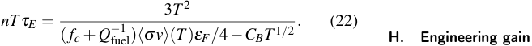

Figure 15 shows the _nT τE_ required to achieve a specified value of _Q_ fuel as a function of _T_ (see also Table III). Note that the minimum triple product needed to achieve ignition occurs at a lower _T_ than that of the minimum Lawson parameter. This lower _T_ is a better approximation of the intended _T_ of MCF experiments because it corresponds to the minimum pressure required to achieve a certain value of _Q_ fuel, and pressure (rather than Lawson parameter) is a more-direct experimental limitation of MCF. 

We emphasize the limitation of the triple product (or “ptau”) as a metric: it does not correspond to a unique value _Q_ fuel or _Q_ sci unless _T_ is specified. While _n_ and _τ_ in the Lawson parameter may be traded off in equal proportions, _T_ must be within a fixed range for an appreciable number of fusion reactions to occur. Appendix A provides a plot of achieved triple products and temperatures analogous to Fig. 2. Appendix D provides plots of _nT τE_ vs. _T_ for D-D, D-[3] He, and p-[11] B fusion. 

The previously defined _Q_ sci [Eq. (15)] is the ratio of power released in fusion reactions _PF_ to applied external heating power _P_ ext (see Fig. 11), encapsulating the physics of plasma heating, thermal and radiative losses, and fusion energy production. Based on conservation of energy in Fig. 11, we can rewrite 

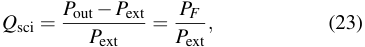

which is equivalent to Eq. (15). 

Similarly, the engineering gain, 

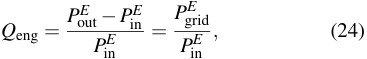

is the ratio of electrical power _P_ grid _[E]_[(delivered][to][the][grid)] to the input (recirculating) electrical power _P_ in _[E]_[used][to][heat,] 

sustain, control, and/or assemble the fusion plasma[36] (see Fig. 16). Some fusion designs do not recirculate electrical power but rather recirculate mechanical power (see Appendix E). For the case of electrical recirculating power it is straightforward to show that 

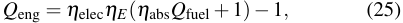

where _ηE_ , _η_ abs, and _η_ elec are the efficiencies of going from _P_ in _[E][→][P]_[ext][,] _[P]_[ext] _[→][P]_[abs][,][and] _[P]_[out] _[→][P]_ out _[E]_[,][respectively.][Note] that we have included the portion of _P_ ext that is _not_ absorbed by the plasma, i.e., (1 _− η_ abs) _P_ ext, in _P_ out; this is shown in Fig. 11 but not explicitly shown in Fig. 16. 

Finally, the “wall-plug” gain, 

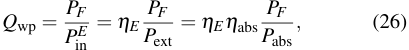

relates the total fusion power to the power drawn from the grid (i.e., the wall plug) to assemble, heat, confine, and control the plasma. This is a useful energy gain metric for all contemporary fusion experiments because they are not yet generating electricity. We regard the eventual demonstration of _Q_ wp = 1 (not _Q_ fuel or _Q_ sci = 1) as the so-called “Kitty Hawk moment” for fusion energy. 

Direct conversion from charged fusion products to electricity could be realized with advanced fusion fuels (e.g., D-[3] He and p-[11] B), which produce nearly all of their fusion energy in charged products. This could raise _η_ elec from approximately 40% to _>_ 80% and enable significantly higher _Q_ eng for a given _Q_ fuel or _Q_ sci. 

For D-T fusion with a tritium-breeding blanket, the 6Li(n, _α_ )T reaction to breed tritium is exothermic (releasing 4.8 MeV per reaction), thus amplifying _P_ out by a factor of approximately 1.15 depending on the blanket design. For the purposes of this paper, this factor can be considered to be absorbed into _η_ elec. 

Using _Q_ sci = _η_ abs _Q_ fuel, we can rewrite Eq. (25) as 

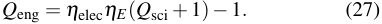

Because _Q_ sci encapsulates all the _plasma-physics aspects_ of both the absorption efficiency _η_ abs and fuel gain _Q_ fuel, it is instructive to plot the required combinations of _Q_ sci and _ηE_ , assuming _η_ elec = 0 _._ 4 (representative of a standard steam cycle and blanket gain), to achieve certain values of _Q_ eng (see Fig. 17). A convenient rule-of-thumb is that the gainefficiency product must exceed 10 for practical fusion energy, 

![FIG. 16. Conceptual schematic of a fusion power plant which recirculates electrical power. In this system _Q_ eng = _P_ grid _[E][/][P]_ in _[E]_[.]](images/2105.10954.pdf-0012-12.png)

TABLE IV. Typical efficiency values _ηE_ , _η_ abs, _η_ hs, and _η_ elec for different classes of fusion concepts. Note _η_ hs is only defined for ICF concepts pursuing hot spot ignition. Approximate values of _η_ abs and _η_ hs for direct and indirect drive ICF are from Ref. 37 and Ref. 32, respectively. 

|tively.||||
|---|---|---|---|
|Class|_ηE η_abs|_η_hs|_η_elec|
|MCF|0.7 0.9|-|0.4|
|MIF|0.9 0.1|-|0.4|
|Laser ICF (direct drive)|0.1 0.06|0.4|0.4|
|Laser ICF (indirect drive)|0.1 0.009|0.7|0.4|

![FIG. 17. Required combinations of _Q_ sci and _ηE_ in the system shown in Fig. 16 to permit values of _Q_ eng ranging from zero (i.e., _P_ grid _[E]_[=][ 0)] to ten (i.e., _P_ grid _[E]_[=][ 10] _[P]_ in _[E]_[), where] _[ η]_[elec][ =][ 0] _[.]_[4 is assumed.]](images/2105.10954.pdf-0012-16.png)

i.e., _Q_ sci _ηE ≥_ 10 (corresponding to _Q_ eng _≈_ 3 in Fig. 17), but of course the actual requirement depends on the required economics of the fusion-energy system. 

While the value of _η_ elec would be around 0.4 for a standard steam cycle for D-T fusion (and higher if an advanced power cycle is used), the values of _ηE_ and _η_ abs vary considerably depending on the class of fusion concept (see Table IV). For MCF/MIF, _ηE >_ 0 _._ 5 is expected (conservatively), meaning that _Q_ sci ≳ 20 is required. For laser-driven ICF, _ηE ∼_ 0 _._ 1 is expected, meaning that _Q_ sci ≳ 100 is required. For an eventual fusion power plant, the required _Q_ sci and _Q_ eng will depend on a number of factors including but not limited to market constraints (e.g., levelized cost of electricity and desired value of _P[E]_ grid[) and the maximum achievable values of] _[ η][E]_[,] _[ η]_[elec][.] 

In Sec. III B, we noted Lawson’s observation (in the context of his second scenario) that if a fraction _η_ of the plasma energy at the conclusion of the pulse is recovered as electrical or mechanical energy, the requirement on _nτ_ to achieve a given value of _Q_ fuel is reduced by a factor 1 _/_ (1 _− η_ ). In principle, this can be extended to recover _P_ out with an effi- 

![FIG. 18. Required combinations of _Q_ sci and _ηE_ in the system shown in Fig. 16 to permit values of _Q_ eng ranging from zero (i.e., _P_ grid _[E]_[=][ 0)] to ten (i.e., _P_ grid _[E]_[=][ 10] _[P]_ in _[E]_[), where] _[ η]_[elec][ =][ 0] _[.]_[95 is assumed.][Note that] at high _ηE_ and _η_ elec, net electricity generation ( _Q_ eng _>_ 0) is possible with _Q_ sci _<_ 1.](images/2105.10954.pdf-0013-01.png)

ciency _η_ elec and reinject the recirculating fraction with efficiency _ηE_ , thus relaxing the requirements on _Q_ sci to achieve a given _Q_ eng. This is shown in Fig. 18, which assumes a high recovery fraction _η_ elec = 0 _._ 95. If we also assume a high electricity to heating efficiency _ηE_ = 0 _._ 9, _Q_ eng = 0 _._ 3 (corresponding to net electricity) can be achieved with _Q_ sci = 0 _._ 5. While it may appear counter-intuitive that net electricity can be generated in a system with _Q_ sci _<_ 1, a high _η_ elec and _ηE_ mean that most of the recovered heating energy recirculates while most of the fusion energy is used for electricity generation. The lower-right quadrant Fig. 18 (corresponding to high reinjection efficiency) illustrates that that net electricity generation (i.e., _Q_ eng _>_ 0) is possible at values of scientific gain below break-even (i.e., _Q_ sci _<_ 1). 

## **IV. METHODOLOGIES FOR INFERRING LAWSON PARAMETER AND TEMPERATURE** 

It is not trivial to infer the component values of the Lawson parameter and temperature achieved in real experiments. Simplifying approximations must be made with certain caveats, both across (e.g., MCF vs. ICF) and within classes (e.g., tokamaks vs. mirrors within MCF) of fusion experiments. In this section, we describe the methodologies that we use to infer the component values of achieved Lawson parameters and temperatures for different fusion classes and concepts, and how the values can be meaningfully compared against each other. For all values reported here, we require that experimentally inferred values occur within a single shot or across multiple well-reproduced shots. An example that we would disqualify 

would be to combine the highest _Ti_ achieved in one shot with the highest _ni_ and _τE_ from a qualitatively different shot. 

## **A. MCF methodology** 

The analysis presented in Sec. III E assumes that _Ti_ = _Te_ and _ni_ = _ne_ , and that they are spatially uniform and time independent. In real experiments, these assumptions are generally not valid. Because diagnostic capabilities are finite, only a subset of the complete data (i.e., spatial profiles and time evolutions) are ever measured and published. Although many experiments were not aiming to maximize _ni_ , _Ti_ , and _τE_ as the goal, we include these experiments because they provide historical context. Furthermore, the data reported from one experiment may not be easily compared to data reported from another due to differences in definitions. In the remainder of this section, these issues are discussed, and uniform definitions are developed. 

## _**1. Effect of temporal profiles**_ 

Within a particular experiment, the maximum values of _ni_ , _Ti_ , and _τE_ may occur at different times. Where possible we choose the values of these quantities at a single point in time during a “flat-top” time period, the duration of which must exceed _τE_ . Even though the total pulse duration of some MCF experiments may be of similar magnitude to _τE_ , we only consider _τE_ in the Lawson parameter for MCF experiments (as opposed to the expression for _τ_ eff in Eq. 13) because we consider the progress towards energy gain in MCF to be limited by thermal-conduction losses and not pulse duration. 

In the literature, tables of parameters are commonly published that report the values of many parameters during such a flat-top time period. Following this convention, Tables VI and VII list parameters relevant to our analysis. The reported parameters are _Ti_ 0, _Te_ 0, _ni_ 0, _ne_ 0, and _τE[∗]_[.][Not][all][experiments] have published temporal evolution of these quantities. In the absence of such data, we use the values reported with the understanding that it is unknown if they occurred simultaneously during the shot (although, as discussed in the previous paragraph, they must occur in the same shot or in shots intended to be the same). This deficiency primarily occurs in experiments prior to 1970 or in small experiments with limited diagnostic capabilities and _niTiτE <_ 10[16] m _[−]_[3] keV s. 

## _**2. Effect of spatial profiles**_ 

To quantify the effect of nonuniform temperature and density spatial profiles on the requirements to achieve a certain value of _Q_ fuel, which we denote as _⟨Q_ fuel _⟩_ (brackets refer to volume-averaging over nonuniform profiles), the power balance of Eq. (11) becomes 

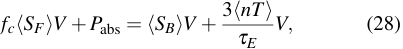

where power _densities_ are denoted with variables _S_ , and we assume _n_ = _ne_ = _ni_ (i.e., hydrogenic plasma without impurities) and _T_ = _Te_ = _Ti_ everywhere. Reported/inferred values of _P_ abs and _τE_ are already global, volume-averaged quantities. 

To quantify the profile effect on _SF_ , we introduce 

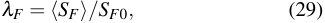

where _SF_ 0 is the fusion power density with spatially uniform _Ti_ 0 and _ni_ 0, and _⟨SF ⟩_ is the volume-averaged fusion power density of the nonuniform-profile case with peak values _Ti_ 0 and _ni_ 0. Similarly, 

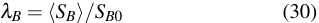

where _n_ 0 and _T_ 0 are the central/peak ion or electron densities and temperatures, respectively. The values of _νn_ and _νT_ adjust the sharpness of the peaks of the profiles. In the limit _νn →_ 0 and _νT →_ 0, the peak is infinitely broad and we recover the uniform-profile case. This approach accommodates a wide range of profiles.[38,39] 

From Eqs. (6) and (29), 

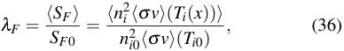

where the _Ti_ dependence of _⟨σ v⟩_ is shown explicitly, resulting in _λF_ being a function of the _Ti_ profile. From Eqs. (7) and (30), 

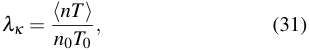

which quantify the nonuniform-profile modifications to the bremsstrahlung power density and thermal energy density, respectively. 

The result is a modified version of Eq. (11), where profile effects are captured in the terms _λF_ , _λB_ , and _λκ_ , 

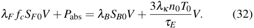

From this power balance of the nonuniform-profile case, the peak value of the Lawson parameter _n_ 0 _τE_ required to achieve a particular value of _⟨Q_ fuel _⟩_ as a function of _T_ 0 is 

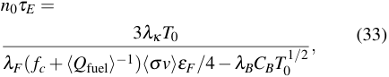

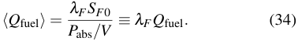

We adopt the approach of using the same peak (rather than average) values of density and temperature when evaluating _Q_ fuel (uniform spatial profiles) versus _⟨Q_ fuel _⟩_ (nonuniform spatial profiles), for the practical reasons that peak values are more commonly reported in the literature and that profiles are often not reported. When using the same peak rather than profile-averaged values, spatially nonuniform profiles increase rather than decrease the requirements on peak density and temperature for achieving a given _Q_ fuel. 

Next we consider representative profiles in order to quantify the differences between _Q_ fuel and _⟨Q_ fuel _⟩_ for cylindrical and toroidal geometries. A wide variety of temperature and density profiles have been observed in fusion experiments. These profiles are typically modeled as functions of normalized radius _x_ = _r/a_ , where _a_ is the device radius for cylindrical systems and the minor radius for toroidal systems with circular cross section. Commonly used and flexible models of density and temperature profiles are 

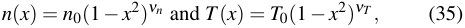

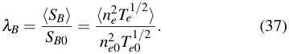

For a cylinder or large-aspect-ratio torus (i.e., _R/a ≫_ 1, where _R_ and _a_ are the major and minor radii, respectively) with circular cross section and the profiles of Eq. (35), we use the expressions in Appendix F to obtain 

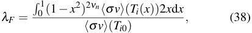

which may be evaluated numerically for any tabulated or parameterized values of _⟨σ v⟩_ ( _Ti_ ), 

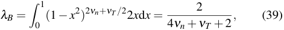

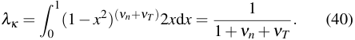

For a torus with circular cross section and arbitrary values of _R/a_ , _λF_ , _λB_ , and _λκ_ must be evaluated numerically (see Appendix F). For profiles with large Shafranov shift, i.e., magnetic axis shifted toward larger _R_ , the reduction of fusion power due to profile effects (and hence _λF_ ) is mitigated because the high-temperature region occupies a larger fraction of the total volume. Therefore the profiles considered here represent a likely worst-case scenario and provide a lower bound on _λF_ . 

To demonstrate the effect of nonuniform profiles on the contours of _⟨Q_ fuel _⟩_ compared to _Q_ fuel, we consider two sets of profiles. The first is a parabolic profile with _νT_ = 1 and _νn_ = 1, which is a simple approximation of the profiles in tokamaks.[6] The second is a more strongly peaked temperature profile with _νT_ = 3 and a broader density profile with _νn_ = 0 _._ 2, which are representative of profiles in the advanced tokamak or reversed-field pinch.[40] For both sets of profiles, we assume _T_ = _Ti_ = _Te_ and _n_ = _ni_ = _ne_ (impurity-free hydrogenic plasma). Figures 19 and 20 show these two sets of profiles, respectively, along with their corresponding values of _λF_ vs. _Ti_ 0 and resulting adjustments to the _Q_ fuel contours. For both sets of profiles (Figs. 19 and 20), nonuniform 

profiles [dashed lines in panel (c)] increase the peak Lawson parameter needed to achieve a particular value of _⟨Q_ fuel _⟩_ for temperatures below approximately 50 keV. Additionally, the ideal ignition temperature, defined by Eq. (8), is increased. At high temperatures approaching 100 keV, where fusion power exceeds bremsstrahlung by a large factor (see Fig. 6), the adjustment is equal to the ratio _λκ /λF_ , which is close to unity in the case of the parabolic profiles, and drops below unity in the case of the peaked and broad profiles. At intermediate temperatures, _λF_ , _λB_ , and _λκ_ all contribute to the modification of _⟨Q_ fuel _⟩_ compared to _Q_ fuel. 

## _**3. Effect of impurities (and non-hydrogenic plasmas)**_ 

Real fusion experiments must contend with the effect of ions with charge state _Z >_ 1. These may be from helium ash, impurities from the first wall, or advanced fuels. These impurities increase the bremsstrahlung radiation by a factor 

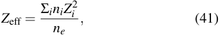

where _i_ is summed over all ion species in the plasma. Additionally, impurities increase the electron density relative to the ion density by a factor of the mean charge state of the entire plasma, 

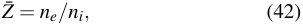

which reduces _ni_ and therefore _PF_ at fixed pressure. 

Using these definitions along with the generalized expression for bremsstrahlung, 

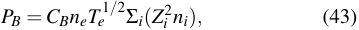

Eq. (33) becomes 

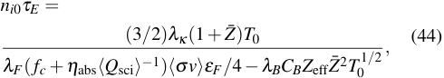

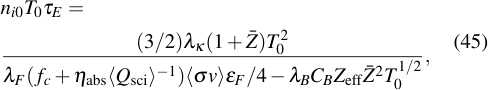

where _λF_ , _λB_ , and _λκ_ are unchanged because _Z_ eff and _Z_[¯] are treated as volume-averaged quantities. We have also replaced the _⟨Q_ fuel _⟩[−]_[1] term with _η_ abs _⟨Q_ sci _⟩[−]_[1] , which allows us to include the effect of absorption efficiency. 

Each experiment has different values of _λF_ , _λB_ , _λκ_ , _Z_[¯] , _Z_ eff, and _η_ abs, and therefore each experiment has different _⟨Q_ sci _⟩_ contours. It is not feasible to show unique _⟨Q_ sci _⟩_ contours for each experiment in Figs. 2, 3, and 25. Figure 21 shows finitewidth _⟨Q_ sci _⟩_ contours of the peaked and broad profiles whose lower and upper limits correspond to low-impurity ( _Z_ eff = 1 _._ 5, 

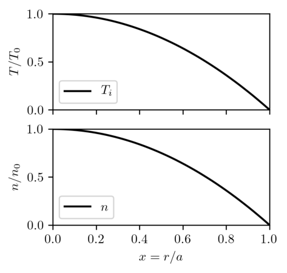

(c) 

(c) 

_Z_ ¯ = 1 _._ 2) and high-impurity ( _Z_ eff = 3 _._ 4, _Z_ ¯ = 1 _._ 2) models, respectively. These impurity levels correspond to the range of impurity levels considered for SPARC[41] and ITER.[42] For both the high and low-impurity models, we assume _T_ = _Ti_ = _Te_ and _η_ abs = 0 _._ 9. The finite ranges of _⟨Q_ sci _⟩_ aim to account for the main features and uncertainties of a future experimental device that will achieve _⟨Q_ sci _⟩ >_ 1, and therefore we show finite-width _⟨Q_ sci _⟩_ contours in Fig. 2 (despite the _Q_ sci labels in the legend). We emphasize that the finite width of the _⟨Q_ sci _⟩_ contours are merely illustrative of the effects of profiles and impurities and of the approximate values of _⟨Q_ sci _⟩_ that might be achieved by SPARC or ITER. To predict _⟨Q_ sci _⟩_ with higher precision would require detailed analysis and simulations. 

![FIG. 21. Finite-width _⟨Q_ sci _⟩_ contours vs. peak Lawson parameter and _T_ 0 bounded by low-impurity ( _Z_ eff = 1 _._ 5, _Z_[¯] = 1 _._ 2) and highimpurity ( _Z_ eff = 3 _._ 4, _Z_[¯] = 1 _._ 2) cases, for peaked and broad spatial profiles ( _νT_ = 3, _νn_ = 0 _._ 2). These assumptions are made in plotting the _Q_ sci contours of Figs. 2, 3, and 25.](images/2105.10954.pdf-0016-09.png)

## _**4. Inferring peak from volume-averaged values**_ 

When only volume-averaged values of density and temperature are reported, we infer the peak values from an estimated value of the peaking, _T_ 0 _/⟨T ⟩_ and _n_ 0 _/⟨n⟩_ , respectively. Detailed empirical models of peaking exist for predicting the profiles of future experiments.[43–46] However, for the purposes of this paper, we have chosen peaking values on a per-concept basis, the values of which are indicated in Table V. Only concepts for which peak values must be inferred from reported volume-averaged values, along with citations for those values, are listed in Table V. In Tables VI and VII, we append a superscript asterisk ( _[∗]_ ) to peak values inferred from reported volume-averaged quantities. 

TABLE V. Peaking values required to convert reported volumeaveraged quantities to peak value quantities. 

|Concept|_T_0_/⟨T⟩n_0_/⟨n⟩_Reference|_T_0_/⟨T⟩n_0_/⟨n⟩_Reference|
|---|---|---|
|Tokamak|2.0|1.5 46|
|Stellarator|3.0|1.0 47|
|Spherical Tokamak|2.1|1.7 48|
|FRC|1.0|1.3 49 and 50|
|RFP|1.2|1.2 40|
|Spheromak|2.0|1.5 51|

## _**5. Inferring ion quantities from electron quantities**_ 

When only _Te_ and not _Ti_ is reported, we cannot assume _Ti_ = _Te_ in calculating the triple product without further consideration. If the thermal-equilibration time is much shorter than the plasma duration, and assuming there are no other effects that would give rise to _Ti ̸_ = _Te_ , then we can assume _Ti_ = _Te_ . In these cases we append a superscript dagger ([†] ) to the inferred value of _Ti_ in Tables VI and VII. In cases where both _Ti_ and _Te_ are reported in MCF experiments, we use the reported _Ti_ . 

When only _ne_ but not _ni_ is reported, we assume _ni_ = _ne_ for D-T and D-D plasmas. In such cases we append a superscript double dagger ([‡] ) to the inferred value of _ni_ in Tables VI and VII. 

## _**6. Accounting for transient heating**_ 

All experiments experience a transient start-up phase during which a portion of the heating power goes into raising the plasma thermal energy _Wp_ = 3 _nTV_ (assuming _T_ = _Ti_ = _Te_ and _n_ = _ni_ = _ne_ ). There are two self-consistent approaches for deriving an expression for _Q_ fuel that accounts for the effect of transient heating d _Wp/_ d _t_ . In the remainder of this subsection, we closely follow Ref. 52. 

The first approach is to group the transient term with _P_ abs in the instantaneous power balance which effectively treats the transient term as a reduction in the externally applied and absorbed heating power, 

In this approach, the definition of _Q_ fuel is modified, i.e., 

From here, we derive an expression for the Lawson parameter following the same steps as Sec. III E, which results in an analogous expression to Eq. (16) but with _Q_ fuel replaced by _Q[∗]_ fuel[,] 

From Eq. (46), 

This approach, defined by Eqs. (47)–(50), is the one used by JET and JT-60. 

The second approach is to treat the transient heating term as a “loss” term alongside thermal conduction, i.e., 

We then define a modified energy confinement time _τE[∗]_[which] characterizes thermal conduction and transient heating power. 

Combining the latter with Eqs. (50) and (51), 

From this point, we derive an expression for the Lawson parameter following the same steps as Sec. III E, which results in an analogous expression to Eq. (16) but with _τE_ replaced by _τE[∗]_[,] 

In this formulation, the definition of instantaneous _Q_ fuel is unchanged from the steady-state value of Eq. (14), and fuel breakeven occurs at _Q_ fuel = 1, regardless of the value of d _Wp/_ d _t_ . This approach, defined by Eqs. (53), (54), and (15), is the one used by TFTR and consistent with Lawson’s original formulation. 

For the JET/JT-60 approach, fuel breakeven does not necessarily occur at _Q[∗]_ fuel[=][ 1 but rather occurs at a value of] _[ Q][∗]_ fuel that depends on the value of d _Wp/_ d _t_ . The TFTR/Lawson approach keeps the definition of instantaneous _Q_ fuel the same as the steady-state _Q_ fuel, and fuel breakeven always occurs at _Q_ fuel = 1 regardless of the transient-heating value. Because a key objective of this paper is to chart the progress of many different experiments toward and beyond _Q_ fuel = 1, we use the TFTR/Lawson definition for which _Q_ fuel = 1 means the same thing across different MCF experiments. In practice, this means we use _τE[∗]_[and Eq. (54) for all MCF experiments. When] _τE_ and d _Wp/_ d _t_ are reported and d _Wp/_ d _t_ is nonzero (e.g., JET and JT-60), we calculate and use _τE[∗]_[,][indicating][such][cases] with a superscript hash ([#] ) in Tables VI and VII. Some TFTR publications report _τE_ , requiring the conversion step, and thus we append a superscript hash for those cases as well. 

## **B. ICF methodology** 

Direct measurements of plasma parameters are more challenging for ICF. Commonly measured parameters in ICF are fuel areal density _ρR_ (via neutron downscattering), _Ti_ 

![FIG. 22. Representation of an ICF capsule implosion and hot-spot creation with instability growth: (a) dense fuel shell, with radius _R_ and thickness ∆, at maximum shell velocity _Vi_ during implosion, (b) fuel assembly at stagnation with the “hot spot” (blue) with effective radius _Rs_ , surrounded by the cold, dense fuel (grey). Rayleigh-Taylor instabilities are shown. If the hot spot reaches high-enough _niτ_ and _Ti_ , then it can potentially generate enough fusion energy to initiate a propagating burn into the surrounding cold shell.](images/2105.10954.pdf-0018-01.png)

and “burn duration” (via neutron time-of-flight), and neutron yield (via various types of neutron detectors). Some experiments report an inferred stagnation pressure _p_ stag based on statistical analysis of other measured quantities and simulation databases. 

Identifying the requirements for ignition of an ICF capsule is difficult. The analysis presented in Sec. III F assumes an idealized ICF scenario. Real ICF experiments must contend with instabilities, impurities, non-zero bremsstrahlung and thermal-conduction losses, and other factors that make it more difficult to achieve ignition. For the highest-performing ICF experiments considered here (NIF, OMEGA), a two-stage approach to ignition is pursued, i.e., ignition of a central lowerdensity “hot spot” followed by propagating burn into the surrounding colder, denser fuel, as depicted in Fig. 22. Because of the low value of _nabs_ inherent in these experiments, this two-stage process is required to achieve _Q_ sci _>_ 1. Therefore, we consider both ignition of the hot spot and a propagating burn in the dense fuel when we refer to “ignition” in this section. 

Below we describe two methodologies used in this paper for inferring the Lawson parameter _nτ_ and triple product _nT τ_ for cases in which pressure is or is not experimentally inferred, respectively. 

## _**1. Inferring Lawson parameter and triple product without reported inferred pressure**_ 

For ICF experiments that do not report experimentally inferred values of fuel pressure (i.e., rows with “–” in the _p_ stag column of Table VIII), we employ the methodology of Betti 

_et al._[31] to infer _niτ_ from other measured ICF experimental quantities. Here, we state the key logic and equation of this methodology for the convenience of the reader, but we refer the reader to Ref. 31 for further details, equation derivations, and justifications. It is important to note that Ref. 31 makes a simplifying assumption that thermal-conduction and radiation losses are negligible (on the timescale of the fusion burn) because of the insulating effects of the dense shell of an ICF target capsule, meaning that Lawson parameters and triple products inferred via this method should be considered as upper bounds. 

The ICF-capsule shell is modeled as a thin shell with thickness ∆ _≪ R_ , where _R_ is the shell radius, as illustrated in Fig. 22. A fraction of the peak kinetic energy of the shell is assumed to be converted to thermal pressure in the hot spot at stagnation. An _upper bound_ on _τ_ is obtained based on the time it takes for the stagnated shell (at peak compression) to expand a distance of order its inner radius _Rs_ . Significant 3D effects arising from Rayleigh-Taylor-instability spikes and bubbles at the interface of the shell and hot spot reduce the effective hot-spot volume by a “yield-over-clean” factor _YOC[µ]_ , where _µ ∼_ 0 _._ 4–0.5 is inferred from two simulation databases.[53] With these and other simplifying assumptions, Betti _et al._[31] obtain 

with measured total areal density ( _ρR_ )[no] tot _[ α]_ (n)[in][g cm] _[−]_[2][,][and] measured “burn-averaged” ion temperature _Tn_[no] _[ α]_ in keV. The superscript “no _α_ ” refers to experimental measurements made when _α_ heating is not an appreciable effect (and _α_ heating is turned off in simulations). For ICF experiments without reported values of hot-spot pressure, Eq. (55) is used to plot achieved ICF values of Lawson parameters and triple products, where the unit [atm s] is multiplied by 6 _._ 333 _×_ 10[20] keV m _[−]_[3] atm _[−]_[1] to convert to [m _[−]_[3] keV s]. Dividing the triple product by _T_ gives the Lawson parameter _nτ_ . 

## _**2. Inferring Lawson parameter from inferred pressure and confinement dynamics**_ 

When the inferred stagnation pressure _p_ stag and the duration of fuel stagnation _τ_ stag are reported, the pressure times the confinement time _τ_ can be calculated directly. However, following Christopherson,[54] three adjustments are made to _τ_ stag, which is defined as the full-width half-maximum (FWHM) of the neutron-emission history (i.e., “burn duration”), to obtain an approximation for _τ_ . The first adjustment is that, for marginal ICF ignition, only alphas produced before bang time (time of maximum neutron production) are useful to ignite the hot spot because, afterward, the shell is expanding and the hot spot is cooling, reducing the reaction rate; this introduces a factor of 1/2. The second adjustment is that only a fraction of fusion alphas are absorbed by the hot spot; this factor is estimated to be 0.93. The third adjustment is that, to initiate a propagating burn of the surrounding fuel, an additional factor of 0.71 is applied to account for the dynamics of alpha heating of the cold shell. Applying these three corrections results in 

_τ ≈ τ_ stag _/_ 3 and 

The only exception to this approach is the FIREX experiment, for which we estimate the value of _p_ stag _τ_ directly from the reported values. 

## _**3. Adjustments to the required values of Lawson parameter and temperature required for ignition**_ 

The ignition requirement derived in Sec. III F ignores a number of factors that increase the requirements for ignition of an ICF capsule. We consider these effects to be incorporated in reductions to _τ_ in the previous subsection. Thus, no further adjustments are made to the contours of constant _Q_ sci defined by Eq. (20). 

## _**4. Differences between ICF and MCF**_ 

It is not straightforward to compare the achieved Lawson parameters and triple-product values between ICF and MCF. While a quantitative approach can be taken via the ignition parameter _χ_ described in Ref. 31, the approach taken here is qualitative and is reflected in the different _Q_ sci contours for ICF and MCF in Figs. 2, 25, and 3. 

Firstly, the achieved triple product for ICF is higher than for MCF in part because of two assumptions made in their inference. Following Ref. 31, we assume in ICF that there are no bremsstrahlung radiation losses due to trapping by the pusher (with a high-enough areal density to be opaque to x- rays) and that the fuel hot-spot pressure is spatially uniform. These assumptions lead to higher values for the inferred Lawson parameter and triple product. 

Secondly, whereas _P_ ext and _P_ abs differ by only a factor of order unity in MCF,[36] they differ by a factor of ≳ 50 in ICF (see Table IV). This is due to the low conversion efficiency from applied laser energy to absorbed fuel energy. Thus, while both MCF[28] and ICF[29] have achieved _Q_ sci _∼_ 0 _._ 7, ICF has necessarily achieved a higher value of _Q_ fuel compared to MCF. 

Note further that the horizontal line representing _Q[ICF]_ sci[=] ∞ in Fig. 3 (corresponding to the _nT τ_ value of the contour at 4 keV) is at a higher value than the minimum _nT τ_ value of the corresponding contour in Fig. 25. This is because _Ti_ in laser ICF experiments (prior to onset of significant fusion) is limited by the maximum implosion velocity at which the shell becomes unstable, corresponding to a maximum _Ti_ of about 4 keV. Thus, marginal onset of ignition corresponds to the required _nT τ_ value at approximately 4 keV. In the case of NIF N210808, which exceeded the threshold for onset of ignition[55] , _Ti_ increased due to self heating and _τ_ decreased because of the increased pressure. These effects resulted in a slightly _lower_ triple product compared with previous nonignition results, which is visible in Fig. 25. 

## **C. MIF/Z-pinch methodology** 

## _**1. MagLIF**_ 

The Magnetized Liner Inertial Fusion (MagLIF) experiment[56] compresses a cylindrical liner surrounding a pre-heated and axially pre-magnetized plasma. The Z-machine at Sandia National Laboratory supplies a large current pulse to the liner along its long axis, compressing it in the radial direction. While the solid liner makes diagnosing MagLIF plasmas more difficult, it is still possible to extract the parameters needed to estimate the Lawson parameter and triple product. The burn-averaged _Ti_ at stagnation is measured by neutron time-of-flight diagnostics. The spatial configuration of the plasma column at stagnation is imaged from emitted x-rays. From this spatial configuration and a model of x-ray emission, the effective fuel radius is inferred. The stagnation pressure is inferred from a combination of diagnostic signatures. Given the plasma volume, burn duration, and temperature, the pressure was inferred by setting the pressure and mix levels to simultaneously match the x-ray yield and neutron yield. In the emission model used to determine the spatial extent of the stagnated plasma, the pressure in the stagnated fuel is assumed to be spatially constant and the temperature and density profiles are assumed to be inverse to each other.[57] For our purposes, we infer an average _ni_ from the stagnation pressure and the measured burn-averaged _Ti_ . 

Finally, the burn time, the duration during which the fuel assembly is inertially confined and hard x-rays (surrogates for fusion neutrons) are emitted, is measured. This duration is an upper bound on _τ_ , and in practice _τ_ is estimated to be equal to it. Data for MagLIF are shown in Table VIII and plotted in Figs. 2, 3, and 25. 

## _**2. Z pinch**_ 

Z-pinch experiments were one of the earliest approaches to fusion because no external magnetic field is required for confinement. This simplifies the experimental setup and reduces costs. Figure 23 shows a representative diagram of a Z- pinch plasma. While fusion neutrons were detected in some of the earliest Z-pinch experiments, those fusion reactions were found to be the result of plasma instabilities generating nonthermal beam-target fusion events (see pp. 91–93 of Ref. 58), which would not scale up to energy breakeven. More recently, however, stabilized Z-pinch experiments have provided evidence of sustained thermonuclear neutron production.[59,60] 

Z-pinch plasmas exhibit profile effects perpendicular to the direction of current flow so the profile considerations discussed in Section IV A apply to Z pinches as well. The radial density profile of Z pinches is typically described by a Bennett-type profile[61] of the form _n_ ( _r_ ) = _n_ 0 _/_ [1 + ( _r/r_ 0)[2] ][2] and illustrated in Fig. 24. 

Assuming _T_ = _Ti_ = _Te_ , _n_ = _ni_ = _ne_ , and a uniform profile for the plasma temperature, the thermal energy of a Z-pinch 

In other Z-pinch approaches like the dense plasma focus (DPF), fusion yields occur from a combination of non-Maxwellian ion energy distributions and thermal ion populations.[62] Because thermal temperatures and _τE[∗]_[are typi-] cally not well characterized in such approaches, it is not feasible to report a reliable, achieved Lawson parameter or triple product. Furthermore, fusion concepts with strong beamtarget components may not be scalable to _Q_ fuel _>_ 1.[25] 

## _**3. Other MIF approaches**_ 

For other MIF approaches,[63] e.g., liner or flux compression of FRCs or spheromaks, it is difficult to rigorously measure _τE[∗]_[due to limited access.][A few attempts to quantify] _[ τ] E[∗]_[based] on measurable or calculable parameters, such as particle confinement time _τN_ , have been proposed.[50] In particular, we estimate _τE[∗]_[of FRCs to be] _[ τ][N][/]_[3 (for both MIF and MCF).] 

## **V. SUMMARY AND CONCLUSIONS** 

FIG. 24. Bennett-type density profile. In contrast to the parabolic profiles, the plasma extends beyond the effective radius _r_ 0. 

plasma can be estimated as 

The power applied is 

where _I_ is the Z-pinch current and _Vp_ is the voltage across the plasma driving the current along the long axis. Assuming no self heating and that thermal conduction is the primary source of energy loss, the _τE[∗]_[for the stabilized Z-pinch is] 

and the Lawson parameter for a stabilized Z-pinch is 

However, in practice _Vp_ may not be measured directly, and the voltage across the power supply driving the Z-pinch may overestimate _Vp_ . Therefore, evaluations of _τE[∗]_[that][substitute] the power supply voltage for _Vp_ (as done for FuZE[59,60] ) provide only a lower bound on _τE[∗]_[.][An upper bound on] _[ τ] E[∗]_[is the] flow-through time of the Z-pinch. Our reported value is the lower of the two. 

The combination of achieved Lawson parameter _nτ_ or _nτE_ and fuel temperature _T_ of a thermonuclear-fusion concept are a rigorous scientific indicator of how close it is to energy breakeven and gain. In this work, we have compiled the achieved Lawson parameters and _T_ of a large number of fusion experiments (past, present, and projected) from around the world. The data are provided in multiple tables and figures. Following Lawson’s original work, we provided a detailed review, re-derivation, and extension of the mathematical expressions underlying the Lawson parameter (and the related triple product) and four ways of measuring energy gain ( _Q_ fuel, _Q_ sci, _Q_ wp, and _Q_ eng), and explained the physical principles upon which these quantities are based. Because different fusion experiments report different observables, we explained precisely how we infer both electron and ion densities and temperatures and the various definitions of confinement time that are used in the Lawson-parameter and triple-product values that we report, including accounting for the effects of spatial profile shapes (through a peaking factor) and a range in the level of impurities in the plasma fuel. All data reported in this paper are based on the published literature or are expected to be published shortly. 

The key results of this paper are encapsulated in Figs. 2, 3, and 25, which show that (1) tokamaks and laser-driven ICF have achieved the highest Lawson parameters, triple products, and _Q_ sci _∼_ 0 _._ 7; (2) fusion concepts have demonstrated rapid advances in Lawson parameters and triple products early in their development but slow down as values approach what is needed for _Q_ sci = 1; (3) private fusion companies pursuing alternate concepts are now exceeding the breakout performance of early tokamaks; and (4) at least three experiments may achieve _Q_ sci _>_ 1 within the foreseeable future, i.e., NIF and SPARC in the 2020s and ITER by 2040. 

The reason for item (2) in the preceding paragraph is commonly attributed to the fact that experimental facilities became extremely expensive (e.g., $3.5B for NIF according 

to the U.S. Government Accountability Office, and exceeding US$25B for ITER) for making continued and required advances toward energy gain. However, there are two reasons that other approaches or experiments might potentially achieve _commercially relevant_ energy breakeven and gain on a faster timescale. Firstly, most of the other paths being pursued (i.e., privately funded development paths for tokamaks, stellarators, alternate concepts, and laser-driven ICF) have lower cost as a key objective, where experiments along the development path are envisioned to have much lower costs than NIF and ITER. Secondly, the mature fusion and plasma scientific understanding and computational tools, as well as many fusion-engineering technologies, developed over 65+ years of controlled-fusion research do not need to be reinvented and need only be leveraged in the development of the alternate and privately funded approaches. 

High values of Lawson parameter and triple product, which are required for energy gain, are a necessary but not sufficient condition for commercial fusion energy. Additional necessary conditions include attractive economics and social acceptance, including but not limited to considerations of RAMI (reliability, accessibility, maintainability, and inspectability) and the ability to be licensed under an appropriate regulatory framework. These necessary conditions require additional technological attributes beyond high energy gain, e.g., (1) a fusion plasma core that is compatible with both surrounding materials and subsystems that survive the extreme fusion particle, heat, and radiation flux, and (2) a sustainable fuel cycle (e.g., tritium breeding, separation, and processing technologies for D-T fusion). Therefore, while this paper’s primary objective is to explain and highlight the achieved Lawson parameters (and triple products) of many fusion concepts and experiments as a measure of fusion’s progress toward energy breakeven and gain, these are not the only criteria for justifying continued pursuit of and investment into a given fusion concept, including concepts using advanced fusion fuels. 

## **Appendix C: Effect of mitigating bremsstrahlung losses** 

If bremsstrahlung radiation losses are mitigated, e.g., in pulsed ICF[19] or MIF[63,133] approaches with an optically thick pusher,[134,135] then the _Q_ fuel and _Q_ sci contours of Figs. 12 and 14 can be modified. Figure 26 illustrates the effect of arbitrarily reducing _PB_ by a factor of 2, i.e., by replacing _CB_ with _CB/_ 2 in Eqs. (16) and (22). 

## **Appendix D: Lawson parameters for advanced fusion fuels** 

The main body of this paper focuses on D-T fusion because it has the highest maximum reactivity occurring at the lowest temperature compared to all known fusion fuels. As a result, the required D-T Lawson parameters and triple products to reach high _Q_ fuel are the lowest and most accessible. However, D-T fusion has two major drawbacks: (i) it produces 14-MeV neutrons that carry 80% of the fusion energy, and (ii) the tritium must be bred (because it does not occur abundantly in nature due to a 12.3-year half life) and be continuously processed and handled safely. 

Advanced fuels, such as D-[3] He, D-D, and p-[11] B, mitigate these drawbacks to different extents.[136] However, because their peak reactivities are all lower and occur at higher temperatures compared to D-T, the required Lawson parameters and triple products for these advanced fuels to achieve equivalent values of _Q_ fuel are much higher. 

Furthermore, at the high temperatures required for advanced fuels, relativistic bremsstrahlung effects become significant. We utilize the relativistic-correction approximation to Eq. (43) from Ref. 137, 

## **Appendix A: Plot of triple products vs.** _Ti_ 

Figure 25 shows achieved triple products versus _Ti_ , based on the same data points used in Fig. 2. 

## **Appendix B: Data tables** 

Table VI provides numerical values of the data for tokamaks, spherical tokamaks, and stellarators. Table VII provides numerical values of the data for “alternate” MCF concepts, i.e., not tokamaks or stellarators. Table VIII provides numerical values of the data for ICF and MIF experiments. We group lower-density and higher-density MIF approaches with MCF alternate concepts (Table VII) and ICF (Table VIII), respectively. 

To quantify the Lawson-parameter and triple-product requirements for advanced fuels with non-identical reactants and reaction products that are immediately removed from the plasma (e.g., D-[3] He and p-[11] B without ash buildup or subsequent reactions), we first generalize the expression for _nτE_ [Eq. (16)] to account for the effect of relativistic bremsstrahlung and the reaction of two ion species with charge per ion _Z_ 1 and _Z_ 2, ion number densities _n_ 1 and _n_ 2, and relative densities _k_ 1 = _n_ 1 _/ne_ and _k_ 2 = _n_ 2 _/ne_ , respectively. 

A more detailed treatment of advanced fuels would need to consider scenarios in which _Te < Ti_ and account for an additional term in the power-balance equation for ion energy transfer to electrons. Maintaining _Te ≪ Ti_ has the advantage of reduced bremsstrahlung (especially at high _Ti_ ) and lower plasma pressure for a given _Ti_ . The challenge of such a scenario is maintaining _Ti > Te_ for a sufficient duration of time and with acceptable additional input power. In this section, we only consider _T_ = _Ti_ = _Te_ , except in the discussion of Fig. 28. 

24 

26 

Eq. (22) becomes 

or equivalently, 

where we have multiplied both sides of Eq. (D4) by ( _k_ 1 + _k_ 2) = (2 _Z_ 1) _[−]_[1] + (2 _Z_ 2) _[−]_[1] . This expression ignores synchrotron radiation losses, which may become important at the very high temperatures required to reach Lawson conditions for advanced fuels in magnetically confined systems. 

## **1. D-**[3] **He** 

Accounting for the above, 

where _Z_ eff = Σ _jn jZ_[2] _j[/][n][e]_[,][and] _[j]_[is][summed][over][the][different] reactant species. 

The relative density for each ion species _j_ that maximizes[138] fusion power for a fixed value of _n_[2] _e_[is] _[k][j]_[=] 1 _/_ (2 _Z j_ ) and _Z_ eff = ( _Z_ 1 + _Z_ 2) _/_ 2. Assuming this condition, 

The D-[3] He fusion reaction has the advantage that its primary reaction, 

is aneutronic, where the _α_ is a[4] He ion. However,[3] He is not abundant on earth and must be bred via other reactions or mined from the moon, both of which involve additional complexity and cost. Also, D-[3] He will not be completely aneutronic because of D-D reactions. The requirement for ignition of D-[3] He ignoring side D-D reactions is _niT τE[∗][≥]_[5] _[.]_[2] _[ ×]_[ 10][22][m] _[−]_[3][ keV s][at][68][keV][(see][Fig.][27),][18] times higher than for D-T. 

## **2. p-**[11] **B** 

The p-[11] B fusion reaction has the advantage that its reactants are abundant on earth, and the reaction products are three electrically charged _α_ particles, potentially allowing for direct energy conversion to electricity. However, this reaction requires temperatures around 100 keV, at which bremsstrahlung radiation losses per unit volume exceed fusion power density, and ignition is not possible for a p-[11] B plasma where _Te_ = _Ti_ , as shown in Fig. 28, which uses the parametrized p-[11] B fusion reactivity from Ref. 23. The boron and proton concentrations are set to maximize fusion power for a fixed electron density as described earlier in this section. Also shown is the effect of reduced bremsstrahlung if _Te_ is maintained at levels below _Ti_ . We are neglecting the issue of the ion-electron thermal equilibration time here. Figure 29 shows that only modest values of _Q_ fuel are physically possible for _Te_ = _Ti_ , at triple products three orders of magnitude higher than that of D-T. 

However recent work[139] points to a higher reactivity, and given certain assumptions, high- _Q_ fuel operation up to and including ignition may be theoretically possible. 

![FIG. 27. Required (a) Lawson parameters and (b) triple products vs. _Ti_ to achieve the indicated values of _Q_ fuel for D-[3] He (assuming _T_ = _Te_ = _Ti_ ).](images/2105.10954.pdf-0027-04.png)

## **3. Fully catalyzed D-D** 

![FIG. 28. Charged-particle fusion power density _Pc_ (purple line) and bremsstrahlung power density _PB_ for various ratios of _Te/Ti_ vs. _Ti_ for p-[11] B, showing that _PB_ always exceeds _Pc_ when _Te_ ≳ _Ti/_ 3. This plot uses the parameterized p-[11] B reactivity in Ref. 23. Updated, higher p-[11] B fusion cross sections[139] suggest that ignition may be possible for p-[11] B.[137]](images/2105.10954.pdf-0027-07.png)

The reaction paths are 

with 62% of the 43.2 MeV released in charged particles (compared with only 20% for D-T). 

Note that there are other forms of “catalyzed D-D” which go by different names in different contexts. For example extraction of tritium before the subsequent D-T reaction occurs is sometimes called “[3] He double-catalyzed D-D”.[141] Here we only consider the steady-state reaction path where[3] He and T react with D at the same rate as they are created in each branch of the D-D reaction. Furthermore, we assume an idealized scenario without synchrotron radiation and that the “ash” _α_ particles and protons immediately exit after depositing their energy and comprise a negligible fraction of ions in the plasma. Lastly, we assume that D is added at the same rate as it is consumed and that _T_ = _Ti_ = _Te_ . 

The ion number density is the sum of the constituent ion number densities, 

The D-D fusion reaction has the advantage that its sole reactant is abundant on earth. In the fully catalyzed D-D reaction,[140,141] the T and[3] He produced as reaction products undergo subsequent reactions with D, releasing more energy. 

and the electron density is, 

![FIG. 29. Required (a) Lawson parameters and (b) triple products vs. _Ti_ to achieve values of _Q_ fuel assuming _T_ = _Ti_ = _Te_ , for p-[11] B based on the p-[11] B fusion reactivity from Ref. 23.](images/2105.10954.pdf-0028-04.png)

The total fusion power density is the sum of the power released in its four constituent reactions, 

The bremsstrahlung power density is 

and from Eq. (41), 

The power lost to thermal conduction per unit volume is 

Defining _χh_ and _χt_ as the number density ratios of _n_ 3He to _n_ D and _n_ T to _n_ D respectively, 

From the steady-state power balance of Eq. (11) and the above, the Lawson parameter required to achieve fuel gain _Q_ fuel at _Ti_ is, 

with 

Requiring that the rate of production of[3] He and T are consumed at the same rate as they are produced, 

Rearranging gives the _T_ -dependent, steady-state number density of[3] He and T ions, respectively, 

The requirement for ignition of catalyzed D-D is _niT τE[∗][≥]_ 1 _._ 1 _×_ 10[23] m _[−]_[3] keV s at _T_ = 52 keV (see Fig. 30), 38 times higher than required for D-T. 

![FIG. 31. Required (a) Lawson parameters and (b) triple products vs. _T_ to achieve _Q_ fuel = ∞ (solid lines), _Q_ fuel = 1 (dashed lines), and _Q_ fuel = 0 _._ 5 (dotted line, p-[11] B only) for the indicated fuels, assuming _T_ = _Te_ = _Ti_ . Neither fuel breakeven ( _Q_ fuel = 1) nor ignition ( _Q_ = ∞) appears to be possible for p-[11] B if _Te_ = _Ti_ .](images/2105.10954.pdf-0029-09.png)

## **4. Advanced-fuels summary** 

## **Appendix E: Conceptual power plants with non-electrical recirculating power** 

The extreme requirements for advanced fuels compared to D-T are illustrated in Fig. 31, which shows the required Lawson parameters and triple products vs. _Ti_ required to achieve _Q_ fuel = 1 (dashed lines) and _Q_ fuel = ∞ (solid lines) for all of the reactions discussed in this appendix. For all reactions except p-[11] B, _Ti_ = _Te_ is assumed. For p-[11] B, neither fuel breakeven nor ignition appears possible when _Ti_ = _Te_ . 

Some fusion designs do not recirculate electrical power but rather capture a portion of the thermal _P_ out via mechanical means and use it with efficiency _ηr_ as _P_ ext. This is illustrated in Fig. 32. An example of this approach is the compression of plasma by an imploding liquid-metal vortex driven by compressed-gas pistons,[142] which recapture a fraction of _P_ out 

to re-energize the pistons with efficiency $\eta_r$ for the next pulse. If we define engineering gain in this system as the ratio of electrical power to the grid to recirculating mechanical power, then $Q_{eng} = P_{grid}^E/P_r$, and it is straightforward to show that

$$Q_{eng} = \eta_{th}\eta_e\eta_r(Q_{sci} + 1) - \eta_{rec}. \tag{E1}$$

This approach has the advantage that net electricity can be generated ($Q_{eng} > 0$) with $Q_{sci} < 1$ if the recirculating efficiency $\eta_r$ is sufficiently high, without advanced fuels or direct conversion (i.e., assuming D-T fuel and a standard steam cycle $\eta_{Dec} \approx 0.4$). This is due to the fact that the recirculating power bypasses the conversion to electricity.

[Figure 32: Conceptual schematic of a fusion power plant that recirculates mechanical power with efficiency $\eta_r$. In this system, engineering gain is defined as $Q_{eng} = P_{grid}^E/P_r$.]

[Figure 33: Required combinations of $Q_{sci}$ and $\eta_r$ in the system shown in Fig. 32 to permit values of $Q_{eng}$ ranging from zero (i.e., $P_{grid}^E = 0$) to ten (i.e., $P_{grid}^E = 10P_r$), where $\eta_{elec} = 0.4$ is assumed. Note that at high $\eta_r$, net electricity ($Q_{eng} > 0$) is possible with $Q_{sci} < 1$ even though $\eta_{elec}$ is only 0.4, corresponding to D-T fuel and a standard steam cycle.]

# Appendix F: Relationships between peak and volume-averaged quantities for MCF

In this appendix, we describe the equations used for volume averaging of plasma parameters for MCF; for the purpose of relating peak values (variables denoted with a subscript of '0') to their volume-averaged quantities (denoted with $\langle ... \rangle$) to, ultimately, relating the peak $n_0Ti_0$ to an overall $Q_{fuel}$ that accounts for profile effects in $n$ and $T$. We denote this as $\langle Q \rangle$, even though $Q_{fuel}$ is inherently a volume-averaged quantity.

For any quantity $f(x,y)$, such as $n$ or $T$, the volume average of $f$ over the plasma cross-sectional surface $S$ (in the $x$-$y$ plane) is

$$\langle f \rangle = \frac{\iint_S f(x,y) dS}{A}, \tag{F1}$$

where $A = \iint_S dS$ is the area (inside the separatrix or last closed flux surface), and axisymmetry is assumed.

## 1. Cylinder or large-aspect-ratio torus

For a circular cylinder with radius $a$ or a torus with inverse aspect ratio $\varepsilon = a/R \ll 1$ (where $a$ and $R$ are the minor and major radii, respectively), and $f(x,y) = f(r)$ (i.e., circular, concentric flux surfaces with no Shafranov shift), Eq. (F1) becomes

$$\langle f \rangle = \frac{2 \int_0^a r f(r) dr}{a^2}. \tag{F2}$$

For the particular profile

$$f(x,y) = f(r) = f_0 \left[1 - \left(\frac{r}{a}\right)^2\right]^{S_f}, \tag{F3}$$

where $r = (x^2 + y^2)^{1/2}$, Eq. (F2) becomes

$$\langle f \rangle = \frac{2 f_0 \int_0^a r \left[1 - (r/a)^2\right]^{S_f} dr}{a^2} = \frac{f_0}{1 + S_f}. \tag{F4}$$

If $n = n_0[1 - (r/a)^2]^{S_n}$ and $T = T_0[1 - (r/a)^2]^{S_T}$, then it follows that

$$\langle nT \rangle = \frac{n_0 T_0}{1 + S_n + S_T}. \tag{F5}$$

## 2. Arbitrary aspect-ratio torus

For an up/down-symmetric torus with arbitrary $\varepsilon$ and $f(x,y)$, Eq. (F1) becomes

$$\langle f \rangle = \frac{\int_{R-a}^{R+a} \int_0^{h(x)} f(x,y) dy dx}{\int_{R-a}^{R+a} h(x) dx}, \tag{F6}$$

where $h(x)$ is the half height of the plasma cross section at horizontal position $x$ as shown in Figure 34. If $h(x)$ and

_f_ ( _x, y_ ) = _f_ 0 _f_[¯] ( _x, y_ ) are specified, where _f_ 0 is the peak value of _f_ and max( _f_[¯] ) = 1, then Eq. (F6) can be numerically integrated to provide a quantitative relationship between _⟨ f ⟩_ and _f_ 0. The function _h_ ( _x_ ) allows for any plasma cross-sectional shape, e.g., the highly elongated, D-shaped flux surfaces of high-performance tokamaks. 

For the particular case of an up/down-symmetric torus with circular cross section and _f_ ( _x, y_ ) as given in Eq. (F3), where _r_ = [( _x − R_ )[2] + _y_[2] )[1] _[/]_[2] , Eq. (F6) becomes 

where _h_ ( _x_ ) = [ _a_[2] _−_ ( _x − R_ )[2] ][1] _[/]_[2] . Again, this can be integrated numerically to provide a relationship between _⟨ f ⟩_ and _f_ 0. 

- 2J. D. Lawson, Proc. Phys. Soc. B **70** , 6 (1957). 

- 3J. R. McNally, Jr., in _Nuclear Data in Science and Technology, Vol. II_ , Proc. Symp. Paris 12–16 March 1973 (IAEA, Vienna, 1973), p. 41. `https://inis.iaea.org/collection/NCLCollectionStore/ _Public/05/099/5099393.pdf` . 

> 4J. J. R. McNally, Nucl. Fusion **17** , 6 (1977). 

- 5C. M. Braams and P. E. Stott, “Nuclear fusion: Half a century of magnetic confinement fusion research,” (IOP Publishing, Bristol, 2002) p. 156. 

- 6J. Wesson, “Tokamaks,” (Oxford University Press, Oxford, 2011) p. 3. 

- 7J. Parisi and J. Ball, “The future of fusion energy,” (World Scientific, London, 2019) p. 136. 

- 8Report of the FESAC Toroidal Alternates Panel (2008). `https: //science.osti.gov/-/media/fes/fesac/pdf/2008/Toroidal_ alternates_panel_report.pdf` . 

- 9J. L. Bromberg, _Fusion_ (MIT Press, Cambridge, 1982). 

- 10D. Clery, _A Piece of the Sun_ (Overlook Press, New York, 2013). 

- 11S. O. Dean, _Search for the Ultimate Energy Source_ (Springer, New York, 2013). 

- 12M. C. Handley, D. Slesinski, and S. C. Hsu, J. Fusion Energy **40** , 18 (2021). 

- 13S. Hoedl, “A Social License for Nuclear Technologies,” in _Nuclear NonProliferation in International Law–Vol. IV_ (T.M.C. Asser Press, The Hague, 2019), `https://arxiv.org/pdf/2009.09844.pdf` . 

- 14D. Maisonnier, Fus. Eng. Des. **136B** , 1202 (2018). 

- 15United States Nuclear Regulatory Commission “Fusion Energy Reactors,” `https://www.nrc.gov/reactors/new-reactors/advanced/ fusion-energy.html` . 

- 16UK Government Department for Business, Energy and Industrial Strategy, “Towards Fusion Energy: The UK Government’s proposals for a regulatory framework for fusion energy,” (2021), `https://assets.publishing.service.gov.uk/government/ uploads/system/uploads/attachment_data/file/1022286/` 

- `pdf` . 

- 17J. Sheffield, Nucl. Fusion **25** , 1733 (1985). 

- 18J. Nuckolls, L. Wood, A. Thiessen, and G. Zimmerman, Nature **239** , 139 (1972). 

- 19S. Atzeni and J. Meyer-ter-Vehn, _The Physics of Inertial Fusion_ (Oxford University Press, Oxford, 2004). 

- 20J. Kaslow, M. Brown, R. Hirsch, R. izzo, J. McCann, D. McCloud, B. Muston, J. A. Peterson, S. Rosen, T. Schneider, P. Skrgic, and B. Snow, J. Fusion Energy **13** , 181 (1994). 

- 21S. Woodruff, J. K. Baerny, N. Mattor, D. Stoulil, R. Miller, and T. Marston, J. Fusion Energy **31** , 305 (2012). 

- 22H.-S. Bosch and G. Hale, Nucl. Fusion **32** , 611 (1992). 

- 23W. M. Nevins and R. Swain, Nucl. Fusion **40** , 865 (2000). 

## **ACKNOWLEDGMENTS** 

Most of the first author’s contributions were performed while affiliated with Fusion Energy Base prior to joining ARPA-E. We are grateful for feedback on drafts of this paper provided by Riccardo Betti, Rob Goldston, Rich Hawryluk, Omar Hurricane, Harry McLean, Dale Meade, Bob Mumgaard, Brian Nelson, Kyle Peterson, Uri Shumlak, and Glen Wurden. Responsibility for all content in the paper lies with the authors. Reference herein to any specific non-federal person or commercial entity, product, process, or service by trade name, trademark, manufacturer, or otherwise, does not necessarily constitute or imply its endorsement, recommendation, or favoring by the U.S. Government or any agency thereof or its contractors or subcontractors. 

1J. D. Lawson, “Some Criteria for a Useful Thermonuclear Reactor,” Tech. Rep. GP/R 1807 (Atomic Energy Research Establishment, 1955) `https: //www.euro-fusion.org/fileadmin/user_upload/Archive/ wp-content/uploads/2012/10/dec05-aere-gpr1807.pdf` . 

- 24T. H. Rider, _Fundamental limitations on plasma fusion systems not in thermodynamic equilibrium_ , Ph.D. thesis, MIT (1995). 

- 25T. H. Rider, Phys. Plasmas **4** , 1039 (1997). 

- 26“National Ignition Facility experiment puts researchers at threshold of fusion ignition,” Lawrence Livermore National Laboratory, news release (2021), `https://www.llnl.gov/news/` 

- 27K. M. McGuire, H. Adler, P. Alling, C. Ancher, H. Anderson, J. L. Anderson, J. W. Anderson, V. Arunasalam, G. Ascione, D. Ashcroft, C. W. Barnes, G. Barnes, S. Batha, G. Bateman, M. Beer, M. G. Bell, R. Bell, M. Bitter, W. Blanchard, N. L. Bretz, C. Brunkhorst, R. Budny, C. E. Bush, R. Camp, M. Caorlin, H. Carnevale, S. Cauffman, Z. Chang, C. S. Chang, C. Z. Cheng, J. Chrzanowski, J. Collins, G. Coward, M. Cropper, D. S. Darrow, R. Daugert, J. DeLooper, R. Dendy, W. Dorland, L. Dudek, H. Duong, R. Durst, P. C. Efthimion, D. Ernst, H. Evenson, N. Fisch, R. Fisher, R. J. Fonck, E. Fredd, E. Fredrickson, N. Fromm, G. Y. Fu, T. Fujita, H. P. Furth, V. Garzotto, C. Gentile, J. Gilbert, J. Gioia, N. Gorelenkov, B. Grek, L. R. Grisham, G. Hammett, G. R. Hanson, R. J. Hawryluk, W. Heidbrink, H. W. Herrmann, K. W. Hill, J. Hosea, H. Hsuan, M. Hughes, R. Hulse, A. Janos, D. L. Jassby, F. C. Jobes, D. W. Johnson, L. C. Johnson, M. Kalish, J. Kamperschroer, J. Kesner, H. Kugel, G. Labik, N. T. Lam, P. H. LaMarche, E. Lawson, B. LeBlanc, J. Levine, F. M. Levinton, D. Loesser, D. Long, M. J. Loughlin, J. Machuzak, R. Majeski, D. K. Mansfield, E. S. Marmar, R. Marsala, A. Martin, 

- G. Martin, E. Mazzucato, M. Mauel, M. P. McCarthy, J. McChesney, B. McCormack, D. C. McCune, G. McKee, D. M. Meade, S. S. Medley, D. R. Mikkelsen, S. V. Mirnov, D. Mueller, M. Murakami, J. A. Murphy, A. Nagy, G. A. Navratil, R. Nazikian, R. Newman, M. Norris, T. O’Connor, M. Oldaker, J. Ongena, M. Osakabe, D. K. Owens, H. Park, W. Park, P. Parks, S. F. Paul, G. Pearson, E. Perry, R. Persing, M. Petrov, C. K. Phillips, M. Phillips, S. Pitcher, R. Pysher, A. L. Qualls, S. Raftopoulos, S. Ramakrishnan, A. Ramsey, D. A. Rasmussen, M. H. Redi, G. Renda, G. Rewoldt, D. Roberts, J. Rogers, R. Rossmassler, A. L. Roquemore, E. Ruskov, S. A. Sabbagh, M. Sasao, G. Schilling, J. Schivell, G. L. Schmidt, R. Scillia, S. D. Scott, I. Semenov, T. Senko, S. Sesnic, R. Sissingh, C. H. Skinner, J. Snipes, J. Stencel, J. Stevens, T. Stevenson, B. C. Stratton, J. D. Strachan, W. Stodiek, J. Swanson, E. Synakowski, H. Takahashi, W. Tang, G. Taylor, J. Terry, M. E. Thompson, W. Tighe, J. R. Timberlake, K. Tobita, H. H. Towner, M. Tuszewski, A. von Halle, C. Vannoy, M. Viola, S. von Goeler, D. Voorhees, R. T. Walters, R. Wester, R. White, R. Wieland, J. B. Wilgen, M. Williams, J. R. Wilson, J. Winston, K. Wright, K. L. Wong, P. Woskov, G. A. Wurden, M. Yamada, S. Yoshikawa, K. M. Young, M. C. Zarnstorff, V. Zavereev, and S. J. Zweben, Phys. Plasmas **2** , 2176 (1995). 

- 28M. Keilhacker, A. Gibson, C. Gormezano, P. Lomas, P. Thomas, M. Watkins, P. Andrew, B. Balet, D. Borba, C. Challis, I. Coffey, G. Cottrell, H. D. Esch, N. Deliyanakis, A. Fasoli, C. Gowers, H. Guo, G. Huysmans, T. Jones, W. Kerner, R. König, M. Loughlin, A. Maas, F. Marcus, M. Nave, F. Rimini, G. Sadler, S. Sharapov, G. Sips, P. Smeulders, F. Söldner, A. Taroni, B. Tubbing, M. von Hellermann, D. Ward, and JET Team, Nucl. Fusion **39** , 209 (1999). 

- 29“With a powerful laser blast, scientists near a nuclear fusion milestone,” Science News (2021), `https://www.sciencenews.org/article/ laser-nuclear-fusion-experiment-energy` . 

- 30R. E. Kidder, in _High-Power Laser Ablation_ , edited by C. R. Phipps (SPIE, 1998). 

- 31R. Betti, P. Y. Chang, B. K. Spears, K. S. Anderson, J. Edwards, M. Fatenejad, J. D. Lindl, R. L. McCrory, R. Nora, and D. Shvarts, Phys. Plasmas **17** , 058102 (2010). 

- 32A. B. Zylstra, A. L. Kritcher, O. A. Hurricane, D. A. Callahan, K. Baker, T. Braun, D. T. Casey, D. Clark, K. Clark, T. Döppner, L. Divol, D. E. Hinkel, M. Hohenberger, C. Kong, O. L. Landen, A. Nikroo, A. Pak, P. Patel, J. E. Ralph, N. Rice, R. Tommasini, M. Schoff, M. Stadermann, D. Strozzi, C. Weber, C. Young, C. Wild, R. P. J. Town, and M. J. Edwards, Phys. Rev. Lett. **126** (2021). 

- 33R. E. Tipton, “Generalized Lawson Lawson Criteria for Inertial Confinement Fusion,” LLNL-TR-676592 (2015), `https://doi.org/10.2172/ 1234606` . 

- 34National Research Council, _Review of the Department of Energy’s Inertial Confinement Fusion Program_ (National Academies Press, Washington, DC, 1997). 

- 35A. R. Christopherson, R. Betti, S. Miller, V. Gopalaswamy, O. M. Mannion, and D. Cao, Phys. Plasmas **27** , 052708 (2020). 

- 36J. Freidberg, _Plasma Physics and Fusion Energy_ (Cambridge University Press, Cambridge, 2007). 

- 37R. S. Craxton, K. S. Anderson, T. R. Boehly, V. N. Goncharov, D. R. Harding, J. P. Knauer, R. L. McCrory, P. W. McKenty, D. D. Meyerhofer, J. F. Myatt, A. J. Schmitt, J. D. Sethian, R. W. Short, S. Skupsky, W. Theobald, W. L. Kruer, K. Tanaka, R. Betti, T. J. B. Collins, J. A. Delettrez, S. X. Hu, J. A. Marozas, A. V. Maximov, D. T. Michel, P. B. Radha, S. P. Regan, T. C. Sangster, W. Seka, A. A. Solodov, J. M. Soures, C. Stoeckl, and J. D. Zuegel, Phys. Plasmas **22** , 110501 (2015). 

- 38J. Kesner and R. Conn, Nucl. Fusion **16** , 397 (1976). 

- 39B. Khosrowpour and N. Nassiri-Mofakham, J. Fusion Energy **35** , 513 (2016). 

- 40B. E. Chapman, A. F. Almagri, J. K. Anderson, T. M. Biewer, P. K. Chattopadhyay, C.-S. Chiang, D. Craig, D. J. Den Hartog, G. Fiksel, C. B. Forest, A. K. Hansen, D. Holly, N. E. Lanier, R. O’Connell, S. C. Prager, J. C. Reardon, J. S. Sarff, M. D. Wyman, D. L. Brower, W. X. Ding, Y. Jiang, S. D. Terry, P. Franz, L. Marrelli, and P. Martin, Phys. Plasmas **9** , 2061 (2002). 

- 41P. Rodriguez-Fernandez, N. T. Howard, M. J. Greenwald, A. J. Creely, J. W. Hughes, J. C. Wright, C. Holland, Y. Lin, F. Sciortino, and the SPARC team, J. Plasma Phys. **86** , 865860503 (2020). 

- 42V. Mukhovatov, Y. Shimomura, A. Polevoi, M. Shimada, M. Sugihara, G. Bateman, J. Cordey, O. Kardaun, G. Pereverzev, I. Voitsekhovich, J. Weiland, O. Zolotukhin, A. Chudnovskiy, A. Kritz, A. Kukushkin, T. Onjun, A. Pankin, and F. Perkins, Nucl. Fusion **43** , 942 (2003). 

- 43C. Angioni, H. Weisen, O. Kardaun, M. Maslov, A. Zabolotsky, C. Fuchs, L. Garzotti, C. Giroud, B. Kurzan, P. Mantica, A. Peeters, and J. Stober, Nucl. Fusion **47** , 1326 (2007). 

- 44M. Greenwald, C. Angioni, J. Hughes, J. Terry, and H. Weisen, Nucl. Fusion **47** , L26 (2007). 

- 45H. Takenaga, K. Tanaka, K. Muraoka, H. Urano, N. Oyama, Y. Kamada, M. Yokoyama, H. Yamada, T. Tokuzawa, and I. Yamada, Nucl. Fusion **48** , 075004 (2008). 

- 46C. Angioni, E. Fable, M. Greenwald, M. Maslov, A. G. Peeters, H. Takenaga, and H. Weisen, Plasma Phys. Control. Fus. **51** , 124017 (2009). 

- 47J. Sheffield and D. A. Spong, Fus. Sci. Tech. **70** , 36 (2016). 

- 48P. F. Buxton, J. W. Connor, A. E. Costley, M. P. Gryaznevich, and S. McNamara, Plasma Phys. Control. Fus. **61** , 035006 (2019). 

- 49J. T. Slough, A. L. Hoffman, R. D. Milroy, R. Maqueda, and L. C. Steinhauer, Phys. Plasmas **2** , 2286 (1995). 

- 50L. C. Steinhauer and H. L. Berk, Phys. Plasmas **25** , 022503 (2018). 

- 51D. N. Hill, R. H. Bulmer, B. Cohen, E. B. Hooper, L. L. LoDestro, N. Mattor, H. S. McLean, J. Moller, L. D. Pearlstein, D. D. Ryutov, B. W. Stallard, R. D. Wood, S. Woodruff, C. T. Holcomb, T. Jarboe, C. R. Sovinec, Z. Wang, and G. Wurden, in _18th IAEA Fusion Energy Conference_ (IAEA, Vienna, 2001) iAEA-CSP--8C, `https://www.osti.gov/ etdeweb/servlets/purl/20261459` . 

- 52D. M. Meade, in _17th IEEE/NPSS Symposium Fusion Engineering, Vol 2_ (IEEE, 1998) p. 752, `http://ieeexplore.ieee.org/document/ 687735` . 

- 53P. Chang, R. Betti, B. K. Spears, K. S. Anderson, J. Edwards, M. Fatenejad, J. D. Lindl, R. L. McCrory, R. Nora, and D. Shvarts, Phys. Rev. Lett. **104** , 135002 (2010). 

- 54A. R. Christopherson, R. Betti, and J. D. Lindl, Phys. Rev. E **99** (2019). 

- 55A. R. Christopherson et al., “Burning plasma analysis for indirect drive implosions at the National Ignition Facility,” Bull. Amer. Phys. Soc. **63** , CO04.00005 (2021). `https://meetings.aps.org/Meeting/DPP21/ Session/CO04.5` . 

- 56S. A. Slutz, M. C. Herrmann, R. A. Vesey, A. B. Sefkow, D. B. Sinars, D. C. Rovang, K. J. Peterson, and M. E. Cuneo, Phys. Plasmas **17** , 056303 (2010). 

- 57R. D. McBride and S. A. Slutz, Phys. Plasmas **22** , 052708 (2015). 

- 58A. S. Bishop, _Project Sherwood–The U.S. Program in Controlled Fusion_ (Addison-Wesley, Reading, MA, 1958). 

- 59Y. Zhang, U. Shumlak, B. A. Nelson, R. P. Golingo, T. R. Weber, A. D. Stepanov, E. L. Claveau, E. G. Forbes, Z. T. Draper, J. M. Mitrani, H. S. McLean, K. K. Tummel, D. P. Higginson, and C. M. Cooper, Phys. Rev. Lett. **122** , 135001 (2019). 

- 60U. Shumlak, J. Appl. Phys. **127** , 200901 (2020). 

- 61W. H. Bennett, Phys. Rev. **45** , 890 (1934). 

- 62M. Krishnan, IEEE Trans. Plasma Sci. **40** , 3189 (2012). 

- 63G. A. Wurden, S. C. Hsu, T. P. Intrator, T. C. Grabowski, J. H. Degnan, M. Domonkos, P. J. Turchi, E. M. Campbell, D. B. Sinars, M. C. Herrmann, R. Betti, B. S. Bauer, I. R. Lindemuth, R. E. Siemon, R. L. Miller, M. Laberge, and M. Delage, J. Fusion Energy **35** , 69 (2016). 

- 64N. J. Peacock, D. C. Robinson, M. J. Forrest, P. D. Wilcock, and V. V. Sannikov, Nature **224** , 488 (1969). 

- 65S. Mirnov, Nucl. Fusion **9** , 57 (1969). 

- 66S. V. Mirnov and I. B. Semenov, Sov. Atom. Energy **28** , 160 (1970). 

- 67D. Dimock, D. Eckhartt, H. Eubank, E. Hinnov, L. Johnson, E. Meservey, E. Tolnas, and D. Grove, in _Plasma Physics and Controlled Nuclear Fusion Research 1971, Vol. 1_ (IAEA, 1971) pp. 451–463, `http:// www-naweb.iaea.org/napc/physics/FEC/STIPUB288_VOL1.pdf` . 

- 68W. Stodiek, Nucl. Fusion **25** , 1161 (1985). 

- 69TFR Group, Nucl. Fusion **25** , 1025 (1985). 

- 70D. Grove, V. Arunasalam, K. Bol, D. Boyd, N. Bretz, M. Brusati, S. Cohen, D. Dimock, F. Dylla, D. Eames, H. Eubank, B. Fraenkel, J. Girard, R. Hawryluk, E. Hinnov, R. Horton, J. Hosea, H. Hsuan, D. Ignat, F. Jobes, D. Johnson, E. Mazzucato, E. Meservey, N. Sauthoff, J. Schivell, G. Schmidt, R. Smith, F. Stauffer, W. Stodiek, J. Strachan, S. Suckewer, S. von Goeler, and K. Young, in _Plasma Physics and Controlled Nuclear_ 

_Fusion Research 1976, Vol. 1_ (IAEA, 1977) p. 21, `http://www-naweb. iaea.org/napc/physics/FEC/STIPUB439_VOL1.pdf` . 

- 71A. Gondhalekar, R. Granetz, D. Gwinn, I. Hutchinson, B. Kusse, E. Marmar, D. Overskei, D. Pappas, R. Parker, M. Pickrell, J. Rice, L. Scaturro, J. Schuss, J. West, S. Wolfe, R. Petrasso, R. Slusher, and C. Surko, in _Plasma Physics and Controlled Nuclear Fusion Research 1978, Vol. 1_ (IAEA, 1979) p. 199, `http://www-naweb.iaea.org/napc/physics/ FEC/STIPUB495_VOL1.pdf` . 

- 72D. V. Bartlett, G. Cannici, and G. Cattanei, in _Plasma Physics and Controlled Nuclear Fusion Research 1980, Vol. 1_ (IAEA, 1981) p. 185. 

- 73M. Greenwald, D. Gwinn, S. Milora, J. Parker, R. Parker, S. Wolfe, M. Besen, F. Camacho, S. Fairfax, C. Fiore, M. Foord, R. Gandy, C. Gomez, R. Granetz, B. LaBombard, B. Lipschultz, B. Lloyd, E. Marmar, S. McCool, D. Pappas, R. Petrasso, P. Pribyl, J. Rice, D. Schuresko, Y. Takase, J. Terry, and R. Watterson, Phys. Rev. Lett. **53** , 352 (1984). 

- 74F. X. Söldner, E. R. Müller, F. Wagner, H. S. Bosch, A. Eberhagen, H. U. Fahrbach, G. Fussmann, O. Gehre, K. Gentle, J. Gernhardt, O. Gruber, W. Herrmann, G. Janeschitz, M. Kornherr, K. Krieger, H. M. Mayer, K. McCormick, H. D. Murmann, J. Neuhauser, R. Nolte, W. Poschenrieder, H. Röhr, K.-H. Steuer, U. Stroth, N. Tsois, and H. Verbeek, Phys. Rev. Lett. **61** , 1105 (1988). 

- 75JET Team, Nucl. Fusion **32** , 187 (1992). 

- 76R. J. Hawryluk, Phil. Trans. Roy. Soc. London A **357** , 443 (1999). 

- 77M. Mori, S. Ishida, T. Ando, K. Annoh, N. Asakura, M. Azumi, A. van Blokland, G. Frieling, T. Fujii, T. Fujita, T. Fukuda, A. Funahashi, T. Hatae, M. Hoek, M. Honda, N. Hosogane, N. Isei, K. Itami, Y. Kamada, Y. Kawano, M. Kikuchi, H. Kimura, T. Kimura, H. Kishimoto, A. Kitsunezaki, K. Kodama, Y. Koide, T. Kondoh, H. Kubo, M. Kuriyama, M. Matsuoka, Y. Matsuzaki, N. Miya, M. Nagami, A. Nagashima, O. Naito, H. Nakamura, M. Nemoto, Y. Neyatani, H. Ninomiya, T. Nishitani, T. Ohga, S. Ohmori, M. Saidoh, A. Sakasai, M. Sato, M. Shimada, K. Shimizu, H. Shirai, T. Sugie, H. Takeuchi, K. Tani, K. Tobita, S. Tsuji, K. Ushigusa, M. Yamada, I. Yonekawa, H. Yoshida, and R. Yoshino, Nucl. Fusion **34** , 1045 (1994). 

- 78J.-. T. K. Ushigusa, in _Fusion Energy 1996: Proc. Sixteenth International Conference on Fusion Energy_ (IAEA, 1996) p. 37. 

- 79E. Lazarus, G. Navratil, C. Greenfield, E. Strait, M. Austin, K. Burrell, T. Casper, D. Baker, J. DeBoo, E. Doyle, R. Durst, J. Ferron, C. Forest, P. Gohil, R. Groebner, W. Heidbrink, R. Hong, A. Howald, C.-L. Hsieh, A. Hyatt, G. Jackson, J. Kim, L. Lao, C. Lanier, A. Leonard, J. Lohr, R. L. Haye, R. Maingi, R. Miller, M. Murakami, T. Osborne, L. Perkins, C. Petty, C. Rettig, T. Rhodes, B. Rice, S. Sabbagh, D. Schissel, J. Scoville, R. Snider, B. Stallard, R. Stambaugh, H. S. John, R. Stockdale, P. Taylor, T. Taylor, D. Thomas, A. Turnbull, M. Wade, R. Wood, and D. Whyte, Nucl. Fusion **37** , 7 (1997). 

- 80A. Sykes, the START Team, the NBI Team, the MAST Team, and the Theory Team, Nucl. Fusion **39** , 1271 (1999). 

- 81T. Fujita, Y. Kamada, S. Ishida, Y. Neyatani, T. Oikawa, S. Ide, S. Takeji, Y. Koide, A. Isayama, T. Fukuda, T. Hatae, Y. Ishii, T. Ozeki, H. Shirai, and J.-. Team, Nucl. Fusion **39** , 1627 (1999). 

- 82F. Wagner, S. Bäumel, J. Baldzuhn, N. Basse, R. Brakel, R. Burhenn, A. Dinklage, D. Dorst, H. Ehmler, M. Endler, V. Erckmann, Y. Feng, F. Gadelmeier, J. Geiger, L. Giannone, P. Grigull, H.-J. Hartfuss, D. Hartmann, D. Hildebrandt, M. Hirsch, E. Holzhauer, Y. Igitkhanov, R. Jänicke, M. Kick, A. Kislyakov, J. Kisslinger, T. Klinger, S. Klose, J. P. Knauer, R. König, G. Kühner, H. P. Laqua, H. Maassberg, K. McCormick, H. Niedermeyer, C. Nührenberg, E. Pasch, N. Ramasubramanian, N. Ruhs, N. Rust, E. Sallander, F. Sardei, M. Schubert, E. Speth, H. Thomsen, F. Volpe, A. Weller, A. Werner, H. Wobig, E. Würsching, M. Zarnstorff, and S. Zoletnik, Phys. Plasmas **12** , 072509 (2005). 

- 83D. T. Anderson, A. Abdou, A. F. Almagri, F. S. B. Anderson, J. M. Canik, W. Guttenfelder, C. Lechte, K. M. Likin, H. Lu, S. Oh, P. H. Probert, J. Radder, V. Sakaguchi, J. Schmitt, J. N. Talmadge, K. Zhai, D. L. Brower, and C. Deng, Fus. Sci. Tech. **50** , 171 (2006). 

- 84B. Lloyd, R. Akers, F. Alladio, Y. Andrew, L. Appel, D. Applegate, K. Axon, N. B. Ayed, C. Bunting, R. Buttery, P. Carolan, I. Chapman, D. Ciric, J. Connor, N. Conway, M. Cox, G. Counsell, G. Cunningham, A. Darke, E. Delchambre, R. Dendy, J. Dowling, B. Dudson, M. Dunstan, A. Field, A. Foster, S. Gee, L. Garzotti, M. Gryaznevich, A. Gurchenko, E. Gusakov, N. Hawkes, P. Helander, T. Hender, B. Hnat, D. Howell, 

- N. Joiner, D. Keeling, A. Kirk, B. Koch, M. Kuldkepp, S. Lisgo, F. Lott, G. Maddison, R. Maingi, A. Mancuso, S. Manhood, R. Martin, G. McArdle, J. McCone, H. Meyer, P. Micozzi, A. Morris, D. Muir, M. Nelson, M. O’Brien, A. Patel, S. Pinches, J. Preinhaelter, M. Price, E. Rachlew, C. Roach, V. Rozhansky, S. Saarelma, A. Saveliev, R. Scannell, S. Sharapov, V. Shevchenko, S. Shibaev, K. Stammers, J. Storrs, A. Surkov, A. Sykes, S. Tallents, D. Taylor, N. Thomas-Davies, M. Turnyanskiy, J. Urban, M. Valovic, R. Vann, F. Volpe, G. Voss, M. Walsh, S. Warder, R. Watkins, H. Wilson, and M. Wisse, Nucl. Fusion **47** , S658 (2007). 

- 85A. Komori, H. Yamada, S. Imagawa, O. Kaneko, K. Kawahata, K. Mutoh, N. Ohyabu, Y. Takeiri, K. Ida, T. Mito, Y. Nagayama, S. Sakakibara, R. Sakamoto, T. Shimozuma, K. Y. Watanabe, O. Motojima, and LHD Experiment Group, Fus. Sci. Tech. **58** , 1 (2010). 

- 86D. Mansfield, H. Kugel, R. Maingi, M. Bell, R. Bell, R. Kaita, J. Kallman, S. Kaye, B. LeBlanc, D. Mueller, and et al., J. Nucl. Mat. **390-391** , 764 (2009). 

- 87H.-S. Kim, Y. Jeon, Y.-S. Na, Y. c. Ghim, J.-W. Ahn, S. Yoon, J. Bak, Y. Bae, J. Kim, M. Joung, J.-H. Jeong, S. Hong, K. Kim, T. Suzuki, W. Kim, J.-G. Kwak, and The KSTAR Team, Nucl. Fusion **54** , 083012 (2014). 

- 88J. S. Hu, Z. Sun, H. Y. Guo, J. G. Li, B. N. Wan, H. Q. Wang, S. Y. Ding, G. S. Xu, Y. F. Liang, D. K. Mansfield, R. Maingi, X. L. Zou, L. Wang, J. Ren, G. Z. Zuo, L. Zhang, Y. M. Duan, T. H. Shi, L. Q. Hu, and East team, Phys. Rev. Lett. **114** , 055001 (2015). 

- 89J. W. Hughes, P. B. Snyder, M. L. Reinke, B. LaBombard, S. Mordijck, S. Scott, E. Tolman, S. G. Baek, T. Golfinopoulos, R. S. Granetz, M. Greenwald, A. E. Hubbard, E. Marmar, J. E. Rice, A. E. White, D. G. Whyte, T. Wilks, and S. Wolfe, Nucl. Fusion **58** , 112003 (2018). 

- 90A. Bock, E. Fable, R. Fischer, M. Reich, D. Rittich, J. Stober, M. Bernert, A. Burckhart, H. Doerk, M. Dunne, B. Geiger, L. Giannone, V. Igochine, A. Kappatou, R. McDermott, A. Mlynek, T. Odstrˇcil, G. Tardini, and H. Z. and, Nucl. Fusion **57** , 126041 (2017). 

- 91Y. Yang, X. Gao, H. Q. Liu, G. Q. Li, T. Zhang, L. Zeng, Y. K. Liu, M. Q. Wu, D. F. Kong, T. F. Ming, X. Han, Y. M. Wang, Q. Zang, B. Lyu, Y. Y. Li, Y. M. Duan, F. B. Zhong, K. Li, L. Q. Xu, X. Z. Gong, Y. W. Sun, J. P. Qian, B. J. Ding, Z. X. Liu, F. K. Liu, C. D. Hu, N. Xiang, Y. F. Liang, X. D. Zhang, B. N. Wan, J. G. Li, Y. X. Wan, and EAST team, Plasma Phys. Control. Fus. **59** , 085003 (2017). 

- 92R. C. Wolf, A. Alonso, S. Äkäslompolo, J. Baldzuhn, M. Beurskens, C. D. Beidler, C. Biedermann, H.-S. Bosch, S. Bozhenkov, R. Brakel, H. Braune, S. Brezinsek, K.-J. Brunner, H. Damm, A. Dinklage, P. Drewelow, F. Effenberg, Y. Feng, O. Ford, G. Fuchert, Y. Gao, J. Geiger, O. Grulke, N. Harder, D. Hartmann, P. Helander, B. Heinemann, M. Hirsch, U. Höfel, C. Hopf, K. Ida, M. Isobe, M. W. Jakubowski, Y. O. Kazakov, C. Killer, T. Klinger, J. Knauer, R. König, M. Krychowiak, A. Langenberg, H. P. Laqua, S. Lazerson, P. McNeely, S. Marsen, N. Marushchenko, R. Nocentini, K. Ogawa, G. Orozco, M. Osakabe, M. Otte, N. Pablant, E. Pasch, A. Pavone, M. Porkolab, A. Puig Sitjes, K. Rahbarnia, R. Riedl, N. Rust, E. Scott, J. Schilling, R. Schroeder, T. Stange, A. von Stechow, E. Strumberger, T. Sunn Pedersen, J. Svensson, H. Thomson, Y. Turkin, L. Vano, T. Wauters, G. Wurden, M. Yoshinuma, M. Zanini, D. Zhang, and the Wendelstein 7-X Team, Phys. Plasmas **26** , 082504 (2019). 

- 93S. Bozhenkov, Y. Kazakov, O. Ford, M. Beurskens, J. Alcusón, J. Alonso, J. Baldzuhn, C. Brandt, K. Brunner, H. Damm, G. Fuchert, J. Geiger, O. Grulke, M. Hirsch, U. Höfel, Z. Huang, J. Knauer, M. Krychowiak, A. Langenberg, H. Laqua, S. Lazerson, N. B. Marushchenko, D. Moseev, M. Otte, N. Pablant, E. Pasch, A. Pavone, J. Proll, K. Rahbarnia, E. Scott, H. Smith, T. Stange, A. von Stechow, H. Thomsen, Y. Turkin, G. Wurden, P. Xanthopoulos, D. Zhang, R. Wolf, and W7-Xteam, Nucl. Fusion **60** , 066011 (2020). 

- 94J. Baldzuhn, H. Damm, C. D. Beidler, K. McCarthy, N. Panadero, C. Biedermann, S. A. Bozhenkov, A. Dinklage, K. J. Brunner, G. Fuchert, Y. Kazakov, M. Beurskens, M. Dibon, J. Geiger, O. Grulke, U. Höfel, T. Klinger, F. Köchl, J. Knauer, G. Kocsis, P. Kornejew, P. T. Lang, A. Langenberg, H. Laqua, N. A. Pablant, E. Pasch, T. S. Pedersen, B. Ploeckl, K. Rahbarnia, G. Schlisio, E. R. Scott, T. Stange, A. V. Stechow, T. Szepesi, Y. Turkin, F. Wagner, V. Winters, G. Wurden, D. Zhang, and Wendelstein 7-X Team, Plasma Phys. Control. Fus. **62** , 055012 (2020). 

- 95X. Gao, Phys. Lett. A **382** , 1242 (2018). 

- 96N. N. Bakharev, F. V. Chernyshev, V. V. Dyachenko, V. K. Gusev, N. A. Khromov, E. O. Kiselev, A. N. Konovalov, G. S. Kurskiev, V. B. Minaev, A. D. Melnik, I. V. Miroshnikov, A. N. Novokhatsky, M. I. Patrov, Yu. V. Petrov, N. V. Sakharov, P. B. Shchegolev, A. Yu. Telnova, V. A. Tokarev, S. Yu. Tolstyakov, E. A. Tukhmeneva, V. I. Varfolomeev, and A. V. Voronin, in _Proc. Int. Conf. Advances and Applications in Plasma Physics 2019_ (AIP Publishing, 2019). 

- 97A. J. Creely, M. J. Greenwald, S. B. Ballinger, D. Brunner, J. Canik, J. Doody, T. Fülöp, D. T. Garnier, R. Granetz, T. K. Gray, and et al., J. Plasma Phys. **86** , 865860502 (2020). 

- 98F. Wagner, S.-I. Itoh, S. Inagaki, M. Shindo, and M. Yagi, AIP Conf. Proc. **1095** , 31 (2009). 

- 99M. J. Singh, D. Boilson, A. R. Polevoi, T. Oikawa, and R. Mitteau, New J. Phys. **19** , 055004 (2017). 

- 100O. Meneghini, P. B. Snyder, S. P. Smith, J. Candy, G. M. Staebler, E. A. Belli, L. L. Lao, J. M. Park, D. L. Green, W. Elwasif, B. A. Grierson, and C. Holland, Phys. Plasmas **23** , 042507 (2016). 

- 101O. Meneghini, G. Snoep, B. Lyons, J. McClenaghan, C. Imai, B. Grierson, S. Smith, G. Staebler, P. Snyder, J. Candy, E. Belli, L. Lao, J. Park, J. Citrin, T. Cordemiglia, A. Tema, and S. Mordijck, Nucl. Fusion **61** , 026006 (2020). 

- 102E. Butt, R. Carruthers, J. Mitchell, R. Pease, P. Thonemann, M. Bird, J. Blears, and E. Hartill, Proc. IEE Part A: Power Engineering **106** , 12 (1959), `https://digital-library.theiet.org/content/ journals/10.1049/pi-a.1959.0003` . 

- 103S. Ortolani, Nucl. Fusion **25** , 1291 (1985). 

- 104M. Bassan, A. Buffa, and L. Giudicotti, Rev. Sci. Instrum. **56** , 1027 (1985). 

- 105G. Dimonte, A. Molvik, J. Barter, W. Cummins, S. Falabella, P. Poulsen, and T. Romesser, Nucl. Fusion **27** , 1959 (1987). 

- 106T. Cayton, J. Downing, P. Weber, D. Baker, R. Bastasz, C. Buchenauer, L. Burkhardt, J. Dimarco, R. Erickson, P. Forman, R. Gribble, A. Haberstich, R. Howell, J. Ingraham, K. Klare, R. Massey, J. Melton, G. Miller, C. Munson, J. Phillips, M. Pickrell, K. Schoenberg, A. Schofield, R. Watt, D. Weldon, R. Wilkins, and G. Wurden, J. Nucl. Mat. **145-147** , 71 (1987). 

- 107T. R. Jarboe, F. J. Wysocki, J. C. Fernández, I. Henins, and G. J. Marklin, Phys. Fluids B **2** , 1342 (1990). 

- 108U. Shumlak, B. A. Nelson, R. P. Golingo, S. L. Jackson, E. A. Crawford, and D. J. D. Hartog, Phys. Plasmas **10** , 1683 (2003). 

- 109T. Intrator, S. Y. Zhang, J. H. Degnan, I. Furno, C. Grabowski, S. C. Hsu, E. L. Ruden, P. G. Sanchez, J. M. Taccetti, M. Tuszewski, W. J. Waganaar, and G. A. Wurden, Phys. Plasmas **11** , 2580 (2004). 

- 110H. Y. Guo, A. L. Hoffman, R. D. Milroy, L. C. Steinhauer, R. D. Brooks, C. L. Deards, J. A. Grossnickle, P. Melnik, K. E. Miller, and G. C. Vlases, Phys. Plasmas **15** , 056101 (2008). 

- 111S. Zhang, G. Wurden, T. Intrator, E. Ruden, W. Waganaar, C. Grabowski, R. Renneke, and J. Degnan, IEEE Trans. Plasma Sci. **34** , 223 (2006). 

- 112B. Hudson, R. D. Wood, H. S. McLean, E. B. Hooper, D. N. Hill, J. Jayakumar, J. Moller, D. Montez, C. A. Romero-Talamás, T. A. Casper, J. A. Johnson, L. L. LoDestro, E. Mezonlin, and L. D. Pearlstein, Phys. Plasmas **15** , 056112 (2008). 

- 113A. Burdakov, A. Azhannikov, V. Astrelin, A. Beklemishev, V. Burmasov, G. Derevyankin, V. Ivanenko, I. Ivanov, M. Ivantsivsky, I. Kandaurov, V. Konyukhov, I. Kotelnikov, V. Kovenya, T. Kozlinskaya, K. Kuklin, A. Kuznetsov, S. Kuznetsov, K. Lotov, I. Timofeev, A. Makarov, K. Mekler, V. Nikolaev, S. Popov, V. Postupaev, S. Polosatkin, A. Rovenskikh, A. Shoshin, I. Shvab, S. Sinitsky, Yu. Sulyaev, V. Stepanov, Yu. Trunyov, L. Vyacheslavov, V. Zhukov, and Ed. Zubairov, Fus. Sci. Tech. **51** , 106 (2007). 

- 114M. Valisa, T. Bolzonella, P. Buratti, L. Carraro, R. Cavazzana, S. D. Bello, P. Martin, R. Pasqualotto, J. S. Sarff, M. Spolaore, P. Zanca, L. Zanotto, M. Agostini, A. Alfier, V. Antoni, L. Apolloni, F. Auriemma, O. Barana, M. Baruzzo, P. Bettini, D. Bonfiglio, F. Bonomo, M. Brombin, A. Buffa, A. Canton, S. Cappello, M. Cavinato, G. Chitarin, A. D. Lorenzi, G. D. Masi, D. F. Escande, A. Fassina, P. Franz, E. Gaio, E. Gazza, L. Giudicotti, F. Gnesotto, M. Gobbin, L. Grando, L. Guazzotto, S. C. Guo, V. Igochine, P. Innocente, R. Lorenzini, A. Luchetta, G. Manduchi, G. Marchiori, D. Marcuzzi, L. Marrelli, S. Martini, E. Martines, K. McCollam, F. Milani, M. Moresco, L. Novello, S. Ortolani, R. Paccagnella, S. Peruzzo, R. Piovan, L. Piron, A. Pizzimenti, P. Piovesan, N. Pomaro, I. Predebon, M. E. 

- Puiatti, G. Rostagni, F. Sattin, P. Scarin, G. Serianni, P. Sonato, E. Spada, A. Soppelsa, S. Spagnolo, G. Spizzo, C. Taliercio, D. Terranova, V. Toigo, N. Vianello, D. Yadikin, P. Zaccaria, B. Zaniol, E. Zilli, and M. Zuin, Plasma Phys. Control. Fus. **50** , 124031 (2008). 

- 115P. Piovesan, M. Zuin, A. Alfier, D. Bonfiglio, F. Bonomo, A. Canton, S. Cappello, L. Carraro, R. Cavazzana, D. Escande, A. Fassina, M. Gobbin, R. Lorenzini, L. Marrelli, P. Martin, E. Martines, R. Pasqualotto, M. Puiatti, M. Spolaore, M. Valisa, N. Vianello, P. Zanca, and the RFX-mod Team, Nucl. Fusion **49** , 085036 (2009). 

- 116B. Chapman, J. Ahn, A. Almagri, J. Anderson, F. Bonomo, D. Brower, D. Burke, K. Caspary, D. Clayton, S. Combs, W. Cox, D. Craig, B. Deng, D. D. Hartog, W. Ding, F. Ebrahimi, D. Ennis, G. Fiksel, C. Forest, C. Foust, P. Franz, S. Gangadhara, J. Goetz, M. Kaufman, J. Kulpin, A. Kuritsyn, R. Magee, M. Miller, V. Mirnov, P. Nonn, R. O’Connell, S. Oliva, S. Prager, J. Reusch, J. Sarff, H. Stephens, M. Wyman, and T. Yates, Nucl. Fusion **49** , 104020 (2009). 

- 117Q. Sun, X. Yang, Y. Jia, L. Li, D. Fang, X. Zhao, W. Qin, Z. Liu, W. Liu, J. Li, Y. Chi, and X. Wang, Matt. Rad. Extremes **2** , 263 (2017). 

- 118E. A. Baltz, E. Trask, M. Binderbauer, M. Dikovsky, H. Gota, R. Mendoza, J. C. Platt, and P. F. Riley, Sci. Rep. **7** , 6425 (2017). 

- 119H. Gota, M. Binderbauer, T. Tajima, S. Putvinski, M. Tuszewski, S. Dettrick, E. Garate, S. Korepanov, A. Smirnov, M. Thompson, E. Trask, X. Yang, L. Schmitz, Z. Lin, A. Ivanov, T. Asai, I. Allfrey, R. Andow, M. Beall, N. Bolte, D. Bui, M. Cappello, F. Ceccherini, R. Clary, A. Cheung, K. Conroy, B. Deng, J. Douglass, A. Dunaevsky, P. Feng, D. Fulton, L. Galeotti, E. Granstedt, M. Griswold, D. Gupta, S. Gupta, K. Hubbard, I. Isakov, J. Kinley, K. Knapp, R. Magee, V. Matvienko, R. Mendoza, Y. Mok, A. Necas, S. Primavera, M. Onofri, D. Osin, N. Rath, T. Roche, J. Romero, T. Schindler, J. Schroeder, L. Sevier, D. Sheftman, A. Sibley, Y. Song, L. Steinhauer, T. Valentine, A. V. Drie, J. Walters, W. Waggoner, P. Yushmanov, and K. Z. and, Nucl. Fusion **57** , 116021 (2017). 

- 120D. Yakovlev, A. Shalashov, E. Gospodchikov, V. Maximov, V. Prikhodko, V. Savkin, E. Soldatkina, A. Solomakhin, and P. Bagryansky, Nucl. Fusion **58** , 094001 (2018). 

- 121H. Gota, M. Binderbauer, T. Tajima, S. Putvinski, M. Tuszewski, B. Deng, S. Dettrick, D. Gupta, S. Korepanov, R. Magee, T. Roche, J. Romero, A. Smirnov, V. Sokolov, Y. Song, L. Steinhauer, M. Thompson, E. Trask, A. V. Drie, X. Yang, P. Yushmanov, K. Zhai, I. Allfrey, R. Andow, E. Barraza, M. Beall, N. Bolte, E. Bomgardner, F. Ceccherini, A. Chirumamilla, R. Clary, T. DeHaas, J. Douglass, A. DuBois, A. Dunaevsky, D. Fallah, P. Feng, C. Finucane, D. Fulton, L. Galeotti, K. Galvin, E. Granstedt, M. Griswold, U. Guerrero, S. Gupta, K. Hubbard, I. Isakov, J. Kinley, A. Korepanov, S. Krause, C. Lau, H. Leinweber, J. Leuenberger, D. Lieurance, M. Madrid, D. Madura, T. Matsumoto, V. Matvienko, M. Meekins, R. Mendoza, R. Michel, Y. Mok, M. Morehouse, M. Nations, A. Necas, M. Onofri, D. Osin, A. Ottaviano, E. Parke, T. Schindler, J. Schroeder, L. Sevier, D. Sheftman, A. Sibley, M. Signorelli, R. Smith, M. Slepchenkov, G. Snitchler, J. Titus, J. Ufnal, T. Valentine, W. Waggoner, J. Walters, C. Weixel, M. Wollenberg, S. Ziaei, L. Schmitz, Z. Lin, A. Ivanov, T. Asai, E. Baltz, J. Platt, and the TAE Team, Nucl. Fusion **59** , 112009 (2019). 

- 122H. Gota, “Overview of C-2W: High Temperature, Steady-State BeamDriven Field-Reversed Configuration Plasmas,” 28th IAEA Fusion Energy Conference, `https://conferences.iaea.org/event/214/ contributions/17771` , Citable reference expected in 2022. 

- 123T. Roche, “Overview of C-2W Advanced Beam-Driven FRC experiments,” Open Magnetic Systems Conference (2021), `https://tae.com/ overview-of-c-2w-advanced-beam-driven-frc-experiments` , Citable reference expected in 2022. 

- 124M. D. Cable, S. P. Hatchett, J. A. Caird, J. D. Kilkenny, H. N. Kornblum, S. M. Lane, C. Laumann, R. A. Lerche, T. J. Murphy, J. Murray, M. B. Nelson, D. W. Phillion, H. Powell, and D. B. Ress, Phys. Rev. Lett. **73** , 2316 (1994). 

- 125T. C. Sangster, V. N. Goncharov, P. B. Radha, V. A. Smalyuk, R. Betti, R. S. Craxton, J. A. Delettrez, D. H. Edgell, V. Y. Glebov, D. R. Harding, D. Jacobs-Perkins, J. P. Knauer, F. J. Marshall, R. L. McCrory, P. W. McKenty, D. D. Meyerhofer, S. P. Regan, W. Seka, R. W. Short, S. Skupsky, J. M. Soures, C. Stoeckl, B. Yaakobi, D. Shvarts, J. A. Frenje, C. K. Li, R. D. Petrasso, and F. H. Séguin, Phys. Rev. Lett. **100** (2008). 

- 126T. C. Sangster, V. N. Goncharov, R. Betti, T. R. Boehly, D. T. Casey, 

T. J. B. Collins, R. S. Craxton, J. A. Delettrez, D. H. Edgell, R. Epstein, K. A. Fletcher, J. A. Frenje, Y. Y. Glebov, D. R. Harding, S. X. Hu, I. V. Igumenschev, J. P. Knauer, S. J. Loucks, C. K. Li, J. A. Marozas, F. J. Marshall, R. L. McCrory, P. W. McKenty, D. D. Meyerhofer, P. M. Nilson, S. P. Padalino, R. D. Petrasso, P. B. Radha, S. P. Regan, F. H. Seguin, W. Seka, R. W. Short, D. Shvarts, S. Skupsky, V. A. Smalyuk, J. M. Soures, C. Stoeckl, W. Theobald, and B. Yaakobi, Phys. Plasmas **17** , 056312 (2010). 

- 127V. N. Goncharov, T. C. Sangster, R. Betti, T. R. Boehly, M. J. Bonino, T. J. B. Collins, R. S. Craxton, J. A. Delettrez, D. H. Edgell, R. Epstein, R. K. Follett, C. J. Forrest, D. H. Froula, V. Y. Glebov, D. R. Harding, R. J. Henchen, S. X. Hu, I. V. Igumenshchev, R. Janezic, J. H. Kelly, T. J. Kessler, T. Z. Kosc, S. J. Loucks, J. A. Marozas, F. J. Marshall, A. V. Maximov, R. L. McCrory, P. W. McKenty, D. D. Meyerhofer, D. T. Michel, J. F. Myatt, R. Nora, P. B. Radha, S. P. Regan, W. Seka, W. T. Shmayda, R. W. Short, A. Shvydky, S. Skupsky, C. Stoeckl, B. Yaakobi, J. A. Frenje, M. Gatu-Johnson, R. D. Petrasso, and D. T. Casey, Phys. Plasmas **21** , 056315 (2014). 

- 128M. R. Gomez, S. A. Slutz, P. F. Knapp, K. D. Hahn, M. R. Weis, E. C. Harding, M. Geissel, J. R. Fein, M. E. Glinsky, S. B. Hansen, A. J. HarveyThompson, C. A. Jennings, I. C. Smith, D. Woodbury, D. J. Ampleford, T. J. Awe, G. A. Chandler, M. H. Hess, D. C. Lamppa, C. E. Myers, C. L. Ruiz, A. B. Sefkow, J. Schwarz, D. A. Yager-Elorriaga, B. Jones, J. L. Porter, K. J. Peterson, R. D. Mcbride, G. A. Rochau, and D. B. Sinars, IEEE Trans. Plasma Sci. **47** , 2081 (2019). 

- 129S. Le Pape, L. B. Hopkins, L. Divol, A. Pak, E. Dewald, S. Bhandarkar, L. Bennedetti, T. Bunn, J. Biener, J. Crippen, D. Casey, D. Edgell, D. Fittinghoff, M. Gatu-Johnson, C. Goyon, S. Haan, R. Hatarik, M. Havre, D. D.-M. Ho, N. Izumi, J. Jaquez, S. Khan, G. Kyrala, T. Ma, A. Mackinnon, A. MacPhee, B. MacGowan, N. Meezan, J. Milovich, M. Millot, P. Michel, S. Nagel, A. Nikroo, P. Patel, J. Ralph, J. Ross, N. Rice, D. Strozzi, M. Stadermann, P. Volegov, C. Yeamans, C. Weber, C. Wild, D. Callahan, and O. Hurricane, Phys. Rev. Lett. **120** (2018). 

- 130S. P. Regan, V. N. Goncharov, I. V. Igumenshchev, T. C. Sangster, R. Betti, A. Bose, T. R. Boehly, M. J. Bonino, E. M. Campbell, D. Cao, T. J. B. Collins, R. S. Craxton, A. K. Davis, J. A. Delettrez, D. H. Edgell, R. Epstein, C. J. Forrest, J. A. Frenje, D. H. Froula, M. G. Johnson, V. Y. Glebov, D. R. Harding, M. Hohenberger, S. X. Hu, D. Jacobs-Perkins, R. Janezic, M. Karasik, R. L. Keck, J. H. Kelly, T. J. Kessler, J. P. Knauer, T. Z. Kosc, 

- S. J. Loucks, J. A. Marozas, F. J. Marshall, R. L. McCrory, P. W. McKenty, D. D. Meyerhofer, D. T. Michel, J. F. Myatt, S. P. Obenschain, R. D. Petrasso, P. B. Radha, B. Rice, M. J. Rosenberg, A. J. Schmitt, M. J. Schmitt, W. Seka, W. T. Shmayda, M. J. Shoup, A. Shvydky, S. Skupsky, A. A. Solodov, C. Stoeckl, W. Theobald, J. Ulreich, M. D. Wittman, K. M. Woo, B. Yaakobi, and J. D. Zuegel, Phys. Rev. Lett. **117** (2016). 

- 131K. Matsuo, N. Higashi, N. Iwata, S. Sakata, S. Lee, T. Johzaki, H. Sawada, Y. Iwasa, K. F. F. Law, H. Morita, Y. Ochiai, S. Kojima, Y. Abe, M. Hata, T. Sano, H. Nagatomo, A. Sunahara, A. Morace, A. Yogo, M. Nakai, H. Sakagami, T. Ozaki, K. Yamanoi, T. Norimatsu, Y. Nakata, S. Tokita, J. Kawanaka, H. Shiraga, K. Mima, H. Azechi, R. Kodama, Y. Arikawa, Y. Sentoku, and S. Fujioka, Phys. Rev. Lett. **124** (2020). 

- 132D. Callahan et al., Bull. Amer. Phys. Soc. **63** , AR01.00001 (2021); O. Hurricane et al., ibid **63** , BI01.00001 (2021); A. Kritcher et al., ibid **63** , GO04.00002 (2021); A. Zylstra et al., ibid **63** , QI02.00001 (2021). Citable references expected in 2022. 

- 133R. C. Kirkpatrick, I. R. Lindemuth, and M. S. Ward, Fusion Tech. **27** , 201 (1995). 

- 134R. C. Kirkpatrick and J. A. Wheeler, Nucl. Fusion **21** , 389 (1981). 

- 135R. C. Kirkpatrick, “Ignition and Burn in a Small Magnetized Fuel Target,” LA-UR-12-01717 (2012), `https://arxiv.org/pdf/1404.1784.pdf` . 

- 136W. M. Nevins, J. Fusion Energy **17** , 25 (1998). 

- 137S. Putvinski, D. Ryutov, and P. Yushmanov, Nucl. Fusion **59** , 076018 (2019). 

- 138A proof of this statement follows. The fusion power density _SF_ = _n_ 1 _n_ 2 _⟨σ v⟩_ 1 _,_ 2 _E_ 1 _,_ 2 = _k_ 1 _k_ 2 _n_[2] _e[⟨][σ][v][⟩]_[1] _[,]_[2] _[E]_[1] _[,]_[2][is][maximized][when] _[k]_[1] _[k]_[2][is][maxi-] mized. Quasi-neutrality requires that _Z_ 1 _n_ 1 + _Z_ 2 _n_ 2 = _ne_ , which, after some further algebra, results in the expression _k_ 1 _k_ 2 = _k_ 2 _/Z_ 1 _− k_ 2[2] _[Z]_[2] _[/][Z]_[1][. This is] maximized when _k_ 2 = 1 _/_ (2 _Z_ 2) and _k_ 1 = 1 _/_ (2 _Z_ 1). Rather than maximizing fusion power, other optimizations are possible, e.g., minimizing the required Lawson parameter to achieve a certain value of _Q_ fuel by minimizing the entire right-hand side of Eq. (D3) with respect to _k_ 1 and _k_ 2. However, maximizing fusion power is the simplest choice. 

- 139M. H. Sikora and H. R. Weller, J. Fusion Energy **35** , 538 (2016). 

- 140R. G. Mills, “Catalyzed Deuterium Fusion Reactors,” Tech. Rep. TM-259 (Princeton Plasma Physics Laboratory, 1971). 

- 141P. E. Stott, Plasma Phys. Control. Fus. **47** , 1305 (2005). 

- 142M. Laberge, J. Fusion Energy **38** , 199 (2019). 

