Energy Policy 86 (2015) 198–218 

Contents lists available at ScienceDirect 

## Energy Policy 

journal homepage: www.elsevier.com/locate/enpol 

## Review article 

## A review of learning rates for electricity supply technologies 

## Edward S. Rubin[a][,][n] , Inês M.L. Azevedo[a] , Paulina Jaramillo[a] , Sonia Yeh[b] 

> a Department of Engineering and Public Policy, Carnegie Mellon University, 5000 Forbes Avenue, Pittsburgh, PA15213, USA 

> b Institute of Transportation Studies, University of California at Davis, 1615 Tilia Street, Davis, CA, USA 

## H I G H L I G H T S 

- We review models explaining the cost of 11 electricity supply technologies. 

- The most prevalent model is a log-linear equation characterized by a learning rate. 

- Reported learning rates for each technology vary considerably across studies. 

- More detailed models are limited by data requirements and verification. 

- Policy-relevant influences of learning curve uncertainties require systematic study. 

a r t i c l e i n f o a b s t r a c t 

Article history: A variety of mathematical models have been proposed to characterize and quantify the dependency of Received 16 January 2015 electricity supply technology costs on various drivers of technological change. The most prevalent model Received in revised form form, called a learning curve, or experience curve, is a log-linear equation relating the unit cost of a 29 April 2015 technology to its cumulative installed capacity or electricity generated. This one-factor model is also the Accepted 4 June 2015 Available online 15 July 2015 mostmodels that inform energy planning and policy analysis. A characteristic parameter is thecommon method used to represent endogenous technical change in large-scale energy-economic “learning rate,” Keywords: defined as the fractional reduction in cost for each doubling of cumulative production or capacity. In this Learning curves paper, a literature review of the learning rates reported for 11 power generation technologies employing Experience curves an array of fossil fuels, nuclear, and renewable energy sources is presented. The review also includes Learning by doing Learning rates multi-factor models proposed for some energy technologies, especially two-factor models relating cost to Electricity generating technologies cumulative expenditures for research and development (R&D) as well as the cumulative installed capacity or electricity production of a technology. For all technologies studied, we found substantial variability (as much as an order of magnitude) in reported learning rates across different studies. Such variability is not readily explained by systematic differences in the time intervals, geographic regions, choice of independent variable, or other parameters of each study. This uncertainty in learning rates, together with other limitations of current learning curve formulations, suggests the need for much more careful and systematic examination of the influence of how different factors and assumptions affect policy-relevant outcomes related to the future choice and cost of electricity supply and other energy technologies. 

& 2015 Elsevier Ltd. All rights reserved. 

## Contents 

|1.|Introduction. . . . . . . . . . . . . . . . . . . . . . . . . . . . . . . . . . . . . . . . . . . . . . . . . . . . . . . . . . . . . . . . . . . . . . . . . . . . . . . . . . . . . . . . . . . . . . . . . . . . . . . . 199|Introduction. . . . . . . . . . . . . . . . . . . . . . . . . . . . . . . . . . . . . . . . . . . . . . . . . . . . . . . . . . . . . . . . . . . . . . . . . . . . . . . . . . . . . . . . . . . . . . . . . . . . . . . . 199|
|---|---|---|
|2.|Theoretical framework . . . . . . . . . . . . . . . . . . . . . . . . . . . . . . . . . . . . . . . . . . . . . . . . . . . . . . . . . . . . . . . . . . . . . . . . . . . . . . . . . . . . . . . . . . . . . . . 199||
|3.|Power|plant learning rates . . . . . . . . . . . . . . . . . . . . . . . . . . . . . . . . . . . . . . . . . . . . . . . . . . . . . . . . . . . . . . . . . . . . . . . . . . . . . . . . . . . . . . . . . . . . 201|
||3.1.|Coal-based power plants. . . . . . . . . . . . . . . . . . . . . . . . . . . . . . . . . . . . . . . . . . . . . . . . . . . . . . . . . . . . . . . . . . . . . . . . . . . . . . . . . . . . . . . . 202|
||3.2.|Natural gas-fred power plants . . . . . . . . . . . . . . . . . . . . . . . . . . . . . . . . . . . . . . . . . . . . . . . . . . . . . . . . . . . . . . . . . . . . . . . . . . . . . . . . . . . 202|
||3.3.|Nuclear power plants . . . . . . . . . . . . . . . . . . . . . . . . . . . . . . . . . . . . . . . . . . . . . . . . . . . . . . . . . . . . . . . . . . . . . . . . . . . . . . . . . . . . . . . . . . 203|

> n Corresponding author. 

E-mail address: rubin@cmu.edu (E.S. Rubin). 

http://dx.doi.org/10.1016/j.enpol.2015.06.011 

0301-4215/& 2015 Elsevier Ltd. All rights reserved. 

## 1. Introduction 

Understanding how the costs of energy and energy supply technologies change over time is of key importance for analysts and decision-makers concerned with technology development, the evolution of national and global energy systems, and the implications of policy measures proposed to address global climate change or other energy-related issues. Over the past several decades, the concept of a learning curve (or experience curve) has been employed in the literature to relate historically observed decreases in the cost of a technology to key factors affecting its adoption and diffusion, such as its cumulative installed capacity or units of output produced. Technology “learning rates” derived from such models are now widely employed by researchers and policy analysts to project future trends in the energy and environmental domains. 

In this paper, we focus specifically on technologies for electric power generation, as this sector accounts for a major portion of primary energy consumption and greenhouse gas (GHG) emissions globally (IEA, 2013a). We present the results of a literature review of models that characterize technology learning across a broad range of electric power generation options, including, pulverized coal (PC) plants with and without carbon capture and sequestration (CCS); integrated gasification combined cycle (IGCC) plants with and without CCS; natural gas combined cycle (NGCC) plants with and without CCS; natural gas-fired combustion turbines; dedicated biomass plants; nuclear plants; hydroelectric plants; geothermal plants; onshore and offshore wind farms; and solar photovoltaic (PV) power plants. 

This paper builds upon and updates prior reviews of the learning curve literature in peer-reviewed journal articles (e.g., McDonald and Schrattenholzer, 2001; Yeh and Rubin, 2012) and an edited monograph focused on the energy sector with an extensive treatment of electric power technologies and energy models (Junginger et al., 2010). In extending this prior body of work, we pull together into a single journal-length article the findings of research about learning models for a broad set of energy technologies currently reported in a variety of sources. Thus, our main objectives are to (1) review the current state of models used to understand past cost trends for a broad range of electric power generation technologies, (2) summarize and compare the quantitative learning rates for different technologies, and their associated uncertainty, as reported in the recent literature, (3) draw implications of these findings for the use of learning curves in technology studies and large-scale energy-economic models, (4) critically assess the implications of using various types of learning models for energy policy analysis and (5) suggest a number of areas where additional research could be productive in 

addressing some of the limitations identified in this review. 

To begin, Section 2 briefly reviews the theory of technological change and the principal model forms used to relate technology costs to relevant factors. Section 3 then presents the results of our literature review of learning rates applicable to the 11 electricity supply technologies studied including estimates of their uncertainties. This review focused on peer-reviewed journal articles to help assure that the results we cite have been subject to a prior degree of expert scrutiny and approval. Section 4 discusses the policy implications of using learning curves or other specifications of future technology costs in large-scale energy-economic models used to inform policy planning and analysis. Finally, Section 5 summarizes the above discussions and identifies key research needs to address major shortcomings identified in our literature review. 

## 2. Theoretical framework 

A large literature on the theory of technological change and its applications to energy system modeling underlies the discussion of learning rates in this paper. Here we briefly review highlights of that literature, including relevant aspects of our own past work, before focusing more narrowly on the models most widely used to estimate future technology costs. 

Technology growth models originally treated technical change exogenously, independent of other factors or variables (Solow, 1956). This effectively meant that technological change is largely unresponsive to policy measures such as R&D spending, contrary to other evidence (Cohen, 1995; Sinclair et al., 2000; Clarke et al., 2008). An alternative formulation proposed by Romer (1986) modeled technological change endogenously as a function of selected variables—a formulation now adopted in much of the technological change literature. Endogenous change models also seek to understand the importance of cost reductions for technologies used in one industry, sector, or geographic region for the same or similar technology used in other sectors or regions, that is, understanding “spillover” effects. In all cases, however, there is still considerable uncertainty in the ability of different model formulations to represent induced technological change (Junginger et al., 2010; Yeh and Rubin, 2012). 

Despite this complexity, by far the most common model used in the energy literature to forecast changes in technology cost is the “one-factor learning curve” (or “experience curve”). This widely-used formulation is derived from empirical observations across a variety of energy technologies that frequently indicate a log-linear relationship between the unit cost of the technology and its cumulative output (production) or installed capacity 

(McDonald and Schrattenholzer, 2001). In its simplest form this model can be expressed as 

## _Y_ = _axb_ 

(1) 

where Y is the unit cost of the technology and x represents cumulative experience. For power generation technologies the latter term is commonly quantified as cumulative installed capacity (MW) or (in some cases) cumulative energy produced (MWh). The constants a and b in Eq. (1) represent the unit cost of the first unit and the rate of cost reduction, respectively (Arrow, 1962). The fractional reduction in cost associated with a doubling of experience is referred to as the learning rate (LR) and is given by 

## LR = 1–2 _b_ (2) 

The factor 2[b] in the above equation is the “progress ratio,” a parameter also commonly reported in the literature, indicating the fractional cost reduction after a doubling of cumulative capacity (or production). Eq. (1) is often transformed to a log-linear equation in which b is the slope of a line on a log–log scale (Yeh and Rubin, 2012): 

## log _Y_ = _α_ + _b_ (log _x_ ) (3) 

The original derivation of this model reflected the phenomenon called “learning by doing” (LBD) observed in manufacturing (Wright, 1936). When extended to a class of technologies, such as different types of power plants, the concept reflects overall experience and the independent variable, x, becomes a surrogate for all of the factors that affect the cost trajectory of a technology. Despite the observed statistical correlation, however, it is important to note that the relationship between unit cost reduction and cumulative experience does not necessarily indicate a causal relationship. Thus, as other studies have noted, the underlying factors and processes of technological change requires careful examination using other approaches (Clarke et al., 2006; Gillingham et al., 2008; Ferioli et al., 2009; Nordhaus, 2009). 

While there has been progress in this regard over the past few decades, our understanding of the underlying factors that contribute to technological change and cost reductions remains limited. Explanations for observed cost reductions with increasing cumulative experience generally can be grouped into three categories (Yeh and Rubin, 2012). The first attributes lower costs to improvements or changes in the production process, including technical innovations, gains in worker productivity as they become more familiar with process equipment, improvements in overall management, and economies of scale. The second attributes cost reductions to changes in the product itself (including innovations, re-design and standardization of the technology), while a third attributes cost reductions to changes in input prices for materials and labor. These three categories are not mutually exclusive and often occur simultaneously (to different degrees in different situations). Furthermore, some or all of these factors may in turn be driven by other factors such as changes in market demand or policy initiatives (including public R&D spending, technology standards, and technology incentives). 

Although intuitively satisfying, for the most part the above explanations provide only qualitative arguments, with little quantitative insight into how, and by how much, various factors contribute to observed cost reductions. While certain factors, such as technology scaling laws, are more readily amenable to quantitative insights, teasing out and quantifying the effects of other factors remains challenging and a major focus of research. 

Toward that end, a variety of multi-factor learning models have been developed. Yeh and Rubin (2012) note that such models “explicitly incorporate parameters such as R&D spending (Cohen and Klepper, 1996; Clarke et al., 2006; Jamasb, 2007), knowledge 

spillovers (Clarke et al., 2006), increased capital investments (Cohen, 1995; Klepper and Simons, 2000), economies-of-scale (Sinclair et al., 2000; Nemet, 2006; Yeh and Rubin, 2007), changes in input prices (Joskow and Rose, 1985; Nemet, 2006; Söderholm and Sundqvist, 2007), labor costs (Joskow and Rose, 1985), efficiency improvements (Joskow and Rose, 1985; Nemet, 2006), and other public policies (Söderholm and Klaassen, 2007; Söderholm and Sundqvist, 2007).” As expected, studies employing multi-factor models find lower rates for pure learning-by-doing compared to the LBD rate in studies using one-factor models. While such models provide a more detailed account of the factors that affect the cost of a particular technology, they are not as prevalent in the literature as the one-factor model shown earlier, owing in large part to data requirements and limitations. 

The most prevalent multi-factor model for energy technologies is a “two-factor learning curve” where the key drivers of cost reduction are assumed to be the cumulative expenditure for R&D as well as the cumulative installed capacity or production of the technology (Jamasb, 2007). Eq. (3) can be expanded to explicitly include the effect of cumulative R&D expenditures: 

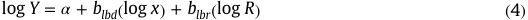

where blbd is the learning-by-doing parameter, blbr is the learningby-researching (LBR) parameter, R is the cumulative R&D investment or knowledge stock, α is the specific cost at unit cumulative capacity and unit knowledge stock, and Y and x have the same definitions as in Eq. (1) (Yeh and Rubin, 2012). 

Empirical tests of this two-factor formulation find that R&D contributes significantly to cost reductions in all stages of technological development, often more so than learning by doing (Watanabe, 1995; Kouvaritakis et al., 2000; Klaassen et al., 2005; Jamasb, 2007; Söderholm and Klaassen, 2007; Söderholm and Sundqvist, 2007). Jamasb (2007) also finds very little “elasticity of substitution” between the two factors, indicating that they are not readily interchangeable. Other studies also find significant correlations between cumulative R&D expenditures (and/or R&D-based knowledge stock) and subsequent (time-lagged) cost reductions (Klaassen et al., 2005; Jamasb, 2007; Söderholm and Klaassen, 2007; Söderholm and Sundqvist, 2007). While it is also widely accepted that both private as well as public R&D expenditures should be included in this formulation, research on two-factor models often includes public R&D spending only, as data on private R&D expenditure are generally not publicly available or not sufficiently disaggregated (Wiesenthal et al., 2012; NRC, 2010). Other limitations of this approach are discussed later in Section 4. 

Finally, “component-based learning curves” extend the onefactor learning model to represent the total cost of a technology at any point in time as the sum of individual component or subsystem costs. Thus: 

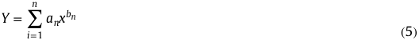

where n is a specified technology component or sub-system, an is the specific cost of cost component n at unit cumulative capacity, and bn is the learning parameter for technology component n (Yeh and Rubin, 2012). 

A number of studies use the method from Eq. (5) to estimate the future cost of technologies for which there is no direct historical experience, such as power plants with carbon capture and storage (Rubin et al., 2007) and micro-cogeneration of heat and power (Weiss et al., 2010). In these cases, the overall plant is divided into multiple components or sub-sections, such as the power plant boiler, conventional air pollution control systems, and carbon capture unit. The future cost of each plant component is then estimated based on the historical learning rate for that 

component (where such data exist), or one that is technically similar. The future cost of the overall plant is then estimated by summing the costs of all plant components after a specified increment of cumulative capacity. 

The rationale for this component-based learning curve is that because different components of a complex technology (like a coal-fired power plant) are presently at different stages of maturity, the cost of a newer component (like a carbon capture unit) will decline more rapidly in response to an increment of new capacity compared to a more mature component with the same learning rate but a much larger base of current installed capacity. In addition, different components may have different learning rates. In some applications of this approach, however, certain cost components such as labor and raw materials, (which may remain constant or increase in cost over time) are not included in the component-based learning rate calculation, but may warrant separate modeling efforts in some cases (Ferioli et al., 2009). 

As noted earlier, while intuitively more satisfying, a major barrier to the development of multi-factor models of technological change is the lack of systematic data for validation and use. Thus, the following section of this paper focuses on the one-factor and two-factor learning models that are most prevalent in the peerreviewed literature. 

## 3. Power plant learning rates 

In this section we summarize the empirical learning rates that have been reported for a broad spectrum of electric power generation technologies. We also summarize the projected learning 

rates estimated for two emerging technologies of interest (CCS and IGCC) for which there is not yet a significant empirical dataset for power plant applications. 

Our literature review of learning rates for electric power generation technologies found that the preponderance of studies report learning rates (or progress ratios) based on a one-factor loglinear model (Eq. (2)) fit to empirical data for a particular region and time period. A smaller number of studies employ a two-factor model that includes both learning by doing and learning by researching. Table 1 summarizes the range of learning rates reported in these studies. 

Table 1 shows that the largest numbers of learning rate studies in the literature are for solar PV systems and onshore wind. These two renewable energy technologies are the fastest-growing power generation options worldwide (Sawin and Sverrisson, 2014) and are of particular interest in studies of low-carbon energy systems. Across all of the technologies, the range of learning rates reported for each technology varies considerably, from a factor of two to more than an order of magnitude. In several cases, the reported range includes negative as well as positive values, indicating that costs have risen as well as declined with increased deployment. Thus, no single estimate of a technology learning rate can be considered “robust.” 

The following sections elaborate on the data in Table 1, beginning with technologies that are currently most prevalent and mature, namely, power plants using fossil fuels (coal and natural gas), nuclear energy, and hydropower. Additional details on all of the literature reviewed are documented in EPRI (2013a). 

Table 1 

Range of reported one-factor and two-factor learning rates for electric power generation technologies. 

> a Some studies report multiple values based on different datasets, regions, or assumptions. 

> b LR¼ learning rate. Values in italics reflect model estimates, not empirical data. 

> c LBD¼ learning by doing; LBR ¼learning by researching. 

> d No historical data for this technology. Values are projected learning rates based on different assumptions. 

> e Includes combined heat and power (CHP) systems and biodigesters. 

> f Several studies reviewed presented data on cost reductions but did not report learning rates. 

## 3.1. Coal-based power plants 

Power plants burning pulverized coal (PC) are the most prevalent technology for power generation worldwide. Over the course of the last century, technological improvements in PC boilers and other power plant components have achieved large economies of scale—with associated cost reductions—as well as significant improvements in power plant reliability, thermodynamic efficiency, and reductions in environmental emissions. The experience curve derived for plant construction cost from one recent study implies an average learning rate of 12% between 1902 and 2006 (McNerney et al., 2011). An earlier study reported lower rates of 7.6% for bituminous coal power plants and 8.6% for lignite power plants for the period 1975–1993 (McDonald and Schrattenholzer, 2001), similar to the range of 7–8% reported by Ostwald and Reisdoft (1979) for the period 1957–1976. 

In other studies, Joskow and Rose (1985) find that after the 1980s overall construction and generation costs for coal-fired plants generally increased. These increases were attributed mainly to new environmental and other regulatory requirements, as well as to changes in power plant design standards and work rules. Other factors adding to higher cost during this period included increases in labor costs and construction time, as well as lower construction productivity. Wang and Yu (1988) observe similar trends. Neither study, however, presents cost results in terms of technology learning curves or rates for an overall PC plant. Furthermore, significant changes in plant design and complexity, such as the addition of new environmental control equipment, not only contributes to increased plant cost but also masks the learning effect for basic plant components such as steam turbines or coalfired boilers. 

To better analyze the effects of technology learning, Yeh and Rubin (2007) decompose complex coal-based plants into major components or sub-systems so as to disentangle cost increases due to changing design requirements from cost decreases due to learning. Using this framework, the authors find an overall learning rate of 5.6%for the construction cost of subcritical boilers (the basic building block of a PC power plant) from 1942 to 1999. During this period, there was nearly a 70% increase in the size of individual PC boilers, accompanied by a jump from 30% to 38% in overall power plant efficiency (on a higher heating value basis). The same study finds a learning rate of 8% for non-fuel O&M costs from 1929 to 1997 after adjusting for inflation (based on the GDP price deflator), changes in real wages (for electric and gas industry employees), and changes in plant utilization rates (annual average capacity factor). 

In a related study, Rubin et al. (2007) use these and other component-specific learning rates to project the future learning rate of an overall PC power plant based on U.S. designs for new supercritical plants. Based on 100 GW of new capacity worldwide, the authors find the learning rate for overall plant construction cost to be 1.1–3.5%. Because most plant components are already mature and widely deployed, the relatively small amount of incremental capacity did not result in larger learning rates for the overall plant. 

That same study also estimates learning rates for power plants with carbon capture and storage (CCS), which is of significant interest as a climate change mitigation strategy (IPCC, 2014). However, since CCS technology has not yet been widely deployed on power plants at full commercial scale, there is currently no historical experience or empirical data as the basis for a learning curve. Rubin et al. (2007) argue that current commercial systems for post-combustion capture of CO2 are technically analogous to post-combustion systems for SO2 capture (known as flue gas desulfurization systems, or FGD), which had average learning rates of 12% for capital costs and 22% for O&M costs, according to previous 

studies. Again using the component-based learning curve (Eq. (5)), the study derives composite (plant-level) learning rates from 1% to 4% for capital cost and from 2% to 5% for cost of electricity based on 100 GW of new plant capacity with CCS. Using a similar approach, Li et al. (2012) project the learning rate of PC plants with CCS in China to range from 5.7% to 9.9%. 

The same approach is also applied to another coal-based power generation technology of interest, the integrated coal-gasification combined cycle (IGCC) plant. Because there are only a few IGCC power plants in operation worldwide (built mainly as demonstration projects) there is again a lack of direct empirical data for a historical learning curve. Nonetheless, there is considerable interest in the future cost trajectory of IGCC–CCS plants as an alternative to PC plants with CCS. Existing studies thus use the “bottom-up” component modeling approach outlined above to estimate the learning rates of future IGCC plants with and without CCS. Table 1 shows the range of results from studies by Rubin et al. (2007) and Li et al. (2012) (the latter study based on estimates for power plants in China). Van den Broek et al. (2009) also use a bottom-up approach to estimate future learning rates of capital and O&M cost for components of future PC and IGCC plants with CCS, but do not report composite results for an overall plant. 

## 3.2. Natural gas-fired power plants 

Natural gas has been used as a fuel for power generation since the 1940s, mainly in simple cycle gas turbines that operate only a few hours a day during periods of peak demand. The first natural gas combined cycle (NGCC) plants were built in the 1970s, providing more efficient power generation technology. However, their introduction was severely limited by relatively high natural gas prices and equipment costs that made them uneconomical for baseload power generation. Later, in the 1990s and early 2000s, construction of NGCC plants (also known in the literature as gas turbine combined cycle plants, GTCC) boomed in the U.S. following sharp declines in both natural gas prices and the capital cost of combined cycle power plants. 

Most studies on learning for natural gas power plants use single factor models (Colpier and Cornland, 2002; McDonald and Schrattenholzer, 2001; Priddle, 2000). Fig. 1 shows the resulting learning rates reported in different studies, along with the time period and geographic region used to derive the learning curve. Differences in these factors lead to significant variability in learning rates reported by different sources. Fig. 1(a) and (b) shows results for capital cost reduction of simple natural gas-fired combustion turbines and combined cycle plants, respectively. These include a negative learning rate for NGCC capital costs reported by Kouvaritakis et al. (2000) based on data for 1981–1991 (possibly caused by oligopolistic behavior during this period, according to the study). Colpier and Cornland (2002) also report learning rates based on electricity production cost ($/kWh) rather than capital costs. Since the latter is highly dependent on the price of natural gas two values are reported: one based on the actual natural gas price for each year and one based on a constant natural gas price. The difference in the resulting learning rate (15% versus 6%) is seen in Fig. 1(c). Fig. 2 provides a histogram summarizing the range of values reported in Fig. 1. 

CCS technology is also of interest for reducing emissions of carbon dioxide from NGCC power plants (IPCC, 2014). As with coal-based plants, in the absence of historical experience and data, van den Broek et al. (2009) estimate future learning rates for NGCC plants with CCS using the component-based modeling approach developed by Rubin et al. (2007). The resulting learning rates range from 2% to 7%, with a nominal value of 5%. 

Only one paper reviewed uses a two-factor model that incorporates a learning-by-researching factor for NGCC costs. Jamasb 

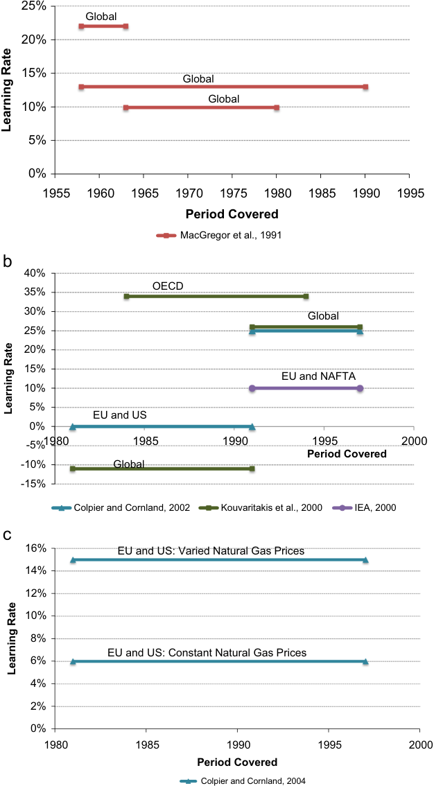

**----- Start of picture text -----** 
25% Global 20% 15% Global Global 10% 5% 0% 1955 1960 1965 1970 1975 1980 1985 1990 1995 Period Covered MacGregor et al., 1991 40% OECD 35% 30% Global 25% 20% 15% EU and NAFTA 10% 5% EU and US 0% -5%1980 1985 1990 1995 2000 Period Covered -10% Global -15% Colpier and Cornland, 2002 Kouvaritakis et al., 2000 IEA, 2000 16% EU and US: Varied Natural Gas Prices 14% 12% 10% 8% EU and US: Constant Natural Gas Prices 6% 4% 2% 0% 1980 1985 1990 1995 2000 Period Covered Colpier and Cornland, 2004 Learning Rate Learning Rate Learning Rate **----- End of picture text -----** 

Fig. 1. Summary of learning rates for natural gas-fired power plants reported in the literature: (a) simple gas turbines; (b) NGCC/GTCC based on $/kW and (c) NGCC/GTCC based on $/kWh. 

and Köhler (2007) evaluate global data for combined cycle gas turbines built in two periods. For the period 1980–1989, they find learning by doing and learning by researching rates of 0.65% and 17.7%, respectively. For the period 1990–1998, the learning by doing rate increases to 2.2% while the learning by researching rate falls to 2.4%. The difference in these values is attributed to changes in the maturity of the technology: NGCC plants are considered a “reviving technology” in the first period, but a “mature technology” after 1990. The authors suggest that this change can be 

partially attributed to the de-regulation of electricity markets (Jamasb and Köhler, 2007). 

## 3.3. Nuclear power plants 

In contrast to other power generation technologies, historical costs for nuclear power plants frequently show increasing rather than decreasing trends with cumulative installed capacity. Fig. 3, for example, shows the capital cost trends from a recent study of 

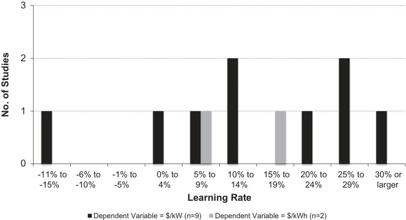

**----- Start of picture text -----** 
3 2 1 0   -11% to   -6% to   -1% to   0% to   5% to  10% to 15% to 20% to 25% to 30% or -15% -10% -5% 4% 9% 14% 19% 24% 29% larger Learning Rate Dependent Variable = $/kW (n=9) Dependent Variable = $/kWh (n=2) No. of Studies **----- End of picture text -----** 

Fig. 2. Histogram of learning rates reported in the literature for natural gas-fired power plants. Black bars are studies based on cost per unit of capacity installed ($/kW). Grey bars are studies where the dependent variable is the cost per unit of electricity generation ($/kWh). 

In other studies, Cooper (2010) also finds an increase in the unit cost of U.S. nuclear power plants with increasing cumulative installed capacity based on his own dataset. In contrast, an earlier literature review by McDonald and Schrattenholzer (2001) reports a positive learning rate of 5.8% for nuclear power plant construction cost in OECD countries from 1975 to 1993 based on a study by Kouvaritakis et al. (2000). In terms of operating experience, Sturm (1994) compares operating nuclear plants in OECD countries and Eastern European countries using the proxies of availability and unplanned outages. He finds positive learning in the OECD but negative learning in Eastern Europe, in part due to exogenous shocks such as the breakup of the Soviet Union. 

Overall, the mixed results on historical learning for nuclear plants have called into question the benefits of learning claimed for proposed evolutionary and advanced nuclear designs such as small modular reactors (SMRs). These include promised cost reductions from factory fabrication, modular construction, and various other factors (see for instance, Carelli et al. (2010), van den Broek et al. (2009), Abdulla et al. (2013)). 

## 3.4. Hydroelectric plants 

the French and American nuclear experience. In both cases, Grubler (2010) finds that specific costs increase with installed capacity. Application of Eq. (2) to the data in Fig. 3 would imply a negative learning rate of about –38% for U.S. plants from 1972 to 1996. However, Grubler (2010) notes that many factors associated with nuclear plant construction costs, ranging from new safety regulations to generational differences in nuclear reactor designs, complicate the interpretation of these data from the viewpoint of technological learning. Thus, he argues that these cost trends should not be translated into learning rates, stating that: 

“ …. the learning curve metaphor is clearly not applicable in the case of nuclear in both the US and France illustrating the limits of simplistic learning curve assumptions in technology studies and policy models, the model nonetheless allows an additional insight. The rhythm (as opposed to the different rates and extent) of cost escalation between the two countries appears strikingly similar. Initially, cost escalations are positive, but modest until a threshold value of some 20 GW installed capacity is reached, followed by a phase of accelerated cost escalation to another threshold level at some 40–50 GW beyond which cost escalation simply skyrockets. At this stage above observation remains entirely conjectural.” (Grubler, 2010) 

Hydropower is a key source of electricity in many parts of the world. In the U.S. and other developed countries, however, prior construction of hydro plants has left little or no opportunity for additional capacity. Thus, most hydroelectric expansion is taking place in developing countries, especially in Asia and Latin America (Edenhofer et al., 2011; Sawin and Sverrisson, 2014). 

Kouvaritakis et al. (2000) report a single-factor learning curve for hydroelectric projects based on data for OECD countries from 1975 to 1990. Their capital cost learning rate of 1.4% is cited in later studies by McDonald and Schrattenholzer (2001) and KahouliBrahmi (2008). Another study by Jamasb (2007) employs twofactor learning curves for large and small hydroelectric plants. Using global data from 1980 to 2001, he reports a learning-bydoing rate of 1.96% and a learning-by-researching rate of 2.63% for large hydropower projects. He also reports learning by doing and learning by researching rates of 0.48% and 20.6%, respectively, for small hydropower projects based on global data from 1988 to 2001. 

## 3.5. Wind power plants 

Among the non-hydro renewable energy sources for power generation, wind farms are the fastest-growing source of electricity 

in much of the world today (Sawin and Sverrisson, 2014). Largescale deployment of land-based wind turbines in Europe and the U. S. began in the 1970s and early 1980s, and has continued to grow worldwide. Wind power technology has evolved considerably over this period: in the 1980s the most prevalent turbine size was 55 kW (McDonald and Schrattenholzer, 2001), while by 2013 the average size of land-based turbines had grown to roughly 2 MW, with 10% of installed turbines larger than 2.5 MW (IEA, 2014; Wiser and Bolinger, 2014). This trend of increasing size is expected to continue (Sawin and Sverrisson, 2014). More recently, offshore wind farms also have been deployed in northern Europe, also with projections for continued growth. Here, we first review the recent literature on experience curves and learning rates for onshore wind systems (the dominant application), then discuss learning for offshore wind. 

## 3.5.1. Results for onshore systems 

Most reported learning rates for wind systems employ onefactor learning curves for unit capital cost ($/kW) based on cumulative installed capacity. Some of these studies use the term “price” or “investment cost” rather than capital cost. Unless defined otherwise, in this paper we interpret all these terms to mean the amount paid by an owner or operator of the technology, which is the data most commonly available. A smaller number of studies report learning rates for generation cost ($/kWh) as a function of cumulative electricity generated. Most studies focus on Europe and North America, although the specific geographic areas and time periods analyzed in different studies vary widely. While most authors report a single learning rate for an overall time period, some divide the data into separate intervals with different learning rates. Differences are also found in the model specifications used in different studies. For example, roughly half of the studies reviewed report learning rates for individual wind turbines, while the other half report rates for entire wind farms. 

Figs. 4–6 group the results of different studies by geographic region and dependent variable used, along with the basis for the cost estimates. Fig. 7 summarizes the same data in the form of a histogram of all learning rates reported in the studies reviewed. Table A1 in Appendix A includes a description of the assumptions of each study used to build Figs. 4–7. 

Overall rates span a very large range, from –11% to 35% (Edenhofer et al., 2011; Ibenholt, 2002; Junginger et al., 2005; Kahouli-Brahmi, 2008; Lindman and Söderholm, 2012; McDonald 

and Schrattenholzer, 2001; Neij, 2008; Neij et al., 2003; Nemet, 2009; Priddle, 2000; Qiu and Anadon, 2012; Trappey et al., 2013; Weiss et al., 2010). More pronounced is the roughly six-fold range of learning rates reported for capital costs in Europe (Fig. 4), the four-fold range for learning rates globally (Fig. 5), and the nearly four-fold range of cost-of-electricity (COE) reduction rates reported for Europe, the U.S. and China over the past two to three decades. However, among the latter studies, except for the discussion in Ibenholt (2002), it is unclear whether temporal and spatial variations in capacity factor are included in the learning rates reported. 

Overall, we find that it is not possible to clearly explain, in general terms, the large variations across these studies based on the limited information and data reported in the literature. For example, while Figs. 3 and 4 indicate that learning rates over longer periods of time tend to be smaller than rates over shorter time periods—as seen for other technologies discussed in the literature (e.g., Yeh and Rubin, 2012)—not all studies depicted in those figures support that conclusion. Differences in geographic regions and myriad other factors that differ across studies further preclude generalizations for one-factor learning models of onshore wind systems. 

Other studies of onshore wind systems present more detailed multi-factor models for system costs. For example, Junginger et al. (2005) describe historical factors affecting wind turbine cost, including increased labor specialization, labor efficiency, innovations from R&D, product standardization, and product re-design. They suggest the latter factor (especially increased turbine size) has primarily driven recent cost reductions. An earlier approach employed by Ibenholt (2002) used least square regression to estimate the learning parameter, b, in Eq. (1) as function of “support to R&D, other technology-push policies, changes in input prices, competition in the market, [and] economies of scale.” That analysis (of Denmark, Germany and the UK) used a variety of electricity prices and tariffs paid by utilities in each country as a proxy for true technology cost, and concluded that government policies to promote wind energy could have both positive and negative impacts on cost reductions and technology diffusion. 

Yet other studies developed two-factor learning-diffusion models of the form shown by Eq. (3), yielding separate rates for learning by doing and learning by researching (Miketa and Schrattenholzer, 2004; Klaassen et al., 2005; Jamasb and Köhler, 

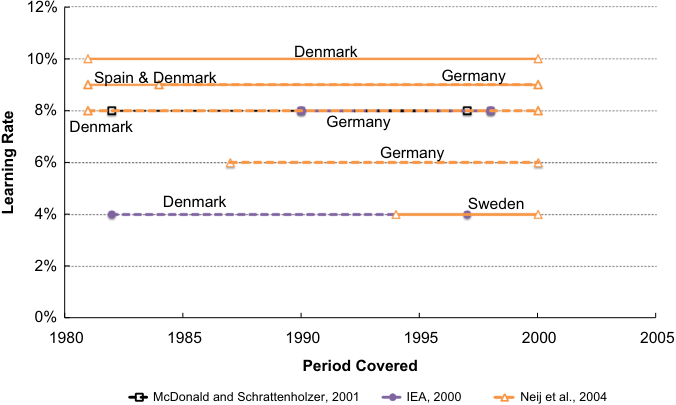

**----- Start of picture text -----** 
12% Denmark 10% Spain & Denmark Germany 8% Denmark Germany Germany 6% Denmark Sweden 4% 2% 0% 1980 1985 1990 1995 2000 2005 Period Covered McDonald and Schrattenholzer, 2001 IEA, 2000 Neij et al., 2004 Learning Rate **----- End of picture text -----** 

Fig. 4. Learning rates for on-shore wind from European studies. The dependent variable is cost/price per unit of installed capacity ($/kW). There are multiple lines per study where authors used different model specifications. Solid lines denote studies that modeled wind farm costs, while dashed lines denote studies that modeled only turbine costs. Different markers (and colors) denote the different studies. 

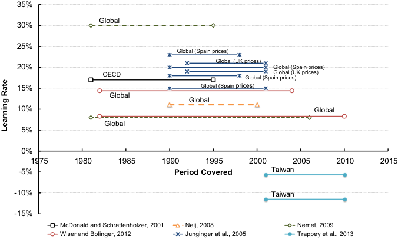

**----- Start of picture text -----** 
35% Global 30% 25% Global (Spain prices) Global (UK prices) 20% Global (Spain prices) OECD Global (Spain prices)Global (UK prices) 15% Global (Spain prices) Global Global 10% Global Global 5% 0% 1975 1980 1985 1990 1995 2000 2005 2010 2015 -5% Period Covered Taiwan -10% Taiwan -15% McDonald and Schrattenholzer, 2001 Neij, 2008 Nemet, 2009 Wiser and Bolinger, 2012 Junginger at al., 2005 Trappey et al., 2013 Learning Rate **----- End of picture text -----** 

Fig. 5. Learning rates for on-shore wind from global and OECD studies. The dependent variable is cost/price per unit of installed capacity ($/kW). There are multiple lines per study where the authors used different model specifications (for example, Junginger et al. (2005) used two different time periods for the Spanish and UK data, and two different GDP deflator rates for each data set). Further, solid lines denote studies that modeled wind farm costs, while dashed lines denote studies that modeled only turbine costs. Different markers (and colors) denote the different studies. 

2007; Söderholm and Klaassen, 2007; Ek and Söderholm, 2010). Those results are summarized in Table 1, with further details in Table A2 of Appendix A. 

Finally, we note that in recent years there have been few new learning rate studies of onshore wind in the peer-reviewed literature, perhaps related to changing trends in cost. After several decades of declining prices, starting around 2002 the specific capital cost of wind farm installations in Europe and the U.S. began to rise rather than fall with increasing cumulative capacity—a trend that persisted until about 2008, when unit costs again began to fall (Lantz et al., 2012; IEA, 2013b; Wiser and Bolinger, 2014). The increasing costs for wind systems mirrored the higher costs for most types of power plants seen during a period of high global demand for commodities like steel and concrete, which drove up plant construction costs (CEM, 2014; IHS-ERA, 2014), followed by a period of price stabilization and decline during a worldwide economic downturn. These recent perturbations are not reflected in the learning rate data summarized in this paper. 

## 3.5.2. Results for offshore systems 

With regard to offshore wind farms, experience to date has been limited to Europe, particularly the Scandinavian countries. Globally, offshore wind capacity has grown from roughly 14 GW in 1999 to 197 GW in 2010 (Clarke et al., 2006; Jamasb, 2007; Moccia and Arapogianni, 2011; Nordhaus, 2009). Lemming et al. (2009) studied the potential for development of offshore wind power through the year 2050. The authors assume that the learning rate of 10% observed between 1985 and 2000 remains constant until 2030, after which it decreases to 5% (Lemming et al., 2009). 

Jamasb (2007) and Junginger et al. (2009) produce more detailed analyses based on the cost of specific components of an offshore wind farm. They suggest that the learning rate of offshore wind turbine capital cost will be between 8% and 19%, similar to the learning rates observed for land-based wind turbines. For the balance-of-plant cost, Junginger et al. (2009) estimate a 38% learning rate for the installation cost of the interconnection cables based on data for underwater high voltage direct current (HVDC) cables between 1988 and 2000. Similarly, they estimate a 29% learning rate for HVDC converter stations. Finally, they evaluate the installation time for two offshore wind turbines projects built in 2000 and 2003. Using these data as a proxy for cost, they suggest a learning rate of 23% for the erection cost of offshore 

## wind turbines (Junginger et al., 2009). 

Finally, Jamasb (2007) also developed a two-factor learning model for offshore wind farms. Using data from OECD countries from 1994 to 2001, he finds a learning-by-doing rate of 1%, and a learning-by-researching rate of 4.9%. 

## 3.6. Solar photovoltaics 

Solar photovoltaic (PV) systems convert sunlight directly into electricity using either wafer-type cells cut from a silicon ingot, or thin-film cells deposited onto a substrate-like glass, plastic, or steel (Kouvaritakis et al., 2005; van der Zwaan and Rabl, 2004). Applications include both central station PV and rooftop PV. Total system capital cost is the sum of PV module cost plus balance-ofsystem (BOS) cost, which include electrical installation, inverters, wiring and power electronics (Curtright et al., 2008; Nemet, 2006; Söderholm and Sundqvist, 2007). 

Most of the learning curve studies reviewed focus on the PV module cost, again using a one-factor model (Eq. (2)) to relate the cost per peak watt of output ($/Wp) to cumulative installed capacity. One study uses electricity generation cost as the dependent variable. Several other studies report learning rates for BOS costs. Duke et al. (2005) argue that while learning by doing for solar PV modules is a global phenomenon, learning-by-doing for balance of system costs is a local effect without similar spillover implications. 

As with wind systems, there were substantial variations in the geographic regions and time periods studied, as seen in Fig. 8. Several one-factor studies suggest learning rates of around 20% (Swanson, 2006, van Sark et al., 2008, van Sark, 2008). Overall, there is roughly a four-fold range in reported learning rates for one-factor models, with a mean value of 23%, as shown in Fig. 9. While some authors suggest that learning curves should also systematically report the associated learning rate and progress ratio errors, studies often fail to report such values. 

Two studies of PV systems develop a two-factor learning curve (Eq. (4)). Here, Miketa and Schrattenholzer (2004) find a learningby-doing rate of 17% and a learning-by-researching rate of 10%. Kobos et al. (2006) also include a time lag between investments in R&D and subsequent declines in cost, as well as a depreciation factor to account for the rate of technology obsolescence. Using worldwide data for solar PV from 1975 to 2000, they report rates of 18.4% for learning-by-doing and 14.3% for learning-by- 

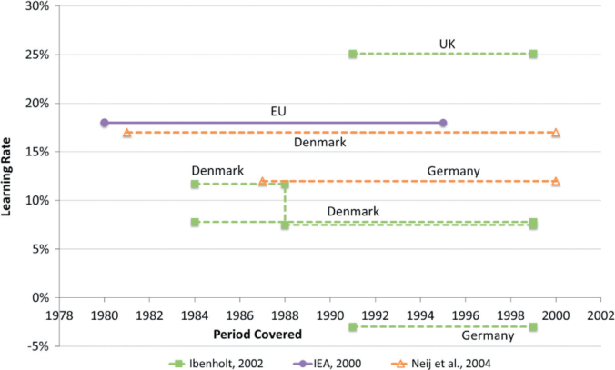

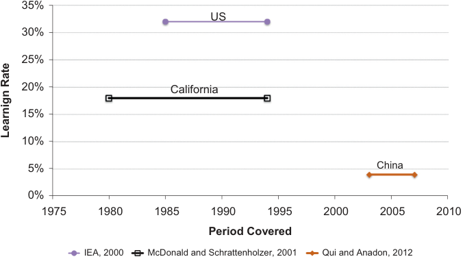

**----- Start of picture text -----** 
35% US 30% 25% 20% California 15% 10% 5% China 0% 1975 1980 1985 1990 1995 2000 2005 2010 Period Covered IEA, 2000 McDonald and Schrattenholzer, 2001 Qui and Anadon, 2012 Learnign Rate **----- End of picture text -----** 

Fig. 6. Learning rates for on-shore wind where the dependent variable is cost/price per unit of electricity generated ($/kWh). Top graph (a) shows studies for Europe, lower graph (b) shows other world regions. There are multiple lines per study where the authors used different model specifications. Further, solid lines denote studies that modeled wind farm costs, while dashed lines denote studies that modeled only turbine costs. Different markers (and colors) denote the different studies. 

researching. Further details of studies reporting solar PV learning rates appear in Tables A3 and A4 of Appendix A. 

Other studies propose more complex models to explain solar PV cost trends. Nemet (2006), for example, considers seven factors, including plant size, module efficiency, wafer size, yield, market share for poly-crystalline cells, silicon cost, and silicon consumption. He finds that the three most important factors explaining cost declines from 1975 to 2001 were plant size, cell efficiency and, to a lesser extent, the cost of silicon. The four remaining factors each accounted for less than 2% of the cost decline. Taken together, however, all seven factors explained less than 60% of the observed cost reduction during that period, indicating that other factors also contributed to cost reductions. 

More recently, Yu et al. (2011) assess PV learning curves using a novel approach that incorporates input price changes and scale effects. They find that in some stages of the PV production, one sees stable PV module prices, despite the fact that cumulative capacity is increasing—i.e., no learning occurs. The authors argue that these effects are due to changes in input prices and scale effects, and estimate a multi-factor learning curve account for these effects, but do not report learning rates. 

Gan and Li (2015) further studied the relationship between the emergence of low-cost Chinese PV modules in the global market 

and cumulative production, silicon prices, and supply–demand imbalances. The authors run a number of regression models that include different control variables. Overall, they find that the learning rate for PV module cost declined over time, from 32% to 14% over periods from 1976 to 2006, indicating lower rates of progress as PV technology matured (see Table A3; Appendix A for more details). 

Candelise et al. (2013) offer a further explanation of recent PV price trends. They report that in the mid-2000s the demand for solar PV grew, leading to production bottlenecks due to silicon shortages. This led to an increase in silicon prices and resulting increases in PV module prices. That, in turn, provided a push for innovations that resulted in less silicon used in panels, increases in module efficiency, renewed R&D efforts, and a reduction in silicon production costs. In addition, there were improvements in manufacturing processes as well as industry restructuring. The result was an over-supply leading to low silicon and module prices in the late-2000s and early 2010s. For example, compared to average prices above $4.50/Wp in the U.S. and Europe from 2003 to 2008, the average retail module price in March 2012 fell to $2.29/Wp in the U.S. and to €2.17/Wp in Europe. The lowest prices at that time were $1.1/Wp for a crystalline silicon solar module and $0.84/Wp for a thin-film module (Candelise et al., 2013). The authors further 

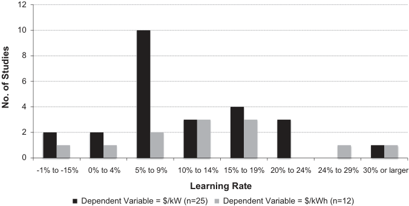

**----- Start of picture text -----** 
12 10 8 6 4 2 0 -1% to -15% 0% to 4% 5% to 9% 10% to 14% 15% to 19% 20% to 24% 24% to 29% 30% or larger Learning Rate Dependent Variable = $/kW (n=25) Dependent Variable = $/kWh (n=12) No. of Studies **----- End of picture text -----** 

Fig. 7. Histogram of learning rates reported in the literature for unit cost (black bars) and cost of electricity (grey bars) for onshore wind systems. 

conclude that “established forecasting methods—experience curves and engineering assessments—have limited ability to capture key learning effects behind recent PV cost and price trends: production scale effects, industrial re-organization and shakeouts, international trade practices and national market dynamics. These forces are likely to remain prominent aspect of technology learning effects in the foreseeable future—and so are in need of improved, more explicit representation in energy technology forecasting” (Candelise et al., 2013). 

Finally, as technologies and processes evolve there are likely to be shifts in the composition of different cost elements. For example, in the case of residential solar PV, Seel et al. (2014) suggest that differences in cost between the United States and Germany are primarily due to differences in non-hardware, or “soft” costs. For 2012, the authors find that residential PV systems were twice as expensive in the U.S. as in Germany, due mostly to differences for “customer acquisition, installation labor, and profit/overhead costs, but also for expenses related to permitting, interconnection, and inspection procedures” (Seel et al., 2014). Ideally, future models might consider such factors separately to better disentangle the costs of capital equipment, labor costs, and installation costs and their drivers. 

## 3.7. Biomass power plants 

Interest in biomass as a low-carbon energy source extends not only to its use for transportation fuels but for electricity production as well. Most work on biomass-based power generation has focused on fluidized bed combustion for combined heat and power (CHP) and the production of biogas. Koornneef et al. (2007) use global data on the capital costs of fluidized bed combustion plants from 1976 to 2005 and find learning-by-doing rates ranging from 7% to 10%. Similarly, Junginger et al. (2006) find that between 1990 and 2002 cumulative installed electrical capacity of fluidized bed CHP in Sweden increased six-fold while specific investment costs declined by a factor of five, yielding a learning rate of 23% for capital cost. The resulting impact on the marginal cost of electricity generation gave a learning rate of roughly 8% for COE. 

Junginger et al. (2006) also evaluate decreases in the investment costs of bio-digesters used to produce biogas in Denmark. For the period from 1988 to 1998 they find a learning rate of 12% due to a higher yield of biogas (by adding organic waste), an increase in plant availability, and a reduction in operating and maintenance costs. Looking at the total cost of biogas production in Denmark (in units of 2002 euros/N m[3] ), they report learning rates for three time periods: 24% from 1984 to 1997; 15% from 1984 to 1991; and 0% from 1991 to 2001. 

Cost trends for the production and transport of biomass also are of interest as they contribute significantly to the total cost of electricity or biogas production. Our review of studies examining crop-based feedstock production costs, including sugarcane (Brazil), corn (U.S.), and rapeseed (Germany), suggests that feedstock production costs have declined over time. These studies report learning rates associated with feedstock costs in the range of 20– 45%, as elaborated below. 

For Brazilian sugarcane, van den Wall Bake et al. (2009) find a learning rate of 32% based on a composite of production costs from 1975 to 1998 and sales price from 1999 to 2004. Sale prices were used as a proxy for costs after 1999 because by that time the market was fully deregulated, and prices tend to track costs reasonably well in well-established markets (van den Wall Bake et al., 2009). Cost reductions for soil preparation, crop maintenance, and rent were strongly influenced by increasing agricultural yields and harvesting productivity. In another study, Hettinga et al. (2009) examine the costs of U.S. corn production between 1985 and 2000, and find a learning rate of 45%. Higher corn yields and increasing farm sizes were partly responsible for decreasing costs. A study of German rapeseed production by Berghout (2008) finds a learning rate of 19.6% based on production and cost data from 1971 to 2006. Costs reductions are attributed to improved varieties of rapeseed, higher crop yields, a reduction in fertilizer costs, and lower fertilizer usage. 

## 3.8. Geothermal power plants 

We found no literature on historical learning rates for geothermal electricity, neither for power plant technology (binary, flash, flash–binary) or geothermal well-drilling and resource extraction. In general, the cost of such plants is very sensitive to sitespecific resource temperature, geothermal fluid chemistry, geothermal fluid flow rates, and ambient temperature, which makes it difficult to characterize universal learning rates for this technology. Schilling and Esmundo (2009) examine the influence of U.S. government R&D spending. They report that the unit cost of geothermal electricity generation (cents per kWh) in the U.S. fell by roughly a factor of three between 1980 and 2005 as cumulative government spending on R&D roughly tripled from $1.5 to $4 billion. However, the authors do not report any learning rates and hypothesize that the relationship between technology performance (electricity output per R&D dollar) and R&D spending resembles an S-shaped curve, in which improvements are initially slow, but then accelerate, followed by a slower rate of improvement. For this paper, we combined their reported reduction in COE together with Energy Information Administration (EIA) data on 

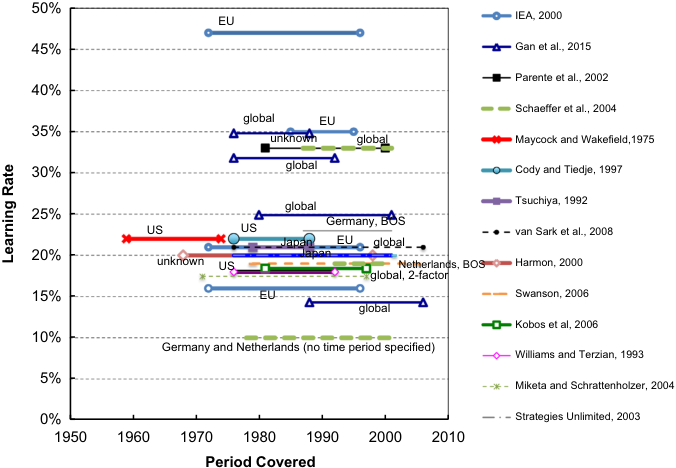

**----- Start of picture text -----** 
50% EU IEA, 2000 45% Gan et al., 2015 Parente et al., 2002 40% Schaeffer et al., 2004 global EU 35% unknown global Maycock and Wakefield,1975 30% global Cody and Tiedje, 1997 global Tsuchiya, 1992 25% US US Germany, BOS van Sark et al., 2008 Japan EU global 20% unknown US Japan Netherlands, BOS Harmon, 2000 global, 2-factor 15% EU Swanson, 2006 global Kobos et al, 2006 10% Germany and Netherlands (no time period specified) Williams and Terzian, 1993 5% Miketa and Schrattenholzer, 2004 0% Strategies Unlimited, 2003 1950 1960 1970 1980 1990 2000 2010 Period Covered Learning Rate **----- End of picture text -----** 

Fig. 8. Learning rates for solar PV capital cost ($/Wp) reported in the literature. The x-axis represents the range of years used in the cited papers. The plot also shows the corresponding region included in each study. Different markers and line styles (as well as colors) denote the different studies. 

cumulative net electricity generation from geothermal plants (million kWh) between 1980 and 2005 (EIA, 2014) to derive an inferred learning rate of approximately 30% for geothermal technology based on a one-factor model (Eq. (2)). However, additional research is needed to better understand and characterize technological learning for geothermal power plants. 

## 3.9. Discussion 

Our meta-analysis of the literature on learning rates for electric power plants reveals a wide range in reported values, both within and across the 11 power generation technologies studied. With few exceptions (most notably for nuclear power plants), studies report declining unit capital cost (or cost of electricity generation) with increasing installed capacity (or production) over the time periods analyzed, The most-studied technologies in the literature were onshore wind and solar PV energy systems, whose average learning rates for one-factor models were 12% and 23%, respectively (see Table 1). However, there was substantial variability in the learning rates for a particular technology derived by different authors using different datasets. While some of these differences are readily attributed to factors identified in specific studies—such as the use of two different GDP deflator rates in Junginger et al. (2005) (see Fig. 5)—in most cases there was no clear relationship to major variables such as the time periods and geographical regions that differed across the studies reviewed. In general, power plant technologies using fossil fuels (coal and natural gas) had a narrower range of learning rates that were smaller in magnitude than those for renewable energy technologies (wind, solar, and biopower), likely reflecting their different levels of maturity, scales of deployment, and time frame of the analysis. 

The discussions of individual technologies noted a number of factors identified in the literature to explain variations in reported learning rates. One important additional factor is the choice of geographic boundaries for a learning curve. For example, Lindman and Söderholm (2012) conducted a meta-analysis of wind power technology and found that “the choice of the geographical domain of learning, and thus the assumed presence of learning spillovers, is an important determinant of wind power learning rates.” They find that including a wider geographical scope implies higher 

learning rates. Thus, while some studies use national boundaries to calculate learning rates (e.g., see Figs. 4, 6, and 8), others argue that for certain technologies (like onshore wind) diffusion and spillover effects are global in nature, so that global experience is the appropriate metric for a learning curve (e.g., Junginger et al., 2005). 

Arguably a greater challenge for learning curves is to quantify the true production cost trend of a technology, as opposed to its market price—which is the basis for most experience curves. Though in general prices decline in parallel with costs over long period of time (Boston Consulting Group, 1972; Lieberman, 1987), they are quite often distorted by market structure, subsidies, high market demand, monopolies, oligopolies and other factors (see e.g., Junginger et al., 2005). Thus, market price is often an imperfect measure of cost in non-equilibrium markets (Wene, 2008). This may especially influence the magnitude and meaning of learning rates for renewable energy technologies, which have been the focus of many government regulatory and/or incentive programs in recent years. 

In addition to learning rates from one-factor experience curves, a smaller number of studies report two-factor models that include separate rates for learning by doing and learning by researching. The latter reflects the effect on technology cost reductions of cumulative spending for research and development. Where both learning rate values are reported, the effect of R&D spending is more frequently larger than the LBD effect. However, the difficulty of acquiring complete and reliable data for R&D spending for a particular technology has significantly limited the application and use of this two-factor model for technology forecasting. 

## 4. Policy implications 

In this section we discuss some of the policy implications of using learning curves or other analytical models of technological change to estimate the future cost of various electric power generation technologies. In particular, we focus on the implications of alternative learning models on the policy-related results of largescale energy-economic models used to inform energy and environmental policy, especially with regard to mitigating global 

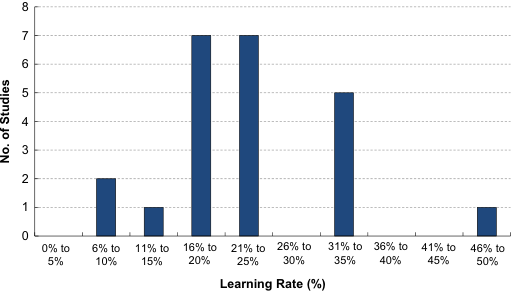

**----- Start of picture text -----** 
8 7 6 5 4 3 2 1 0 0% to  6% to  11% to  16% to  21% to  26% to  31% to  36% to  41% to  46% to 5%  10%  15%  20%  25%  30%  35%  40%  45%  50% Learning Rate (%) No. of Studies **----- End of picture text -----** 

Fig. 9. Histogram of capital cost ($/Wp) learning rates for PV reported in the literature. 

climate change. We note that many of the qualitative findings and observations in this section of the paper echo those of other researchers who have studied experience curves and energy models (e.g., see Junginger et al. (2010), which includes contributions from a number of leading researchers in this field). Our current study extends prior work to include reviews of newer models and studies (since 2009), with more extensive discussions of the policy implications of exogenous and endogenous learning models that include two-factor learning curves and their use in energy-economic models. 

Since the early 2000s, a number of large-scale energy-economic models have incorporated learning curves to model technological change endogenously, in contrast to exogenous specification of technology cost trajectories. Here, we summarize our findings on the implications of endogenous versus exogenous representation of cost trajectories for power generation technologies based on our review of several energy-economic models used for policy analysis, including the MESSAGE-MACRO model (McDonald and Schrattenholzer, 2001), the ReMIND-R model (Luderer et al., 2010), the WITCH model (Bosetti et al., 2009, 2011), the NEMS model (Gabriel et al., 2001), the EPA-MARKAL model (Shay et al., 2006), the REGEN model (EPRI, 2013b), and the GCAM model (PNNL, 2014). 

To structure this discussion, we first look at models that use one-factor or two-factor learning curves to endogenously calculate future technology costs. We then discuss several models that specify technology costs exogenously. In both cases, we focus on how the representation of future technology costs affects policyrelevant results. The particular results of interest include (1) the mix of future power generation technologies in climate policy scenarios with GHG mitigation, (2) the cost of these mitigation scenarios, and (3) the influence of R&D investments on the technology mix and overall cost of policy scenarios. 

## 4.1. Models employing endogenous learning curves 

A comprehensive review of large-scale models and their use of learning curves was included in the Fourth Assessment Report of the IPCC (IPCC, 2007) and a more recent summary and discussion appears in Lensink et al. (2010). In general, two classes of models can be defined. One type is a partial equilibrium model that typically has a fair amount of technological detail. In contrast, general equilibrium models usually have much simpler representations of the energy sector, but include all other sectors of the economy. Thus, they are able to explore issues such as the relationship between R&D investments in energy technologies and the opportunity costs of such investments. 

In studies with endogenous technological learning, the cost and installed capacity of each technology are determined through an iterative calculation based on initial specifications. Thus, the future cost of a technology depends not on elapsed time (as in the case of exogenous or autonomous learning), but on its cumulative installed capacity and, in the case of two-factor models, cumulative R&D expenditures at different points in time for a particular scenario. We also note that when learning curves are incorporated endogenously into either full or partial equilibrium models, a cost floor may be imposed by the modelers to prevent a cost from falling below some specified value. This is an artifact of the energy models, done out of necessity in order to find feasible solutions and prevent technologies from becoming unrealistically cheap over the time frames (decades to a century) typically employed in large-scale energy models (Jamasb and Köhler, 2007). Cost floors, however, are not commonly discussed or reported in studies that derive technology learning rates from empirical data, though the concept of a floor is inherent in studies that report “S-shaped” learning curves rather than the prevailing log-linear form. 

The results from models employing one-factor experience curves often show benefits from the early adoption of a new technology because early adoption stimulates larger cost reduction over the longer term (Mattsson and Wene, 1997; Goulder and Mathai, 2000; van der Zwaan et al., 2002; Manne and Richels, 2004; Nordhaus, 2009). Thus, with induced (endogenous) technological change the cost of delays in introducing new or improved technology can be much higher than without learning effects (Grubb et al., 1995; Bosetti et al., 2011). For example, Riahi et al. (2004) compare results with and without induced learning for carbon capture and storage (CCS) technology using the MESSAGE-MACRO model. They find that scenarios with endogenous learning lead to lower overall costs for CCS, resulting in higher abatement levels using CCS technology (as opposed to other abatement methods), and with lower shadow prices of global carbon dioxide abatement compared to no endogenous learning. From a policy perspective, the implication of these results is that CO2 mitigation policies are much less costly than in models without endogenous learning, with CCS technology playing a much more important role when learning curve effects are incorporated in the analysis. 

The National Energy Modeling System (NEMS), an energyeconomic model of the U.S. developed for the the Energy Information Administration of the U.S. Department of Energy (DOE/ EIA) (Gabriel et al., 2001), also employs endogenous learning curves. The electric utility sector component of NEMS includes 54 electricity generating technologies (34 for existing power plants and 24 others available for new construction). Each plant type is further sub-divided into several components (a total of 26 components across all generating types), to which technological learning factors are applied using a traditional one-factor learning curve, as in the component-based formulation discussed earlier. The capacity of all plant types having a particular component is then aggregated to derive the total learning-related capacity of that component. Different plant types thus share learning if they have the same component. 

NEMS further classifies each technology component as being either “revolutionary,” “evolutionary” or “mature,” with different learning rates assigned for each stage of development, along with specified rates of change from one stage to another (for example, a “revolutionary” component becomes “evolutionary” after three doublings of the initial capacity). Additionally, each component is set to have a certain annual minimum learning, even if no new capacity additions are made. Once all the learning factors at the component level are applied, the components are aggregated based on their fractional contribution to overall plant 

costs (as in Eq. (5)). The results are then used to calculate learning factors at the power plant type level. NEMS also uses several other factors to estimate the future cost of power plant technologies, such as regional cost factors and “technological optimism” factors (Gumerman and Marnay, 2004). 

Despite all this complexity, however, there appear to be no published studies of how U.S. energy projections using NEMS would differ in the absence of endogenous learning rate assumptions. Qualitatively, one would expect higher overall technology costs in the absence of endogenous learning. Such differences are likely to have significant policy implications, as in the example described earlier. However, absent a systematic comparison of the effects of alternative learning assumptions, and the insights such a comparison would afford, one cannot assess the extent to which decisions or conclusions based on NEMS results with endogenous learning could be erroneous or misleading for purposes of policy analysis or guidance. 

In other examples of the policy implications of learning models, van Benthem et al. (2008) analyze the solar photovoltaic market in California under different learning-by-doing assumptions to determine the level of subsidies that are most economically efficient. They conclude that without the cost reductions from learning by doing the subsidies studied cannot be justified by environmental externalities alone. 

Two other recent studies explore the implication of increased technology costs during early commercialization (Chen et al., 2012) or at some point in technology development (Hayward and Graham, 2013). Both studies find that model investment decisions vary significantly across the range of learning rates and cost increases examined. The projected long-term costs are nevertheless most sensitive to the assumed learning rates given the positive feedback nature of the experience curve. 

Two-factor learning curves of the type discussed earlier also have been incorporated into large-scale energy models including MERGE (Kypreos and Bahn, 2003; Wene, 2008), ERIS (Barreto and Kypreos, 2004), POLES (Criqui et al., in press), as well as other simulation frameworks (Fischer and Newell, 2008). As with one-factor learning curve, studies generally find that incorporating two-factor models endogenously tends to reduce the long-term cost of environmental policy measures while abating emissions more extensively compared to scenarios with no learning or with only one-factor models (Watanabe et al., 2003, 2000; Barreto and Kypreos, 2004; Fischer and Newell, 2008). Some studies that explicitly incorporate R&D expenditures also find that this may result in less aggressive abatement actions in the near-term because of increases in near-term societal costs (Barreto and Kypreos, 2004). Similarly, Goulder and Mathai (2000) find that the inclusion of R&D expenditures shifts some abatement from the present to the future. This is because induced technology innovation lowers the future cost of abatement, which in turn lowers the “shadow cost” of present-day emissions. Thus, the optimal level of abatement is higher in later years and lower in early years. The additional cost reductions stemming from learning by doing then act to accelerate the effects of initial R&D investments (Kouvaritakis et al., 2005). 

Researchers have also found that both LBD and LBR can create “lock-in” effects: that is, R&D funding of some options may lock out other options that fail to benefit from R&D-induced learning. Thus, model results based on learning curves are often pathdependent. 

Goulder and Mathai (2000) further study the opportunity cost of directing limited R&D resources to the energy sector. They claim this has the adverse effect of producing a sharper decline in GDP when a carbon tax is introduced to control greenhouse gas emissions. In their study, they find a 25% greater loss in GDP than without the increased investment in R&D. Their explanation 

for this is that under equilibrium conditions the rate of return on investments is the same across all sectors. Therefore, an increase in R&D expenses to induce technological change in low-carbon energy sources (e.g., renewables) results in reduced R&D investments elsewhere, thus reducing productivity in other sectors. Nordhaus (2009) also concludes that omitting the opportunity cost of LBR (as well as LBD) incorrectly estimates the total marginal cost of output and the benefits of induced technological change. 

More recent work from Bosetti et al. (2011) employs a twofactor learning curve with decreasing marginal returns to examine the mitigation cost implications and economic efficiency of climate-related R&D and LBD. Using the WITCH model, they find that capital costs for renewable power generation and “breakthrough” low-carbon technologies are reduced by investments in targeted R&D and technology deployment. They also find that even in the absence of a climate policy, R&D investments reduce the level of CO2 emissions and overall mitigation costs. Furthermore, they find that R&D expenditures consistent with the peak historical rate can achieve emission reductions by the end of the century that are similar to those from a much larger R&D program. This is due to the diminishing returns of R&D investments, plus a shift in consumption from earlier to later time periods. Finally, the authors find that by internalizing technological externalities internationally, and by requiring greater investments in technology innovation in earlier time periods, policies aimed at technology innovation deliver net gains in overall welfare during the second half of the century, offsetting losses during earlier periods. 

There are important limitations to the studies mentioned above. First, while the concept of a two-factor learning curve is theoretically appealing, data availability is generally an issue. Reliable data on public R&D spending, and especially on privatesector R&D spending, are often hard to come by. In addition, the quality of available data is often less than desirable (Capros et al., 2005; NRC, 2010). Second, there is a substantial level of co-linearity between R&D investments and the cumulative production or installed capacity of a technology. Thus, these two quantities are likely to directly influence one another and/or respond to the same drivers (Barreto and Kypreos, 2004; Söderholm and Klaassen, 2007). An increase in technology sales or deployment, for example, may stimulate R&D spending to further improve the technology, which would not have occurred in the absence of increased deployment. Third, from a policy perspective, government-funded R&D and private-sector R&D are quite different and can have very different impacts on the performance and/or cost of a specific technology (Wene, 2008). Thus, R&D policy conclusions based on a single metric of combined public and private R&D investments can be misleading. 

## 4.2. Models employing exogenous learning curves 

Most of the large-scale energy-economic models in use today employ exogenous rather than endogenous specifications of technology performance and cost trajectories. Here, future costs and/or performance are typically specified in one of two ways: either as an annual rate of change from a specified reference year value (such as an x% per year decrease in capital cost and/or a y% per year increase in plant efficiency), or by direct specification of a cost or performance parameter value (such as $/kW or net plant efficiency). For example, the Global Change Assessment Model (GCAM) developed by Pacific Northwest National Laboratory (PNNL, 2014), includes a decrease in technology costs of 0.75% per year (or 4% per five-year time period) to represent technological improvements that reduce the costs of resource extraction (McJeon et al., 2014). In these cases, the quantitative 

values assumed reflects the judgment of the modelers, which may be informed by data analysis and/or expert elicitation. Such assumptions may or may not change for different time periods or across different scenarios using a particular model. 

In models that exogenously specify technology performance improvements and/or cost reductions as a function of time (e.g., Nelson, 2013), investments in new technology are typically deferred until the technology cost has declined sufficiently for it to be competitive (in either business-as-usual or climate policy scenarios). This is the opposite of what is typically found using endogenous learning curves. With endogenous learning, early investments in a technology can help drive down costs and make subsequent deployment even more attractive. Even modest assumptions about this kind of technological progress can dramatically affect the projected cost of GHG mitigation (Köhler et al., 2006; IPCC, 2007). This is particularly true for optimization models with “perfect foresight,” which solve all time steps simultaneously to achieve maximum reductions in technology cost via learning across all time periods. 

Just how different are the cost trajectories specified by model users compared to those derived from learning curves? One example comes from our study of the U.S. Regional Economy, Greenhouse Gas and Energy (US-REGEN) model developed by the Electric Power Research Institute (EPRI) (EPRI, 2013b). According to EPRI, “this is an inter-temporal optimization model that combines a detailed dispatch and capacity expansion model of the electric sector with a high-level dynamic computable general equilibrium model of the United States economy.” The two models are then solved iteratively to evaluate the effects of various climate, energy and environmental policies on the electric power sector, as well as the overall energy system and economy of the United States out to the year 2050. 

In US-REGEN, the future costs of 12 power generation technology options are specified exogenously for the time period 2015 to 2050 based on the judgment of technology domain experts. The same cost trajectories (cost versus time) apply to a base case scenario and three climate policy scenarios with reduced carbon emissions. However, the results of each scenario yield a different level of technology deployment in any future year. By combining cost and deployment projections for a particular scenario one can derive an implied learning rate for each technology based on a one-factor learning curve (Azevedo et al., 2013). 

For some power generation technologies, and for some policy scenarios, the implied learning rates fall within the range of values found in the literature (as summarized in Table 1). In other cases, however, the implied learning rates for one-factor models are outside the ranges found in the literature (either higher or lower, depending on the level of technology deployment). Similarly, across the set of scenarios the same (exogenously specified) cost reduction is achieved independent of the level of technology deployment—a result contrary to the one-factor learning curve formulation, but possible with a multi-factor model where costs can fall due to other factors, such as investments in research and development. 

Other large-scale models that also specify cost trajectories exogenously exhibit similar behavior. For example, GCAM assumes that the capital cost of different power generation technologies falls by specified percentages of the base year cost at certain points in time, irrespective of the installed capacity or production from that technology (PNNL, 2014). Details of those specifications vary for each technology and for different time periods. In each case, however, the rate of cost reduction of each technology in any future year remains fixed, independent of the amount deployed. 

As with other large-scale models, however, the policy implications of these differences in cost trajectory specifications are 

simply not known since there are no results based on endogenous learning for comparison. At the very least, differences between endogenous and exogenous cost specifications will produce different mixes of technologies in each of the scenarios, as well as differences in their costs. Such differences could have significant policy implications. However, absent more detailed study, the nature and magnitude of such impacts remains unknown. 

## 5. Discussion and conclusions 

Our literature review of technological change models for 11 electric power generation technologies (including fossil-based power plants, nuclear plants, and a variety of renewable-based technologies) finds that the most prevalent model used to characterize future technology costs is a one-factor equation in which cost is a log-linear function of the cumulative installed capacity (or electricity generation) of the technology. This learning curve (or experience curve) formulation yields a single learning rate that corresponds to the fractional reduction in cost for each doubling of cumulative capacity or production. Although often referred to as the “learning-by-doing” (LBD) rate, this learning rate parameter is effectively a surrogate for all factors that contribute to observed changes in cost. 

Our brief review of the theory of technological change in Section 2 noted a number of other model formulations that have also been reported and discussed in the literature. That review also emphasized that there are still considerable shortcomings in the ability of current models to represent the complex issue of induced technological change and the underlying drivers of technology cost reductions. Thus, the use of experience curves to forecast future technology costs is beset with uncertainties. 

We also noted that since the early 2000s, a number of largescale energy-economic models have incorporated learning curves to model technological change endogenously, in contrast to exogenous specification of cost trajectories. In general, when onefactor learning curves are adopted, models with endogenous technological learning tend to project higher penetration of advanced technologies and lower overall costs compared to cases without endogenous learning. As it relates to climate mitigation strategies, such models tend to favor earlier action to reduce emissions from energy use, including electric power generation. In contrast, models that specify cost trajectories exogenously—which remains the most common approach in large-scale energy-economic models used today—tend to defer emission reductions and the deployment of new technologies until their costs fall to more competitive levels. Policy actions are therefore delayed to later time periods. Thus, the choice of method and assumptions employed to model future technology costs can have significantly different policy implications. 

The situation is even more complex for endogenous models that incorporate both learning by doing and learning by researching. As indicated in our discussion of the literature, such models show that while R&D investments can accelerate technology cost reductions, they also incur opportunity costs that can burden the overall economy. An understanding of such tradeoffs is of value in assessing the merits of alternative policy options. Conceptually, only full general equilibrium (GE) models with constraints on investments and an opportunity cost for capital are capable of correctly quantifying the full economic ramifications of investments in technology R&D. The innovation payoffs from energy R&D, however, tend to be highly specific to the technologies targeted for investments. Unfortunately, most GE models have a relatively simple and highly aggregated depiction of technology that precludes directing R&D investments 

to particular technology areas (e.g., selected renewable energy systems). In contrast, partial equilibrium models of the energy sector tend to have a high degree of “bottom-up” technological detail, but are not able to fully characterize, or empirically verify, the full economy-wide impacts of R&D investments. The result is a bit of a “Catch-22” in which neither approach to modeling is especially well-suited to rigorously address complex questions related to R&D investments. 

In practice, the additional limitations associated with data requirements for two-factor models, and the inability to separately quantify rates for LBD and LBR, further calls into question the validity of specific model results and their policy implications. Thus, the conclusion we draw from our literature review is that current large-scale models employing two-factor learning curves can at best give only a qualitatively indication of the effects of learning by research in contrast to learning by doing. If the basic goal of modeling is to understand the influence of technology cost trends on the outcome of various policy scenarios (such as for GHG mitigation), the use of one-factor models where the learning rate represents all factors that contribute to cost reductions at present appears to be more defensible than the more complex multi-factor approach incorporating LBR. 

Even where simpler learning curves are adopted to represent technological progress in energy models, technology experts and modelers face important decisions regarding the most appropriate ways to represent the evolution of energy technology costs. Where learning curves are used (either for individual technologies, or a cluster of technologies; see, for example, Anandarajah and McDowall (2015)), these decisions include (among others) the choices of an appropriate learning rates for the technology, the initial cost and experience level at which learning begins, the shape of the learning curve, the consideration of a cost floor or end point for learning, the appropriate measure of experience, the geographic boundary to which the experience metric applies, and the components of a complex technology whose experience and learning rates may differ (resulting in disaggregation that spawns additional technologies, each requiring the decisions noted above). As seen earlier in Section 3, the methods, data, and assumptions adopted by researchers to characterize historical learning rates of power plant technologies vary widely, resulting in high variability across studies. Nor are historical trends a guarantee of future behavior, especially when future conditions may differ significantly from those of the past. 

A similar situation exists for models that rely on exogenous specification of technology costs or rates of change, whether based on approximations of learning curves, or the judgment of modelers and technology experts. Again, decisions must be made regarding the cost trends assumed for a particular technology (or cluster of technologies), and whether, or under what circumstances, those assumptions should vary as a function of the scenario or other model assumptions. 

Against this backdrop, our own recommendation for the best way to address these challenges is to adopt an expansive and systematic use of sensitivity analyses to characterize and quantify as fully as possible the effects of uncertainties in the assumed rates of technological change. This analysis should focus on implications for key outcomes such as the portfolio of technologies and overall costs in a given scenario. This recommendation is consistent with prior studies that have called for greater attention to uncertainty 

analysis in energy modeling (e.g., Junginger et al., 2010; Yeh and Rubin, 2012). However, best-practice measures of this type have yet to be fully embraced by the energy modeling community, in part because they can be time consuming and computationally costly to implement. Nonetheless, if pursued more broadly, the systematic analysis of the effects of uncertainty in learning would be a welcomed advance in this field, and could help guide priorities for subsequent research in model development and applications. 

In this context, the learning rate data and model formulations summarized in this paper can be used to support a much richer set of analyses than is currently found in the literature for models that employ experience curves. For models that exogenously specify technology cost trends, these data also provide an alternative picture that can be used to support, sharpen, or challenge nominal assumptions. In all cases, the result will be a better, more robust understanding of the policy implications of assumptions regarding future technology costs. 

Looking further ahead, more sustained research into the underlying factors that govern or influence technological innovations and diffusion is clearly needed. While the development of a comprehensive research agenda is well beyond the scope of this paper, we nonetheless suggest a number of areas where we believe research could significantly advance this field. They include: better data and better econometric models to explain the underlying factors that govern or influence technological innovation and diffusion; more robust analyses that compare the results of energy models based on experience curves of different mathematical forms (e.g. log-linear versus other functional forms); more extensive decomposition of learning rates into technology and other cost components with differing characteristics (e.g., labor, materials); and, criteria for establishing the geographic or other boundaries of learning where experience (learning spillover) may or may not be shared. Pending the development of improved models of technological change, the need to better characterize uncertainties and identify robust conclusions becomes all the more important. The present lack of such information increases the likelihood of over-confidence in the outcomes of current energy-environmental model projections and their inappropriate applications to policy guidance. 

## Acknowledgments 

The authors would like to acknowledge funding from the Electric Power Research Institute and the Climate and Energy Decision Making Center (through cooperative agreement number SES-0949710, between the National Science Foundation and Carnegie Mellon University) that supported this work, as well as the assistance of Ahmed Abdulla, Jinhyok Heo, and Gouri Shankar Mishra. The authors alone, however, are responsible for the content of this paper. 

## Appendix A 

See Tables A1–A4. 

Single-factor learning models for wind power. 

|Study|Time|Region|Scope|Learning rate|Rb|Dependent variable|Explanatory variable(s)|
|---|---|---|---|---|---|---|---|
||period|||(%)||||
|Wiser and Bolinger (2012)|1982–2004|Global|Land-based wind farm|14|n/a|Capital cost ($/kW)|Cumulative capacity (MW)|
|Wiser and Bolinger (2012)|1982–2010|Global|Land-based wind farm|8|n/a|Capital cost ($/kW)|Cumulative capacity (MW)|
|Qui and Anadon (2012)|2003–2007|China|Land-based wind farm|4|n/a|Price of electricity ($/kWh)|Cumulative capacity (MW), R&D spending ($)|
|Lemming et al. (2009)|1985–2000|n/a|Offshore wind farm|10|n/a|n/a|n/a|
|Junginger et al. (2009)|1988–2000|Global|HVDC cable for offshore wind|38|0.966|HVDC Cable Costs ($/MW-km)|Cumulative submarine HVDC installation (GW-|
||||farm||||km)|
|Junginger et al. (2009)|1970–2000|Global|HVDC converter stations for off-|29|0.581|Price per converter station ($/kW/|Cumulative converter station installed (GW)|
||||shore wind farm|||station)||
|Junginger et al. (2009)|2000; 2003|Two offshore wind|Offshore turbine installation|77|n/a|Installation time (days)|Cumulative number of offshore turbines|
|||farms|||||installed.|
|Nemet (2009)|1981–1995|Global|Land-based turbines|30|n/a|Capital cost ($/kW)|Cumulative capacity (MW)|
|Nemet (2009)|1981–2006|Global|Land-based turbines|8|n/a|Capital cost ($/kW)|Cumulative capacity (MW)|
|Neij (2008)|1990–2000|Global|Land-based turbines|11|n/a|Turbine list price ($/kW)|Cumulative installed capacity (MW)|
|Junginger et al. (2005)a|1992–2001|Global (using UK|Land-based wind farm|19|0.978|Turnkey investment cost ($/MW)|Global cumulative installed wind capacity|
|||price data)||||||
|Junginger et al. (2005)a|1992–2001|Global (using UK|Land-based wind farm|21|0.98|Turnkey investment cost ($/MW)|Global cumulative installed wind capacity|
|||price data)||||||
|Junginger et al. (2005)a|1990–2001|Global (using Spain|Land-based wind farm|15|0.887|Turnkey investment cost ($/MW)|Global cumulative installed wind capacity|
|||price data)||||||
|Junginger et al. (2005)a|1990–2001|Global (using Spain|Land-based wind farm|20|0.907|Turnkey investment cost ($/MW)|Global cumulative installed wind capacity|
|||price data)||||||
|Junginger et al. (2005)a|1990–1998|Global (using Spain|Land-based wind farm|18|0.875|Turnkey investment cost ($/MW)|Global cumulative installed wind capacity|
|||price data)||||||
|Junginger et al. (2005)a|1990–1998|Global (using Spain|Land-based wind farm|23|0.905|Turnkey investment cost ($/MW)|Global cumulative installed wind capacity|
|||price data)||||||
|Neij et al. (2004)|1981–2000|Denmark|Turbines produced by Danish|8|0.84|Price of wind turbines ($/kW)|Cumulative capacity produced (MW)|
||||Manufacturers|||||
|Neij et al. (2004)|1987–2000|Germany|Turbines produced by German|6|0.74|Price of wind turbines ($/kW)|Cumulative capacity produced (MW)|
||||manufacturers|||||
|Neij et al. (2004)|1981–2000|Denmark|Turbines produced by Danish|14|0.97|Specifc production cost ($/kWh)|Cumulative capacity produced (MW)|
||||Manufacturers|||||
|Neij et al. (2004)|1987–2000|Germany|Turbines produced by German|12|0.87|Specifc production cost ($/kWh)|Cumulative capacity produced (MW)|
||||manufacturers|||||
|Neij et al. (2004)|1981–2000|Denmark|Turbines produced by Danish|17|0.97|Levelized production cost ($/kWh)[4]|Cumulative capacity produced (MW)|
||||Manufacturers|||||
|Neij et al. (2004)|1987–2000|Germany|Turbines installed in Germany|6|0.88|Price of wind turbines ($/kW)|Cumulative capacity installed (MW)|
|Neij et al. (2004)|1981–2000|Denmark|Turbines installed in Denmark|9|0.94|Price of wind turbines ($/kW)|Cumulative capacity installed (MW)|
|Neij et al. (2004)|1981–2000|Denmark|Wind farms built in Denmark|10|0.92|Total installation cost ($/kW)|Cumulative installed capacity (MW)|
|Neij et al. (2004)|1984–2000|Spain|Wind farms built in Spain|9|0.85|Total installation cost ($/kW)|Cumulative installed capacity (MW)|
|Neij et al. (2004)|1994–2000|Sweden|Wind farms built in Sweden|4|0.32|Total installation cost ($/kW)|Cumulative installed capacity (MW)|
|Ibenholt (2002)|1991–1999|Germany|Land-based turbine|–3|n/a|Price of electricity ($/kWh) and cumu-|R&D, input prices, technology-pushing policies,|
|||||||lative installed capacity (MW)|competition, economies of scale|
|Ibenholt (2002)|1991–1999|UK|Land-based turbine|25.1|n/a|Price of electricity ($/kWh) and cumu-|R&D, input prices, technology-pushing policies,|
|||||||lative installed capacity (MW)|competition, and economies of scale|
|Ibenholt (2002)|1984–1999|Denmark|Land-based turbine|7.8|n/a|Price of electricity ($/kWh) and cumu-|R&D, input prices, technology-pushing policies,|
|||||||lative installed capacity (MW)|competition, and economies of scale|
|Ibenholt (2002)|1984–1988|Denmark|Land-based turbine|11.7|n/a|Price of electricity ($/kWh) and cumu-|R&D, input prices, technology-pushing policies,|
|||||||lative installed capacity (MW)|competition, and economies of scale|
|Ibenholt (2002)|1988–1999|Denmark|Land-based turbine|7.5|n/a|Price of electricity ($/kWh) and cumu-|R&D, input prices, technology-pushing policies,|
|||||||lative installed capacity (MW)|competition, and economies of scale|
|IEA (2000)|1985–1994|U.S.|Land-based wind farm|32|n/a|Cost of electricity ($/kWh)|Cumulative production (TWh)|
|IEA (2000)|1980–1995|EU|Land-based wind farm|18|n/a|Cost of electricity ($/kWh)|Cumulative production (TWh)|
|IEA (2000)|1990–1998|Germany|Wind turbines sold in Germany|8|n/a|Specifc investment price ($/kW)|Cumulative capacity (MW)|
|IEA (2000)|1982–1997|Denmark|Turbines produced by Danish|4|n/a|Price ($/kW)|Cumulative Sales (MW)|

||||manufacturers|||||
|---|---|---|---|---|---|---|---|
|McDonald and Schrattenholzer|1981–1995|OECD|Land-based wind farm|17|0.94|Specifc investment cost ($/kW)|Cumulative capacity (MW)|
|(2001)||||||||
|McDonald and Schrattenholzer|1990–1998|Germany|Land-based wind farm|8|0.95|Specifc investment price ($/kW)|Cumulative capacity (MW)|
|(2001)||||||||
|McDonald and Schrattenholzer|1982–1997|Denmark|Land-based wind farm|8|n/a|Specifc investment price ($/kW)|Cumulative capacity (MW)|
|(2001)||||||||
|McDonald and Schrattenholzer|1980–1994|California|Land-based wind farm|18|0.85|Specifc production cost ($/kWh)|Cumulative production (TWh)|
|(2001)||||||||
|Trappey et al. (2013)b|2001–2010|Taiwan|Wind farms|–11.4|0.87|Installation cost ($/kW)|Cumulative capacity (kW)|
|Trappey et al. (2013)c|2001–2010|Taiwan|Wind farms|–5.6|0.7|Installation cost ($/kW)|Cumulative capacity (kW)|

> a Junginger et al. (2005) reports two values for each country for each period based on different GDP deflator values. 

> b A hierarchical learning curve isolating the contribution of learning from other attributes that affect cost, including steel and oil prices. 

> c A basic learning curve that only included cumulative capacity. 

Multi-factor learning-diffusion models for wind power. 

|Study|Time period|Region|Scope|Learning ratesa|R2|Dependent variable|Explanatory variable(s)|
|---|---|---|---|---|---|---|---|
|Jamasb and Koh-|1980–1998|Global|Wind farm|LBD¼13.1%,|n/a|Unit cost of generation ($/kW) and|Cumulative private and public R&D spending|
|ler (2007)||||LBR¼26.8%||cumulative installed generation ca-|(million $), cumulative number of technology pa-|
|||||||pacity (MW)|tents, time variable (years)|
|Klaassen et al.|1986–2000|Denmark, UK, and Germany|Wind farm|LBD¼5.4%,|0.72|Specifc investment cost ($/kW)|R&D ($) and cumulative capacity (MW)|
|(2005)||||LBR¼12.6%||||
|Miketa and|1979–1997|Global|Turbine|LBD¼9.73%,|0.8|Investment cost ($/kW)|Cumulative capacity (GW) and knowledge stock|
|Schrattenhol-||||LBR¼10%|||(cumulative R&D minus depreciation)|
|zer (2004)||||||||
|Ek and Sö-|1986–2002|Global|Wind farm|LBD¼17%,|0.88|Investment Price ($/kW)|R&D ($) and cumulative capacity (MW)|
|derholm (2010)||||LBR¼20%||||
|Söderholm and|Varies by|Global based on data from Denmark (1986–1999),|Wind farm|LBD¼3.1%,|0.81|Investment Price ($/kW)|R&D ($) and cumulative capacity (MW)|
|Klaassen|country|Germany (1990–1999), Spain (1990–1999), Sweden||LBR¼13.2%||||
|(2007)||(1991–2002), and UK (1991–2000)||||||
|Jamasb and Koh-|1994–2001|OECD|Offshore wind|LBD¼1% LBR¼4.9%|n/a|Unit cost of capacity ($/kW)|R&D ($) and cumulative capacity (MW)|
|ler (2007)|||farm|||||

> a LBD ¼ learning by doing; LBR ¼ learning by researching. 

Single factor learning rates for solar PV reported in the literature. 

|Study|Time period|Region|Scope|Learning rate|Dependent variable|Explanatory variable|
|---|---|---|---|---|---|---|
|Schaeffer et al. (2004)|1992–2001|Germany|PV modules|10%|n/a|n/a|
|Schaeffer et al. (2004)|1976–2001|Netherlands|PV modules|10%|n/a|n/a|
|Schaeffer et al. (2004)|1976–2001|Global|PV modules|20%|Price of power modules (2001$)|Cumulative shipments (MWp)|
|Schaeffer et al. (2004)|1987–2001|Global|PV modules|33%|Price of power modules (2001$)|Cumulative shipments (MWp)|
|Schaeffer et al. (2004)|1992–2001|Germany|PV BOSa|22%|BOS cost (euro 2000/Wp)|Cumulative capacity (MWp)|
|Schaeffer et al. (2004)|1992–2001|Netherlands|PV BOSa|19%|BOS cost (euro 2000/Wp)|Cumulative capacity (MWp)|
|Schaeffer et al. (2004)|1992–2001|Germany|PV inverter|9%|Inverter price (euro 2000/W-|Cumulative installed PV capacity|
||||||nom)|(MWp)|
|Schaeffer et al. (2004)|1992–2001|Netherlands|PV inverter|7%|Inverter price (euro 2000/W-|Cumulative installed PV capacity|
||||||nom)|(MWp)|
|Strategies Unlimited (2003)|1976–2001||PV modules|20%|n/a|n/a|
|Neij (2008)|||||||
|Maycock (2002)|||PV BOS|26%|n/a|n/a|
|Parente et al. (2002)|1981–2000||PV modules|23%|n/a|n/a|
|Neij (2008)|||||||
|Neij (2008)|1976–1996||Crystalline silicone PV modules|20%|n/a|n/a|
|Harmon (2000)|1968–1998|World|Module|20%|Specifc investment price ($/kW|Cumulative installed capacity (MW)|
||||||peak)||
|IEA (2000)|1985–1995|EU|N/A|35%|Specifc production cost (ECU/|Cumulative production (TWh)|
||||||kWh)||
|IEA (2000)|1976–1992|World|Module|18%|Sale price ($/W peak)|Cumulative sales (MW)|
|IEA (2000)|1976–1996|EU|Module (stability stage)|21%|Sale price ($/W peak)|Cumulative sales (MW)|
|IEA (2000)|1972–1996|EU|Module (development and price um-|16%|Sale price ($/W peak)|Cumulative sales (MW)|
||||brella stage)||||
|IEA (2000)|1979–1988|EU|Module (shake out stage)|47%|Sale price ($/W peak)|Cumulative sales (MW)|
|Tsuchiya (1992)|1979–1988|Japan|Crystalline silicon PV module|21%|||
|Watanabe (1999)|1981–1995|Japan|PV modules|20%|n/a|n/a|
|Cody and Tiedje (1997)|1976–1988|U.S.|PV modules|22%|n/a|n/a|
|Williams and Terzian (1993)|1976–1988|U.S.|PV modules|18%|n/a|n/a|
|Maycock (1975)|1959–1974|U.S.|Panel|22%|Specifc sale price ($/kW peak)|Cumulative installed capacity (MW)|
|Swanson (2006)|1979–2005|U.S.|PV modules|19%|Module ASP ($2002)|Cumulative production (MW)|
|Van Sark et al. (2008)|1976–2006|Global|PV modules|21% (but also discuss different PR for dif-|Average selling price ($2006)|Cumulative power module shipments|
|||||ferent time periods)||(MWp)|
|Gan and Li (2015)|1976–2011|Global|PV modules|35% (1975-1988) 32% (1976–1992)|PV modules cost|Cumulative production|
|||||25% (1980–2001)|||
|||||14% (1988–2006)|||

> a BOS ¼balance of system. 

Multi-factor learning-diffusion models for solar PV. 

|Study|Time period|Region|Scope|Learning rate|Dependent variable|Explanatory variable(s)|
|---|---|---|---|---|---|---|
|Kobos et al. (2006)|1975–2000|Global|n/a|LBD¼18.4%, LBR¼14.3%|The cost proxy data from Maycock (2001a), (2001b) and that assume a|Cumulative Capacity (GW) and knowledge stock (cumulative|
||||||constant proft margin in the price data|R&D minus depreciation)|
|Miketa (2004)|1971–1997|Global|PV modules|LBD¼17.46%, LBR¼10%|Price ($/W)|Cumulative Capacity (GW) and knowledge stock (cumulative|
|||||||R&D minus depreciation)|

## References 

Abdulla, A., Azevedo, I.L., Morgan, M.G., 2013. Expert assessments of the cost of light water small modular reactors. Proc. Natl. Acad. Sci. 110, 9686–9691. Anandarajah, G., McDowall, W., 2015. Multi-cluster technology learning in TIMES: a transport sector case study with TIAM-UCL. In: Giannakidis, G., Labriet, M., Gallachóir, B.Ó., Tosato, G. (Eds.), Informing Energy and Climate Policies Using Energy Systems Models, vol. 30. Springer International Publishing, pp. 261–278. 

- Arrow, K.J., 1962. The economic implications of learning by doing. Rev. Econ. Stud., 155–173. 

Azevedo, I.L., Jaramillo, P., Yeh, S., Rubin, E.S., 2013. Modeling Technology Learning for Electricity Supply Technologies: Phase II Report. Report to the Electric Power Research Institute from Carnegie Mellon Unversity, Pittsburgh, PA. 

- Barreto, L., Kypreos, S., 2004. Endogenizing R&D and market experience in the “bottom-up” energy-systems ERIS model. Technovation 24, 615–629. 

- Berghout, N.A., 2008. Technological Learning in the German Biodiesel Industry: An Experience Curve Approach to Quantify Reductions in Production Costs, Energy Use and Greenhouse Gas Emissions. Utrecht University, Ultrech, The Netherlands. 

Bosetti, V., Carraro, C., Duval, R., Tavoni, M., 2011. What should we expect from innovation? A model-based assessment of the environmental and mitigation cost implications of climate-related R&D. Energy Econ. 33, 1313–1320. 

- Bosetti, V., Tavoni, M., De Cian, E., Sgobbi, A., 2009. The 2008 WITCH Model: New Model Features and Baseline. Fondazione Eni Enrico Mattei, Milano. 

- Boston Consulting Group, 1972. Perspectives on Experience. Boston Consulting Group Inc., Boston, MA. 

- Capros, P., V. Panos, E. Argiri, P. Criqui, S. Mima, P. Menanteau, S. Kypreos, L. Barreto, L. Schrattenholzer, H. Turton, G. Totschnig, G. Klaassen, M. Jaskolski, A. A. Miketa, M. Blesl, M. Ohl, A. Das, U. Fahl, U. Kumar Rout, K. Smekens, G. Martinus, P. Lako, A. Seebregts, and D. Van Regemorter. 2005. System Analysis for Progress and Innovation in Energy Technologies for Integrated Assessment.Candelise, C., Winskel, M., Gross, R.J.K., 2013. The dynamics of solar PV costs and prices as a challenge for technology forecasting. Renew. Sustain. Energy Rev. 26, 96–107. 

Carelli, M.D., Garrone, P., Locatelli, G., Mancini, M., Mycoff, C., Trucco, P., Ricotti, M. E., 2010. Economic features of integral, modular, small-to-medium size reactors. Prog. Nucl. Energy 52, 403–414. 

CEM, 2014. Chemical Engineering Plant Cost Index, Chemical Engineering Magazine, December. 

- Chen, X., Khanna, M., Yeh, S., 2012. Stimulating learning-by-doing in advanced biofuels: effectiveness of alternative policies. Environ. Res. Lett. 7, 045907. 

- Clarke, L., Weyant, J., Birky, A., 2006. On the sources of technological change: assessing the evidence. Energy Econ. 28, 579–595. 

Clarke, L., Weyant, J., Edmonds, J., 2008. On the sources of technological change: what do the models assume? Energy Econ. 30, 409–424. 

- Cody, G.D., Tiedje, T., 1997. A learning curve approach to projecting cost and performance for photovoltaic technologies. In: Proceedings of the First Conference on Future Generation Photovoltaic Technologies, Denver, CO, USA. 

Cohen, W.M., 1995. Empirical studies of innovative activity. In: Stoneman, P. (Ed.), Handbook of the Economics of Innovation and Technological Change. Blakwell, Oxford, pp. 182–264. 

- Cohen, W.M., Klepper, S., 1996. Firm size and the nature of innovation within industries: the case of process and product R&D. Rev. Econ. Stat., 232–243. 

- Colpier, U.C., Cornland, D., 2002. The economics of the combined cycle gas turbine— an experience curve analysis. Energy Policy 30, 309–316. 

Cooper, M., 2010. Policy Challenges of Nuclear Reactor Construction: Cost Escalation and Crowding Out Alternatives. Institute for Energy and the Environment, Vermont Law School. 

Criqui, P., Mima, S., Menanteau, P., Kitous, A., 2015. Mitigation strategies and energy technology learning: an assessment with the POLES model. Technol. Forecast. Soc. Change 90, 119–136. 

- Curtright, A., Morgan, M., Keith, D., 2008. Expert assessments of future photovoltaic technologies. Environ. Sci. Technol. 42, 9031–9038. 

Duke, R., Williams, R., Payne, A., 2005. Accelerating residential PV expansion: de- 

mand analysis for competitive electricity markets. Energy Policy 33, 1912–1929. Edenhofer, O., Pichs-Madruga, R., Sokona, Y., Seyboth, K., Kadner, S., Matschoss, P., 2011. Renewable Energy Sources and Climate Change Mitigation: Special Report of the Intergovernmental Panel on Climate Change. 

EIA, 2014. International Energy Statistics. Washington, DC. 

- Ek, K., Söderholm, P., 2010. Technology learning in the presence of public R&D: the case of European wind power. Ecol. Econ. 69, 2356–2362. 

EPRI, 2013a. PRISM 2.0: Modeling Technology Learning for Electricity Supply Technologies (No. 3002000871). Electric Power Research Institute, Palo Alto, CA. 

EPRI, 2013b. PRISM 2.0: Regional Energy and Economic Model Development and Initial Application (No. 3002000128). Electric Power Research Institute, Palo Alto, CA. 

Ferioli, F., Schoots, K., van der Zwaan, B.C.C., 2009. Use and limitations of learning curves for energy technology policy: a component-learning hypothesis. Energy Policy 37, 2525–2535. 

- Fischer, C., Newell, R.G., 2008. Environmental and technology policies for climate mitigation. Energy Policy 55, 142–162. 

- Gan, P.Y., Li, Z., 2015. Quantitative study on long term global solar photovoltaic market. Renew. Sustain. Energy Rev. 46, 88–99. 

- Gabriel, S.A., Kydes, A.S., Whitman, P., 2001. The National Energy Modeling System: a large-scale energy-economic equilibrium model. Oper. Res. 49, 14–25. 

- Gillingham, K., Newell, R.G., Pizer, W.A., 2008. Modeling endogenous technological change for climate policy analysis. Energy Econ. 30, 2734–2753. 

- Goulder, L.H., Mathai, K., 2000. Optimal CO2 abatement in the presence of induced technological change. J. Environ. Econ. Manag. 39, 1–38. 

- Grubb, M., Chapuis, T., Duong, M.H., 1995. The economics of changing course. Energy Policy 23, 417–431. 

- Grubler, A., 2010. The costs of the French nuclear scale-up: a case of negative learning by doing. Energy Policy 38, 5174–5188. 

- Gumerman, E., Marnay, C., 2004. Learning and Cost Reductions for Generating Technologies in the National Energy Modeling System (NEMS) (No. LBNL52559). Lawrence Berkeley National Laboratory, Berkeley, CA. 

- Harmon, C., 2000. Experience curves of photovoltaic technology, IR-00-014, IIASA, Laxenburg, Austria. 

- Hayward, J.A., Graham, P.W., 2013. A global and local endogenous experience curve model for projecting future uptake and cost of electricity generation technologies. Energy Econ. 40, 537–548. 

- Hettinga, W.G., Junginger, H.M., Dekker, S.C., Hoogwijk, M., McAloon, A.J., Hicks, K. B., 2009. Understanding the reductions in US corn ethanol production costs: an experience curve approach. Energy Policy 37, 190–203. 

- Ibenholt, K., 2002. Explaining learning curves for wind power. Energy Policy 30, 1181–1189. 

- IEA, 2000. Experience curves for energy technology policy. International Energy Agency, Paris, France, ISBN: 92-64-17650-0. 

- IEA, 2013a. World Energy Outlook 2013. International Energy Agency, Paris, France. IEA, 2013b. Wind Energy Technology Roadmap. International Energy Agency: Paris, 

France, p. 63. 

- IEA, 2014. IEA Wind: 2013 Wind Annual Report. International Energy Agency, Paris, France. 

- IHS CERA, 2014. Power Capital Costs Index. IHS Cambridge Energy Research Associates, Cambridge, MA. 

- IPCC, 2007. Contribution of Working Group III to the Fourth Assessment Report of the Intergovernmental Panel on Climate Change, IPCC Fourth Assessment Report: Climate Change. 

IPCC, 2014. Climate Change 2014. IPCC Fifth Assessment Synthesis Report. 

- Jamasb, T., 2007. Technical change theory and learning curves: Patterns of progress in electricity generation technologies. Energy J. 28, 51–72. 

- Jamasb, T., Köhler, J., 2007. Learning curves for energy technology: a critical assessment. In: Grubb, M., Jamasb, T., Pollitt, M.G. (Eds.), Delivering a Low Carbon Electricity System: Technologies, Economics and Policy. Cambridge University Press. 

- Joskow, P.L., Rose, N.L., 1985. The effects of technological change, experience, and environmental regulation on the construction cost of coal-burning generating units. RAND J. Econ., 1–27. 

- Junginger, M., de Visser, E., Hjort-Gregersen, K., Koornneef, J., Raven, R., Faaij, A., Turkenburg, W., 2006. Technological learning in bioenergy systems. Energy Policy 34, 4024–4041. 

- Junginger, M., Faaij, A., Turkenburg, W.C., 2005. Global experience curves for wind farms. Energy Policy 33, 133–150. 

- Junginger, M., Faaij, A., Turkenburg, W.C., 2009. Cost reduction prospects for offshore wind farms. Wind Eng. 28, 97–118. 

- Junginger, M., van Sark, W., Faaij, A.P.C. (Eds.), 2010. Technological Learning in the Energy Sector: Lessons for Policy, Industry and Science. Edward Elgar Publishing Limited, Northampton, UK. 

- Kahouli-Brahmi, S., 2008. Technological learning in energy–environment–economy modelling: a survey. Energy Policy 36, 138–162. 

- Klaassen, G., Miketa, A., Larsen, K., Sundqvist, T., 2005. The impact of R&D on innovation for wind energy in Denmark, Germany and the United Kingdom. Ecol. Econ. 54, 227–240. 

- Klepper, S., Simons, K.L., 2000. The making of an oligopoly: firm survival and technological change in the evolution of the U.S. tire industry. J. Polit. Econ. 108, 728–760. 

- Kobos, P.H., Erickson, J.D., Drennen, T.E., 2006. Technological learning and renewable energy costs: implications for US renewable energy policy. Energy Policy 34, 1645–1658. 

- Köhler, J., Grubb, M., Popp, D., Edenhofer, O., 2006. The transition to endogenous technical change in climate-economy models: A technical overview to the innovation modeling comparison project. Energy J. 27, 17–55. 

- Koornneef, J., Junginger, M., Faaij, A., 2007. Development of fluidized bed combustion—an overview of trends, performance and cost. Energy Policy 33, 19–55. http://dx.doi.org/10.1016/j.pecs.2006.07.001. 

- Kouvaritakis, N., Soria, A., Isoard, S., 2000. Modeling energy technology dynamics: methodology for adaptive expectations models with learning by doing and learning by searching. Int. J. Glob. Energy Issues 14, 104–115. 

- Kouvaritakis, N., Capros, P., Criqui, P., Mima, S., Menanteau, P., Kypreos, S., Barreto, L., Schrattenholzer, L., Turton, H., Totschnig, G., Klaassen, G., Jaskolski, M., Miketa, A., Blesl, M., Ohl, M., Das, A., Fahl, U., Rout, U.K., Smekens, K., Martinus, G., Lako, P., Seebregts, A., 2005. Systems Analysis for Progress and Innovation in Energy Technologies for Integrated Assessment (No. ENK6-CT-2002-00615). ICCS-NTUA, Athens. 

- Kypreos, S., Bahn, O., 2003. A MERGE model with endogenous technological progress. Environ. Model. Assess. 8, 249–259. 

- Lantz, E., Wiser, R., Hand, M., 2012. The Past and Future Cost of Wind Energy; NREL/ TP-6A20-53510. National Renewable Energy Laboratory, Golden, CO. 

- Lemming, J.K., Morthorst, P.E., Clausen, N.E., 2009. Offshore Wind Power Experiences, Potential and Key Issues for Deployment. Forskningscenter Risø Roskilde. 

Lensink, L., Kahouli-Brahmi, S., van Sark, W., 2010. The use of experience curves in 

energy models. In: Junginger, M., van Sark, W., Faaij, A.P.C. (Eds.), Technological Learning in the Energy Sector: Lessons for Policy, Industry and Science. Edward Elgar Publishing Limited, Northampton, UKJunginger, M., van Sark, W., Faaij, A. P.C. (Eds.), Technological Learning in the Energy Sector: Lessons for Policy, Industry and Science. Edward Elgar Publishing Limited, Northampton, UK. 

Li, S., Zhang, X., Gao, L., Jin, H., 2012. Learning rates and future cost curves for fossil fuel energy systems with CO2 capture: methodology and case studies. Energy Policy 93, 348–356. 

Lieberman, M.B., 1987. The learning curve, diffusion, and competitive strategy. Strateg. Manag. J. 8, 441–452. 

Lindman, Å., Söderholm, P., 2012. Wind power learning rates: a conceptual review and meta-analysis. Energy Econ. 34, 754–761. 

- Luderer, G., Leimbach, M., Bauer, N., Kriegler, E., 2010. Description of the ReMIND‐R Model, .. Postdam Institute for Climate Impact Research 

- Manne, A., Richels, R., 2004. The impact of learning-by-doing on the timing and costs of CO2 abatement. Energy Econ. 26, 603–619. 

Mattsson, N., Wene, C.O., 1997. Assessing new energy technologies using an energy system model with endogenized experience curves. Int. J. Energy Res. 21 (4), 385–393. 

- Maycock, P.D., Wakefield, G.F., 1975. Business Analysis of Solar Photovoltaic Energy Conversion. Texas Instruments Inc, Dallas, TX. 

- McDonald, A., Schrattenholzer, L., 2001. Learning rates for energy technologies. Energy Policy 29, 255–261. 

- McJeon, H., Edmonds, J., Bauer, N., Clarke, L., Fisher, B., Flannery, B.P., Hilaire, J., Krey, V., Marangoni, G., Mi, R., Riahi, K., Rogner, H., Tavoni, M., 2014. Limited impact on decadal-scale climate change from increased use of natural gas. Nature 514, 482–485. 

- McNerney, J., Doyne-Farmer, J., Trancik, J.E., 2011. Historical costs of coal-fired electricity and implications for the future. Energy Policy 39, 3042–3054. 

- Miketa, A., Schrattenholzer, L., 2004. Experiments with a methodology to model the role of R&D expenditures in energy technology learning processes; first results. Energy Policy 32, 1679–1692. 

- Moccia, J., Arapogianni, A., 2011. Pure Power-wind Energy Targets for 2020 and 2030. European Wind Energy Association. 

- NRC, 2010. Limiting the Magnitude of Future Climate Change. National Research Council, National Academy Press, Washington, DC 276 pp.. 

Neij, L., 2008. Cost development of future technologies for power generation—a study based on experience curves and complementary bottom-up assessments. Energy Policy 36, 2200–2211. 

- Neij, L., Andersen, P.D., Durstewitz, M., Helby, P., Hoppe-Kilpper, M., Morthorst, P., 2003. Experience Curves: A Tool for Energy Policy Assessment. Environmental and Energy Systems Studies, Lund University, Lund, Sweden. 

- Nelson, J., 2013. Scenarios for Deep Carbon Emission Reductions from Electricity by 2050 in Western North America using the SWITCH Electric Power Sector Planning Model. ProQuest LLC. 

- Nemet, G., 2006. Beyond the learning curve: factors influencing cost reductions in photovoltaics. Energy Policy 34, 3218–3232. 

- Nemet, G.F., 2009. Interim monitoring of cost dynamics for publicly supported energy technologies. Energy Policy 37, 825–835. 

- Nordhaus, W.D., 2009. The Perils of the Learning Model for Modeling Endogenous Technological Change (Working Paper No. 14638). National Bureau of Economic Research. 

- Ostwald, P., Reisdoft, J., 1979. Measurement of technology progress and capital-cost for nuclear, coal-fired, and gas-fired power-plants using the learning curve. Eng. Process Econ. 4 (4), 435–453. 

- Parente, V., Goldemberg, J., Zilles, R., 2002. Comments on experience curves for PV modules. Prog. Photovolt.: Res. Appl. 10 (8), 571–574. 

- PNNL, 2014. Global Change Assessment Model | Joint Global Change Research Institute. Pacific Northwest National Laboratory and University of Maryland. 

- Priddle, R., 2000. Experience Curves for Energy Technology Policy. International Energy Agency, Paris, France. 

- Qiu, Y., Anadon, L.D., 2012. The price of wind power in China during its expansion: technology adoption, learning-by-doing, economies of scale, and manufacturing localization. Energy Econ. 34, 772–785. 

Riahi, K., Rubin, E.S., Taylor, M.R., Schrattenholzer, L., Hounshell, D., 2004. Technological learning for carbon capture and sequestration technologies. Energy Econ. 26, 539–564. 

- Romer, P.M., 1986. Increasing returns and long-run growth. J. Polit. Econ., 1002–1037. 

- Rubin, E.S., Yeh, S., Antes, M., Berkenpas, M., Davison, J., 2007. Use of experience curves to estimate the future cost of power plants with CO2 capture. Int. J. Greenh. Gas Control 1, 188–197. 

- Sawin, J., Sverrisson, F., 2014. Renewable 2014 Global Status Report. Renewable Energy Policy for the 21st Century (REN21). Paris, France. 

- Schaeffer, G.J., Seebregts, A.J., Beurskens, L.W.M., Moor, H.H.C., Alsema, E.A, Sark, W., Durstewicz, M., Perrin, M., Boulanger, P., Laukamp, H., Zuccaro, C., 2004. Learning from the Sun; Analysis of the Use of Experience Curves for Energy Policy Purposes−The Case of Photovoltaic Power. Final Report of the Photex Project, DEGO: ECN-C–04-035. 

- Schilling, M.A., Esmundo, M., 2009. Technology S-curves in renewable energy alternatives: analysis and implications for industry and government. Energy Policy 37, 1767–1781. 

differences between the United States and Germany. Energy Policy 69, 216–226. 

- Shay, C., Yeh, S., DeCarolis, J., Loughlin, D., Gage, C., Wright, E., 2006. US EPA National MARKAL Database: Database Documentation. US Environmental Protection Agency, Research Triangle Park, NC. 

- Sinclair, G., Klepper, S., Cohen, W., 2000. What's experience got to do with it? sources of cost reduction in a large specialty chemicals producer. Manag. Sci. 46, 28–45. 

- Solow, R.M., 1956. A contribution to the theory of economic growth. Q. J. Econ. 70, 65. 

- Söderholm, P., Klaassen, G., 2007. Wind power in europe: a simultaneous innovation–diffusion model. Environ. Resour. Econ. 36, 163–190. 

- Söderholm, P., Sundqvist, T., 2007. Empirical challenges in the use of learning curves for assessing the economic prospects of renewable energy technologies. Renew. Energy 32, 2559–2578. 

- Strategies Unlimited, 2003. Photovoltaic five-year market forecast—2002-2007. Report PM-52. Mountain View, CA, USA. March. 

- Sturm, R., 1994. Stochastic Process Analysis for Nuclear Power Plant Operations, rand.org. RAND Corporation, Santa Monica, CA. 

- Swanson, R.M., 2006. A vision for crystalline silicon photovoltaics. Prog. Photovolt. Res. Appl. 14, 443–453. 

- Trappey, A.J.C., Trappey, C.V., Liu, P.H.Y., Lin, L.-C., Ou, J.J.R., 2013. A hierarchical cost learning model for developing wind energy infrastructures. Int. J. Prod. Econ. 146, 386–391. 

- van Benthem, A., Gillingham, K., Sweeney, J., 2008. Learning-by-doing and the optimal solar policy in California. Energy J. 29, 131–151. 

- van den Broek, M., Hoefnagels, R., Rubin, E., Turkenburg, W., Faaij, A., 2009. Effects of technological learning on future cost and performance of power plants with CO2 capture. Prog. Energy Combust. Sci., 1–24. 

- van den Wall Bake, J.D., Junginger, M., Faaij, A., Poot, T., Walter, A., 2009. Explaining the experience curve: cost reductions of Brazilian ethanol from sugarcane. Biomass Bioenergy 33, 644–658. 

- van Sark, W.G.J.H.M., Alsema, E.A., Junginger, H.M., De Moor, H.H.C., Schaeffer, G.J., 2008. Accuracy of progress ratios determined from experience curves: the case of crystalline silicon photovoltaic module technology development. Prog. Photovolt.: Res. Appl. 16 (5), 441–453. 

- van der Zwaan, B.C.C., R. Gerlagh, G. Klaassen, and L. Schrattenholzer. 2002. "Endogenous technological change in climate change modeling." Energy Economics 24 (1-19).van der Zwaan, B., Rabl, A., 2004. The learning potential of photovoltaics: implications for energy policy. Energy Policy 32, 1545–1554. 

- van Sark WGJHM, 2008. Introducing errors in progress ratios determined from experience curves. Technol. Forecast. Soc. Change 75, 405–415. 

- van der Zwaan, B.C.C., Gerlagh, R., Klaassen, G., Schrattenholzer, L., 2002. Endogenous technological change in climate change modeling. Energy Econ. 24, 1–19. 

- van Sark, W. G. J. H. M., Alsema, E. A., Junginger, H. M., De Moor, H. H.C. and Schaeffer, G. J. (2008). Accuracy of progress ratios determined from experience curves: the case of crystalline silicon photovoltaic module technology development. Progress in photovoltaics: research and applications, 16(5), 441-453. Wang, J.L., Yu, O.P.I., 1988. The price of power. IEEE Potentials 7, 28–30. 

- Watanabe, C., 1995. Identification of the role of renewable energy. Renew. Energy 6, 237–274. 

- Watanabe, C., Wakabayashi, K., Miyazawa, T., 2000. Industrial dynamism and the creation of a “virtuous cycle” between R&D, market growth and price reduction. Technovation 20, 299–312. 

- Watanabe, C., Nagamatsu, A., Griffy-Brown, C., 2003. Behavior of technology in reducing prices of innovative goods—an analysis of the governing factors of variance of PV module prices. Technovation 23, 423–436. 

- Weiss, M., Junginger, M., Blok, K., 2010. A review of experience curve analyses for energy demand technologies. Technol. Forecast. Soc. Change 77, 411–428. 

- Wene, C.-O., 2008. Energy technology learning through deployment in competitive markets. Eng. Econ. 53, 340–364. 

- Wiesenthal, T., Dowling, P., Morbee, J., et al., 2012. Technology Learning Curves for Energy Policy Support. Joint Research Center of the European Commission, Brussels. 

- Williams, R.H., Terzian, G., 1993. A benefit/cost analysis of accelerated development of photovoltaic technology, Report No. 281, Center for Energy and Environmental Studies. Princeton University, USA. 

- Wiser, R.H., Bolinger, M., 2012. 2010 Wind Technologies Market Report. US Department of Energy. Lawrence Berkeley National Laboratory, Berkeley, CA. 

- Wiser, R.H., Bolinger, M., 2014. 2013 Wind Technologies Market Report; US Department of Energy. Lawrence Berkeley National Laboratory, Berkeley, CA. 

- Wright, T.P., 1936. Factors affecting the cost of airplanes. J. Aeronaut. Sci. 3, 122–128. 

- Yeh, S., Rubin, E.S., 2007. A centurial history of technological change and learning curves for pulverized coal-fired utility boilers. Energy 32, 1996–2005. 

- Yeh, S., Rubin, E.S., 2012. A review of uncertainties in technology experience curves. Energy Econ. 34, 762–771. 

- Yu, C.F., van Sark, W.G.J.H.M., Alsema, E.A., 2011. Unraveling the photovoltaic technology learning curve by incorporation of input price changes and scale effects. Renew. Sustain. Energy Rev. 15 (1), 324–337. 

Seel, J., Barbose, G.L., Wiser., R.H., 2014. An analysis of residential PV system price 

