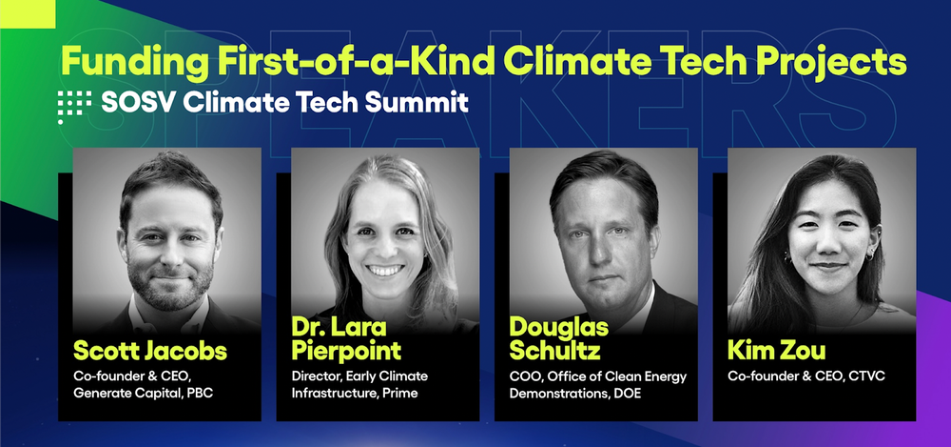
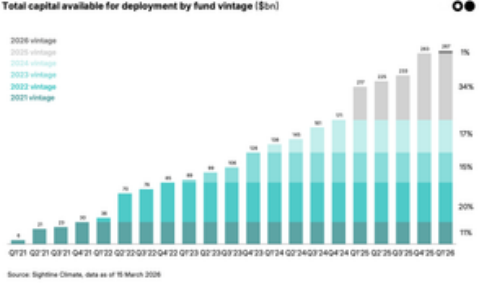
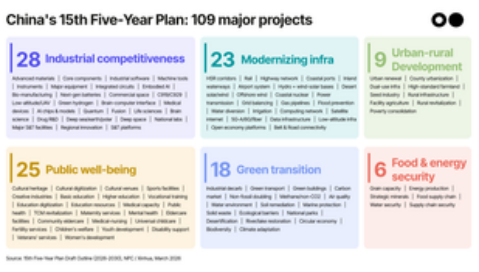
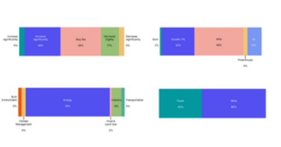
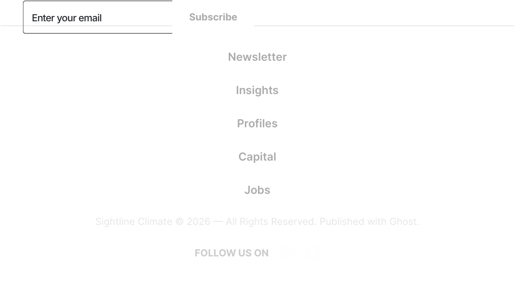

## What the FOAK? 🌍 

Financing around first- or early-of-a-kind project risk 

## **Insights, Investing, Investors, FOAK** 

by Grace Donnelly on October 05, 2023 

Building climate tech projects is tough. Building a first-of-a-kind (FOAK) climate tech project is much tougher. From securing financing to forging a partnership with a developer, the inherent uncertainty around FOAK (or even the first few "early-of-a-kind") projects means everyone is on edge about the risks and unclear about the rewards—not to mention the returns. 

Innovative climate tech companies often have no choice about being first. Creating solutions to mitigate climate impacts and transform our industrial processes requires proving new tech at legacy scale and jumping through the investor hoops necessary to get projects built. 

At SOSV’s Climate Tech Summit last week, Kim facilitated a conversation between investors across the Climate Capital Stack—including government, philanthropic, and private sources of funding—focused on functionally financing those finicky FOAK projects. The full discussion with Douglas Schultz, Chief Operating Officer of the DOE’s Office of Clean Energy Demonstrations (OCED), Dr. Lara Pierpoint, Director of Prime Coalition’s Early Climate Infrastructure (ECI) program, and Scott Jacobs, CEO and Co-founder of Generate, is available on YouTube. For those who prefer the SparkNotes version, what follows are a few highlights and a skimmable Q&A, edited for length and clarity. 

**Key takeaways** by **Sightline Climate** 

- **FOAK risk doesn’t just mean tech risk.** It can include unknowns—like new business models, unique engineering challenges, broader development risk, and adoption readiness level—and affect a number of early projects beyond the very first. 

- **Customer demand is king.** De-risking an early project often comes down to proving there are customers (ideally the blue-chip variety) willing to pay for the output and signing agreements with fixed prices and volumes ahead of time to put investors at ease. 

- **The valley of death isn’t only about a lack of financing.** It’s also about operational gaps. Developers have the know-how but are unlikely to take on FOAK projects they won’t be able to sell, and mitigating risks for early projects typically requires a level of technical expertise that capital providers like banks or VC firms don’t have in-house. 

- **There are no shortcuts** when it comes to aligning incentives and interests. Perfect the art of articulating your startup’s value proposition for various stakeholders, and then hustle to identify the right financing partners. 

- **The capital is out there, but still requires customization** every time. Whether it’s philanthropy, VCs, or infrastructure investors, these financial levers weren't designed for the current climate use-case, and development partners have to do the project-by-project work of managing risks alongside providing the financing. 

Source: SOSV 

**Kim: How do you define FOAK? Are there specific examples that you could** by **share that could help clarify that definition?Sightline Climate** 

**Doug @DOE:** Particularly in the role that we're in with OCED, it’s obviously FOAK technology. But it really is much more than that. FOAK can be a business model, it can be the markets that it's involved in. All of those provide unique situations, but I do think most people think about it as technology. If you look back at solar PV in the early days, before utility-scale was big, there had been a lot of small solar projects, but in general the market was not there to do large-scale projects. We basically needed to show business models that other financiers could look at and understand. Once they figured out the modularity around the technology and other things that they could replicate, they were able to come into that market. 

**Lara @Prime:** We have a bit of a definition challenge in this space, because often FOAK can mean everything from an early pilot or demonstration project, that may not even have a revenue stream, all the way up to something that's fully bankable by project finance and traditional sources of capital. That is a huge range of projects. So one of the things that I’d love to appeal to our community on is, can we start to converge around a little bit more specificity around those stages, since there are big differences? 

**Scott, what are the challenges you've seen with financing FOAK? How are those similar or different from the types of risk for loans Generate is looking at?** 

**Scott @Generate:** The minute you say FOAK is the minute you've just closed all your finance options, for the most part. Mainstream or deep capital pools are not interested in taking first-time risk on anything, really—business model, technology, scale-up—any of these different ways we might define it. We may be ruining our chances for financing FOAK by calling it FOAK in the first place. But I also hesitate to paint with a really broad brush when talking about financeability or viability of a technology or of a project. You really have to get into the nuts and bolts of an individual project—project by project—to understand the underlying risks. 

Generate has been active in trying to pioneer new asset classes of infrastructure since our inception about 10 years ago and build that bridge to bankability for these types of assets. We're taking on risks that others wouldn't take. It's not just about capital taking risk. It's actually people—a lot of different types of people—that need to take the risk to build a project, whether it's for the first time or for the Nth time. There are people building the project, and there are people involved in using the project. Those people are often moreby 

**Sightline Climate** 

important than anything an Excel model or a financier might tell you about the risks involved. 

At the end of the day, is there customer demand for what the project is going to produce? If that customer demand is solid enough, they might be willing to sign a contract with a fixed price for a fixed volume of output. Once you start getting that level of granularity and contractual obligations with other people, other entities, other stakeholders, you start to mitigate the risks that financiers will see with respect to a project. 

## **How would you categorize the types of risks you’re considering when financing projects? You mentioned demand and offtake. What are the other broad categories you're thinking about?** 

**Scott:** One of the most underappreciated risks involved in building a project, whether it's the first time or the Nth time, is the actual development of the project. A technology company is not a development company, and by the way, neither is a development company a technology company. They are completely different competencies, completely different business models, talent bases, cultures, etc. In the absence of project developers willing to take a risk on either a new business model or a new technology, the technology company takes on the risk of trying to build that project. And they’re not very good at it usually. 

What we try to do is help these technology companies either find a good developer who would be willing to take that risk or build some of that development capability. You have to be able to develop a project, which means finding the land, getting the regulatory approvals and permits, selecting an engineering firm, getting the supply chain in place, getting that revenue contract. It probably means building the financing and the capital stack for that project. These are all things that have almost nothing to do with the development of the technology itself, which is what venture capitalists are good at funding, right? It takes a lot of different stakeholders to come together to actually build a successful project. When you're doing something for the first time, it’s very hard to even incentivize all those stakeholders to try, much less to actually succeed at bringing the best of all of their capabilities so that you have a successful project built and financed. 

**Lara:** We talk sometimes about how the Silicon Valley culture is to fail fast and break things, which is great when you're developing technology and pretty much the opposite of what you want culturally if you're developing a project. At by Prime’s ECI program, we're also thinking about all of these risks, because every **Sightline Climate** 

project is really different. So understanding very specifically which kinds of risks apply. And, particularly if we're going to bring philanthropy to the table, how can we be really targeted and surgical around the things that we're trying to support? 

So certainly the project development risk, the offtake risk is big. There are some nuances with what’s basic technology risk and engineering scale-up risk. Project execution risk is buried in there and the development elements of what actually needs to happen. And then there's obviously all kinds of market and policy risks to take into account as well. 

**Doug:** It's hard to have a conversation with somebody who's developing a technology and then tell them that there are other areas that are as risky or maybe even riskier, in a sense. Development capital is the hardest capital raise. There are things that happen that are completely outside of your control sometimes. There’s also no cookie-cutter model. This is not something where you can just say, ‘Well, I saw this done over there. Can I just do the same thing over here?’ You have to understand the tools and then be creative about how you use them, and that is not an easy skill set to find and get everyone on the same page. 

## **How do you think about different types of capital and where project finance or philanthropy sit within the stack?** 

**Scott:** There are certain players in the ecosystem now taking on new risks than they have in the past. Twenty-five years ago, I was in the venture world for technology companies, primarily focused on software, and a late-stage venture investment was a company that was producing a lot of revenue. If it wasn't producing a lot of revenue, it was an early-stage venture capital investment. Well, unless you've built a bunch of projects, or sold your technology into a bunch of projects as a technology company in climate tech, you don't have a lot of revenue. There may be a need for rethinking venture capital stages when you've got project risk involved in the proof of the technology's viability. And it's exactly here where there’s the capital gap. But there's a capital gap in large part, in my view, because there's an operational gap. 

Most developers' incentives are to build projects they can sell. That's how they make money. You can't sell a project if everybody who is in the buyer universe thinks it's too risky to buy. The technology companies often try to build that development capability themselves out of necessity, but will their venture by capitalists fund that? That's still early-stage venture because they don’t have **Subscribe Sightline Climate** 

revenue. So the cost of capital for those first projects, not just the first project, but for the projects, is quite high. Do the economics for those projects then work with that high cost of capital? 

Far too often, I hear from an entrepreneur or a venture capitalist, “We've proven it at pilot scale. It's ready. It's ready for Citibank to make a loan and for Generate to take the equity stake.” That's the wrong conversation to have. The conversation needs to be, “How many hours has it operated successfully, continuously in the exact form we're talking about proposing for this next iteration of it? How many blue-chip players have been willing to put their seal of approval on it, whether it's an insurance provider or an EPC or a customer willing to buy the output?” 

We still haven't really addressed this exact point that once you're at pilot stage, how do you get to an at-scale roll-out of the solution that mainstream capital will find safe enough to put their money at risk for? That's both the capital and human capacity gap that really represents the continuing valley of death for many of these solutions. 

**Lara:** On the philanthropic side, we're still honestly finding our way around the best role for philanthropy to play. It's incredibly important for philanthropists to make sure that their money is really going towards the highest, best use and is doing something that ultimately is going to have impact. That's their north star beyond all of the financial metrics that obviously really matter within these projects. That's what we're experimenting with in the ECI program. How can we really try to get things moving in this space, help bridge those gaps? But make sure we're doing it with a really strong impact mindset. 

But just to be clear, all of these sources of funding are potentially available, and none of them is perfect. None of these were really designed to do what needs to happen right now in climate tech. And that's really the “why” of philanthropy at this stage. Philanthropy can work in tandem with the private sector to really make these kinds of projects happen, and ultimately to create the pathways to scale the mechanisms we're going to need. 

## **How does government funding fit in?** 

**Doug:** At OCED, we can actually help defray some of those FOAK costs by putting grant money in. But it’s not only what we do, it's going to be figuring out who your partners are and how to share some of those benefits, too. If someone by is coming in and actually helping you to move a project forward, they're not **Subscribe Sightline Climate** 

going to do it just for that first project. They may do it because they're helping to move a technology along. 

There needs to be an openness to a lot of different conversations about how to share some of that value that's being created by having the first or second project done, with the capital that's coming in to do that. And on FOAK, it’s really about variability. So I think financiers in general will take risk, but they need to understand what the bounding of that risk is. Then you can bring insurance in, then you can figure out what the leverage is for debt, then you can figure out what your return expectations are. 

## **What factors exist, beyond just more capital, that could actually mitigate these bankability risks?** 

**Scott:** In 2014, we did battery storage. Everybody thought we were crazy. Now everybody thinks we were ahead of the curve and everybody's clamoring to get into battery storage. It's only been nine years, but even then I would have pointed out that we've had the technology that we were using in our battery storage projects sitting on our private parts and next to our brains in different forms, and we didn't think it was risky in those forms. But somehow we think it's risky in a server rack in the basement of a building with a bunch of software and cooling equipment and other safety provisions taken. It was a business model change that solved an important customer problem. 

In 2016, we did hydrogen fuel cells in forklifts. Most people would have said we were crazy then, too. We did it because we were solving a very specific problem for a very specific customer. Then we did the work to understand whether the technology, the engineering, the development, the insurance could all fit together in such a way that we were comfortable with the overall risk profile. 

So if you're willing to do the work on a project-by-project basis, and you have the team in place to not only understand the technology risk or the financing risks, but you actually have the team to do the work to mitigate the risks— venture firms don't have that. Banks don't have that. This is work that either development companies, infrastructure operators, or engineering firms have to do. If you do that work, you can start mitigating these risks and then you can bring the financing along because you've mitigated those risks. 

**What are some other examples from the last decade of implementations of funding towards early climate tech projects? What other sectors or** by **technologies are coming up the curve? Sightline Climate** 

**Lara:** One of the things that's hard about the climate tech space is that the incentives are not always there, because sometimes, really, this is about GHG emissions reduction. So for example, we're seeing a lot of activity in the carbon dioxide removal space, and there are some great buying signals associated with certain big tech companies, but we need government-level procurement of carbon dioxide removal to create a stronger demand signal there. We're also seeing a lot of activity around things like geothermal energy generation. We at Prime and ECI are focused on electric vehicle charging, because we really see that as the sticking point to get EVs on the road and decarbonize transportation. 

**Doug:** A lot of it is just continuing to drive all the various pieces. The situation now is not the same as it was 10 years ago, where you could look at an isolated project and technology. We're talking about the new hydrogen economy now, and it's very complicated. Regionally, it's different. You're going to have different strengths and weaknesses, different use cases, the transmission grid and everything—it’s all interrelated. There's a lot you have to look at now when you're thinking about viability and how all these pieces come together, which makes it really exciting as well. 

**Scott:** We just funded a hydrogen development portfolio and partnered with a developer to go after green hydrogen opportunities. But our specific business approach here, probably unsurprising given my earlier comments, is that we have specific customers who have a specific need and a specific willingness to pay under a contract for green hydrogen. So we're building for them and figuring out how we can replicate and scale that. 

## **What is the one thing you would tell climate tech founders if they're thinking about raising financing for projects later down the road?** 

**Scott:** Be very careful selecting your partners. You need the right capital partners, development partners, regulatory partners. No matter what people say, there are no shortcuts—not only to finding those right partners, which takes a lot of work, but to aligning your interests with all of theirs. That takes a tremendous amount of work, but do the work. You won't regret it. And if you don't do the work, you will. 

**Doug:** Understand what your value proposition is, and that it's going to be different to different people. There are some that may have a higher willingness to pay for something. You may go after that market first, but it goes hand-inhand. You need to make sure that all those partners understand, and they by understand the value that they're getting. Then everybody is aligned. But that’s **Sightline Climate** 

something that sometimes founders don't understand—they understand their technology, but they're not understanding why it's actually valuable to somebody. 

**Lara:** I'm going to speak to the founders who are in it for impact, who are really here for solving the climate problem and getting to net zero, because those are the folks we want to be working with. What I will say to them is don't ignore equity issues and community engagement. For a long time, it's been seen as something that's sort of an add-on to how we think about the climate space, and we need to rethink that. This is not just because that's the right thing to do. It's because that's how we're going to solve the climate problem—by actually engaging communities. That is going to speed up your project development process. That is going to enable you to have impact at global scale, so that’s something that needs to be integrated into your thinking from moment one. 

Craving more FOAK content? Don’t miss our foundational perspectives (and helpful graphics) on bankability blockers, project development risks, and the evolving Climate Capital Stack. Then pull up more of CTVC at SOSVlast week to watch over your lunch break, like this video of Markand Nat Bullardsharing the analyst POV on this moment in climate tech. 

**Subscribe Now** 

by **Subscribe Sightline Climate** 

## Related posts 

## 🌏 New: The 2026 Climate Dry Powder & New Funds Report 

$90bn in climate dry powder in Q1 2026, after record fundraising in 2025 

Insights 

## 🌏 Hot off the press: China’s 15th plan for the era of security 

A breakdown of China’s new FYP and what it means for the next decade of the energy transition 

Newsletter 

## 🌍 Your 2026 prediction bets are in 

We asked, you answered, and experts weighed in on 2026 

Newsletter 

by **Sightline Climate** 

## Join over 60,000 readers 

and keep up to date on the frontlines of climate and innovation 

**----- Start of picture text -----** 
Enter your email Subscribe Newsletter Insights Profiles Capital Jobs Sightline Climate © 2026 — All Rights Reserved. Published with Ghost. FOLLOW US ON **----- End of picture text -----** 

