## **PAPER • OPEN ACCESS** 

## A deterministic method for the fast evaluation and optimisation of the 3D neutron wall load for generic stellarator configurations 

To cite this article: Jorrit Lion et al 2022 Nucl. Fusion 62 076040 

View the article online for updates and enhancements. 

## You may also like 

- Apache Point Observatory (APO)/SMARTS Flare Star Campaign Observations. I. Blue Wing Asymmetries in Chromospheric Lines during Mid-M-Dwarf Flares from Simultaneous Spectroscopic and Photometric Observation Data Yuta Notsu, Adam F. Kowalski, Hiroyuki Maehara et al. 

- Characteristics that Produce White-light Enhancements in Solar Flares Observed by _Hinode_ /SOT Kyoko Watanabe, Jun Kitagawa and Satoshi Masuda 

- MIRA: a multi-physics approach to designing a fusion power plant 

- F. Franza, L.V. Boccaccini, E. Fable et al. 

This content was downloaded from IP address 73.63.211.100 on 04/09/2026 at 05:00 

International Atomic Energy Agency 

Nuclear Fusion 

https://doi.org/10.1088/1741-4326/ac6a67 

Nucl. Fusion **62** (2022) 076040 (10pp) 

# **A deterministic method for the fast evaluation and optimisation of the 3D neutron wall load for generic stellarator configurations** 

## **Jorrit Lion**[1][,] _[∗]_[,][a] **, Felix Warmer**[1][,][a] **and Huaijin Wang**[2][,][a] 

> 1 Max Planck Institute for Plasma Physics, D-17491, Greifswald, Germany 

> 2 Dept. of Physics, Yale University, New Haven, CT 06511, United States of America 

E-mail: jorrit.lion@ipp.mpg.de 

Received 8 March 2022, revised 19 April 2022 Accepted for publication 26 April 2022 Published 18 May 2022 

## **Abstract** 

The neutronic assessment of a fusion power plant design is usually a challenging and timeconsuming task involving experts from several disciplines in order to assemble the geometry, source, as well as carry out computationally heavy Monte Carlo transport simulations. In order to overcome this challenge, we present in this work a deterministic method, which combines all these aspects in a single framework that can directly calculate a key neutronics performance indicator, the neutron wall load (NWL), at minimal computational cost for arbitrary stellarator configurations. As our method is based on simple vector and matrix manipulations, a speed on the order of a few CPU-seconds is achieved, which makes it suitable for optimisation frameworks. We demonstrate with a simple optimisation algorithm that it is possible to use our method to generate a first wall with reduced ‘heterogeneity’ in the NWL distribution. 

Keywords: HELIAS, neutron wall load, stellarator engineering, stellarator optimization 

(Some figures may appear in colour only in the online journal) 

## **1. Introduction** 

One of the most important aspects in the design process of a fusion power plant is the neutronic analysis. The high energetic 14 MeV neutrons that are generated by the burning deuterium–tritium plasma carry 80% of the fusion power. Consequently,neutronicassessments are essential to guarantee that the blanket can absorb this power and critical components, like the magnetic field coils, are protected from heat and neutron damage. Furthermore, the nuclear analysis must ensure that the breeding blanket producessufficient tritium to fulfil the 

> _∗_ Author to whom any correspondence should be addressed. a These authors contributed equally. 

Original content from this work may be used under the terms of the Creative Commons Attribution 4.0 licence. Any further distribution of this work must maintain attribution to the author(s) and the title of the work, journal citation and DOI. 

fuel self-sufficiency of the plant as well as reliably estimating the blanket and first wall (FW) lifetime. 

To derive these key neutronics design parameters, accurate Monte Carlo particle transport simulations are required in complex three-dimensional geometry. This, in turn, requires an appropriate CAD model of the most important systems (i.e. FW, blanket, magnets, etc) and an accurate description of the 3D neutron source. The (manual) generation of a suitable CAD model is generally very time-consuming and error prone. Furthermore, to obtain a valid representation of the key neutronics parameters to sufficient accuracy, a Monte Carlo sampling size on the order of 10[8] –10[9] is usually required—tractable only by high-performance super-computers. 

All these aspects are particularly true for stellarators, which add an additional layer of complexity to the geometry. A first prototype study has shown that a Monte Carlo approach is still 

1741-4326/22/076040+10$33.00 Printed in the UK 

© 2022 The Author(s). Published on behalf of IAEA by IOP Publishing Ltd 

feasible in attaining the key neutronics parameters for stellarators, however, the required effort is considerable making the fast evaluation of different stellarators designs or iterations a challenging task [1, 2]. Although activities for stellarator blanket design now shift towards parametric models for a more generic class of stellarator geometries [3, 4], such methods still rely on time consuming Monte Carlo methods. This fact is concerning in light of the number of new optimised stellarator geometries that can be readily achieved by theory efforts [5–8], which require fast automated tools to evaluate reactor relevant properties at the optimization stage. 

In particular, stellarator optimisation has gained more momentum in the recent years aiming to generate new promising stellarator reactor candidates. But in order to judge the engineering feasibility of new configurations, a framework is required that can provide an engineering assessment within reasonable time and resources allowing for fast design iterations and engineering optimisation. This includes, specifically, the neutronic and nuclear assessment to obtain key design parameters. Furthermore, in order to design stellarator coils, a hypersurface is required which sets the constraint for the required coil-plasma distance. For a reactor, this hypersurface is likely set, or at least strongly influenced, by the neutronic parameters. As the lifetime of the blanket is determined by the peak loads, a wall with small neutron load variations is a strong design driver for a stellarator reactor. In addition, strongly heterogeneous neutron loads would add on to the requirements of a potential stellarator blanket design, which, in the worst case, would lead to distinct designs for the respective area. It should be noted that regions with low neutronic loads are likely still desired in a power plant, e.g. to allow for ports or penetrations. 

In order to address these requirements, we propose in this work a deterministic method for the fast evaluation of some key neutronics parameters for arbitrary 3D stellarator geometries as an alternative to the laborious Monte Carlo approach. Deterministic methods for neutronic purposes are not new, but have a long history for axisymmetric tokamak geometries dating as far back as 1972 [9, 10]. However, to our knowledge, such methods were never developed for full 3D stellarator geometries and presented here for the first time. 

As a first step, we concentrate in this work on the so-called neutron wall load (NWL) as a key performance indicator. In the community and this context, the NWL is considered to be the neutron flux that crosses the FW (i.e. neutron power per FW surface area). This is to be distinguished from the actual neutron power that is deposited in the FW. At the high energy of 14.1 MeV, the neutrons are essentially passing through the FW, which usually is only several centimetres thin, while the main scattering and interactions take place in the blanket and shielding area, which typically is about one meter thick. 

Nonetheless, the NWL is an important parameter and valuable proxy as it allows to estimate the lifetime of the FW and blanket. Furthermore, it can also be used in subsequent steps to roughly estimate the tritium breeding ratio. In today’s experiments, the NWL can also help to inform decisions about the placement of neutron diagnostics, such as done in [11]. Such assessments are, however, left for future work with the focus here lying on the NWL. 

The structure of the article is as follows. The details of the new method are presented in section 2 and for validation compared against Monte Carlo results in section 3. Based on the new method, the NWL for several stellarator configurations will be compared in section 4. Finally, we show in section 5 that the new method is suited to generate and optimise a FW with respect to ‘homogeneity’. The work is concluded by a brief summary in section 6. 

## **2. Methodology** 

The calculation of the NWL can, in general, be broken down to three tasks: 

- (a) The generation of the neutron source. 

- (b) The definition (or generation) of the FW. 

- (c) The computationof the NWL itself—given the source and the FW. 

Usually, this procedure involves several teams from different disciplines, i.e. physicists that describe the plasma and neutron source, engineers that develop a CAD model for the FW and attached components, as well as neutronic engineers that consolidate the data into appropriate formats to execute computationally heavy Monte Carlo particle transport simulations. 

Our ambition here is to combine all these steps together in a single and fast framework aiming to calculate key neutronics performance indicators for arbitrary magnetic configurations at minimal computational cost. This strategy is, in particular, aimed at stellarator optimisation applications. Our method aims to provide a fast neutronic assessment for generic stellarator configurations based on the plasma shape only. Consequently, the fundamental input for our method is a stellarator magneto-hydrodynamic field equilibrium in the form of Fourier coefficients as e.g. provided by the MHD equilibrium code VMEC [12]. This method can then either be used directly within an optimization framework at some point, or, to quickly compare several equivalent optimised stellarator configurations in terms of their neutronics performance in e.g. in a systems codes context [13, 14]. 

## _2.1. Neutron source generation_ 

_2.1.1. Coordinate transformation._ The usual coordinate system of a 3D stellarator magnetic equilibrium are the VMEC coordinates ( _s_ , _u_ , _v_ ), where _s_ is the flux surface label, _u_ a poloidal coordinate and _v_ the cylindrical azimuthal coordinate [15]. Every stellarator symmetric flux surface can be represented by a series of Fourier coefficients which map ( _s_ , _u_ , _v_ ) to the boundary in R[3] . In cylindrical real space coordinates ( _R_ , _φ_ , _z_ ) the boundary of a flux surface with coordinate _s_ is given as 

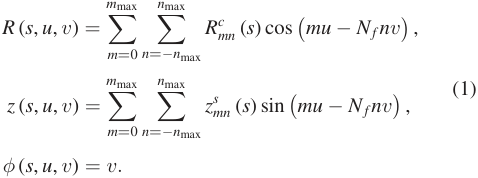

Here, _R[c] m_ , _n_[(] _[s]_[)][and] _[z][s] m_ , _n_[(] _[s]_[)][are][the][Fourier][coefficients][at][the] flux surface coordinate _s_ . _m_ and _n_ are the poloidal and toroidal mode numbers, which usually have a resolution on the order of _∼_ 10, and _N f_ is the periodicity of the magnetic configuration, also called the number of field periods. Equation (1) can be extended by a set of Fourier coefficients _R[s] mn_[(] _[s]_[) and] _[ z][c] mn_[(] _[s]_[) for] non-stellarator symmetric flux surfaces, but the generalisation is straight forward and is left out here for simplicity reasons. 

The advantage of representing the plasma geometry in basis functions—in this case in sines and cosines—is that every point of the neutron source is given analytically. Thus, a discretisation of the source in real space, namely in each coordinate _s_ , _u_ , _v_ , can be flexibly chosen by defining the number of discretization points _Ns_ , _Nu_ , _Nv_ in each coordinate, such that _si ∈{s_ 1, _. . ._ , _sNs }_ , _ui ∈{u_ 1, _. . ._ , _uNu}_ , _vi ∈{v_ 1, _. . ._ , _vNv }_ . 

In order to handle the coordinate transformations from VMEC to cylindrical coordinates efficiently, it is convenient to express the Fourier coefficients _Rmn_ and _zmn_ of each flux surface as a matrix with the dimensions _m_ max _×_ (2 _· n_ max + 1). Similarly, the cosine and sine part of equation (1) can be formulated as a matrix with the same dimensions for each individual discretisation point _ui_ , _v j_ : 

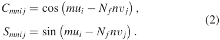

Using this matrix notation, the cylindrical coordinate _Ri_ , _j_ for each discretization point _i_ , _j_ can then be simply written as 

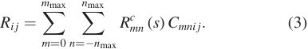

Also derivatives of the form _∂R/∂u_ can be calculated analytically by pre-scribing the matrix 

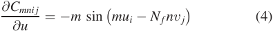

The derivative of the cylindrical coordinate _Ri_ , _j_ ( _s_ ) is then simply 

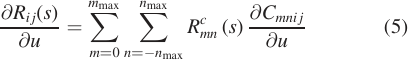

Similarly, the same notation can also used for the _z_ coordinate and sine matrix as well as derivates with respect to _v_ . It shall be noted that equations (3) and (5) (and similarly the _v_ derivative and _z_ coordinate) are simple dot products which can be executed very fast numerically. 

_2.1.2. Plasma profiles._ In addition to the plasma geometry, profiles of the plasma density and temperature are needed to calculate the neutron source. For the deuterium–tritium reaction, the required profiles are the particle density _n_ D and _n_ T of deuterium and tritium as well as their temperature _T_ D and _T_ T as function of the flux surface label _s_ . 

The profiles can be either given as an external input, stemming from e.g. plasma transport simulations, or used as parametric functions, which we use here in the form of 

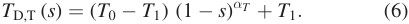

**Figure 1.** Example of the neutron birth rate _f_ as function of the normalized minor radius _ρ_ = _[√] s_ using equation (6) with _αT_ = 1.2, _αn_ = 0 _._ 35, _n_ 0 = 3 _×_ 10[20] m _[−]_[3] , _T_ 0 = 15keV, _T_ 0 = 0 and _n_ 0 = 0. 

Here, _T_ 0 is the central temperature, _T_ 1 is the temperature at the edge, and _αT_ modifies the ‘steepness’ of the profile. _n_ D and _n_ T are defined in the same way using the parameters _n_ 0, _n_ 1 and _αn_ . 

The volumetric neutron emission rate density _f_ ( _s_ ) is then simply given by 

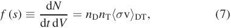

where _⟨σ_ v _⟩_ DT is the reaction rate of the deuterium–tritium reaction for which we use the standard Hale–Bosch formula [16] as function of the ion temperature _T_ D,T =[1] 2[(] _[T]_[D][ +] _[ T]_[T][).] An example of _f_ ( _s_ ) is shown in figure 1. 

_2.1.3. Neutron source emission rate._ Finally, the neutron source emission rate dΦ[source] ( _R_ , _φ_ , _z_ ) per unit time can then be obtained by 

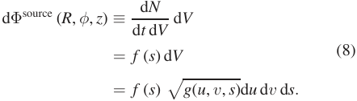

For a discretized point using a uniform discretization ( _s_ , _u_ , _v_ ) _→_ � _si_ , _u j_ , _vk_ �, dΦ[source] can be integrated discretized using a simple midpoint rule, 

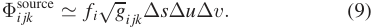

Here, _[√] g_ is the Jacobian of the coordinate transformation _i jk_ ( _s_ , _u_ , _v_ ) _→_ ( _R_ , _φ_ , _z_ ) evaluated at � _si_ , _u j_ , _vk_ �. _[√] g_ can be analytically calculated from the representation given in equation (1). Φ[source] ( _R_ , _φ_ , _z_ ) is now sensitive to the chosen discretization, resulting in a tensor of the dimension _Ns × Nu × Nv_ . 

## _2.2. Generation of the first wall_ 

Conventionally, the FW is often an outcome of a CAD model that is assembled by engineers for a specific design and consequently time- and resource-consuming. In the following, we are presenting two methods to directly construct a first guess for a FW from the given magnetic field geometry. However, an externally generated FW can also be directly used as input for the calculations, as only an ordered (poloidally and toroidally) point cloud is needed as input. 

_2.2.1. Equidistant first wall._ In order to protect the FW from plasma radiation and energetic neutrals, it is essential that the FW has a minimum distance to the last-closed-flux-surface (LCFS) of the plasma on the order of several 10’s of cm. Consequently, a simple, yet good approximation for the definition of a FW is to have an equidistant gap between the LCFS and the FW at every point. 

Since the LCFS is given analytically in the form of equation (1) with _s_ LCFS = 1, also the surface normals on every points of the LCFS can be analytically calculated by 

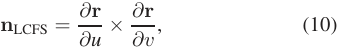

where **r** is the positional vector of any point on the LCFS. The components of _[∂] ∂_ **[r]** _u_[and] _[∂] ∂v_ **[r]**[in Cartesian coordinates are] 

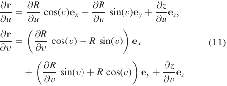

**e** _x_ , **e** _y_ , **e** _z_ are the Cartesian unit vectors. Finally, the discretized coordinates of an equidistant wall are then given by 

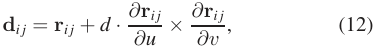

for a pre-defined plasma-wall distance _d_ . 

In addition to equation (12), as we will show in subsection 2.3, also the surface normals are needed. Assuming **d** _i j_ is ordered poloidally and toroidally, these can be calculated by 

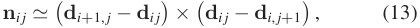

with periodic boundary conditions applied, **d** _Nv_ +1, _j_ = **d** 1, _j_ , **d** _i_ , _Nu_ +1 = **d** _i_ 1. 

Ideally, **d** _i j_ are ordered poloidally and toroidally and can be used to calculate the wall load. If **d** _i j_ are not ordered however, which can be the case if _d_ is chosen too large, equation (12) can instead be applied incrementally,using a consecutive interpolation and Fourier transformation, which we will address briefly in the next subsection. 

_2.2.2. First wall in Fourier representation._ Another way to generate the FW is to directly describe the surface of the FW by Fourier coefficients the same way as is done for flux surfaces. Consequently, the surface normals of the FW can be calculated directly, similar to equation (5) To generate appropriate Fourier coefficients for the FW that follow the shape of the plasma geometry, it suffices to multiply the leading Fourier coefficients _Rm_ , _n_ and _zm_ , _n_ , � _m_ , _n_ ≲ 2� of the LCFS or some inner surface with fixed scaling factors _f[R] m_ , _n_[and] _[f][ z] m_ , _n_[:] 

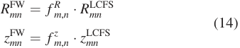

where _R_[FW] _mn_[and] _[ z]_[FW] _mn_[are now the Fouriercoefficients for the FW.] While some experience and iteration is needed to find suitable 

scaling factors _f[R] m_ , _n_[and] _[f][ z] m_ , _n_[(the most obvious choice would] be _f[R]_ 10[=] _[f][ z]_ 10 _[>]_[ 1), the great advantage of this method is that] the FW is given now in terms of Fourier coefficients directly and very cost efficiently. Every point of the FW can then be directly given in Cartesian coordinates using equation (1). Furthermore, the surface normals of the FW can be calculated at every point using equation (10) as introduced in the last subsection. Another advantageof the Fourier representation is that the discretisation _Nu[w]_[and] _[ N] v[w]_[of the FW can be freely chosen.] 

It should be noted that it is also possible to combine both methods to achieve an equidistant FW in Fourier representation. To this end, an equidistant FW needs to be generated first in Cartesian coordinates using equation (12). Then, a uniform grid of new _u_ and _v_ coordinates need to be generated and after the FW points are assigned coordinates _ui_ , _v j_ , they can be interpolated to this grid. The equal spacing of the grid allows then an inverse Fourier transform of the Cartesian points to be obtain the respective Fourier coefficients of the FW. In more detail, the procedure is as follows. 

Similarly to equation (1), the Fourier transform from cylindrical space to Fourier space is given by 

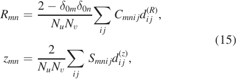

with _C_ and _S_ the cosine and sine matrices defined in section 2 and _δ_ is the Kronecker delta. _di j_[(] _[R]_[)][and] _[ d] i j_[(] _[z]_[)][are the cylindrical] _[ R]_ and _z_ component of **d** _i j_ . The Fourier transformation of points generated by the indices _i_ , _j_ in this method requires assigning a poloidal coordinate _ui_ (and also in _v_ , but this is the usual cylindrical azimuthal coordinate). _u_ can be defined e.g. by assigning an equal arclength poloidal coordinate to **d** _i j_ , 

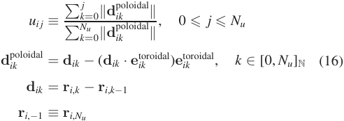

Before Fourier transforming using equation (15), the points **r** _i j_ need to be re-interpolated on an equally spaced grid in _u_ and _v_ , which can be done using dedicated interpolating algorithms, e.g. using a cubic interpolation. The newly obtained Fourier coefficients for the FW can be used to obtain a set of surface normals analytically, analogue to equation (10). 

## _2.3. Neutron wall load calculation_ 

With the neutron source and the FW set up, it remains to calculate the NWL on the FW. This is usually done by Monte Carlo raytracing with at least 10[8] samples in order to achieve sufficient accuracy. To provide a less time consuming method for calculating the NWL, over time, several simple analytic 

expressions were derived for axisymmetric tokamaks aiming to avoid time-consuming Monte Carlo based methods. So far, to the authors knowledge, no such method exists for nonaxisymmetric, complex 3D geometries. We will present in the following a new method that will close this gap. 

In the plasma chamber, the neutrons are neither influenced by collisions, nor electric and magnetic fields. As the background plasma particles are comparably slow compared the fusion neutrons, the neutrons can be considered to be mono-energetic in the plasma vessel with an energy of _En_ = 14 _._ 1 MeV and furthermore are distributed at each source point isotropically. As the intensity of the neutron flux decays over the sphere shell with 1 _/r_[2] , where _r_ is the distance to the source, we can write the NWL _Q_[NWL] on the FW as an integral over the volume of the fusion source _Vs_ , 

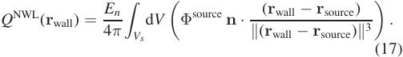

The term **n** _· ∥_ (( **rr** wallwall _−−_ **rr** sourcesource)) _∥_[accounts for][the][inclination][angle] of the FW with respect to the source point. 

Essential for this formula are the surface normals of the FW **n** for which expressions have been presented in subsection 2.2. The neutron source density _f_ as described in section 2.1 is the equivalent of the radiance _L_ . 

Given a discretisation of the source with _Ns_ , _Nu_ , _Nv_ number of points for every dimension respectively, it suffices to use one index to describe all the source points by numbering the points with _κ ∈{_ 1, _. . ._ , _Ns · Nu · Nv}_ . Similarly, the same can be done for the FW discretisation with the index _α ∈{_ 1, _. . ._ , _Nu[w][·][ N] v[w][}]_[.][By][using][the][index] _[κ]_[for][the][source] points and the index _α_ for the FW, the NWL of each wall element can be written as: 

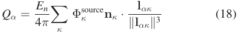

Here, **l** _ακ_ = � **r**[(wall)] _α −_ **r**[(source)] _κ_ � and, as also previously,the bold symbols indicate the three space dimensions of the vectors. 

Since all of the calculations for the source, the FW (surface normals), as well as for the NWL are simple vector-matrix operations, the required computational resources are very low: one evaluation of equation (18) takes about _∼_ 1 s on a single CPU (for reasonable discretization accuracy, e.g. _Ns_ = 32, _Nu_ = 128, _Nv_ = 256), which is about five orders of magnitudes faster than a comparable Monte Carlo raytracing run. However, it shall be stressed again that equation (18) only resolves wall loads to a given surface and does not account for scattering or volumetric absorption. But in principle it appears possible to generalize the formula to volumetric targets by including scattering absorption cross sections as well as material thicknesses, but this is beyond the scope of this paper. 

Another argument for low calculation is the ability to use the framework for optimisation purposes—an example will be discussed in section 5. 

It should also be noted that equations (17) and (18) imply that every point of the source volume can hit the wall element 

on a direct way. We will show in the next section that this is not always the case—in particular, for concave wall shapes. 

## **3. Validation** 

In order to assess the accuracy of the new method, we perform a comparison against the well-established Monte Carlo N-Particle code MCNP [17, 18]. 

Of course, MNCP not only calculates the NWL, but also includes nuclear material data and respective cross sections to calculate displacements per atom and neutron energy deposition in volumetric targets. Nevertheless, as it is an established tool to perform also NWL calculations, we use it as a benchmarking tool here for both, a stellarator and a tokamak device. 

## _3.1. Stellarator device_ 

For the stellarator case we use an existing neutronic analysis simulation that was carried out for the HELIAS 5-B stellarator reactor design [1]. 

The relative and absolute difference between our method and the MCNP result is shown in figure 2. While the mean deviation fromthe MCNP result is only 5%, specific areas exist that have a much higher relative error on the order of 20%. The absolute error, on the other hand, is nearly everywhere below _<_ 0 _._ 2 MW m _[−]_[2] . 

The high relative error appears predominantly in regions where the NWL is very small ( _∼_ 0 _._ 2 MW m _[−]_[2] ) and consequently, small absolute deviations can cause high relative errors. It can be seen from figure 2 that the high relative error can be found at the ‘ridges’ of the geometry close to the divertor gap. These areas feature a concave shape and see more NWL than there should be. The reason for this is that our method currently does not check the ‘line-of-sight’, which means that neutron contributions are counted from regions that would be normally intercepted by other parts of the geometry. 

A related systematic error of the method are neutron contributions that hit the backside of the FW. Most of these contributions can be filtered out by only counting contributions that fulfill **n** _·_ **l** _>_ 0. However, this introduces a small bias between the inboard and outboard side of the FW. 

Both errors can, in principle, be corrected by doing a ‘lineof-sight’ check via raytracing techniques. However, such additional calculations would slow down the method significantly and the resulting error, without an eventual ‘line-of-sight’ check, remains acceptable. Nonetheless, such a feature can be implemented if more accurate results are desired. 

Last, but not least, a part of the deviations stems from the fact that we had to use a mesh that was extracted from a CAD model. The extracted mesh that we used in our method was a triangulated mesh compared to the quadratic structure of the CAD model. Furthermore, the extracted mesh had some artifacts causing singular points to have large deviations. The difference of the mesh has an influence on the surface normals, which could be slightly different. In order to be able to compare the data for both methods, we had to use an interpolation to bring the data together on the same grid. Both linear and 

J. Lion _**et al**_ 

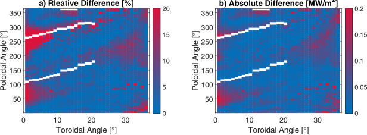

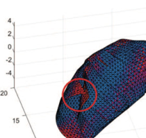

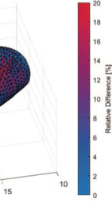

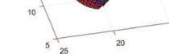

**Figure 2.** Relative ( _a_ ) and absolute ( _b_ ) difference between a Monte Carlo calculation and the method presented here in one half-module. The white stripe is a gap in the geometry, where the divertor would be located. The red circle indicates a region where the line-of-sight criterion would be violated as discussed in the text. 

nearest neighbour interpolation showed similar results, may introduce an additional error in the comparison. 

## _3.2. Tokamak device_ 

Similar to the last subsection, we also use an existing neutronic analysis simulation for the Tokamak benchmark, which was carried out for a version of the European tokamak DEMO in [19]. 

The used geometry of the wall and the plasma as well as the simulations results for both, our method and the MCNP simulation are shown in figure 3. Generally we observe good agreement over the total wall area. The largest deviation, of about 15% can be seen at _u <_ 0 _._ 1, which corresponds to the divertor area. 

This effect could be explained by smoothing effects of the Fourier representation that we use, compared to the straight segment representation of the CAD model in the MCNP case. The averaged difference between both results is about 3%. 

## _3.3. Validation summary_ 

We can conclude that equation (18) and the established Monte Carlo approach are in fairly good agreement with a deviation of less than 5% on average. The occurring peak differences in the stellarator benchmark are likely induced by the highly shaped wall and ‘shadowed regions’, which equation (18) does not account for. We believe that this error can be significantly reduced by introducing a check for the ‘line-of-sight’ between source and the wall, which can be added in the future. 

We conclude that if one is only interested in the NWL, equation (18) is the preferable option compared to an MCNP run, or in principle to any Monte-Carlo based raytracing method, as evaluating equation (18) requires only _∼_ 1 s on a single CPU. This fact makes the presented method also applicable to quick design scans or for stellarator optimization purposes. 

## **4. Comparison of the NWL for different configurations** 

Using equation (18), it is now possible to perform a direct survey of the NWL for different stellarator configurations. For 

this purpose we have selected three HELIAS configurations with differentaspect ratios and numberof field periods [20, 21] as well as a recently developed quasi-axisymmetric(QA) compact stellarator configuration [8]. The HELIAS machines are chosen at a size of about 1400 m[3] plasma volume, while the compact QA machines has _∼_ 400 m[3] plasma volume. 

Parametric profiles from page 3 are used with _T_ 0 = 15 keV, _αT_ = 1 _._ 2 and _αn_ = 0 _._ 35. In order to make the configurations comparable, _n_ 0 is scaled in all configurations to match a fusion power of _P_ fus = 3 GW. Furthermore, the FW has been defined for all cases with an equidistant space of _d_ = 30 cm between LCFS and the FW. 

The ‘heterogeneity’ of the NWL can be measured by defining a ‘peaking factor’ _p_ f, 

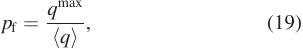

where _q_[max] is the maximum NWL on the FW and _⟨q⟩_ the average NWL of the FW. The calculated peaking factors, together with minimum, maximum and average neutron flux and relevant device parameters for the mentioned configurations are listed in table 1. Figure 4 shows the magnitude of the NWL on these equidistant FWs in those configurations in one field period. 

It can be seen that all configurations show rather similar helical features within one field period and similar peaking factors. As expected, the maximum heat load scales inversely with the aspect ratio for the same total neutron power. A higher aspect ratio machine, such as HELIAS-5, inherits a larger wall area for the same fusion power. Note that the helical variation in 4 is influenced by the choice of the poloidal wall coordinate. 

Overall, Stellarators with an equidistant FW as demonstrated here, show a rather strong 3D ‘heterogeneity’ in the NWL distribution with peaking factors _>_ 1 _._ 5. This is of concern for the blanket design of a Stellarator, as the peak loads determine the blanket lifetime, but could also have impact on the thermal stress or local cooling. Consequently, the question arises if it is possible to shape the FW in such a way as to reduce the ‘heterogeneity’and more equally distribute the neutrons. An attempt towards such a goal is presented in the next section. 

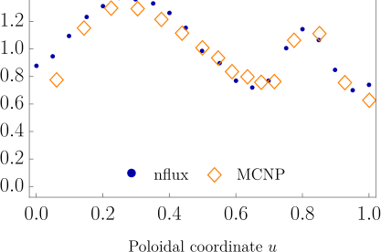

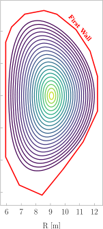

**Figure 3.** Validation of equation (18) against an MCNP run for a 2037 MW thermal power tokamak DEMO device with major radius 9.07 m, minor radius 2.93 m and elongation _κ_ = 1 _._ 59. (Left) nflux and MCNP results for the NWL in comparison, against a normalized, equi-arclength poloidal wall coordinate _u_ . (Right) The source and FW location used for this benchmark, using a reactivity profile _∝_ (1 _−_ ( _ρ_ )[2] )[1] _[.]_[7] , which is color-coded. 

**Table 1.** Main device parameters and NWL related figures-of-merit for HELIAS-3, 4, and 5, [20, 21] as well as for a QA stellarator [8]. _[∗]_ An optimized wall with respect to a low peaking factor, maintaining 1.4 Meters distance to the toroidal field coils. _[∗∗]_ An similarly optimized wall which is allowed to exceed this distance. The optimization is discussed in section 5. 

||HELIAS-3|HELIAS-4|HELIAS-5|QA-stellarator|HELIAS-5_∗_|HELIAS-5_∗∗_|
|---|---|---|---|---|---|---|
|_R_(m)|13.9|17.6|22.2|9.3|22.2|22.2|
|_a_(m)|2.2|2|1.8|1.5|1.8|1.8|
|_A_|6.4|8.8|12.3|6.3|12.3|12.3|
|_V_p (m3)|1300|1370|1420|410|1420|1420|
|_S_FW (m2)|1720|2020|2110|861|2452|2883|
|_Q_max (MW m_−_2)|2.2|2|1.9|4.4|1.2|0.9|
|_Q_min(MW m_−_2)|0.2|0.1|0.3|0.9|0.4|0.8|
|_Q_avg (MW m_−_2)|1.4|1.2|1.1|2.9|0.96|0.5|
|_p_f|1.59|1.67|1.69|1.51|1.23|1.12|

## **5. Optimisation** 

One of the overarching goals of our work presented here was to achieve the capability to modify the FW in such a way as to e.g. reduce the heterogeneity of the NWL. In the following we show a proof of concept for this approach. 

The FW can be optimized point-by-point by updating the discretization points of the wall **r** _[i] α_[at step] _[ i]_[, by the following] update, 

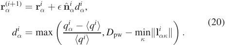

where _D_ pw is the imposed plasma-wall distance, which is a scalar value. _ϵ ≪_ 1 determines the stepsize. **n** ˆ _α_ is the normalized wall normal vector. _qα_ is the neutron load at discretization point _α_ , _⟨q⟩_ is the averaged neutron load. **l** _ακ_ is the Euclidean distance between wall index _α_ and plasma index _κ_ . 

If one wants to include the distance constraints by the coils (the FW needs to preserve a certain minimal distance to fit in a blanket in a reactor), replace _dα → d_[˜] _α_ , with 

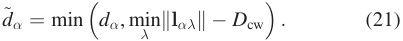

Here, **l** _αλ_ is the Euclidean distance between wall discretizations points labelled by _α_ and all discretized coil points _λ_ . _D_ cw is the imposed minimal coil-wall distance. 

An iteration of equation (20) can be performed until a convergence criterion is reached, e.g. until the discretized wall points do not change anymore, max _α∥_ **r**[(] _α[i]_[)] _[−]_ **[r]**[(] _α[i][−]_[1)] _∥ < ϵ_ conv, or until the peaking factor is converged _∥p_ pf[(] _[i]_[)] _− p_ pf[(] _[i][−]_[1)] _∥ < ϵ_ conv, with _ϵ_ conv _≪_ 1. To obtain a ‘well behaved’ wall using such an iteration, a consecutive interpolation and (inverse-) Fourier transformation according to the description in subsubsection 2.2.1 is required if the initial guess of the wall is too far away from the converged wall. 

To demonstrate the proposed algorithm, we perform an optimization of the wall of the HELIAS 5 reactor configuration at 22 m major radius, using the iterative algorithm of equation (20), until _∥p_ pf[(] _[i]_[)] _− p_ pf[(] _[i][−]_[1)] _∥ <_ 10 _[−]_[4] . A minimal wallplasma distance of _D_ pw = 30 cm is enforced. In figure 5, we show two resulting optimized walls: for one we optimize the wall geometry respecting a minimal distance of 1.4 meters to the coils. The resulting wall geometry is shown by the solid green (gray) line. The remaining freedom of the optimization space is already sufficient to decrease the peaking factor from 1.7 for an equidistant wall to about 1.2. If one further neglects 

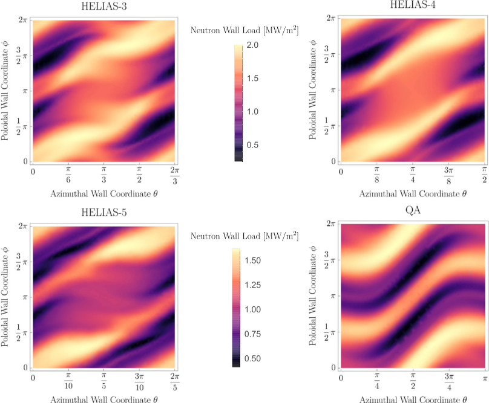

**Figure 4.** NWL for one full (stellarator symmetric) module of a HELIAS 3, 4, 5 as well as for a QA stellarator configuration. The FW was generated with an equidistant space to the LCFS of 30 cm. The fusion power is 3 GW in all cases. The machine parameters are given in table 1. 

the coil constraints, the wall can further be optimized which is shown by the yellow (light gray) solid line in figure 5. In this case, the peaking factor can be further decreased to a value of about 1.1. 

For both optimized walls, as well as the equidistant wall again, the NWL is shown in figure 6. Of course, a wall placement farther away from the plasma, not only a reduction in the peaking factor can be achieved, but also the overall NWL is decreased. This effect is stronger if the coil constraint of leaving 1.4 m space to the coils can be ignored, as more space can be used up. This exercise demonstrates two things: first, the left-over freedom given by the stellarator coils is sufficient (for some configurationsat least) to significantly decrease peak NWLs. Secondly, the NWL optimization method presented here can be used to generate an improved FW guess which can be used to re-optimize coils, respecting a minimal distance to this newly optimized wall. 

Alternatively to equation (20), in the context of on external optimization framework, equation (18) can also be used in a weighted squared sum target function _F_ , such as 

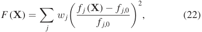

where **X** are the degrees of freedom, usually being Fourier coefficients of the plasma boundary,but can also be determined 

by the winding surface of the coils, if existent. _f j_ are scalarvalued objective functions, _f j_ ,0 the desired values, and _w j_ are respectiveweights. E.g., _f_ 0 can be defined as the NWL peaking factor _p_ f. _f_ 1 could be set to the wall area to restrict a diverging wall. To ensure a certain minimal LCFS-wall and coil-wall distance, _f_ 2 and _f_ 3 could penalize violations or those constraints or the constraint is enforced by a constrained optimization algorithm. 

## **6. Conclusions and outlook** 

The NWL is a crucial measure in any neutronic analysis of a tokamak or stellarator fusion device. It determines component lifetimes, strongly influences required coolant power and can be used to determine design limits by material constraints. It is expectedthat the NWL also serves as robust ‘relative’indicator for material displacements (dpa), volumetric neutronic fluxes and neutron heat loads in the blanket. With ‘relative’ we mean that the NWL can serve as a comparative metric to these neutronic key parameters between different configurations using the same materials. 

In this article we suggested a relatively simple workflow to determine the NWL for (nearly) arbitrary stellarator (and tokamak) geometries with arbitrary FW geometry choices. Instead of Monte Carlo sampling or relying on ray tracing methods, the method presented here uses a simple _∼_ 1 _/r_[2] 

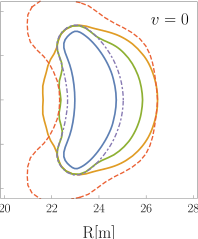

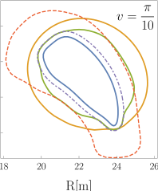

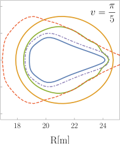

**Figure 5.** Optimized walls of a HELIAS-5 stellarator reactor FW using the algorithm in equation (20). The outermost dashed line (red) visualizes a surface of constant 1.4 m distance to the coils. The innermost dashed line (purple) is the 30 cm equidistant wall geometry. The yellow (light grey) solid line is the optimized wall which is allowed to violate the required minimum distance to the coils. The green (darker grey) solid line corresponds to a ‘converged’ wall, where the minimum distance to the coils is preserved. The resulting NWL of these walls are shown in figure 6. 

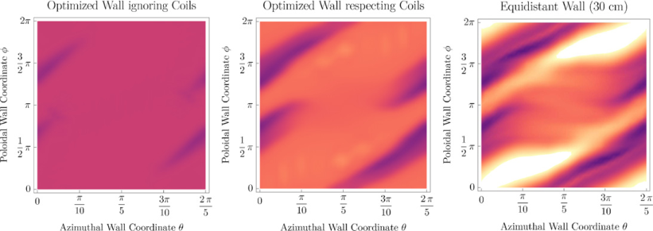

**Figure 6.** The respective NWL to the optimized walls of a HELIAS-5 stellarator reactor as shown in figure 5. (Left) The NWL of the optimized wall ignoring a minimal distance to the coils (yellow line in figure 5). (Middle) The NWL of the wall respecting the mentioned coil constraints (green line in figure 5). (Right) The NWL of an equidistant wall, 30 cm away from the plasma boundary (point-dashed purple line in figure 5). The colorscale is the same for all three cases and thus the NWL can be compared with each other. Averaged NWL and peaking factors of the optimized walls are listed in table 1. 

power decay between a discretized source and a discretized wall. For required derivatives, we make use of the fact that the source and the wall can be parametrized in terms of sine and cosine basis functions. The source weights can be determined by fusion reaction rates and the respective volume element, which can be calculated from the relevant Jacobian determinant. A sufficient number of discretization points in the source is about 10[4] –10[5] , a sufficient number of discretization points of the wall is about 10[3] . The resulting formula for the NWL was written in equation (18) and consists of a limited number of basic matrix operations which allows to evaluate the NWL for a 3D stellarator machine in a about _∼_ 1 second on a single CPU. We benchmarked the presented method and its implementation against the NWL result of two MCNP results, namely for a tokamak and a HELIAS-5 stellarator device and found good agreements. 

The importance to determine the NWL computationally efficient for multiple designs is apparent: the NWL is a strong cost driver in a fusion power plant. The time between two remote maintainance periods is determined by the minimal component lifetime, which is set by the maximum allowable neutron fluence of said reactor components. This again, directly correlates with the magnitudeof the NWL. To increase 

the time between two remote maintainance periods, it is worth to reduce peak neutronic heat loads on reactor components and reduce the ‘heterogeneity’ of the NWL. Aiming for a homogenous neutron loads is especially relevant for stellarators, which, dependent of the choice of the FW and blanket geometry, can have neutronic wall load peaking factors _q_ max _/q_ avg larger than 1.5–1.7, as was shown in this article for several distinct stellarator devices. 

In section 5, we showed that reducing the heterogeneity of the NWL and the neutron peak loads on the FW can already be addressed in the design stage of a fusion stellarator reactor device, as the FW geometry can be chosen to increase the homogeneity and reduce the peak loads. This was demonstrated by optimizing the FW geometry in a HELIAS-5 device. We could achieve a reduction of the peaking factor from _q_ max _/q_ avg = 1 _._ 69 for an equidistant wall to _q_ max _/q_ avg = 1 _._ 23 and the peak load from 1.9 to 1.2 MW m _[−]_[2] while still respecting a minimal distance of 1.4 m between FW and central filament of the toroidal field coils, which would leave space for blanket, shield and vacuum vessel thickness and half of the radial width of the toroidal field coils. If this minimal distance can be violated, either by further reducing the required space by blanket and shielding by usage of advanced materials or by 

requiring a re-optimization of the coils, the peaking factor can be further decreased to _q_ max _/q_ avg = 1 _._ 12 and to a peak neutron load of 0.9 MW m _[−]_[2] . As a result, the found FW location with reduced peak loads could also be a relevant design driver for the winding surface of the coils. The community in stellarator coil optimization usually restricts the location of the coils to maintain a certain minimum distance to the plasma. With the method proposed in this article, this restriction can be more refined, by generating a minimized peak load FW geometry, which then can be used to generate a new, to this wall equidistant, hypersurface, which again can be used as a refined optimization boundary for stellarator coil optimization algorithms. The workflow to obtain such a surface was shown and demonstrated in this article. 

A straight forward extension of the model is the inclusion of Brems- and line radiation loads by including respective source functions, as both radiation types are equivalent to a neutronic radiation, in the sense that they are isotropic in the source and the plasma is optically thin with respect to its frequency spectrum. 

## **Acknowledgments** 

The authors would like to thank Iole Palermo (CIEMAT) for their tokamak MCNP benchmark results and Andr´e Häußler (KIT) for the HELIAS 5 MCNP benchmark and many fruitful discussions over the years. 

This work has been carried out within the framework of the EUROfusion Consortium, funded by the European Union via the Euratom Research and Training Programme (Grant Agreement No. 101052200—EUROfusion). Views and opinions expressed are however those of the author(s) only and do not necessarily reflect those of the European Union or the European Commission. Neither the European Union nor the European Commission can be held responsible for them. 

## **ORCID iDs** 

Jorrit Lion https://orcid.org/0000-0002-6249-2368 Felix Warmer https://orcid.org/0000-0001-9585-5201 

- [3] Palermo I., Warmer F. and Häußler A. 2022 Nuclear design and assessments of HELIAS-type stellarator with DCLL BB: adaptation from DEMO tokamak reactor _Nucl. Fusion._ **61** 7 

- [4] PalermoAngel Nogueron´ I., AlguacilJ.,J.,RapisardaCatalán J.P.,D. andFernándezRoca F.I.,2022GarcíaDCLLA.,[´] BB development for SPP _EF-Report EFDA_D_2NQ8A7_ (EUROfusion) 

- [5] Gates D.A. _et al_ 2017 Recent advances in stellarator optimization _Nucl. Fusion_ **57** 126064 

- [6] Henneberg S.A., Drevlak M., Nührenberg C., Beidler C.D., Turkin Y., Loizu J. and Helander P. 2019 _Nucl. Fusion_ **59** 026014 

- [7] Jorge R., Sengupta W. and Landreman M. 2020 Construction of quasisymmetric stellarators using a direct coordinate approach _Nucl. Fusion_ **60** 076021 

- [8] Landreman M., Medasani B. and Zhu C. 2021 Stellarator optimization for good magnetic surfaces at the same time as quasisymmetry _Phys. Plasmas_ **28** 092505 

- [9] Dänner W. 1972 Neutron flux asymmetric in toroidal geometries. _IPP Report 4/101_ (Max-Planck-Institut für Plasmaphysik) 

- [10] Attaya H.M. and Sawan M.E. 1985 NEWLIT—a general code for neutron wall loading distribution in toroidal reactors _Fusion Technol._ **8** 608–13 

- [11] Äkäslompolo S. _et al_ 2021 Serpent neutronics model of Wendelstein 7-X for 14.1 MeV neutrons _Fusion Eng. Des._ **167** 112347 

- [12] Hirshman S.P., van Rij W.I. and Merkel P. 1986 Threedimensional free boundary calculations using a spectral Green’s function method _Comput. Phys. Commun._ **43** 143 

- [13] Warmer F., Beidler C.D., Dinklage A. and Wolf R. The W7-X Team) 2016 From W7-X to a HELIAS fusion power plant: motivation and options for an intermediate-step burningplasma stellarator _Plasma Phys. Control. Fusion_ **58** 074006 

- [14] Lion J., Warmer F., Wang H., Beidler C.D., Muldrew S.I. and Wolf R.C. 2021 A general stellarator version of the systems code PROCESS _Nucl. Fusion_ **61** 126021 

- [15] D’haeseleer W.D., Hitchon W.N.G., van Rij W.I., Hirshman S.P. and Shohet J.L. 1991 _Flux Coordinates and Magnetic Field Structure_ (New York: Springer) 

- [16] Bosch H.-S. and Hale G.M. 1992 Improved formulas for fusion cross-sections and thermal reactivities _Nucl. Fusion_ **32** 611 

- [17] Forster R.A. and Godfrey T.N.K. 1985 MCNP - a general Monte Carlo code for neutron and photon transport _MonteCarlo Methods and Applications in Neutronics, Photonics and Statistical Physics (Lecture Notes in Physics_ vol 240) ed Alcouffe R., Dautray R., Forster A., Ledanois G. and Mercier B. (Berlin: Springer) (https://doi.org/10.1007/BFb0049033) 

- [18] Goorley T. _et al_ 2012 Initial MCNP6 release overview _Nucl. Technol._ **180** 298–315 

## **References** 

- [1] Häußler A., Warmer F. and Fischer U. 2018 Neutronics analyses for a stellarator power reactor based on the HELIAS concept _Fusion Eng. Des._ **136** 345–9 

- [2] Häußler A., Fischer U. and Warmer F. 2019 Use of mesh based variance reduction technique for shielding calculations of the stellarator power reactor HELIAS _Fusion Eng. Des._ **146** 671–5 

- [19] Palermo I., Rapisarda D., Fernández-Berceruelo I. and Ibarra A. 2017 Optimization process for the design of the DCLL blanket for the European DEMOnstration fusion reactor according to its nuclear performances _Nucl. Fusion_ **57** 076011 

- [20] Beidler C.D. _et al_ 2001 The HELIAS reactor HSR4/18 _Nucl. Fusion_ **41** 1759 

- [21] Schauer F., Egorov K. and Bykov V. 2013 HELIAS 5-B magnet system structure and maintenance concept _Fusion Eng. Des._ **88** 1619 

