## **PAPER • OPEN ACCESS** 

## A general stellarator version of the systems code PROCESS 

## You may also like 

- Parametric systems analysis of the modular stellarator reactor R.L. Miller, R.A. Krakowski and C.G. Bathke 

- - Reduced-aspect-ratio stellarator reactors W.N.G. Hitchon 

To cite this article: J. Lion et al 2021 Nucl. Fusion 61 126021 

- Economically optimized design point of high-field stellarator power-plant Victor Prost and Francesco A. Volpe 

View the article online for updates and enhancements. 

This content was downloaded from IP address 73.63.211.100 on 05/09/2026 at 16:05 

International Atomic Energy Agency 

Nuclear Fusion 

https://doi.org/10.1088/1741-4326/ac2dbf 

Nucl. Fusion **61** (2021) 126021 (21pp) 

## **A general stellarator version of the systems code PROCESS** 

**J. Lion**[1][,] _[∗]_ **, F. Warmer**[1] **, H. Wang**[2] **, C.D. Beidler**[1] **, S.I. Muldrew**[3] **and R.C. Wolf**[1] 

> 1 Max Planck Institute for Plasmaphysics, Greifswald, Germany 

> 2 Department of Physics, Yale University, New Haven, CT 06511, United States of America 

> 3 Culham Centre for Fusion Energy, UK Atomic Energy Authority, Culham Science Centre, Abingdon, Oxfordshire, OX14 3DB, United Kingdom 

E-mail: jorrit.lion@ipp.mpg.de 

Received 12 May 2021, revised 24 September 2021 Accepted for publication 7 October 2021 Published 28 October 2021 

## **Abstract** 

We present modifications of the fusion reactor systems code Process that allow for a description of a general class of stellarator power plants, based on a stellarator coil-set and the respective MHD plasma equilibrium. For this, we modify Process such that each stellarator configuration enters the systems code via a set of effective parameters which can be calculated in advance before using them in new scaling models in Process. Further, we show two applications of the new Process version: firstly, we apply the code to three reactor-size stellarator devices with different aspect ratios, and secondly, to three coil-sets optimized for the same equilibrium with varying coil numbers. 

Keywords: stellarators, systems codes, HELIAS, stellarator reactors, stellarator optimization 

(Some figures may appear in colour only in the online journal) 

## **1. Introduction** 

Stellarators are attractive candidates for a fusion power plant: they operate in steady-state and can be optimized for minimal plasma current thus avoiding current driven instabilities. Further, they do not necessarily rely on large poloidal field coils or a central solenoid. Stellarators also benefit from large connection lengths in island divertor configurations, easing power exhaust. Finally, the highly dimensional design space can be utilised to optimise the configuration according to relevant physics and engineering requirements at the cost of geometrical complexity. 

The recent start of operation of the prototype advanced stellarator Wendelstein 7-X (W7-X) has shown that such config- 

> _∗_ Author to whom any correspondence should be addressed. Original content from this work may be used under the terms of the Creative Commons Attribution 4.0 licence. Any further distribution of this work must maintain attribution to the author(s) and the title of the work, journal citation and DOI. 

urations can be realized with sufficient engineering accuracy [1, 2], providing further incentive to study fusion power plant designs based on stellarators. 

As of now, attractive stellarator configurations are developed through the process of _stellarator optimisation_ [3–7], where a computational framework optimises a threedimensional MHD equilibrium and a corresponding coil set to fulfill a set of mostly physics-related figures of merit. To our knowledge, there exists so far no systematic framework that checks a configuration achieved by stellarator optimisation for a broader range of engineering constraints specific to fusion reactor design such as superconductor or neutronic limitations. Also, there is currently no framework available that is capable of quickly exploring a larger design space around a reference design point, while simultaneously judging the technological and economical feasibility. Systems codes can fill this gap between the conceptional magnetic configuration and the reactor technology, as visualized in figure 1. 

Systems codes are coherent, holistic computational frameworks that aspire to model the crucial features of an engineered 

1741-4326/21/126021+21$33.00 

© EURATOM 2021 Printed in the UK 

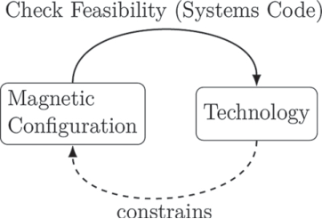

**Figure 1.** A systems code provides insights in feasibility of a magnetic stellarator configuration with respect to technology and can be used to constrain the optimisation space. 

system. They typically consist of a set of simplified models that depict the governing design parameters and constraints. In the context of fusion power plants, the use of systems codes has several advantages: 

- (a) They can check the feasibility of a given fusion reactor design point in a holistic way by taking physics, technological and economical constraints within one framework into account. 

- (b) They can be used to find technologically or economically more suited design and operation points of a fusion reactor. 

- (c) They can easily adapt technological advances due to their modular structure and thus allow a fast re-iteration of fusion reactor design points, when new technology becomes available. 

Existing systems codes for tokamak fusion power plants are e.g. Process [8, 9], Sycomore [10], MIRA [11] or BLUEPRINT [12]. Among these codes, Process is predominantly used for 0D studies of the European tokamak demonstration power plant (DEMO) [13–15]. The wide use of Process, the prospect of comparing stellarator and tokamak reactors in a comparable framework and PROCESS’ simplified, modular 0D models, make Process a well suited platform for the development of stellarator-specific systems code models. In fact, such attempts have already been made in a previous work [16–18], where Process was modified to model fiveperiodic helical-axis advanced stellarators (HELIAS) based upon specific engineering studies of Helias-5B [19], a linear extrapolation along the Wendelstein line. In these earlier works it was found that Process required stellarator-specific developments in mainly four models to reasonably reflect the features of a stellarator power plant, namely in the plasma geometry model, the modular coil model, the island divertor, and the plasma transport model. 

The aim of this paper is to extend the functionality of the stellarator-specific systems code models to describe any _general_ modular stellarator—using only a stellarator reference MHD equilibrium and the associated coil filaments as input. This shall be achieved in two separate steps, both of which are reported in this article. First, a ‘pre-processing’ step is introduced, which may involve more time-consuming calculations 

and which serves as an interface between stellarator optimisation and Process, using the MHD equilibrium and coil filaments to prepare a set of effective parameters for the systems code models. Secondly, Process itself is modified in a way to include this set of parameters in newly implemented or modified models, allowing to perform calculations involving different stellarator configurations. The two steps are explained in more detail in the next section. 

The outline of this paper is as follows: in section 2 we describe the structural changes in Process that were necessary to include more general stellarators. In section 3 we describe the newly developedmodels and their implementation.Finally, in section 4 we employ the Process framework with the implemented stellarator-specific changes for three example studies: first, the new magnet system model is benchmarked against a tokamak reference case. Secondly, we model three different stellarator configurations with distinct aspect ratios, using a 3, 4 and 5 periodic Helias configuration from [20]. Thirdly, we vary the number of coils for a specific W7-X equilibrium, scale the machine to reactor size with Process and study the impact of different coil numbers on the coil properties. 

## **2. New workflow for stellarator—PROCESS** 

Stellarators, by their 3D geometry, impose non-trivial physics and engineering constraints on a fusion power plant design. For example, in contrast to tokamaks, the magnetic field strength on the inboard side of the coils can be different for every coil, the divertor area depends on the location of the magnetic islands, or the neutron wall load has large variations not only in poloidal, but also in toroidal direction. Further, stellarators can have vastly different coil and plasma boundary shapes. Thus, an accurate representation of systems codes relevant features at low computational cost is quite challenging for general stellarators. To mitigate this issue, we introduce an additional, automatized, calculation step between the output stemming from stellarator optimisation and the inputs that go into the systems code, as schematically shown in figure 2. In practice, the work-flow then is as follows. ‘Stellarator optimisation’ provides a 3D MHD equilibriumand a set of corresponding, as fixed considered, coil filaments at a reference point in major radius and aspect ratio. This reference point (equilibrium and coils) we denote with the symbol C from here on, which serves as input for the detailed calculations. The newly introduced intermediate calculation step (essentially the first part of the systems code models), involves accurate, but comparatively slow computations at this reference point. The result of these computations are a set of configuration-dependent effective parameters _ai_ (C), which serve as input for newly implemented exact, fitted, or empirical scaling equations in the systems code. 

The general idea behind this approach is to separate computationally heavy operations from the systems code. This means that every stellarator-specific systems code model consists of essentially two parts. The first part entails the detailed modelling of a sub-system _outside_ the systems code. The second part, in turn, involves an associated (fast) scaling equation _within_ the systems code that makes use of the results from the 

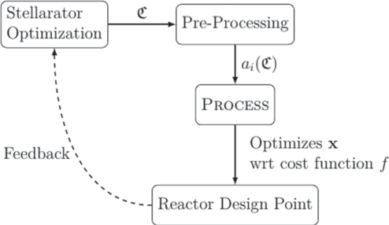

**Figure 2.** The workflow of the pre-calculation step: a configuration C (coil filaments and flux surfaces) is assumed as input from stellarator optimization. A set of Process relevant parameters _ai_ is calculated based on a reference point C, which Process uses to calculate and optimize an iteration vector **x** for a reactor design point, according to an objective function _f_ and according to the applied constraints. The found design point can be used again as feedback for stellarator optimization. 

detailed calculations. An example here would be the computation of the maximal coil force density _f_ max(C) as effective parameter from 3D calculations for a reference coil set. In this example the scaling of _f_ max within the systems code then is a linear scaling law in _B_ max and the current density _j_ , both parameters that the systems code optimizes for. 

We implement the systems code models in a way that they reflect extrapolations of the reference point C in the following macroscopic design parameters: the major overall size of the machine (coil and plasma size), the minor plasma radius _a_ at constant coil radius, and the total magnetic field strength on axis _B_ t. For the plasma design, the implemented scaling parameters are the plasma density, temperature, and the ISS04 ‘renormalization’ factor (a measure for the configuration-dependent quality of energy confinement [21]). The stellarator-Process version is capable of optimizing for devices by scaling these parameters as a part of the optimization vector now. In addition to the above listed set of iteration parameters, Process also optimizes in the engineering parameter design space, with the ‘usual’ parameters such as winding pack size, coil quench times, critical current density safety margins in the superconductor,copper fractions in the winding pack, net electricity output, etc, also see [8, 9]. 

Note that by this prescription the coil number and the coil shapes are considered fixed by stellarator-Process and only the overall size of the coils is scaled. A broader device scan in different stellarator configurations or different coil-sets can be done by sampling different configurations C using stellarator optimization codes. 

## **3. Models** 

Below, we introduce the newly developed stellarator-specific systems code models that aim to describe a general class of stellarators with a modular coil set, irrespective of their shape. The stellarator modifications to Process are comprehensive in 

the sense that they allow an equivalent modeling stellarators compared to the tokamak treatment [8, 9]. 

For each model we describe both the external procedure of calculating the effective parameters as well as the systems code internal scaling equations. The effective parameters that are calculated in the external step are distinguished into two categories. The first type are configuration-specific quantities, that are used directly in follow up calculations and these are denoted by _ai_ (C). The second type of parameters are those that are calculated as a reference point for the scaling equations and these are denoted as hatted values, ˆ _ai_ (C), where C represents the configuration stemming from stellarator optimisation (3D MHD equilibrium and associated coil filaments). 

## _3.1. Plasma volume and surface_ 

The plasma volume _V_ and the plasma surface area _S_ are basic properties in Process. For example, subsequent calculations of the fusion power, fuelling rates, or material loads depend on the plasma volume. Similarly, the surface area is an important quantity to approximate the first wall area and to scale the heat flux densities. 

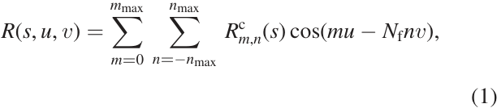
The spatial location of stellarator-symmetric flux surfaces can be parameterized by a set of Fourier coefficients _R_[c] _m_ , _n_[and] _Zm_[s] , _n_[, where] _[ m]_[ and] _[ n]_[ are the poloidal and toroidal mode num-] bers respectively. The cylindrical coordinates for each flux surface can be obtained by 

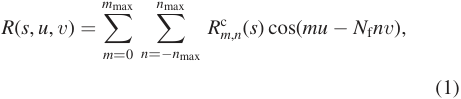

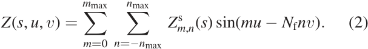

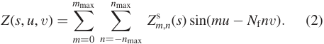

Here, _u_ describes a poloidal coordinate, _v_ the polar toroidal coordinate, and _s_ is a flux surface coordinate [22]. Equations (1) and (2) hold for stellarator symmetric configurations with a field period symmetry of _N_ f. 

The volume enclosed by the last closed flux surface can be calculated for a reference size ( _R_[ˆ] , ˆ _a_ ) according to 

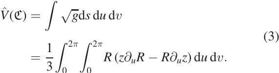

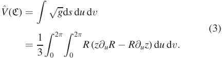

The surface area of a flux surface can be calculated by 

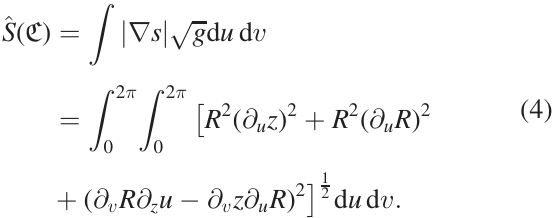

_√g_ is the Jacobian determinant and _|.|_ is the Euclidean norm. The values _V_[ˆ] (C) and[ˆ] _S_ (C) are calculated in the pre-processing step for a reference point in major radius _R_[ˆ] and minor radius ˆ _a_ . Within Process, the plasma volume and surface area is then simply obtained by the following scaling equations, 

## _3.2. 0D-transport_ 

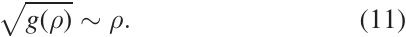
The 0D-transport model in Process imposes a power balance as an equality constraint, 

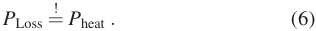

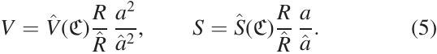

The left-hand side includes contributions from confinement loss _P_[conf] Loss[,][from][bremsstrahlung] _[P]_[br][,][line][radiation] _[P]_[line][and] synchrotron radiation _P_ sync. The right-hand side includes heating from fusion alphas _Pα_ , a term of charged non-alpha particle heating _P¬α_ (e.g. in D–D fusion) and a term for auxiliary heating _P_ aux. Writing these expressions explicitly, equation (6) becomes 

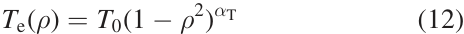

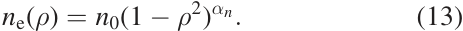
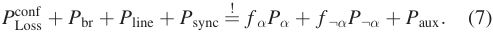

Here, _f α_ is the fraction of the alpha particle energy that is deposited in the plasma, which is an input parameter in Process and depends on the configuration. Similarly _f ¬α_ accounts for the particle confinement fraction of non-alpha particles. PROCESS’ model for radiation losses ( _P_ br, _P_ line, _P_ sync) is described in [23, 24]. For _P_[conf] Loss[,][Process][uses][the][effective] energy confinement time _τ_ E to determine the effective power transfer 

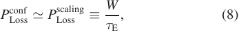

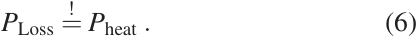

where _W_ is the total plasma energy. The energy confinement time _τ_ E is obtained via empirical scaling laws. The used scaling law for stellarators in Process is the so-called ISS04 scaling [21], 

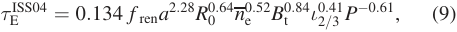

where _a_ is the minor radius, _R_ 0 is the major radius, _n_ is the line averaged electron density, _B_ t the toroidal magnetic field, _ι_ 2 _/_ 3 _≡ ι_ 2 _/_ 3(C) is the rotational transform (at _s_ = 2 _/_ 3), _P_ is the combined effective plasma heating, and _f_ ren is a proportionality factor that measures the magnetic configuration dependent deviation from the ISS04 scaling law. In principle, _f_ ren is determined by C directly, although a reliable _a priori_ method of calculating this factor is not available up to date. Instead, Process can iterate _f_ ren within user set boundaries and return a _needed_ configuration factor for the optimized power plant design point. 

The stored energy _W_ in equation (8) is obtained from the imposed profiles for particle species averaged density _n_ and temperature _T_ : 

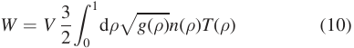

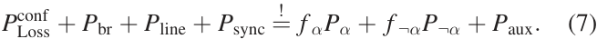

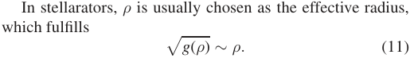

The temperature and density profile shapes for the electrons are _input parameters_ in Process and can be specified using the parametric form 

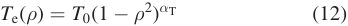

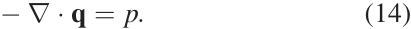

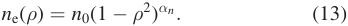

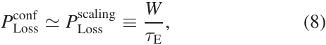

Process implements the ion profiles as (user defined) multiples of the electron profiles. These profiles are taken to compute the radiation terms in the left-hand side of equation (7), see [23]. 

It should be noted that the imposed profile shapes are not _per se_ consistent with the implied heating schemes or transport properties. However, in practice, the profile shapes can be determined by transport simulations independent of the systems code. Results from such simulations can then be used as input for Process, e.g. in profile shapes or heating source. 

Equation (7) serves as equality constraint in Process. 

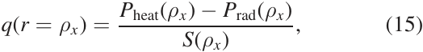
## _3.3. 0.5D neoclassical transport model for stellarators_ 

As Process lets the user choose _T_ 0, _n_ 0, _αn_ and _α_ T in equation (13) freely, we introduce a ‘sanity check’ of the confinement time here against a neoclassical model. 

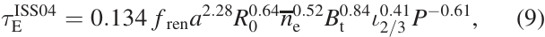
The energy balance equation in steady state is 

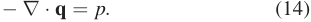

Here, **q** is the flux surface averaged energy flux and _p_ stands for the flux surface energy density sources and sinks. If one assumes constant energy flux on a flux surface, integrating equation (14) over a volume up to a radius _ρx_ yields 

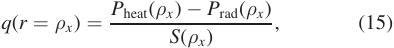

where _S_ ( _ρx_ ) is the surface area at a radius _ρx_ . _P_ rad is the radiation power and _P_ heat is the heating power as specified in equation (7), both integrated values in the of _S_ ( _ρx_ ) enclosed volume. In Process, we choose _ρx_ = _ρ_ core, where _ρ_ core is an input parameter in Process, which determines the radius of a binary ‘core’ treatment [8]. _ρ_ core is usually chosen in the order of _∼_ 0 _._ 6 ( _ρ_ = 1 matches with the last closed flux surface). The new model in Process now calculates a maximal allowable _q_[max] with the calculated heating and radiation power as 

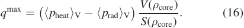

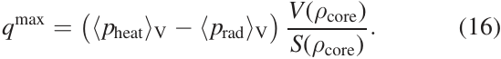

Here, _⟨pα_ ,rad _⟩_ V denotes the power density averaged over _V_ ( _ρ_ core). 

The volume over surface ratio at _ρ_ core can be obtained approximately by scaling of equation (5). 

Equation (16) can be compared against heat fluxes _q_ neo from neoclassical theory, e.g. [25, 26]. In Process we compare 

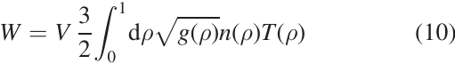

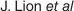

**----- Start of picture text -----** 
J. Lion  et al **----- End of picture text -----** 

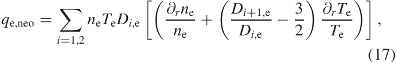
equation (16) against a neoclassical _electron_ flux [26] 

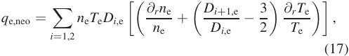

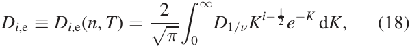

with 

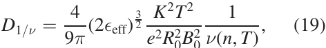

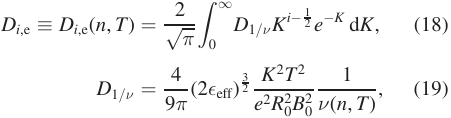

where we take the profile shapes as given by Process and further assume the electrons to be in the 1 _/ν_ collisional regime and neglect the effect of the radial electrical field. The collisionality _ν_ ( _n_ , _T_ ) can be calculated from classical statistical theory [26]. _ϵ_ eff _≡ ϵ_ eff(C) is the averaged effective helical ripple and is an input parameter, which is calculated for every configuration C. 

_q_ e,neo serves as an order of magnitude check for _q_[max] , as a design point with 2 _q_ e,neo _∼ q_[max] indicates that profile gradients at the found design point cause similar purely neoclassical transport fluxes to _q_[max] and would not allow for an unknown turbulent heat flux _q_[turb] . 

Using this model we try to circumvent the consistency issues and restrict profile gradients in the 0D transport model of Process for stellarators. 

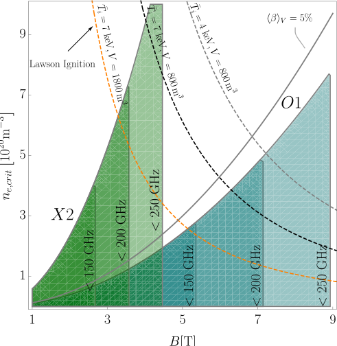

**Figure 3.** Central density limits due to different ECRH heating schemes: the blue region indicates where O1 heating can be applied, the green region where X2 is feasible. Each shape area indicates a minimum required gyrotron frequency. For context, dashed lines indicate ignition according to Lawson criterion with different volume _V_ and volume averaged ion temperature _T_[¯] _i_ (assuming _n_ peak _/_ ¯ _n_ = 3 and ISS04 scaling from W7X parameters). 

## _3.4. Density limit_ 

The density in stellarators devices is, at least empirically, bound by the Sudo limit [27], which accounts for excessive impurity radiation at high edge densities. This limit is proposed in the parametric form as 

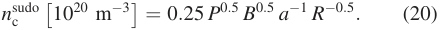

Stellarator-Process can enforce this limit or multiples thereof. However, equation (20) was exceeded in W7-X and LHD experiments [28, 29] and is likely dependent on edge impurity concentrations which are not governed by equation (20). 

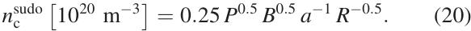
There is however another density constraint, which is imposed by operational boundaries of an electron cyclotron resonance heating (ECRH) scheme in ECRH heated stellarator devices [30]. For reactor scenarios,ECRH heating using the O1 mode appears to be most suitable as it heats the lowest resonance of the electron gyro-frequency and thus requires lower gyrotron frequencies than higher resonant heating schemes. O1 heating implies the operational constraint 

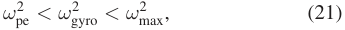

where _ω_ pe is the plasma frequency, _ω_ gyro the gyrofrequency and _ω_ max the maximum available gyrotron frequency. _ω_ max depends on the available gyrotron technology and can be set by the user as an input. The critical density is reached when the plasma frequency matches the electron cyclotron frequency. Thus, the central electron density _n_ e is limited to: 

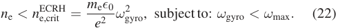

Figure 3 visualizes the heatable densities with O1-heating, and in comparison an X2-heating scheme, with different maximal available gyrotron frequencies at varying magnetic field strengths. Equation (22) is implemented as a constraint in Process and ensures that the found design point is ECRH heatable in O1 mode. 

Note that there are heating schemes, such as electron Bernstein waves [31] or an X1 heating scheme, which could be used to heat a plasma beyond equation (22), but their relevance as a heating scheme in a stellarator reactor are still up for discussion and are not taken into account by Process yet. 

## _3.5. Island divertor_ 

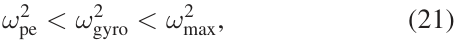
There are three studied divertor concepts available for stellarator reactors: an ergodic divertor concept, also called helical divertor, for high shear configurations [32], a resilient nonresonant divertor concept [33] and a resonant, island divertor concept [34–37]. For now, we include only a description for an island divertor concept in Process, closely following the (previously implemented) model as proposed in [16]. 

In a stellarator with an island divertor concept, the magnetic field is designed such that the rotational transform _ι_ res at the edge coincides with a low order rational number _N_ p _k/n_ , 

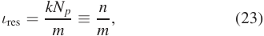

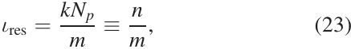

where _m_ is the number of poloidal resonances (islands), _k_ is the resonance order and _N_ p is the field period of the machine. _k_ is 

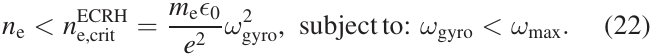

determined by radial _B_ -field harmonics on or shortly behind the last closed flux surface, and, if the respective resonant harmonics are not actively suppressed, is typically equal to 1. The underlying concept of the island divertor is to use the magnetic islands for diverting the heat load coming from the plasma core and then intersect the islands with discontinuous divertor target plates. While the full physics description of the stellarator scrape-off-layer (SOL) is still a challenging and contemporary topic, fundamental geometrical considerations can be used to estimate the heat load on the divertortarget plates. It is the goal of the proposed model here to provide an estimation of the peak heat load, as this is the constraining engineering limit, due to material limitations. 

The heat load on the divertor target plates _q_ div is the ratio of the power arriving at the divertor _P_ div and the area over which this power is effectively spread, _A_ eff. One of the major strategies to reduce the heat load arriving at the divertor is to introduce low- _Z_ impurities that are effective at radiating substantial power in the SOL. Consequently, the power arriving at the divertor is the power coming from the plasma core _P_ core less the radiation from the impurities: _P_ div = _P_ core (1 _− f_ rad), where _f_ rad is the radiation fraction, which needs to be given as an external input parameter. 

The wetted area _A_ eff on the divertor plates usually has the form of a strike-line with a total length _L_ tot across all divertors and a width _λ_ int. The heat load is then 

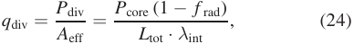

where _P_ core is provided by the Process’ plasma core model. 

Assuming that the heat load is distributed in equal shares across all divertor plates, then the total length _L_ tot is simply the sum over all divertor targets _Li_ , 

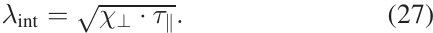

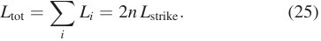

Here _n_ = _kN_ p, as defined previously. The strike-line length _L_ strike on a single divertor plate can be estimated from the field line geometry. To this end, one needs to introduce the pitchangle Θ = d _r/_ d _l_ , which describes the radial displacement of a field line in the SOL along its arc-length and depends on the specific magnetic configuration C, but it is typically in the range of 10 _[−]_[3] –10 _[−]_[4] for stellarators. The strike-line is limited by the field line that just passes the divertor plate at the front and then after one toroidal turn (Δ _l ≈_ 2 _πR_ ) hits the target plate on the far side. Using the definition of the pitch-angle,the radial projection of the strike-line is Δ _r_ = 2 _πR_ Θ. The length of the strike-line on the divertor plate itself is then determined by the angle _α_ lim = Δ _r/L_ strike under which the field line hits the target plate. The strike-line length on the divertor is then simply 

where _Fx_ is an additional broadening of the flux channel caused by diffusive cross-field transport. A model for this factor is given below in equation (30). A small intersection angle _α_ lim helps to increase the strike-line length and reduce the heat 

load density. However, _α_ lim is limited by the engineering accuracy under which target elements can be arranged, typically around _∼_ 2 _[◦]_ . 

Generally, stellarators with an island divertor feature much longer connection lengths than tokamaks [38]. Consequently, the energy and particles have a longer dwell time in the SOL leading to a substantial cross-field broadening of the transport channel compared with tokamaks. We assume here that the cross-field transport is mostly of diffusive nature, allowing us to describe the strike-line width (also referred to as power decay width) by [39], 

Here, _χ⊥_ is the perpendicular diffusion coefficient, which is an user-defined input, but usually taken in the order of _∼_ 1 m2 s _[−]_[1] [40]. _τ ∥_ is the characteristic dwell time of the particles in the SOL before reaching the target. As the particles follow the field lines, the dwell time _τ ∥_ depends on the connection length _L_ c of the field line and the average speed of the particle, namely the ion sound speed _cs_ = �2 _T/m_ ( _m_ here being the ion mass), and thus _τ ∥_ = _L_ c _/c_ s. The ion temperature (in the SOL) _T_ is again a user-defined input, however since mostly detached scenarios are considered for a reactor design point for divertor protection, _T_ must be on the order of 5–10 eV [40]. 

The connection length _L_ c can be geometrically estimated by using again the definition of the pitch-angle Θ. If we define Δ as the radial distance from the LCFS to the target plate, then the connection length is simply 

The typical radial scale length Δ of the system is for the island divertor the radial extent of the magnetic islands _wi_ . However, as the island is intersected by the divertorplates, only a fraction _f_ of the island width is effectively used Δ = _f · wi_ . Usually, the divertor plates are placed at the half radius of the islands, thus _f_ is normally in the order of _f ∼_ 0 _._ 5. The full width of the island can be estimated from analytic theory [41], 

where _ι[′]_ = d _ι/_ d _r_ is the magnetic shear at the edge, which is given by the magnetic configuration. Generally, stellarators with an island divertor need a comparably low magnetic shear in order to form sufficiently large magnetic islands. 

Finally, the previously mentioned flux channel broadening _Fx_ can be derived following the same diffusive ansatz, but for only one toroidal turn, which then becomes 

In conclusion, we have provided equations for all introduced parameters. Consequently, all the here derived relations can be consolidated in order to arrive at a heuristic scaling for 

the divertor heat load. By replacing the poloidal mode number _m_ in terms of _ι_ , _k_ and _N_ p, using equation (23) one obtains 

Here, _ι_ (C), _ι[′]_ (C), _Np_ (C), _k_ (C) and Θ (C) are specific to the considered magnetic configuration and are easily obtained in the pre-processing step. _χ⊥_ , _α_ lim, _f_ and _T_ depend on the specific physics regime or the engineering design and must be provided by the user, but usually take values as indicated in the text above. 

It is planned to validate this model against experimental results from W7-X in the future. Due to the analytic nature of the model, it will be possible to quickly adapt and test new findings and advances. 

It should also be noted, since the heat load is usually limited by material constraints, the divertor model is also useful in reversing the parameters. For example, for a fixed design point and heat load limit, one can estimate the required radiation fraction that would be needed to make the design point feasible. 

## _3.6. Breeding blanket_ 

To model the lithium blanket in a fusion reactor, PROCESS contains an helium-cooled pebble bed (HCPB) model developed at Culham Centre for Fusion Energy (CCFE) [9] and an HCPB model developed by Karlsruhe Institute of Technology (KIT) [42]. For the CCFE HCPB model, the energy deposited in the armour and first wall, blanket and shield are calculated using parametric fits to an MCNP neutron and photon transport model for a sector of a tokamak. The blanket contains lithium orthosilicate (Li2SiO4), titanium beryllide (TiBe12), helium and Eurofersteel. The energy multiplication by nuclear reactions in the blanket is given as 1.269. 

The KIT HCPB model allows for the energy multiplication factor, shielding requirements and TBR to be calculated self-consistently with the blanket and shielding materials and sub-assembly thicknesses. It also allows constraints to be set to meet engineering requirements. The blanket is split into subassemblies: the breeding zone, box manifold and back plate. Three breeder materials can be selected from: lithium orthosilicate (Li4SiO4), lithium metatitanate (Li2TiO3) and lithium zirconate (Li2ZrO3). Together, the three sub-assemblies make up the total blanket thickness. Constrains can be set on the TBR, maximum allowed toroidal field (TF) coil fluence, maximum allowed heating of the TF coils and/or the maximum allowed helium concentration in the vacuum vessel. Through these constraint, the code can determine the thicknesses of the sub-assemblies and the overall blanket thickness. 

For now, we assume these models to hold to first approximation also for stellarator devices. However, in contrast to tokamaks, stellarators can have significant variation of the neutron wall load in toroidal direction. This can be accounted for when adding a neutron peaking factor _f_ peak to the models, 

which measures the inhomogeneity of the neutron load along the blanket area. For a given configuration, this factor can be calculated by 

Here, _q_ max is the maximum and _q_ avg the average neutron load in the blanket. When one constructs an intermediate, first wall like, hyper-surface between plasma and coils, one can approximately calculate _q_ on this surface via 

Here, _θ_ and _φ_ are poloidal and toroidal coordinates on the surface, **x** S and **x** W are the position vectors of the source and the wall respectively, _V_ S stands for the volume of the source and **n** ˆ is the normal vector of the wall. _E_ n is the energy carried by a neutron in a _D_ + _T_ reaction (14.1 MeV). _f_ S is the neutron fluence at the source point **x** S, which can be obtained using the Bosch–Hale fit [43] for a reference density and temperature profile, 

_θ_ and _ξ_ are fit functions and _C_ 1 is a fit parameter, see [43] for their explicit form. An example calculation of the neutron wall load using equation (33) for a wall in a Helias 5 device is shown in figure 4. 

Equation (33) simplifies the geometry vessel by neglecting ‘shadowed’regionsin the vacuumvessel and it furtherdoes not account for neutron scattering, but it is a method to compute the peaking factor _f_ peak computationally fast. More sophisticated values for _f_ peak can be obtained [44] by dedicated 3D Monte-Carlo codes such as MCNP [45], which can include neutron scattering and further are able to resolve in detail vessel and blanket geometries at the cost of computational time. Equation (33) can be substituted with results from an MCNP run in Process, if more accuracy is needed. 

The effect of the neutron inhomogeneity was implemented in the HCPB models in PROCESS now, using a calculation of _f_ peak in the pre-processing step. 

Future improvements of this model should replace the used tokamak-specificblanket models by stellarator specific models based on stellarator reference calculations, as conducted e.g. in [46]. 

## _3.7. Stellarator coils_ 

For a given, averaged, toroidal magnetic field strength _B_ t along the magnetic axis, Process should calculate the required coil current in the pre-defined coil filaments. This is achieved by using a simple linear scaling from a pre-calculated value for the averaged norm of the TF along the magnetic axis, _⟨B_ t _⟩_ axis, which can be obtained by integrating along the magnetic axis, 

where _ℓ_ is the length of the magnetic axis, _B_ t the magnetic field on the axis and _s_ is a coordinate parameterizing the axis 

**Figure 4.** An example calculation of the neutron flux for a Helias 5 configuration on a conceptional intermediate hyper surface between plasma and coils using equation (33) at 3 GW fusion power. Left: the flat projection of _q_ ( _θ_ , _φ_ ) on the hypersurface in one module. Right: the neutron wall load on the imposed hypersurface and the coils for geometrical context. The last closed flux surface is shown in cyan. 

(not to be confused with the flux surface coordinate). Once determined for a reference point, the scaling of the coil current with respect to _B_ t and _R_ is of course linear, 

The needed coil current _I_ 0(C) for the respective _B_ t at the reference design point can be calculated using the Biot–Savart equation, which is done numerically in the pre-processing step. The (vacuum) axis can be obtained by a field line tracer, e.g. [47], or as output by the equilibrium code VMEC [48]. 

Another important parameter for the coil design in a systems code is the maximum magnetic field on the coil surface _B_ max, which is crucial for the superconductor material constraints. _B_ max depends on the coil cross-section area and for its calculation at the reference design point with _R_[ˆ] , _B_[ˆ] , and the winding pack thickness _A_[ˆ] WP we proceed as follows. 

For stellarators in Process, and for the calculation of _B_ max only, we approximate the winding pack to be of rectangular shape and to be homogeneously filled with a current carrying material. With these assumptions, Biot–Savarts volume integral can be in good approximation reduced to a Riemann sum of analytically solvable integrals of the magnetic field due to homogeneously filled straight cuboid beams [49, 50]. For reasonable accuracies, each coil is discretised into _O_ (100) straight beams, each producing a magnetic field **B**[Beam] _i_ at position **x** . The total contribution of a coil to the magnetic field at a position **x** can then be approximated by 

The derivation and an explicit formula for **B**[Beam] _i_ is given in appendix A. _B_ max then becomes 

This descriptions allows, for our purposes, an accurate calculation of the magnetic field at the surface of the coils and in the current carrying material. The latter will be important for the force calculations that will be described further below. 

_B_ max depends on the winding pack cross-section. To reflect this scaling in the systems code, we calculate equation (38) for varying winding pack sizes in the pre-processing step and parameterized _B_ max in Process via a fit function, which we choose here in the form of 

The first summand approximates the ideal part (due to an ideal toroid), the second summand includes the fitted scaling with changing winding pack size. _a_ coil is the average minor coil radius, _N_ the number of coils, and _A_ wp the cross-sectional area of the winding pack. _a_ 0 and _a_ 1 are fit parameters that are obtained in the pre-processing step by varying _A_ wp. 

The electromagnetic forces that act on the coils are important output and constraint parameters, as the integrity of the structural material is limited by the stress, which again scales with the force magnitude. This fact is especially limiting for compact devices at higher magnetic field, as those typically imply high operating current densities resulting in high force-magnitudes. The force density, as other effective parameters before, is calculated for a reference coil size and then scaled within Process. For this purpose, the magnetic field **B** is calculated _inside_ the winding pack, using the finite winding pack Biot–Savart approximation introduced in equation (37). The Lorentz force density at a point **x** in the winding pack is then simply 

if the magnitude of **j** , the current density, is assumed to be constant and homogenous across the coil cross section and points along the tangential direction **t** of the coil. Figure 5 shows an example calculation of the force density distribution in a stellarator coil: in every poloidal cross section of the coil we discretize the winding pack cross-section into _N × N_ volume elements d _V_ for which we calculate a force density **f** using equation (40). **f** can be integrated over _A_ wp to obtain a force density[¯] _f_ in N m _[−]_[1] , or over the whole coil volume _V_ coil to obtain a force _F_ in N. The maximal value of _f_ needs to be supported by the structural material in the winding pack,[¯] _f_ result 

**Figure 5.** Cross section through a quadratic winding pack of dimensions 60 cm in a high field region of a stellarator coil. The cross section homogeneously carries a current of 14 MA (produces 5.6 T in a Helias 5 configuration). Colour coded is the absolute magnetic field strength. Axes are set in local coordinates. Black arrows indicate directions and magnitude of local forces in the winding pack. 

in coil jacket and coil insulation stresses and _F_ is relevant for the outer coil support structure. 

We calculate the effective parameter as the maximum of each of these forces according to _f_ max(C) _≡_ max _θ_ , _i|_ **f** _|_ ( _θ_ a poloidal coil coordinate, _i_ indicates the coil number) for every configuration and scale it in Process according to 

Here, _j_ is the current density, _I_ the coil current, _ℓ_ the length of the respective coil (in Process). Hatted values again denote the values at the reference point where _f_ max(C),[¯] _f_ max(C) and _F_ max(C) are calculated. 

It should be noted that one needs to make an assumption about the orientation of the winding pack in order to calculate the force density. To this end, we choose the normal vectors of the winding pack to point into the cylindrical toroidal and radial direction respectively. In a realistic winding pack, which is optimized with respect to torsion and stresses, this normal vector might deviate from this assumption, however, _f_ max will most likely not be affected significantly by this choice. 

As stellarators can have significant lateral forces, Process also returns lateral and radial projections of equation (40) which are scaled analogously to equation (42). Figure 6 shows the order of magnitude of lateral projection of[¯] _f_ in a Helias 5 coil set. 

To estimate the stress on the ground insulation of a coil set we use a simple model and only consider normal uniaxial stresses which depend on the poloidal coil coordinate _θ_ , 

**Figure 6.** The magnitude of the radial and lateral force density on the non-planar coils in one half-module of a Helias 5-B coil set [51] with 5.6 T on axis and 22 m outer radius. _θ_ is a periodic poloidal coil coordinate. Maximum absolute values for radial and lateral projections are taken as effective parameters. 

namely 

We assume that the forces **F** ( _θ_ ) point orthogonal towards the outer boundary of the coil and thus create a pressure on the radially outward area of the coil _A_ , which depends on the winding pack size. Assuming a fixed outer coil boundary condition, the maximal stress on this area, induced by the winding pack forces, then is 

where _d_ WP is the radial thickness of the winding pack as calculated by Process from equation (48). 

This stress is subject to the elastic limit of the material under pressure. If a coil design as in [51] is assumed, this stress exerts on the ground insulation and its upper limit will be in the order of _∼_ 100 MPa. In our implementation, the maximum allowable stress is a user defined parameter and if set, Process will optimize the design to fulfill this constraint. 

It should be noted that we ignore stresses in the coil structural material for now, as accurate values for the peak stresses would require a detailed design of the coil support structure. Possibly, some simplifications of the support structure could be made, like a thin massive inter-coil shell, which could provide an idea about stresses in the coil support structure with the help of finite element calculations, but this is beyond the scope of this paper. 

Another stellarator-specific output parameter of the coil module is the maximal curvature in the coils. This parameter is especially relevant for stellarators as the non-planar coils can have small bending radii that might not be in line with limitations imposed by the superconductor material. Again, in Process, the maximal curvature is implemented by a scaling equation, using a reference value _κ_ max has been obtained in the pre-processing step, 

9 

**Figure 7.** The used winding pack architecture of one turn. The whole winding pack consists of _N_ such turns. The shown fractions are not for scale. 

Here, _d_ WP is the radial thickness of the winding pack. The term 1 _−_ 21 _[d] a_[WP] Coil estimates the curvatureincreasing effect of a radially extended winding pack. The reference value for the maximal curvature _κ_ max(C) is calculated in the pre-processing step according to 

where _γi_ : _I ⊂_ R _→_ R[3] parameterizes the _i_ th coil in the set and _θ_ is a local coil coordinate. _κ_ max can be used to model the bending strain in the superconductor, which has direct implication on the critical current density of the superconductor. A bending strain model based on equation (47) is not yet implemented in Process for stellarators, but can easily be added, once respective models are available. 

## _3.8. Winding pack design_ 

For tokamaks, Process is capable of optimizing the winding pack constituents (copper and superconductor fractions) with respect to the figure of merit. In [17] this degree of freedom was not implemented for stellarators, which we now enable using the following prescription. 

For the stellarator version of Process, we model the winding pack with _N_ squared turns, surrounded by a coil jacket and some user defined ground insulation thickness on this coil jacket. Each of the _N_ turns has a composition as shown in figure 7. The inner part of the conduit contains an approximate squared conductor area. The structure and helium fraction as well as the insulation thickness in the conduit cross section are user defined parameters, whose values are subject to external specifications. Especially the fraction for the structural material needs to match the inner winding pack stress constraints, which are non-trivial in 3D coils and require a sophisticated treatment. The copper- and superconductor fractions, in contrast, are subject to quench protection and can be calculated by Process, as will be addressed later in this section. The overall dimension of the turn area is a user defined parameter. 

For stellarator coils, Process now optimizes the copper and the superconductor fractions according to the consistency equation 

**Figure 8.** Ansys calculation of the force densities in the W7-X vacuum vessel without ports induced by eddy currents during a coil quench. Peak value is 2 _._ 54 _×_ 10[6] N m _[−]_[3] . By courtesy of Jiawu Zhu. 

Here, _f j_ ⩽ 1, is an iteration parameter and is bounded by user defined values. _j_ crit is a parametric form for the critical current density of the superconductor which depends on _T_ , the temperature in the superconductor, _B_ max( _A_ wp) as given from equation (39) and _ϵ_ the maximal strain in the superconductor. Currently, the implemented superconductor material parameterizations in Process cover Nb3Sn, NbTi, Bi-2212 and a REBCO-material [9]. 

The superconductor fraction _f_ scu in the winding pack is a resulting parameter from the winding pack material area fractions, 

where _f_ case is the case and insulation fraction of the whole _turn area_ , _f_ He is the helium fraction in the _conduit area_ and _f_ Cu and _f_ oth are copper and other material fractions in the _conductor area_ . Process finds the appropriate winding pack dimensions then by solving equation (48) for _A_ wp, which is a simple root finding problem and is solved by Newton’s method within Process. In equation (49), _f_ Cu is an iteration parameter in Process and is bounded by quench protection arguments,which we will address below. 

In the case of a coil quench, the internal TF coil current needs to be dumped into external resistors. The exponential decay time of the coil current during the quench is parameterized in Process by _τ_ Q. This value is an iteration parameter, subject to the constraints: 

- (a) Maximum voltage in the TF coils (lower boundary). 

- (b) Temperature rise in the TF coils (upper boundary). 

- (c) Stress on the vacuum vessel by eddy currents (lower boundary). 

The first constraint restricts _τ_ Q by the maximal allowable voltage across a coil and during a quench which is, for large 

resistances, approximately given by [9] 

_E_ stoTF is the approximative average stored energy per coil, _L_ the inductance of the coil set, _N_ TF the number of coils, and _I_ is the average coil current. The inductance of a stellarator coil set is calculated in the pre-processing step (e.g. by assuming a filamentary 3D curve approximation of the coils [52, 53]) for a reference point and can be scaled in Process according to 

This equation is based on an ideal toroid, where _a_ coil is the minor average coil radius. The restriction for _τ_ Q is then 

The second constraint for _τ_ Q due to the temperature rise during a quench can be quantified using an energy conservation argument leading to 

In appendix B we provide a short derivation of this equation. 

Finally, the third constraint considers the fact that the changing current in the coils during a quench induces a stress in the vacuum vessel. The maximum allowable force density in the vacuum vessel during a quench _f_ VV puts another lower bound on _τ_ Q. We use a scaling equation to calculate the maximum force density based on a reference value according to 

where _d_ VV is the vacuum vessel thickness, _R_ VV the (approximate) major radius of the vacuum vessel and _B_ the average toroidal magnetic field on axis. 

For now, we choose a sophisticated Ansys simulation from W7-X as a reference value as illustrated in figure 8, where 2.54 MN m _[−]_[3] is the maximum value of the force density. Note that this step is not done in every pre-processing step, but instead is only provided once for the W7-X vacuum vessel. Due to lack of available models for generic 3D vacuum vessel, we assume for now that, in first approximation, this value also reflects the general inhomogeneity for any type of stellarator vacuum vessel. However, the reference value can be easily adapted for designs where more detailed simulation results exist. With values from W7-X, equation (54) becomes 

## _3.9. Structure mass_ 

As shown in the previous section, large lateral forces can act on the non-planar stellarator coils. However, the details of the force distribution depend very much on the coil shapes and winding pack. This puts not only great demands on the support structure, but also makes it difficult to design an appropriate structure. Consequently, such designs for large stellarators are scarce. There exist only a few design concepts for a stellarator reactor, such as a bolted or welded plates [19] or support elements with ‘stiffeners’ [55]. 

Instead of implementing a specific design in Process, we choose to model only the total structure mass, while not being sensitive to the details of support structure. The total mass is a good proxy, both for the cost and the support structure complexity. As introduced already in [16], we stick here to an empirical scaling law from existing machines, as described in [56] to calculate the structure mass in Process based on magnetic energy _W_ mag in the coil-set, 

Although equation (56) sees good empirical agreement, it does not show whether the design point has local unsupportable forces. In reality, the optimisation of the support structure is a difficult task to ensure the integrity of the device while avoiding local overloads. 

Also note that this constraint could in principle be overcome by a poloidal electric break, e.g. [54]. In Process, _f_ VV is then bound to a user defined parameter and serves as an inequality constraint. 

## _3.10. Build consistency and port sizes_ 

Scaling in _R_ and the winding pack requires that Process checks the inner coil–coil distances in toroidal direction to prevent that coils come too close in azimuthal direction. We incorporate this constraint via an effective parameter of the minimal distance between two central coil filaments _d_ min(C), which is calculated in the pre-processing step. This distance scales 

linearly with the major radius and is subject to the constraint 

where _w_ WP denotes the toroidal width of the winding pack as calculated by the routine described in section 3.8 and _w_ case is the implied coil casing width in toroidal direction. 

Furthermore,the radial distance between the plasma and the coils is also subject to build constraints. For stellarators, the most critical location is the point where the coils come closest to the plasma. One value for this distance at a reference device size is calculated in the pre-processing step and defines an effective value as _d_ pc(C). In Process we then implement the scaling 

Here, _f_ geo = _[∂] ∂[d] a_[pc][accounts for how much the plasma wall dis-] tance changes when decreasing the minor radius in the same configuration. _A_ is the (scaled) aspect ratio and _A_[ˆ] the aspect ratio at the reference point. 

In Process, _d_ pc is then subject to the constraint 

where _d_ coil is the radial thickness of the coil (winding pack plus coil jacket and insulation), _d_ VV is the thickness of the vacuum vessel, _d_ shield of the thermal shield, _d_ blanket the thickness of the blanket, _d_ fw the thickness of the first wall and _d_ SOL describes the width of the scrape-off layer. _g_ ap accounts for the left available space. 

Note that by this prescription, PROCESS only ensures radial build consistency along one radial line in the stellarator geometry and in general the gap _g_ ap is a function of a poloidal and toroidal angle, _g_ ap = _g_ ap( _φ_ , _θ_ ). Equation (59) is implemented via a stellarator specific inequality constraint in Process. 

Finally, we calculate a maximal rectangular vertical port size area _A_[max] Port[(][C][)][in][the][pre-processing][step][for][a][reference] point. Each dimension is then scaled linearly with the major radius within Process. The maximum port size limits the maximum size of blanket segments and is thus an important information to judge the feasibility of remote maintenance. 

## _3.11. Concluding remarks_ 

We listed the implemented changesin which Process’ prescriptions of a stellarator powerplants now differsfrom the tokamak prescription. For this, we identified important reactor relevant stellarator-specific features and implemented them to sufficient accuracy in Process using an additional pre-calculation step. However, there are more stellarator specific constraints in a power plant which are not included yet. For example, alpha particle damage on the wall and inhomogeneous radiation loads are approximated by the (axi-symmetric) description of Process. Proper stress and strain calculations for stellarator devices are ignored for now in Process. Capturing these 

**Figure 9.** The used tokamak DEMO TF-coil set for the comparison (output of tokamak-Process). The winding pack cross section shape is simplified as rectangular in stellarator-Process. 

**Table 1.** Output comparison of the independently implemented coil modules of tokamak and stellarator-Process using a tokamak-DEMO design.[a] 

> aStarred values are input parameters for stellarator-Process (sPROCESS). ‘WP’ in the descriptions abbreviates the ‘coil winding pack’. 

modifications require more detailed calculations and stellarator design studies and need to be added in future publications. 

## **4. Application** 

In this section we apply the modified Process code to three different scenarios: first, we carry out a benchmark of the newly developed stellarator coil module against the (established) tokamak coil module. 

Secondly, we apply Process for the first time exemplarily to three distinct stellarator configurations with different aspect ratios. This is possible only due to the newly developed models. The scenario demonstrates a possible use-case of Process to stellarator plasma optimization, as it allows to find feasible reactor design points (in terms of outer radius, aspect ratio, density or temperature). Further, Process can help to identify limiting constraints for a given stellarator reactor design point, which we demonstrate in this study too. 

**Figure 10.** The coil-sets and plasma boundaries of the three used Helias configurations as described in the text. 

**Figure 11.** _∼_ 3000 Process runs, scanning the major radius against the toroidal magnetic field strength for a 1 GW net electricity Helias 5 configuration when neglecting the ECRH constraint (equation (22)) to visualize three of the newly implemented constraints. Green points indicate a valid solution. Blue points were allowed when the coil quench constraint was relaxed, yellow points were accessible if the blanket could be build more compact or larger coil–plasma distances were possible, red points are accessible by improving the confinement. 

Thirdly, we use Process to compare three different stellarator coil-sets for the same magnetic configuration to demonstrate the capability of Process to provide input for stellarator coil optimization, as it is possible to provide necessary coil–coil and coil–plasma distances, both parameters which depend on technology and are used as inputs in stellarator coil optimization. 

The example studies shown below aim to demonstrate the new capabilities of the approach, highlighting in particular the impact of engineering constraints on the design space. A fully detailed reactor design study is subject to a future work. 

## _4.1. Benchmark against tokamak PROCESS TF coil module_ 

The stellarator models were designed to accommodate any type of stellarator. This flexibility allows to model also a tokamak-coilset within the stellarator-Process version. 

In this section, we briefly benchmark the results of the new stellarator coil module in Process against the output of the independent tokamak-Process TF coil module. For comparing the models developed in section 3 to the tokamak models, the reader shall be referred to [9]. 

For the benchmark, we start from 16 D-shaped TF coils, as shown in figure 9. The coil shapes are produced by 

tokamak-Process and are then taken as input for the stellarator run. We now obtain effective parameters _ai_ (C) for the coilset in the pre-processing step as described in the previous section and then run stellarator-Process in optimization mode, optimizing for capital costs, which is equivalent to minimizing material masses. We fix the magnetic field strength on axis to 5.72 T and the aspect ratio to 3.1 and let Process find a consistent design point while optimizing for engineering parameters, such as the copper fraction in the conductor area, the winding pack dimensions, and the exponential coil quench dump time. 

The result of the benchmark is displayed in table 1. Stellarator-Process converges to a similar design point as the tokamak-Process version. The winding pack dimensions and the copper fraction are optimized to similar values. The maximal magnetic field on the coils deviates by 5%, which is within the modelaccuracy.Generally,we find very good agreement of our stellarator coil model with the tokamak case, providing confidence in the implementation of the developed coil model. 

## _4.2. PROCESS for stellarators with different aspect ratios_ 

Historically, stellarator reactor design studies were performed by individual calculations for single magnetic configurations. 

**Figure 12.** The three used scaled W7-X coil sets and their respective Poincar´e plots in the bean-shaped plane as obtained with FOCUS [61]. Left: W7-X with 30 coils (one module), middle: W7-X with 50 coils (one module), right: W7-X with 60 coils (one module). The black boundary is the target boundary. Coil thicknesses are scaled according to similar magnetic field on the coils ( _∼_ 14 T). The colour in the Poincar´e plots indicates a flux surface coordinate. 

Such an approach is tedious for the large magnetic configuration space of stellarators. Our models allow for the first time to model different types of stellarator configurations within the same code framework within seconds of computational time. To demonstrate this capability, we showcase below exemplary studies for three different stellarator configurations, Helias 3, Helias 4 and Helias 5 as introduced in [19, 20, 57], with a field periodicity of 3, 4, and 5 respectively, as shown in figure 10. 

For each coil-set we calculate a vacuum VMEC free boundary equilibrium and determine the effective parameters as described in the previous section. We then run Process in optimization mode where we optimize for minimal major radius at constant aspect ratio and a required net electricity output of 1 GW, which corresponds to approximately 3 GW fusion power. For this, we optimize the following parameters: the overall temperature and the overall density for fixed profile shapes, _α_ T = 1.2, _α_ n = 0.35, as defined in equation (13), following neoclassical transport simulations conducted in [16]. Further, we optimize the major plasma radius and the overall magnetic field strength. In addition, Process optimizes for coil current densities, winding pack dimensions and material fractions. 

These optimization parameters are bound by several imposed constraints: for the radial build constraint, a fixed radial component thickness of 1.15 m is assumed, including vacuum vessel, breeding zone, blanket structure mass and neutron shielding, consistent with neutronics calculations conducted in [46]. The SOL width is taken as 15 cm. For every configuration we assume that 80% of the born fusion alpha particles heat the plasma. This value is expected to increase in future stellarator devices, as improved alpha particle confinement in stellarators is only recently addressed in stellarator optimization, but with promising results already [58, 59]. We further impose an ECRH heated ignition point, using the prescription in subsection 3.4, and assume maximal available gyrotron frequencies of 200 GHz. For comparison, ITER operates with 170 GHz gyrotrons [60]. Requiring ECRH inhabitability constrains both, the density and the magnetic field from above. 

The ISS04 transport model as in section 3.2 is assumed and the 0D power balance equation including Bremsstrahlung and line-radiation terms is enforced as a constraint equation. The superconductor material is taken as Nb3Sn at 4.75 K operation temperature and the current density we limit to 80% of the critical superconducting density. Superconductor 

**Table 2.** A selection of Process’ output parameters for the converged design point for each of the three Helias configurations. The design points were optimized with respect to minimal major radius and for a net electricity output of 1 GW, which approximately corresponds to 3 GW fusion power. 

|3 GW fusion power.||||
|---|---|---|---|
|Description|Helias 3|Helias 4|Helias 5|
|Number of tor. feld coilsb [1]|30|40|50|
|Tor._B_-felda (T)|5.42|5.77|7.07|
|Major plasma radiusa (m)|13.7|18.3|20.7|
|Minor plasma radius (m)|2.16|2.08|1.68|
|Aspect ratiob [1]|6.36|8.81|12.3|
|Plasma volume (m3)|1260|1560|1160|
|Peak el. densitya (m_−_3)|2.8781_×_1020|2.7074_×_1020|3.1865_×_1020|
|Peak el. temperaturea (keV)|15.7|15.4|15.5|
|Plasma beta (volume averaged) (%)|4.48|3.71|2.92|
|Fusion power (MW)|2900c|3060c|3170c|
|Max. feld on the coils (T)|14.6|14.4|14.5|
|Stored magnetic energy (GJ)|106|122|150|
|_j_op_/j_crit [1]|0.800c|0.800c|0.800c|
|Total coil currenta (MA)|409|564|765|
|WP current density (MA m_−_2)|3.01_×_107|3.12_×_107|3.17_×_107|
|Superconductor mass (kg)|2.19_×_104|1.89_×_104|1.79_×_104|
|Total coil mass (kg)|5.91_×_106|6.84_×_106|7.61_×_106|
|Structure mass (kg)|1.15_×_107|1.29_×_107|1.51_×_107|
|Max. force density (coils) (MN m_−_1)|85.9|86.1|96|
|WP toroidal thicknessa (m)|0.614|0.613|0.634|
|WP radial thickness (m)|0.737|0.736|0.761|
|Quench dumping timea (s)|10.7|10.0|9.25|
|VV peak force density (approx.) (MN m_−_3)|3.53c|3.53c|3.53c|
|Max. quench voltage (kV)|4.74|4.22|4.44|
|WP copper fractiona [1]|0.620|0.622|0.604|
|Peak divertor load (MW m_−_2)|3.56|2.79|2.52|
|First wall full-power lifetime (_y_)|2.46|2.89|2.36|
|Av. neutron wall load (MW m_−_2)|1.33|1.09|1.36|
|Max. neutron wall load (MW m_−_2)|2.03|1.73|2.12|

aIteration parameter. bFixed input parameter. cParameter at a directly imposed limit/target. 

strain is neglected for the critical current density. All devices assume an island divertor, which is described by the model in section 3.5. In this model, a radiation fraction of 85% in the SOL is assumed and radiating plasma impurities are neglected. The maximum allowable divertor heat load is set to 10 MW m _[−]_[2] and a volume averaged upper beta limit of 5% is imposed. Coil current densities, winding pack dimensions and material fractions are subject to quench restrictions and ground insulation stress as described in subsection 3.8. 

To visualize the restriction of the parameter-space by the newly implemented constraints, we conducted an _R_ - _B_ -scan of the Helias 5 device in figure 11: from this, one can identify the coil quench constraint, which forbids points at high _B_ - field and smaller major radius. Further, the new radial build consistency model through imposed blanket and shielding requirements dominantly rules out design points at smaller major radius and an increase in confinement properties (an enhanced ISS04 proportionality factor) would allow to access the region at lower _B_ -field. Note that for this scan we neglected the ECRH constraint, which is very sensitive on the technological assumptions (gyrotron frequency and heating scheme). 

The exact positions of the constraints also depend on other factors like imposed steel fraction in the conductor or insulation thicknesses. An eventual hoop or inner-winding pack stress limit would further limit the design space, but this was not developed yet for stellarators. 

Using the above listed set of optimization parameters and constraints,importantoutputparametersof the optimized reactor design points with respect to minimal major radius are shown in table 2. The study in [20] assumed NbTi superconductors, which we replaced by Nb3Sn superconductors here. This allows for higher field strengths as the found 7 T on axis for Helias 5. The possibility to switch superconductor material also demonstrates the advantage of technological flexibility of the systems code framework. The found densities in table 2 are in line with the ECRH heating constraint as described in subsection 3.4. Despite of the different aspect ratio and the different coil numbers, the total masses found by Process are comparable for all three devices and only increase slightly for the machine with higher aspect ratio. Comparing the coil masses of the Nb3Sn Helias 4 design against the previous NbTi study [57], we 

find good agreement (6.8 kt compared to 7.5 kt) for a similar design point. 

The major radius of all three designs are limited by the plasma-coil distance, which needs to include space for blanket and shielding and the radial extension of the coils. This we found by relaxing the radial build constraint, which resulted in significantly smaller major radii for all three machines (also compare figure 11). This fact also explains the significantly larger plasma volume of 1560 m[3] of Helias 4 compared to the other two devices, as Helias 4 features a comparably small plasma-coil distance, namely 1.7 m at reference size compared to 1.9 m for Helias 5 at reference size [20]. We further observe a relevant design restriction by the imposed ECRH constraint, mainly given by the critical O1-mode density limitation. This provides further motivation to develop high power, high frequency gyrotrons or an X1 heating scheme for a stellarator reactor at high density. 

While our models present substantial progress in the engineering feasibility of stellarator designs, there are still missing factors that are under development and not yet included in this study, such as high fast particle wall loads, superconductor strain or transport effects that are not covered by the ISS04 assumption, or stress limits in coils and in the structure mass. Modelling these effects for general stellarators is beyond the scope of this work, and can be added in future publications. 

size is then held fixed and the new Process implementation for stellarators is used to optimize for capital costs, which is equivalent to minimizing the coil masses in this case. Process then finds the required coil sizes, the copper and superconducting material fractions, assuming Nb3Sn superconductors, to match the build constraints in radial and toroidal direction, the coil quench protection constraints and the superconducting critical current density constraint. Relevant coil related Process output parameters are shown in table 3. As expected, local coil forces are significantly larger for a design with less coils. The stored magnetic energy scales with the coil minor radius which is, approximately 20% larger in the 30 coils device. The design with less coils allows for larger vertical ports, which could ease remote maintenance, however this seems to come at a cost, as the design with 30 coils is found at significantly higher total coil masses compared to the design with 50 or 60 coils, likely induced by significantly higher maximal _B_ -field values at the coils which then again requires larger material masses to fulfill the critical superconductor current density and the quench constraints. Finally, the left over coil–coil gap vanishes for the device with 50 and 60 coils, which indicates that these two designs would benefit from larger coil–coil distances. This information can be used to re-iterate the imposed coil–coil distance in the coil optimization step to obtain coil-sets which feature larger coil–coil (and coil–plasma distances) to allow for a smaller overall machine size. 

## _4.3. PROCESS for stellarators with different coil sets_ 

## **5. Summary and outlook** 

Stellarator coil optimization is, at least traditionally, carried out for a fixed magneticconfiguration.For every configuration, however, there exists an infinite number of coil-sets producing (approximately) the same magnetic field [62] and choosing the right coil set is a trade-off between field accuracy and engineering constraints, such as the minimal curvature, port sizes required by remote maintenance, coil–coil distance, coil–plasma distance, engineering tolerances [63], or costs. In this section we demonstrate that stellarator-Process can help judging the reactor relevance of the coil-set by providing further details, as its material usage and forces, by including coil quench constraints and by considering other plant constraints at the same time. For this purpose, we generate three exemplary coil-sets targeting a W7-X like equilibrium, using the coil optimization code FOCUS [61]. The chosen coil-sets have 30, 50, and 60 coils respectively, and their corresponding Poincar´e plots are shown in figure 12. Albeit similar flux surfaces and island positions compared to the W7-X equilibrium, further physics properties of the respective equilibriums were not checked here, as our purposehere is just an exemplary application of Process to different stellarator coil sets for the same equilibrium. The coil-set with 30 coils was not able to match the target iota at the boundary, which results in a lack of the desired island structure there, but for the sake of having a coil-set with significantly less coils, while still retaining a significant coil–coil gap, we neglect this fact and include this coil-set in the following study. 

We use Process now to scale the overall size of the machine to reactor size (22 m major radius). The plasma 

In this work we presented modifications of the fusion reactor systems code Process to model a general class of stellarators. For this, we modified Process in a way that it covers several stellarator specific features of a fusion power plant. Some stellarator specifics, such as an accurate description of the alpha particle wall load in stellarators, the inhomogeneous plasma radiation load on wall materials or a 3D stress model are left out for future publications. 

As a result of the modifications, Process can now be used to obtain stellarator reactor design points that are, within the implemented model coverage, in line with current technology, taking as input solely the common output of stellarator optimization, namely a plasma boundary and the respective coil set. This new code modification allows for the first time to compare different stellarator configurations within the same wholistic systems code and thus can contribute to stellarator optimization, as it can help constraining the high dimensional design space, that stellarator plasmas and coilsets allow for. Process further allows high level optimization of design parameters with respect to economical figure of merits, such as component masses, which can help guide future stellarator reactor studies, as it allows a fast adjustment to new technological advances. The new framework further calculates coil thicknesses that are in line with superconductor and coil quench constraints, which again can be used to re-design coils. 

The implementation of the presented models was done in two frameworks, in a pre-processing code and in Process 

**Table 3.** A selection of Process’ output parameters for the converged power plant design point of an upscaled W7-X equilibrium with 30, 50 and 60 coils respectively. The design points were optimized with respect to capital costs and the major radius was chosen to match a net electricity output of 1 GW. 

|Description|W7X-30|W7X-50|W7X-60|
|---|---|---|---|
|Number of tor. feld coilsb [1]|30|50|60|
|Fusion power (MW)|2920c|3230c|3330c|
|Major plasma radiusb (m)|22.0|22.0|22.0|
|Minor plasma radiusb (m)|1.96|1.96|1.96|
|Plasma volumeb (m3)|1670|1670|1670|
|Tor._B_-felda (T)|4.95|5.07|5.11|
|Max._B_-feld on the coils (T)|11.5|13.7|13.0|
|Total coil currenta (MA)|573|588|593|
|WP current density (MA m_−_2)|2.03_×_107|3.89_×_107|3.95_×_107|
|_j_op_/j_crit [1]|0.800c|0.800c|0.800c|
|Tot. coil mass (kg)|8.58_×_106|4.65_×_106|4.75_×_106|
|Stored magnetic energy (GJ)|146|104|98.8|
|Max. force density (MN m_−_1)|77.7|74.1|59.4|
|WP toroidal thicknessa (m)|1.09|0.524|0.395|
|WP radial thickness (m)|0.869|0.577|0.633|
|Coil–coil gap (m)|0.0696|0c|0c|
|Left-over radial gap (m)|0.0219|0.111|0.0796|
|Max. vertical port size (m)|1.87|1.15|0.963|

aIteration parameter. bFixed input parameter. cParameter at a directly imposed limit/target. 

itself, which allows to achieve rapid reactor design points with Process within seconds, once the effective parameters are computed. This timescale makes Process, or some of its implemented submodules, suitable to include in stellarator optimization routines in the future. 

We demonstrated applications of the new Process code for general stellarators in three use-cases: first, we benchmarked the results of the newly implemented coil model against the (independent) tokamak description of Process. We not only found a similar optimized design point but also sufficient agreement in the relevant parameters themselves. Secondly, we applied Process to three previously found configurations [20], and obtained an example reactor point with more detailed physics and engineering parameters which are in line with the newly implemented constraints. In the third application, we demonstrated that the technological constraints implemented in Process can be used to provide insights in important input parameters for stellarator coil optimization, such as the coil–coil distances or the coil–plasma distance in the coil-set, which are subject to non-trivial material constraints, as superconductor properties or coil quench considerations. 

From our studies conducted here, we find that the major radius for nearly all examined machines is limited by the required blanket space and that coils situated further away from the plasma would likely be beneficial for reactor designs with smaller major radius for these configurations. In other words, the major radius of the used devices, and thus the major cost driver of a stellarator reactor device, was consistently found to be constrained from below by the plasma-coil distance, not by lack of confinement quality. To obtain valid 

compact designs, a major focus for coil and plasma optimization could lie on finding designs that allow for large coil–plasma gaps, while still retaining a tolerable field error and an acceptable coil–coil gap to allow for finite size coils. Overall, by the studies in section 4 we demonstrated that design window analyses of stellarator devices with different plasma shapes, TF periods, number of coils and coil shapes have become possible within Process. 

The Process code is maintained at the CCFE in Culham, Oxfordshire, UK (A description of the code can be found here: https://ccfe.ukaea.uk/resources/process/.) The ‘pre-processing’ step uses the in section 3 presented calculations and was automatized and implemented as a python tool, which is maintained at the Max-Planck-Institute for Plasmaphysics in Greifswald, Germany. 

## **Acknowledgments** 

This work has been carried out within the framework of the EUROfusion Consortium and has received funding from the Euratom research and training programme 2014–2018 and 2019–2020 under Grant Agreement No. 633053, and from the RCUK under Grant No. EP/T012250/1. The views and opinions expressed herein do not necessarily reflect those of the European Commission. The author would like to thank the Process-team for their support with the code, Joachim Geiger for equilibrium calculations of the Heliasconfigurations, Jiawu Zhu and Victor Bykov for support with engineering questions and Caoxiang Zhu for access and support with FOCUS. 

**Figure 13.** Nomenclature of the formulas in the text: a straight cuboid, carrying a homogenous current (beam) is parameterized by 8 points. Those points are indexed by _α_ in the text. The current flows in **t** direction. The **B** field at the point **p** is derived in the text. 

## **Appendix A. Biot–Savart with finite conductor size** 

Here we derive the magnetic field _B_ at a point **p** due to a current carrying rectangular cuboid (beam) as it is used in equation (37). The cuboid and used conventions in the following is shown in figure 13. 

When a 3D stellarator coil is approximated by _N_ such beams, this procedure allows a fast evaluation of the magnetic field near and, very useful for force calculations and superconductor constraints, within the conductor. This method was also used in [49]. 

Let **b** be the vector in longitudinal ( _y_ -) direction of the beam, while **n** points in normal ( _x_ -) direction. Define the functions: 

where _x_ p are projections according to: _x_ p = **p** _·_ **e** _x_ . 2 _b_ is the dimension of the beam in _x_ and 2 _d_ in _y_ direction. 

If the current density **j** in the winding pack is approximated as a continuous constant function across a rectangular cross section, pointing w.l.o.g. in Cartesian _z_ direction, Biot–Savart’s volume integral can be written as: 

The integral over _F_ 1 and _F_ 2 have an analytical form then, as it is shown below. 

For convenience, define 

and (note the changed order of the arguments) 

Then 

And analogously for _F_ 2 it is 

This simplifies equation (A.4) to a one dimensional integral along the _z_ -direction, which can be solved numerically. However, using equation (A.6), the integral in _z_ -direction can also be solved analytically, and the magnetic field **B** can then be written as 

The magnetic field at a point **p** due to a coil with finite size can be obtained by a simple Riemann sum over the 

18 

**Figure 14.** Left: the relative field error of equation (A.10) compared to the analytical correct _μ_ 0 _I/_ (2 _πR_ ), plotted against different number of discretization points in the centre of an ideal toroid. Right: comparison of magnetic field strength values from equation (A.10) in the bean shaped plane of W7-X at _z_ = 0 against values calculated by an independent _filament_ Biot–Savart integration. The dashed line in both plots show deviations by a significant coil thickness. 

contribution of every beam **B**[Beam] _i_ , 

The accuracy of equation (A.10) depends on the number of discretization points and lies in the order of Δ _B/B ∼_ 10 _[−]_[4] . The left panel in figure 14 shows a benchmark of equation (A.10) for an ideal toroid, which converges to the analytical solution at negligable coil width sizes. The right panel in figure 14 shows a benchmark of equation (A.10) against the result of an independent filamentary Biot–Savart implementation in the bean shaped plane of a Wendelstein-7X configuration. For both, small (0.01 m) and realistic (0.18 m) winding pack (WP) sizes, both implementation deviate by Δ _B/B ∼_ 10 _[−]_[4] at the axis ( _x ∼_ 5.6 m). Near the coils however ( _x ∼_ 5 _._ 2 m), the filamentary Biot–Savart method diverges and equation (A.10) gives the more accurate result, which explains the large deviation, Δ _B/B ∼_ 1. 

## **Appendix B. Quench protection** 

We shortly provide the derivation of the critical current density as limited by a simple coil quench protection argument as given in the final form in [9]. 

In thermal equilibriumand without losses the heat produced by the copper resistivity during a quench is equal to the heat needed to rise the temperature in the material by d _T_ , 

Assuming the materials in the winding pack are thermally equilibrated, equation (B.1) takes the form 

where _P_ is the power produced by the (resistive) current in copper fraction in time _t_ . The index _i_ runs over all winding 

pack materials and _V i_ stands for the volume of the _i_ th material in the winding pack. With _P_ = _J_[2] _ηV_ , where _η_ is the electrical resistivity, equation (B.2) becomes 

Now, the quench restriction is to impose 

The integral on the left-hand side runs over the whole quench time while the integral on the right-hand side goes from the operation temperature _T_ op to a maximal _T_ max. The difference _T_ max _− T_ op is usually chosen in the order of 150 K. 

If one assumes an exponential decay of _J_ after a quench detection time _t_ d as: 

1 then, � _J_ ( _t_ )[2] d _t_ = _J_ 0[2] � 2 _[τ]_[dump][ +] _[ t]_[d] �, where _J_ 0 is the initial current density, one gets 

with 

19 

Using the definition of the relative winding pack material fractions _f_ as in equation (49) the volume fractions can be rewritten in terms of the conduit volume _V_ conduit: 

With this, one ends up with (identifying _J_ 0 with the copper _V_ Cu = _V_ conduit (1 _− f_ He) _f_ Cu, (B.10) current _J_ cu) 

In terms of the total winding pack current density, equation (B.13) can be rewritten using 1 _− f_ He = _f_ cond and _J_ WP = _J_ Cu _f_ Cu _f_ cond(1 _− f_ case): 

Equation (B.14) constraints the winding pack current density by a temperature rise during a coil quench. This value is dependent on the chosen copper alloy, which enters in _η_ and _ci_ . 

## **ORCID iDs** 

J. Lion https://orcid.org/0000-0002-6249-2368 F. Warmer https://orcid.org/0000-0001-9585-5201 C.D. Beidler https://orcid.org/0000-0002-4395-239X S.I. Muldrew https://orcid.org/0000-0001-5940-3523 R.C. Wolf https://orcid.org/0000-0002-2606-5289 

## **References** 

- [1] Pedersen T.S., Otte M., Lazerson S., Helander P., Bozhenkov S., Biedermann C., Klinger T., Wolf R.C. and Bosch H.S. 2016 Confirmation of the topology of the Wendelstein 7-x magnetic field to better than 1:100000 _Nat. Commun._ **7** 

- [2] Lazerson S.A., Otte M., Bozhenkov S., Biedermann C. and Pedersen T.S. 2016 First measurements of error fields on W7-X using flux surface mapping _Nucl. Fusion_ **56** 106005 

- [3] Drevlak M., Beidler C.D., Geiger J., Helander P. and Turkin Y. 2018 Optimisation of stellarator equilibria with ROSE _Nucl. Fusion_ **59** 016010 

- [4] Gates D.A. _et al_ 2017 Recent advances in stellarator optimization _Nucl. Fusion_ **57** 126064 

- [5] Landreman M., Sengupta W. and Plunk G.G. 2019 Direct construction of optimized stellarator shapes. Part 2. Numerical quasisymmetric solutions _J. Plasma Phys._ **85** 905850103 

- [6] Zhu C., Hudson S.R., Song Y. and Wan Y. 2018 Designing stellarator coils by a modified Newton method using FOCUS _Plasma Phys. Control. Fusion_ **60** 065008 

- [7] Lazerson S., Schmitt J., Zhu C., Breslau J. All STELLOPT Developers 2020 STELLOPT 

- [8] Kovari M., Kemp R., Lux H., Knight P., Morris J. and Ward D.J. 2014 PROCESS: a systems code for fusion power plants-part 1: physics _Fusion Eng. Des._ **89** 3054 

- [9] Kovari M., Fox F., Harrington C., Kembleton R., Knight P., Lux H. and Morris J. 2016 PROCESS: a systems code for fusion power plants—part 2: engineering _Fusion Eng. Des._ **104** 9–20 

- [10] Reux C. _et al_ 2015 DEMO reactor design using the new modular system code SYCOMORE _Nucl. Fusion_ **55** 073011 

- [11] Franza F. 2019 Development and validation of a computational tool for fusion reactors’ system analysis _PhD Thesis_ Karlsruhe Institute of Technology (KIT) 

- [12] Coleman M. and McIntosh S. 2019 BLUEPRINT: a novel approach to fusion reactor design _Fusion Eng. Des._ **139** 26–38 

- [13] Federici G., Biel W., Gilbert M., Kemp R., Taylor N. and Wenninger R. 2017 European DEMO design strategy and consequences for materials _Nucl. Fusion_ **57** 092002 

- [14] Federici G. _et al_ 2018 DEMO design activity in Europe: progress and updates _Fusion Eng. Des._ **136** 729–41 

- [15] Wenninger R. _et al_ 2016 The physics and technology basis entering European system code studies for DEMO _Nucl. Fusion_ **57** 016011 

- [16] Warmer F. _et al_ 2014 HELIAS module development for systems codes _Fusion Eng. Des._ **91** 60 

- [17] Warmer F. _et al_ 2014 Implementation and verification of a HELIAS module for the systems code process _Fusion Eng. Des._ **98–99** 2227 

- [18] Warmer F. _et al_ 2016 Systems code analysis of HELIAS-type fusion reactor and economic comparison to tokamaks _IEEE Trans. Plasma Sci._ **44** 1576–85 

- [19] Schauer F., Egorov K. and Bykov V. 2013 HELIAS 5-B magnet system structure and maintenance concept _Fusion Eng. Des._ **88** 1619 

- [20] Andreeva T. _et al_ 2004 The HELIAS reactor concept: comparative analysis of different field period configurations _Fusion Sci. Technol._ **46** 395–400 

- [21] Yamada H. _et al_ 2005 Characterization of energy confinement in net-current free plasmas using the extended international stellarator database _Nucl. Fusion_ **45** 1684 

- [22] D’haeseleer W.D., Hitchon W.N., Callen J.D. and Shohet J.L. 2012 _Flux Coordinates and Magnetic Field Structure: A Guide to a Fundamental Tool of Plasma Theory_ (Berlin: Springer) 

- [23] Lux H., Kemp R., Ward D. and Sertoli M. 2015 Impurity radiation in DEMO systems modelling _Fusion Eng. Des._ **101** 42–51 

- [24] Lux H., Kemp R., Fable E. and Wenninger R. 2016 Radiation and confinement in 0D fusion systems codes _Plasma Phys. Control. Fusion_ **58** 075001 

- [25] Calvo I., Parra F.I., Velasco J.L. and Alonso J.A. 2013 Stellarators close to quasisymmetry _Plasma Phys. Control. Fusion_ **55** 125014 

- [26] Beidler C.D. _et al_ 2011 Benchmarking of the mono-energetic transport coefficients—results from the international collaboration on neoclassical transport in stellarators (ICNTS) _Nucl. Fusion_ **51** 076001 

- [27] Sudo S., Takeiri Y., Zushi H., Sano F., Itoh K., Kondo K. and Iiyoshi A. 1990 Scalings of energy confinement and density limit in stellarator/heliotron devices _Nucl. Fusion_ **30** 11 

- [28] Miyazawa J. _et al_ 2008 Density limit study focusing on the edge plasma parameters in LHD _Nucl. Fusion_ **48** 015003 

- [29] Fuchert G. _et al_ 2020 Increasing the density in Wendelstein 7-x: benefits and limitations _Nucl. Fusion_ **60** 036020 

- [30] Preinhaelter J. 1975 Penetration of an ordinary wave into a weakly inhomogeneous magnetoplasma at oblique incidence _Czech. J. Phys._ **25** 39–50 

- [31] Hansen F.R., Lynov J.P. and Michelsen P. 1985 The O-X-B mode conversion scheme for ECRH of a high-density tokamak plasma _Plasma Phys. Control. Fusion_ **27** 1077–100 

- [32] Ohyabo N. _et al_ 1994 The large helical device (LHD) helical divertor _Nucl. Fusion_ **34** 387 

- [33] Bader A., Boozer A.H., Hegna C.C., Lazerson S.A. and Schmitt J.C. 2017 HSX as an example of a resilient non-resonant divertor _Phys. Plasmas_ **24** 032506 

- [34] Grigull P. _et al_ 2001 First island divertor experiments on the w7-AS stellarator _Plasma Phys. Control. Fusion_ **43** 175A–93 

- [35] Koenig R. _et al_ 2002 The divertor program in stellarators _Plasma Phys. Control. Fusion_ **44** 2365–422 

- [36] Pedersen T.S. _et al_ 2018 First results from divertor operation in Wendelstein 7-x _Plasma Phys. Control. Fusion_ **61** 014035 

- [37] Feng Y., Beidler C., Geiger J., Helander P., Hölbe H., Maassberg H. and Turkin Y. 2016 On the W7-X divertor performance under detached conditions _Nucl. Fusion_ **56** 126011 

- [38] Feng Y., Kobayashi M., Lunt T. and Reiter D. 2011 Comparison between stellarator and tokamak divertor transport _Plasma Phys. Control. Fusion_ **53** 024009 

- [39] Stangeby P. 2000 _The Plasma Boundary of Magnetic Fusion Devices_ (Boca Raton, FL: CRC Press) 

- [40] Feng Y. 2013 Up-scaling the island divertor along the w7stellarator line _J. Nucl. Mater._ **438** S497 

- [41] Rosenbluth M., Sagdeev R., Taylor J. and Zaslavski G. 1966 Destruction of magnetic surfaces by magnetic field irregularities _Nucl. Fusion_ **6** 297–300 

- [42] Puma A. Li and Franza F. and Boccaccini L. V. 2013 _WP12-SYS01-T02 - Model Improvements (Blanket Model) EFDA_D_2LKMCT_ (EUROfusion) 

- [43] Bosch H.-S. and Hale G.M. 1992 Improved formulas for fusion cross-sections and thermal reactivities _Nucl. Fusion_ **32** 611 

- [44] Häußler A., Fischer U. and Warmer F. 2017 Verification of different Monte Carlo approaches for the neutronic analysis of a stellarator _Fusion Eng. Des._ **124** 1207–10 

- [45] Forster R.A. and Godfrey T.N.K. 1985 MCNP—a general Monte Carlo code for neutron and photon transport _MonteCarlo Methods and Applications in Neutronics, Photonics and Statistical Physics_ (Berlin: Springer) pp 33–55 

- [46] Häußler A. 2020 Computational approaches for nuclear design analyses of the stellarator power reactor HELIAS _PhD Thesis_ Karlsruhe Institute of Technology (KIT) 

- [47] Bozhenkov S., Geiger J., Grahl M., Kißlinger J., Werner A. and Wolf R. 2013 Service oriented architecture for scientific analysis at W7-X. An example of a field line tracer _Fusion Eng. Des._ **88** 2997–3006 

- [48] Hirshman S.P. 1983 Steepest-descent moment method for threedimensional magnetohydrodynamic equilibria _Phys. Fluids_ **26** 3553 

- [49] Sackett S.J. 1978 Effi: a code for calculating the electromagnetic field, force, and inductance in coil systems of arbitrary geometry _Technical Report UCRL-52402_ LLL, University of California Oakland, CA, USA 

- [50] Urankar L. 1982 Vector potential and magnetic field of currentcarrying finite arc segment in analytical form, part III: exact computation for rectangular cross section _IEEE Trans. Magn._ **18** 1860–7 

- [51] Schauer F. 2011 Coil winding pack Fe-analysis for a HELIAS reactor _Fusion Eng. Des._ **86** 636 

- [52] Neumann F.E. 1846 Allgemeine gesetze der inducirten elektrischen ströme _Ann. Phys. Chem._ **143** 31–44 

- [53] Dengler R. 2016 Self inductance of a wire loop as a curve integral _Adv. Electromagn._ **5** 1 

- [54] Cumyn P.B. and Rosen J.P.F. 1988 Engineering features of the tokamak de varennes _Fusion Technol._ **1** 277–84 

- [55] Jaksic N., Mendelevitch B. and Tretter J. 2011 Alternative conceptual design of a magnet support structure for plasma fusion devices of stellarator type _Fusion Eng. Des._ **86** 689–93 

- [56] Moon F.C. 1982 The virial theorem and scaling laws for superconducting magnet systems _J. Appl. Phys._ **53** 9112 

- [57] Wobig H. _et al_ 2003 Concept of HELIAS ignition experiment _Nucl. Fusion_ **43** 889 

- [58] Bader A., Drevlak M., Anderson D.T., Faber B.J., Hegna C.C., Likin K.M., Schmitt J.C. and Talmadge J.N. 2019 Stellarator equilibria with reactor relevant energetic particle losses _J. Plasma Phys._ **85** 905850508 

- [59] Henneberg S., Drevlak M., Nührenberg C., Beidler C., Turkin Y., Loizu J. and Helander P. 2019 Properties of a new quasiaxisymmetric configuration _Nucl. Fusion_ **59** 026014 

- [60] Hogge J.-P. _et al_ 2009 First experimental results from the European Union 2-MW coaxial cavity ITER gyrotron prototype _Fusion Sci. Technol._ **55** 204–12 

- [61] Zhu C., Hudson S.R., Song Y. and Wan Y. 2017 New method to design stellarator coils without the winding surface _Nucl. Fusion_ **58** 016008 

- [62] Landreman M. 2017 An improved current potential method for fast computation of stellarator coil shapes _Nucl. Fusion_ **57** 046003 

- [63] Lobsien J.-F., Drevlak M. and Pedersen T.S. 2018 Stellarator coil optimization towards higher engineering tolerances _Nucl. Fusion_ **58** 106013 

