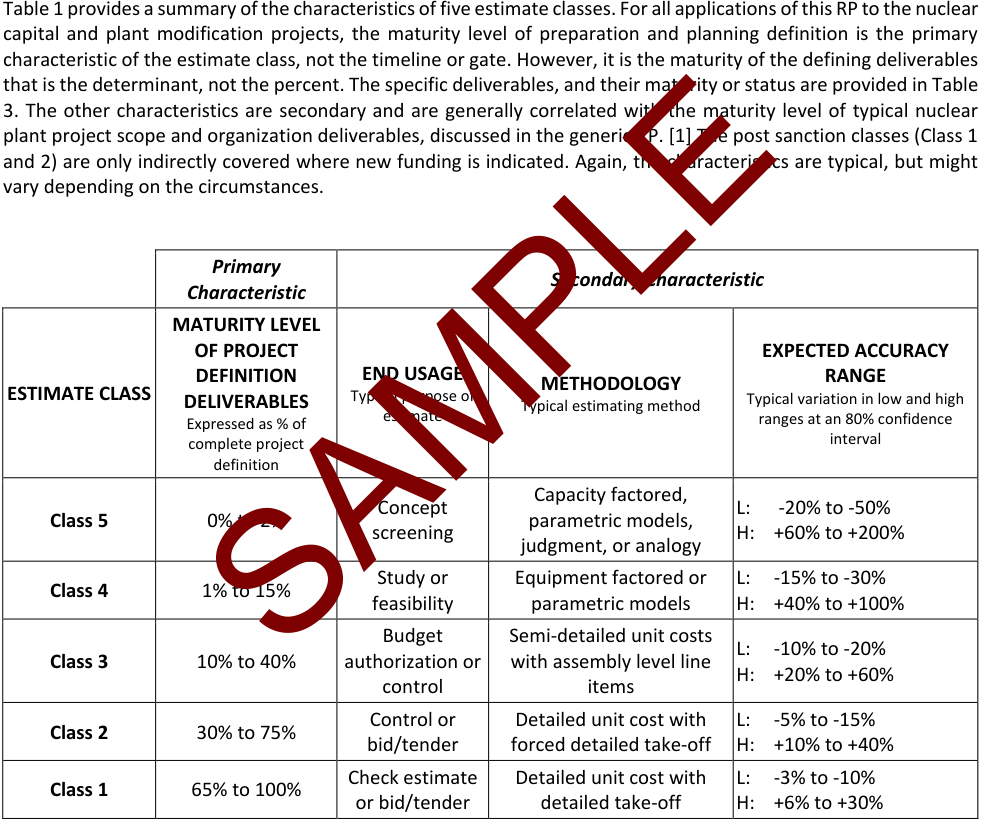

AACE® International Recommended Practice No. 115R-21 COST ESTIMATE CLASSIFICATION SYSTEM – AS APPLIED IN ENGINEERING, PROCUREMENT, AND CONSTRUCTION FOR THE NUCLEAR POWER INDUSTRIES TCM Framework: 7.3 – Cost Estimating and Budgeting Rev. February 5, 2022 Note: As AACE International Recommended Practices evolve over time, please refer to web.aacei.org for the latest revisions. Any terms found in AACE Recommended Practice 10S-90, _Cost Engineering Terminology_ , supersede terms defined in other AACE work products, including but not limited to, other recommended practices, the _Total Cost Management Framework_ , and _Skills & Knowledge of Cost Engineering_ . **Contributors:** _Disclaimer: The content provided by the contributors to this recommended practice is their own and does not necessarily reflect that of their employers, unless otherwise stated._ 

Arnaldo M. Angelini, PE CCP (Primary Contributor) John K. Hollmann, PE CCP CEP DRMP FAACE Hon. Life Shoshanna Fraizinger, CCP (Primary Contributor) Dr. Dan Melamed, CCP EVP FAACE Dr. Geoffrey S. Rothwell (Primary Contributor) Sean T. Regan, CCP CEP EVP PSP FAACE Apostolos Chatzisymeon Calvin Speight, Jr. CCP 

AACE[®] International Recommended Practices Single user license only. Copying and networking prohibited. 

This document is copyrighted by AACE International and may not be reproduced without permission. Organizations may obtain permission to reproduce a limited number of copies by entering into a license agreement. For information please contact editor@aacei.org 

AACE[®] International Recommended Practice No. 115R-21 

## COST ESTIMATE CLASSIFICATION SYSTEM – AS APPLIED IN ENGINEERING, PROCUREMENT, AND CONSTRUCTION FOR THE NUCLEAR POWER 

## INDUSTRIES 

TCM Framework: 7.3 – Cost Estimating and Budgeting 

February 5, 2022 **TABLE OF CONTENTS** Table of Contents .......................................................................................................................................................... 1 1. Purpose ...................................................................................................................................................................... 2 2. Introduction ............................................................................................................................................................... 2 3. Quality and Regulation of the Nuclear Power Industries .......................................................................................... 4 4. Cost Estimate Classification Matrix for the Nuclear Power Industries ...................................................................... 5 5. Determination of the Cost Estimate Class ................................................................................................................. 8 6. Characteristics of the Estimate Classes ..................................................................................................................... 8 7. Estimate Input Checklist and Maturity Matrix ......................................................................................................... 15 8. Basis of Estimate Documentation ............................................................................................................................ 19 9. Project Definition Rating System ............................................................................................................................. 19 10. Classification for Long-Term Planning and Asset Life Cycle Cost Estimates .......................................................... 20 References ................................................................................................................................................................... 21 Contributors ................................................................................................................................................................ 21 Appendix: Understanding Estimate Class and Cost Estimate Accuracy ....................................................................... 23 

115R-21: Cost Estimate Classification System – As Applied in Engineering, Procurement, and Construction for the Nuclear Power Industries 

## **1. PURPOSE** 

As a recommended practice (RP) of AACE International, the _Cost Estimate Classification System_ provides guidelines for applying the general principles of estimate classification to nuclear new build and modification[1] project cost estimates (i.e., cost estimates that are used to evaluate, approve, and/or fund projects). The _Cost Estimate Classification System_ maps the phases and stages of project cost estimating together into a generic project scope definition maturity and quality matrix, which can be applied across the nuclear power plant industry. 

This recommended practice provides guidelines to both owners and service providers for applying the principles of estimate classification specifically to project estimates for engineering, procurement, and construction (EPC) or other contractual arrangements and execution venues, and their related work in ongoing or developing nuclear power related projects. It supplements the generic cost estimate classification RP 17R-97 [1]  by providing: 

• A section that further defines classification concepts as they apply to the nuclear power industry and their unique differences to other industries. • A section on the industry specific quality assurance and regulatory requirements that might influence the cost estimate. • A section on general guidance regarding the application of productivity factors applicable to labor quantification that are specific to the conduct of work in support of nuclear power projects. • A chart that maps the extent and maturity of estimate input information (for example, project definition deliverables) into the estimate class. As with the generic RP, the intent of this document is to improve communications and consensus among all the stakeholders involved with preparing, evaluating, and using project cost estimates specifically for the nuclear power industries. The overall purpose of this recommended practice is to provide the nuclear power industries with a project definition deliverable maturity matrix that is not covered in RP 17R-97. [1] It also provides an approximate representation of the relationship of planning, preparation, design input data and project scope deliverable maturity with the estimate accuracy and methodology used to produce the cost estimate. This document is intended to provide a guideline, not a standard. It is understood that each enterprise may have its own project and estimating processes, terminology, and may classify estimates in their own particular way. This guideline provides a generic and generally acceptable classification system for the nuclear power industries that can be used as a starting point for the basis of comparison. This recommended practice should allow each user to better assess, define, and communicate their established and developed procedures in light of generally accepted cost engineering practice. **2. INTRODUCTION** 

For the purposes of this document, the term _nuclear power industry_ is assumed to include private and public utilities using nuclear fission reactors in the production of electrical power, exclusive of transmission and distribution.  There are primary scope defining documents that are credited for the purposes of their facilities operating license(s). These documents are also key deliverables in determining the degree of project definition for modification and new build projects, and thus the extent and maturity of estimate input information. 

The scope of work typically addressed by cost estimates for nuclear power facilities are typically composed of key features such as the following: 

> 1 For maintenance and turnaround projects, refer to RP 112R-20. [12] 

115R-21: Cost Estimate Classification System – As Applied in Engineering, Procurement, and Construction for the Nuclear Power Industries 

- The nuclear reactor structures, systems, equipment, and components (dependent on the various nuclear technologies employed). 

- The nuclear steam supply system (NSSS). 

- The turbogenerator (TG) and auxiliary systems. 

- The balance of plant (BOP) structures, systems, equipment, and components. 

- The primary and secondary safety, radiation, fire protection and security requirements. 

- External hazard probabilistic safety assessment (PSA) earthquake, flooding/tsunami, ambient temperature, etc. 

- Quality assurance and control requirements (applicable to design, procurement, and construction activities). 

- Environmental requirements. 

- A scaled level of complexity with respect to the design and construction associated with a modification or a new build project. 

a new build project. Cost estimates for nuclear power facilities include many management considerations that are specific to the industry and are outside of the typical mechanical, electrical and chemical process equipment, that might be encountered by the estimator in other industries. Nuclear power related projects have additional cost considerations related to licensing, worker radiation protection, nuclear safety systems procurement requirements, and security concerns that influence the selection and application of productivity factors on which to base cost quantification elements. Further, the estimator should be aware that due to the inherent requirement for depth and breadth of systems redundancy for licensing and safety considerations, nuclear projects will often have significant amounts of piping, instrumentation, and process controls involved as compared to other similar projects in other industries. This RP specifically does not address cost estimate classification in nuclear decommissioning and waste management as well as those related to research and fusion nuclear reactors. The cost estimates covered by this RP are for engineering, procurement, and construction (EPC) work only. It does not cover estimates for the products manufactured by the process facilities, or for research and development and pilot scale work in support of the nuclear power industry. This guideline covers the significant building construction that may be a direct part of the fuel cycle associated with a nuclear power plant. Major buildings not directly associated with these processes (e.g., office buildings) should use the RP for general construction. [2] Fuel enrichment, reprocessing, and disposal facilities are outside the scope of this RP. This guideline reflects generally accepted cost engineering practices. This recommended practice was based on the practices of a wide range of international companies in the nuclear power industry, as well as published references and standards. Company and public standards were solicited and reviewed, and the practices were found to have significant commonalities. [3] [4] [5] This classification is also supported by empirical nuclear power industry research of systemic risks and their correlation with cost growth and schedule slippage. [6] 

Cost estimates for nuclear power facilities include many management considerations that are specific to the industry and are outside of the typical mechanical, electrical and chemical process equipment, that might be encountered by the estimator in other industries. Nuclear power related projects have additional cost considerations related to licensing, worker radiation protection, nuclear safety systems procurement requirements, and security concerns that influence the selection and application of productivity factors on which to base cost quantification elements. Further, the estimator should be aware that due to the inherent requirement for depth and breadth of systems redundancy for licensing and safety considerations, nuclear projects will often have significant amounts of piping, instrumentation, and process controls involved as compared to other similar projects in other industries. 

This RP specifically does not address cost estimate classification in nuclear decommissioning and waste management as well as those related to research and fusion nuclear reactors. 

115R-21: Cost Estimate Classification System – As Applied in Engineering, Procurement, and Construction for the Nuclear Power Industries 

## **3. QUALITY AND REGULATION OF THE NUCLEAR POWER INDUSTRIES** 

Safety is an important aspect for any industry; however, the emission of significant nuclear radiation (as well as the release of radioactive materials) into the environment during an accident, causing harm to humans and the environment both on the reactor site and off-site is a primary safety and licensing concern related specifically to nuclear power plants. 

Quality assurance and control is a fundamental process in a nuclear project together with nuclear standards and codes and regulatory requirements. The nuclear industry has developed a set of nuclear specific engineering and material standards and codes that address the safety related challenges posed by irradiated materials and averting major structural or functional failure. These form part of the operators licensing conditions. For the purposes of preparing and developing project cost estimates, these will usually be identified in the contractual specifications provided to the EPC vendor. Main cost drivers in nuclear cost estimates are as follows: • The unique quality assurance and control (QA/C) requirements (nuclear grade) that apply for the procurement, fabrication and assembly of safety-related components as compared to commercial grade components used in other industries. Higher costs (for safety and seismic classification) will automatically result from high requirements and qualification for suppliers, such that they exceed the levels witnessed in commercial grade industries. • The productivity factors associated with the performance of work within security protected and radiological environments. Labor transit times through security barriers and the addition of radiological personnel protective equipment can significantly influence the estimated labor hour quantities and durations to complete work scopes. • Project planning that typically incorporates an “as low as reasonably achievable” (ALARA)[2] radiological planning culture to ensure dose minimization and worker safety standards with respect to radiological exposure. Nuclear regulation authorities around the world have different approaches to performance of nuclear power plant new build and modification activities. Regulatory involvement and requirements are the primary drivers of high cost and long duration schedules during licensing, permitting, engineering, fabrication, construction, and commissioning phases.[3] The reference safety regulations for this RP are those in France, the UK, the United States (USA), and Canada. In the USA and Canada there is more attention to quantitative goals, probabilistic assessments, and containing costs.  Due to the rigorous safety regulations and how they are enforced and sometimes change in some countries such as France, the UK and the USA, new build nuclear power plants face greater cost growth and schedule slip compared to countries such as China, Russia, and the United Arab Emirates. Existing nuclear codes and standards such as ASME (USA), CSA N299 and N285 (Canada), RCC (France), PNAE G-7 (Russia), and JSME (Japan) have an important influence on design, manufacturing, construction, and commissioning on project cost and schedule. [7] 

- The productivity factors associated with the performance of work within security protected and radiological environments. Labor transit times through security barriers and the addition of radiological personnel protective equipment can significantly influence the estimated labor hour quantities and durations to complete work scopes. 

In nuclear projects the safety related qualification of structures, equipment and materials increase prices of manufacturing and erection by a factor of 2 to 5 times non-nuclear items. The regulatory management requirements for construction can increase labor costs by similar multipliers due to productivity impacts. Further, the impact of schedule delays on long duration projects are compounded by financing and escalation costs. More important to the topic of classification is that accuracy ranges are widened due to the uncertainty expressed by this range of multipliers and risk drivers; the impact on any given project is hard to predict. 

> 2 Defined in Title 10, Section 20.1003, of the Code of Federal Regulations (10 CFR 20.1003). [20] 

> 3 Seek legal counsel in the country for specific application of regulations and requirements in the local jurisdiction. 

115R-21: Cost Estimate Classification System – As Applied in Engineering, Procurement, and Construction for the Nuclear Power Industries 

## **4. COST ESTIMATE CLASSIFICATION MATRIX FOR THE NUCLEAR POWER INDUSTRIES** 

A purpose of cost estimate classification is to align the estimating process with the typical project stage-gate scope development and decision-making processes used in the nuclear industry. It should be recognized that some nuclear project delivery entities (owners or vendors) employ a scaled approach to project delivery based on the evaluation of typical attributes that define the size and complexity of scope such as: safety, duration, schedule flexibility and integration, technology and process interfaces, level of effort, change impact, resources, perception and level of risk and stakeholder management that might influence  the project stage-gate process as well as the evaluation of the cost estimate for classification. 

**----- Start of picture text -----** 
Table 1 provides a summary of the characteristics of five estimate classes. For all applications of this RP to the nuclear capital and plant modification projects, the maturity level of preparation and planning definition is the primary characteristic of the estimate class, not the timeline or gate. However, it is the maturity of the defining deliverables that is the determinant, not the percent. The specific deliverables, and their maturity or status are provided in Table 3. The other characteristics are secondary and are generally correlated with the maturity level of typical nuclear plant project scope and organization deliverables, discussed in the generic RP. [1] The post sanction classes (Class 1 and 2) are only indirectly covered where new funding is indicated. Again, the characteristics are typical, but might vary depending on the circumstances. Primary Secondary Characteristic Characteristic MATURITY LEVEL OF PROJECT  EXPECTED ACCURACY DEFINITION  END USAGE  RANGE METHODOLOGY ESTIMATE CLASS  DELIVERABLES  Typical purpose of  Typical estimating method  Typical variation in low and high Expressed as % of  estimate  ranges at an 80% confidence complete project  interval definition Capacity factored, Concept  L:   -20% to -50% Class 5  0% to 2%  parametric models, screening  H:  +60% to +200% judgment, or analogy Study or  Equipment factored or  L:  -15% to -30% Class 4  1% to 15% feasibility  parametric models  H:  +40% to +100% Budget  Semi-detailed unit costs L:  -10% to -20% Class 3  10% to 40%  authorization or  with assembly level line H:  +20% to +60% control  items Control or  Detailed unit cost with  L:  -5% to -15% Class 2  30% to 75% bid/tender  forced detailed take-off  H:  +10% to +40% Check estimate  Detailed unit cost with  L:  -3% to -10% Class 1  65% to 100% or bid/tender  detailed take-off  H:  +6% to +30% SAMPLE **----- End of picture text -----** 

**Table 1 – Cost Estimate Classification Matrix for the Nuclear Power Industries** 

This matrix and guideline outline an estimate classification system that is specific to the plant modification and new build projects in the nuclear power industry. Refer to Recommended Practice 17R-97 [1] for a general matrix that is non-industry specific, or to other cost estimate classification RPs for guidelines that will provide more detailed information for application in other industries. These will provide additional information, particularly the _Estimate Input Checklist and Maturity Matrix_ that determines the class in those industries. See Professional Guidance Document 01, _Guide to Cost Estimate Classification._ [8] 

