Reviews of Accelerator Science and Technology
Vol. 6 (2013) 85–116

_⃝_ c World Scientific Publishing Company
DOI: [10.1142/S1793626813300053](http://dx.doi.org/10.1142/S1793626813300053)

**Accelerators** **for** **Inertial** **Fusion** **Energy** **Production** _**[∗]**_

R. O. Bangerter, _[†]_ A. Faltens and P. A. Seidl

_Lawrence_ _Berkdey_ _National_ _Laboratory_
_Berkeley,_ _CA_ _94720,_ _USA_
_†ROBangerter@lbl.gov_

Since the 1970s, high energy heavy ion accelerators have been one of the leading options for imploding and igniting
targets for inertial fusion energy production. Following the energy crisis of the early 1970s, a number of people in the
international accelerator community enthusiastically began working on accelerators for this application. In the last
decade, there has also been significant interest in using accelerators to study high energy density physics (HEDP).
Nevertheless, research on heavy ion accelerators for fusion has proceeded slowly pending demonstration of target
ignition using the National Ignition Facility (NIF), a laser-based facility at Lawrence Livermore National Laboratory.
A recent report of the National Research Council recommends expansion of accelerator research in the US if and when
the NIF achieves ignition.
Fusion target physics and the economics of commercial energy production place constraints on the design of
accelerators for fusion applications. From a scientific standpoint, phase space and space charge considerations lead to
the most stringent constraints. Meeting these constraints almost certainly requires the use of multiple beams of heavy
ions with kinetic energies _>_ 1 GeV. These constraints also favor the use of singly charged ions. This article discusses
the constraints for both fusion and HEDP, and explains how they lead to the requirements on beam parameters.
RF and induction linacs are currently the leading contenders for fusion applications. We discuss the advantages
and disadvantages of both options. We also discuss the principal issues that must yet be resolved.

_Keywords_ : Inertial fusion energy; induction accelerators; RF accelerators; high energy density physics.

**1.** **Introduction**

The early 1970s were a transitional period in energy
policy and energy research. The OPEC oil embargo
led to a fourfold increase in oil prices between October 1973 and January 1974. There were long lines at
US gasoline pumps. There was widespread concern
about the energy crisis. By 1977 US President Jimmy
Carter had declared the energy crisis the “moral
equivalent of war”.
The idea of using accelerators for inertial fusion
energy (IFE) production was born during this
period. Today it is difficult to appreciate the level
of enthusiasm among accelerator experts when it
appeared that accelerators - devices that they had
been building for 40 or 50 years - seemed capable
of solving the energy problem.
Although lasers were used for most of the initial
experiments on IFE, the prospects for acceleratorbased IFE appeared very promising. Nearly all

reviews of the US inertial fusion program concluded that accelerators were the most promising
long-term option [1–5]. With some year-to-year fluctuations, US funding for accelerator-based inertial
fusion increased for two-and-a-half decades, reaching its highest level in 2000. In other countries
accelerator research for fusion was mostly associated
with research on accelerators being built for other
purposes.
In 1994, the US Department of Energy made
the decision to design and build the National Ignition Facility (NIF) at Lawrence Livermore National
Laboratory [6]. The NIF is a laser-based facility
designed to evaluate, in the laboratory, the feasibility of inertial fusion. It was completed in 2009 at
a cost of approximately US$4 _×_ 10 [9] . As the name
indicates, a principal goal is to achieve thermonuclear ignition. The NIF laser does not have many of
the features (such as high efficiency and high pulse

_∗_ Work supported by the US Department of Energy under contract No. DE-AC02-05CH11231.

repetition rate) needed for fusion energy production,
but achievement of ignition will put to rest basic
physics issues that are relevant not only to laser
fusion but also to accelerator fusion.
The advent of the NIF had a profound effect
on fusion accelerator research. Should research continue or should it be put on hold pending results
from the NIF? In 2003, the Department of Energy
decided to de-emphasize IFE research but to continue accelerator research to study high energy density physics (HEDP). Since that time funding has
declined. During this interim period there has been
increasing interest in HEDP not only for fusion applications but also for such fields as astrophysics and
basic studies involving the equation of state for various materials [7].
Ignition at the NIF has proven to be a difficult goal. The NIF has not yet produced ignition, although a recent report by the National
Research Council [8] is optimistic about eventual success. Furthermore, the report recommends the reestablishment of an aggressive IFE program, including accelerators, if and when the NIF achieves
ignition.
In writing a review article, we face an important decision. If one believes that the NIF will not
achieve ignition, the principal legacy of the fusion
accelerator research program will lie in the science
of intense beam physics, including practical details
such as the effects of electrons and gas produced by
a beam halo striking the walls of the chamber. The
program has made major contributions to the development of computer codes to study high intensity
beams. It has also made major contributions to the
science of beam–plasma interactions. A review article could emphasize these topics.
If, on the other hand, one believes that there is a
reasonable chance that the NIF will achieve ignition
and that there will be a resurgent IFE accelerator
program, then a review article could emphasize the
fundamentals of accelerator-based IFE. The article
could serve as a repository of issues specific to fusion
and as a roadmap to help a resurgent program avoid
the pitfalls and blind alleys that have been encountered and explored during the last 40 years. We have
decided to take the latter approach. We hope that
our references will provide a guide for those who are
interested in the more basic general issues.

Accelerator IFE has always faced two fundamental issues. To ignite fusion, an accelerator must
deposit a lot of energy in a small volume in a short
time. This means that the beams must have an
intense focus in space and time. The second issue
is an issue shared by essentially all credible fusion
options, namely capital cost. Before we discuss these
issues, we will give an overview of IFE history, including the issues associated with ignition.
Accelerators were not the first devices to be suggested for inertial fusion. In 1972, Nuckolls _et al._ proposed producing energy by using lasers to implode
(compress) and ignite small targets containing thermonuclear fuel [9]. Since the burning fuel in this
scheme is not confined by magnetic fields, but by
it own inertia, this type of fusion is referred to as
inertial fusion, a term we have already mentioned.
The beam parameters required to bring the fuel to
ignition temperature (of the order of 10 keV) are
formidable. Approximately 1–10 MJ of beam energy
must be focused onto a target at an intensity of 10 [14] 10 [15] W/cm [2] . If ignition can be achieved, detailed
numerical simulations indicate that each target will
produce of the order of 100 times as much energy
as the 1–10 MJ supplied to the target. A typical target radius for an IFE target is _∼_ 2 mm. This radius
corresponds to an area of _∼_ 0.5 cm [2] for a spherical
target and consequently a total beam power usually _>_ 10 [14] W. The pulse duration is typically several
nanoseconds.
In some ways pulsed lasers are good tools to use
for inertial fusion because they can readily produce
the required high focused intensities. But there are
other requirements for commercial energy production. The device (driver) used to implode and ignite
the targets must be reliable, durable, and efficient.
It must also be capable of producing multiple pulses
per second. For example, based on the numbers given
in the preceding paragraph, a typical fusion energy
yield of a target might be 300 MJ. If a third of this
could be converted to net electrical energy in a power
plant, it would require 10 pulses per second to produce 1 GW of electrical power, the output of a typical power plant. We will discuss all these issues and
requirements more fully in subsequent sections. We
note parenthetically that the values of focused intensity, beam power, pulse duration, and repetition rate
given above define what is meant by high intensity

in the context of IFE and in the context of the title
of this volume.
In 1972, there were no high power pulsed laser
systems that could meet any of the requirements for
commercial power production - except the requirement on focused intensity. Consequently, in addition
to initiating a program to test the target physics,
governmental and private groups worldwide initiated programs to develop various types of lasers that
might meet the requirements. This has proven to be
a difficult task. After four decades of development,
the NIF, the largest laser facility in the world, does
routinely deliver about 2 MJ of energy to targets, but
at low repetition rates (a few shots per day) and low
efficiency ( _<_ 1%).
The difficulties in developing lasers for IFE led
several groups and individuals to suggest alternative
drivers. One early suggestion was electron and/or ion
beam accelerators based on pulsed power technology

[10]. Others had suggested ion accelerators based on
more conventional high energy accelerator technology [11, 12]. In many ways, high energy accelerators appeared to be well suited to IFE. They had
demonstrated high reliability, long life, high pulse
repetition rates and, in some cases, good efficiency.
In addition, large machines such as those at CERN
and Fermilab had produced or stored of the order
of 1 MJ of beam energy. The ISR at CERN had a
DC recirculating power of approximately 1 TW. Furthermore, the cost of these large facilities was less
than US$10 [9], a cost that appeared consistent with
economical energy production. Moreover, the beams
from existing accelerators could be focused to the
small spot sizes required by the targets. Finally, it
was soon observed that accelerators have yet another
important advantage. The survivability of laser optical elements in a fusion environment had emerged
as a major issue for laser IFE. Since particle beams
can be focused by magnetic fields rather than material optical elements, it appeared possible to design
focusing elements that would survive [13–16]. In summary, accelerator technology appeared to provide
solutions to most of the difficult issues facing IFE.
Despite the favorable characteristics of accelerators for IFE, there have always been some important
issues. One issue is ion range. The large accelerators
that produced _≥_ 1 MJ of beam energy accelerated
protons to _≥_ 20 GeV. At these relativistic energies,
the range of a proton is sufficiently large that the

beams would pass through the small targets with little energy loss. This means that high energy protons
or other light ions are not directly suitable for driving
targets. At sufficiently low, nonrelativistic ion energies — say, _≤_ 20 MeV — the range of protons or other
light ions is acceptable; but it has proven difficult or
impossible to generate the focused intensity needed
to drive the targets. The needed currents are simply
too high. One might hope to circumvent the problem of high current by employing some kind of neutralization, for example by propagating the beams in
a plasma. Unfortunately, high currents also lead to
high beam emittance, making it difficult to focus to
the required spot sizes. Ultimately, these emittance
considerations appear to be the more fundamental
limitation on the use of low kinetic energy.
In about 1975, A. W. Maschke observed that
one could use high energy (multi-GeV) heavy ions to
minimize the required current with a range consistent with the target dimensions [17]. Figure 1 shows
ion range as a function of kinetic energy for a variety of ions. For fixed range, the kinetic energy of
the heaviest ions exceeds the kinetic energy of a proton by about three orders of magnitude. Because of
these considerations, the entire IFE program based
on high energy accelerator technology became known
as the heavy ion fusion (HIF) program despite the
ambiguity with nuclear physics reactions involving
heavy ions. Maschke proposed using synchrotrons

Fig. 1. Range as a function of energy for a variety of ions in
low _Z_ material (aluminum) at a temperature of 300 eV. Heavy
ions rapidly strip as they strike matter, greatly increasing their
stopping power. This leads to shorter range for the heavier elements. The optimal range for fusion usually lies between 0.03
and 3 g/cm [2] . The chosen ions, mostly from the first column
in the periodic table, are examples only. We chose bismuth
rather than francium since almost no francium exists in the
earth’s crust.

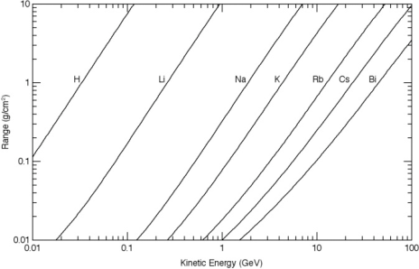

or RF linacs followed by storage rings to produce
the needed beams. Even with multi-GeV beams, the
required beam current would push the tune shift
in typical rings beyond 0.25, the Laslett limit. (To
avoid resonances, the tune shift is usually less than
this value in most machines.) Maschke demonstrated
that one could transiently exceed the Laslett limit
by rapidly compressing the beam in the Brookhaven
AGS so that resonant conditions did not last long
enough to destroy the beam [18]. Denis Keefe took
another approach to HIF. He suggested the use
of induction linacs from ion source to target since
induction machines (relatively low impedance accelerators) are well suited to high current [19]. Section 6
discusses both RF and induction approaches to HIF.
So far our discussion has been mostly qualitative. Section 2 gives a more complete discussion on
targets and their influence on beam requirements.
Section 3 gives a more complete discussion on the
requirements on efficiency, reliability, durability, repetition rate, economics, etc. Section 4 deals with fundamental constraints on accelerator design and beam
physics, such as space charge and phase space constraints. Section 5 quantitatively discusses the choice
of ion mass and charge state; and, as noted above,
Sec. 6 deals with accelerators. Some important topics, such as target fabrication, target injection and
tracking, and fusion chamber design, are beyond the
scope of this article. Reference 8 is a good primer on
most of these omitted topics.

**2.** **Target** **Physics** **Considerations**

A complete discussion of targets for HIF and their
implications for accelerator design is beyond the
scope of this article. There are excellent general references on IFE target physics for those readers who
would like more details [20, 21]. Reference 22 is a
recent reference specifically on HIF targets. For our
purposes we will discuss only those aspects of target physics that are closely related to accelerator
beam requirements. This section is rather long but
we believe that it is necessary to understand some of
the current topics in HIF, such as research on accelerators for fast ignition.

**2.1.** _**Target**_ _**scaling**_

Targets for IFE and HEDP place lower limits
on two fundamental quantities: the specific energy

deposition _ε_ and the beam power per unit area _S_ .
A typical IFE target requires _ε_ greater than or of
the order of 10 [8] J/g; and, as mentioned above, _S_
greater than or of the order of 10 [14] W/cm [2] . The reasons for the magnitude of these quantities will be
briefly explained later in this section.
As a scientific matter, the lower limits on _ε_
and _S_ for HEDP are much smaller than the lower
limits for IFE. In fact, there is currently interest
in a subfield of HEDP, namely ion-driven warm
dense matter physics (WDMP) [23, 24]. WDMP is
an achievable goal for near-term accelerator experiments and a variety of short pulse lasers. In the
long term, lasers compete with accelerators for IFE
and HEDP applications. Since lasers can already
produce the values of _ε_ and _S_ required for fusion,
it seems prudent to assume that, for planning purposes, the long-term HEDP requirements on _ε_ and _S_
are as stringent as those on IFE. Nevertheless, there
are some differences between the requirements for
the two applications. One of these is a requirement
involving scale. Unlike IFE, where a certain minimum energy is needed to achieve ignition, meaningful
HEDP experiments can be done at any scale as long
as the appropriate values of _ε_ and _S_ are provided —
and appropriate diagnostics are available.
The specific energies involved in IFE and HEDP
are sufficiently high that the strength of the target
materials is usually unimportant. The equations of
ordinary hydrodynamics then provide a reasonable
first approximation to the time evolution of IFE and
HEDP targets. These equations are the continuity
equation, Euler’s equation, the energy equation, and
the appropriate equations of state for the various
materials in the target [25]. An examination of these
equations shows that if _ε_ and _S_ are fixed, the various flow variables, such as density, pressure, velocity,
and temperature, will depend on the spatial variables
divided by the time variable, rather than on the spatial variables and time independently. In other words,
if space and time are scaled by the same factor _ς_,
the solutions to the equations are similar. This scaling is usually referred to as hydrodynamic scaling.
With this type of scaling, for a fixed target design,
the ion range _R_ and the required focal spot radius
_r_ scale as _ς_ . The beam power _P_ scales as _ς_ [2] and
the target mass and total beam energy _W_ scale as
_ς_ [3] . This scaling explains why there is no fundamental
requirement on the scale of HEDP targets. For fusion

targets, however, there are important processes that
do not scale hydrodynamically.
To achieve thermonuclear ignition, it is necessary to have the rate at which the fuel gains energy
be greater than the rate at which it loses energy. The
work done on the fuel by the implosion and the selfheating of the fuel by reaction products are energy
gain mechanisms. Electron thermal conduction and
radiation are energy loss mechanisms. The reaction products for deuterium–tritium fuel are 3.5 MeV
alpha particles and 14.1 MeV neutrons. At a temperature of approximately 10 keV, the fusion reactions
usually become the dominant heating mechanism.
The alpha particles have a range of approximately
0.3 g/cm [2] at this temperature. The nuclear reaction
length of the neutrons is much larger, so the alphas
do most of the heating in an IFE target. Much of the
alpha energy must be trapped to achieve ignition, so
the minimal acceptable value of the product of fuel
density and fuel radius (a ubiquitous IFE quantity
called the _ρr_ product) is approximately 0.3 g/cm [2] .
The same considerations apply to all fusion fuels
of interest for IFE. It is desirable to trap the energy of
the fusion reaction products in the fuel so as to assist
with ignition and burn. Since the ranges of reaction
products do not scale hydrodynamically, trapping
the energy of these products imposes a constraint
on the allowable scale of fusion targets. Specifically,
it becomes increasingly difficult to achieve ignition
at a smaller scale since higher compressed fuel density is required to achieve the required _ρr_ product
at a smaller scale. Achieving higher density requires
higher implosion velocity and therefore higher _ε_ .
Electron heat conduction is an additional important
process that causes targets to scale poorly to smaller
sizes. Finally, the fraction of the thermonuclear fuel
that burns before the target explodes decreases with
decreasing values of the _ρr_ product of the compressed
fuel. These (and other) considerations place a practical lower limit of roughly 1 MJ on the energy required
to drive IFE targets.

**2.2.** _**Specific**_ _**energy**_ _**and**_ _**intensity**_
_**requirements**_

So far we have given the required values of _ε_ and
_S_ without explaining the reasons for these values.
Although these quantities depend weakly on scale
size, as explained above, they can be quite different
for different types of targets - and several types

of targets have been proposed and designed. In this
section we discuss various types of targets and give
representative values for _ε_ and _S_ .
For our purposes we categorize HIF targets by
their implosion (compression) mode and by their
ignition mode. Direct drive and indirect drive are
modes of implosion. Hot-spot ignition, shock ignition, and fast ignition are modes of ignition. Figure 2
illustrates direct drive and indirect drive for HIF targets. In the former case, the ion beams penetrate the
outside layer of the fuel capsule. Owing to the rapid
heating by the ions, this layer explodes or ablates,
producing high pressure to implode the fuel. The
fuel itself consists of a cryogenic shell of hydrogen
isotopes (solid or liquid supported in a low density
foam). This layer surrounds a spherical volume containing gas in equilibrium with the solid or liquid.
In the indirect case, the beams heat material
inside a hohlraum (cavity) producing nearly thermal radiation that heats the ablator material on
the outside of the fuel capsule. The hohlraum is
made of some high _Z_ material such as lead. High
_Z_ materials have high opacity at the wavelengths
and temperatures of interest, so the radiation does
not penetrate deeply into the hohlraum wall, thereby

Fig. 2. Schematic diagrams of two types of targets: direct
drive and indirect drive. In the first case, the ions beams
impinge directly on the capsule containing the fuel. Spherical illumination is shown but other geometries are possible. In
the second case, the beams heat material that fills a hohlraum
(cavity) with radiation. The radiation drives the capsule. The
advantages and disadvantages of these two methods of implosion are stated in the text. Either type of target can, in principle, use either hot spot ignition or fast ignition. With hot spot
ignition, the implosion itself heats part of the fuel to ignition.
With fast ignition, a beam pulse, usually separate from the
implosion beams, heats a portion of the fuel to ignition.

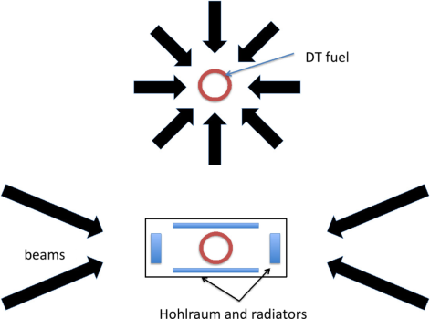

minimizing energy loss. Each mode of implosion has
advantages and disadvantages. The biggest advantage of direct drive is efficiency. The fraction of
beam energy transferred to the imploding fuel can be
_∼_ 15%, about a factor of 2 or 3 greater than the corresponding number for indirect drive. Directly driven
targets are also mechanically and chemically less
complex than indirectly driven targets. On the other
hand, the hohlraum around the indirectly driven
capsules smooths imperfections and asymmetries in
the beams and allows a broader range of illumination geometries. Beam alignment tolerances are more
relaxed for indirect drive (typically _∼_ 200 _µ_ m compared to _∼_ 20 _µ_ m for direct drive). Indirect drive also
has an important programmatic advantage. Indirect drive with hot-spot ignition is currently the
main approach at the NIF. As long as the driver
beams produce nearly thermal radiation, the capsule physics is largely independent of the choice of
driver (accelerator or laser). For this reason, ignition
on NIF would greatly increase confidence in indirectly driven targets with hot spot ignition for HIF

[26]. The connection to HIF direct drive with hot
spot ignition is more tenuous, and there is little connection between the indirect drive NIF results and
ion-driven fast ignition.
Note that the target examples in Fig. 2 are
shown with multiple beams. Most target designs
require illumination by multiple beams. More importantly, it appears extremely difficult to produce the
required beam power without multiple beams.
Now consider the ignition mode. In hot spot ignition, a small quantity of fuel in the center of the
capsule, such as the gas in equilibrium with the solid
or liquid fuel, is heated to ignition by _PdV_ work
(and fusion reactions) as the capsule implodes. In
shock ignition, a high power beam pulse is applied
to the outside of the target at such a time that a
strong incoming shock wave assists the heating of
the central part of the target to ignition temperature. For fast ignition, the two processes - implosion and ignition - are largely decoupled and an
intense beam directly heats a small portion of the
fuel to ignition temperature. In all cases, the thermonuclear burn propagates from the small portion of
the fuel that is ignited into the colder fuel surrounding it. The reason for requiring propagating burn
is easily understood. It requires _∼_ 10 [9] J/g to heat
deuterium–tritium fuel to ignition but only _∼_ 10 [7] J/g

to compress it to _∼_ 1000 times solid density, a typical density for inertial fusion. To achieve such low
compression energy, the fuel must be nearly Fermidegenerate. Specifically, the specific energy in the
fuel must not substantially exceed the Fermi specific
energy (10 [5] J/g for solid-density fuel). In summary,
because the compression energy is low compared to
the ignition energy, it is advantageous to compress
most of the fuel in a nearly degenerate state and to
ignite as little fuel as possible. The thermonuclear
burn, under appropriate conditions, can then propagate into the colder compressed fuel. Without propagating burn, it is not possible to achieve the high
energy gain ( _G_ = energy produced / beam energy)
needed for IFE.
As previously noted, hot spot ignition cannot
occur unless the rate of doing work on the hot spot
region of the fuel exceeds the rate of energy loss
out of the region. Achieving the required rate of
doing work usually requires an implosion velocity
_v_ _≥_ 300 km/s. This velocity corresponds to a specific
energy [1] 2 _[v]_ [2] [= 4] _[.]_ [5] _[×]_ [10][7][ J/g. Since this specific energy]

exceeds the specific energy needed for compression
alone, it is energetically advantageous to separate
the ignition process from the implosion process. This
consideration provides one rationale for considering
shock ignition and fast ignition. It has been difficult
to design credible HIF targets that use shock ignition. Shock ignition, if it is feasible for HIF, will likely
have requirements between the other two cases. For
this reason, in the remainder of this article we will
consider only hot spot ignition and fast ignition in
deriving accelerator beam requirements.
Note that, in the previous paragraph, the specific
energy requirement of the inwardly moving cold fuel
is 4 _._ 5 _×_ 10 [7] J/g. This value is close to the required
value of specific energy deposition _ε ∼_ 10 [8] J/g given
previously. The reason is the following: an implosion
is basically a rocket-like process. For good efficiency,
the specific energy put into the rocket exhaust must
be of the same order of magnitude as the specific
energy represented by the velocity of the payload.
Consequently, for hot spot direct drive, the specific
energy that must be deposited in the ablator by the
ion beams is also of the order of 4 _._ 5 _×_ 10 [7] J/g. For
indirect drive, the temperature of the radiators must
exceed the temperature of the ablator in order to
transport energy in the correct direction. Moreover,
the energy in the ablator and the hohlraum wall

must have been deposited in the radiator. For these
reasons, the specific energy that must be deposited
in the radiators by the ion beams usually exceeds
4 _._ 5 _×_ 10 [7] J/g by more than a factor of 2. Although
this cost is substantial, there are some mitigating
factors. For directly driven targets, the beam radius
cannot substantially exceed the capsule radius. Otherwise part of the beam misses the target. Indirectly
driven targets have the flexibility to trade off radius
and ion range while keeping the mass of the radiators constant. For example, a cylindrical radiator
having a radius of 2 mm and a “length” or areal
density of 0.2 g/cm [2] would have the same mass as
a radiator having a radius of 4 mm and an areal density of 0.05 g/cm [2] . In a first approximation the target performance would be comparable for the two
cases. In other words, the beam focal spot radius is
not directly coupled to the fuel capsule radius as it
is for direct drive. This flexibility in target design
translates to greater flexibility in accelerator design.
Furthermore, for spherical direct drive the mass that
must be heated to 4 _._ 5 _×_ 10 [7] J/g is approximately the
area of the surface times the ion range or 4 _πr_ [2] _R_ . An
indirectly driven target might have as few as one or
two radiators inside the hohlraum corresponding to
a mass of only one or two times _πr_ [2] _R_ . This is an
argument in favor of illuminating only one side of
a hohlraum, if the capsule can be compressed uniformly. Finally, although an indirectly driven target
still requires more drive energy, there is an additional
mitigating factor. The ratio of required energy in the
two cases - say, 2:1 for a given capsule yield is larger than the ratio of required power. The reason is the following: the power to the capsule, in
the case of indirect drive, is approximately proportional to the fourth power of the temperature in the
cavity (Stefan’s law). It requires a significant time,
compared to the capsule implosion time, to heat the
radiators and cavity to a high-enough temperature to
drive the capsule effectively. This means that for indirect drive the beam energy is delivered over a time
that is longer than the implosion time. In direct drive
the energy is delivered in a time that is comparable
to the implosion time. In other words, the energy
penalty associated with indirect drive is partly paid
early in the pulse when the implosion velocity is
small. This is important because the constraints on
accelerator design depend more strongly on power
than on energy.

Although our arguments provide the correct
order of magnitude for _ε_, they say little about the
actual physical size of the targets. Why, for example,
can one not make a target that consists of a very
large, thin shell of fuel surrounded by an ablator?
In this case, the implosion time would be long and
the focal spot size would be large. Fluid instabilities
are one of the important limitations on making the
target shell large and thin. The implosion process is
hydrodynamically unstable. Small perturbations on
or in the shell grow as the shell is imploded. If they
grow to sizes comparable to the shell thickness, the
integrity of the shell is destroyed. Quantitatively, this
and other considerations place an upper limit on the
initial radius of the shell of about 2 mm for a capsule
that requires of the order of 1 MJ of energy. This
radius, for direct drive, is also approximately equal
to the maximum usable beam radius. Knowing the
radius, the required specific energy, the total energy,
and the implosion velocity, one can easily calculate
the other quantities of interest, such as intensity,
ion range, and pulse duration. While these kinds of
arguments explain the physics that is important and
provide order-of-magnitude estimates for important
beam quantities, it is important to emphasize that
these quantities vary by significant factors, depending on the details of the target design. Large scale
numerical simulations are used to obtain more accurate values [27].
There is a large difference between the beam
requirements for fast ignition and the requirements
for hot spot ignition. For fast ignition, the implosion velocity is not coupled to the ignition velocity, so it needs only to correspond to the specific
energy of compression ( _∼_ 10 [7] J/g). This corresponds
to a velocity of 140 km/s. Consequently, for compression, the pulse duration can be about a factor of 2
longer than for hot spot ignition and the total energy
and specific energy can, in principle, be several times
lower. In contrast, the beam requirements for the
ignition pulse are stringent. For simplicity assume
that the ignition region for fast ignition is cylindrical. The mass of this region is given by _M_ = _πr_ [2] _R_,
where _r_ is focal spot radius and _R_ is ion range.
Consider two cases: _r_ = 50 _µ_ m _, R_ = 0 _._ 6 g/cm [2] and
_r_ = 150 _µ_ m, _R_ = 3 g/cm [2] . The first case requires
_∼_ 50 kJ to heat the fuel to ignition (10 [9] J/g). The
second case requires _∼_ 2 MJ. We can get an estimate
of the pulse durations associated with these two cases

by repeating the time required for the ignition region to flow itself equal to the radius divided by the speed of sound in DT fuel (~1×10⁸m/s). For 50 μm we obtain 50 ps and 150 μm we obtain 150 ps. One obviously minimizes the ignition energy by minimizing the radius. What is the practical lower limit for the beam radius? It appears that the most striking limit arises from accelerator and beam physics considerations, as discussed in Secs. 4 and 5. The required beam power for the first case is ~10¹⁵ W. For the second case it is ~10¹⁴ W, but both cases the required intensity is >10¹⁷ W/cm².

There is one other important point of comparison between the two ignition modes. For fast ignition, the energy required to drive the target, and consequently the target gain, depend strongly on the assumed focal spot radius and ion range, as shown above. Targets employing hot spot ignition are significantly less sensitive to variations in ion range and focal spot radius [26].

## 2.3. Published target designs

Since the preceding parts of this section gave only estimates of beam parameters, we conclude this section by listing the requirements of four specific HIF target designs (Table 1) that have been simulated [27, 31] using computer codes benchmarked to a wide variety of experiments. Three of these targets are indirectly driven targets using hot spot ignition. We have chosen these targets because they are of the same type as those currently being towards the NIF. The fourth, the X-Target, is directly driven target using fast ignition. We will subsequently show that it is difficult to meet the beam requirements for "beam radius" – for example, two times run or half width at half maximum.

Table 1. Examples of specific target designs and beam requirements are compared. The name of the target is the name chosen by its designers. The first three targets were designed by the same people using the same codes. The designs are included some margins in the designs to cover uncertainties. The X-Target was designed using a different code. It is probably more speculative [22], although the uncertainties in all designs are large. We were unable to find a published value for the peak power of the Hybrid target. The listed value is our estimate. Different publications give somewhat different numbers for these example targets. These differences do not affect our conclusions.

| Target name | Energy (MJ) | Power peak (TW) | Focal Gain for radius (mm) | Kinetic energy (GeV) |
|---|---|---|---|---|
| Distributed | 5.9 | 780 | 2.7 | 16 | 4.0 |
| Radiator [?] | | | | | |
| Hybrid | 4.7 | 780 | 4.5 | 60 | 4.5 |
| Close-Coupled | 3.3 | 470 [?] | 1.7 | 130 | Ph 4.0 [?] |
| X-Target | 5.6 | $5 \times 10^5$ | 0.26 | 500 | Bi 25 |

it is difficult to meet the beam requirements for "beam radius", but it represents the alternative that is least like the NIF targets. It is argued that this target partially decouples the HIF program from success or failure on the NIF.

The beam energy is deposited with a time dependence of relatively low power followed by a shorter duration, higher power burst characterized by the peak intensity. Most of the energy is deposited during the short duration burst.

Direct drive with hot spot ignition is a target category that is not represented in Table 1. Many of the detailed designs in this category are dated. Also, in terms of power and energy requirements (but not beam profile or pointing accuracy), the directly driven targets are somewhat more relaxed

than the indirectly driven targets. Otherwise, the requirements are similar to for the two cases. The Close-Coupled target listed in the table can be used as an approximate example of direct drive.

Although the hydrodynamic scaling described in Subset. 2.1 is not precise, we will subsequently use it to investigate the effects of changing the scale of the targets shown in Table 1.

Finally, we note that the table lists only baseline target requirements. All the targets require a specific pulse shape and some require the kinetic energy to be a function of time. These details are important for detailed accelerator design studies but are not important for our purposes. There are also differences in how the various authors define "beam radius" – for example, two times rms or half width at half maximum.

## 3. Accelerator Considerations Relating to Target Chambers and Economics

The target considerations discussed in Sec. 2 impose stringent constraints on the design of accelerators for both fusion and HEDP. Beyond the constraints arising from target physics there are five other constraints on accelerators for HEDP. In contrast, there are a number of additional constraints for the fusion application. We discuss them in this section.

Figure 3 shows a schematic diagram of an IFE power plant. We denote the gross electrical power

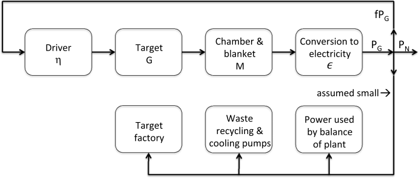

output of the plant by _PG_ and the net power available
to sell to customers by _PN_ . The difference between
these two quantities is the power required to drive the
driver plus the power required to drive all the other
systems, such as controls, recycling of target debris,
the target factory, pumps and lights. (We include
refrigerator power needed for superconducting magnets in the power required by the driver.) A common
simplification is to assume that the sum of all power
requirements except the driver input power is small
compared to the driver input power. One can conceive of situations where this is not a good approximation but we adopt it. Specifically, we assume that
_PN_ = _PG_ (1 _−_ _f_ ). The quantity _f_ is just the fraction of the gross power that must be recirculated
to drive the driver. Let _η, G, M_, and _ϵ_ respectively
represent the driver efficiency, the target gain, the
blanket multiplication factor, and the efficiency of
converting fusion energy (say, heat) into electricity.
From the figure it is clear that _PG_ = _fPGηGM ϵ_, leading to _f_ = 1 _/ηGM ϵ_ . If _f_ _>_ 1, the system does not
work, since it does not generate enough power to
drive the driver. For economical power production, _f_
must almost certainly be much less than 1. Otherwise
the cost of the power plant, which is closely related
to the gross power output, will be too high for the
net power that it produces. A common assumption
based on conventional costs of the nonfusion parts of
the power plant is that _f_ must be less than approximately 0.2 - but this is clearly a crude approximation. If the fusion core, including the driver, is
expensive compared to the conventional equipment,
the upper limit on _f_ is smaller than 0.2 and vice
versa.

Consider typical values for _M_ and _ϵ_ . Among
possible fusion fuels, a deuterium–tritium (DT) mixture has the lowest ignition temperature. All example
targets given in Table 1 assume DT fuel. It seems
likely that all first generation fusion power plants
will burn DT. Deuterium is readily available from
ordinary water, but tritium decays with a half-life
of 12.3 years, so it does not occur to any significant
extent in nature. It must be created. For this reason
essentially all proposed DT power plants employ a
blanket of lithium or lithium compounds surrounding the fusion chamber. The neutrons from the DT
reactions, or secondary neutrons from other reactions
in the blanket, produce tritium via Li [6] + _n_ _→_ H [3] +
He [4] and Li [7] + _n →_ H [3] + He [4] + _n_ . With proper blanket design the entire sequence of reactions involving
neutrons can be exothermic, giving a blanket multiplication factor greater than unity, often in the range
of _M_ = 1 _._ 1–1.3 [32, 33]. Nearly all proposed fusion
power plants based on DT fuel use some kind of thermal cycle with turbines and generators to convert the
fusion energy to electricity. The projected efficiency
of such systems is usually _ϵ_ = 0 _._ 3–0.5 [32, 33]. As
a specific example, assume that _Mϵ_ = 0 _._ 5. In this
typical case, we require _ηG >_ 10 to achieve _f_ _<_ 0 _._ 2.
In fact, _ηG_ _>_ 10 is commonly used as a necessary
criterion for economical IFE power production, but
we emphasize again that it is an approximation
based on a number of typical, but not fundamental,
assumptions.
If we apply _ηG >_ 10 to the target gains given in
Table 1, we require the accelerator efficiency to satisfy _η_ _>_ 15% for the _G_ = 68 case and _η_ _>_ 3 _._ 3%
for the _G_ = 300 case. Since the values of _G_ in

the table are projected numbers rather than experimental numbers, it would be desirable to have some
safety factor.
In terms of cost per kWh, conventional nuclear
energy competes favorably with energy based on
fossil fuels [34]. (We are ignoring the interminable
arguments about the safety of conventional nuclear
power, greenhouse gas emissions from fossil fuels,
and public acceptance.) The cost of building a typical 1 GW nuclear power plant usually lies between
US$2 _/_ W and US$8 _/_ W [34]. Large variations in the
regulatory environment and large variations in wages
are primarily responsible for the large spread in costs.
It seems unlikely that the nuclear core of an IFE
power plant, excluding the driver, will cost much less
than the nuclear core of a conventional fission power
plant. Consequently, to be competitive, the driver
cost must be small compared to the cost of a typical nuclear power plant. For illustrative purposes we
assume a cost of US$4 _/_ W. Using this number, the
cost of the driver must be less than approximately
US$1 _/_ W, corresponding to US$10 [9] for a 1 GW plant.
The energy yield of a target is, by definition, the
product of the gain and input energy. The yield varies
from approximately 400 MJ to 1500 MJ for the targets described in Table 1. Assuming that _Mϵ_ = 0 _._ 5
and _f_ = 0 _._ 2, the required pulse repetition rate to
obtain a net power output of 1 GW is between 1.7
and 6.3 Hz - justifying the numbers given in Sec. 1.
Power plant considerations lead to other important constraints. The competing options for energy
production have very high reliability, much better
than 90%, and they operate for several decades.
The accelerators must do the same. Quantitatively, a
pulse repetition rate of 5 Hz for 40 years at an availability of 90% corresponds to 6 _×_ 10 [9] pulses. The
fusion chamber must be either inexpensive so that it
can be replaced, or able to contain this large number of pulses without substantial damage. A large
number of chamber designs have been proposed and
studied. The requirements on chamber survivability,
tritium breeding, pulse repetition rate, and shielding
of the conductors for the final lenses typically translate into chambers having radii between 5 and 10 m

[13–16, 32, 33]. The importance of this number is
that it places a lower limit on the focal length of the
final focusing lenses. We will show in Sec. 4 that the
focal length is related to the emittance requirements
of the beams.

In summary, power plant considerations place
important constraints on accelerator efficiency, cost,
reliability, durability, repetition rate, and the focal
length of the final magnetic lenses.

**4.** **Current** **Limits** **and** **Phase** **Space**
**Constraints**

In previous sections we have shown that both IFE
and HEDP require accelerators to produce beams
that can deposit large amounts of energy in a small
mass in a short time. The accelerator must not
only serve its usual function as an energy amplifier,
but also, in conjunction with its associated focusing system, compress the beams produced by the
ion source(s) by large factors in space and time. The
usual function of energy amplification is straightforward. The total beam energy is the product of the ion
kinetic energy, the beam current, the pulse duration,
and the number of beams. The only serious limitation
on making this product arbitrarily large is cost. In
contrast, for fusion the beams must be compressed by
unprecedented factors. Moreover, as noted in Sec. 2,
the ion range cannot be arbitrarily large and still
achieve the desired specific energy deposition.
The compression of an ion beam is fundamentally limited by two factors: the mutual repulsion
of the charged ions and the pressure resulting from
the motion of the ions in the rest frame of the
beam. The first factor can be expressed in terms of
normal accelerator variables such as charge density
and current. The second factor can be expressed in
terms of phase space density, beam brightness, or
emittance.
For convenience in discussing these two fundamental factors, we divide a generic accelerator into
three systems: the ion source(s) including any quasielectrostatic acceleration or injection, the main accelerator, and the final focusing system.

**4.1.** _**Ion**_ _**sources**_

For IFE the accelerator must produce a sequence of
essentially identical pulses to meet the requirements
of any specified target design. This means that the
ion sources must be space-charge-limited rather than
emission-limited. Otherwise inevitable fluctuations
in emission from a spark, plasma, or a surface would
create variations in source current. The space charge

limit of sources is described by the Child–Langmuir formula

$$J = \left(\frac{4}{9}\right)\epsilon_0 \left(\frac{2e}{M}\right)^{1/2} \frac{V^{3/2}}{d^2}$$

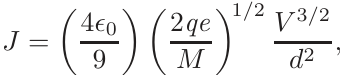
where $J$ is current density, $\epsilon_0$ the permittivity of free space, $e$ ion charge, $M$ ion mass, and $V$ the voltage applied to the gap of width $d$. (All quantities are in SI units.) (The equation as given is for planar geometry.) Similar limits apply to other geometries.) Since we need several parameters in current, not only must the ion sources be space-charge-limited, but, the voltage must also be very stable. The quantity $J/q$ is the number of particles per unit area per unit time; in a three-dimensional space with two spatial dimensions and one time dimension, this is a volume in a three-dimensional space with two spatial dimensions and time. (We can rephrase the velocity, so we tend use three spatial dimensions instead.) In summary, space charge considerations give the maximum ion density emerging from the source. These items are also contained in some three-dimensional volume in momentum (or momentum-energy) space.

In practice several mechanisms determine the occupied volume of momentum space. One of them is the temperature of the ions. (We use the term "temperature" loosely, because the momentum distribution may not be a thermal distribution.) A second mechanism is imperfect extraction optics and a third is high frequency fluctuations in the gap voltage, or in any subsequent voltage. Assume, for example, that the ions are born with a temperature $\Theta$ expressed in energy units such as eV. Each degree of freedom has an rms velocity given by $v = (\Theta/M)^{1/2}$, where we have set the velocity of light equal to unity and expressed $M$ in the same energy units as $\Theta$. In calculating quantities such as emittance, we are frequently interested in "edge" quantities — dimensions that contain most of the particles. For simplicity, we assume that edge quantities are twice rms quantities so that $2v$ is the edge velocity (for the part of the transverse emittance arising from temperature). By definition the normalized transverse emittance is given by $\epsilon_n = a\delta\beta_r = 2a \times 2a(\Theta/M)^{1/2}$, where $a$ is the beam radius, $\theta$ is the angular spread in the beam (half width), and $\beta$ and $\gamma$ are the usual relativistic factors. (For heavy ions the particles are not relativistic at the source, so we have set $\gamma = 1$.)

As usual, the area in two-dimensional phase space is approximately $\pi$ times the normalized emittance,

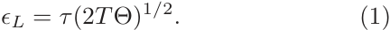
so we express the emittance in units of $\pi$ mm rad (or $\pi$ mm· mrad).

The situation for longitudinal emittance is slightly more complicated. We choose to work in the laboratory frame and express longitudinal emittance in terms of pulse duration $\tau$ in seconds and energy spread (half width) $\Delta$ in eV. A longitudinal rms velocity in the beam rest frame corresponds to a velocity $v_L = v$ in the laboratory frame, where $v_s$ is the beam velocity. Since the energy in the laboratory frame is $E_k = M v_s^2/2 + M v_s \Delta v/2$ , the energy spread in the laboratory frame is $\Delta = 2M v_s v_L$. (We multiplied by 2 to convert the rms value to the edge half width.) The longitudinal emittance $\epsilon_z$ is then given by $\epsilon_z = \tau \Delta/2$ , where we have multiplied the edge energy spread by $\tau/2$ rather than $\tau$ so that the longitudinal phase space volume (area) is approximately $\pi \epsilon_z$ , consistent with the transverse case. Since $v_L = (2T_s M)^{1/2}$, where $T$ [?] is the kinetic energy of the ions, we can also write

$$\epsilon_z = \tau (2T\Theta)^{1/2} \tag{11}$$

Designing real ion sources involves a number of tradeoffs. For good extraction optics, the extraction gap $d$ is usually comparable in size to the beam radius $a$ [53]. In our experience the voltage $V$ that one can reliably hold is approximately linear in $d$ for $d < 1$ cm and varies approximately as the square root of $d$ for $d > 1$ cm. If we use this scaling and the relationship between $a$ and $d$, the Child–Langmuir formula shows that, for fixed beam temperature, the six-dimensional phase space density (beam brightness) increases with decreasing $a$ and $d$ — but so does the current. Since there will be a requirement on current, there is a limit on useful brightness. One possible way to circumvent this limit is to use multiple small aperture sources. Unfortunately, when the beamlets for the multiple sources are merged to form a beam of the desired current, the emittance increases because of space charge effects and because some unoccupied phase space is inevitably mixed with the occupied phase space. Table 2 gives the properties of some typical ion sources that might be used for HEDP or fusion [35, 36]. It is noteworthy that many elements are not suitable for good ion sources because of the difficulty of obtaining a single isotope on a single charge state.

All of the sources listed in the table are for charge state $q = 1$ . In Sec. 5 we will discuss the choice of

98 *R. O. Bangerter, A. Faltens & P. A. Seidl*

Table 2. Properties of ion sources are compared. This table illustrates some of the considerations in the text. The brightness increases with decreasing current, and merging small beamlets to obtain adequate current reduces brightness. The brightness values for the three sources giving the higher currents are equal within about a factor of 2. The CHORDIS source is appropriate for RF machines, and the others for induction linacs.

| Source | Ion | Current (A) | $\epsilon_N$ (π mm mrad) | Brightness $A/m^2$ |
|--------|-----|-------------|--------------------------|---------------------|
| LBNL alumino-silicate | K⁺ | 0.163 | 0.5 | 0.73 |
| ISR CHORDIS | Bi⁺ | 0.027 | 0.16 | 1.44 |
| LBNL mini-source | Ar⁺ | 0.0004 | 0.0198 | 12.7 |
| Small merged beamlet | K⁺ | 0.57 | 0.9 | 0.78 |

charge state. Since the inception of HIF there have been recurring efforts to design accelerators that use charge having $q > 1$. The rationale is that the acceleration voltage can be lower for a given kinetic energy — perhaps leading to lower cost. On the other hand, the beam power is the product of electrical current times acceleration voltage, so a higher charge state would lead to higher current for fixed beam power. A higher charge state also leads to lower brightness since, according to Child–Langmuir, the current density increases as the square root of the charge state, while the number of particles for a given current decreases inversely with the charge state. A common alternative method of postulating $q > 1$ is to start with singly charged ions at the source, accelerate to some modest energy, and then strip. Even if one ignores effects such as multiple scattering during stripping, this method still leads to reduced brightness since it is almost never possible to strip to a single charge state [27, 38]. Based on inspection of various measurements, an approximate characterization of various data is that electrical current is conserved during stripping. For example, stripping to, say, +12 would be expected to reduce the brightness by a factor of ~12.

After decades of development, it appears difficult to make sources that are significantly brighter than those given in the table.

## 4.2. Space charge in the main accelerator

Since the high beam currents needed for fusion are unprecedented, one of the first tasks of the HIF program in the mid-1970s was to look carefully at the fundamental limits on transportable current. This task was originally undertaken by A. W. Maschke, leading to a theoretical expression for the maximum current that can be transported in an alternating gradient lattice. The HIF community usually refers to this expression as the Maschke formula or Maschke Limit [39]. For illustration purposes, we will derive a very approximate version of this formula expressed in more modern form. Maschke's original idea was simple. He set the transportable current, based on some experience, so that the space charge forces were equal to one half of the average focusing forces.

We first estimate the focusing forces. Let the length of a half lattice period (the length between the centers of two quadrupoles) be $L$ and let the length of a single quadrupole be $\eta L$ ( $\eta$ is occupancy). The equation of motion for a paraxial ion is given by $M d^2x/ds^2 = \pm Bqx/v$ or $x'' = \pm 1/[B\rho] \cdot x$, where the primes differentiate with respect to axial distance, $x$ is the transverse displacement from the axis of the quadrupole, $B_s$ is the magnetic field at a distance $b$ from the axis, and $q$ is the charge of the ion. We have explicitly included the speed of light, $c$. Solving this equation gives the total transfer matrices for the quadrupole. If we make the assumption that $y$ is small compared to unity, it is easy to obtain $\mathcal{T}$, the transfer matrix for an entire period. Using the usual equation $\cos \sigma = \text{trace}(\mathcal{T})/2 = 1 - \sigma^2/2$, we obtain $\sigma_0 \approx B_s q \eta L^2 / [b p]$, the phase advance per period. The particle momentum $p = M\beta c$ is now expressed in eV and the other units are SI units. The approximation (good for small $\eta$) is adequate for our purposes. It is possible to derive more accurate analytical expressions [40], but numerical methods are used for accurate work. We will use a simple smooth approximation that averages over the alternating gradient flutter. In this approximation, the beam size is given by an envelope equation [41] describing a beam with cylindrical symmetry $a'' = -\sigma_0^2 a + \epsilon^2/a^3 + Q/a$.

In this equation $\sigma = \sigma_0/2L$, where $\sigma_0$ is the phase advance in a full lattice period of length $2L$, and $a$, $\epsilon$, and $Q$ are respectively the beam radius, the transverse unnormalized emittance $\epsilon = \epsilon_N/\beta\gamma$, and

perveance _Q_ = _Ieqe/_ (2 _πϵ_ 0 _Mc_ [3] _β_ [3] _γ_ [3] ). The quantity
_Ie_ is electrical current and the term _Q/a_ includes
both the self-electrostatic and magnetic forces acting on a particle a distance _a_ from the axis.
We refer to beams where the emittance term in
the envelope equation is larger than the perveance
term as emittance-dominated beams. In the opposite case we refer to space-charge-dominated beams.
Maschke originally guessed that for an equilibrium
beam ( _a_ _[′′]_ = 0), the perveance term in the envelope equation could not be larger than the emittance term. This condition sets an upper limit on the
transportable current. We now know that the early
guess was not entirely correct. Analytical studies first
raised concerns about possible instabilities. Subsequently both numerical studies and experiments [42]
showed that the perveance term could be arbitrarily
large compared to the emittance term as long as _σ_ 0
is less than about _π/_ 2. (This is in contrast to the
usual case for beams that are strongly emittancedominated, since these beams are stable for _σ_ 0 _< π_ .)
Armed with the numerical studies and experiments, we can use our simplified envelope equation to obtain an approximate limit on current. To
get an upper limit we assume that the emittance
term is small compared to the perveance term and
write _Ieqe/_ (2 _πϵ_ 0 _Mc_ [3] _β_ [3] _γ_ [3] _< σ_ 0 [2] _[a]_ [2] _[/]_ [4] _[L]_ [2][.] [If] [we] [use the]
expression for _σ_ 0 to eliminate _L_ [2], we obtain

_Ie_ _<_ _[πϵ]_ [0] _[c]_ [2] _[σ]_ [0] _[B][b][ηβ]_ [2] _[γ]_ [2] _[a]_ [2] _._

2 _b_

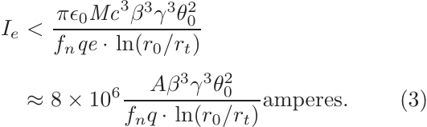
If we now set _σ_ 0 = _π/_ 2 and use typical values for
occupancy _η_ = 1 _/_ 2 and aperture fill factor _a/b_ =
1 _/_ 2, we obtain an approximate expression for the
current in amperes:

_Ie_ _<_ 5 _×_ 10 [5] _Bbβ_ [2] _γ_ [2] _a._ (2)

Subsequently we will refer to Eq. (2) as the Maschke
limit, although it is only approximate and it is not
in the form originally written by Maschke. One can
easily write similar expressions for solenoids or electrostatic quadrupoles. These focusing options may
be useful at the low energy end of the accelerator;
but, for simplicity, we give the expression only for
magnetic quadrupoles.

**4.3.** _**Space**_ _**charge**_ _**limits**_ _**in**_ _**final**_ _**focusing**_

Assume that a cylindrical beam emerging from the
final lens into the target chamber has a radius _r_ 0 and

an envelope convergence angle _θ_ 0. If we temporarily
ignore the emittance term in the envelope equation,
we can immediately integrate the equation to obtain
_θ_ 0 [2] [= 2] _[Q][ ·]_ [ ln(] _[r]_ [0] _[/r][t]_ [)] _[,]_ [where] _[r][t]_ [is] [the] [radius] [at] [the] [tar-]
get. We can crudely account for the possibility of
neutralizing the beam in the target chamber by multiplying _Q_ by some neutralization factor _fn_ . We can
also rewrite the result as a current limit:

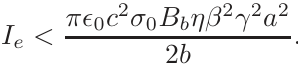
_Ie_ _<_ _[πϵ]_ [0] _[Mc]_ [3] _[β]_ [3] _[γ]_ [3] _[θ]_ 0 [2]
_fnqe ·_ ln( _r_ 0 _/rt_ )

_Aβ_ [3] _γ_ [3] _θ_ [2]
_≈_ 8 _×_ 10 [6] 0 (3)
_fnq ·_ ln( _r_ 0 _/rt_ ) [amperes] _[.]_

In the last expression we have expressed the ion mass
in terms of the atomic mass _A_ .

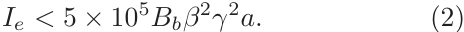

**4.4.** _**Phase**_ _**space**_ _**constraints**_

We have previously given examples of the phase
space density or brightness available from real ion
sources. We will denote the phase space density at
the ion source (or at the end of a quasielectrostatic preaccelerator or injector) as _B_ 6 _i_, where the
subscript 6 refers to six dimensions and _i_ means
“initial”. We will now explain how the properties
of targets, focusing systems, and chambers place a
lower limit on the phase space density required at
the end of the driver. Unless one is willing to develop
non-Liouvillian beam manipulation techniques, the
feasibility of any system demands that _B_ 6 _i_ _≥_ _B_ 6 _f_,
where _B_ 6 _f_ is the minimum allowed phase space density at the end of the accelerator. (We will discuss
non-Liouvillian techniques later.)
Consider the phase space volume available at the
end of the final focusing system. The spatial transverse phase space volume (area) is equal to Ω _f_ [2],
where Ωis the total solid angle occupied by all the
beams as they converge onto the target and _f_ is the
standoff between the end of the last lens and the target, roughly the focal length. The limit on transverse
momentum space is given by _rtp/f_, the angle subtended by the target times the beam momentum _p_ . If
we multiply the spatial area by the area in momentum space, we find that the four-dimensional transverse phase space volume is proportional to Ω _rt_ [2] _[p]_ [2][.]
Geometrically we know that Ω _≤_ 4 _π_ . In practice it must be much smaller. One limitation is the
tritium breeding ratio. For tritium self-sufficiency
almost the entire solid angle surrounding the target
must be occupied with the tritium breeding blanket.

98 *R. O. Bangerter, A. Faltens & P. A. Seidl*

This requirement usually means that $f$ must be less than or of the order of 1. Target geometry requirements are often even more stringent. Most indirect drive target designs require one- or two-sided illumination where the cone surrounding all beams from one side cannot have a solid angle exceeding approximately 0.5. Only a small fraction of this solid angle can be filled with beams. There must be some standoff between the beam and the aperture of the final focusing element. Significant space is often required between the aperture and the conductor for neutron and gamma shielding, cooling, and structure. The same is true outside the conductor. If the final focusing elements are packed as tightly as possible, one usually loses another order of magnitude, so that $f \sim 0.1$ is a practical upper limit.

The pulse duration required by the target sets the longitudinal time (or space) limit. Several factors limit the axial and final dimension, the longitudinal energy or momentum spread. One factor is the target itself. If the energy spread is too large, the variations in range among the various particles cause a spreading of the ion energy deposition profiles. The Bragg peak is washed out and a larger fraction of the energy is deposited near the surface of the target where it is not efficiently utilized by the target implosion or ignition. For targets where the Bragg peak plays a significant role in target performance, e.g. fast ignition targets, a 10–20% spread appears to be excessive. This limit is usually much less stringent than other limits. One of these other limits is related to longitudinal pulse compression. In all IFE and HIF schemes it is necessary to compress the beam longitudinally as it moves toward the target. The current available from ion sources is simply much smaller than the current required by targets. The longitudinal compression (or bunching) can be achieved by applying a velocity tilt between the head of the beam and the tail of the beam. The tail of the beam is given the higher velocity so that the beam compresses as it propagates toward the target. There is a limit to the rate at which the tilt can be applied. If one attempts to apply too large a tilt (energy spread), the beam may focus longitudinally before it arrives at the target. We mention this limit because it has not been included in some systems codes developed for HIF, e.g. IBEAM [43]. IBEAM was originally developed to explore a parameter range where the limit is unimportant. Recently there have been some attempts to use IBEAM outside its original range of validity, specifically in the range appropriate for fast ignition. We found one unpublished but widely discussed example accelerator that appears to violate this limit.

Finally, and usually, the most stringent limit on energy spread is set by chromatic aberrations in the final focusing system. We examine this mechanism in some detail.

As usual, we let $x'' = \delta^2 x/\delta s^2$ be the equation of motion in one transverse dimension for a particle with momentum $p$. In this equation $s$ is the longitudinal coordinate and $x''$ includes both applied focusing forces and the self-fields of the beam. For a solenoid focusing system, $x''$ is negative and varies as $p^{-2}$. In a magnetic alternating gradient system, it alternates in sign and varies as $p^{-1}$. The contribution from space charge forces is positive and varies as $|p|^{-1}$. In the general case one must consider all contributions to $x''$. For illustration purposes we consider only the magnetic alternating gradient case and assume that the fractional momentum spread $\delta$ is small. In this case we can write a perturbed equation for an off-momentum particle as $x'' = x_0'' -$  $\delta f(s) \cdot x/\xi^2$. Using $x' = \delta x/\delta s$ to simplify the perturbed equation and multiplying both sides by $x$, we obtain $xx'' - x'x_0'' = -\delta f(s) \cdot x^2/\xi^2$. We can integrate both sides of the equation, leading to $xx' - x'x_0 =$  $-\delta \int f(s) x^2 / \xi ds$. At the beginning of the focusing system, $\xi \leq 0$. At the beam $x$ must be very small and $x' < 0$, for an axial particle having $\xi > 0$ upstream of the focus. In the integral the average value of $\xi$ is much smaller than the average value of $x$, so we neglect it and write

$$xx' \cong -\frac{\delta}{\xi^2} \int f(s) x^2 \, ds.$$

For a point-to-point or parallel-to-point focus we can write this in a different form by using $x' = \delta x/\delta s$ and integrating by parts:

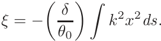
$$\frac{x^2}{2} \cong -\frac{\delta}{\xi^2} \int f(s) x^2 \, ds.$$
(4)

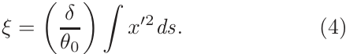
(For our purposes, we have ignored the difference between a small waist and a focus. Note also that for a parallel-to-point focus formed by a thin lens $\xi = \delta\theta f$, a relatively obvious result.)

In an approximation where the envelope is represented by a straight line between the last lens and

the focus, the integral in Eq. (4) must be at least as large as $\beta \mathcal{E}$, so we write

$$\epsilon = v\beta_0.$$
(5)

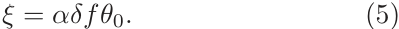
In this equation, we have introduced a parameter $v > 1$. For typical waist-to-waist systems using magnetic quadrupoles, $v$ usually lies in the range $2 < v < 8$. This parameter can be quite different for the two transverse directions, because the alternating gradient flutter can be quite different in the two directions. As a consequence of this and other effects, focal spots are, in general, astigmatic and the astigmatism is time-dependent. Time-dependent astigmatism may be an important issue for directly driven targets and perhaps fast ignition targets. This issue must be addressed.

As a typical example let $a = 1$ $f = 6$ m, and $\theta_0 = 10$ mr. Assume that a typical indirectly driven target can tolerate a chromatic aberration $\xi = 1$ mm and that a typical target for fast ignition can tolerate about 0.1 mm. In the former case, the final transverse spread must be limited to approximately 0.83%, in the latter case it must be limited to approximately 0.037%. These numbers are each more stringent than the other limits on momentum or energy spread but, in our example, we assumed that $\theta_0 = 10$ mr. Could one reduce the angle by some factor and make the limit on momentum spread less stringent? From a fundamental standpoint the answer appears to be yes — if we consider only the optics of the final focusing system. As noted before, the available transverse phase space volume is proportional to $D_a^2 \theta_s^2$. This expression depends on 05 but not explicitly on $\theta_0$. Since $\Omega = n\theta_s$, where $n$ is the number of beams, we can make $\theta_0$ small by going to an arbitrarily large number of beams. Applying similar arguments to Eq. (5) shows that the total current that can be focused also depends only on $\Omega$. It is also true that other effects that we have not discussed, such as third order geometric aberrations, are minimized by minimizing $\theta_0$. In summary, if one considers only the optics of final focusing, one would like to use a very large number of very small beams.

Are there considerations that limit the number and size of the beams? Some worry that the complexity and cost of dealing with a large number of beams are prohibitive. So far there has never been enough experimental information to quantify this concern. An analysis of the scaling properties of magnetic quadrupoles does, however, provide a more fundamental lower limit on beam size. Consider the integral form of Ampere's law $\oint \mathbf{B} \cdot d\mathbf{l} = \int \mu_0 J \cdot dA$. For a typical quadrupole, the integral on the left is linear in scale and for the integral on the right is quadrupole [?]. Thus, for a given magnetic field and current density in the conductor, a large quadrupole will devote a smaller fraction of the cross-sectional area to the conductor than a smaller quadrupole. In the limit of very small apertures, the cross-section of the quadrupole is mostly filled with conductor and there is little aperture to transport beam. At some point, decreasing the aperture and increasing the number of beams becomes economically infeasible.

In addition to the scaling argument, there are the usual constraints on aperture size imposed by beam halo and alignment considerations. Optimization studies usually show that the optimal beam aperture for fusion does not differ greatly from that of the proposed set of large accelerator facilities such as the LHC [44]. The associated number of beams usually lies in the range of 4–400. Nevertheless, a complete systems analysis taking into account target scaling, final optics, magnet design, and all other constraints is certainly beyond the state of the art. In any case, the optimal scale size depends on technology and economics. Improvements in superconductors, vacuum technology, alignment, and fabrication would be expected to reduce the optimal aperture.

In summary, chromatic aberrations impose the most stringent constraint on longitudinal phase space. For our purposes we will use Eq. (5) with $\xi_c = v_c$ to estimate the allowable momentum or energy spread. The allowable energy spread $\delta$ times $\tau_f /2$, where $\tau_f$ is the pulse duration allowed by the target, is then a longitudinal admittance that is consistent with our definition of longitudinal emittance given above. This admittance times the available transverse phase space volume $D_a^2 \theta_s^2$ gives a number that is proportional to the available six-dimensional phase space volume. The number of particles needed to drive the target is $E_b / T$, where $E_b$ is the total energy required by the target, so we can calculate the minimum brightness needed at the end of the machine. We noted above that feasibility requires $B_{in} \geq B_0$. This is a necessary but not sufficient condition on phase space density. Not only must the density be sufficient, but also the shape of the volume must be correct. Simply stated, the longitudinal

and transverse emittance must both have acceptable
values.
The needed brightness at the end of the machine
_B_ 6 _f_ _∝_ _ET /_ (Ω _rt_ [2] _[p]_ [2][∆] _[τ][f]_ _[T]_ [ )] [has] [an] [important] [scaling]
property. If we assume hydrodynamic target scaling,
_ET_ scales as _rt_ [2] _[τ][f]_ [.] [This means] [that] _[ B]_ [6] _[f]_ _[∝]_ [1] _[/]_ [(] _[p]_ [2][∆] _[T]_ [ )]
for fixed Ω. For chromatic aberrations, the important quantity is the fractional momentum or energy
spread, so the allowable value of ∆increases with
increasing _T_ . Also, the allowable range and therefore the momentum and kinetic energy increase with
increasing target energy. We conclude that larger targets, of a given type, have less stringent requirements
on beam brightness. This makes it difficult to scale
to small total beam energy, an unfortunate scaling
if one wishes to start at a small scale to minimize
buy-in costs.
Given a six-dimensional brightness from an ion
source, there is significant flexibility to trade off
transverse and longitudinal emittance. For example,
in systems with storage rings, one can stack in transverse phase space or longitudinal space. Nevertheless,
there is possibly an important constraint. Numerical
simulations show that the beam temperatures in the
transverse and longitudinal directions tend to equilibrate [45]. (Even if the temperatures are initially
equal at the source, they can rapidly diverge if the
beam is compressed differently in the different directions.) For beams that are much longer than they are
wide (the common case in induction linacs), a higher
temperature in the transverse direction will rapidly
heat the beam in the longitudinal direction until
the longitudinal temperature is some fraction of the
transverse temperature. Initially this effect was not
included in HIF systems codes but it can be important. Some fusion accelerator designs, which appear
attractive if this effect is ignored, fail when this effect
is taken into account. Quantitatively the issue is
the following: the current produced by a typical ion
source of a given radius is usually less than the current that can be transported in a quadrupole lattice
of the same radius. The beam must be compressed
transversely, and therefore heated, as it is matched
into the lattice. We previously showed [Eq. (1)] that
the longitudinal emittance can be expressed as _ϵL_ =
_τ_ (2 _T_ Θ) [1] _[/]_ [2] . We consider two examples to get a quantitative feel for the importance of this effect. From
Table 2, we see that a typical transverse brightness
is approximately 1 A/( _π_ mm _·_ mr) [2] .

A typical beam current at the beginning of a
machine - say, at the 2 MeV point for an induction
linac - is 1 A. This gives a normalized emittance
of 1 _π_ mm _·_ mr. According to the Maschke formula

[Eq. (2)], the radius of a Bi beam at this energy
would be about 2 cm for 5 T at the quadrupole
windings. This normalized emittance and radius correspond to an effective transverse beam temperature of approximately 120 eV. According to Ref. 45,
about 10% of this temperature will end up in the
longitudinal direction. Other simulations find more
complete equilibration, but we adopt 10%, giving a
longitudinal temperature of 12 eV. At the end of a
fusion accelerator, the pulse duration is of the order
of 100 ns. From Eq. (1) we obtain _ϵL_ _≈_ 0 _._ 03 eV _·_ s for
a 4.5 GeV beam and _ϵL_ _≈_ 0 _._ 15 eV _·_ s for a 100 GeV
beam. (We have assumed that the beam radius is
approximately the same size at the end of acceleration as it is at the beginning.) Other effects could
make the longitudinal emittance larger than these
values. There is little experimental evidence, particularly in induction accelerators, regarding transverse–
longitudinal equilibration; but, to the extent that the
simulations are correct, the longitudinal emittance
will not likely be smaller than these values. We will
subsequently discuss the consequences of these limits
on emittance.
We emphasize that in the discussion in this section we have isolated various effects to estimate their
importance. In any real system, these effects must
be considered together. For example, phase space
effects, space charge effects, and aberrations simultaneously contribute to the final focal spot size and
pulse length. Effects that we have not discussed
include:

(1) Fields produced by any residual gas or plasma in
the target chamber; fields that are nonlinear or
depend on time are particularly important, since
it is difficult to correct for these effects;
(2) Nonlinear fields produced by the beam itself;
(3) First order chromatic effects;
(4) Multiple scattering;
(5) Stripping in residual gas or plasma or stripping
by photons emanating from the target;
(6) Beam–plasma instabilities;
(7) Errors in the applied longitudinal bunching
fields;
(8) Misalignment and beam wobble.

These topics are beyond the scope of this article.
The proceedings of the heavy ion fusion workshops
and symposia from 1976 to 2012 are good references
on these topics [46]. Most remain topics of current
interest.

**4.5.** _**Techniques**_ _**to**_ _**relax**_ _**constraints**_

Since the space charge and phase space constraints
have been found to be stringent for the high intensity
beams needed for fusion, researchers have searched
for techniques to relax the constraints and perhaps
to lead to less expensive or more robust accelerator
designs. We will give a brief description of these techniques in the remainder of this section. They fall into
three main categories:

(1) Correction of aberrations;
(2) Transverse and longitudinal focusing methods
that rely on beam neutralization by electrons
and/or plasmas;
(3) Non-Liouvillian beam manipulations.

Two main methods of reducing chromatic aberrations have been suggested. The first - and possibly more promising — method involves pulsed focusing lenses. Since a velocity tilt must be applied to
the beam to achieve longitudinal focusing, there is
initially a correlation between the average momentum of the particles and their position in the bunch.
This correlation and some of the velocity spread are
removed as the beam compresses. The idea is to use
pulsed focusing elements where there is still a strong
correlation to “precorrect” for chromatic aberrations
in the final lenses. Estimates show that the power
requirements for the pulsed elements can, in some
cases, be acceptable. Encouraged by these estimates,
we performed some additional preliminary calculations to evaluate the promise of this method. Our
calculations show that perfect correction is difficult,
particularly for large tilts; but even imperfect correction could be important. More work is needed.
The second method is the more standard
method, using dipoles and sextupoles. So far, because
of the complication of high space charge, it has been
difficult to develop a design that appears to work for
fusion accelerators.
Historically there has been a lot of interest in
beam neutralization. One recent conceptual design
of a fusion power plant invoked beam neutralization

[15]. Many issues remain and the feasibility of neutralization is controversial. Reference 47 is a recent
review article.
Given the difficulty of meeting the phase space
requirements for fast ignition, there has recently
been some interest in placing small, neutralizing, selffocusing lenses very near the target [48, 49].
At least three types of non-Liouvillian techniques
have been proposed for HIF. The first type dates
back to about 1975 [50]. It involves stripping during injection into a storage ring. A second method
uses positive and negative ions of the same mass.
The two beams of opposite charge state are combined using a dipole magnet just upstream of the target [51]. A third method is telescoping. Ion bunches
having different masses but the same momentum are
transported to the target in the same channel. Since
they differ in mass they have different velocities. If
the slower bunches initially lead the faster bunches,
the bunches will merge longitudinally (telescope) as
they approach the target [52]. We are unaware of any
detailed simulations of these methods that include all
the space charge effects. A brief critique is given in
Ref. 22. These methods will be discussed in somewhat more detail in Sec. 6. In any case, additional
work on these methods is underway.

**5.** **Choice** **of** **Kinetic** **Energy,** **Ion** **Mass,**
**and** **Charge** **State**

In this section, we will use the information developed in the previous sections to explain the considerations involved in choosing the kinetic energy, ion
mass, and charge state of an accelerator for fusion
applications. These considerations explain why the
program is called heavy ion fusion.
First, consider the Maschke limit, _Ie_ _<_ 5 _×_
10 [5] _Bbβ_ [2] _γ_ [2] _a_ . This limit gives the largest current that
can be transported in a single beam in the accelerator. It was derived assuming a matched beam so that
the average beam envelope radius is constant. In a
focusing system, the fields must more than satisfy
the Maschke limit, since it is necessary to drive the
envelope radius to a smaller value. This means that
the limit is an important consideration not only in
the accelerator itself, but also in the focusing system.
Combining this limit with the target requirements
gives considerable insight into the choice of kinetic
energy, ion mass, and charge state.

First, consider only the requirements on beam
power and ion range given in Table 1. The beam
power is given by _P_ = _IpT_ = _IeV_, where _Ip_ is particle current and _V_ = _T/q_ is the total acceleration
voltage. For fixed magnetic field and beam size, the
power limit _P_ max _∝_ _β_ [2] _γ_ [2] _V_ = ( _T_ [2] + 2 _MT_ ) _T/qM_ [2] .
Figure 1 shows that _T_ is approximately proportional
to _M_ [4] _[/]_ [3] for a fixed range in the regime of interest. In
this regime, the ions are at most mildly relativistic,
so we first consider the nonrelativistic limit. With
a constant range we find that _P_ max _∝_ _M_ [5] _[/]_ [3] _/q_ . To
maximize the power, we maximize the mass and minimize the charge state. The price we pay is that we
also maximize the acceleration voltage. We will subsequently show that, for induction linacs, this strategy also minimizes the cost of the beam transport
system. The beam transport system is often a major
component of the cost of the accelerator. Unfortunately, so is the system that provides the acceleration voltage — and its cost increases with increasing
voltage. From these considerations alone, there is a
tradeoff that leads to a minimum cost at some voltage and charge state. This is an important point,
because, in our experience, newcomers to the field
often immediately begin to invent schemes to use
lower mass ions and/or higher charge states. They
assume that high charge state and low voltage “obviously” lead to lower cost if one can satisfy the other
constraints.
We emphasize again that this constraint on
transportable power is ultimately an economic constraint, at least in the accelerator itself. At some cost,
one can increase the aperture and/or the number of
beams to make a system that works.
Now consider the effects of space charge during
the propagation of the beam from the final lenses
to the target. The limiting electrical current is given
by the inequality (3). As a specific example, we
assume 60 beams each with a convergence angle of
10 mr. We further assume a distance of 6 m from
the exit of the lenses to the target. These assumptions are consistent with the considerations given
in previous sections, particularly the considerations
involving allowable solid angle, chamber size, and
beam size in the accelerator. Since we are considering the effects of space charge, we assume that the
beam is not neutralized so that _fn_ = 1. We also
assume that the beam is singly charged. With all
these assumptions, we can use the inequality (3) to

plot maximum power as a function of kinetic energy
and ion mass for any of the targets given in Table 1.
We first consider the hybrid target, since it allows
a large focal spot radius _rt_ . The results are shown
in Fig. 4(a). The curves shown are for rubidium,
cesium, and bismuth. Curves for lighter ions such
as sodium and potassium do not lie within the limits of the plot. In each case the curve is plotted only
for values of kinetic energy that give an ion range
that is less than or equal to the ion range required
by the target. In this particular case, it is the range
of 4.5 GeV bismuth. The horizontal line at 700 TW
is the required power. It is evident that the power
requirement exceeds the power than can be focused.
Indeed, the hybrid target was designed assuming
beam neutralization. One could increase the kinetic
energy with a modest increase in the total energy
requirement [28]. Increasing the kinetic energy and
adjusting some of the other requirements, such as
the number of beams and/or the convergence angle,
would allow one to meet the power requirement without neutralization. Note that the focusable power
decreases as the square of the charge state, so even at
10 GeV it would be extremely difficult to focus beams
having _q_ _>_ 1. HIBALL, one of the most detailed
power plant studies, originally assumed _q_ = 2 but
finally adopted _q_ = 1 because of the focusing limit

[13, 14].
We emphasize that this constraint goes away if
it is possible to neutralize the beams as they propagate across the chamber. Neutralization introduces
a number of physics and engineering complications.
The physics complications have been studied for
many years [46, 47, 53, 54]. The NDCX-I and
NDCX-II facilities at Berkeley Lab were specifically designed to address these issues experimentally.
Unfortunately, these machines produce beams that
are far from fusion requirements. Moreover, if there
is a neutralizing gas or plasma in the chamber, it
is difficult to prevent some of it from propagating
into the beam ports. If there is too much, the beams
can strip in the focusing magnets themselves, leading
to beam loss. Because of these complications and the
cost and difficulty of addressing neutralization at the
fusion scale, some HIF researchers are reluctant to
base accelerator designs on assumed neutralization.
In any case, if one does not adopt neutralization, we
conclude that indirectly driven targets with hot spot
ignition require very heavy, singly charged ions at

(a) (b)

Fig. 4. (a) Power that can be focused onto the Hybrid target as a function of kinetic energy for a variety of ions. These curves
assume that the beam is not neutralized as it propagates across the chamber to the target. They also assume 60 beams with an
initial convergence angle of 10 mr. The horizontal line is the target’s power requirement. The right end of each curve is located at
the kinetic energy at which the ion range equals the range specified by the target. In this case neutralization is needed. Figure 4(b)
is the same as Fig. 4(a), but it is for the X-Target.

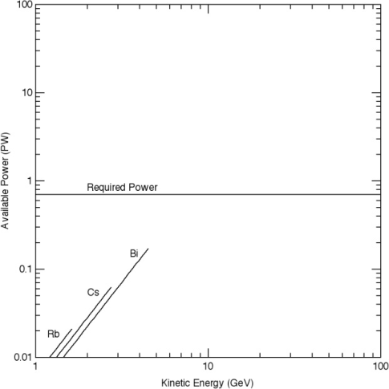

kinetic energies of the order of 10 GeV. Otherwise,
the beams cannot be focused.
The focal spot and power requirements are very
different for fast ignition. Figure 4(b) shows the
results for the X-Target from Table 1. In this case,
results from five ions (Na, K, Rb, Cs, and Bi, from
left to right) are shown. Because the range allowed by
the X-Target is much larger than the range allowed
by the indirectly driven targets, the upper limit on
kinetic energy now extends to nearly 100 GeV. The
power constraint of 30 PW can be satisfied at kinetic
energies greater than about 40 GeV, again using the
heaviest ions. An issue arises if one would like to
employ neutralized focusing to eliminate this constraint. At 30 PW, the ion density at the focal point
for a 40 GeV beam is of the order of 10 [17] cm _[−]_ [3] . The
stripping cross-sections [37, 55] are of the order of
10 _[−]_ [16] cm [2] . The plasma density must be at least as
high as the beam density to provide effective neutralization. These numbers imply a stripping length
of roughly 1 mm, a very small number compared to
the size of the chamber. Stripping would drive the
required chamber pressure to even higher densities.

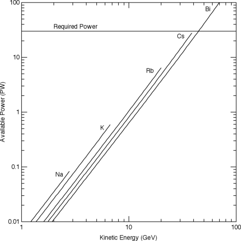

The mix of charge states arising from stripping makes
it difficult to focus the beam, because neutralization is not expected to be perfect. Of course, the
beam density is much lower some distance from the
target, so there might be some way to obtain some
neutralization without excessively high plasma densities. This issue requires more work. While one can
adopt different assumptions about things such as
beam number, we conclude that fast ignition will
require heavy, singly charged ions at kinetic energies of several times 10 GeV based on these focusing
considerations alone.
Now consider phase space constraints. In the
examples that we have considered above, the longitudinal phase space constraint appears to be the
most stringent. In principle, the fundamental constraint is on six-dimensional phase space density;
but, as previously explained, it may be difficult to
make the tradeoff among the transverse dimensions
and the longitudinal dimensions. For example, if
the difficulty is in the longitudinal direction, one
could, in principle, decrease the initial pulse duration, and therefore the longitudinal emittance by

using more current per beam. This would lead to
higher transverse emittance, but we are assuming
that the transverse emittance is less constraining.
Limitations on pulse duration, beam size, beam
number (economics), and the fact that brightness decreases with increasing current, limit these
options. To get a feel for the orders of magnitude involved, we will consider only the longitudinal
constraint.
Consider first the Hybrid target using the
assumptions we have previously made. These
assumptions are: a longitudinal beam temperature
of at least 12 eV, a pulse duration emerging from the
accelerator of 100 ns, a standoff of 6 m, and a convergence angle of 10 mr. Equation (1) gives a calculated minimum longitudinal beam emittance of
0.03 eV _·_ s at 4.5 GeV, as we have previously shown.
Because of the large focal spot (4.5 mm) allowed by
the Hybrid target, the allowable energy spread is
also large. Equation (5) gives an allowable fractional
momentum spread of 0.015. For nonrelativistic particles, the kinetic energy spread is given by ∆= 2 _T δ_ .
This leads to an allowable energy spread of approximately 1 _._ 4 _×_ 10 [8] eV. We estimate the final pulse
duration by dividing the required target energy by
the peak power (Table 1). This yields a pulse duration of approximately 10 ns. If we multiply one half
the pulse duration by the allowed energy spread, we
obtain 0.7 eV _·_ s, an estimate of the allowable longitudinal emittance (admittance). Since 0 _._ 7 eV _·_ s _≫_
0 _._ 03 eV _·_ s, it is evident that there is a safety factor.
The factor is smaller for the other indirectly driven
targets listed in Table 1. The reader can also easily show that the constraint becomes more stringent
with decreasing kinetic energy.
Now consider the X-Target. With 20 GeV rubidium, the estimated minimum longitudinal emittance
is approximately 0.07 eV _·_ s. Because of the small
focal spot radius (0.26 mm), the allowable fractional
momentum spread is also small, leading to an allowable kinetic energy spread of approximately 3 _._ 5 _×_
10 [7] eV. In this case, we estimate the pulse duration by dividing 3 MJ by the peak power, since
only 3 MJ rather than the full 5 MJ is needed for
ignition. We obtain 100 ps, leading to a longitudinal admittance of approximately 0.002 eV _·_ s. The
needed inequality now has the wrong sense and
the constraint is not satisfied. If one used bismuth
beams to drive the target, the allowable kinetic

energy would be 70–80GeV, since the range in hot
fuel is about the same as the range of 20 GeV
rubidium. The inequality would more nearly be
satisfied.
These emittance considerations, although very
approximate, reinforce our conclusions about kinetic
energy, ion mass, and charge state. If we temporarily
ignore the possibility of chromatic correction, nonLiouvillian techniques, and secondary focusing, most
of the indirectly driven targets require heavy, singly
charged ions in the GeV range. The fast ignition targets require heavy, singly charged ions at a kinetic
energy of the order of 100 GeV and still appear
to have trouble with the emittance constraint. The
known types of accelerators that might be applicable to fusion are sufficiently expensive at 100 GeV
that, barring an invention, fast ignition also appears
to have an issue with economics. The use of lighter
ions at lower kinetic energy for either type of target

[56] seems difficult.
Are there ways to circumvent these conclusions?
We have already discussed some possibilities. Chromatic correction, small secondary lenses near the
target, and the use of many smaller beams have
been suggested. In our opinion, more work is needed
on chromatic correction. Chromatic correction has
the potential to help for all classes of targets. Perhaps more importantly, our estimates on longitudinal emittance may be optimistic. But it also seems
likely that continuing progress in superconductors
and manufacturing techniques will gradually enable
the use of more beams.
There are important issues with secondary
lenses. If one tries to use these to decrease the
focal spot by a large factor, one rapidly runs into
constraints on transverse emittance [22]. Moreover,
according to our calculations, secondary self-focusing
lenses are unlikely to have the linearity needed for a
good focus.
In summary, the constraints imposed by space
charge and emittance are stringent. Both considerations push toward high ion mass, low charge
state, and kinetic energies in the several-GeV
range. Finally, we note that we have not explicitly
accounted for emittance growth in the accelerator
from contributions such as transverse envelope mismatch or longitudinal space charge waves. Emittance
growth to some extent is inevitable, and leads to
tighter constraints.

## **6. RF and Induction Accelerators for** **HEDP and Fusion** **6.1. RF accelerators**

As mentioned previously, the energy crisis of the
1970s motivated a significant effort to use accelerators to drive IFE targets. RF accelerators were a
relatively mature technology. The attitude was: We
know how to build them. We know how much they
cost. We know that they can produce megajoules of
energy; and we know that they can do it reliably for
decades. Let us solve the energy problem and save
the world.
Some of the constraints were also known. It
appeared that if one used heavy ions, the available
brightness was orders of magnitude larger than that
needed by the targets. Al Maschke himself stated
that he would not be willing to work on the problem
if there were not initially a safety factor of a thousand or more, because that factor would inevitably
decrease as we learned more. He was prescient - as
we showed in the previous section. A better understanding of target physics and of issues associated
with beam physics and accelerator engineering has
led to a situation where the constraints are now
known to be stringent. Nevertheless, the original
arguments based on the success and maturity of RF
technology remain strong arguments for continuing
to study the RF approach. In fact, RF facilities (primarily for other applications) are currently being
used to study WDMP [57]. Planned facilities will
have even greater capability [58].
In the first years of the HIF program there were
a number of studies of RF systems for power production. It initially appeared that one might build
a suitable synchrotron for less that US$10 [8] . Interest in synchrotrons eventually waned, because it
appeared difficult to meet the requirements on efficiency and pulse repetition rates. Moreover, issues
such as ionization and charge exchange among the
beam ions themselves led to significant particle
loss for heavy ions. Perhaps more importantly, the
target physicists wanted a smaller ion range (or
kinetic energy) than Maschke originally assumed.
Consequently, inexpensive volts, one of the chief
advantages of synchrotrons, became less important.
The synchrotron systems were superseded by RF
linacs and storage rings. The HIBALL studies are
excellent examples of early power plant studies

based on the RF linac and storage ring approach

[13, 14].
To minimize cost, one would like to minimize
linac beam power. This situation is particularly true
for an IFE target test facility or an HEDP facility,
because there are no requirements on pulse repetition rate or efficiency. For example, suppose that
one would be happy with a 10 GeV, 5 MJ pulse every
50 s. The linac would have to deliver 100 kW of beam
power at an average current of 10 _µ_ A. Unfortunately,
the inevitable beam loss from beam–beam ionization
and charge exchange requires much shorter storage
times and much higher current for a stored energy
of this magnitude. Moreover, multiturn injection in
the presence of large space charge forces can lead to
unacceptable emittance growth [59]. Efficiency, beam
loss, and emittance growth during injection remain
important constraints on the design of RF systems.
Most designs now assume a linac current of the order
of 1 A.
Although the earlier designs of RF systems were
excellent vehicles for elucidating the issues and providing cost estimates, they are now obsolete. Target
designs have evolved and we have a better understanding of issues such as focusing and phase space
requirements. There are at least three more recent
studies that illustrate the state of the art and explain
current thinking about RF systems. They are:

(1) The European study on Heavy Ion Driven Inertial Fusion (HIDIF) [36];
(2) Koshkarev’s Charge-Symmetric Proposal [60];
(3) The Fusion Power Corporation’s Single Pass RF
Driver (SPRFD) [52].

The European Study Group on Heavy Ion Driven
Inertial Fusion performed the HIDIF study during
1996–1998. It is the most detailed study now available. Koshkarev’s charge-symmetric design uses positive and negative ions of the same mass. A magnetic
dipole is used to merge the two charge states into a
single channel just upstream of the target. According to recent oral presentations by the Russian HIF
team, this proposal and a fast ignition target design
by Basko _et al._ [61] constitute the conceptual basis of
the Russian HIF program. The Fusion Power Corporation is a relatively new private company founded
to develop the RF approach to IFE. The SPRFD is
described in Ref. 52.

It is beyond the scope of this review to describe
those three systems in detail. We will consider only
some general features of each approach and list the
issues that must, in our opinion, be resolved to determine the feasibility of these approaches.
In Sec. 5, we showed that the brightness requirements are stringent. RF systems typically exacerbate this problem because they depend on a number
of beam manipulations, such as funnelling in linacs,
multiturn injection into multiple storage rings, delays
to synchronize multiple bunches, beam extraction
from the rings, and longitudinal pulse compression.
These manipulations usually lead to a significant
loss of brightness [36, 62]. For this reason, all three
studies rely on non-Liouvillian schemes to meet the
brightness constraints.
There are two HIDIF designs. One is designed to
deliver 3 MJ of energy; the other, 4.5 MJ. The main
difference between the two designs is the number of
storage rings and the number of beams. The first
design, shown in Fig. 5, has 12 storage rings and
48 final beam lines. The second has 18 rings and 72

final beam lines. Both systems are based on a 10 GeV
linac having a peak current of 400 mA. For the larger
system, the peak power is 1100 TW and the focal
spot radius is 1.7 mm. These numbers are similar to
those for indirect drive given in Table 1, but they
are for a specific target design given in Ref. 36. Telescoping is the non-Liouvillian technique chosen for
this system. It employs three ions ( [187] Re, [209] Bi, and
232Th) that differ by about 10% in mass. There are
48 ion sources, 16 for each isotope. Each set of 16 is
merged (2-to-1) four times to provide the input to
the main linac. The initial frequency at low energy is
12.5 MHz. After four mergings, the frequency of the
main linac is 200 MHz. The driver is designed to have
a pulse repetition rate of up to 50 Hz. At this repetition rate, the calculated efficiency of the system
is 20%. The efficiency decreases with a decreasing
repetition rate, so this type of system is primarily
appropriate for large power plants (several GW).
At the end of the machine the three isotopes have
the same momentum (so the magnetic focusing forces
are equal) but different velocities. The lighter ions

![Fig. 5. The RF accelerator-based HIDIF driver design [36] begins with 48 ion sources and low frequency RF sections funnelling](images/Bangerter-et-al.---2013---Accelerators-for-Inertial-Fusion-Energy-Production.pdf-21-0.png)
into a main linac. At the end of the accelerator the beam is fed to multiple storage rings, followed by an induction linac buncher.

overtake the heavier ions (telescope), and thus they all arrive simultaneously at the target.

The charge-symmetric driver is designed to produce the ignition pulse to a fast ignition target. The required focal spot radius is 50 μm and the pulse duration is 200 ps. The energy in the ignition pulse is 400 kJ, leading to a peak power of 2000 TW. The design employs both the charge-symmetric scheme mentioned above and telescoping with four different isotopes or eight types of ions (platinum 192, 194, 196, and 198, each in charge state 4 and 5 −). Each ion is produced by four ion sources that are merged to produce one beam. The final kinetic energy is 100 GeV. The first 25 GeV is produced with conventional HI linacs. The final 75 GeV is produced with a superconducting HF linac having a frequency of 6.1 GHz and an assumed gradient of up to 925 MV/m. As is the case for HIDF, this design uses storage ring compression to achieve the required temporal amplification. The target assumes a single ignition beam, so the eight ion species are merged into a single (telescoping) beam at the end.

The fractional momentum spread at the target table is given as 3 × 10⁻³ and the transverse emittance after merging the four beams from the ion sources is given as $\epsilon_x$ = 0.8 mm-mr. This corresponds to $\epsilon$ = 0.76 mm for 100 GeV platinum. Thus, the convergence angle to focus the beam to the required 0.05 mm must be greater than 15 mr.

If we assume our typical 6m standoff from the target, the chromatic aberrations already exceed the required focal spot size. We conclude that there must be an implicit assumption of chromatic correction. There must also be an implicit assumption that the third order aberrations have been corrected [6].

This entire charge-symmetric ignition system is large. It also requires a compression system to provide several megajoules of energy for target compression. For these reasons this system also seems to be appropriate only for large power plants.

The SPRFD is, in many ways similar to the systems described above. The chief difference is that it eschews the use of storage rings in order to eliminate the brightness reduction associated with injection and extraction. This is the origin of the term "single pass." The current SPRFD design uses 16 telescoping isotopes at energies as high as 20 GeV to try to meet the brightness requirements. The proposed target uses fast ignition and has a focal spot requirement approximately the same as that of the target for the charge-symmetric driver. The proposed target has not been numerically simulated, so the uncertainties are large. While it is true that the elimination of storage rings leads to higher brightness, 20 GeV leads to higher brightness requirements than the 100 GeV used for the charge-symmetric driver. In this SPRFD case, we are unable to make the numbers consistent with the target focusing requirements without making aggressive assumptions about beam neutralization and correction of aberrations.

There are some generic issues for the HI systems described above. Unless the beams are neutralized, the beams will develop bulges owing to space charge as they begin to converge. This means that not all parts of the beam can be matched to their proper radius as they propagate toward the target. Mismatches will undoubtedly lead to larger focal spots. We have not seen proper calculations of this effect, although simulations to address the issue are underway. This issue is one that leads to our cautions about telescoping (mentioned earlier in the article). Finally, there is the issue of cost. Drift tubes and linacs are well matched to HI application, which are low-to-moderate RF acceleration. The particle transit time across the RF gap is significant at these energies, and especially at injection into the linac. Furthermore, the FODO period is short at low β, and thus space will be required for focusing elements. These considerations, which set the scale of the cavity geometry along with the cost and availability of RF power sources, strongly influence the frequency choice of ~0.2 GHz. The main options for supplying the RF power are gridded-tube-based amplifiers and klystrons.

For an HI-based HIF driver, the required peak power, average power, RF pulse length, and repetition rate are important features of the overall HI requirements. Table 3 illustrates the requirements for the RF approach via the HIDF and SPRFD beam power.

**Table 3.** HIDF and SPRFD main linac parameters are computed for two cases: $P_{max}$ is the peak power, and $P_{mean}$ is the average beam power.

| | $P_{max}$ (GW) | $P_{mean}$ (MW) | $\tau_{RF}$ (μs) | Rate (Hz) | $E_{b}$ (MJ) |
|---|---|---|---|---|---|
| HIDF | 2 | 100 | 1.6 | 50 | 200 |
| SPRFD | 100 | 200 | 0.2 | 10 | 200 |

examples. The HIDIF design of the injector and the
main linac are the basis for the SPRFD design. For
the RF power requirements, the two approaches differ, mainly due to the use of storage rings to accumulate charge after acceleration in the HIDIF. Thus, the
RF pulse length is 1.6 ms in HIDIF and only 0.2 ms
in the “single-pass” SPRFD.
The RF circuit is heavily beam-loaded, so the
beam power is indicative of the supplied RF power.
The tabulated values make clear that RF amplifiers
in the MW (peak) output range are of interest.
For a driver with a main drift tube linac responsible for most of the acceleration, and operating
around 200 MHz, the Muon Ionized Cooling Experiment (MICE) is an illustrative and relevant RF
amplifier system [64]. Operating at 201 MHz, it is
based on the high power Thales TH116 triode [65].
The MICE RF system will deliver 2 MW peak power
with a pulse width of 1 ms. Based on Ref. 64, we
extrapolate that the approximate RF amplifier costs
for a similar system applied to an HIF driver is
approximately US$0 _._ 1 _/_ watt (peak).
A relevant example of a klystron-powered accelerator is the Spallation Neutron Source (SNS), which
utilizes 2.5 MW klystrons at 402.5 MHz to accelerate
the protons up to 86.8 MeV [66, 67]. For acceleration
up to the top energy of 1 GeV in the coupled cavity linac and then the superconducting RF part of
the accelerator, the klystron frequency is 805 MHz.
The 805 MHz klystrons are 5 MW and 0.55 MW
units. High peak power klystrons at a frequency of
200 MHz are less common, but feasible in principle,
and would necessarily be larger than their higher frequency counterparts.The total installed peak power
at the SNS is 0.12 GW, with an average cost of about
US$0 _._ 14 _/_ W.
To appreciate the importance of the cost of RF
power, consider the two values of peak power listed
in Table 3. Assume 25% efficiency in converting RF
power to beam power. The HIDIF peak beam power
of 2 GW corresponds to a peak RF power of 8 GW or
US$8 _×_ 10 [8] at US$0 _._ 1 _/_ W. The SPRFD peak power
of 100 GW corresponds to US$4 _×_ 10 [10] . The SPRFD
group uses lower cost numbers [52, 68] than we find
for amplifier systems capable of providing _≥_ 0.2 ms
RF pulses near 200 MHz. Presumably, in a fusion
economy, there would be significant cost reductions
because of economy of scale. The difficulty seems to
be the cost of a test machine.

**6.2.** _**Induction**_ _**linacs**_

Nicholas Christofilos, the inventor of strong focusing for accelerators, invented the first US induction
linac. It accelerated 300 ns, 400 A constant current
electron pulses to 4 MeV at up to 60 times per second

[69]. It is historically interesting that this early induction linac was built specifically for fusion. Its purpose
was to inject electrons into the Astron fusion device,
another Christofilos invention. Astron was intended
to confine a fusion plasma with a rotating cylindrical sheet of electrons inside a long solenoid. But the
fact that beam current was far above what an RF
linac could provide was the feature that caught the
attention of Denis Keefe and others regarding inertial fusion. Since the Astron days, many induction
linacs have been built worldwide. The book _Induc-_
_tion_ _Accelerators_ [70] is a recent general reference.
Induction linacs for fusion usually differ from
induction linacs for other applications in at least one
major way, namely the use of multiple beams. Nevertheless, induction linacs are still conceptually simpler than the RF systems. In many designs, there is
a single ion source per beam at the beginning of the
accelerator (counting multiaperture sources as single sources). Each individual beam usually retains
its identity all the way to the target. This simplicity means that induction machines usually have significantly fewer beam manipulations than the RF
systems - leading to less brightness degradation.
One could choose to merge beams or split beams at
some point in the machine, but these manipulations
do not appear to be necessary. In summary, induction linacs, in principle, appear to have a significant
advantage over the RF systems in terms of preserving beam brightness. One principal disadvantage is
that induction technology is still less developed than
RF technology.
A driver layout is shown in Fig. 6. Operating at
5–15 Hz, _∼_ 100 parallel ion beams are injected into
an induction accelerator. The accelerator may use
electrostatic focusing quadrupoles at the front end,
followed by a transition to superconducting magnetic
quadrupoles for most ( _>_ 90%) of the accelerator.
After acceleration, the bunch length is compressed by an order of magnitude or more and shaped
as needed to meet the bunch duration required by
the target design. A part of this compression section
includes dipoles for each beamline to aim each beam

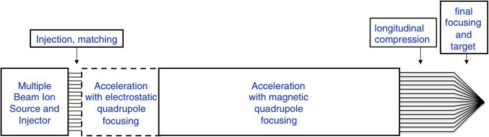

~ 3-10 GeV
at target:
~ 4000 A/beam
~ 10 ns

~ 3-10 GeV
I ~ 200 A/beam
~ 200 ns

~ 2-3 MeV
~1 A/beam
~ 20 µs, A ≥ 133, q = 1

Fig. 6. Schematic of an induction accelerator driver for heavy ion fusion.

at the target according to the required illumination
geometry.
Some RF linacs accelerate a short pulse, such as
the original SLAC accelerator with a 1.6 _µ_ s pulse. In
such linacs it is customary to use a pulsed modulator to provide the power to a klystron, where it is
converted to high frequency RF.
An induction linac uses the modulator pulse to
drive the beam directly, bypassing the RF stage.
With present technology, an induction cell is quite
lossy, requiring hundreds to thousands of amperes to
generate the acceleration fields, so it is efficient only
for high current beams.
A feature of an induction linac for nonrelativistic beams is the ability to adjust the beam current during acceleration by controlling the bunch
length with velocity ramps to match the beam current to the transportable current (an increasing function of energy) and by adjusting the quadrupole
occupancy fraction. The typical design starts with
_∼_ 90% quadrupole occupancy at the low energy and
is only 5–10% at the end. These quadrupole lenses
are typically less than 1 m in length and the lattice
half-period increases from less than 1 m to _∼_ 10 m at
the exit. Many transverse focusing options exist for
the region right after injection, and a few are possible for all parts of the machine, but the magnetic
quadrupole system is quite attractive.
While the ability to accelerate many kiloampere
beams at durations _∼_ 20 ns, as required by the targets, was the initial motivation for considering induction linacs, the accelerator designs evolved toward

designs where the bunch duration is in the 100–200ns
range within the accelerator. The final factor of _∼_ 10
( _∼_ 1000 for fast ignition) shortening of the bunch and
increase of the peak power comes from a ballistic
compression of the bunch in the drift lines going
to the target chamber. This last operation has the
important property of the space charge removing the
bunch tilt that causes the compression, and allowing
the highest power portion of the bunch to be nearly
constant energy and current.
Consider the question of multiple beams.
Figure 7 shows a 60-beam array. Based on experience with common accelerators with one or two apertures, this system appears complex. Let us consider
the situation quantitatively. We previously showed
that quadrupole magnets do not scale well to very
small apertures. If we avoid apertures that are not
too small, we can derive three important results.
The first follows from Eq. (2), the Maschke limit.
The transportable beam current is linear in beam
size (assumed proportional to magnet size in our
derivation of the Maschke limit). On the other hand,
the number of beams that fit into a core of a given
size goes inversely as the square of the magnet size.
These scaling relationships lead to the remarkable,
and perhaps unexpected, result that induction core
size decreases (for fixed beam current and magnetic
field) with increasing beam number — as long as the
magnets are not too small.
The second result is also interesting. As previously explained, Ampere’s law means that, for a
fixed magnetic field, the current in the conductor is

(a) (b)

Fig. 7. (a) Schematic of one-half of a lattice period. (b) Schematic cross-section of a 60-beam quadrupole array for an induction
linac. The large outer circle represents the inside of a circular induction core. Each small square represents a cell containing a
quadrupole. The small filled ellipses represent the beams. Note the alternating polarity of the quadrupoles. This arrangement
maximizes magnetic flux sharing among the quadrupoles and minimizes the needed conductor. It is helpful to think of the entire
array as a single, multiaperture focusing element.

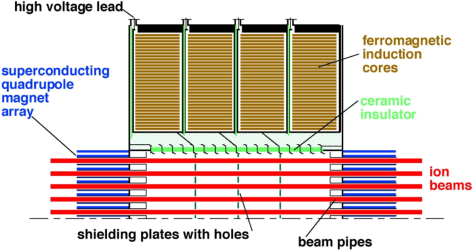

proportional to the magnet size - as is beam current. In this approximation, the amount of needed
conductor, for fixed beam current and beam velocity, is independent of the number of beams. For these
reasons, it is perhaps more reasonable to think of a
quadrupole array as a single, multiaperture focusing element rather than an array of independent
beams. Indeed, by placing the individual bores close
together, there is significant flux sharing among the
neighboring quadrupoles, leading to a reduction in
needed conductor (by a factor of 2 in the limit
of a large number of closely spaced beams). This
proportionality between beam current and conductor current means that the challenge for these multiaperture focusing limits is to develop automated
fabrication techniques so that the cost of fabrication
is not large compared to the cost of conductor. (For
a power plant, superconductor is necessary to get the
required efficiency.)
The third result is also an important scaling
law. For fixed beam power on target, the required
beam current is inversely proportional to the kinetic
energy. But because _β_ [2] _γ_ [2] in the Maschke limit is
larger at high kinetic energy, the amount of superconductor needed to deliver a given power decreases with
increasing kinetic energy. This means that decreasing
kinetic energy does not necessarily reduce cost.
The results that we have just discussed are
approximate. The overall problem of optimization

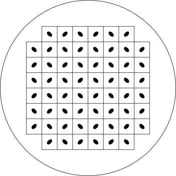

requires a systems code. LIACEP [71], the earliest
systems code for HIF induction linacs, was used to
address the multitude of design choices to find minimum cost solutions for HIF accelerators. Because
there are numerous possible solutions for injectors
and transport at the very lowest energies, the program started after the low energy region of 50 MeV
or so. Similarly, there are a multitude of special solutions for delivering the beams around the chamber,
and they were also omitted. LIACEP varied beam
current, numbers of beams, acceleration rates, aperture sizes, clearances, focusing half period lengths,
field strengths, and other similar variables. Concentrating only on the main body of the accelerator, it was found that changing the charge state
or the ion mass made little difference. The cost
was most closely related to the total beam energy.
There was a decrease in the optimum number of
beams as energy increased, but this did not include
the need for a large number of beams to facilitate focusing at the end, so a choice of a number
of beams of the order of 100 may be the ultimate
optimum.
Although beam resonances and instabilities have
been studied extensively for RF machines, there has
been less work and less experience with ion induction
linacs.
The beam breakup instability is a wellknown instability for electron induction linacs. This

instability is not a problem for HIF, because of strong
focusing and high rigidity beams [72].
The longitudinal dynamics are more interesting and potentially more dangerous. To illustrate
a mechanism that could increase the longitudinal
phase space occupied by the beam beyond the estimates in Sec. 4, we consider the growth and decay
of space charge wave perturbations. Throughout the
acceleration process relativistic effects are small.
High space charge intensity changes most of the
familiar single particle dynamics of other accelerators to motion of space charge waves. These waves,
i.e. the Hahn–Ramo space charge waves [73], have
been known since 1939 and are basic to operation of
microwave tubes such as the klystron. A perturbation on the beam caused by a voltage error initiates
waves traveling away from the perturbation in both
directions. By intentionally introducing a short voltage “error”, the two waves separate, and current perturbations became evident in some of our early heavy
ion beam experiments (Fig. 8). In a longer machine,
these bunches would hit the ends of the beams. In
an ion induction linac, the beam bunch is confined
longitudinally by applying focusing voltage “ears” at
the bunch ends. The perturbations reflect at the ends

with the current perturbations maintaining their sign
and the voltage perturbations reversing their sign.
The wave going toward the front of the bunch is
called a fast wave, and the wave going toward the
rear is a slow wave; upon reflection the fast wave
becomes a slow wave and the slow wave becomes a
fast wave. (In a klystron, with a sinusoidal voltage
perturbation, the current variations can drive a cavity to extract power.) In an ion accelerator, there
will be random errors from each pulser and accelerator gap, and a large number of such pulses reflecting
between the ends. In the early 1950s, Lan Jen Chu
of MIT added to the understanding of these waves
by theoretically finding that a resistive impedance
along the beam tube makes the slow wave grow and
the fast wave decay [74, 75]. These too reverse their
roles upon reflection, so any perturbation grows for
a while, reflects, attenuates for a while, and so on,
without continually growing. This growth of the perturbations is dependent on the impedance seen at
the accelerating gaps. Thus, is important to have low
effective gap impedance at the relevant frequencies.
While over the body of the bunch, which is
nominally constant amplitude current, the applied
voltages are approximately flat at each gap, this

![Fig. 8. Space charge waves observed in the Single Beam Transport Experiment [36] illustrate a feature of high current heavy](images/Bangerter-et-al.---2013---Accelerators-for-Inertial-Fusion-Energy-Production.pdf-26-1.png)
ion beams. A short, 2 kV perturbation pulse was applied to the beam, and the resulting slow and fast space charge waves were
observed 24 lattice periods downstream (7.3 m) in a Faraday cup measurement of the beam current. A Faraday cup wave form
(dashed red line) in the absence of the applied perturbation is superimposed. The few-microsecond rise time of the pulse is mostly
due to the longitudinal space charge of the beam, significant mostly at each end of the beam, in the absence of a confining voltage
pulse.

is not true at the two ends where the longitudinal
defocusing forces are located. Every few meters, ear
pulsers are provided which reverse the accumulated
space charge and emittance forces. This requires time
variation during the pulse on the two bunch ends.
This is a somewhat noisy process, which can be
affected by how closely one chooses to apply the corrections. The main acceleration modules are physically large and require tens of nanoseconds of fill
time, so the end correctors are smaller modules with
faster fill times. A 50 ns half sine is a reasonable
approximation to an acceptable wave form, to which
the many beams in the cluster would adjust their
longitudinal profiles to get _∼_ 25 ns bunch ends.
Similarly, eliminating or reducing the initiating
errors is important. For example, the limitations on
longitudinal compression due to induction module
wave form errors are studied in Ref. 76. The wave
form errors were the dominant contribution, while
the contribution from the injected beam was negligible. Several options to reduce effective impedance
exist. They include: nonlinear stabilizing resistors,
controlled switches able to use capacitive energy storage, and active amplifiers for voltage stabilization.
Since the beams are slow compared to the speed
of light, measured perturbations can be corrected
downstream. This option is referred to as “feedforward.”
For near-term progress and for the low currents
of heavy ions transportable at low energies, available
switches are probably adequate. In the longer term,
better switches are needed. The options include:
high power vacuum tubes, improved thyratrons, solid
state switches, and magnetic modulators. The pulsed
power and KrF laser programs have made significant
progress in developing solid state switches with magnetic pulse compression, so there is some synergism
with other fusion programs.
Several of the major questions for inductionaccelerator-driven HIF have been settled by a few
full scale and many small scale experiments. The first
major question about whether suitable sources could
be made was settled in the 1970s with two long-pulse
1-A Cs sources [77] and by one test on a Hibachi
source for Xe at full current suitable for an induction
linac and one small multiaperture Xe source suitable for an RF linac [78]. The next major experiment
was an 87-electrostatic-quadrupole transport experiment [79]. A third experiment was MBE-4, which

accelerated and transported four parallel beams [80],
and later was used for a four-beam merging experiment [81]. A fourth significant experiment was the
scaled final focusing experiment, which showed that
the equations used to focus a driver beam, when
scaled down correctly, led to the desired focal spot.
The newest induction linac built by the HIF
group is NDCX-II at Berkeley Lab. Since it was built
recently, its primary purpose is WDMP [7, 82]. Nevertheless, this machine will benefit fusion research. A
discussion on NDCX-II, NDCX-I, WDMP, HEDP,
and their relevance to fusion and to basic science
issues is beyond the scope of this article. See Ref. 23
and references therein for details. For other important research areas for HIF, see Refs. 8 and 83.
In summary, induction linacs are attractive
because they have few beam manipulations that
reduce beam brightness. On the other hand, control
of longitudinal dynamics and switch development are
important engineering challenges. If these challenges
can be met, it seems likely that induction machines
will be able to satisfy the beam brightness requirements - at least for targets that do not rely on fast
ignition.

## **6.3. Issues common to RF and**

_**induction**_ _**accelerators**_

There are some issues that are shared by the RF
and induction approaches. Cost reduction remains
important for both approaches, but accelerators are
not alone. Cost reduction is a major issue for all credible fusion options. In addition, the two approaches
share a number of issues with many high intensity
accelerators for other applications. These include the
effects of electrons and gas produced by a beam halo
striking the walls of the vacuum chamber.
The accelerator repetition rate is in the range of
10–50Hz. Increasing the repetition rate in the reactor is limited by gas condensation times and other
relaxation times in the chamber. An ongoing question for operation of the accelerator is whether the
pressure inside the beam lines, which is expected to
rise immediately after a beam pulse, can be lowered
fast enough for the next pulse or even be damaging
to the pulse itself. The low energy range ( _<_ 100 MeV)
is of particular interest for HIF because the crosssections for ionization of background gas, ion stripping by background gas, and production of secondary

electrons are all near their maxima or are relatively
large at an ion kinetic energy of a few MeV. A thorough overview of the cross-sections is in Ref. 55.
The accumulation of electrons (electron
clouds, or e-clouds) in and between the magnetic
quadrupoles of the accelerator may contribute to
undesirable beam parameters and emittance growth
due to distortions of the space charge distribution

[84]. In contrast to high energy rings, where e-clouds
are also a concern [85], HIF drivers have relatively
long beam bunches with a very low repetition rate.
The beam potential may be a few kilovolts. At low
energy, where the pulse is the longest ( _∼_ 10 _µ_ s in
induction linacs), electrostatic quads may be used
until the bunch length is only a few microseconds.
The quadrupole electric fields greatly reduce the
accumulation of electrons. However, for most of the
accelerator, the beam bunch duration is _∼_ 0.2 _µ_ s and
magnetic quadrupoles are the proper choice. Strategies to mitigate the electron cloud effects for the RF
linac approach may differ somewhat [86], since the
bunch train is longer - 0.2 ms or 1.6 ms (Table 3).
In any case, the wall-to-beam-edge clearance may be
increased so that the beam is less likely to intercept the inward-moving dense cloud of halo-induced
atoms, with some increase in the accelerator cost.

**7.** **Conclusions**

The NIF is expected to resolve important issues
about the feasibility of inertial fusion in the near
future. If these issues are resolved in the affirmative, the National Research Council recommends an
expanded program in inertial fusion power production, including heavy ion fusion. For this reason, this
review article is timely.
We have shown how considerations of commercial energy production, target physics, beam brightness, and space charge lead to important constraints
on accelerators. The most stringent constraints are
associated with focusing the beams to the small focal
spots required by the targets. Chromatic aberrations
and other aberrations in the final focusing system are
particular concerns.
Additional research is required to better understand the mechanisms leading to emittance growth
in accelerators, particularly longitudinal emittance.
Additional research is also required to better understand the aberrations and all other mechanisms that

determine the final focal spot size. Development of
methods to minimize emittance growth and development of improved focusing systems are high priority activities. Development of targets allowing larger
focal spots would also be beneficial. Finally, research
aimed at cost reduction is critically important.

**References**

[1] National Research Council, _Review_ _of_ _the_ _Depart-_
_ment_ _of_ _Energy’s_ _Inertial_ _Confinement_ _Fusion_ _Pro-_
_gram_ (National Academies Press, 1986).

[2] National Research Council, _Review_ _of_ _the_ _Depart-_
_ment_ _of_ _Energy’s_ _Inertial_ _Confinement_ _Fusion_ _Pro-_
_gram_ (National Academies Press, 1990).

[3] Fusion Policy Advisory Committee report,
G. Stever, Chair (1990); http://fire.pppl.gov/fpac
1990.pdf

[4] Fusion Energy Advisory Committee FEAC Panel 7
Report on Inertial Fusion Energy, R. Davidson,
Chair, _J._ _Fusion_ _Energ._ **13** (2/3) (1994); http://
www.osti.gov/energycitations/product.biblio.jsp?
osti id=79204

[5] J. Sheffield _et_ _al._, Report of the FESAC Inertial Fusion Energy Review Panel, _J._ _Fusion_
_Energ._ **15** (3/4) (1996); doi:10.1007/BF02266936;
http://link.springer.com/content/pdf/10.1007%2FB
F02266936.pdf

[6] See, for example, http://lasers.llnl.gov/

[7] _Frontiers_ _in_ _High_ _Energy_ _Density_ _Physics_ : _The_
_X-Games_ _of_ _Contemporary_ _Science_, Committee on
High Energy Density Plasma Physics, Plasma Science Committee, National Research Council. Available from the National Academies Press at http://
www.nap.edu/catalog/10544.html

[8] _An_ _Assessment_ _of_ _the_ _Prospects_ _for_ _Inertial_ _Fusion_
_Energy_, Committee on the Prospects for Inertial Confinement Fusion Energy Systems. Available from the National Academies Press at http://
www.nap.edu/catalog.php?record id=18289

[9] J. Nuckolls, L. Wood, A. Thiessen and G. Zimmerman, _Nature_ **239**, 139 (1972); doi:10.1038/
239139a0.

[10] G. Yonas, J. W. Poukey, K. R. Prestwich, J. R. Freeman, A. J. Toepfer and M. J. Clauser, _Nucl. Fus._ **14**,
731 (1974). The early programs were based on electron accelerators. They eventually switched to light
ions.

[11] R. L. Martin, in _Proc._ _1975_ _Particle_ _Accelerator_
_Conference_ (Washington DC, USA; IEEE), _Trans._
## Nucl. Sci. NS-22, 3, 1763 (1975); http://accelconf.

web.cern.ch/AccelConf/p75/PDF/PAC1975 1763.
PDF

[12] Private communication. J. Nuckolls, G. W. Kuswa,
and others were also considering the use of accelerators for fusion in 1975 or before.

[13] B. Badger _et_ _al._, University of Wisconsin Report
UWFDM-450 (1981); http://fti.neep.wisc.edu/pdf/
fdm450.pdf

[14] B. Badger _et_ _al._, University of Wisconsin Report
UWFDM-625 (1984); http://fti.neep.wisc.edu/pdf/
fdm625.pdf

[15] S. S. Yu, W. R. Meier, R. P. Abbott, J. J. Barnard,
T. Brown, D. A. Callahan, C. Debonnel, P. Heitzenroeder, J. F. Latkowski, B. G. Logan, S. J. Pemberton, P. F. Peterson, D. V. Rose, G.-L. Sabbi, W. M.
Sharp and D. R. Welch, _Fusion Sci. Technol._ **44**, 266
(2003); http://escholarship.org/uc/item/6vq5x9x8

[16] J. F. Latkowski and W. R. Meier, _Fusion_ _Sci._ _Tech-_
_nol._ **44**, 300 (2003).

[17] A. W. Maschke, in _Proc._ _1975_ _Particle_ _Acceler-_
_ator_ _Conference_ (Washington DC, USA; IEEE),
## Trans. Nucl. Sci. NS-22, 3, 1825 (1975); http://

accelconf.web.cern.ch/AccelConf/p75/PDF/PAC
1975 1825.PDF

[18] A. W. Maschke, in _Proc._ _Heavy_ _Ion_ _Fusion_
_Workshop_ (Brookhaven National Laboratory, 17–
21 October 1977), Brookhaven National Laboratory
Report BNL 50769.

[19] D. Keefe, Induction linac, in _ERDA_ _Summer_ _Study_
_of Heavy_ _Ions for Inertial Fusion, Final Report_ (eds.
R. O. Bangerter _et_ _al._ ) (1976), p. 21; http://www.
osti.gov/bridge/servlets/purl/7227551-rkrcqV/

[20] J. D. Lindl, _Inertial_ _Confinement_ _Fusion_ (SpringerVerlag, New York, 1998).

[21] S. Atzeni and J. Meyer-ter-Vehn, _The_ _Physics_ _of_
_Inertial_ _Fusion_ (Oxford, New York, 2004).

[22] R. O. Bangerter, _Proc._ _19th_ _Int._ _Symp._ _Heavy_ _Ion_
_Inertial_ _Fusion_ (Berkeley, CA, USA, 12–17 August
2012), _Nucl._ _Instrum._ _Methods_ _A_ **733**, 216 (2014);
http: _//_ dx.doi.org/10.1016/j.nima.2013.05.065.

[23] J. J. Barnard _et al._, _Proc. 19th Int. Symp. Heavy Ion_
_Inertial_ _Fusion_ (Berkeley, CA, USA, 12–17 August
2012), _Nucl._ _Instrum._ _Methods_ _A_ **733**, 45 (2014);
http: _//_ dx.doi.org/10.1016/j.nima.2013.05.096.

[24] J. J. Barnard _et_ _al._, in _Proc._ _2005_ _Particle_ _Acceler-_
_ator_ _Conference_ (Knoxville, TN); http://accelconf.
web.cern.ch/AccelConf/p05/PAPERS/RPAP039.
PDF

[25] Ya. B. Zel’dovich and Yu. P. Raizer, _Physics_ _of_
_Shock_ _Waves_ _and_ _High-Temperature_ _Hydrodynamic_
_Phenomena_ (Dover, New York, 2002).

[26] J. D. Lindl _et_ _al._, _Phys._ _Plasma_ **11** (2), 339
(2004).

[27] M. Tabak, D. Callahan-Miller, D. D.-M. Ho and
G. B. Zimmerman, _Nucl._ _Fusion_ **38**, 509 (1998).

[28] D. A. Callahan-Miller and M. Tabak, _Nucl._ _Fusion_
**39**, 833 (1999).

[29] D. Callahan-Miller and M. Tabak, _Phys._ _Plasma._
**7** (5), 2083 (2000); http://dx.doi.org/10.1063/
1.874031

[30] D. Callahan, M. Herrmann and M. Tabak,
_Laser_ _Part._ _Beams_ **20**, 405 (2002); http://dx.doi.
org/10.1017/S0263034602203079

[31] E. Henestroza and B. G. Logan, _Phys._ _Plasma._ **19**,
072706 (2012); http://dx.doi.org/10.1063/1.4737587

[32] OSIRIS and SOMBRERO Inertial Fusion Power
Plant Designs Final Report, DOE/ER-54100,
WJSA-92-01, March 1992; available at http://aries.
ucsd.edu/LIB/REPORT/OTHER/OSIRISSOMBRERO

[33] Prometheus-L and Prometheus-H, Inertial Fusion
Reactor Designs Studies, Final Report, DOE/ER54101, MDC 92E0008, March 1992.

[34] http://www.world-nuclear.org/info/EconomicAspects/Economics-of-Nuclear-Power/#.UdpDaDUURk. Downloaded July 2013.

[35] J. W. Kwan, _IEEE_ _Trans._ _Plasma_ _Sci._ **33**, 1901
(2005); http://ieeexplore.ieee.org/stamp/stamp.jsp?
arnumber=01556676

[36] _The_ _HIDIF_ _Study_ : _Report_ _of_ _the_ _European_ _Study_
_Group_ _on_ _Heavy_ _Ion_ _Driven_ _Inertial_ _Fusion_ _for_ _the_
_Period_ _1995–1998_, GSI report 98-06; http://wwwalt.gsi.de/documents/DOC-2009-Feb-44.html

[37] L. Wu and G. H. Miley, _J._ _Phys_ : _Conf._ **112**
(2008); http://dx.doi.org/10.1088/1742-6596/112/
3/032030

[38] P. A. Seidl and J.-L. Vay, in _Proc._ _2011_ _Particle_
_Accelerator_ _Conference_ (New York, USA); http://
accelconf.web.cern.ch/AccelConf/PAC2011/papers/
wep098.pdf

[39] A. W. Maschke, _Space_ _Charge_ _Limits_ _for_ _Lin-_
_ear_ _Accelerators_ (Brookhaven National Laboratory,
Upton, NY, USA), BNL-51022 (1979); doi:10.2172/
5914736; http://dx.doi.org/10.2172/5914736

[40] E. P. Lee _et_ _al._, _Phys._ _Plasma._ **9**, 4301 (2002);
http://link.aip.org/link/doi/10.1063/1.1502257

[41] J. D. Lawson, _The_ _Physics_ _of_ _Charged-Particle_
_Beams_ (Clarendon, Oxford, 1977).

[42] M. G. Tiefenback, _Space-Charge_ _Limits_ _on_ _the_
_Transport_ _of_ _Ion_ _Beams_, LBL-22465 (1986); http://
escholarship.org/uc/item/1v8770kj

[43] W. R. Meier, R. O. Bangerter and A. Faltens, _Nucl._
_Instrum._ _Methods_ _A_ **415**, 249 (1998).

[44] The LHC Design Report, Vol. 1: The LHC Main
Ring (CERN-2004-003, June 2004); http://dx.doi.
org/10.5170/CERN-2004-003-V-1

[45] E. A. Startsev, C. Davidson and H. Qin, _Phys._
_Rev._ _ST_ _Accel._ _Beams_ **8**, 124201 (2005) and
references therein; http://link.aps.org/doi/10.1103/
PhysRevSTAB.8.124201

[46] The collection of HIF Symposia can be found at
http://ahif.lbl.gov/relevant-papers

[47] C. Olson, _Proc._ _19th_ _Int._ _Symp._ _Heavy_ _Ion_
_Inertial_ _Fusion_ (Berkeley, CA; 12–17 August
2012), _Nucl._ _Instrum._ _Methods_ _A_ **733**, 86 (2014);
http: _//_ dx.doi.org/10.1016/j.nima.2013.05.089.

[48] P. A. Ni _et_ _al._, _Laser_ _Part._ _Beams_ **31**, 81 (2013);
doi:10.1017/S0263034612001000.

[49] S. M. Lund, R. H. Cohen and P. A. Ni, _Phys._ _Rev._
_ST_ _Accel._ _Beams_ **16**, 044202 (2013); http://link.
aps.org/doi/10.1103/PhysRevSTAB.16.044202

[50] R. L. Martin, private communication and _ERDA_
_Summer_ _Study_ _of_ _Heavy_ _Ions_ _for_ _Inertial_ _Fusion,_
_Final_ _Report_, eds. R. O. Bangerter _et_ _al._ (1976),
p. 13; http://www.osti.gov/bridge/servlets/purl/
7227551-rkrcqV
## [51] D. G. Koshkarev, Il Nuovo Cimento 106A, 1567

(1993).

[52] R. Burke, _Proc._ _19th_ _Int._ _Symp._ _Heavy_ _Ion_ _Iner-_
_tial_ _Fusion_ (Berkeley, CA, USA, 12–17 August
2012), _Nucl._ _Instrum._ _Methods_ _A_ **733**, 158 (2014);
http: _//_ dx.doi.org/10.1016/j.nima.2013.05.080.

[53] C. Olson, in _Proc._ _Heavy_ _Ion_ _Fusion_ _Workshop_
(Berkeley, CA, USA, 1979), ed. W. B. Herrmannsfeldt, Stanford Linear Accelerator Center report
SLAC-R-542; http://www-public.slac.stanford.edu/
SciDoc/docMeta.aspx?slacPubNumber=SLAC-R542

[54] I. D. Kaganovich, E. A. Startsev and R. C. Davidson, _Laser_ _Part._ _Beams_ **20**, 497 (2002); http://
dx.doi.org/10.1017/S0263034602203274

[55] I. D. Kaganovich, E. Startsev and R. C. Davidson, Scaling and formulary of cross-sections for ion–
atom impact ionization, _New J._ _Phys._ **8**, 278 (2006);
http://dx.doi.org/10.1088/1367-2630/8/11/278

[56] W. R. Meier and B. G. Logan, _Nucl._ _Instrum._
_Methods_ _A_ **544**, 310 (2005); http://dx.doi.org/
10.1016/j.nima.2005.01.225

[57] C. St¨ockl _et_ _al._, _Nucl._ _Instrum._ _Methods_ _A_
**415**, 558 (1998); http://dx.doi.org/10.1016/S01689002(98)00370-2

[58] B. Sharkov and D. Varentsov, _Proc._ _19th_ _Int._
_Symp._ _Heavy_ _Ion_ _Inertial_ _Fusion_ (Berkeley, CA,
12–17 August 2012), _Nucl._ _Instrum._ _Methods_ _A_
**733**, 238 (2014); http: _//_ dx.doi.org/10.1016/j.nima.
2013.05.061.

[59] C. R. Prior, in _Proc._ _5th_ _European_ _Particle_ _Accel-_
_erator_ _Conference_ ; http://accelconf.web.cern.ch/
accelconf/e96/PAPERS/MOPG/MOP026G.PDF

[60] D. G. Koshkarev, _Laser Part. Beams_ **20**, 595 (2002).

[61] M. Basko _et_ _al._, _Plasma_ _Phys._ _Control._ _Fusion_
**45**, 12.1 A125 (2003); http://dx.doi.org/10.1088/
0741-3335/45/12A/009

[62] S. M. Lund _et_ _al._, _Proc._ _1999_ _Part._ _Accel._
_Conf._ (New York); http://accelconf.web.cern.ch/
accelconf/p99/PAPERS/TUP127.PDF

[63] J. J. Barnard _et_ _al._, _Nucl._ _Instrum._ _Methods_
_A_ **544**, 243 (2005); http://dx.doi.org/10.1016/j.
nima.2005.01.212

[64] A. J. Moss _et_ _al._, _Proc._ _EPAC08_ (Genoa, Italy);
http://accelconf.web.cern.ch/AccelConf/e08/papers/
mopp099.pdf; R. A. Church, 9 April 2003, International Muon Ionization Cooling Experiment website, downloaded 28 July 2013; http://mice.iit.edu/
vc/vc31/vc31 church.ppt, and R. A. Church, Mice
Collaboration Meeting, 14 June 2003, _RF_ _Power_
_Source_ _Design and Status_, downloaded 28 July 2013,
http://www.mice.iit.edu/cm/cm6/agenda.html; D.
Li (LBNL), private communication.

[65] Thales, Inc., http://www.thalesgroup.com

[66] Y. Kang _et_ _al._, http://accelconf.web.cern.ch/
accelconf/a04/PAPERS/MOM403.PDF

[67] Rees _et_ _al._, 2006 CW RF Workshop (Argonne
National Laboratory, 1–4 May 2006). Downloaded
1 July 2013 from http://www.aps.anl.gov/News/
Conferences/2006/CWHAP06/presentations/Rees.
pdf

[68] C. E. Helsley and R. J. Burke, _Proc._ _19th_ _Int._
_Symp._ _Heavy_ _Ion_ _Inertial_ _Fusion_ (Berkeley, CA,
USA, 12–17 August 2012), _Nucl._ _Instrum._ _Meth-_
_ods_ _A_ **733**, 51 (2014); http: _//_ dx.doi.org/10.1016/
j.nima.2013.05.095.

[69] N. Christofilos, Astron thermonuclear reactor, in
2nd _UN_ _International_ _Conference_ _on_ _Peaceful_ _Uses_
_of_ _Atomic_ _Energy_, Vol. 32, p. 279 (Geneva, Switzerland, 1958); N. Christofilos, Energy balance in the
Astron device, _Nucl._ _Fusion_ _Suppl._ _I_ 159 (1962).

[70] _Induction_ _Accelerators_, eds. K. Takayama and
R. J. Briggs (Springer-Verlag, 2011); doi:10.1007/
978-3-642-13917-8.

[71] A. Faltens, E. Hoyer, D. Keefe and L. J.
Laslett, Design/cost study of an induction linac
for heavy ions for pellet fusion, in _Proc._ _1979_
## Part. Accel. Conf., IEEE Trans. Nucl. Sci. NS
**26**, 3, 3106 (1979); http://accelconf.web.cern.
ch/accelconf/p79/PDF/PAC1979 3106.PDF

[72] S. Chattopadhyay, A. Faltens and L. Smith,
Study of the beam breakup mode in linear
induction accelerators for heavy ions, in _Proc._
_1980_ _Part._ _Accel._ _Conf._ ; http://accelconf.web.cern.
ch/AccelConf/p81/PDF/PAC1981 2465.PDF

[73] W. C. Hahn, Small signal theory of velocitymodulated electron beams, _Gen._ _Elec._ _Rev._ **42**, 258
(1939); W. C. Hahn, Wave energy and transconductance of velocity-modulated electron beams, ibid,
pp. 497–502; S. Ramo, The electronic-wave theory
of velocity modulation tubes, in _Proc._ _IRE_ **27**, 757
(1939).

[74] L. J. Chu, 1951 IRE Conference on Electron Devices
(Durham, New Hampshire, USA, June 1951).

[75] C. K. Birdsall, G. R. Brewer and A. V. Haeff,
in _Proc._ _Inst._ _Radio_ _Engrs._ **41**, 865 (1953);
http://dx.doi.org/10.1109/JRPROC.1953.274425

[76] S. Massidda, _et_ _al._, _Nucl._ _Instrum._ _Methods_ _A_
**678** (2012); http://dx.doi.org/10.1016/j.nima.2012.
03.008; I. Kaganovich, _Nucl._ _Instrum._ _Meth-_
_ods_ _A_ **678** (2012); http://dx.doi.org/10.1016/j.
nima.2012.03.007

[77] A. Faltens and D. Keefe, in _Proc._ _Heavy_ _Ion_
_Fusion_ _Workshop_ (Berkeley, USA, 1979), pp. 157–
181 (Reports No. SLAC-R-542, No. LBL-10301
and No. CONF- 7910122); http://slac.stanford.edu/
pubs/slacreports/reports01/slac-r-542.pdf

[78] W. Chupp _et_ _al._, in _Proc._ _Particle_ _Accelera-_
_tor_ _Conference_ (IEEE, New York, USA, 1979);
http://accelconf.web.cern.ch/AccelConf/p79/PDF/
PAC1979 3036.PDF

[79] T. J. Fessenden, _Nucl. Instrum. Methods Phys. Res.,_
_Sect._ _A_ **278**, 13 (1989); http://www.sciencedirect.
com/science/article/pii/0168900289911212; M. G.
Tiefenback and D. Keefe, _IEEE_ _Trans._ _Nucl._ _Sci._
**32**, 2483 (1985), http://dx.doi.org/10.1109/TNS.
1985.4333954

[80] W. M. Fawley, T. Garvey, S. Eylon, E. Henestroza,
A. Faltens, T. J. Fessenden, K. Hahn, L. Smith and
D. P. Grote, _Phys._ _Plasmas_ **4**, 880 (1997); http://
pop.aip.org/resource/1/phpaen/v4/i3/p880 s1

[81] P. A. Seidl, C. Celata, A. Faltens, E. Henestroza
and S. MacLaren, _Phys._ _Rev._ _ST_ _Accel._ _Beams_
**6**, 090101 (2003); http://link.aps.org/doi/10.1103/
PhysRevSTAB.6.090101

[82] NDCX-II Advisory Committee, Lawrence Berkeley National Laboratory, 27 May 2009, Committee
Comments submitted to DOE, June 2009.

**Roger** **Bangerter** received a PhD in Elementary
Particle Physics from the University of California at
Berkeley in 1969. During the energy crisis in the 1970s
he became interested in energy issues, and joined the
Inertial Confinement Fusion Program at Livermore in
1974. He served as Head of Fusion Energy Research
at Lawrence Berkeley National Laboratory from 1990
to 2001. He also served as the Director of the Virtual National Laboratory for Heavy Ion Fusion, a
national collaboration among people from Berkeley,
Livermore, Princeton, and elsewhere. He retired in
2001 to devote more time to science. He remains
actively and enthusiastically involved in accelerator
and fusion research.

**Andris** **Faltens** received a BSEE in 1962 from
MIT and on MSEE from Berkeley in 1964. At
Raytheon (1960–63), he worked on the development
of microwave tubes, including the tube that sent
video from the _Apollo_ moon landing. At LBNL from
1964 to 1999 and part-time after, he worked on all
aspects of accelerators, including the Bevatron RF
and its linac, an 800 MHz linac and multiturn injection for the 200 BeV study, and a succession of induction linacs based on the Electron Ring Accelerator
injector, of which he was the primary innovator. He
was an EE and physicist on HIF from 1976, and was
a visiting scientist at CERN, Garching, and BNL.

[83] P. A. Seidl, J. J. Barnard, A. Faltens and A. Friedman, _Phys._ _Rev._ _ST_ _Accel._ _Beams_ **16**, 024701
(2013); http://prst-ab.aps.org/abstract/PRSTAB/
v16/i2/e024701

[84] M. Kireeff-Covo _et_ _al._, _Phys._ _Rev._ _Lett._ **97**,
054801 (2006); http://link.aps.org/doi/10.1103/
PhysRevLett.97.054801; R. Cohen _et_ _al._, _Phys._
_Plasmas_ **12**, 056708 (2005), http://dx.doi.org/
10.1063/1.1882292

[85] Proc. ECLOUD ’12 Workshop, special edition
of _Phys._ _Rev._ _ST_ _—_ _AB_ ; http://prst-ab.aps.
org/speced/ECLOUD12

[86] C. Omet, H. Kollmus, H. Reich-Sprenger and
P. J. Spiller, in _Proc._ _EPAC08_ (Genoa, Italy);
http://accelconf.web.cern.ch/accelconf/e08/papers/
mopc099.pdf

**Peter** **Seidl** received a BS in Physics from McGill
University in 1980 and a PhD in Nuclear Physics
in 1984 from The University of Texas at Austin.
He worked on numerous pion, electron, proton, and
heavy ion scattering experiments at LAMPF, ANL,
SLAC, and Berkeley Lab. After designing and using
detectors for heavy ion collisions at the Bevalac, he
joined the HIF group at Berkeley Lab in 1991. He
was the lead physicist of various experiments for
HIF drivers and for warm dense matter research,
and supervised several graduate students. He is currently Division Deputy of the Accelerator and Fusion
Research Division at Berkeley Lab.

