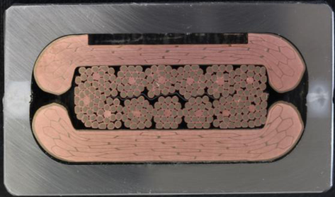
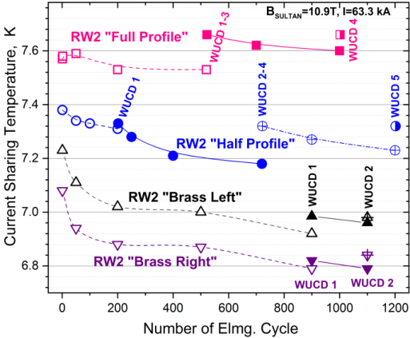
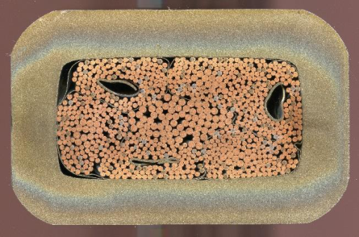
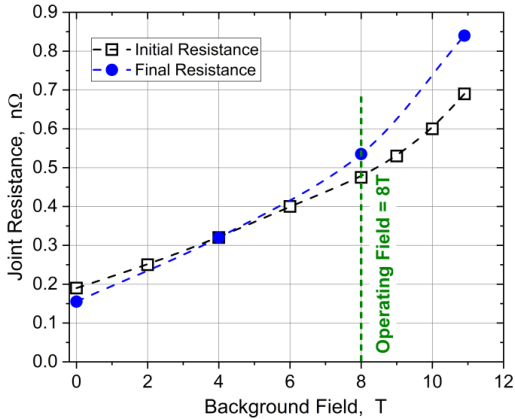
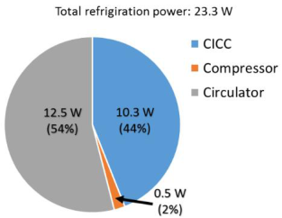
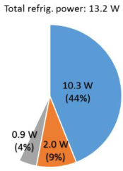
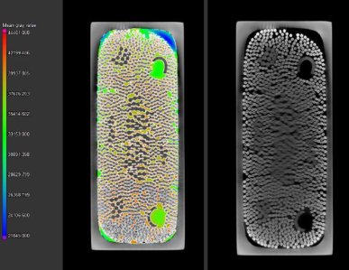
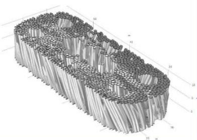
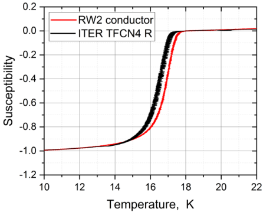
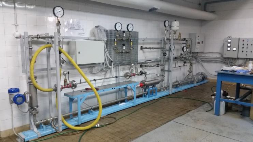

## **Advance in the conceptual design of the European DEMO magnet system** 

**K. Sedlak[1] , V. A. Anvar[2] , N. Bagrets[3] , M. E. Biancolini[4] , R. Bonifetto[5] , F. Bonne[6] ,** 

**D. Boso[7] , A. Brighenti[5] , P. Bruzzone[1] , G. Celentano[9] , A. Chiappa[4] , V. D’Auria[1] ,** 

**M. Dan[8] , P. Decool[10] , A. della Corte[9] , A. Dembkowska[11] , O. Dicuonzo[1] , I. Duran[12] ,** 

**M. Eisterer[13] , A. Ferro[8] , C. Fiamozzi Zignani[9] , W.H. Fietz[3] , C. Frittitta[1] , E. Gaio[8] ,** 

**L. Giannini[9] , F. Giorgetti[4] , F. Gömöry[14] , X. Granados[15] , R. Guarino[1] , R. Heller[3] ,** 

**C. Hoa[6] , I. Ivashov[16] , G. Jiolat[10] , M. Jirsa[17] , B. Jose[10] , R. Kembleton[18] , M. Kumar[1] ,** 

**B. Lacroix[10] , Q. Le Coz[19] , M. Lewandowska[11] , A. Maistrello[8] , N. Misiara[10] , L. Morici[9] ,** 

**L. Muzzi[9] , S. Nicollet[10] , A. Nijhuis[2] , F. Nunio[10] , C. Portafaix[10] , G. Romanelli[9] ,** 

**X. Sarasola[1] , L. Savoldi[5] , B. Stepanov[1] , I. Tiseanu[20] , G. Tomassetti[9] , A. Torre[10] ,** 

**S. Turtù[9] , D. Uglietti[1] , R. Vallcorba[10] , L. Viererbl[21] , M. Vojenciak[14] , C. Vorpahl[18] , K.-** 

**P. Weiss[3] , R. Wesche[1] , M.J. Wolf[3] , L. Zani[10] , R. Zanino[5] , A. Zappatore[5] and** 

**V. Corato[9 ]** 

1Ecole Polytechnique Fédérale de Lausanne (EPFL), Swiss Plasma Center (SPC), CH-5232 Villigen PSI, Switzerland 

2Univ. of Twente, 7522 Enschede, Netherlands 

3KIT, 76344, Eggenstein-Leopoldshafen, Germany 

4University of Rome Tor Vergata, 00133, Rome, Italy 

5NEMO group, Dipartimento Energia, Politecnico di Torino, 10129, Torino, Italy 

6Universite Grenoble Alpes, CEA INAC-SBT, Grenoble, 38000, France 

7Dipartimento di Ingegneria Civile, Edile e Ambientale, Università di Padova, 35131, Padova, Italy 

8Consorzio RFX, 35127, Padova, Italy 

9ENEA, 00044, Frascati, Italy 

10Commissariat à l’Energie Atomique et aux Energies Alternatives, France 

11West Pomeranian University of Technology, Szczecin, 70310, Szczecin, Poland 

12Institute of Plasma Physics, CAS, 18200, Prague, Czech Republic 

13Atominstitut, TU Wien, Vienna, Austria 

14Slovak Academy of Science, Inst. Elect. Engn., 84104, Bratislava, Slovakia 

15CSIC ICMAB, Mat Sci Inst Barcelona, 08193, Barcelona, Spain 

16IEK-4 - Plasma Physics, Forschungszentrum Juelich GmbH, D52425 Juelich, Germany 

17Institute of Physics CAS, 18200, Prague, Czech Republic 

18EUROfusion, 85748, Garching bei München, Germany 

19Assystem, 84120, Pertuis, France 

20NILPRP, EURATOM MEdC Assoc., 077125, Bucharest, Romania 

21Research Centre Řež, 25068, Husinec-Řež, Czech Republic 

E-mail: kamil.sedlak@psi.ch 

Received xxxxxx Accepted for publication xxxxxx Published xxxxxx 

## **Abstract** 

The European DEMO, i.e. the demonstration fusion power plant designed in the framework of the Roadmap to Fusion Electricity by the EUROfusion Consortium, is approaching the end 

of the pre-conceptual design phase, to be accomplished with a Gate Review in 2020, in which all DEMO subsystems will be reviewed by panels of independent experts. The latest 2018 DEMO baseline has major and minor radius of 9.1 m and 2.9 m, plasma current 17.9 MA, toroidal field on the plasma axis 5.2 T, and the peak field in the toroidal-field (TF) conductor 12.0 T. The 900-ton heavy TF coil is prepared in four low-temperature-superconductor (LTS) variants, some of them differing slightly, other significantly, from the ITER TF coil design. Two variants of the CS coils are investigated – a purely LTS one resembling the ITER CS, and a hybrid coil, in which the innermost layers made of HTS allow the designers either to increase the magnetic flux, and thus the duration of the fusion pulse, or to reduce the outer radius of the CS coil. An issue presently investigated by mechanical analyses is the fatigue load. Two variants of the poloidal field coils are being investigated. The magnet and conductor design studies are accompanied by the experimental tests on both LTS and HTS prototype samples, covering a broad range of DC and AC tests. Testing of quench behavior of the 15 kA HTS cables, with size and layout relevant for the fusion magnets and cooled by forced flow helium, is in preparation. 

Keywords: DEMO, nuclear fusion, superconducting magnets, CICC 

## **1. Introduction** 

The fusion tokamak DEMO, developed under the coordination of EUROfusion consortium [1], aims to become the first European fusion power plant delivering 500 MW of electric power to the grid [2]. The development of DEMO is scheduled into several phases. Present pre-conceptual phase will be accomplished by a gate review in May-July 2020. The design activities are organized in the so-called work packages, one of them being dedicated to the magnet system (WPMAG). The progress in the development of the DEMO magnets was reported in the past in [3] and [4]. This paper is dedicated to new achievements in both magnet design and R&D. 

The magnet system of the largest fusion tokamak ITER, presently under construction in Cadarache, France, serves us as a unique source of know-how, experience and inspiration. On the other hand, we must take advantage of the development in superconductor and structural materials and technology in general. Several innovative solutions are proposed in order to reduce the DEMO construction cost by economical use of superconducting material as well as simplifications of the coil manufacture, simultaneously addressing the reliability, availability, maintainability and inspectability (RAMI) of the whole system [5] already in the early, pre-conceptual design phase. 

The overall starting point for the DEMO design work is the “DEMO baseline”, issued every couple of years by EUROfusion. The baseline is defined by the PROCESS code [6]. The latest baseline, used as the main basis for the DEMO magnet development described in this article, was established in 2018 [7]. The corresponding major and minor radius are R0 = 9.1 m, a = 2.9 m, plasma current Ip = 17.9 MA, toroidal field on the plasma axis BT = 5.2 T, and the peak field 

in the toroidal-field (TF) conductor Bp = 12.0 T. For comparison, the corresponding ITER values are: R0 = 6.2 m, a = 2.0 m, Ip = 15 MA, BT = 5.3 T and Bp = 11.8 T. 

## **2. TF Coils** 

Five variants of the toroidal field (TF) coils are being investigated. One of them, based on high temperature superconductors (HTS), is presently considered as prohibitively expensive for the huge TF fusion coils. However, as the development of the HTS technology is rapid with respect to the DEMO schedule, it is worth to investigate the feasibility of the HTS TF coil [8], [9], as it would allow us to design the tokamak to higher magnetic fields compared to the traditional Nb3Sn coil or to larger temperature margins, thus providing more robust design solutions. An issue that would need to be addressed at high magnetic field is the coil mechanical design that has to deal with increased electromagnetic loads. 

The other four TF coil options, all based on Nb3Sn, are feasible with the presently available technology. They differ in three different aspects. The first one is the choice of windand-react or react-and-wind technique for the winding pack (WP) manufacture. The second design decision concerns layer-winding or pancake-winding, and the third presence or absence of the radial plates. The four TF WP options differ in these design choices. Three out of four design options have already been described in [4], we therefore only briefly mention their key characteristics and update on the latest development. The fourth design, WP#4, is a newly considered one, and it is the only option with radial plates. 

## _2.1 TF WP Designs_ 

The first TF coil design, WP#1 [10], [11], is based on the react-and-wind, layer-wound technique. Due to the grading of every layer in both superconductor and steel, this option needs the lowest amount of superconductor (27% with respect to WP#3 [12]), and also the smallest radial build. The conductor jacketing is done by longitudinal welding of two steel halfprofiles around the heat-treated cable, while all other WP options use the cable-in-conduit conductor (CICC) fabricated by the pull-through technique followed by the jacket compaction to a rectangular (WP#2 and WP#3) or round (WP#4) shape. As WP#1 option differs most from the ITER TF coils, a broad R&D program is required to ensure this solution is robust and reliable. 

The WP#2 is based on wind-and-react, layer-wound technique with conductor grading. The conductor is a rectangular CICC. The grading is done in the jacket wall thickness, as well as in the cross section of copper and superconductor. Constant in the whole winding pack remains the conductor width in the toroidal direction, which is necessary for the overall mechanical stiffness of the winding pack. Recently, a new homogenization technique for the evaluation of the equivalent mechanical properties of the superconducting winding pack, useful in order to speed up the computation time of mechanical analyses, has been proposed and illustrated on the WP#2 design [13]. Probably the most challenging issue to address is how to apply the electric insulation on the layer-wound turns compatible with the windand-react technique. 

The WP#3 [14] relies on wind-and-react, pancake-wound technique. Conductor grading is not possible, however coil manufacture might be easier compared to layer-wound coil, and the inter-pancake joints, located in a low-field region of the coil, are better accessible with less spatial restrictions compared to the inter-layer joints in WP#1 and WP#2. 

Finally the WP#4 option has been introduced after a design progress review meeting in November 2017, when panel of experts proposed to investigate pros and cons of an ITER-like design characterized by the presence of radial plates. The WP#4 design is therefore based on wind-and-react, pancake wound coil (like WP#3), and (unlike WP#3) on round CICC wound into the radial plates. The radial plates reduce stress in the turn insulation [15], on the other hand their manufacture with very tight manufacturing tolerances turned out to be (cost) demanding in ITER. 

## _2.2 Tests of the prototype conductor samples_ 

## _2.2.1 RW prototype samples._ 

Two full-size cable prototypes, called RW1 [16] and RW2 [17], [18], Fig. 1, were manufactured and tested in the past 5 years. Several conductor samples were produced out of each cable prototype and subsequently tested in the SULTAN 

test facility [19]. The performance of the SULTAN samples was steadily improving from the first samples to the last ones, as a consequence of increasing experience with the sample manufacture. An important improvement in both performance stability and direct current (DC) absolute performance was achieved after the cable was tightly fit between the conductor jackets and mixed-matrix stabilizer by transverse mechanical preload applied on the cable, as illustrated in Fig. 2. The transverse preload was comparable to the electromagnetic load experienced by the cable in the operating conditions (Iop = 63.3 kA, B = 12.23 T in DEMO baseline 2015). The current sharing temperature, Tcs, of the final RW2 sample in the nominal operating conditions was 7.16 K, significantly above the requested 6.7 K, which is based on 4.5 K inlet temperature, 0.7 K for nuclear heat load, and 1.5 K temperature margin. The DC performance was stable, within 0.1 K, with respect to the electromagnetic and thermal cycling [20]. The assessed effective strain in the conductor after electromagnetic and thermal cycling is -0.27%. 

Fig. 1   Illustrating photo of the latest RW2 conductor with the full mixed-matrix Cu/CuNi stabilizing profile. The upper rectangular cooling channel was absent in the sample tested in SULATN (the socalled “Full Profile” sample) – instead, two steel stripes of 0.25 mm thickness were inserted between the steel jacket and the mixed matrix in order to preload the cable in transverse direction (vertical direction in the photo). 

Also the AC loss of the RW2 cable was investigated in detail. While the AC loss in most fusion conductors drops significantly after electromagnetic cyclic loading, it is not the case for the RW2 conductor with the transverse preload [21]. The firm embracement of the cable in between the jacket prevents any strand movements, keeping the interstrand resistance unchanged during cycling. 

The overall AC loss turned out to be driven by the eddy current in the Cu/CuNi mixed-matrix stabilizer [21]. In the next conductor sample, the stabilizer will be replaced by a highly compacted Rutherford cable made of copper wires cladded with CuNi10. The AC loss of the cable alone, characterized by nτ = 56 ms, is very low even for the conductor of the central solenoid. 

Fig. 2  Current sharing temperature measured for four different RW2 conductor samples at 63.3 kA and 10.9 T background SULTAN field. The RW2 “Full Profile” prototype is the latest sample with transverse preload on the cable. 

## _2.2.2 WR prototype samples._ 

The conductor prototypes for the TF WP#2 were successfully tested in 2016 [22]. In 2019, new conductor manufacturing trials were performed (Fig. 3), which proved feasible to compact a circular CICC to the rectangular shape for a broad range of stainless steel jacket wall thicknesses (5.5 mm – 9.5 mm), and for the conductor aspect ratio varying between 1 (square) and ~2 (rectangular) [23]. Three cooling channels in the form of a steel spiral, øext = 7 mm, made of 0.5 mm thick steel strip turned out to deform during compaction, indicating that thicker spiral wall is necessary. The cooling channels were positioned in the center of the subcable. In future trials, different positioning of the cooling channels, e.g. between the sub-cable, will be tested. 

The manufactured prototype conductors are those designed for the lowest field grade, which means that relatively low number of Nb3Sn strands surrounded by much higher number of copper wires will be carrying relatively high current density (Jc in superconductor of 1600 A/mm[2] in ~6 T field). It needs to be confirmed that no flux-jump related instabilities or degradation phenomena due to high mechanical load per superconducting wire will jeopardize the conductor performance [24], [25]. 

Also the procurement of the prototype conductor samples for the TF WP#3 option (the pancake-wound, wind-and-react coil, [26]) is well in progress, with the tests in SULTAN planned in 2020. 

Fig. 3  Cross-section of the WR2 low field CICC. The cable is made of 120 Nb3Sn wires with 1.0 mm diameter, and of 690/120 Cu wires, with 1.0 mm/1.5 mm diameter, respectively. The steel jacket is 9.5 mm thick. The evident squeezing of the cooling channels requires a design change – either using thicker spirals, or placing them in the interstices between petals. 

## _2.3 Diffusion-bonding joint_ 

The most recent progress on the RW winding pack R&D is the successful manufacture and test of the inter-layer joint [27]. The joint is produced by diffusion bonding of two overlapped, heat-treated Nb3Sn cable ends. Prior to bonding, the two cable ends are copper cladded by an arc-spray to the cladding thickness of ~3mm. Afterwards, the copper surface is milled flat in order to maximize the contact area of the two overlapping cables. The diffusion bonding is performed in a clamp, manufactured from metal components with various temperature expansion coefficients in such a way that the applied pressure rises with increasing temperature up to 30 MPa at 650°C. At this temperature and pressure, the joint is bonded during 2 hours. Small transportable inductive heaters are used to heat the joint region. All the equipment used in the process is suitable for in-situ coil manufacture. An important advantage of the diffusion bonding technique is the absence of any aggressive flux and no risk of solder penetration to helium cooling channels or to the conductor regions outside the joint. 

The first joint prototype has been tested in SULTAN. The joint resistance in operating conditions (8 T at the joint location of the highest-field layer, Iop = 63.3 kA) measured after 1000 electromagnetic cycles and one thermal cycle was 0.54 nΩ, well below the required 1 nΩ, see Fig. 4. The joint is stable against a transient pulse of 17.6 T/s lasting for 128 ms with the deposited energy of 65 J. During this stability test, the return RW2 conductor section of the SULTAN sample quenched, while the joint did not. More details about the joint manufacture and testing are presented in [27]. 

Fig. 4  RW2 joint resistance measured at nominal operating current of 63.3 kA in SULTAN test facility. The final resistance was measured after 1000 electromagnetic load cycles and one thermal cycle to room temperature. 

## **3. CS and PF Coils** 

## _3.1 CS Coils._ 

Two variants for the CS coil have been proposed [4] – one based on a Nb3Sn pancake-wound design [28], [29], whereas the other is a hybrid (HTS-Nb3Sn-NbTi) coil based on layer winding [30], [31] and [32]. The latter is more complex from the manufacturing point of view, however provides a more cost-effective design and a slightly higher magnetic flux compared to the Nb3Sn coil of the same outer radius. 

A design update of the CS coils to the 2018 DEMO reference has been performed for both options. Since 2018, the mechanical analysis performed on the CS coil addresses also the fatigue load [32], which turned out to be the main design driver for the CS coil. For the existing design requirements and assumptions, which include an operation limited to 20,000 plasma cycles [33], the design restriction due to mechanical fatigue translates into an allowable hoop stress of 300 MPa if stainless steel 316LN is used in the jackets [32]. As a consequence, the space allocation for the CS coil in the 2018 DEMO baseline seems not to be sufficient to reach the target magnetic flux of 250 Wb. 

The problem might be solved by one of the four following approaches. The first obvious option is to increase the space allocated for the CS coil, leading to larger and more expensive tokamak. The second option is bucking of the CS coil by the TF coils. This option prevents vertical coil segmentation into independently powered modules, thus seriously restricting flexibility of the plasma control, and is not supported by the DEMO engineers. The third option is a usage of high-strength composite materials, like e.g. zylon-epoxy composite etc. The preliminary investigations done on these materials indicate 

that even though the composites can be highly pretensioned at room temperature, providing a radial precompression to the CS coil, the large fraction of the pretension is lost during the cool-down due to the negative thermal expansion coefficient typical for the composites. As a consequence, the potential benefit for the CS coil seems to be quite limited. The last option under investigation is a double-wall conduit. The inner wall made of softer, fatigue resilient metal acts as a helium containment, while the stiff outer conduit provides the mechanical support. Even if the outer wall cracks, the coil integrity would be preserved. Some of these four options [32] will be subject to further investigations. If no solution is found, the fusion pulse length in DEMO will have to be shortened. 

## _3.2 PF Coils._ 

Also the two design options [28], [34] of the PF coils have been updated according to the 2018 DEMO reference. It turned out that two of the PF coils, namely PF1 and PF6 cannot be reasonably made of NbTi due to the peak field close to 7 T and requested design Tcs exceeding 6 K (a temperature margin of 1.5 K is required on top of the inlet temperature of 4.5 K). Unless a different operating scenario for the PF coils is found, PF1 and PF6 coils will have to be made of Nb3Sn as outlined in [34]. Also in the case of the PF coils the fatigue stress is driving the coil mechanical design. 

## **4. HTS program** 

Even though the HTS materials are not recognized as an indispensable technology for building a fusion magnet, their rapid development and rising market encourages the magnet designers to investigate their applicability and benefits for fusion. The promising feature of HTS tokamaks is higher achievable field, potentially allowing much smaller machines with relatively short time needed for the construction [35], [36], though the mechanical stresses and heat loads in these compact machines become extremely challenging. 

Also within EUROfusion we are developing the HTS conductor technology, including the hybrid CS coil, the TF WP design based solely on HTS [8], and manufacture and testing of the full-size conductor prototypes rated to ~60 kA current in ~12 T fields [37], [38], [39], [40]. As the first prototype tested in 2015-2016 exhibited small but nonnegligible degradation along electromagnetic cyclic loading [37], [41], effort continues to understand the origin of the degradation and to manufacture new, degradation-free HTS full-size prototypes [42]. 

Another branch of the R&D deals with the understanding of quench propagation in HTS cables of size relevant for fusion magnets. Due to the very high Tcs, the quench propagation in HTS cables is expected to be very different to the relatively well understood LTS conductors [43]. In addition, the presence of helium in the forced-flow HTS fusion conductors together with a complex internal structure of the 

conductors (HTS tapes stacked in separate strands, presence of segregated copper and thick steel jacket) make the quench propagation very different from a laboratory HTS coil made by winding of a single tape. For this reason, a series of HTS quench experiments is planned for 2020 in SULTAN test facility. In order to maintain current flow during quench, the SULTAN superconducting transformer will be replaced by a DC power supply providing 15 kA current. The first theoretical studies were done in order to understand how to exploit this unique experimental opportunity [44], [45]. 

Further HTS-related studies are ongoing, as e.g. the studies on neutron irradiation [46], [47], AC loss assessment, and mechanical stress experienced by the HTS tapes cabled, twisted and bended in a coil winding pack. 

## **5. Other development** 

## _5.1 Cryo-distribution optimization_ 

In the initial design phase, the initial conditions for the conductor cooling circuit were imposed based on the assumptions used in ITER. It was assumed that the inlet temperature and pressure in all DEMO magnets is 4.5 K and 6 bar, and the outlet pressure is 5 bar, leading to the pressure drop over the conductor hydraulic length of 1 bar. The mass flow rate and outlet temperature are calculated in a thermalhydraulic analysis. The outlet temperature depends on the heat deposited in the winding pack: nuclear heating, AC loss, ohmic heating in the conductor joints, and also on the JouleThomson effect. 

In 2018, the first overall optimization study was launched [48], whose goal was to assess the cryo-distribution efficiency and the potential for the cooling power saving. The initial temperature and pressure drop over the winding pack was optimized. The first analysis performed on the WP#3 (pancake wound option) identified a significant saving potential of 43%, as shown in 

Fig. _5_ . 

## _5.2 X-ray tomography_ 

The fully 3D X-ray computer tomography (XCT) became recently quite effective in providing accurate geometrical information about individual strands inside of a CICC. With the electron beam energy over 300 keV, the X-ray spectrum is powerful enough for the non-destructive imaging of the fullsize DEMO TF conductors. Several CICC samples, including the full-size conductors for DEMO TF WP#2, DEMO HTS, TF JT60-SA and ITER TF were experimentally investigated. Fig. 6 presents the WP#2 conductor with the steel jacket reduced from 5 to 2.5 mm for better contrast. 

The indispensable component of XCT is the tomographic 2D reconstruction based on automated algorithms for strand detection and strand centroid estimation based on a photometric analysis. Also the 3D strand trajectory reconstruction became possible, see Fig. 7, as well as distinguishing the Nb3Sn strands from the copper wires. In the medium-size conductors of JT60-SA, practically 100% reconstruction efficiency of strand trajectories has been achieved. In three times larger DEMO conductors, the reconstruction efficiency presently reaches 90%. The main hardware limitation of the current tomography systems is the lack of an X-ray source that combines a sufficiently high X- ray beam energy for good penetration power, and recognition precision up to a couple of µm. 

The good news is that XCT of CICC cables is constantly improving both the contrast of the X-ray images as well as the efficiency of the strand trajectory reconstruction. It might be potentially used as a non-destructive, in-situ quality control tool for conductor joints etc. [49], [50]. 

Fig. 6   X-ray computer tomography image of the TF WP#2 conductor prototype with slightly reduced jacket thickness. Left plot presents a color-coded void fraction analysis resulting in the void fraction of 0.30±0.02 in a very good agreement with the nominal specification. Right plot is a typical tomography cross-section – the input for void analysis and strand trajectory reconstruction. 

Fig. 5  Cryogenic load for one pancake of the TF WP#3 design before and after the optimization. In the reference scenario (left plot), the helium inlet temperature is 4.45 K and pressure head 1 bar, while in the optimized case (right plot) the inlet temperature is 4.0 K and pressure head 0.2 bar _._ 

Fig. 7  XCT tomographic reconstruction of the Nb3Sn strand trajectories. 969 out of 1080 strands were successfully reconstructed. 

## _5.3 Strain distribution measurements_ 

Critical current of Nb3Sn strands strongly depends on strain in the superconducting filaments emerging from different thermal expansion of Nb3Sn, copper matrix in the strand and steel jacket during the cool down to the operating temperature. In order to optimize Nb3Sn conductor performance, a good understanding of the strain distribution in the multi-stage cable is required. The strain distribution in a Nb3Sn cable can be assessed from the susceptibility measurements performed on the full-size SULTAN samples. The strain distribution measured for the rectangular TF WP#2 wind-and-react CICC after 1150 electromagnetic cycles show very encouraging results, namely the mean strain value of ε = -0.42% and the square root of the total variance of only σ = 0.09% [51]. This is a very narrow strain distribution in comparison with the ITER TF and CS conductors, where σ = 0.13-0.20% after cyclic loading [52]. 

The data are presently being analyzed in order to extract the strain distribution, however already the difference in the raw susceptibility curves indicates higher Tc in the RW2 conductor compared to the ITER TF sample, and consequently also the lower absolute value of strain. 

## _5.4 Hydraulic characterization of novel conductor prototypes_ 

A new test facility for thermal-hydraulic measurements, THETIS, was commissioned and successfully tested at West Pomeranian University of Technology, Szczecin, Poland in 2016 [53]. THETIS, shown in Fig 9, was designed for convenient and accurate pressure drop tests on short, forcedflow cooled conductor samples using distilled water. The accessible Reynolds number range (Re = 10 - 3500 for JT60SA TF conductor) is complementary to the Re range of the OTHELLO test facility [54], [14] using nitrogen at room temperature. 

In 2018, the THETIS facility was upgraded for measurements of heat transfer coefficient (HTC) between the coolant and conductor jacket. Unique measurements were performed for the conductor geometries relevant for the DEMO Nb3Sn CICC [55]. Due to the lack of reliable HTCs, the thermal-hydraulic calculations of the DEMO conductors were so far based on the standard smooth-tube correlations, even though they were not fully appropriate for the multi-stage CICC. The new measurements of HTCs [55] and measurements of friction factor correlation functions for a dummy DEMO HTS conductor as well as for small spiral-wall pipes [56], often used as a cooling channel in CICC, are going to significantly reduce the uncertainty of the thermalhydraulic and quench calculations and simulations. 

Fig 9  Photograph of the THETIS test facility. 

Fig. 8  Susceptibility measured in the DEMO TF RW2 prototype conductor and for the ITER TF SULTAN sample. 

The susceptibility measurements have been recently performed in SULTAN also on the DEMO TF WP#1 reactand-wind conductor. Fig. 8 presents a comparison of the susceptibility curves for the RW2 and an ITER TF conductor. 

## _5.5 Electric power supply for the DEMO coils_ 

The subsystems for the supply and fast discharge of the DEMO superconducting coils are part of the DEMO Plant 

Electrical System. The specific requirements for the coil supply are quite demanding in terms of power peaks, emerging during the plasma formation and its vertical stabilization. The power peaks may exceed 1 GW, which is a power that cannot be provided neither by a generator, nor by the external highvoltage grid. Innovative power-supply solutions, enabled by the progress in the field of power semiconductor devices and converter topologies, are explored. The goal is to maximize the energy exchange within the DEMO plant and to suppress the transient power peak requests to the grid. Possible alternatives under study are described in [57], including the Magnetic Energy Storage and Transfer system (MEST), based on the superconducting magnets for the energy storing, and Voltage Source Convertors (VSC), in which the energy is stored in the (super)capacitors. 

## _5.6 Industrial Studies_ 

The feasibility of various technological solutions and manufacturability of the coils and their sub-components, are being addressed in various industrial studies. So far identified issues are: very deep welds in the TF coil case that exceed the presently available capability of the industry, large costs of the infrastructure capable to house and manipulate the very heavy coils, i.e. heavier than those of ITER, and transportation of the large and bulky coils. All these issues must be addressed in the manufacturing development program during the conceptual design phase. 

## **6. Conclusions** 

The superconducting magnets for fusion reactors are generally considered to be feasible, even for the largest machines. Nevertheless, there are challenges arising from the large size of the coils: manufacture of large items with tight spatial tolerances, manipulation and transportation of the large coils, manufacturing time, strict requirements on reliability and on the manufacturing costs, and peak electric power needed to control the plasma or fast discharge of the coils in case of quench. All these issues might prevent construction of an economically competitive power plant, if not carefully addressed in the magnet design phase. For this reasons, DEMO designers may get inspired by ITER tokamak, however they also need to investigate a broader range of design options and benefit from the technological development. In DEMO magnet system, the promising technologies seem to be react-and-wind Nb3Sn flat conductor and HTS conductors in the CS coil. 

## **Acknowledgements** 

This work has been carried out within the framework of the EUROfusion Consortium and has received funding from the Euratom research and training programme 2014-2018 and 2019-2020 under grant agreement No 633053. The views and 

opinions expressed herein do not necessarily reflect those of the European Commission. This work was supported in part by the Swiss National Science Foundation (SNF) under contract number 200021_179134. 

## **References** 

- [1] Romanelli F., “Fusion Electricity, A roadmap to the realization of fusion energy,” European Fusion Development Agreement, EFDA — Nov. 2012 − ISBN 978-3-00-040720. 

- [2] Federici G., _et al._ , “DEMO design activity in Europe: progress and updates,” Fus. Eng. Des. 136 (2018), 729-741. 

- [3] Zani L., _et al._ , Overview of progress on the EU DEMO reactor magnet system design, IEEE Trans. Appl. Supercond. 26 (2016), Art. no. 4204505. 

- [4] Corato V., _et al._ , Progress in the design of the superconducting magnets for the EU DEMO, Fus. Eng. Des. 136 (2018), 15971604. 

- [5] Bonifetto R, Pedroni N, Savoldi L, Zanino R, “Identification of the Postulated Initiating Events of Accidents Occurring in a Toroidal Field Magnet of the EU DEMO,” Fusion Sci. Technol., 75 (2019), 412-421. 

- [6] Kovari M., _et al._ , “‘PROCESS’: A systems code for fusion power plants – Part 2: Engineering,” Fusion Eng. Des., vol. 104 (2016), 9–20. 

- [7] Kembleton R., “Physics mag PROCESS baseline July 2018.” [Online]. Available: https://idm.euro-fusion.org/?uid=2N622S. 

- [8] Heller R., _et al._ , “Conceptual Design Improvement of a Toroidal Field Coil for EU DEMO Using High-Temperature Superconductors,” IEEE Trans. Appl. Supercond. 26 (2016), Art. no. 4201105. 

- [9] Lewandowska M., Dembkowska A., Heller R., Wolf M., “Thermal-hydraulic analysis of an HTS DEMO TF coil,” Cryogenics 96 (2018), 125-132. 

- [10] Wesche R, _et al._ , “Winding Pack Proposal for the TF and CS Coils of European DEMO,” IEEE Trans. Appl. Supercond., vol. 26, vol. 3 (2016), Art. no. 4200405. 

- [11] Ivashov I, Panin I, Biel W, Mertens P, “Detailed structural analysis of a graded TF coil winding pack for EU DEMO,” Fus. Eng. Des. 146 (2019), 535-538. 

- [12] Bruzzone P., Sedlak K., Uglietti D., Muzzi L., della Corte A., “Cost Estimate for the Toroidal Field Coil System of DEMO”, Applied Superconductivity Conference 2016, unpublished. 

- [13] Giorgetti F. _et al._ , “Evaluation of Equivalent Mechanical Properties of Nuclear Fusion Superconducting Winding Packs,” submitted to Composite Structures. 

- [14] Zani L, _et al._ , “Progresses at CEA on EU demo reactor cryomagnetic system design activities and associated R&D,” Nucl. Fusion 59 (2019), Art. no. 086033. 

- [15] Krivchenkov Y., Sborchia C., Stepanov B., Panin A., “Assessment of the radial plate design of the ITER TF coil winding pack,” IEEE Trans. Appl. Supercond., vol. 10, no. 1, (1999), 592-595. 

- [16] Bruzzone P. et al., “Design, manufacture and test of a 82 kA React&Wind TF conductor for DEMO,” IEEE Trans. Appl. Supercond. 26 (2016), Art. no. 4801805. 

- [17] Sedlak K., Bruzzone P., Sarasola X., Stepanov B., Wesche R., “Design and R&D for the DEMO toroidal field 

coils based on Nb3Sn react and wind method,” IEEE Trans. Appl. Supercond. 27 (2017), Art. no. 4800105. 

- [18] Bruzzone P., _et al._ , “A Prototype Conductor by React&Wind Method for the EUROfusion DEMO TF Coils,” IEEE Trans. Appl. Supercond. 28 (2018), Art. no. 4202705. 

- [19] Bruzzone P, _et al._ , “Upgrade of operating range for SULTAN test facility,” IEEE Trans. Appl. Supercond., vol. 12, no. 1, (2002), 520–523. 

- [20] Sedlak K. _et al._ , “DC Test Results of the DEMO TF React&Wind Conductor Prototype No. 2,” IEEE Trans. Appl. Supercond., vol. 29, no. 5, 2019, Art. no. 4801005. 

- [21] Sedlak K., Bruzzone P., Stepanov B., Corato V., “AC Loss Measurement of the DEMO TF Re-act&Wind Conductor Prototype no. 2”, accepted by IEEE Trans. Appl. Supercond., DOI 10.1109/TASC.2019.2961067. 

- [22] Muzzi L., _et al._ , “Design, manufacture, and test of an 80 kA-Class Nb3Sn cable-In-Conduit conductor with rectangular geometry and distributed pressure relief channels,” IEEE Trans. Appl. Supercond. 27 (2017), Art. no. 4800206. 

- [23] Muzzi L., _et al._ , “Nb3Sn Wind & React conductors and joints for the low field grades of a layer wound DEMO TF coil,” MT26 conference, available at 

https://indico.cern.ch/event/763185/contributions/3416525/ 

- [24] Bordini B., Barzi E., Feher S., Rossi L., and Zlobin A. V., “Self-Field Effects in Magneto-Thermal Instabilities for Nb-Sn Strands”, IEEE Trans. Appl. Supercond., vol. 18, no. 2, 2008, 1309-1312. 

- [25] Bottura L., Godeke A., “Superconducting Materials and Conductors: Fabrication and Limiting Parameters,” Rev. Accel. Sci. Technol., vol. 5 (2012), 25-50. 

- [26] Zani L., _et al._ , “Parametric Optimization of the CEA TF Magnet Design of the EU DEMO Updated Configuration,” IEEE Trans. Appl. Supercond. 29 (2019), Art. no. 4201205. 

- [27] D’Auria V., Stepanov B., Sedlak K., Bruzzone P., “InterLayer Joint of Nb3Sn React&Wind Cables for Fusion Magnets”, accepted by IEEE Trans. Appl. Supercond., DOI 10.1109/TASC.2020.2965862. 

- [28] Zani L., _et al._ , “CEA Broad Studies on EU DEMO CS and PF Magnet Systems” MT26 conference, submitted to IEEE Trans. Appl. Supercond. 

- [29] Nunio F., Torre A., Zani L., “Mechanical analysis of the European DEMO central solenoid pre-load structure and coils,” Fusion Eng. Des., vol. 146 (2019), 168–172. 

- [30] Wesche R., _et al._ , “DEMO Central Solenoid Design Based on the Use of HTS Sections at Highest Magnetic Field,” IEEE Trans. Appl. Supercond., vol. 28, no. 3 (2018), 1–5. 

- [31] Wesche R., _et al._ , “Hybrid HTS-Nb3Sn-NbTi DEMO CS coil design optimized for maximum magnetic flux generation,” Fusion Eng. Des., vol. 146, (2019), 10–13. 

- [32] Sarasola X., _et al._ , “Progress in the Design of a Hybrid HTS-Nb3Sn-NbTi Central Solenoid for the EU DEMO,” accepted by IEEE Trans. Appl. Supercond.,  DOI 10.1109/TASC.2020.2965066 

- [33] Bachmann C., “PDD – Plant description document,” 21March-2019. [Online]. Available: https://idm.eurofusion.org/?uid=2KVWQZ. 

- [34] Kumar M., Sedlak K., Sarasola X., and Bruzzone P., “Design and Analysis of DEMO PF Coils,” MT26 conference, submitted to IEEE Trans. Appl. Supercond. 

- [35] SPARC tokamak project at MIT, Commonwealth Fusion Systems (CFS), https://www.psfc.mit.edu/sparc. 

- [36] HTS spherical tokamak, Tokamak Energy Ltd, https://www.tokamakenergy.co.uk. 

- [37] Bykovsky N., Uglietti D., Sedlak K., Stepanov B., Wesche R., Bruzzone P., “Performance evolution of 60kA HTS cable prototypes in the EDIPO test facility”, Supercond. Sci. Technol. 29 (2016), Art. no. 084002. 

- [38] Wolf M. J., _et al._ , “Critical Current Densities of 482 A/mm[2] in HTS CrossConductors at 4.2 K and 12 T,” IEEE Trans. Appl. Supercond. 28 (2018), Art. no. 4802404. 

- [39] Heller R., Blanchier P., Fietz W. H., “Quench Analysis of the HTS CrossConductor for a Toroidal Field Coil” IEEE Trans. Appl. Supercond. 29 (2019), Art. no. 4703111. 

- [40] Celentano G., _et al._ , “Bending Behavior of HTS Stacked Tapes in a Cable-in-Conduit Conductor With Twisted AlSlotted Core,” IEEE Trans. Appl. Supercond. 29 (2019), Art. no. 4801205. 

- [41] Bykovsky N.,  Uglietti D., Wesche R., Bruzzone P., “Damage Investigations in the HTS Cable Prototype After the Cycling Test in EDIPO”, ” IEEE Trans. Appl. Supercond. 28 (2018), Art. no. 4801705. 

- [42] Dicuonzo O, _et al.,_ EUCAS 2019 conference, available at https://users.euro-fusion.org/repository/pinboard/EFDAJET/conference/75723_hts_od_poster_eucas2019.pdf . 

- [43] Zappatore A et al., “ A critical assessment of thermal– hydraulic modeling of HTS twisted-stacked-tape cable conductors for fusion applications,” Supercond. Sci. Technol. 32 (2019), Art. no. 084004. 

- [44] Kang R., “Quench Simulation of REBCO Cable-inConduit Conductor With Twisted Stacked-Tape Cable,” IEEE Trans. Appl. Supercond. 30 (2020), Art. no. 5700107. 

- [45] Wolf M. J., Heller R., Fietz W. H., Weiss K.-P., “Design and analysis of HTS subsize-conductors for quench investigations towards future HTS fusion magnets,” Cryogenics 104 (2019), Art. no. 102980. 

- [46] Fischer D X, Prokopec R, Emhofer J, Eisterer M, “The effect of fast neutron irradiation on the superconducting properties of REBCO coated conductors with and without artificial pinning centers,” Supercond. Sci. Technol. 31 (2018), Art. no. 044006. 

- [47] Jirsa M, Rameš M, Ďuran I, Entler S, Viererbl L, Critical Currents in REBaCuO Superconducting Tapes in Response to Neutron Irradiation, Supercond. Sci. Technol. 32 (2019), Art. no. 055007. 

- [48] Bonne F, Hoa C, Le Coz Q, Zani L, Lacroix B and Poncet J-M, “Optimization of the cooling capacity of the cryo-magnetic system for EUDEMO at the pre-conceptual design phase,” Fusion Eng. Des., vol. 146, (2019), 2504–2508. 

- [49] Tiseanu I, _et al._ , “Multi-scale 3D modelling of a DEMO prototype cable from strand to full-size conductor based on X- ray tomography and image analysis,” Fus. Eng. Des. 146 (2019), 568–573. 

- [50] Tiseanu I, Zani L, Tiseanu C-S, Craciunescu T, Dobrea C, “Accurate 3D modeling of Cable in Conduit Conductor type superconductors by X-ray microtomography,” Fus. Eng. Des. 98-99 (2015), 1176-1180. 

- [51] Fiamozzi Zignani C, _et al._ , “Strain distribution in the Nb3Sn rectangular wind and react conductor of the European 

DEMO project, determined by inductive measurements,” Fus. Eng. Des. 146 (2019), 1539-1542. 

- [52] Calzolaio C, Bruzzone P, Stepanov B, “Monitoring of the thermal strain distribution in CICCs during the cyclic loading tests in SULTAN,” IEEE Trans. Appl. Supercond. 23 (2013), Art. no. 4200404. 

- [53] Lewandowska M, Rachtan W, Dembkowska A, Malinowski L, Zani L, “Experimental stand for thermalhydraulic tests of forced flow conductors using water at room temperature,” Fus. Eng. Des. 124 (2017), 1191–1194. 

- [54] Decool P, _et.al._ , “JT-60SA TF Coils: Experimental Check of Hydraulic Operating Conditions,” IEEE Trans. Appl. Supercond. 26 (2016), Art. no. 4201705. 

- [55] Lewandowska M, _et al._ , “Hydraulic characterization of conductor prototypes for fusion magnets”, Cryogenics 105 (2020), Art. no. 103013. 

- [56] Lewandowska M, Dembkowska A, Herbin P, Malinowski L, “Steady-state transverse heat transfer in a single channel CICC”, CHATS on Applied Superconductivity, Szczecin, Poland, submitted to Cryogenics. 

- [57] Gaio E, “The EU DEMO plant electrical system: issues and perspective,” 14[th] International Symposium on Fusion Nuclear Technology (ISFNT), Budapest, Hungary, submitted. 

