## _**Report on the Update of Fuel Cycle Cost Algorithms**_ 

_**Prepared for U.S. Department of Energy Campaign or Program**_ **F. Ganda (ANL) T. A. Taiwo (ANL) T. K. Kim (ANL)** _**Argonne National Laboratory 30[th] June 2018**_ **NTRD-FCO-2018-000439** 

## **DISCLAIMER** 

This information was prepared as an account of work sponsored by an agency of the U.S. Government. Neither the U.S. Government nor any agency thereof, nor any of their employees, makes any warranty, expressed or implied, or assumes any legal liability or responsibility for the accuracy, completeness, or usefulness, of any information, apparatus, product, or process disclosed, or represents that its use would not infringe privately owned rights. References herein to any specific commercial product, process, or service by trade name, trade mark, manufacturer, or otherwise, does not necessarily constitute or imply its endorsement, recommendation, or favoring by the U.S. Government or any agency thereof. The views and opinions of authors expressed herein do not necessarily state or reflect those of the U.S. Government or any agency thereof. 

iii 

## **ACKNOWLEDGEMENTS** 

The authors would like to thank DOE Office of Nuclear Energy for supporting this work under contract DE-AC02-06CH11357. Great appreciation is extended to the management of North American Forgemasters: Mike Kamnikar, Colin Herchenbach and David Brazauskas, who provided precious guidance on the cost of fabrication of large mechanical components. The authors also thank other Argonne experts who provided advice and suggestions for this work: Thomas Fanning, Chris Grandy, Janine Lichtenberger, Sam Sham and Richard Vilim. 

iv 

## **SUMMARY** 

This report describes the development of an algorithm for estimating the capital cost of advanced nuclear reactor designs. This work continues and expands the activity initiated in FY17 (Ganda 2017), with the same fundamental approach and several improvements and additions to that previous work, with the primary objective of improving the fidelity, and consequently the credibility and usefulness, of the algorithm. Additionally, in this work, the extension of the algorithm to non-reactor nuclear facilities (primarily fuel fabrication and reprocessing facilities) was initiated. 

First, a reference design was adopted (a standard PWR), for which detailed and defensible cost information were found based on historical data. Afterwards, the individual components of the reference PWR were sorted in decreasing order of importance, in terms of the fractional contribution of each to the total direct cost of the plant; and cost models were developed for each of the 30 most expensive components of the reference PWR, including all those that provide a contribution to the total direct cost larger than 1%, with a cumulative contribution to the direct cost of about 84%.  By focusing primarily on the most expensive components, it is possible to tailor the algorithm to the desired degree of fidelity, at the expense of larger efforts for more robust estimates. 

Most of the cost models developed in this work are directly applicable to other reactor designs: for example, a detailed bottom-up cost models for the containment building was developed, which is based on extracted unit costs for the labor and material required for the installation of all the major structures, from formwork to rebar and cadwelds, and on the geometrical parameters of the building. This approach can be used to perform cost estimates of reactor buildings of other sizes and shapes, or even for other building having similar functional characteristics, such as for example the highly secured and reinforced reprocessing facilities’ buildings. Similarly, detailed analyses of actual construction data (both nuclear and non-nuclear) were performed to establish cost estimating methods for other components, such as the steam turbine generator. 

However, certain cost models are applicable directly only to reactors similar to PWRs, and their application to other reactor types is highly approximate. Therefore, future work should focus on extending those models to other reactor designs, on developing new cost models for those components that are unique to a specific advanced concept, and on extending the set of cost models beyond those analyzed in this work, in order to increase the fidelity and the applicability of the algorithm. 

An important advancement was achieved in this work with regard to the Nuclear Steam Supply System (NSSS) components, for which reliable cost breakdowns were not previously available in the public domain. Cost models for the most important NSSS components were developed from a set of various sources, including the direct engagement of fabricators of large forged mechanical parts. This made it possible to compare the results of the newly developed NSSS cost models to those previously available, and to use the new information to re-rank the cost contributions of the most expensive NSSS components. Additionally, in order to check the reasonableness of the cost models as compared to the total aggregated NSSS costs, the calculated NSSS costs for the reference PWR12-BE 

v 

were summed-up and compared to the total NSSS cost as known from (EEDB 1987). The total cost of the NSSS components evaluated in this work was found to be about 90% of the total NSSS cost of the PWR-BE, which appears reasonable, considering that only parts that are not expected to be very expensive were left out of the estimate. 

Finally, an approach to derive the total overnight costs based on the calculated direct costs was developed, based on the known historical relationships between direct costs and the other large categories of construction expenditures: namely indirect, owners’ and contingencies costs. 

The cost model and the associated algorithm were tested on the ABR1000 reactor design as an example. A complete, albeit approximate, cost estimate could be developed for the ABR1000 using the model and associated algorithm created in this work. The results showed that the ABR1000 is expected to have a total overnight cost about 45% lower than that of the reference PWR. However, since the power level of the ABR1000 is substantially smaller than that of the reference PWR, its unit overnight cost is expected to be higher. It is important to note that the higher unit cost of the ABR1000 should not be taken as an indication of the cost differential between LWRs and fast reactors, primarily because the ABR1000 is a single module, non-optimized fast concept with conventional technology. 

The algorithm allowed the identification of which cost components are likely to be more expensive and of which are likely to be less expensive, and by how much, for each alternative design studied, thus potentially providing insight into the cost drivers of various reactor technologies. This work, for example, allowed the identification of the primary vessel as a likely major cost driver for fast reactors with designs similar to the ABR1000, potentially informing R&D decision makers on the most effective areas of R&D for potential reduction of the construction cost of advanced reactor designs. 

Additionally, the extension of the algorithm to non-reactor facilities, with a particular focus on reprocessing and re-fabrication, was initiated in this work. 

In summary, the developed approach provides an efficient, transparent and defensible framework for estimating the expected construction costs of different reactor designs.  The approach can be scaled based: (1) on the fidelity with which the cost of a particular reactor design needs to be known, and the associated resources that are planned to be expended on such efforts; and (2) on the amount of details available for a particular reactor design, which in turn will generally depend on the maturity of each concept. 

vi 

vii 

## **CONTENTS** 

viii 

ix 

x 

## **FIGURES** 

Figure 1 – - Steam turbine-generator factory equipment costs (166-167 bar); costs escalated to 2017 USD ................................................................................................................................... 12 Figure 2 – Steam turbine-generator factory equipment costs (115-125 bar); costs escalated to 2017 USD ................................................................................................................................... 13 Figure 3 – Steam turbine-generator factory equipment costs (supercritical, 593 °C); costs escalated to 2017 USD ............................................................................................................... 13 Figure 4 – Scaling law exponents as a function of the HP steam turbine inlet pressure ............................. 14 Figure 5 Elevated view of the containment building of the ABR1000, from (Grandy 2007). .................... 53 Figure 6 Cross sectional view of the pool-type primary system of the ABR1000, from (Grandy 2007). .......................................................................................................................................... 58 Figure 7 Diagram of the ABR1000 reactor vessel top deck with top plate removed, from (Grandy 2007). .......................................................................................................................................... 59 Figure 8 Representation of the intermediate heat transport system of the ABR1000 (Grandy 2007) ........ 61 Figure 9 Schematic representation of the IHX of the ABR1000 (Grandy 2007) ........................................ 62 Figure 10 Schematic of the ABR1000 steam generators (Grandy 2007) .................................................... 64 

xi 

## **TABLES** 

Table 1 Breakdown of NSSS of the reference PWR12-BE from (Holcomb 2011) ...................................... 4 Table 2 – PWR12-BE accounts (1987 USD) (EEDB 1988b), with corrected values for the “Reactor Plant Equipment” account based on a check of the NSSS cost breakdown performed by Westinghouse in 2010. ........................................................................................... 5 Table 3 – Cost contributors sorted by contributions for the PWR-12-BE; Cost Sources: (EEDB 1987); or (Holcomb 2011) for NSSS costs. .................................................................................. 6 Table 4 Summary of the escalation indexes used in this work ..................................................................... 9 Table 5- PWR12-LWR and fossil plants Rankine cycle pressures and temperatures (Anglaret 2013) ........................................................................................................................................... 10 Table 6 - Steam turbine-generator parameters (166-167 bar; costs escalated to 2017 USD) ..................... 11 Table 7 - Steam turbine-generator parameters (115-125 bar; costs escalated to 2017 USD) ..................... 12 Table 8 - Supercritical steam turbine-generator parameters (593 °C; costs escalated to 2017 USD) ......... 12 Table 9 Turbine equipment cost (from (EEDB 1988b) and (Robertson 1971)), escalated to 2017 USD. ........................................................................................................................................... 14 Table 10 – Scaling law exponents as a function of the HP steam turbine inlet pressure ............................ 15 Table 11 – PWR scaling law exponent ....................................................................................................... 15 Table 12 Total and unit installation cost of the containment sub-structure, in 1987 USD. ........................ 16 Table 13 Total and unit installation cost of the containment super-structure (shell), in 1987 USD. .......... 16 Table 14 Total and unit installation cost of the containment super-structure (dome), in 1987 USD. ......... 17 Table 15 Total and unit installation cost of the containment interior structures, in 1987 USD. ................. 17 Table 16 Calculated costs of the various parts of the containment “concrete work”. While the labor and material cost of each part is exactly identical to those reported in (EEDB 1987), the simple sum of the parts in (EEDB 1987) is not the same. ......................................... 18 Table 17 Normalized unit costs (in 1987 dollars) for the non-concrete related items of the containment cost structure of the reference PWR12-BE ............................................................ 19 Table 18 Cost (in 1987 dollars) of the Containment equipment (non-structure-related). ........................... 20 Table 19 – PWR12-BE account 262 costs (from (EEDB 1987) escalated to 2017 USD) .......................... 22 Table 20 – PWR12-BE account 233 costs (from (EEDB 1987), escalated to 2017 USD) ......................... 23 Table 21 – PWR12-BE account 252 costs (from (EEDB 1987), escalated to 2017 USD) ......................... 24 Table 22 Geometrical parameters of the containment liner ........................................................................ 25 Table 23 total costs of the containment liner (in 1987 dollars) (EEDB 1987) ............................................ 25 Table 24 Unit costs of the containment liner (in 1987 and 2017 dollars) ................................................... 25 Table 25 Total costs of the reactor cavity liner (in 1987 dollars) (EEDB 1987) ........................................ 25 Table 26 – PWR12-BE account 211 costs (from (EEDB 1987), escalated to 2017 USD) ......................... 28 

xii 

Table 27 Cost and technical specifications of the SGs of the LMFBR (Combustion Engineering 1978). .......................................................................................................................................... 29 Table 28 Cost and technical specifications of the SGs of the C-E System 80 (Combustion Engineering 1978). ..................................................................................................................... 29 Table 29 Details of PWRs SG replacement contracts from (WNN 2011) .................................................. 30 Table 30 – PWR12-BE steam generators cost breakdown (escalated to 2017 USD) ................................. 31 Table 31 – PWR12-BE account 234 costs (from (EEDB 1987), escalated to 2017 USD) ......................... 31 Table 32 – PWR12-BE account 213 costs (from (EEDB 1987), escalated to 2017 USD) ......................... 31 Table 33 – PWR12-BE account 235 cost (escalated to 2017 USD), and as percentages of account 231 cost ....................................................................................................................................... 32 Table 34 – PWR12-BE account 245, 246, 242 and 241 costs (from (EEDB 1987), escalated to 2017 USD. .................................................................................................................................. 33 Table 35 – PWR12-BE account 227 costs, from (EEDB 1987) (escalated to 2017 USD) ......................... 33 Table 36 – Radioactive waste processing systems cost breakdown (escalated to 2017 USD) from (EEDB 1987) .............................................................................................................................. 34 Table 37 – MSBR flow of elements into gas waste system (Robertson 1971) ........................................... 36 Table 38 – Tritium production rates ........................................................................................................... 36 Table 39 – PWR12-BE account 226.7 costs, from (EEDB 1988b) (escalated to 2017 USD) .................... 37 Table 40 – Pumps equipment cost scaling, from (Phung 1987) ................................................................. 38 Table 41 – PWR12-BE and AP1000, and MSBR Main coolant pumps factory equipment parameters ................................................................................................................................... 39 Table 42 – PWR12-BE reactor coolant pumps cost breakdown (escalated to 2017 USD)......................... 40 Table 43 – PWR12-BE reactor coolant pumps cost breakdown (in 1987 USD and escalated to 2017 USD) .................................................................................................................................. 43 Table 44 – PWR12-BE account 226.7 costs, from (EEDB 1988b) (escalated to 2017 USD) .................... 44 Table 45 Description of the systems corresponding to account 226.4 for an example Na-cooled reactor (LMFBR from (Combustion Engineering 1978)). .......................................................... 44 Table 46 Field installation cost of the reactor core coolant system, in 1987 USD and in millions of 2017 USD, rounded .................................................................................................................... 45 Table 47 Summary of large pipes that are furnished with the NSSS for the reference PWR12-BE, from (EEDB 1988b): Account 222.12523 - SS/SC1 (furnished with NSS) ............................... 46 Table 48 Technical specifications of the pressurizer of the C-E System 80, from (Combustion Engineering 1978) ...................................................................................................................... 49 Table 49 total of the NSSS components developed in this work for the reference PWR12-BE. ................ 50 Table 50 – PWR12 and ABR1000 parameters (EEDB 1987) and (Grandy 2007) ..................................... 51 Table 51 – Account 231 cost summary (2017 USD) .................................................................................. 52 Table 52 – ABR1000 reactor building dimensions ..................................................................................... 53 Table 53 – Account 212 cost summary (2017 USD) .................................................................................. 56 

xiii 

Table 54 – Account 262-233 cost summary (2017 USD) ........................................................................... 57 Table 55 – PWR12-BE account 252 costs (from (EEDB 1987), escalated to 2017 USD) ......................... 57 Table 56 – Account 221.12 cost summary (2017 USD) ............................................................................. 60 Table 57 – Account 211, yardwork, cost summary (2017 USD) ................................................................ 60 Table 58 Technical parameters of each of the IHX of the ABR1000, from (Grandy 2007), used for the cost quantification performed in this Section .................................................................. 62 Table 59 Technical parameters of each of the SG of the ABR1000, from (Grandy 2007), used for the cost quantification performed in this Section ....................................................................... 63 Table 60 Technical characteristics of the intermediate sodium pumps of the ABR1000, from (Grandy 2007). ............................................................................................................................ 65 Table 61 C/H parameters of the ABR1000 (from Section and for the ABR1000 from Table 60 ............... 65 Table 62 – Account 222.13 cost summary (2017 USD) ............................................................................. 66 Table 63 – Account 213, Turbine room and heater bay building cost summary (2017 USD).................... 67 Table 64 – Account 235 cost summary (2017 USD) .................................................................................. 67 Table 65 – Accounts 242, 245 and 246 cost summary (2017 USD) ........................................................... 69 Table 66 – ABR account 227 (reactor instrumentation and control) costs, from (EEDB 1987) (escalated to 2017 USD) ............................................................................................................. 69 Table 67 – Accounts 224 cost summary for both the PWR12-BE and the ABR1000 (2017 USD) ........... 70 Table 68 Design parameters of the primary pumps of the ABR1000, from (Grandy 2007)....................... 70 Table 69 Summary of the dimensions of the various ABR1000 buildings, from (Grandy 2007) .............. 71 Table 70 Total cost of the control and diesel generator building (Account 218A) ..................................... 72 Table 71 Total cost of the waste and maintenance building (Account 216) ............................................... 73 Table 72 Summary of the cost of the Fuel Storage Building (Account 217) of the ABR1000. ................. 73 Table 73 – ABR1000 direct cost estimate (millions of 2017 USD). In black: accounts unchanged; in blue and red: accounts for which the cost of the ABR1000 was found to be cheaper and more expensive, respectively, than for the PWR12-BE. ...................................................... 78 Table 74 – Derivation of the total cost for the ABR1000 direct cost estimate ........................................... 79 Table 75 Unit cost (per unit area and per unit volume) of a reactor containment and of a reprocessing facility, as calculated by the ACCERT code. ........................................................ 83 Table 76 Required floor space and equipment cost (from (ORNL 1979)) for the fabrication of LEU oxide fuel. .......................................................................................................................... 84 

xiv 

xv 

## **ACRONYMS** 

||**ACRONYMS**|
|---|---|
|ALMR|Advanced Liquid Metal Reactor|
|ANL|Argonne National Laboratory|
|BE|Better Experience|
|BLS|Bureau of Labor and Statistics|
|BNFL|British Nuclear Fuels Limited|
|BWR|Boiling Water Reactor|
|CFR|Code of Federal Regulation|
|COA|Code of Account|
|CPI|Consumer Price Index|
|CRBR|Clinch River Breeder Reactor|
|DC|Direct Costs|
|DCD|USNRC Design Certification Document|
|D&D|Decontamination and Decommission|
|DEC|Dongfang Electric Co.|
|DOE|Department of Energy|
|DOE-NE|Department of Energy, Office of Nuclear Energy|
|DOE-EM|Department of Energy, Office of Environmental Management|
|DOT|Department of Transportation|
|DPC|Direct Payroll-Related (Costs)|
|DU|Depleted Uranium|
|EAS|Engineering Alternative Study|
|EDF|Électricité de France|
|EEDB|Energy Economic Database|
|E&S|Fuel Cycle Evaluation and Screening|
|EG|E&S Evaluation Group|
|EIA|U.S. DOE Energy Information Administration|
|EMWG|Economic Modeling Working Group|
|EPC|Engineering, Procurement, Construction|
|EPRI|Electric Power Research Institute|
|EPSA|U.S. DOE Office of Energy Policy and Systems Analysis|
|EU|European Union|
|EUCG|Electric Utility Cost Group|
|FBTR|(Indian) Fast Breeder Test Reactor|
|FCO|Fuel Cycle Options – Systems Analysis & Integration|
|FCDP|Fuel Cycle Data Package|
|FCF|Fuel Cycle Facilities|
|FCR&D|Fuel Cycle R&D Program|
|FERC|Federal Energy Regulatory Commission|
|FOAK|First of a Kind|
|FR|Fast Spectrum Reactor|
|FTE|Full Time Employee(s)|
|FY|Fiscal Year|
|GE|General Electric|
|GNEP|Global Nuclear Energy Partnership|
|GTCC|Greater Than Class C|
|GWd|Giga-Watt-day|
|GWe|Gigawatt Electric|
|GWth|Gigawatt Thermal|
|HLW|High-Level Radioactive Waste|

xvi 

|HO|Home Office|
|---|---|
|HWR|Heavy Water Reactors|
|IAEA|International Atomic Energy Agency|
|IC|Indirect Costs|
|I&C|Instrumentation and Control|
|IDC|Interest During Construction|
|IL|Illinois (State of)|
|IRR|Internal Rate of Return|
|IRS|Internal Revenue Service|
|ISI|In Service Inspections|
|JCAE|Joint Committee on Atomic Energy|
|JNFL|Japan Nuclear Fuels Limited|
|JPDR|Japan Power Demonstration Reactor|
|kgHM|kg of Heavy Metal|
|LCAE|Levelized Cost of Electricity at Equilibrium|
|LCOE|Levelized Cost of Electricity|
|LEU|Low Enriched Uranium|
|LLC|Limited Liability Company|
|LLW|Low-Level Radioactive Waste|
|LMR|Liquid Metal Fast Reactor|
|LSPB|Large Scale Prototype Breeder Design|
|LWR|Light Water Reactor|
|MA|Minor Actinides|
|ME|Median Experience|
|M&O|Management and Operating|
|MHI|Mitsubishi Heavy Industries|
|MIT|Massachusetts Institute of Technology|
|MOX|Mixed Oxide Fuel|
|MT|Metric Tons|
|MTiHM|Metric Ton of Initial Heavy Metal|
|MWe|Megawatt Electric|
|MWth|Megawatt Thermal|
|NAF|North American Forgemasters|
|NASAP|Nonproliferation Alternative Systems Assessment Program|
|NEA|Nuclear Energy Agency|
|NEI|Nuclear Energy Institute|
|NEMS|(EIA) National Energy Modeling System|
|NNSA|National Nuclear Security Administration|
|NOAK|Nth of a Kind|
|NPV|Net Present Value|
|NRA|Japan Nuclear Regulation Authority|
|NRC|Nuclear Regulatory Commission|
|NSSS|Nuclear Steam Supply System|
|OAE|Optimal At Equilibrium|
|O&M|Operation and Maintenance|
|OECD|Organization for Economic Cooperative and Development|
|OUO|Official Use Only|
|OVC|Overnight Cost|
|PFBR|(Indian) Prototype Fast Breeder Reactor|
|PPI|Producer Price Index|
|PPP|Purchase Power Parity|

xvii 

|PSC|Public Service Commission|
|---|---|
|PUC|Public Utility Commission|
|PWR|Pressurized Water Reactor|
|QA|Quality Assurance|
|RG|U.S. NRC Regulatory Guides|
|RU|Recovered Uranium|
|R&D|Research and Development|
|RPV|Reactor Pressure Vessel|
|SAFAR|(Exxon Nuclear’s) Safeguarded Fabrication and Reprocessing Plant|
|SCE&G|South Carolina Electric and Gas|
|SEC|Security and Exchange Commission|
|SFR|Sodium-cooled Fast Reactors|
|SG(s)|Steam Generator(s)|
|SMR|Small Modular Reactors|
|SNF|Spent Nuclear Fuel|
|SNPEC|State Nuclear Power Engineering Company (China)|
|SRS|Savannah River Site|
|ST|Structural Support|
|SWU|Separative Work Unit|
|TEPCO|Tokyo Electric Power Co.|
|T-G|Turbine Generator Equipment|
|TMI|Three Mile Island|
|TPC|Total Project Cost|
|TRU|Transuranic|
|TVA|Tennessee Valley Authority|
|UFD|Used Fuel Disposition|
|UOX|Uranium Oxide Fuel|
|UREX|URanium EXtraction|
|US|United States of America|
|USD|U.S. Dollars|
|USNRC|Nuclear Regulatory Commission|
|VCM|Vogtle Construction Monitor Report|
|WACC|Weighted Average Cost of Capital|
|WEC|Westinghouse Electric Company LLC.|
|WNA|World Nuclear Association|

xviii 

## **REPORT ON COST ESTIMATION ALGORITHM FOR ADVANCED NUCLEAR REACTOR CONCEPTS** 

## **1. INTRODUCTION** 

The objective of this work is to develop an algorithm to estimate the capital cost of advanced nuclear reactor designs. 

This effort continues and expands the activity initiated in FY17 (Ganda 2017), with the same fundamental approach, described in details in Chapter 2 on the methodology. However, multiple important improvements and additions to the previous work have been incorporated in the current report, with the primary objective to improve the fidelity and the scope, and consequently the credibility and usefulness, of the algorithm: 

- Most of the previously developed cost models have been substantially improved, with a particular focus on the Nuclear Steam Supply System (NSSS) components, for which reliable cost breakdowns were not previously available in the public domain. Therefore, as described in Section 2.1.1, this work substantially advances the field of knowledge in this space. Cost models for the most important NSSS components were developed from a set of different sources, including the direct engagement of fabricators of large forged mechanical parts. 

- The list of models has been substantially expanded to include the 30 most expensive components and equipment of the reference Pressurized Water Reactor (PWR), including all the components that contribute more than 1% of the total direct cost of the reference PWR12-BE. 

- The extension of the algorithm to non-reactor facilities, with a particular focus on reprocessing and re-fabrication, was initiated. 

For the convenience of the reader, it was decided to make the present report complete, and consequently to incorporate parts that were not changed since the work described in (Ganda 2017). The only unchanged parts as compared to (Ganda 2017) are Sections 3.1 and 4.1.1: respectively the steam turbine cost model and the example application of that model to the ABR1000. All the other parts were at least slightly modified. 

Chapter 2 describes the methodology adopted for this work; the cost models are described in Chapter 3, while an example of the application of the approach to an actual advanced reactor design, the ABR1000, is shown in Chapter 4. In Chapter 5 the application of this approach to non-reactor fuel cycle facilities is initiated. 

It is noted that, while important progress has been achieved with this work since its inception, this effort is not complete. Both new and improved cost models will be needed in the future to quantify the cost of components or parts that were not yet addressed in the work presented here, or for which only preliminary cost models have been developed thus far. This is especially applicable to those components or parts that are unique to a specific advanced concept, or if those components are expected to contribute significantly to the total cost of a particular advanced system. A discussion of the needed future work is provided in Chapter 6. 

## **2. METHODOLOGY** 

This Chapter describes the methodology developed in this work to quantify the expected construction costs of generic reactor designs. The fundamental approach to the methodology remained un-varied as compared to the FY17 report (Ganda 2017): nevertheless a complete description of the methodology is reported here, for the convenience of the readers. 

The work starts by identifying a reference reactor design, for which detailed and defensible cost information is available. The reference design, together with the source of information chosen for this work, is described in Section 2.1. The cost contributions to the entire construction for the reference design are organized according to a consistent set of conventional labelling, according to a standard “code of account”, which is briefly described in Section 2.2. 

Afterwards, the main reactor components are ranked in decreasing order of fractional contribution to the total direct costs of the reference PWR, in Section 2.3, and cost models have been developed for each of the most expensive components. By focusing primarily on the most expensive components, it is possible to tailor the algorithm to the desired degree of fidelity, at the expense of larger efforts for more robust estimates. For example, all the components contributing more than 2% of the total direct costs were considered for the development of cost models in (Ganda 2017). In the present report, the set of cost models has been extended considerably, including all the components contributing more than 1% of the total direct costs, thus reaching a cumulative contribution of more than 80% of total direct costs. Future work should further expand the set of cost models to include some of those contributing also less than 1% of the total cost, and to those that are specific only to certain advanced reactor design. Additionally, it is important to continue to improve the existing cost models. 

The _total direct costs_ can then be calculated by making the simplifying assumption that the fraction of “ _directly estimated/total cost_ ” would be similar for advanced design and for the reference PWR: based on this, the _total direct costs_ can be calculated from the _directly estimated costs_ , by using the reference PWR’s known fraction of “ _directly estimated/total cost_ ” also for other reactor designs. This assumption will be progressively more accurate as the fraction of “ _estimated costs/total direct costs_ ” is increased. The described approach is known as “analogy methods of costs”, and is discussed in (CBR 2017). 

Finally, the remaining contributions of the overnight cost, such as the indirect, owner’s, contingencies and financing costs, can be estimated from the direct costs using historical fractions of each of those to the direct costs. Historically, for PWR constructed in the U.S. that did not experience substantial overrun, the indirect costs were about 60% of direct costs, and both owner and contingency costs were about 10% each of the total construction costs (i.e. direct + indirect). Financing costs are not addressed in this work, since the computation of financing costs from the overnight costs is well known and well documented in other reports, for example (Ganda 2012). 

## **2.1 The Reference Design** 

The reference design in this analysis is based on the average of construction costs for well-executed projects in the U.S spanning the late 1970s to the late 1980s[ab] , as collected in the “Energy Economic Database” (EEDB) (EEDB 1987, 1987a, 1988a and 1988b) for a representative reactor known as PWR12BE. 

> a Since the reference data is from the 1980s, it is necessary to escalate the costs to current-year dollar. The escalation factor used in this work is discussed in Section 2.4, and further in (Ganda 2015). 

> b While the reference data, from the late 1980s, may appear to be outdated, it is noted that by 1988 most of the U.S. nuclear plant constructions were completed: only eight plants (nine including Watts Bar 2, completed in 2016) were completed after 1988. 

The EEDB is an estimate based on actual average construction experience of building nuclear plants, developed by the Philadelphia office of United Engineers and Constructors, under contract from DOE-NE between the years 1982 and 1987. Individual plant costs were not incorporated in the EEDB because they were proprietary; averages, however, could be published (Ganda 2014). The EEDB cost estimate used for the reference design costs is the latest one produced, in 1988, by the United Engineers and Constructors Inc., in work sponsored by the U.S. Department of Energy. The detailed cost models are based on technical and cost data for more than 400 sub-systems, grouped into about 50 major systems, resulting in more than 10,000 input terms of commodities, equipment, labor hours and costs for U.S. PWRs. The cost data are organized according to a standard “code of account”, described in Section 2.2. 

The PWR12-BE represents a typical Westinghouse four-loops plant, with a core thermal power of 3,431 MWt (EEDB 1988b). The cost data for this plant were collected from averages based on the plants that incurred relatively little overruns, i.e. were “Better Experience” (BE) construction projects. The costs models developed here, both for the reference PWR and for the alternative designs, are for well-executed construction projects, i.e. with no overruns due to avoidable costs. For a detailed discussion on avoidable and un-avoidable costs, please see (Ganda 2014 and 2015). 

## **2.1.1 Key Advancements of the Current Work: Addressing the NSSS Cost Data Limitation** 

One important limitation of the EEDB data is the fact that the cost of the Nuclear Steam Supply System (NSSS) is provided as a single line item, as “procurement costs” from the vendors. While (EEDB 1987) provides many details on the site labor and material cost for the site installation of the NSSS, no breakdown is provided on the expensive individual pieces of equipment that are procured directly from the vendors, such as, for example, reactor vessels, primary pumps, steam generators, control-rod drives, internals etc. Rather, a single cost, amounting to about 20% of total direct costs, is reported as “NSSS factory equipment cost”.  This presents an obvious and important difficulty for the present work, since many of the differences between reactor technologies are expected to be in the various parts of the NSSS. 

(Holcomb 2011), which utilized the (EEDB 1987) cost data to develop a cost estimate of the Advanced High Temperature Reactor (AHTR), includes a breakdown of the NSSS for the PWR12-BE, shown in Table 1. However, the cost data for the NSSS from (Holcomb 2011) is unsupported: no information is provided on the source of the breakdown, which instead is described as obtained _“using a simple set of percentages”_ for _“interim use”_ (Holcomb 2011). Additionally, the data is described as _“reduc[ing] the fidelity of the PWR12 BE data set for the reactor plant equipment accounts”_ . Further, these sets of percentage are characterized as follows _“the comparative estimating technique is likely less accurate for this important segment of the total cost than for segments such as the turbine-generator, electrical or other plant systems, or site and buildings.”_ This can be clearly seen from the breakdown of Table 1, which shows the cost of the NSSS components as a set of rounded and simple percentages. 

Nevertheless, during a separate assessment of the economic evaluation of the Integral Inherently Safe (I[2] S) Light Water Reactor (Maronati 2016), where the same cost inputs (from (Holcomb 2011)) were used, industry experts at Westinghouse Electric Company performed a check of the NSSS cost breakdown (Mack 2016). The experts approved most of the account costs and the NSSS breakdown, with two exceptions: (1) the factory equipment cost of account 222 (i.e. the main heat transfer transport system) was increased by $100 million (in 2011 USD), and (2) the factory equipment cost of account 227 (i.e. reactor instrumentation and control) was increased by $75 million (in 2011 USD). Table 2 shows the PWR12-BE direct costs accounts, with a cost breakdown into factory equipment, site labor and site material costs (in 1987 USD). For this reason, the (Holcomb 2011) cost data for the NSSS was considered credible enough to (1) be utilized as reference cost data for the NSSS components in (Ganda 2017), and (2) to be utilized in this work as a starting point, in order to develop an initial sorted list of the most expensive components, so as to have a basis to prioritize the development of cost models. However, a major advancement of this work is the utilization of a complex set of alternative sources of information to 

develop new cost models for the NSSS components, which do not rely on the (Holcomb 2011) preliminary values. Chapter 3 describes that work in detail. 

Table 1 Breakdown of NSSS of the reference PWR12-BE from (Holcomb 2011) 

|_Reactor equipment_|_40.00%_||
|---|---|---|
|Vessel structure||40.00%|
|Vessel internals:|||
|Lower internals||15.00%|
|Upper internals||15.00%|
|Control rod system:|||
|Control rods||15.00%|
|Control rod drives||15.00%|
|_Main heat transfer/transport system_|_30.00%_||
|Main coolantpumps||30.00%|
|Reactor coolantpiping||15.00%|
|Steamgenerators||40.00%|
|Pressurizer||10.00%|
|Pressurizer relief tank||5.00%|
|_Safeguards system_|_15.00%_||
|Residual heat removal system:|||
|Residual heat removalpumps and drives||20.00%|
|Residual heat removal heat exchanger||20.00%|
|Safetyinjection system:|||
|Safetyinjectionpumps and drives||20.00%|
|Accumulator tank||10.00%|
|Boron injection tank||10.00%|
|Boron injection surge tank||10.00%|
|Boron injection recirculating pumpand drive||10.00%|
|_Fuel handling and storage _|_5.00%_||
|Fuel handlingtools||50.00%|
|Fuel storage racks||50.00%|
|_Other equipment_|_5.00%_||
|Coolant treatment and recoveryequipment:|||
|Rotatingmachinery (pumps and motors)||25.00%|
|Heat transfer equipment||25.00%|
|Tanks andpressure vessels||15.00%|
|Purification and filtration equipment||25.00%|
|Maintenance equipment||10.00%|
|_Instrumentation and control_|_5.00%_||
|Standard NSSS valvepackage||100.00%|
|**_TOTAL_**|**_100%_**||

The effort presented in this work addresses the biggest shortcoming of previous works in this area, as stated for example in (Holcomb 2011): _“Obtaining improved methods of estimating cost for reactor equipment should be a high priority for future work”_ , and develops a more defensible basis for NSSS cost estimates going forward. 

Table 2 – PWR12-BE accounts (1987 USD) (EEDB 1988b), with corrected values for the “Reactor Plant Equipment” account based on a check of the NSSS cost breakdown performed by Westinghouse in 2010. 

## **2.2 The Code of Account** 

The C _ode of Account (COA)_ was originally developed by the U.S. Department of Energy (DOE), Energy Economics Data Base (EEDB) Program (EEDB 1988a). It was then proposed as an evaluation tool by C.R. Hudson (Hudson 1986), and further popularized in the guidelines for economic evaluation of bids, by the International Atomic Energy Agency (IAEA 1999). It is used in this work to identify the cost of the main components of both the reference design and of alternative reactor designs. The complete set of components of the reference PWR12-BE are listed, by code of account, in Appendix A. The code of accounts allows to allocate the main costs (e.g. total capital investment cost, fuel cycle cost, operation and maintenance) to individual systems and items. Accounts are assigned a numeric sequence, and increasing levels of detail are tracked by adding digits to the code. The EMWG code of account (EMWG 2007), also used in this work, is based on a hybrid of the International Atomic Energy Agency (IAEA) and EEDB codes of accounts, with the addition of a separate account for labor that was not present in the IAEA but present in the EEDB. 

Accounts at any level are described in terms of: 

- Specific quantity (square feet, tons, cubic yard, linear feet); 

- Factory cost (or factory equipment cost); 

- Labor hours; 

- Labor cost; 

- Material cost. 

## **2.3 Sorted Cost Components of the Reference PWR12-BE Plant** 

The main components of the reference PWR12-BE plant are listed in Table 3, in decreasing order of fractional contribution to the total direct costs. It is noted that the list has been modified in FY18 as compared to the corresponding list in (Ganda 2017). The sorting has been improved to reflect corrections to the numerical values of three accounts (the “reactor instrumentation and control (Account 227)”, the “other reactor plant Equipment (Account 226)”, and the “fuel handling and storage building (account 

225)”), which had incorrect values in (Ganda 2017). Additionally, as described in Section 2.1.1, the cost of the NSSS components in (Ganda 2017) utilized the values proposed in (Holcomb 2011) as reference costs, with the sorting in Table 3 reflecting this assumption, in order to be utilized as a starting point to prioritize the cost model development. 

However, in this work, separate and substantially improved models have been developed for the NSSS components, and the recalculated costs have been utilized to re-sort the first 30 components. (The list of components sorted by decreasing costs, with the cost of the NSSS components developed in this work, is shown in the Cost Summary Section 4.2 in Table 73). 

Table 3 includes also the cumulative sum of the fractional contributions, showing that the 30 components contributing more than 1% to the total direct costs, for which cost models were developed in this work, reach a cumulative contribution of 82.3%. The cost models of each of those components are described in Chapter 3. Higher fidelity in the estimates can be obtained by extending the analysis, in future work, to components with smaller contributions to the total direct costs, at the expense of more analysis effort. 

Table 3 – Cost contributors sorted by contributions for the PWR-12-BE; Cost Sources: (EEDB 1987); or (Holcomb 2011) for NSSS costs. 

## **2.4 Escalation and Cost Indices** 

In this study, data from different sources were used, with costs expressed in different year-dollars. When escalated values are needed (for example when comparing costs between different sources), January 2017 was taken as reference time in this work. 

The approach to cost escalation developed in (Ganda 2015) was used to escalate the reactor construction costs, based on the observation in (EEDB 1988a) that between 1978 and 1987, overnight capital costs for the PWR12-BE increased by 3% annually above the general inflation (the consumer price index (CPI) was used in this work as general inflation index). Construction cost increases above the rate of inflation were found to be mostly driven by increasing regulatory stringency (Komanoff 1981), which in turn was found to be strongly correlated with the overall expansion of the nuclear sector (Ganda 2014). Based on these considerations, it can be argued that no real cost increase is to be expected during periods of nonexpansion in the overall nuclear sector, such as the period between 1996 and 2016 for the U.S. Therefore, since (with the exception of Watts Bar 2, terminated in 2016, and Vogtle Units 3&4, currently under construction) NPP construction in the U.S. continued until 1996, a 3% cost escalation (above the rate of general inflation) was added to the inflation rate for all the year up to 1996. 

In this work, the original source numbers are generally reported in the year of the source (e.g. January 1987 for the reference costs of the PWR12-BE), in order to facilitate future identification of the correct source, and verification of their correctness. Moreover, the direct availability of the original numbers will facilitate the use of different escalation methods, should future users of this work chose to do so. For the convenience of the reader, the total cost values are also generally reported in January 2017 dollars. 

In this work, cost data have been derived from sources from different years; however, a few sources have been used more frequently throughout the report: (1) (Robertson 1971) with numbers in 1970-year dollars; (2) (Combustion Engineering 1978), with numbers in 1978-year dollars; (3) (EEDB 1987), with numbers in 1987-year dollars; and (4) (Holcomb 2011), with numbers in 2011-year dollars. A summary of the escalation indexes used in this work for the references mentioned above is provided in Table 4. 

Table 4 Summary of the escalation indexes used in this work 

## **3. COST MODELS OF THE MOST EXPENSIVE REACTOR COMPONENTS** 

In this Chapter, the cost models of the most expensive reactor components are developed in detail, including a description of the basis, assumptions and approximations for each cost model. 

For the convenience of the reader, it was decided to make the present report complete, and consequently to incorporate parts that were not changed since the work described in (Ganda 2017). The only unchanged part in this Chapter as compared to (Ganda 2017) is Section 3.1, describing the steam turbine’s cost model. All the other cost models were either improved or new as compared to those in (Ganda 2017). 

## **3.1 Steam turbines (Account 231)** 

Steam turbines are the single most expensive component in a typical LWR, at about 14.9% of total direct costs for the reference PWR12-BE. The cost model for steam turbines was developed extensively in (Ganda 2017), and consequently no improvement to this model was considered necessary for this work. However, the turbine cost section from (Ganda 2017) is reported here for the convenience of the readers. 

This Section focuses on the cost of Rankine turbo-generators: however several advanced concepts rely on different power conversion cycles (e.g. the Brayton cycles is currently actively studied for several advanced concepts). The development of cost models for alternative power conversion cycles is recommended for future work. 

It was found that the cost of Rankine turbo-generators is a function of both the power level and of the operating conditions, and the scaling laws have different exponents for machines designed to operate at different pressures. 

For this reason, the large amount of cost data for steam turbines for coal-fired power plant and combined cycle systems, cannot be used directly for nuclear turbo-generators for LWRs. Nevertheless, information on these systems is summarized in this Section to facilitate the development of cost models for steam turbines, also considering that several advanced reactor designs feature steam characteristics that are similar to those of fossil power plants. 

Subcritical steam turbines employed in light water reactors operate at lower pressures than those used in typical fossil power plants, such as coal and CCGT plants (Table 5 provides a comparison of the typical operating conditions of the two different systems). 

Table 5- PWR12-LWR and fossil plants Rankine cycle pressures and temperatures (Anglaret 2013) 

||LWR|Fossil|
|---|---|---|
|Pressure (bar)|50-75|150-300|
|Temperature (°C)|265-290|540-600|

The thermal power converted to mechanical power (P) by the turbine can be expressed as: 

𝑃𝑃= 𝑚𝑚̇ ∙∆ℎ 

Where _m_ is the mass flow rate and _Δh_ is the enthalpy difference of the steam across the turbine. The mass flow rate is dependent on the steam density ( _ρ_ ), velocity ( _v_ ) and cross sectional area ( _A_ ) through the following equation: 

𝑚𝑚̇ = 𝜌 𝜌𝜌 

The power is then: 

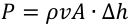

If the pressure of the Rankine cycle is lower, the enthalpy difference across the turbine is also lower. To obtain the same amount of power from the cycle, a higher steam mass flow rate must be used, which results in the need of higher flow areas. In addition, as the density increases with pressure, to obtain the same mass flow rates at lower pressures, high cross sectional areas are needed. Moreover, the efficiency of each stage of the turbine increase with the length of the blades, which further justifies the adoption of large flow areas. 

## **3.1.1 Steam Turbine Cost Data for Non-Nuclear Applications** 

Steam turbine generators factory equipment costs for non-nuclear applications from References (Pauschert 2009), (Fout 2015), (DOE 1999) and (Newell 2014), were combined and arranged by ranges of operating pressure and temperature. For each range of operating conditions, factory equipment costs as a function of power were interpolated through power function in order to estimate the scaling exponents. For consistency, all costs were converted to January 2017 USD using the methodology described in Section 2.4. 

Cost and operational data for steam turbine generators with inlet pressure of the high pressure turbine in the 166-167 bar range are presented in Table 6 and illustrated in Figure 1, along with the interpolating power function. The scaling law exponent is 0.7002, which suggests an economy of scale for these turbine types.  Similarly, cost and operational data for steam turbine generators for turbines working in the pressure range between 115 bar and 125 bar are shown in Table 7 and illustrated in Figure 2 along with the interpolating power law function, which has exponent 0.8684. The value of the exponent, being less than 1, shows the existence of economies of scale also in this pressure range. 

Table 6 - Steam turbine-generator parameters (166-167 bar; costs escalated to 2017 USD) 

|Power(MW)|Factoryequipment cost(M$)|p (bar)|T(°C)|Ref.|
|---|---|---|---|---|
|199|33.96|167|566|(Pauschert 2009)|
|198|33.96|167|566|(Pauschert 2009)|
|193|33.96|167|566|(Pauschert 2009)|
|193|33.96|167|566|(Pauschert 2009)|
|196|33.96|167|566|(Pauschert 2009)|
|219|39.78|166.5|566|(Fout 2015)|
|179|35.35|166.5|566|(Fout 2015)|
|195|25.73|166.5|566|(DOE 1999)|
|581|71.44|166.5|566|(Fout 2015)|
|644|75.31|166.5|566|(Fout 2015)|
|422|46.11|166.5|538|(DOE 1999)|
|325|46.25|166|538|(Newell 2014)|
|540|69.49|166|538|(Newell 2014)|
|860|103.08|166|538|(Newell 2014)|

Table 7 - Steam turbine-generator parameters (115-125 bar; costs escalated to 2017 USD) 

|Power (MW)|Factory equipment cost (M$)|p (bar)|T (°C)|Ref.|
|---|---|---|---|---|
|108.88|14.49|115.00|538|(DOE 1999)|
|127.54|14.55|125.00|538|(DOE 1999)|
|254.53|29.08|125.00|538|(DOE 1999)|
|140.69|18.10|125.00|538|(DOE 1999)|
|154.89|17.57|125.00|538|(DOE 1999)|
|140.10|16.24|125.00|538|(DOE 1999)|

Only limited cost data were found on steam turbines for supercritical fossil power cycles. Working parameters and factory equipment costs for supercritical turbines with an inlet temperature of 593 °C are presented in Table 8 and illustrated in Figure 3, along with the interpolating power function. The scaling law exponent is 0.4848. 

Table 8 - Supercritical steam turbine-generator parameters (593 °C; costs escalated to 2017 USD) 

|Power(MW)|Factoryequipment cost(M$)|p (bar)|T(°C)|Ref.|
|---|---|---|---|---|
|580.00|81.01|242.3|593|(Fout 2015)|
|642.00|85.10|242.3|593|(Fout 2015)|

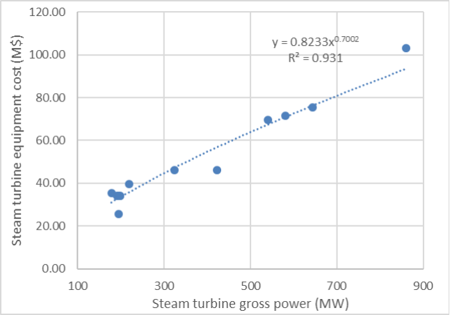

Figure 1 – - Steam turbine-generator factory equipment costs (166-167 bar); costs escalated to 2017 USD 

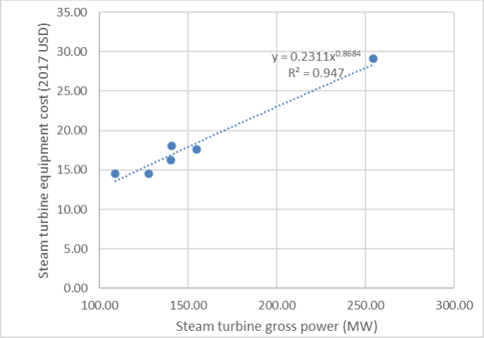

Figure 2 – Steam turbine-generator factory equipment costs (115-125 bar); costs escalated to 2017 USD 

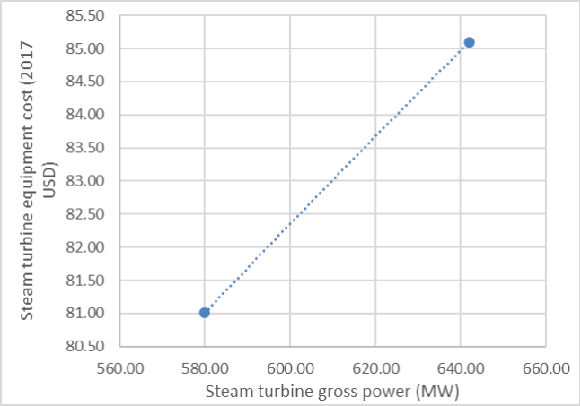

Figure 3 – Steam turbine-generator factory equipment costs (supercritical, 593 °C); costs escalated to 2017 USD 

## **3.1.2 Steam Turbine Cost Data for Nuclear Applications** 

Two data were found for nuclear steam turbine/generator pricing: cost for the 1,100 MWe PWR12-BE in (EEDB 1988b) and for the 1,000 MWe Molten Salt Breeder Reactor (MSBR) in (Robertson 1971). The costs (escalated to January 2017 USD, using the methodology described in Section 2.4), together with the power level and operating conditions of the two machines, are shown in Table 9: the MSBR, with a lower unit cost, relies on a supercritical Rankine cycle, which has a higher thermal cycle temperature and pressure. As the steam pressure and temperature are higher, the size of the turbine is substantially smaller 

than that of a LWR cycle of the same power, although the casing will have thicker walls. The smaller size accounts for the smaller specific costs of the MSBR turbine. 

Table 9 Turbine equipment cost (from (EEDB 1988b) and (Robertson 1971)), escalated to 2017 USD. 

Because of the limited cost data found on nuclear steam turbine, a regression analysis similar to the ones performed in Section 3.1.1 for fossil plants turbines is not viable. Therefore, a costing relation law for nuclear steam turbines was instead estimated from the scaling laws calculated in the previous Section 3.1.1. Table 10 shows scaling law exponents as a function of the steam turbine inlet pressures, as discussed in Section 3.1.1. The exponents are also plotted in Figure 4, along with the interpolating line. 

The power function exponent decreases with the pressure, showing that the economy of scale becomes more relevant at higher pressures. For a generic PWR, the interpolating equation is: 

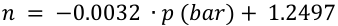

For the typical PWR pressure of 67.2 bars, the calculated scaling exponent is shown in Table 11 at 1.035. This shows slight diseconomies of scale, suggesting for example that a single turbine would be slightly more expensive than two turbines of half the size working in parallel. However, the scaling law does not take into account the economy of scale of other turbine-related equipment, such as steam piping, auxiliaries and accessories. 

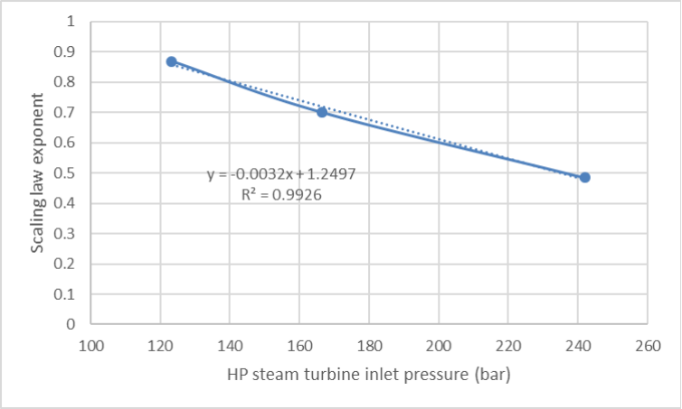

Figure 4 – Scaling law exponents as a function of the HP steam turbine inlet pressure 

Table 10 – Scaling law exponents as a function of the HP steam turbine inlet pressure 

Table 11 – PWR scaling law exponent 

## **3.1.3 Other Turbine-Related Equipment** 

In addition to the turbine generator, the reference PWR12-BE has other turbine-related equipment such as re-heaters, lubricating oil system, hydrogen storage system, carbon dioxide storage system, and moisture separator. The additional factory equipment cost (in 1987 USD) is approximately $2.1 million, i.e. 1.7% of the turbine generator itself. The factory equipment cost of account 231 is then calculated as: 

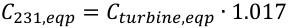

## **3.1.4 Installation Cost** 

The site labor and material costs for the turbine installation are about $7.6 million and $1.4 million (in 1987 USD), i.e. 6.1% and 1.1% of the turbine equipment cost, respectively. The site labor and material costs of account 231 (steam turbine), are then calculated from the factory equipment cost as: 

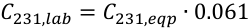

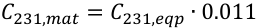

## **3.2 Containment Building (Account 212)** 

## **3.2.1 Details of the Containment’s Construction** 

The containment building accounts for about 7.2% of total direct cost for the reference PWR12-BE. 

The containment cost model was substantially improved for this report, using a similar conceptual approach as (Ganda 2017) but with several improvements. All the unit costs for the construction/installation of the various structures (e.g. the dollar per unit volume of concrete to install the reinforced concrete in the containment dome, etc…) were revisited for correctness and accuracy as compared to (Ganda 2017). 

Additionally, the cost model for the interior structures of the containment was substantially improved as compared to (Ganda 2017), in order to allow the use of the interior unit costs also for building that may have a substantially different void fraction inside the structures. The newly improved model allows the 

cost of the building services, such as for example of the special HVAC system, of the plumbing and draining, of the electrical and of the others systems, to be calculated as a unit costs per unit of building volume, a more accurate representation than the previous approach that normalized those costs over the total construction cost of the structural parts of the containment building.  For the new approach proposed here, the void fraction of the containment needs to be known. The void fraction of the reference PWR12BE is calculated as 91.7% (using the “free volume” of 2.8E6 ft[3] from (EEDB 1988b)), with the simplifying assumption that the mechanical components’ volumes has been included in the concrete volume. In this way, it is possible to avoid having to estimate separately the volume occupied by the mechanical components instead of interior concrete and other structural steel. 

Another simplifying assumption in the model presented here regards the reactor cavity, which is below the level of the base of the containment. In this analysis, it has been assumed that the containment base is flat, for simplicity. Other containment designs may have a flat basemat. 

The unit costs of the concrete structural work, as extracted from (EEDB 1987), are shown in Table 12 to Table 15, in 1987 USD. By presenting the data in the original 1987 USD, the identification of the numbers from the original reference is facilitated, ultimately improving the transparency and reproducibility of this work. 

Table 12 Total and unit installation cost of the containment sub-structure, in 1987 USD. 

Table 13 Total and unit installation cost of the containment super-structure (shell), in 1987 USD. 

Table 14 Total and unit installation cost of the containment super-structure (dome), in 1987 USD. 

Table 15 Total and unit installation cost of the containment interior structures, in 1987 USD. 

It is noted that the total cost of labor and materials (using data from (EEDB 1987)), in Table 16, as calculated by multiplying the unit costs from Table 12 to Table 15 for the calculated volume and surfaces of the various parts of the containment (in Section 3.2.3), are very similar to the values reported for each part (i.e. Basemat, Shell, Dome and Interior) in (EEBD 1987). However, the total as it appears to have been summed in (EEDB 1987) is not correct, indicating possibly a typo in (EEDB 1987)[c] . It is also possible that certain items, while listed with the “concrete” work in the general printout of (EEDB 1987), may have been removed from the group, for example the reactor cavity liner plate, which in fact would be logically related to the steel rather than to the concrete work. 

> c An additional clarification on the consistency with the source data: the material cost of the “Major Support Embedments” include a factory procurement cost at $1,507,500 in 1987 USD, together with the material cost of $110,209. Therefore, the total cost of material for the Interior (in Table 8) will be higher than the “total material” cost (as reported in (EEDB 1987)) by $1,507,500 in 1987 USD. 

Table 16 Calculated costs of the various parts of the containment “concrete work”. While the labor and material cost of each part is exactly identical to those reported in (EEDB 1987), the simple sum of the parts in (EEDB 1987) is not the same. 

|||Construction cost in 1987 dollar|
|---|---|---|
|Material cost|Basemat|$2,534,400|
|Labor Cost|Basemat|$2,660,300|
|Material cost|Shell|$3,476,600|
|Labor Cost|Shell|$6,192,100|
|Material cost|Dome|$1,449,400|
|Labor Cost|Dome|$2,504,700|
|Material cost|Interior|$4,197,700|
|Labor Cost|Interior|$10,400,000|
||TOT material|$11,658,100|
||TOT labor|$21,757,100|
||TOT|$33,415,200|

Additional cost items included in the “steel work account”, plus other items, such as the expensive steel liners for both the reactor cavity and the entire containment inside surfaces, as well as painting, are: 

- Structural steel; 

- Miscellaneous frames; 

- Floor grating; 

- Handrail; 

- Stair threads; 

- Reactor cavity liner plate; 

- Containment liner; 

- Painting. 

While in the previous models of (Ganda 2017) those items were normalized to the structural volume of the building, in the present work the fidelity has been improved with the following assumptions: 

- The structural steel and miscellaneous frames are normalized to the total volume of the structures, including basemat, shell, dome and interior concrete; 

- The floor gratings, handrails and stair threads are normalized to the total containment inside volume, since those structures will, in first approximation, be larger for larger areas and height of the building; 

- The reactor cavity liner plate is normalized to the surface of the reactor vessel cavity, which is provided in (EEDB 1987) at 11,000 ft[2] : absent information on this particular item in other reactor designs, the user of the algorithm has the option of removing this cost by zeroing the surface of the liner in the input, or leave it with the same square footage as for the reference PWR, or change it, for example, in a linearly proportional way to the vessel surface ratio between the alternative concept and the reference PWR. 

- The inside liner of the containment is normalized to the total inside surface of the containment, including basemat, shell and dome. It is known that the liner thickness is different in the various parts of the containment, i.e. on the basemat, on the shell and on the dome. This difference leads to different costs of the starting slabs and possibly of the welding and installation for the 3 parts. However, those differences are considered of second order, and are neglected in the model developed here. 

- The cost of painting is calculated based on the surface to the painted, which includes the exposed part of the containment liner, the outside concrete surfaces, the structural steel, and the floor gratings, stairs and handrails. This is closely approximates as the sum of the surfaces of (1) the liner; (2) the outside of the dome and of the shell; (3) the surface of the interior concrete structures. 

Table 17 Normalized unit costs (in 1987 dollars) for the non-concrete related items of the containment cost structure of the reference PWR12-BE 

The total cost of the structures for the containment of the PWR12-BE is about $61 million in 1987 dollars, and about $193 million in 2017 dollars. 

## **3.2.2 Containment Equipment** 

The building services and equipment are a small fraction of the containment cost (about 6%), but a detailed knowledge of this cost item can be helpful for the cost analysis of other fuel cycle facilities, where plumbing, ventilation, power supply etc… can be a larger fraction of the total construction costs. 

Table 18 shows the total costs (in 1986 dollars) of the “building services”, along with the percentage contribution of each part to the total item: the cost of building services is dominated by the cost of the safety-related HVAC, at 48% of total costs, followed by the power supply equipment at 35% of cost. Plumbing and drains are 11% and the remaining miscellaneous items account for 6% of total costs. 

The normalization factor for all the “building services” costs is the total building inside volume, since the dimensioning of the equipment is likely to be proportional, in first approximation, to the inside total volume of the building (i.e. 86,500 m[3] for the reference PWR12-BE): while it is clear that certain 

equipment, such as the safety-related HVAC will be dimensioned to the heat that needs to be removed in case of accidents and other plant-specific parameters, also the inside of the containment is likely to be dimensioned based on those same criteria. Therefore, the size of the containment is a reasonable metric for the dimensioning of such equipment. 

Table 18 Cost (in 1987 dollars) of the Containment equipment (non-structure-related). 

The total cost of non-structure related equipment is $3.6 million in 1987 dollars, and $11.4 million in 2017 dollars. 

The total cost of the containment, including both structures and equipment, is therefore $185.64 million in 2017 USD. 

The cost of excavation amounts to about 1% of the containment cost, therefore, for simplicity, it has not been included in this analysis and models. However, unit cost of excavation can be derived from the amount and costs of both rock and soil to be excavated for the entire construction site. In 1987 dollars, the cost of excavating 1 m[3] of rock was 28.4 dollars and 1 m[3] of earth was 5.2 dollars. It is possible that these costs may have decreased somewhat in inflation adjusted terms since the 1980s, primarily because of better excavating machinery. However, this effect can be neglected for conservativeness, and the above numbers can be used for the cost analysis of reactor concepts for which excavation has a larger impact on the total plant costs: for example, for plants that are largely underground. 

## **3.2.3 Containment Cost Model** 

In order to use the quantitative cost methodology described in the previous section, the following parameters are calculated for a cylindrical container with a hemispherical dome and a flat reinforced concrete base. The numerical values refer to the reference PWR12-BE. 

- Basemat surface (Sbase), calculated as[d] : 

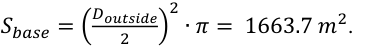

> d Only one side is considered in the basemat when calculating its total surface, since the other side will be facing the ground below the containment. 

- Basemat volume (Vbase), calculated as 

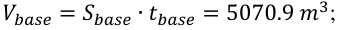

- Walls surface of the shell (inside + outside) (Swalls), calculated as: 

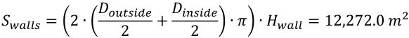

- Walls volume (Vwalls), calculated as 

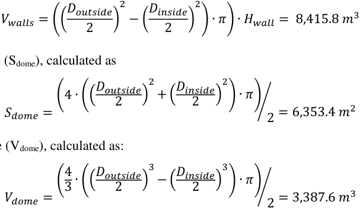

- Dome surface (Sdome), calculated as 

- Dome volume (Vdome), calculated as: 

- Building internal total volume (Vint_tot), calculated as: 

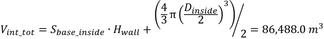

- Volume of internal structures (approximate) (Vint), calculated as: 

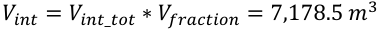

- Surface of internal structures (approximate) (Sint), calculated as: 

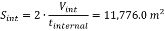

- Liner Surface (Sliner), calculated as: 

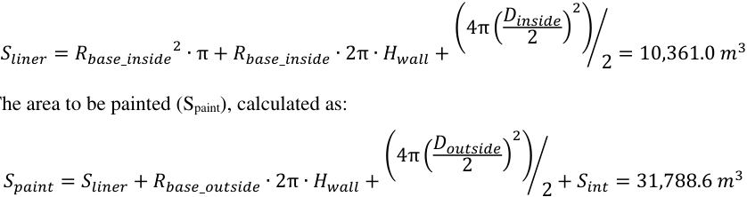

- The area to be painted (Spaint), calculated as: 

- The total volume of the structures (Vstructures_tot), calculated as: 

𝑉𝑉𝑏𝑏𝑡 𝑡𝑡𝑓𝑓𝑡 𝑡𝑡𝑒𝑒𝑏𝑏_𝑡𝑡𝑜𝑜𝑡𝑡 = 𝑉𝑉𝑡𝑡𝑙𝑙𝑏𝑏𝑒𝑒 + 𝑉𝑉𝑤𝑤𝑙 𝑙𝑙𝑏𝑏 + 𝑉𝑉𝑜 𝑚𝑚𝑒𝑒 + 𝑉𝑉𝑡 𝑡𝑡 = 24,053.0 𝑚𝑚[3] 

The above values were calculated from the following numerical parameters from (EEDB 1988b): 

- Containment total height (Htot)=219 ft; 

- Basemat thickness (tbase)=10 ft; 

- Containment outside diameter (Doutside)=151.0 ft; 

- Shell wall thickness (tshell)=4.5 ft; 

- Dome thickness (tdome)=3.5 ft; 

- Void fraction of the inside of the containment (Vfrac)=91.7%;[e] 

- Internal wall average thickness (tinternal)=4 ft;[f] 

- Reactor cavity area (Sreactor_cavity) =11,000 ft[2] . 

## **3.3 Heat Rejection System Mechanical Equipment (Account 262)** 

Account 262 for heat rejection system mechanical equipment (which amounts to about 5.0% of total direct costs), includes for a typical PWR (EEDB 1988b): 

- Circulating Water Pumps; 

- Cooling Towers and Cooling Tower Basins; 

- Plant Make-up Water and Slowdown Equipment; 

- Make-up Water Pretreatment Plant. 

The cost of the account 262 costs (from (EEDB 1987)) for the reference PWR12-BE, escalated to 2017 USD, is shown in Table 19. 

Table 19 – PWR12-BE account 262 costs (from (EEDB 1987) escalated to 2017 USD) 

||Factoryequipment|Site labor|Site material|Total|
|---|---|---|---|---|
|PWR12-BE|$86.8 million|$35.9million|$4.5 million|$127.2 million|

The dimensioning of this equipment is proportional to the heat to be rejected. Consequently, the factory equipment, site labor, and site material costs are scaled from those of the reference PWR12-BE (shown in Table 19), based the rejected thermal power, using an exponent equal to 0.80, as recommended in (Phung 1987) for heat rejection systems, according to Eq: 

> e The void fraction of the inside of the containment was calculated as the ratio of the “free volume” of 2.8E6 ft3 (provided in (EEDB 1988b)) and the total inside volume of the containment (Vint_tot), of 3.0E6 ft[3] , calculated using the containment dimensions with the corresponding equation provided above. The volume occupied by mechanical equipment such as the NSSS, auxiliary tanks, piping etc… was in first approximation neglected for this estimate. 

> f The average thickness of the internal walls was not provided in reference (EEDB 1988b). Therefore, it was approximated based on information provided on the thickness of two major internal containment structures: (1) the _Primary Shield Wall_ , a shielding wall that surrounds the primary vessel, of 6 feet thickness, and the _Secondary Shield Wall_ , a four feet thick octagon-shaped reinforced concrete wall enclosing the reactor coolant piping, steam generators, reactor coolant pumps and their supports. 

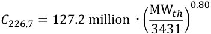

## **3.4 Condensing Systems at the turbine (Account 233)** 

Account 233 for condensing systems at the turbine (which amounts to about 3.2% of total direct costs for the reference PWR12-BE) includes the following (EEDB 1987): 

- condensers, 

- condensate system, 

- condenser gas removal system, 

- turbine bypass system, 

- condensate polishing system. 

The cost of the account 233 (from (EEDB 1987)) for the reference PWR12-BE, escalated to 2017 USD, is shown in Table 20. 

|Table20– PWR12-BEaccount233 costs (from(EEDB 1987), escalated to2017USD)|Table20– PWR12-BEaccount233 costs (from(EEDB 1987), escalated to2017USD)|Table20– PWR12-BEaccount233 costs (from(EEDB 1987), escalated to2017USD)|Table20– PWR12-BEaccount233 costs (from(EEDB 1987), escalated to2017USD)|Table20– PWR12-BEaccount233 costs (from(EEDB 1987), escalated to2017USD)|
|---|---|---|---|---|
||Factory equipment|Site labor|Site material|Total|
|PWR12-BE|$56.3 million|$23.0 million|$3.3 million|$82.6 million|

The dimensioning of this equipment is proportional to the heat to be rejected. Consequently, the factory equipment, site labor, and site material costs are scaled from those of the PWR12-BE (shown in Table 20), based the rejected thermal power, using an exponent equal to 0.80, as recommended in (Phung 1987) for condensing systems, according to Eq: 

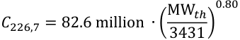

## **3.5 Air, Water and Steam Service Systems (Account 252)** 

Account 252, Air, Water and Steam Service Systems (which amounts to about 3.2% of the total direct costs) covers the following systems (EEDB 1987): 

- Compressed air systems, 

- Service water system, 

- Fire protection system, 

- Potable water system, 

- Auxiliary steam system, 

- Plant fuel oil storage tank. 

The PWR12-BE cost breakdown into factory equipment, site labor, and site material of this account is shown in Table 21, from (EEDB 1987) escalated to 2017 USD. 

|Table 21 – PWR12-BE account 252 costs(from(EEDB 1987),escalated to 2017USD)|Table 21 – PWR12-BE account 252 costs(from(EEDB 1987),escalated to 2017USD)|Table 21 – PWR12-BE account 252 costs(from(EEDB 1987),escalated to 2017USD)|Table 21 – PWR12-BE account 252 costs(from(EEDB 1987),escalated to 2017USD)|Table 21 – PWR12-BE account 252 costs(from(EEDB 1987),escalated to 2017USD)|
|---|---|---|---|---|
||Factory equipment|Site labor|Site material|Total|
|PWR12-BE|$24.9 million|$44.4 million|$12.6 million|$81.8 million|

Considering that most alternative reactor designs will generally need all of the systems included in this account, it is recommended to keep the cost of this account unchanged, at $81.8 million of 2017 USD, for different reactor designs. 

## **3.6 Reactor Primary Vessel (Account 221.12)** 

Substantial effort was devoted in FY18 to the improvement of the cost model of reactor primary vessels, since it was found in FY17 that the cost of this component can be an important driver of cost differences between alternative concepts (Ganda 2017). 

An important complexity in developing cost models for the reactor pressure vessel (RPV), is that the actual cost of this component is not directly available in (EEDB 1987) for the reference PWR design, since the parts of NSSS system that were purchased directly from the vendors are reported as a single “NSSS vendor quote”. The NSSS includes, among other components, also the RPV. The work performed in this section addresses this important limitation for the primary vessel, and will be used to develop cost models also for other NSSS-supplied mechanical components. 

To gather models for the costing of large forgings, the company with the largest open-die forging press in North America ( _North American Forgemasters, (NAF)_ ) was contacted for this project. The NAF management provided guidance and checking about the fabrication cost models presented in this report for heavy mechanical components. 

## **3.6.1 Cost Model for Plate-Built Primary Vessels** 

It was learned from NAF that components with walls less than approximately 6 inches thick cannot be forged, and instead can be built with rolled plates, at lower fabrication costs as compared to forged components. This is an important consideration for several advanced nuclear plants, particularly those that do not require pressurized primary coolant (e.g. molten-salt cooled and liquid-metal cooled reactors). 

This section addresses the expected cost of rolled-plates vessel construction. While forging cannot be utilized for wall thicknesses smaller than 6 inches, rolled plate construction can be utilized also for thicknesses substantially larger than 6 inches (NAF 2017). As an example, (WEC 2011) includes a description of the typical approaches to the construction of PWR RPV, which can constructed with forged rings or with axially-welded rolled plates: the typical thickness for the various parts of a PWR RPV is between 6 inches and 12 inches. 

To identify the unit cost of plate-built construction with carbon steel, it was possible to utilize actual cost data, from (EEDB 1987), of the carbon steel liner of the primary containment, covering the entire inner surface of the building, and separately the of the reactor cavity liner plates (please see Section 3.2).  The containment cavity liner, of “continually welded carbon steel” (EEDB 1987) has different thicknesses on the basemat, on the shell and on the dome, as shown in Table 22. 

The cost of the liner is shown in Table 23, in 1987 USD, from (EEDB 1987). Table 24 shows the calculated unit cost, as installed, in 1987 and 2017 dollars, assuming a specific weight of carbon steel of 7,850 kg/m[3] . 

Table 22 Geometrical parameters of the containment liner 

Table 23 total costs of the containment liner (in 1987 dollars) (EEDB 1987) 

Table 24 Unit costs of the containment liner (in 1987 and 2017 dollars) 

Similar information is available in (EEDB 1987) also for the reactor cavity liner, as shown in Table 25. While the thickness of the reactor cavity liner plate of the reference PWR12-BE could not be found, it is known from (EEDB 1987b) that the area of the reactor cavity liner is 11,000 ft[2] , which implies a “total installed cost” per unit of area of 1,354 $/m[2] , which is lower than the one of the containment liner of 1,967 $/m[2] .  Therefore, while the actual thickness could not be found, it is assumed that the thickness of the reactor cavity liner should be smaller than that of the containment liner.  Additionally, a smaller thickness is expected for the reactor-cavity liner plate, since it is installed only for ease of decontamination and does not have the function of holding pressure during accidents, similarly to the liner installed at the bottom of the containment building. If, consequently, the thickness is assumed to be the same as that of the containment liner at the bottom of the containment (i.e. 0.25 inches thick, while the weighted average thickness of the containment liner is about 0.4 inches), the unit cost per unit of volume and weight would be very similar to that of the containment liner (shown in Table 24): $213,219 /m[3] and $27,162 /ton respectively in 1987 dollars, or $611,938 /m[3] and $77,954 /ton respectively in 2017 dollars. The agreement with the costs of the containment liner, under the assumption discussed here, is excellent. 

Table 25 Total costs of the reactor cavity liner (in 1987 dollars) (EEDB 1987) 

It is recognized that the installation of thicker plates may feature a lower cost per unit weight, since the amount of installation labor will be, in first approximation, proportional to the plates’ total area, rather than to the installation weight.  However, it is also recognized that the construction of different structures, such as a reactor vessel, may be more complex than the attachment of the plates to the inside of the containment’s concrete surfaces, since, for example, for vessels attachment to the structural supports may be more complex, penetrations and nozzles are required, etc. 

In conclusion, it recommended to use the unit cost of plate installation, per ton, rounded to $75,000 /ton in 2017 dollars, as derived from the known costs of the containment and reactor cavity liners, for carbon steel mechanical components that are fabricated using rolled plates. 

## **3.6.2 Cost Model for Forged Primary Vessels** 

Cost data for forged components are not readily available in (EEDB 1987), contrary to the case of platebuilt components (see Section 3.6.1), since most of the forgings will be for components that are included in the NSSS, for which the breakdown is not available. 

However, (Combustion Engineering 1978) includes a direct cost estimate for the cover plug of the LMFBR, which is a very large and complex component, with multiple requirements and functions, including that of providing a gas-tight cover and a biological shield, while allowing access to the core for control rods maneuvering and fuel transfer. The total weight of the entire cover plug is 626 MT, with a circular diameter of 8.53 meters and a thickness of “ _approximately 11 ft [i.e. 3.35 meters] from the bottom of the suppressor plate to the top of the rotational drive extensions_ ” (Combustion Engineering 1978). The biggest component is the “upper structural plate”, which is 24 inches (i.e. 60.9 cm) thick, fabricated of carbon steel SA-508, and weighing about 270 tons including the rotating plugs. This piece appears to be best fabricated by forging, as a seamless rolled ring for the “upper structural plate” itself, and as forged “disks” for the cover plugs (NAF 2018). Therefore, under the assumptions that the other parts of the cover plugs have a similar cost per unit mass of the biggest part of it, it is possible to gain an indication of the cost of large forged components (per unit mass) of carbon steel forgings. 

The total cost of the reactor vessel head, from (Combustion Engineering 1978), is $11.1 million in 1978 dollars, or $74.7 million in 2017 dollars, thus yielding a unit cost of about $120,000/ton. 

This cost (rounded to $120,000/ton) can be used in first approximation for the cost of forged nucleargrade construction of components made of carbon steel forged parts, implying a factor of 1.6 in cost differential between plate-built and forged components. While it is understood that the starting materials (i.e. plates vs forged components) have a substantially larger difference in cost (perhaps a factor 7 to 8 (NAF 2018)), it is also clear that generally, plate-built components will require more welding, and consequently more inspections, both increasing the cost of the plate-built finished product. Additionally, a forging or plate building are only the initial steps of the fabrication process, comprising a relatively small fraction of the total fabrication cost of nuclear-certified components. Therefore, the 1.6 cost differential identified here between forged and plate-built construction for carbon-steel nuclear mechanical components appears reasonable (NAF 2018). 

For this reason, it is recommended to use the above-mentioned unit costs for carbon steel components fabricated via forgings, until higher fidelity cost models are developed in the future. 

As an additional cross check, the unit cost of RPV from (Holcomb 2011), the total cost of which is $81.7 million in 2017 dollars for a total weight of $554 tons (including the head), is $147,000/ton[g] , of the same order of magnitude of the unit cost calculated in this section (with different sources) for these types of 

> g This approach neglects the different cost of the weld-deposited stainless steel internal cladding in the cost estimation, and instead it assumes that it has the same unit cost as the rest of the carbon steel vessel. 

components.  However, the value calculated here is considered more reliable; please see the discussion in Section 2.1. 

## **3.6.3 Cost Model for Primary Vessels of Stainless Steel and of Advanced Alloys** 

Manufacturing components constructed with materials other than standard carbon steel (e.g. SA-508) is generally more challenging, and consequently more expensive (NAF 2018). For example, for stainless steel SA-240, type 304, commonly used in the manufacturing of several nuclear components in standard PWRs, the initial material is more expensive, requiring the addition of non-iron additives chromium and nickel. More importantly, though, the forging process for stainless steel is more complex and slower, requiring more frequent re-heating to prevent cracks, and with generally more difficult dimensional controls. Additionally, machining stainless steel is likely to take 50% more time than standard carbon steel (NAF 2018), and welding is also substantially more complex and slower for stainless steel. Consequently, according to (NAF 2018), a stainless-steel-forged component is likely to cost 2 to 3 times that of a carbon-steel forging, and considering the higher complexity of welding stainless steel, it is expected that plate-built stainless steel vessel may have a similar cost to forging-constructed vessels. 

Those considerations and expected costs are consistent with what could be obtained from literature sources in regard to stainless steel vessel construction. The vessel internals of the LMFBR (please see Section 3.21) are made of stainless steel 304 (Combustion Engineering 1978), and vessel internals are mostly forged (NAF 2018). With a cost of $13.62 million in 1978 dollars (Combustion Engineering 1978), or $91.6 million dollars using the escalation factor described in Section 2.4, and a combined weight of 292.5 tons, the unit cost of stainless steel forged internals is $313,065/ton. This unit cost implies a ratio of 2.6 between the unit cost of carbon steel and stainless steel forged components, within the 2 to 3 range recommended by NAF (NAF 2018). 

The LMFBR vessel shell is made of welded stainless steel 304 plates, since the thickness of the vessel is between 2.5 and 3 inches (Combustion Engineering 1978). It was estimated in (Combustion Engineering 1978) that its cost would be $14.82 million in 1978 dollars, or $99.7 million dollars using the inflation factor described in Section 2.4. With a mass of 324.5 tons, its unit cost is $307,072/ton, very similar to that of the forged internals. 

In conclusion, it is recommended to use a rounded unit cost of $310,000/ton for customer-delivered stainless steel components, both plate-fabricated and forged. 

For advanced alloys other than stainless steel 304, fabrication costs will be generally higher. Additionally, the fabricability of large parts of interest to the nuclear industry is yet to be demonstrated for certain advanced materials, and consequently cost data are very difficult to quantify defensibly (NAF 2018). Therefore, it is important to consult with fabricators and vendors for the expected costs of components manufactured with advanced components, in order to understand the complexity of the manufacturing process, and to develop a reliable estimate of the expected manufacturing costs. 

While cost sources are hard to obtain for nuclear components manufactured with advanced alloys, a unit cost for Hastelloy-N could be obtained from (Robertson 1971), for the reactor vessel of a molten salt reactor. The total cost of the vessel was estimated in (Robertson 1971) at $9.1 million in 1970 dollars, or $126.0 million dollars using the inflation factor described in Section 2.4. With a total weight of 289.95 tons, the unit cost of this vessel would be $434,531/ton. As a first approximation, and absent more reliable and vendor-verified data, it is recommended to use this unit cost (rounded to $430,000/ton) for the manufacturing of large components of advanced alloys. 

## **3.6.4 Expected Cost of the Primary Vessel of the Reference PWR12-BE** 

With the unit costs discussed in the previous sections, the expected cost of the primary vessel of the reference PWR12-BE is calculated in this section. 

The inside diameter of the main shell is 173 inches, and the height is 525.8 inches, with hemispherical bottom and removable upper head. The shell material is forged carbon steel, and it is internally cladded with 0.95 cm thick stainless steel (EEDB 1988b). With these dimensions, it is possible to calculate the weight of the stainless steel cladding at 18.3 tons (using a unit weight of 7.85 g/cm3 specific weight of stainless steel). With a unit cost of $310,000/ton the cost of the stainless steel clad is then calculated as $5.66 million. The total weight of the vessel, including the head, was reported in (EEDB 1988b) at 554 tons, implying a weight of about 536 tons for the carbon steel parts of the vessel. With a unit cost of $140,000/ton, the cost of the carbon steel structure of the vessel is calculated as $64.3 million, and the total cost of the vessel is then $69.98 million, rounded to $70.0 million. 

## **3.6.5 Installation Cost** 

The site labor and site material costs for the installation the primary vessel in 2017 USD, are about $7.1 million and $0.7 million, respectively. In the RPV cost model, the site labor and material costs are expressed in terms of the RPV mass, obtaining the following per-unit mass costs: 

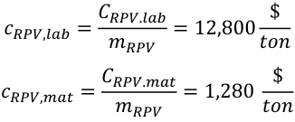

## **3.7 Yardwork (Account 211)** 

The yardwork account, which amounts to about 2.8% of the total direct costs for the reference PWR12BE, includes the preparation of the site for the reactor construction. The cost breakdown of the yardwork account in factory equipment, cost of site labor and of site material, in 2017 USD from (EEDB 1987), is shown in Table 26. 

In general, parts of the yardwork account will be proportional to the site area, which is approximately 500 acres (EEDB 1988b) for the reference PWR12-BE. Other parts of the account will instead depend on the amount and footprint of structures to be erected on the site, and on the infrastructure necessary for the plant to be fully operational. 

It is unlikely that different reactor design would require substantially different yardwork costs as compared to a standard PWR: therefore it is recommended to leave this cost unchanged for alternative reactor designs. However, it is also noted that excavation, and especially rock excavation, is about 25% of the yardwork cost for the reference PWR12-BE. For reactor concepts that have substantial parts below grade, the cost of excavation will have to be adjusted accordingly. Earth and rock excavation costs were discussed in Section 3.2. 

Table 26 – PWR12-BE account 211 costs (from (EEDB 1987), escalated to 2017 USD) 

||Factory equipment|Site labor|Site material|Total|
|---|---|---|---|---|
|PWR12-BE|$0.8 million|$41.6 million|$29.3 million|$71.7 million|

## **3.8 Steam Generators (Account 222.13)** 

## **3.8.1 Factory Equipment Cost** 

The actual cost of the steam generators (SGs) is not directly available in (EEDB 1987) for the reference PWR design, since the parts of NSSS system that were purchased directly from the vendors are reported as a single “NSSS vendor quote”. The NSSS includes, among other components, also the SGs. 

It is possible to scale the cost of the SGs based on various parameters: the thermal power, the surface area, and the dry-weight. (Phung 1987) suggests the use of surface area as the primary metric, to be scaled with an exponent to 0.65, even though the applicability of the considerations in (Phung 1987) are for heat exchangers that are orders of magnitude smaller (in the range of 200-5,000 ft[2] ) than those typical of nuclear plants (e.g. the four SGs of the reference PWR12-BE have a total heat exchange area of 220,600 ft[2] , or 55,150 ft[2] per SG). A similar scaling exponent of 0.62 is also recommended in (EMWG 2007). 

(Combustion Engineering 1978) includes the cost for individual parts of the NSSS of the LMFBR, including those of the SGs (the cost and technical data are shown in Table 27). Each LMFBR plant was designed with 2 SGs for each of the 4 loops, for a total of 8 SGs per plant. The total weight and surface areas of those eight SGs are 2,351 tons and 401,200 ft[2] respectively, and the total cost of the combined SGs for each plant was estimated at $326.1 million, in 2017 dollars. This would amount to unit costs of $812.9/ft[2] of heat transfer area, and of 138,697.8/ton, respectively. 

Table 27 Cost and technical specifications of the SGs of the LMFBR (Combustion Engineering 1978). 

It was noted in (Combustion Engineering 1978) that the C-E System 80 PWR, with identical thermal power of 3800 MW, would require SGs with substantially lower heat-transfer areas and total weight than the LMFBR: of 249,600 ft[2] and 1,409 tons respectively, as shown in Table 28. 

Table 28 Cost and technical specifications of the SGs of the C-E System 80 (Combustion Engineering 

1978). 

The larger weight of the SG of the LMFBR plants is counterintuitive, considering that the shell of the LMFBR is substantially thinner, because of the lower system pressure, than that of the System 80’s SGs. However, explanation for this are provided in (Combustion Engineering 1978) _“not the shell but the tubing are the major driver of the weight difference LMFBR/System 80.”_ Further, _“more thickness [is] required because of the high temperature and pressure at the superheater outlet end”_ .  The unit cost of approximately $140,000/ton is consistent with, although somewhat larger, than the typical cost of carbon steel forged components described in Section 3.6, of about $120,000/ton. The larger unit cost of the SGs can be attributed to the fact that the entire steam generator of the LMFBR is made of Chromium/Moly steel (Sham 2018), of types SA-387 Gr. 22 for the shell plate; SA-336 F22 for the tube-sheet; and SA-213 Gr. T22 for the tubes (Combustion Engineering 1978), and it was learned from (NAF 2018) that 

components made of these types of steel will have a higher cost than standard carbon steel, but lower than that of stainless steel, which is consistent with the result that was found. Additionally, the fabrication complexity of the LMFBR SGs was reported to be higher than that of standard PWR’s SGs: _“The tube-totubesheet welds, thermal liners, etc., along with the larger number of components make the LMFBR components more complicated_ [than that of the System 80 PWR SGs] _from a fabrication point of view.”_ (Combustion Engineering 1978). As an additional consideration, it is observed that the both the shell and the tubesheet of standard PWR SGs are typically forged (while tubes are extruded (Sham 2018)), while in the case of the LMFBR only the tubesheet is expected to be forged, since the shell is only 1.5 to 2.5 inches thick, and thus will be plate-fabricated (NAF 2018). This lowers somewhat the manufacturing cost of the SGs of the LMFBR, partially counteracting the higher cost drivers mentioned above. 

Another, consistent set of SGs cost data was found through large SGs replacement contracts for PWRs, as described in (WNN 2011), for orders placed by EDF in 2011 with AREVA (for 32 SGs, worth $1.5 billion) and with Westinghouse (for 12 SGs, worth $545 million). Those orders, summarized in Table 29, are therefore worth $45-$47 million/SG, in 2011 dollars. 

The mass of each of the SGs is reported in (WNN 2011) as 438 tons for each SG, while the heat-transfer area was not reported. The unit cost would therefore be $103,700/ton for the Westinghouse contract, and $107,000/ton for the AREVA contract, in 2011 dollars, or $114,000/ton and $117,700/ton respectively in 2017 dollars (that can be averaged and approximated as $115,000/ton). (WNN 2011) further specifies that each of the EDF 900 MW plant will require 3 SGs, while each of the 1300 MW plant will require 4 SGs, for a total cost of about $150 million and $200 million respectively. The SGs are all reported to be forgedconstruction in (WNN 2011): therefore the calculated unit costs from (WNN 2011) is consistent with the cost of carbon steel forged construction of about $120,000/ton for nuclear grade components, as discussed in Section 3.6. 

In conclusion, it is recommended to use a unit cost of $120,000/ton for forged carbon steel steam generators, of $140,000/ton for plate-built Chromium Moly construction, and of $310,000/ton for stainless steel (and other advanced alloys) construction, both forged and plate-built. 

Using these unit costs, the cost of each of the 4 forged carbon-steel SGs of the reference PWR12-BE would be $37.4 million, or a total of $149.8 million for each plant. It is noted that this value is higher than the total used in (Holcomb 2011), of $87.8 million per plant. This analysis is therefore contributing to increasing the fidelity of the PWR12-BE data set (discussed in in Section 3.6), which was reported as an important weakness in (Holcomb 2011), and it is extending the knowledge in this area. 

## **3.8.2 Installation Cost** 

The installation costs of the PWR12-BE steam generators, found in (EEDB 1987), are used to estimate the site labor and material costs. It is assumed that, in first approximation, the site labor and material costs are constant for each SG installed: $0.53 million and $0.05 million for each SG, respectively, as shown in Table 30. 

Table 30 – PWR12-BE steam generators cost breakdown (escalated to 2017 USD) 

||Cost (total)|Cost per SG|Ref.|
|---|---|---|---|
|Factory equipment|$149.8 million||Analysis developed here|
|Site labor|$2.10 million|$0.53 million|(EEDB 1987)|
|Site material|$0.21 million|$0.05 million|(EEDB 1987)|

The site labor and material costs are then calculated as: 

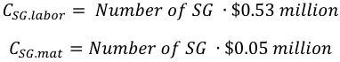

The installation cost of the SGs is included in the total “field” cost of the reactor core coolant system, described in Section 3.19. 

## **3.9 Feedwater Heating Systems (Account 234)** 

The feedwater heating system (account 234) is part of the turbine plant equipment. The detailed costs of this account (which amounts to about 2.7% of the total direct costs for the reference PWR12-BE) are available from (EEDB 1987) for the reference PWR, and are reported in Table 31, updated to 2017 USD. 

Table 31 – PWR12-BE account 234 costs (from (EEDB 1987), escalated to 2017 USD) 

||Factoryequipment|Site labor|Site material|Total|
|---|---|---|---|---|
|PWR12-BE|$44.9 million|$20.3 million|$2.0 million|$67.2 million|

The recommended scaling exponent for reactors of different power levels is 0.8, as for other turbine-related equipment, as suggested by (Phung 1987), according to Eq: 

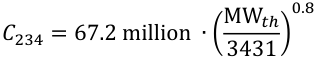

It is noted that for several advanced reactor concepts, such as those based on high temperature steam cycles or gas cycles, this item might absent. In those cases, this cost should be set to zero. 

## **3.10 Turbine Room and Heater Bay (Account 213)** 

The detailed cost of the turbine building structure (which amounts to about 2.6% of the total direct costs for the reference PWR12-BE) are available from (EEDB 1987) for the reference PWR12-BE, and are reported in Table 32, updated to 2017 USD. 

Table 32 – PWR12-BE account 213 costs (from (EEDB 1987), escalated to 2017 USD) 

||Factoryequipment|Site labor|Site material|Total|
|---|---|---|---|---|
|PWR12-BE|$1.8 million|$31.8 million|$32.4 million|$66.0 million|

The cost of this account for advanced reactor designs is estimated in first approximation using a scaling law of 0.8, as for other turbine-related equipment, as suggested by (Phung 1987), according to Eq: 

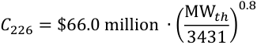

The cost of this account could also be estimated using a top-down approach, similarly to what was done for the containment building (please see Section 3.2), if a complete set of dimensions and of construction material information was available. However, since only partial information on the reference PWR12-BE building dimensions and materials were found in the EEDB technical reference book (EEDB 1988b) and in the other EEDB supporting material (EEDB 1987 and 1987b), a bottom-up analysis for this account could not be done at this point, and it is left for future work, possibly using structural details derived from other sources for plants similar to the PWR12-BE. 

## **3.11 Other Turbine Plant Equipment (Account 235)** 

The “other turbine plant equipment” (Account 235), which amounts to about 2.5% of the total direct costs for the reference PWR12-BE, includes the following turbine-associated equipment (EEDB 1987): 

- Main Vapor Piping System; 

- Turbine Building Closed Cooling Water System; 

- Demineralized Water Make-up System; 

- Chemical Treatment System; 

- Neutralization System. 

In general, this account will be needed whenever a turbine is installed. Therefore, in a first approximation, the costs associated with this account structure, including factory equipment, site labor, and site material costs, are expressed as a percentage of the turbine generator account cost (Account 231) of $381.7 million in 2017 USD, described in Section 3.1, as shown in Table 33. 

Table 33 – PWR12-BE account 235 cost (escalated to 2017 USD), and as percentages of account 231 cost 

||Factoryequipment|Site labor|Site material|Total|
|---|---|---|---|---|
|PWR12-BE Account 235|$32.1 million|$28.5 million|$3.5 million|$64.1 million|
|Account 235/account 231 cost|8.9%|130.3%|85.8%|16.7%|

In the cost models, account 235 costs are then calculated as: 

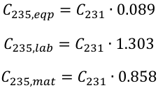

## **3.12 Electrical Plant Equipment (Accounts 245, 246, 242)** 

Electrical Plant Equipment, including (in decreasing order of fractional importance among the direct costs): 

- (1) Accounts 245, _Electric Structure and Wiring_ (amounting to about 2.5% of total direct costs); 

- (2) Accounts 246, _Power and Control Wiring_ (amounting to about 2.3% of total direct costs); 

- (3) Accounts 242, _Station Service Equipment_ (amounting to about 2.2% of total direct costs); 

- (4) Account 241, _Switchgear_ (amounting to about 1.3% of total direct costs); 

These contribute a combined total of about 8.3% of the direct costs of the reference PWR, including all the relevant accounts among those contributing more than 1% of the total direct costs. 

The detailed costs of these accounts are available from (EEDB 1987) for the reference PWR12-BE, and are reported in Table 34, updated to 2017 USD. It is noted that account 245 has no factory equipment costs, since it includes the construction of the structures associated with the electrical wires, such as for example conduits for electrical cables and cable tunnels. 

Table 34 – PWR12-BE account 245, 246, 242 and 241 costs (from (EEDB 1987), escalated to 2017 USD. 

|Account|Account #|Factoryequipment|Site labor|Site material|Total|
|---|---|---|---|---|---|
|Electric structure and wiring|245|$0.0 million|$51.2 million|$12.3 million|$63.6 million|
|Power and Control wiring|246|$4.5 million|$33.4 million|$20.8 million|$58.7 million|
|Station service equipment|242|$52.2 million|$4.4 million|$0.8 million|$57.5 million|
|Switchgear|241|$32.1 million|$1.7 million|$0.3 million|$34.0 million|
|TOTAL(Acc. 245,246,242,241)|||||$213.8 million|

All these accounts are related directly to the electrical output of the station, being associated with the electrical generator or with the step-up transformer, and consequently are scaled from the reference PWR12-BE cost for these accounts, using the electrical power and an exponent of 0.4 as recommended by (Phung 1987), according to Eq: 

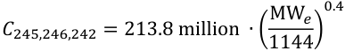

## **3.13 Reactor Instrumentation and Control (Account 227)** 

The reactor plant instrumentation and control system (which is about 2.4% of total direct costs) provides monitoring and protection for plant, personnel and equipment and enables the operator to start up, operate, and shut down the reactor. The cost breakdown of the reactor plant instrumentation and control account[h] in factory equipment, cost of site labor and of site material, in 2017 USD from (EEDB 1987), is shown in Table 35. 

Table 35 – PWR12-BE account 227 costs, from (EEDB 1987) (escalated to 2017 USD) 

||Factoryequipment|Site labor|Site material|Total|
|---|---|---|---|---|
|PWR12-BE|$37.81 million|$22.12 million|$1.93 million|$61.86 million|

In general, it is recommended to keep the costs associated with this account un-changed for different reactor technologies. 

> h It is noted that the total cost of this account was reported higher in (Ganda 2017), and it has been corrected in this report after checking for accuracy. 

## **3.14 Radioactive Waste Processing Systems (Account 224)** 

Account 224 for radioactive waste processing systems amounts to 2.3% of total direct costs for the reference PWR12-BE. 

The radioactive waste processing systems are designed to collect, process, package, store, and ship potentially radioactive wastes for recycle or for release to the environment. For the reference PWR, there are three radioactive waste processing systems: 

- Liquid waste systems; 

- Gas waste systems; 

- Solid waste systems. 

The cost breakdown of the 3 radioactive waste processing systems is shown in Table 36 for the PWR12BE: the liquid waste system contributes to more than half of the account cost (54.36%), followed by the solid waste system (38.35%), and the gas waste system (7.29%). Those percentages may be quite different for reactors that use different coolants such as gas-cooled, molten-salt and liquid-metal cooled reactors. Depending on the amount of information available on the expected waste masses and types generated by each advanced design concept, different cost approaches, with varying degrees of fidelity, are proposed in this section to estimate the total cost of the waste treatment system. 

Table 36 – Radioactive waste processing systems cost breakdown (escalated to 2017 USD) from (EEDB 1987) 

## **3.14.1 Liquid Waste System** 

Liquid waste processing systems treat liquid wastes associated with coolant treatment systems, as well as wastes associated with the general operation of the plant. The system relies upon demineralization and time delay for the decay of short-lived nuclides, in order to reduce the amounts of radioactive nuclides released as liquid wastes (EEDB 1988b). 

Liquid wastes for LWRs are divided in six streams, generated from six different sources. These streams are: 

- Non-aerated reactor coolant; 

- Aerated equipment drains; 

- Miscellaneous waste (floor drains, decontamination waste, etc.); 

- Detergent wastes; 

- Regenerant wastes; 

- Hot laboratory wastes. 

Chapter 11 of the AP1000 design control document (AP1000 2011a) shows the expected input rates for each category, under nominal conditions and sampling drains activities, with a total yearly input of liquid waste of 791,180 gallons. This amount is assumed here to be representative of the reference PWR12-BE liquid waste input. 

Therefore, the following two approaches for the costing of the liquid wastes treatment equipment are implemented in this work, depending on the level of details available for the amount and types of liquid wastes to be treated. 

1. If the annual amount of liquid wastes to be treated is known, the cost of this account can be derived in 1[st] approximation by scaling the total costs of the treatment equipment proportionally to the amount of liquid wastes to be treated. This can be done by using the unit cost of the liquid wastes’ treatment system for the reference PWR from Table 36, of $32.4 million, and the total amount of liquid wastes of a typical PWR of about 800,000 gallons per year, yielding a unit cost of 40.5 $/gallon of wastes to be treated. 

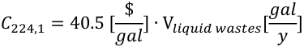

2. For cases in which the yearly generation of liquid wastes is not available (e.g. for less mature designs), the cost of this account can be set equal to that of the PWR12-BE (i.e. $32.4 million) as a first approximation. 

## **3.14.2 Gas Waste System** 

The gaseous wastes to be treated from this system for PWRs include the fission product gases removed from the volume control tank, the boron recycle evaporator, the reactor coolant drain tank and the reactor vessel. Additionally, the hydrogen contained in the volume control tank is removed through the system, eliminating a potential explosive constituent and reducing the amount of radioactive gas stored. 

Therefore, in first approximation, the amount of radioactive gases to be treated will depend on the release of fission products from the fuel, into the coolant or in other parts of the plant. In turn, the amount of gaseous fission products released from failed fuels depends both on the reactor fission rate (i.e. on the thermal power) and on fuel cladding’s failure rate. It is noted that charcoal beds are typically used in the gaseous radwaste system, and the required amount of charcoal is roughly proportional to the flow rate of the radioactive gases to be treated, but not sensitive to the released rate of gaseous fission products from the failed fuels (Lichtenberger 2018, Underhill 1980). However, there does not appear to be a clear proportionality between the power level of the plant and the gas flow rate to be treated (Neeb 1997). Therefore, even though the assumed fuel cladding failure rates could be different per reactor types, in first approximation the cost of the gas waste system should be kept unchanged from that of the reference PWR, at $4.3 million. 

To quantify the cost of radioactive waste gas processing systems for plants that are expected to generate larger amount of gaseous wastes per energy produced, such as for example molten-salt cooled reactors with fissile material dissolved in the salt, it will be necessary to perform detailed bottom-up cost estimates, accounting for the necessary equipment to process the gaseous effluents, on a case-by-case basis. An approach is discussed in the next section to calculate the cost of tritium control equipment, which may need to be considered separately for plants where large amount of tritium gas wastes need to be treated during operations. 

## _**3.14.2.1 A Note on the Cost of Treatment for Tritium Gas**_ 

For reactors for which the gaseous wastes are expected to include large amount of tritium (for example certain molten salt reactors, especially if fissile material is dissolved in the coolant), the system has to be equipped with components to treat gas streams containing tritium. For the molten salt reactor design shown in (Robertson 1971), for example, the flow of the main radioactive isotopes that are processed in the gas waste system in nominal operation is shown in Table 37. The main elements are isotopes of Krypton and Xenon, and Tritium. 

Table 37 – MSBR flow of elements into gas waste system (Robertson 1971) 

The flow of fission gases Krypton and Xenon depends on the thermal power of the reactor. 

Tritium, on the other hand, before being processed by the gas waste system, has to be converted to tritiated water in a tritium oxidizer. A cost estimate of $30M (in 2017 USD) was found for the tritium control system for the AHTR (Ingersoll 2004), for a production rate of tritium of 0.215 g/GWd at BOL, as shown in Table 38. The unit cost of tritium treatment equipment can then be calculated as about $140 million/(g/GWd), and the cost of the tritium control system for other nuclear plants can be then assumed to be proportional to the amount of tritium produced, as: 

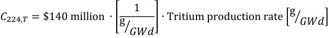

(Stempien 2016) and (Briggs 1971) give tritium production rates for different nuclear reactor designs, summarized in Table 38. For example, the cost of tritium control for a standard PWR would be estimated at about $0.2 million according to the methodology described here. This is a small fraction of the $4.3 million of the gaseous wastes treatment system, as expected. 

Table 38 – Tritium production rates 

## **3.14.3 Solid Waste System** 

The radioactive solid system is designed to collect, process and store the radioactive solid wastes generated by the reactor plant operation and maintenance. All solid wastes are processed through a volume reduction system, which reduces the volume of radioactive materials for off-site disposal, in order to reduce the disposal cost of solid wastes (which typically is calculated by volume). Water recovered from the volume reduction system is processed in the liquid waste system. 

Solid wastes include (EEDB 1988b): 

- Demineralizer resins; 

- Evaporator and process concentrates; 

- Expended filter cartridges; 

- Other miscellaneous solid waste and refuse. 

In general, it is observed that a substantial amount of solid wastes is generated from the treatment of the reactor coolant, primarily spent resins and evaporators’ concentrates: therefore, in first approximation, the cost of the solid wastes treatment system can be scaled proportionally to the ratio of the combined masses of the reactor primary and secondary loops of the PWR-12 and of the alternative concept, if the coolant is light water. 

For cases in which the primary coolant is not light water, the cost of the solid waste treatment equipment will have to be derived by bottom-up cost estimates, which will vary depending on the type of solid wastes, and on the final form of the solid wastes (e.g. immobilized in asphalt, concrete etc…). As a first approximation, in those cases the cost of this account for other reactor designs will be kept unchanged at the value of $22.9 million for the reference PWR12-BE, which was designed for asphalt mixing (EEDB 1988b). 

## **3.15 Auxiliary Cooling System (Account 226.7)** 

The auxiliary cooling system account (which is about 2.2% of total direct costs) includes: 

- The primary component cooling water (CCW) system (Account 226.72). 

- The nuclear service water (NSW) system (Account 226.71) 

The function of the primary _component cooling water system_ , as described in (EEDB 1988b), is to _“transfer the heat generated by various components in the reactor plant, including those performing safety-related functions, to the nuclear service water system under all modes of plant operations, including operation following a LOCA or main steam line break.”_ Additionally, the CCW acts as a barrier between radioactive systems and the environment. In turn, the function of the _nuclear service water system_ , as described in (EEDB 1988b), is to _“transfer surplus heat loads from various sources in the primary and the secondary parts of the reactor plant to the environment.”_ 

The cost breakdown for these two subsystem for the reference PWR12-BE is shown in Table 39. 

Table 39 – PWR12-BE account 226.7 costs, from (EEDB 1988b) (escalated to 2017 USD) 

||Account|Factoryequipment|Site labor|Site material|Total|
|---|---|---|---|---|---|
|Primarycomp. coolingwater system|226.72|$13.3 million|$9.1 million|$0.9million|$23.3 million|
|Nuclear service water system|226.71|$14.9million|$15.5 million|$1.5 million|$31.9million|
|TOTAL|226.7|$28.2 million|$24.6 million|$2.4 million|$55.2 million|

Those two sub-systems are both necessary, in general, for alternative reactor designs, since several components require active water cooling to safely perform their functions, such as for example the oil coolers of various pumps, cooling of spent fuel storage, residual heat removal etc. 

Consequently, the cost of these systems can be generally scaled with the thermal power of the plant (MWth), since the size of the components to be cooled will, in first approximation, be proportional to the thermal power of the reactor, as: 

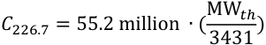

Important exceptions are Na-cooled reactors, for which several components that would require cooling through the CCW and NSW in standard PWR would instead simply be cooled by primary sodium (Vilim 2018). For this reasons, for Na-cooled reactors, while a small amount of cooling is likely still required, it will be a substantially simpler set of systems as compared to PWR. Therefore, a better approximation is to assume that the cost of account 226.7 is zero for Na-type reactors (Vilim 2018). 

Additionally, for advanced designs that have a large degree of passive features, a detailed comparative analysis of which components are still present (and need active cooling) as compared to a PWR could be performed: the method suggested above would otherwise overestimate the cost of this sub-system for those plants. 

Future work should address this cost with more details for advanced concepts, including for Na-cooled concepts. 

## **3.16 Reactor Coolant Pumps and Drives (Account 221.1111)** 

The cost of the Reactor Coolant Pumps and Drives is not directly available in (EEDB 1987) for the reference PWR design, since the parts of NSSS system that were purchased directly from the vendors are reported as a single “NSSS vendor quote”. The NSSS includes, among other components, also the _reactor coolant pumps and drives_ . For this reason, in this section, costs models for these components based on other sources were developed. 

## **3.16.1 Factory Equipment Cost** 

(EMWG 2007) suggests to use a scaling law based on the pump motor power, and an exponent of 0.41. Westinghouse experts, through private conversations on this issue (Ferroni 2016), suggested instead to use a scaling law based on the impeller diameter, and 2 as the scaling exponent. Reference (Phung 1987) suggests instead to scale pumps factory equipment costs, with an exponent of 0.52, using the C/H factor, as shown in Table 40, which is defined as the product between the volumetric flow rate and the pressure drop as: 

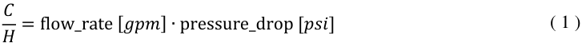

Table 40 – Pumps equipment cost scaling, from (Phung 1987) 

|Size and range|Point value(1980 USD)|Exponent|
|---|---|---|
|4,000 – 200,000 C/H factor|$2,000 for C/H=35,000|0.52|

For the reference PWR, each pump has a 94,600 gpm flow rate and a 132.22 psi pressure drop (EEDB 1987b): therefore the C/H factor is 12,508,012, well above the cost correlation range of Table 40. Therefore, the cost correlation of (Phung 1987) should be checked with the available data before being applied to the cost of large primary pumps. 

(Reidy 2016) reports details about a contract for Curtiss-Wright Electro-Mechanical Division facility in Cheswick, Pennsylvania to provide 16 reactor coolant pumps for the 2 AP1000 plants reactors under construction in China (Sanmen units 1 and 2, and Haiyang units 1 and 2). The contracts are reported to be worth about $500 million, which is equivalent to $31.2 million per pump, or $125 million per reactor, considering that each AP1000 requires four primary pumps. This cost information was confirmed through private conversations with Yinan Wang (Wang 2018), the “Enterprise and Cost Manager Expert” of the “Planning and Project Management Department” of the State Nuclear Power Engineering Company (SNPEC), China, which is the builder of the four Chinese AP1000, with the caution that the total includes also the variable speed drives, switchgears and other fees. 

Table 41 shows the main operating parameters and costs of the pumps for the AP1000, the LMFBR and the MSBR, for which pump cost data could be found, respectively in (AP1000 2011), (Combustion Engineering 1978) and (Robertson 1971), and converted to 2017 dollars. 

Table 41 also includes the equipment cost as it would be calculated using the ratios of the C/H, and a scaling exponent of 0.52, as suggested by (Phung 1987). It is observed that the agreement is good for both the LMFBR and the MSBR pumps, with the (Phung 1987) correlation overestimating the cost of the sodium pumps by less than 10%, and underestimating the cost of the MSR pumps by about 25%. However, it is also noted that in the case of the MSBR pump systems, the construction material has to withstand special corrosion requirements, which may partly justify the slightly higher actual cost as compared to those predicted by the (Phung 1987) correlation. 

In conclusion, it is recommended to use the correlation suggested by (Phung 1987) to calculate the cost of primary pumps, starting from the AP1000 cost data, as shown in the following Equation: 

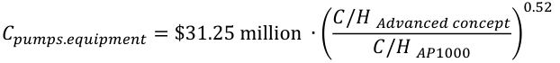

This correlation was shown to be approximately valid also for pumped fluids other than water. As an example application, the expected cost of the reference PWR12-BE are calculated with this approach, as shown in Table 41. 

Table 41 – PWR12-BE and AP1000, and MSBR Main coolant pumps factory equipment parameters 

## **3.16.2 Installation Cost** 

The site labor and material costs of the reference PWR12-BE’s primary pumps are used as a reference to calculate the installation cost of this component for other reactor design, as a percentage of the pump factory equipment costs. The factory equipment cost, as calculated in the previous Section 3.16.1 for the PWR12-BE of $31.31 million per pump, was used as reference. The site labor and material costs from (EEDB 1987) were used to calculate the site labor and material costs as a percentage of factory equipment cost. The costs, escalated to 2017, along with the percentages of site labor and material costs over factory equipment are shown in Table 42. 

Table 42 – PWR12-BE reactor coolant pumps cost breakdown (escalated to 2017 USD) 

||Cost|Cost/equipment cost|Ref.|
|---|---|---|---|
|Factory equipment|$125.24 million|-|From Section 3.16.1|
|Site labor|$4.4 million|3.5%|(EEDB 1987)|
|Site material|$0.4 million|0.3%|(EEDB 1987)|

In conclusion, the site labor and material costs for primary pumps installation are calculated as: 

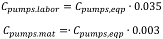

The installation cost of the reactor coolant pump and drives is included in the total “field” cost of the reactor core coolant system, described in Section 3.19. 

## **3.17 Various Buildings Comprising More than 1% of the Total Direct Costs of the Reference PWR12-BE (Accounts 215, 218A, 216 and 217)** 

In order to avoid the need to develop a bottom-up cost model for each of the various buildings of a nuclear plant, an approximate construction cost estimation approach is utilized here as a first-order approximation, which instead makes use of the bottom-up cost model for the primary containment (described in Section 3.2), to be corrected by a factor that is derived as the ratio between the calculated and the actual cost of each building from (EEDB 1987b). The estimation of the cost of this building for different reactor designs, can then be estimated using this approach and the correction factor derived for the reference PWR12-BE in this Section. The correction factor is a quantification of the cost savings derived from constructing other building to a lower structural standard as compared to the primary containment. 

## **3.17.1 Primary Auxiliary Buildings and Tunnels (Account 215)** 

The Primary Auxiliary Buildings and Tunnels (Account 215) houses auxiliary nuclear equipment, such as heat exchangers, pumps, demineralizers, filters, tanks, ventilation equipment and residual heat removal equipment, and contributes about 2.0% of the direct construction costs of the reference PWR. 

In (EEDB 1988b), the “Primary Auxiliary Buildings and Tunnels” is described as “ _a reinforced concrete Seismic Category I structure [..] on a four feet thick reinforced concrete foundation. […] The exterior walls, interior walls and floor slabs of the primary auxiliary building are reinforced concrete. The exterior walls are a minimum of two feet thick. The floor slabs are cast-in-place concrete over metal deck_ 

_and supported on steel framing. The roof slab is reinforced concrete covered with elastomeric roofing.”_ Additionally, the following dimensions are provided: 79 feet wide, 145 feet long and three stories or 91 feet high, with an approximate volume of 1,140,000 cubic feet. 

With these geometrical and construction information, and by utilizing the same unit cost per surface and per volume of construction that was derived for the primary containment building (please see Section 3.2), the cost of this building was calculated by the ACCERT code as $48.62 million, which is 7.6% cheaper than the actual cost reported in (EEDB 1987b), of $52.64 million in 2017 dollars.  Additionally, the following assumptions were made, since the relevant information was not found in the technical reference manual of the PWR12-BE: 

- The roof thickness was assumed to be the same as that of the walls (i.e. two feet), with a similar amount of reinforcement for the concrete; 

## **3.17.2 Control Room/Diesel Generator Building (Account 218A)** 

The Control Room/Diesel Generator Building (Account 218A) is divided in two parts. One part, comprising the diesel-generator building, houses the emergency diesel-generator units, their associated equipment and the diesel engine fuel oil storage tanks. The other portion of the structure, comprising the control room building, houses the necessary instrumentation and control equipment essential for plant operation under normal and abnormal conditions. The Control Room/Diesel Generator Building comprises about 1.6% of the total direct costs of the PWR12-BE. 

In (EEDB 1988b), the “Control Room/Diesel Generator Building” is described as “ _a reinforced concrete Seismic Category I structure [..] on a four feet thick reinforced concrete base slab located at grade. […] The exterior walls, interior walls and floor slabs are reinforced concrete. The exterior walls are a minimum of two feet thick.”_ 

The building is divided in two main parts: the part of the building comprising the control room and the essential switchgear building is 90 feet wide, 138 feet long and four stories or 103 feet high, with an approximate volume of 1,180,000 cubic feet, while the diesel generator and fuel oil storage part of the building is 90 feet wide, 93 feet long and two stories or 58.5 feet high, with an approximate volume of 610,000 cubic feet. 

With these geometrical and construction information, and by utilizing the same unit cost per surface and per volume of construction that was derived for the primary containment building (please see Section 3.2), the cost of this building was calculated by the ACCERT code at $65.52 million for the part of the building comprising the control room and the essential switchgear building, and at $26.65 million for the part of the building comprising the diesel generator and the fuel oil storage part of the building, for a total calculated cost of $92.17 million, which is 78.7% higher than the actual cost reported in (EEDB 1987b), of $51.6 million in 2017 dollars.  Additionally, the following assumptions were made, since the relevant information was not found in the technical reference manual of the PWR12-BE: 

- The roof thickness was assumed to be the same as that of the walls (i.e. two feet), with a similar amount of reinforcement for the concrete; 

## **3.17.3 Waste Processing Buildings (Account 216)** 

The Waste Processing Building (Account 216) houses liquid, solid and gaseous radioactive waste processing and boron recovery equipment, and comprises about 1.6% of the total direct costs of the PWR12-BE. 

In (EEDB 1988b), the “Waste Processing Buildings” is described as “ _a partially reinforced concrete Seismic Category I structure with some wall and roof sections of other materials in the Non- Seismic Category I portions of the building [..] on a four feet thick reinforced concrete foundation. […]_ 

_The exterior walls, interior walls and floor slabs of the primary auxiliary building are reinforced concrete. The exterior walls are a minimum of two feet thick. The floor slabs are cast-in-place concrete over metal deck and supported on steel framing. The roof slab is reinforced concrete covered with elastomeric roofing.”_ 

Additionally, the following dimensions are provided: 80 feet wide, 150 feet long and four stories or 120 feet high, with an approximate volume of 1,350,000 cubic feet. 

With these geometrical and construction information, and by utilizing the same unit cost per surface and per volume of construction that was derived for the primary containment building (please see Section 3.2), the cost of this building was calculated by the ACCERT code as $65.84 million, which is 60.8% higher than the actual cost reported in (EEDB 1987b), of $40.95 million in 2017 dollars.  Additionally, the following assumptions were made, since the relevant information was not found in the technical reference manual of the PWR12-BE: 

- The roof thickness was assumed to be the same as that of the walls (i.e. two feet), with a similar amount of reinforcement for the concrete; 

## **3.17.4 Fuel Storage Buildings (Account 217)** 

The Fuel Storage Building (Account 217) houses new and spent fuel, associated pool cooling and cleaning systems, and decontamination and shipping areas., and comprises about 1.1% of the total direct costs of the PWR12-BE. 

In (EEDB 1988b), the “Fuel Storage Building” is described as “ _a reinforced concrete Seismic Category I structure and supported on a four feet thick reinforced concrete foundation. […] The spent fuel storage area is constructed of thick reinforced concrete walls and floor. They are lined on the inside surfaces with continuous seam welded stainless steel plates for leak-tightness. The building exterior walls, interior walls, and floor slabs are reinforced concrete. The exterior walls are a minimum of two feet thick.”_ 

Additionally, the following dimensions are provided: 97.5 feet wide, 98 feet long and 104 feet high, with an approximate volume of 675,000 cubic feet. 

With these geometrical and construction information, and by utilizing the same unit cost per surface and per volume of construction that was derived for the primary containment building (please see Section 

3.2), the cost of this building was calculated by the ACCERT code as $53.33 million, which is 89.4% higher than the actual cost reported in (EEDB 1987), of $28.1 million in 2017 dollars.  Additionally, the following assumptions were made, since the relevant information was not found in the technical reference manual of the PWR12-BE: 

- The number of stories in the Fuel Storage Building is not specified in the technical reference document of the PWR12-BE (EEDB 1988b), so it is assumed to be a 3 stories building based on the building height; 

- The roof thickness was assumed to be the same as that of the walls (i.e. two feet), with a similar amount of reinforcement for the concrete; 

- A stainless steel liner was assumed to be installed in the “spent fuel storage area”, with a total area of 15,000 ft2 (i.e. about 20% of the total inside wall, floor and roof area of the building). 

## **3.17.5 Summary of Accounts 215, 218A, 216 and 217: Cost Estimations and Correction Factors** 

The result of the calculations of accounts 215, 218A, 216 and 217 are shown in Table 43, together with the corrections factors that were generated in order to estimate the cost of these building for a generic plant. 

Table 43 – PWR12-BE reactor coolant pumps cost breakdown (in 1987 USD and escalated to 2017 USD) 

More accurate bottom-up estimate for these buildings, utilizing the same approach as was developed for the containment building, can be developed in future work, if a substantially higher fidelity is desired for the estimate of their costs. 

## **3.18 Coolant Treatment and Recycle System (Account 226.4)** 

The Coolant Treatment and Recycle System account (which amount to about 1.6% of total direct costs) includes for PWRs: 

- The Chemical and Volume Control system (Account 226.41). 

- The Boron Recycle System (Account 226.42). 

The cost breakdown for these two subsystem for the reference PWR12-BE is shown in Table 44. 

The function of the “chemical and volume control system”, as described in (EEDB 1988b), is to _“maintain required water inventory in the reactor coolant system and seal water injection flow to the reactor coolant pumps. The system also controls reactor coolant water chemistry conditions, activity level and soluble chemical neutron absorber concentration; shares emergency core cooling functions; and provides means for filling, draining and pressure testing of the RCS.”_ 

Similarly, the function of the “boron recycle system”, as described in (EEDB 1988b), is to _“process the reactor coolant effluent by means of demineralization and gas stripping, and use evaporation to separate and recover the boric acid and make-up water.”_ 

Table 44 – PWR12-BE account 226.7 costs, from (EEDB 1988b) (escalated to 2017 USD) 

Equivalent functions are performed by the combined (a) “primary sodium overflow and makeup system”; (b) “primary sodium storage system”; and (c) “sodium purification system”, in the case of Na-cooled reactors. The function of each of these systems is described in Table 45 for the Na-cooled LMFBR, as an example, from (Combustion Engineering 1978). 

Table 45 Description of the systems corresponding to account 226.4 for an example Na-cooled reactor (LMFBR from (Combustion Engineering 1978)). 

For PWR and Na-cooled reactors, the functions to be performed are equivalent for the two systems. However, the higher complexity associated with Na-cooled systems results in substantially higher costs: about $117.7 million in 2017 USD for the 3 systems of the LMFBR (Combustion Engineering 1978) as compared to about $40.8 million for the equivalent systems for the reference PWR12-BE. 

The reasons for the higher cost of these systems are explained in (Combustion Engineering 1978), with a discussion of the qualitative differences between the two systems for the LMFBR and the PWR C-E System 80, both developed by Combustion Engineering. While the storage systems for the LWR purification system are expected to be more expensive than those of Na-systems, other factors that affect 

the cost differential include the Na-pumps higher costs (about a factor of two) as compared to the pumps required by the PWR systems, a higher cost (about a factor of 3) of the Na-systems heat exchangers, and a higher cost (about a factor of two) of the Na-systems purification systems, which involves primarily stainless steel filters for the Na systems as opposed to resins beds and gas strippers for the LWR. 

In summary, it is possible to use the known costs of these systems for PWR and for Na-cooled systems directly for these two types of plants, and scale the known costs linearly with the volume of coolant for similar concepts, if known, or with the thermal power level of the systems, according to Eq: 

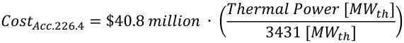

For other reactor types, and especially for MSRs, the costs of these systems can be substantially higher than those of the two systems discussed above, but no quantitative information could be developed at this point for those types of systems. Future work should address this cost with more details for advanced concepts. 

## **3.19 Reactor Core Coolant System (field cost, Account 222)** 

The reactor core coolant system installation (i.e. field cost, account 222) contributes about 1.1% of the total direct costs. This account includes the installation cost of the components of the primary circuit listed in Table 46, together with their contribution to the total installation cost. These costs are dominated by labor (about 65% of the cost of installation), followed by the factory equipment (about 30% of the total installation cost) and site material (about 5% of the cost of installation). 

Table 46 Field installation cost of the reactor core coolant system, in 1987 USD and in millions of 2017 USD, rounded 

For different reactor concepts, these costs may be eliminated if any of the equipment is not present. However, for pool type reactors, many of the installation costs are still going to be present, since several of these components will be installed in the primary pool-type vessel. 

For this reason, in first approximation it is recommended to scale linearly this cost with the thermal power of the reactor, as: 

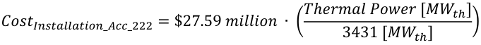

## **3.20 Reactor Coolant Piping (NSSS allocation, Account 220A.222)** 

The factory purchase cost of the reactor coolant piping is not directly available in (EEDB 1987) for the reference PWR design, since the parts of NSSS system that were purchased directly from the vendors are reported as a single “NSSS vendor quote”. The NSSS includes, among other components, also the purchase cost of the reactor coolant piping. 

The technical specifications of the primary coolant pipes that were supplied as part of the NSSS are summarized in Table 47, from (EEDB 1988b). It is observed that those pipes are all large diameter pipes (i.e. all larger than 27.5 inches) and made of stainless steel, with a total weight of 66,650 lb for the pipes and of 14,440 lb for the fittings, or 81,000 lb total. 

Table 47 Summary of large pipes that are furnished with the NSSS for the reference PWR12-BE, from (EEDB 1988b): Account 222.12523 - SS/SC1 (furnished with NSS) 

|Size (inch)|Schedule/Wall thickness|Lbs/foot|linear feet|pipe weight (lb)|fitting weight (lb)|
|---|---|---|---|---|---|
|27.5|1|288|65|18,720|4,180|
|29.0|1|305|55|16,780|3,760|
|31.0|1|327|95|31,060|6,500|
||||**Total**|**66,560**|**14,440**|

Large pipes are generally not available as seamless pipes, and will instead be fabricated by bending and welding plates (Grandy 2018). In first approximation, the cost of these components can be estimated utilizing the unit cost of stainless steel fabrication discussed in Section 3.6.3, of $310,000/ton for customer-delivered stainless steel components. Utilizing this unit cost, the total cost of NSSS-supplied primary pipes (without installation), would be $11.4 million. 

As a comparison, the 2,900 feet of stainless steel pipes and valves for the heat transport system of the LMFBR (Combustion Engineering 1978), have a cost of $132.0 million in 2017 USD, which is about 11.5 times larger than those estimated for the PWR12-BE. However, the LMFBR pipes are also 13.5 times as long (i.e. 2,900 feet for the LMFBR versus 215 feet for the PWR12-BE, from Table 47), indicating approximate consistency in the estimation. One important consideration is the thickness of the walls of those pipes, which is going to be substantially larger for PWRs as compared to Na-cooled fast reactors, due to the higher pressure. The extra cost due to the higher thickness will be somewhat compensated by the cost of the large valves (i.e. 20 valves with diameters of between 14 inches and 44 inches) included in the estimate of the LMFBR, as compared to no large valve included in the primary loop of the PWR. 

## **3.21 Lower and Upper Internals (Accounts 221.131 and 221.132)** 

The cost of lower and upper internals is not directly available in (EEDB 1987), since these components are sold as part of the NSSS, for which no breakdown is available in (EEDB 1987). Therefore, the cost of these components will be quantified in first approximation from the unit cost of fabrication of components constructed of the same materials and with the same construction technique, using the unit cost derived for the primary vessels (please see Section 3.6) and the information of cost of internals provided directly by Combustion Engineering for the LMFBR in (Combustion Engineering 1978). 

The vessel internals of the LMFBR are made of stainless steel 304, and vessel internals are mostly forged (NAF 2018). With a cost of $13.62 million in 1978 dollars (Combustion Engineering 1978), or $91.6 

million dollars using the inflation factor described in Section 2.4, and a combined weight of 292.5 tons, the unit cost of stainless steel forged internals of the LMFBR is $313,065/ton. 

The vessel internals of the typical PWR are also made of stainless steel, typically 304. For example (Combustion Engineering 1978) gives the specifications of the C-E System 80 PWR, with stainless steel 304 internals, both lower and upper, and a total weight of 453,088 lb, or 205.5 tons. A similar weight was specified for the reference PWR12-BE, of 646,000 lb (or 293.0 tons) including the core (EEDB 1988b). Knowing that a typical PWR core weights about 88 tons (Wigeland 2014), the weight of the internals for the reference PWR could be calculated as about 205 MT, matching the value of the C-E System 80. Additionally, (WEC 2011) provides detailed specifications for the internals of the typical Westinghouse PWR, which are also fabricated of stainless steel 304. 

It was discussed in Section 3.6 how the cost of finished stainless steel 304 components is, in first approximation, insensitive to the fabrication method used (forging or plates), with a unit cost of approximately $310,000/ton for nuclear-grade components. 

Therefore, using this cost for the internals, their combined costs (lower+upper) for the reference PWR12BE is approximately: 

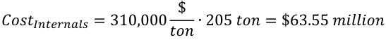

This approach is recommended to quantify approximately the cost of the internals for advanced reactor designs. For advanced design for which the internals are to be fabricated of advanced alloys other than stainless steel, a unit cost of $430,000/ton, as discussed in Section 3.6, is recommended. 

## **3.22 Control Rods (Account 221.211) and Control Rods’ Drives (Account 221.212)** 

The cost of control rods and of the control rods drives is not directly available in (EEDB 1987), since these components are sold as part of the NSSS, for which no breakdown is available in (EEDB 1987). 

Therefore, the cost of these components will be quantified in the following manner: 

- The cost of control rods is calculated using a bottom-up approach as described below; 

- The unit cost of the control rod drives provided in (Combustion Engineering 1978) for the LMFBR is used as representative of the cost of control rod drives. 

## **3.22.1 Cost of Control Rods (Account 221.211)** 

The cost of the control rods of the reference PWR12-BE was calculated by estimating the cost of the absorber material present in each rodlet, and then making the assumption that the cost of fabrication of the rodlets would be the same as that of standard LWR fuel, with a mean value of 400 $/kgHM (CBR 2017), including both the cost of fabrication and of the hardware. 

The standard PWR control rods are made of silver (80%), indium (15%) and cadmium (5%) (WEC 2011), and have a diameter of 0.95 cm and a length of 12 feet, results in a weight of about 2.6 kg per individual rodlet. With a cost of silver of about 550 $/kg as of early 2018, and for simplicity assuming that the all the material is silver[i] , the cost of each 24-rodlet control rod is calculated as $34,000. Assuming that the fabrication cost of the control rods is the same as that of standard PWR fuel, with an expected value of 400 $/kgHM including hardware, the cost of fabrication of each control rod is about $25,000, resulting in 

> i The price of indium appears slightly higher than that of silver, while that of cadmium appears substantially lower than that of both silver and indium. 

a total cost (including both material and fabrication) per control rod of about $59,000, rounded as $60,000. 

Therefore, the combined total cost of all the 53 control rods in the PWR12-BE was calculated as about $3.2 million. This unit cost can be utilized as a reference unit cost for the control rods of other designs, unless a dedicated bottom-up cost estimate is performed. In that case, the procedure developed here can be replicated. 

## **3.22.2 Cost of Control Rods Drives (Account 221.212)** 

The total cost of the control rod drives was reported in (Combustion Engineering 1978) for the LMFBR at $2.73 million in 1978 dollars (i.e. $18.4 million in 2017 dollars), for 30 control rod drives. This would result in a unit cost of $0.61 million/rod drive. 

This unit cost can be used for alternative designs, unless a detailed bottom-up estimate is available that takes into consideration the specific technical details of each control rod drives. 

Using this unit cost, for example, the total cost of the 57 control rod drives of the reference PWR12-BE would be $34.9 million. 

It is noted that the complexity of the control rod drives of the typical Na-cooled fast reactor is typically higher than that of the typical PWR: therefore the unit cost derived here for a Na-cooled design is an approximate estimate for non-Na-cooled reactors, and would overestimate the cost of control rod drives for PWRs.  However, this complexity would need to be addressed through a detailed bottom-up cost estimate of the PWR control rod drives, which is beyond the scope of this work. 

## **3.23 Pressurizer (Account 220A.224)** 

The cost of the PWR’s pressurizer is not directly available in (EEDB 1987), since this component is sold as part of the NSSS, for which no breakdown is available in (EEDB 1987). For this reason the cost of this component is quantified in first approximation from the unit cost of fabrication of components constructed of the same materials and with the same construction technique, using the values derived for the primary vessels (please see Section 3.6) 

No detailed technical specifications were found for the reference PWR12-BE (e.g. construction materials, dimensions, weight etc…), except for the following functional description: _“The conditions in the reactor coolant system are controlled by the use of a single pressurizer, where water and steam are maintained in equilibrium by electrical heaters or water sprays. Steam is formed by the heaters or condensed by the pressurizer sprays, to minimize pressure variations caused by contraction and expansion of the reactor coolant inventory. The pressurizer is a vertical, cylindrical vessel with hemispherical top and bottom heads. Electrical heaters are installed through the bottom head of the vessel while the spray nozzle, relief and safety valve connections are located in the top head of the vessel.”_ (EEDB 1988b). 

As an alternative set of technical specifications approximating those of the reference design, those of the pressurizer of the C-E System 80 PWR were found in (Combustion Engineering 1978), and are reproduced in Table 48. However, the cost of this component is not provided in (Combustion Engineering 1978). 

From the information in Table 48 it is possible to calculate the weight of the carbon steel shell of 86.6 tons (excluding the skirts, flanges and miscellaneous items), and that of the stainless steel clad of 3.3 tons. Additionally, it is deduced that the shell will be plate-fabricated, since its thickness is less than 6 inches (NAF 2018), and additionally the specifications in (Combustion Engineering 1978) mention this part as a “shell plate”. 

Table 48 Technical specifications of the pressurizer of the C-E System 80, from (Combustion Engineering 1978) 

Utilizing the unit cost of plate-built carbon steel of $75,000/tons, and that of stainless steel of $310,000/ton (please see Section 3.6), and as weight of the carbon steel part the total weight of the component, (of 100.6 tons) minus the weight of the stainless steel shell (of 3.3 tons), the total costs of this component can be calculated as $7.3 million for the carbon steel part, and at $1.0 million for the stainless steel cladding. The total cost was therefore calculated as $8.3 million. 

Additionally, the installation of the pressurizer and of the relief tank cost was found in (EEDB 1987) at 93,593 USD of 1987, or $0.27 million in 2017 USD, which is 3.2% of the factory cost. The installation cost of the reactor coolant pump and drives is included in the total “field” cost of the reactor core coolant system, described in Section 3.19. 

## **3.24 Summary of the Total Cost of the NSSS Components Analyzed in This Work for the PWR12-BE** 

In this report, cost models for the most expensive components of a reference PWR design were developed. One particularly difficult set of components are those belonging to the NSSS, for which cost information was not provided directly in (EEDB 1987). For this reason, before this work the previously existing best set of publicly available information on the NSSS costs for PWR was developed in (Holcomb 2011). However, that set of data is not sufficient for reasons explained in Section 2.1. 

Therefore, the new information developed in this work on more defensible NSSS breakdown costs, substantially advances the knowledge in this area. One important consideration, however, is to check the reasonableness of the cost models as compared to the total aggregated NSSS costs. For this reason, the cost models that were developed in this work for the most expensive NSSS components were summed and compared to the total NSSS cost as known from (EEDB 1987), as shown in Table 49. 

It is observed that the total of the most expensive components evaluated in this work is 91% of the total NSSS cost as known from (EEDB 1987), or $466.3 million out of a total of $514.7 million. Of the parts of the NSSS that were not evaluated in this work, most are expected to be substantially less expensive than the part analyzed, with the only possible exception of the residual heat removal system and of the safety injection systems. Therefore, the total estimate as calculated here appears reasonable when compared to the total cost of (EEDB 1987). 

Table 49 total of the NSSS components developed in this work for the reference PWR12-BE. 

## **4. EXAMPLE OF CODE APPLICATION TO ANOTHER REACTOR DESIGN: ABR1000** 

The approach developed in this work (in Chapter 3) to calculate the cost of alternative reactor designs is demonstrated in this Chapter using the ABR1000 (Grandy 2007) as an example.  The work presented in this Chapter is an extension of the previous analysis in (Ganda 2017), with both the addition of new cost models (to all the components that contribute more than 1% of the direct costs of the reference PWR12BE) and the improvement of several cost models from (Ganda 2017), as discussed in Chapter 1. 

The Advanced Burner Reactor (ABR1000) is a 1,000 MWth, 380 MWe pooled-type, sodium cooled fast reactor, based on a traditional steam Rankine cycle (Grandy 2007). Compared to a standard PWR, the reactor is characterized by a higher power density (kW/liter) and higher primary and secondary temperatures, as shown in Table 50. 

Table 50 – PWR12 and ABR1000 parameters (EEDB 1987) and (Grandy 2007) 

||PWR12|ABR1000|
|---|---|---|
|Thermalpower(MW)|3431|1000|
|Electricpower(MW)|1144|380|
|Rejected thermalpower(MW)|2287|620|
|Power density (kW/liter)|104.5a|255|
|Core outlet temperature(°C)|326|510|
|High-pressure turbine inlet temperature(°C)|283|454|

a (Buongiorno 2010) 

As described in Chapter 2, the ABR1000’s _direct costs_ will be evaluated by focusing on the thirty accounts that contribute more than 1% of the direct costs, and for which cost models were developed in this work. These accounts give a cumulative contribution of 83.4% of the total direct costs for the reference PWR12-BE. Afterwards, the assumption will be made that the costs that were not directly evaluated for the ABR1000 will constitute the same fraction of total direct costs as in the case of the reference PWR12-BE, or 16.6%. In this way, the total _direct costs_ of the ABR1000 can be estimated using the cost models developed in this work. 

Finally, the expected overnight total cost of the ABR1000 can be derived by using the fraction of _indirect, owner and contingency costs to direct costs_ for the reference PWR12-BE, under the assumptions that the percentage of these three cost categories is not expected to change substantially between different reactor construction projects, if well executed (the PWR12-BE fractions are for well executed projects, or “Better Experience”, from (EEDB 1988b)). 

## **4.1 Evaluation of the Costs of the Major Components of the ABR1000** 

In this Section, the cost models developed in Chapter 3 for each of the most expensive components, are applied to the ABR1000 as an example of the use of the cost estimating algorithm developed in this work. 

## **4.1.1 Turbine Generator** 

The model for the turbine generator was not changed in this report as compared to (Ganda 2017): consequently the numerical example is also unchanged from (Ganda 2017). 

The high-pressure turbine inlet pressure of the ABR1000 is 155 bar: this pressure is not within the ranges analyzed directly in Section 3.1, therefore the closest matching range was chosen: the 166-167 bar shown in Figure 1. The turbine generator factory equipment cost is then calculated using the interpolating function calculated based on the data analyzed in Section 3.1, and shown in Figure 1, as: 

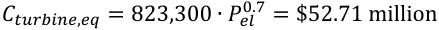

Other turbine-related equipment is: 

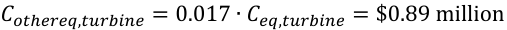

Therefore, total equipment cost related to the turbine is: 

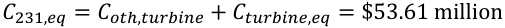

The site labor and material costs are: 

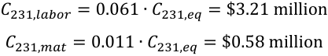

The total turbine generator cost is then: 

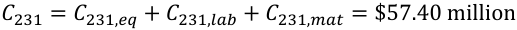

Table 51 – Account 231 cost summary (2017 USD) 

||Account|Factoryequipment|Site labor|Site material|Total|
|---|---|---|---|---|---|
|231|Turbinegenerator|$53.61 million|$3.21 million|$0.58 million|57.4 million|

## **4.1.2 Reactor Containment Building** 

The reactor containment model was improved as compared to (Ganda 2017), as described in Section 3.2: consequently the numerical results in this section have been recalculated as compared to (Ganda 2017). 

The reactor building dimensions of the ABR1000 are shown in Table 52, while an elevated view of the containment building is shown in Figure 5, from (Grandy 2007). 

The ABR1000 has a round shape, with length (L) and width (W) being the diameter of the containment. The square building housing the steam generators, outside of the containment, was not included in this example calculation. 

Table 52 – ABR1000 reactor building dimensions 

|Height,H|166 ft|50.60 m|
|---|---|---|
|Length,L|100 ft|30.48 m|
|Width,W|100 ft|30.48 m|

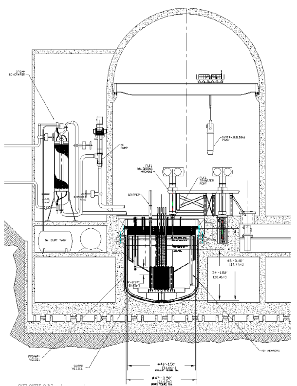

Figure 5 Elevated view of the containment building of the ABR1000, from (Grandy 2007). 

The walls, basemat and dome thicknesses, which could not be found for the specific ABR1000 containment, were assumed to be the same as those of the reference PWR12-BE[j] : 

> j It is noted that, based only on accident scenarios, substantially thinner walls may be sufficient for a sodium-cooled, metal-fueled fast reactor design such as the ABR1000. However, it is expected that thicker walls, similar to those of PWRs, may be required based on external events and design-basis-threats. Therefore, the same wall thicknesses as for PWRs was assumed here on a conservative basis, and in the absence of specific data. Additionally, the wall thickness was found to be of secondary importance, in terms of total costs, as compared to other parameters such as the building dimensions: for example, in order to study the sensitivity of costs to the containment thickness, a calculation was performed with a reduction in half of the wall thicknesses, resulting in a relatively minor reduction in total costs from $81.4 million to $73.6 million. 

- Wall thickness of 1.3716 m, from (EEDB 1988b); 

- Dome thickness of 1.067 m, from (EEDB 1988b); 

- Basemat thickness of 3.048 m, from (EEDB 1988b); 

- Void fraction of the building: 91.7%, calculated as the ratio between the total volume and the “free volume” from (EEDB 1988b); 

- Height (H) of 166 ft, as reported in (Grandy 2007), is from the basemat to the top of the curved roof. 

From these parameters, the following are calculated: 

- Basemat surface (Sbase); 

- Basemat volume (Vbase); 

- Walls surface (Swalls); 

- Walls volume (Vwalls); 

- Roof surface (Sroof); 

- Roof volume (Vroof); 

- Building internal surface (Sint); 

- Building internal volume (Vint); 

The basemat surface and volumes are calculated as: 

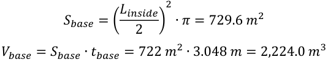

Only one side is considered in the basemat when calculating its total surface, since the other side will be facing the ground below the containment. 

The roof’s surface is calculated as: 

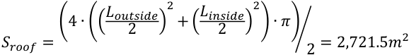

Two sides are considered in the roof, the inside and the outside, and the shape is hemi-spherical, so only half of the full sphere is considered. 

The roof volume is calculated as: 

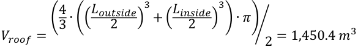

The walls surface and the walls volume are calculated as: 

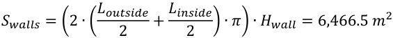

Considering that the surface includes both the inside and outside surfaces. Where _Hwall_ is 166-50 ft=116ft (35.3 m). 

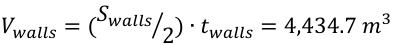

The building internal total volume is: 

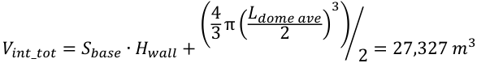

The volume of the internal structures (Vint) is calculated as: 

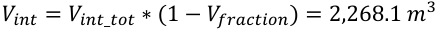

Surface of internal structures (approximate) (Sint), calculated as: 

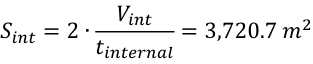

Liner Surface (Sliner), calculated as: 

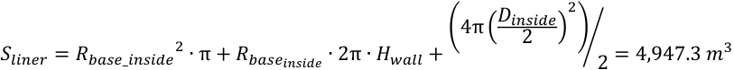

The area to be painted (Spaint), calculated as: 

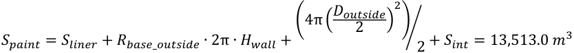

The total volume of the structures (Vstructures_tot), calculated as: 

The cost of each item is calculated as a multiplication between the ABR1000 unit parameter and the PWR12-BE unit costs, which were provided in Section 3.2. 

For example, the formwork substructure labor and material costs are calculated as: 

The costs of “building services” were calculated using the improved approach described in Section 3.2.2. 

The costs breakdowns of account 212.1 (reactor building structure) and 212.2 (building services) are summarized in Table 53.  The resulting total containment cost of the ABR1000 was calculated as $81.42 million. 

Table 53 – Account 212 cost summary (2017 USD) 

## **4.1.3 Heat Rejection System Mechanical Equipment (Account 262) and Condensing Systems (Account 233)** 

The “heat rejection system and mechanical equipment”, and the “condensing systems” costs for the ABR1000 were calculated by scaling the rejected thermal power with an exponent of 0.8, as discussed in Sections 3.3 and 3.4, using cost data from Table 19 and from Table 20. 

Factory equipment costs are: 

Site labor costs are: 

Site material costs are: 

Finally, total costs are: 

Costs of accounts 262 and 233 are summarized in Table 54. 

Table 54 – Account 262-233 cost summary (2017 USD) 

## **4.1.4 Air, Water and Steam Service Systems** 

The Air, Water and Steam Service Systems account is left unchanged at a total of $81.8 million for the ABR1000 design, as shown in Table 55, as recommended in Section 3.5, under the assumption that the services of this account will also be necessary for the ABR1000 design. 

Table 55 – PWR12-BE account 252 costs (from (EEDB 1987), escalated to 2017 USD) 

## **4.1.5 Reactor Vessel** 

The ABR1000 reactor’s vessel (in Figure 6) has an inside diameter of 14.1 meters ( _DRPV_ ), a height of 14.8 meters ( _H_ ) and a thickness of 5.08 centimeters ( _tRPV_ ), and is made of Type 304 stainless steel (Grandy 2007). The geometry can be approximated as a cylinder with a disc lower base, with the same thickness as the cylinder. 

In addition, there is a top cover plug with a diameter of 14.5 m ( _Dtop Plug_ ) and a depth of 2.49 m ( _ttop Plug_ ), made of carbon steel (Grandy 2007), and a guard vessel, also made of carbon steel. The cost of the vessel internal structures is discussed in the “internals” Section 3.21. 

The volumes of the cylinder and of the bottom head are then calculated as: 

Considering a steel density of 7.850 tons/m[3] , the reactor vessel mass of stainless steel (including the cylinder and the bottom heads) is 323.7 tons. 

With a unit cost of stainless steel construction of $310,000/ton, as derived in Section 3.6.3, the cost of the vessel (excluding the cover plug) is quantified as $100.35 million. 

Figure 6 Cross sectional view of the pool-type primary system of the ABR1000, from (Grandy 2007). 

The guard vessel is fabricated of carbon steel, “ _to permit the use of a magnetic attachment of a remote device used during the ISI [In Service Inspections] of the reactor and guard vessels, and to reduce plant capital cost”_ (Grandy 2007). With a diameter of 14.62 m, a height of 13.73 m and a thickness of 1 cm, the total weight can be calculated as 62.7 tons. 

Since this component is fabricated of carbon steel plates, its total cost can be calculated using a unit cost of $75,000/ton, resulting in a total cost of $4.7 million. 

The top cover plug has a “box structure”, as shown in Figure 7, in order to reduce its weight (Grandy 2007). The calculation of the weight of the cover plug was estimated approximatively from the drawing in Figure 7, with the information that the plug is _“constructed of steel plates, rings, and penetration cylinders, all welded together”_ , (Grandy 2007). The thickness of all the plates and cylinders is 1.5 inches, with the exception of the inner ring that supports the rotating plug, which is 6 inches thick. The weight of the plug was then estimated approximatively at 300 tons, including the weight of the rotating plug covers, with a carbon steel density of 7.85 g/cm3. 

From Section 3.6, the unit cost of finished carbon steel plate-built components is $75,000 tons, resulting in a cover plug cost of $22.33 million. This amount should be considered approximate, because of the approximate method used to estimate the dry weight of the plug: a more accurate estimate of the weight will be needed in the future to better estimate the cost of this component, even though the cost of this part is of second order importance as compared to the cost of the stainless steel vessel shell. 

Figure 7 Diagram of the ABR1000 reactor vessel top deck with top plate removed, from (Grandy 2007). 

In summary, the total fabrication cost of the stainless steel vessel, of the carbon steel guard vessel and of the carbon steel cover plug of the ABR1000 was estimated as $127.38 million, dominated by the cost of the stainless steel vessel. 

The site labor and material costs were calculated from the total mass of the vessel, including the vessel head, using correlations developed in Section 3.6.5. 

The total vessel cost (summarized in Table 56) is therefore: 

𝐶𝐶𝑅 𝑅𝑅 = 𝐶𝐶𝑅 𝑅𝑅.𝑒 𝑒𝑒 + 𝐶𝐶𝑅 𝑅𝑅.𝑙 𝑡𝑡𝑜𝑜𝑡𝑡 + 𝐶𝐶𝑅 𝑅𝑅.𝑚𝑚𝑙𝑙𝑡𝑡 = $ (127.4 + 8.0 + 1.0) 𝑚 𝑚 𝑚𝑚𝑡𝑡𝑛𝑛 = $131.4 𝑚 𝑚 𝑚𝑚𝑡𝑡𝑛𝑛 

Table 56 – Account 221.12 cost summary (2017 USD) 

## **4.1.6 Yardwork (Account 211)** 

Costs of account 211, yardwork, are approximated as being the same as the respective costs of the reference PWR12-BE. These costs are summarized in Table 57 

Table 57 – Account 211, yardwork, cost summary (2017 USD) 

## **4.1.7 Steam Generators and Intermediate Heat Transport System (Account 222.13)** 

In the ABR1000, in addition to the steam generators, there is an intermediate heat transport system, the cost of which will be also evaluated here. The intermediate heat transport system provides a connection between the primary reactor coolant and the steam generator systems: it is made of four independent loops, each featuring a sodium-to-sodium intermediate heat exchanger (IHX), an intermediate sodium pump, intermediate piping and a steam generator for each of the four intermediate heat transport system loops. 

## _**4.1.7.1 IHX of the ABR1000**_ 

The cost of the IHX is estimated in this section, starting from geometrical and material data provided in (Grandy 2007). As discussed in Section 3.8.1, the factory equipment cost can be calculated from the total weight and material of the components. The construction material is 9Cr-1Mo (Grandy 2007), and consequently the cost of the finished component can be quantified as $140,000/ton, as discussed in Section 3.8. 

The geometrical and other relevant parameters of the IHX are provided in Table 58, and the design details are shown in Figure 9, from (Grandy 2007). 

Figure 8 Representation of the intermediate heat transport system of the ABR1000 (Grandy 2007) 

From the geometrical parameters of Table 58 the total dry weight of each of the IHX can be calculated as about 14.9 tons. With a unit cost of $140,000/ton the cost of each of the four IHX would then be $2.08 million, for a calculated factory cost of the IHX system of $8.33 million. 

The site labor and material costs were calculated as fractions of factory equipment costs: 

Therefore, the total cost of the IHX, including installation, is $8.55 million. 

Figure 9 Schematic representation of the IHX of the ABR1000 (Grandy 2007) 

Table 58 Technical parameters of each of the IHX of the ABR1000, from (Grandy 2007), used for the cost quantification performed in this Section 

|Number of IHX|4||
|---|---|---|
|Tube outer diameter|1.59|cm|
|Tube wall thickness|0.0889|cm|
|Active tube length|478|cm|
|# of tubes|4500||
|Upper tube sheet A|2.25|m2|
|Upper tube sheet t|0.1|m|
|Lower tube sheet A|2.25|m2|
|Lower tube sheet t|0.1|m|
|Downcomer piping OD|61|cm|
|Downcomer piping t|1.27|cm|
|Downcomer piping L|1080|cm|
|Outlet piping OD|86.4|cm|
|Outlet piping t|1.27|cm|
|Outlet piping L|660|cm|

## _**4.1.7.2 Steam Generators of the ABR1000**_ 

The cost of the ABR1000’s steam generators (SG) is estimated in this section, starting from geometrical and material data provided in (Grandy 2007). As discussed in Section 3.8.1, the factory equipment cost can be calculated from the total weight and material of the components. The construction material is 2- 1/4-Cr-1-Mo (Grandy 2007), and consequently the cost of the finished component can be quantified as $140,000/ton (please see Section 3.8.1). 

The geometrical and other relevant parameters of the IHX are provided in Table 59, and the design details are shown in Figure 10, from (Grandy 2007). 

Table 59 Technical parameters of each of the SG of the ABR1000, from (Grandy 2007), used for the cost quantification performed in this Section 

|Number of SG|4||
|---|---|---|
|Tube outer diameter|3.18|cm|
|Tube wall thickness|0.59|cm|
|Active tube length (each)|9850|cm|
|# of tubes|184||
|Shell thickness|3.81|cm|
|Vessel OD|281|cm|
|SG height|2072|cm|
|Shell height (assume spherical heads)|1791|cm|
|Tube sheet thickness|8.89|cm|
|Elliptical head thickness|4.45|cm|

From the geometrical parameters of Table 59 the total dry weight of each of the SG can be calculated as about 144 tons. With a unit cost of $140,000/ton, the factory cost of each of the four SG is $20.18 million, for a calculated total factory cost of the four SGs of $80.72 million. 

The site labor and material costs were calculated as fractions of factory equipment costs: 

The total costs installed cost of the four SGs are then: 

Figure 10 Schematic of the ABR1000 steam generators (Grandy 2007) 

## _**4.1.7.3 Intermediate pumps of the ABR1000**_ 

Conventional mechanical pumps are the reference choice for the intermediate transport system of the ABR1000 (Grandy 2007). The cost of the four intermediate pumps was calculated from the AP1000 pumps costs based on the C/H parameter, using an exponent equal to 0.520, as described in Section 3.16, and considering that the C/H ratio of the AP1000 is 28,743,750 [gpm∙feet-head]. 

The technical specifications of the intermediate pumps of the ABR1000 are shown in Table 60, while the calculated C/H parameters are shown in Table 61. 

The cost of each pump can then be calculated as: 

Consequently, the factory cost of the 4 intermediate pumps is calculated as $29.60 million. 

Table 60 Technical characteristics of the intermediate sodium pumps of the ABR1000, from (Grandy 2007). 

Table 61 C/H parameters of the ABR1000 (from Section and for the ABR1000 from Table 60 

|**Reactor**|**Flow rate**|**Pump head**|**C/H [gpm∙feet-head]**|
|---|---|---|---|
|AP1000|78,750 [gpm]|365 [feet head]|28,743,750|
|ABR1000|1.476 [m3/sec] = 23395.1 [gpm]|0.23 [MPa] = 76.95 [feet head]|1,800,181|

The site labor and material costs for the pumps’ installation were calculated as fractions of factory equipment costs: 

The resulting total cost of the pumps is: 

## _**4.1.7.4 Intermediate heat transfer system of the ABR1000, summary costs**_ 

In summary, the total cost of the intermediate heat transport system, including the steam generators (account 222.13) was calculated as: 

The contributions of the various components of this account are summarized in Table 62. 

Table 62 – Account 222.13 cost summary (2017 USD) 

## **4.1.8 Feedwater Heating Systems (account 234)** 

This system is not present in the ABR1000, since water is preheated directly in the steam generators. For this reason the cost of this account is set to $0.0. 

## **4.1.9 Turbine Room and Heater Bay (Account 213)** 

The costs of the _turbine room and heater bay building_ for the ABR1000, was estimated according to the approach described in Section 3.10: by scaling from the respective PWR12-BE reference costs based on the thermal power, using an exponent equal to 0.8. The factory equipment cost for this account is available from (EEDB 1987). 

The factory equipment cost is then calculated as: 

The site labor cost is: 

The site material cost is: 

In summary, the total cost of the turbine room and heater bay building (summarized in Table 63) was calculated as: 

Table 63 – Account 213, Turbine room and heater bay building cost summary (2017 USD) 

## **4.1.10 Other Turbine Plant Equipment (Account 235)** 

The costs associated with the Other Turbine Plant Equipment (Account 235) are calculated according to the approach described in Section 3.11: as a fraction of the cost of the ABR1000’s turbine generator of $57.4 million (Account 231, calculated in Section 4.1.1), as: 

Table 64 – Account 235 cost summary (2017 USD) 

## **4.1.11 Miscellaneous electrical equipment (accounts 242, 245, 246 and 241)** 

Costs of _station service equipment_ (account 242), _electric structure and wiring_ (account 245), _power and control wiring_ (account 246) and _switchgear_ (account 241) were scaled through the electrical power, using an exponent equal to 0.4, as discussed in Section 3.12. 

Factory equipment costs are: 

The site labor and material costs were calculated with the same scaling law, as: 

The total costs are then: 

𝐶𝐶242 = 𝐶𝐶242.𝑒 𝑒𝑒 + 𝐶𝐶242.𝑙 𝑡𝑡𝑜𝑜𝑡𝑡 + 𝐶𝐶242,𝑚𝑚𝑙𝑙𝑡𝑡 = $36.98 million 

Costs of accounts 242, 245 and 246 are summarized in Table 65: the total cost of the three electrical accounts combined is $114.1 million. 

Table 65 – Accounts 242, 245 and 246 cost summary (2017 USD) 

## **4.1.12 Reactor Instrumentation and Control (Account 227)** 

The factory, site labor, and site material costs of accounts 227, _Reactor Instrumentation and Control_ for the ABR1000 were assumed the same as the costs of the adjusted PWR12-BE, as described in Section 3.13. 

Table 66 – ABR account 227 (reactor instrumentation and control) costs, from (EEDB 1987) (escalated to 

## **4.1.13 Radioactive Waste Processing System** 

Since the annual production rates of solid, liquid and gaseous wastes of the ABR1000 were not found, the costs of this account were calculated using approximate methods, as discussed in Section 3.14. 

The costs of the liquid, gaseous and solid waste systems were assumed the same as those of the reference PWR12-BE, of $32.4 million, $4.3 million and $22.9 million, respectively. 

The gaseous waste system includes the cost of tritium treatment, which is evaluated as: 

In the ABR1000, there are multiple sources for tritium generation, which include boron in control rods and shields, lithium in the coolant as impurity, and ternary fissions. The tritium forms a sodium-hydride, and the reaction rate is dependent on the temperature of the liquid sodium. Since the tritium dissolved in the primary coolant sodium is recovered in the cold trap, the ABR1000 does not have extra sodium treatment system. The cost of the tritium subsystem can therefore be calculated as zero for the ABR1000. 

In summary, the cost of the waste treatment system of the ABR1000 was calculated as $56.6 million, with the breakdown in (a) factory equipment, (b) site labor and (c) site materials for the 3 subsystems shown in Table 67. 

Table 67 – Accounts 224 cost summary for both the PWR12-BE and the ABR1000 (2017 USD) 

## **4.1.14 Reactor Coolant Pumps** 

The ABR1000 design allows the use of either mechanical or electromagnetic (EM) primary pumps (Grandy 2007). Conventional mechanical pumps appear to be the reference choice for the ABR1000 (Grandy 2007), and a specific cost model for EM pumps has not been developed in this work. Consequently, the cost model developed in Section 3.16 for mechanical pumps will be used to estimate the cost of the reactor coolant primary pumps for the ABR1000. The design parameters of the primary pumps of the ABR1000, from (Grandy 2007), are shown in Table 68. 

Table 68 Design parameters of the primary pumps of the ABR1000, from (Grandy 2007) 

The cost of the four primary pumps is calculated from the AP1000 pumps costs based on the C/H parameter, using an exponent equal to 0.520, as described in Section 3.16 and similarly to what was done for the intermediate pumps (please see Section 4.1.7.3). 

The ABR1000 has four primary coolant pumps, each with a flow rate of 1.51 m[3] /s and a head of 110 psi (Grandy 2007). The flow rate is equivalent to 23,934 gpm. The C/H ratio for each of the four ABR1000 pumps is then: 

The factory equipment cost of each of the primary coolant pumps for the ABR1000 are consequently: 

Consequently, the factory equipment cost of the 4 primary pumps is calculated as $57.81 million. 

The installation cost of this component is included in the reactor core coolant system’s field cost, in Section4.1.21, and it will not be duplicated here. 

## **4.1.15 Auxiliary cooling system** 

As discussed in Section 3.15, the cost of this system for Na-cooled reactor is approximated as $0.0. 

## **4.1.16 Various Buildings: Primary Auxiliary Buildings and Tunnels; Control and Diesel Generator Building; Waste Processing Building and Fuel Storage Building** 

A summary of the dimensions of the various ABR1000 building is provided in Table 69. 

Table 69 Summary of the dimensions of the various ABR1000 buildings, from (Grandy 2007) 

## _**4.1.16.1 Primary Auxiliary Buildings and Tunnels (Account 215)**_ 

The primary auxiliary buildings and tunnels for the PWR12-BE appears to be identified as the balance of plant services building, since it is described in (Grandy 2007) as hosting equipment performing similar function as the Primary Auxiliary Buildings and Tunnels for the PWR12-BE. 

The building dimensions are 100 ft by 90 ft, with a height of 20 ft indicating a single-story building. Other assumptions for the calculations are that the walls, roof and basemat thicknesses are the same as for same type of building for the reference PWR12-BE, i.e. 2 ft thick walls and roof, and 4 ft thick basemat of reinforced concrete. No steel liner is assumed to be present in this building, even though it is likely that the painting will be chosen such that decontamination can easily be accomplished if necessary. 

The total cost of this building was calculated as $11.52 million utilizing the containment construction criteria. Afterwards, the cost-reduction correction factor for this building identified in Section 3.17.1 was -7.6%, which, when applied, yields a best estimate for the construction cost of the primary auxiliary buildings and tunnels of $12.47 million. 

## _**4.1.16.2 Control and diesel generator building (Account 218A)**_ 

The control and diesel generator building function of the reference PWR12-BE appears to be split between the control/personnel building and the emergency generator building in the ABR1000. 

Consequently, the cost of this account will be calculated as the sum of the two buildings, and to each will be applied a correction factor of 78.7%, found in Section 3.17.2. 

The emergency generator building dimensions are 100 ft by 30 ft, with a height of 12 ft indicating a single-story building. Other assumptions for the calculations are that the walls, roof and basemat thicknesses are the same as for same type of building for the reference PWR12-BE, i.e. 2 ft thick walls and roof, and 4 ft thick basemat of reinforced concrete. No steel liner is assumed to be present in this building, even though it is likely that the painting will be chosen such that decontamination can easily be accomplished if necessary. 

The total cost of emergency generator building was calculated as $3.43 million before the correction, and after a cost-reduction correction factor of 64.6% was applied to the calculated cost, the resulting cost is $2.08 million. 

The control/personnel building dimensions are 131 ft by 96 ft, with a height of 30 ft, assumed to be a 2- stories building. Other assumptions for the calculations are that the walls, roof and basemat thicknesses are the same as for same type of building for the reference PWR12-BE, i.e. 2 ft thick walls and roof, and 4 ft thick basemat of reinforced concrete. No steel liner is assumed to be present in this building, even though it is likely that the painting will be chosen such that decontamination can easily be accomplished if necessary. 

The total cost of emergency generator building was calculated as $23.32 million before the correction, and after a reduction by 1.646 was applied to the calculated cost, the resulting cost is $14.17 million. 

The total cost of this building was calculated as $16.47 million, as shown in Table 70. 

Table 70 Total cost of the control and diesel generator building (Account 218A) 

||Cost calculated before correction|Corrected cost bya factor of 1.646|
|---|---|---|
|emergency generator building|$3.43 million|$2.08 million|
|control/personnel building|$23.32 million|$14.17 million|
|**Total cost of account 218A**||**$16.25 million**|

## _**4.1.16.3 Waste Processing Building (Account 216)**_ 

The waste processing buildings for the PWR12-BE is identified as a combined radwaste and maintenance building in the case of the ABR1000. 

The building dimensions are 120 ft by 200 ft, with a height of 40 ft of one part of the building and a height of 80 ft on the other part of the building. Since additional detail on the division of floor space between the two buildings, and on the number of stories of each are not provided, the following assumptions are made: 

- The floor space is divided equally between the two height, therefore each of the two part is assumed to have dimensions of 120 ft by 100 ft; 

- Each of the two building is a single-story building, since it is indicated that the space is utilized initially during the construction of the plant, thus likely requiring a high bay for the on-site assembly of large equipment. Afterwards, the building is maintained for extraordinary maintenance, as needed. 

Other assumptions for the calculations are that the walls, roof and basemat thicknesses are the same as for same type of building for the reference PWR12-BE, i.e. 2 ft thick walls and roof, and 4 ft thick basemat of reinforced concrete. No steel liner is assumed to be present in this building, even though it is likely that the painting will be chosen such that decontamination can easily be accomplished if necessary. 

The correction factor for this building identified in Section 3.17.3 is a factor of 1.608. The total cost of waste and maintenance building (for the part with a 40 ft height) was calculated as $23.08 million before the correction, and after the cost-reduction correction factor is applied, the resulting cost is $14.35 million. 

The total cost of waste and maintenance building (for the part with a 80 ft height) was calculated as $39.23 million before the correction, and after the cost-reduction correction factor is applied, the resulting cost is $24.40 million. 

The total cost of this building was calculated as $38.75 million, as shown in Table 71. 

Table 71 Total cost of the waste and maintenance building (Account 216) 

## _**4.1.16.4 Fuel Storage Building (Account 217)**_ 

A description (including dimensions) of the fuel storage building is not directly provided in (Grandy 2007), and consequently the cost of this building could not be directly estimated. However, a “fuel handling facility is mentioned several times throughout the (Grandy 2007) document. Additionally, it is mentioned that _“[the] ABR might need interim spent fuel storage or/and a shipping cask handling facility outside reactor building. Interim spent fuel storage provides long term and lager capacity storage for spent fuels before they are shipped to fuel recycle facilities. If ABR do not equip any interim storage, ABR at least need a shipping cask handling facility with buffer storage, a spent fuel cleaning facility and shipping cask handling facility like the fuel handling cell (FHC)”_ , (Grandy 2007). 

Therefore, it is apparent that a separate fuel building will be needed, and since no details are provided for this building, it is assumed here, in first approximation, to have the same cost as the corresponding reference PWR spent fuel handling facility, the cost of which is described in Section 3.17.4. While the ABR reactor has a smaller power level than a standard PWR, it is also recognized that spent fuel with higher burnup and with sodium as a coolant, may increase the handling complexity, and consequently of the cost of a properly equipped building. 

The cost of the fuel handling facility of the ABR1000 is therefore approximated at $28.15 million in 2017 USD, as shown in Table 72 

Table 72 Summary of the cost of the Fuel Storage Building (Account 217) of the ABR1000. 

## **4.1.17 Coolant Treatment and Recycle** 

The cost of the coolant treatment and recycle system is described in Section 3.18. For Na-cooled reactors, this system includes the following subsystems: 

- The primary sodium overflow and makeup system; 

- The primary sodium storage system; and 

- The sodium purification system. 

The cost of this sub-systems combined was found to be substantially higher than that of the equivalent systems for PWRs, with reasons explained in Section 3.18. 

The cost of this system is then calculated using the recommended approach of Section 3.18, with the following equation: 

## **4.1.18 Reactor Coolant Piping (NSSS allocation)** 

The ABR1000 system is a pool-type reactor, with the reactor core, primary pumps, intermediate heat exchangers, and direct reactor auxiliary cooling system heat exchangers all immersed in a pool of sodium coolant within the reactor vessel, as shown in Figure 6, with the result that very little actual “piping” is needed for the primary loop. 

The in-vessel structure that provides a similar function to the standard piping of non-pool-types reactors, such as for example the PWR12-BE, is the “redan”, which is described in (Grandy 2007) as “ _a single integrated unit that separates the hot sodium pool from the cold sodium pool, and provides the flow path of the hot sodium from the discharge of the reactor core to the inlet of the intermediate heat exchanger. It consists of multiple formed plates welded together to form a shell that surrounds the intermediate heat exchangers and the upper internal structure. The redan is supported vertically and seal welded to the core barrel. It is essentially a cylindrical/conical vessel, but without either a top head or bottom head. The intermediate heat exchangers and upper internal structure are located within the redan. The primary pumps and DRACS heat exchangers are located in cylindrical shells (that separate the hot sodium from the cold sodium) in the conical portion of the redan.”_ (Grandy 2007). 

Additionally, there is a certain amount of primary piping within the reactor vessel, described as: _“There is very little primary piping within the reactor vessel assembly. The primary piping exists between the mechanical pump and the inlet plenum. The coolant that flows through the pump will flow into a multipipe header that connects the articulated coupling to the inlet plenum structure. This primary piping would consist of a main header for each pump with multiple pipes leading from each pump header into the inlet plenum structure. The main header has a spherical seat that is connected to a flexible coupling. The other end of the internal piping is welded to the core inlet plenum.”_ (Grandy 2007). 

In summary, since they are inside the reactor vessel, and since no information was found about the exact dimensions, weight, and materials of these components, it was considered more effective to include those components with the estimate of the costs of the upper and lower internals, in Section 4.1.19. Instead, the cost of the intermediate piping system is quantified here as the equivalent system to the NSSS-supplied piping system of the reference PWR12-BE. 

The intermediate piping system is fabricated of stainless steel, have an outside diameter of 61 cm, a thickness of 1.74 cm and a total length of 53 meters on the hot leg and of 39 meters on the cold leg. Therefore their total weight is 24.1 ton. 

With a unit cost of fabricated stainless steel of $310,000/ton (please see Section 3.20), the total cost of this component is calculated as $7.46 million. 

## **4.1.19 Internals (NSSS Allocation)** 

No complete set of information was found about the dimensions, weight, and materials of the upper and lower internal components of the ABR1000, even though it can be deduced that they will likely be made of stainless steel, as most of the other components that are in direct contact with sodium. 

The total weight of the internals can be estimated in first approximation by analogy with other reactor concepts for which this quantity is known, such as for example the reference PWR12-BE (EEDB 1988b) and the LMFBR (Combustion Engineering 1978). 

In the case of the LMFBR, the vessel shell weights 324.5 tons, while the internals weight 292.5 tons. Assuming, in first approximation, the same ratio of weights “internals/vessel-shell” for the ABR1000 as for the LMFBR, would yield a total weight of the ABR1000 internals of 291.6 tons. 

Using the known (from Section 3.6) unit cost of finished nuclear grade stainless steel components of $310,000/ton, both for forged and for plate-fabricated components, as was discussed in Section 3.21, would yield a total cost of the vessel internals of the ABR1000 of: 

It is highlighted that this cost is highly approximate, since it is derived from the unknown weight of the vessel internals. In order to develop estimates with a higher degree of accuracy, the exact total weight of the internals should be used in the future. 

## **4.1.20 Control Rod and Control Rod Drives** 

The ABR1000 has a total of 22 control rod assemblies, 15 “primary” control rod assemblies and 7 “secondary” control rod assemblies (Grandy 2007). 

The unit cost of each of the control rod assemblies of the Na-cooled LMFBR, discussed in Section 3.22.2, is used as the unit cost of the control rod assembly of the ABR1000. The total cost of the control rod drives was reported in (Combustion Engineering 1978) for the LMFBR at $2.73 million in 1978 dollars (i.e. $18.4 million in 2017 dollars), for 30 control rod drives. This would result in a unit cost of $0.61 million/rod drive. Therefore, the total cost of the control rod drives of the ABR1000 is calculated as 

The cost of the control rods was calculated using a bottom-up approach in Section 3.22.1, for Ag-In-Cd standard PWR control rods, resulting in a unit cost of $60,000. The ABR1000 are made of B4C, using both natural and enriched boron. While the cost of boron enrichment is not known at this point, in general B4C will be a cheaper material than the 80% Ag material of standard PWR control rods. However, the cost of enrichment may well bring the cost of B4C above that of Ag. For this reason, it is assumed that 

each control rod of the ABR1000 will have the same fabrication cost of those of the reference PWR12BE, resulting in a preliminary estimate of the total cost of control rods of $1.32 million, calculated as: 

## **4.1.21 Reactor Core Coolant System (Field Cost, Account 222)** 

This account includes the installation cost of the components of the primary circuit, together with their contribution to the total installation cost. Most of these components will be installed inside the pool-type vessel of the ABR1000. As recommended in Section 3.19, this cost is scaled linearly with the thermal power of the reactor, starting from the installation cost of the PWR12-BE, as: 

## **4.1.22 Pressurizer (NSSS Allocation)** 

While the Na-cooled ABR1000 does not have a pressurizer, (Combustion Engineering 1978) suggests that the sodium expansion tanks (there are 4 in the LMFBR system) constitute an equivalent system, for a total cost of $780,000 in 1978, or $5.2 million in 2017 USD. 

This cost is assumed to be the basis for the expansion tanks of the ABR1000, scaled by the ratio of the thermal power of the ABR1000 (1000 MWth) as compared to the LMFBR (3800 MWth): 

## **4.2 Cost Summary** 

In the preceding Sections 4.1.1 to 4.1.22, the cost of the most expensive components of the ABR1000, as an example, was evaluated using the cost models developed in this work.  As described in Section 2, the analysis was extended in this work to all the component that contribute more than 1% to the direct costs of the reference PWR12-BE, for a total of 30 cost models developed and applied in this example. In order include in the ranking also the components for which the costs was not known from (EEDB 1987) (i.e. the components supplied as part of the NSSS), the approximate cost from (Holcomb 2011) was utilized to develop a preliminary ranking of these components. Afterwards, more detailed cost models were developed in this work and the components were re-sorted based on the higher fidelity estimate of the NSSS components analyzed. 

This same set of components was evaluated for the ABR1000. The summary of each of those costs is presented in Table 73. 

The lower power of the ABR1000, combined with its higher working temperature and power density, provides a cost reduction for most accounts (in blue in the table). Certain items’ costs were not changed from the values available for the reference PWR12-BE (in black in the table), mostly because these costs 

are largely independent on the reactor design, such as for example the _reactor instrumentation and control_ . Two items were found to be more expensive for the ABR1000 as compared to the PWR12-BE (in red in the table): (1) the reactor vessel was found to be about 90% more expensive, primarily because of the use of stainless steel as compared to carbon steel, and of its larger size and weight; and (3) the internals were found to be about 40% more expensive, primarily based on the higher estimated total mass of the internal components of the ABR1000[k] . All the other items were found to be cheaper for the smaller ABR1000, and the cost reduction was found to be particularly large with the turbine generator and related equipment. This is because it was found that turbine generators costs are strongly dependent on the steam quality, which can be substantially higher for liquid-metal-cooled reactors such as the ABR1000. 

As shown in Section 2.3, the accounts for which costs were directly evaluated, give a cumulative contribution of 83.4% to the total direct cost of the PWR12-BE. Therefore, under the assumptions described in Section 2.3, the total direct costs can be estimated by dividing the estimated cost by 83.4%, yielding total direct costs of $1.48 billion for the ABR1000: 

The indirect costs for the reference PWR12-BE are 60.9% of direct costs (Ganda 2015). Using this fraction to estimate the indirect costs also of the ABR1000, gives a total of $900.5 million for the indirect costs. 

Owner’s and contingencies costs are each typically about 10% of the combined direct and indirect costs, yielding a total value of $475.8 million for the ABR1000 for these two accounts combined. 

Overall, the total cost of the accounts considered was found to be about 45% lower for the ABR1000 as compared to the reference PWR12-BE. However, since the ABR1000 has a substantially lower electrical output, its specific cost (in $/kWe) was found to be about 67% higher than that of the PWR12-BE. 

In summary, as shown in Table 74, the overnight cost of the ABR1000 was estimated at $2.8 billion using the models of this work, as compared to an overnight cost of $5.1 billion for the reference PWR12-BE. 

It is important to note that the higher unit cost of the ABR1000 should not be taken as an indication of the cost differential between LWRs and fast reactors, primarily because the ABR1000 is a single module, non-optimized fast concept with conventional technology. Other sources of cost estimates for advanced design concepts concluded instead that fast reactors could be comparable or even cheaper than conventional LWRs, per unit of electrical output. For example, both the Japan Sodium-cooled Fast Reactor (JSFR) and the BN1200 are claimed to have a lower unit cost than LWRs according to their design teams (Hill 2018), whereas on the other hand, the PRISM concept was estimated to cost about 20% more than LWRs; however that included a dedicated fuel cycle facility (Hill 2018).  Additionally, the cost models developed in this work and applied to the ABR1000 as an example in this Chapter are approximate and will need to be refined in the future if a higher degree of fidelity is required for advanced concepts. 

> k However the actual detailed specifications of the internals of the ABR1000 were not found, including their weight and dimensions, and consequently the confidence in this estimate is low. It is possible that, with more detailed information, the estimated cost of these components may change substantially. 

Table 73 – ABR1000 direct cost estimate (millions of 2017 USD). In black: accounts unchanged; in blue and red: accounts for which the cost of the ABR1000 was found to be cheaper and more expensive, respectively, than for the PWR12-BE. 

Table 74 – Derivation of the total cost for the ABR1000 direct cost estimate 

## **5. COST MODELS FOR FUEL CYCLE FACILITIES** 

Work was initiated in this report on developing cost models for other fuel cycle facilities, with specific focus on fuel fabrication and reprocessing facilities. 

The capital cost associated with non-reactor facilities is typically divided into “building related” and “equipment-related”. 

Building costs for reprocessing and fuel fabrication facilities can be calculated using the unit costs for the various parts of the fabrication that were developed for the reactor containment building, under the assumption that the building requirements (resistance to impacts, sabotages, seismic resistance etc…) of reprocessing and fuel fabrication facilities would be similar to those of reactor containments. Alternatively, adjustment factors can be developed if the cost of reference buildings is known from other sources, similarly to the approach described in Section 3.17 for reactor non-containment buildings. 

Equipment costs are obviously very specific to each fuel cycle facility, so few generalizations are possible. However, a few considerations have been developed in this section to guide the estimation of the cost of fuel cycle facilities. 

- Section 5.2.2 includes the floor area required, and the cost of the processing equipment, for an LEU oxide fabrication facility. Such information can be used to guide the cost estimation of similar facilities, or of facilities including similar steps. 

- The cost of generic processing equipment (e.g. tanks, evaporators, separators, etc…) can be obtained from generic chemical engineering cost textbooks, e.g. (Peters 2003). Afterwards, adjustments need to be made to incorporate the more stringent requirements of nuclear operations, the possible use of exotic materials to resist more aggressive operational environments while at the same time providing for long component lives, and stricter construction tolerance to allow easy remote maintenance. (Long 1978) reports an increase in cost for nuclear chemical operations ranging from 10% for plate products to 60% for tubular products due to the inspection requirements of advanced materials; an additional 50% increase in costs due to the high quality welding requirements, and an additional 30-40% increase in costs due to the inspections required for nuclear processing equipment. In summary, (Long 1978) recommends to double the costs of high quality standard chemical components to arrive at the expected costs of nuclear-grade chemical equipment. 

- Additionally (Long 1978) reports the costs of specialized nuclear equipment, such as shielded cells, shielding windows, radioactive gas filters, and remote-control manipulators. However, the information in (Long 1978) is based on technology from the 1970s, and it is possible that technological advancements may have reduced the cost of those components. Alternatively, since the number of suppliers of specialized nuclear equipment has diminished considerably since the 1970s, it is also possible that the cost of such equipment may have increased in the intervening years. 

## **5.1 Building capital cost model for reprocessing and fuel fabrication facilities** 

Building costs for reprocessing and fuel fabrication facilities can be calculated using the unit costs for the various parts of the fabrication that were developed for the reactor containment building, under the assumption that the building requirements (resistance to impacts, sabotages, seismic resistance etc…) of reprocessing and fuel fabrication facilities would be similar to those of reactor containments. Under this assumption, the unit costs of construction, and the bottom up containment cost model developed in Section 3.2 for reactor containments, can be applied to those of other fuel cycle facilities. 

Typically, reprocessing and refabrication buildings have a rectangular rather than a circular footprint, and a flat roof rather than a curved dome. Additionally, there could be intermediate floors, which are typically absent in reactor containment buildings. 

For this reason, a geometrical model of containment buildings was generated for geometries with rectangular floor plans and with flat roofs, as shown below, where the numerical parameters were chosen for a rectangular-prismatic containment with an area and total volume similar to the cylindrical containment with hemispherical dome of the PWR12-BE (please see Section 3.2): 

- Containment total height (Htot)=188 ft; 

- Basemat thickness (tbase)=10 ft; 

- Containment outside Length (Loutside)=133.0 ft; 

- Containment outside Width (Woutside)=134.0 ft; 

- Wall thickness (tshell)=4.5 ft; 

- Roof thickness (tdome)=3.5 ft; 

- Void fraction of the inside of the containment (Vfrac)=91.7%;[l] 

- Internal wall average thickness (tinternal)=4 ft;[m] 

- Reactor cavity area (Sreactor_cavity)=11,000 ft[2] . 

From the above-parameters, the following geometrical dimensions were calculated: 

- Basemat surface (Sbase), calculated as[n] : 

- Basemat volume (Vbase), calculated as 

- Walls surface of the shell (inside + outside) (Swalls), calculated as: 

- Walls volume (Vwalls), calculated as 

> l The void fraction of the inside of the containment was calculated as the ratio of the “free volume” of 2.8E6 ft3 (provided in (EEDB 1988b)) and the total inside volume of the containment (Vint_tot), of 3.0E6, calculated using the containment dimensions with the corresponding equation provided above. The volume occupied by mechanical equipment such as the NSSS, auxiliary tanks, piping etc… was in first approximation neglected for this estimate. 

> m The average thickness of the internal walls was not provided in reference (EEDB 1988b). Therefore, it was approximated based on information provided on the thickness of 2 major internal containment structures: (1) the _Primary Shield Wall_ , a shielding wall that surrounds the primary vessel, of 6ft thickness, and the _Secondary Shield Wall_ , a four feet thick octagon shaped reinforced concrete wall enclosing the reactor coolant piping, steam generators, reactor coolant pumps and their supports. Other minor structures have generally smaller thickness. 

> n Only one side is considered in the basemat when calculating its total surface, since the other side will be facing the ground below the containment. 

- Dome surface (Sdome), calculated as 

𝑆𝑆𝑜 𝑚𝑚𝑒𝑒 = �1 + 𝑁 𝑚𝑚𝑡 𝑡𝑡𝑒𝑒𝑡 _𝑓𝑓𝑙𝑙𝑜 𝑡𝑡𝑏𝑏�∙�(𝐿𝐿𝑜𝑜𝑡 𝑏𝑏𝑡𝑡𝑜𝑜𝑒𝑒 ∙𝐺𝐺𝑜𝑜𝑡 𝑏𝑏𝑡𝑡𝑜𝑜𝑒𝑒) + (𝐿𝐿𝑡 𝑏𝑏𝑡𝑡𝑜𝑜𝑒𝑒 ∙𝐺𝐺𝑡 𝑏𝑏𝑡𝑡𝑜𝑜𝑒𝑒)�=  3,201.7 𝑚𝑚[2] 

- Dome volume (Vdome), calculated as: 

- Building internal total volume (Vint_tot), calculated as: 

- Volume of internal structures (approximate) (Vint), calculated as: 

- Surface of internal structures (approximate) (Sint), calculated as: 

- Liner Surface (Sliner), calculated as: 

𝑆𝑆𝑙𝑙𝑡 𝑒𝑒𝑡𝑡 = 2 ∙(𝐿𝐿𝑡 𝑏𝑏𝑡𝑡𝑜𝑜𝑒𝑒 + 𝐺𝐺𝑡 𝑏𝑏𝑡𝑡𝑜𝑜𝑒𝑒) ∙�𝐻𝐻𝑤𝑤𝑙 𝑙𝑙 −𝑡𝑡𝑡𝑡𝑜 𝑓𝑓�+ 2 ∙(𝐿𝐿𝑡 𝑏𝑏𝑡𝑡𝑜𝑜𝑒𝑒 ∙𝐺𝐺𝑡 𝑏𝑏𝑡𝑡𝑜𝑜𝑒𝑒) = 11,937.0 𝑚𝑚[3] 

- The area to be painted (Spaint), calculated as: 

𝑆𝑆𝑒𝑒𝑙𝑙𝑡 𝑡𝑡 = 𝑆𝑆𝑙𝑙𝑡 𝑒𝑒𝑡𝑡 + 2 ∙(𝐿𝐿𝑜𝑜𝑡 𝑏𝑏𝑡𝑡𝑜𝑜𝑒𝑒 + 𝐺𝐺𝑜𝑜𝑡 𝑏𝑏𝑡𝑡𝑜𝑜𝑒𝑒) ∙𝐻𝐻𝑤𝑤𝑙 𝑙𝑙 + (𝐿𝐿𝑜𝑜𝑡 𝑏𝑏𝑡𝑡𝑜𝑜𝑒𝑒 ∙𝐺𝐺𝑜𝑜𝑡 𝑏𝑏𝑡𝑡𝑜𝑜𝑒𝑒) + 𝑆𝑆𝑡 𝑡𝑡 = 34,756.0 𝑚𝑚[3] 

- The total volume of the structures (Vstructures_tot), calculated as: 

## **5.2 Comparison with previous cost studies of fuel cycle facilities buildings.** 

## **5.2.1 Comparison with the (Landmark 2015) study** 

A recent estimate of the cost of a building is provided in (Landmark 2015), for a 100 MT/y pyroprocessing facility with oxide reduction before reprocessing, but no refabrication of the reprocessed fuel. 

The cost estimate for the pyrochemical facility, for which a detailed technical design was prepared by ANL, was developed by Merrick & Company, a builder with experience in the construction/management of complex projects. The work was sponsored by the Landmark foundation. 

The fuel processing facility was estimated to be the most expensive building, at $84.5 million without contingencies and at $105.7 million with a 25% contingency. The building dimensions are not provided directly in (Landmark 2015), but a detailed site-plan plot was provided. From the plot, it was deduced that the “Fuel Processing Building” footprint could be approximated by a rectangle with sides of 180 ft and of 135 ft. The height of the building was not found: therefore it was approximated as a total of 35 ft to include vertical space for the working cells (about 10 ft), space to maneuver equipment in-to and out-of 

the cells (about 10 ft), and 10 ft of clearance for the rail crane and for the crane’s maintenance. The last 5 ft include the thickness of the roof, which is assumed to be 5 ft of reinforced concrete to offer maximum protection of the building from outside impact. 

The walls, both outside and inside, were approximated also as 5 ft concrete, as was assumed in (EAS 2008) for an aqueous reprocessing facility. 

The internal void fraction was assumed to be 80%, lower than the void fraction of reactor containment buildings, since it is likely that the volume of this facility will be more occupied that a containment. The thickness of the internal walls was assumed to be 4 feet, to provide shielding. 

A steel liner was assumed to cover all the internal surfaces, as is customary for reprocessing facilities, in order to facilitate surface decontamination as necessary. 

The calculated cost of such a building (without contingency) was found to be $83.3 million, very close to the value of $84.5 million without contingency found by Merrick & Company. 

It is interesting to note that the bottom-up approach utilized here offers insight into the optimal construction of such buildings, which would not be available when utilizing simple unit cost per volume or area of the building, as is instead often done for those structures. 

For example, in Table 75 it is shown that the model estimated a unit cost of 10,366 $/ft[2] for the reactor containment, and a substantially smaller cost of 3,428 $/ft[2] for the landmark building. On the other hand, the model also calculated a unit cost of 61 $/ft[3] for the reactor containment, and a substantially larger cost of 122 $/ft[3] for the reprocessing building, showing how the use of scaling laws could be misleading. 

Table 75 Unit cost (per unit area and per unit volume) of a reactor containment and of a reprocessing facility, as calculated by the ACCERT code. 

## **5.2.2 Cost Model for the LEU Oxide Fabrication Facility from the NASAP Program, and Unit Cost** 

(ORNL 1979) includes a detailed cost analysis of an LEU oxide fuel fabrication facility, performed for the NASAP program in 1978. Additional reports considering the fabrication cost of alternative fuels have also been developed within the same program, and use (ORNL 1979) as the starting point of the analysis. The cost of fabrication of different (and generally more complex) fuels have then been developed as “modifications” to the detailed cost estimate of (ORNL 1979). 

In (ORNL 1979) a detailed flowsheet is first developed, and afterwards estimates are provided for the floor space necessary for each of the flowsheet functions, plus supporting functions. The facility total throughput was estimated at 2 MTHM/day, working 260 days/year in a 24/7 shift system. This results in a total annual throughput of 520 MTHM/year. 

## _**5.2.2.1 UOX Fabrication Equipment Cost**_ 

An estimate in 1979 dollars of the cost of the equipment for each of the steps of the flowsheet is provided in Table 76, and both the required floor space and the equipment costs are collected. 

The information in Table 76 is very valuable, since it is the only break-down identified so far of the equipment cost of a UOX fabrication facility. This information can be used in future work as a starting point, in order to develop the costs of fabrication for fuel types other than oxides. 

Table 76 Required floor space and equipment cost (from (ORNL 1979)) for the fabrication of LEU oxide fuel. 

The total equipment cost was $34 million in 1978 dollars, or $228.6 million in 2017 dollars using the escalation approach discussed in Section 2.4. 

## _**5.2.2.2 Building Cost**_ 

It is observed that the total required floor area is estimated at 100,000 ft[2] . The dimensions of the building were not provided, so the footprint was arbitrarily set at 400x250 ft to reach 100,000 ft[2] on a single floor, with a building height of 35 ft and structural requirements similar to those of reactor containments, considering that the required physical protection of such facility is likely to be high. No steel liner is provided for the interior of the building, since it is not expected that extensive decontamination should be required for a facility that processes only uranium. However, it is expected that the inside surfaces will be painted with a coating that can be decontaminated fairly easily. 

The exterior walls are made of reinforced concrete with a thickness of 1 ft, and the roof at 1 ft, similar to a standard PWR containment. The void fraction is set at 80%, similar to the fraction used in Section 5.2.1 for the (Landmark 2015) building cost evaluation. The interior walls are also assumed to be 1 ft thick. 

Using the bottom-up cost model developed here for this building, yield a total cost of $305.3 million, in 2017 dollars. 

## _**5.2.2.3 Total and Unit Cost of the NASAP Facility, as an Example, and Comparison to the (CBR 2017) Reference Cost Values**_ 

Applying to both the building and the equipment costs a contingency of 10%, and indirect costs of 20% of total direct costs (as typical for chemical plants, (Peters 2003)), would yield a total overnight construction cost of $705 million in 2017 dollars. With an expected facility lifetime of 50 years, a discount rate and interest during construction of 5%, and a construction time of 4 years, the annual charges would be $42.2 million, or 81.2 $/kgHM when normalized per unit throughput. 

The facility annual O&M, including personnel, administration and overhead, materials (including all the assembly hardware but excluding the enriched uranium itself), plus all the chemicals used in the fabrication process, and the utilities, are $36.4 million in 1978 dollars, or $216.6 million in 2017 dollar (using the escalation index[o] from (CBR 2017) from 1978 to 2017, of 5.95). Consequently, the unit O&M cost is calculated as 416.5 $/kgHM. 

In sum, the total fabrication cost for LEU oxide is calculated as 81.2 $/kgHM + 416.5 $/kgHM = 498 $/kgHM, dominated by the O&M costs. 

This value is within the range of values derived in the Cost Basis Report (CBR 2017) for the fabrication of LEU oxide fuel, with a low, mode and high of respectively 230 $/kgHM, 400 $/kgHM, 575 $/kgHM. 

> o For O&M costs the escalation index proposed in (CBR 2017) is considered more appropriate than the one proposed in Section 2.4, which is instead primarily focused on construction cost escalation for nuclear project. 

## **6. CONCLUSIONS AND RECOMMENDED FUTURE WORK** 

This report describes the development of an algorithm to estimate the capital cost of advanced nuclear reactor designs. 

This work continues and expands the activity initiated in FY17 (Ganda 2017), with the same fundamental approach and several improvements and additions to the (Ganda 2017) previous work, with the primary objective of improving the fidelity, and consequently the credibility and usefulness, of the algorithm. 

First, a reference design was adopted (a standard PWR), for which detailed and defensible cost information were found based on historical data. Afterwards, the individual components of the reference PWR were sorted in decreasing order of importance, in terms of the fractional contribution of each to the total direct cost of the plant; and cost models were developed for each of the 30 most expensive components of the reference PWR, including all those that provide a contribution to the total direct cost larger than 1%, with a cumulative contribution to the direct cost of about 84%.  By focusing primarily on the most expensive components, it is possible to tailor the algorithm to the desired degree of fidelity, at the expense of larger efforts for more robust estimates. 

Most of the cost models developed in this work are directly applicable to other reactor designs: for example, a detailed bottom-up cost models for the containment building was developed in Section 3.2, which is based on extracted unit costs for the labor and material required for the installation of all the major structures, from formwork to rebar and cadwelds, and on the geometrical parameters of the building. This approach can be used to perform cost estimates of reactor buildings of other sizes and shapes, or even for other building having similar functional characteristics, such as for example the highly secured and reinforced reprocessing facilities’ buildings. Similarly, detailed analyses of actual construction data (both nuclear and non-nuclear) were performed to establish cost estimating methods for other components, such as the steam turbine generator. 

However, certain cost models are applicable directly only to reactors similar to PWRs, and their application to other reactor types is highly approximate. Therefore, future work should focus on extending those models to other reactor designs, on developing new cost models for those components that are unique to a specific advanced concept, and on extending the set of cost models beyond those analyzed in this work, in order to increase the fidelity and the applicability of the algorithm. 

An important advancement was achieved in this work with regard to the NSSS components, for which reliable cost breakdowns were not previously available in the public domain. Therefore, as described in Section 2.1.1, this work substantially advances the field of knowledge in this space. Cost models for the most important NSSS components were developed from a set of various sources, including the direct engagement of fabricators of large forged mechanical parts. This made it possible to compare the results of the newly developed NSSS cost models to those previously available from (Holcomb 2011), and to use the new information to re-rank the cost contributions of the most expensive NSSS components. Additionally, in order to check the reasonableness of the cost models as compared to the total aggregated NSSS costs, the calculated NSSS costs for the reference PWR12-BE were summed-up and compared to the total NSSS cost as known from (EEDB 1987), in Section 3.24. The total cost of the NSSS components evaluated in this work was found to be about 90% of the total NSSS cost of the PWR-BE, which appears reasonable, considering that only parts that are not expected to be very expensive were left out of the estimate. 

Finally, an approach to derive the total overnight costs based on the calculated direct costs was developed, based on the known historical relationships between direct costs and the other large categories of construction expenditures: namely indirect, owners’ and contingencies costs. 

The cost model and the associated algorithm were tested on the ABR1000 reactor design as an example. A complete, albeit approximate, cost estimate could be developed for the ABR1000 using the model and associated algorithm created in this work. The results showed that the ABR1000 is expected to have a 

total overnight cost about 45% lower than that of the reference PWR. However, since the power level of the ABR1000 is substantially smaller than that of the reference PWR, its unit overnight cost is expected to be higher. It is important to note that the higher unit cost of the ABR1000 should not be taken as an indication of the cost differential between LWRs and fast reactors, primarily because the ABR1000 is a single module, non-optimized fast concept with conventional technology. 

The algorithm allowed the identification of which cost components are likely to be more expensive and of which are likely to be less expensive, and by how much, for each alternative design studied, thus potentially providing insight into the cost drivers of various reactor technologies. This work, for example, allowed the identification of the primary vessel as a likely major cost driver for fast reactors with designs similar to the ABR1000, potentially informing R&D decision makers on the most effective areas of R&D for potential reduction of the construction cost of advanced reactor designs. 

Additionally, the extension of the algorithm to non-reactor facilities, with a particular focus on reprocessing and re-fabrication, was initiated. 

The developed approach provides an efficient, transparent and defensible framework for estimating the expected construction costs of different reactor designs.  The approach can be scaled based: (1) on the fidelity with which the cost of a particular reactor design needs to be known, and the associated resources that are planned to be expended on such efforts; and (2) on the amount of details available for a particular reactor design, which in turn will generally depend on the maturity of each concept. 

This work is expected to continue with several objectives, including the extension of the model to a larger set of components, beyond those analyzed in this work, in order to be able to perform progressively more accurate cost evaluation of advanced designs. The set of cost models should also be extended to important components for which only approximate top-down models were developed in this work, and to components which are missing in PWRs, but may be present in other advanced reactor designs. Generally, cost models for these components will need to be developed on a case-by case basis. Occasionally it will be possible to extend the models developed here for important LWR components to other non-LWR components. One example is provided in Section 4.1.7 with the costing of the IXH for the ABR1000. This approach, however, is approximate, and will need to be refined in the future if a higher degree of fidelity is required for advanced concepts. The extension of the cost approach developed in this work to other nuclear fuel cycle facilities, such as for example reprocessing plants, or remote fabrication facilities, should continue, with a primary focus on the cost of dedicated equipment. 

The focus in this work was primarily on the “direct costs”, since the other cost contributions, primarily indirect costs, but also owner’s costs and contingency costs (that make up the entire overnight costs) can generally be expressed as a multiple of the direct costs. Moreover, most of the differences between alternative reactor technologies are likely to be in the direct costs category. One important exception are modular plants, and especially small modular plants, for which a high degree of standardization and possibly factory fabrication may reduce the need for indirect costs as compared to standard plants. This issue has not been addressed here, and could be considered in future work. Additionally, small modular reactors may be fabricated with a higher level of productivity as compared to conventional site-built plants, through the use of more efficient factory settings and modular construction, thus resulting in potentially lower costs. Future work should quantify the productivity enhancement factors that are possible through factory and modular fabrication, and apply those to the cost algorithm, thus enhancing its fidelity for factory-fabricated and modular plants. 

This work should also be extended with the purpose of evaluating the uncertainties in the cost estimating process, both for the cost estimating relationships and unit costs, to obtain a quantification of the uncertainties in total capital investment cost and project risk. Uncertainties can be combined through Monte Carlo simulations, and correlations between uncertainties of different equipment, labor, and material costs can be quantified through this approach. 

Importantly, future work should also include the comparison of the algorithm’s cost predictions with available cost estimates for an advanced reactor design, in order to verify the credibility of the cost models that have already been developed, and that will continue to be developed and improved in the future. 

## **7. REFERENCES** 

(Adams 2015) Adams, R. Diseconomy of scale – world’s largest canned-motor reactor coolant pump. 2015; Available from: https://atomicinsights.com/diseconomy-of-scale-worlds-largest-canned-motorreactor-coolant-pump/. 

(AP1000 2011) AP1000 Design Control Document, Reactor Coolant System and Connected Systems – Section 5.4. 2011. 

(AP1000 2011a) AP1000 Design Control Document, Chapter 11 – Radioactive Waste Management. 2011. 

(CBR 2017), Dixon B. et al., “Advanced Fuel Cycle Cost Basis – 2017 Edition”, September 29, 2017 NTRD-FCO-2017-000265. 

(Combustion Engineering 1978) S. U. Zaman, “NSSS Capital Costs for a mature LMFBR Industry”, Combustion Engineering Inc., Connecticut, CE-FBR-78-532, 1978. 

(EEDB 1987) Complete concise printout for model 184 - 1144 MWe Pressurized Water Reactor - PWR BE (Best Experience Basis). United Engineers and Constructors, 1987. 

(EEDB 1987b) EEDB, Complete Pegasus Printout for Model 184 - 1144 MWe Pressurized Water Reactor - PWR-BE (Best Experience Basis), United Engineers and Constructors Inc., January 1, 1987. 

(EEDB 1988a) Phase IX Update (1987) Report for the Energy Economic Data Base Program EEDB-IX, DOE/NE- 0091. 1988, U.S. Department of Energy (DOE). 

(EEDB 1988b) Technical Reference Book for the Energy Economic Data Base Program EEDB-IX (1987), DOE/NE-0092. 1988, U.S. Department of Energy (DOE). 

(EEDB 1988c) EEDB, Nuclear Energy Cost Data Base: A Reference Data Base for Nuclear and CoalFired Powerplant Power Generation Cost Analysis, DOE/NE-0095. September 1988, U.S. Department of Energy (DOE). 

(Ferroni 2016) Personal communication with Paolo Ferroni, Westinghouse Electric Company. 2016. 

(Ganda, 2012). F. Ganda, B. Dixon, K. Williams, “Nuclear Energy System Evaluation and Screening - Evaluation Approach and Metric for Financial Risk and Economics”, August 31, 2012, INL/EXT-1227055, FCRD-FCO-2012-000270 

(Ganda, 2014). Ganda, F., Schneider, E., Williams, K., Kim, T.K., Taiwo, T.A., “Identification and analyses of fuel cycle economic issues,” Fuel Cycle Research and Development, U.S. Department of Energy Fuel Cycle Options Campaign, FCRD-FCO-2014-000402, 2014. 

(Ganda 2015) Ganda, F., Kim, T.K., Taiwo, T.A., Hansen, J., Wigeland, R., “Economic Evaluation of Promising Options”, September 30th, 2015, FCRD-FCO-2015-000013. 

(Ganda 2016) F. Ganda, R. Wigeland, T. K. Kim, T. A. Taiwo, B. Dixon, “Advances in Developing Improved Fuel Cycle Cost Estimates”, FCRD-FCO-2016-000498, June 1st, 2016. 

(Ganda 2017) F. Ganda, G. Maronati, T. K. Kim, T. A. Taiwo, R. Wigeland, “Report on Cost Estimation Algorithm for Advanced Nuclear Reactor Concepts”, NTRD-FCO-2017-000469, September 30[th] , 2017. 

(Grandy 2018) Personal communication with Christopher Grandy, deputy division director for experimental facilities of the nuclear science and engineering division, Argonne National Laboratory, 2018. 

(Hill 2018) Personal communication with Robert Hill, program leader for advanced nuclear energy R&D, Argonne National Laboratory, 2018. 

(Hunt 2013) Hunt, P., D. Opitz, and D. Snow, “Expenditures for Installation - San Onofre Nuclear Generating Station Units 2 & 3 Replacement Steam Generators and Disposal of Original Steam Generators.” Before the Public Utilities Commission of the State of California, Southern California Edison. March 15, 2013, Rosemead, CA. 

(Ingersoll 2004) Ingersoll, D.T., et al., Status of Preconceptual Design of the Advanced HighTemperature Reactor (AHTR). 2004, Oak Ridge National Laboratory. 

(Lichtenberger 2018) Personal communication with Janine Lichtenberger, Chemical Engineer, Argonne National Laboratory. 

(Landmark 2015) Yoon Il Chang, Robert W. Benedict, Javier Figueroa, Joseph E. Herceg, Terry R. Johnson,  Eugene R. Koehl, Richard M. Lell, Young Soo Park, Stanley G. Wiedmeyer, Mark A. Williamson, James L. Willit,  Merrick and Company Reid James, Steve Meyers, Bryan Spaulding, John Underdahl, Mike Wolf, Summary Report Conceptual Design of a Pilot-Scale Pyroprocessing Facility”, ANL/NE-Landmark-CRADA-12,   Prepared by Argonne National Laboratory Merrick and Company for The Landmark Foundation , May 1, 2015. 

(Long 1978) J. Long, “Engineering for nuclear fuel reprocessing”, American Nuclear Society, 1978, ISBN-0-89448-012X. 

(Mack 2016) Assessment performed by Bill Mack, Westinghouse Electric Company. 2016. 

(Maronati 2016) Maronati;, G., P. Ferroni;, and B. Petrovic;, Integral Inherently Safe Light Water Reactor (I2S-LWR) Economics, topical report, I2S-FT-16-13, Rev.0, NEUP 12-4733. December 2016. 

(NAF 2018) Personal communication with Colin Herchenbach, product manager of North American Forgemasters. 

(Neeb 1997) K.-H. Neeb: The Radiochemistry of Nuclear Power Plants with Light Water Reactors, 1997. 

(ORNL 1979) R. R. Judkins, A. R. Olsen, “Estimation of Costs for Fabrication of Pressurized-Water Reactor Fuel”, ORNL/TM-6501, January 1979. 

(Phung 1987) Phung, D.L., Theory and evidence for using the economy-of-scale law in power plant economics. 1987, Oak Ridge National Laboratory. 

(Reidy 2016) Roisin Reidy, "Curtiss-Wright to provide 16 reactor coolant pumps for Chinese AP1000 nuclear power plants.", World pumps, 5 January 2016. Available from: 

http://www.worldpumps.com/view/43522/curtiss-wright-to-provide-16-reactor-coolant-pumps-forchinese-ap1000-nuclear-power-plants/. 

(Robertson 1971) Robertson et al. 1971 Conceptual design study of a single-fluid molten-salt breeder reactor. June 1971, Oak Ridge National Laboratory. 

(Sham 2018) Personal communication with Sam Sham (ANL), 2018. 

(Scot forging 2018) http://www.scotforge.com/Why-Forging/Forging-101 accessed on 1/24/2018. 

(Stempien 2016) Stempien, J.D., R.G. Ballinger, and C.W. Forsberg, An integrated model of tritium transport and corrosion in Fluoride Salt-Cooled High-Temperature Reactors (FHRs) – Part I: Theory and benchmarking. Nuclear Engineering and Design, 2016. 310: p. 258-272. 

(Underhill 1980) D.W. Underhill, D.W. Moeller, “Review of the adsorption of radioactive krypton and xenon on activated charcoal”, 16[th] DOE Nuclear Air Cleaning Conference (1980) 

(Vilim 2018) Personal conversation with Richard Vilim, Senior Nuclear Engineer and Section Manager of the Plant Analysis and Control Group, Argonne National Laboratory. 

(Wang 2018) Yinan Wang, “Enterprise and Cost Manager Expert” of the Planning and Project Management Department of the State Nuclear Power Engineering Company (SPIC), China. 

(WEC 2011) Westinghouse Technology Systems Manual, Section 3.1 Reactor Vessel and Internals, USNRC HRTD, REV 0909. 

(WEC 2016) Personal communication with Jurie J. Van Wyk, Westinghouse Electric Company. 2016. 

(Wigeland 2014) Wigeland R., T. Taiwo, H. Ludewig, M. Todosow, W. Halsey, J. Gehin, R. Jubin, J. Buelt, S. Stockinger, K. Jenni, and B. Oakley, “Nuclear Fuel Cycle Evaluation and Screening – Final Report,” FCRD-FCO-2014-000106, Fuel Cycle Technologies Program, October 8 (2014). 

(WNN 2011) “EDF orders 44 steam generators”, 29 September 2011. 

