# 

## **DISCLAIMER** 

**This report was prepared as an account of work sponsored by an agency of the United States Government.  Neither the United States Government nor any agency Thereof, nor any of their employees, makes any warranty, express or implied, or assumes any legal liability or responsibility for the accuracy, completeness, or usefulness of any information, apparatus, product, or process disclosed, or represents that its use would not infringe privately owned rights.  Reference herein to any specific commercial product, process, or service by trade name, trademark, manufacturer, or otherwise does not necessarily constitute or imply its endorsement, recommendation, or favoring by the United States Government or any agency thereof.  The views and opinions of authors expressed herein do not necessarily state or reflect those of the United States Government or any agency thereof.** 

## **DISCLAIMER** 

**Portions of this document may be illegible in electronic image products.  Images are produced from the best available original document.** 

# 

|||`Page`|
|---|---|---|
||`Abstract`|`vi`|
||`List of Tables`|`v`|
||`List of Figures`|`v`|
|`1`|`Introduction`|`1`|
|`2`|`Nominal Design of a Graphite Oxidation Loop`|`1`|
||`2.1 International Survey of High Temperature-`|`2`|
||`High-Pressure Loops`||
||`2.2 System Description of Nominal Design`|`2`|
||`2.3 Test Section Design`|`4`|
||`2.4 Recuperators and Dump Heat Exchanger`|`4`|
||`2.4.1 Recuperator`|`5`|
||`2.4.2 Air Cooler`|`5`|
||`2.5 Helium Circulator and Motor`|`6`|
||`2.6 Electric Heaters`|`7`|
||`2.7 Impurities Control`|`7`|
||`2.7.1 Water Addition`|`7`|
||`2.7.2 Carbon Monoxide Removal`|`8`|
||`2.7.3 Hydrogen Removal`|`8`|
||`2.7.4 Impurities Removal With Activated Charcoal`|`8`|
||`2.8 Valves and Piping`|`10`|
||`2.9 Analytical, Recording, and Control System`|`10`|
||`2.9.1 Analytical Instruments`|`10`|
||`2.9.2 Recording Devices`|`11`|
||`2.9.3 Control System`|`11`|
|`3`|`Calculational Basis for the Nominal Design`|`12`|
||`3.1 Chemistry of Graphite Oxidation`|`12`|
||`3.2 Heat Transfer and Fluid Djmamics Considerations`|`15`|
||`3.2.1 Recuperator Size`|`15`|
||`3.2.2 Air Cooler Size`|`16`|
||`3.2.3 Pressure Losses`|`16`|
|`4`|`Loop Operation`|`17`|
||`4.1 Startup and Shutdown`|`17`|
||`4.2 Off-Normal Conditions`|`18`|
||`4.2.1 Loss of Helium Flow`|`18`|
||`4.2.2 Rapid Depressurization`|`18`|

||`Page`|
|---|---|
|`Alternative Designs`|`19`|
|`5.1 Low Pressure Loop`|`19`|
|`5.2 Chamber Design`|`20`|
|`Capital Cost Estimates`|`21`|
|`6.1 Nominal Design`|`21`|
|`6.2 Low Pressure Loop`|`21`|
|`6.3 Chamber Design`|`22`|
|`Conclusions and Recommendations`|`22`|
|`References`|`24`|

|||`LIST OF TABLES`||
|---|---|---|---|
||||`Page`|
|`Table`|`2.1`|`Current High Pressure-High Temperature Loops for`||
|||`HTGR Safety Research`||
|`Table`|`2.2`|`Average Rupture Life Strength at 1800 F`|`4`|
|`Table`|`2.3`|`Effect of Fraction Processed on Makeup Rate`|`10`|
|`Table`|`5.1`|`Comparison of System Parameters`|`20`|
|`Table`|`6.1`|`Capital Cost Estimate for Three Designs`|`22`|

|||`LIST OF FIGURES`||
|---|---|---|---|
|`Figure`|`2.1`|`Process Flow Diagram - Nominal Design`|`25`|
|`Figure`|`2.2`|`Preliminary Arrangement of Graphite Oxidation Loop`|`26`|
|`Figure`|`2.3`|`Test Section (Nominal Design)`|`27`|
|`Figure`|`2.4`|`Test Section (With Thermal Barrier)`|`27`|
|`Figure`|`2.5`|`Recuperator`|`28`|
|`Figure`|`5.1`|`Chamber Design Assembly`|`29`|

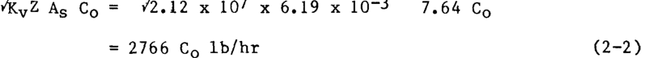

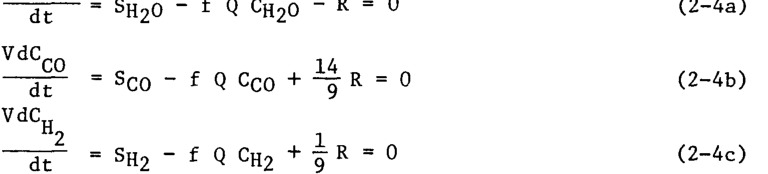

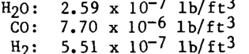

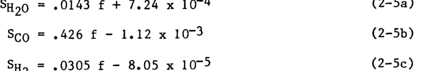

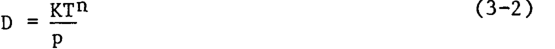

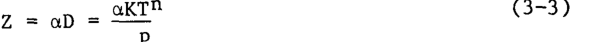

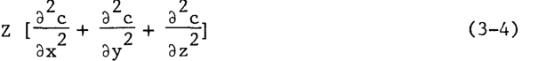

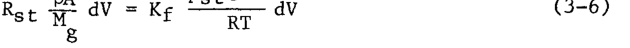

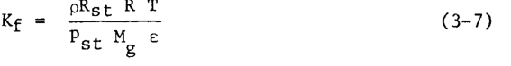

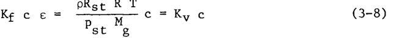

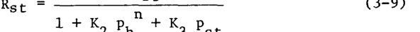

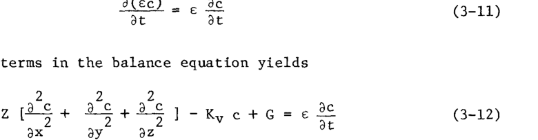

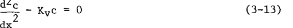

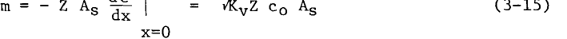

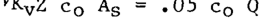

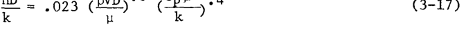

|`Variable`|`Nominal`|`Low Pressure`|`Chamber`|
|---|---|---|---|
|`Test Section Temperature °F`|`1800`|`1800`|`1800`|
|`Test Section Pressure psia`|`735`|`50`|`50`|
|`Helium Flow Rate cfm`|`922`|`3535`|`-`|
|`Helium Density lb/ft`|`.121`|`.00825`|`.00825`|
|`Helium Flow Rate Ib/hr`|`6690`|`1750`|`-`|
|`Helium Velocity in Tubes ft/sec`|`100`|`300`|`-`|
|`Heat Exchanger HTC Btu/hr ft°F`|`80`|`28`|`-`|
|`Recuperator Duty Btu/hr`|`6.3xl06`|`1.6xl06`|`none`|
|`Electric Heater Duty kw`|`122`|`32`|`-`|
|`Main Loop Pressure Drop psl`|`12`|`7.4`|`-`|
|`Pumping Power hp`|`50`|`115`|`-`|

||`Nominal`|`Low Pressure`|`Chamber`|
|---|---|---|---|
|`Test Section`|`100`|`50`|`50`|
|`Recuperators (4)`|`400`|`210`|`-`|
|`Air Cooler`|`10`|`5`|`-`|
|`Circulator and Motor`|`550`|`300`|`250`|
|`Power Supply`|`110`|`140`|`100`|
|`Engineering Design of Circulator`|`130`|`130`|`-`|
|`Electric Heater`|`10`|`5`|`5`|
|`Piping`|`300`|`170`|`-`|
|`Valves`|`25`|`10`|`-`|
|`Insulation`|`40`|`40`|`10`|
|`Analytical, Recording, Control`|`100`|`100`|`100`|
|`Structural Support`|`25`|`25`|`15`|
|`TOTAL`|`1800`|`1185`|`530`|

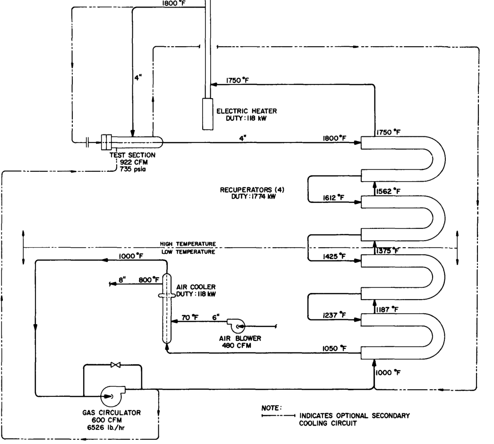

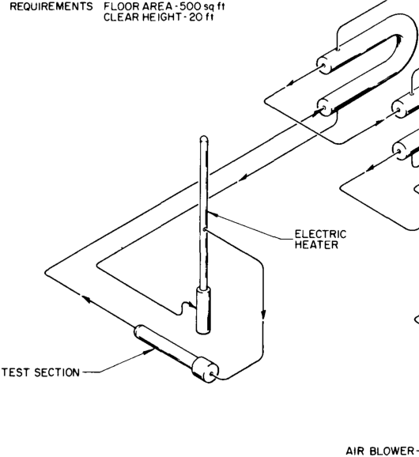

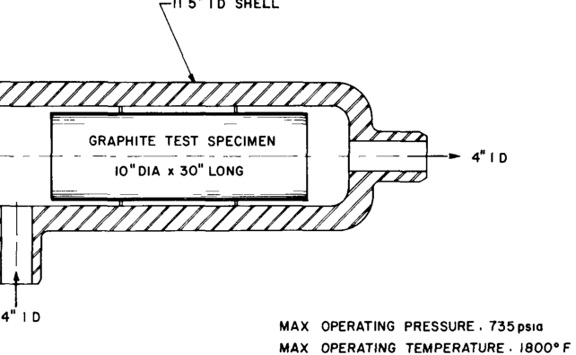

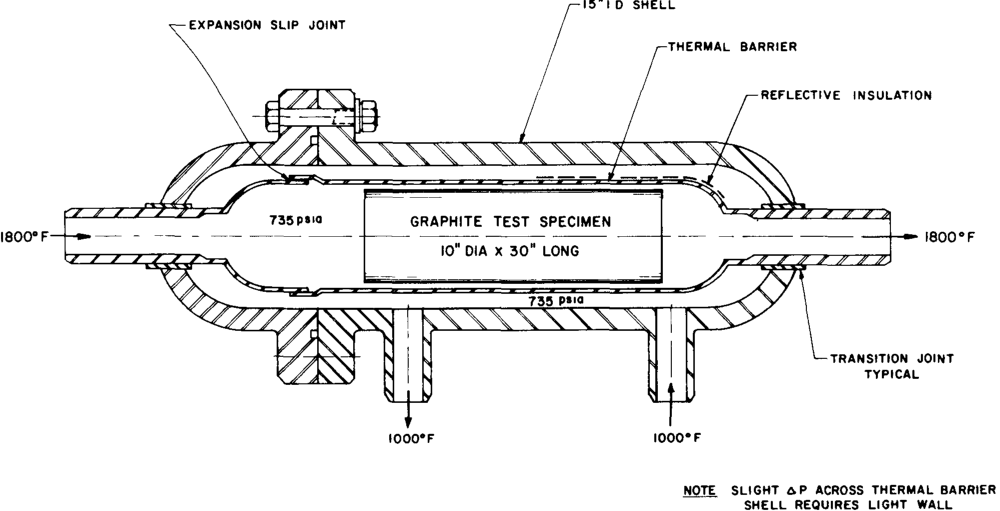

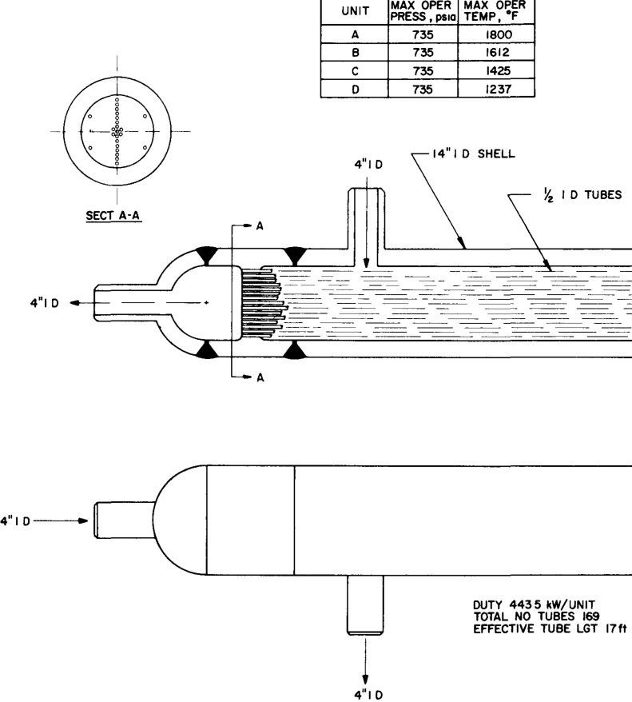

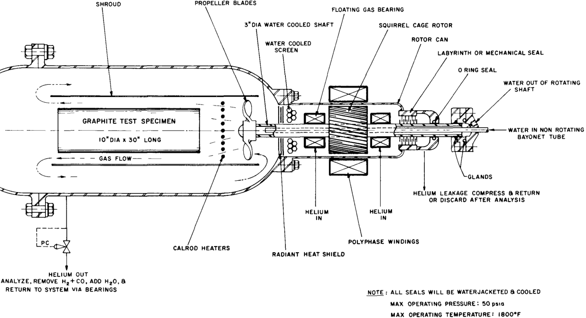

