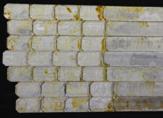
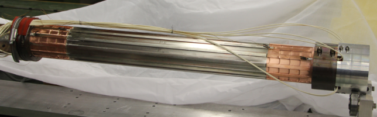
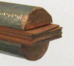
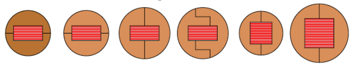
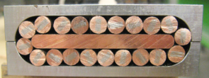
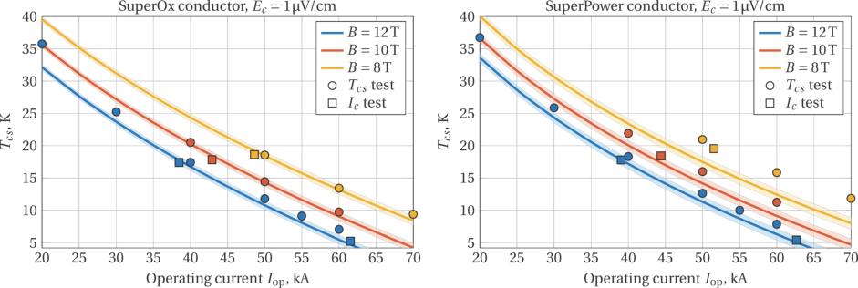
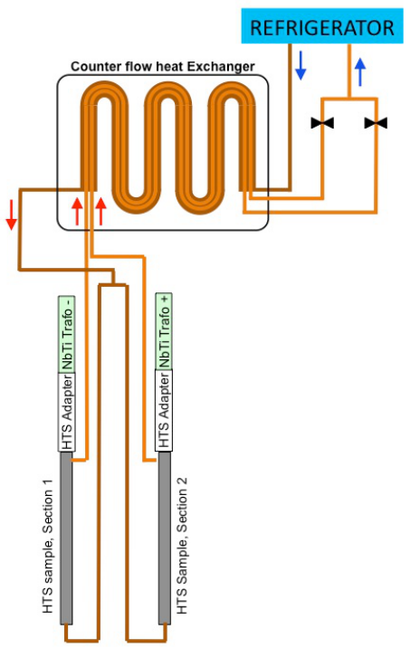
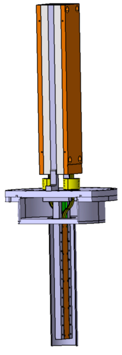

## EUROFUSION WPMAG-CP(16) 16576 

P Bruzzone et al. 

## **High Temperature Superconductors for Fusion at the Swiss Plasma Center** 

Preprint of Paper to be submitted for publication in Proceedings of 26th IAEA Fusion Energy Conference 

This work has been carried out within the framework of the EUROfusion Consortium and has received funding from the Euratom research and training programme 2014-2018 under grant agreement No 633053. The views and opinions expressed herein do not necessarily reflect those of the European Commission. 

This document is intended for publication in the open literature. It is made available on the clear understanding that it may not be further circulated and extracts or references may not be published prior to publication of the original when applicable, or without the consent of the Publications Officer, EUROfusion Programme Management Unit, Culham Science Centre, Abingdon, Oxon, OX14 3DB, UK or e-mail Publications.Officer@euro-fusion.org 

Enquiries about Copyright and reproduction should be addressed to the Publications Officer, EUROfusion Programme Management Unit, Culham Science Centre, Abingdon, Oxon, OX14 3DB, UK or e-mail Publications.Officer@euro-fusion.org 

The contents of this preprint and all other EUROfusion Preprints, Reports and Conference Papers are available to view online free at http://www.euro-fusionscipub.org. This site has full search facilities and e-mail alert options. In the JET specific papers the diagrams contained within the PDFs on this site are hyperlinked 

## **High Temperature Superconductors for Fusion at the Swiss Plasma Center** 

P. Bruzzone[1] , R. Wesche[1] , D. Uglietti[1] , N. Bykovsky[1 ] 

1Ecole Polytechnique Fédérale de Lausanne (EPFL), Swiss Plasma Center (SPC), CH-5232 Villigen PSI, Switzerland 

## _pierluigi.bruzzone@psi.ch_ 

**Abstract** . High Temperature Superconductors (HTS) may become in future an option for the superconducting magnets of commercial fusion plants. At the Swiss Plasma Center (SPC) the R&D activity toward HTS high current, high field cables suitable for fusion magnets started in 2012 and led in 2015 to the assembly of the first 60 kA, 12 T prototype conductor. The cable concept developed at the Swiss Plasma Center (SPC) is based on the principle of “soldered, twisted stacks” of REBCO tapes. The required number of stacks is assembled in a cored flat cable, cooled by forced flow of supercritical helium. The sample environment of the test facility at SPC has been upgraded with a HTS adapter and a counter-flow heat exchanger to allow testing the HTS sample in a broader range of temperature (4.5 K to 50 K) using the existing, NbTi based superconducting transformer and the closed loop refrigerator. 

## **1. Introduction** 

Few years after the discovery of high temperature superconductivity (1986), the first HTS conductors with high Tc and high critical field Bc were produced in 1989-1991 as wires of BSCCO 2212 and tapes of BSCCO 2223. The first proposal for use of HTS in fusion magnets dates back to 1998 [1], with a 100 kA conductor made of stacks of BSCCO-2223 tapes, operating at 16.5 T / 20 K in the SSTR device. The use of HTS for low heat leak current leads was proposed earlier in 1994 [2] and actually realized in the following decades in several projects. 

Looking at the several proposals of the last 18 years to use HTS in fusion magnets, the question arises if the future fusion devices either **must** or **may** use HTS. At large, the question can be answered by the peak operating field: a compulsory use of HTS in fusion magnets starts Bpeak ≥ 18 T. Today, the ARC compact, high field demonstrator is likely the only fusion device proposal, which **must** be made with HTS conductors (Bpeak ≈ 23 T) [3]. In other conceptual studies the use of HTS is an option, which is preferred by the designers for specific reasons, e.g. the possibility of operation temperature in the range of 20-30 K with drastically reduced nuclear shield [4] or the assembly of helical coils by short segmented sections of winding, with thousands of joints [5]. 

The technology for HTS conductors has progressed in the past two decades [6]. The cuprates tapes based on Rare Earths (REBCO) are manufactured by deposition biaxially textured films as Coated Conductors (CC). The CC were initially available only on very short lengths. Today, the CC tapes are produced in several hundreds meter sections by a dozen of companies worldwide and are the prime candidate material for fusion conductors. Frequently quoted as second generation (2G) of HTS tapes, the CC tend to replace the first generation (1G) of BSCCO tapes in most applications, due to the superior flexibility (thinner tape) and higher in field current density at elevated temperatures. The sensitivity to neutron irradiation of CC tapes [7] is investigated with focus to the fusion applications. 

## **2. HTS Activities at the SPC** 

The HTS studies and R&D at the Superconductivity group of SPC (former PSI and CRPP) started in 1990 with the development of Ag/Bi-2212 wires [8]. Other HTS projects, nonrelated to fusion, were the power transmission cable prototype (SuLeiKa) in 1998, made by BSCCO tapes with forced flow Ne cooling [9] and the development of high field insert coil solenoids wound by CC tapes, running since 2011 [10]. 

## **2.1.Current Leads** 

The development of high current HTS leads started at SPC in the early nineties using bulk material [11] and later AgAu clad BSCCO 2212 tubes [12]. For ITER, a prototype 70-kA current leads demonstrator made by stacks of BSCCO 2223 tapes was built and tested in collaboration with KIT [13, 14]. Based on the same technique, the 18 kA current leads for EDIPO [15] and the 20 kA current leads for the hybrid magnet of HZB [16] were assembled and successfully operated in 2011 and 2012. The technology for high current HTS leads made by stacks of BSCCO-2223 was transferred to the industry in 2014 and a test facility for current leads with up to 12 kA direct current was set up at SPC [17]. 

The use of CC for HTS current leads is not straightforward because of the lack of stabilizer in the thin tapes and the asymmetric contact surface – the superconducting film faces only one side of the tape. To solve the issues, a brass tape is interleaved in the stack between two CC tapes as a low heat leak stabilizer and each stack of CC is staggered at the terminal for low resistance contact. The innovative method was first applied to the HTS adapter of the sample environment of the SPC test facilities, see section 2.3, and then used in 2014 for the HTS module of the 20 kA current leads of the NAFASSY facility [18], see Fig. 1. 

In the current leads of future fusion devices, both CC and BSCCO-2223 stacks of tapes can be used. The CC are available on wider tapes at several suppliers and are slightly less sensitive to stray field. Only two suppliers worldwide sell the BSCCO-2223 tapes with the low heat leak AgAu matrix. 

## **2.2.High Current, High Field HTS Conductors** 

It’s not straightforward to draft a common requirement catalogue for HTS fusion conductors. The specific device operating parameters (operating peak field and temperature, mechanical loads, time varying field, dump time constant) and the designer top choices (e.g. for nuclear shield, joint layout and cooling) lead to a variety of requirements and restrictions for the layout of HTS high current conductors. For example, the coil assembly by short conductor/ winding sections connected by resistive joints, as in [3] and [5], relaxes the requirement of full transposition among the cable elements for balanced current distribution and hence allows a conductor layout by plain, non-twisted stacks of tapes. 

_FIG. 1. Left, seven soldered and staggered stacks of CC and brass tapes for the HTS module (right) of the 20 kA current leads for NAFASSY, assembled at SPC in late 2014._ 

TABLE I: HTS CONDUCTOR REQUIREMENTS, EXTRAPOLATED FROM EUROFUSION. 

As SPC is participating to the conceptual design of the EUROfusion DEMO, whose baseline foresees the use of low temperature superconductors [19], the tentative requirements for the development of HTS fusion conductors are extrapolated from the SPC winding pack designs of the EUROfusion DEMO1 Toroidal Field (TF) coils [20] and Cental Solenoid (CS) [21]. The rationale of this choice is that the Nb3Sn high field layers of the TF and CS may be replaced by layers of HTS conductor. The potential advantage of using a HTS conductor in the innermost layer of the TF coil is the large temperature margin, which allows removing the large nuclear heat load in the first layer at higher peak temperature, say at 7 K instead of 5 K. For the CS, a HTS conductor in the innermost layers allows peak field higher than 14-15 T, i.e. the required flux can be obtained with a more compact solenoid, saving radial build of the tokamak. The key requirements are listed in Table I. 

The basic concept of SPC for the design of high current HTS conductor is to pack the tapes into a medium size solid, round assembly, which can be cabled into a large transposed cable. From the analogy with low temperature superconductors, the round assembly of stacked tapes is called “strand”. In the initial trials, two half shells of copper were assembled with a short stack of 3 mm wide tapes, see Fig. 2 left [22]. It was soon clear that better bending performance is obtained by twisting the assembly before soldering it. More trials followed, with variation of the geometry of the copper shells, the aspect ratio of the stack and the annealing status of the copper shells, see Fig. 2 right. Extensive characterization of the strands was carried out at 77 K, self field, to identify the reversible range for twist pitch of the strand and bending radius of the strands in the cable, both “easy” and “hard” bending [23-25]. 

The first full size TF prototype conductor, designed to operate at 60 kA/12 T/5 K, was assembled at SPC in late 2014. The sample for test in the EDIPO test facility [26] is made of two conductor sections, one using Superpower tapes and the other using SuperOx tapes. To achieve a moderately short cable pitch and maintain the bending strain of the strands within the allowable limits, a copper core with rounded edges is inserted in the mid-plane of the flat cable [24]. The layout of the cable and a cross section are summarized in Table II. 

The test results in EDIPO, in a background field up to 12 T, operating current up to 70 kA, and operating temperature up to 40 K, are reported in [27]. The DC performance assessment based on the test results of the individual tapes, solid lines in Fig. 3, satisfactory matches the 

_FIG. 2. Left, the first trial of twisted stack with copper sectors (2012). Right, parametric variations of the strand geometry (2014). The second from left is selected for the TF prototype._ 

TABLE II: LAYOUT OF THE 60 kA, 12 T PROTOTYPE TF CABLE. 

|Coated Conductor Tape|Tape thickness|0.1 mm|
|---|---|---|
||Tape width|4 mm|
|Twisted Stack Strand|Number of tapes|16|
||Twist pitch|320 mm|
||Strand diameter|6.2 mm|
|Flat Cable|Number of strands|20|
||Cable pitch|1000mm|
||Core thickness|5 mm|

_FIG. 3. Initial DC performance of the TF prototype conductors. The solid lines represent the prediction from the individual tape performance._ 

EDIPO results in the initial test campaign, solid symbols in Fig. 3. For the Superpower conductor, right in Fig. 3, the test results are slightly better than the prediction, likely due to the poor accuracy of the scaling law. Upon cyclic electromagnetic loading, the DC performance slightly degraded, about 10% for the Superpower conductor and 20% for the SuperOx conductor [28]. 

The SuperOx cable was disassembled in 2016. Visual inspection and individual strand tests at 77 K confirmed the local damage of most strands, suggesting that the reversible range for bending must be more conservative in the design to account for cyclic load. However, a number of dedicated tests on new strands, applying cyclic compressive load in transverse direction, were not able to reproduce the degradation observed in the TF prototype [29]. 

A prototype HTS conductor, designed in 2016 for the high grade of the CS (53 kA, 18 T) will be tested in 2017. The prototype consists of two conductor layouts assembled in one sample, see Table III: both layouts use strands with twisted stacks of CC. The strands of the round cable are assembled with hard copper and have larger bending radius. In the flat cable the strands are assembled with fully annealed copper and have smaller bending radius in the cable. Mitigation of the AC loss is addressed in the CS prototype by resistive barriers in the core of the flat cable and/or resistive wraps of the strands. The copper cross section for quench protection is substantially smaller than suggested in Table I. 

Besides the above mentioned issues of cyclic load degradation and mitigation of AC loss (whenever required), a major subject of investigations is the quench detection and protection of HTS coils with large stored energy. The normal zone from a local quench propagates very slowly in the HTS conductors due to the high Tc. The local temperature may reach dangerously high level before the quench can be detected by conventional methods. 

TABLE III: LAYOUT OF THE 53 kA, 18 T PROTOTYPE CS CONDUCTORS. 

|||Rectangular|Round|
|---|---|---|---|
|Strand|Numberof tapes|28|46|
||Tape width|3.3 mm|5.0 mm|
||Strand diameter|6.2 mm|9.5 mm|
|Cable|Number of strands|10|4|
||Totalcopper|240 mm2|250 mm2|
||Total tape width|924 mm|920 mm|
||Cable pitch|1.0 m|0.8 m|

## **2.3.Test Facility for HTS Test** 

High current, high field superconducting cables are routinely tested in the facilities SULTAN and EDIPO at SPC with operating current up to 100 kA, background field up to 11 T (SULTAN) and superimposed AC and transient field. The operating temperature range was 4.5 K to ≈10 K by supercritical helium flow for low temperature superconductor samples. The sample environment of the facilities (identical in SULTAN and EDIPO) has been upgraded in 2015-2016 to allow tests of HTS samples over a broader range of temperature, 4.5 K to 50 K. 

The HTS adapter, similar to the HTS module of a current lead, connects the NbTi secondary conductor of the superconducting transformer (the current source for the sample) to the HTS cable sample [30]. The HTS adapter, designed and assembled at SPC, is made by 5 stacks of 15 CC tapes, 12 mm wide. It restricts the heat conduction between the NbTi conductor, operating at 4.5 K and the sample, operating at variable temperature. 

Another essential element of the upgrade of the sample environment is the counter-flow heat exchanger for the inlet and outlet coolant flow of the sample. When the HTS sample is operated at temperature > 10 K, the outlet gas is re-cooled in the counter-flow heat exchanger before returning to the refrigerator and the inlet gas is pre-heated. The early version of the counter-flow heat exchanger [30] has been replaced in 2016 by a new one, see sketch in Fig. 4 left, where the two outlet flows of the sample are enclosed in the inlet pipe, allowing precise control of mass flow rate and temperature in the two branches of the sample. 

So far, only forced flow conductors could be tested in the SPC facilities. With a new insert cryostat built in 2016, see Fig. 4 right, it will be possible to test HTS conductors and windings in a quasi-static atmosphere of helium gas. The inner diameter of the cryostat is 80 mm. The current feed-through from the superconducting transformer, conceptually similar to the HTS adapter, is designed for operating current up to 30 kA. The cryostat can be filled either with liquid helium for tests at 4.2 K or with pressurized gas at variable temperature. 

## **2.4.Other Activities** 

In the scope of the upgrade of the TCV divertor [31], SPC plans to wind in-situ three HTS superconducting coils to precise control the shape of the magnetic field. The maximum field on the windings is ≈ 2.5 T. The conceptual design foresees to use a 12 mm wide tape of CC cooled by liquid nitrogen. The selection of the HTS tape and the feasibility studies started in 2016. 

_FIG. 4. Left, flow scheme for the sample environment, with the HTS adapter and the counter-flow heat exchanger. Right, the sketch of the insert cryostat for conductor/winding test in static helium gas._ 

## **3. Conclusion** 

After over two decades of R&D on HTS, the SPC is strongly engaged in the development of HTS magnet technology for fusion, with full size prototype conductors matching the requirements of the EUROfusion DEMO baseline. The test of the 60 kA, 12 T TF conductor prototype in EDIPO is a major milestone in the field. 

The next target for HTS conductor development is a CS prototype sample with two layout variations, addressing the issues of cyclic load degradation and low AC loss. 

The superconductor test facilities at SPC are a powerful R&D tools for the fusion conductors of next generation, offering to the international community a broad range of operating conditions for various concepts of LTS and HTS high current, high field conductors. With the most recent upgrade of the sample environment, both forced flow and static cooled conductors can be tested over a wide range of operating temperature. 

## **Acknowledgements** 

This work has been carried out within the framework of the EUROfusion Consortium and has received funding from the Euratom research and training programme 2014-2018 under grant agreement No 633053. The views and opinions expressed herein do not necessarily reflect those of the European Commission. 

## **References** 

- [1] Ando, T., et al., “Considerations on High Tc Superconductor Application to Magnets for Tokamak Fusion Reactors”, Fusion Technology 1988, vol. 1, 791. 

- [2] Mumford, F.J., “Superconducting current-leads made from high Tc superconductor and normal metal conductor”, Cryogenics **29** (1989) 206. 

- [3] Sorbom, B.N., et al., “ARC: A compact, high-field, fusion nuclear science facility and demonstration power plant with demountable magnets”, Fusion Eng. Des. **100** (2015) 378. 

- [4] Noonan, P., “HTS - An Enabling Technology for Spherical Tokamak Fusion Reactors”, https://www.stfc.ac.uk/files/uk-magnetics-tokamak-energy/ 

- [5] Yanagi, N., et al., “Design and development of high-temperature superconducting magnet system with joint-winding for the helical fusion reactor”, Nuclear Fusion **55** (2015) 053021. 

- [6] Senatore, C., “30 Years of HTS, Status and Perspectives”, presented at ASC2016 Conference, Denver, September 2016. 

- [7] Eisterer, M., et al., “Neutron irradiation of coated conductors”, Supercond. Sci. Technol. **23** (2010) 014009. 

- [8] Wesche, R., et al., “Development of Bi-2212/Ag wires for magnet applications”, Studies of High Temperature Superconductors **21** (1996) 97. 

- [9] Anghel, A., et al., “Design, Construction and Operation of a Neon Refrigeration System for a HTS Power Transmission Cable”, Adv. Cryog. Eng. **45** (2000) 1419. 

- [10] Uglietti, D., et al., “Construction and test of a non-insulated insert coil using coated conductor tape”, Journal of Physics: Conference Series **507** (2014), 032052. 

- [11] Fuchs, A.M., et al., “Development of Binary Superconducting Current Leads with a Gas Cooled Normal Part”, Cryogenics **34** (1994) 627. 

- [12] Fuchs, A.M., et al., “Test results of a 10 kA current lead using Ag/Au cladded Bi-2212 tubes”, IEEE Trans. Appl. Supercond. **12** (2002) 1281. 

- [13] Heller, R., et al., “Experimental results of a 70 kA high temperature superconductor current lead demonstrator for the ITER magnet system”, IEEE Trans. Appl. Supercond. **15** (2005) 1496. 

- [14] Wesche, R., et al., “Design of high-temperature superconductor current leads for ITER”, Fusion Eng. Des. **82** (2007) 1385. 

- [15] Wesche, R., et al., “Test results of the 18 kA EDIPO HTS current leads”, Fusion Eng. Des. **86** (2011) 1414. 

- [16] Wesche, R., et al., “Results of the test of a pair of 20 kA HTS currents leads”, Journal of Physics: Conference Series **507** (2014), 032056. 

- [17] Wesche, R., et al., “Results of the Test of Industrially Manufactured HTS Current Leads With Novel Design Features”, IEEE Trans. Appl. Supercond. **24** (2014) 4800205. 

- [18] Saggese, A., et al., “20 kA HTS Current Leads for the INFN Magnet Test Facility”, IEEE Trans. Appl. Supercond. **25** (2015) 4801304. 

- [19] Wenninger, R., “Reference Design – 2015 April (EU DEMO1 2015) – PROCESS Full Output”, https://idm.euro-fusion.org/?uid=2MDKFH. 

- [20] Sedalk, K., et al., “Design and R&D for the DEMO Toroidal Field Coils based on Nb3Sn React and Wind Method”, presented at ASC2016, Denver, September 2016. 

- [21] Wesche, R., et al., “Central Solenoid Winding Pack Design”, presented at SOFT2016, Prag, September 2016. 

- [22] Uglietti, D., et al., “Fabrication trials of Round Strands Composed of Coated Conductors Tapes”, IEEE Appl. Supercond. **23** , (2013) 4802104. 

- [23] Uglietti, D., et al., “Design and Strand Tests of a Fusion Cable Composed of Coated Conductor Tapes”, IEEE Appl. Supercond. **24** (2014) 4800704. 

- [24] Bykovsky, N., et al., “Strain management in HTS high current cables”, IEEE Appl. Supercond. **25** (2015) 4800304. 

- [25] Bykovsky, N., et al., “Design optimization of round strands made by twisted stacks of HTS tapes”, IEEE Appl. Supercond. **26** (2016) 4201207. 

- [26] Bruzzone, P., et al., “EDIPO: The test facility for high-current high-field HTS superconductors”, IEEE Appl. Supercond. **26** (2016) 9500106. 

- [27] Uglietti, D., et al., “Test of 60kA coated conductor cable prototypes for fusion magnets”, Supercond. Sci. Technol. **28** (2015) 124005. 

- [28] Bykovsky, N., et al., “Performance evolution of 60kA HTS cable prototypes in the EDIPO test facility”, Supercond. Sci. Technol. **29** (2016) 084002. 

- [29] Bykovsky, N., et al., “Cyclic load effect on round strands made by twisted stacks of HTS tapes”, presented at SOFT2016, Prag, September 2016. 

- [30] Wesche, R., et al., “Commissioning of HTS Adapter and Heat Exchanger for Testing of High-Current HTS Conductors”, IEEE Trans. Appl. Supercond. **26** (2016) 9500705. 

- [31] Reimerdes, H., et al., “TCV divertor upgrade for alternative magnetic configurations”, 22[nd] International Conference on Plasma Surface Interactions in Controlled Fusion Devices (PSI 22), Rome 2016. 

