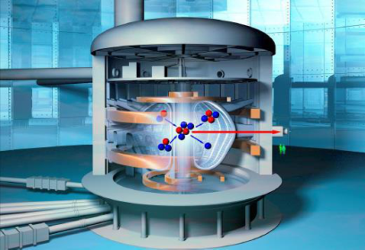

Coil Concepts for DEMO and Next Step Reactors Peter H. Titus Princeton Plasma Physics Laboratory ptitus@pppl.gov, Analysis Group Head 

5th IAEA DEMO Programme Workshop 

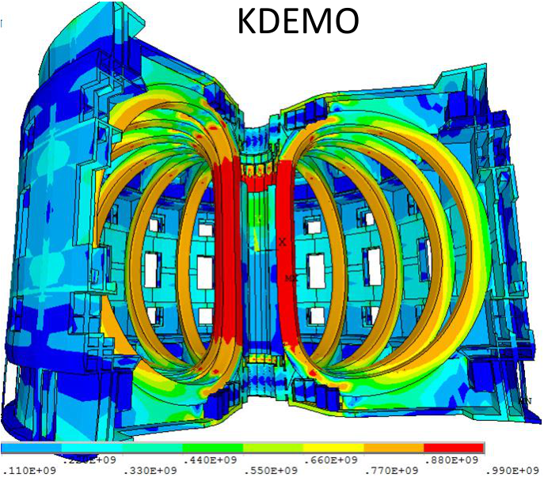

**----- Start of picture text -----** 
KDEMO **----- End of picture text -----** 

US FNSF 

## **Outline** 

Monotonic  vs. Fatigue   3Sm, vs. Fracture vs Usual Monotonic Stress Checks Limit Analysis for Determining Primary Stress An Example KDEMO Evaluation Non Constant Tension Dee Shapes Never bending free, never filamentary Thickness Variation  to take OOP loads casued non-uniform tension stress Designing for Out-of-Plane (OOP) loads with Radial and Vertical Maintenance An Example US FNSF Evaluation KDEMO as an Example of Vertical Maintenance Remember to Size the Central Column based on a  Full Scenario An Example FNSF Evaluation Older Aggressive Magnet Concepts  - Useful for HTS magnets? Use of Bucked and Wedged Concept for the US FNSF 

## **DEMO/PILOT  is Approaching Static Stress Criteria Determining Primary Stress Becomes More Important. Cyclic Life is Less Important Than Initial Fast Fracture** 

FNSF 1250 (?) Shots 

ITER 30,000 Shots 

By it’s nature to obtain significant fluences,  pulses must be long . It has been estimated from the present FNSF program, approximately 700 DT shots, and probably another 500 He/H and DD shots would be experienced by the reactor in its design life. 

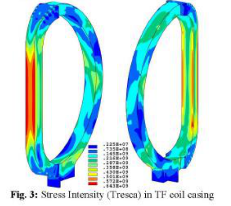

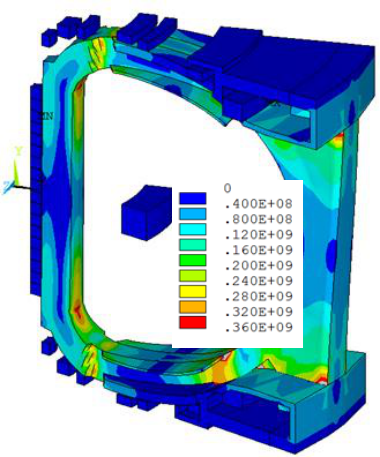

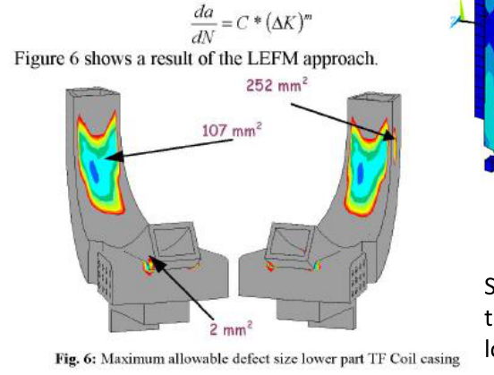

Stress Difference between the TFON and the TFON+PF load case 

KDEMO Two Phase Operation Component Test Facility with Multiple Pulses 

Second Phase, Net Electricity Generation  24/7 = 1 week pulse =52 per year=1040 for 20 years life 

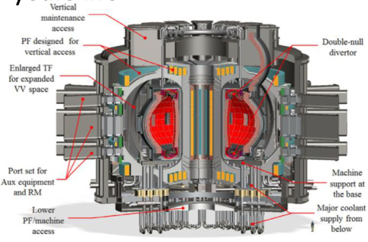

DEMO/PILOT 20 to 50 Shots(?) (No Experimental Phase) 

**Much Less than Pulsed Experimental Machines** 

## **Monotonic  Stress Checks** 

**Satisfying Sm, 1.5 Sm and 3*Sm (or 2*Sm)** 

**Why is this important?** 

- **Tokamaks build out from the radius of the central column.** 

- **There is a large cost impact of the radial build** 

- **Small changes in the central column ripple through the rest of the radial build.** 

- **Monotonic stress checks may limit the design, more so then fatigue.** 

## Primary Stress Allowable for Low Cycle – Non Fatigue Applications 

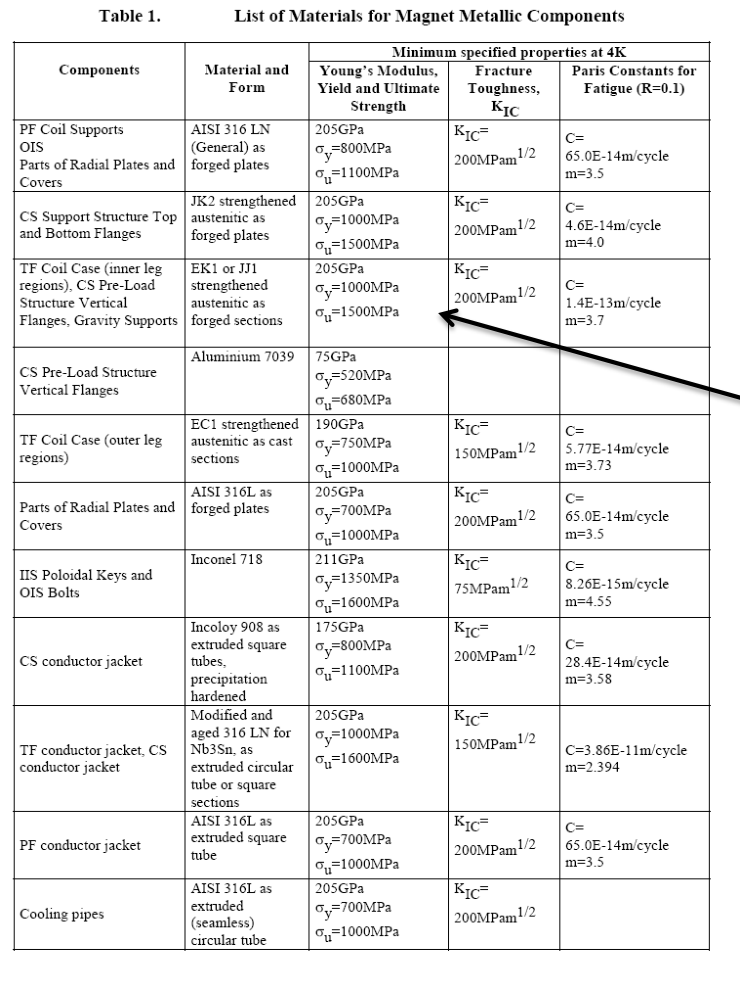

TF Case and Winding Pack Analysis 

TF Case 2/3* yield = 666 MPa ½ Ultimate = 750 Mpa 1/3 Ultimate = 500 MPa Sm, Primary Membrane Allowable = 666 Mpa Only based on yield according to ITER MSDC According to PPPL Criteria Sm = lesser of 2/3 Yield and ½ Ultimate + Show Adequate Ductility The average stress in the inner leg case should satisfy this Allowable 

## **From the PPPL NSTX (FIRE) Criteria  (Not Really Intended for Superconducting Magnets)** 

For support structures and any other **STEEL** structures including, if applicable, the vacuum vessel, the design Tresca stress values (Sm) shall be based on the lesser of the following: 

2/3 of the _**minimum**_ specified yield at temperature 

_**Reference 3 (Section III, Appendix III, Article III-2110(a)(3))**_ 

1/2 of the _**minimum**_ specified tensile strength at temperature _**Original 1/3 Su per Ref. 3 (Section III, Appendix III, Article III-2110(a)(1)).**_ **3*Sm (twice yield) is allowed An over-simplification but ASME is based on a factor of safety of 2 to 3 against failure** 

**From the ITER Magnet Criteria** 

Yielding at cryogenic temperatures is accompanied by substantial temperature changes in the material (several tens of degrees) which can produce the well-known phenomenon of serrated yielding in test specimens. The measurement problems associated with material behaviour above the yield stress again mean that a design based on the yield stress is preferred. 

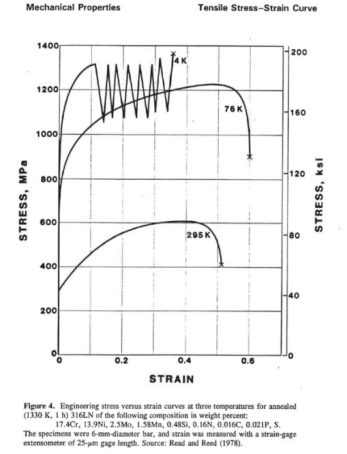

## **Primary Stress** 

_Primary stress is any normal stress or a shear stress developed by an imposed loading which is necessary to satisfy the laws of equilibrium of external and internal forces and moments. The basic characteristic of a primary stress is that it is not self-limiting. Primary stresses which considerably exceed the yield strength will result in failure or, at least, in gross distortion. A thermal stress is not classified as a primary stress._ 

From the ITER Criteria: 

The relatively low value of σu /σy at cryogenic temperatures (about 1.5 at 4K compared to 2.5 at 200C) means that a design based on the ASME definition of Sm would be dominated by tensile strength. For ITER, therefore only the yield stress is used to define Sm. The function of the ITER static stress limit is to limit the onset of plastic flow in the material, for which σ y is the appropriate measurement to use as a base. Consistent with the ASME philosophy for safety factors, **the peak stresses in ITER are limited absolutely to 2.0Sm (i.e. below the ultimate stress,** which is more conservative than ASME) and in some cases (generally where local plasticity may affect insulation bonding) to 1.5Sm. 

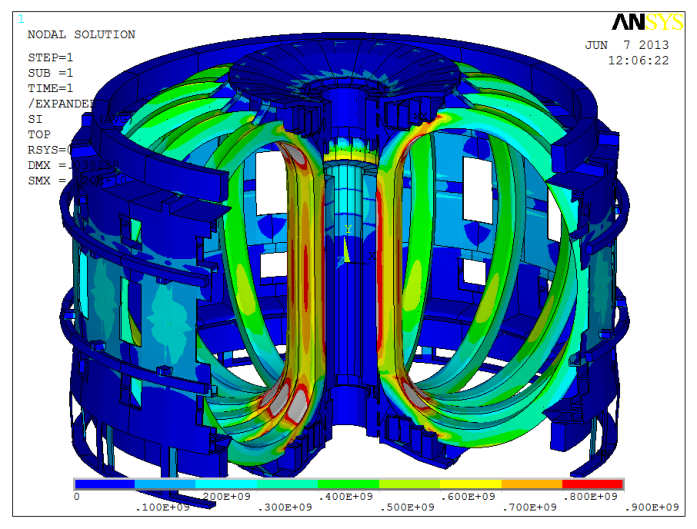

**For a DEMO reactor like KDEMO, what is the primary stress , Where is plasticity allowed? How much?** 

## **What is the Primary Stress in the TF Inner Leg? Especially based on FEA. What is the contribution of The Winding Pack?** 

Primary Loads are Bursting Magnetic Pressure and Centering Force 

This is a KDEMO Analysis,  7 T at Ro=7m 

Winding Pack Carries Loads (ITER Orthotropic Properties were Used). Does it Contribute to Carrying thr Primary Load? 

TF Case 2/3* yield = 666 MPa ½ Ultimate = 750 Mpa In ANSYS you 1/3 Ultimate = 500 MPa select the path and use the Allowable = 666 Mpa PLSECT According to ITER MSDC command –Only “Average” = 859 Mpa as good as the By “eyeball” path selected Question: What Section Should be  used for Linearizing? 

## **Limit Analysis** 

## From the NSTX structural criteria 

_"An exception to this elastic analysis approach can be when the nature of the structure and its loading make it difficult to decompose the stresses into the above mentioned categories.  In such an instance, a detailed, non-linear analysis that accounts for elastic-plastic behavior, frictional sliding and large displacement shall be used to determine the limit load on the structure. The limit load is that load which represents the onset of a failure to satisfy the Normal operating condition as described in Section I-2.6.  The safety factor of limit load divided by the normal load shall be greater than 2.0.“_ 

_Similar wording was in the ITER Magnet Structural Design Criteria (MSDC)  The objection was that it was non-physical and  the coils would quench before reaching the load factor of 2.0._ _**However this is only intended as a “thought experiment” , only to demonstrate structural factors of safety, and replace linearization and judgmental** ._ _**determinations of primary, bending discontinuity and peak stresses**_ Currents can temporarily go beyond quench initiation – in Fault cases. Below are some results for an ITER shorted TF coil evaluation 

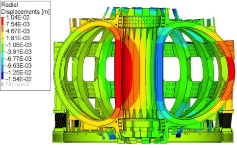

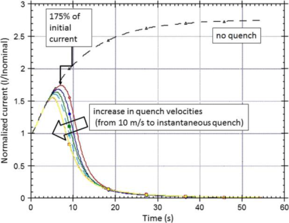

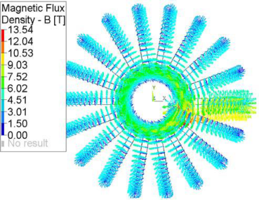

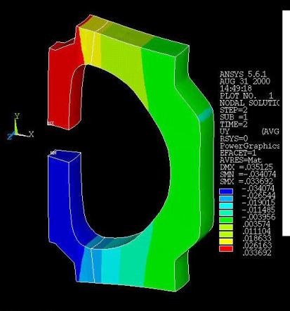

- Separation is 6 cm, Average stresses in outer leg are at membrane allowable, Bending is above yield 

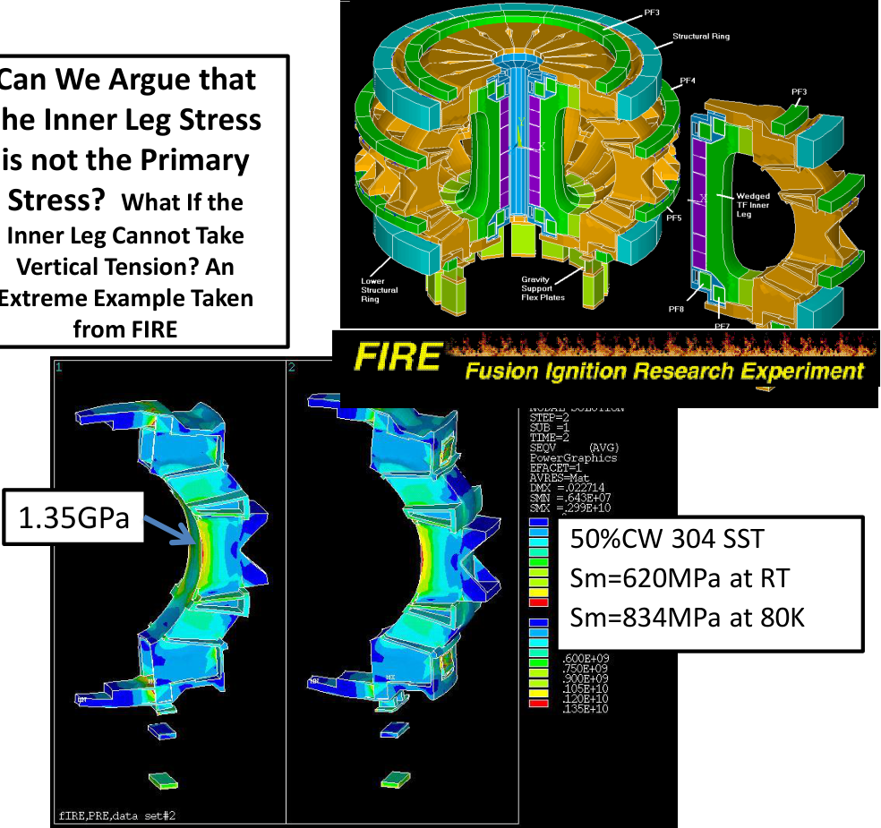

**----- Start of picture text -----** 
Can We Argue that the Inner Leg Stress is not the Primary Stress?  What If the What If the Inner Leg Cannot Take Vertical Tension? An Extreme Example Taken from FIRE 1.35GPa 50%CW 304 SST Sm=620MPa at RT Sm=834MPa at 80K **----- End of picture text -----** 

**Can We Argue that the Inner Leg Stress is not the Primary Stress?  What If the What If the Inner Leg Cannot Take Vertical Tension? An Extreme Example Taken from FIRE** 

The argument  is not completely successful, but it illustrates that the outer structures  take a larger share of the Primary bursting load 

KDEMO Elastic-Plastic Limit Analysis. Must Show a factor of 2 on failure (NonConvergence in ANSYS Model) 

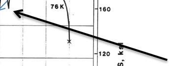

Results of KDEMO Limit Analysis 

The plasticity needed to demonstrate a load factor of 2 is below the level of yield serrations – at least in this measured stress strain curve. 

KDEMO Strain at Load Factor of 2.0 

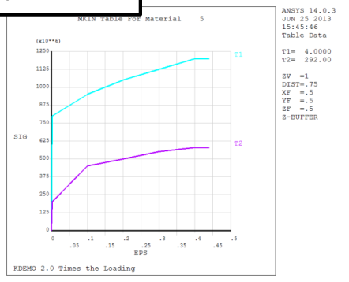

.01(1%)  Strain 

Plastic Strain at Twice Normal Loading 

Un-Loaded Results After Twice  the Normal Loads are Applied 

In the analysis presented,  failure was defined as a plastic collapse indicated by a failure of the elastic plastic analysis to converge.   It is a “thought experiment” intended to quantify structural factor of safety, but it could be extended to other failure mechanisms  to establish their factors of safety 

Failure could be defined as: 

Exceeding an Insulation Strength or Strain Limit 

Exceeding the irreversible Nb3Sn or HTs strain limit 

Stress Intensities exceeding the fracture toughness 

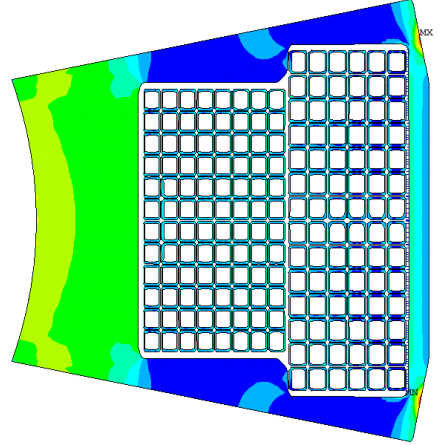

The limit analysis model would have to be expanded to include details of the winding pack 

**For Low Cycle Qualification,  Use preservice ASME and API qualifications based on Non-Destructive Examination of cracks . Perform  fast fracture assessment based on the maximum undetected flaw size.** 

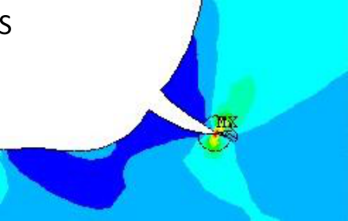

Example of ANSYS KCALC  - Quantifies stress intensity for identified initial crack 

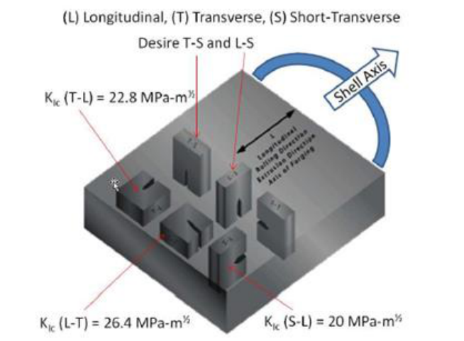

ITER requires 2 on crack size, 2 on Life, and 1.5 on Fracture toughness 

In the limit, with no crack propagation, and 2 on crack size intended for NDE uncertainty, This would leave a Factor of Safety against burst of 1.5 – **Consider Fracture Toughness F.S. of 2.0 for DEMO** 

## **Next Topic: Deviation From Constant Tension D** 

In early ARIES studies, particularly ARIES RS, “squashing” the constant tension Dee form was investigated. 

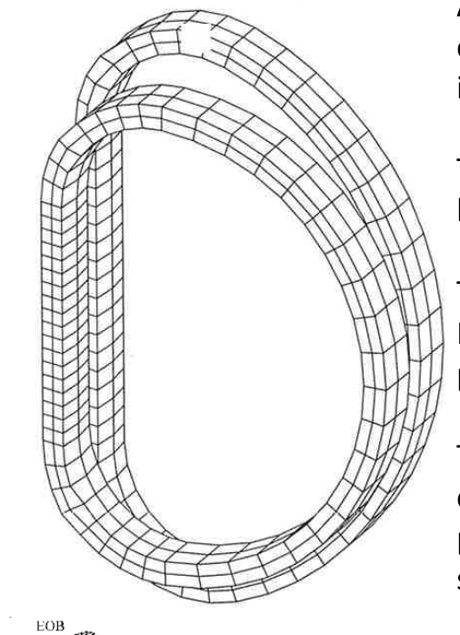

There was a penalty in extra bending stresses, but 

There was a benefit in having the PF coils more effective at the plasma, and 

ARIES and STARLITE Studies 

This allowed reducing the PF currents, and reducing the out-ofplane loads which were a more significant  source of bending. 

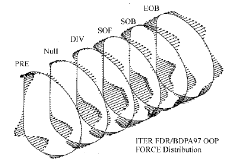

-More on this relating to the US FNSF 

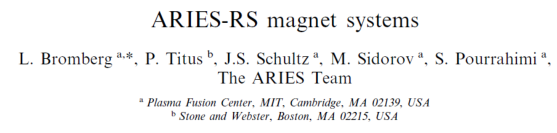

## **Next Topic:  Radial Servicing vs. Vertical Servicing** 

The US FNSF  servicing logic relies on radial servicing which requires  a large opening between the outer legs to extract the core components. 

In most other next generation machines, this space is taken up by torque structures and external components like Neutral Beams. Many competing next generation machines use vertical servicing through openings between the horizontal legs of the TF coils. KDEMO and EU Demo are examples. 

Aries ACT and the US FNSF Study 

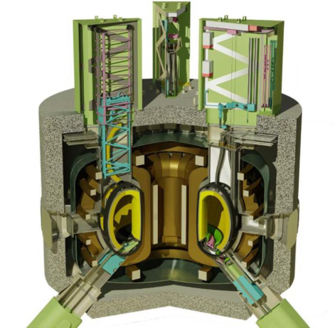

EU Demo with Vertical Servicing 

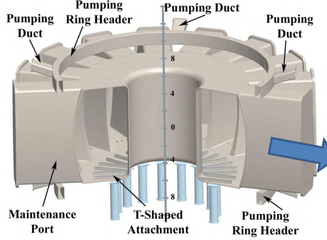

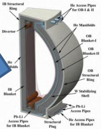

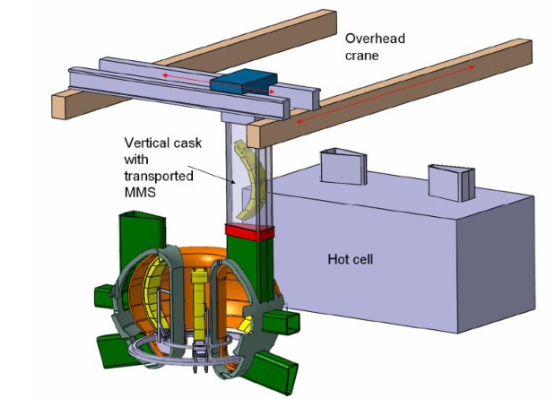

**----- Start of picture text -----** 
EU Demo Vertical Maintenanc **----- End of picture text -----** 

## Vertical Servicing Requires a Large Open Span on Top 

K-DEMO 

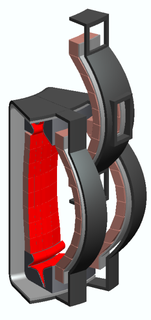

## Radial  Servicing Requires a Large Opening on the Machine Outer Radius 

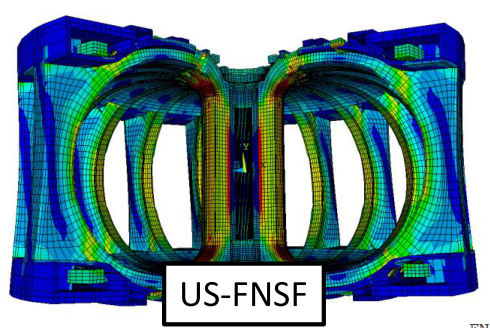

**----- Start of picture text -----** 
US-FNSF **----- End of picture text -----** 

In the case of the FNSF, the vertical span of the outer leg must be stiff and strong enough to carry the global torque as beam elements connecting upper and lower structures. 

## Vertical Maintenance is not Without Structural Challenges – The “Window” is Simply on Top Rather than the Side 

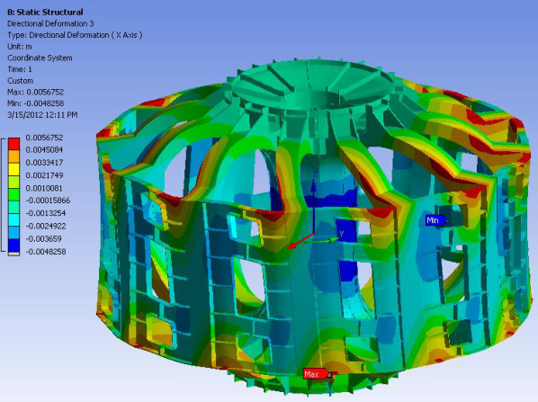

KDEMO  Before Outer Structure Reinforcements - +/- 5mm 

Displacements for PF Current Set KDM1 

**KDEMO Toroidal Displacement OOP Loading with TFON** 

540 Mpa Alternating Stress 

**Where ITER’s Limiting flaw sizes are.** 

OOP Loading with TFON Subtracted Out 

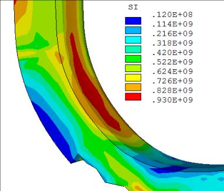

**Where ITER’s Limiting flaw sizes are.** 

## **HTS ST Vertical** 

## **Maintenance Concept Studied at PPPL (NSTXU is a ST) also had TF Bending Issues at Vertical Port** 

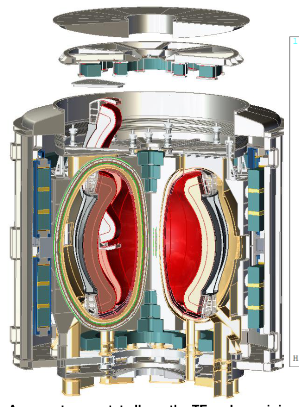

Gray Areas Exceed 720 MPa 

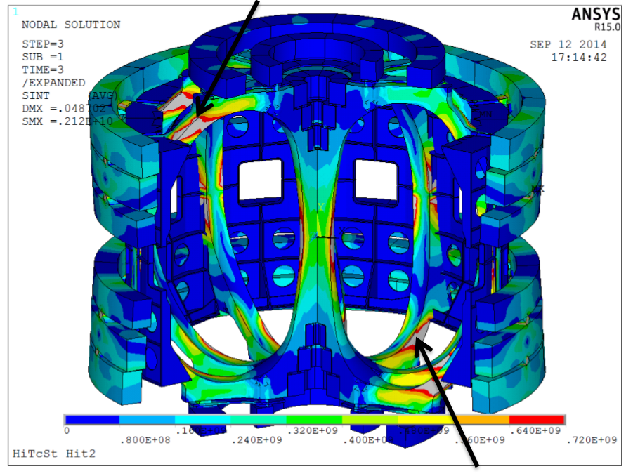

Gray Areas Exceed 720 MPa 

**A separate cryostat allows the TF and remaining PF coils to retain their cryogenic state during removal of plasma components.** 

## **Back to the  US FNSF :** 

“Squashed” Shape Allows PF coils to be closer to the plasma  and allows the outer leg to be moved out radially 

Shape closer to Constant Tension “D” from the Systems Code. “Squashed” shape used fo **r** the FNSF. 

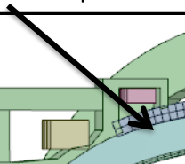

“V” left by extraction path was filled with structure 

The outer leg was positioned  based on clearance and extraction studies by Ed Marriot 

The FEA mesh was converted to IGES solids and sent to Ed Marriott for insertion into the CAD model for the final clearance checks 

## The Analysis Evolved  - We kept adding outer structure 

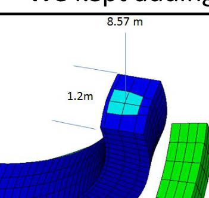

In the original Aug 2015 analysis, the outer leg dimension was a guess at 1.2 m. In the next analyses I thinned the outer leg and added structures radially outward and above and below the service port 

Original with 1.2 m Outer Leg 

~369 Mpa 

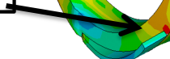

Thinned  and Extended Outer Leg ~650 Mpa 

Thinned to .7 m Outer Leg 

~800 Mpa .7m 

## A better View of the FEA Model Inserted Into Ed Marriott’s Cad Model 

This was a case where we converted the mesh to a CAD compatible file and the CAD volumes were fit to the final mesh 

E. Marriott’s Sector Extraction Study Verified Outer Leg Space Allocation 

Based on Chucks  Aug 28[th] email 7.5T at Ro and 1.06 TF Radial Build.  18 Segment OH, Added Cap and External Structure and “Flared” Outer Leg 

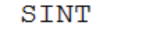

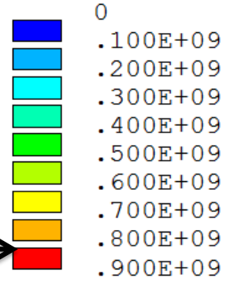

Primary Stress is ~800 MPa 

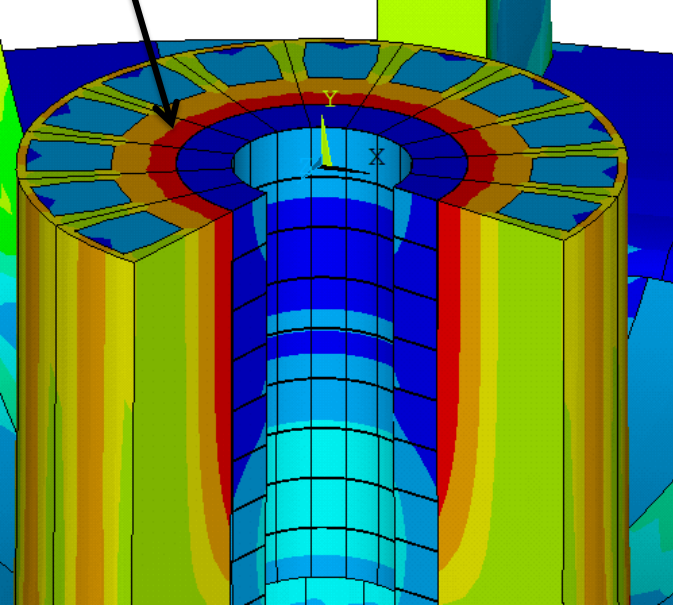

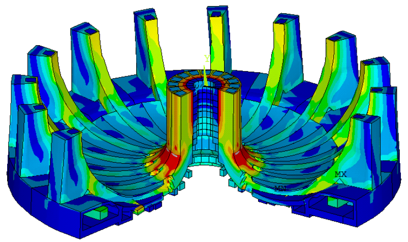

Inner Leg Stresses are still high Another Candidate for Limit Analysis 

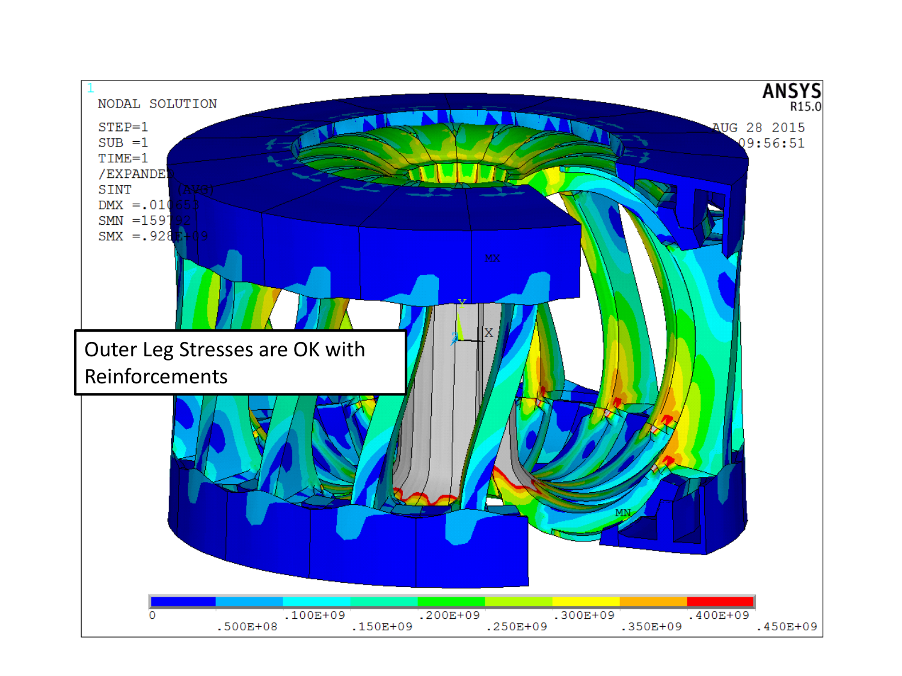

**----- Start of picture text -----** 
Outer Leg Stresses are OK with Reinforcements **----- End of picture text -----** 

ITER 

The Cyclic Tensile Stresses for ITER and US-FNSF are comparable. 437MPa for ITER and 450 MPa for US-FNSF The US FNSF should not have as high a cyclic requirement as ITER 

437 MPa 

Stresses here are pretty static 

US-FNSF 

This will Max Principal Cycle, But is Comparable with ITER 450 Mpa 

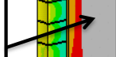

Another Way to Show Cyclic Stress Stress Difference between the TFON and the TFON+PF load case 

Inner Leg Equatorial Plane Outer Leg Stresses are OK with Stresses are Reinforcements  - Again Similar to Static ITER, and the US FNSF Sees Fewer Number of Cycles **Where ITER’s Limiting flaw sizes are.** 

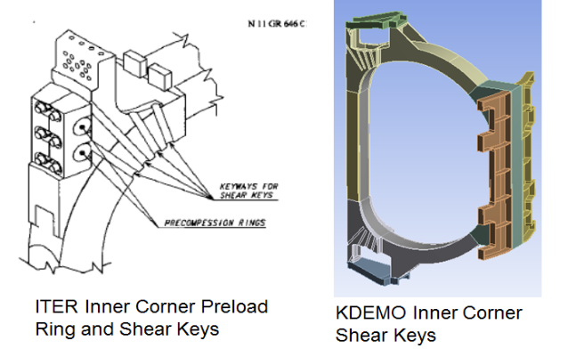

Carrying the Inner Leg Torsional  Shear FNSF, KDEMO are much like ITER – Shear Pins are Needed 

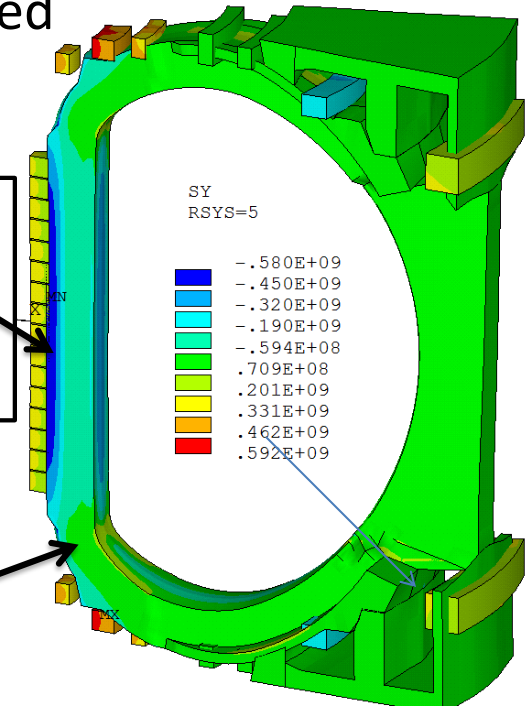

Plenty of wedge pressure at the nose. Good to carry 60 to 180 Mpa shear. De-Wedged. Probably needs keys 

## Include Full Time Dependent Scenario in Initial Sizing – Not just Equilibria 

Original FNSF Scenario had stresses that were too high 

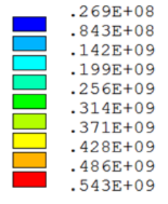

“Smeared” Tresca Stress Results for the Central Solenoid Winding Pack. Multiply by ~2 to get the Metal Stress 

The most recent (November 2015) CS is OK Now in Terms of Hoop Stress 

A Ninth Upper and Lower CS Segment was Added to Reduce the CS Stress 

## Typical Superconductors 

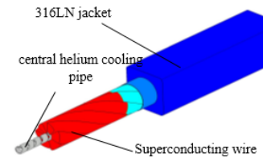

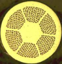

The Bi-2212 Wire 

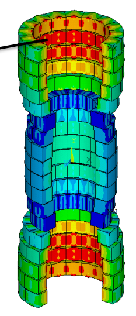

Symmetry Expansion with a Better View of the ID Hoop Stress 

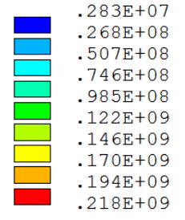

Tresca Stress 

## Model 

## Field 

Hoop Stress 

## Axial Stress 

To get acceptable CS stresses we had to add a 9[th] coil, add build  and steal space from the TF To get acceptable TF stresses we had to investigate another coil support scheme 

Model  shown with Symmetry Expansion. Equatorial Plane Constraints are Used. The peak field is 12.65T 

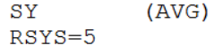

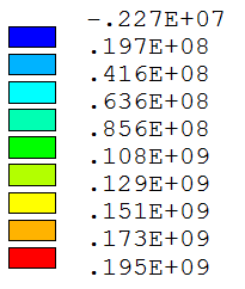

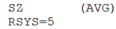

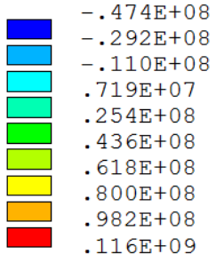

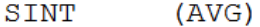

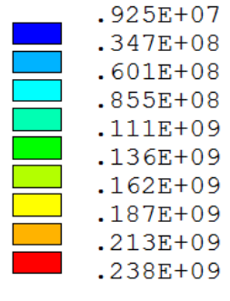

## **IGNITOR** 

## Structural Concepts That Might be Useful for US FNSF and Future HTS 

The failure stresses ,Tresca and Von Mises are related to the imbalance of stress. If you can approach a hydrostatic  state in the inner leg then the tokamak can take larger magnetic pressures. BUCKED and WEDGED Concepts like IGNITOR take advantage of this . 

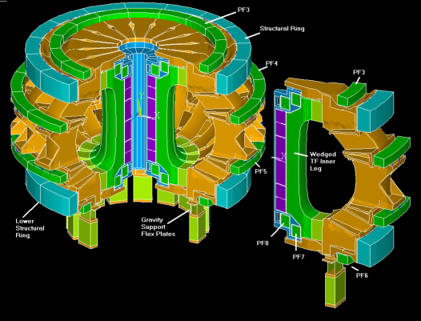

Preload 

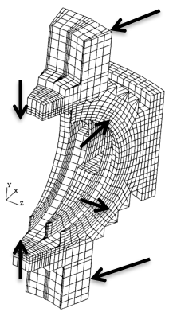

Concepts with large preload rings like IGNITOR and FIRE seek to take advantage of this – For normal magnets, managing the thermal expansion is difficult and in IGNITOR led to an active preload system.  For superconducting magnets thermal expansion during the shot is not a problem. For CICC the He voids make approaching  a hydrostatic state impossible. HTS may be better. 

Bucked Wedged 

Ring Preload Compresses the Inner Leg 

Dec. 2016 – January 2017 – **Buck and Wedge** allows increasing the OH current center radius from .85 to .9. and Increasing the OH build from .4 to .6 m , OH OR= 1.2 m.    OH Currents scaled down by .892 (Preserves Volt Seconds). OH Current Densities and Stresses drop by 50% 

## FNSF Bucked & Wedged Solution P. H. Titus,  Jan 10, 2017 

Princeton Plasma Physics Laboratory ptitus@pppl.gov 

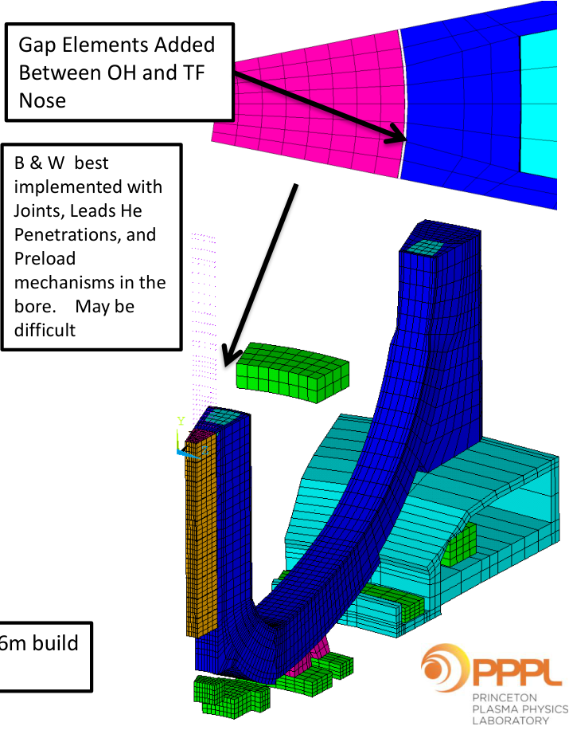

**----- Start of picture text -----** 
Gap Elements Added Between OH and TF Nose B & W  best implemented with Joints, Leads He Penetrations, and Preload mechanisms in the bore. May be difficult **----- End of picture text -----** 

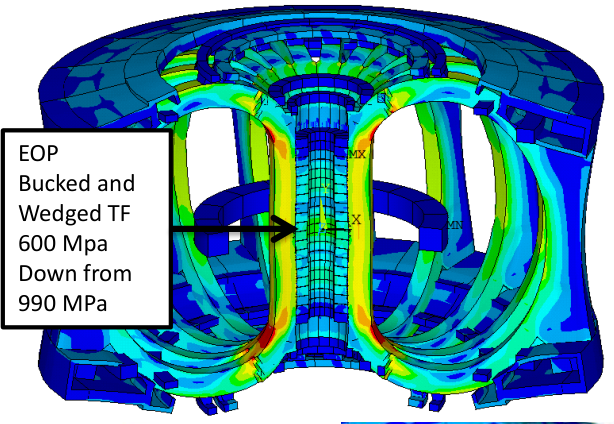

**----- Start of picture text -----** 
EOP Bucked and Wedged TF 600 Mpa Down from 990 MPa **----- End of picture text -----** 

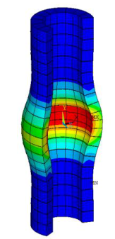

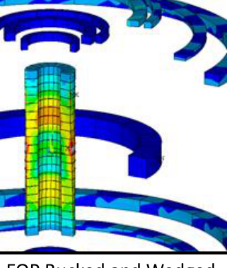

EOP Free Standing , EOP Bucked and Wedged  .6m build Original .4m Build, 1.9GPa , 495 MPa 

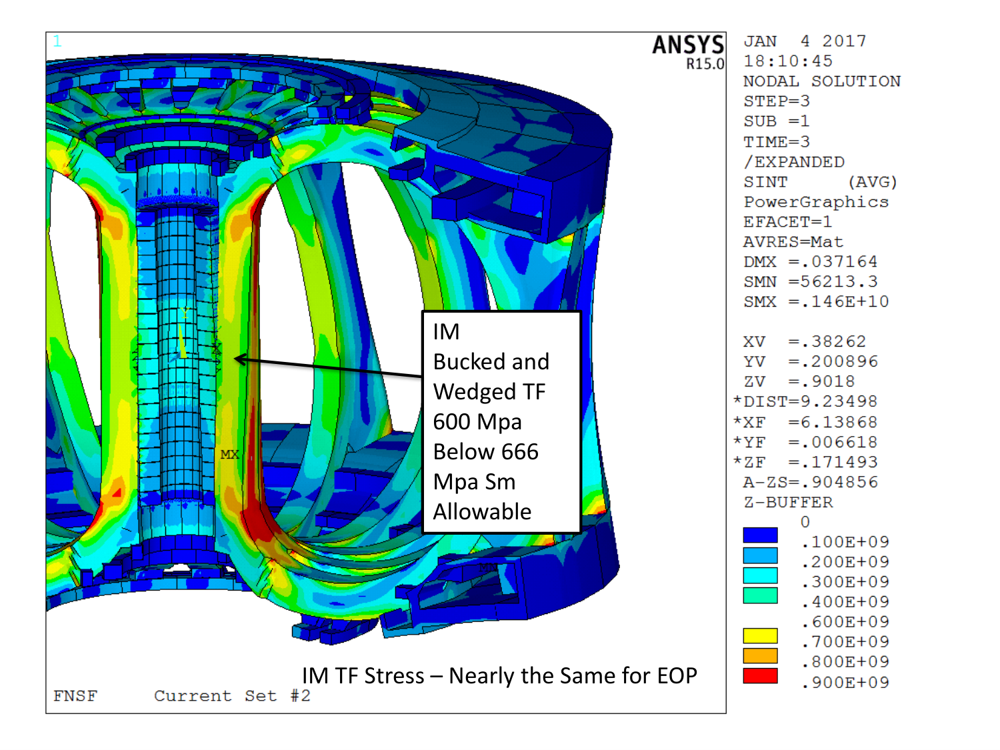

**----- Start of picture text -----** 
IM Bucked and Wedged TF 600 Mpa Below 666 Mpa Sm Allowable IM TF Stress – Nearly the Same for EOP **----- End of picture text -----** 

## Comparison of OH Stresses – Free Standing vs. Bucked and Wedged. 

IM Free Standing 540 MPa 

IM Bucked and Wedged 495MPa 

EOP Free Standing 720 MPa 

EOP Bucked and Wedged495 MPa 

## Buck and Wedge vs. Wedge Only All Results are For OH r=.9, dr=.6m 

Allowable TF Stress =1GPa Peak,666 PM 

OH Smeared Static Allowable =330 to 500 MPa Depending on the contribution  from the conductor 

B & W Improves  the stress state of both the OH and TF 

OH can be improved by stealing a little more space from the TF 

B & W  best implemented with Joints, Leads He Penetrations, and preload mechanisms in the bore. May be difficult 

## **US FNSF Conclusion** 

• With the added radial structure and added structure above and below the horizontal port, the outer leg TF stress is similar to that which was qualified cyclically for ITER (in its inner leg). The FNSF should have less restrictive fatigue requirements. The important conclusion is that  RADIAL SERVICING is possible with adequate stress margins for the coil structures. 

- Inner leg torsional shear will need features like ITER. Shear keys in the corner and possibly corner tensioned rings. 

- Inner Leg Stress is still  a bit too high Some modest reallocation of metal cross sections may still be needed. Improved yield stainless steels are an option. More steel with  less space for conductor may be possible with HTS. Limit Analysis was used to qualify K-Demo Stress. 

## HTS and Solder Filled Nb3Sn Have the Potential of Carrying More Structural Load ? 

LTS with He for LTS with He for AC Stability  may AC Stability not be needed for low dB/dt in Demo  - Go bact to conduction Winding pack modulus cooled react and estimated to be 70  Gpa for ITERwind? Like CICC , No credit for reacted, cabled strand 

LTS with He for AC Stability 

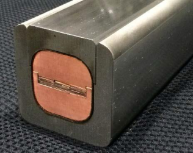

HTS for DC Operation Or Very Long Pulse Tokamak? 

Winding Pack modulus estimated to be 175 Gpa from the mixture rule. Essentially all metal 

Primary Stress ~666 PeaK Stress is 828 MPa 

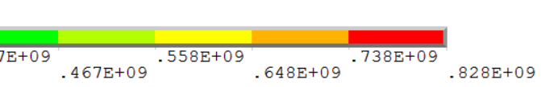

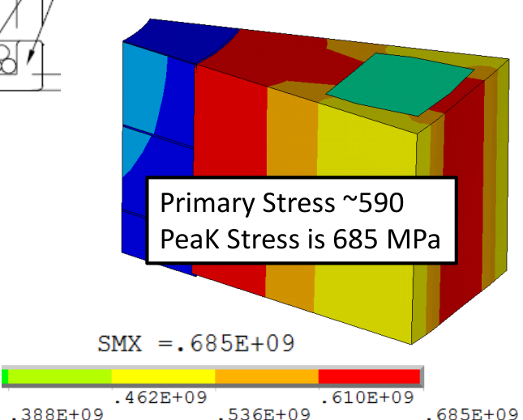

**----- Start of picture text -----** 
Primary Stress ~590 PeaK Stress is 685 MPa **----- End of picture text -----** 

## Conclusions 

- DEMO is approaching a static stress state and requires less emphasis on fatigue. 

- Consider retaining Sm, 1.5 Sm and 3*Sm Allowables 

- Use Limit Analysis to decompose FEA stress into a primary load evaluation. 

- Introduce fast fracture checks based on initial NDE of components – use 2 on flaw size – maybe 2 on fracture toughness? 

- Radial servicing can be qualified for out-of-plane loads. 

- Vertical servicing has similar 

- Non-Constant Tension Dee TF Coils can be used to optimize PF performance and global structural requiremens 

- Remember to size the central  column including the central solenoid based on a time dependent scenarios – not just equilibria 

- Consider other structural concepts – Bucked or bucked and wedged. Consider preload systems to off load central column stress 

- Take advantage of conductors that can contribute to the coil structure –REPCO Tapes, Solder filled Nb3Sn 

## References 

- Peter H. Titus & Ali Zolfaghari (2013) TF Inner Leg Space Allocation for Pilot Plant Design Studies, Fusion Science and Technology, 64:3, 680-686, DOI: 10.13182/FST13- A19171 (Nashville TOFE) 

- To link to this article: https://doi.org/10.13182/FST13-A19171 

- Magnet Structural Design Criteria  Part I: Main Structural Components and Welds, Mitchel, Jong,Alekseev 

- Fusion Energy Systems Studies (FESS) FNSF Study Year-End Report for 2015  C. E. Kessel1, J. Blanchard2, A. Davis2, L. El-guebaly2, L. Garrison3, N. Ghoniem4, Y. Huang4, P. Humrickhouse5, Y. Katoh3, A. Khodak1, S. Malang6, N. Morley4, M. Rensink7, T. Rognlien7, A. Rowcliffe3, S. Smolentsev4, P. Snyder8, M. Tillack9, P. Titus1, L. Waganer6, A. Ying4, K. Young1, and Y. Zhai1     Nucl. Fusion **55** (2015) 053027 (9pp) 

- “ITER TF Magnet System Analyses in Faulted Conditions”  IEEE TRANSACTIONS ON APPLIED SUPERCONDUCTIVITY, VOL. 26, NO. 4, JUNE 2016Gabriele D’Amico, Luigi Reccia, Alfredo Portone, Cornelis T. J. Jong, and Neil Mitchell 

- Design concept of K-DEMO for near-term implementation   K. Kim1, K. Im1, H.C. Kim1, S. Oh1, J.S. Park1, S. Kwon1, 

- • Y.S. Lee1, J.H. Yeom1, C. Lee1, G-S. Lee1, G. Neilson2, C. Kessel2, T. Brown2, P. Titus2, D. Mikkelsen2 and Y. Zhai2 

- Magnet Design Considerations for Fusion Nuclear ... - IEEE Xplore ieeexplore.ieee.org/iel7/77/6353170/07415959.pdfY. Zhai, C. Kessel, L. El-Guebaly and P. Titus 

- 1. T. BROWN et al., “Comparison of options for a PILOT Plant Fusion Nuclear Mission,” TOFE2012 Proceedings 

- Fusion Sci. Technol., 64 (2013). 

- 2. C. T. J. JONG, N. MITCHELL, J. KNASTER, 

- "ITER Magnet Design Criteria and their Impact on Manufacturing and Assembly," Fusion Engineering, 

- 2007. SOFE 2007. 2007 IEEE 22nd Symposium on, 1, (4) 17-21, June 2007. doi: 10.1109/FUSION.2007.4337879C. 

- 3. I. ZATZ, EDITOR NSTX (National Spherical Torus Experiment) “Structural Design Criteria,” NSTXCRIT-0001-01 February 2010. 

- 4. M.B. KASEN et al. "Mechanical, Electrical and Thermal Characterization of G10CR and G11CR 

- Glass Cloth/Epoxy Laminates Between Room 

- Temperature and 4 deg. K," 

# Back-Up Slides 

## Orthotropic “smeared” Material Properties of the TFWP Used in 3D Global Non-linear Model (ITER_D_2MVZNX) 

|Ex|60.7GPa|
|---|---|
|Ey|100.GPa|
|Ez|48.9GPa|
|Gxy|27.2GPa|
|Gyz|22.7GPa|
|Gxz|6.44GPa|
|νxy|0.239|
|νyz|0.243|
|νzx|0.159|
|x(for293K to 4K)|0.304%|
|y(for293K to 4K)|0.299%|
|z(for293K to 4K)|0.318%|

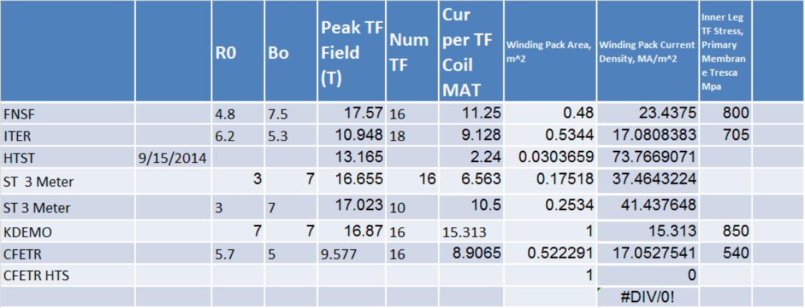

Base cable: 40 tapes, 4 mm width, 0.1 mm YBCO  Tape Ic (4.2K, 20T) = 170 A 

MIT TSTC Conductor – Achieved at NHMFL 6 kA TSTC   0.01 x 0.01 m = 1e-4 m[2] 1000 turns -> A = 0.1 m[2] Overall Je = 60 A/mm[2] 

HTS could reduce the 10 mm required cross  section and thus inner leg stresses 10 mm 

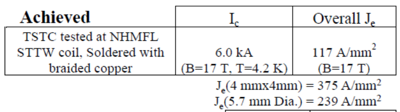

## ….Just to Document the TF Radii and Centers and PF r,z,dr,dz Used 

FNSF 

TF and PF Structural Analysis Results Peter H. Titus,Princeton Plasma Physics Laboratory 20151013    14:36:45 

FNSF has  16  TF Coils, with  1  turns per coil 

FNSF has  a major radius of  4.8 m  with a toroidal field of  7.5  at Ro FNSF has  a minor radius of  1.2  m 

Case Radius set to  3  Case Width set to  .8035 

OIS Radius set to  3  Case Width set to  3 

Section filename=wba4 divx,divy=  2              2 Case Radius set to  2.8  Case Width set to  .8035 Nose radius set to  1.1 

FNSF Path has  7  Points in the TF Path 

FNSF has  33  Poloidal Field (PF) Coils 

FNSF has  2  Poloidal Field (PF) Currents in the Scenario Scenario  2  is being analyzed 

Each TF sector is  22.5  degrees 

The current per TF coil is:  11250358.  amps 

The first inner corner radius was chosen as 3.73092312.8833=.8476m 

!Pr    Pz    Pang   FNSF Path Specs PATH 7 

s,1.8833 , 0 , 2 , 0 t,0 , 3.7309231 , 0 , 20 r,2.8833 , 3.7309231 , 20 , 5 r,3.3531463 , 3.559913 , 20 , 10 r,3.7361685 , 3.2385192 , 50 , 20 r,3.7361685 ,-6.7614808 , 15 , 20 r,5.5479018 ,-4.8262461e-10 , 75 , 20 

## PF R,Z,ND,DZ,NX,NY 

## PF, Cur 1,Cur2 

|PF R,Z,ND,DZ,NX,NY|PF, Cur 1,Cur2|
|---|---|
|1 , .85 , .2 , .4 , .39 , 4 , 4|1 , 0 ,-4.42 , 0 , 0 , 0 , 0 , 0|
|2 , .85 , .6 , .4 , .39 , 4 , 4|2 , 0 ,-4.42 , 0 , 0 , 0 , 0 , 0|
|3 , .85 , 1 , .4 , .39 , 4 , 4|3 , 0 ,-4.42 , 0 , 0 , 0 , 0 , 0|
|4 , .85 , 1.4 , .4 , .39 , 4 , 4|4 , 0 ,-4.42 , 0 , 0 , 0 , 0 , 0|
|5 , .85 , 1.8 , .4 , .39 , 4 , 4|5 , 0 , 4.67 , 0 , 0 , 0 , 0 , 0|
|6 , .85 , 2.2 , .4 , .39 , 4 , 4|6 , 0 , 4.67 , 0 , 0 , 0 , 0 , 0|
|7 , .85 , 2.6 , .4 , .39 , 4 , 4|7 , 0 , 4.67 , 0 , 0 , 0 , 0 , 0|
|8 , .85 , 3 , .4 , .39 , 4 , 4|8 , 0 , 4.67 , 0 , 0 , 0 , 0 , 0|
|9 , .85 , 3.4 , .4 , .39 , 4 , 4|9 , 0 , 4.67 , 0 , 0 , 0 , 0 , 0|
|10 , 1.25 , 5.35 , .3 , .4 , 4 , 4|10 , 0 , 4.04 , 0 , 0 , 0 , 0 , 0|
|11 , 1.95 , 5.85 , .5 , .4 , 4 , 4|11 , 0 , 5.98 , 0 , 0 , 0 , 0 , 0|
|12 , 2.65 , 6 , .3 , .4 , 4 , 4|12 , 0 , 6.91 , 0 , 0 , 0 , 0 , 0|
|13 , 4.4 , 6.3 , .6 , .3 , 4 , 4|13 , 0 , 1.33 , 0 , 0 , 0 , 0 , 0|
|14 , 5.15 , 6.25 , .4 , .3 , 4 , 4|14 , 0 , 2.32 , 0 , 0 , 0 , 0 , 0|
|15 , 7.25 , 5.8 , .6 , .3 , 4 , 4|15 , 0 , 7.23 , 0 , 0 , 0 , 0 , 0|
|16 , 8.75 , 5 , .8 , .6 , 4 , 4|16 , 0 ,-14.36 , 0 , 0 , 0 , 0 , 0|

## TF+PF Field Plot 

Max Field is 17.375T (4 X 4 mesh) where the 1/r field and the solenoidal field from the corner radius add. Also the OH Field adds. The 6 X 6 mesh produces a max field of 17.57T 

One drawback of the TF Shape is the Peak Field in the Corner – Greater than the quoted 16 T 

17.2054T 

Max Field is where 17.375T the 1/r field and the solenoidal field from the corner radius add. The 6 X 6 mesh produces a max field of 17.57T 

17.228T 

17.232T 

Field is slightly above 17T because of local geometry effects. Reduce ripple, and reduce sharp TF inner corner radius 

