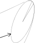
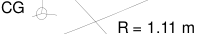
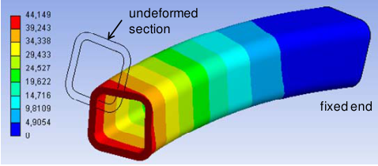
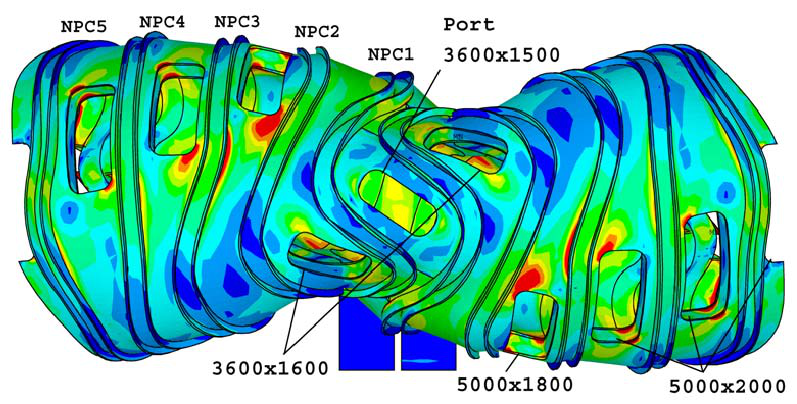
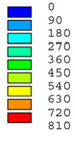
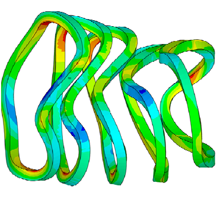
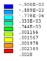
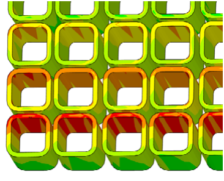
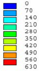
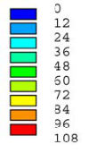

## **Coil winding pack FE-analysis for a HELIAS reactor** 

## F. Schauer, K. Egorov, V. Bykov 

_Max-Planck-Institut für Plasmaphysik, Euratom Association, Teilinstitut Greifswald, Wendelsteinstr. 1, 17491 Greifswald, Germany_ 

At the Max-Planck-Institut fuer Plasmaphysik (IPP) a reference design is being created of an upgraded fiveperiodic HELIAS type stellarator reactor which evolves from Wendelstein 7-X (W7-X) by scaling of the coil centre line geometries by a factor of four. This reactor type was extensively investigated at IPP with regard to physical characteristics and to some extent also to engineering issues. The upgrade concerns an increase of the induction at the plasma axis and correspondingly at the superconductor. 

The aim is to develop the reactor concept to a stage and such detail that major engineering problems are unveiled, and relevant comparisons with other concepts, including tokamaks, can be drawn in view of upcoming decisions concerning a DEMO reactor. Even though progress in plasma physics, and in particular future results of W7-X and other machines - particularly of ITER - will probably lead to somewhat different coil shapes, no principal changes of the reference design are expected. 

In this paper the option of a roll-formed square coil cable jacket is investigated. Detailed structural FE analysis of the coil winding pack demonstrates the feasibility of such a conductor which appears to be the most economical option. It also allows sufficient space for a cable current density very similar to that of the ITER TF coil with a similar overall winding pack cross section of ≈ 0.5 m². Already existing Nb3Sn conductors could thus be safely applied in such a HELIAS reactor. Obvious progress of superconductor technology, particularly concerning Nb3Al, will be beneficial concerning savings of conductor material, ease of manufacture, higher operation temperature, etc. 

Keywords: stellarator, reactor, HELIAS, magnet, superconductor, winding pack, Wendelstein 7-X 

## **1. Introduction** 

Based on previous studies on helical advanced stellarator (HELIAS) reactors (HSR) at IPP [1-7], activities have started regarding the further development of this conceptual design. The chosen type, HSR5/22 (5 periods, 22 m torus radius; also known as "HSR5" or "HSR22") is derived from the currently built W7-X experiment by scaling the coil centre line geometry and thus the main dimensions by a factor of four. Consequently, the stellarator field configuration and thus the basic plasma physics remain the same. The upgrade from HSR5/22 to the new "HSR50a" concerns the increase of induction from ≈ 5 T to ≈ 5.6 T at the plasma axis corresponding to ≈ 10 T and ≈ 12 T, respectively, at the maximally loaded coil conductor [8]. 

The five-periodic machine configuration was found to be most promising concerning plasma performance, and consequently the consecutive IPP modular stellarator experiments W7-AS and W7-X were designed this way. The highly successful W7-AS [9] confirmed the concept. Even though previous investigations on HSRs showed the potential of three and four periodic reactors for better economy [5,7], we decided to stick to the five periods for this reference design as the safest solution, keeping in mind that results from W7-X as an intermediate step on the road to such a reactor will be available in a few years. These and later achievements of ITER and other machines will lead to a final optimization of the coil shapes, and then one can decide whether to go for a smaller four- or even three-periodic machine. Since the coil types and sizes remain the same, the reference design could be adapted with relatively low effort. 

In order to allow for a fair comparison with the more advanced tokamak designs, particularly in view of upcoming strategical decisions concerning the DEMOreactor, it is indispensable to update the previous HSR5work and to develop a more detailed machine concept. Meanwhile one can greatly benefit from advanced technologies as well as physical and engineering experiences gained with W7-X and other projects worldwide, particularly with ITER. 

HSR5/22 was planned for 3 GW of fusion power with 10 T at the coil conductor. This would allow to use a NbTi superconductor cable with superfluid He cooling at 1.8 K. However, already available advanced Nb3Sn and Nb3Al conductors - or possibly future high temperature superconductors – allow to create stronger magnetic fields with significantly reduced cooling requirements. The maximal field of such a reactor would then be limited mainly by structural integrity. Around 12 T at the conductor of HSR50a is a reasonable choice for a basic design. It provides a comfortable safety margin concerning the confinement time which roughly scales with B[0.8] [4], and future results of W7-X will show whether one has really to exploit 12 T or whether one could save on conductor and structure mass, cooling requirements, etc., in trade-off with fusion power. 

The size of HSR5/22 is mainly enforced by space requirements for the blanket and neutron shield. The minimal distance between plasma boundary and coils is, similarly to tokamaks [10], about 1.5 m which leaves ≈ 1 m for the blanket and neutron shield, and the rest for the vacuum vessel as well as the thermal shield [3]. Due to its large plasma surface, the HSR22 renders relatively 

________________________________________________________________________________ felix.schauer@ipp.mpg.de_ 

low average and peak neutron wall loads of 1 MW/m² and 1.7 MW/m², respectively [2]. This has to be compared to ≈ 2 MW/m² and 3 MW/m², respectively, in tokamaks [10] which means that the stellarator first wall and blanket replacement intervals can be increased, or the reactor size correspondingly reduced. 

HSR50a is intended as an engineering study which later can be adapted to W7-X and ITER results. The "basic machine", consisting of the magnet system including the mechanical structure and cryostat, shall be designed first. The cryostat encompasses the plasma vessel (PV), outer vessel (OV), ports, and thermal insulation built up of the shield and possibly multilayer insulation. The components within the PV can then be adapted from available designs, and concepts for remote handling, maintenance, and first wall as well as blanket replacement can be worked out. Most of these topics were considered already in the previous HELIAS studies, but need to be updated and substantiated. 

The magnet system of HSR50a consists of 50 nonplanar coils, evenly distributed throughout five identical modules. Each module consists of two flip-symmetrical half-modules encompassing 5 non-planar coils of different geometries. 

Coincidentally, all coil centre line lengths of HSR5 and thus HSR50a are maximally 3 % below the corresponding ITER toroidal field coil (TFC) circumference of 34.5 m [11]. The maximal conductor induction is similar in both machines around 12 T, and the local peak forces per coil unit length are only ≈ 20% larger in HSR50a. This comparison suggests itself to base a first HSR5 coil design iteration upon the ITER TFC and to transfer the extensively developed ITER-technologies wherever applicable. It was demonstrated that ITER's superconductor and winding pack concept, including electrical insulation, can be adapted to HSR50a, as well as the electrical design concerning power supply, voltage levels and quench protection [8]. 

In this paper further mechanical analyses are presented which confirm the first results that HSR50a can be built with a reasonable structure. In addition, it is now shown that a cheaper roll-formed square cable jacket, as in most of the JT-60SA EF coils [12], can be used instead of the previously assumed round-in-square type with the additional advantage of getting a larger conductor cross section. For the time being it seems that radial plates like in the ITER TFC [11] can be avoided. 

## **2. Coil cable and winding pack** 

It  was shown [8] that Nb3Sn or preferably Nb3Al cables with a diameter of 44 mm and a central channel of 10 mm would be suitable for HSR50a. With the new cable design (Fig. 1) one gains an additional section factor of 1.26 which is coincidentally the same as the HSR50a to ITER TFC current ratio 86/68 kA/kA. With the somewhat higher induction in HSR50a (s. table 1), the critical current decreases by ≈ 15 % at operation conditions T = 4.7 K and intrinsic strain ε i = -0.7 % [13, 14]. The ITER strand (diam. 0.82 mm, Cu/non-Cu ratio 1:1) 

Fig. 1 Conductor and electrical insulation arrangement (mm). 

specification requires a critical current Ic ≥ 190 A at 4.22 K, 12 T, assuming ε i = -0.2 % [11]. This value contains some safety margin since the prototype strands described in ref. [13] reach under these conditions currents between 237 A and 265 A. The Jc-decrease of 15 % due to the higher field at the conductor is thus comfortably covered already by the ITER safety margin for strand manufacture. Since even better Nb3Sn-strands are available already today and further improvements are expected [15,16], one can safely assume that the stellarator coils can be built with an ITER-like Nb3Sn cable. In addition, a HSR is a steady state machine without plasma disruptions and reduced AC and stability requirements, i.e. reduced corresponding safety margin demands. 

A “state of the art” Nb3Al strand with the same nonCu cross section as the ITER wire exhibits a critical strand current of 380 A at 4.22 K, 12 T and ε i = -0.2 %. With an operational ε i = -0.7 %, the Ic decreases only by 15 % [17]. Contrary to that, the Ic of a Nb3Sn strand degrades by ≈ 50 % at the same strain. Much superconductor cross section could thus be saved with Nb3Al. 

Considering the smallest HSR50a coil curvature radius of 1.11 m (Fig. 2), a react-and-wind technique would introduce additional compressive strain on the order of 2 % which is with present-day Nb3Sn or Nb3Al conductors not acceptable. Therefore, one would produce the coil with a similar wind-and-react and transfer technique as the ITER TFC and react the conductor in an oven of similar size. Insulation appli- 

Table 1: Main data of ITER and HSR50a 

||ITER|HSR50a|
|---|---|---|
|Major radius, m|6.2|22|
|Av. minor radius, m|2.0|1.8|
|Plasma volume, m³|837|1407|
|No. of coilsa|18|50|
|Av. field plasma axis, T|5.3|5.6|
|Max. field on coilsa, T|11.8|12.3|
|Superconductor|Nb3Sn|Nb3Al, Nb3Sn|
|Stored energya, GJ|41|152|
|Fusion power, MW|500|3000|

a) ITER TF coil system 

**----- Start of picture text -----** 
CG R = 1.11 m **----- End of picture text -----** 

Fig. 2 Central current filament of coil 2 with largest curvature of all coils (curvature circle segment corresponds to conductor piece in fig. 3). CG = centre of gravity. 

cation and handling of the 3D double pancakes should correspond to the ITER TFC procedure without works associated with the radial plates. However, progress is being made in developing less strain sensitive Nb3Sn as well as Nb3Al strands for better handling at room temperature [15-18], so assembly of future winding packs should become  much easier anyway. 

3D cable jacket bending for the stellarator coils is certainly more difficult than for the planar ITER TFCs. The bending effort also depends on the winding pack (WP) cross section orientation which is free to rotate around the central current filament (CCF) without significantly influencing the stellarator field and structure. The WP orientation has to be optimized regarding space requirements and ease of manufacture. 

For W7-X each coil segment was adjusted individually; for HSR50a more general rules to orientate the cross sections are being investigated. For instance, one could align the section normal vectors **n** of a coil parallel to a plane from which the 3D-deflections are minimal [8], or parallel to one which contains the torus axis and the coil centre of gravity (CG). This would allow conductor bending around axes parallel and perpendicular to **n** only, and yield rather smooth coils of the Types 3, 4, and 5 which have moderate curvatures. For the time being the latter WP section orientation was chosen with few exceptions for the FE analysis. Another option providing a smooth run of the WP along the coil would be to align the normal vectors parallel to the connecting lines from a certain point (pole) near the CG. Fig. 3 shows the corresponding deformation of a 313 mm long cable jacket piece within coil 2 at the maximal curvature region (indicated by the circle segment in figure 2). The bending angle is 16.1°, twist around the conductor axis 3.5°, the maximal total bending moment is 4.1 kN·m,  and max. plastic strain is ≈ 2.8 % (no over-bending considered). Other options are also under consideration, but final decisions can be taken only when a more detailed design and results of practical bending tests are available. 

**----- Start of picture text -----** 
undeformed section fixed end **----- End of picture text -----** 

Table 2: Winding pack data for ITER TFC and HSR50a 

||ITER|HSR50a|
|---|---|---|
|Cable current, kA|68|86|
|No. of cable turns|134|156|
|Operation temperature, K|4.7|4.7|
|No. of superconducting strands|900|1134|
|No. of copper strands|522|657|
|Cable section w/o channel, mm²|1178|1489|
|Outer jacket dimensions, mm|φ44|53x53|
|Conductor insulation, mm|1|1.5|
|Double pancake insulationa, mm|3|3|
|Ground insulation, mm|7|7|
|Winding pack embedding, mm|4|4|

a) Additional radial plate insulation of 1 mm in ITER TFC 

## **3. Magnet system structure** 

Fig. 4 shows the double shell structure [8] with improvements and larger port windows. The stress intensity is low within most of the structure with only some local maxima exceeding the standard allowable membrane plus bending stress limits of typically 750 MPa for steel 316 LN which is acceptable. Detailing and optimization with massive reduction of material will be performed in a next step. 

Based on this structure and the above cable layout (fig. 1) the coil winding packs were analysed in more detail. Fig. 5 shows the longitudinal strain within the winding packs which stay everywhere below 0.3 %. Fig. 6 indicates the stress intensity of the conductor jackets in one of the highly loaded coil cross sections (in coil 5). The maximum of 630 MPa is well below the allowable limit for 316 LN. Fig. 7 shows the moderate stress intensities within the conductor, double pancake (DP), and ground insulations on the assumption that sliding is allowed on both sides of the DP and ground insulations, respectively. This can be achieved by applying separating foils before impregnation to avoid dangerous shear and tension stresses during operation. 

## **4. Conclusion and outlook** 

Structural analysis of the coil winding packs showed that a cost-efficient roll-formed square cable jacket is feasible for the 5-periodic HELIAS reactor HSR50a. In addition, this jacket type yields sufficient space for a cable current density very similar to that of the ITER TF coil. Therefore, Nb3Sn conductors of ITER quality could be safely applied without the necessity to increase the coil cross section, or to rely upon future conductor improvements. However, conductors with better quality than ITER specification are already available, and considerable improvements are to be expected in the medium term. Particularly the developments concerning Nb3Al conductors are progressing quickly, and this material would be much better suited for reactor coils due to its relative insensitivity regarding strain. The expected increase of conductor qualities will allow for reduction of superconductor mass, easier manufacture, and/or increased operation temperature. 

In a next step the shell structure mass will be reduced and interfaces to the coil casings developed. 

Fig. 3 Bent jacket from largest curvature region (mm). 

Fig. 4 Stress intensity (MPa) in magnet system and maximally possible port windows (mm); structure not yet optimized. 

Fig. 5 Longitudinal strain within  winding packs. 

Fig. 6 Stress intensity in conductor jacket (MPa). 

- [5]   H. Wobig et al., Proc. 19th IAEA Fusion Energy Conf., Lyon, IAEA-CN-94 (2002),  FT/1-6 

Fig. 7 Stress intensity in WP insulation (MPa) 

- [6]  H. Wobig et al., IPP-Report III/244 (1999). 

- [7] H. Wobig et. al., 36th EPS Conf. on Plasma Phys. Sofia, 2009, ECA Vol.33E, P-4.192, 2009 

- [8]    F. Schauer et. al., Contrib. Plasma Phys. 50, No. 8 (2010) 750 – 755 

- [9] F. Wagner et. al., Proc. 19th Fus. Energy Conf., Lyon 2002, Ed. M. Spak, IAEA 2003, OV/2-4 

- [10] D. Maisonnier et al., April 13th, 2005, EFDA(05)27/4.10,  rev. 1, EFDA-RP-RE-5.0 

- [11] ITER Design  descr. doc. DDD11, 7. Conductors (2009) [12] K. Tsuchiya et. al., Fus. Eng. Des. 82 (2007)1519-152 [13] X. F. Lu et al., Supercond. Sci. Technol. 21 (2008) 105016 (11pp) 

- [14] Y. Nunoya et al., IEEE Trans. on Appl. Superconduct., Vol. 18, No. 2 (2008) 1055 -1058 

## **References** 

- [1]    H. Wobig and F. Wagner, Landolt-Boernstein - Group VIII Adv. Mat. and Technol., Vol. 3B Energy Technologies, Nucl. Energy, Chapt.7 (2005)  418 – 452 

- [2]  C. D. Beidler et al., Proc. 18th IAEA Fusion Energy Conference 2000, Sorrento, Italy 

- [3]  T. Amano et al., Proc. 10th Int. Toki Conf. on Plasma Physics and Control. Nuclear Fusion (ITC-10), TokiCity, Japan, January 18-21, 2000 

   - [15] J. A. Parrell, IEEE Transactions on Applied Superconductivity, Vol. 19, No. 3 (2009) 2573 - 2579 

   - [16] N. Cheggour, Supercond. Sci. Technol. 23 (2010) 052002 (4pp) 

   - [17] T. Hemmi, IEEE Transactions On Applied Superconductivity, Vol. 19, No. 3 (2009) 1540 – 1543 

   - [18] T. Takeuchi  et al., Cryogenics 48 (2008) 371-380 

- [4]  H. Wobig et al., Proc. 17th IAEA Conf. o. Fus. Energy, Yokohama 1998, IAEA-F1-CN-69/FTP/01 

