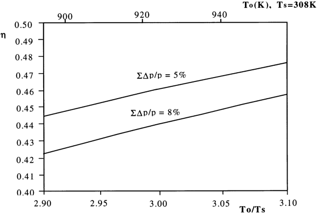
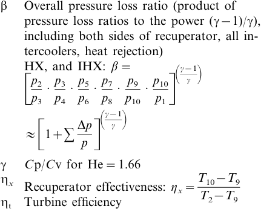
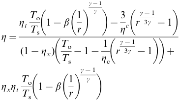
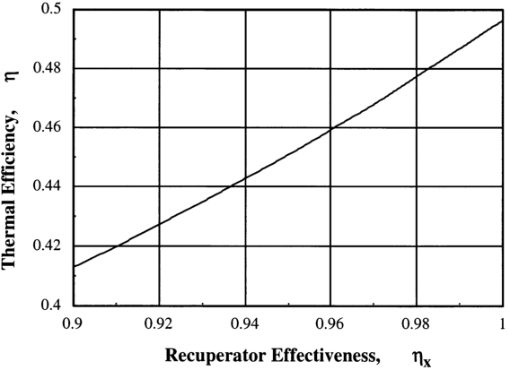
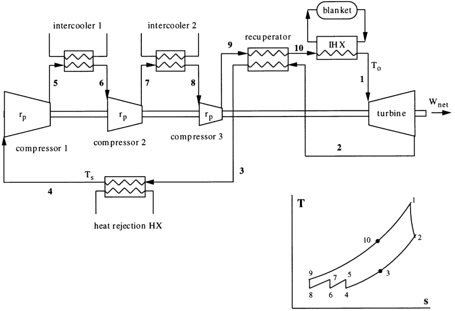

Fusion Engineering and Design 41 (1998) 561–567 

# Combination of a self-cooled liquid metal breeder blanket with a turbine conversion gas power system 

## S. Malang[a,] *, H. Schnauder[a] , M.S. Tillack[b] 

a _Forschungszentrum Karlsruhe GmbH_ , _Postfach_ 3640, _D_ -76021 _Karlsruhe_ , _Germany_ b _Fusion Energy Research Program_ , _UC_ - _San Diego_ , 9500 _Gilman Dri_ � _e_ , _La Jolla_ , _CA_ 92093-0417, _USA_ 

## **Abstract** 

Self-cooled liquid metal breeder blankets have a high potential to meet the overall goal of fusion research to develop an economically and environmentally attractive energy source. They offer the possibility to design mechanically simple blanket segments, employ a high-temperature, low-pressure coolant, allow for a high power density, and as consequences of these, achieve high efficiency and availability with relatively low cost. A major concern with self-cooled blankets is the high chemical reactivity of lithium with water. A secondary heat transport loop is usually required between the primary lithium loop and the steam/water loop of the Rankine cycle in the power conversion. The potential for liquid metal–water reactions is eliminated if the Rankine cycle is replaced by a Brayton cycle, employing a closed cycle helium gas turbine. This paper describes a system combining a self-cooled blanket with a closed cycle helium gas turbine in order to combine the advantages of self-cooled blankets with the ones of high temperature gas-cooled concepts. Scoping calculations assuming a maximum lithium temperature of 670°C and a maximum helium pressure of 18MPa have shown that the gas turbine cycle results in about the same overall thermal efficiency as an advanced Rankine cycle (46%). © 1998 Elsevier Science Ireland Ltd. All rights reserved. 

## **1. Introduction** 

The ultimate goal of fusion research is the development of an economically and environmentally attractive energy source. This goal should set the guidelines for the selection of concepts and materials for nuclear components. Breeding blankets have a decisive influence on the attractiveness of a fusion power plant as they can determine, to a large degree, the overall efficiency, availability, environmental iMPact and consequently, the cost of electricity. Self-cooled liquid metal breeder 

* Corresponding author. 

blankets have a high potential to meet the overall goal. They offer the possibility to design mechanically simple blanket segments, employ a high temperature, low pressure coolant, allow for a high power density, and as consequences of these, achieve high efficiency and availability with relatively low costs. The combination of vanadium alloy and lithium coolant, particularly allows high neutron wall loads and power conversion systems with high efficiency. The low coolant pressure enables a design with minimum primary stresses, resulting in exceptionally long lifetimes of nuclear components since the allowable neutron fluence for vanadium alloys is probably limited by irradi- 

0920-3796/98/$19.00 © 1998 Elsevier Science Ireland Ltd. All rights reserved. PII S0920-3796(98)00220-8 

ation creep only and not by swelling or helium embrittlement [1]. 

A major concern with self-cooled lithium blankets is the high chemical reactivity of this liquid metal with water. To avoid such a reaction which could release high energy and large amounts of hydrogen, water has to be eliminated as a coolant inside the plasma chamber. However, even in this case, a potential liquid metal–water reaction can occur if a Rankine cycle based on a steam turbine is employed in the power conversion system. This risk is mitigated by the use of a secondary heat transport loop between the primary lithium system and the water/steam system, employing sodium, sodium–potassium or a molten salt as the heat transport medium. However, this risk can be completely avoided if the Rankine cycle is replaced by a Brayton cycle, employing a closed cycle helium gas turbine. Such a system was proposed [2] for a gas-cooled lithium blanket. A gross efficiency of 46% is claimed for this system, achievable with a system pressure of 18 MPa and a maximum helium temperature of 650°C. This is the same efficiency achievable with an advanced Rankine cycle [3], employing two steam reheats to 565°C and a pressure of 31 MPa. 

A combination of a self-cooled blanket with a closed cycle helium gas turbine power conversion system has been evaluated and is described in this paper. The basic layout of this system is shown in Fig. 1. It attempts to achieve the advantages of self-cooled blankets without the safety concerns inherent in liquid metal/water heat exchangers. Investigations have been performed in the following areas: 

- Design of a self-cooled blanket concept, 

- Performance of a closed cycle helium gas turbine, 

- Layout of an intermediate heat exchanger. 

## **2. Self-cooled blanket concept** 

Self-cooled lithium blankets employing vanadium alloys as structural materials have a high potential for attractive commercial power plants. Therefore, they have been proposed in a number of blanket and fusion reactor studies [4–6]. CoMPared to those concepts, a blanket suitable for use with a gas turbine power conversion system must allow for higher lithium exit temperatures, i.e. � 650°C, in order to achieve a sufficiently high thermal efficiency. The lithium temperature is lim- 

ited by the coMPatibility and high temperature strength of vanadium alloys in contact with lithium. In most studies a temperature limit of 700°C is assumed for the vanadium structure. However, if a design is optimized for minimum primary stresses, and if there is a suitable electrically insulating coating at all internal surfaces of the vanadium structure, an even higher temperature may be tolerable. The key for such a design is a suitable routing of the coolant. Firstly, the total lithium flow has to cool the highly loaded First Wall (FW) before it is heated up further in the breeding and shielding zone where the volumetric heat generation and, as a consequence of this, the temperature difference between structure and coolant is much lower. With such a coolant routing, it should be possible to achieve a lithium exit temperature not more than 50 K lower than the maximum structural temperature. An example for such a design is the blanket in Aries-RS [6] which is designed for an average neutron wall load of 4.4 MW m[−][2] and an average surface heat flux of l MW m[−][2] . The lithium exit temperature in that study had been set to 610°C due to no higher value being needed for steam generation. However, small design modifications are possible to raise this temperature by more than 50 K without exceeding the given limits for the structural material. 

An open issue for self-cooled blankets remains to be the feasibility of electrically insulating coatings. Such coatings are required for every selfcooled blanket concept in order to minimize the magnetohydrodynamic pressure drop [7]. Due to imperfections such as cracks or spallations caused by mechanical stresses capable of disturbing the flow distribution or leading to high pressure drops, they must have the potential to self-heal. There are promising coating materials and fabrication technologies identified, however, it remains to be seen if the electrical resistance is large enough under long-time neutron irradiation. The slightly higher lithium temperature required for the application of a gas turbine power conversion system probably has no negative iMPact on the performance of such coatings. 

## **3. Performance of a closed cycle helium gas turbine** 

There is a general belief that gas turbines require a gas temperature of at least 850°C to achieve a thermal efficiency higher than 40%. However, Wong et al. [2] proposed a direct helium Brayton cycle power conversion system for a helium-cooled blanket with a maximum gas temperature of 650°C, claiming a gross efficiency of 46.8%. What is the key to such a suprisingly high efficiency? The reasons given are the high gas pressure (18 MPa) and the high efficiency of the proposed recuperator (96%). 

With a few simplifying assumptions, the efficiency of a closed Brayton cycle can be expressed relatively simply in terms of the following parameters [8] 

- _r_ Compressor pressure ratio (total of all stages) 

- _T_ o Turbine inlet temperature 

- _T_ s Heat rejection temperature (lowest helium temperature in heat sink and intercoolers) 

- �c Compressor efficiency 

The assumptions include: 

- The temperature out of the intercoolers is equal to the helium temperature out of the heat sink, 

- The heat capacity is a constant (negligible temperature variations), 

- Equal pressure ratios in compression stages (yielding minimum compressor work). 

Table 1 

Key parameters of the power conversion system 

|To|923 K (650°C)|
|---|---|
|_T_s|308 K (35°C)|
|_T_o/_T_s|3.00|
|_r_|2.0|
|�x|0.96|
|�c, �t|0.92|
|�|1.02 (��_p_/_p_=0.05)|
|�|1.66|
|�|46%|

With three compression stages, the following is obtained: 

The absolute gas pressure _p_ o is not a variable in this equation, however, it influences the pressure drop ratio. A high system pressure is required to simultaneously achieve a high heat exchanger efficiency 

and a low pressure loss ratio. Another observation in the equation above is that not the turbine inlet temperature _T_ o directly but the ratio of turbine inlet temperature _T_ o to helium gas temperature _T_ s at the heat sink influences the efficiency. This means that, for example, a decrease of _T_ o from 650 to 630°C can be balanced by a decrease of _T_ s from 35 to 28°C. 

A system employing helium at a pressure of 18 MPa raises some concerns. In particular, the potential for leakages and its iMPact on reliability has to be addressed. Fortunately, the high pressure is limited to the components outside the blankets, i.e. outside the irradiation environment. Therefore, the implications involved in the high pressure helium are probably not as severe as in alternative concepts using helium with 7 MPa inside the blanket segments or supercritical steam at 31 MPa pressure in the power conversion system. 

Table 1 lists the key parameters proposed in this study, which are slightly modified from those adopted by Wong et al. [2]. 

The most optimistic value in Table 1 is most likely to be the 96% efficiency of the recuperator. This is a much higher value than that usually achieved in tubular recuperators with air as a working fluid. However, efficiencies higher than 95% combined with a pressure loss of less than 2% 

are possible with helium in coMPact plate-fin recuperators. Such designs with an efficiency of 95% for a helium pressure of 7 MPa have been proposed for high temperature gas-cooled fission reactors and use a well established technology base from heat exchanger manufacturers. Fig. 2 shows the sensitivity of the thermal efficiency to the recuperator efficiency based on the parameters used in this study (Table 1). It is clear that a recuperator efficiency below 85% (as achievable with a tube heat exchanger) would result in a thermal efficiency of the power conversion system below 40%. 

The dependence of the thermal efficiency on the temperature ratio _T_ o/ _T_ S is shown in Fig. 3 for the same case. The parameter in this figure is the pressure loss ratio. 

A temperature ratio To/Ts=3.0 leads to a thermal efficiency of 46%, provided the sum of the 

pressure drops in all heat exchangers is limited to � � _p_ / _p_ = 0.05. An increase in the pressure drops to 0.08 would reduce the efficiency to 44% for the same temperature ratio. A ratio of 3.0 means either a combination of a turbine inlet temperature of 650°C with a minimum helium temperature of 35°C or, as explained above, values of 630/28l°C. The maximum helium temperature achievable with a self-cooled lithium blanket depends on the blanket design as well as on the layout of the intermediate heat exchanger, which is shown in Section 4. 

## **4. Lay-out of the intermediate heat exchanger** 

This heat exchanger is the interface between the 

lithium loop of the self-cooled blanket and the helium loop of the closed cycle gas turbine power conversion system. A conventional tubular design of this heat exchanger has been chosen with the high-pressure helium flowing inside the tubes and the low-pressure lithium at the shell side. For coMParison, the helium conditions (pressure, temperature) at the inlet and outlet of the heat exchanger are assumed to be identical to the ones at the blanket of the reactor described by Wong et al. [2], employing a gas-cooled blanket in combination with a closed cycle gas turbine power conversion system. These values are: 

|System pressure|18 MPa|
|---|---|
|Pressure drop|0.4 MPa|
|Inlet temperature|436°C|
|Outlet temperature|650°C|

In a first approach, the lithium temperatures at the heat exchanger inlet and outlet have been assumed to be 670 and 470°C, respectively. The required size of the heat exchanger has been determined for these parameters with a suitable computer code, assuming three units with a thermal power of 900 MW each.The following geometrical data have been determined: 

|Heat transfer surface|8175 m2|
|---|---|
|area||
|Bundle diameter|3.6 m|
|Bundle height|9.0 m|
|Tube dimensions|i.d. 0.020 m/o.d. 0.024|
|(vanadium)|m|

For the lithium side, a pressure drop of 0.04 MPa has been calculated. 

The total heat transfer surface area is approximately the same as that required in the intermediate heat exchanger between the primary lithium loop and the secondary sodium loop in a system combining self-cooled blankets with a Rankine power conversion system. However, no double walled tubes with a transition from vanadium tubes to steel are needed. 

This first layout of the heat exchanger should serve as a basis for future optimization. In particular, a detailed trade-off between size, achievable 

helium temperature, and required helium pressure drop has to be performed. 

## **5. Conclusions** 

A system combining self-cooled lithium/vanadium blankets with a closed cycle helium gas turbine power conversion system seems feasible. It offers the following advantages coMPared to other blanket/power conversion systems: 

(a) Simple blanket segments allowing for high power density, high coolant temperature, and low coolant pressure. 

(b) Brayton helium gas turbine cycle with a recuperator efficiency of 96% leads to the same efficiency as an advanced Rankine steam turbine cycle. 

(c) Long lifetime of blanket segments due to the low coolant pressure allowing a design with minimal primary stresses. 

(d) No secondary heat transport loop required. 

(e) The elimination of a steam turbine power conversion system greatly enhances the acceptance of liquid metal blankets due to any risk of a liquid metal/water reaction in such a system being avoided. 

(f) An efficient helium purification system can be employed, as there is no risk of hydrogen or oxygen ingress into the helium in high temperature heat exchangers. 

(g) Tritium permeation into the helium is not a problem due to the high solubility of lithium resulting in a very low partial pressure. 

An open question still remaining is the feasibility of electrical insulating coatings at the vanadium structure. However, this is a general concern for self-cooled blankets and is most likely not aggravated by the slightly higher lithium temperature. 

The total capital cost of a power plant employing a closed cycle gas turbine is most likely not higher than the cost of an alternative plant based on a steam turbine power conversion system. This is due to it not requiring an intermediate heat transport loop and additional measures to mitigate the consequences of a potential liquid metal/ water reaction. 

## **References** 

- [1] M.C. Billone, Physical, thermal and mechanical properties of V-4Cr-4Ti, published as appendix in: The Starlite Project Assessment Phase Report, UCSD-report, to be published. 

- [2] C.P.C. Wong, B.W. McQuillan, R.W. Schleicher, E.T. Cheng, The ARIES Team, Evaluation of the US Demo-1 Helium-Cooled Blanket Options, 16th Symposium on Fusion Engineering, Champaign, IL, October 1995, University of California, San Diego-Report, UCSD-ENG-006, November 1995, pp. 33-38. 

- [3] D.K. Sze, M.S. Tillack, I.N. Sviatoslavsky, L.A. El-Guebaly, C.P.C. Wong, L.M. Waganer, The ARIES Team, Blanket Selection for the Starlite Project, 12th Topical 

Meeting on the Technology of Fusion Energy, Reno, Nevada, June 1996. 

- [4] D.L. Smith et al., Blanket CoMParison and Selection Study (final report), ANL-Report, ANL/FPP-84-1. vols. 1–3, September 1984. 

- [5] Aries Team, F. Najmabadi, R.W. Conn, The ARIES-II and ARIES IV second stability reactors, Fusion Technol. 21 (1992) 1721–1728. 

- [6] F. Najmabadi et.al., The ARIES-RS power plant, Fusion Eng. Des. 41 (1998) 365–370. 

- [7] S. Malang, H.U. Borgstedt, E.H. Parnum, K. Natesan, I.V. Vitkovski, Development of insulating coatings for liquid metal blankets, Fusion Eng. Des. 27 (1995) 570– 586. 

- [8] J.H. Rust, Nuclear Power Plant Engineering, Haralson Publishing CoMPany, 1979, pp. 85–88. 

. 

. 

