# Commercialization of laser fusion energy

**Conner Galloway**, Co-founder & CEO, Xcimer Energy Inc.
**Alexander Valys**, Co-founder & CTO, Xcimer Energy Inc.
**Dr. Dirk Sutter**, Principal Laser Scientist, TRUMPF Laser SE

February, 2026

## Table of Contents

| Section | Page |
|---|---|
| Executive Summary | 2 |
| Key Fusion Energy Challenges | 4 |
| &nbsp;&nbsp;&nbsp;&nbsp;Challenge 1: Fusion Plasma Confinement and Performance | 4 |
| &nbsp;&nbsp;&nbsp;&nbsp;&nbsp;&nbsp;&nbsp;&nbsp;An Introduction to Laser-inertial Fusion | 4 |
| &nbsp;&nbsp;&nbsp;&nbsp;Challenge 2: Materials, Chamber Survivability, and Byproduct Streams | 7 |
| &nbsp;&nbsp;&nbsp;&nbsp;Challenge 3: Cost and Economics | 9 |
| Xcimer's Approach to Addressing Fusion's Key Challenges | 12 |
| &nbsp;&nbsp;&nbsp;&nbsp;Xcimer's Novel Laser Architecture | 12 |
| &nbsp;&nbsp;&nbsp;&nbsp;Xcimer Laser Cost and Schedule | 18 |
| &nbsp;&nbsp;&nbsp;&nbsp;Xcimer's Hybrid Direct-Drive Target | 20 |
| &nbsp;&nbsp;&nbsp;&nbsp;Xcimer's Chamber Design | 22 |
| Roadmap to Deployment of Laser Inertial Fusion Energy | 25 |
| Next Steps | 28 |

## **Executive Summary**

Humanity has attempted to harness fusion energy for decades. Governments, universities, and private companies are
pursuing multiple different technical approaches to commercialize fusion energy. But to date, the only fusion plasma
confinement concept that has been experimentally demonstrated to generate more fusion energy than the incident
energy to heat and confine a fusion plasma is _laser-driven, hotspot-ignited inertial confinement fusion_ .

This approach uses a high-energy laser to compress, heat, and ignite a millimeter-scale fuel capsule. In December 2022,
the National Ignition Facility (NIF) at Lawrence Livermore National Laboratory (LLNL) in the USA used a 2 megajoule (MJ)
laser to produce 3.6 MJ of fusion yield from this approach, making laser-inertial fusion the first and only fusion concept
to exceed scientific breakeven. In April 2025 the NIF set a new record of 8.6 MJ of yield [1], for a gain (Qsci) exceeding 4.

While the results from the NIF are an impressive scientific achievement that represents decades of hard work from
scientists and engineers at LLNL and other US (and international) labs and universities, the NIF was never designed for
fusion power production applications. There are several obstacles in the way of simply extending the NIF architecture to
a commercially competitive fusion power plant.

First, greater fusion performance is still required to generate enough surplus energy to sell commercially; a
laser-efficiency × scientific-gain product of around 10 (vs. the 0.005×4≈0.02 as has been achieved on the NIF) will be
required. Second, a fusion chamber (including laser windows and beam delivery) which can survive sustained exposure
to hundreds of megawatts of fusion power, without damage requiring continual and expensive replacement, must be
developed. Finally, the capital cost and maintenance costs of efficient high-energy lasers must be substantially reduced.
Technologies derived from those deployed on the NIF, such as using laser diodes to pump solid-state lasers to improve
laser efficiency, will require lengthy and capital-intensive development of production capacity and supply chains to scale
to the laser energies needed for a laser-fusion power plant. Even with significant investment in such development, it is
likely that diode-pumped solid-state lasers (DPSSLs) will not achieve costs below approximately $700 - $1,000 /
joule-on-target. This cost presents economic challenges even if the other obstacles are overcome.

Xcimer Energy in Denver, Colorado USA was founded in 2022 with the challenging goal of overcoming these obstacles.
Xcimer is developing a laser technology based on large, efficient, low-cost deep-UV (248 nm) krypton-fluoride (KrF)
excimer lasers, and nonlinear optics in gas media for beam manipulation. Together, these technologies remove much of
the expensive and delicate solid optics, crystals, and laser glass needed in solid-state laser systems (such as the NIF) as
well as obviate the need for expensive laser diodes. The Xcimer approach offers the potential to achieve significantly
lower laser costs (under $100 /J) and higher energies (over 10 MJ) than other laser-fusion concepts, as well as reducing
time-to-market. Furthermore, by bypassing optical fluence limits on solid-state optics, Xcimer can reduce the number of
fusion chamber penetrations needed to just two, allowing the use of a thick-liquid layer that protects structural
components of the chamber from fusion neutrons and eliminates the need for first-wall replacement. Together, these
innovations provide a path to deploy economically competitive fusion power plants, while bypassing many of the
technology development risks and uncertainties associated with other concepts.

TRUMPF was founded in Stuttgart, Germany in 1923 and today is one of the world’s leading manufacturers of industrial
laser systems and components, including laser diodes such as would be suitable for laser fusion applications. In 1985,
TRUMPF introduced its first kilowatt CO2 laser and has since been the market and technology leader for industrial
high-power gas lasers. Since the beginning of this millennium, TRUMPF has commercialized complex, high-power
pulsed CO2 gas lasers which track and engage a molten tin droplet injected into vacuum at 50,000 times per second for

1 [https://lasers.llnl.gov/science/achieving-fusion-ignition](https://lasers.llnl.gov/science/achieving-fusion-ignition)

today’s most advanced EUV lithography – a major engineering achievement which has enabled the continuation of
Moore’s Law. Through these efforts and others TRUMPF has significant experience with the development,
industrialization, mass production, and cost reduction of laser and optical technologies. TRUMPF also has a significant
interest in providing laser-fusion technology towards realization of the first power plants. So far, due to their key
competence in diode-pumped solid-state lasers, TRUMPF has mostly been engaged with DPSSL approaches for fusion.
However, based on its expertise in gas lasers, the potentially disruptive approach of Xcimer has recently caught
TRUMPF’s attention.

In the subsequent sections, we summarize the major challenges that stand in the way of commercializing fusion energy,
and laser-inertial fusion in particular. We then describe Xcimer’s approach to addressing these challenges, the
advantages this approach will provide if successful, and the roadmap for resolving the extant technical risks and

**Fig 1.** Reproduced here is figure 2 from
“Continuing progress toward fusion energy
breakeven and gain as measured against the
Lawson criteria" [2] . The y-axis measures the
Lawson triple product and the x-axis measures
plasma temperature. Plotted are record
achievements of different fusion confinement
and ignition approaches as of Nov 2025. Also
indicated in the upper right are threshold
values needed for plasma ignition. Only laser
inertial fusion (NIF) to date has achieved a
Lawson triple product sufficient for plasma
ignition.

2 Samuel E. Wurzel, Scott C. Hsu; Continuing progress toward fusion energy breakeven and gain as measured against the Lawson criteria. _Phys. Plasmas_ 1
[November 2025; 32 (11): 112106. https://doi.org/10.1063/5.0297357](https://doi.org/10.1063/5.0297357)

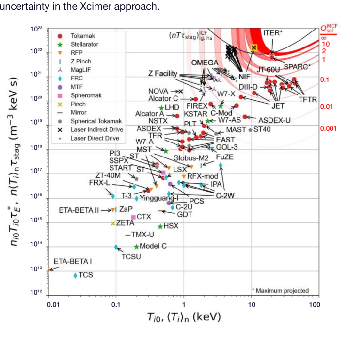

## **Key Fusion Energy Challenges**

Many fusion concepts have been studied, but not all have a feasible path to commercial deployment. Any credible
approach to commercial fusion energy must address three challenges: 1. fusion plasma confinement and performance,
2. materials, chamber survivability, and activated byproduct streams, and 3. cost and economics.

### Challenge 1: Fusion Plasma Confinement and Performance

The hardest thing about fusion is fusion itself. Plasma confinement sufficient for ignition and breakeven is the highest risk
element of every fusion approach.

The Lawson triple product (nT𝜏) and the scientific gain (Qsci) are the two universal metrics of fusion performance across
all concepts. The Lawson triple product is the product of plasma density, temperature, and confinement time. For a DT
plasma to ignite or produce gain, the triple product must exceed a threshold curve as illustrated in Fig. 1. Scientific gain
is an arguably even more important metric, and is defined as the fusion energy produced by a fusion plasma relative to
the energy required to produce and heat the plasma. It is no surprise that the two best-performing confinement
approaches (laser-inertial fusion and tokamak magnetic fusion) in terms of the Lawson metric are also the best
performing in terms of Qsci, with the NIF having demonstrated Qsci of 4.13 in April 2025 and the Joint European Torus
(JET) tokamak having achieved Qsci of 0.67 in 1997. The third best performing approach to date is magnetic liner fusion
(MagLIF) pulsed power, with a DT-equivalent Qsci on the Z-Machine of under 0.01 (these shots utilized DD fuel and
reported Qsci extrapolated to the performance expected if DT was used) [3,4] .

Any viable fusion approach must reach the Lawson threshold and Qsci > 1. The entire history of fusion development over
the past 60 years shows how hard this is and the many, often unforeseen challenges that arise. Thus, in seeking to make
commercial fusion a reality, it is natural for some to focus on the only approach which has achieved these goals to date:
laser-driven, hotspot-ignited inertial fusion as demonstrated by the NIF.

**An Introduction to Laser-inertial Fusion**
In laser-inertial fusion a millimeter-scale spherical fuel capsule is energized by a high-energy laser. The inert outer layer is
blown off (ablated), producing a force which compresses, heats, and ultimately ignites the fusion fuel within, as illustrated
in Fig. 2.

NIF uses an approach called indirect-drive, in which the laser energy is not delivered directly to the fuel capsule, but is
instead delivered to a cylindrical enclosure referred to as a hohlraum around the capsule, as depicted in Fig. 3. The walls
of the hohlraum become superheated and re-emit this energy as x-rays, and it is this field of x-rays which then ablates
and implodes the fuel capsule. This contrasts to the direct-drive approach, such as utilized on the OMEGA laser at the
Laboratory for Laser Energetics [5], where the laser is aimed directly at the capsule. Indirect drive is less efficient than
direct drive, as much of the laser energy is “wasted” heating the walls of the hohlraum or through x-rays that leave
through the laser entrance holes, but indirect drive is more tolerant of high-order spatial non-uniformity in the laser
beams themselves.

3 M. R. Gomez et al, "Performance Scaling in Magnetized Liner Inertial Fusion Experiments," Phys. Rev. Lett., vol. 125, no. 15, p. 155002, 10/09/ 2020, doi:
10.1103/PhysRevLett.125.155002.

4 P. F. Knapp et al, "Estimation of stagnation performance metrics in magnetized liner inertial fusion experiments using Bayesian data assimilation," Physics of
Plasmas, vol. 29, no. 5, p. 052711, 2022, doi: 10.1063/5.0087115.

5 [https://www.lle.rochester.edu/omega-laser-facility/](https://www.lle.rochester.edu/omega-laser-facility/)

**Fig 2.** A depiction of the standard inertial fusion
implosion and ignition process. The initial fuel
capsule configuration consists of three regions: an
inner low-density DT vapor, a solid ice or
liquid-wetted-foam DT shell, and a surrounding
low-Z inert ablator material, typically a plastic or
diamond (the NIF ignition shots utilized DT ice and
diamond ablator whereas commercial targets will
utilize liquid-DT and plastic). In operation, laser or
x-ray energy impinges on the ablator which rapidly
turns into a plasma and blows outwards. This
creates a reactive force that implodes the DT shell
inwards, collapsing it around the DT vapor. The
DT vapor plasma heats via compressive work and
ignites due to alpha-particle self-heating – a
process known as hotspot ignition. The fusion
energy released from the central vapor “hot spot”
heats and ignites the surrounding much more
massive DT shell – a process known as burn
propagation. Due to burn propagation, only a very
small fraction of the total DT fuel must be heated
to ignition, in contrast to magnetic fusion. Once
the DT shell ignites, it burns faster than the fuel
can disassemble, achieving burnup fractions of
30% or higher in large capsules.

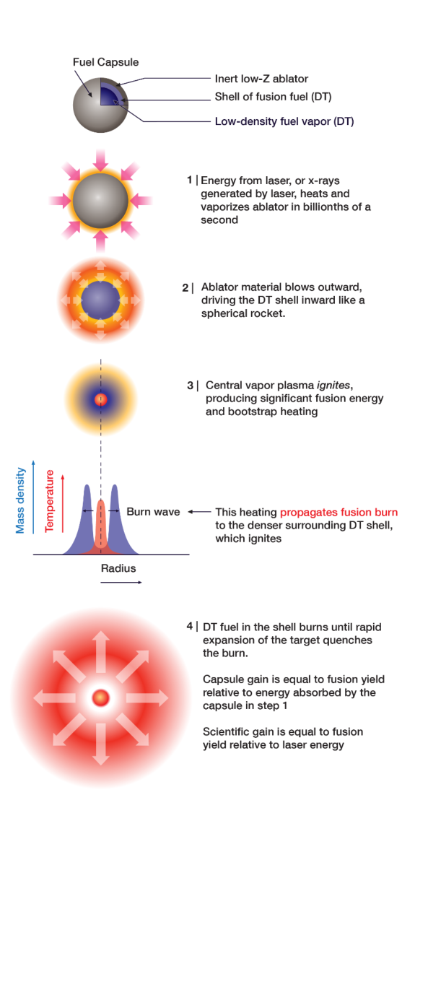

**Fig 3. Left:** Conventional direct-drive where the
laser light from many beams directly illuminates
the fuel capsule ablator. **Right:** Indirect-drive,
where the laser light illuminates the inside of a
hohlraum, which gets very hot and radiates
thermal x-ray radiation at millions of degrees. The
x-ray radiation fills the hohlraum and absorbs on
the fuel capsule ablator. Indirect-drive is much
less efficient (on the NIF approximately 12% of the
laser energy is absorbed on the fuel capsule), but
the x-ray radiation has extreme high-order
uniformity. Direct-drive is more efficient, but the
fuel capsule is more sensitive to high-order
non-uniformity in the laser beams and complex
non-linear interaction between the beams in the

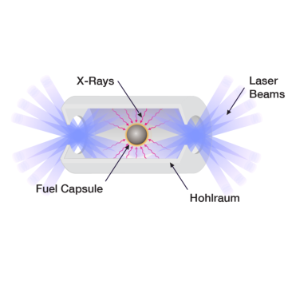

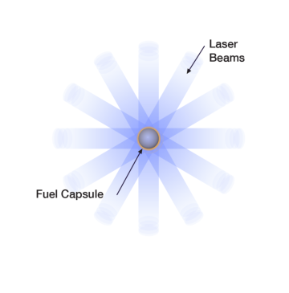

ablator plasma.

On NIF’s most recent record shot in April 2025, 2 MJ of laser energy in a 15 ns pulse heated the walls of the hohlraum,
and about 250 kJ of the re-emitted x-ray energy was absorbed by the capsule. The capsule ignited and yielded 8.6 MJ of
fusion energy. This resulted in a scientific gain Qsci of 8.6 / 2.08 = 4.13. The capsule gain – the fusion yield relative to
energy absorbed by the capsule – was approximately Qc = 8.6 / 0.25 = 34. The significant difference between capsule
gain and scientific gain on NIF is due to the low efficiency of coupling laser energy to the capsule (roughly 12%) inherent
to indirect drive.

The scaling of inertial fusion performance with laser energy is driven by several competing factors. Capsule gain Qc is
higher for larger capsules, but larger capsules also require more laser energy to drive their implosion. When both effects
are considered, the capsule gain scales roughly with the ⅔ power of energy coupled to the capsule [6], Qc ∝ Ec2/3. Larger

are considered, the capsule gain scales roughly with the ⅔ power of energy coupled to the capsule [6], Qc ∝ Ec2/3. Larger

fuel capsules have other advantages, including the need for lower fuel compression. The compression required scales
roughly as the inverse square root of energy, C ∝ 1/Ec1/2, and the lower compression requirement of larger capsules

roughly as the inverse square root of energy, C ∝ 1/Ec1/2, and the lower compression requirement of larger capsules

results in lower hydrodynamic instability and more robust and reliable fusion performance. The flip side of this scaling is
that smaller capsules require higher compressions, which are more hydrodynamically unstable leading to inconsistent
performance and sharply reduced gain. As the capsule size and driver energy are reduced, these instabilities inhibit
ignition and the gain drops much faster than a ⅔ power law. The NIF is near the threshold of this transition.

There is another historical data point that supports robust performance at higher energies. In the 1980s, Los Alamos and
Lawrence Livermore National Laboratories in the US sought to determine the minimum energy required to achieve robust
ignition and gain in a program called Halite-Centurion. In this program, x-rays from underground nuclear tests drove
representative ICF fuel capsules, which put to rest questions about the basic feasibility of achieving high gain. While the
details are classified, these tests led the national labs and National Academy of Sciences (NAS) to recommend building a
10 MJ laser [7] . The NIF ultimately was built at 2 MJ, not because this was determined to be optimal, but because a 10 MJ
laser was considered too costly and too large a step relative to the preceding NOVA facility at 30-40 kJ.

The recent success of the NIF and the historical record of the Halite-Centurion program suggests a clear strategy: utilize
the same type of fuel capsule that worked on the NIF, but do so with a larger capsule in order to achieve higher gain and
more reliable performance, and seek to couple energy to the capsule from the laser as efficiently as possible. For

6 C. Thomas et al, “Dependence of Inertial Confinement Fusion Gain on Driver Energy,” [manuscript in preparation].

7 William J. Hogan (1989), “Missions and Design Requirements for a Laboratory Microfusion Facility (LMF),” Fusion Technology, 15:2P2A, 541-549, DOI:
10.13182/FST89-A39755. ​
E. Storm, “Progress toward high-gain laser fusion,” LLNL, UCRL-98828; CONF-881056-5; ON: DE89002661. ​
R.C. Davidson, “National Academy Review of the Inertial Confinement Fusion Program,” J. Fusion Energy, 6, p. 191-194 (1987)​

example, using the ⅔ power-law scaling described above, coupling 10 MJ to a fuel capsule vs. the 250 kJ as on the NIF,
when accounting for differences between x-ray and laser coupling, margin, and reliability considerations, suggests a
capsule gain Qc of over 200 could be readily achievable with a 10 MJ laser that directly illuminates a correspondingly
larger fuel capsule. With a wall-plug laser efficiency of at least 5%, this system would produce a “wall-plug” gain of over
10 – more than sufficient for a commercial power plant. A cost-effective laser system that could deliver these
parameters, with sufficient symmetry to uniformly drive a fuel capsule at high coupling efficiency (i.e. utilizing
direct-drive), would enable a highly viable approach that leverages the most proven implosion, confinement, and ignition
physics in fusion: laser-driven hotspot-ignited inertial fusion.

### Challenge 2: Materials, Chamber Survivability, and Byproduct Streams

Fusion performance alone is not enough for a commercially viable power plant. A burning fusion plasma creates a very
harsh environment. Even if a given approach overcomes the plasma confinement challenge, without a viable,
low-activation, safe, and economic chamber concept to capture energy from the fusion plasma there may still be no path
to commercial viability. Many different fusion chamber approaches have been proposed over the decades, which can be
evaluated for commercial viability based on a few high-level considerations.

A burning DT fusion plasma produces energy in three primary forms [8] : 14 MeV neutrons, x-ray radiation, and ion debris.
All of these are damaging to solid materials, and a fusion chamber must be designed to survive sustained exposure to all
three. A majority (70%-80%) of the fusion energy is released in 14 MeV neutrons, which both damage materials and
induce radioactivity. The remainder of the energy is released in X-rays and ion debris, both of which can ablate, shock,
and erode solid materials over time. Assuming sufficient plasma performance is achieved, the primary goal of a fusion
chamber is to safely capture this fusion energy and convert it into heat with minimal damage to solid structures, minimal
activation and debris mass, and minimal maintenance downtime.

There are two general classes of chamber designs: solid first walls and liquid first walls. Here, we will refer to the “first
wall” as the material directly exposed to the fusion plasma, and the “first structural wall” as the closest solid material to
the fusion plasma. The major challenge with a solid first wall is that 14 MeV neutrons damage and embrittle structural
materials. This is measured by displacements per atom (dpa), the average number of times a single atom is knocked out
of its lattice position by neutron collisions. There are currently no commercially available structural materials that can
withstand more than 20 to 30 dpa from 14 MeV neutrons [9,10] . The typical tokamak or dry-wall IFE concept accumulates
roughly 10 to 20 dpa per year, and therefore any fusion system utilizing a solid first wall would have to replace all
exposed structural elements every 1 to 2 years, unless new materials are developed that can extend the lifetime beyond
this limit – a major materials science challenge.

Furthermore, solid structures directly exposed to the 14 MeV fusion neutrons become highly radio-activated, producing
intense gamma fields that may interfere with or outright preclude maintenance activities for several days to months after
shutdown. Only after a suitable “cooling” period can radiation-hardened remote-handling robots safely approach the
chamber to begin component removal and replacement [11] . In systems that require it, frequent first-wall and blanket
replacement over the plant’s lifetime will generate large volumes of activated solid waste, significantly increasing
downtime, maintenance complexity, and operating cost. In some systems, portions of these waste streams may exceed

8 We are considering only DT fuel here, though DD and DHe3 fuels will both produce 14 MeV neutrons through secondary reactions.

9 C. E. Kessel et al., "Fusion energy Systems Studies: Year-end Report on the Fusion Nuclear Science Facility" PPPL-5097, December 2014.

10 Arunodaya Bhattacharya, Steven J. Zinkle, Jean Henry, et al., “Irradiation damage concurrent challenges with RAFM and ODS steels for fusion reactor
first-wall/blanket: a review,” J. Phys.: Energy 4 (3) 034003 (2022).

11 Y. Someya et al., “Shutdown dose - rate assessment during the replacement of in - vessel components for a fusion DEMO reactor,” Fusion Engineering and
Design, Vol. 124 (2017).

low-level waste classifications, further complicating handling and disposal requirements. Testing and qualifying materials
for these conditions will require construction of a new fusion-prototypical neutron source [12] because no existing facility
can reproduce the neutron spectrum, flux, and helium production rates experienced in a fusion dry wall chamber.

A liquid first wall made out of low-Z materials, such as FLiBe or FLiNaK molten salts or molten lithium, thick enough (at
least tens of centimeters) to moderate fusion neutrons, can eliminate these challenges with plasma-facing structural
components. Effective “thick-liquid-wall” protection of these components can eliminate the need for first structural wall
replacement and can significantly reduce activated waste and the severity level of worse-case accident scenarios [13] .
Furthermore, with sufficient liquid protection, current commercially available steels can be utilized as reactor
components, eliminating the need for a new prototypical neutron source materials qualification facility. In addition, use of
a thick-liquid wall can in principle enable almost complete capture of 14 MeV neutrons leading to high tritium breeding
ratios without lithium enrichment required.

Magnetic fusion systems such as a tokamak or stellarator cannot in general utilize thick liquid first walls, as introduction
of impurities and/or droplets from the molten salt or liquid metal would create challenges such as plasma radiative
cooling, fuel dilution, and disruption triggers [14] . Laser inertial fusion systems, in principle, can utilize a thick-liquid wall.
This is because the plasma confinement and burn in laser inertial fusion systems occurs in the millimeter-scale fuel
capsule that is meters away from the first wall material and is not directly affected by vapor in the fusion chamber.

However, conventional solid-state laser fusion architectures like those derived from the NIF are not compatible with
thick-liquid walls due to a large number of laser beams and high shot repetition rate. Due to optical damage, the NIF and
other solid-state architecture concepts require hundreds of laser beams to penetrate the fusion chamber, which makes it
very challenging to engineer gaps in a thick liquid flow for each beam while also protecting the chamber structure around
all of the beam ports [15] . Additionally, at target shot rates higher than approximately one shot per second (1 Hz), a liquid
wall does not have enough time to recover to a quiescent state to allow target injection and laser propagation for the
subsequent shot [16] .

This is why the LIFE inertial fusion energy reactor concept developed by Lawrence Livermore National Laboratory and
many partners in the late 2000s with the goal of designing a power plant around the NIF architecture [17], with hundreds of
beams at a 10 to 16 Hz shot rate, must utilize a solid first chamber wall that requires replacement every year, leading to
significant operational and maintenance costs [18] .

Pure pulsed-power approaches (e.g., Sandia’s Z-machine, MagLiF, etc.) in principle can also utilize a thick-liquid wall,
but they still face significant containment, materials, and activation challenges. This is because pulsed power
approaches must couple electrical energy directly to a target with a physical connection, generating over 4 orders of
magnitude more debris throughput as compared to laser inertial fusion power plant [19] . This debris generates more

12 Möslang, A., IFMIF: the intense neutron source to qualify materials for fusion reactors, Comptes Rendus Physique 9, 457–468 (2008).

13 S. Reyes, J. F. Latkowski, J. Gomez del Rio, and J. Sanz, “Safety Assessment for Inertial Fusion Energy Power Plants: Methodology and Application to the
Analysis of the HYLIFE - II and SOMBRERO Conceptual Designs,” Journal of Fusion Energy 20, 23–44 (2001).

14 Nygren, R. E., “Liquid surfaces for fusion plasma - facing components—A critical review. Part I: Physics and PSI,” Nuclear Materials and Energy 9, 203–228
(2016).

15 R. W. Moir, “Chamber, target and final focus integrated design,” Fusion Engineering and Design 54–55, 103–111 (2001).

16 A. R. Raffray et al., “IFE thick liquid wall chamber dynamics: governing mechanisms and modeling and experimental capabilities,” Fusion Science and
Technology 49(1), 1–27 (2006).

17 W. R. Meier, A. M. Dunne, K. J. Kramer, S. Reyes & T. M. Anklam, “Fusion technology aspects of laser inertial fusion energy (LIFE),” Fusion Engineering and
Design 89(9–10), 2489–2492 (2014).

18 M. Dunne et al, "Timely Delivery of Laser Inertial Fusion Energy (LIFE),” Fusion Science and Technology 60(1), 19–27 (2011)

19 L. A. El - Guebaly, P. Wilson, D. Paige, “Evolution of Clearance Standards and Implications for Radwaste Management of Fusion Power Plants,” Fusion
Science and Technology, 49(1), 62–73 (2006).

mechanical stress in any containment structure and results in significantly more activated waste, as far more material is
exposed directly to 14 MeV neutrons.

So, even if fusion performance challenges can be overcome and demonstrated, many fusion approaches still face
significant material science, engineering, and architectural challenges to deploying a practical, economic, reliable, and
safe power plant.

### Challenge 3: Cost and Economics

Even if an approach can be developed that achieves meaningful fusion performance and overcomes the above
challenges of maintenance and reliability in a power plant environment, the final obstacle to commercial viability is cost.
In order to meaningfully change the trajectory of humanity’s energy use, fusion concepts must not merely work; they
must achieve similar economics to the comparative mechanical simplicity of a natural gas turbine, a wind turbine or a
solar panel. Even with the most aggressive assumptions about economies of scale and mass production, there are some
concepts for which this is difficult to imagine ever being possible.

While we could speculate about the costs of other fusion concepts, our focus here is laser-inertial fusion. Solid-state
laser architectures and the DPSSL architectures required for adequate efficiency are the most well studied and well
understood for laser fusion, with decades of development both in government and industry. However, the nature of
solid-state laser architectures presents several challenges in making them commercially competitive for fusion energy:

●​ Solid-state architectures must utilize a very large total aperture throughout the system to avoid damaging physical
optics with their own laser light. A large aperture at the fusion chamber interface presents additional difficulties, as
the laser windows must survive both laser-induced damage as well as damage produced by the harsh nuclear
environment.
●​ Architectural constraints (high beam counts, high repetition rates) lead to inherently complex chamber and plant
schemes, which preclude the use of thick-liquid walls and require frequent chamber replacement, materials
development, and increased waste disposal and maintenance costs.
●​ Components such as laser gain media, frequency-conversion crystals, optics, and laser diodes have high upfront
capital cost and will require significant and long-running capital investment in supply chains to produce these
components in the quantities needed for a first pilot plant, let alone the deployment of numerous commercial plants.
Below we discuss these challenges in more detail.

**Optics Damage**
Optics damage is the most significant constraint for solid-state laser systems. The NIF system, for example, comprises
192 identical beamlines each providing a maximum energy of about 11.5 kJ. The peak laser fluence in the final optics
and windows into the target chamber is about 15 J/cm [2] (at 351 nm) with average fluence of about 8 J/cm [2], and a total
final optical aperture into the NIF chamber of 30 m [2] . At a fluence of 15 J/cm [2], the NIF damages its optics on every
full-power shot. As a result, after each shot a camera is placed at chamber center to inspect all optical surfaces in all 192
beamlines and identify damage sites. Damaged optics are removed and reprocessed through a sophisticated
refurbishment loop onsite before they can be used again. While very expensive on a per-shot basis, the refurbishment
loop is much less expensive than buying new optics. The NIF system could have been designed with lower peak and
average fluences, but this would have required more beamlines, more optical area, and significantly higher upfront
capital cost. As such the refurbishment loop is critical to maintaining a cadence of about 400 target shots per year,
allowing the NIF to serve its national security missions.

An optics refurbishment loop such as utilized on the NIF is impractical for a power plant operating at typically envisioned
10 Hz repetition rates (or even 1 Hz). To reduce downtime due to optics damage, a power plant would likely have to
operate at lower peak fluence, roughly 4 J/cm [2] or less [20], in order to maximize optics lifetime. Scaling this architecture up
to 10 MJ and reducing peak fluence to this threshold would require a total aperture of about 300 m [2] and significantly
increase already high beamline and optics costs. Furthermore, it would require a larger target chamber than the current
10-meter-diameter NIF chamber, which would still need to be replaced every couple years, further driving costs. Finally,
the 300 m [2 ] of windows would be exposed to high energy neutrons, and it is unclear whether coatings or substrate
material can be developed to allow long window lifetime in this environment.

With advances in materials, coatings, and strict removal of contamination in optics fabrication processes, the industry
can work toward an increase in peak damage thresholds allowing for a smaller aperture than contemplated here.
However, it’s hard to imagine a reduction in the aperture described above by more than a factor of two to three, even
with significant capital investment. Thus, optical damage, particularly in the repetitive-operation regime required of a
power plant, poses a significant obstacle to making conventional solid-state architectures economically competitive for
laser fusion energy.

**Laser Efficiency**
Achieving sufficient laser efficiency presents a further cost challenge. In the NIF, Nd:glass amplifier slabs are pumped by
flashlamps that are inexpensive, but highly electrically inefficient, as only a small fraction of their broadband optical
output is absorbed by the laser glass. This is the main contributor to the poor overall wall-plug efficiency of the NIF laser,
at about 0.5%.

A viable laser inertial fusion power plant needs much higher efficiencies – at a minimum roughly 5%. Thus, a solid-state
laser fusion system must utilize laser diodes to pump the laser glass as opposed to flashlamps – hence the common
acronym DPSSL for a Diode-Pumped Solid-State Laser. Diodes emit at the precise wavelength needed to pump the
glass and can be up to 30 times more efficient than flashlamps.

However, laser diodes present substantial cost challenges. Diodes today are not produced anywhere close to the
volumes needed for a MJ-scale inertial fusion system. Even with a significant investment in mass production, which
would take years to build out the required factories and production capabilities, there is a floor to how low DPSSL costs
can be driven.

**Cost Estimates of Diode-Pumped Solid-State Lasers (DPSSLs) for Inertial Fusion Energy** ​
A DPSSL consists of a few primary components: laser pump diodes, laser glass gain media, frequency conversion
crystals, and then a host of other components such as optics, electronics, cooling systems, power supplies, etc. For the
high-level discussion here, we’ll focus mainly on the first three.

A first important fact about DPSSLs for inertial fusion energy is that they need to produce powerful, intense
nanosecond-scale laser pulses, whereas laser diodes are limited in their peak output power and are actually better suited
for continuous operation. A second important fact is that laser glass gain media can only store energy in its excited state
for approximately 0.3 milliseconds before that energy is spontaneously radiated away and wasted.

As a result, a DPSSL works as follows: the laser diodes are energized and emit optical energy into the laser glass at a
pulse length on the order of the excited state lifetime, long enough for energy to be stored up in the excited state of the

20 J. M. Di Nicola et al., “Delivering Laser Performance Conditions to Enable Fusion Ignition, and Beyond at the National Ignition Facility,” High Energy Density
Physics 52 (2024): 101130.

glass. Then a fast, nanosecond-scale laser pulse is propagated through the glass which extracts a fraction of the energy
now stored in that excited state. After laser energy extraction from the glass, the output laser pulse passes through large
frequency conversion crystals that convert the wavelength of the laser light from infrared (about 1 micron) to ultraviolet
(351 nm). Through this whole process, an overall wall-plug to UV efficiency of approximately 15% is expected to be
achievable at scale in commercial systems [21] .

The laser diodes only have the timescale of the excited state lifetime (~0.3 milliseconds or less) to deliver all the required
diode pump energy to the gain medium, which means they must run at very high peak power and are utilized at a very
low overall duty cycle. This timescale also determines the conversion rate between the total diode power and final laser
output energy. For example, 1 Watt of diode power over 0.3 milliseconds energizes the laser glass with 0.3 millijoules of
energy. At this timescale the efficiency of diode pump energy to UV output is expected to be approximately 20% [ibid] .
Thus, 1 Watt of diode pump power would convert to approximately [1 W]×[0.3 ms]×[0.2] = 0.06 millijoules (mJ) of UV
laser output, and therefore using these numbers a 10 MJ DPSSL would require a total diode pump power of
approximately 170 gigawatts (GW). The efficiency could be improved by going to higher pump power over a shorter
duration [22], but this would further increase laser pump diode costs.

Laser diodes are packaged in “bars,” with today’s industrial diode bars considered for IFE capable of producing 0.5 to 1
kW of pump power. Here we will assume a 1 kW diode bar unit. The current cost of stacked diode bars is around $0.30
to $0.40 / watt [23] . Thus, a 10 MJ DPSSL would require approximately $50B worth of laser diodes alone, not counting any
other component of the laser. This is why the NIF is pumped with flashlamps, and not laser diodes, though we note that
even with inexpensive flashlamps, and at 2 MJ rather than 10 MJ, the NIF facility cost approximately $7B in today's
dollars [24] .

Of course, the cost of laser diode power can be reduced with technological advances and massive investment in supply
chains, which would have to occur as global photonics industry production would need to expand by more than an order
of magnitude to produce more than 100 GWs of diodes on a reasonable timeframe.

In considering how low diode production costs could be driven, one must consider not just the cost of manufacturing the
diode chip itself, but also the associated cost of mounting and packaging the diodes on appropriate heat sinks and
related driver electronics. For instance, consider a backplane-cooled 50 kW diode stack consisting of 50 of the 1 kW
bars mentioned above. Assuming a bare diode bar cost of $5, which is demanding for modern large-scale 6”
manufacturing and processing capabilities, results in a cost of $250 for the complete unpackaged stack. Including the
costs of the entire mounting and packaging process with CTE-matching submounts, microchannel backplane coolers,
AuSn solder, FAC lenses, etc., results in a total material costs of approximately $500/stack (not including labor).
Considering all these costs plus the addition of labor, depreciation costs for high-volume robotic production lines, and
certain assumptions of yield and other production costs, results in an estimated cost base of about $1000 / stack, or
about 0.02 $/W (consistent with the asymptote of other analyses [25] ) of diode pump power. It is the authors’ assessment
that this figure represents an absolute floor in cost for laser diodes, and billions of dollars of investment in diode supply
chains over several years would be needed to achieve it.

21 C Hafner et. al. “Status and Perspectives of High-Power Pump Diodes for Inertial Fusion Energy Lasers,” IFE Science & Technology Community Strategic
Planning Workshop 2022.

22 A. J. Bayramian _et al_ ., “Compact, efficient laser systems required for laser inertial fusion energy,” _Fusion Sci. Technol._, vol. 60, no. 1, pp. 28–48, Jul. 2011,
doi:10.13182/FST10-313.

23 S D. McDougall et al. “Semiconductor Laser Costs for Inertial Fusion Energy Applications,” SPIE Photonics West Conference on Optical Technologies for
Inertial Fusion Energy II, Proc. SPIE 13888-3, 19 January 2026.

24 [https://lasers.llnl.gov/about/faqs](https://lasers.llnl.gov/about/faqs)

25 S D. McDougall et al. “Semiconductor Laser Costs for Inertial Fusion Energy Applications,” SPIE Photonics West Conference on Optical Technologies for
Inertial Fusion Energy II, Proc. SPIE 13888-3, 19 January 2026.

One can utilize this information to estimate the long-term best-case cost of a DPSSL driver for IFE. Assuming 0.02 $/W is
achieved, a 10 MJ system would require $3.3B of laser diodes. This corresponds to a laser driver cost contribution of
approximately $330 / J (hardware cost per UV laser output) for the diodes alone. This figure ignores the costs of other
components of the laser such as the laser glass and frequency conversion crystals, which have significant supply chain
challenges in themselves. Typical estimates are that laser diodes will contribute approximately 33% to 50% of the total
cost of a DPSSL inertial fusion energy laser when the diode cost has reached its asymptote [26,27] . Therefore, assuming that
adequate investment has also occurred in other supply chains to produce the laser glass, crystals, and other
components, the long-term best-case cost for a DPSSL driver is about $700 - $1,000 / joule. The resulting best-case,
long-term cost floor for a 10 MJ solid-state laser system for IFE would be in the range of $7B to $10B.

## **Xcimer’s Approach to Addressing Fusion’s Key Challenges**

Xcimer is developing an architecture for a laser-fusion power plant that aims to address the above three challenges of
fusion performance, materials and activated byproduct streams, and system cost. There are three critical aspects of the
Xcimer architecture:
●​ An affordable, two-beam deep-UV (248 nm) inertial fusion energy laser system that is not constrained by laser
damage limitations on solid optics and windows interfacing with a target chamber, allowing for a much smaller total
aperture (< 1 m [2] ) and much lower optical count than solid-state architectures. This system can scale to energies over
10 MJ on-target with sufficient wall-plug efficiency (> 5%), and most critically, can achieve all the parameters needed
for commercial operation at substantially lower cost than a DPSSL, under $100 / joule at scale.
●​ An inertial fusion target and fuel capsule design utilizing two-beam direct-drive deep-UV illumination, that leverages
the implosion, plasma confinement, and ignition physics proven on the NIF, but scaled to the larger size enabled by a
10 MJ-class laser. At this size, this fuel capsule offers the highest confidence in fusion plasma confinement and
performance of any fusion approach. Notably, sufficient gain and fusion yield are produced to enable operating a
commercial plant at a repetition rate of 0.25 - 1 Hz, as required to allow a thick-liquid wall.
●​ A fusion chamber and power plant based on the HYLIFE thick-liquid-wall concept first proposed by LLNL, which
utilizes two-beam illumination and a repetition rate under 1 Hz to enable a flow of molten salt providing near-total
protection of chamber components from 14 MeV neutron damage.

### Xcimer’s Novel Laser Architecture

Solid-state lasers have been pursued for inertial fusion since the 1970s and widely used in multiple industrial, scientific,
and other applications. Also in the 1970s, a different kind of laser was developed – the excimer laser. Rather than glass,
most excimer lasers use a mixture of noble gases with a small (< 1%) concentration of a halogen as the laser gain
medium. Excimers were initially developed for defense applications, and were a component of some proposed “Star
Wars” missile defense systems. These first excimer lasers were pumped by relativistic electron beams (e-beams)
produced by high-voltage Marx generators, as depicted in Fig. 4. Later in the late 1980s and 1990s, discharge-pumped
systems were developed that do not require high voltage but are limited in energy output per pulse. These
discharge-pumped systems were commercialized and deployed worldwide as the primary light sources for the
semiconductor lithography industry for 40 years.

26 M K. Nelson et. al. “Lifetime Requirements for Semiconductor Lasers in Inertial Fusion Energy Systems,” SPIE Photonics West Conference on Optical
Technologies for Inertial Fusion Energy II, Proc. SPIE 13888-4, 19 January 2026.

27 C. Haefner et al. "Inertial Fusion Energy Drive Technology," LLNL IFE Science & Technology Community Strategic Planning Workshop.

Electron beams remain ideal for pumping large volumes of gas needed to produce high-energy pulses. High-energy
e-beam pumped excimer lasers were studied for inertial fusion and offered several advantages, such as utilizing a
lower-cost gas gain media that can’t be damaged, and a native deep UV wavelength (248 nm for KrF and 193 nm for

**Fig 4.** Basic elements of an electron-beam
(e-beam) pumped KrF excimer laser. A Marx
generator provides a high-current,
high-voltage pulse to an electron cathode
emitter. The cathode produces electrons
which are accelerated across the potential
difference (typically 500 kV to 1 MV) between
the cathode and electron beam window
anode, which consists of a thin foil supported
by vertical metal “hibachi” ribs. The
high-energy electrons penetrate the foil and
deposit their energy throughout the volume,
continually pumping the KrF laser gas over
the duration of the Marx generator pulse.
Laser energy is extracted by injection of a
low-energy input laser that passes through
the long axis of the laser chamber. For
repetitive operation, the KrF laser gas is
recirculated vertically through a heat
exchanger to dump waste heat. For systems
only firing once every several minutes,
recirculation is not needed.

subsequent e-beam pumped KrF lasers were developed and built for fusion applications, including the RAPIER system
at LLNL, the Aurora system at Los Alamos National Laboratory (LANL), and more recently the Electra system at the Naval
Research laboratory (NRL), all shown in Fig. 5. The Aurora laser amplifier produced approximately the same energy (11
kJ) at 248 nm that a NIF beamline produces today at 351 nm. And most significantly, the 750 J Electra laser funded
under the High Average Power Laser (HAPL) program demonstrated not only that 7% wall-plug efficiency could be
achieved, but also operated continuously for 10 hours at 2.5 Hz repetition rate, solving several engineering challenges
related to sustained repetitive operation for an electron-beam pumped system [28] . At this time, Electra still holds the record
for the highest UV pulse energy for a laser system operating at sustained IFE-relevant repetition rates.

28 M. F. Wolford, J. D. Sethian, M. C. Myers, F. Hegeler, J. L. Giuliani, and S. P. Obenschain, “KrF laser development for fusion energy,” _Plasma and Fusion_
_Research_, vol. 8, p. 3404044, 2013, doi:10.1585/pfr.8.3404044.

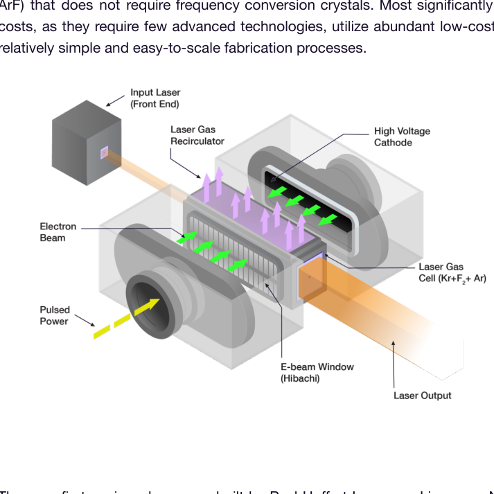

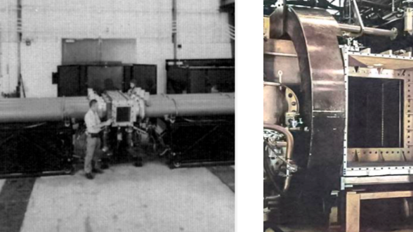

a

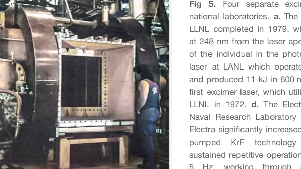

b

challenges related to sustained pulsed operation
of high-voltage e-beams and waste heat

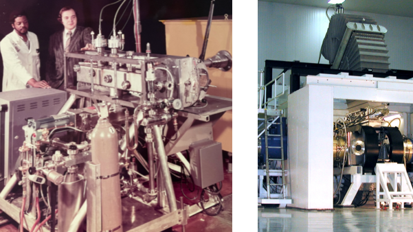

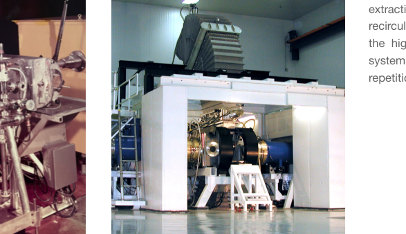

c d

However, excimer lasers have two marked disadvantages with respect to inertial fusion energy. First, they are ½ to ⅔ of
the wall-plug efficiency of DPSSLs (but still over an order of magnitude more efficient than flashlamp-pumped solid-state
lasers such as the NIF). This is more than made up for by their cost-effectiveness and ability to scale to high energy
levels (>10 MJ), enabling more than sufficient target/capsule gain to overcome the reduced efficiency. Second, while they
can produce high energy at relatively low cost, they can only produce these energies effectively at long pulse lengths –
hundreds of nanoseconds or longer – while pulse lengths of several nanoseconds are required to drive inertial fusion fuel
capsules. Thus, the use of an excimer driver for inertial fusion requires a pulse compression scheme to convert the
low-cost, long-pulse laser output into a short, high-intensity pulse.

The conceptually simplest pulsed compression scheme is angular multiplexing, using a series of mirrors at varying
distances to stack in time a sequence of short pulses such that they pass through an excimer laser amplifier
back-to-back, but arrive at a target simultaneously [29] . This method of compression is currently implemented on the NIKE
KrF laser at NRL. However, this requires a significant number of optics, is not compatible with two-beam target
illumination, and cannot scale to 10+ MJ. Nonlinear optical (NLO) schemes utilizing Stimulated Brillouin Scattering (SBS)
or Stimulated Raman Scattering (SRS) for laser light temporal pulse compression were pursued in the early 1970s and

29 https://aries.pppl.gov/HAPL/MEETINGS/0710-HAPL/Presentation/19.ObenschainTOURpresentation.pdf

1980s as alternatives by multiple groups, including at LLNL [30,31], LANL [32,33], Imperial College [34], with the LLNL Energy and
Technology Review reference providing a great explanation of both angular multiplexing and nonlinear optical
compression schemes, including a hybrid version.

In both SBS and SRS, two separate laser beams are coupled via interaction with the medium through which they
propagate [35] . Fig. 6. shows how this can be utilized for pulse compression, where a low-energy short-duration ‘seed’
beam counterpropagates relative to a high-energy long-duration ‘pump’ beam in a gas. As the beams cross each other
and overlap, energy is transferred from the pump beam to the seed beam: as the seed beam sweeps across the pump, it
is amplified, drawing energy from the pump. After the beams have passed each other, a majority of the energy that was
in the pump pulse traveling to the left is now in the amplified seed pulse travelling to the right. Thus, the backward SBS

from the pump to the seed. **Left:** The pump beam is much longer in duration than the seed beam and traveling in the opposite direction. As the seed
sweeps across the pump, it takes energy from the pump, effectively reflecting and compressing optical energy in time. **Right:** Multiple pump beams are
the same duration as the seed and pointed in nearly the same direction. The seed beam takes energy from the pumps, effectively reflecting optical
energy at a small forward angle and significantly increasing the intensity of the optical energy.

Reflecting laser energy in the backward direction is not the only way a NLO gas mirror can operate. Several applications
have utilized SRS in a configuration known as Raman beam combining, where multiple high energy pump beams cross a
seed beam in a near forward direction, also depicted in Fig. 6. Here, the same energy transfer process from pump beam
to seed beam occurs, but the seed beam is the same duration as the pump and points nearly in the same direction. This
gas mirror configuration can concentrate laser energy spatially while achieving very high beam quality.

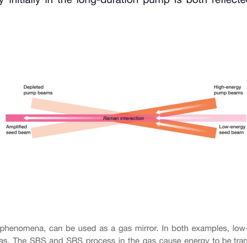

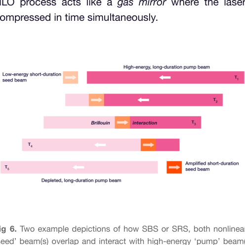

30 “RAPIER: an optical pulse compressor,“ Energy and Technology Review, LLNL. June 1979.

31 J. Murray et al., “Raman pulse compression of excimer lasers for application to laser fusion.” IEEE Journal of Quantum Electronics, 15(5) 342-368 (1979).

32 “KRF Program Review,” Los Alamos National Laboratory, June 26th 1984.

33 M. Slatkine et al., “Efficient phase conjugation of an ultraviolet XeF laser beam by stimulated Brillouin scattering,” Optics Letters, 7(3) 108-110 (1982).

34 M. J. Damzen and H. Hutchinson, “Laser pulse compression by stimulated Brillouin scattering in tapered waveguides,” IEEE J. Quantum Electron., vol. 19,
no. 1, pp. 7–14, Jan. 1983.

35 In the case of SBS the two beams couple to a sound wave, and in the case of SRS the two beams couple to molecular rotational or vibrational excitations.
In both cases, one beam is slightly higher in frequency than the other, with the frequency difference matching the sound frequency or the energy of molecular
transitions. The term ‘nonlinear’ refers to the fact that the strength of the sound wave or number of molecular excitations depends on the beam intensities:
the higher the beam intensities, the stronger the medium response, and thus the stronger the beams are coupled. When coupled, the higher frequency beam
always loses energy to the lower frequency beam. Both the SBS and SRS process are automatically phased-matched and thus do not require external phase
matching between the seed and pump beams.

Today, Xcimer is continuing where this past work on excimer lasers and NLO gas mirrors left off, and adopting a laser
approach leveraging inexpensive, microsecond-scale excimer lasers that direct output to NLO gas mirrors initially for
beam combination and then for pulse compression. While various concepts have been proposed by other organizations,
in the public literature this architecture is closest in spirit to the Prometheus concept developed by McDonnell Douglas [36] .

Xcimer power plants will utilize up to 100 modular and stackable electron-beam-pumped krypton-fluoride (KrF) “Argos”
excimer laser amplifiers, each with an output energy well over 100 kJ and a pulse length of over 1 μs, to generate
hundreds of beams of low-cost laser energy at 248 nm [37] . All of these beams will be aimed at a Raman beam combiner –
the first of three nonlinear optical (NLO) gas mirrors. This process is depicted at an abstract level in Fig. 7.

In the Raman beam combiner, the seed beam is injected through hundreds of overlapping pump beams at a small angle,
so this mirror only changes the direction of the energy by a small amount, as depicted in Fig. 7. However, the “reflected”
energy in the amplified seed beam becomes highly spatially concentrated, with a beam fluence well over 1,000 J/cm [2], vs.
the pump beams at about only 10 J/cm [2] at the output of the Argos KrF modules.

The spatially concentrated beam is then reflected in a second noble-gas NLO mirror, but this time utilizing SBS with a
seed beam that is travelling in the opposite direction as the pump beam and with a much shorter duration of tens of
nanoseconds. In this configuration, laser energy is both reflected 180 degrees and compressed in time, as the seed
beam is approximately 50 times shorter in duration than the pump beam. Thus the reflected laser energy is much more
intense.

Finally, the third NLO mirror, also utilizing the SBS process in a noble gas, reflects laser energy again while compressing
it further in time to a few nanoseconds, but only at a 170 degree near-backward angle. This final beam passes through a
fast-acting vacuum shutter valve and engages a fusion fuel capsule in a fusion target. The shutter is a key element of the
architecture, allowing the high-fluence beam to pass from gas to vacuum without touching a solid window. This is
feasible due to the very small aperture size at this point of only a couple tens of centimeters.

In summary, the key feature of this architecture is a method to compress μs-long, high-energy, low-cost KrF laser pulses
to nanosecond scale with the efficiency and beam quality required for inertial confinement fusion via SBS after Raman
beam combining. The final SBS power amplification for light on target occurs in 1 atm gas after a final optic, which
allows 10 [4] amplification to >1,600 J/cm [2] while preserving phase, avoiding other non-linear propagation effects, and
remaining below breakdown threshold, while the final physical optic sees less than 0.2 J/cm [2] and is physically far
removed from the fusion target plasma. The beams exit the SBS amplification region directly to the target chamber
through a windowless vacuum transition. This bypasses all final optics and window damage issues and allows delivery of
high driver energies (10 MJ or more) from a very small solid angle (< 10 [-3] sr), with high standoff distance (50 m) and
near-diffraction-limited beam quality.

36 L. M. Waganer et al, "Inertial Fusion Energy reactor design studies: Prometheus-L, Prometheus-H. Volume 1, Final report," U.S. DOE OSTI, Mar. 1992, doi:
10.2172/10172807.

37 A 10 MJ DPSSL would also have many hundreds of beams, all of which must be propagated all of the way to the fusion target through solid windows in
the fusion chamber. Xcimer’s architecture first combines hundreds of beams right after the laser amplifiers, and then only propagates two beams to the target
through two small windowless gas-to-vacuum transitions outside the fusion chamber.

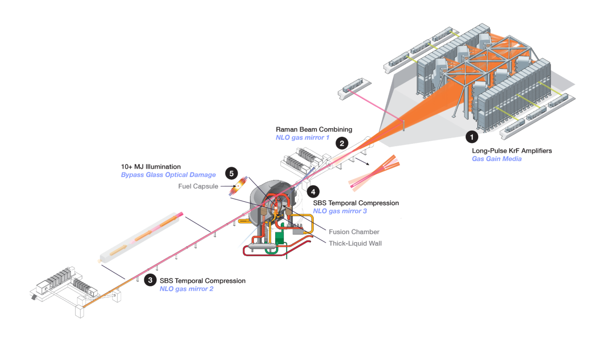

**Fig 7.** A high-level depiction of an Xcimer laser beamline delivering laser energy to a fusion power plant. Operation of a laser beamline consists of five
primary steps: **1.** Argos KrF laser amplifiers, producing hundreds of beams that are directed via physical optics to a Raman beam combiner. **2.** The
beam combiner – the first of three nonlinear optical (NLO) gas mirrors – redirects the laser energy at a near-forward angle into a long gas cell. **3.** A
second NLO gas mirror simultaneously reflects and temporally compresses the laser energy in the gas cell by transferring energy from the beam
depicted in magenta to the beam depicted in orange. **4.** A final NLO gas mirror reflects and compresses the laser energy a second time, directing the
high-fluence, nanosecond-scale light through a vacuum shutter and into the target chamber for fuel capsule illumination in step **5** .

## Xcimer Laser Cost and Schedule

Xcimer estimates that the laser architecture described above can be constructed with total costs of approximately $100 to $120 / joule of laser light on-target in first-of-a-kind (FOAK) systems, and costs of $60 to $80 / joule in nth-of-a-kind (NOAK) systems, roughly an order of magnitude lower than the long-term DPSSL costs estimated above at $700 – $1,000 / joule.

This cost advantage is derived from multiple factors:

- Electron-beam (e-beam) pumped excimer lasers scale well to large sizes and high output energies, as fundamentally they consist of a low-cost gain medium (a gas mixture) contained in a mechanically simple pressure vessel, volumetrically pumped by an e-beam. The larger the laser gas cavity and higher the e-beam voltage, the more efficiently electron energy can be deposited in the gas.²⁸
- The e-beam diodes used to pump the gas mixture in excimer laser amplifiers are simple high-voltage metal and insulator structures and bulk textile electron emitter surfaces meters in scale, not optical microelectronics devices, and are energized electrically by high-voltage Marx generators.
- The materials in an excimer laser, including the e-beam cathode and Marx generator, are primarily steel, aluminum, and plastics – all commodities economical to procure and produce. Manufacturing these elements involves conventional casting, fastening, surface treatment, and assembly techniques of meter-scale metal parts and assemblies with physical scale and complexity comparable to automotive components.
- The use of nonlinear optical processes for beam manipulation at high fluence removes a significant amount of expensive optics that would be subject to damage, and removes essentially all of the windows and optics exposed to the fusion environment relative to a conventional DPSSL IFE architecture.

The table below makes an analogy between the high-level elements in an Xcimer IFE system and their counterparts in a conventional DPSSL.

| DPSSL Architecture | Excimer-NLO Architecture |
|---|---|
| Laser pump diodes | Electron-beam cathode, Marx generator |
| Solid-state/glass laser gain media | Gas laser gain media |
| Optics and frequency conversion crystals | Significantly fewer optics, no conversion crystals |

The Marx generator and electron beam cathodes serve a similar function as laser pump diodes do for a DPSSL. Furthermore, similar to a DPSSL, the pump source in a commercial Xcimer IFE system (Marx and e-beam cathode) represents about half the total cost, so it's useful to understand the function and cost of the Marx and e-beam pump source when comparing to laser pump diodes.

A Marx generator consists of multiple "stages" that contain high-voltage capacitors. The stages are slowly (hundreds of milliseconds to a second) charged in parallel and then rapidly (in roughly 10 ns) connected in series through high-voltage switches. Once the stages are connected in series, their voltages add and the combined output is dumped at constant power over a microsecond into an impedance-matched electron beam cathode, with the resulting electron beam ultimately delivering the energy from the capacitors into krypton-fluorine laser gas (see Fig. 4 above). The electron

---

²⁸ This is because voltages of at least a few hundred keV must be used on the e-beam so the electrons can transmit through the foil into the laser gas. But if the gas cavity is small, most of the electrons will pass through the gas and leave the other side, reducing laser efficiency. Ideal systems should operate at 500 keV to 1 MeV and meter-scale laser cavities.

excitation of the KrF laser gas is conceptually analogous to photons from the laser pump diodes exciting the Nd:glass
laser gain medium in a DPSSL.

The capacitors are the most expensive single element of the Marx generator, and are characterized by a cost per joule of
electrical energy storage capacity ($/joule) vs. a cost of optical power rating ($/watt) as for a laser diode. Current
high-voltage capacitor prices are roughly $10 / joule, and these units are not produced in volumes anywhere close to that
needed for a commercial power plant. However, Xcimer has opened a proprietary capacitor manufacturing plant in
Tucson, AZ, USA and is already producing capacitors in-house for current and future laser systems (see Fig. 8), at a
significant cost savings. Cost estimates for volume production at the 3 MJ (stored) level for the first full-scale excimer
amplifier module are approximately $0.85 / joule, and as volumes increase, this can be further driven down to below
$0.40 / joule.

Cost estimates for volume production of Xcimer’s e-beam cathodes and Marx generators is approximately $3.6 / joule
stored for initial full-scale systems. This latter estimate is lower by a factor of ~1.7 compared to estimates for system
costs in pulsed power fusion demonstrators [39], as the current density and voltage requirements to pump Xcimer’s KrF
lasers over a microsecond are not nearly as stringent. For a 7% wall-plug efficient Xcimer laser system, $3.6 per joule
stored corresponds to approximately $51 dollars per joule of UV laser light on target for Xcimer’s laser pump source
(e-beam and Marx generator).

**Fig 8. Left:** Eight of Xcimer’s high-voltage capacitors. **Right:** A 500 kV Marx generator based on Xcimer's proprietary pulsed power technology that will
power Argos laser modules and currently powers the KJC laser in Xcimer's Denver facility. The Marx shown contains 384 of the capacitors shown on
the left.

Another cost driver in most laser systems are physical optics. Xcimer’s laser architecture replaces physical optics subject
to damaging short-pulse high-intensity light with nonlinear optical interactions in gas, by first Raman beam combining at
long pulse length to very high fluence and subsequently utilizing SBS NLO gas mirrors to reflect and compress the
high-fluence light. As a result, the vast majority of physical optics in Xcimer’s system are positioned before the beam
combiner. Thus each 50 cm x 50 cm beam from the Argos KrF laser amplifiers sees only three large 50 cm x 50 cm
physical optics: a laser window and two turning array flat mirrors that direct each beam to the beam combiner. At pulse
lengths above a microsecond, these optics can handle 8 to 10 joules/cm [2] of UV light without damage. Furthermore, the
quality of the optics can be relatively low, as the beam quality of the Raman NLO-combined and reflected light is not
affected by the beam quality of the pumps. At an estimated average cost of approximately $55,000 per each of these

39 https://fire.pppl.gov/IFE_NAS2_SNL_Cuneo_Pulse_Power.pdf

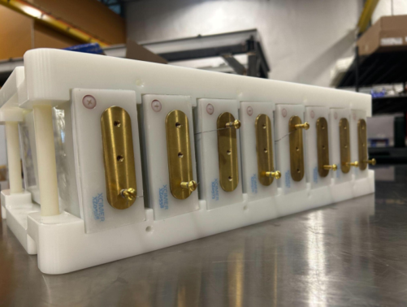

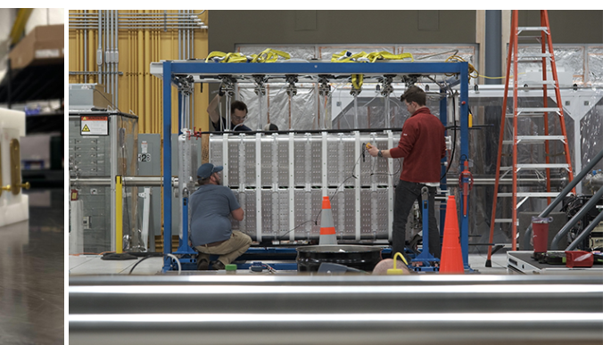

large optics for first-of-a-kind systems, the total physical optics cost comes out to approximately $12 / joule of UV light on target.

When including all of the other laser components such as laser chambers, gases and gas handling, NLO compression hardware, vacuum shutter, and front-end seed lasers, and accounting for remaining uncertainty, Xcimer's estimate for a first-of-a-kind commercial laser system is $100 to $120 per joule on target. The cost of Nth-of-a-kind systems can likely be further reduced to $60 - $80 / joule with optimizations to efficiency and higher-volume manufacturing.

Table 1 provides a breakdown of contributions to Xcimer's cost estimates for initial, first-of-a-kind (FOAK) laser systems.

| Laser Component | Cost / joule-on-target in UV |
|---|---|
| **Laser Pump Source** | |
| Pulsed Energy Storage Capacitors | $10 |
| Marx Generator | $24 |
| Electron Beam components | $17 |
| **Subtotal** | **$51** |
| **Laser Gain Media, Optics, Structures, Other** | |
| Laser Chamber & Gas Systems | $19 |
| Laser Output Windows & Optics | $12 |
| Seed Lasers / Nonlinear Optical Systems | $23 |
| Control, Diagnostics, Other | $4 |
| **Subtotal** | **$58** |
| Total cost estimate for FOAK excimer-NLO system | $109 / joule |
| Total cost estimate for DPSSL architecture with most aggressive assumptions | $700 - $1,000 / joule |

*Table 1*

The same factors that contribute to the favorable economics of Xcimer's laser architecture also enable delivery of these systems on rapid timescales and with lower upfront investments. Because excimer lasers use relatively simple technologies that don't require substantial capital investment for initial production, excimer laser systems at 100 kJ scale can be brought online within the next 2 years, and MJ-scale systems within the next 5 years. Xcimer's technology offers the potential of faster timelines and lower capital costs as compared to what will be required to scale DPSSL supply chains to similar capacities.

## Xcimer's Hybrid Direct-Drive Target

As discussed above, the only type of plasma confinement and ignition method that has surpassed scientific breakeven to date is laser-driven hotspot-ignited inertial fusion, where an inert ablator layer surrounding a spherical shell of deuterium-tritium fuel is rapidly heated and vaporized, creating a reactive force that implodes, heats, and ignites the fuel.

Such a fuel capsule on the NIF has achieved a capsule gain of 34, where 8.6 MJ of fusion energy has been produced
from only 250 kJ of absorbed ablator energy.

For two reasons, the most direct path to high gain is to field a larger fuel capsule utilizing the same type of implosion and
ignition mechanism. First, capsule gain scales with absorbed energy via a ⅔ power law, and so a larger capsule
absorbing more energy can achieve higher capsule gain. Second, robustness against hydrodynamic instabilities,
manufacturing nonuniformities, and implosion asymmetries is significantly increased at larger capsule size, which is
critical for reliable commercial operation.

Therefore, Xcimer’s approach is the following:

●​ Field a NIF-style fuel capsule coupling approximately 10 MJ of energy, providing the ability to achieve capsule gains
over 200.
●​ Couple a majority of the laser energy directly to the fuel capsule, avoiding the inefficiency associated with
indirect-drive.
●​ Utilize only two laser beams, which is key to minimizing the number of chamber penetrations and enabling use of a
thick-liquid-wall fusion blanket to mitigate neutron damage and activation issues.

While the physics of direct drive has been demonstrated on the OMEGA laser facility at the Laboratory for Laser
Energetics, the OMEGA laser utilizes 60 overlapping beams [40] . Xcimer’s key challenge is achieving a sufficiently
symmetric implosion with only two-beam illumination. This can be achieved if the spatial intensity pattern of the laser
beam itself has a ring around the beam of higher intensity as compared to the middle, as shown in Fig. 9. This allows for
higher laser intensity around the equator of the capsule as opposed to the pole, which can create sufficiently uniform
absorption in the ablator to drive a spherical implosion [41] . Xcimer has partnered with leading institutions around the
design and modeling of this ‘hybrid’ direct-drive target concept, including the Laboratory for Laser Energetics, Los
Alamos National Laboratory, and General Atomics, with a jointly published paper in 2024 [42] .

The key enabling feature of two-beam direct drive is that the SBS amplification process of the low-energy seed beam
that redirects the pump energy in Xcimer’s final NLO gas mirror preserves phase. This allows 1. The spatial intensity
pattern of the light on the fuel capsule described above to be controlled by imparting phase on the low-energy seed
beam via phase plates, and 2. Phase errors and aberrations introduced by the vacuum shutter to be controlled with
adaptive optics which, in addition to the very low indices of refraction of the SBS gas medium, allows high control of
unwanted intensity nonuniformity at the capsule. Demonstrating at scale that an SBS NLO gas mirror preserves phase
and can be operated below other nonlinear thresholds that could inhibit operation, such as beam filamentation, are key
milestones of Xcimer’s Phoenix prototype laser system. (See the roadmap section below).

40 https://www.lle.rochester.edu/omega-laser-facility/omega-laser-system/

41 Especially at large capsule size and adiabat, where the implosion is less sensitive to non-uniformity and thus laser uniformity constraints are relaxed.

42 C. A. Thomas et al, “Hybrid direct drive with a two-sided ultraviolet laser,” Phys. Plasmas, vol. 31, no. 11, p. 112708, Nov. 2024

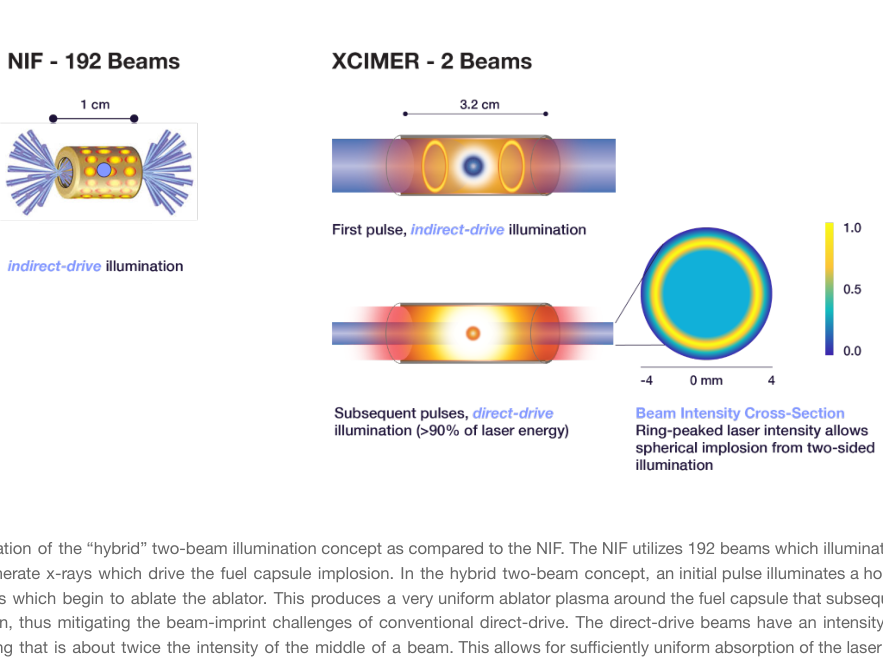

in Xcimer’s laser architecture.

### Xcimer’s Chamber Design

The materials, chamber survivability, and byproduct stream challenges discussed above makes clear the ideal scenario
for a fusion reactor leading to minimum operating cost, complexity, and licensing challenges:

●​ Utilize a very low-activation low-Z metal/molten salt thick-liquid (eg., Li, FLiBe, FLiNaK) first wall to protect all
reactor components with at least tens of centimeters of liquid material. This has the added advantage of capturing
all of the fusion energy directly in the liquid, which bypasses challenges with divertors in magnetic fusion devices,
as well as enabling high tritium breeding ratios with natural lithium (~1.2 with FLiBe).
●​ Produce as little vaporized mass as possible from fusion energy release with a minimum amount of activatable
material.

Of all fusion approaches considered to date with high scientific maturity, the HYLIFE concept comes closest to achieving
these two goals. HYLIFE stands for High-Yield-Lithium-Injection-Fusion-Energy, and it was put forward by LLNL in the
mid to late 1970s. (See Fig. 10) In this approach a low activation liquid (molten lithium in the first concept) rains down in a
showerhead configuration, and an inertial fusion target is injected through small gaps in the flow and illuminated by two
beams when at chamber center. This first concept considered either laser or ion beams and approximately 1 shot per
second repetition rate with over 1 gigajoule of yield per shot and virtually complete capture of all neutrons in the
thick-liquid wall [43,44] . This “HYLIFE-1” first design concept focused on the reactor, with little discussion of how to build a
laser or ion beam driver to enable it. A primary challenge with the driver was providing multi-megajoule energy levels with

43 M. Monsler et al., Electric Power from Laser Fusion: The HYLIFE Concept,” Proc. 13th Intersociety Energy Conversion Conf., San Diego, CA, August 20-25,
1978; see also LLNL Report UCRL-1259 (1978)

44 J.A. Blink et al., “The High-Yield Lithium-Injection Fusion-Energy (HYLIFE) Reactor,” LLNL Report UCRL-53559 (1985).

just two beams; this would put severe requirements on final optics for a conventional laser and final magnetic guides for
an ion beam.

**Fig 10. Left:** Original 1972 HYLIFE-1 design from LLNL. In operation, a pellet is injected along the beam axis though a slit in the molten lithium waterfall
and illuminated when at chamber center. The fusion burst is contained inside the lithium flow. The 14 MeV neutrons produced from fusion are
moderated down to a fission-like spectrum by the lithium before contacting solid surfaces. X-rays and target debris plasma are absorbed on the inner
lithium jets, producing lithium vapor which vents through the array of jets and fills the chamber, recondensating before the next shot. Gravity clears the
chamber of spray and droplets before the next shot, allowing the beams to propagate to the subsequent target. Hot lithium with bred tritium is pumped
out of the bottom of the chamber. **Right:** As no driver could enable HYLIFE-1, the design evolved to HYLIFE-2 with over 100 beams and higher rep rate
(6 Hz) operation. This led to significant complications related to chamber clearing and protecting structural plasma facing components around the
plethora of beams. The design envisioned large oscillating slabs of FLiBe (as opposed to lithium) to sweep out the chamber to clear droplets, as 6 Hz
was too fast for gravity clearing. The design was ultimately abandoned due to these complications.

By the 1990s, no driver existed that could enable the HYLIFE-1 two-beam illumination geometry, so the design evolved
to HYLIFE-2 [45], which envisioned utilizing 120 beams with lower total beam energy and a higher repetition rate of 6 Hz [46] .
This change put severe challenges on the liquid flow and chamber clearing, leading to oscillating jet designs to sweep
out liquid droplets and force fast recondensation of vaporized liquid, all while allowing gaps for 120 beams through liquid
jets. Ultimately, by the mid-2000s the HYLIFE concept was abandoned by LLNL, which subsequently pursued the LIFE
dry-wall concept [47] .

Xcimer’s laser architecture can provide a driver that can enable the original two-beam, low repetition rate concept,
driving a spherical implosion with 2-sided illumination from a very small final aperture, as described above. A depiction of
an Xcimer power plant capable of producing hundreds of MWe to over 1 GWe is shown in Fig. 14, with an evolution of
the chamber design looking back to the original HYLIFE-1 concept [48] .

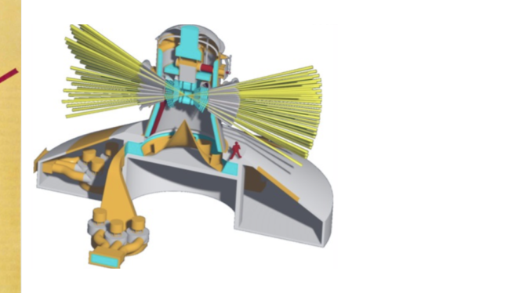

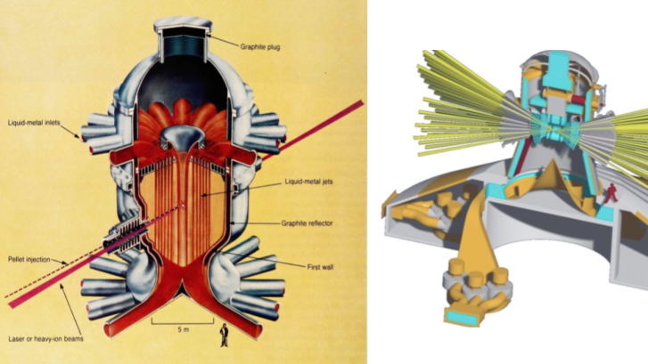

45 R.W. Moir et al., "HYLIFE-II: A Molten-Salt Inertial Fusion Energy Power Plant Design - Final Report," Fusion Technology, 25, 5-25 (1994)

46 The design also switched to FLiBe as the working liquid instead of lithium, due to safety and tritium retention difficulties with lithium.

47 J. F. Latkowski et al., “Chamber design for the Laser Inertial Fusion Energy (LIFE) engine,” Fusion Science and Technology, vol. 60, no. 1, pp. 54–60, 2011,
doi: 10.13182/FST10-318.

48 A commonly cited challenge is injecting a target into vacuum and engaging it with a laser at a repetition rate of at most once a second. While this
technology must be developed with high shot-to-shot reliability, it is illuminating to consider that TRUMPF’s CO2 laser inside ASML lithography machines fires
50,000 times per second hitting a small tin droplet that is in-flight in a vacuum. This is a more challenging problem in some ways than engaging a fusion
target.

Xcimer is building on a significant amount of past work on the HYLIFE concept, which was extensively investigated by
LLNL and UC Berkeley over the years [49,50] . Detailed simulations have been performed showing gigajoule fusion yields can
be contained by a thick-liquid wall, and jet experiments have been implemented with water and oils as substitute for hot
FLiBe showing laminar jets can be generated, which are required to prevent droplet and spray from blocking laser
beampaths. Xcimer has confirmed much of this past work with further detailed simulations, with analysis indicating that
less than 10 kg of FLiBe will be vaporized from a few-GJ fusion burst and that this vapor can readily vent through FLiBe
jets with pressure loadings on chamber structures well below stress limits [51,52] . Additionally, analysis indicates the total
tritium inventory will be less than 200 grams in the GWe-scale commercial system (and under 150 grams in Xcimer’s 400
MWe “Athena” pilot plant), leading to a safer operating profile and lower licensing costs [53] . Finally, analysis indicates that
FLiNaK can be used in commercial plants in place of FLiBe, avoiding beryllium supply chains. This is due to Xcimer’s
large fuel capsules providing sufficient neutron multiplication from (n,2n) reactions in the deuterium coupled with
near-complete capture of fusion neutrons by the liquid wall, with an estimated TBR of 1.05. The first Athena pilot plant
will certainly use FLiBe providing a TBR of approximately 1.2.

However, many challenges lay ahead and development is still needed across several areas, for example, FLiBe pump
and nozzle technology and redox control to prevent corrosion. Xcimer will be taking on these hydraulic and chemical
challenges in lieu of the material science and nuclear challenges associated with dry-wall chambers.

In summary, many fusion approaches still face significant material science, engineering, and architectural challenges to
deploying a practical, economic, reliable, and safe power plant. Xcimer’s two-beam laser architecture is uniquely
compatible with a thick-liquid wall, enabling better neutron capture, excellent tritium breeding, reduced material damage
and activation, and exceptionally low tritium inventory, all of which collectively offer a more commercially viable
fusion-chamber pathway.

49 M. Monsler and W Meier, “A conceptual design strategy for liquid-metal-wall inertial fusion reactors,” Nuclear Engineering and Design, 63(2) 289-313
(1981).

50 R.W. Moir et al., "HYLIFE-II: A Molten-Salt Inertial Fusion Energy Power Plant Design - Final Report," Fusion Technology, 25, 5-25 (1994).

51 “Multi-material simulation of chamber dynamics in inertial fusion energy systems,” Eric Cervi, Antonio Cammi, Carlo Fiorina, Kirk Flippo, Nahom
Habtemariam, Matteo Lo Verso, Thanh Hua, International Journal of Heat and Mass Transfer 128389 (2026)

52 “Numerical simulation of compressible fluid-dynamics in the chamber of inertial fusion energy systems,” Eric Cervi, Antonio Cammi, Carlo Fiorina, Kirk
Flippo, Nahom Habtemariam, Matteo Lo Verso, International Journal of Heat and Mass Transfer 241, 126700 (2025)

53 Malone et al, “Approach to startup inventory for viable commercial fusion power plant” (Fusion Engineering and Design, 206, 114563, 2024.

## Roadmap to Deployment of Laser Inertial Fusion Energy

| | Phoenix | Anvil | Vulcan (high-yield facility) | Athena |
|---|---|---|---|---|
| | 1-2 kJ | 200 kJ | 4 MJ (initial) 12 MJ (upgrade) | 8 MJ on-target 400 MWe output |
| | Q2 2026 | 2028 | 2031 (initial) | 2035 |
| | Denver, CO, USA | Denver, CO, USA (planned) | TBD | TBD |

Fusion is challenging, and humanity is still many years away from commercially deploying fusion power. Xcimer's goal is to minimize risk on the back-end of the development roadmaps as well as ensure its commercial systems will have highly competitive economics. This is accomplished by adopting the most proven confinement and ignition method, which has already been demonstrated to scale to commercially relevant fusion gains, while utilizing almost complete thick-liquid-wall protection to minimize fusion chamber materials challenges, maintenance complexity, and waste streams. As compared to other approaches, this moves the majority of overall risk forward to the development of a laser driver that can enable the above, which is where Xcimer's key innovations lie. Xcimer has a four-phase roadmap to retire key risks, mass produce excimer laser systems, and drive this technology to commercialization:

**1 Phoenix.** The Phoenix laser prototype system is under construction now at Xcimer's facility in Denver, CO, with completion on track for early Q2 2026. Phoenix is a 75,000 square-foot facility with three goals: 1) demonstrating and validating the operation of excimer lasers at long pulse lengths (microsecond-scale) on the "LPK" laser platform, 2) developing, demonstrating, and beginning vertical integration of a new Marx pulsed power technology that will drive all future Xcimer KrF laser modules, and 3) demonstrating and validating the ability to use Stimulated Brillouin Scattering in an NLG gas mirror for pulse compression at scales relevant to inertial fusion. The largest excimer amplifier in the Phoenix facility, the "KJC," utilizes Xcimer's new Marx technology (a Marx is shown in Fig. 8) and will produce output energies approaching 2 kJ at 248 nm. Phoenix will soon be the largest and highest-energy use of SBS worldwide, and validate the key scientific and engineering aspects of Xcimer's laser architecture.

[Figure 11: Left: Construction progress on the Phoenix system, planned for completion in early Q2 2026, and Right: A company photo.]

**Fig 12.** Xcimer’s prototype Phoenix laser system,
under construction and almost complete in
Denver, CO, USA. Phoenix will be the world’s
highest-energy and largest utilization of
Stimulated Brillouin Scattering, and demonstrate
the ability to use Stimulated Brillouin Scattering
NLO gas mirrors to generate laser pulses with the
optical properties needed to drive inertial fusion
targets. The prototype SBS NLO gas mirror in
Phoenix is the 40-meter gas cell in the upper right,
in which a low-energy short-duration seed beam
(depicted in orange) will cross a high-energy
long-duration pump (depicted in purple) produced
by the KJC laser.

## 2 Anvil. Xcimer’s next laser facility is codenamed Anvil. Anvil will begin with the construction and demonstration of

Argos, a full-scale commercial excimer amplifier module with an output energy well over 100 kJ. The output from Argos
will be used to drive a demonstrator IFE beamline, delivering 100 kJ in a single beamline to a target chamber and
diagnostic suite. An identical beamline will then be constructed 180 degrees opposed to provide a 2-sided geometry
with 200 kJ on-target. Anvil will demonstrate Xcimer’s laser architecture at full commercial scale and allow experimental
validation of laser-target coupling for Xcimer’s unique two-beam direct-drive approach and other engineering
uncertainties. Anvil will also support component lifetime development and test stands. An upgrade plan will demonstrate
the pulse repetition rates needed for IFE, as well as a prototype target injector system. Anvil is expected to be completed
in 2028, with the above-mentioned upgrades complete by the end of the decade.

**Fig 13.** Progression of Xcimer’s laser amplifier
modules. LPK (at lower left) was brought online in
December 2024. KJC (in center) came online in
December 2025, both in Xcimer’s Denver
headquarters. Argos, with an output energy of
160 kJ as shown, is targeted for 2027 in Xcimer’s
Anvil facility, and will be the largest and
highest-energy single laser amplifier ever built.

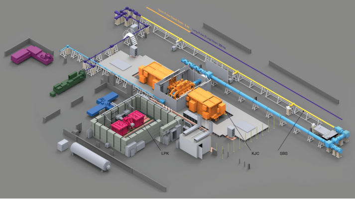

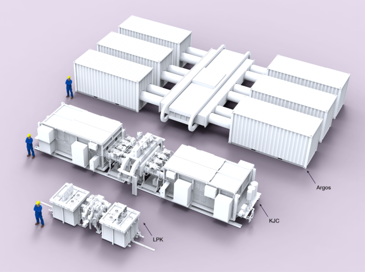

## 3 Vulcan. Vulcan will be the world’s highest-energy and most powerful laser system, using stacks of Argos modules to

drive two high-fluence NLO compression beamlines. Initially delivering 4 MJ to target from two sides, Vulcan will be
upgradeable to 12 MJ. With initial operations commencing by the end of 2030, Vulcan’s goal is to achieve wall-plug
breakeven by the end of 2031. After breakeven is demonstrated, Vulcan will continue to serve as a testbed and validation
platform for future commercial target designs, as well as support scientific and national security missions.

## 4 Athena. Athena will be the first operational laser-fusion pilot power plant, producing about 400 MW electric by

repetitively firing the laser and igniting a fuel capsule just under once per second, capturing the resulting thermal energy
in the molten salt blanket, and then ultimately generating steam. With sufficient funding for parallel development of
needed industrial-scale technologies (e.g. FLiBe pumps), Athena can be operational by the mid-2030s

**Fig 14** . A depiction of an Xcimer laser inertial fusion power plant based on a design for a fusion pilot plant submitted to the US DOE Milestone Fusion
Program, with a thick-liquid-wall fusion chamber, two KrF laser bays, and NLO gas mirror and pulse compression systems prominently featured.
Commercial Xcimer IFE power plants will operate at 0.25 to 1 Hz with laser energies in the range of 8 to 12 MJ, producing hundreds of MWe to well
over 1 GWe with recirculating power fractions under 15%.

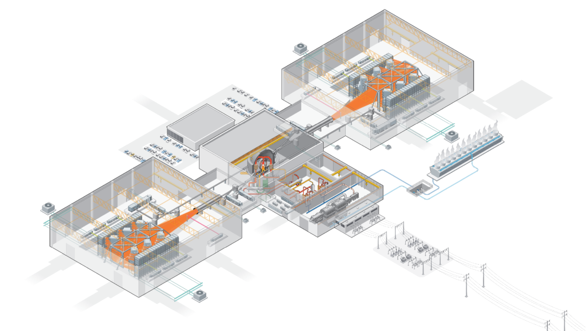

## **Next Steps**

Today, laser-inertial fusion is the most experimentally validated form of fusion energy, thanks to the successful
demonstration and accomplishments at the National Ignition Facility. And, diode-pumped solid state lasers are the most
well-understood and established technology for building a laser capable of igniting an inertial fusion fusion fuel capsule
with sufficient laser efficiency. Yet even better fusion performance than demonstrated by the solid-state NIF is still
needed for a commercially viable laser fusion power plant. A laser fusion power plant also needs to solve the “first-wall
problem,” to avoid destroying its own structure during operation, and the optical damage problem, to avoid destroying its
own laser optics. Finally, even if all these problems can be solved, the cost of building a suitable laser system using a
solid state laser architecture may be prohibitive, with a capital cost floor in the range of $700 to $1,000 per joule of laser
light on-target even with very aggressive assumptions and investment in scaling supply chains.

Xcimer is developing a combination of technologies and a roadmap to overcome these challenges.

●​ **A larger fuel capsule driven with up to 12 MJ of laser energy, to achieve commercially relevant performance.**
This enables commercially relevant gain (>200) from a larger, more robust, less sensitive fuel capsule using the same
ignition mechanism as utilized on the NIF. These large capsules are less sensitive to non-uniform drive, and can be
symmetrically imploded with just two high-energy laser beams, 180 degrees apart.
●​ **A thick-liquid-wall chamber to solve the first-wall problem.** The two-sided, high-brightness laser geometry allows
the use of a thick-liquid wall to shield the structural wall of the chamber from fusion neutrons, allowing Xcimer to
avoid first-wall replacement and the ensuing capital cost, maintenance, and availability consequences.
●​ **Achieve an overall laser hardware cost under $100 per joule.** By replacing diode-pumped solid-state
architectures with gas-excimer lasers and nonlinear optical systems, Xcimer “replaces glass with gas” and thus
removes the most expensive and complex elements from the IFE laser system. Xcimer’s laser technology offers the
potential for both lower costs and faster time-to-market than the dominant technology, and would significantly
improve the economics of construction of a laser-fusion power plant.
●​ **Operate final optics well below laser damage thresholds.** By performing final seed pulse amplification via
nonlinear optical interaction in a gas medium _after_ the final optic, Xcimer avoids any optical element in the system
subject to damaging fluences, thus avoiding the need for an optical refurbishment or replacement system or the
need to go to very large (many tens to hundreds of square meters) total aperture into the target chamber.
●​ **Achieve an overall laser wall-plug efficiency of 5% to 7%.** An Nth of a kind system producing 250 target gain
(Qsci) with a 7% laser efficiency will have a recirculating power fraction in the range of 11% to 13%.

The basic elements of Xcimer’s laser architecture are not new; the system leverages ideas and systems which have been
proposed and studied for decades. But by combining these concepts in a new way, Xcimer offers the potential to rapidly
develop and deploy a technology that bypasses some of the most significant problems and risks associated with fusion.

Xcimer’s path is not without risk itself. Most significantly, Xcimer must demonstrate that this laser architecture, never
before built at MJ-scale, can deliver on the performance, cost and other advantages as outlined in this paper. And
beyond the laser, there remain years of work and challenges to engineer an integrated power plant that can realize these
advantages in a reliable, working system that can be scaled across the world. But if these challenges can be met, the
benefits will be worth the effort.

_The authors wish to thank Dr. Hagen Zimer, CEO of Laser Technology at TRUMPF, for his support and attention in_
_engaging on these topics_

