## **Conceptual Design of HTS Magnets for Fusion Nuclear Science Facility** 

Yuhu Zhai[a] , Danko van der Laan[b] , Patrick Connolly[a] , Charles Kessel[c] 

_aPrinceton Plasma Physics Laboratory, Princeton, NJ bAdvanced Conductor Technologies, Boulder, CO, USA cOak Ridge National Laboratory, Oak Ridge, Tennessee, USA_ 

Second-generation high temperature superconductors (HTS) are available for producing >20 T at magnet bore compared to 13-16 T for lower temperature superconducting (LTS) toroidal field magnets proposed in recent studies of the Fusion Nuclear Science Facility (FNSF). HTS may enable higher fusion power density and smaller device size. High current density cables of multi-layered REBCO tapes have achieved >10 kA at 4-20 K operation in short sample tests for fusion. High current density cables are required for engineering design of the next step FNSF to allow space for interior plasma components. HTS magnets with high current densities are particularly attractive in reducing the size of a device, beneficial for compact tokamaks, due to their space constraints. Successful HTS magnet development may enable the design of smaller and cheaper fusion pilot plants with mission of demonstrating net electricity. It may also offer significant cost and performance advantages in non-fusion applicants such as nuclear magnetic resonance (NMR) and magnetic resonance imaging (MRI). We developed HTS design options in the fusion energy systems studies (FESS) for the FNSF in order to define the coil size, winding pack mechanical loading and engineering requirements. Partnering with vendors in US industry, PPPL is performing the high current cable prototyping and testing activities aiming at enabling low cost cable technology toward 100 A/m[2] engineering current density desired in high field prototype coil development for compact fusion pilot plants. 

Keywords: High Temperature Superconductor, Fusion Nuclear Science Facility, Fusion Magnets. 

## **1. Introduction** 

Fusion Nuclear Science Facility (FNSF) is part of the US effort to bridge science and technology gaps between ITER, currently under construction in south of France and the fusion power pilot plants. FNSF accommodates an extreme fusion neutron environment for operating significantly higher neutron fluence over the machine lifetime, and a smaller size but in higher magnetic fields of longer pulses than ITER. The FNSF studies focus on the complex integration of fusion nuclear components into an extreme neutron environment and various nuclear material aspects of the power plant relevant interactions in steady state operations [1]. 

The low temperature superconducting (LTS) magnet design options for the FNSF were developed early in the fusion energy systems studies (FESS) using a baseline design point of the 7.5 T field at plasma center [2-3]. Figure 1 presents the cross sectional view of the FNSF. 

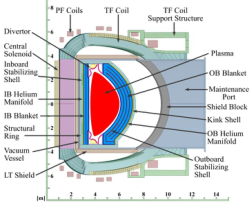

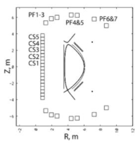

High Temperature superconductor (HTS) has been identified in the recent community plan for fusion energy 

[4] as the potential game changer for enabling higher fusion power density and a smaller device size for FNSF and future fusion pilot plants (FPP). Enabling high field HTS magnets, however, is one of the main engineering challenges for optimizing the machine size and system performance of advanced tokamaks such as the FNSF [4-5]. PPPL is partnering with the US industry in the fusion magnet community to identify driving issues in a pre-conceptual design of the high field HTS magnets for FNSF, which involve significant R&D efforts as prerequisite to its design. 

The high current density HTS cables of multi-layered REBCO tapes have achieved >10 kA at 4-20 K operation in short sample tests for fusion [6-7]. High current density cables are required for engineering design of the next step FNSF and compact FPP to allow space for interior plasma components [1-3]. A conductor on round core (CORC) cable insert solenoid was recently tested at currents exceeding 4 kA in 14 T background magnetic field [8]. Despite recent HTS cable advancements, the coil quench detection and protection and winding pack stress management remain to be the two outstanding issues for the large scale HTS applications for fusion. 

Guided by the US systems code analysis in FESS, we developed a conceptual toroidal field magnet design using HTS technology for the FNSF to access a target of 9 T higher field on the plasma center, so to demonstrate potential opportunities to de-risk fusion pilot plants in compact radial build for the FNSF. We report what HTS can offer for the FPP in terms of defining a coil winding pack size, mechanical loading and magnet engineering 

________________________________________________________________________________ Corresponding author’s email: yzhai@pppl.gov_ 

design requirements for the high field FNSF. The results of the HTS magnet design is compared with the LTS options in terms of the radial build space, winding pack current density, conductor and coil cooling scheme, well as quench protections. Neutron radiation affects the superconductor, the copper stabilizer and coil insulation performance, it also creates potential activations issues which are discussed in this paper. 

Ic (77K, s.f.) = 137 A and a minimum Ic of 800 A at 4.2 K, 6 T. Potential issues with the REBCO tape include its Ic angular dependence [11] or performance anisotropy, the transverse load effects impose a ~200 MPa stress limit on the tape without Ic performance degradation [14], delaminations of the tape at high fields due to the screening currents; non-uniform current distribution [6], as well as challenges in implementing an effective cooling design. Unlike the brittle Nb3Sn wire, the coated conductor has a much higher axial tensile strength that makes it attractive for high field fusion applications. 

## **2. System Design Parameters** 

## **2.1. In-board Radial Build** 

The FNSF is smaller in size than a DEMO or ITER but generates a higher toroidal magnetic field for the plasma confinement [9]. It also runs at a 30 times higher neutron fluence with 3 orders of magnitude longer duration of plasma operation at higher operating temperatures for the structures surrounding the plasma [1-3]. A baseline system design point was chosen for the detailed magnet system analysis with R = 4.8 m, a = 1.2 m, Ip = 7.9 MA, Bt = 9 T, normalized beta < 2.7, n/NGr = 0.9, FBS = 0.52, q95 = 6.0, H98 = 1.0 and Q = 4.0. Table 1 presents the FNSF system design point parameters. Fig. 2 shows the FNSF radial build from systems code studies. 

## **2.3. High Current Density Cables** 

High current superconducting cables are used for fusion to reduce coil inductance and ensure that large TF magnets are protected during quench [6-7]. The FNSF TF coil design considered the use of a conductor on round core (CORC) cable developed by the Advanced Conductor Technology (ACT). The cable design being considered includes a cable wound from 50 tapes of mm width, containing the 50 um substrates for the High Field (HF) region; a cable wound of 38 tapes for the Middle Field (MF) region, and a cable consisted of 24 tapes for the Lower Field (LF) region. The CORC cable performance is scaled for an operating current of Iop (70% Ic) = 10.67 kA at 4.2 K, 20 T. The overall cable current density is maintained to be over 150 A/mm[2] which is 3 times higher than the ITER LTS TF cable. A 6-around-1 CORC cable-in-conduit conductor (CICC) is also considered for the TF winding pack to achieve performance of 64 kA at 4.2 K, 20 T. Table 2 presents the CORC cable parameters used for TF coils. Fig. presents the single CORC CICC operating at 10.7 kA and a 6-around-1CORC CICC of over 64 kA. 

Table 1.  FNSF System Design Point Parameters 

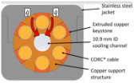

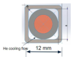

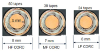

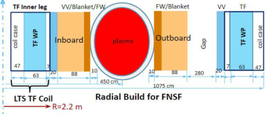

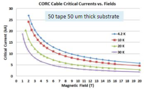

Fig. 2 The FNSF radial build [1-3] 

## **2.2. High Temperature superconductors** 

The REBCO coated conductor is now commercially available in long length and it is becoming increasingly mature and attractive for high field applications [10]. tremendous progress has been made over the past years on the improvement of REBCO tape critical current performance. The recently updated tape ( _SuperPower M4-396_ ) performance has a minimum critical current 

Fig. 4. The Ic performance of a 50 tape 50 μ m substrate CORC 

![Fig. 5. A  section of the sample CORC cable from ACT [8]](images/tmpd435w5gg.pdf-0003-00.png)

Fig. 4 and Fig. 5 present the single cable performance and a short CORC cable test sample. The 5 mm diameter copper core used is based on the minimum bend radius for the YBCO tape. The minimum bend radius for the CORC cable is more than 20 cm which is much lower than the radius in the upper and lower region FNSF TF coil transition. 

## **2.4. FNSF Magnet System** 

The FNSF magnet system consists of the 16 TF coils wedged together at the in-board leg, a central solenoid to generate a required 100 Weber double flux swing and a 7 sets of poloidal field coils. Unlike ITER, the mission FNSF is focused on the fusion nuclear aspects and thus requires a sufficiently high performance near steady state plasma with long durations and high duty cycles. Fig. presents the magnetic field distribution on the FNSF coil system. A free standing central solenoid coil is initially considered but a bucked and wedged TF-OH design selected for a better structural support of TF inboard leg and OH coils as well as radial build space constraints [2]. The upper and lower TF coils are widely separated as the result of the FNSF horizontal maintenance scheme of a large equatorial port on the outer leg side of the vacuum vessel. 

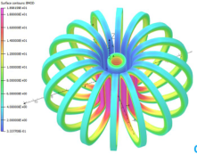

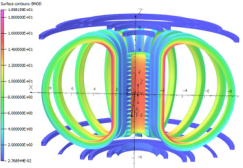

## **3. Toroidal Field Magnets** 

The wedged TF coil design initially considered for the in-board leg coil support structure relies on wedge pressure to take the large centering force from the TF magnet system. Fig. 7 shows the single HTS TF coil and the inboard leg cross section in the FNSF radial build where a large nose is required for reacting to the coil vertical force. 

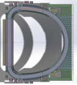

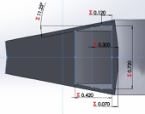

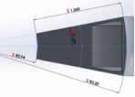

## **3.1. TF Winding Pack Layout** 

For the TF coil winding pack, the forced flow liquid helium cooling in a CICC configuration was investigated. An advanced gas cooling and the conduction cooling scheme is also considered but more challenging issues such as the cooling efficiency and uniformity are to be resolved when applying to large scale fusion coils. The 6-around-1 CORC CICC is presented in Fig. 8 with a conductor grading in the winding pack layout. It is a 36 mm diameter square conductor with 5 mm corner radius. The central cooling channel diameter is 10.9 mm and the CORC cable dimension is adjusted from high to low field regions enhance structural integrity of the TF winding pack by an increase of the jacket thickness. A thicker cable is needed with more tapes in the high field region while less number of tapes is needed to give space for a thicker jacket in the low field region to react to the transverse Lorentz force accumulation from high to low field regions. The TF field drops quickly radially in the inboard leg as shown in Fig. 8. The conductor grading is adopted for coil structural optimization. A similar single CORC cable CICC design is also presented to achieve a higher CICC current density (~80 A/mm[2] ). 

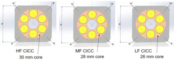

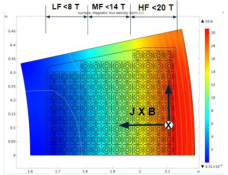

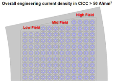

The first option for the TF winding pack design is single CORC CICC of the 8 mm diameter cable with 50 YBCO tapes. The cable is supported in the 12 mm square CICC jacket as shown in Fig. 2. For a TF coil design of 10.67 kA (4.2K, 20T) operating current (70% critical current), the total number of turns is over 1500 for the High Field of 14-20 T, Mid Field of 8-14 T and the Low Field of <8 T. The second option is using the 64 kA 6-around-1 CICC for the winding pack where a total number of turns is lower for a reduced inductance for coil protection during quench. A total stored energy over 50% higher than the ITER TF coil as summarized in Table 4. The total centering and vertical forces are 2-2.5 times higher than that in the ITER TF coil inboard leg. The inductance per TF coil drops to 1.85 H, which is comparable to ITER TF coil if a 6-around-1 CICC using the CORC cable is selected for winding pack design shown in Fig. 8. 

Table 4.  TF Coil Parameters 

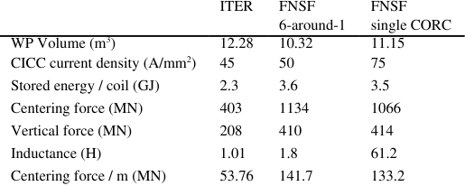

**----- Start of picture text -----** 
|||||||
|---|---|---|---|---|---|
|ITER|FNSF|FNSF|
|6-around-1|single CORC|
|WP Volume (m|[3]|)|12.28|10.32|11.15|
|CICC current density (A/mm|[2]|)|45|50|75|
|Stored energy / coil (GJ)|2.3|3.6|3.5|
|Centering force (MN)|403|1134|1066|
|Vertical force (MN)|208|410|414|
|Inductance (H)|1.01|1.8|61.2|
|Centering force / m (MN)|53.76|141.7|133.2|

**----- End of picture text -----** 

**3.2. Winding Pack Stress Analysis** 

Stress management in a TF coil winding is a critical issue for HTS fusion magnet design. There are generally two approaches to support the high current cables in the CICC winding pack. A sufficient volume of coil support structure is necessary to ensure an acceptable winding pack stress distribution. This can be realized by either thicker jacket so each CICC turn in the inboard leg can be independently supported in the high field region so to minimize accumulation of the transverse Lorentz force from layer to layer toward the machine center, or build-in conductor support structure such as the radial plate used in the ITER TF winding design. The stress analysis for the TF in-board leg also demonstrated such a built-in radial plate like support structure can improve winding stress management in a high field coil in-board leg. Fig. 9 presents the Von Mises stress distribution the TF leg cross section. 

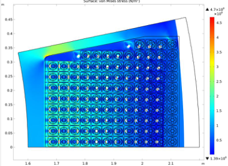

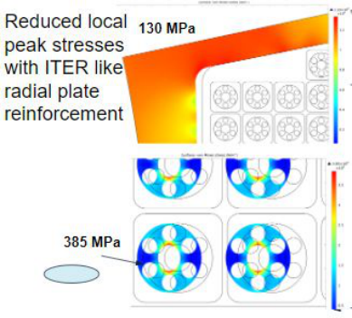

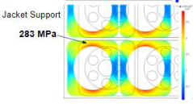

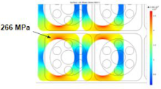

A high local stress concentration is observed without the ITER-like radial plate as reinforcement to mitigate the transverse Lorentz force accumulation from HF to LF regions. Fig. 10 presents the local stress distribution the CICC jacket and the CORC cable support structure. 

## **3.3. Structures and Cooling Scheme** 

The forced flow liquid helium cooling in the CICC with parallel flow in the TF winding pack is considered. Influence of flow rate to the design of a parallel flow scheme is developed by 1D Helium pipe flow model. The inductive and thermal couplings between strands during quench and current sharing and non-uniform current distribution due to a variation of contact pressure are being investigated. The support structure shall be effectively isothermal with the cooling channel wall, and the helium flow. Issues identified include how to keep contact pressure more uniform so a reasonably uniform thermal and electrical resistance among tapes can be used in a high current cable configuration. As designed, the void space between the jacket and tapes in HTS cables can be too narrow for a coolant flow, heat dissipated entirely by the copper core in a high current cable format for fusion applications. 

## **3.4. Radiation and Activation** 

The FNSF core components will expose significantly higher neutron fluence than ITER so activation issues shall be addressed. The neutron irradiation to LTS and HTS materials and the radiation limits were studied [2-3]. The coil insulation and copper stabilizer in the superconductors limits are also presented. An issue of copper stabilizer lower radiation limit is a design driver. For the YBCO used in fusion magnets, the silver action, which is the neutron interaction resulting in the release of secondary radiation, depends on the effective cross section and the neutron energy of interaction. The main activations from the 4% silver in YBCO tape include 

two isotopes[107] Ag(n, γ )[108] Ag and[109] Ag(n, γ )[110] Ag and the resultant activation are[108] Cd,[110] Cd. Figure 9 presents the effective cross section from silver activation analysis from neutron energy of 0.0253 eV and 14 MeV and neutron fluence of 10[22] per m[2] . The results show that only a very small fraction of silver is activated and the impact to the HTS performance is almost negligible. 

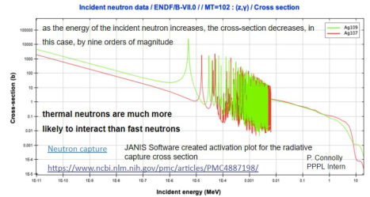

## **4. Conclusions** 

Fusion Nuclear Science Facility is an intermediate step to accommodate the extreme fusion nuclear environment and address the complex integration of components the high fluence nuclear environment and plasma physics requirements. HTS such as REBCO is available for high field, high current density FNSF TF magnet design. The single CORC and 6-around-1 CICCs are presented here for the TF coil winding pack design. The HTS magnets provide high field access for FNSF plasma operation. Further investigations will focus on identifying structural issues for the integrated coil systems and the HTS coil quench management. Stress results on CICC jackets and the CORC cable support structure also imply that further studies on improving the winding pack current density are also possible and will be beneficial. 

- wires for use in high-field magnets and power systems a decade after their introduction,” _Supercond. Sci. Technol.,_ 32, 033001, https://doi.org/10.1088/1361-6668/aafc82, 2019. 

- [7] Z.S. Hartwig et al., “VIPER: an industrially scalable high-current high-temperature superconductor cable,” _Supercond. Sci. Technol.,_ 33, 11LT01, https://doi.org/10.1088/1361-6668/abb8c0, 2020. 

- [8] D. C. Van Der Laan et al., “A CORC cable insert solenoid: the first high-temperature superconducting insert magnet tested at currents exceeding 4 kA in 14 background magnetic field,” _Supercond. Sci. Technol.,_ 33, 05LT03, 

- https://doi.org/10.1088/1361-6668/ab7fbe,2020. 

- [9] K. Sedlak et al., “Advance in the conceptual design of the European DEMO magnet system,” _Supercond. Sci. Technol.,_ 33, 044013, 

https://doi.org/10.1088/1361-6668/ab75a9, 2020. 

- [10] Y. Zhang et al., “Progress in Production and performance of second generation (2G) HTS wire for practical applications,” _IEEE Trans. Appl. Supercond.,_ 24 (5), October, 2014, Art no. 7500405. 

- [11] X. Zhang et al., “Study of critical current and n-values of 2G HTS tapes: Their magnetic field-angular dependence,” J. of Superconductivity and Novel Magnetism, 31, 3847-3854, 2018, https://doi.org/10.1007/s10948-018-4678-8. 

- [12] K. Sedlak et al., “Advance in the conceptual design of the European DEMO magnet system,” _Supercond. Sci. Technol.,_ 33, 044013, https://doi.org/10.1088/1361-6668/ab75a9,2020. 

- [13] T. Mulder et al., “Recent progress in the development of CORC cable-in-conduit conductors,” _IEEE Trans. Appl. Supercond.,_ 30 (4), June, 2020, Art no. 4800605. 

- [14] D.C. van der Laan et al., “Effect of transverse compressive monotonic and cyclic loading on the performance of superconducting CORC cables and wires,” _Supercond. Sci. Technol.,_ 32, 015002, https://doi.org/10.1088/1361-6668/aae8bf, 2019. 

## **Acknowledgments** 

This work is supported by US DOE Contract No. DE-AC-02-09CH11466. The project is being accomplished through a collaboration of DOE Laboratories, universities and industry. 

## **References** 

- [1] C. E Kessel et al, Overview of the Fusion Nuclear Science Facility, a credible break-in step on the path fusion energy, _Fusion Eng. Des._ , 135, 236-270, 2017. https://doi.org/10.1016/j.fusengdes.2017.05.081 

- [2] Y. Zhai et al, “Conceptual magnet design study for fusion nuclear science facility”, _Fusion Eng. Des_ ., 135, 324-336, 2018. https://doi.org/10.1016/j.fusengdes.2017.06.028 

- [3] Y. Zhai et al, “High performance superconductors for Fusion Nuclear Science Facility”, _IEEE Trans. Appl. Supercond.,_ 27 (4), June, 2017, Art no. 4200505, doi: 10.1109/TASC.2016.2627010. 

- [4] “A community plan for fusion energy and discovery plasma sciences,” APS-DPP 2020. link 

- [5] F. Dahlgren et al., “The AERIES-AT Magnet Systems”, _Fusion Eng. Des._ , 80, 139-160, 2006. 

- [6] D.C. van der Laan et al., “Status of CORC cables and 

