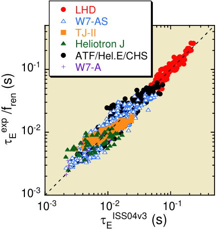
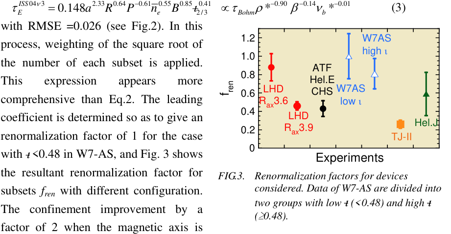
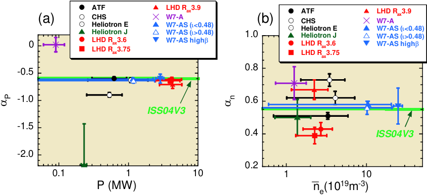
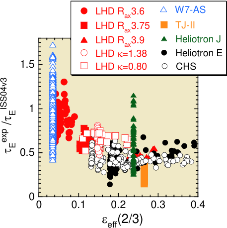
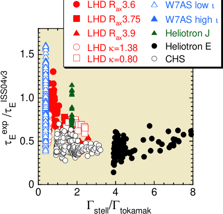

## **Confinement Study of Net-Current Free Toroidal Plasmas Based on Extended International Stellarator Database** 

H.Yamada 1), J.H.Harris 2), A.Dinklage 3), E.Ascasibar 4), F.Sano 5), S.Okamura 1), J.Talmadge 6), U.Stroth 7), A.Kus 3), S.Murakami 8), M.Yokoyama 1), C.D.Beidler 3), V.Tribaldos 4), K.Y.Watanabe 1) 

- 1) National Institute for Fusion Science,Toki,Gifu 509-5292, Japan 

- 2) Australian National University, Canberra, Australia 

- 3) Max-Planck-Institut für Plasmaphysik, EURATOM Association, Greifswald, Germany 

- 4) CIEMAT, Madrid, Spain 

- 5) Institute of Advanced Energy, Kyoto University, Uji, Kyoto, Japan 

- 6) University of Wisconsin, Madison, USA 

- 7) University of Kiel, Kiel, Germany 

- 8) Department of Nuclear Engineering, Kyoto University, Kyoto, Japan 

e-mail contact of main author: hyamada@lhd.nifs.ac.jp 

**Abstract.** International collaboration of a stellarator confinement database has been progressing. About 2500 data points from major 9 stellarator experiments have been compiled. Robust dependence of the energy confinement time on the density and the heating power has been confirmed. Dependences on other operational parameters, i.e., the major and minor radii, magnetic field and the rotational transform ~~ι~~ , have been evaluated using inter-machine analyses. In order to express the energy confinement in a unified scaling law, systematic differences in each subgroup should be quantified. An _a posteriori_ approach using the confinement enhancement factor on ISS95 yields a new scaling expression ISS04v03; _ISS_ 04 ν 3 2.33 0.64 − 0.61 0.55 0.85 0.41 τ _E_ = 0.148 _a R P ne B_ ι 2/3 . Simultaneously, the configuration dependent parameters are quantified for each configuration. The effective helical ripple shows correlation with these configuration dependent parameters. 

## **1. Introduction** 

Stellarators are widely recognized as the main alternative to the tokamak as a toroidal fusion reactor. A large experiment has extended parameters, and theoretical and design studies have developed advanced configurations for the next generation of experiments. The configuration space of possible stellarator designs is so large that comparative studies of experimental behavior are important to making choices that lead to an attractive reactor. Both experimental and theoretical confinement studies have been intensively conducted in a variety of concepts for a long time. 

In 1995, a collaborative international study used available data from medium-sized stellarator experiments, i.e. W7-AS, ATF, CHS, and Heliotron-E to derive the ISS95 scaling relation for the energy confinement time [1] 

_ISS_ 95 2.21 0.65 − 0.59 0.51 0.53 0.4 τ _E_ = 0.079 _a R P ne B_ ι 2/3 (1) with the root mean square error (RMSE) in the logarithmic expression of 0.091. Here the units of τ E, _P_ and ~~_n_~~ _e_ are s, MW and 10[19] m[-3] , respectively, and ~~ι 2~~ /3[ is the rotational ] 

transform at _r/a_ = 2/3. This expression is dimensionally correct and can be rephrased into an expression by important non-dimensional parameters, 

τ _EISS_ 95 ∝ τ _Bohm_ ρ * − 0.71 β− 0.16 ν _b_ * − 0.04 , where ρ * and ν b* are defined by the ion gyro radius normalized by the plasma minor radius and the collision frequency between electrons and ions normalized by the bounce frequency of particles in the toroidal ripple, respectively. β is the ratio of the plasma kinetic pressure to the magnetic field pressure. ISS95 is characterized by a weak gyro-Bohm nature and no definitive dependence on β and collisionality. Since ISS95, new experiments, i.e., LHD [2], TJ-II [3], Heliotron J [4], and HSX [5], most with different magnetic configurations, have started. In LHD, parameter dependences similar to ISS95 have been found but there exists a systematic improvement on it [6]. Also, collisionality independence like that in ISS95 has been confirmed in the deep collisionless regimes ( ν b* ≈ 0.05) when geometrical optimization of neoclassical transport is applied [7]. Confinement improvement with divertor operation also has been taken into account for W7-AS [8,9]. Extension of the confinement database aims at confirmation of our previous understanding of ISS95 and examination of possible new trends in confinement performance of stellarators. We have started to revise the international stellarator database, incorporating these new data, so as to deepen understanding of the underlying physics of confinement and its relationship to magnetic configuration details and improve the assessment of stellarator reactors. 

## **2. Extension of International Stellarator Confinement Database** 

About 2500 data points have been compiled in the database to date from nine stellarators, i.e., ATF, CHS, Heliotron E, 10[-2] Heliotron J, HSX, LHD, TJ-II, W7-A and W7-AS. 1747 data representing typical discharges have been used for this study. The largest device, LHD ( _R_ / _a_ = 3.9 m/ 0.6 m) has extended the parameter regime to LHD CHS 10[-3] Reactor W7-AS H-E substantially lower ρ * and ν b* regimes ATF which are 3-10 × closer to the reactor 10[-2] 10[-1] 10[0] 10[1] 10[2] * regimes than those of the mid-size devices ν b [10] (Fig .1). Heliotron lines (Heliotron E, _FIG.1. Parameter regime of data in the_ ATF, CHS and LHD) have colinearity _international stellarator database on the_ between the aspect ratio and the rotational _space of normalized gyro radii_ ρ _* and collisionality_ ν _b*._ transform ~~ι .~~ This obtains because the transform scales as the number of toroidal field periods _M_ , which scales as _R/a_ . Therefore, 

the ~~ι~~ dependence tends to be statistically unstable for the data from heliotrons. W7-AS alone, which has contrasting ~~ι~~ profile to heliotrons, can not provide the size and ~~ι~~ dependences simultaneously. In the extended database, however, data from the flexible heliac TJ-II allows us to investigate the ~~ι~~ dependence over a much larger variation (1.3 < ~~ι~~ < 2.2) than is available in the other experiments. Data from HSX has not been employed yet in the present combined analysis since non-thermal electrons characterize plasma confinement there. 

The present database contains scalar data of parameters described in ref.[1], the format of which is similar to the ITER H-mode database [11]. The web page of the international stellarator confinement database is jointly hosted by National Institute for Fusion Science and Max-Planck-Institut für Plasmaphysik, EURATOM Association, and available at http://iscdb.nifs.ac.jp/ and http://www.ipp.mpg.de/ISS. 

## **3. Towards a Unified Scaling** 

A simple regression analysis of the entire data set (except for HSX) using the same parameters as in ISS95 yields 

τ _EREG_ = 0.30 _a_ 2.07 _R_ 1.02 _P_ − 0.60 _ne_ 0.58 _B_ 1.08 ι 2/3 − 0.16 ∝ τ _Bohm_ ρ * − 1.95 β 0.14 ν _b_ * − 0.18 (2) with RMSE = 0.101. This expression is characterized by very strong gyro-Bohm as a similar analysis of heliotron lines has suggested [12], and a weak negative dependence on the rotational transform. The former trend is attributed to the fact that the energy confinement time in LHD with smaller ρ * (in other words, larger dimension) is better than the gyro-Bohm prediction in comparison with other heliotrons. However, application of expression Eq.2 to data from a single device leads to 

contradictory results. For example, comparison of dimensionally-similar discharges in LHD indicates that the transport lies between Bohm and gyro-Bohm scalings [6]. Rotational transform scans in TJ-II also show that τ E is proportional to the power of 0.35-0.6 [13], which contradicts the weak ~~ι~~ dependence of Eq.2. It is also pointed out that Eq.2 is not dimensionally correct. 

We conclude that while Eq.2 is useful for unified data description as a reference, its application is limited to the available data set alone and is not valid 

**----- Start of picture text -----** 
LHD W7-AS TJ-II Heliotron J ATF/Hel.E/CHS 10 [-1] W7-A 10 [-2] 10 [-3] 10 [-3] 10 [-2] 10 [-1] ISS04v3 τE  (s)  (s) ren  /f exp E τ **----- End of picture text -----** 

_FIG.2. Comparison of energy confinement in experiments and predicted by ISS04v3. Experimental data is corrected by a renormalization factor fren.._ 

for extrapolation. Data inspection and experience from inter-machine studies suggest necessity to introduce a magnetic configuration dependent parameter in order to supplement the set of regression parameters and resolve this seemingly contradictory result. A systematic gap between W7-AS and heliotron/torsatrons was noted during the earlier studies on the ISS95 scaling. A recent example showing the pronounced effect of magnetic configuration variation even in a single device has come from comparison of the performance of configurations with shifted magnetic axes in LHD. A discharge with an inward shift of the magnetic axis from _Rax_ =3.9 m to _Rax_ =3.6 m, results in a doubling of τ _E_ for similar operational parameters _a_ , _P_ , ~~_n_~~ _e_ , _B_ and ~~ι~~ [6]. Therefore, acceptance of a systematic difference in different magnetic configurations is a prerequisite for derivation of a useful unified scaling law. A deterministic parameter characterizing the magnetic configuration has not been identified yet, but certainly involves the details of the helically corrugated magnetic fields. Since the configuration dependent parameter is not available now, an enhancement factor on ISS95 is first used expediently for renormalization to describe the magnetic configuration effect. This process is based on the conjecture that parametric dependence expressed by ISS95 is robust for stellarators and the enhancement factor on ISS95 reflects some configuration effects. One renormalization factor is defined by the averaged value of experimental enhancement factors for each configuration (subset). Iteration of a regression analysis of data normalized by this factor specific to configurations tends to converge into the following expression : 

**----- Start of picture text -----** 
τ EISS 04 ν 3 = 0.148 a 2.33 R 0.64 P − 0.61 ne 0.55 B 0.85 ι 2/30.41 ∝ τ Bohm ρ * − 0.90 β− 0.14 ν b * − 0.01 (3) with RMSE =0.026 (see Fig.2). In this 1.2 W7AS process, weighting of the square root of high ι 1.0 the number of each subset is applied.  ATF 0.8 This  expression  appears  more  Hel.E 0.6 LHD CHS W7AS comprehensive than Eq.2. The leading  R ax3.6 low ι 0.4 coefficient is determined so as to give an  LHD Hel. J renormalization factor of 1 for the case  0.2 Rax3.9 TJ-II 0 with  ι [<0.48 in W7-AS, and Fig. 3 shows ] Experiments the resultant renormalization factor for FIG.3.  Renormalization factors for devices subsets  fren  with different configuration.  considered. Data of W7-AS are divided into two groups with low  ι (<0.48) and high ι The confinement improvement by a ( ≥ 0.48). factor of 2 when the magnetic axis is ren f **----- End of picture text -----** 

shifted from _Rax_ =3.9 m to _Rax_ =3.6m in LHD can be seen clearly. The systematic difference for the cases with high rotational transform ~~( ι~~[>0.48) and low one (] ~~[ι]~~[<0.48) in W7-AS has ] been also found in this analysis. 

The robustness of the unified expression can be checked by examining its dependence on individual parameters. Figure 4 (a) and (b) show the exponent of density and heating 

**----- Start of picture text -----** 
ATFCHS LHD RW7-A ax3.9 ATF LHD Rax3.9 0 (a) Heliotron EHeliotron JLHD RLHD Raxax3.63.75 W7-AS (W7-AS (W7-AS hi ιι <0.48)>0 g h .48) β 1.0(b) CHSHeliotron E Heliotron J LHD RLHD Raxax3.63.75 W7-AW7-AS ( W7-AS ( W7-AS high  ι ι <0.48) >0.48) β 0.8 -0.5 -1.0 0.6 ISS04V3 -1.5 0.4 ISS04V3 -2.0 0.2 0.1 1 10 1 10 P (MW) _ne(10 [19] m [-3] ) P n α α **----- End of picture text -----** 

_FIG.4.  Exponents of (a) heating power and (b) density dependences in each subgroup with their parameter ranges._ 

power dependences, i.e., τ _E_ ∝ _P_ α _p_ ~~_n_~~ _e_ α _n_ in a single experiment (configuration) with their parameter ranges, respectively. In these analyses, parameter dependences other than the density and the heating power are fixed as described by ISS04v03. Although some subgroups show significant deviation from the scaling, this discrepancy occurs mainly at low − 0.61 0.55 parameter values. Therefore, density and power dependences like τ _E_ ∝ _P_ ~~_n_~~ _e_ can be found as general trends in subgroups. On the contrary, the magnetic field dependence in subgroups appears not to be consistent with ISS04v03. Therefore the magnetic field scaling is a result of inter machine regressions, which means that its statistical nature is different from variable quantities like power and density. 

## **4. Discussion** 

These results motivate future directions for stellarator confinement studies. The first step is clarification of the hidden physical parameters to interpret the renormalization factor shown in Fig.3. It is reasonable to suppose that this renormalization factor is related to specific properties of the helical field structure of the devices. A leading candidate is the effective helical ripple, ε eff [14], which is defined from the neoclassical flux in the 1/ ν regime, 

**----- Start of picture text -----** 
LHD R 3.6 W7-AS ax LHD R 3.75 TJ-II ax LHD R 3.9 Heliot ron J ax LHD κ=1.38 Heli ot ron E 1.5 LHD κ=0.80 CH S 1 0.5 0 0 0.1 0.2 0.3 0.4 εeff(2/3) ISS04v3 E τ  / exp E τ **----- End of picture text -----** 

_FIG.5.  Confinement enhancement factor as a function of_ ε _eff at r/a=2/3._ 

which is proportional to ε _eff_ 3/ 2 . The values of ε eff have been calculated rigorously by the numerical codes, DCOM [15], DKES[16] and MOCA[17]. These codes have been successfully benchmarked for several configurations [18]. Figure 5 shows the correlation of ε eff with the enhancement of confinement times with respect to the unified scaling law -0.4 ISS04v3. The upper envelope resembles an ε eff dependence, however, detailed studies on ε eff behaviour are required as the data indicate, e.g. large scattering of W7-AS and Heliotron J data. Also the expression of a power law of ε eff diverges to infinity when it approaches zero (ideal tokamak case). Hence, a simple power law is expected to fail. Although all data in the database are not located in the collisionless regime where the neoclassical transport is enhanced, ε eff can be related to effective heating efficiency through the neoclassical-like losses of high energetic particles and anomalous transport through flow damping due to neoclassical viscosity. Also neoclassical conduction loss of ions should be carefully looked into although the anomalous transport is generally predominant in electron heat transport. Due to the aforementioned reasons, an incorporation of that factor to a unified scaling is premature at present. 

The second potential geometrical parameter is that given for the neoclassical flux in the plateau regime. This factor corresponds to the effect of elongation in tokamaks. The formulation is available in ref.[19] and here the geometrical factor that is the ratio of dimensionless fluxes in the cases of stellarator with many harmonics and tokamaks with only toroidal ripple, i.e., Γ _stell_ / Γ _tok_ is considered. Figure 6 shows the correlation of this plateau factor Γ _stell_ / Γ _tok_ with the enhancement of confinement times with respect to the unified scaling law ISS04v3. The envelope of 

the data shows the trend that a smaller factor of Γ _stell_ / Γ _tok_ leads to good confinement although the scattering of data is larger than in the case of ε eff. It should be note that there is colinearity between ε eff and Γ _stell_ / Γ _tok_ generally. However, an elongation scan in LHD ( κ =0.8-1.38) has excluded this colinearity, which has not indicated significance of Γ _stell_ / Γ _tok_ dependence (compare open squares and open circles in Fig.6). Therefore, ε eff is more likely to be the essential configuration factor than is the plateau factor Γ _stell_ / Γ _tok_ . 

**----- Start of picture text -----** 
LHD Rax3.6 W7AS low ι LHD Rax3.75 W7AS high ι LHD R 3.9 Heliot ro n J ax LHD κ=1.38 Heliot ro n E 1.5 LHD κ=0.80 CHS 1.0 0.5 0 0 2 4 6 8 Γ /Γ stell tokamak ISS04v3 E τ  / exp E τ **----- End of picture text -----** 

_FIG.6.  Confinement enhancement factor as a function of the plateau factor at r/a=2/3._ 

**EX/1-5** 

## **5. Conclusions** 

International collaboration on the stellarator confinement database has progressed significantly. About 2500 data points from 9 major stellarator experiments have been compiled. Robust dependence of the energy confinement time on the density and the heating power have been confirmed, and dependences on other operational parameters, i.e., the major and minor radii, magnetic field and the rotational transform ~~ι~~ , have been evaluated using inter-machine analyses. In order to express the energy confinement in a unified scaling law, a systematic offset between each configuration data subgroup must be admitted. This factor is correlated with the magnetic geometry. A confinement enhancement factor on ISS95 is used for a posteriori approach. This procedure converges into the ISS04v03 expression; _ISS_ 04 ν 3 2.33 0.64 − 0.61 0.55 0.85 0.41 τ _E_ = 0.148 _a R P ne B_ ι 2/3 . 

The configuration dependence of confinement can usefully be expressed as a renormalization factor for ISS04v03. There are many potential candidates for this configuration factor: the effective helical ripple, the neoclassical flux in the plateau regime, fractions of direct-loss orbits and trapped particles, etc. In studies to date, the effective helical ripple shows correlation with the confinement enhancement factor. 

While the explicit incorporation of this factor in a unified scaling is still premature, the correlation encourages a systematic comparative study of other potential configuration -dependent effects on stellarator confinement. The results of such studies will provide important guidance for the optimization of stellarator configurations and operational techniques. 

## **Acknowledgements** 

We are grateful to the LHD, W7-AS, TJ-II, Heliotron-J and HSX experimental groups for their contribution to the updated international stellarator database. In particular, discussions and communications with Drs. R.Brakel, V.Dose, K.Ida, Y.Igithkhanov, H.Maassberg, D.Mikkelsen, Y.Nakamura, R.Preuss, F.Wagner, A.Weller and K.Yamazaki are appreciated. The international stellarator database activity is organized under the auspices of IEA Implementing Agreement for Cooperation in Development of the Stellarator Concept. 

## **References** 

- [1]  STROTH, U., et al, Nucl. Fusion **36** (1996) 1063. 

- [2] IIYOSHI, A., et al., Nucl. Fusion 39 (1999) 1245. 

- [3]  ALEJALDRE, C., et al., Plasma Phys. Control. Fusion **41** (1999) A539. 

- [4]  OBIKI, T., et al., Nucl. Fusion **41** (2001) 833. 

- [5]  ANDERSON, F.S.B., et al., Fusion Technol. **27** (1995) 273. 

- [6]  YAMADA, H., et al., Nucl. Fusion **41** (2001) 901. 

- [7]  YAMADA, H., et al., Plasma Phys. Control. Fusion **43** (2001) A55. 

- [8] MCCORMICK, K., et al., Phys. Rev. Lett. **89** (2002) 015001. 

- [9]  WELLER, A., et al., Plasma Phys. Control. Fusion **45** (2003) A285. 

- [10] MOTOJIMA, O., et al., Nucl. Fusion **43** (2003) 1674. 

- [11] ITER PHYSICS BASIS, Nucl. Fusion **39** (1999) 2175. 

- [12]  YAMAZAKI, K., et al., in proc. 30th EPS Conf. on Contor. Fusion and Plasma Phys. (St.Petersburg, 7-11 July 2003) ECA Vol.27A, P-3.16. 

- [13]  ASCASIBAR, E., et al., to appear in Nucl. Fusion. 

- [14]  BEIDLER, C.D. and HITCHON, W.N.G., Plasma Phys. Control. Fusion **36** (1994) 317. 

- [15]  MURAKAMI, S., et al., Nucl. Fusion **42** (2002) L19. 

- [16]  VAN RIJ, W.I., HIRSHMAN, S.P., Phys. Fluids B **1** (1989) 563. 

- [17]  TRIBALDOS, V., Phys. Plasmas **8** (2001) 1229. 

- [18] BEIDLER, C.D., et al., in proc. 30th EPS Conf. on Contor. Fusion and Plasma Phys. (St.Petersburg, 7-11 July 2003) ECA Vol.27A, P-3.2. 

- [19] RODRIGUEZ-SOLANO RIBEIRO, SHAING, K.C., Phys. Fluids **30** (1987) 462. 

